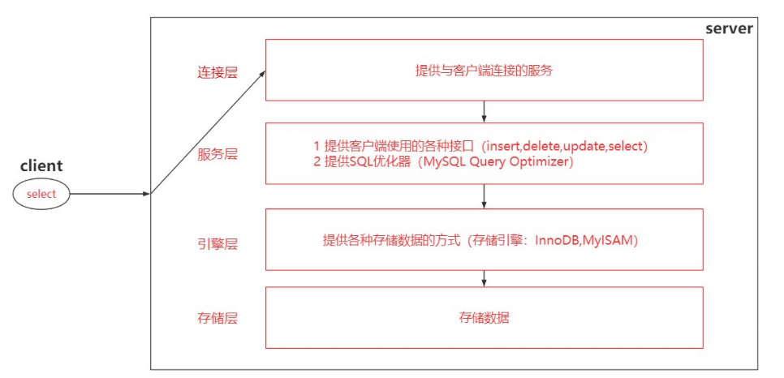
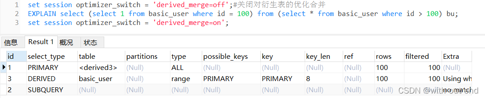
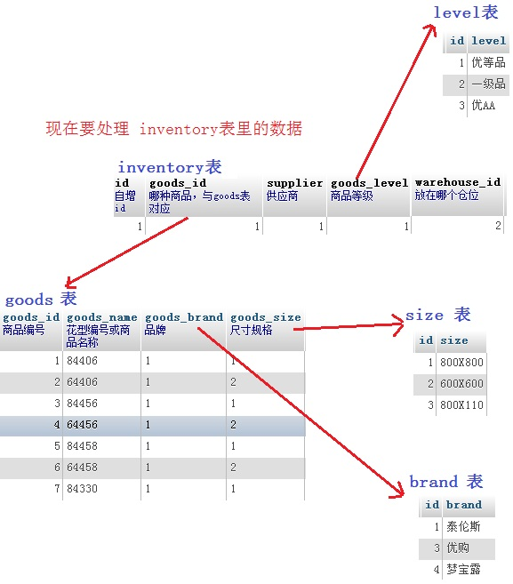

# mysql入门

------


# 1. 基础

## 1.1 数据库的位置


<center>图1.1数据库在软件开发中的位置</center>

## 1.2数据库类型

### 1.2.1关系型(Structured Query Language)

它是把复杂的数据结构归结为简单的二元关系（即二维表格形式）。eg：Mysql  Oracle SqlServer

- Mysql和Oracle数据库（关系型数据库），互联网运维最常用的是MySQL 

- 通过SQL结构化查询语句存储数据 

- 保持数据一致性方面很强，ACID理论

### 1.2.2非关系型（NoSql，Not Only sql）

以高性能和使用便利为目的功能特异化的数据库产品。高性能和高并发对数据一致性要求不高，eg：Memcache Redis  MongoDB

- NOSQL不是否定关系数据库，而是作为关系数据库的一个重要补充 
-  NOSQL为了高性能、高并发而生，忽略影响高性能，高并发的功能 
- NOSQL典型产品memcached （纯内存），redis（持久化缓存），mongodb（文档的数据库）

## 1.3 Mysql的安装目录

- bin——可执行的操作。
- data——存数据库和数据表
- share——系统的文件
- .ini等——数据库的配置文件


##  1.4 配置环境变量

退出：exit | quit | ctrl + c

清屏：cls 

查看版本：mysql --version

```my
mysql -uroot [-hlocalhost] -proot
```

## 1.5 sql语句书写规则

1. 分号结尾，可以用delimiter重新定义结束符。

2. 关键词不区分大小写

3. 注释，#注释，--空格 注释，/\*注释\*/

    

### 1.5.1 语句结束符delimiter

其实就是告诉MySQL解释器，该段命令是否已经结束了，mysql是否可以执行了。默认情况下，delimiter是分号。在命令行客户端中，如果有一行命令以分号结束，那么回车后，mysql将会执行该命令。

```mysql
DELIMITER $$   #除了结束符外，此句后面不能加任何的符号，不然会连带认为它是结束符。
SQL语句块,多个sql语句
$$ #语句块结束
DELIMITER ;   #恢复;为语句结束符
```

### 1.5.2 [命名规范](<https://www.cnblogs.com/weiguoaa/p/8952943.html>)

第一条必须遵从

1. 库名、表名、字段名必须使用小写字母，并采用下划线分割

      ① MySQL有配置参数lower_case_table_names=1，即库表名以小写存储，大小写不敏感。如果是0，则库表名以实际情况存储，大小写敏感；如果是2，以实际情况存储，但以小写比较。

      ② 如果大小写混合使用，可能存在abc，Abc，ABC等多个表共存，容易导致混乱。

      ③ 字段名显示区分大小写，但实际使⽤时不区分，即不可以建立两个名字一样但大小写不一样的字段。

      ④ 为了统一规范， 库名、表名、字段名使用小写字母。

 

2. 库名以 d 开头，表名以 t 开头，字段名以 f_ 开头

      ① 比如表 t_crm_relation，中间的 crm 代表业务模块名

      ② 视图以view_开头，事件以event_开头，触发器以trig_开头，存储过程以proc_开头，函数以func_开头

  ③普通索引以idx_col1_col2命名，唯一索引以uk_col1_col2命名（可去掉f_公共部分）。如 idx_companyid_corpid_contacttime(f_company_id,f_corp_id,f_contact_time)

 

3. 库名、表名、字段名禁止超过32个字符，需见名知意

      库名、表名、字段名支持最多64个字符，但为了统一规范、易于辨识以及减少传输量，禁止超过32个字符

 

4. 临时库、表名须以tmp加日期为后缀

       如 t_crm_relation_tmp0425。备份表也类似，形如 _bak20160425 。

#  2.基本语法

## 2.1 数据类型

- 数值型
  - 整数型
    - tinyint（1byte，有符号：-2<sup>7</sup>~2<sup>7</sup>-1，无符号：0~2<sup>8</sup>-1，以下依次类推）
    - smallint（2byte）
    - mediumint（3byte）
    - int（4byte）
    - bigint（8byte）
  - 小数型（m-总长的位数，d-小数的位数）
    - 浮点型（不精确，通常不设定长度）
      - float(m,d)（4byte）
      - double(m,d)（8byte）
    - 定点型（精确，通常需要设定长度）
      - decimal(m,d)

- 字符串型

  - char(n-长度非字节，定长，少了空格补，多了截断，存取效率比varchar高)——定长字符串，0~255byte

  - varchar(n，依据字符长度自动调整，)——变长字符串，0~65535byte

  - tinytext——短文本字符串，0~2<sup>8</sup>-1byte

  - text——长文本字符串，0~2<sup>16</sup>-1byte

  - mediumtext——中等长文本，0~2<sup>24</sup>-1byte

  - longtext——极大文本数据，0~2<sup>32</sup>-1byte

  - enum——枚举

  - set——集合

    注：

    1. length——返回字符串所占的字节数
    2. char_length——返回字符串所占的字符数，一个汉字算三个字符，数字和字母算一个字符

- 日期时间型

  - DATE     3byte      YYYY-MM-DD          日期值

  - TIME     3byte        HH:MM:SS          时间值或持续时间

  - YEAR   1byte        YYYY                     年份值

  - DATETIME  8byte  YYYY-MM-DD HH:MM:SS   混合日期时间

  - TIMESTAMP  8byte YYYY-MM-DD HH:MM:SS   混合日期时间值，时间戳

    注：建议用int存时间戳

## 2.2 列名的修饰

- unsigned 无符号数

- auto_increment 自增长，必须指定为主键

- default 默认值

- comment 解释说明

- not null 非空限制

- 索引修饰顶（索引相当于目录）

  - unique（唯一索引）

  - index（普通索引）

  - **primary key（主键）：单字段主键和多字段联合主键**

    - primary key 字段名后面声明主键约束
    - primary key(field1[,field2...]) ，当主键是由多个字段组成时，不能直接在字段名后面声明主键约束。

    

## 2.3 [sql语句的运算符和函数](<https://blog.csdn.net/yuan13826915718/article/details/52314804>)

- 算术运算符：+、-、*、/、商（a div b）、余（a mod b）
- 比较运算符：赋值和判断( = )  不等于( !=   <> )  <  >  <=  >=  BETWEEN  IN   IS NULL  LIKE  REGEXP
- 逻辑运算符：NOT( ! ) OR( || )  AND( && ) XOR ( ^ ) 
- BETWEEN...AND，
- IN  在范围内， NOT IN  不在范围内

## 2.4 sql语句分类

1. DDL（Data Defination Language）   数据定义语言，增，删，改，库表结构
2. DML（Data Manipulation Language）   数据操作语言 ，增，删，改，表记录
3. DCL（Data Control Language）数据控制语言， 用户的创建和授权
4. DQL（Data Query Language）数据查询语言，查询表记录

# 3.DDL数据定义语言

## 3.1 库操作

1. 查看所有数据库——SHOW DATABASES
2. 切换数据库——USE DATABASENAME
3. 创建数据库——CREATE DATABASE DATABASENAME
4. 删除数据库——DROP DATABASE DATABASENAME

## 3.2 表操作

1. 查看当前库所有表——SHOW TABLES

2. 创建表

   ```mysql
   CREATE TABLE TABLENAME(
   
   id int unsigned not null auto_increment comment '用户id',#primary key也可以直接跟在字段的修饰，本来索引就是一种修饰
   
   user_name varchar(20) not null comment '用户名',
   
   age tinyint unsigned not null comment '用户年龄',
   
   balance decimal(10,2) not null default 0.00 comment '用户余额',
   
   create_at timestamp not null comment '注册时间',
   
   primary key(id)
   
   );
   #创建临时表，默认情况下，当你断开与数据库的连接后，临时表就会自动被销毁。当然你也可以在当前MySQL会话使用 DROP TABLE 命令来手动删除临时表。
   CREATE TEMPORARY TABLE TABLENAME(...);
   ```

3. 查看表结构——DESC TABLENAME

4. 查看创建表语句——SHOW CREATE TABLE TABLENAME

5. 删除表——DROP TABLE TABLENAME

6. 修改表（ALTER)

   ```mysql
   #修该表名
   ALTER TABLE TABLEOLDNAME RENAME TO TABLENEWNAME;#TO可有可无
   #修改字段的修饰
   ALTER TABLE TABLENAME MODIFY user_name varchar(50);
   #修改字段名和修饰
   ALTER TABLE TABLENAME CHANGE email user_email varchar(50) not null;#这里不能只修改名，需要同时将修饰加上
   #添加字段
   ALTER TABLE TABLENAME ADD password char(32) not null comment '用户密码' AFTER user_name;#添加的位置也可以定位
   ALTER TABLE TABLENAME ADD id INT UNSIGNED auto_increment PRIMARY KEY FIRST;#添加到第一列
   #删除字段
   ALTER TABLE TABLENAME DROP fieldname
   ```

# 4.DML数据操作语言

​	对表记录的操作（表记录的增删改）

```mysql
#创表
CREATE TABLE user(
    id int unsigned not null auto_increment primary key,
    user_name varchar(20) not null,
    password varchar(32) not null,
    email varchar(50) not null,
    mobile char(11) not null,
    fee decimal(10,2) default 0.00 not null,
    age tinyint unsigned not null,
);
```


## 4.1 增（INSERT）记录

```mysql

#完整的一条记录，不用写自增长的id，键和值要一一对应
INSERT INTO user(user_name,password,email,mobile,fee,age) values('jack',password('123456'),'jack@163.com','1388888888',123.11,25);

#字段不一定要完整
INSERT INTO user(user_name,email) values('liudehua','liudehua@163.com');

#省略键，必须所有字段名，按序书写，要写自增长的字段
INSERT INTO user values(3,'liming',password('123456'),'liming@163.com','1388888888',456,12);

#批量插入记录
INSERT INTO user(user_name,email）values('liudehua','liudehua@163.com'),('yuanlongping','yuanlongping@163.com')；
                 
```

## 4.2 改（UPDATE）记录

```mysql
#修改某一字段的全部值
UPDATE user SET age=100;

#修改满足条件的记录的字段值
UPDATE user SET age=200 WHERE id=1;

#修改在范围内的记录
UPDATE user SET user_name='guofucheng' WHERE id IN(2,4,6);
UPDATE user SET mobile=‘13696269400’ WHERE id BETWEEN 2 AND 5;

#修改某条记录多个字段
UPDATE user SET mobile='12456789013',password='weilaikeqi' WHERE id=6;


```

重要场景：如果插入行出现唯一索引或者主键重复时

ON DUPLICATE KEY UPDATE：如果插入行出现唯一索引或者主键重复时，则执行旧的update；如果不会导致唯一索引或者主键重复时，就直接添加新行。
REPLACE：如果插入行出现唯一索引或者主键重复时，则delete老记录，而录入新的记录；如果不会导致唯一索引或者主键重复时，就直接添加新行。

## 4.3 删（DELETE）记录

```mysql
#清空表记录
DELETE FROM user;#索引会接着原来的最大值自增长
TRUNCATE user;#索引从1开始

#删除满足条件的记录
DELETE FROM user WHERE id=6;
```

# 5 DCL数据控制语言

修改权限后都需要

FLUSH PRIVILEGES

去刷新权限，然后，权限的修改才有效。

## 5.1 设置root用指定的ip访问

```mysql
#本质数据库连接，默认ip地址是localhost
Mysql -u用户名 -hip地址 -p密码；
#查看所有数据库，其中有一个mysql数据库，里面放了一些数据库用户和权限的信息
SHOW DATABASES;
USE mysql;
#查看mysql数据库中所有的表，其中有一个user的表，里面放了数据用户的登录信息
SHOW TABLES
#通过DML，可以改变里面的ip，就可以控制root可以访问的ip地址，
```

| user |   host    |
| :--: | :-------: |
| root | 127.0.0.1 |
| root | localhost |

```mysql
#修改表后，刷新权限就改变了
FLUSH PRIVILEGES
```

这样设置后，数据库更安全

## 5.2修改数据库密码及忘记密码的解决方案

```mysql
#1.知道数据库密码，进行修改

    #方案1，已经进入了数据库，后修改密码
    USE mysql;
    SELECT user,host,password FROM user;
    UPDATE user SET password=PASSWORD('明文密码') WHERE user='root';
    #mysql 5.7 以后，password字段就变为authentication_string；
    #故修改密码需要改为
    UPDATE user SET authentication_string=PASSWORD('明文密码') WHERE user='root';
    FLUSH PRIVILEGES;
    EXIT;#退出后按新密码登录即可

    #方案2，没有进入数据库
    mysqladmin -uroot -p旧密码 password 新密码;


#2.不知道数据库密码，进行修改密码

    #关闭mysql
    #打开第一个命令窗，执行下面语句
    mysqld --skip-grant-tables

    #打开第二个命令窗
    #这次不需要密码，直接mysql就能进
    mysql
    #然后进行修改密码的操作————方案1

    #然后关闭第一个命令窗，关闭mysql，再进即可


#查看数据库的活动链接
NETSTAT -AN

```

## 5.3 管理普通用户

```mysql
#登录root超级用户，才能进行下面的操作

#1.创建子用户
    CREATE user '用户名' @'IP地址' IDENTIFIED BY '明文密码';#指定ip登录
    CREATE user '用户名' @'%' IDENTIFIED BY '明文密码';#不指定ip
    FLUSH PRIVILEGES;

#2.给用户授权
    GRANT 权限1 权限2.. ON 数据库名.* TO '用户名' @'ip地址或%';
    #所有数据库——*.*
    #所有权限——ALL PRIVILEGES

    #创建和授权同时进行
    GRANT 权限1 权限2.. ON 数据库名.* TO '用户名' @'ip地址' IDENTIFIED BY '明文密码'

    #eg:
    GRANT INSERT DELETE UPDATE ON shop.* TO 'TEST' @'192.168.199';
    #追加查询权限
    GRANT SELECT ON shop.* ON SHOP.* TO 'TEST' @'192.168.199';


#3.权限撤回
REVOKE 权限1 权限2.. ON 数据库.* FROM '用户名' @'ip地址或者%';

#4.查看权限
SHOW GRANTS FOR '用户名' @'ip地址';

#5.删除用户
DROP USER '用户名' @'ip地址';

SELECT * FROM 数据库名.表名
```

# 6.DQL数据查询语言

```mysql
#1.基础查询
SELECT 列名1,列名2.. FROM 表名 [WHERE 条件];
#查询所有字段——*
#不带WHERE 条件 ——查所有记录

#2.过滤DISTINCT
#过滤重复的列值
SELECT DISTINCT(列名1) FROM 表名;#不加括号也行

#3.连接CONCAT
SELECT CONCAT(列名1，列名2...) FROM 表名;

#4.重命字段名AS
#并未改动表结构，只做查询出结果的展示用
SELECT 字段名1 AS 字段名1新名[,字段名2 AS 字段名2新名,...] FROM 表名

#5.计算字段,
#并未改动表结构，只做查询出结果的展示用。字段名之间可以做计算，然后输出展示
SELECT 数值计算|字符计算 AS 展示名 FROM 表名
eg:
SELECT 列名1+(列名2*3-1) AS 展示名 FROM 表名
SELECT CONVERT(CHAR(2),数值类型列名)+'个' AS FROM 表名

#6.条件字段
select 
a.*,
(case a.state when 1 then '修' when 2 then '修2'　end ) as dess
 from tablename as　a ;
```

## 6.1 条件查询(WHERE)

条件查询就是在查询时给出WHERE子句，在WHERE子句中可以使用一些运算符及关键字

- =、!=、<>、<、<=、>、>=——关系运算
- BETWEEN…AND、NOT BETWEEN....AND——范围
- IN(set)——在集
- IS NULL——为空
- IS NOT NULL——不为空
- AND、OR、NOT ——逻辑

**[先执行(写) ON，后执行 WHERE；ON 是建立关联关系（建立大表），WHERE 是对关联关系的筛选（从大表中筛选）](<https://www.jianshu.com/p/d923cf8ae25f>)**。

需要注意having和where的用法区别：

1. having只能用在group by之后，对分组后的结果进行筛选(即使用having的前提条件是分组)。
2. **where肯定在group by 之前。**
3. where后的条件表达式里不允许使用聚合函数，而having可以

## 6.2 模糊查询(LIKE)

关键字：
- _ ——代表任意一个字符
- %——代表任意0~n个字符

结合LIKE，并组合其他字符使用，

```mysql
#eg:
SELECT * FROM user 
WHERE name LIKE '___';#匹配任意3个字符
WHERE name LIKE '__s';#匹配任意2个字符且第3个字符为s
WHERE name LIKE 'm%';#匹配以m开头的字符

```

LIKE 查询影响性能，数据量在十万以内，还能接受，数据量再高就不行了，

**正则查询**

```mysql
SELECT id FROM user WHERE num REGEXP "^[0-9]";#匹配首字符为数字
```

^—匹配字符串首之前，$—匹配字符串尾之后

[正则参考](<https://blog.csdn.net/u013158317/article/details/101758431>)

**Sphinx（斯芬克斯）**是一个基于sql的全文检索引擎，他可以提供比数据库更专业的检索功能。

## 6.3 排序查询

1. 使用ORDER BY查询的时候，排序是在最后完成。
2. ORDER BY子句是最后一个执行的子句
3. ORDER BY 至少可以对数值类型，日期类型（日期越靠近后，越大），字符串类型（大些字母>小写字母>特殊字符>数字）进行排序
4. 在ORDER BY之中可以设置多个排序的字段，如果排在前面的字段顺序相同，则会按照第后面的字段进行排序
5. ORDER BY有两种排序模式：ASC、DESC

```mysql
SELECT * FROM 表名 ORDER BY 列名1 ASC | DESC[,列名2 ASC | DESC,...];#默认ASC，可以不加
```

## 6.4 聚合查询

1. 每个组函数接收一个参数（字段名或者表达式） ``统计结果中默认忽略字段为NULL的记录``
2. ``要想列值为NULL的行也参与组函数的计算，必须使用IFNULL函数对NULL值做转换。``
3. 不允许出现嵌套 比如sum(max(xx))

```mysql
SELECT COUNT(列名)  |  SUM(列名)  |  AVG(列名)  |  MAX(列名)  |  MIN(列名)  FROM user  [WHERE ]
#COUNT(*) 返回表中的记录条数，数据量很大的时候，时间就不行了，

```

## 6.5 分组查询

GROUP BY 语句常结合一些聚合函数来使用

GROUP BY 语句用于结合聚合函数，根据一个或多个列对结果集进行分组。（多列分组，的组别数为字段1分组*字段2分组\*字段3分组）

**where肯定在group by 之前。**

```mysql
SELECT column_name, aggregate_function(column_name)
# 这里的column_name 只能是group by后面的字段。而聚合函数的参数可以是任意字段
# 否则会报Expression #字段查询的序号 of SELECT list is not in GROUP BY clause and contains nonaggregated column '库名.表名.查询字段名' which is not functionally dependent on columns in GROUP BY clause；this is incompatible with sql_mode=only_full_group_by
FROM table_name
WHERE column_name operator value
GROUP BY 分类字段名1，分类字段名2;
#将会得到nf1*nf2个分组。

SELECT 分组函数，分组后的字段 FROM 表 [where 筛选条件] group by 字段 [having 分组后的筛选] [order by 排序列表]

# 显示每个地区的总人口数和总面积．
SELECT region, SUM(population), SUM(area) FROM bbc GROUP BY region;
# 显示每个地区的总人口数和总面积．仅显示那些面积超过1000000的地区。
SELECT region, SUM(population), SUM(area)
FROM bbc
GROUP BY region
HAVING SUM(area)>1000000
```

## 6.6 连接查询(JOIN)

mysql不支持外连接


数据准备

```mysql
CREATE TABLE student(
id INT UNSIGNED NOT NULL AUTO_INCREMENT PRIMARY KEY COMMENT '学生id',
name VARCHAR(20) NOT NULL COMMENT '学生姓名',
age TINYINT UNSIGNED NOT NULL COMMENT '学生年龄'
);
INSERT INTO student(name,age) values('xiaozhang',21),('xiaoliu',22),('xiaoli',23),('xiaowu',24),('xiaozhou',25),('xiaoqian',26),('xiaoming',27),('xiaohong',28);
DELETE FROM student WHERE id=3;#将学生id=3的记录删除。

CREATE TABLE mark(
id INT UNSIGNED NOT NULL AUTO_INCREMENT PRIMARY KEY,
english_mk TINYINT UNSIGNED NOT NULL COMMENT '英语成绩',
stu_id INT UNSIGNED NOT NULL COMMENT '学生id'
);
INSERT INTO mark(english_mk,stu_id) values(71,1),(73,3),(75,5),(77,7);
```

### 6.6.1 左连接(LEFT JOIN)

以左边表为基准（先把左边表所查询的字段，一股脑的列出来），右边的表做对应。

```mysql
SELECT s.id,s.name,m.mark FROM student AS s LEFT JOIN mark AS m ON s.id=m.stu_id;#注意WHERE改on，LEFT JOIN 那没有“,”
```

### 6.6.2 右链接(RIGHT JOIN)

以右边表为基准（先把右边表所查询的字段，一股脑的列出来），左边的表做对应。

```mysql
SELECT s.id,s.name,m.mark FROM student AS s RIGHT JOIN mark AS m ON s.id = m.stu_id;
```

### 6.6.3 内连接(INNER JOIN)

通过学生id去查，该学生对应的成绩。

内连接会同时兼顾左右两侧表记录的存在情况，默认join为内连接，故inner join可以简写为join

```mysql
SELECT student.name,student.mark FROM student,mark WHERE student.id=mark.stu_id;#在两个表中有相同的字段，能引起歧义的字段，前面要加上表名，以消除歧义
#SELECT s.name,m.mark FROM student AS s,mark AS m WHERE s.id=m.stu_id;#与上效果相同

SELECT student.name,student.mark FROM student INNER JOIN mark WHERE student.id=mark.stu_id;
```

### 6.6.4 using关键字

using关键字的概念：

- 连接查询时如果是同名字段作为连接条件，using可以代替on出现（比on更好）
- using 是针对同名字段（using(id)===on A.id=B.id）
- using 关键字使用后会自动合并对应字段为一个
- using 可以同时使用多个字段作为条件


## 6.7联合查询(UNION ALL)

一般业务场景是，结果来自于多个表，且多个表没有直接的连接关系，但查询的信息一致（查询相同的字段）时，查询的内容以记录追加的形式形成查询结果。

特点：

1. 要求多条查询语句的查询列数是一致的！
2. 要求多条查询语句的查询的每一列的类型和顺序最好一致
3. union关键字默认去重，如果使用union all 可以包含重复项

```mysql
SELECT name FROM student UNION ALL SELECT name FROM teacher;#只要前面的字段数和后面的字段数相同，就可以进行查询，
```

## 6.8 子查询

1. 子查询的SELECT 查询必须使用圆括号括起来
2. 最多嵌套32层
3. 如果查询的结果不在父查询中引用，那么该表查出的结果将无法包含在输出中
4. 必须由一个SELECT语句组成，不能用UNION将多个查询组合成一个子查询。

```mysql
SELECT name FROM student WHERE id IN( SELECT stu_id FROM mark );
```

## 6.9 查询条数限制(LIMIT)

序号从0开始算，第一条记录的序号为0。

```mysql
#限制查询的条数
SELECT * FROM student LIMIT 1;
#在第一条记录后面，查询三条记录。查询结果不包含第一条
#常用于分页
SELECT * FROM student LIMIT 1,3;
```

## 6.10 [sql语句执行顺序](<https://www.cnblogs.com/yyjie/p/7788428.html>)

其中每一个操作都会产生一张虚拟的表（内存中），这个虚拟的表作为一个处理的输入，只是这些虚拟的表对用户来说是透明的，但是只有最后一个虚拟的表才会被作为结果返回。如果没有在语句中指定对应的操作，那么将会跳过相应的步骤。

sql执行顺序 

1. from 
2. join 
3. on 
4. where 
5. group by(开始使用select中的别名，后面的语句中都可以使用)
6. avg,sum.... 
7. having 
8. select 
9. distinct 
10. order by 
11. limit

## 6.11 其他查询

### distinct

`distinct`一般是用来去除查询结果中的重复记录的，如果要查询不重复的记录，有时候可以用group by 

当`distinct`应用到多个字段的时候，其应用的范围是其后面的所有字段，而不只是紧挨着它的一个字段，而且`distinct`只能放到所有字段的前面，

```mysql
select distinct expression[,expression...] from tables [where conditions];
```

# 7.其他

## 7.1 引擎

Mysql的逻辑分成连接层-->服务层--->引擎层--->存储层



数据库引擎是用于存储、处理和保护数据的核心服务。当你访问数据库时，不管是手工访问，还是程序访问，都不是直接读写数据库文件，而是通过数据库引擎去访问数据库文件。
注意：数据引擎是指表格中的引擎。

常见引擎：

- MyISAM（支持全文索引，不支持事务，表级锁，崩溃恢复性能不好，数据量小的时候查询快）
- InnoDB(不支持全文索引，支持事务，从5.6起就为默认的存储引擎并支持全文索引，行级锁，崩溃恢复性能尚佳，数据量大的时候查询快 )
- BlackHole(黑洞：任何写入到此引擎的数据均会被丢弃掉， 不做实际存储)
- CSV(处理excel的）
- Memory、ARCHIVE

```mysql
 CREATE TABLE table名(field....) ENGINE=InnoDB;#建表的同时指定引擎
 SHOW TABLE STATUS \G; #展现数据表的情况，包含有engine的信息
 SHOW ENGINES \G; #展现目前数据库支持的引擎
```

## 7.2 事务transaction

事务是一个最小的不可在分的工作单元；通常一个事务对应一个完整的业务

事务只和DML（insert、update、delete）语句有关，或者说DML语句才有事务。

事务可以保证一组SQL语句要么都成功要么都失败。

每一个DML语句就是一个隐式事务。

场景介绍：用户之间的转账，在q用户余额减掉1000后，突然断电，无法执行qy加1000的语句。这是需要避免的。故需要使用事务。


```mysql
CREATE DATABASE bank;
CREATE TABLE user(
    id INT UNSIGNED NOT NULL AUTO_INCREMENT PRIMARY KEY,
    name VARCHAR(20) NOT NULL,
    balance decimal(6,2) NOT NULL
);
INSERT INTO user(name,balance）values('q',4000.00),('qy',1000.00);

#模拟断电
#开启事务               
START TRANSACTION;
      UPDATE USER SET balance=3000 WHERE id=1;
      #断电，没有给用户qy加上1000
ROLLBACK;

#模拟没断电
START TRANSACTION;
       UPDATE USER SET balance=3000.00 WHERE id=1;
       UPDATE USER SET balance=2000.00 WHERE id=2;          
COMMIT;
```

### 7.2.1 四大特征（ADIC）

- 原子性（Atomicity），一组sql语句要么全成功，要么全失败。
  - 如何保证事务的原子性：mysql会先记录更新前的数据到**undo log**日志里面，当最终的因为操作不成功而发生事务回滚时，会从undo log日志里面先前存好的数据，重新对数据库的数据进行数据的回退。
  -  **undo log日志**：主要存储数据库更新之前的数据，用于作备份。是用来回滚事务的
- 持久性（Durability），事务的成功（commit）是数据的变化，而不是内存上的变化
  - 持久性问题的产生：
    - 背景：Mysql为了保证存储的效率，每次读写文件都是先对缓存池操作，缓存池再定期刷新到磁盘中（这一过程叫刷脏）
    - 产生：由于数据不是直接写入磁盘，如果主机断电，就会有一部分数据丢失
    - 
  - 如何保证事务的持久性：
- 隔离性（Isolation），多个事务之间相互隔离的，互不干扰。多个事务并发执行，各事务独立进行
  - 事务通过隔离级别来解决部分并发问题
- 一致性（Consistency），保持逻辑的合理性，有增必有减
  - 数据库通过原子性、隔离性、持久性来保证一致性。
  - C(一致性)是目的，A(原子性)、D(持久性)、I(隔离性)是手段

### 7.2.2 原子性


### 7.2.3 持久性


### 7.2.4 隔离性

#### 1 并发问题

1. 脏读（读未提交）
   - 事务A读取到，事务B修改了但是没有提交的数据
2. 不可重复读（读已提交）
   - 对于事务A多次读取同一个数据时，由于其他的事务也在**访问这个数据**，进行修改且提交，对于事务A，读取同一个数据时，有可能导致前后读取的数据不一致，叫不可重复读
3. 幻读（可重复读）
   - 对于两个事务T1,T2，T1在A表中**读取了一个字段**，然后T2又在A表中**插入**了一些新的数据时，T1再读取该表时，就会发现神不知鬼不觉的多出几行了

为了避免以上出现的各种并发问题，我们就必然要采取一些手段。mysql数据库系统提供了四种事务的隔离级别，用来隔离并发运行各个事务，使得它们相互不受影响，这就是数据库事务的隔离性。

#### 2 事务的隔离级别

1. read uncommitted（读未提交数据）：允许事务读取未被其他事务提交的变更。（脏读、不可重复读和幻读的问题都会出现）。
2. read committed（读已提交数据）：只允许事务读取已经被其他事务提交的变更。（可以避免脏读，但不可重复读和幻读的问题仍然可能出现）
3. repeatable read（可重复读）：确保事务可以多次从一个字段中读取相同的值，在这个事务持续期间，禁止其他事务对这个字段进行更新(update)。（可以避免脏读和不可重复读，但幻读仍然存在）
4. serializable（串行化）：确保事务可以从一个表中读取相同的行，在这个事务持续期间，禁止其他事务对该表执行插入、更新和删除操作，所有并发问题都可避免，但性能十分低下（因为你不完成就都不可以弄，效率太低）

## 7.3 视图

场景：其他公司的人员想用我们的表，但表中的数据不能完全暴露，我们就会创建一个视图。视图从意义上来讲就是视窗，从窗子只能看到部分我们要暴露的字段或记录等。从功能上讲，就是一个sql语句，将查询到的数据制成一张表，展示给用户，他算是表的一个容器。

```mysql
CREATE view view名[(字段1,字段2,..)] AS SELECT 语句;#前面的字段在个数上要和SELECT后面的字段个数一致，前面的名只是一个又名，可以任意命名
#eg：
CREATE VIEW view_window(name,email) AS SELECT name,email FROM student WHERE id=2;
#使用视图
Select email FROM view_window;#功能相当于一张表
```

## 7.4 触发器

场景：在执行表的某一个语句之前或之后，需要附加执行的sql语句，这时会使用到触发器

```mysql
CREATE TRIGGER 触发器名 AFTER|BEFORE INSERT|UPDATE|DELETE ON 表名 FOR EACH ROW
BEGIN 
SQL语句...
END
```

## 7.5 索引

可视为书的目录，可以加快了查询记录的速度，但也降低了增删改的速度

- 索引是一个单独的、存储在磁盘上的数据库结构，包含着对数据表里所有记录的引用指针。
- 所有列都可被索引，对相关列使用索引是提高查询操作速度的最佳途径。
- 索引是在存储引擎中实现的，不同的引擎支持不同的索引类型，MySQL中索引的存储类型有两种，即BTREE和HASH，具体和表的存储引擎相关。MyISAM和InnoDB存储引擎只支持BTREE索引；MEMORY/HEAP存储引擎可以支持HASH和BTREE索引。

常用索引：

1. 单列索引
   - 普通索引，key，无限制
   - 唯一索引，unique key，允许多列创建多个唯一索引，记录值需唯一，可以有多个NULL，
     - NULL 的定义是指 未知值。 所以多个 NULL ，都是未知的，不能说它们是相等的。
   - 主键索引，primary key，数据列不允许重复，一个表只能有一个主键。不允许为NULL，
2. [组合索引（多列索引）](https://blog.csdn.net/qq_34606496/article/details/125914586)
   - 在多个列上建立单独的索引大部分情况下并不能提高MySQL的查询性能。
   - 指在表的多个字段组合上创建的索引，只有在查询条件中使用了这些字段的左边字段时，索引才会被使用。使用组合索引时遵循**最左**前缀集合。
   - 建一个联合索引(col1,col2,col3)，实际相当于建了(col1),(col1,col2),(col1,col2,col3)三个索引。
3. 全文索引，fulltext，mysql5.6之前，InnoDB引擎不支持全文索引，一个表只能有一个全文索引，因此每个有全文索引的表只属于一个全文目录。
   - **原理**是先定义一个词库，然后在文章中查找每个词条(term)出现的频率和位置，把这样的频率和位置信息按照词库的顺序归纳，这样就相当于对文件建立了一个以词库为目录的索引，这样查找某个词的时候就能很快的定位到该词出现的位置。
   - 出现这样的问题使“分词”成为全文索引的关键技术。
   - 全文索引类型为FULLTEXT，在定义索引的列上支持值的全文查找
   - 全文索引可以在CHAR、VARCHAR或者TEXT类型的列上创建。
4. 空间索引
   - 空间索引是对空间数据类型的字段建立的索引
   - MySQL中的空间数据类型有4种，分别是GEOMETRY、POINT、LINESTRING和POLYGON。
   - MySQL使用SPATIAL关键字进行扩展，使得能够用创建正规索引类似的语法创建空间索引
   - NOT NULL，空间索引只能在存储引擎为MyISAM的表中创建。
5. 外键约束，之前有个场景需求就是，学生和成绩，在成绩表中的stu_id被student表中的id约束着，所以我们需要在mark表中，加一个外键约束。这之后，就不会存在有成绩没学生的情况了。


```mysql
#1.已存在表上，添加索引
# ALTER方式
ALTER TABLE 表名 ADD [PRIMARY | UNIQUE | FULLTEXT | SPATIAL] [INDEX | KEY] [索引名] (字段名) [ASC | DESC] ;
# CREATE方式
CREATE [PRIMARY | UNIQUE | FULLTEXT | SPATIAL] INDEX 索引名 ON table_name (字段名 [length],...) [ASC|DESC]
#2.创建表时，添加索引
CREATE TABLE table_name(
	[col_name data_type],
    ...
    [PRIMARY|UNIQUE|FULLTEXT|SPATIAL] [INDEX|KEY] [index_name] (col_name [length]) [ASC|DESC],
    ...
)
#3.删除索引
ALTER TABLE 表名 DROP INDEX 索引名;
DROP INDEX 索引名 ON 表名;


#eg:
#创建表的时候加索引
CREATE TABLE user(
	id INT UNSIGNED NOT NULL AUTO_INCREMENT,
  user_name VARCHAR(20) NOT NULL,
  password VARCHAR(32) NOT NULL,
  age TINYINT UNSIGNED NOT NULL,
  phone varchar(11) NOT NULL,
  address VARCHAR(100),
  PRIMARY KEY(id),
  UNIQUE(user_name),
  KEY(age),
  INDEX(EMAIL),
  KEY `name_cid_INX` (`phone`,`address`)
    # 多列索引，KEY | INDEX  [indexname] (propname1 [(length)] [ ASC | DESC ],Propname2 [])
);
#看索引
DESC user;
SHOW INDEX FROM user\G;

#mark表加外键索引
CREATE TABLE mark(
  id INT UNSIGNED NOT NULL AUTO_INCREMENT ,
  english_mk TINYINT UNSIGNED NOT NULL COMMENT '英语成绩',
  stu_id INT UNSIGNED NOT NULL COMMENT '学生id',#这里定义的字段修饰要和student表中的id修饰一模一样，否则添加外键将会失败。
  PRIMARY KEY(id),
  FOREIGN KEY(stu_id) REFERENCES student(id)
);
```

索引覆盖：

- select的数据列只用从索引中就能够取得（索引中存储有所需查询的数据的值），不必回表读取数据行。
- MySQL可以利用索引返回select列表中的字段，这样存储引擎获取对应行就可以返回结果，而不必根据索引再次回表读取数据文件。

### 7.5.1 主键索引

联合主键体现在多个表上，复合主键体现在一个表中的多个字段

#### 复合主键

一般情况下，主键的字段长度和字段数目要越少越好 。

```mysql
create table test 
( 
   name varchar(19), 
   id number, 
   value varchar(10), 
   primary key (name,id)
   # name+id拼接 构成记录的唯一性
) 
```

#### 联合主键

```mysql
create table student(

id mediumint  auto_increment comment '主键id',

name varchar(30) comment '姓名',

age smallint comment '年龄',

primary key(id)

)
create table course(

id mediumint  auto_increment comment '主键id',

name varchar(30) comment '课程名称',

primary key(id)

)
create table IF NOT EXISTS stu_cour(

id mediumint  auto_increment comment '主键id',

stu_id mediumint comment '学生表id',

cour_id mediumint comment '课程表id',

primary key(id)

)
#stu_cour的主键id就是学生表id和课程表id的联合主键
```

### 7.5.2 [explain](https://blog.csdn.net/fsdfkjai/article/details/121770629)

[参考2](https://zhuanlan.zhihu.com/p/487999133)

在select语句之前增加explain关键字，执行后MySQL就会返回执行计划的信息，而不是执行sql。

但如果from中包含[子查询](https://so.csdn.net/so/search?q=子查询&spm=1001.2101.3001.7020)，MySQL仍会执行该子查询，并把子查询的结果放入临时表中。

explain命令是查看MySQL查询优化器如何执行查询的主要方法，可以很好的分析SQL语句的执行情况。

要使用explain，只需在查询中的select前加上explain关键字。它会返回一行或多行信息，显示出执行计划中的每一部分和执行的次序。



1. id

   - id列的编号是select的序列号，有几个select就有几个id，并且id是按照select出现的顺序增长的，id列的值越大优先级越高，id相同则是按照执行计划列从上往下执行，id为空则是最后执行。

2. select_type：查询类型，表示对应select的查询类型

   ```mysql
   # 1.simple：简单查询
   EXPLAIN SELECT * FROM student WHERE id = 150;
   
   # 2.primary：复杂查询中最外层的select
   # 3.subquery：包含在select中的子查询（不在from的子句中），eg：where
   EXPLAIN SELECT * FROM student WHERE id = (select id from student where name = '你好')
   # 在这个例子中，
   # primary是id =1 的查询
   # subquery是id= 2 的查询
   
   # 4.derived
   # 包含在from子句中的子查询。mysql会将查询结果放入一个临时表中，此临时表也叫衍生表。
   
   # 5.union：在union中的第二个和随后的select，UNION RESULT为合并的结果
   ```

3. table：表示当前行访问的是哪张表。通常是表名或者该表的别名

   - 当from中有子查询时，table列的格式为`<derivedN>`，表示当前查询依赖id=N行的查询，所以先执行id=N行的查询
   - 当有union查询时，UNION RESULT的table列的值为`<union1,2>`

4. partitions：查询将匹配记录的分区。

5. type：访问类型，也就是说**MySQL决定如何查找表中的行**

   - 依次从最优到最差分别为：system > const > eq_ref > ref > range > index > all。
   - 一般来说只要不是ALL就是使用了索引。处于性能考虑，最好在range以上。
   - ALL表示全表扫描，MySQL必须扫描整个表，从头到尾，来找到所需要的行
   - index跟全表扫描一样，只是扫描时按索引次序进行而不是行。主要优点是避免了排序，最大缺点是要承担按索引次序读取整个表的开销。
   -  range：通常出现在范围查询中，比如in、between、大于、小于等。使用索引来检索给定范围的行。
   - ref是一种索引访问，返回所有匹配某个单个值的行。然而，它可能会找到多个符合条件的行，此类索引访问只有当使用非唯一性索引或者唯一性索引的非唯一性前缀时才会发生。ref_or_null是ref的一个变体，它意味着MySQL必须在初次查找的结果里进行第二次查找以找出NULL条目；
   - eq_ref这种索引查找，MySQL知道最多只返回一条符合条件的记录。这种访问方法可以在MySQL使用主键或者唯一性索引查找时看到；
   - const，system当MySQL能对查询的某部分进行优化并将其转换成一个常量时，它就会使用这些访问类型；

6. possible_keys： 此列显示在查询中可能用到的索引。

7. key：显示MySQL在查询时实际用到的索引，

   - 在执行计划中可能出现possible_keys列有值，而key列为null，这种情况可能是表中数据不多，MySQL认为索引对当前查询帮助不大而选择了全表查询。
   - 如果想强制MySQL使用或忽视possible_keys列中的索引，在查询时可使用force index、ignore index。
   - possible_keys揭示了哪一个索引有助于高效行查找，而key显示的是优化采用的哪一个索引可以最小化查询成本。

8. key_len：MySQL在索引里使用的字节数，通过此列可以算出具体使用了索引中的那些列

9. ref：此列显示key列记录的索引中，**表查找值时使用到的列或常量**。常见的有const、字段名

10. rows：表示MySQL预估的为了找到所需的行而要读取的行数

    - 通过把所有rows列值相乘，可以粗略的估算出整个查询会检查的行数。
    - 根据表的统计信息和索引的选用情况，这个估算可能很不精确。

11. filtered：它显示的是针对表里符合某个条件（where子句或联结条件）的记录数所做的一个悲观估算的百分比。

12. extra：额外信息

    - 常见的最重要的值：Using index，Using where，Using index condition，Using temporary，Using filesort
    - Using index：使用覆盖索引（如果select后面查询的字段都可以从这个索引的树中获取，不需要通过辅助索引树找到主键，再通过主键去主键索引树里获取其它字段值，这种情况一般可以说是用到了覆盖索引）。

    

### 7.5.3 使用索引的条件

1. 索引的合理性，哪些适合添加索引，哪些不应该使用索引
   - 较频繁的作为查询条件的字段应该创建索引
   - 唯一性太差的字段不适合单独创建索引，即使频繁作为查询条件。如状态字段、类型字段
   - 更新非常频繁的字段不适合创建索引
     - 避免对经常更新的表进行过多的索引，并且索引中的列要尽可能少。
   - **不会出现**在WHERE子句中的字段不该创建索引
   - 当唯一性是某种数据本身的特征时，指定唯一索引。使用唯一索引需能确保定义的列的数据完整性，以提高查询速度。
   - 在频繁进行排序或分组（即进行group by或order by操作）的列上建立索引，如果待排序的列有多个，可以在这些列上建立组合索引。
   - 参与列计算的列不适合建索引。
   - 数据比较少的表不需要建索引；

2. [创建了索引，就一定会走索引吗？](https://zhuanlan.zhihu.com/p/66099093)，索引失效，

   - ```mysql
     # 不走索引情况
     # 1.查询条件在索引列上使用函数操作,或者运算的情况
     select * from student where abs(age) =18;
     # 2.查询条件字符串和数字之间的隐式转换
     select * from student where name=88;
     # 3.特殊修饰符 like %xx（左模糊）, 关键字“Or”将不走索引
     select * from student where name like'%name' ;
     select * from student where name ='name' or age = 18;
     # 左模糊不能使用索引，而右模糊可以使用索引
     
     # 4.使用组合索引的时候，如果没有遵从“最左前缀”的原则进行搜索，则索引是不起作用的。
     ```

   - 索引优化器选择最优索引，索引基数（不同值的行数）越大，那么区分度越高，查询速度越快。

     - 指定优化器执行固定索引force index，或者忽略某些索引ignore index

       ```mysql
       select * from student force index(idx_name) where name like 'name%';
       ```


## 7.6 数据库编程

主要用在，需要使用条件语句、执行多条语句和 执行procedure中，用的不多，知道即可。


## 7.7 其他关键字

### 7.7.1 [exists](<https://www.cnblogs.com/jinghan/p/7150183.html>)

exists 关键字是判断是否存在的，存在则返回true，不存在则返回false， not exists则是不存在时返回true，存在返回false：

通常用在where中

```mysql
#创表时
create table if not exists  AA（
	...
）
#查询记录时
select a.id，a.name  from user  where  exists (select *  from class  where a.class_id = c.class_id)
#插入记录时
insert into  tableA(id,name,start_time,ds)
select '1234','testName','2017-07-01 18:00:00','20170701' from dual WHERE not exists (select * from tableA
where instance_id = '1234' );

```

# 8. 查询优化

## 8.1 基本优化方法

### 8.1.1 慢查询日志

```mysql
SHOW VARIABLES LIKE '%slow%';
SET GLOBAL log_slow_ queries = ON ;#开启慢查询日志
SHOW VARIABLES LIKE '%long%';
SET long_query_time = 0.5;#设置快慢的时间标准
#在日志中找到查询慢的语句后，用explain分析语句sql语句
EXPLAIN sql语句;
```

### 8.1.2 分析慢查询profiling

profiling 是一项非常重要的，但又对很多程序员陌生的技术，它尤其对性能调优有显著帮助。

```mysql
SHOW VARIABLES LIKE '%profiling%';
SET profiling = ON;

SHOW profiles;
SHOW profile FOR query QUERY_ID;#这里写id
#最后看到的就是这个语句的时间节点。
```

### 8.1.3 数据库缓存

```mysql
SHOW VARIABLES LIKE '%cache%';
#query_cache_size(缓存的容量）,query_cache_type（缓存的开启状态）
SHOW VARIABLES LIKE '%qcache%';
#Qcache_hits(缓存命中率)
#关缓存，缓存开启会对测试有影响
SET GLOBAL query_cache_size = 0;
SET GLOBAL query_cache_type = OFF;

```

### 8.1.4 其他优化

1. WHERE 后面的查询字段尽量添加索引
2. 需要什么字段就查什么字段，不要select * 。。
3. limit也可以提高性能
4. 不要在sql语句中做运算
5. LIKE做左模糊和全模糊的时候不做索引

# 9.数据库配置

```mysql
#展示出数据库的全局配置变量
SHOW VARIABLES;
SET GLOBAL 变量名 = value;#临时改变配置，退出数据库后，又恢复默认值
#要永久改配置，要在mysqld上面修改，这里只做提示，用到的时候再查。
```

# 10 数据表设计

三范式

1. 原子性，表的列具有原子性，不可再分解，列不可再分性。

2. 区分性，表的行必须可以被唯一的区分，我们通常设置一个主键（主键 不包含业务逻辑）来实现。行可唯一区分性
3. 一个数据表中应不包含已在其他表中已包含的非主键字段，能推导尽量推导

三范式从前至后满足必要不充分关系，范式不是绝对要求，有时为了方便，还要违反三范式。

# 11. 实践

```mysql
#1.添加一个自增的id字段,到第一列
ALTER TABLE 10个月以上预付 ADD id INT UNSIGNED auto_increment PRIMARY KEY first;


#查询的同时并修改
UPDATE 10个月以上预付 SET 单位='宜昌' WHERE id IN (SELECT id FROM 10个月以上预付 WHERE 工厂 LIKE 'H%');#在mysql中会报You can't specify target table '10个月以上预付' for update in FROM clause——不能先select出同一表中的某些值，再update这个表(在同一语句中)，

#右模糊，
UPDATE 应付暂估预警 SET `单位`='恩施' WHERE 工厂 LIKE 'P%';

#正则匹配查询
UPDATE 应付暂估预警 SET `单位`='省物资公司' WHERE 工厂 REGEXP "^[0-9]";


#查询并指定新增字段的值为固定值
mysql> select id,name,"true" as is_person from user;
+----+------+-----------+
| id | name | is_person |
+----+------+-----------+
|  1 | abc  | true      |
|  2 | xyz  | true      |
+----+------+-----------+

#查询并依据某个字段的值创建新的字段并输出
select 
a.*,
(case a.state when 1 then '修' when 2 then '修2'　end ) as dess
 from tablename as　a ;
 
#查询数据库所有表名，information_schema数据库中tables存放的有此连接的所有数据库表的信息
select table_name from information_schema.tables where table_schema='DBNAME';

#如出现下面的问题，
#有一个原因就是在查询末尾字段多写了逗号。
#eg：select f1，f2, f3,from tablename
#you have an error in your SQL syntax; check the manual that corresponds to your GBase sever version for the right syntax to use near 'from DBNAME ...'

#原因数据库中没有TABLENAME的表
#select commmand denied to user 'USERNAME@IP' for table 'TABLENAME'
```

```mysql
#多层表查询，需求如下图，
select
 a.id,a.supplier,a.warehouse_id,
 b.level,
 c.goods_name,
 c.size,
 c.brand 
 from inventory as a 
 left join level as b on a.goods_level = b.id 
 left join 
 (
    select a.goods_id as goods_id, a.goods_name as goods_name,b.brand as brand,c.size as size from goods as a 
    left join brand as b on a.goods_brand=b.id 
    left join size as c on a.goods_size=c.id
 ) as c on a.goods_id=c.goods_id;
 #从这里我们可以看出，涉及到多层表，需要从底层慢慢一点一点向上查询。
```



## 11.1 [从excel往数据库导入](<https://jingyan.baidu.com/article/6b1823090a3f1efa58e159dd.html>)

# 12 牛客


```mysql
#1.查找最晚入职员工的所有信息，为了减轻入门难度，目前所有的数据里员工入职的日期都不是同一天(sqlite里面的注释为--,mysql为comment)
CREATE TABLE `employees` (
`emp_no` int(11) NOT NULL,  -- '员工编号'
`birth_date` date NOT NULL,
`first_name` varchar(14) NOT NULL,
`last_name` varchar(16) NOT NULL,
`gender` char(1) NOT NULL,
`hire_date` date NOT NULL,
PRIMARY KEY (`emp_no`)
);
#解决
select * from employees as e order by e.hire_date desc limit 0,1#limit的序号是从0开始的


/*
查找各个部门当前(dept_manager.to_date='9999-01-01')领导当前(salaries.to_date='9999-01-01')薪水详情以及其对应部门编号dept_no
(注:请以salaries表为主表进行查询，输出结果以salaries.emp_no升序排序，并且请注意输出结果里面dept_no列是最后一列)
*/
CREATE TABLE `salaries` (
`emp_no` int(11) NOT NULL, -- '员工编号',
`salary` int(11) NOT NULL,
`from_date` date NOT NULL,
`to_date` date NOT NULL,
PRIMARY KEY (`emp_no`,`from_date`));
CREATE TABLE `dept_manager` (
`dept_no` char(4) NOT NULL, -- '部门编号'
`emp_no` int(11) NOT NULL, --  '员工编号'
`to_date` date NOT NULL,
PRIMARY KEY (`emp_no`,`dept_no`));

# 解决
# on，先建立两个表的关联关系（临时表，放在内存中），
# 主表的数据将会立即保留（left join or right join,将不会理会on里的条件，副表将会照着主表的数据判断条件是否成立，），
# 没有主表的话将会建立两个表的数据，没有数据的地方将补null
# 最后 where将从关联关系中筛选符合条件的表数据
select s.*,d.dept_no 
from salaries s ,dept_manager d 
on d.to_date='9999-01-01' and s.to_date='9999-01-01'
where s.emp_no=d.emp_no 

/*
查找所有已经分配部门的员工的last_name和first_name以及dept_no(请注意输出描述里各个列的前后顺序)
*/
CREATE TABLE `dept_emp` (
`emp_no` int(11) NOT NULL,
`dept_no` char(4) NOT NULL,
`from_date` date NOT NULL,
`to_date` date NOT NULL,
PRIMARY KEY (`emp_no`,`dept_no`));
CREATE TABLE `employees` (
`emp_no` int(11) NOT NULL,
`birth_date` date NOT NULL,
`first_name` varchar(14) NOT NULL,
`last_name` varchar(16) NOT NULL,
`gender` char(1) NOT NULL,
`hire_date` date NOT NULL,
PRIMARY KEY (`emp_no`));

# 解决
select e.last_name,e.first_name,d.dept_no from employees e inner join dept_emp d
on e.emp_no =d.emp_no

/*
查找所有员工入职时候的薪水情况，给出emp_no以及salary， 并按照emp_no进行逆序(请注意，一个员工可能有多次涨薪的情况)
*/
CREATE TABLE `employees` (
`emp_no` int(11) NOT NULL,
`birth_date` date NOT NULL,
`first_name` varchar(14) NOT NULL,
`last_name` varchar(16) NOT NULL,
`gender` char(1) NOT NULL,
`hire_date` date NOT NULL,
PRIMARY KEY (`emp_no`));
CREATE TABLE `salaries` (
`emp_no` int(11) NOT NULL,
`salary` int(11) NOT NULL,
`from_date` date NOT NULL,
`to_date` date NOT NULL,
PRIMARY KEY (`emp_no`,`from_date`));

#解决
SELECT e.emp_no, s.salary FROM employees  e, salaries  s

WHERE e.emp_no = s.emp_no AND e.hire_date = s.from_date

ORDER BY e.emp_no DESC

/*
查找薪水变动超过15次的员工号emp_no以及其对应的变动次数t
*/
CREATE TABLE `salaries` (
`emp_no` int(11) NOT NULL,
`salary` int(11) NOT NULL,
`from_date` date NOT NULL,
`to_date` date NOT NULL,
PRIMARY KEY (`emp_no`,`from_date`));


#解决
#这里主要靠分组查询和聚合查询，以及having的用法（区别于where。having后的条件可以用聚合），
select emp_no,count(emp_no) as t from salaries 
group by emp_no 
having t>15

/*
找出所有员工当前(to_date='9999-01-01')具体的薪水salary情况，对于相同的薪水只显示一次,并按照逆序显示
*/
CREATE TABLE `salaries` (
`emp_no` int(11) NOT NULL,
`salary` int(11) NOT NULL,
`from_date` date NOT NULL,
`to_date` date NOT NULL,
PRIMARY KEY (`emp_no`,`from_date`));

# 解决
select salary from salaries 
where to_date='9999-01-01' 
group by salary 
order by salary desc;

/*
获取所有部门当前(dept_manager.to_date='9999-01-01')manager的当前(salaries.to_date='9999-01-01')薪水情况，给出dept_no, emp_no以及salary(请注意，同一个人可能有多条薪水情况记录)
*/
CREATE TABLE `dept_manager` (
`dept_no` char(4) NOT NULL,
`emp_no` int(11) NOT NULL,
`from_date` date NOT NULL,
`to_date` date NOT NULL,
PRIMARY KEY (`emp_no`,`dept_no`));
CREATE TABLE `salaries` (
`emp_no` int(11) NOT NULL,
`salary` int(11) NOT NULL,
`from_date` date NOT NULL,
`to_date` date NOT NULL,
PRIMARY KEY (`emp_no`,`from_date`));

select d.dept_no, s.emp_no, s.salary from dept_manager d, salaries s
where d.to_date='9999-01-01'
and s.to_date='9999-01-01'
and d.emp_no = s.emp_no;

/*
获取所有非manager的员工emp_no
*/
CREATE TABLE `dept_manager` (
`dept_no` char(4) NOT NULL,
`emp_no` int(11) NOT NULL,
`from_date` date NOT NULL,
`to_date` date NOT NULL,
PRIMARY KEY (`emp_no`,`dept_no`));
CREATE TABLE `employees` (
`emp_no` int(11) NOT NULL,
`birth_date` date NOT NULL,
`first_name` varchar(14) NOT NULL,
`last_name` varchar(16) NOT NULL,
`gender` char(1) NOT NULL,
`hire_date` date NOT NULL,
PRIMARY KEY (`emp_no`));

# not in 
select emp_no from employees 
where emp_no not in(select d.emp_no from dept_manager d)

/*
获取所有员工当前的(dept_manager.to_date='9999-01-01')manager，如果员工是manager的话不显示(也就是如果当前的manager是自己的话结果不显示)。输出结果第一列给出当前员工的emp_no,第二列给出其manager对应的emp_no。
*/
CREATE TABLE `dept_emp` (
`emp_no` int(11) NOT NULL, -- '所有的员工编号'
`dept_no` char(4) NOT NULL, -- '部门编号'
`from_date` date NOT NULL,
`to_date` date NOT NULL,
PRIMARY KEY (`emp_no`,`dept_no`));
CREATE TABLE `dept_manager` (
`dept_no` char(4) NOT NULL, -- '部门编号'
`emp_no` int(11) NOT NULL, -- '经理编号'
`from_date` date NOT NULL,
`to_date` date NOT NULL,
PRIMARY KEY (`emp_no`,`dept_no`));

#法一
select e.emp_no as emp_no,m.emp_no as manager_no from dept_emp e 
inner join dept_manager m on e.dept_no=m.dept_no 
where m.to_date='9999-01-01' and e.to_date='9999-01-01' and e.emp_no<>m.emp_no
#法二
select e.emp_no,m.emp_no as manager_no from dept_emp e, dept_manager m 
where m.to_date='9999-01-01' and e.to_date='9999-01-01' and e.emp_no<>m.emp_no
and e.dept_no=m.dept_no

/*
从titles表获取按照title进行分组，每组个数大于等于2，给出title以及对应的数目t。
注意对于重复的emp_no进行忽略(即emp_no重复的title不计算，title对应的数目t不增加)。
*/

CREATE TABLE IF NOT EXISTS `titles` (
`emp_no` int(11) NOT NULL,
`title` varchar(50) NOT NULL,
`from_date` date NOT NULL,
`to_date` date DEFAULT NULL);

#注意：这里不能用多字段group by，他会失去数量限制
#注意这里distinct的应用
select title, count(distinct emp_no) as t from titles
group by title having t >= 2

/*
统计出当前(titles.to_date='9999-01-01')各个title类型对应的员工当前(salaries.to_date='9999-01-01')薪水对应的平均工资。结果给出title以及平均工资avg。
*/
CREATE TABLE `salaries` (
`emp_no` int(11) NOT NULL,
`salary` int(11) NOT NULL,
`from_date` date NOT NULL,
`to_date` date NOT NULL,
PRIMARY KEY (`emp_no`,`from_date`));
CREATE TABLE IF NOT EXISTS "titles" (
`emp_no` int(11) NOT NULL,
`title` varchar(50) NOT NULL,
`from_date` date NOT NULL,
`to_date` date DEFAULT NULL);


# where必须在group by前面
select t.title,avg(s.salary) from titles t
inner join salaries s on t.emp_no=s.emp_no
where t.to_date='9999-01-01' and s.to_date='9999-01-01'
group by t.title;

/*
获取当前（to_date='9999-01-01'）薪水第二多的员工的emp_no以及其对应的薪水salary
*/
CREATE TABLE `salaries` (
`emp_no` int(11) NOT NULL,
`salary` int(11) NOT NULL,
`from_date` date NOT NULL,
`to_date` date NOT NULL,
PRIMARY KEY (`emp_no`,`from_date`));

select emp_no,salary from salaries where to_date='9999-01-01'
and 
salary in (
    select salary from salaries where to_date='9999-01-01'
    group by salary
    order by salary desc 
    limit 1,1
);

/*
查找所有员工的last_name和first_name以及对应的dept_name，也包括暂时没有分配部门的员工
*/
CREATE TABLE `departments` (
`dept_no` char(4) NOT NULL,
`dept_name` varchar(40) NOT NULL,
PRIMARY KEY (`dept_no`));
CREATE TABLE `dept_emp` (
`emp_no` int(11) NOT NULL,
`dept_no` char(4) NOT NULL,
`from_date` date NOT NULL,
`to_date` date NOT NULL,
PRIMARY KEY (`emp_no`,`dept_no`));
CREATE TABLE `employees` (
`emp_no` int(11) NOT NULL,
`birth_date` date NOT NULL,
`first_name` varchar(14) NOT NULL,
`last_name` varchar(16) NOT NULL,
`gender` char(1) NOT NULL,
`hire_date` date NOT NULL,
PRIMARY KEY (`emp_no`));

select e.last_name, e.first_name, d.dept_name
from employees as e
left join dept_emp as de
on e.emp_no = de.emp_no
left join departments as d
on de.dept_no = d.dept_no

/*
查找员工编号emp_no为10001其自入职以来的薪水salary涨幅(总共涨了多少)growth(可能有多次涨薪，没有降薪)
*/
#注意没有降薪
CREATE TABLE `salaries` (
`emp_no` int(11) NOT NULL,
`salary` int(11) NOT NULL,
`from_date` date NOT NULL,
`to_date` date NOT NULL,
PRIMARY KEY (`emp_no`,`from_date`));

select max(salary)-min(salary) as growth from salaries where emp_no=10001;

/*
查找所有员工自入职以来的薪水涨幅情况，给出员工编号emp_no以及其对应的薪水涨幅growth，并按照growth进行升序
（注:可能有employees表和salaries表里存在记录的员工，有对应的员工编号和涨薪记录，但是已经离职了，离职的员工salaries表的最新的to_date!='9999-01-01'，这样的数据不显示在查找结果里面）
*/
CREATE TABLE `employees` (
`emp_no` int(11) NOT NULL,
`birth_date` date NOT NULL,
`first_name` varchar(14) NOT NULL,
`last_name` varchar(16) NOT NULL,
`gender` char(1) NOT NULL,
`hire_date` date NOT NULL, --  '入职时间'
PRIMARY KEY (`emp_no`));
CREATE TABLE `salaries` (
`emp_no` int(11) NOT NULL,
`salary` int(11) NOT NULL,
`from_date` date NOT NULL, --  '一条薪水记录开始时间'
`to_date` date NOT NULL, --  '一条薪水记录结束时间'
PRIMARY KEY (`emp_no`,`from_date`));

select a.emp_no,a.salary-b.salary as growth 
from 
(
select s.emp_no,s.salary from salaries s where s.to_date='9999-01-01'#查询当前工资
) a
inner join 
(
select s.emp_no,s.salary from salaries s inner join employees e on s.emp_no=e.emp_no and s.from_date=e.hire_date#查询起始工资
) b
on a.emp_no=b.emp_no
order by growth


/*
统计各个部门的工资记录数，给出部门编码dept_no、部门名称dept_name以及部门在salaries表里面有多少条记录sum
*/
CREATE TABLE `departments` (
`dept_no` char(4) NOT NULL,
`dept_name` varchar(40) NOT NULL,
PRIMARY KEY (`dept_no`));
CREATE TABLE `dept_emp` (
`emp_no` int(11) NOT NULL,
`dept_no` char(4) NOT NULL,
`from_date` date NOT NULL,
`to_date` date NOT NULL,
PRIMARY KEY (`emp_no`,`dept_no`));
CREATE TABLE `salaries` (
`emp_no` int(11) NOT NULL,
`salary` int(11) NOT NULL,
`from_date` date NOT NULL,
`to_date` date NOT NULL,
PRIMARY KEY (`emp_no`,`from_date`));

select d.dept_no,de.dept_name,count(d.dept_no) sum from dept_emp d
left join salaries s on s.emp_no=d.emp_no
left join departments de on d.dept_no=de.dept_no
group by d.dept_no

/*
获取所有非manager员工当前的薪水情况，给出dept_no、emp_no以及salary ，当前表示to_date='9999-01-01'
*/
CREATE TABLE `dept_emp` (
`emp_no` int(11) NOT NULL,
`dept_no` char(4) NOT NULL,
`from_date` date NOT NULL,
`to_date` date NOT NULL,
PRIMARY KEY (`emp_no`,`dept_no`));
CREATE TABLE `dept_manager` (
`dept_no` char(4) NOT NULL,
`emp_no` int(11) NOT NULL,
`from_date` date NOT NULL,
`to_date` date NOT NULL,
PRIMARY KEY (`emp_no`,`dept_no`));
CREATE TABLE `employees` (
`emp_no` int(11) NOT NULL,
`birth_date` date NOT NULL,
`first_name` varchar(14) NOT NULL,
`last_name` varchar(16) NOT NULL,
`gender` char(1) NOT NULL,
`hire_date` date NOT NULL,
PRIMARY KEY (`emp_no`));
CREATE TABLE `salaries` (
`emp_no` int(11) NOT NULL,
`salary` int(11) NOT NULL,
`from_date` date NOT NULL,
`to_date` date NOT NULL,
PRIMARY KEY (`emp_no`,`from_date`));

select de.dept_no,de.emp_no,s.salary from
dept_emp de
inner join salaries s on de.emp_no=s.emp_no
inner join employees e on de.emp_no=e.emp_no
where s.to_date='9999-01-01'
and de.emp_no not in (select emp_no from dept_manager)
```

