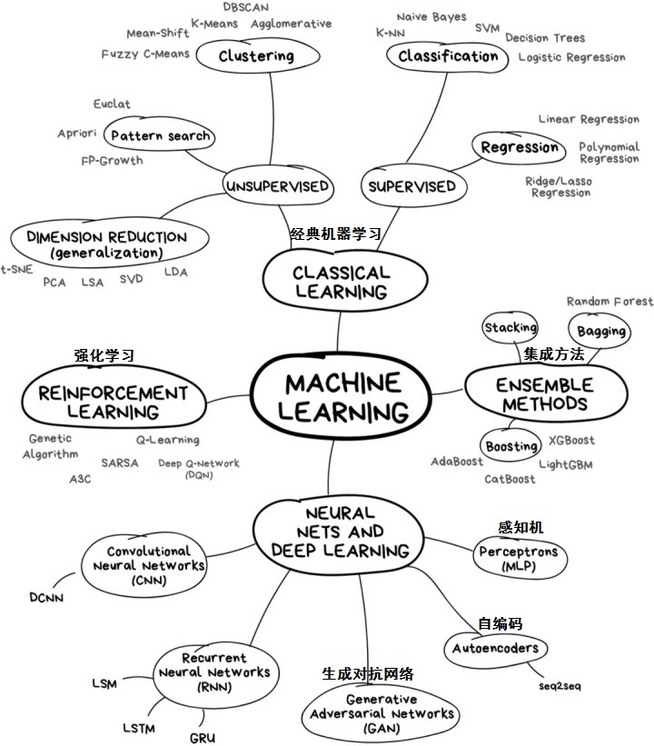
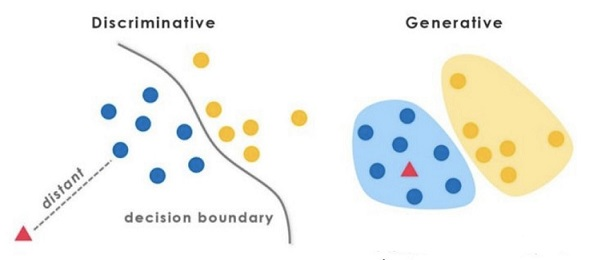

# 机器学习

## 0.1 [模型分类](https://www.zhihu.com/question/35866596/answer/236886066)

### 0.1.1判别式（discriminative）模型

**判别模型是直接对** **建模**，就是说，直接根据X特征来对Y建模训练。

具体地，我的训练过程是确定构件****模型里面“复杂映射关系”中的参数，完了再去inference（判别）一批新的sample。

所以判别式模型的特征总结如下：

1. 对 ****建模
2. 对所有的样本只构建一个模型，确认总体判别边界（犹如SVM在多维空间画出类别的边界）
3. 观测到输入什么特征，就预测最可能的label
4. 另外，判别式的优点是：对数据量要求没生成式的严格，速度也会快，小数据量下准确率也会好些。

### 0.1.2 生成式（generative）模型

也称为概率图模型

在模型训练中，我学习到的是X与Y的联合模型****  ，也就是说，**我在训练阶段是只对建模**

我需要确定维护这个联合概率分布的所有的信息参数。完了之后在inference再对新的sample计算**** ，导出**Y **

学习阶段，建模： 

等价于学习：(这个公式不在模型运行的任何阶段能体现出来，只是我们都去这么来表示HMM是个生成式模型，他的联合概率 ![[公式]](https://www.zhihu.com/equation?tex=P%28O%2CI%29) 就是这么计算的)

预测阶段，预测：

所以生成式总结下有如下特点：

1. 对 建模
2. 这里我们主要讲分类问题，所以是要对每个label-y都需要建模，最终选择最优概率的label为结果，所以没有什么判别边界。（对于序列标注问题，那只需要构件一个model）
3. 中间生成联合分布，并可生成采样数据。
4. 生成式模型的优点在于，所包含的信息非常齐全，我称之为“上帝信息”，所以不仅可以用来输入label，还可以干其他的事情。生成式模型关注结果是如何产生的。但是生成式模型需要非常充足的数据量以保证采样到了数据本来的面目，所以速度相比之下，慢。