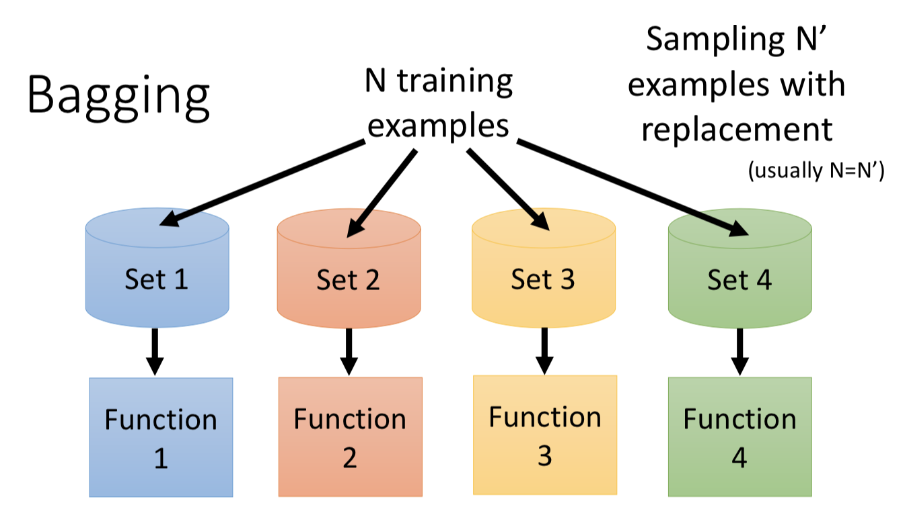
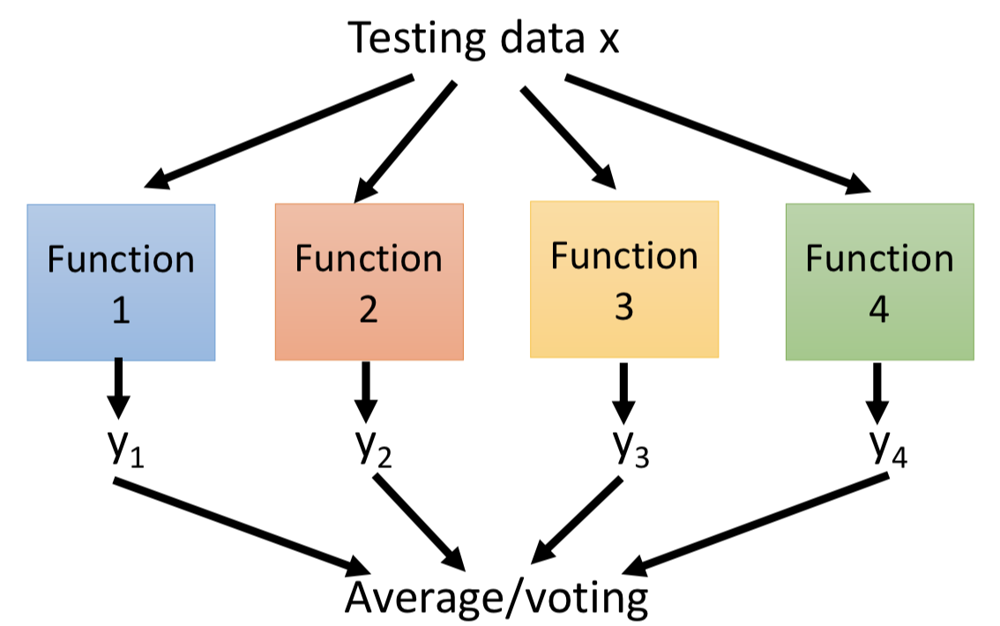
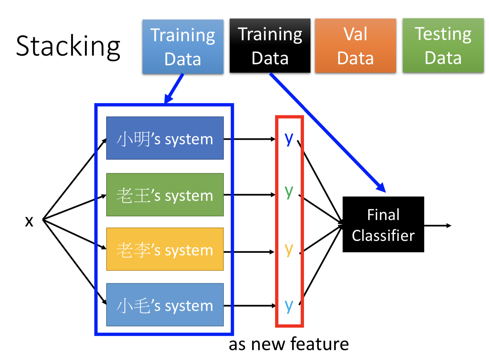

# 机器学习

## 0.1 [模型分类](https://www.zhihu.com/question/35866596/answer/236886066)

### 0.1.1判别式（discriminative）模型

**判别模型是直接对** **建模**，就是说，直接根据X特征来对Y建模训练。

具体地，我的训练过程是确定构件****模型里面“复杂映射关系”中的参数，完了再去inference（判别）一批新的sample。

所以判别式模型的特征总结如下：

1. 对 ****建模
2. 对所有的样本只构建一个模型，确认总体判别边界（犹如SVM在多维空间画出类别的边界）
3. 观测到输入什么特征，就预测最可能的label
4. 另外，判别式的优点是：对数据量要求没生成式的严格，速度也会快，小数据量下准确率也会好些。

### 0.1.2 生成式（generative）模型

也称为概率图模型

在模型训练中，我学习到的是X与Y的联合模型****  ，也就是说，**我在训练阶段是只对建模**

我需要确定维护这个联合概率分布的所有的信息参数。完了之后在inference再对新的sample计算**** ，导出**Y **

学习阶段，建模： 

等价于学习：(这个公式不在模型运行的任何阶段能体现出来，只是我们都去这么来表示HMM是个生成式模型，他的联合概率 ![[公式]](https://www.zhihu.com/equation?tex=P%28O%2CI%29) 就是这么计算的)

预测阶段，预测：

所以生成式总结下有如下特点：

1. 对 建模
2. 这里我们主要讲分类问题，所以是要对每个label-y都需要建模，最终选择最优概率的label为结果，所以没有什么判别边界。（对于序列标注问题，那只需要构件一个model）
3. 中间生成联合分布，并可生成采样数据。
4. 生成式模型的优点在于，所包含的信息非常齐全，我称之为“上帝信息”，所以不仅可以用来输入label，还可以干其他的事情。生成式模型关注结果是如何产生的。但是生成式模型需要非常充足的数据量以保证采样到了数据本来的面目，所以速度相比之下，慢。

# [集成方法](https://zhuanlan.zhihu.com/p/81594571?utm_source=qq)

在涉及复杂场景时难免就会暴露出心有余而力不足（高偏差，欠拟合）或者只知旧不知新（高方差，过拟合）的状况，改善数据质量或者模型质量诚然是一种方法，但还有一种方法则是“人多力量大”，依靠集体的智慧来共同建设美好愿景，这也就是集成方法最朴素原始的思想和假设：**通过将一系列相对较弱的模型以某种恰当的方式组合起来，可以得到比单个模型效果更好的强模型（更精确或更鲁棒）**，期望组合二乘的强模型能够在某种程度上减少原本单个模型时犯错误的机会。

## bagging

Bagging是Bootstrap aggregating的缩写

Bootstrap意为自助法，它是一种统计学上的数据抽样方法，指从一个给定的数据集合中有放回的均匀抽样。

Aggregation，在每个子训练集上学习得到的一批弱模型通过确定性的平均过程来得到最终的输出，如对分类问题的多数投票，或概率性的输出，回归问题的取平均。

其目标是组合多个基学习器的预测结果，从而来提高单个模型的泛化能力/鲁棒性。其原理是单独训练数个不同的模型，然后让多个模型在测试集的输出上投票。这是一个在机器学习中普遍应用的被称作**model averaging(模型平均)** 的策略。

用于基础模型复杂、容易过拟合的情况，用来减小变化幅度（ variance），减小过拟合。

基础模型之间没有太多联系（相对于boosting来说），训练可以并行。但用 bagging 并不能有助于把数据拟合的更准，它用于减小方差。（减小 bias，要用 boosting）。

模型训练：每次训练一个基础模型，都从 N 条训练数据中**有放回**的随机抽取出（bootstrapping） N' 条作为训练集（虽然一般 N = N'，但由于是有放回的抽，所以具体的数据还是不同的）。

模型预测：average（回归）或者 voting（分类）。

## boosting

boosting 方法中，基础模型的训练是有顺序的、迭代的（新的基础模型去补强已有的基础模型）。

**顺序地学习一系列模型，在学习当前模型时把重点放在解决之前模型所没解决好的样本上，以更大的可能性解决好之前错误的样本**

两种常用方法：

1. 自适应提升AdaBoost(Adaptive Boosting)，它通过**增加错误样本点的权重系数，同时减小正确样本点的权重系数**来对误差函数进行影响
2. 梯度提升Gradient Boosting，不同于AdaBoost通过**改变样本的权重系数**来分配注意力。Boosting的关键点在于**每次针对损失函数的负梯度来构建弱模型（也就是对该样本的负梯度值为新的目标值）**

## [stacking](https://www.cnblogs.com/chaojunwang-ml/p/11208164.html)

各做各的，然后把前面已经有的模型输出作为最后一个 layer 的 new features，而且训练数据要分成两个部分，一部分用来训练前面的系统，另一部分用来训练 Final classifier。

## 参考

https://zhuanlan.zhihu.com/p/81594571?utm_source=qq

https://www.cnblogs.com/chaojunwang-ml/p/11208164.html

https://blog.csdn.net/Solo95/article/details/92083524

https://www.jianshu.com/p/c4bf8821af19?from=groupmessage