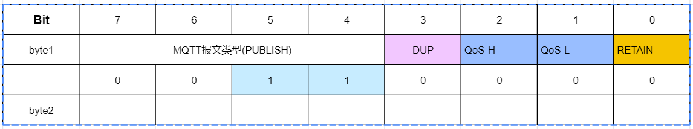

# MQTT

MQTT是一种基于发布/订阅模式的轻量级消息传输协议，**设计用于低带宽、高延迟或不稳定的网络环境，广泛应用于物联网领域**

应用场景：

1. 智能家居       : MQTT可以用于连接各种家电设备和传感器，实现设备之间的通信和控制
2. 车联网         : MQTT可以用于车辆与车辆、车辆与基础设施之间的实时通信
3. 工业物联网     : MQTT可以用于连接各种工业设备和传感器，实现设备的监测和控制
4. 远程监控和控制  : MQTT可以用于将传感器数据发布到云平台，供其他设备或应用程序订阅和使用
5. 消息通知       : MQTT可以用于提供实时消息通知功能
6. 资源监控与管理  : MQTT能够提供对物联网设备的实时监控和管理功能
7. 数据采集和分析  : MQTT也可以用于数据采集和分析


优势：

1. 常见的计算机语言(C/C++、Java、Python、Go...)都有支持MQTT协议的客户端
2. MQTT协议是建立在TCP/IP协议基础之上,所以MQTT协议安全可靠
3. 服务质量设置，MQTT协议提供了三种服务质量配置分别为:
   - Qos 0: 消息可能丢失 
   - Qos 1: 消息不会丢失,但是可能重复
   - Qos 2: 消息不会丢失也不会重复
4. 心跳保活: 由于网络问题可能造成连接陷于假死状态,为了判断客户端和代理是否出现异常，MQTT定义自己的心跳机制，定期向代理发送报文，以便于快速识别出异常连接，让客户端快速与代理断开连接
5. 持久会话: 代理保留客户端发送过来的消息，以便于消息订阅端上线立刻获取消息

# 1 MQTT协议

MQTT报文(数据包)由三部分组成:
1. 固定报头(Fixed header)    : 所有数据包中都包含此报头,用来表示数据包的类型,以及数据包的分组累标识
2. 可变报头(Variable header) : 存在于部分MQTT数据包中,数据包类型决定了可变头是否存在及其具体内容
3. 有效载荷(Payload)         : 存在于部分MQTT数据包中,表示客户端收到的具体内容

## 1.1 固定报头格式


### byte1高四位

| 报文类型名称 | 报文类型对应值 | 报文表示的意义 | 描述                                | 备注                   |
| ------------ | -------------- | -------------- | ----------------------------------- | ---------------------- |
| Reserved     | 0              | 禁止           | 保留位                              | 默认值 高4位 取值 0000 |
| CONNECT      | 1              | 客户端到服务端 | 客户端请求连接服务端                | 高4位 取值 0001        |
| CONNACK      | 2              | 服务端到客户端 | 连接报文确认                        | 高4位 取值 0010        |
| PUBLISH      | 3              | 两个方向都允许 | 发布消息                            | 高4位 取值 0011        |
| PUBACK       | 4              | 两个方向都允许 | QoS 1消息发布收到确认               | 高4位 取值 0100        |
| PUBREC       | 5              | 两个方向都允许 | 发布收到（保证交付第一步）          | 高4位 取值 0101        |
| PUBREL       | 6              | 两个方向都允许 | 发布释放（保证交付第二步）          | 高4位 取值 0110        |
| PUBCOMP      | 7              | 两个方向都允许 | QoS 2消息发布完成（保证交互第三步） | 高4位 取值 0111        |
| SUBSCRIBE    | 8              | 客户端到服务端 | 客户端订阅请求                      | 高4位 取值 1000        |
| SUBACK       | 9              | 服务端到客户端 | 订阅请求报文确认                    | 高4位 取值 1001        |
| UNSUBSCRIBE  | 10             | 客户端到服务端 | 客户端取消订阅请求                  | 高4位 取值 1010        |
| UNSUBACK     | 11             | 服务端到客户端 | 取消订阅报文确认                    | 高4位 取值 1011        |
| PINGREQ      | 12             | 客户端到服务端 | 心跳请求                            | 高4位 取值 1100        |
| PINGRESP     | 13             | 服务端到客户端 | 心跳请求                            | 高4位 取值 1101        |
| DISCONNECT   | 14             | 客户端到服务端 | 客户端断开连接                      | 高4位 取值 1110        |
| Reserved     | 15             | 禁止           | 保留位                              | 高4位 取值 1111        |

### byte1低4位

- byte1 低4位默认大多都是保留位,没有意义,但是当MQTT类型为PUBLISH(0011)时，低4位开始有意义。



```
当byte1的高4位取值为0011时，byte1的低4位就会有意义

DUP位: 如果设置0客户端或服务端第一次请求发送这个PUBLISH报文,如果设置1，表示这可能是一个早前报文请求的重发
Qos位: 由2位组成取值范围是0-3(00~11) 服务质量,每一个值代表的意义如下

Qos值    bit2    bit1      描述
 0        0       0     消息可能丢失
 1        0       1     消息不会丢失,但是可能重复
 2        1       0     消息不会丢失,也不会重复
 x        1       1     保留位
 
RETAIN位: 1/0
	1. 如果设置1 那么服务器端必须保存Qos信息,以便将Qos信息传递给其它的订阅者；
	2. 如果服务器端收到一个RETAIN为1并且QoS0的消息，服务器端需要丢弃掉原来那个主题保留任何消息，将这个新的QoS0消息当作主题的新保留消息 
	3. 服务端发送消息给订阅者,如果订阅者是一个新的，那么RETAIN为1，如果订阅者是一个已经存在的RETAIN为0
	4. RETAIN为0并且有效载荷为0的报文，服务端会当作正常消息处理
 
```

## 1.2 其他

可变报头包含主题名和报文标识符。

有效载荷主要传递消息的内容。

## 1.3 工作原理

MQTT协议基于TCP/IP协议，TCP/IP协议是一个安全稳定的协议,通信需要服务端和客户端经历三次握手四次挥手，建立一个稳定的通道然后在进行数据传输。

MQTT协议建立在TCP/IP协议之上，也是需要编写服务端(图中的Broker)和客户端(消息发布者和消息订阅者).


# 2 MQTT开源服务器


##  2.1 Eclipse Mosquitto

```
官网地址: https://mosquitto.org/

介绍:
1. 开源的消息代理服务器
2. 支持MQTT协议版本 3.1 3.1.1 5.0 版本
3. 轻量级,适用从低功耗单板计算机到完整服务器的所有设备
4. 不支持集群功能
```

```bash
sudo apt install libmosquitto-dev
```

[C SDK](https://mosquitto.org/api/files/mosquitto-h.html)

### 订阅

```c
#include <mosquitto.h>
 #include <stdio.h>

void my_sub(struct mosquitto * mqtt, void *mq_new_3, const struct mosquitto_message
*msg)

 {
 printf("%s\r\n",(char *)mq_new_3);
 printf("主题是%s,消息是%s\r\n",(char *)msg->topic,(char *)msg->payload);
 //将接收到的数据拆包 humi:47 temp:25，分别存入表humi和temp
 //表的第一列为数据大小，表的第二列为存放时间
 }

 int main(int argc, char const *argv[])
 {
     //初始化mosquitto库
     mosquitto_lib_init();
     //建立客户端
     struct mosquitto *mqtt_client;
     mqtt_client=mosquitto_new("qfedu",true,"qfedu");//第三个参数是传递给其他回调的参数
     //连接服务器
     mosquitto_connect(mqtt_client,"10.7.121.57",1883,120);
     //订阅主题
     mosquitto_subscribe(mqtt_client,NULL,"temp",0);
     //接收消息(回调实现)
     mosquitto_message_callback_set(mqtt_client,my_sub);
     //开启新线程网络循环
     mosquitto_loop_start(mqtt_client);
     //开启新线程网络循环
     mosquitto_loop_stop(mqtt_client,false);
     //销毁客户端
     mosquitto_destroy(mqtt_client);
     //清理mosquitto库
     mosquitto_lib_cleanup();
     return 0;
 }

```

### 发布

```c
#include <mosquitto.h>
 #include <stdio.h>

 int main(int argc, char const *argv[])
 {
     //初始化mosquitto库
     mosquitto_lib_init();
     //建立客户端
     struct mosquitto *mqtt_client;
     mqtt_client=mosquitto_new("qfedu",true,"qfedu");//第三个参数是传递给其他回调的参数
     //连接服务器
     mosquitto_connect(mqtt_client,"10.7.121.57",1883,120);
     //订阅主题
     mosquitto_subscribe(mqtt_client,NULL,"temp",0);
     //发消息
     mosquitto_publish(mqtt_client,NULL,"temp",2,"12",0,true);
     //销毁客户端
     mosquitto_destroy(mqtt_client);
     //清理mosquitto库
     mosquitto_lib_cleanup();
     return 0;
 }

```


## 2.2 EMQX

### 服务器

```
官网地址: https://www.emqx.io/zh

介绍:
1. 开源大规模分布式MQTT代理服务器
2. 支持MQTT协议版本 3.1 3.1.1 5.0 版本
3. 单台并发连接数可以高达一亿,每秒处理百万级消息
4. 安全可靠的消息传递
```

```
EMQX安装: windows
1. 下载地址: https://www.emqx.io/zh/get-started
2. 安装步骤:
	第一步: 下载 emqx-5.3.2-windows-amd64.zip 安装包,版本可能和我这个不同
	第二步: 解压
	第三步: 打开命令行(以管理员身份运行),切换到解压目录的bin目录下
	第四步: 安装,在bin目录下执行EMQX安装命令  emqx.cmd install ,完成之后有类似下面的输出,说明安装成功,只需要安装一次
        D:\app\emqx-5.3.2-windows-amd64\bin>emqx.cmd install
        EMQX_NODE__DB_ROLE [node.role]: core
        EMQX_NODE__DB_BACKEND [node.db_backend]: mnesia
        D:\app\emqx-5.3.2-windows-amd64\erts-13.2.2.4\bin\erlsrv.exe: Service emqx_5.3.2 added to system.
        [SC] ChangeServiceConfig 成功
	第五步(可选择): 如果想将EMQX从windows上卸载可以执行 emqx.cmd uninstall 命令
	第六步: 去windows服务列表中找到第四步安装的EMQX的服务,鼠标右键启动
	第七步: 在命令行输入 emqx.cmd console 命令，查看是否启动成功,如果有类似以下日志启动成功
		D:\app\emqx-5.3.2-windows-amd64\bin>emqx.cmd console
        EMQX_LOG__CONSOLE_HANDLER__ENABLE [log.console.enable]: true
        EMQX_NODE__DB_ROLE [node.role]: core
        EMQX_NODE__DB_BACKEND [node.db_backend]: mnesia

        D:\app\emqx-5.3.2-windows-amd64>D:\app\emqx-5.3.2-windows-amd64\erts-13.2.2.4\bin\erl.exe -mode embedded -boot "D:\app\emqx-5.3.2-windows-amd64\releases\5.3.2\start" -config "D:\app\emqx-5.3.2-windows-amd64\data\configs\app.2024.05.06.16.38.19.config" -args_file "D:\app\emqx-5.3.2-windows-amd64\data\configs\vm.2024.05.06.16.38.19.args" -mnesia dir 'd:/app/emqx-5.3.2-windows-amd64/data/mnesia/emqx@127.0.0.1'
        Listener ssl:default on 0.0.0.0:8883 started.
        Listener tcp:default on 0.0.0.0:1883 started.
        Listener ws:default on 0.0.0.0:8083 started.
        Listener wss:default on 0.0.0.0:8084 started.
        Listener http:dashboard on :18083 started.
        EMQX 5.3.2 is running now!
        Eshell V13.2.2.4  (abort with ^G)
        v5.3.2(emqx@127.0.0.1)1>
    
    第八步:通过浏览器访问控制台http://127.0.0.1:18083 默认初始化用户名: admin 默认密码: public 进入之后会让你重新修改密码
    
    
注意事项: (第六步+第七步)这种启动方式在开发时使用,如果想正式环境使用请遵循官网命令启动介绍: 正式环境启动在bin目录下直接输入 emqx start进行EMQX启动,这时不需要（第六步和第七步）

官网命令详细使用地址: https://www.emqx.io/docs/zh/latest/admin/cli.html    
```

EMQX也存在一个用于测试的客户端工具，用于发布和订阅消息。下载地址：https://mqttx.app/zh/downloads

[C语言 SDK](https://docs.emqx.com/zh/emqx/latest/connect-emqx/c.html)

# 其他

1. 在互联网项目中，为什么很多使用rabbitMQ或者是kafka或者是rocketMQ而很少使用MQTT？
   - 尽管 MQTT 在物联网领域非常流行，但对于其他类型的互联网项目，特别是需要大规模、高性能、可靠性的系统，RabbitMQ、Kafka 和 RocketMQ 等消息中间件更为常见。选择适当的消息中间件通常取决于项目的具体需求和特点。
2. 