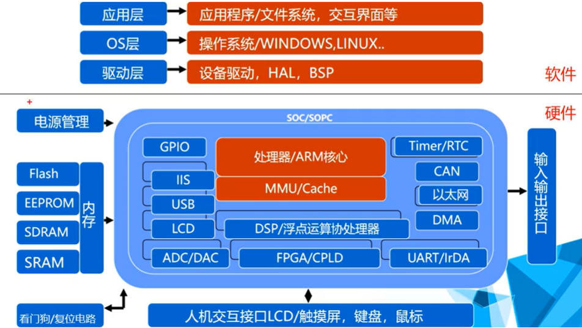
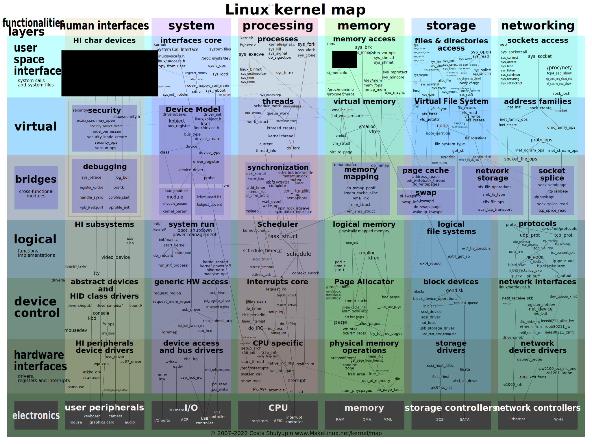

# BSP

BSP（Board Support Package，板级支持包）

是构建嵌入式操作系统所需的引导程序(Bootloader)、内核(Kernel)、根文件系统(Rootfs)和工具链(Toolchain) 提供完整的软件资源包。

# 0 嵌入式系统概述

## 0.1 开发软硬件条件

硬件：

- 开发板
- 电源：5V/2A
- 串口线：
  - 连接电脑与开发版，在设备管理器的端口一栏显示：Prolific PL2303GT USB Serial COM Port，如果不显示这个设备，那么需要去驱动精灵扫描电脑，安装驱动。
  - 使用xshell控制开发板，
- usb下载线：安卓接口线（作用：将系统从pc下载到开发板），插入电脑后，有可能电脑没有发现（设备管理器也看不到相关它的设备），没关系，先向后执行 。

## 0.2 开发板烧写系统

1. 通过xshell和串口线连接开发板

   - 
   - 

2. 连接完成usb下载线不一定会出现设备，

   - 解决方法1：得用x-shell连接开发板，并且进到boot界面，输入fastboot，设备名称才会出现在设备管理器；
   - 解决方法2：多插拔几次。
   - 

3. 更新android设备驱动

   - 
   - 安装fastboot驱动，找到文件夹，并且这个文件夹中需要包含android_winusb.inf
   - 如果安装结果，为失败。失败的话还需要进行[win11禁用驱动程序强制签名](https://www.jb51.net/os/win11/925636.html)
   - 

   

4. [win11禁用驱动程序强制签名](https://www.jb51.net/os/win11/925636.html)

   - 【win + i】---》windows 更新 ---》高级选项 ---》恢复 ---》 高级启动（立即重新启动） ---》 立即启动
   - 疑难解答（重置你的电脑或查看高级选项）---》 高级选项 ---》启动设置（更改windows启动行为）---》重启 ---》禁用驱动程序强制签名（F7）
   - 注意：禁用驱动程序强制签名只在本次启动时生效，当你再次重启电脑，驱动程序强制签名将自动恢复。

5. 启动电脑后，再次更新驱动程序，强制执行。然后在设备管理器就会有

   

6. 烧写系统

   - 一定在xshell的连接中输入fastboot，然后设备就会等待下载

     ```bash
     tarena# fastboot
     
     Fastboot Partitions:
      mmc.2: ubootpak, img : 0x200, 0x78000
      mmc.2: 2ndboot, img : 0x200, 0x4000
      mmc.2: bootloader, img : 0x8000, 0x70000
      mmc.2: boot, fs : 0x100000, 0x4000000
      mmc.2: system, fs : 0x4100000, 0x2f200000
      mmc.2: cache, fs : 0x33300000, 0x1ac00000
      mmc.2: misc, fs : 0x4e000000, 0x800000
      mmc.2: recovery, fs : 0x4e900000, 0x1600000
      mmc.2: userdata, fs : 0x50000000, 0x0
     Support fstype : 2nd  boot  factory  raw  fat  ext4  emmc  nand  ubi  ubifs 
     Reserved part  : partmap  mem  env  cmd 
     Failed to mount ext2 filesystem...
     ** Unrecognized filesystem type **
     can't find bmp at 0x47000000 (type:0xffff), fb:0x46000000...
     LOGO: DRAW FB=0x46000000, X=1024, Y= 600, Bpp=32
     Load USB Driver: android
     Core usb device tie configuration done
     OTG cable Connected!
     ```

   - 执行下载命令.bat，[bat文件中如何书写注释](https://blog.csdn.net/weixin_42109053/article/details/127891822)

     ```bat
     :: ubootpak.bin文件一定要和bat文件的位置，按照如下路径相对应，否则将会找不到ubootpak.bin文件
     fastboot flash ubootpak ./imagev3.0/ubootpak.bin
     ```

   - 开发板会显示flashing ubootpad:done

   - 在xshell中会显示

     ```bash
     Ready : ubootpak
     Starting download of 342724 bytes
     downloading 339968 --  99% complete.
     downloading of 342724 bytes to 0x48000000 (0xf8000000) finished
     Flash : ubootpak
     head boot dev  = 2
     update mmc.2 type 2ndboot = 0x200(0x1) ~ 0x53ac4(0x29e): Done
     Flash : ubootpak - DONE
     ```

   - 

7. 修改分区

   - 重启开发板

   - 在xshell中，3秒内回车，进入uboot，输入分区命令

     ```bash
     qfedu-uboot# mmc erase 0x400 0x40
     
     MMC erase: dev # 2, block # 1024, count 64 ... 
     
     Caution! Your devices Erase group is 0x400
     The erase range would be change to 0x400~0x7ff
     
     64 blocks erased: OK
     
     qfedu-uboot# fdisk 2 8 100000:4000000 4100000:2f200000 33300000:1ac00000 4e000000:800000 4e900000:1600000 50000000:0xc800000 0x5c900000:0x1f400000 0x7be00000:0x0
     qfedu-uboot# 
     
     ```

     

8. 下载内核和文件系统

   - 按下开发板的重启按键，在x-shell中按回车键（3s内），输入fastboot，双击包含一下命令的bat文件

     ```bat
     :: 注意文件位置
     fastboot flash boot ./imagev3.0/boot.img
     fastboot flash gtkfs ./imagev3.0/gtkfs.img
     ```

     ```bash
     # xshell中显示
     Ready : boot
     Starting download of 18804992 bytes
     downloading 18617856 --  99% complete.
     downloading of 18804992 bytes to 0x48000000 (0xf8000000) finished
     Flash : boot
     Flash : boot - DONE
     
     Ready : gtkfs
     Starting download of 251737964 bytes
     downloading 249221120 --  99% complete.
     downloading of 251737964 bytes to 0x48000000 (0xf8000000) finished
     Flash : gtkfs
     Flash : gtkfs - DONE
     
     ```

     

9. 烧写完成，按下开发板的重启键，等待系统跑起来。

   ```bash
   [root@qfedu /home]#ls
   It's_My_Lifei.mp3             mount_nfs.sh
   One_Punch_Man_Main_Theme.MP3  multi_touch_test
   amixer.sh                     opencv_demo
   demo                          set_wireless.sh
   media                         www
   [root@qfedu /home]#
   ```

   

10. 

    

    

    

    

    


## 0.3 嵌入式概念

以应用为中心，以计算机技术为基础，对软硬件可裁剪，对功耗，体积，可靠性，成本都有严格要求的专用计算机系统。

它并不像我们的pc，pc是一个通用的计算机系统

嵌入式系统设备包含：

- 嵌入式微处理器
- 外围硬件设备（Peripheral）
- 嵌入式操作系统




## 0.4 内存寻址

独立寻址：片内片外的存储器选择一个，然后再通过地址选择

统一寻址：片内外存储器都可以使用，按序对所有可用到的存储，进行地址编码


## 0.5 软件怎么访问硬件设备

- 软件->内存->内存映射->特殊功能寄存器->硬件
- 怎么通过内存地址实现对串口（uart）数据的发送
  - 通过原理图结合开发板找到与PC相连的串口uart0
  - 通过数据手册查找uart0的发送数据寄存器映射到了内存什么地址
  - 发送数据地址为：0xc00a1020
  - 向0xc00a1020地址写入数据完成发送


## 0.6 裸机开发特点

- 代码编写过程
  1. 没有操作系统，不能使用带有系统调用的标准c库
  2. 如果要使用到像printf，malloc这些函数都要自行实现
  3. 大量的使用物理内存地址进行数据操作，不像在应用层开发（可以使用虚拟内存）。
- 代码编译过程
  1. 编译（生成.o）和链接分步骤完成，实现对可执行程序的指定链接，并指定链接地址
  2. 裸机环境下，需要将elf（linux系统下的可执行文件）裁剪成纯净的二进制可执行命令文件
  3. 将纯二进制文件下载到链接时指定的物理内存空间，修改PC指向开始执行

## 0.7 GNU常用工具

1. 预处理器：cpp

2. 编译器：gcc/g++

3. 汇编器：as

4. 链接器：ld

5. 二进制工具集：

   - objcopy（段剪辑器）
   - objdump（信息查看器）
     - -h，查看段地址信息
     - -s，段落的内容（content of section，.data，.text等段落）
     - -f，文件头信息
     - -d，反汇编信息
     - -S，内嵌反汇编信息

6. 符号显示器：nm

   - 查看某个符号有没有编译出来，

   - 第一列为符号地址，

   - 第二列符号所在段落

     - b/B-未初始化变量，d/D- .data已初始化变量，r/R- .rodata只读数据段，t/T-.text函数，，符号的小写表示静态，符号大写表示非静态
     - A-不可改变的绝对值，C- .o中为初始化非静态变量，N-调试用的符号，U-符号只声明未定义

   - 第三列符号名称

   - 可以查看.o，或elf文件

   - ```bash
     nm -n main_elf
     ```

   - 

7. 


## 0.8 裸机程序生成与执行

1. 编写源代码

   ```c
   // test.c
   unsigned int xxx = 0x11111111;
   int main(){
       char *str = "A\r\n" ;
       int len = 3;
       unsigned int *p = exc00a1020;
       while( len--){
           *p =*str++;
       }
       return 0;
   }
   ```

2. 只编译不链接

   ```bash
   arm-linux-gcc -c -o test.o test.c
   ```

3. 链接

   ```bash
   arm-linux-ld -o test test.o -Ttext=0x48000000 -e main
   # -Ttext:				使用指定的地址作为文本段的起始点，因为文本段（其他段落都在文本段后面）作为程序的起始地址。
   # -e:				使用指定的符号作为程序的初始执行点
   ```

   

4. 裁剪elf文件，去除elf格式

   ```c
   arm-linux-objcopy -O binary -S test test.bin
   ```

   

5. 下载裸机程序到开发板上

   - 进入开发板的uboot（开启后3秒内，迅速回车）
   - 在命令行敲 "?"，就可以看见所有可以使用的命令
   - 可以看到loadb命令可以使用，执行`loadb 0x48000000`，引导程序就会等待你上传程序，我们就需要在xshell中上传程序。
   - [用串口进行数据传输](https://blog.csdn.net/qq_54704926/article/details/132540417)
   - 
   - 使用go执行程序，`go 0x48000000`
   - 

# 1 bootloader应用

引导程序，是为了引导磁盘中的程序去执行。


bootloader的种类：

- 针对不同的cpu架构：
  - 针对X86架构的有LILO、GRUB、ntldr等
  - 针对ARM架构的有vivi、armboot等
  - 针对PPC架构的有ppcboot等
  - 可以支持多种架构的u-boot等
- 针对不同的操作系统：
  - 专门用来启动Linux系统的vivi
  - 专门用来启动WinCE系统的eboot
  - 基于eCos系统的引导程序redboot
  - 可以启动多种操作系统的u-boot等

由于boot设计 比较偏底层，所以根据CPU架构和OS类型可能有所不同

uboot是对CPU架构和OS类型支持得比较多的一种开源引导程序


```bash
# uboot查看环境变量
printenv
# ...
bootargs=root=/dev/mmcblk0p8 init=/linuxrc console=ttySAC1,115200 lcd=wy070ml tp=gslx680
# ...

# uboot进入linux操作系统
boot

# linux操作系统查看uboot传参，/proc/cmdline，它包含了系统引导时传递给内核的参数
cat /proc/cmdline
console=ttySAC0,115200n8 androidboot.hardware=x6818 androidboot.console=ttySAC0 androidboot.serialno=0123456789abcdef initrd=0x49000000,0x1000000 root=/dev/mmcblk0p8 init=/linuxrc console=ttySAC1,115200 lcd=wy070ml tp=gslx680

# linux操作系统回到uboot
reboot

# uboot命令行修改bootargs
setenv bootargs root=/dev/mmcblk0p8 init=/linuxrc console=ttySAC1,115200 lcd=wy070ml tp=gslx681
# 然后再查看就发现bootargs发生了变化，操作系统中也发生了变化
printenv
bootargs=root=/dev/mmcblk0p8 init=/linuxrc console=ttySAC1,115200 lcd=wy070ml tp=gslx681
```

## uboot

**uboot的本质就是一段裸机程序。**

uboot就是一个bootloader（启动加载器），作用就是用于 初始化DDR和启动内核操作系统

uboot源码获取：

- 官网：https://source.denx.de/u-boot/u-boot（不建议，可能用不起来）
- 从芯片原厂获取配套的BSP。SOC厂商会从uboot官网下载某一个版本的uboot，然后在这个版本的uboot上加入相应的SOC以及驱动。这就是SOC厂商定制版的uboot。
- 做开发板的厂商，开发板会参考SOC厂商的板子。开发板必然会和官方的板子不一样。因此开发板厂商又会去修改SOC厂商做好的uboot，以适应自己的板子。
- 官方引导程序由于与硬件平台差异，所以并不能下载直接运行（需要经过修改，调试和移植）

## uboot目录结构


## uboot配置编译

```bash
# 进入uboot源码目录
cd u-boot-2014.07

# 清除编译痕迹（第一次进入源码目录时）
make distclean

# 生成配置目标
make x6818_config

# 编译，编译完成后，会在源码根目录生成镜像文件ubootpak.bin，也就是之前烧写系统的过程中使用到的ubootpak.bin文件
# gcc工具均要使用arm的gcc，因为宿主机是x86工具，我们要使用交叉编译，编译为arm可以使用的程序。首先安装arm的gcc编译工具，然后再在PATH指定命令所在的位置
# 使用root编译，然后make，如果make -j10不行， 就使用make，不要用多线程编译，否则会出错
make

# 如果不确定，make编译的是自己修改后的u-boot，那么可以选择修改相应的配置，来验证自己的修改是否被编译
vim include/configs/x6818.h
#define CONFIG_SYS_PROMPT		"qfedu-uboot"			# 可以修改成自己需要的，然后再编，再烧进去就好了。

# 烧写的过程查看开发板烧写系统0.2 章节
```

## uboot配置目标的过程分析

```bash
# 在上面的编译过程中，我们摘出生成配置目标的过程，进行着重分析
# 生成配置目标
make x6818_config
# 上面这一句的执行，其实对应的是Makefile中一个目标的编译，但如果你在Makefile中查找x6818_config，你是找不到的，因为uboot是面向很多芯片的，所以你肯定找不到，它会x6818进行一个通配，然后将通配的结果变成一个变量存储。如果你搜索_config，你是可以找到

%_config:: outputmakefile
	@$(MKCONFIG) -A $(@:_config=)

# 上面在Makefile中对应xxx_config目标的生成，这个目标的生成会执行 @$(MKCONFIG) -A $(@:_config=)命令，而这命令又代表了一段脚本的执行,
# 当我们删除这句命令最前面的@符号，删除后，屏幕就会输出这句命令的实际执行是什么

..../u-boot-2014.07/mkconfig -A x6818			

# mkconfig是一个脚本，-A和x6818 是两个传入mkconfig的参数
if [ \( $# -eq 2 \) -a \( "$1" = "-A" \) ] ; then				# $1是-A，$2是x6818
        # Automatic mode
        line=`awk '($0 !~ /^#/ && $7 ~ /^'"$2"'$/) { print $1, $2, $3, $4, $5, $6, $7, $8 }' $srctree/boards.cfg`
        # 然后从当前文件夹下的boards.cfg（u-boot-2014.07/boards.cfg），找到并读入x6818的行，作为这个脚本的新命令行参数
        
        # 就相当于这个脚本执行是，如下
        # u‐boot‐2014.07/mkconfig Active arm slsiap s5p6818 s5p6818 x6818 x6818 ‐
        
        if [ -z "$line" ] ; then
                echo "make: *** No rule to make target \`$2_config'.  Stop." >&2
                exit 1
        fi

        set ${line}
        # add default board name if needed
        [ $# = 3 ] && set ${line} ${1}
fi

# mkconfig将定义的变量值修改成命令行获取到的参数，并存入include/config.mk文件中
ARCH = arm
CPU = slsiap
BOARD = x6818
VENDOR = s5p6818
SOC = s5p6818

# 并且mkconfig创建了include/config.h文件，并写入了一个定制的头文件及目标平台相关信息
#
# Create board specific header file
#
if [ "$APPEND" = "yes" ]        # Append to existing config file
then
        echo >> config.h
else
        > config.h              # Create new config file
fi
echo "/* Automatically generated - do not edit */" >>config.h

for i in ${TARGETS} ; do
        i="`echo ${i} | sed '/=/ {s/=/  /;q; } ; { s/$/ 1/; }'`"
        echo "#define CONFIG_${i}" >>config.h ;
done

echo "#define CONFIG_SYS_ARCH  \"${arch}\""  >> config.h
echo "#define CONFIG_SYS_CPU   \"${cpu}\""   >> config.h
echo "#define CONFIG_SYS_BOARD \"${board}\"" >> config.h

[ "${vendor}" ] && echo "#define CONFIG_SYS_VENDOR \"${vendor}\"" >> config.h

[ "${soc}"    ] && echo "#define CONFIG_SYS_SOC    \"${soc}\""    >> config.h

[ "${board}"  ] && echo "#define CONFIG_BOARDDIR board/$BOARDDIR" >> config.h
cat << EOF >> config.h
#include <config_cmd_defaults.h>
#include <config_defaults.h>
#include <configs/${CONFIG_NAME}.h>									// 这里写入了平台相关的头文件
#include <asm/config.h>
#include <config_fallbacks.h>
#include <config_uncmd_spl.h>
EOF


# include/config.h，这个文件是u-boot所有源代码都会包含的头文件，这里面包含了平台相关的头文件
/* Automatically generated - do not edit */
#define CONFIG_SYS_ARCH  "arm"
#define CONFIG_SYS_CPU   "slsiap"
#define CONFIG_SYS_BOARD "x6818"
#define CONFIG_SYS_VENDOR "s5p6818"
#define CONFIG_SYS_SOC    "s5p6818"
#define CONFIG_BOARDDIR board/s5p6818/x6818
#include <config_cmd_defaults.h>
#include <config_defaults.h>
#include <configs/x6818.h>					//这就是目标平台自定义头文件
#include <asm/config.h>
#include <config_fallbacks.h>
#include <config_uncmd_spl.h>


# x6818.h中的裁剪配置宏均以CONFIG_开头
# 这个宏会被脚本解析成变量定义在include/autoconf.mk（编译时自动【由makefile里面的工具】产生，最初定义在include/configs/x6818.h）
# include/autoconf.mk最后又会被Makefile所包含，并决定哪些文件需要编译
```


## uboot镜像的产生

- 链接脚本定义在arch/arm/cpu/slsiap/u-boot.lds

- 在make 编译的时候，如果我们想看最后的链接过程所执行的命令，我们可以`make V=1`。

  ```bash
   arm-linux-ld  -pie --gc-sections -Bstatic -Ttext 0x43C00000 -o u-boot -T u-boot.lds arch/arm/cpu/slsiap/start.o --start-group  arch/arm/cpu/built-in.o ....
  ```

- 裁剪镜像去格式处理

  ```bash
  arm-linux-objcopy -j .text -j .rodata -j .hash -j .data -j .got.plt -j .u_boot_list -j .rel.dyn --gap-fill=0xff -O binary u-boot u-boot.bin
  # uboot源码生成的可执行程序是：u-boot.bin
  ```

- 镜像打包

  ```bash
  ./tools/mk6818 ubootpak.bin nsih.txt 2ndboot u-boot.bin
  ```

- 镜像组成：nsih + 2ndboot + u-boot.bin = ubootpak.bin

  - nsih.txt：完成异常向量表设置、系统时钟配置、DDR初始化
  - 2ndboot：是一个纯二进制指令，是由厂商提供无源码
  - u-boot.bin：uboot源码生成的可执行程序

- 

## uboot命令

### 环境变量类指令

```bash
# 打印环境变量
printenv	

baudrate=115200				# 串口控制台波特率
bootargs=root=/dev/mmcblk0p8 init=/linuxrc console=ttySAC1,115200 lcd=wy070ml tp=gslx680
bootcmd=ext4load mmc 2:1 0x48000000 uImage;bootm 0x48000000				# 自动启动时执行的命令
bootdelay=3
bootfile=uImage
ethaddr=00:e2:1c:ba:e8:60
fastboot=flash=mmc,2:ubootpak:2nd:0x200,0x78000;flash=mmc,2:2ndboot:2nd:0x200,0x4000;flash=mmc,2:bootloader:boot:0x8000,0x70000;	# 传递给内核的启动参数
flash=mmc,2:boot:ext4:0x00100000,0x04000000;flash=mmc,2:system:ext4:0x04100000,0x2F200000;flash=mmc,2:cache:ext4:0x33300000,0x1AC00000;flash=mmc,2:misc:emmc:0x4E000000,0x00800000;flash=mmc,2:recovery:emmc:0x4E900000,0x01600000;flash=mmc,2:userdata:ext4:0x50000000,0x0c800000;flash=mmc,2:gtkfs:ext4:0x5c900000,0x1f400000;flash=mmc,2:reserve:ext4:0x7be00000,0x0;		# 分区
filesize=1c2036
gatewayip=192.168.1.254
ipaddr=192.168.1.165
netmask=255.255.255.0	
serverip=192.168.1.164
stderr=serial
stdin=serial
stdout=serial

# 设置环境变量
setenv bootdelay 10		# 在启动设备后，如果10秒内不作出任何操作，将进入操作系统
# 保存环境变量
saveenv 		# 设置环境变量之后，需要save一下，否则设置不生效，开机后仍然为原值

# 其他环境变量
# loadaddr 串口下载缺省地址
```

### 下载文件的命令

- loadb 0x48000000（通过串口下载文件到**内存**中，如果不跟地址，那么它会下载到loadaddr环境变量所定义的地址去）
- fastboot （通过USB下载文件到**磁盘**中，需要安装开发板的驱动才行）
- tftp 0x48000000（通过网络下载文件到**内存**中，下载时需要借助一个PC端TFTP工具(TFTP+DHCP_Server/tftpd32.exe)。tftp方式下载时，实际上uboot扮演的是tftp客户端程序角色，主机windows或虚拟机ubuntu中必须有一个tftp服务器，然后将要下载的镜像文件放在服务器的下载目录中，然后开发板使用ubuntu的tftp命令下载即可。）

### 启动内核命令

- boot（从外存启动）
- bootm 0x48000000（从内存指定的某个地址启动系统）
- 从上位机启动（主要用于调试内核）
  * fastboot flash app uImage（先从PC端下载镜像到内存0x48000000）
  * bootm 0x48000000（再从指定内存启动系统）
- 

### 其他

```bash
# 查看命令
?
help
help command	# 查看命令的使用

# 重启uboot
reset
```

## 自定义uboot命令

1. 在common文件夹下新建cmd_helloworld.c

   ```c
   #include <common.h>
   #include <command.h>
   
   #if defined CONFIG_CMD_HELLOWORLD
   
   static int helloworld(cmd_tbl_t *cmdtp, int flag, int argc,char * const a
   rgv[])
   {
    	int i;
    	for(i=0;i<argc;i++){
   		 printf("argv[%d] = %s\n",i,argv[i]);
    	}
    	return 0;
    }
   
   
   U_BOOT_CMD(
    hello, 3, 0,helloworld,
    "hello command",
    "[ off ] [ baud ]\n"
    " ‐ xxxxxxxxx"
    " yyyyyyyyyyyyy"
    );
   // 命令名称、最大参数个数、重复次数、命令执行函数、用法、帮助。
   #endif /* CONFIG_CMD_HWFLOW */
   ```

   

2. 在include/configs/x6818.h里面加一个配置项，用来配置此命令是否生效

   ```c
   ...
   #define CONFIG_CMD_HELLOWORLD 1
   ...
   ```

3. 在common/Makefile中增加一项

   - 在make后，查看是否生效，首先查看common下是否有cmd_helloworld.o是否生成

   ```makefile
   obj‐y += cmd_helloworld.o
   ```


#### 命令的调用过程

```bash
board_init_r()->main_loop() #如果没有按下按键就直接进入操作系统，如果按下就开始按照下面的调用流程
autoboot_command()->run_command_list()->parse_string_outer()->setup_string_in_str()->parse_stream_outer()->parse_stream()->
run_list()->run_list_real()->run_pipe_real()->cmd_process()->find_cmd()
```

从控制台输入的命令都被送到common/command.c中的find_cmd()函数解释执行，根据匹配输入的命令，从列表中找出对应的命令结构体，并调用其回调处理函数完成命令处理

## 启动过程

boot为标准的两阶段启动bootloader

-  第一阶段为汇编代码(2ndboot)，主要为初始化cpu硬件体系结构
  - 1、禁用看门狗、初始化系统时钟
    2、设置异常向量表(用到中断的情况下设置)
    3、动态内存控制器初始化配置
    4、初始化调试指示灯(可选)
    5、初始化UART，用于开发调试(可选)
    6、从NAND、NOR或SD卡中复制代码到DRAM
    7、跳转并进入Bootloader第二阶段
-  第二阶段为c程序代码(u-boot.bin)，主要提供多种复杂命令并引导操作系统
  - 1、汇编阶段核心初始化
    2、初始化GPIO
    3、初始化MMC等存储设备
    4、MMU初始化
    5、各类通信设备相关驱动初始化
    6、环境变量和参数的加载及初始化
    7、倒计时监听串口(进入命令模式或启动内核)
    8、启动内核(拷贝内核镜像并跳转到内核入口)

内核启动过程：

1.  通过ext4load或fastboot下载一个内核uImage到内存0x48000000

2. 通过bootm 0x48000000启动内核。前两个步骤可以通过bootcmd环境变量可以看到：ext4load mmc 2:1 0x48000000 uImage;bootm 0x48000000

3. 查看bootm命令的common/cmd_bootm.c，找到他的回调函数do_bootm()

   ```bash
   1 do_bootm() ‐>
   2 do_bootm_states() ‐>
   3 bootm_os_get_boot_func() ‐>
   4 boot_os[] ‐>
   5 do_bootm_linux() ‐>
   6 boot_jump_linux() ‐>
   7 kernel_entry(0, machid, r2);//启动内核
   ```

   

# 2 linux内核

官网：https://www.kernel.org/，


2.6之后版本如果没有字母即为稳定版，如果带rc——release candidate测试版，eol——end of life分支终结版

## 2.1 linux内核源码结构

Linux内核源代码主要包含以下子目录：

- arch：与体系结构相关的代码，对应于每个支持的体系结构，有一个相应的子目录如x86、arm等与之对应，相应目录下有对应的芯片与之对应
- drivers：设备驱动代码，占整个内核代码量的一半以上，里面的每个子目录对应一类驱动程序，如: block:块设备、char:字符设备、net:网络设备等
- fs：文件系统代码，每个支持的文件系统有相应的子目录，如cramfs，yaffs，jffs2等
- include：包括编译内核所需的大部分头文件
  - 与平台无关的头文件放在include/linux子目录下
  - 各类驱动或功能部件的头文件（/media、/mtd、/net等）
  - 与体系相关的头文件arch/arm/include/
  - 与平台相关的头文件路径arch/arm/mach-s5p6818/include/mach
- lib：内核库代码
- init：内核初始化代码,其中的main.c中的start_kernel函数是系统引导起来后运行的第1个函数
- ipc：内核进程间通信代码
- mm：内存管理代码
- kernel：内核管理的核心代码
- net：网络部分
- scripts：脚本
- Documentations：文档
- crypto：加密算法

### 内核模块

[内核5.1模块地图](https://makelinux.github.io/kernel/map/)



## 2.2 内核编译

```bash
tar xvf kernel-3.4.39_v4_mipi.tar.bz2
cd kernel-3.4.39
make distclean

# 一定要有一个配置文件.config，这个文件后面会说到
cp config_20180626 .config

make uImage
# 如果提示mkimage command not found，参考：https://blog.csdn.net/dengjin20104042056/article/details/132379562
# apt install u-boot-tools
Image Name:   Linux-3.4.39-9tripod
Created:      Tue Jun 25 14:43:41 2024
Image Type:   ARM Linux Kernel Image (uncompressed)
Data Size:    5167808 Bytes = 5046.69 KiB = 4.93 MiB
Load Address: 40008000
Entry Point:  40008000
  Image arch/arm/boot/uImage is ready

```

编译后生成的产物：

- kernel-3.4.39/vmlinux：这是内核编译生成的可执行文件，还不是镜像。大小100M+
- kernel-3.4.39/arch/arm/boot/Image：它是直接生成的vmlinux去除格式后，且未经压缩的内核镜像。大小11M+
- kernel-3.4.39/arch/arm/boot/compressed/vmlinux：它是Image压缩后，再拼接上decompress解压程序得到的镜像。大小5M+
- kernel-3.4.39/arch/arm/boot/zImage：它是compressed/vmlinux经过去格式处理后得到的压缩镜像，可以直接下载运行。大小5M+
- kernel-3.4.39/arch/arm/boot/uImage：它是zImage的基础上，增加64字节前缀得到的uboot专用镜像。


## 2.3 内核启动过程

1. 内核解压（汇编 + C）：由镜像中的自解压程序进行解压
2. 板级引导（汇编）：主要对cpu和体系结构的检查、cpu本身的初始化以及页表的建立等
3. 通用内核启动阶段（ C ）：
   - `init/main.c ->start_kernel()`：主要完成内核早期初始化工作
   - `-> rest_init()`：启动多任务调度，然后创建了两个线程（进程）分别执行kernel_init和kthreadd，然后自身进入空闲cpu_idle
   
   ```bash
   # 我们再内核启动后，通过ps命令可以看到
   # 第一个进程linuxrc（这个进程就是从kennel_init内exec的）和第二个进程kthreadd
   PID   USER     TIME   COMMAND
       1 root       0:03 {linuxrc} init							
       2 root       0:00 [kthreadd]
       3 root       0:00 [ksoftirqd/0]
       4 root       0:00 [kworker/0:0]
       5 root       0:00 [kworker/u:0]
       6 root       0:00 [migration/0]
       7 root       0:00 [watchdog/0]
       8 root       0:00 [migration/1]
       9 root       0:00 [kworker/1:0]
   
   ```
   
   - `-> kernel_init()`：主要启动多处理器任务调度，以及初始化控制台，然后调用`init_post`
   - `-> init_post()`：标志着内核启动的结束，并启动了第一用户进程
     - 结束输出标志：Freeing init memory：248K


## 2.4 内核裁剪

图形裁剪工具命令：`make menuconfig`，在kernel-3.4.39文件夹下执行此命令，通过图形化界面操作裁剪。

```bash
make menuconfig
# 这个命令实际上是执行了scripts/kconfig中的相关脚本
# 当执行make menuconfig时，配置工具会自动根据根目录下的ARCH变量读取arch/$(ARCH)/Kconfig文件来生成配置界面，这个文件是所有文件的总入口，其它目录的Kconfig都由它来引用

# 如遇报错： *** Unable to find the ncurses libraries
# apt install libncurses5-dev，参考：https://blog.csdn.net/dengjin20104042056/article/details/132381857
# 如果窗口太小，它也会报：It must be at least 19 lines by 80 columns.

# 然后就可以看到一个由字符构成的一个大的配置引导窗
# 操作指引：
# 如果要修改某些输入框内的内容，删除输入框中的部分内容不能直接使用Backspace，而需要使用Ctrl + Backspace
# 通过esc键可以快速退到上一级菜单
# 通过顺斜杠（/）键来进行全局搜索
# 通过空格键选中和取消选项。


```

配置内容的存放：

- 首次配置默认的.config来至于：arch/arm/configs/xxx_defconfig

- 启动配置裁剪界面的默认配置选项，也来至于.config

- 裁剪配置结果将保存到.config中

- **系统除了会自动更新.config外，还会将选项以宏的形式保存在内核根目录下的include/generated/autoconf.h（在编译之初，读取.config文件后，就会生成autoconf.h，然后影响某些文件代码片段的编译预处理）文件下**


### 裁剪配置原理

在Linux2.6以后的版本中，文件的组织是通过Kconfig和Makefile来实现的

通过每层目录的Kconfig和Makefile实现了整个Linux内核的分布式配置

- Kconfig：对应内核模块的配置菜单
- Makefile：对应内核模块的编译选项
- **Kconfig和Makefile是成对出现的**
- **通过新增Kconfig里面的配置项，使得`make menuconfig`界面可以增加对应的配置项。.config保存了我们的配置结果，Makefile根据配置结果实现了对我们代码的条件编译。**

**kconfig的语法**

- config代表一个选项的开始，最终会出现在.config中(会自动增加一个CONFIG_前缀)
- bool代表此选项仅能选中或不选中,bool后面的字符串代表此选项在make menuconfig中的名字
- tristate：代表可以选择编译、不编译、编译成模块
- string：字符串;  hex：16进制的数; int：10进制的数
- depends on:依赖其余的选项
- default：默认选项值
- select：表示当前config被选中时，此选项也被选中
- menu/endmenu：表示生成一个菜单
- choice/endchoice：表示选择性的菜单条目
- comment：注释信息，菜单和.config文件中都会出现
- source：用于包含其它Kconfig

```
config VECTORS_BASE
        hex
        default 0xffff0000 if MMU || CPU_HIGH_VECTOR
        default DRAM_BASE if REMAP_VECTORS_TO_RAM
        default 0x00000000
        help
          The base address of exception vectors.
config ARM_PATCH_PHYS_VIRT
        bool "Patch physical to virtual translations at runtime" if EMBEDDED
        default y
        depends on !XIP_KERNEL && MMU
        depends on !ARCH_REALVIEW || !SPARSEMEM
        help
          Patch phys-to-virt and virt-to-phys translation functions at
          boot and module load time according to the position of the
          kernel in system memory.

source "lib/Kconfig"
```

.config中的配置项如下

```c
CONFIG_LOCALVERSION="-9tripod"
# CONFIG_LOCALVERSION_AUTO is not set
CONFIG_HAVE_KERNEL_GZIP=y
CONFIG_DCC_TTY=y
```

而Makefile里面：

```makefile
obj-$(CONFIG_DCC_TTY) += dcc_tty.o
# 如果CONFIG_DCC_TTY等于y，obj-y就会多增加一个需要链接的对象，然后就会编译到我们的内核中。
# 如果CONFIG_DCC_TTY等于空，那么 obj- 就不会影响我们的链接过程

```

.config的配置项与makefile中成对存在的这种方式**用于配置选项 决定 一个整个源文件是否被链接的情况**。

如果只影响某个源文件的**代码片段**，那么这种就不行。很自然的，linux内核已经帮我们考虑到这种情况，系统除了会自动更新.config外，还会将选项以宏的形式保存在内核根目录下的include/generated/autoconf.h，在编译之初，读取.config文件后，就会生成autoconf.h，然后影响某些文件代码片段的编译预处理

### 自定义代码添加到配置选项过程

**如果我们有自己的驱动需要添加到内核的编译裁剪配置当中，这我们又如何操作呢？**

- 找到内核（这里是个驱动程序）代码：00-基础代码\01-v_motor_simple_3.4.39\v_motor_driver.c，拷贝到内核drivers/char/下

  ```c
  #include <linux/module.h>
  #include <linux/kernel.h>
  #include <linux/init.h>
  #include <linux/gpio.h>
  #include <linux/io.h>
  #include <mach/gpio.h>
  #include <linux/delay.h>
  #include <linux/fs.h>
  #include <linux/uaccess.h>
  #include <linux/device.h>
  #include <mach/soc.h>
  #include <mach/platform.h>
  
  #define LED_0 0
  
  struct class *v_motor_class;
  struct device *v_motor_device;
  static int major = 0;
  
  static int v_motor_open(struct inode *pnode, struct file *filp)
  {
  	return 0;
  }
  
  static ssize_t v_motor_read(struct file *filp, char __user *buff, size_t count, loff_t *offp)
  {
  	int value = 0;
  	
  	if(count!=1)
  		return -1;
  	if(nxp_soc_gpio_get_io_dir(PAD_GPIO_C+14))
  		value = nxp_soc_gpio_get_out_value(PAD_GPIO_C+14);
  	else
  		value = nxp_soc_gpio_get_in_value(PAD_GPIO_C+14);
  
  	return sizeof(int)-copy_to_user(buff,&value,sizeof(int));
  }
  
  static ssize_t v_motor_write(struct file *pnode,const char __user *buff,size_t count,loff_t *offp)
  {
  	int value = 0;
  	int len = 0;
  	
  	if(count>sizeof(int))
  		return -1;
  	len = copy_from_user(&value,buff,sizeof(int));
   	nxp_soc_gpio_set_out_value(PAD_GPIO_C+14,(!(!value)));
  	
  	return (1-len);
  }
  
  static long v_motor_ioctl(struct file *filp, unsigned int cmd, unsigned long data)
  {
  	if(cmd)
  		nxp_soc_gpio_set_out_value(PAD_GPIO_C+14,1);
  	else
  		nxp_soc_gpio_set_out_value(PAD_GPIO_C+14,0);
  	
  	return 0;
  }
  
  static int v_motor_release(struct inode *pnode, struct file *filp)
  {
  	return 0;
  }
  
  static struct file_operations fops = {
  	.owner = THIS_MODULE,
  	.read = v_motor_read,
  	.write = v_motor_write,
  	.open = v_motor_open,
  	.unlocked_ioctl = v_motor_ioctl,
  	.release =  v_motor_release,
  };
  
  static int __init v_motor_init(void) 
  {
  	major = register_chrdev(0,"vmotor_drv", &fops);
  	if(major<0)
  	{
  		printk(KERN_CRIT "error register_chrdev\n");
  		goto err_reg;
  	}
  	v_motor_class=class_create(THIS_MODULE, "vmotor_cls");
  	if(IS_ERR(v_motor_class))
  	{
  		printk(KERN_CRIT "error class_create\n");
  		goto err_cls;
  	}
  	v_motor_device=device_create(v_motor_class, NULL,MKDEV(major,0),NULL,"vmotor");
  	if(IS_ERR(v_motor_device))
  	{
  		printk(KERN_CRIT "error device_create\n");
  		goto err_dev;
  	}
  	nxp_soc_gpio_set_io_dir(PAD_GPIO_C+14, 1);
  
  	
  	return 0;
  err_dev:
  	class_destroy(v_motor_class);
  err_cls:
  	unregister_chrdev(major,"vmotor_drv");
  err_reg:
  	return -1;
  };
  
  static void __exit v_motor_exit(void) 
  {
  	unregister_chrdev(major,"vmotor_drv");
  	device_destroy(v_motor_class,MKDEV(major,0));
  	class_destroy(v_motor_class);
  
  	return;
  };
  
  module_init(v_motor_init);
  module_exit(v_motor_exit);
  MODULE_LICENSE("GPL");
  
  ```

- 修改driver/char/Kconfig

  ```
  config HG_BEEP
     bool "The vibration beep driver for s5p6818"
     default y
     help
     		xxxxxxxx
  ```

  

- 修改修改driver/char/Makefile

  ```makefile
  obj‐$(CONFIG_HG_BEEP) += v_motor_driver.o
  ```

- 编译内核：make uImage

- 更新uImage镜像

- 编译应用程序：`arm-linux-gcc -o t v_motor_test.c`

  ```c
  #include <stdio.h> /* FILE */
  #include <fcntl.h>/* O_RDWR */
  #include <linux/fb.h>
  #include <sys/mman.h>/* PROT_READ,PROT_WRITE,MAP_SHARED */
  #include <string.h>/* memset() */
  #include <asm/ioctl.h>	/* _IO */
  #include <linux/input.h>	/* input_event */
  
  #define BCT3288A_CLOSE  _IO('B',1)
  #define BCT3288A_CLEAR  _IO('B',2)
  
  int main(int argc,char *argv[])
  {
  	int fd;
  	int value;
  	unsigned char buf[2];
  	
  	fd = open("/dev/vmotor",O_RDWR);
  	if(fd<0)
  	{
  		perror("dev tain open:");
  		return 1;
  	}
  	if(argc > 0)
  	{
  		value = atoi(argv[1]);
  	}
  	//write(fd,&value,sizeof(value));
  	ioctl(fd,value);
  	close(fd);
  	
  	return 0;
  }
  ```

- 要么拷贝应用程序到开发板，要么挂载远程执行

  - ./t 1（打开蜂鸣器）
  - ./t 0（关闭蜂鸣器）

- 


内核移植的级别：

- 体系架构级移植
- 芯片级移植
- 主板级移植（我们这里就是主板级移植）


# 3 文件系统

文件系统负责管理和存储文件信息的软件组件

## 3.1 概念

### 3.1.1 文件系统的功能

- 负责存储器中文件的组织和分配
- 提高对存储器资源的利用效率
- 将文件的存取、共享和保护等功能提供给操作系统和用户
- 简化用户对文件的各项操作
- 保证在多用户环境下文件的安全性和一致性

### 3.1.2 操作系统对磁盘的管理

- 无论是Windows还是Linux都**将磁盘划分成指定大小的分区进行管理**
- 在特定分区安装操作系统、系统启动所必需的文件，其它磁盘空间作为普通分区提供给用户使用
- 所有分区都可以根据用户需要，安装不同的文件系统对文件进行管理
- 一般操作系统都会支持多种常用文件系统格式

### 3.1.3 文件系统分类

linux支持多种文件系统，包括：minix，ext，nfs，ntfs，jffs等。

系统启动后，便可以自动或手动挂载需要用到的文件系统。

一般不同的存储设备会采用不同的文件系统类型，以便更好的组织和管理存储设备上的文件与目录

- jffs
  - jffs主要用于nor型Flash（ 支持XIP），可读写，支持数据压缩，提供崩溃/掉电保护，提供写平衡的日志型文件系统
  - 缺点：当文件系统接近满，由于垃圾收集的关系，会使jffs运行速度变慢
- ext4
  - 主要是为Linux使用的mmc型存储型而设计的日志型文件系统
  - 可扩展文件系统，支持大存储量（最大1EB），支持单个大文件（最大16TB）。
- cramfs——compress ram fs
  - 只读，压缩（压缩比高达2:1）文件系统，不支持XIP，所有应用程序需拷贝到ram中运行
  - 经常跟yaffs文件系统配合，以达到修改内容的目的。
- nfs
  - 支持在不同机器，不同操作系统之间通过网络共享文件的技术。
  - 在嵌入式Linux系统的开发调试阶段，可利用该技术在主机上建立基于nfs的根文件系统，挂载到嵌入式设备，可以很方便地修改根文件系统的内容。
- 

### 3.1.4 使用远程文件系统nfs

开发板nfs挂载到虚拟机上两种方式：

- 手动挂载
- 开机自动挂载根文件系统


nfs服务器配置：

```bash
# 服务器安装nfs服务
sudo apt-get install nfs-kernel-server rpcbind			# rpcbind是NFS中 用来进行消息通知的服务

# 配置服务
sudo vi /etc/exports
# /etc/exports: the access control list for filesystems which may be exported
#		to NFS clients.  See exports(5).
#
# Example for NFSv2 and NFSv3:
# /srv/homes       hostname1(rw,sync,no_subtree_check) hostname2(ro,sync,no_subtree_check)
#
# Example for NFSv4:
# /srv/nfs4        gss/krb5i(rw,sync,fsid=0,crossmnt,no_subtree_check)
# /srv/nfs4/homes  gss/krb5i(rw,sync,no_subtree_check)
#
/home/buntu/sambaShare *(rw,sync,no_root_squash)

# 重启nfs服务
sudo /etc/init.d/nfs-kernel-server restart

# 查看服务是否启动
service nfs-kernel-server status
# 如果Active状态为active (exited)，则表示nfs服务已经启动；如果Active状态为inactive (dead)，则表示nfs服务没有启动。
● nfs-server.service - NFS server and services
     Loaded: loaded (/lib/systemd/system/nfs-server.service; enabled; vendor preset: enabled)
    Drop-In: /run/systemd/generator/nfs-server.service.d
             └─order-with-mounts.conf
     Active: active (exited) since Mon 2024-07-08 14:30:29 CST; 4s ago
    Process: 42014 ExecStartPre=/usr/sbin/exportfs -r (code=exited, status=0/SUCCESS)
    Process: 42015 ExecStart=/usr/sbin/rpc.nfsd (code=exited, status=0/SUCCESS)
   Main PID: 42015 (code=exited, status=0/SUCCESS)
        CPU: 3ms

7月 08 14:30:29 buntu-qkh systemd[1]: Starting NFS server and services...
7月 08 14:30:29 buntu-qkh exportfs[42014]: exportfs: /etc/exports [1]: Neither 'subtree_check' or 'no_subtree_check' specified for export "*:/home/buntu/sambaShare".
7月 08 14:30:29 buntu-qkh exportfs[42014]:   Assuming default behaviour ('no_subtree_check').
7月 08 14:30:29 buntu-qkh exportfs[42014]:   NOTE: this default has changed since nfs-utils version 1.0.x
7月 08 14:30:29 buntu-qkh systemd[1]: Finished NFS server and services
# 怎么看nfs服务是否已经启动与安装nfs服务：https://blog.csdn.net/qq_41604569/article/details/130642026
```

开发板配置：

- 开发板获取ip设置ip：

  - 查看是否有地址：ifconfig，如果有就直接使用，不用设置ip了（记得插网线）
  - 自动获取ip地址：udhcpc（如果开发板支持DHCP协议）
  - 手动设置IP地址：ifconfig eth0 192.168.1.xx（先ping一下，看通不通，通的话，就需要换一个地址，否则将会冲突）

- 手动挂载（需要关闭虚拟机的防火墙）：

  ```bash
  # 在开发板上执行
  mount ‐o nolock,wsize=1024,rsize=1024 10.9.131.253:/home/edu /mnt
  # 将虚拟机ip：10.9.131.253 虚拟机上的/home/edu，挂载到开发板的/mnt下
  
  ```

- 开机自动挂载根文件系统

  - 将服务器上的nfs根文件系统挂载到开发板上
  - 是需要在uboot阶段进行环境变量的设置
  - 参考：[用NFS挂载根文件系统详解（带nfs版本不兼容问题的解决方法）](https://blog.csdn.net/weixin_42031299/article/details/122464952)

  ```bash
  setenv bootargs root=/dev/nfs nfsroot=/home/edu/debug/myrootfs/,rsize=1024,wsize=1024 ip=10.9.131.247:10.9.131.253:10.9.131.1:255.255.2
  55.0::eth0:off init=/linuxrc console=ttySAC1,115200
  
  setenv bootargs root=/dev/nfs nfsroot=192.168.1.141:/root/porting_x210/rootfs/,rsize=1024,wsize=1024  ip=192.168.1.10:192.168.1.141:192.168.1.1:255.255.255.0::eth0:off  init=/linuxrc console=ttySAC2,115200 
  # bootargs变量，是用来给内核传递参数，告知内核一些信息
  # root：告知内核根文件系统是NFS
  # nfsroot：告诉内核根文件系统在NFS服务器上的路径
  # 		192.168.1.141  				是NFS服务器的ip地址；
  # 		/root/porting_x210/rootfs	根文件系统在NFS服务器上的路径
  
  # rsize： 每个READ命令字向服务器读取文件的最大字节数。
  # wsize： 每个WRITE命令字向服务器写入文件的最大字节数。
  # ip：
  #		第一个参数为开发板ip地址；
  #		第二个为服务器ip地址；
  #		第三个是网关；
  #		第四个是掩码；
  # 		第五个是开发板名字，可以不填；
  #		第六个将ip地址复制给哪个网卡；
  # 		第七个关闭动态ip获取；
  # init：告诉内核init进程的路径（内核启动完毕后，调用的第一个）是"/linuxrc";
  # console：指定控制台是串口ttySAC2，波特率是115200；
  #
  # 验证是否挂载成功
  # 查看内核启动中是否有如下打印：
  # VFS: Mounted root (nfs filesystem) on device 0:12.
  ```

  

  

### 3.1.5 虚拟文件系统

- 为了对各类文件系统进行统一管理，Linux引入了虚拟文件系统——VFS(Virtual File System)，为各类文件系统提供统一的操作界面和应用编程接口
- VFS并不是一种实际的文件系统，它是**物理文件系统与服务之间的一个接口层**
- VFS只存在于内存中，不存在于任何外存空间
- VFS在系统启动时建立，在系统关闭时消亡
- 优势：
  - 通过虚拟文件系统，我们可以利用标准的Linux系统调用，对不同介质上的不同文件系统进行读写操作，例如：可以让open()、read()、write()等系统调用不用关心底层的存储介质和文件系统类型。
- 为根文件系统提供了挂载点根目录 “ /”

## 3.2 根文件系统

- Linux系统启动后，首先由内核挂载的文件系统称为根文件系统，其中包括系统启动所必需的文件
- 在根文件系统的最顶层目录中，每个目录都有其具体的目的和用途
- 根文件系统的类型没有限制，可以是Linux系统所支持的任意稳定可靠的文件系统类型
- 在Linux下所有磁盘被挂载后才能使用，这个挂载的目录被称为挂载点或安装点，然后通过此目录来访问这个分区上的文件或其它目录
- 根文件被挂载到了VFS的根目录 “ / ”

### 3.2.1 目录结构

| 目录名   | 内容                                                         |
| -------- | ------------------------------------------------------------ |
| **bin**  | 提供基本的用户命令，如ls、cp等                               |
| boot     | 该目录下存放的一般是Linux的启动文件和内核                    |
| dev      | 设备文件或其他的特殊文件，如mmcblk0p2、fb0等。<br />如果你`cat /dev/input/event0`，然后你每触摸一下设备的显示屏，就会打印出一些东西 |
| **etc**  | 系统配置文件，包括启动文件                                   |
| home     | 多个用户的主目录                                             |
| **lib**  | 存放应用程序所需的基本库，运行时需要共享库，比如C、C++等标准库，GTK、QT等应用程序库 |
| mnt      | 用于临时挂载的文件系统，比如挂载U盘、SD卡等                  |
| opt      | 某些第三方软件商软件的安装地点，某些自定义的软件包会安装到这里 |
| proc     | 操作系统运行时，进程信息及内核信息（比如模块加载数、中断申请与使用状态、进程运行状况等）存放在这里，一般挂载proc文件系统，用来表示系统的运行状态，只存在内存当中 |
| root     | 根用户的主目录,与此对应，普通用户的目录是/home下的某个子目录 |
| **sbin** | system bin，主要放置系统管理和网络管理的必备程序，如ifconfig、rmmod等，通常需要root权限才能完全使用 |
| sys      | 与/proc相似，挂载sysfs文件系统                               |
| tmp      | 一些需要生成临时文件的程序需要此目录，通常为空，且此目录必须可写，一般挂载ramfs文件系统 |
| **usr**  | 一般存放由用户自由添加的程序或开源库以及各种不常用的命令等，是共享和只读的 |
| var      | 一些变化的实例和工具等，存放可变的数据，如一些系统日志文件等 |

- **制作根文件系统的过程，其实就是构造以上目录及系统启动所必需文件的过程**
- 构建嵌入式根文件系统的工作，也就从构建这几个文件夹开始

### 3.2.2 根文件系统启动流程

1. 根文件系统启动之前需要先启动VFS

2. VFS启动后，在kernel_init()函数完成根文件系统向VFS的挂载操作

3. 内核进入1号进程：`/linuxrc`。在bootloader引导内核的过程中，bootloader将系统的控制权交给内核之前，通过bootargs传递给内核一些参数，然后进入init参数指定的程序`/linuxrc`

   ```bash
   bootargs root=/dev/mmcblk0p8 rw rootfstype=ext4 init=/linuxrc lcd=wy070ml tp=gslx680
   
   # init：指定Linux内核启动完毕后调用的第一个用户态程序
   ```

4. 1号进程

   - `/linuxrc` 是由内核启动的第一个，也是惟一的一个用户进程，PID为1，linuxrc是后续进程的发起者

   - 1号进程

     - 不同linux发行版的主要区别，就得从1号进程谈起
     - 所谓根文件系统的启动，其实主要就是1号进程的启动过程

   - `/linuxrc`执行流程：

     - 设置SIGSEGV、SIGILL、SIGFPE、SIGBUS信号处理函数
     - 初始化控制台，设置环境变量（HOME、SHELL、USER等）
     - **解析/etc/inittab配置文件**，否则将运行默认配置
     - 监听特定子进程状态

   - /etc/inittab：决定了接下来将要启动的脚本、shell和应用程序

     ```bash
     # /etc/inittab文件内容
     # 每一行都指定一个子进程，并确定了进程运行方式
     # 用冒号来分隔各字段的属性。
     
     # 格式：<id>:<runlevels>:action:process
     # id：表示这个子进程使用的控制台，如果省略，则使用与linuxrc进程一样的控制台
     # runlevels: 该字段主要用于PC机，对于嵌入式系统暂时没有处理，可以省略
     # action: 表示linuxrc进程将如何控制这个子进程，具体取值见后面的表格
     # process: 表示要启动的可执行程序或脚本，如果process字段前面有“-”字符，说明这个应用支持“交互”
     
     
     ::sysinit:/etc/init.d/rcS
     ::respawn:-/bin/ash
     #::once:/home/demo/start.sh
     
     
     ```

     action的可选值：用户程序被action标记后，按action标定的执行顺序：sysinit->wait->once->respawn->askfirst->ctrlaltdel-shutdown->restart

     | 名称       | 执行条件                   | 说明                                                         |
     | ---------- | -------------------------- | ------------------------------------------------------------ |
     | sysinit    | 系统启动后最先执行         | 指定初始化脚本路径，只执行一次，init进程等待它结束才继续执行其它动作 |
     | wait       | 执行完sysinit进程后        | 只执行一次，init进程等待它结束才继续执行其它动作             |
     | once       | 执行完wait进程后           | 只执行一次，init进程不等待它结束                             |
     | respawn    | 启动完once进程后           | init进程监测发现子进程退出时，重新启动它                     |
     | askfirst   | 启动完respawn进程后        | 与respawn类似，不过init进程先输出“Please press Enter to activate this console”，等用户输入回车后才启动子进程。 |
     | shutdown   | 当系统关机时               | 即重启、关闭系统时执行的程序                                 |
     | restart    | init进程接收到SIGHUP信号时 | init进程重启时执行的程序，通常是init程序本身。先重新读取、解析/etc/inittab文件，再执行restart程序 |
     | ctrlaltdel | 按下Ctrl+Alt+Del           | 按Ctrl+Alt+Del组合键时执行的程序                             |

     

   - 执行完所有开机需要加载的进程或脚本后，开始监听子进程的运行状态

## 3.3 构建根文件系统

除了那些必须要有的根目录（可以没有内容）之外，必须提前提供内容的目录有：**bin,sbin,usr,etc,lib,linuxrc**

### 3.3.1 命令的构建

- 如果只提供个别命令：我们可以从网络下载命令源码，采用交叉编译器，重新编译好命令，下载到开发板/bin，/sbin等目录下

- 如果需要提供大批量的命令：我们通常使用 “嵌入式Linux系统的瑞士军刀” ——**busybox开源工具**

- [busybox](http://www.busybox.net/)

  - 特点：

    - **提供完善的Linux命令工具集**
    - 提供图形化的配置环境和默认配置选项
    - 所有功能均整合到busybox程序中，实现不同命令的代码共享，占用磁盘空间极小
    - **所有命令均通过软链接到/bin/busybox实现**
    - 帮助用户实现了1号用户进程(linuxrc)

  - 我们可以在开发板中，通过`ls -al`看到很多命令都指向了/bin/busybox

    ```bash
    [/bin]#ls -al
    total 1920
    drwxr-xr-x    2 1003     1003          4096 Dec 12  2013 .
    drwxr-xr-x   19 root     root          4096 Jan  1  2015 ..
    lrwxrwxrwx    1 1003     1003             7 Dec  5  2013 ash -> busybox
    lrwxrwxrwx    1 1003     1003             7 Dec  5  2013 base64 -> busybox
    -rwxr-xr-x    1 1003     1003       1953944 Dec  5  2013 busybox
    lrwxrwxrwx    1 1003     1003             7 Dec  5  2013 cat -> busybox
    lrwxrwxrwx    1 1003     1003             7 Dec  5  2013 catv -> busybox
    lrwxrwxrwx    1 1003     1003             7 Dec  5  2013 chattr -> busybox
    lrwxrwxrwx    1 1003     1003             7 Dec  5  2013 chgrp -> busybox
    lrwxrwxrwx    1 1003     1003             7 Dec  5  2013 chmod -> busybox
    lrwxrwxrwx    1 1003     1003             7 Dec  5  2013 chown -> busybox
    lrwxrwxrwx    1 1003     1003             7 Dec  5  2013 conspy -> busybox
    lrwxrwxrwx    1 1003     1003             7 Dec  5  2013 cp -> busybox
    lrwxrwxrwx    1 1003     1003             7 Dec  5  2013 cpio -> busybox
    lrwxrwxrwx    1 1003     1003             7 Dec  5  2013 cttyhack -> busybox
    lrwxrwxrwx    1 1003     1003             7 Dec  5  2013 date -> busybox
    lrwxrwxrwx    1 1003     1003             7 Dec  5  2013 dd -> busybox
    lrwxrwxrwx    1 1003     1003             7 Dec  5  2013 df -> busybox
    lrwxrwxrwx    1 1003     1003             7 Dec  5  2013 dmesg -> busybox
    
    ```

    

- ```bash
  tar xvf busybox-1.21.1.tar.bz2
  cd busybox-1.21.1
  
  # deconfig--default config 使用默认配置 busybox,大部分的命令都会被选中
  make defconfig
  
  # 图形化配置
  make menuconfig
  
  #
  make 
  make install
  
  # 在 busybox 目录下会看见 _install 目录，里面有 bin sbin usr linuxrc 四个文件，将这三个目录或文件拷到第一步所建的 rootfs 文件夹下。
  ```

- 

### 3.3.2 lib目录构建

copy交叉编译工具链中的库

```bash
# 拷贝c库
cp -a /opt/arm-linux-gcc-4.3.2/arm-none-linux-gnueabi/libc/armv4t/lib/*so* /myrootfs/lib 
# 拷贝c++库
cp -a /opt/arm-linux-gcc-4.3.2/arm-none-linux-gnueabi/libc/armv4t/usr/lib/libstdc++.so.* /myrootfs/lib 

# 参数-a是cp命令的一个选项，它实际上是-dR --preserve=all的简写形式。这个参数用于复制文件和目录，并尽可能保留源文件的属性和信息。
# -d：复制符号链接本身，而不是链接指向的目标文件。
# -R或--recursive：递归复制目录及其子目录和文件。
# --preserve=all：保留源文件的文件模式（权限），修改时间，访问时间，文件的所有者和组，以及符号链接。这意味着复制的文件或目录将与源文件或目录具有相同的属性。
```

### 3.3.3 etc目录构建

我们可以现将busybox工具下`examples/bootfloppy/etc/`下的所有配置文件，copy到自己的`/myrootfs/etc`下，然后根据自己的需要进行修改。

**etc 目录下最重要的四个文件：**

- inittab：用来作为 linuxrc 的配置脚本
- init.d/rcS： inittab 启动的第一个脚本，一般用来挂载系统必需的文件系统、必要的设备连接、设置 IP 地址、启动其他脚本等，默认仅有 mount –a
- fstab： 执行 mount –a 时，按照此文件挂载文件系统
- profile：登陆完 shell 后自动执行此脚本，一般用来配置用户的登录环境
- 其他目录保持默认即可。

1. inittab

   - 配置要启动哪些进程
   - 配置要启动的进程是什么方式来启动
   - 一般用户开机需要启动的进程就可以在这里指定

   ```bash
   ::sysinit:/etc/init.d/rcS
   ::respawn:-/bin/sh							# bin前面的减号，表示我们可以交互
   ::ctrlaltdel:/bin/umount -a -r
   #::once:/home/demo/start.sh					# 这里我们可以指定开机需要指定的程序
   ```

2. 系统初始化脚本，修改init.d/rcs，为以下

   ```bash
   #!/bin/sh
   #1.根据 fstab 配置文件挂载相应的文件系统
   /bin/mount -a
   #2.配置 telnetd 服务器的时候需要以下文件夹及文件系统
   /bin/mkdir -p /dev/pts
   /bin/mkdir -p /dev/shm
   /bin/mount -t devpts devpts /dev/pts
   /bin/mount -t tmpfs tmpfs /dev/shm
   #3.启动需要以下文件夹
   /bin/mkdir /var/tmp
   /bin/mkdir /var/modules
   /bin/mkdir /var/run
   /bin/mkdir /var/log
   #4.在 lib 下创建相应文件夹（与当前内核版本相同），为驱动模块加载作准备
   if ! [ -d /lib/modules ]; then
   mkdir /lib/modules
   fi
   if ! [ -d /lib/modules/$(uname -r) ]; then
   mkdir /lib/modules/$(uname -r)
   fi
   #5.自动在/dev 下创建设备节点（动态创建设备文件）
   /sbin/mdev -s
   ```

   ```bash
   # 下面是九鼎创展科技，在里面增加的其他操作
   
   # 启动telnet服务
   #usb ftp/telnetd init                                                                              
   /usr/sbin/telnetd
   # 启动了FTP服务，将/home文件共享了出去
   /usr/bin/tcpsvd 0 21 ftpd -w /home&                                                                
   #usb ftp/telnetd end                                                                               
                                                                                                      
   #usb hotplug init                                                                                  
   echo /sbin/mdev > /proc/sys/kernel/hotplug
   #usb hotplug end                          
                                             
                                             
   #'mtdblock6\usb slave init...'            
   mount /dev/mtdblock6  /root               
   . /usr/usb_gadget/usb_gadget.sh           
   #'mtdblock6\usb slave end...'             
   
   # 启动了boa服务，我们可以通过网页访问
   echo 'boa init...'                        
   if [ -e /usr/boa/boa ]; then              
   /usr/boa/boa                              
   fi                                        
                                             
                                             
   echo 'gpio driver init...'                
   if [ -e /home/www/gpiodriver/s5p6818_gpio.ko  ];then
   insmod  /home/www/gpiodriver/s5p6818_gpio.ko        
   fi                                                  
                                                       
   # 动态设置了mac地址。因为害怕在同一个局域网内，同时有多个设备，它怕冲突，通过随机数的方式，修改了mac地址的后两位                                                    
   HR=$(/usr/bin/printf "%04X" $RANDOM)                
   MAC4="$(echo "$HR" | cut -c1-2)"                    
   [ -z "$MAC4" ] && MAC4="00"                         
   MAC5="$(echo "$HR" | cut -c3-4)"                    
   [ -z "$MAC5" ] && MAC5="$MAC4"                      
   CUR_MAC=00:53:50:00:$MAC4:$MAC5                     
                                                       
   ifconfig eth0 hw ether $CUR_MAC
   ```

   

3. fatab

   ```bash
   #device mount-point type options dump fask order
   proc /proc proc defaults 0 0
   ramfs /var ramfs defaults 0 0
   ramfs /tmp ramfs defaults 0 0
   none /sys sysfs defaults 0 0
   none /dev ramfs defaults 0 0
   ```

   

4. profile

   ```bash
   #1.初始化 PATH 环境变量及动态链接库路径
   export PATH=$PATH:/bin:/sbin:/usr/bin:/usr/sbin
   export LD_LIBRARY_PATH=$LD_LIBRARY_PATH:/lib:/usr/lib
   #2.初始化主机名以及当前工作路径
   /bin/hostname qin
   USER="`id -un`" LOGNAME=$USER
   HOSTNAME='/bin/hostname' PS1='[\u@\h \W]# '
   ```

   

5. 用户名，密码文件构建

   - 包含三个文件：/etc/passwd, /etc/group, /etc/shadow

   - /etc/passwd

     ```bash
     root:x:0:0:root:/root:/bin/sh
     ```

   -  /etc/group

     ```bash
     root:x:0:root
     ```

   - /etc/shadow

     ```bash
     root:$1$x9yv1WlB$abJ2v9jOlOc9xW/y0QwPs.:14034:0:99999:7:::
     ```

     - 这里的密文对应的是 “111111”，6个1，**这个文件在本地登录或者 ftp、telnet 登录时起作用**

   - 如果想要在开机登录时想要使用密码，可以做如下修改。这个操作也是为了验证我们后面的确挂载的使我们自建的文件系统，因为之前的文件系统并没有要我们输入用户名和密码。我们这个文件系统在后面通过nfs挂载，就会让你输入用户名和密码了。当然，也可以通过nfs，在两端分别创建和删除文件来看是否对应，来验证。

     - 打开/etc/inittab，把第二行：::respawn:-/bin/sh，改为::respawn:-/bin/login ，这样登录时需要用户名、密码验证
     - 这样，以后登陆开发板时需输入用户名密码，同虚拟机相同
     - 登陆后可以通过 passwd 命令修改密码或通过 adduser 增加新用户

   

6. 热插拔配置文件mdev.conf

   - 通过正则表达式对动态插入设备文件名进行匹配

   - 匹配动态设备是插入还是拔出

   - 自动调用挂载和卸载脚本

     - /etc/hotplug/insert.sh
     - /etc/hotplug/remove.sh

     ```bash
     sd[a-z][0-9]      0:0 666        @(/etc/hotplug/insert.sh $MDEV $SUBSYSTEM)
     sd[a-z]           0:0 666        $(/etc/hotplug/remove.sh $MDEV $SUBSYSTEM)
     ub[a-z][0-9]      0:0 666        @(/etc/hotplug/insert.sh $MDEV $SUBSYSTEM)
     ub[a-z]           0:0 666        $(/etc/hotplug/remove.sh $MDEV $SUBSYSTEM)
     ```

     

7. 

### 3.3.4 制作根文件系统镜像

`make_ext4fs`是一个用于创建EXT4文件系统的工具，通常在Android开发中使用，用于创建可以挂载的文件系统镜像。这个工具可以在Linux环境中运行，用于制作EXT4格式的文件系统镜像，这些镜像可以用于Android设备的系统分区或者其他用途。

一些常用的`make_ext4fs`命令参数及其意义

- `-s`：指定分区块大小（block size）。EXT4文件系统的块大小可以是1024、2048或4096字节。默认值通常是4096字节（4KB）。
- `-l`：指定生成的EXT4文件系统镜像的大小，后面跟随的值应该是文件系统大小的数值和单位（例如`100M`代表100MB）。
- `-a`：指定文件系统中的挂载点。这个参数告诉`make_ext4fs`在生成的镜像中创建哪个目录作为挂载点。
- `-L`：设置文件系统的卷标（volume label）。卷标是一个磁盘的一个标识，不唯一。由格式化自动生成或人为设定。仅仅是一个区别于其他磁盘的标识而已。
- `-j`：启用journal（日志）功能。EXT4文件系统可以使用日志来提高文件系统的稳定性，减少在异常断电后恢复文件系统所需的时间。
- `-b`：设置文件系统的预留空间（Reserved block percentage）。这是为超级用户保留的磁盘空间百分比，以防止普通用户完全填满文件系统。
- `-g`：设置文件系统的组ID。
- `-i`：设置文件系统的用户ID。
- `-t`：设置文件系统的修改时间（mtime）。
- `-T`：设置文件系统的访问时间（atime）。
- `-z`：压缩文件系统镜像。

```bash
# ubuntu20.04上
apt install android-sdk-ext4-utils
# ubuntu22.01上
apt install android-tools-fsutils

make_ext4fs -s 4096 -l 100M -a root -L my_label -j /path/to/image.img /path/to/source_folder

# 314572800 = 300M
make_ext4fs -s -l 314572800 -a root -L linux gtk.img /home/edu/rootfs
```


# 其它

1. flash与固态硬盘的区别

   - 固态硬盘和闪存都属于闪存存储设备。闪存是一种非易失性存储器件，采用固态集成电路制造技术，具有小巧、轻便、低功耗、可靠性高等优点。固态硬盘是一种基于闪存技术的高速存储设备，可以替代传统机械硬盘，具有更快的读写速度、更高的可靠性和耐用性。

2. [Flash主要有NOR Flash和NAND Flash](https://blog.csdn.net/wdxabc1/article/details/138760583)

   | 类型       | 特点                                                         | 举例                                                         |
   | ---------- | ------------------------------------------------------------ | ------------------------------------------------------------ |
   | NOR Flash  | 基于字节读写，读取速度快，无坏块<br />**支持XIP（eXecute In Place，原地可运行）**<br />支持随机访问，独立地址线和数据线<br /> | 适用于快速读取要求较高的小型存储应用<br />程序ROM：<br />微控制器的Bootloader、嵌入式系统的固件、计算机BIOS等<br />25Qxx系列 |
   | NAND Flash | 基于块读写，读取速度稍慢，有坏块<br />不支持XIP <br />不支持随机访问，读取操作需要通过I/O口间接进行，地址和数据共用总线。 | 适用于大容量存储设备，<br />U盘，SSD（固态）                 |

   

3. 
