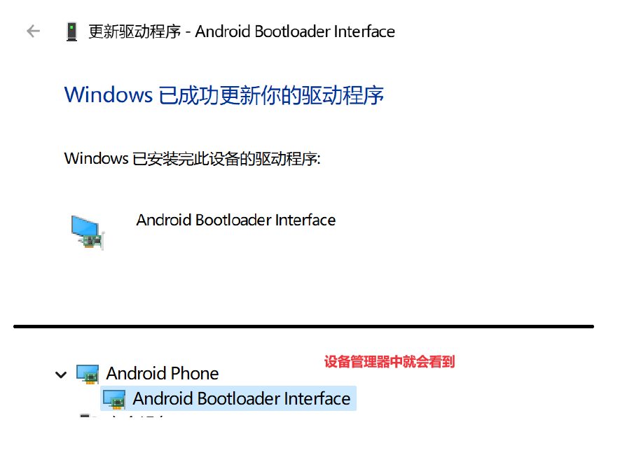

# BSP

BSP（Board Support Package，板级支持包）

是构建嵌入式操作系统所需的引导程序(Bootloader)、内核(Kernel)、根文件系统(Rootfs)和工具链(Toolchain) 提供完整的软件资源包。

# 0 嵌入式系统概述

## 0.1 开发软硬件条件

硬件：

- 开发板
- 电源：5V/2A
- 串口线：
  - 连接电脑与开发版，在设备管理器的端口一栏显示：Prolific PL2303GT USB Serial COM Port，如果不显示这个设备，那么需要去驱动精灵扫描电脑，安装驱动。
  - 使用xshell控制开发板，
- usb下载线：安卓接口线（作用：将系统从pc下载到开发板），插入电脑后，有可能电脑没有发现（设备管理器也看不到相关它的设备），没关系，先向后执行 。

## 0.2 开发板烧写系统

1. 通过xshell和串口线连接开发板

   - 
   - 

2. 连接完成usb下载线不一定会出现设备，

   - 解决方法1：得用x-shell连接开发板，并且进到boot界面，输入fastboot，设备名称才会出现在设备管理器；
   - 解决方法2：多插拔几次。
   - 

3. 更新android设备驱动

   - 
   - 安装fastboot驱动，找到文件夹，并且这个文件夹中需要包含android_winusb.inf
   - 如果安装结果，为失败。失败的话还需要进行[win11禁用驱动程序强制签名](https://www.jb51.net/os/win11/925636.html)
   - 

   

4. [win11禁用驱动程序强制签名](https://www.jb51.net/os/win11/925636.html)

   - 【win + i】---》windows 更新 ---》高级选项 ---》恢复 ---》 高级启动（立即重新启动） ---》 立即启动
   - 疑难解答（重置你的电脑或查看高级选项）---》 高级选项 ---》启动设置（更改windows启动行为）---》重启 ---》禁用驱动程序强制签名（F7）
   - 注意：禁用驱动程序强制签名只在本次启动时生效，当你再次重启电脑，驱动程序强制签名将自动恢复。

5. 启动电脑后，再次更新驱动程序，强制执行。然后在设备管理器就会有

   

6. 烧写系统

   - 一定在xshell的连接中输入fastboot，然后设备就会等待下载

     ```bash
     tarena# fastboot
     
     Fastboot Partitions:
      mmc.2: ubootpak, img : 0x200, 0x78000
      mmc.2: 2ndboot, img : 0x200, 0x4000
      mmc.2: bootloader, img : 0x8000, 0x70000
      mmc.2: boot, fs : 0x100000, 0x4000000
      mmc.2: system, fs : 0x4100000, 0x2f200000
      mmc.2: cache, fs : 0x33300000, 0x1ac00000
      mmc.2: misc, fs : 0x4e000000, 0x800000
      mmc.2: recovery, fs : 0x4e900000, 0x1600000
      mmc.2: userdata, fs : 0x50000000, 0x0
     Support fstype : 2nd  boot  factory  raw  fat  ext4  emmc  nand  ubi  ubifs 
     Reserved part  : partmap  mem  env  cmd 
     Failed to mount ext2 filesystem...
     ** Unrecognized filesystem type **
     can't find bmp at 0x47000000 (type:0xffff), fb:0x46000000...
     LOGO: DRAW FB=0x46000000, X=1024, Y= 600, Bpp=32
     Load USB Driver: android
     Core usb device tie configuration done
     OTG cable Connected!
     ```

   - 执行下载命令.bat，[bat文件中如何书写注释](https://blog.csdn.net/weixin_42109053/article/details/127891822)

     ```bat
     :: ubootpak.bin文件一定要和bat文件的位置，按照如下路径相对应，否则将会找不到ubootpak.bin文件
     fastboot flash ubootpak ./imagev3.0/ubootpak.bin
     ```

   - 开发板会显示flashing ubootpad:done

   - 在xshell中会显示

     ```bash
     Ready : ubootpak
     Starting download of 342724 bytes
     downloading 339968 --  99% complete.
     downloading of 342724 bytes to 0x48000000 (0xf8000000) finished
     Flash : ubootpak
     head boot dev  = 2
     update mmc.2 type 2ndboot = 0x200(0x1) ~ 0x53ac4(0x29e): Done
     Flash : ubootpak - DONE
     ```

   - 

7. 修改分区

   - 重启开发板

   - 在xshell中，3秒内回车，进入uboot，输入分区命令

     ```bash
     qfedu-uboot# mmc erase 0x400 0x40
     
     MMC erase: dev # 2, block # 1024, count 64 ... 
     
     Caution! Your devices Erase group is 0x400
     The erase range would be change to 0x400~0x7ff
     
     64 blocks erased: OK
     
     qfedu-uboot# fdisk 2 8 100000:4000000 4100000:2f200000 33300000:1ac00000 4e000000:800000 4e900000:1600000 50000000:0xc800000 0x5c900000:0x1f400000 0x7be00000:0x0
     qfedu-uboot# 
     
     ```

     

8. 下载内核和文件系统

   - 按下开发板的重启按键，在x-shell中按回车键（3s内），输入fastboot，双击包含一下命令的bat文件

     ```bat
     :: 注意文件位置
     fastboot flash boot ./imagev3.0/boot.img
     fastboot flash gtkfs ./imagev3.0/gtkfs.img
     ```

     ```bash
     # xshell中显示
     Ready : boot
     Starting download of 18804992 bytes
     downloading 18617856 --  99% complete.
     downloading of 18804992 bytes to 0x48000000 (0xf8000000) finished
     Flash : boot
     Flash : boot - DONE
     
     Ready : gtkfs
     Starting download of 251737964 bytes
     downloading 249221120 --  99% complete.
     downloading of 251737964 bytes to 0x48000000 (0xf8000000) finished
     Flash : gtkfs
     Flash : gtkfs - DONE
     
     ```

     

9. 烧写完成，按下开发板的重启键，等待系统跑起来。

   ```bash
   [root@qfedu /home]#ls
   It's_My_Lifei.mp3             mount_nfs.sh
   One_Punch_Man_Main_Theme.MP3  multi_touch_test
   amixer.sh                     opencv_demo
   demo                          set_wireless.sh
   media                         www
   [root@qfedu /home]#
   ```

   

10. 

    

    

    

    

    


## 0.3 嵌入式概念

以应用为中心，以计算机技术为基础，对软硬件可裁剪，对功耗，体积，可靠性，成本都有严格要求的专用计算机系统。

它并不像我们的pc，pc是一个通用的计算机系统

嵌入式系统设备包含：

- 嵌入式微处理器
- 外围硬件设备（Peripheral）
- 嵌入式操作系统


## 0.4 内存寻址

独立寻址：片内片外的存储器选择一个，然后再通过地址选择

统一寻址：片内外存储器都可以使用，按序对所有可用到的存储，进行地址编码


## 0.5 软件怎么访问硬件设备

- 软件->内存->内存映射->特殊功能寄存器->硬件
- 怎么通过内存地址实现对串口（uart）数据的发送
  - 通过原理图结合开发板找到与PC相连的串口uart0
  - 通过数据手册查找uart0的发送数据寄存器映射到了内存什么地址
  - 发送数据地址为：0xc00a1020
  - 向0xc00a1020地址写入数据完成发送


## 0.6 裸机开发特点

- 代码编写过程
  1. 没有操作系统，不能使用带有系统调用的标准c库
  2. 如果要使用到像printf，malloc这些函数都要自行实现
  3. 大量的使用物理内存地址进行数据操作，不像在应用层开发（可以使用虚拟内存）。
- 代码编译过程
  1. 编译（生成.o）和链接分步骤完成，实现对可执行程序的指定链接，并指定链接地址
  2. 裸机环境下，需要将elf（linux系统下的可执行文件）裁剪成纯净的二进制可执行命令文件
  3. 将纯二进制文件下载到链接时指定的物理内存空间，修改PC指向开始执行

## 0.7 GNU常用工具

1. 预处理器：cpp

2. 编译器：gcc/g++

3. 汇编器：as

4. 链接器：ld

5. 二进制工具集：

   - objcopy（段剪辑器）
   - objdump（信息查看器）
     - -h，查看段地址信息
     - -s，段落的内容（content of section，.data，.text等段落）
     - -f，文件头信息
     - -d，反汇编信息
     - -S，内嵌反汇编信息

6. 符号显示器：nm

   - 查看某个符号有没有编译出来，

   - 第一列为符号地址，

   - 第二列符号所在段落

     - b/B-未初始化变量，d/D- .data已初始化变量，r/R- .rodata只读数据段，t/T-.text函数，，符号的小写表示静态，符号大写表示非静态
     - A-不可改变的绝对值，C- .o中为初始化非静态变量，N-调试用的符号，U-符号只声明未定义

   - 第三列符号名称

   - 可以查看.o，或elf文件

   - ```bash
     nm -n main_elf
     ```

   - 

7. 


## 0.8 裸机程序生成与执行

1. 编写源代码

   ```c
   // test.c
   unsigned int xxx = 0x11111111;
   int main(){
       char *str = "A\r\n" ;
       int len = 3;
       unsigned int *p = exc00a1020;
       while( len--){
           *p =*str++;
       }
       return 0;
   }
   ```

2. 只编译不链接

   ```bash
   arm-linux-gcc -c -o test.o test.c
   ```

3. 链接

   ```bash
   arm-linux-ld -o test test.o -Ttext=0x48000000 -e main
   # -Ttext:				使用指定的地址作为文本段的起始点，因为文本段（其他段落都在文本段后面）作为程序的起始地址。
   # -e:				使用指定的符号作为程序的初始执行点
   ```

   

4. 裁剪elf文件，去除elf格式

   ```c
   arm-linux-objcopy -O binary -S test test.bin
   ```

   

5. 下载裸机程序到开发板上

   - 进入开发板的uboot（开启后3秒内，迅速回车）
   - 在命令行敲 "?"，就可以看见所有可以使用的命令
   - 可以看到loadb命令可以使用，执行`loadb 0x48000000`，引导程序就会等待你上传程序，我们就需要在xshell中上传程序。
   - [用串口进行数据传输](https://blog.csdn.net/qq_54704926/article/details/132540417)
   - 
   - 使用go执行程序，`go 0x48000000`
   - 

# 1 bootloader应用

引导程序，是为了引导磁盘中的程序去执行。


bootloader的种类：

- 针对不同的cpu架构：
  - 针对X86架构的有LILO、GRUB、ntldr等
  - 针对ARM架构的有vivi、armboot等
  - 针对PPC架构的有ppcboot等
  - 可以支持多种架构的u-boot等
- 针对不同的操作系统：
  - 专门用来启动Linux系统的vivi
  - 专门用来启动WinCE系统的eboot
  - 基于eCos系统的引导程序redboot
  - 可以启动多种操作系统的u-boot等

由于boot设计 比较偏底层，所以根据CPU架构和OS类型可能有所不同

uboot是对CPU架构和OS类型支持得比较多的一种开源引导程序


```bash
# uboot查看环境变量
printenv
# ...
bootargs=root=/dev/mmcblk0p8 init=/linuxrc console=ttySAC1,115200 lcd=wy070ml tp=gslx680
# ...

# uboot进入linux操作系统
boot

# linux操作系统查看uboot传参，/proc/cmdline，它包含了系统引导时传递给内核的参数
cat /proc/cmdline
console=ttySAC0,115200n8 androidboot.hardware=x6818 androidboot.console=ttySAC0 androidboot.serialno=0123456789abcdef initrd=0x49000000,0x1000000 root=/dev/mmcblk0p8 init=/linuxrc console=ttySAC1,115200 lcd=wy070ml tp=gslx680

# linux操作系统回到uboot
reboot

# uboot命令行修改bootargs
setenv bootargs root=/dev/mmcblk0p8 init=/linuxrc console=ttySAC1,115200 lcd=wy070ml tp=gslx681
# 然后再查看就发现bootargs发生了变化，操作系统中也发生了变化
printenv
bootargs=root=/dev/mmcblk0p8 init=/linuxrc console=ttySAC1,115200 lcd=wy070ml tp=gslx681
```

## uboot

**uboot的本质就是一段裸机程序。**

uboot就是一个bootloader（启动加载器），作用就是用于 初始化DDR和启动内核操作系统

uboot源码获取：

- 官网：https://source.denx.de/u-boot/u-boot（不建议，可能用不起来）
- 从芯片原厂获取配套的BSP。SOC厂商会从uboot官网下载某一个版本的uboot，然后在这个版本的uboot上加入相应的SOC以及驱动。这就是SOC厂商定制版的uboot。
- 做开发板的厂商，开发板会参考SOC厂商的板子。开发板必然会和官方的板子不一样。因此开发板厂商又会去修改SOC厂商做好的uboot，以适应自己的板子。
- 官方引导程序由于与硬件平台差异，所以并不能下载直接运行（需要经过修改，调试和移植）

## uboot源码分析


## uboot配置编译

```bash
# 进入uboot源码目录
cd u-boot-2014.07

# 清除编译痕迹（第一次进入源码目录时）
make distclean

# 生成配置目标
make x6818_config

# 编译，编译完成后，会在源码根目录生成镜像文件ubootpak.bin，也就是之前烧写系统的过程中使用到的ubootpak.bin文件
# gcc工具均要使用arm的gcc，因为宿主机是x86工具，我们要使用交叉编译，编译为arm可以使用的程序。首先安装arm的gcc编译工具，然后再在PATH指定命令所在的位置
# 使用root编译，然后make，如果make -j10不行， 就使用make，不要用多线程编译，否则会出错
make

# 如果不确定，make编译的是自己修改后的u-boot，那么可以选择修改相应的配置，来验证自己的修改是否被编译
vim include/configs/x6818.h
#define CONFIG_SYS_PROMPT		"qfedu-uboot"			# 可以修改成自己需要的，然后再编，再烧进去就好了。

# 烧写的过程查看开发板烧写系统0.2 章节
```

## uboot配置目标的过程分析

```bash
# 在上面的编译过程中，我们摘出生成配置目标的过程，进行着重分析
# 生成配置目标
make x6818_config
# 上面这一句的执行，其实对应的是Makefile中一个目标的编译，但如果你在Makefile中查找x6818_config，你是找不到的，因为uboot是面向很多芯片的，所以你肯定找不到，它会x6818进行一个通配，然后将通配的结果变成一个变量存储。如果你搜索_config，你是可以找到

%_config:: outputmakefile
	@$(MKCONFIG) -A $(@:_config=)

# 上面在Makefile中对应xxx_config目标的生成，这个目标的生成会执行 @$(MKCONFIG) -A $(@:_config=)命令，而这命令又代表了一段脚本的执行,
# 当我们删除这句命令最前面的@符号，删除后，屏幕就会输出这句命令的实际执行是什么

..../u-boot-2014.07/mkconfig -A x6818			

# mkconfig是一个脚本，-A和x6818 是两个传入mkconfig的参数
if [ \( $# -eq 2 \) -a \( "$1" = "-A" \) ] ; then				# $1是-A，$2是x6818
        # Automatic mode
        line=`awk '($0 !~ /^#/ && $7 ~ /^'"$2"'$/) { print $1, $2, $3, $4, $5, $6, $7, $8 }' $srctree/boards.cfg`
        # 然后从当前文件夹下的boards.cfg（u-boot-2014.07/boards.cfg），找到并读入x6818的行，作为这个脚本的新命令行参数
        
        # 就相当于这个脚本执行是，如下
        # u‐boot‐2014.07/mkconfig Active arm slsiap s5p6818 s5p6818 x6818 x6818 ‐
        
        if [ -z "$line" ] ; then
                echo "make: *** No rule to make target \`$2_config'.  Stop." >&2
                exit 1
        fi

        set ${line}
        # add default board name if needed
        [ $# = 3 ] && set ${line} ${1}
fi

# mkconfig将定义的变量值修改成命令行获取到的参数，并存入include/config.mk文件中
ARCH = arm
CPU = slsiap
BOARD = x6818
VENDOR = s5p6818
SOC = s5p6818

# 并且mkconfig创建了include/config.h文件，并写入了一个定制的头文件及目标平台相关信息
#
# Create board specific header file
#
if [ "$APPEND" = "yes" ]        # Append to existing config file
then
        echo >> config.h
else
        > config.h              # Create new config file
fi
echo "/* Automatically generated - do not edit */" >>config.h

for i in ${TARGETS} ; do
        i="`echo ${i} | sed '/=/ {s/=/  /;q; } ; { s/$/ 1/; }'`"
        echo "#define CONFIG_${i}" >>config.h ;
done

echo "#define CONFIG_SYS_ARCH  \"${arch}\""  >> config.h
echo "#define CONFIG_SYS_CPU   \"${cpu}\""   >> config.h
echo "#define CONFIG_SYS_BOARD \"${board}\"" >> config.h

[ "${vendor}" ] && echo "#define CONFIG_SYS_VENDOR \"${vendor}\"" >> config.h

[ "${soc}"    ] && echo "#define CONFIG_SYS_SOC    \"${soc}\""    >> config.h

[ "${board}"  ] && echo "#define CONFIG_BOARDDIR board/$BOARDDIR" >> config.h
cat << EOF >> config.h
#include <config_cmd_defaults.h>
#include <config_defaults.h>
#include <configs/${CONFIG_NAME}.h>									// 这里写入了平台相关的头文件
#include <asm/config.h>
#include <config_fallbacks.h>
#include <config_uncmd_spl.h>
EOF


# include/config.h，这个文件是u-boot所有源代码都会包含的头文件，这里面包含了平台相关的头文件
/* Automatically generated - do not edit */
#define CONFIG_SYS_ARCH  "arm"
#define CONFIG_SYS_CPU   "slsiap"
#define CONFIG_SYS_BOARD "x6818"
#define CONFIG_SYS_VENDOR "s5p6818"
#define CONFIG_SYS_SOC    "s5p6818"
#define CONFIG_BOARDDIR board/s5p6818/x6818
#include <config_cmd_defaults.h>
#include <config_defaults.h>
#include <configs/x6818.h>					//这就是目标平台自定义头文件
#include <asm/config.h>
#include <config_fallbacks.h>
#include <config_uncmd_spl.h>


# x6818.h中的裁剪配置宏均以CONFIG_开头
# 这个宏会被脚本解析成变量定义在include/autoconf.mk（编译时自动【由makefile里面的工具】产生，最初定义在include/configs/x6818.h）
# include/autoconf.mk最后又会被Makefile所包含，并决定哪些文件需要编译
```


## uboot镜像的产生

- 链接脚本定义在arch/arm/cpu/slsiap/u-boot.lds

- 在make 编译的时候，如果我们想看最后的链接过程所执行的命令，我们可以`make V=1`。

  ```bash
   arm-linux-ld  -pie --gc-sections -Bstatic -Ttext 0x43C00000 -o u-boot -T u-boot.lds arch/arm/cpu/slsiap/start.o --start-group  arch/arm/cpu/built-in.o ....
  ```

- 裁剪镜像去格式处理

  ```bash
  arm-linux-objcopy -j .text -j .rodata -j .hash -j .data -j .got.plt -j .u_boot_list -j .rel.dyn --gap-fill=0xff -O binary u-boot u-boot.bin
  # uboot源码生成的可执行程序是：u-boot.bin
  ```

- 镜像打包

  ```bash
  ./tools/mk6818 ubootpak.bin nsih.txt 2ndboot u-boot.bin
  ```

- 镜像组成：nsih + 2ndboot + u-boot.bin = ubootpak.bin

  - nsih.txt：完成异常向量表设置、系统时钟配置、DDR初始化
  - 2ndboot：是一个纯二进制指令，是由厂商提供无源码
  - u-boot.bin：uboot源码生成的可执行程序

- 

## uboot命令

### 环境变量类指令

```bash
# 打印环境变量
printenv	

baudrate=115200				# 串口控制台波特率
bootargs=root=/dev/mmcblk0p8 init=/linuxrc console=ttySAC1,115200 lcd=wy070ml tp=gslx680
bootcmd=ext4load mmc 2:1 0x48000000 uImage;bootm 0x48000000				# 自动启动时执行的命令
bootdelay=3
bootfile=uImage
ethaddr=00:e2:1c:ba:e8:60
fastboot=flash=mmc,2:ubootpak:2nd:0x200,0x78000;flash=mmc,2:2ndboot:2nd:0x200,0x4000;flash=mmc,2:bootloader:boot:0x8000,0x70000;	# 传递给内核的启动参数
flash=mmc,2:boot:ext4:0x00100000,0x04000000;flash=mmc,2:system:ext4:0x04100000,0x2F200000;flash=mmc,2:cache:ext4:0x33300000,0x1AC00000;flash=mmc,2:misc:emmc:0x4E000000,0x00800000;flash=mmc,2:recovery:emmc:0x4E900000,0x01600000;flash=mmc,2:userdata:ext4:0x50000000,0x0c800000;flash=mmc,2:gtkfs:ext4:0x5c900000,0x1f400000;flash=mmc,2:reserve:ext4:0x7be00000,0x0;		# 分区
filesize=1c2036
gatewayip=192.168.1.254
ipaddr=192.168.1.165
netmask=255.255.255.0	
serverip=192.168.1.164
stderr=serial
stdin=serial
stdout=serial

# 设置环境变量
setenv bootdelay 10		# 在启动设备后，如果10秒内不作出任何操作，将进入操作系统
# 保存环境变量
saveenv 		# 设置环境变量之后，需要save一下，否则设置不生效，开机后仍然为原值

# 其他环境变量
# loadaddr 串口下载缺省地址
```

### 下载文件的命令

- loadb 0x48000000（通过串口下载文件到**内存**中，如果不跟地址，那么它会下载到loadaddr环境变量所定义的地址去）
- fastboot （通过USB下载文件到**磁盘**中，需要安装开发板的驱动才行）
- tftp 0x48000000（通过网络下载文件到**内存**中，下载时需要借助一个PC端TFTP工具(TFTP+DHCP_Server/tftpd32.exe)。tftp方式下载时，实际上uboot扮演的是tftp客户端程序角色，主机windows或虚拟机ubuntu中必须有一个tftp服务器，然后将要下载的镜像文件放在服务器的下载目录中，然后开发板使用ubuntu的tftp命令下载即可。）

### 启动内核命令

- boot（从外存启动）
- bootm 0x48000000（从内存指定的某个地址启动系统）
- 从上位机启动（主要用于调试内核）
  * fastboot flash app uImage（先从PC端下载镜像到内存0x48000000）
  * bootm 0x48000000（再从指定内存启动系统）
- 

### 其他

```bash
# 查看命令
?
help
help command	# 查看命令的使用

# 重启uboot
reset
```

## 自定义uboot命令

1. 在common文件夹下新建cmd_helloworld.c

   ```c
   #include <common.h>
   #include <command.h>
   
   #if defined CONFIG_CMD_HELLOWORLD
   
   static int helloworld(cmd_tbl_t *cmdtp, int flag, int argc,char * const a
   rgv[])
   {
    	int i;
    	for(i=0;i<argc;i++){
   		 printf("argv[%d] = %s\n",i,argv[i]);
    	}
    	return 0;
    }
   
   
   U_BOOT_CMD(
    hello, 3, 0,helloworld,
    "hello command",
    "[ off ] [ baud ]\n"
    " ‐ xxxxxxxxx"
    " yyyyyyyyyyyyy"
    );
   // 命令名称、最大参数个数、重复次数、命令执行函数、用法、帮助。
   #endif /* CONFIG_CMD_HWFLOW */
   ```

   

2. 在include/configs/x6818.h里面加一个配置项，用来配置此命令是否生效

   ```c
   ...
   #define CONFIG_CMD_HELLOWORLD 1
   ...
   ```

3. 在common/Makefile中增加一项

   - 在make后，查看是否生效，首先查看common下是否有cmd_helloworld.o是否生成

   ```makefile
   obj‐y += cmd_helloworld.o
   ```


#### 命令的调用过程

```bash
board_init_r()->main_loop() #如果没有按下按键就直接进入操作系统，如果按下就开始按照下面的调用流程
autoboot_command()->run_command_list()->parse_string_outer()->setup_string_in_str()->parse_stream_outer()->parse_stream()->
run_list()->run_list_real()->run_pipe_real()->cmd_process()->find_cmd()
```

从控制台输入的命令都被送到common/command.c中的find_cmd()函数解释执行，根据匹配输入的命令，从列表中找出对应的命令结构体，并调用其回调处理函数完成命令处理

## 启动过程

boot为标准的两阶段启动bootloader

-  第一阶段为汇编代码(2ndboot)，主要为初始化cpu硬件体系结构
  - 1、禁用看门狗、初始化系统时钟
    2、设置异常向量表(用到中断的情况下设置)
    3、动态内存控制器初始化配置
    4、初始化调试指示灯(可选)
    5、初始化UART，用于开发调试(可选)
    6、从NAND、NOR或SD卡中复制代码到DRAM
    7、跳转并进入Bootloader第二阶段
-  第二阶段为c程序代码(u-boot.bin)，主要提供多种复杂命令并引导操作系统
  - 1、汇编阶段核心初始化
    2、初始化GPIO
    3、初始化MMC等存储设备
    4、MMU初始化
    5、各类通信设备相关驱动初始化
    6、环境变量和参数的加载及初始化
    7、倒计时监听串口(进入命令模式或启动内核)
    8、启动内核(拷贝内核镜像并跳转到内核入口)

内核启动过程：

1.  通过ext4load或fastboot下载一个内核uImage到内存0x48000000

2. 通过bootm 0x48000000启动内核。前两个步骤可以通过bootcmd环境变量可以看到：ext4load mmc 2:1 0x48000000 uImage;bootm 0x48000000

3. 查看bootm命令的common/cmd_bootm.c，找到他的回调函数do_bootm()

   ```bash
   1 do_bootm() ‐>
   2 do_bootm_states() ‐>
   3 bootm_os_get_boot_func() ‐>
   4 boot_os[] ‐>
   5 do_bootm_linux() ‐>
   6 boot_jump_linux() ‐>
   7 kernel_entry(0, machid, r2);//启动内核
   ```

   
