# Driver

操作系统五大功能：进程管理，内存管理，网络管理，文件系统，设备管理

计算机系统中存在着大量的设备，操作系统要求能够控制和管理这些硬件，而驱动就是帮助操作系统完成这个任务。

驱动相当于硬件的接口，它直接操作、控制着我们的硬件，操作系统通过驱动这个接口才能管理硬件。

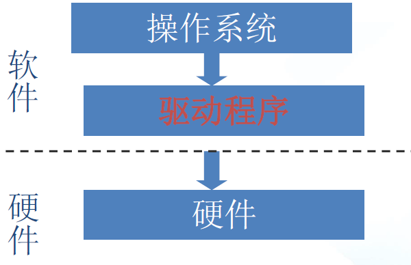

# 0 概述

## 0.1 驱动与应用程序

- 驱动程序本身也是代码，但与应用程序不同，它不会主动去运行，而是被调用。这调用者就是应用程序。
- 驱动一般不会主动运行，由应用程序调用而被动执行。
- 驱动与应用是服务与被服务的关系。驱动是为应用服务的。应用程序通过**系统调用**陷入内核调用驱动，从而操作硬件。
  - 系统调用：内核提供给用户程序的一组“特殊”函数接口，用户程序可以通过这组接口获得内核提供的服务
- 应用程序运行在用户空间(用户态)，驱动代码运行于内核空间(内核态)。
- 驱动开发的所有接口均来自内核，只要内核能提供的接口，就不要自己开发。

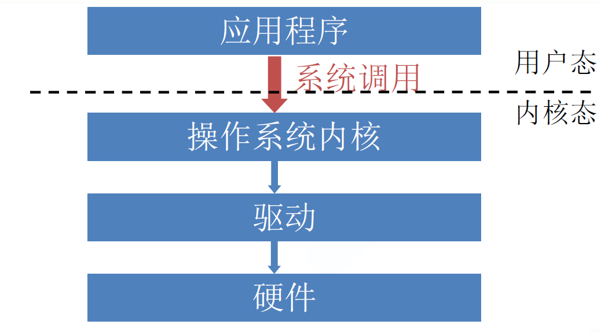

应用程序访问驱动的流程：

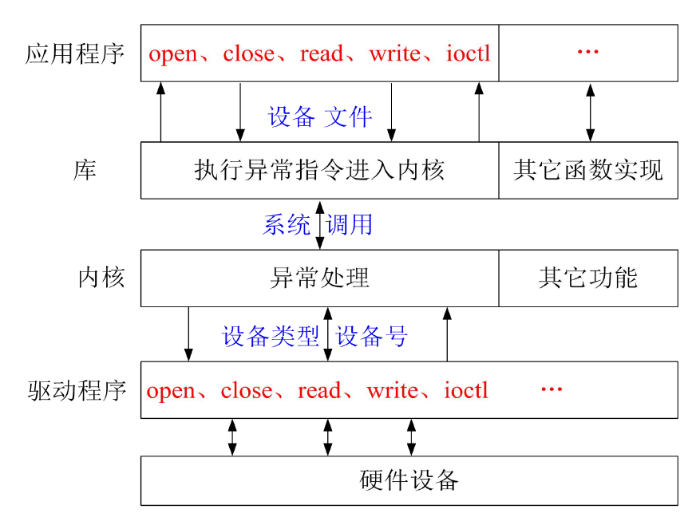

- 应用程序调用函数库完成一系列功能，库函数通过系统调用由内核完成相应功能，内核处理系统调用，内核通过设备类型和设备号找到唯一的驱动，再由驱动操作硬件。


**驱动开发过程中使用的库函数，内核通常都有重新实现，接口类似标准C库**

## 0.2 驱动分类

linux中驱动分为：

- 字符设备驱动：读写线性实时
  - I/O传输过程中以字符（字节）为单位进行传输
  - 用户对字符设备发出读/写请求时，实际的硬件读/写操作一般紧接着发生
- 块设备驱动：读写非线性非实时
  - 数据传输以块（内存缓冲）为单位传输
  - 磁盘类、闪存类等设备都封装成块设备。
- 网络设备驱动，通过套接字socket接口函数访问


## 0.3 设备文件/设备号

### 设备文件

linux中设备文件在/dev中，

- linux把设备抽象成文件,“一切设备皆文件”。所以对硬件的操作全部抽象成对文件的操作。
- 设备文件大小为0
- 设备文件主要记录了设备类型（b 块设备，c字符设备）和设备号（主设备号，从设备号）
- 设备文件是应用程序访问驱动程序的桥梁

```bash
# 从ls可以看出来，本来如果是普通文件，它是有内存大小的区别的，而我们的设备文件是没有内存大小的，而且在原本该显示内存大小的地方却显示了设备号。
# 第五列可以看出来，普通文件显示的是占用的内存大小，而设备文件是设备号
# 并且在total行，一个显示的是188，一个显示的是0
ls -l /dev
total 0
brw-rw----    1 root     root      179,   0 Jan  1  1970 mmcblk0					# b代表的是块设备
brw-rw----    1 root     root      179,   8 Jan  1  1970 mmcblk0boot0				# 第5列显示的是 主设备号，从设备号
crw-rw----    1 root     root        5,   0 Jan  1  1970 tty						# c代表的是字符设备
crw-rw----    1 root     root        4,   0 Jan  1  1970 tty0
crw-rw----    1 root     root        4,   1 Jan  1  1970 tty1

ls -l /etc
total 188
-rwxr--r--    1 1003     1003            90 Mar 20  2017 README.txt
-rwxr-xr-x    1 1003     1003           377 Nov 27  2013 fstab
-rwxr-xr-x    1 1003     1003            15 Nov 27  2013 group
drwxr-xr-x    2 1003     1003          4096 Nov 27  2013 hotplug
-rwxr-xr-x    1 1003     1003          5615 Aug 15  2013 httpd.conf
```

### 设备号

- **主设备号**
  - 用于标识驱动程序，一个驱动程序只能有一个主设备号，主设备号一样的设备文件将使用同一类驱动程序。
  - 范围：1-254，0有特殊的用途
- **从设备号**
  - 用于标识使用同一驱动程序的不同具体硬件和功能。
  - 从设备号一般都是用户手动指定分配的
  - 范围：0-255

通过`ls -l /dev`查看第五列，可以看到主设备号和从设备号

```bash
# 通过/proc/devices文件可以查看主设备号，但无法查看从设备号
cat /proc/devices 

Character devices:
  1 mem
  4 /dev/vc/0
  4 tty
  5 /dev/tty
  5 /dev/console
  5 /dev/ptmx
  7 vcs
 10 misc
 13 input

Block devices:
259 blkext
  7 loop
  8 sd
 11 sr
 65 sd
 66 sd
 67 sd
 68 sd
 69 sd

```

## 0.4 linux模块化编程

- 控制内核大小（不需要的组件可以不编入内核）
- 调试开发灵活（模块可以同普通软件一样，从内核中添加或删除）
- 独立于内核，可以单独编译和加载运行

Linux内核模块的编译方法有**两种**：

- 放入Linux内核源码中编译

  * 将写好的模块放入Linux内核任一目录下
  * 修改相应目录下的Kconfig和Makefile文件
  * 执行make modules
  * 会在相同目录下生成与源文件同名的.ko文件

- 采用独立的方法编译模块

  - 需要独立的Makefile

    ```makefile
    obj-m += demo_module.o
    KERNELDIR := /home/buntu/sambaShare/kernel-3.4.39
    PWD := $(shell pwd)
    
    modules:
    	$(MAKE) -C $(KERNELDIR) M=$(PWD) modules
    	rm -rf *.order *.mod.* *.o *.symvers
    
    clean:
    	make -C $(KERNELDIR) M=$(PWD) clean
    	rm -rf *.ko
    
    
    # 如果make时有问题（但不是代码问题），那么手动敲一遍
    # obj-m 是用于 Linux 内核模块编译的 Makefile 中的一种特殊约定，它用来指定要编译的模块对象文件。
    # KERNELDIR：指定内核源码的路径
    
    # $(MAKE) ‐C $(KERNELDIR) M=$(PWD) modules
    # $(MAKE)：MAKE变量用来确保在多层次的构建过程中，使用相同的 make 程序。并且$(MAKE) 还会自动传递命令行参数给子模块，例如父模块的makefile用的是make -j4 ，那么子模块在$(MAKE)就代表的是make -j4，这里会带参传递
    # -C 选项的作用是指将当前工作目录转移到你所指定的位置。
    # “M=”选项的作用是，当用户需要以某个内核为基础编译一个外部模块的话，需要在make modules 命令中加入“M=dir”，程序会自动到你所指定的dir目录中查找模块源码，将其编译，生成KO文件。
    # modules 是一个通用的目标，适用于编译所有在当前目录中的模块源文件。你不需要将 modules 具体化为某个特定的模块名，它会自动识别并编译 Makefile 中定义的所有模块。
    
    # "$(MAKE) -C $(KDIR) M=$(PWD)"与"$(MAKE) -C $(KDIR) SUBDIRS =$(PWD)"的作用是等效的，后者是较老的使用方法。推荐使用M而不是SUBDIRS
    ```
  
  - 三步实现一个内核模块
  
    ```c
    // 首先确定你的模块存放位置，建议存放在内核源码目录下的debug目录
    
    // 相关宏，相关函数放在此头文件
    #include <linux/module.h>
    
    static int __init demo_module_init(void)
    {
    	printk(KERN_WARNING "L%d‐>%s()\n",__LINE__,__FUNCTION__);
    	return 0;
    }
    static void __exit demo_module_exit(void)
    {
    	printk(KERN_WARNING "L%d‐>%s()\n",__LINE__,__FUNCTION__);
    }
    // 声明模块初始化回调
    module_init(demo_module_init);
    // 声明模块退出时回调
    module_exit(demo_module_exit);
    
    // 第一步：声明GPL
    MODULE_LICENSE("GPL");
    MODULE_DESCRIPTION("xxxxxxxxxxxxxxxx");
    ```
  
- **上述模块是在虚拟机中编译，而下面的指令是在开发板中执行。**

- 模块操作指令

  - lsmod 列举当前系统中的所有模块

  - insmod xxx.ko 加载指定模块到内核

    ```bash
    # 如果你在虚拟机中，执行insmod，就会报如下的错
    insmod demo_module.ko 
    insmod: ERROR: could not insert module demo_module.ko: Invalid module format
    
    # 因为虚拟机linux内核的版本，和开发板内核的版本不一致
    # https://blog.csdn.net/zhangna20151015/article/details/119596386
    ```

    

  - rmmod xxx 卸载指定模块(不需要.ko后缀)

  - modinfo xxx.ko 查看模块信息

- 手动创建设备文件（节点）：`mknod /dev/mychardev c 240 0`


# 1 字符设备驱动

内核中超过一半的代码都是驱动代码，而驱动代码里面有一半代码都是字符设备的驱动代码。

字符设备是最基本、最常用的设备。它将千差万别的各种硬件设备采用一个统一的接口封装起来，屏蔽硬件差异，简化了应用层的操作。

- **字符驱动开发的过程，就是一个实现 与系统调用一一对应函数接口 的过程**
- 接口实现之后，应用程序通过file_operations与驱动建立连接。
- **驱动的open/read/write函数**实际上是由一个叫**file_operations**的结构体统一管理的。**file_operations里面包含了一组函数指针,这组函数指针指向驱动open/read/write等几个函数。**一个打开的设备文件就和该结构体关联起来，结构体中的函数实现了对文件的系统调用。

```c
struct file_operations {
	struct module *owner;
	loff_t (*llseek) (struct file *, loff_t, int);
	ssize_t (*read) (struct file *, char __user *, size_t, loff_t *);
	ssize_t (*write) (struct file *, const char __user *, size_t, loff_t *);
	ssize_t (*aio_read) (struct kiocb *, const struct iovec *, unsigned long, loff_t);
	ssize_t (*aio_write) (struct kiocb *, const struct iovec *, unsigned long, loff_t);
	int (*readdir) (struct file *, void *, filldir_t);
	unsigned int (*poll) (struct file *, struct poll_table_struct *);
	long (*unlocked_ioctl) (struct file *, unsigned int, unsigned long);
	long (*compat_ioctl) (struct file *, unsigned int, unsigned long);
	int (*mmap) (struct file *, struct vm_area_struct *);
	int (*open) (struct inode *, struct file *);
	int (*flush) (struct file *, fl_owner_t id);
	int (*release) (struct inode *, struct file *);
	int (*fsync) (struct file *, loff_t, loff_t, int datasync);
	int (*aio_fsync) (struct kiocb *, int datasync);
	int (*fasync) (int, struct file *, int);
	int (*lock) (struct file *, int, struct file_lock *);
	ssize_t (*sendpage) (struct file *, struct page *, int, size_t, loff_t *, int);
	unsigned long (*get_unmapped_area)(struct file *, unsigned long, unsigned long, unsigned long, unsigned long);
	int (*check_flags)(int);
	int (*flock) (struct file *, int, struct file_lock *);
	ssize_t (*splice_write)(struct pipe_inode_info *, struct file *, loff_t *, size_t, unsigned int);
	ssize_t (*splice_read)(struct file *, loff_t *, struct pipe_inode_info *, size_t, unsigned int);
	int (*setlease)(struct file *, long, struct file_lock **);
	long (*fallocate)(struct file *file, int mode, loff_t offset,
			  loff_t len);
};
```


## 1.1 开发框架

### 1.1.1 手动创建设备驱动

- 实现file_operations接口
- 在xxx_module_init里：注册字符设备驱动`register_chrdev(major, name, fops);`，手动指定主设备号
- 在xxx_module_exit里：注销字符设备驱动`unregister_chrdev(major, name);`
- 模块编译make（参考0.4 linux模块化编程）
- 安装驱动模块`insmod xxx.ko`：使驱动可以在`cat /proc/devices` 中看到
- 创建设备节点`mknod /dev/mychardev c 242 0`
  - c-字符设备，242-主设备号，0-从设备号
  - 使其可以在`/dev`文件夹下看到设备文件

```c
#include <linux/module.h>
#include<linux/fs.h>

static int demo_open (struct inode *pinode, struct file *pfile){
	printk(KERN_WARNING "L%d‐>%s()\n",__LINE__,__FUNCTION__);
	return 0;
}

static ssize_t demo_read (struct file *pifle, char __user *pbuf, size_t count, loff_t *off){
	printk(KERN_WARNING "L%d‐>%s()\n",__LINE__,__FUNCTION__);
	return 0;
}

static ssize_t demo_write (struct file *pifle, const char __user *pbuf, size_t count, loff_t *off){
	printk(KERN_WARNING "L%d‐>%s()\n",__LINE__,__FUNCTION__);
	return count;	//返回0是写入失败，返回>0写入成功

}
static int demo_release (struct inode *pinode, struct file *pfile){
	printk(KERN_WARNING "L%d‐>%s()\n",__LINE__,__FUNCTION__);
	return 0;
}


static struct file_operations fops = {
	.owner = THIS_MODULE,
	.open = demo_open,
	.read = demo_read,
	.write = demo_write,
	.release = demo_release,
		
};

static int __init demo_module_init(void)
{
	printk(KERN_WARNING "L%d‐>%s()\n",__LINE__,__FUNCTION__);
	register_chrdev(242, "demo_chr", &fops);		// 返回值为主设备号
    // 如果242修改为0，即可动态获取设备号
	return 0;
}

static void __exit demo_module_exit(void)
{
	printk(KERN_WARNING "L%d‐>%s()\n",__LINE__,__FUNCTION__);
	unregister_chrdev(242, "demo_chr");
}

// 声明模块初始化回调
module_init(demo_module_init);

// 声明模块退出时回调
module_exit(demo_module_exit);

// 第一步：声明GPL
MODULE_LICENSE("GPL");


MODULE_DESCRIPTION("xxxxxxxxxxxxxxxx");
```


### 1.1.2 灵活创建设备驱动

- 实现file_operations接口
- 在xxx_module_init里
  - 动态获取设备号：为防止设备号冲突
    - 使用 `alloc_chrdev_region` 分配设备号。
  - 初始化并添加设备驱动：使驱动可以在`cat /proc/devices` 中看到
    - 使用 `cdev_init` 初始化字符设备结构体，并使用 `cdev_add` 将其添加到内核中。
  - 创建设备类和设备节点
    - 使用 `class_create(owner,classname)` 创建设备类，这个函数会在`/sys/class`中创建一个同name名的文件夹
    - 使用 `device_create` 创建设备节点
      - 在`/sys/class/classname`创建了一个`devicename`文件夹，cat 这个`devicename`文件夹下的uevent文件，可以看到主设备号，从设备号，设备名。
      - 在这个使其可以在`/dev`文件夹下看到设备文件`/dev/devicename`
- 在xxx_module_exit里，和注册的顺序相反
  - 注销设备device_destroy
  - 注销设备类class_destroy
  - 删除设备结构体cdev_del
  - 回收设备号资源unregister_chrdev_region

```c
#include <linux/module.h>
#include <linux/fs.h>
#include <linux/cdev.h>
#include <linux/uaccess.h>
#include <linux/device.h>

#define DEVICE_NAME "mychardev"
#define DEVICE_CLASS_NAME "mycharcls"
#define DEVICE_COUNT 1

static dev_t dev;
static struct cdev my_cdev;
static struct class *my_class;

static int my_open(struct inode *inode, struct file *file)
{
    printk(KERN_INFO "Device opened\n");
    return 0;
}

static int my_release(struct inode *inode, struct file *file)
{
    printk(KERN_INFO "Device closed\n");
    return 0;
}

static ssize_t my_read(struct file *file, char __user *buf, size_t count, loff_t *ppos)
{
    printk(KERN_INFO "Read from device\n");
    return 0;
}

static ssize_t my_write(struct file *file, const char __user *buf, size_t count, loff_t *ppos)
{
    printk(KERN_INFO "Write to device\n");
    return count;		//返回0是写入失败，返回>0写入成功
}

static struct file_operations fops = {
    .owner = THIS_MODULE,
    .open = my_open,
    .release = my_release,
    .read = my_read,
    .write = my_write,
};

static int __init my_init(void)
{
    int ret;

    // 分配设备号
    ret = alloc_chrdev_region(&dev, 0, DEVICE_COUNT, DEVICE_NAME);
    if (ret < 0) {
        printk(KERN_ERR "Failed to allocate chrdev region\n");
        return ret;
    }

    // 初始化 cdev 结构体
    cdev_init(&my_cdev, &fops);
    my_cdev.owner = THIS_MODULE;

    // 将 cdev 添加到系统中
    ret = cdev_add(&my_cdev, dev, DEVICE_COUNT);
    if (ret < 0) {
        unregister_chrdev_region(dev, DEVICE_COUNT);
        printk(KERN_ERR "Failed to add cdev\n");
        return ret;
    }

    // 创建设备类
    my_class = class_create(THIS_MODULE, DEVICE_CLASS_NAME);
    if (IS_ERR(my_class)) {
        cdev_del(&my_cdev);
        unregister_chrdev_region(dev, DEVICE_COUNT);
        printk(KERN_ERR "Failed to create class\n");
        return PTR_ERR(my_class);
    }

    // 创建设备节点
    device_create(my_class, NULL, dev, NULL, DEVICE_NAME);

    printk(KERN_INFO "Device initialized successfully\n");
    return 0;
}

static void __exit my_exit(void)
{
    device_destroy(my_class, dev);
    class_destroy(my_class);
    cdev_del(&my_cdev);
    unregister_chrdev_region(dev, DEVICE_COUNT);
    printk(KERN_INFO "Device exited successfully\n");
}

module_init(my_init);
module_exit(my_exit);

MODULE_LICENSE("GPL");
MODULE_AUTHOR("Your Name");
MODULE_DESCRIPTION("A simple character device driver");
```

```bash
cat /dev/mychardev
[157267.417000] Device opened
[157267.417000] Read from device
[157267.417000] Device closed

echo xxxx > /dev/mychardev
[157323.403000] Device opened
[157323.404000] Write to device
[157323.404000] Device closed
```

### register_chrdev和alloc_chrdev_region的区别

设备号注册两种办法：

- 指定主从设备号并告知内核
- 从内核中动态申请主从设备号

- `alloc_chrdev_region` 
  - 用于动态分配一个主设备号和多个次设备号。
  - 它可以确保主设备号不会与现有的设备号发生冲突，因为内核会选择一个未被使用的主设备号进行分配。
- `register_chrdev` 
  - 既可以分配一个静态指定的主设备号，也可以动态分配一个主设备号（通过传入 0 作为主设备号）
  - 函数返回值为主设备号（>0分配成功并为设备号，小于0分配失败）。
  - 并注册字符设备的文件操作结构体。相比 `alloc_chrdev_region`，它还会同时注册一个字符设备驱动程序，并关联文件操作函数。

### 1.1.3 简单调用

```c
#include<linux/module.h>
#include<linux/fs.h>
#include<device.h>
#include<uaccess.h>

....

static ssize_t my_read(struct file *file, char __user *buf, size_t count, loff_t *ppos)
{
    printk(KERN_INFO "Read from device\n");
    int ret;
    int len = min(count,sizeof(data));
    ret = copy_to_user(buf, data, len);
    printk(KERN_WARNING "L%d->%s()\n", __LINE__, __FUNCTION__);
    return len;			// 在使用cat命令时，如果返回0则读取结束，如果大于0则继续读
}

static ssize_t my_write(struct file *file, const char __user *buf, size_t count, loff_t *ppos)
{
    int ret;
    char data[100];
    int len = min(count,sizeof(data));
    ret = copy_from_user(data, buf, len);
    printk(KERN_WARNING "L%d->%s():%s\n", __LINE__, __FUNCTION__, data);
    return count;		//返回0是写入失败，返回>0写入成功
}
...
```

```c
#include<stdio.h>
#include<sys/types.h>
#include<sys/stat.h>
#include<fcntl.h>
#include<string.h>

void read_test(){
    int fd;
    char data[100];
    fd = open("/dev/mychardev", O_RDWR);
    read(fd, data, 100);
    printf("%s\n", data);
}
void write_test(){
    int fd;
    char data[100] = "hello driver!\n";
    fd = open("/dev/mychardev", O_RDWR);
    write(fd, data, strlen(data) + 1);
    printf("%s\n", data);
}
int main(int argc, char** argv){
    read_test();
    write_test();
    return 0;
}
```

### 1.1.4 设备号的应用


```c
static int my_open(struct inode *inode, struct file *file)
{
    // 可以通过inode获取主从设备号
    printk(KERN_WARNING "major = %d, minor = %d\n", imajor(pinode), iminor(pinode));
	// 如果在open，read，write，close操作到不同的硬件设备（接口）的时候，就可以使用一个全局变量将从设备号存起来，做一个区分。
    return 0;
}
int my_major;
static int __init my_init(void)
{
    int i;
    printk(KERN_WARNING "L%d->%s()\n", __LINE__, __FUNCTION__);
    // register，设备号输入为0，就表示动态分配主设备号
    my_major = register_chrdev(0,DEVICE_NAME,&fops);
    my_class = class_create(THIS_MODULE, DEVICE_CLASS_NAME);
    for(i = 0; i< 10;i++)
        device_create(my_class, NULL, MKDEV(my_major, i+88), NULL, "%s%d",DEVICE_NAME,i+88);
    return 0;
}
static void __exit my_exit(void)
{
   
    int i;
   	printk(KERN_WARNING "L%d->%s()\n", __LINE__, __FUNCTION__);
    for(i = 0; i< 10;i++)
        device_destroy(my_class, MKDEV(my_major, i+88));
    class_destroy(my_class);
    unregister_chrdev(my_major, DEVICE_NAME);
    printk(KERN_INFO "Device exited successfully\n");
}
```

## 1.2 GPIO

找到S5P6818用户手册（SEC_S5P6818X_Users_Manual_preliminary_Ver_0.00.pdf），从中我们可以知道：

- S5P6818的GPIO被分成了GPIOA-GPIOE共5组
- 每组GPIO有32个引脚GPIOX0-GPIOX31
- 确定 GPIO的功能，分成Fun0-3(必须参考数据手册确定其功能，参考2.3 I/O Function Description Ball List Table)，其中GPIOxn表示普通GPIO功能

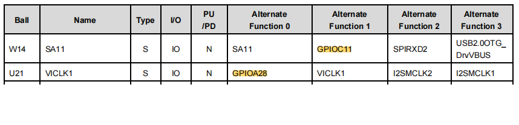

板卡的原理图（底板：x6818bv2.pdf，核心板：x4418cv3_release20150713.pdf），核心板焊在底板上

LED的部分

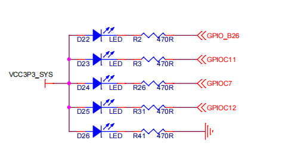

按键的部分：

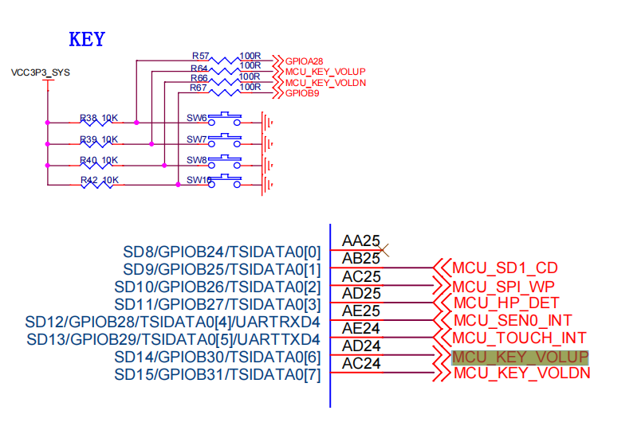

```c
#include <mach/devices.h> //PAD_GPIO_A+n
#include <mach/soc.h> //nxp_soc_gpio_set_io_func();
#include <mach/platform.h> //PB_PIO_IRQ(PAD_GPIO_A+n);
#include <linux/gpio.h>

/* 内核api接口

// 设置引脚功能
nxp_soc_gpio_set_io_func(unsigned int io,int func); 		// io:寄存器地址，func：功能0,1,2,3
// 确定GPIO输入输出方向
nxp_soc_gpio_set_io_dir(unsigned int io, int out);			//out：0输入，1输出
// 设置 GPIOl引脚输出电平
nxp_soc_gpio_set_out_value(unsigned int io, int out);		//0：输出低电平，1：输出高电平
// 读取 GPIOl引脚输入电平
nxp_soc_gpio_get_in_value(unsigned int io);					//通过返回值得到高低电平

*/


static void my_gpio_init(void)
{
   	// LED
	nxp_soc_gpio_set_io_func(PAD_GPIO_C+11,1); 		//设置引脚功能0‐3
	nxp_soc_gpio_set_io_dir(PAD_GPIO_C+11,1);		//0：输入，1：输出
	nxp_soc_gpio_set_out_value(PAD_GPIO_C+11,1);	//0：输出低电平，1：输出高电平
    
    // KEYBOARD
    nxp_soc_gpio_set_io_func(PAD_GPIO_A+28,1); 		//设置引脚功能0‐3
	nxp_soc_gpio_set_io_dir(PAD_GPIO_A+28,1);		//0：输入，1：输出
 }

static int my_open(struct inode *inode, struct file *file)
{
    printk(KERN_INFO "Device opened\n");
    my_gpio_init();
    return 0;
}
static int my_release(struct inode *inode, struct file *file)
{
    printk(KERN_INFO "Device closed\n");
    nxp_soc_gpio_set_out_value(PAD_GPIO_C+11,1);
    return 0;
}
static ssize_t my_write(struct file *file, const char __user *buf, size_t count, loff_t *ppos)
{
    int ret;
    char data[100] = "";
    int len = min(count,sizeof(data));
    ret = copy_from_user(data, buf, len);
    
    // 设置led灯的亮灭
    if(data[0] == '0'){
        nxp_soc_gpio_set_out_value(PAD_GPIO_C+11,0);
    }else{
        nxp_soc_gpio_set_out_value(PAD_GPIO_C+11,1);
    }
    printk(KERN_WARNING "L%d->%s():%s\n", __LINE__, __FUNCTION__, data);
    return count;		//返回0是写入失败，返回>0写入成功
}
static ssize_t my_read(struct file *file, char __user *buf, size_t count, loff_t *ppos)
{
    int ret;
    printk(KERN_INFO "Read from device\n");
    
    // 读取keyboard的值
    ret = nxp_soc_gpio_get_in_value(PAD_GPIO_A+28);	// 通过返回值得到高低电平
    nxp_soc_gpio_set_out_value(PAD_GPIO_C+11,ret);
    if(ret == 0)
        return 0;
    else
        return 1;
    
}
```


```bash
# 0开启led
echo 0 > /dev/mychardev
# 1关闭led
echo 1 > /dev/mychardev
```

```c
void write_test(){
    int fd;
    char data[100] = "0";
    fd = open("/dev/mychardev", O_RDWR);
    while(1){
        data[0] = '0';
        write(fd, data, strlen(data) + 1);
        usleep(300 * 1000);
        data[0] = '1';
        write(fd, data, strlen(data) + 1);
    }
}
void read_test(){
    int fd,ret;
    char data[100] = "0";
    fd = open("/dev/mychardev", O_RDWR);
    // 轮询
    while(1){
        ret = read(fd, data, 100);
        if(ret == 0){
            printf("key down\n");
        }
    }
}
```


## 1.3 杂项设备注册

- 主设备号默认规定为10，从设备号动态分配
- 可以作为拓展设备驱动数量的一种手段
- **依然是一个字符设备驱动**，是字符设备驱动的另一种更加**简单**的注册方式

```c
#include<linux/miscdevice.h>
// file_operations依然要保留
struct file_operations fops = {
    .owner = THIS_MODULE,
    .open = my_open,
    .release = my_release,
    .read = my_read,
    .write = my_write,
};

static struct miscdevice my_misc = {
    .minor = MISC_DYNAMIC_MINOR,				// MISC_DYNAMIC_MINOR这个宏无需自行定义，不然会报重复定义
    .name = "mychrdev",
    .fops = &fops,
}

static int __init my_module_init(void)
{
	printk(KERN_WARNING "L%d‐>%s()\n",__LINE__,__FUNCTION__);
	misc_register(&my_misc);
	return 0;
}

static void __exit my_module_exit(void)
{
	printk(KERN_WARNING "L%d‐>%s()\n",__LINE__,__FUNCTION__);
	misc_deregister(&my_misc);
}


MODULE_LICENSE("GPL");
```


## 1.4 cdev注册

- register_chrdev()其实是cdev注册过程的封装
- cdev自己封装注册，对系统资源利用率更高

流程：

1. 自动分配主设备号申请接口：alloc_chrdev_region()
2. 自己定义数据结构：struct cdev
3. 初始化cdev：cdev_init()
4. 注册cdev：cdev_add()
5. 创建设备类：class_create()
6. 创建设备文件：device_create()
7. 删除设备文件device_destroy(my_class, dev)
8. 删除设备类 class_destroy(my_class)
9. 注销cdev：cdev_del()
10. 释放动态申请的主设备号：unregister_chrdev_region()

```c
int register_chrdev_region( dev_t from, unsigned count, const char *name);
// from : 主设备号和从设备号，通过宏生成 MKDEV(my_major, my_minor)
// count：占用从设备号数目
// name: 驱动名称
// 返回：失败小于0

int alloc_chrdev_region(dev_t *dev,unsigned baseminor,unsigned count,const char *name);
// baseminor：指定申请时的起始从设备号
// 返回：失败非0

void unregister_chrdev_region(dev_t from, unsigned count);

struct cdev {
	struct kobject kobj; 				// 内核生成，用于管理
	struct module *owner; 				// 内核生成，用于管理
	const struct file_operations *ops;
	struct list_head list; 				// 内核生成，用于管理
	dev_t dev;							//设备号
	unsigned int count; 				// 引用次数
};

// 初始化cdev变量，并设置fops
void cdev_init(struct cdev *cdev, const struct file_operations *fops);
// 添加cdev到linux内核，完成驱动注册
int cdev_add(struct cdev *p, dev_t dev, unsigned count);

// 上面两个函数成功后，可以使驱动在`cat /proc/devices` 中看到

// 从内核中删除cdev数据
void cdev_del(struct cdev *p);
```

```c
static struct cdev my_cdev;

static int __init my_init(void)
{
    int ret;

    // 分配设备号
    ret = alloc_chrdev_region(&dev, 0, DEVICE_COUNT, DEVICE_NAME);
    if (ret < 0) {
        printk(KERN_ERR "Failed to allocate chrdev region\n");
        return ret;
    }

    // 初始化 cdev 结构体
    cdev_init(&my_cdev, &fops);
    my_cdev.owner = THIS_MODULE;

    // 将 cdev 添加到系统中
    ret = cdev_add(&my_cdev, dev, DEVICE_COUNT);
    if (ret < 0) {
        unregister_chrdev_region(dev, DEVICE_COUNT);
        printk(KERN_ERR "Failed to add cdev\n");
        return ret;
    }

    // 创建设备类
    my_class = class_create(THIS_MODULE, DEVICE_CLASS_NAME);
    if (IS_ERR(my_class)) {
        cdev_del(&my_cdev);
        unregister_chrdev_region(dev, DEVICE_COUNT);
        printk(KERN_ERR "Failed to create class\n");
        return PTR_ERR(my_class);
    }

    // 创建设备节点
    device_create(my_class, NULL, dev, NULL, DEVICE_NAME);

    printk(KERN_INFO "Device initialized successfully\n");
    return 0;
}

static void __exit my_exit(void)
{
    device_destroy(my_class, dev);
    class_destroy(my_class);
    cdev_del(&my_cdev);
    unregister_chrdev_region(dev, DEVICE_COUNT);
    printk(KERN_INFO "Device exited successfully\n");
}
```


# 2 linux内核api

## 2.1 中断

Linux操作系统下同裸机程序一样，需要利用中断机制来处理硬件的异步事件。而用户态是不允许中断事件的，因此中断必须由驱动程序来接收与处理。

中断上下文包含进程上下文，在中断上下文中需要注意：

- 不能使用导致睡眠的处理机制（信号量、等待队列等）
- 不能与用户空间交互数据(copy_to/from_user)
- 中断处理函数执行时间应尽可能短

```bash
# 显示系统中断的状态和统计信息
cat /proc/interrupts
			CPU0       CPU1       CPU2       CPU3       
  0:         53          0          0          0   IO-APIC-edge      timer
  1:          2          0          0          0   IO-APIC-edge      i8042
  8:          1          0          0          0   IO-APIC-edge      rtc0
  9:          0          0          0          0   IO-APIC-fasteoi   acpi
 12:          4          0          0          0   IO-APIC-edge      i8042
 16:        203          0          0          0   IO-APIC-fasteoi   ehci_hcd:usb1
 23:       1014          0          0          0   IO-APIC-fasteoi   ehci_hcd:usb2
 40:       1920          0          0          0   PCI-MSI-edge      eth0
 41:       3000        100          0          0   PCI-MSI-edge      eth1
 NMI:         10         12         14         15   Non-maskable interrupts
 LOC:     123456     234567     345678     456789   Local timer interrupts
 
 # 每行开头的数字表示中断号。这个号唯一标识一个特定的中断源。
 # 中间的数字是每个CPU核心处理该中断的次数。
 # 再后面就是中断类型，中断源（设备）
```

### 2.1.1 中断api

```c
#include <linux/interrupt.h>	// 中断的api
#include <linux/irqreturn.h>	// 中断处理函数的返回值
#include <mach/irqs.h>			// 中断号
#include <linux/irq.h> 			// 外部中断的触发方式
// 中断注册（申请中断）
int request_irq(
    unsigned int irq,
	irqreturn_t(*handler)(int,void*),
	unsigned long irqflag,
	const char *devname,
	void *dev_id
);
// irq：中断号，所申请的中断向量，比如EXIT0中断等定义在mach/irqs.h, 外部中断获取中断编号接口：gpio_to_irq(unsigned int io);
// eg: gpio_to_irq(PAD_GPIO_A+28)
// handler：中断处理函数
// irqflag：中断属性设置
// devname：中断名称（中断源）
// dev_id：私有数据，给中断服务函数传递数据
// 注册成功后，自动开启中断，不需要单独调用enable使能


// 单独设置中断触发方式
int set_irq_type(int irq, int edge);
// edge: 外部中断触发方式定义在 #include <linux/irq.h>
// IRQ_TYPE_LEVEL_LOW //低电平触发
// IRQ_TYPE_LEVEL_HIGH //高电平触发
// IRQ_TYPE_EDGE_FALLING //下降沿触发
// IRQ_TYPE_EDGE_RISIN //上升沿触发
// IRQ_TYPE_EDGE_BOTH //双边沿触发

// 释放中断
void free_irq(unsigned int irq, void *dev_id);

// 使能中断
void enable_irq(unsigned int irq);

// 关闭中断，并等待中断处理完成后返回
void disable_irq(unsigned int irq);

// 关闭中断，立即返回
void disable_irq_nosync(unsigned int irq);

// 服务中断函数
irqreturn_t handler(int irq,void *dev_id)
{
	...... // 中断处理
	return IRQ_HANDLED；				// IRQ_HANDLED在#include <linux/irqreturn.h>中定义
}
```

### 2.1.2 外部中断

```c
#include <linux/module.h>
#include <linux/fs.h>
#include <linux/cdev.h>
#include <linux/uaccess.h>
#include <mach/devices.h> 		//PAD_GPIO_A+n
#include <mach/soc.h> 			//nxp_soc_gpio_set_io_func();
#include <mach/platform.h> 		//PB_PIO_IRQ(PAD_GPIO_A+n);
#include <linux/gpio.h>
#include <linux/interrupt.h>	// 中断的api
#include <linux/irqreturn.h>	// 中断处理函数的返回值
#include <mach/irqs.h>			// 中断号
#include <linux/irq.h> 			// 外部中断的触发方式


#define DEVICE_NAME "mychardev"
#define DEVICE_CLASS_NAME "mycharcls"
#define DEVICE_COUNT 1

static dev_t dev;
static struct cdev my_cdev;
static struct class *my_class;


static void my_gpio_init(void);
// 中断处理函数
irqreturn_t keyboard_handler(int irq,void *dev_id);


static int my_open(struct inode *inode, struct file *file)
{
    printk(KERN_INFO "Device opened\n");
	printk(KERN_WARNING "major = %d, minor = %d\n", imajor(inode), iminor(inode));
    my_gpio_init();
    return 0;
}


static int my_release(struct inode *inode, struct file *file)
{
    printk(KERN_INFO "Device closed\n");
	free_irq(gpio_to_irq(PAD_GPIO_A+28), NULL);
    return 0;
}


static struct file_operations fops = {
    .owner = THIS_MODULE,
    .open = my_open,
    .release = my_release,
};

static void my_gpio_init(void)
{
	int ret;
    
    // 注册外部中断
	ret = request_irq(gpio_to_irq(PAD_GPIO_A+28), keyboard_handler, IRQ_TYPE_EDGE_FALLING, "KEYBOARD_IRQ", NULL);
    // gpio_to_irq(PAD_GPIO_A+28) 也可以使用 IRQ_GPIO_A_START+28代替
	
 }

// 中断处理函数
irqreturn_t keyboard_handler(int irq, void * dev_id){
	static int key_num = 0;
	printk(KERN_INFO "This is keyboard_handler: KEY DOWN %d \n", key_num++);
	return IRQ_HANDLED;		// IRQ_HANDLED在#include <linux/irqreturn.h>中定义
}


static int __init my_init(void)
{
    int ret;

    // 分配设备号
    ret = alloc_chrdev_region(&dev, 0, DEVICE_COUNT, DEVICE_NAME);
    if (ret < 0) {
        printk(KERN_ERR "Failed to allocate chrdev region\n");
        return ret;
    }

    // 初始化 cdev 结构体
    cdev_init(&my_cdev, &fops);
    my_cdev.owner = THIS_MODULE;

    // 将 cdev 添加到系统中
    ret = cdev_add(&my_cdev, dev, DEVICE_COUNT);
    if (ret < 0) {
        unregister_chrdev_region(dev, DEVICE_COUNT);
        printk(KERN_ERR "Failed to add cdev\n");
        return ret;
    }

    // 创建设备类
    my_class = class_create(THIS_MODULE, DEVICE_CLASS_NAME);
    if (IS_ERR(my_class)) {
        cdev_del(&my_cdev);
        unregister_chrdev_region(dev, DEVICE_COUNT);
        printk(KERN_ERR "Failed to create class\n");
        return PTR_ERR(my_class);
    }

    // 创建设备节点
    device_create(my_class, NULL, dev, NULL, DEVICE_NAME);

    printk(KERN_INFO "Device initialized successfully\n");
    return 0;
}

static void __exit my_exit(void)
{
    device_destroy(my_class, dev);
    class_destroy(my_class);
    cdev_del(&my_cdev);
    unregister_chrdev_region(dev, DEVICE_COUNT);
    printk(KERN_INFO "Device exited successfully\n");
}

module_init(my_init);
module_exit(my_exit);

MODULE_LICENSE("GPL");
MODULE_AUTHOR("Your Name");
MODULE_DESCRIPTION("A simple character device driver");

```

```c
// 测试程序test.c
#include<stdio.h>
#include<sys/types.h>
#include<sys/stat.h>
#include<fcntl.h>
#include<string.h>

void open_test(){
	int fd,ret;
	fd = open("/dev/mychardev", O_RDWR);
	while(1){
		usleep(300 * 1000);
	}
}

int main(int argc, char** argv){
	open_test();
    return 0;
}
```


```bash
# 虚拟机编译测试程序
arm-linux-gcc -o test test.c
# 虚拟机编译驱动
make clean
make

# 开发板卸载模块驱动
rmmod demo_module
lsmod
# 开发板安装模块驱动
insmod demo_module
# 开发板启动测试程序，后台执行，后面使用完毕后，记得杀掉
./test &
# 多次按键
[164911.658000] This is keyboard_handler: KEY DOWN 1 
[164911.659000] This is keyboard_handler: KEY DOWN 2 
[164911.874000] This is keyboard_handler: KEY DOWN 3 
[164914.771000] This is keyboard_handler: KEY DOWN 4 
[164915.481000] This is keyboard_handler: KEY DOWN 5 
[164916.104000] This is keyboard_handler: KEY DOWN 6 
[164916.620000] This is keyboard_handler: KEY DOWN 7 
[164917.078000] This is keyboard_handler: KEY DOWN 8 
[164917.562000] This is keyboard_handler: KEY DOWN 9 
[164917.760000] This is keyboard_handler: KEY DOWN 10 
[164918.048000] This is keyboard_handler: KEY DOWN 11 
[164918.271000] This is keyboard_handler: KEY DOWN 12 
[164919.022000] This is keyboard_handler: KEY DOWN 13 
[164919.559000] This is keyboard_handler: KEY DOWN 14 
[164919.752000] This is keyboard_handler: KEY DOWN 15 

# 查看中断统计
cat /proc/interrupts
          CPU0       CPU1       CPU2       CPU3       CPU4       CPU5       CPU6       CPU7       
 33:          0          0          0          0          0          0          0          0       GIC  pl08xdmac
 34:          0          0          0          0          0          0          0          0       GIC  pl08xdmac
 37:          0          0          0          0          0          0          0          0       GIC  rtc 1hz
 39:        110        333        256        341        619        654        572        574       GIC  nxp-uart
 48:       2857       3103       3187       3386       4446       3604       3096       3877       GIC  s3c2440-i2c.1
134:          0          5          2          2          1          4          2          1      GPIO  KEYBOARD_IRQ


```

嵌入式系统中**裸机**的中断服务特点：

- 没有返回值
- 没有参数
- 尽量不要进行浮点运算（处理尽量快）

### 2.1.3 中断底半部

在大多数真实的系统中，当中断来临时，要完成的工作往往不能立即完成，而是需要大量的耗时处理。

如果我们的系统，拥有一个单核的cpu，如果在中断处理函数中，有比较耗时的任务，那么将阻塞主进程上下文（或者说是进程间的调度）的执行。

```bash
# 查看某一核cpu的在线情况
cat /sys/devices/system/cpu/cpu1/online
1
# 关闭某一核cpu的运行
echo 0 > /sys/devices/system/cpu/cpu1/online
```

中断处理可以分两个部分：

- 顶半部：处理紧急的硬件操作（大家熟知的中断服务函数）。
-  底半部：处理不紧急的耗时操作，执行过程中，中断是使能的，可被打断。
  - 实现机制：
  - 软中断（softirq）：供内核使用的机制
  -  微线程（tasklet）：微线程通过软中断机制来调度
  - 工作队列等（workqueue）：工作队列将工作交由一个内核线程处理

一般遇到耗时任务，顶半部用于创建工作队列，初始化工作，将耗时任务交给内核线程去执行。

#### 工作队列

```c
// api接口

#include <linux/workqueue.h>

// 定义一个工作队列结构体指针
static struct workqueue_struct *key_workqueue;
// 创建工作队列
struct workqueue_struct *create_workqueue(char * queue_name);
// 销毁工作队列
void destroy_workqueue(struct workqueue_struct *);

// 创建工作
struct work_struct work;
// 工作初始化宏
INIT_WORK(work_struct* work, void (*func)());
// 添加工作到任务队列
int queue_work(struct workqueue_struct*wq, struct work_struct *work);

// 终止队列中的工作（即使处理程序已经在处理该任务）
int cancel_work_sync(struct work_struct *work);
int work_pending(struct work_struct work );
```

```c
// 功能：每按一次按键，num就加1，应用程序每次读取num的值。

static struct workqueue_struct *key_workqueue;
static struct work_struct key_work;
static int num = 0;

static int __init my_init(void)
{
	...
    //创建工作队列
    key_workqueue = create_workqueue("key_queue");
    // 初始化工作
    INIT_WORK(&key_work, key_work_func);
    
}
static ssize_t my_read(struct file *file, char __user *buf, size_t count, loff_t *ppos)
{
	static int old_num = -1;
    int len = min(count, sizeof(num));
    int ret;
  	if(old_num == num){
		return 0;
    }else{
        old_num = num;
        copy_to_user(buf, &num, len);
        return sizeof(num);
    }
    
}
// 中断处理函数，顶半部
irqreturn_t keyboard_handler(int irq, void * dev_id){
    disable_irq_nosync(IRQ_GPIO_A_START+28);
    // 添加工作
    queue_work(key_workqueue, &key_work);
	return IRQ_HANDLED;		// IRQ_HANDLED在#include <linux/irqreturn.h>中定义
}
static void key_work_func(struct work_struct *work){
    // 耗时任务
    
    //
    num++;
    enable_irq(IRQ_GPIO_A_START+28);
}
static void __exit my_exit(void)
{
   	...
    // 销毁工作队列
    destroy_workqueue(key_workqueue);
}
```

```c
// 读取按键的次数
// 测试程序

#include<stdio.h>
#include<sys/types.h>
#include<sys/stat.h>
#include<fcntl.h>
#include<string.h>
void read_test(){
    int fd=0;
    int ret=0;
    int key=0;

    fd = open("/dev/mychardev", O_RDWR);
    if(fd < 0){
        perror("/dev/mychardev");
        return -1;
    }
    
    // 轮询
    while(1){
        ret = read(fd, &key, sizeof(key));
        if(ret != 0){
            printf("key down = %d\n", key);
        }
    }
    close(fd);
    return;
}
int main(int argc, char** argv){
	read_test();
    return 0;
}
```

## 2.3 异步数据处理kfifo

数据的采集（驱动侧）与处理使用（应用程序侧）往往不同步，于是驱动编程中数据采集方需要将采集的数据暂时放到一个缓冲区中，使用方在需要处理数据时从缓冲区中将数据读出。

我们可以选择自己编写一个队列，也可以利用内核中现有队列kfifo来实现。

场景：内核产生消息，应用程序无法及时处理

```c
#include <linux/kfifo.h>

//kfifo结构体类型
struct kfifo {
	unsigned char *buffer; 	//存放数据的缓存区
	unsigned int size; 		//buffer空间大小
	unsigned int in; 		//指向buffer队尾
	unsigned int out; 		//指向buffer队头
};
// kfifo是一个循环队列（环状），in指针和out指针都沿着环逆时针移动，in往里加数据，加一个后移一个。out消费数据，消费一个后移一个
// 假设缓冲区大小size为8, 缓冲区读写下标分别为：in%size，out%size


// 申请kfifo空间
int kfifo_alloc(struct kfifo *fifo, unsigned int size, gfp_t gfp_mask);
// size：申请的空间大小，单位字节
// gfp_mask：内存标志位

// 释放kfifo
void kfifo_free(struct kfifo *fifo);

// 存数据
unsigned int kfifo_in(struct kfifo *fifo, const void *from, unsigned int len);
// 消费数据
unsigned int kfifo_out(struct kfifo *fifo, void *to, unsigned int len);
// from和to：写/读数据的首地址
// len：读写数据的大小

// 获取fifo内的已用数据个数
unsigned int kfifo_len(struct kfifo *fifo);
// 获取fifo总大小
unsigned int kfifo_size(struct kfifo *fifo);
// 检查kfifo是否为空
int kfifo_is_empty(struct kfifo *fifo);
// 检查kfifo是否为满
int kfifo_is_full(struct kfifo *fifo);
```

```c
// 功能：每按一次按键，num就加1，应用程序每次读取num的值。

static struct workqueue_struct *key_workqueue;
static struct work_struct key_work;
static int num = 0;
static struct kfifo key_fifo;

// 模块加载时去申请一块队列空间，模块卸载接口中释放申请的空间
static int __init my_init(void)
{
    int ret;
	...
    
    // 创建工作队列
    key_workqueue = create_workqueue("key_queue");
    // 初始化工作
    INIT_WORK(&key_work, key_work_func);
    
    //申请128字节fifo内存
    ret= kfifo_alloc(&key_fifo, 128, GFP_KERNEL);
    
}
static ssize_t my_read(struct file *file, char __user *buf, size_t count, loff_t *ppos)
{
    int len = min(count, sizeof(num));
    int ret;
    int data;
    // kfifo判空
    if(kfifo_is_empty(&key_fifo)) return 0;
    // 消费数据
    ret = kfifo_out(&key_fifo,&data,sizeof(data));
	ret = copy_to_user(buf, &data, len);
    return sizeof(len);
    
}
// 中断处理函数，顶半部
irqreturn_t keyboard_handler(int irq, void * dev_id){
    disable_irq_nosync(IRQ_GPIO_A_START+28);
    // 添加工作
    queue_work(key_workqueue, &key_work);
	return IRQ_HANDLED;		// IRQ_HANDLED在#include <linux/irqreturn.h>中定义
}
static void key_work_func(struct work_struct *work){
    int ret;
    // 耗时任务
    
    //
    num++;
    if(kfifo_is_full(&key_fifo)) return;
	ret = kfifo_in(&key_fifo, &num, sizeof(num));
    enable_irq(IRQ_GPIO_A_START+28);
}
static void __exit my_exit(void)
{
   	...
    // 销毁工作队列
    destroy_workqueue(key_workqueue);
	// 释放fifo
    kfifo_free(&key_fifo);
}
```

## 2.4 并发与同步

资源（硬件资源，全局变量，静态变量）有限，资源竞争

竞争产生的原因：

1. 抢占式内核：用户程序在执行系统调用期间可以被高优先级进程抢占
2. 多处理器SMP
3. 中断程序

内核中解决办法：

1. 信号量（semaphore）
2. 自旋锁（spinlock）
3. 原子变量（atomic）
4. 读写锁
5. 互斥体（mutex）

### 2.4.1 信号量

信号量**采用睡眠等待机制**。

中断服务函数不能进行睡眠，因此信号量不能用于中断当中，但可以使用后面介绍的自旋锁。

信号量资源开销比较大（因为程序睡眠时，保存上下文，唤醒时，恢复上下文，来回折腾比较麻烦）。

应用场景：

- 一般用于对公共资源访问频率比较低，资源占用时间比较长的场合
- 不可用在中断程序顶半部中

```c
#include <linux/semaphore.h>

// 定义一个信号量
struct semaphore my_sem;

// 初始化信号量
void sema_init(struct semaphore *sem, int val);
// val: 信号量的计数值，val设置为>1的非0值时，这是被称作计数信号量，等于1时，被称作互斥信号量

// 获取信号量(减操作)，在拿不到信号量的时候，会导致调用者睡眠（挂起），睡眠不可被系统消息中断。
// 也就是说，如果进入睡眠，并且没有收到其他地方释放信号量（up）的消息，那么这个进程将永远睡眠，无法被中断（CTRL + C 也不可以，只有关机才行）
void down(struct semaphore *sem);
// 获取信号量(减操作)，会导致调用者睡眠，但可以被系统消息中断
int down_interruptible(struct semaphore *sem);
// 尝试获取信号量,成功返回0,失败返回非0，不会导致调用者睡眠
int down_trylock(struct semaphore *sem);

// 释放信号量，即使信号量加1（如果线程睡眠，将其唤醒）
void up(struct semaphore *sem);
```

```c

// 功能：每按一次按键，num就加1，应用程序每次读取num的值。

#include<linux/semaphore.h> 	// 信号量

static struct workqueue_struct *key_workqueue;
static struct work_struct key_work;
static int num = 0;
static struct kfifo key_fifo;
static struct semaphore my_sem;

// 模块加载时去申请一块队列空间，模块卸载接口中释放申请的空间
static int __init my_init(void)
{
    int ret;
	...
    
    // 创建工作队列
    key_workqueue = create_workqueue("key_queue");
    // 初始化工作
    INIT_WORK(&key_work, key_work_func);
    
    //申请128字节fifo内存
    ret= kfifo_alloc(&key_fifo, 128, GFP_KERNEL);
    
    sema_init(&my_sem, 1);
    
}
static ssize_t my_read(struct file *file, char __user *buf, size_t count, loff_t *ppos)
{
    int len = min(count, sizeof(num));
    int ret;
    int data;
    // kfifo判空
    if(kfifo_is_empty(&key_fifo)) return 0;
    
    // 消费数据
    down(&my_sem);
    ret = kfifo_out(&key_fifo,&data,sizeof(data));
    up(&my_sem);
    
	ret = copy_to_user(buf, &data, len);
    return sizeof(len);
    
}
// 中断处理函数，顶半部
irqreturn_t keyboard_handler(int irq, void * dev_id){
    disable_irq_nosync(IRQ_GPIO_A_START+28);
    // 添加工作
    queue_work(key_workqueue, &key_work);
	return IRQ_HANDLED;		// IRQ_HANDLED在#include <linux/irqreturn.h>中定义
}
static void key_work_func(struct work_struct *work){
    int ret;
    // 耗时任务
    
    //
    num++;
    if(kfifo_is_full(&key_fifo)) return;
    
    down(&my_sem);
	ret = kfifo_in(&key_fifo, &num, sizeof(num));
    up(&my_sem);
    
    enable_irq(IRQ_GPIO_A_START+28);
}
static void __exit my_exit(void)
{
   	...
    // 销毁工作队列
    destroy_workqueue(key_workqueue);
	// 释放fifo
    kfifo_free(&key_fifo);
}
```

### 2.4.2 自旋锁

尝试获取一个自旋锁，如果锁空闲就获取该自旋锁并继续向下执行；如果锁已被占用就循环检测该锁是否被释放（原地打转直到锁被释放）

使用忙等待机制，自旋锁资源开销小。

场景：

- 一般用于对公共资源访问频率比较高，资源占用时间比较短的场合
- 可以用在中断服务程序中（中断顶半部）

```c
#include <linux/spinlock.h>

// 定义自旋锁变量
struct spinlock my_spinlock;
// 或
spinlock_t my_spinlock;

// 自旋锁初始化
spin_lock_init(&my_spinlock);

// 获得自旋锁（可自旋等待，可被软、硬件中断）
void spin_lock(spinlock_t *my_spinlock);
// 释放自旋锁，退出临界区
void spin_unlock(spinlock_t *lock);

// 获得自旋锁(可自旋等待，保存中断状态并关闭软、硬件中断)
void spin_lock_irqsave(spinlock_t *my_spinlock,unsigned long flags);

// 释放自旋锁，退出临界区后，恢复中断
void spin_unlock_irqrestore(spinlock_t *lock,unsigned long flags);

// 尝试获得自旋锁（不自旋等待，成功返回1、失败则返回0）
int spin_trylock(spinlock_t *lock)
```

## 2.5 定时和延时

内核全局变量：

- HZ：为每秒的定时器的节拍数，HZ是一个与体系结构相关的常数，Linux为大多数平台提供HZ值范围为50-1200，x86 PC平台默认为1000，我们的内核为1000
- jiffies：用来记录自内核启动以来的时钟滴答总数（即每隔1/HZ秒加1）

```c
// 延时
#include <linux/delay.h>
// 忙等待延时函数，一般不太长的时间可以用它
void ndelay(unsigned long nsecs); //纳秒级延时
void udelay(unsigned long usecs); //微秒级延时
void mdelay(unsigned long msecs); //毫秒级延时

// 睡眠等待延时函数
void msleep(unsigned int millisecs); 	// 毫秒级延时
unsigned long msleep_interruptible(unsigned int millisecs);		// 毫秒级延时，可提前（被系统消息）唤醒
void ssleep(unsigned int seconds);		//秒级延时
    
// 定时器
// 内核定时器可在未来的某个特定时间点调度执行某个函数，完成指定任务
// 假设HZ的值为1000，Linux定时器最短定时时间为1ms，小于该时间的定时需要选择精度更高的定时器或直接硬件定时
#include <linux/timer.h>
struct timer_list
{
	struct list_head entry;
	//链表节点，由内核管理
	unsigned long expires;
	//定时器到期时间（指定一个时刻）
	void (*function)(unsigned long)；
	// 定时器处理函数
	unsigned long data;
	// 作为参数被传入定时器处理函数
	......
};

// 初始化定时器
void init_timer(struct timer_list *timer);
// 添加定时器。定时器开始计时
void add_timer(struct timer_list * timer);
// 删除定时器,在定时器到期前禁止一个已注册定时器
int del_timer(struct timer_list * timer);
// 如果定时器函数正在执行则在函数执行完后返回(SMP)
int del_timer_sync(struct timer_list *timer);

// 更新定时器到期时间，并开启定时器
int mod_timer(struct timer_list *timer, unsigned long expires);
// 查看定时器是否正在等待被调度运行
int timer_pending(const struct timer_list *timer);			// 返回值为真表示正在等待被调度运行
```

```c

static struct timer_list timer;
static void my_delay(int ms){
    unsigned int old_time = jiffies;
    while((jiffies - old_time) <= ms);		// old_time有溢出的风险
}
static void time_fun(unsigned long data){
    static int i = 0;
    i++;
    printk(KERN_INFO "%02d:%02d\n",i/60, i%60);
    
    // 循环执行
    mod_timer(&timer,jiffies + 1000);
}
static int my_open(struct inode *inode, struct file *file)
{
    
    printk(KERN_INFO "HZ = %d, jiffies = %ld", HZ, jiffies);
    my_delay(3000);			// 延时3秒
    printk(KERN_INFO "HZ = %d, jiffies = %ld", HZ, jiffies);
    
    // 在1000ms后执行
    timer.expires = jiffies + 1000;
    
    // 启动定时器
    add_timer(&timer);
    return 0;
}

static int my_release(struct inode *inode, struct file *file)
{
    printk(KERN_INFO "Device closed\n");
    
    // 删除定时器
	del_timer(&timer);
    return 0;
}
static ssize_t my_read(struct file *file, char __user *buf, size_t count, loff_t *ppos)
{
    return 1;		// cat /dev/mychrdev 就不会退出
}
static int __init my_init(void)
{
    // 绑定定时器任务
    timer.function = time_fun;
    // 初始化定时器
    init_timer(&timer);
}
```

### 实例

- 按键去抖：延时
- up/down：中断采用双沿触发
- 长短时按键：

```c
static struct key_info{
    int status;		//up=0, down=1
    int type;		//short=0, long=1
    int code;		//键值
}

struct key_info key_val = {
    .status = 0,
    .type = 0,
    .code = 0,
}

static void key_work_func(struct work_struct *work){
    int ret;
    // 区分up/down，前提是要打开双沿触发
    if(key_val.status == 0){		//down
        // 去抖30ms
        mdelay(30);
        if(nxp_soc_gpio_get_in_value(PAD_GPIO_A+28) != 0 ){
			enable_irq(IRQ_GPIO_A_START+28);
            return;
        }
        num++;
        key_val.status = 1;
        key_val.type = 0;
        
        // 区分长短按计时器
        timer.expires = jiffies + HZ*1;
        add_timer(&timer);
    }else{							//up
        key_val.status = 0;
        // 如果up，就要删除计时器
        del_timer_sync(&timer);
    }
    if(!kfifo_is_full(&key_fifo)){
       key_val.code = num;
       down(&my_sem);
       ret = kfifo_in(&key_fifo,&key_val, sizeof(key_val));
       up(&my_sem);
    }
}

static ssize_t my_read(struct file *file, char __user *buf, size_t count, loff_t *ppos)
{
    int len = min(count,sizeof(key_val));
    int ret;
    struct key_info data;
    
    if(kfifo_is_empty(&key_fifo))	return 0;
    down(&my_sem);
    ret = kfifo_out(&key_fifo,&data,sizeof(data));
    up(&my_sem);
    ret = copy_to_user(buf,&data,len);
    return sizeof(data);
}

static void time_fun(unsigned long data){
    int ret;
    key_val.type = 1;		// 达到长按键周期
    if(!kfifo_is_full(&key_fifo)){
       down(&my_sem);
       ret = kfifo_in(&key_fifo,&key_val, sizeof(key_val));
       up(&my_sem);
    }
    mod_timer(&timer,jiffies + 100);		// 达到长按键后，连续输出的时间间隔100ms
}
```

```c
#include<stdio.h>
#include<sys/types.h>
#include<sys/stat.h>
#include<fcntl.h>
#include<string.h>

static struct key_info{
    int status;		//up=0, down=1
    int type;		//short=0, long=1
    int code;		//键值
};
void read_test(){
    int fd=0;
    int ret=0;
	struct key_info key={0,0,0};
    
    fd = open("/dev/mychardev", O_RDWR);
    if(fd < 0){
        perror("/dev/mychardev");
        return -1;
    }
    
    // 轮询
    while(1){
        ret = read(fd, &key, sizeof(key));
        if(ret != 0){
            printf("%s: %s : = %d\n", key.status ? "down":"up",key.type ? "long":"short",, key.code);
        }
    }
    close(fd);
    return;
}
int main(int argc, char** argv){
	read_test();
    return 0;
}
```

## 2.6 I/O阻塞与非阻塞

阻塞：让出cpu，挂起（睡眠）

非阻塞：不出让cpu，不睡眠，轮询

**也就是要达到，应用程序发起系统调用read，如果驱动里面没有数据供读，那么应用程序就一直阻塞在read那里，不会执行下一行代码，这就是阻塞。**

方案：

- 等待队列
- 轮询加阻塞操作

### 2.6.1 等待队列

```c
#include <linux/wait.h>

// 定义一个等待队列
wait_queue_head_t my_queue;
// 初始化一个等待队列头
init_waitqueue_head(&my_queue);
// 合并前面两个步骤，定义并初始化一个等待队列头
DECLARE_WAIT_QUEUE_HEAD(my_queue);

// 无条件阻塞
sleep_on(wait_queue_head_t *q);												//直接阻塞，不可中断
interruptible_sleep_on(wait_queue_head_t *q);								//直接阻塞，可中断
long sleep_on_timeout(wait_queue_head_t *q, long timeout);					//不可中断，可超时
long interruptible_sleep_on_timeout(wait_queue_head_t *q, long timeout);	//可中断，可超时
// interruptible函数要成对使用

// 有条件阻塞
wait_event(wait_queue_head_t wq, int condition);							//condition=0进入阻塞
wait_event_interruptible(wait_queue_head_t wq,int condition);
wait_event_timeout(wait_queue_head_t wq, int condition, long timeout);
wait_event_interruptiblble_timeout(wait_queue_head_t wq,int condition, long timeout);
// wake_up唤醒进程之前要将wait_event中的condition变量的值赋为真，否则该进程被唤醒后会立即再次进入睡眠

// 唤醒阻塞进程
wake_up(wait_queue_head_t *wq);
wake_up_interruptible(wait_queue_head_t *wq);
```

```c
#include <linux/wait.h>

DECLARE_WAIT_QUEUE_HEAD(key_queue);
static ssize_t my_read(struct file *file, char __user *buf, size_t count, loff_t *ppos)
{
    int len = min(count,sizeof(key_val));
    int ret;
    struct key_info data;
    
    // 判断应用程序那里采用的是以什么方式的open
    // 如果应用程序那里的open("/dev/mychardev", O_RDWR | O_NONBLOCK)，那就采用非阻塞模式
    // open("/dev/mychardev", O_RDWR)，那就采用阻塞模式
    if((file->f_flags & O_NONBLOCK) == 0){
        if(kfifo_is_empty(&key_fifo)){
            // 无条件阻塞，将条件写到if里面了
            sleep_on(&key_queue);
        }
        // 有条件阻塞
        // wait_event(key_queue, !kfifo_is_empty(&key_fifo));
        
    }
    
    down(&my_sem);
    ret = kfifo_out(&key_fifo,&data,sizeof(data));
    up(&my_sem);
    ret = copy_to_user(buf,&data,len);
    return sizeof(data);
}

static void key_work_func(struct work_struct *work){
    int ret;
    // 区分up/down，前提是要打开双沿触发
    if(key_val.status == 0){		//down
        // 去抖30ms
        mdelay(30);
        if(nxp_soc_gpio_get_in_value(PAD_GPIO_A+28) != 0 ){
			enable_irq(IRQ_GPIO_A_START+28);
            return;
        }
        num++;
        key_val.status = 1;
        key_val.type = 0;
        
        // 区分长短按计时器
        timer.expires = jiffies + HZ*1;
        add_timer(&timer);
    }else{							//up
        key_val.status = 0;
        // 如果up，就要删除计时器
        del_timer_sync(&timer);
    }
    
    
    if(!kfifo_is_full(&key_fifo)){
       key_val.code = num;
       down(&my_sem);
       ret = kfifo_in(&key_fifo,&key_val, sizeof(key_val));
       up(&my_sem);
	   //唤醒阻塞	        
       wake_up(&key_queue);
    }
}

static void time_fun(unsigned long data){
    int ret;
    key_val.type = 1;		// 达到长按键周期
    if(!kfifo_is_full(&key_fifo)){
       down(&my_sem);
       ret = kfifo_in(&key_fifo,&key_val, sizeof(key_val));
       up(&my_sem);
       wake_up(&key_queue);
    }
    mod_timer(&timer,jiffies + 100);		// 达到长按键后，连续输出的时间间隔100ms
}
```


### 2.6.2 轮询加阻塞操作

- 一个用户进程可以**实现多个设备驱动**的同时监听
- 应用程序需要定义一个集合来保存所有打开的设备
- 通过select()对多个设备进行阻塞监听，而内核对设备进行轮询
- poll()接口主要是协助内核完成驱动可操作性的监听工作（轮询）
- poll()接口被select()调用时将等待队列加入内核轮询列表，当唤醒时，内核会**再次**调用poll()接口

```c
// 应用层接口
#include <sys/select.h>

// 文件描述符集合的变量的定义
fd_set fds;
// 清空描述符集合
FD_ZERO(fd_set *set);
// 加入一个文件描述符到集合中
FD_SET(int fd, fd_set *set);
// 从集合中清除一个文件描述符
FD_CLR(int fd, fd_set *set);

// 判断文件描述符是否被置位
FD_ISSET(int fd, fd_set *set);
// 这里返回非零，表示置位（该文件描述集合中有文件可进行读写操作，或产生错误）

int select(
    int numfds,			
	fd_set *readfds,
	fd_set *writefds,
	fd_set *exceptfds,
	struct timeval *timeout
);
// numfds：需要监听的文件描述符的个数 + 1，最大支持FD_SETSIZE=1024
// readfds：需要监听读属性变化的文件描述符s集合
// writefds：需要监听写属性变化的文件描述符集合
// exceptfds：需要监听异常属性变化的文件描述符集合
// timeout：超时时间，表示等待多长时间之后就放弃等待
		//传 NULL 表示等待无限长的时间，持续阻塞直到有事件就绪才返回。
    	// 大于0，超时时间
    	// =0，不等待立即返回
		/* 
		struct timeval{
        	long tv_sec;//秒
        	long tv_usec;//微秒
    	}
    	*/
//返回值：变化的文件描述符个数


// poll()函数：为file_operation成员之一
static unsigned int poll(struct file *file, struct poll_table_struct *wait);
// file:是文件结构指针
// wait:轮询表指针，管理着一系列等待列表
// 以上两个参数是由内核传递给poll函数

// poll函数返回的状态掩码
/*
可读状态掩码:
	POLLIN:有数据可读
	POLLRDNORM:有普通数据可读
	POLLRDBAND:有优先数据可读
	POLLPRI:有紧迫数据可读
可写状态掩码:
	POLLOUT:写数据不会导致阻塞
	POLLWRNORM:写普通数据不会导致阻塞
	POLLWRBAND:写优先数据不会导致阻塞
	POLLMSG/SIGPOLL:消息可用
错误状态掩码:
	POLLER:指定的文件描述符发生错误
	POLLHUP:指定的文件描述符挂起事件
	POLLNVAL:指定的文件描述符非法
*/

// 添加等待队列到wait参数指定的轮询列表中
void poll_wait(struct file *filp, wait_queue_heat_t *wq, poll_table *wait);
// poll_wait()将可能引起文件状态变化的进程添加到轮询列表，由内核去监听进程状态的变化，不会阻塞进程
// 一旦进程有变化(wake_up)，内核就会自动去调用poll()，而poll()是返回给select()的
// 所以当进程被唤醒以后，poll()应该将状态掩码返回给select()，从而select()退出阻塞。
// 完成一次监测，poll函数被调用一次或两次
//      第一次为用户执行select函数时被执行
// 		第二次调用poll为内核监测到进程的wake_up操作时或进程休眠时间到唤醒再或被信号唤醒时
```


```c
#include<sys/select.h>

void read_test(){
    int fd=0;
    fd_set fds;
    int ret=0;
	struct key_info key={0,0,0};
    
    FD_ZERO(&fds);
    
    fd = open("/dev/mychardev", O_RDWR);
    if(fd < 0){
        perror("/dev/mychardev");
        return -1;
    }
    
    FD_SET(fd, &fds);
    
    // 轮询
    while(1){
        // select是一个系统调用，在驱动中会有一个poll跟他相对应
        ret = select(fd +1,&fds,NULL,NULL,NULL);
        if(ret > 0 && FD_ISSET(fd)){
            ret = read(fd, &key, sizeof(key));
            printf("%s: %s : = %d\n", key.status ? "down":"up",key.type ? "long":"short",, key.code);
        }
    }
    close(fd);
    return;
}
```

```c
DECLARE_WAIT_QUEUE_HEAD(select_queue);

unsigned int my_poll (struct file *pfile, struct poll_table_struct *ptable){
    poll_wait(pfile, &select_queue, ptable);
    return kfifo_is_empty(&key_fifo)? 0:POLLIN;		// 0表示没有消息，POLLIN表示有消息
}

static void key_work_func(struct work_struct *work){
    int ret;
    // 区分up/down，前提是要打开双沿触发
    if(key_val.status == 0){		//down
        // 去抖30ms
        mdelay(30);
        if(nxp_soc_gpio_get_in_value(PAD_GPIO_A+28) != 0 ){
			enable_irq(IRQ_GPIO_A_START+28);
            return;
        }
        num++;
        key_val.status = 1;
        key_val.type = 0;
        
        // 区分长短按计时器
        timer.expires = jiffies + HZ*1;
        add_timer(&timer);
    }else{							//up
        key_val.status = 0;
        // 如果up，就要删除计时器
        del_timer_sync(&timer);
    }
    
    
    if(!kfifo_is_full(&key_fifo)){
       key_val.code = num;
       down(&my_sem);
       ret = kfifo_in(&key_fifo,&key_val, sizeof(key_val));
       up(&my_sem);
	   //唤醒阻塞	        
       wake_up(&key_queue);
        
       wake_up(&select_queue);
    }
}

static void time_fun(unsigned long data){
    int ret;
    key_val.type = 1;		// 达到长按键周期
    if(!kfifo_is_full(&key_fifo)){
       down(&my_sem);
       ret = kfifo_in(&key_fifo,&key_val, sizeof(key_val));
       up(&my_sem);
       wake_up(&key_queue);
        
       wake_up(&select_queue);
    }
    mod_timer(&timer,jiffies + 100);		// 达到长按键后，连续输出的时间间隔100ms
}

static struct file_operations fops = {
    .owner = THIS_MODULE,
    .open = my_open,
    .release = my_release,
    .read = my_read,
    .write = my_write,
    .poll = my_poll,
};
```

## 2.7 内核线程

```c
#include <linux/kthread.h>

//定义线程指针
struct task_struct *kernel_thread;
// 创建内核线程
struct task_struct *kthread_create(int (*threadfn)(void *data), void *data, const char namefmt[], ...);
// threadfn：现成函数指针, 该函数必须能让出CPU，以便其他线程能够得到执行，
// data: 函数参数
// namefmt：线程名称，这个函数可以像printk一样传入某种格式的线程名
// 启动线程
int wake_up_process(struct task_struct *p);

// 创建并启动线程
kthread_run(threadfn, data, namefmt, ...);

// 停止线程检测函数 （线程函数内使用），接收现成函数外kthread_stop发送的停止信号
int kthread_should_stop(void);
// 停止内核线程函数 (线程函数外使用)，给线程函数发送停止信号，线程函数内部通过kthread_should_stop接收停止信号后，返回真
int kthread_stop(struct task_struct *k);
// 如果线程函数内部没有kthread_should_stop接收停止信号 或者 线程函数不结束，那么此函数将一直等待下去
```


# 3 工程化

## 3.1 platform总线

总线：各部件之间传递信息的公共通道

一个现实的linux设备和驱动通常需要挂载在一种总线上，这条总线可以是：

- 物理总线：USB/PCI/I2C/SPI总线
- 虚拟总线：Platform总线（触摸屏、LCD…）

我们之前的代码将资源设备（gpio口）和驱动（逻辑）放在一起，这样会导致资源设备和驱动缺乏相互独立性，给管理维护和移植带来诸多不便。

总线目的：**让设备驱动和设备资源更加独立且统一（总线是二者的中间层）**，**使得设备驱动程序更加通用**

platform机制开发并不复杂，由**三部分**组成：

- platform_device：
  - 是用来描述当前驱动使用的平台硬件信息，一般情况定义在厂家提供的板级支持包中。
  - 我们当前平台的硬件资源位于：arch/arm/plat-s5p6818/x6818/device.c和devices.c
- platfrom_driver：
  - 驱动具体的操作接口，是一些针对当前成功匹配设备的操作函数接口实现。

- platform总线：是系统内核创建的：**platform_bus**

```bash
# 查看linux提供的总线
ls /sys/bus
amba          event_source  iio           mmc           sdio          usb
clocksource   hid           mdio_bus      platform      serio         usb-serial
cpu           i2c           media         scsi          spi
```


### api

```c
#include<linux/platform_device.h>

// 设备资源相关结构体
struct platform_device {
	const char *name; 								// 资源名字
	int id; 										// 一般写0或-1
	struct device dev;
	u32 num_resources;								// 资源大小
	struct resource *resource; 						// 资源
	const struct platform_device_id *id_entry;
	struct pdev_archdata archdata;
};
struct device {
	void (*release)(struct device *dev);
	void *platform_data;
	... ...
}
struct resource {
	resource_size_t start; 							// 资源起始的物理地址
	resource_size_t end; 							// 资源结束的物理地址
	const char *name;
	unsigned long flags; 							// 资源类型IO资源：IORESOURCE_MEM, 中断号：IORESOURCE_IRQ等等
	struct resource *parent, *sibling, *child;
};

// 驱动相关结构体
struct platform_driver {
    int (*probe)(struct platform_device *); 						//匹配原来的init回调函数
	int (*remove)(struct platform_device *);						//匹配原来的exit回调函数
	void (*shutdown)(struct platform_device *);
	int (*suspend)(struct platform_device *, pm_message_t state);
	int (*resume)(struct platform_device *);
	struct device_driver driver;
	const struct platform_device_id *id_table;
};
struct device_driver {
	struct module *owner; 					//填写THIS_MODULE
	const char *name; 						//驱动名字，要和platform_device里的name相一致
};


// 驱动侧获取设备资源
struct resource *platform_get_resource(
	struct platform_device *dev,
	unsigned int type,
	unsigned int num
);
// dev: 内核传过来platform_device的指针
// type: 资源类型，与device的flag对应
// num: 同类资源序号

// 这个函数会在probe回调函数中调用，内核会向probe回调函数传platform_device，而这个变量正是platform_get_resource所需要的
// 通过这个函数获取到资源后，赋值给全局变量，然后在所有需要使用设备的地方使用全局变量代替。
```

### makefile

```makefile
# 加上你的device资源设备代码
obj-m += driver.o device.o
KERNELDIR := /home/buntu/sambaShare/kernel-3.4.39
PWD := $(shell pwd)

modules:
	$(MAKE) -C $(KERNELDIR) M=$(PWD) modules
	rm -rf *.order *.mod.* *.o *.symvers

clean:
	make -C $(KERNELDIR) M=$(PWD) clean
	rm -rf *.ko
```

### device.c

```c

#include <linux/module.h>	/* module_init */
#include <linux/fs.h>	/* file_operations */
#include <linux/device.h>	/* class device */
#include <linux/sched.h>		/* current */
#include <linux/mount.h>		/* struct vfsmount */
#include <asm/io.h>	/* writel() */
#include <linux/uaccess.h> /* copy_to_user() */
#include <mach/devices.h> 	//PAD_GPIO_A+n
#include <mach/soc.h> 		//nxp_soc_gpio_set_io_func();
#include <mach/platform.h>	//PB_PIO_IRQ(PAD_GPIO_A+n);
#include <linux/interrupt.h>	/*request_irq*/
#include <linux/irq.h>	/*set_irq_type*/
#include <linux/delay.h> /* mdelay() */
#include <linux/kfifo.h> /* kfifo */
#include <linux/poll.h> /* poll */
#include <linux/kthread.h> /* kthread */
#include <linux/cdev.h>
#include <linux/platform_device.h>
#include <linux/kernel.h>
#include <linux/irq.h>
#include <asm/irq.h>


#define DRIVER_NAME 		"demo_driver"
#define DEVICE_NAME 		"demo_dev"
#define DEMO_PLATFORM_NAME 		"demo_platform"
#define DEVICE_COUNT 	5

static struct resource demo_resource[] = {

	[0] = {/* key row_1 */
		.start = PAD_GPIO_A+28,
		.end = PAD_GPIO_A+28,
		.flags = IORESOURCE_IO,
	},
	[1] = {/* key irq_row_1 */
		.start = PAD_GPIO_C+14,
		.end = PAD_GPIO_C+14,
		.flags = IORESOURCE_IO,
	}
};

static void demo_release(struct device *dev) 
{
	printk(KERN_WARNING "%s\n",__FUNCTION__);
	return ;
}

static struct platform_device demo_pdev = {
	.name = DEMO_PLATFORM_NAME,
	.id = 0,
	.num_resources = ARRAY_SIZE(demo_resource), 
	.resource = demo_resource,
	.dev = {
		.platform_data = NULL,
        .release = demo_release,
        
	}
};


static int  __init demo_dev_init(void)
{
    printk(KERN_WARNING "%s\n",__FUNCTION__);
	return platform_device_register(&demo_pdev);
}

static void  __exit demo_dev_exit(void)
{
    printk(KERN_WARNING "%s\n",__FUNCTION__);
	platform_device_unregister(&demo_pdev);
}

module_init(demo_dev_init);
module_exit(demo_dev_exit);

MODULE_LICENSE("GPL");	
MODULE_AUTHOR("qin");
MODULE_DESCRIPTION("used for studing linux drivers");
```


### driver.c

```c
// driver.c

#define DEMO_PLATFORM_NAME 		"demo_platform"

struct key_dev_struct_t{
    resource_size_t key_io;			// 按键	
    resource_size_t key_beep;		//蜂鸣器
}
static key_dev_struct_t key_dev = {
    .key_io = 0,
    .key_beep = 0,
}

// 曾经的demo_module_init修改为demo_probe
static int _devinit demo_probe(struct platform_device *pdev)
{
    int ret;
	struct resource *res;
    // 获取platform设备资源
    
    // 按键资源
    res = platform_get_resource(pdev,IORESOURCE_IO, 0);
    key_dev.key_io = res->start;
    // 蜂鸣器
    res = platform_get_resource(pdev,IORESOURCE_IO, 1);
    key_dev.key_beep = res->start;
    
    // 在所有需要使用设备的地方，用这两个全局变量代替
    
    // 分配设备号
    ret = alloc_chrdev_region(&dev, 0, DEVICE_COUNT, DEVICE_NAME);
    if (ret < 0) {
        printk(KERN_ERR "Failed to allocate chrdev region\n");
        return ret;
    }

    // 初始化 cdev 结构体
    cdev_init(&my_cdev, &fops);
    my_cdev.owner = THIS_MODULE;

    // 将 cdev 添加到系统中
    ret = cdev_add(&my_cdev, dev, DEVICE_COUNT);
    if (ret < 0) {
        unregister_chrdev_region(dev, DEVICE_COUNT);
        printk(KERN_ERR "Failed to add cdev\n");
        return ret;
    }

    // 创建设备类
    my_class = class_create(THIS_MODULE, DEVICE_CLASS_NAME);
    if (IS_ERR(my_class)) {
        cdev_del(&my_cdev);
        unregister_chrdev_region(dev, DEVICE_COUNT);
        printk(KERN_ERR "Failed to create class\n");
        return PTR_ERR(my_class);
    }

    // 创建设备节点
    device_create(my_class, NULL, dev, NULL, DEVICE_NAME);

    printk(KERN_INFO "Driver initialized successfully\n");
    return 0;
}

// 曾经的demo_module_exit修改为demo_remove
static int demo_remove(struct platform_device *dev){
    device_destroy(my_class, dev);
    class_destroy(my_class);
    cdev_del(&my_cdev);
    unregister_chrdev_region(dev, DEVICE_COUNT);
    printk(KERN_INFO "Driver exited successfully\n");
}

static int  __init demo_module_init(void)
{
    printk(KERN_WARNING "%s\n",__FUNCTION__);
	return platform_driver_register(&demo_driver);
}

static void  __exit demo_module_exit(void)
{
    printk(KERN_WARNING "%s\n",__FUNCTION__);
	platform_driver_unregister(&demo_driver);
}

static struct platform_driver demo_driver = {
    .driver = {
		.owner = THIS_MODULE,
		.name = DEMO_PLATFORM_NAME,
	},
	.probe = demo_probe,
	.remove = demo_remove,
	
};

module_init(demo_module_init);
module_exit(demo_module_exit);
```


```bash
# 在安装了device.ko和driver.ko后，可以在以下两个文件夹中看到对应的文件
ls /sys/bus/platform/devices
ls /sys/bus/platform/drivers
```

## 3.2 [input子系统](https://blog.csdn.net/weixin_42031299/article/details/125111946)

上层应用不知道定义什么数据类型去接驱动返回的值。

input以“兼容并包”的大一统思想，把这些输入设备的键码、键值、上传方式都分类统一起来，提高驱动通用性(linux和andriod都适用)，减少应用和驱动开发者的沟通成本。

主要是输入上报数据的标准化，标准化成了input_event。

这里面不需要再使用file_operations，应用程序中也不会使用read，write接口

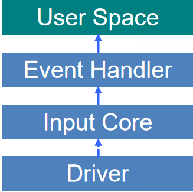

```c
#include<linux/input.h>

// 申请、初始化input_dev
struct input_dev *input_allocate_device(void);
// 注册input_dev
int input_register_device(struct input_dev *dev);
// 注销input_dev
void input_unregister_device(struct input_dev *dev);

struct input_dev {
	const char *name;											//设备名称
	const char *phys;											//设备在系统中的物理路径
	const char *uniq;											//设备唯一识别符
    unsigned long evbit[BITS_TO_LONGS(EV_CNT)];					//设备支持的事件类型
    unsigned long keybit[BITS_TO_LONGS(KEY_CNT)];				//设备支持的具体的按键、按钮事件
	unsigned long relbit[BITS_TO_LONGS(REL_CNT)]; 				//户设备支持的具体的相对坐标事件
	unsigned long absbit[BITS_TO_LONGS(ABS_CNT)];				//设备支持的具体的绝对坐标事件
	unsigned long mscbit[BITS_TO_LONGS(MSC_CNT)];				//设备支持的具体的混杂事件
	unsigned long ledbit[BITS_TO_LONGS(LED_CNT)];				//设备支持的具体的LED指示灯事件
	unsigned long sndbit[BITS_TO_LONGS(SND_CNT)];				//户设备支持的具体的音效事件
	unsigned long ffbit[BITS_TO_LONGS(FF_CNT)];					//设备支持的具体的力反馈事件
	unsigned long swbit[BITS_TO_LONGS(SW_CNT)];					//设备支持的具体的开关事件
	....
}
```


**模仿usbkbd.c开发**

```c
//

#include<linux/input.h>

static struct input_dev *demo_input;
static int _devinit demo_probe(struct platform_device *pdev)
{
    int ret;
	struct resource *res;
    // 获取platform设备资源
    
    // 按键资源
    res = platform_get_resource(pdev,IORESOURCE_IO, 0);
    key_dev.key_io = res->start;
    // 蜂鸣器
    res = platform_get_resource(pdev,IORESOURCE_IO, 1);
    key_dev.key_beep = res->start;
    
    // 在所有需要使用设备的地方，用这两个全局变量代替
    
    ...//
    
    demo_input = input_allocate_device();
    demo_input->name = "demo_key_input";
    demo_input->phys = "demo_key_phy";
    demo_input->evbit[0] = BIT_MASK(EV_KEY) | BIT_MASK(EV_SYN);
    // 只有注册了可支持的按键才能在后面上报
    set_bit(KEY_A, demo_input->keybit);			// 在本文件中所有用到num的地方，使用KEY_A代替。
    // demo_input->open = demo_input_open;		// demo_input在注册input_register_device的时候调用这个open
    // demo_input->close = demo_input_close;	// demo_input在注册input_unregister_device的时候调用这个close
    
    input_register_device(&demo_input);
}
static int demo_remove(struct platform_device *dev){
    device_destroy(my_class, dev);
    class_destroy(my_class);
    cdev_del(&my_cdev);
    unregister_chrdev_region(dev, DEVICE_COUNT);
    input_unregister_device(&demo_input);
    printk(KERN_INFO "Driver exited successfully\n");
}
static int thread_ops_key(void *pdata){
    while(1) {
        if(kfifo_is_empty(&key_fifo)) continue;
        spin_lock(&my_spinlock);
        ret = kfifo_out(&key_fifo,&key_val,sizeof(key_val));
        // 第二个参数可以是KEY_A,KEY_B,但前提是你要注册这些按键
        input_report_key(demo_input, key_val.code, key_val.status);
        input_sync(demo_input);
    }
}
```

```bash
# 在安装模块之前先看看input的设备有哪些
ls /dev/input
# 安装driver.ko后，就可以看到ls /dev/input多个一个eventx
# 然后，就可以看到对应名字的input
cat /sys/class/input/eventx/device/name
demo_key_input
cat /sys/class/input/eventx/device/phys
demo_key_phy

cat /dev/input/eventx
hd /dev/input/eventx

```

```bash
# 如果我们想看到屏幕打出A来，我们需要
ps
PID   USER     TIME   COMMAND
    1 root       0:02 {linuxrc} init
    2 root       0:00 [kthreadd]
    3 root       0:00 [ksoftirqd/0]
    4 root       0:00 [kworker/0:0]
    6 root       0:00 [migration/0]
    7 root       0:00 [watchdog/0]
    8 root       0:00 [migration/1]
    9 root       0:00 [kworker/1:0]
   10 root       0:00 [ksoftirqd/1]
   11 root       0:06 [watchdog/1]
  109 root       0:00 [ext4-dio-unwrit]
  123 root       0:00 /usr/sbin/telnetd
  124 root       0:00 /usr/bin/tcpsvd 0 21 ftpd -w /home
  128 root       0:00 /usr/boa/boa
  145 root       0:00 -/bin/ash			# 如果COMMAND列中命令首部有一个短横线，通常表示该进程是前台进程组的成员，这就是当前的bash控制台的
 2375 root       0:00 [kworker/6:0]
 2429 root       0:00 [kworker/6:1]

ls /proc/145/fd -l
total 0
lrwx------    1 root     root            64 Jan  5 00:20 0 -> /dev/console		# 0表示标准输入
lrwx------    1 root     root            64 Jan  5 00:20 1 -> /dev/console		# 1表示标准输出
lrwx------    1 root     root            64 Jan  5 00:20 10 -> /dev/tty
lrwx------    1 root     root            64 Jan  5 00:20 2 -> /dev/console		# 2表示标准错误输出
# 标准输入/输出/错误输出都指向了控制台/dev/console，我正处在这个控制台上

# 我们的A，输出不到当前控制台上
# 现在，我们将标准输入重定向到/dev/tty1上去，
# 在重定向之前，我们需要记录一下当前设备的ip地址，在windows系统上cmd，然后telnet ip，即可进入bash控制台，
# 这样做是为了在重定向输入后，通过在telnet中，敲kill -9 145（这个145就是你之前看到的控制台的进程id），然后就可以在原来的console中敲命令了

exec 0</dev/tty1
# 现在你再按按钮，你就可以看见a
# 但是现在你无法在当前敲入任何命令，除非你在windows cmd的telnet控制台中敲入kill -9 145，就可以恢复

```

应用程序获取这些input key，可以查一下。

# 4 I2C总线

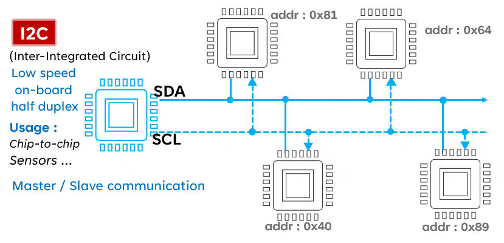

## 4.1 总线通信基本概念

1. 通信方向划分：单工，半双工，全双工
2. 同步通信
   - eg： I2C，SPI，USB3.0
   - 一般不支持远距离传输，通常是板级之间的距离小于50cm的
   - 也可通过走差分信号实现更远距离的通信
3. 异步通信
   - eg：UART、USB2.0、RJ45
   - 通信距离会稍远一些，通常是主机或设备之间的通信
   - 为了实现更远距离通信，一般走差分信号，eg：RS232、RS485、RS422、CAN等

## 4.2  I2C通信时序

通信时序：

- 主机发起启始信号（时钟高电平期间，数据产生一个下降沿）
- 发送地址，通信之前先通过从机地址选中要通信的从机设备
  - 地址一般从模块芯片数据手册中获得
  - 有的也提供外部IO来手动指定（当地址冲突的时候）
  - 通常是7位数据表示，也有10位的地址
- 主机接收对应从机的应答
  - ACK表示正确应答
  - NACK表示异常应答
- 开始传输数据，且每传输8bit数据应答一位
- 主机发起停止信号（时钟高电平期间，数据产生一个上升沿）
- 本次通信结束

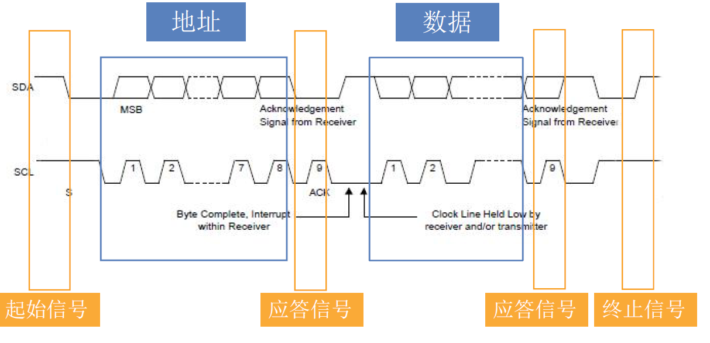

特点：

1. 字节序：大端字节序
2. SDA数据在SCL高电平周期保持稳定，在SCL低电平周期才可以切换下一个数据。（时钟高电平采集数据，时钟低电平准备数据）
3. i2c是电平触发数据传输，不同于spi的边沿触发
4. 位速率可达400kbit/s（快速模式），100kbit/s（标准），3.4Mbit/s（高速），用来传输普通的传感器数据是有余的，但用来传输视频数据是不够的。

## 4.3 IO模拟I2C实例：MMA8653

mma8653是一款三轴重力加速度传感器，能够感知到加速度的变化，比如晃动、跌落、上升、下降等，各种移动变化都能被mma8653转化为电信号，用户直接从寄存器读取坐标即可。

先从底板x6818bv2.pdf 找到mma8653，再从其中的引脚名MCU_SCL_2，定位到核心板x4418cv3_release20150713.pdf的GPIO口，再由GPIO口在芯片手册SEC_S5P6818X_Users_Manual_preliminary_Ver_0.00.pdf定位GPIO口对应的功能模式

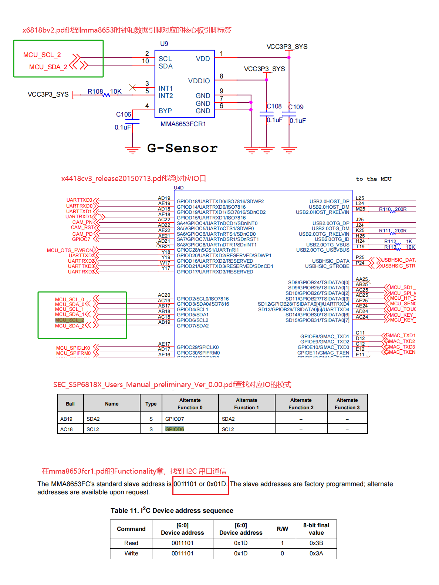

mma8653操作流程

- 芯片在上电后需要配置CTRL_REG1(0x2A)为模式ACTIVE，此时芯片就可以正常工作
- 检测chid_id是否正确(0Dh)
- 读取坐标信息x、y、z（01h-06h）

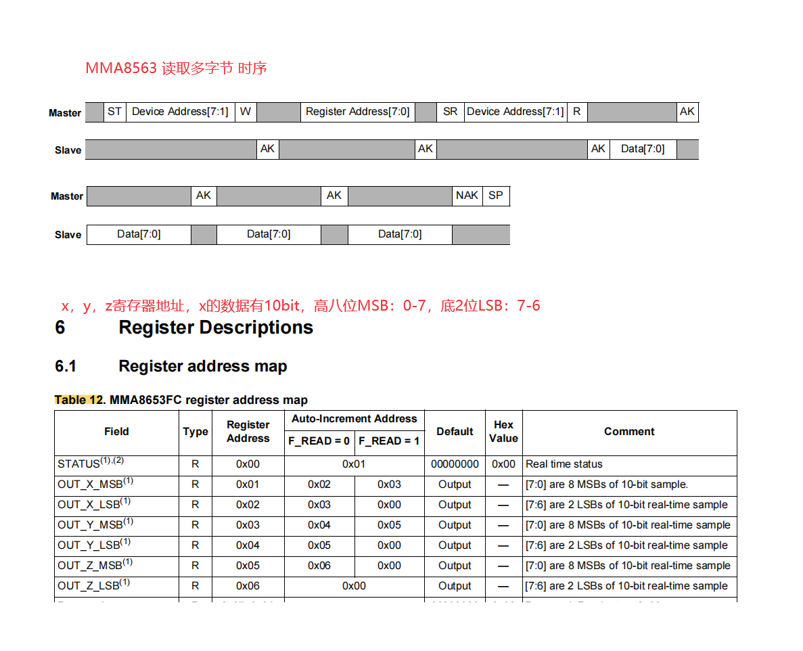

```c
#include <linux/miscdevice.h>
#include <linux/module.h>	/* module_init */
#include <linux/fs.h>	/* file_operations */
#include <linux/device.h>	/* class device */
#include <linux/sched.h>		/* current */
#include <linux/mount.h>		/* struct vfsmount */
#include <asm/io.h>	/* writel() */
#include <linux/uaccess.h> /* copy_to_user() */
#include <mach/devices.h> 	//PAD_GPIO_A+n
#include <mach/soc.h> 		//nxp_soc_gpio_set_io_func();
#include <mach/platform.h>	//PB_PIO_IRQ(PAD_GPIO_A+n);
#include <linux/interrupt.h>	/*request_irq*/
#include <linux/irq.h>	/*set_irq_type*/
#include <linux/delay.h> /* mdelay() */
#include <linux/kfifo.h> /* kfifo */
#include <linux/poll.h> /* poll */
#include <linux/kthread.h> /* kthread */
#include <linux/cdev.h>
#include <linux/platform_device.h>
#include <linux/kernel.h>
#include <linux/irq.h>
#include <asm/irq.h>


#define MMA8653_ADDR 0x1D
#define MMA8653_WRITE 0x00
#define MMA8653_READ 0X01

#define MMA8653_SDA_IO PAD_GPIO_D+7		// 数据io口
#define MMA8653_SDA_IO_FUNC 0
#define MMA8653_SCL_IO PAD_GPIO_D+6		// 时钟io口
#define MMA8653_SCL_IO_FUNC 0

#define clk_out() 		nxp_soc_gpio_set_io_dir(MMA8653_SCL_IO,1)
#define clk_in() 		nxp_soc_gpio_set_io_dir(MMA8653_SCL_IO,0)
#define clk_set() 		nxp_soc_gpio_set_out_value(MMA8653_SCL_IO, 1)
#define clk_clear() 	nxp_soc_gpio_set_out_value(MMA8653_SCL_IO, 0)


#define dat_out() 		nxp_soc_gpio_set_io_dir(MMA8653_SDA_IO,1)
#define dat_in() 		nxp_soc_gpio_set_io_dir(MMA8653_SDA_IO,0)
#define dat_set() 		nxp_soc_gpio_set_out_value(MMA8653_SDA_IO, 1)
#define dat_clear() 	nxp_soc_gpio_set_out_value(MMA8653_SDA_IO, 0)
#define dat_get_in() 	nxp_soc_gpio_get_in_value(MMA8653_SDA_IO)

#define demo_i2c_delay() udelay(50)


#define DEVICE_NAME "mma8653"


void demo_i2c_gpio_init(void){
	// 初始化i2c 模拟时序涉及到的两个GPIO口
	nxp_soc_gpio_set_io_func(MMA8653_SDA_IO, MMA8653_SDA_IO_FUNC);
	nxp_soc_gpio_set_io_func(MMA8653_SCL_IO, MMA8653_SCL_IO_FUNC);
	
	clk_out();
	dat_out();
}


// 起始信号
void demo_i2c_start(void){
	dat_out();				// 由于是半双工，所以将模式调整为输出
	dat_set();				//将数据置1
	clk_set();				//将时钟置1
	demo_i2c_delay();
	dat_clear();
	demo_i2c_delay();
	clk_clear();		// 时钟模式是空闲时为低电平，如果有其他需要可以修改
}

// 终止信号
void demo_i2c_stop(void){
	dat_out();				// 由于是半双工，所以将模式调整为输出
	dat_clear();
	clk_set();
	demo_i2c_delay();
	dat_set();
	demo_i2c_delay();
	clk_clear();
}

// 数据发送
void demo_i2c_send_byte(unsigned char data){
	int i;
	dat_out();				// 由于是半双工，所以将模式调整为输出
	clk_clear();	//时钟为低开始准备发送数据
	for(i=0;i<8;i++){
		// 从data的最高位第7位开始读，如果是高，那么发送高电平，如果是低，发送低电平
		if(data & (1 << (7 -i))){
			dat_set();
		}else{
			dat_clear();
		}
		// 等待准备的数据稳定
		demo_i2c_delay();
		// 数据已稳定，时钟置为高电平
		clk_set();
		// 等待对方读数据
		demo_i2c_delay();
		clk_clear();
	}
	
}

// 数据接收
unsigned char demo_i2c_recv_byte(void){
	unsigned char data = 0;
	int i;
	dat_in();
	clk_clear();		// 时钟为低，等待对方发送数据
	for(i=0;i<8;i++){
		demo_i2c_delay();		//等待对方准备好数据
		clk_set();				
		// 等待对方的数据稳定
		demo_i2c_delay();
		data |= dat_get_in() << (7-i);
		clk_clear();
	}
	return data;
	
}

// 发送应答
void demo_i2c_send_ack(unsigned char ack){
	dat_out();				// 由于是半双工，所以将模式调整为输出
	clk_clear();	//时钟为低开始准备发送数据
	
	// 如果是高，那么发送高电平，如果是低，发送低电平
	if(ack)
		dat_set();
	else
		dat_clear();
	
	// 等待准备的数据稳定
	demo_i2c_delay();
	// 数据已稳定，时钟置为高电平
	clk_set();
	// 等待对方读数据
	demo_i2c_delay();
	clk_clear();
	
}

// 接收应答
unsigned char demo_i2c_recv_ack(void){
	unsigned char ack = 0;
	dat_in();
	clk_clear();		// 时钟为低，等待对方发送数据

	demo_i2c_delay();		//等待对方准备好数据
	clk_set();				
	// 等待对方的数据稳定
	demo_i2c_delay();
	ack = dat_get_in();
	clk_clear();
	
	return ack;
	
}


void demo_i2c_send(unsigned char* buf,unsigned char reg, int len){
	// 把buf中的数据写入寄存器reg中

	int i = 0;
	demo_i2c_start();		// 发送起始信号
	demo_i2c_send_byte((MMA8653_ADDR << 1) | MMA8653_WRITE);	// 发送芯片地址
	demo_i2c_recv_ack();			// 接收应答
	demo_i2c_send_byte(reg);		// 发送数据存放的寄存器地址
	demo_i2c_recv_ack();
	while(len--){
		demo_i2c_send_byte(buf[i++]);
		demo_i2c_recv_ack();
	}
	
	demo_i2c_stop();
	
}

void demo_i2c_recv(unsigned char *buf, unsigned char reg, int len){
	int i=0;
	
	demo_i2c_start();		// 发送起始信号
	demo_i2c_send_byte((MMA8653_ADDR << 1) | MMA8653_WRITE);	// 发送芯片地址及准备写
	demo_i2c_recv_ack();			// 接收应答
	demo_i2c_send_byte(reg);		// 发给8653，需要读取寄存器的地址，然后返回它寄存器中的数据
	demo_i2c_recv_ack();


	demo_i2c_start();
	demo_i2c_send_byte((MMA8653_ADDR << 1) | MMA8653_READ);
	demo_i2c_recv_ack();
	while(len--){
		buf[i++] = demo_i2c_recv_byte();
		if(len > 0)
			demo_i2c_send_ack(0);	// ack
		else
			demo_i2c_send_ack(1);	// nack
	}
	
	demo_i2c_stop();
	
}

static int demo_open (struct inode *pinode, struct file *pfile){
	unsigned char data = 0;
    printk(KERN_WARNING "L%d‐>%s()\n",__LINE__,__FUNCTION__);
	// 芯片在上电后需要配置CTRL_REG1(0x2A)为模式ACTIVE，此时芯片就可以正常工作
	demo_i2c_recv(&data,0x2a,1);	// 读取原有配置
	data |= 0x01;					// 修改成activate模式
	demo_i2c_send(&data,0x2a,1);	// 发过去，由芯片修改

	demo_i2c_recv(&data,0x0d,1);	// 读取(0Dh)的内容child_id, 查看是不是0x5a
	printk(KERN_WARNING "L%d‐>%s():chip id = 0x%x\n",__LINE__,__FUNCTION__, data);
	return 0;
}

static ssize_t demo_read (struct file *pifle, char __user *pbuf, size_t count, loff_t *offs){
	unsigned char data[6];
	signed short x,y,z;		// 分配两个字节
	printk(KERN_WARNING "L%d‐>%s()\n",__LINE__,__FUNCTION__);
	demo_i2c_recv(data, 0x01, 6);			//读	x,y,z，他们都有10bit数据
	x = (data[0] << 2) | (data[1] >> 6);	// 还有6bit空着
	y = (data[2] << 2) | (data[3] >> 6);
	z = (data[4] << 2) | (data[5] >> 6);

	x = (short) (x << 6) >> 6;	// 先左移6位（逻辑移位），再右移6位（算术移位），算术移位会保留符号位
	y = (short) (y << 6) >> 6;
	z = (short) (z << 6) >> 6;
	printk(KERN_WARNING "x = %d, y = %d, z = %d \n", x, y, z);
	mdelay(300);
	return 1;
}


struct file_operations fops = {
    .owner = THIS_MODULE,
    .open = demo_open,
    .read = demo_read,
};

static struct miscdevice my_misc = {
    .minor = MISC_DYNAMIC_MINOR,
    .name = DEVICE_NAME,
    .fops = &fops,
};

static int __init demo_i2c_module_init(void)
{
	printk(KERN_WARNING "L%d‐>%s()\n",__LINE__,__FUNCTION__);
	demo_i2c_gpio_init();
	misc_register(&my_misc);
	return 0;
}

static void __exit demo_i2c_module_exit(void)
{
	printk(KERN_WARNING "L%d‐>%s()\n",__LINE__,__FUNCTION__);
	misc_deregister(&my_misc);
}

module_init(demo_i2c_module_init);
module_exit(demo_i2c_module_exit);


MODULE_LICENSE("GPL");


```

## 4.4 I2C总线

I2C通信方式：

1. 模拟I/O口（上一节）
   - 特点：在对应时间节点把IO口拉高/低
   - 优缺点：思路清晰，操作麻烦
2. 配置i2c控制器
   - 配置寄存器
   - 优缺点：操作麻烦，可移植性不好
3. I2C子系统：
   - 通过linux内核提供的i2c子系统（总线）接口
   - 优缺点：操作简单，可移植，不易理解

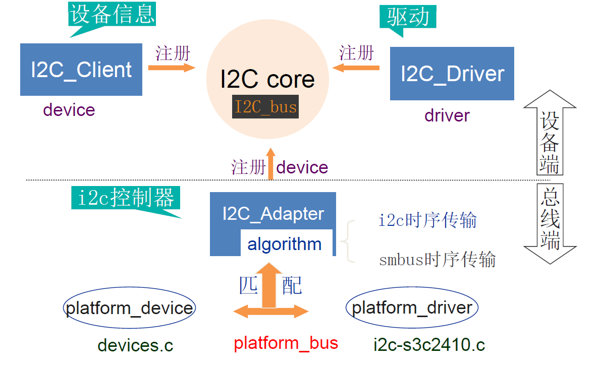

我们主要关注的是基于被控制对象的逻辑功能，忽略底层的通信过程，通信接口由内核提供的i2c adapter实现，用户只需要实现i2c_client和i2c_driver。

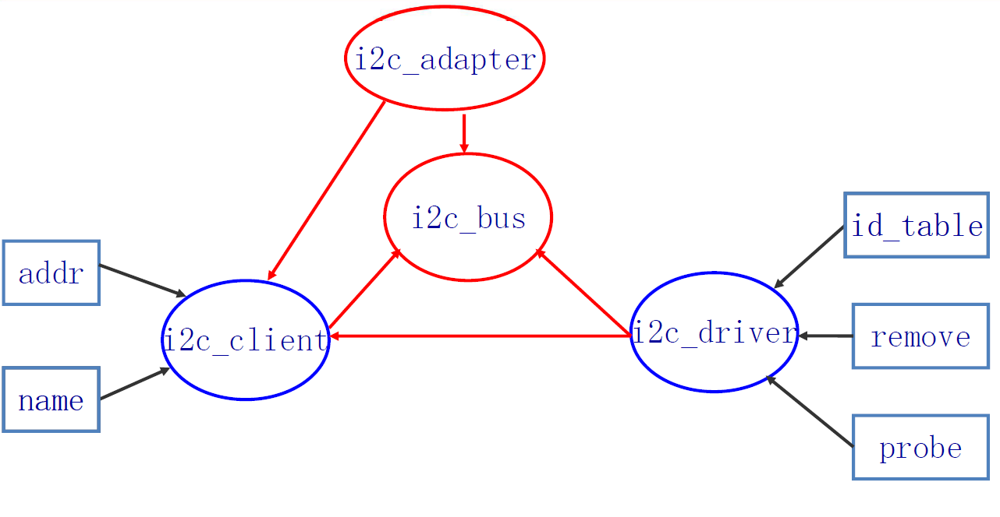

i2c_client中的name（可以有多个client）和 i2c_driver中的id_table（存放其管理的多个client名字）中的某一个名字匹配，即可通过bus联通。

### i2c client创建流程

1. 定义一个i2c_client指针
2. 获得i2c设备当前控制器i2c_get_adapter(2)
3. 设置设备类型及设备地址到数据结构i2c_board_info
4. 申请并始化数据结构i2c_client：i2c_new_device()
5. 模块卸载时释放设备i2c_client：i2c_unregister_device()

```c
// 获得i2c_adapter结构体
struct i2c_adapter *i2c_get_adapter(int id);
// id是第几个i2c总线

// 创建并注册i2c_client
struct i2c_client * i2c_new_device(struct i2c_adapter*adap, struct i2c_board_info const *info);

// 移除
void i2c_unregister_device(struct i2c_client *client);
```


 ```bash
 ls /sys/bus/i2c/devices
 0-0008  1-0036  1-0037  1-0050  i2c-0  i2c-1  i2c-2  i2c-3  i2c-4  i2c-5  i2c-6  i2c-7
 # 0-0008，0代表第几个i2c总线，0008代表i2c设备的地址
 
 ```

```c
#include <linux/module.h>	/* module_init */
#include <linux/fs.h>	/* file_operations */
#include <linux/device.h>	/* class device */
#include <linux/sched.h>		/* current */
#include <linux/mount.h>		/* struct vfsmount */
#include <asm/io.h>	/* writel() */
#include <linux/uaccess.h> /* copy_to_user() */
#include <mach/devices.h> 	//PAD_GPIO_A+n
#include <mach/soc.h> 		//nxp_soc_gpio_set_io_func();
#include <mach/platform.h>	//PB_PIO_IRQ(PAD_GPIO_A+n);
#include <linux/interrupt.h>	/*request_irq*/
#include <linux/irq.h>	/*set_irq_type*/
#include <linux/delay.h> /* mdelay() */
#include <linux/kfifo.h> /* kfifo */
#include <linux/poll.h> /* poll */
#include <linux/kthread.h> /* kthread */
#include <linux/cdev.h>
#include <linux/platform_device.h>
#include <linux/kernel.h>
#include <linux/irq.h>
#include <asm/irq.h>
#include <linux/i2c.h>

#define I2C_BUS_INDEX 2
#define I2C_DEVICE_ADDR 0x1d
#define I2C_DEVICE_NAME "mma8653"

// 如果模块安装成功，那么在ls /sys/bus/i2c/devices 可以看到2_001d的设备

static struct i2c_client *mma8653_client;	
static struct i2c_board_info mma8653_info={
	.type = I2C_DEVICE_NAME,
	.addr = I2C_DEVICE_ADDR,
	
};


static int  __init demo_dev_init(void)
{
	struct i2c_adapter *mma8653_i2c_adapter;
	printk(KERN_WARNING "L%d‐>%s()\n", __LINE__, __FUNCTION__);
	mma8653_i2c_adapter = i2c_get_adapter(I2C_BUS_INDEX);    
	mma8653_client = i2c_new_device(mma8653_i2c_adapter, &mma8653_info);
	i2c_put_adapter(mma8653_i2c_adapter);
	return 0;
}

static void  __exit demo_dev_exit(void)
{
    printk(KERN_WARNING "L%d‐>%s()\n",__LINE__,__FUNCTION__);
	i2c_unregister_device(mma8653_client);
}

module_init(demo_dev_init);
module_exit(demo_dev_exit);

MODULE_LICENSE("GPL");	
MODULE_AUTHOR("qin");
MODULE_DESCRIPTION("used for studing linux drivers");


```

### i2c driver创建流程

1. 定义一个i2c_driver指针
2. 需要定义一个i2c_device_id记录该驱动能支持的所有设备（客户端）
3. 调用i2c_add_driver()进行注册
4. 模块卸载时释放设备i2c_del_driver()

```c
// 1. smbus方式收发i2c设备数据
s32 i2c_smbus_read_byte_data(const struct i2c_client *client, u8 command)
s32 i2c_smbus_write_byte_data(const struct i2c_client *client, u8 command, u8 value);
// command：寄存器地址

// 2. 单独的读/写函数
int i2c_master_send(struct i2c_client *client, const char *buf, int count);
int i2c_master_recv(struct i2c_client *client, char *buf, int count);

// 3. 结构体+统一函数，这个要用的时候再具体百度
int i2c_transfer(struct i2c_adapter *adap, struct i2c_msg *msgs, int num)
```


```bash
# 查看i2c总线的驱动
ls /sys/bus/i2c/drivers
```

```c

#include <linux/miscdevice.h>
#include <linux/module.h>	/* module_init */
#include <linux/fs.h>	/* file_operations */
#include <linux/device.h>	/* class device */
#include <linux/sched.h>		/* current */
#include <linux/mount.h>		/* struct vfsmount */
#include <asm/io.h>	/* writel() */
#include <linux/uaccess.h> /* copy_to_user() */
#include <mach/devices.h> 	//PAD_GPIO_A+n
#include <mach/soc.h> 		//nxp_soc_gpio_set_io_func();
#include <mach/platform.h>	//PB_PIO_IRQ(PAD_GPIO_A+n);
#include <linux/interrupt.h>	/*request_irq*/
#include <linux/irq.h>	/*set_irq_type*/
#include <linux/delay.h> /* mdelay() */
#include <linux/kfifo.h> /* kfifo */
#include <linux/poll.h> /* poll */
#include <linux/kthread.h> /* kthread */
#include <linux/cdev.h>
#include <linux/platform_device.h>
#include <linux/kernel.h>
#include <linux/irq.h>
#include <asm/irq.h>
#include <linux/i2c.h>


#define DEVICE_NAME "mma8653"

static struct i2c_client* demo_client;


void demo_i2c_send(unsigned char* buf,unsigned char reg, int len){
	// 把buf中的数据写入寄存器reg中

	int i = 0;
	while(len--){
		i2c_smbus_write_byte_data(demo_client,reg++, buf[i++]);

	}
	
}

void demo_i2c_recv(unsigned char *buf, unsigned char reg, int len){
	int i=0;
	while(len--){
		buf[i++]= i2c_smbus_read_byte_data(demo_client, reg++);
	}
}

static int demo_open (struct inode *pinode, struct file *pfile){
	unsigned char data = 0;
	printk(KERN_WARNING "L%d‐>%s()\n",__LINE__,__FUNCTION__);
	
	// 芯片在上电后需要配置CTRL_REG1(0x2A)为模式ACTIVE，此时芯片就可以正常工作
	demo_i2c_recv(&data,0x2a,1);	// 读取原有配置
	data |= 0x01;					// 修改成activate模式
	demo_i2c_send(&data,0x2a,1);	// 发过去，由芯片修改

	demo_i2c_recv(&data,0x0d,1);	// 读取(0Dh)的内容child_id, 查看是不是0x5a
	printk(KERN_WARNING "L%d‐>%s():chip id = 0x%x\n",__LINE__,__FUNCTION__, data);
	return 0;
}

static ssize_t demo_read (struct file *pifle, char __user *pbuf, size_t count, loff_t *offs){
	unsigned char data[6];
	signed short x,y,z;		// 分配两个字节
	printk(KERN_WARNING "L%d‐>%s()\n",__LINE__,__FUNCTION__);
	demo_i2c_recv(data, 0x01, 6);			//读	x,y,z，他们都有10bit数据
	x = (data[0] << 2) | (data[1] >> 6);	// 还有6bit空着
	y = (data[2] << 2) | (data[3] >> 6);
	z = (data[4] << 2) | (data[5] >> 6);

	x = (short) (x << 6) >> 6;	// 先左移6位（逻辑移位），再右移6位（算术移位），算术移位会保留符号位
	y = (short) (y << 6) >> 6;
	z = (short) (z << 6) >> 6;
	printk(KERN_WARNING "x = %d, y = %d, z = %d \n", x, y, z);
	mdelay(300);
	return 1;
}


struct file_operations fops = {
    .owner = THIS_MODULE,
    .open = demo_open,
    .read = demo_read,
};

static struct miscdevice my_misc = {
    .minor = MISC_DYNAMIC_MINOR,
    .name = DEVICE_NAME,
    .fops = &fops,
};

static int __init demo_probe(struct i2c_client *cli, const struct i2c_device_id * id)
{
	printk(KERN_WARNING "L%d‐>%s():id = %s \n",__LINE__,__FUNCTION__, id->name);
	demo_client = cli;
	return misc_register(&my_misc);
}

static int __exit demo_remove(struct i2c_client *cli)
{
	printk(KERN_WARNING "L%d‐>%s()\n",__LINE__,__FUNCTION__);
	return misc_deregister(&my_misc);

}

static const struct i2c_device_id demo_i2c_id[]={
	{"mma8653",0},
	{"mma8654",0}
};

static struct i2c_driver demo_drv = {
	.probe = demo_probe,
	.remove = demo_remove,
	.id_table = demo_i2c_id,
	.driver = {
		.name = "mma865x",
		.owner = THIS_MODULE,
	}
};

static int __init demo_i2c_module_init(void){
	printk(KERN_WARNING "L%d‐>%s()\n",__LINE__,__FUNCTION__);
	return i2c_add_driver(&demo_drv);
}
static void __exit demo_i2c_module_exit(void)
{
	printk(KERN_WARNING "L%d‐>%s()\n",__LINE__,__FUNCTION__);
	i2c_del_driver(&demo_drv);
}


module_init(demo_i2c_module_init);
module_exit(demo_i2c_module_exit);


MODULE_LICENSE("GPL");

```

# 5 块设备驱动

- 数据传输以块为单位，带有数据缓冲区，使得数据传输非实时
- 可以根据需要优化缓冲区的数据读写顺序
- 一般不用关心与内核相关的大量数据结构

常见块设备：硬盘、光盘、SD卡、U盘


## 5.1 块设备驱动程序框架

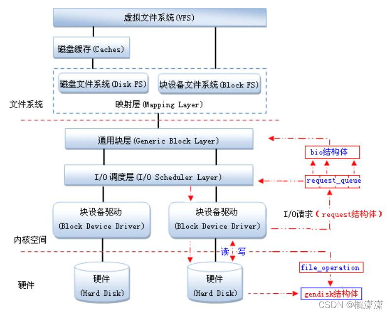

**块设备驱动是为文件系统服务的（并不是直接为应用程序服务）**，为了避免直接文件系统打交道，内核为我们设计了一个通用层。

1. 通用块层
   - 在Linux中，内核文件子系统通过统一接口与通用块层进行数据传输。
   - 该层提供了一个request结构体，并以一个链表进行管理，request结构体内部可以细化为更小粒度的bio
   - 维护了一个request_queue结构体(请求队列)，请求队列作为一个容器，用来缓存多个request数据请求
2. I/O调度层
   - 该层的I/0调度器操作request数据请求，并对请求进行合并、调整顺序等操作，以提高对设备的访问效率。
3. 块设备驱动
   - 块设备驱动层可以用一个gendisk结构体来表示
   - 该结构体包涵了整个块设备的信息，如设备名、主从设备号、扇区大小、扇区数等等，并提供了标准的操作接口函数（类似字符中的file_operations），前面提到的request_queue结构体也定义在该结构体中。

流程举例：假如fs向磁盘写入5M的数据，通用块层将它分为了5个request请求，这个5个请求以链表形式进行管理（1->5->2->4->3），这些请求涉及到的磁盘区域是不同的，I/O调度层为了加快磁盘读写速度，调整这些request链表顺序，假如当前磁头离request4最近，request5又离request4最近，那么这些请求的顺序就变为（4->5->3->2->1）

## 5.2 块设备数据结构

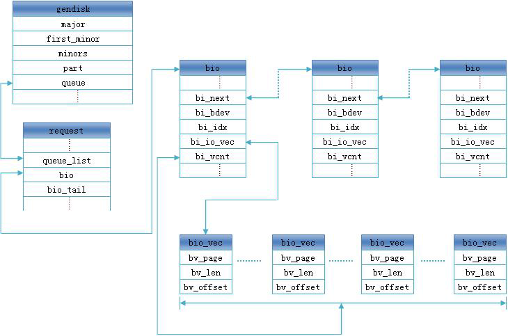


- page是最终写入磁盘的数据，所以必须是连续的，page是磁盘管理数据的颗粒度
- 一般通用层的IO请示，也就是fs发起的，这些请示进入块设备之前，都可能被拆成多个更小的bio，bio下面还包含更小的page，主要是基于写平衡
- 这些被拆分的bio，再通过一定规则将相邻的多个bio进行合并，合并成request，
- 而request就可以进入块设备了，但进入之前，一般还会进行数据优化调度
- 最后再对request进行统一管理，会建立一个request_queue，而request就放在这个请求队列中，一个磁盘一般维护着一个请求队列

```c
#include<linux/genhd.h>

// 代表一块磁盘或一个分区
struct gendisk {
    int major; 											//主分区号
    int first_minor;									//起始从设备号
    int minors; 										//支持的从设备号总数
    char disk_name[DISK_NAME_LEN]; 						//dev下设备名称
    char *(*devnode)(struct gendisk *gd, mode_t *mode);
    struct disk_part_tbl *part_tbl;
    struct hd_struct part0;
    const struct block_device_operations *fops;			//块设备操作函数接口， 类似与字符设备的file_operations
    struct request_queue *queue; 						//数据请求队列
    void *private_data;				 					//可保存自定义的私有数据
    int flags;
    struct device *driverfs_dev;
    struct kobject *slave_dir;
    struct timer_rand_state *random;
    atomic_t sync_io;
    struct work_struct async_notify;
    #ifdef CONFIG_BLK_DEV_INTEGRITY
    struct blk_integrity *integrity;
    #endif
    int node_id;
};
```

## 5.3 块设备驱动注册开发流程

1. 注册块设备(获取主设备号)：register_blkdev
2. 申请定义gendisk结构体（采用内核接口函数）：alloc_disk
3. 初始化gendisk结构体（主设备号、从设备号、请求队列、设备名、设备操作结构体、数据请求处理函数等）
4. 注册gendisk结构体：add_disk
5. 注销gendisk结构体：del_gendisk
6. 释放gendisk结构体：put_disk
7. 释放占用的系统资源（如中断、kmalloc空间信号量、自旋锁等）
8. 注销块设备：unregister_blkdev

```c
#include<linux/genhd.h>

int register_blkdev(unsigned int major, const char *name);
int unregister_blkdev(unsigned int major, const char *name);

// 申请和释放gendisk结构体
struct gendisk *alloc_disk(int minors);			// minors：最多支持的分区数
void put_disk(struct gendisk *disk);

// 块设备注册与注销
void add_disk(struct gendisk *disk);
void del_gendisk(struct gendisk *gp);

// 请求队列初始化函数
struct request_queue* blk_init_queue(request_fn_proc *rfn, spinlock_t *lock);
// rfn: 绑定请求处理函数的指针
// lock：自旋锁变量，给块组件使用
```

```c
#include <linux/miscdevice.h>
#include <linux/module.h>	/* module_init */
#include <linux/fs.h>	/* file_operations */
#include <linux/device.h>	/* class device */
#include <linux/sched.h>		/* current */
#include <linux/mount.h>		/* struct vfsmount */
#include <asm/io.h>	/* writel() */
#include <linux/uaccess.h> /* copy_to_user() */
#include <mach/devices.h> 	//PAD_GPIO_A+n
#include <mach/soc.h> 		//nxp_soc_gpio_set_io_func();
#include <mach/platform.h>	//PB_PIO_IRQ(PAD_GPIO_A+n);
#include <linux/interrupt.h>	/*request_irq*/
#include <linux/irq.h>	/*set_irq_type*/
#include <linux/delay.h> /* mdelay() */
#include <linux/kfifo.h> /* kfifo */
#include <linux/poll.h> /* poll */
#include <linux/kthread.h> /* kthread */
#include <linux/cdev.h>
#include <linux/platform_device.h>
#include <linux/kernel.h>
#include <linux/irq.h>
#include <asm/irq.h>

#include <linux/genhd.h>
#include <linux/blkdev.h>
#include <linux/hdreg.h>
#include <linux/vmalloc.h>


#define VDISK_SIZE 10*1024*1024		// 磁盘大小10M
#define SECTOR_SIZE 512				// 扇区大小512byte
#define VDISK_HEADS 4				// 磁头数
#define VDISK_SECTOR_PER_CIDAO 16 	// 每个磁道有多少个扇区
#define START_SECTOR_INDEX 0		// 起始扇区

static int ramdisk_major = 0;
static struct gendisk* gdisk;
static spinlock_t  ramdisk_splock;
unsigned char * vmem;


static int ramdisk_open(struct block_device *dev, fmode_t mod){
	printk(KERN_WARNING "L%d‐>%s()\n",__LINE__,__FUNCTION__);
	return 0;
}

// 这个函数设置的值，会在分区fdisk使用到，如果不设置这个函数，分区里面将会出错
static int ramdisk_getgeo(struct block_device *, struct hd_geometry *){
	printk(KERN_WARNING "L%d‐>%s()\n",__LINE__,__FUNCTION__);
	geo->heads = VDISK_HEADS; 			// 磁头
	geo->sectors = VDISK_SECTOR_PER_CIDAO;			// 每个磁道有多少个扇区
	geo->start = START_SECTOR_INDEX;				// 起始扇区
	geo->cylinders = VDISK_SIZE / SECTOR_SIZE / VDISK_HEADS / VDISK_SECTOR_PER_CIDAO;		
	return 0;
	
}

static struct block_device_operations ramdisk_fops = {
	.owner= THIS_MODULE,
	.open = ramdisk_open,
	.getgeo = ramdisk_getgeo
};


static void ramdisk_request_handler(struct request_queue *q){
	unsigned int size;
	unsigned int off;
	struct request *req;
	printk(KERN_WARNING "L%d‐>%s()\n",__LINE__,__FUNCTION__);
	req = blk_fetch_request(q);
	while(req){
		size = blk_rq_cur_bytes(req);
		off = req->__sector * SECTOR_SIZE;
		if(rq_data_dir(req) == READ){
			memcpy(req->buffer, vmem+off,size);
		}else if(rq_data_dir(req) == WRITE){
			memcpy(vmem+off, req->buffer, size);
		}
		if(!__blk_end_request_cur(req,0)){
			req= blk_fetch_request(q);
		}
	}
}


static int __init ramdisk_module_init(void){
	printk(KERN_WARNING "L%d‐>%s()\n",__LINE__,__FUNCTION__);
	vmem = vmalloc(VDISK_SIZE);		// 申请10M的空间，用vmem指针指向这块空间
	
	ramdisk_major =	register_blkdev(ramdisk_major, "ramdisk");				// 获取主设备号
	
	gdisk = alloc_disk(3);
	gdisk->major = ramdisk_major;
	strcpy(gdisk->disk_name, "ramdiska");				// 在/dev下显示的名字
	gdisk->first_minor = 0;
	gdisk->fops = &ramdisk_fops;
	spin_lock_init(&ramdisk_splock);
	gdisk->queue = blk_init_queue(ramdisk_request_handler,&ramdisk_splock);
	set_capacity(gdisk,VDISK_SIZE/SECTOR_SIZE);					// 设置 扇区数量 = 磁盘容量/扇区大小

	add_disk(gdisk);
	
	return 0;
}
static void __exit ramdisk_module_exit(void)
{
	printk(KERN_WARNING "L%d‐>%s()\n",__LINE__,__FUNCTION__);
	del_gendisk(gdisk);
	put_disk(gdisk);
	unregister_blkdev(ramdisk_major, "ramdisk");
	vfree(vmem);
}

module_init(ramdisk_module_init);
module_exit(ramdisk_module_exit);


MODULE_LICENSE("GPL");
```


## 5.4 磁盘使用流程

1. 磁盘分区
   - `fdisk /dev/ramdiska`
   - 也可以不分区，直接将整个磁盘格式化
2. 设备格式化（给不同的分区设置文件系统）
   - mkfs.xxx命令：依据你想制作为什么文件系统，然后选择
   - 命令行输入`mkfs. `可以看到你拥有哪些文件系统的制作命令
   - u盘用到最多的文件格式是：mkfs.vfat 
   - `mkfs.vfat /dev/ramdiska`
3. 挂载磁盘
   - `mount /dev/ramdiska /mnt/mydisk`
4. 访问磁盘
   - 直接对挂载点进行访问
   - 直接对设备文件进行访问
   - 读写磁盘数据的时机：
     - 缓冲区缓冲超时
     - 读写数据量足够大
     - 强制同步刷新缓冲区：sync
     - 卸载磁盘时，会刷新缓冲区

```bash
# 安装驱动模块
insmod blk_ramdisk_driver.ko
[160498.088000] L79‐>ramdisk_module_init()			# 注册
[160498.096000] L43‐>ramdisk_open()					# 打开磁盘
[160498.096000] L61‐>ramdisk_request_handler()
[160498.098000] L61‐>ramdisk_request_handler()
[160498.103000]  ramdiska: unknown partition table
# 安装驱动后，内核会自动挂载磁盘，然后就去request，去读分区表，发现没有分区表

# 设备格式化
mkfs.vfat /dev/ramdiska
[160969.610000] L43‐>ramdisk_open()
[160969.610000] L61‐>ramdisk_request_handler()
[160969.612000] L61‐>ramdisk_request_handler()
[160969.617000] L61‐>ramdisk_request_handler()
[160969.621000] L61‐>ramdisk_request_handler()
[160969.625000] L61‐>ramdisk_request_handler()
[160969.629000] L61‐>ramdisk_request_handler()
[160969.634000] L61‐>ramdisk_request_handler()
[160969.638000] L61‐>ramdisk_request_handler()
[160969.643000] L61‐>ramdisk_request_handler()
[160969.647000] L61‐>ramdisk_request_handler()
[160969.651000] L61‐>ramdisk_request_handler()
[160969.656000] L61‐>ramdisk_request_handler()
[160969.659000] L61‐>ramdisk_request_handler()
[160969.663000] L61‐>ramdisk_request_handler()
# 格式化的过程就是向磁盘写入相关格式信息的过程

# 挂载
mount /dev/ramdiska /mnt/mydisk
```

# 6 USB总线 

USB（Universal Serial BUS）“通用串行总线”

USB2.0——480Mbps（I < 500mA），USB3.0——5Gbps（I < 900mA），USB3.1——10Gbps

USB拓扑结构：主从结构

- USB主机由**USB主控制器(Host Controller)和根集线器(Root Hub)**构成，所有从机都必须经过集线器（hub）才能与主机相连
- USB从机可以是各种USB设备也可以是集线器（扩展接口，但不扩展带宽）
- 数据交换只能在主从之间，从机之间不能通信。USB OTG是一种可以实现主从机角色切换的协议
- usb2.0协议中规定最多扩展7层hub，设备总数不超过127个（包含集线器hub本身）
- 每一个usb设备都有一个唯一的7bit从机地址

USB电气特性：

- 标准USB连线使用4芯电缆：5V电源线(VBUS)、差分数据线负(D-)、差分数据线正(D+)及地线(GND)。
- USB低速和全速模式中，采用的是电压传输模式；而在高速模式下，则是电流传输模式
- 当设备与集线器端口连接时，集线器端口的下拉低电平会由于上拉分压，而变成高电平，从而识别出USB的插拔动作。


## 6.1 传输类型

- USB协议规定了4种传输类型：
  - 批量传输：数据量较大，但对实时性要求不高
  - 同步传输(或等时传输)：一种开销很小的传输类型，容许存在少量错误（实时性要求高）
  - 中断传输：异步通信方式
  - 控制传输：主要用于主从命令配置
- 其中批量、同步、中断三种传输中，每完整传输一次数据都称做一个事务。
- 控制传输包括三个过程：建立过程和状态过程分别是一个事务，数据过程则可能包含多个事务。
- 所有的命令均由主机发起，从机处于被应答

## 6.2 描述符和枚举过程

描述符：描述了设备的各种行为和具体参数类型等，让主机明确应该加载什么样的驱动程序与设备之间进行怎样的操作。（用于driver和device匹配的依据）

- 设备描述符：基本是与厂商有关的一些信息，eg：厂商id和产品id
- 配置描述符：反映设备对主机的配置需求，记录物理接口配置，供电方式，电流需求量等
- 端点描述符：决定usb传输类型，也是通信的终点，类似是Linux系统的管道的端口
- 还有其他的描述符

枚举过程：

- 枚举就是 通过控制传输 从设备端读取各种描述符信息的过程。之后主机会据此加载合适的驱动程序。
- 枚举过程就是和每个从设备一一询问，然后分配地址，获取信息的过程。
- 只有成功被枚举的设备才能进入正常的数据传输过程，枚举之前与设备通信是通过0地址和0端点进行的

## 6.3 linux usb驱动开发框架

主要有两类usb驱动开发

- USB设备驱动程序(USB device drivers)：控制器端驱动，**控制插入其中的USB设备**（运行在主机端）
- USB器件驱动程序(USB gadget drivers)：设备端驱动，控制该设备如何作为一个USB设备和主机通信（运行在从机端）
- 在这里我们主要讨论运行在主机端的控制器驱动。

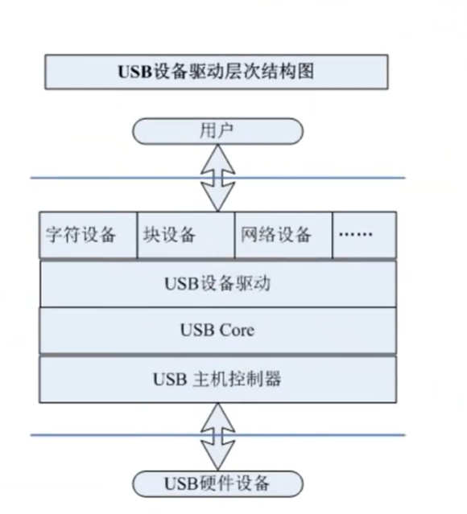

## 6.4 USB驱动开发流程

学习usb驱动开发，我们可以借鉴`kernel/drivers/usb/usb-skeleton.c`（官方推荐的骨架）

```bash
ls /sys/bus/usb/devices
1-0:1.0  1-1      1-1:1.0  2-0:1.0  usb1     usb2
# 1代表第几根总线，-0代表地址，:1.0代表协议版本usb1.0

ls /sys/bus/usb/drivers
aiptek             funsoft            mos7840            usb
aircable           garmin_gps         moschip7720        usb-storage
ark3116            gtco               moto-modem         usb_acecad
asix               hanwang            navman             usbfs
belkin             hp4X               net1080            usbhid
```


- 定义一个usb_driver
- 填充并初始化usb_driver
- 通过usb_register()完成注册
- 通过usb_unregister()完成注销
- 完成usb_device_id配置条件的选择
- usb数据传输过程:

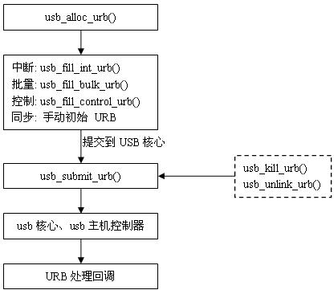

而我们使用`kernel/drivers/hid/usbhid/usbmouse.c`使用这个更具参考价值

```c

#include <linux/kernel.h>
#include <linux/slab.h>
#include <linux/module.h>
#include <linux/init.h>
#include <linux/usb/input.h>
#include <linux/hid.h>

/* for apple IDs */
#ifdef CONFIG_USB_HID_MODULE
#include "../hid-ids.h"
#endif

/*
 * Version Information
 */
#define DRIVER_VERSION "v1.6"
#define DRIVER_AUTHOR "Vojtech Pavlik <vojtech@ucw.cz>"
#define DRIVER_DESC "USB HID Boot Protocol mouse driver"
#define DRIVER_LICENSE "GPL"

MODULE_AUTHOR(DRIVER_AUTHOR);
MODULE_DESCRIPTION(DRIVER_DESC);
MODULE_LICENSE(DRIVER_LICENSE);

struct usb_mouse {
	char name[128];
	char phys[64];
	struct usb_device *usbdev;
	struct input_dev *dev;
	struct urb *irq;

	signed char *data;
	dma_addr_t data_dma;
};

static void usb_mouse_irq(struct urb *urb)
{
	struct usb_mouse *mouse = urb->context;
	signed char *data = mouse->data;
	struct input_dev *dev = mouse->dev;
	int status;

	switch (urb->status) {
	case 0:			/* success */
		break;
	case -ECONNRESET:	/* unlink */
	case -ENOENT:
	case -ESHUTDOWN:
		return;
	/* -EPIPE:  should clear the halt */
	default:		/* error */
		goto resubmit;
	}

	input_report_key(dev, BTN_LEFT,   data[0] & 0x01);
	input_report_key(dev, BTN_RIGHT,  data[0] & 0x02);
	input_report_key(dev, BTN_MIDDLE, data[0] & 0x04);
	input_report_key(dev, BTN_SIDE,   data[0] & 0x08);
	input_report_key(dev, BTN_EXTRA,  data[0] & 0x10);

	input_report_rel(dev, REL_X,     data[1]);
	input_report_rel(dev, REL_Y,     data[2]);
	input_report_rel(dev, REL_WHEEL, data[3]);

	input_sync(dev);
resubmit:
	status = usb_submit_urb (urb, GFP_ATOMIC);
	if (status)
		err ("can't resubmit intr, %s-%s/input0, status %d",
				mouse->usbdev->bus->bus_name,
				mouse->usbdev->devpath, status);
}

static int usb_mouse_open(struct input_dev *dev)
{
	struct usb_mouse *mouse = input_get_drvdata(dev);

	mouse->irq->dev = mouse->usbdev;
	if (usb_submit_urb(mouse->irq, GFP_KERNEL))
		return -EIO;

	return 0;
}

static void usb_mouse_close(struct input_dev *dev)
{
	struct usb_mouse *mouse = input_get_drvdata(dev);

	usb_kill_urb(mouse->irq);
}

static int usb_mouse_probe(struct usb_interface *intf, const struct usb_device_id *id)
{
	struct usb_device *dev = interface_to_usbdev(intf);
	struct usb_host_interface *interface;
	struct usb_endpoint_descriptor *endpoint;
	struct usb_mouse *mouse;
	struct input_dev *input_dev;
	int pipe, maxp;
	int error = -ENOMEM;

	interface = intf->cur_altsetting;

	if (interface->desc.bNumEndpoints != 1)
		return -ENODEV;

	endpoint = &interface->endpoint[0].desc;
	if (!usb_endpoint_is_int_in(endpoint))
		return -ENODEV;

	pipe = usb_rcvintpipe(dev, endpoint->bEndpointAddress);
	maxp = usb_maxpacket(dev, pipe, usb_pipeout(pipe));

	mouse = kzalloc(sizeof(struct usb_mouse), GFP_KERNEL);
	input_dev = input_allocate_device();
	if (!mouse || !input_dev)
		goto fail1;

	mouse->data = usb_alloc_coherent(dev, 8, GFP_ATOMIC, &mouse->data_dma);
	if (!mouse->data)
		goto fail1;

	mouse->irq = usb_alloc_urb(0, GFP_KERNEL);
	if (!mouse->irq)
		goto fail2;

	mouse->usbdev = dev;
	mouse->dev = input_dev;

	if (dev->manufacturer)
		strlcpy(mouse->name, dev->manufacturer, sizeof(mouse->name));

	if (dev->product) {
		if (dev->manufacturer)
			strlcat(mouse->name, " ", sizeof(mouse->name));
		strlcat(mouse->name, dev->product, sizeof(mouse->name));
	}

	if (!strlen(mouse->name))
		snprintf(mouse->name, sizeof(mouse->name),
			 "USB HIDBP Mouse %04x:%04x",
			 le16_to_cpu(dev->descriptor.idVendor),
			 le16_to_cpu(dev->descriptor.idProduct));

	usb_make_path(dev, mouse->phys, sizeof(mouse->phys));
	strlcat(mouse->phys, "/input0", sizeof(mouse->phys));

	input_dev->name = mouse->name;
	input_dev->phys = mouse->phys;
	usb_to_input_id(dev, &input_dev->id);
	input_dev->dev.parent = &intf->dev;

	input_dev->evbit[0] = BIT_MASK(EV_KEY) | BIT_MASK(EV_REL);
	input_dev->keybit[BIT_WORD(BTN_MOUSE)] = BIT_MASK(BTN_LEFT) |
		BIT_MASK(BTN_RIGHT) | BIT_MASK(BTN_MIDDLE);
	input_dev->relbit[0] = BIT_MASK(REL_X) | BIT_MASK(REL_Y);
	input_dev->keybit[BIT_WORD(BTN_MOUSE)] |= BIT_MASK(BTN_SIDE) |
		BIT_MASK(BTN_EXTRA);
	input_dev->relbit[0] |= BIT_MASK(REL_WHEEL);

	input_set_drvdata(input_dev, mouse);

	input_dev->open = usb_mouse_open;
	input_dev->close = usb_mouse_close;

	usb_fill_int_urb(mouse->irq, dev, pipe, mouse->data,
			 (maxp > 8 ? 8 : maxp),
			 usb_mouse_irq, mouse, endpoint->bInterval);
	mouse->irq->transfer_dma = mouse->data_dma;
	mouse->irq->transfer_flags |= URB_NO_TRANSFER_DMA_MAP;

	error = input_register_device(mouse->dev);
	if (error)
		goto fail3;

	usb_set_intfdata(intf, mouse);
	return 0;

fail3:	
	usb_free_urb(mouse->irq);
fail2:	
	usb_free_coherent(dev, 8, mouse->data, mouse->data_dma);
fail1:	
	input_free_device(input_dev);
	kfree(mouse);
	return error;
}

static void usb_mouse_disconnect(struct usb_interface *intf)
{
	struct usb_mouse *mouse = usb_get_intfdata (intf);

	usb_set_intfdata(intf, NULL);
	if (mouse) {
		usb_kill_urb(mouse->irq);
		input_unregister_device(mouse->dev);
		usb_free_urb(mouse->irq);
		usb_free_coherent(interface_to_usbdev(intf), 8, mouse->data, mouse->data_dma);
		kfree(mouse);
	}
}

static struct usb_device_id usb_mouse_id_table [] = {
	{ USB_INTERFACE_INFO(USB_INTERFACE_CLASS_HID, USB_INTERFACE_SUBCLASS_BOOT,
		USB_INTERFACE_PROTOCOL_MOUSE) },
	{ }	/* Terminating entry */
};

MODULE_DEVICE_TABLE (usb, usb_mouse_id_table);

static struct usb_driver usb_mouse_driver = {
	.name		= "usbmouse",
	.probe		= usb_mouse_probe,
	.disconnect	= usb_mouse_disconnect,
	.id_table	= usb_mouse_id_table,
};

module_usb_driver(usb_mouse_driver);

```


# 其他

1. [sourceInsight](https://blog.csdn.net/wkd_007/article/details/131316924)

   - 【Ctrl + F】文件中查找操作
   - 【ctrl + /】 全局搜索关键字

2. sourceinsight中，如果不小心关掉了Symbol Categories 面板，可以依次点击菜单的`View` -> `Panels` -> `Project Window`，勾选`Project Window`后面的几个可以恢复窗口。

2. [sourceinsight 自动补全](https://blog.csdn.net/byhyf83862547/article/details/137090831)

   - 选项卡options -> preference -> symbol lookups -> import symbols for all Projects -> add， 加入相关头文件文件夹到list表

3. [sourceinsight显示行号](https://blog.csdn.net/weixin_42727214/article/details/132128146)

4. 如果把声明写在代码的后面，会报警告： warning: ISO C90 forbids mixed declarations and code

   - 在C90标准下编译时出现了混淆声明和代码的情况。C90（即C99之前的标准）规定，函数内的变量声明必须放在代码的开始处，不允许在for循环、if语句或任何其他代码块中声明变量。

   ```c
   static ssize_t my_read(struct file *file, char __user *buf, size_t count, loff_t *ppos)
   {
       printk(KERN_INFO "Read from device\n");
       int ret;		// printk在int ret前面，所以会报警告
       // 读取keyboard的值
       ret = nxp_soc_gpio_get_in_value(PAD_GPIO_A+28);	// 通过返回值得到高低电平
       nxp_soc_gpio_set_out_value(PAD_GPIO_C+11,ret);
       if(ret == 0)
           return 0;
       else
           return 1;
   }
   ```

   

5. error: stray '\357' in program：在复制别处代码，粘到本地项目后，可能会报如此错，只要自己重新写一遍就好了。

6. 固件与驱动

   - 驱动程序作为一种程序，其实是软件的一种，它基于系统层面和硬件进行交互控制。（那是谁，让它干什么活）
   - 固件，直接运行在硬件内部，不需要借助操作系统，每个硬件都有一套自己的固件，用来保证硬件底层的运作。（我是谁，我能干什么活）

   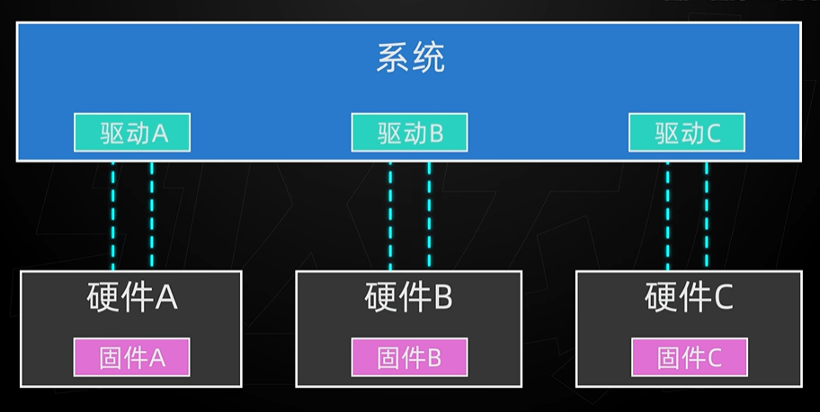

   CPU用的是主板BIOS里的固件，而不用系统里的驱动，因为在系统运行前，CPU已经开始工作，用于加载系统资源等等。

   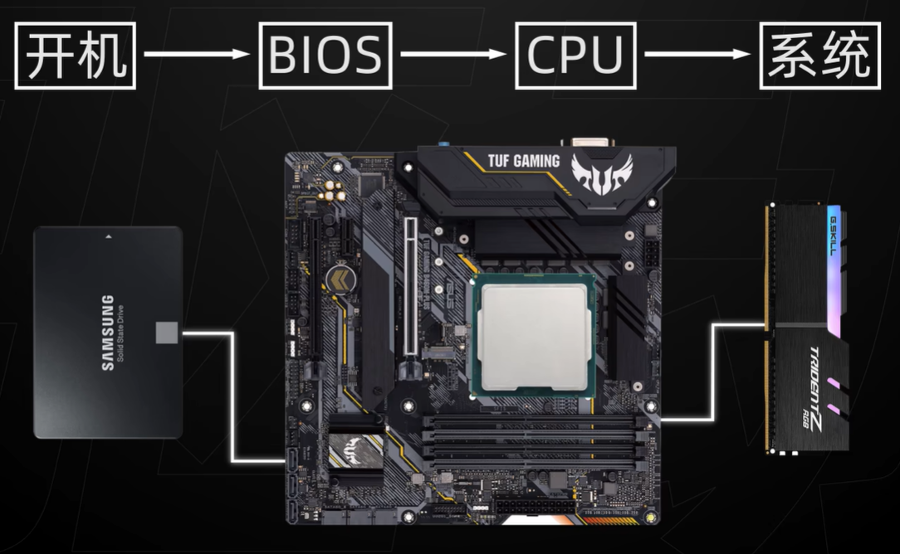

7. 


