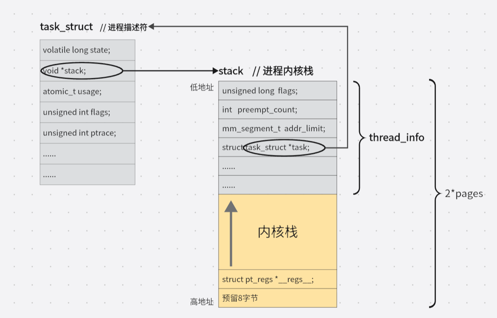
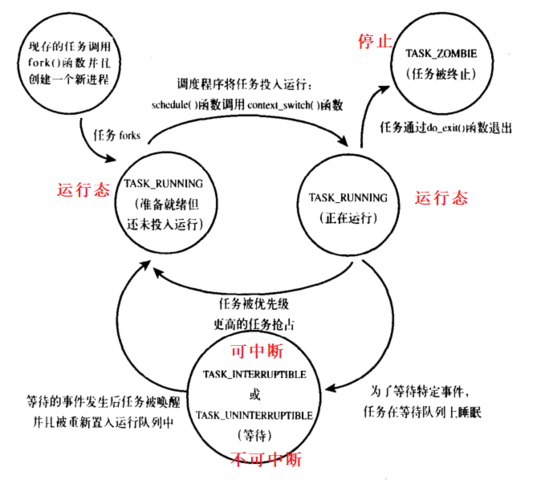
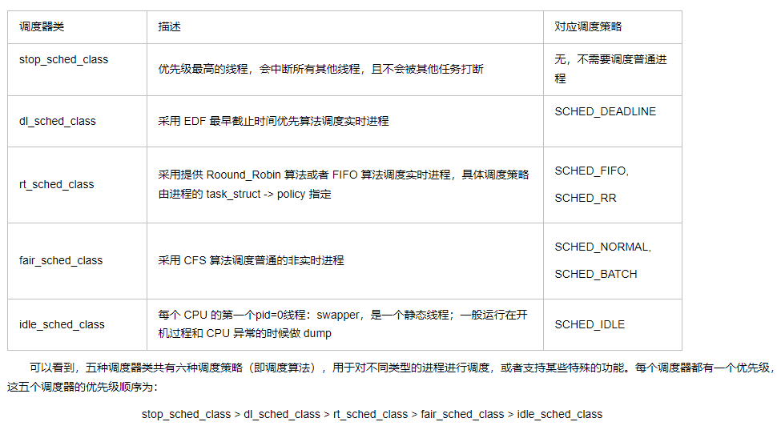
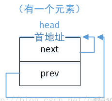
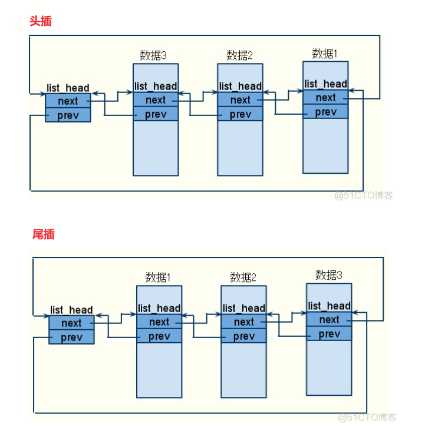

# linux 内核

[linux内核推荐书籍](https://zhuanlan.zhihu.com/p/370451356)

# 0 绪论

# 0.1 内核开发特点

1. 不能访问C库，也不能访问标准的C头文件。对于内核来说，完整的C库，哪怕是一个子集，都太大且太低效了。但是，大部分常用的C库函数都在内核中得到实现
2. 没有内存保护机制
3. 不要轻易在内核中使用浮点数
4. 容积小而固定的栈。32位机器8KB，64位机器16KB
5. 同步和并发
6. 要考虑可移植问题，将与计算机体系架构，有关的代码要进行剥离


# 1 进程管理

## 1.1 进程

进程就是处于执行期的程序以及相关资源的统称。它不局限于一段可执行程序代码，还包括其他资源，eg：打开的文件，挂起的信号及一个或多个执行线程。

线程就是在进程中活动的对象。

进程提供两种虚拟机制：

- 虚拟处理器：实际上许多进程正在分享一个处理器，但虚拟处理器给进程一种假象，让进程觉得自己在独享处理器
- 虚拟内存

## 1.2 进程描述符

内核把进程的列表存放在任务队列（task list）的双向循环列表中，链表中的每一项都是类型为task_struct（称为进程描述符process descriptor）的结构体，在32位机器上大约1.7KB。

进程描述符中包含能完整地描述一个正在执行的程序信息：打开的文件，进程的地址空间，挂起的信号，进程的状态等等。

[task_struct、thread_info、stack之间的关系](https://blog.csdn.net/rentong123/article/details/131644272)

```c
// include/linux/sched.h
struct task_struct {
	volatile long state;	/* -1 unrunnable, 0 runnable, >0 stopped */
	void *stack;		// 指向进程内核栈
	atomic_t usage;
	unsigned int flags;	/* per process flags, defined below */
	unsigned int ptrace;

	int lock_depth;		/* BKL lock depth */
	......
}


union thread_union {
	struct thread_info thread_info;
	unsigned long stack[THREAD_SIZE/sizeof(long)];
};


// arch/x86/include/asm/thread_info.h
struct thread_info {
	struct task_struct	*task;		/* main task structure */
	struct exec_domain	*exec_domain;	/* execution domain */
	__u32			flags;		/* low level flags */
	__u32			status;		/* thread synchronous flags */
	__u32			cpu;		/* current CPU */
	int			preempt_count;	/* 0 => preemptable,
	......
};

```



内核通过一个唯一的的进程标识值PID来标识每个进程，PID最大默认设置为32768（short int 最大值），尽管这个值也可以高达400万（受 linux/thread.h 所定义的PID最大值的限制），这个最大值越小，转一圈越快，如果不考虑兼容老系统，可以由系统管理员通过修改/proc/sys/kernel/pid_max来提高上限。

### 1.2.1 进程状态

TASK_RUNNING，TASK_INTERRUPTIBLE，TASK_UNINTERUPTIBLE，`__TASK_TRACED`，`__TASK_STOPED`



### 1.2.2 进程家族树

所有的进程都是PID为1的init进程的后代。每个task_struct都包含一个父进程task_struct parent的指针和children子进程链表

## 1.3 进程创建

许多其它操作系统都提供了产生（spawn）进程的机制，首先在新的地址空间里创建进程，读入可执行文件，最后开始执行。

而UNIX分解到两个单独的函数里：

- fork()：采用写时拷贝（只有在需要写入的时候，数据才会被复制），在此之前，只是以只读方式共享。
- exec()：负责读取可执行文件并将其载入地址空间开始运行。

fork出的子进程，它与父进程的唯一区别在于其PID和PPID，以及资源利用设置为0。文件锁和挂起信号（指已经被内核发送给一个进程，但尚未被该进程处理的信号）不会被继承，其他和父进程几乎完全相同。

`vfork()` 系统调用用于创建一个子进程，与 `fork()` 类似，但它使用父进程的地址空间，而不是复制父进程的地址空间。子进程作为父进程的一个单独的线程在它的地址空间里运行，父进程被阻塞，直到子进程退出或执行exec()，子进程不能向地址空间写入。

linux 通过系统调用中的clone()函数来实现fork()，clone函数里又调用do_fork()，do_fork（kernel/fork.c）完成了创建中的大部分工作。

## 1.4 线程在linux中的实现

linux实现线程的机制非常独特，从内核角度来说，它并没有现成这个概念，linux把所有线程都当做进程来实现。

**线程仅仅被视为一个与其他进程共享某些资源的进程。**

每个线程都有唯一隶属于自己的task_struct。

线程的创建和进程的创建类似，只不过在调用的时候clone()需要传递一些参数标志来指明需要共享的资源：

```c
clone(CLONE_VM | CLONE_PS | CLONE_FILES | CLONE_SIGHAND, 0);
```

### 内核线程

内核线程是由kthread内核进程通过clone()而创建的。

```c
#include <linux/kthread.h>

//定义线程指针
struct task_struct *kernel_thread;
// 创建内核线程
struct task_struct *kthread_create(int (*threadfn)(void *data), void *data, const char namefmt[], ...);
// threadfn：现成函数指针, 该函数必须能让出CPU，以便其他线程能够得到执行，
// data: 函数参数
// namefmt：线程名称，这个函数可以像printk一样传入某种格式的线程名
// 启动线程
int wake_up_process(struct task_struct *p);

// 创建并启动线程
kthread_run(threadfn, data, namefmt, ...);

// 停止线程检测函数 （线程函数内使用），接收现成函数外kthread_stop发送的停止信号
int kthread_should_stop(void);
// 停止内核线程函数 (线程函数外使用)，给线程函数发送停止信号，线程函数内部通过kthread_should_stop接收停止信号后，返回真
int kthread_stop(struct task_struct *k);
// 如果线程函数内部没有kthread_should_stop接收停止信号 或者 线程函数不结束，那么此函数将一直等待下去
```

## 1.5 进程的退出

主动退出：exit()

被动退出：当进程收到它既不能处理也不能忽略的信号或异常时

不管任务怎么终结，该任务的大部分都要靠do_exit()（kernel/exit.c），在调用了do_exit后，尽管线程已经僵死不能再运行，但系统仍保留了进程描述符，这样做是为了让系统有办法在子进程终结后，仍能获得它的信息。因此进程的终结时所需的清理工作和进程描述符的删除被分开执行。调用wait()，最后调用release_task()

# 2 进程调度

在一组处于可运行状态的进程中选择一个来执行，就是调度程序所需完成的基本工作。

多任务操作系统就是能同时并发地交互执行多个进程的操作系统。

多任务系统可以划分为两类：

- 抢占式多任务：由调度程序决定什么时候停止一个程序的运行（强制挂起动作就叫做抢占），在时间片中执行进程
- 非抢占式多任务：除非进程自己主动停止运行，否则它就会一直运行下去。

linux就是一个抢占式多任务系统。

## 2.1 策略

kernel/sched_fair.c

采用完全公平调度算法（简称：CFS）

1. IO消耗型和处理器消耗型
   - IO消耗型多为交互式进程
   - 为了提供更好的响应速度，linux更倾向于I/O消耗型进程。
2. 进程优先级
   - nice值：-20~19，越小越优先
   - 实时优先级：0~99，越大越优先
3. 时间片
   - 它表明进程在被抢占前所能持续运行的时间。时间片内，再按照处理器使用比分配处理器使用时。
   - CFS调度器没有直接分配时间片到进程，而是将处理器的**使用比**分配给了进程。
   - 处理器使用比越高，越优先

CFS完全摒弃时间片，而分配进程一个处理器使用比

### 2.1.1 调度器类

Linux 中，与进程调度相关的信息存放在进程描述符 task_struct

```c
struct task_struct {
        ....
    int prio, static_prio, normal_prio;　　　　　　// 进程优先级
    unsigned int rt_priority;

    const struct sched_class *sched_class;　　　　// 调度器类
    struct sched_entity se;　　　　　　　　　　　　　// 调度实体
    struct sched_rt_entity rt;                   // 实时进程的调度实体


    unsigned int policy;　　　　　　　　　　　　　　　// 调度策略
    cpumask_t cpus_allowed;　　                   // 用于控制进程可以在哪个处理器上运行　　
        ....      
}
```

　在 linux 2.6.34 版本内核里，有三种调度器类：idle_sched_class、rt_sched_class 和 fail_sched_class，在最新的 linux 4.6版本里，已经增加到了五种，另外两种是 stop_sched_class 和 dl_sched_class：




## 2.2 调度实现

- 时间记账：对进程运行时间做记账，当时间片耗完，就会被其他进程抢占
- 进程选择：所需处理器使用比最小（时间片最短），先执行，维护了一个二叉树
- 调度器入口：进程调度的主要入口点schedule()（kernel/sched.c），通常和一个具体调度类相关联，它会找到一个最高优先级的调度类，后者需要有自己可运行队列，然后问谁才是下一个该运行的进程。

# 3 系统调用

系统调用在用户空间和硬件设备之间添加了一个中间层。

## 3.1 系统调用处理程序

用户空间的程序无法直接执行内核代码，它们不能直接调用内核空间的函数，因为内核驻留在受保护的地址空间。

应用程序应该以某种方式通知内核，告诉内核自己需要执行一个系统调用，希望系统切换到内核态，这样内核就可以代表应用程序在内核空间执行系统调用。

通知内核的机制是靠软中断实现的：通过引发一个异常促使系统切换到内核态去执行异常处理程序，此时异常处理程序实际上就是系统调用处理程序。

引起系统调用的两种途径 

-  `int $0×80` , 老式linux内核版本中引起系统调用的唯一方式
  - x86上预定义的软中断是中断号128号，通过`int $0x80`指令触发该中断，这条指令会导致系统切换到内核态并执行第128号异常处理程序`system_call()`

- `sysenter`汇编指令 ，但这个更快

## 3.2 添加自定义的系统调用

参考：

- [给 Linux 内核添加自己定义的系统调用](https://zhuanlan.zhihu.com/p/487648323)
- [linux内核编译及添加系统调用(详细版)](https://blog.csdn.net/weixin_43641850/article/details/104906726)
- [操作系统:在linux系统下增加一个自定义的系统调用](https://blog.csdn.net/qq_42619368/article/details/89880425)：重启后grub可以参考这里，作用是启动时，引导程序在对计算机系统初始化后，把操作系统的核心部分程序装入存储，让我们可以在引导界面用grub切换内核。

步骤：

1. 注册系统调用号

   - 文件位置：`arch/x86/entry/syscalls/syscall_64.tbl`

   ```bash
   #
   # 64-bit system call numbers and entry vectors
   #
   # The format is:
   # <number> <abi> <name> <entry point>
   #
   # The abi is "common", "64" or "x32" for this file.
   0	common	read			sys_read
   1	common	write			sys_write
   2	common	open			sys_open
   3	common	close			sys_close
   4	common	stat			sys_newstat
   5	common	fstat			sys_newfstat
   6	common	lstat			sys_newlstat
   7	common	poll			sys_poll
   8	common	lseek			sys_lseek
   9	common	mmap			sys_mmap
   10	common	mprotect		sys_mprotect
   11	common	munmap			sys_munmap
   12	common	brk			sys_brk
   13	64	rt_sigaction		sys_rt_sigaction
   14	common	rt_sigprocmask		sys_rt_sigprocmask
   15	64	rt_sigreturn		stub_rt_sigreturn
   16	64	ioctl			sys_ioctl
   ...
   546 64  mysyscall 		sys_mysyscall
       
   # 系统调用表中每一项都以下由四个元素组成：
   # <number> <abi> <name> <entry point>
   # <num> 代表系统调用号，例如在 x86_64 架构中 open 的系统调用号就是 2；
   # <abi> 即 x86_64 架构的 ABI，其含义 application binary interface（应用程序二进制接口）；64 代表 x86_64架构，common表示x32和64都可以
   # <name> 是系统调用的名字
   # <entry point> 代表系统调用在内核的接口函数，在 <name> 前加 sys_ 即可。
   ```

2. 声明系统调用函数原型

   - 为了保证添加的系统调用能被找到并且调用，需要在 `include/linux/syscalls.h` 中声明该系统调用的函数原型。

   ```c
   asmlinkage long sys_mysyscall(void);
   ```

3. 定义系统调用函数

   - 这只要把它放进 `kernel/` 下的一个相关文件就可以了，比如 `sys.c`，它包含了各种各样的系统调用，我这里就在 `kernel/sys.c` 中添加其定义。
   - 可以依据功能，放进一个相关文件。

   ```c
   SYSCALL_DEFINE1(setuid, uid_t, uid){
       printk("Hello this is mysyscall test");
       return 0;
   }
   // SYSCALL_DEFINE0，只是一个宏，它定义一个无参数的系统调用（因为这里为数字0，还有1,2,3,4,5,6对应的宏），它展开后的代码如同声明的一样
   // asmlinkage long sys_mysyscall(void);
   ```

4. 配置，编译，安装内核

   ```bash
   # 配置
   make menuconfig
   # 编译内核
   make ARCH=x86_64 bzImage -j4		#  4线程有点慢，大约需要20min
   # 安装模块，安装内核，由于此版本的内核已在系统中安装过，而且未对内核做其他修改，所以亲测可以跳过安装模块，直接安装内核即可。
   # make modules_install 	# 安装模块
   make install 			# 安装内核
   
   # 重启系统
   reboot
   ```

5. 用户程序中使用

   ```c
   #include<unistd.h>
   #include<sys/syscall.h>
   #include<stdio.h>
   int main(){
       pid_t tid;
       syscall(546);
   }
   // 在命令行中使用dmesg，即可查看系统调用函数中的打印信息。
   ```

   

6. 

# 4 内核数据结构


## 4.1 [链表](https://blog.csdn.net/liangzc1124/article/details/126862414)

linux内核实现链表的方式与众不同，**它不是将数据结构塞入链表，而是将链表节点塞入数据结构。**

linux内核中的标准链表就是采用**环形双向链表**形式实现的。

```c
// 将链表节点塞入数据结构。
// 定义一个狐狸结构体
struct fox{
    unsigned long weight;		// 狐狸重量
    unsigned long tail_length;	// 尾巴长度
    struct list_head list;
}

struct fox * red_fox;
red_fox = kmalloc(sizeof(*red_fox), GFP_KERNEL);
red_fox.tail_length = 40;
red_fox.weight = 6;
INIT_LIST_HEAD(&red_fox->list);
```

### 4.1.1 通过list_entry访问外面的数据结构

因为将list_head结构体嵌入到了我们实际所用的数据结构fox里面，所以通过list_head无法直接得到狐狸fox数据结构。

然而通过list_entry，list_entry又调用了container_of，这样就可以通过list_head得到外面的数据结构。

#### container_of

```c
            
// container_of()宏的作用就是通过一个结构变量中一个成员的地址找到这个结构体变量的首地址。
// 参考：https://blog.csdn.net/qq_37858386/article/details/105391097

typedef struct frame {
        int a;
        char b;
		struct test temp;
        char name[10];
} frame_t;

frame_t fra, *pf,*pt;
fra.a = 1;
fra.b = 2;
fra.temp.k=85;
snprintf(fra.name, 5, "wfh%d", 1);

pf=container_of(fra.name, frame_t, name);

printf("fra.a = %d, fra.b = %d, fra.name = %s\n", fra.a, fra.b, fra.name);

printf("pf.a = %d, pf.b = %d, pf.name = %s\n", pf->a, pf->b, pf->name);
```

#### list_entry

```c
// linux链表中仅保存了list_head成员变量的地址，那么我们如何通过这个list_head的成员访问到它所有者节点的数据呢？linux提供了list_entry这个宏，ptr是指向该数据中list_head成员的指针，type是节点的类型，member是节点类型中list_head成员的变量名。
#define list_entry(ptr, type, member) \  
        container_of(ptr, type, member)
 // 而 container_of 宏定义在include/linux/kernel.h
            
```


### 4.1.2 结构体和初始化

```c
// 接口

#include<linux/list.h>

struct list_head{
	struct list_head *next;
    struct list_head *prev;
}

// linux内核提供了两种方式初始化链表。
// 一种是使用LIST_HEAD() 编译时初始化
#define LIST_HEAD_INIT(name) { &(name), &(name) }  
#define LIST_HEAD(name) \  
        struct list_head name = LIST_HEAD_INIT(name) 
// 另外有一个内联函数用于运行时初始化：
static inline void INIT_LIST_HEAD(struct list_head *list)  
{  
    list->next = list;  
    list->prev = list;  
} 
// 链表的pre和next指针都指向了节点自己的首地址, 可以看出这里已经实现了环状。
```




### 4.1.3 列表头和插入

```c

//内核链表最杰出的特性就是：我们狐狸fox节点都是无差别的，每一个都包含一个list_head指针，于是我们可以从任何节点出发遍历链表
// 不过有时候，也确实需要一个特殊的指针索引到整个链表，而不是从链表节点出发，
// 有趣的是，这个特殊的索引节点事实上就是一个常规的list_head
LIST_HEAD(list_name);
// eg:
LIST_HEAD(fox_list);

// 头插，head如果一直是fox_list，后插入的节点将越靠近fox_list头
void list_add(struct list_head*new, struct list_head* head){  
	__list_add(new, head, head->next);  
}
// 尾插，head如果一直是fox_list，后插入的节点将越远离fox_list头
void list_add_tail(struct list_head *new, struct list_head *head){  
	__list_add(new, head->prev, head);  
}

//将链表节点new插在prev和next中间
static inline void __list_add(struct list_head *new, struct list_head *prev, struct list_head *next)  
{  
    next->prev = new;  
    new->next = next;  
    new->prev = prev;  
    prev->next = new;  
} 

```



### 4.1.4 删除

对链表的删除操作函数有两种：**list_del函数**和**list_del_init函数**

```c
static inline void list_del(struct list_head *entry) // entry：要删除的链表的首地址  
{  
	__list_del(entry->prev, entry->next); // 等价于__list_del_entry(entry)  
	entry->next = LIST_POISON1;  
	entry->prev = LIST_POISON2;  
} 

/* 下面是LIST_POISON1和LIST_POISON2的出处：*/
#ifdef CONFIG_ILLEGAL_POINTER_VALUE
# define POISON_POINTER_DELTA _AC(CONFIG_ILLEGAL_POINTER_VALUE, UL)
#else
# define POISON_POINTER_DELTA 0
#endif
/* 
 * 通常情况下，非空指针会导致页错误，用于验证没有初始化的list元素。
 * These are non-NULL pointers that will result in page faults
 * under normal circumstances, used to verify that nobody uses
 * non-initialized list entries.
 */
#define LIST_POISON1  ((void *) 0x100 + POISON_POINTER_DELTA)
#define LIST_POISON2  ((void *) 0x200 + POISON_POINTER_DELTA)
// 将链表节点entry从链表中删除后，list_del函数中又将entry的next和prev指针指向了LIST_POISON1和LIST_POISON2位置，使得以后若再对他们进行访问都将引起页故障，以确保不在链表中的节点项不可访问。


static inline void list_del_init(struct list_head *entry)  
{  
	__list_del_entry(entry);  
	INIT_LIST_HEAD(entry); 		// 运行中初始化链表节点  
} 

static inline void __list_del_entry(struct list_head *entry)  
{  
	__list_del(entry->prev, entry->next);  
} 
// 将链表节点entry从链表中删除后，list_del_init函数中又将entry重新初始化了（next和prev指针指向了自己）


static inline void __list_del(struct list_head * prev, struct list_head * next)  
{  
	next->prev = prev;  
	prev->next = next;  
} 

```

### 4.1.5 遍历

从头开始遍历链表，`list_for_each`宏;

从头开始遍历链表中的结构体，`list_for_each_entry`宏;

```c
/*
 * list_for_each - 迭代/遍历 链表 
 * @cursor: list_head链表指针. 
 * @head:   要遍历的list_head链表的头
 */  
#define list_for_each(cursor, head) \ 
	for (cursor = (head)->next; cursor != (head); cursor = cursor->next)   

/*
 *next: 指向当前crusor指向的结构体的下一个结构体
 */
#define list_for_each_safe(cursor, next, head) \ 
	for (cursor = (head)->next,next = cursor->next;\
         cursor != (head);\
         cursor = next,next = cursor->next) 

 //当我们采用list__for_each()函数遍历list时，如果我们删除元素（即执行list_del(cursor);），就会导致cursor指向的元素的prev=LIST_POISON1，next=LIST_POISON2，当执行到cursor=cursor->next时，就会出现错误。
        
// 但是当我们使用list_for_each_safe()函数遍历list时，如果我们也删除元素后，会执行cursor=next，而next=cursor->next（注意：next=cursor->next中的cursor是删除的那个元素），所以虽然删除了元素cursor，但是执行了cursor=next后，cursor指向了正确的遍历位置，所以使用list_for_each_safe()函数遍历list时并不会出现错误。

        
        
/*
 * list_for_each_entry  - 遍历含链表节点入口的结构体 
 * @cursor: 指向“含list_head结构的结构体”的指针. 
 * @head:   要遍历的结构体链表的头节点中的list_head项的指针
 * @member: 结构体中list_head项的名字 
 */  
#define list_for_each_entry(cursor, head, member) \
	for (cursor = list_entry((head)->next, typeof(*cursor), member);\
		&cursor->member != (head);\  
		cursor = list_entry(cursor->member.next, typeof(*cursor), member)) 
/*
 *next: 指向当前crusor指向的结构体的下一个结构体;
 */
#define list_for_each_entry_safe(cursor, next, head, member) \
	for (cursor = list_entry((head)->next, typeof(*cursor), member),\
		next = list_entry(cursor->member.next, typeof(*cursor), member);\
		&cursor->member != (head);\  
		cursor = next, next = list_entry(next->member.next, typeof(*cursor), member)) 

```

```c
#include <stdio.h>  
#include <linux/list.h>

LIST_HEAD(device_list);  //定义并初始化了一个list_head类型的变量device_list

typedef struct device_struct  
{  
	unsigned char *devname;  
	struct list_head entry;  
} device_struct_s;  

int main(int argc, const char *argv[])  
{  
	device_struct_s led, gpio, beep, *tmp;  

    led.devname = "led";  
    gpio.devname = "gpio";  
    beep.devname = "beep";  

    /* 一个一个往链表的头部添加 */  
    list_add(&led.entry, &device_list);  // device_list——>led.entry
    list_add(&gpio.entry, &device_list); // device_list——>gpio.entry——>led.entry 
    list_add(&beep.entry, &device_list); // device_list——>beep.entry——>gpio.entry——>led.entry 

    /* 1. 遍历链表 */  
    struct list_head *cursor;  
    list_for_each(cursor, &device_list)  
    {  
        tmp = list_entry(cursor, device_struct_s, entry);  
        printf("tmp.devname = %s\n", tmp->devname);  
    }  

    /* 2. 遍历含链表的结构体 */  
    device_struct_s *cursor2;  
    list_for_each_entry(cursor2, &device_list, entry)  
    {  
        printf("cursor2.devname = %s\n", cursor2->devname);  
    }  
        return 0;  
}  

```

## 4.2 队列

无锁环形队列

```c
#include <linux/kfifo.h>	//头文件包含

//kfifo结构体类型
struct kfifo{
	unsigned char *buffer;	//存放数据的缓存区
	unsigned int size;	//buffer空间大小
	unsigned int in;	//指向buffer队头
	unsigned int out;	//指向buffer队尾
};


// 分配空间并初始化fifo
int kfifo_alloc(struct kfifo *fifo,unsigned int size, gfp_t gfp_mask);
// gfp_mask申请内存的flags： GFP_KERNEL 在分配的空间时可以参与进程调度, GFP_ATOMIC 在分配空间时，必须一次性完成
// 成功返回0，失败小于0

// 使用已经kmalloc的空间buffer，然后在初始化fifo
int kfifo_init(struct kfifo* fifo, void* buffer, unsigned int size);
// 上面两个函数的size单位都是字节，大小必须是2的幂次

// 释放空间
void kfifo_free(struct kfifo*fifo); 
void kfifo_reset(struct kfifo*fifo);

// 入队，将from指针所指的len字节数据copy到fifo所指的队列中，成功返回len。如果空闲空间小于len，这样的话返回值可能小于len
unsigned int kfifo_in(struct kfifo *fifo,const void *from, unsigned int len);

// 出队，其余解释和入队一致
unsigned int kfifo_out(struct kfifo *fifo, void *to, unsigned int len);
// 不出队，值查看队首的数据
unsigned int kfifo_out_peek(struct kfifo *fifo, void *to, unsigned int len);

// 获取队列总体空间大小
unsigned int kfifo_size(struct kfifo *fifo);

// 已入队的数据大小
unsigned int kfifo_len(struct kfifo *fifo);

// 剩余空间
unsigned int kfifo_avail(struct kfifo *fifo);

// 队列是否为空
int kfifo_is_empty(struct kfifo *fifo);
// 对列是否满
int kfifo_is_full(struct kfifo *fifo);

```

## 4.3 映射map

键到值的关联关系称为映射，类似于C++ STL中的std::map

linux内核提供了简单有效的映射数据结构：映射一个唯一的标识数UID到一个指针。

```c
#include<linux/idr.h>
struct idr idr_fox;
struct idr* idp= &idr_fox;
idr_init(idp);

// 插入键值对分两步
// 第一步准备获取，调整idr背后的树的大小，看是否还有空间放
int idr_pre_get(struct idr* idp, gfp_t gfp_mask);		//成功返回1，失败返回0

// 第二步实际执行获取UID，并将其关联到数据指针ptr上
int idr_get_new(struct idr* idp, void *ptr, int *id);
// 成功返回0，并且将新的UID存放到id中。失败返回非0的错误码，-EAGAIN从第一步重试，-ENOSPC idr已满，无法再放新的键值对。

int idr_get_new_above(struct idr* idp, void *ptr, int starting_id, int *id);
//作用和idr_get_new相同，除了它可以确保返回的UID>=starting_id并且最小。

// 找到则返回id相关的指针，如果找不到返回空指针
void *idr_find(struct idr *idr, int id);

void idr_remove(struct idr *idp, int id);

// 只释放未使用的内存空间，并不释放当前分配给UID使用的任何内容，并且不会撤销idr，除非关闭或卸载。
void idr_destroy(struct idr *idp);
// 强制删除所有的UID
void idr_remove_all(struct idr* idp);
// 所以，我们应该首先对idp指向的idr调用idr_remove_all，然后再调用idr_destroy，这样就可以释放idr的所有内存空间
```

## 4.4 二叉树

二叉搜索树：左节点小于根节点，右节点大于根节点，所有子树都是二叉搜索树

自平衡二叉搜索树：所有叶子节点的深度差不超过1

红黑树：是一种自平衡二叉搜索树，叶子节点为黑。非叶子节点都有两个子节点。如果一个节点为红色，那么它的子节点都是黑色。如果一个节点到其他叶子节点的路径中，总是包含同样数目的黑色节点，则该路径相比其他路径是最短的。	

linux实现的红黑树称为rbtree，定义在lib/rbtree.c，声明在linux/rbtree.h

```c
// 定义并且需要初始化特殊值
struct rb_root root = RB_ROOT;
// 树里的其他节点有结构体rb_node，rbtree的实现并没有提供搜索和插入，希望有用户自己定义。这是因为C语言不大容易进行泛型编程
```

# 5 中断

硬件响应速度远小于内核处理器速度，内核通常向硬件发出一个请求，之后就去处理其他事务，等到硬件完成请求操作，再回过头来处理请求。

中断使得硬件发出通知给处理器。

不同设备对应的中断不同，而每个中断都可以通过一个唯一的数字标志，这样操作系统才能给不同的中断提供对应的中断处理程序。

从物理

## 5.1 异常

异常与中断不同，异常在产生时，必须考虑与处理器时钟同步，实际上，异常也常常称为同步中断。

在处理器执行到由于编程失误而导致的错误指令的时候，或者在执行期间出现特殊情况（如缺页），必须靠内核来处理的时候，处理器就会产生一个异常。

对中断的讨论，大部分页适用于异常。

## 5.2 中断处理程序

在响应一个特定中断的时候，内核会执行一个函数，该函数叫做中断处理程序（interruput handler）或中断服务例程（interrupt service routine）。

产生中断的每一个设备都有一个相应的中断处理程序，他们运行于中断上下文中。

首先，中断处理程序要负责通知硬件设备中断已被接收（对硬件应答），然后在处理来自硬件交代的任务或者数据处理任务。

### 5.2.1 上半部和下半部

又想中断处理程序运行的快，又想中断处理程序法完成的工作量多。基于这个目的，我们把中断处理分为两个部分，

上半部：接收中断，立即执行，只做很快的工作，例如：中断应答或复位硬件

下半部：处理工作量大的任务

### 5.2.2 注册中断处理程序

中断处理程序是管理硬件的驱动程序的组成部分。每一个设备都有相关的驱动程序，如果设备使用中断，那么相应的驱动程序就注册一个中断处理程序。

驱动程序可以通过`request_irq()`函数注册一个中断处理程序，并且激活给定的中断线，以处理中断。

```c
#include<linux/interrupt.h>
int request_irq(unsigned int irq,
               irq_handler_t handler,
                unsigned long flags,
                const char *name,
                void * dev
               );
// irq：表示要分配的中断号，对于某些设备，如传统pc设备上的系统时钟或键盘，这个值通常是预先确定的。而对于大多数其他设备来说，要么是可以探测获取，要么可以通过编程动态确定

// handler:指向处理这个中断的实际中断处理程序
typedef irqreturn_t (*irq_handler_t)(int irq, void * dev_id);

// flags: 中断处理程序标志
// IRQF_DISABLED
// IRQF_SAMPLE_RANDOM
// IRQF_TIMER
// IRQF_SHARED
```


# 其他

1. [current](https://blog.csdn.net/weixin_45030965/article/details/126508703)
   - 在内核中经常看到current，它实际是一个宏，current表示当前正在运行进程的进程描述符struct task_struct。
2. 