# linux 内核

[linux内核推荐书籍](https://zhuanlan.zhihu.com/p/370451356)

# 0 绪论

# 0.1 内核开发特点

1. 不能访问C库，也不能访问标准的C头文件。对于内核来说，完整的C库，哪怕是一个子集，都太大且太低效了。但是，大部分常用的C库函数都在内核中得到实现
2. 没有内存保护机制
3. 不要轻易在内核中使用浮点数
4. 容积小而固定的栈。32位机器8KB，64位机器16KB
5. 同步和并发
6. 要考虑可移植问题，将与计算机体系架构，有关的代码要进行剥离


# 1 进程管理

## 1.1 进程

进程就是处于执行期的程序以及相关资源的统称。它不局限于一段可执行程序代码，还包括其他资源，eg：打开的文件，挂起的信号及一个或多个执行线程。

线程就是在进程中活动的对象。

进程提供两种虚拟机制：

- 虚拟处理器：实际上许多进程正在分享一个处理器，但虚拟处理器给进程一种假象，让进程觉得自己在独享处理器
- 虚拟内存

## 1.2 进程描述符

内核把进程的列表存放在任务队列（task list）的双向循环列表中，链表中的每一项都是类型为task_struct（称为进程描述符process descriptor）的结构体，在32位机器上大约1.7KB。

进程描述符中包含能完整地描述一个正在执行的程序信息：打开的文件，进程的地址空间，挂起的信号，进程的状态等等。

[task_struct、thread_info、stack之间的关系](https://blog.csdn.net/rentong123/article/details/131644272)

```c
// include/linux/sched.h
struct task_struct {
	volatile long state;	/* -1 unrunnable, 0 runnable, >0 stopped */
	void *stack;		// 指向进程内核栈
	atomic_t usage;
	unsigned int flags;	/* per process flags, defined below */
	unsigned int ptrace;

	int lock_depth;		/* BKL lock depth */
	......
}


union thread_union {
	struct thread_info thread_info;
	unsigned long stack[THREAD_SIZE/sizeof(long)];
};


// arch/x86/include/asm/thread_info.h
struct thread_info {
	struct task_struct	*task;		/* main task structure */
	struct exec_domain	*exec_domain;	/* execution domain */
	__u32			flags;		/* low level flags */
	__u32			status;		/* thread synchronous flags */
	__u32			cpu;		/* current CPU */
	int			preempt_count;	/* 0 => preemptable,
	......
};

```


内核通过一个唯一的的进程标识值PID来标识每个进程，PID最大默认设置为32768（short int 最大值），尽管这个值也可以高达400万（受 linux/thread.h 所定义的PID最大值的限制），这个最大值越小，转一圈越快，如果不考虑兼容老系统，可以由系统管理员通过修改/proc/sys/kernel/pid_max来提高上限。

### 1.2.1 进程状态

TASK_RUNNING，TASK_INTERRUPTIBLE，TASK_UNINTERUPTIBLE，`__TASK_TRACED`，`__TASK_STOPED`


### 1.2.2 进程家族树

所有的进程都是PID为1的init进程的后代。每个task_struct都包含一个父进程task_struct parent的指针和children子进程链表

## 1.3 进程创建

许多其它操作系统都提供了产生（spawn）进程的机制，首先在新的地址空间里创建进程，读入可执行文件，最后开始执行。

而UNIX分解到两个单独的函数里：

- fork()：采用写时拷贝（只有在需要写入的时候，数据才会被复制），在此之前，只是以只读方式共享。
- exec()：负责读取可执行文件并将其载入地址空间开始运行。

fork出的子进程，它与父进程的唯一区别在于其PID和PPID，以及资源利用设置为0。文件锁和挂起信号（指已经被内核发送给一个进程，但尚未被该进程处理的信号）不会被继承，其他和父进程几乎完全相同。

`vfork()` 系统调用用于创建一个子进程，与 `fork()` 类似，但它使用父进程的地址空间，而不是复制父进程的地址空间。子进程作为父进程的一个单独的线程在它的地址空间里运行，父进程被阻塞，直到子进程退出或执行exec()，子进程不能向地址空间写入。

linux 通过系统调用中的clone()函数来实现fork()，clone函数里又调用do_fork()，do_fork（kernel/fork.c）完成了创建中的大部分工作。

## 1.4 线程在linux中的实现

linux实现线程的机制非常独特，从内核角度来说，它并没有现成这个概念，linux把所有线程都当做进程来实现。

**线程仅仅被视为一个与其他进程共享某些资源的进程。**

每个线程都有唯一隶属于自己的task_struct。

线程的创建和进程的创建类似，只不过在调用的时候`clone()`需要传递一些参数标志来指明需要共享的资源：

```c
clone(CLONE_VM | CLONE_PS | CLONE_FILES | CLONE_SIGHAND, 0);
```

### 内核线程

内核线程是由kthread内核进程通过clone()而创建的。

```c
#include <linux/kthread.h>

//定义线程指针
struct task_struct *kernel_thread;
// 创建内核线程
struct task_struct *kthread_create(int (*threadfn)(void *data), void *data, const char namefmt[], ...);
// threadfn：现成函数指针, 该函数必须能让出CPU，以便其他线程能够得到执行，
// data: 函数参数
// namefmt：线程名称，这个函数可以像printk一样传入某种格式的线程名
// 启动线程
int wake_up_process(struct task_struct *p);

// 创建并启动线程
kthread_run(threadfn, data, namefmt, ...);

// 停止线程检测函数 （线程函数内使用），接收现成函数外kthread_stop发送的停止信号
int kthread_should_stop(void);
// 停止内核线程函数 (线程函数外使用)，给线程函数发送停止信号，线程函数内部通过kthread_should_stop接收停止信号后，返回真
int kthread_stop(struct task_struct *k);
// 如果线程函数内部没有kthread_should_stop接收停止信号 或者 线程函数不结束，那么此函数将一直等待下去
```

## 1.5 进程的退出

主动退出：exit()

被动退出：当进程收到它既不能处理也不能忽略的信号或异常时

不管任务怎么终结，该任务的大部分都要靠do_exit()（kernel/exit.c），在调用了do_exit后，尽管线程已经僵死不能再运行，但系统仍保留了进程描述符，这样做是为了让系统有办法在子进程终结后，仍能获得它的信息。因此进程的终结时所需的清理工作和进程描述符的删除被分开执行。调用wait()，最后调用release_task()

# 2 进程调度

在一组处于可运行状态的进程中选择一个来执行，就是调度程序所需完成的基本工作。

多任务操作系统就是能同时并发地交互执行多个进程的操作系统。

多任务系统可以划分为两类：

- 抢占式多任务：由调度程序决定什么时候停止一个程序的运行（强制挂起动作就叫做抢占），在时间片中执行进程
- 非抢占式多任务：除非进程自己主动停止运行，否则它就会一直运行下去。

linux就是一个抢占式多任务系统。

## 2.1 策略

kernel/sched_fair.c

采用完全公平调度算法（简称：CFS）

1. IO消耗型和处理器消耗型
   - IO消耗型多为交互式进程
   - 为了提供更好的响应速度，linux更倾向于I/O消耗型进程。
2. 进程优先级
   - nice值：-20~19，越小越优先
   - 实时优先级：0~99，越大越优先
3. 时间片
   - 它表明进程在被抢占前所能持续运行的时间。时间片内，再按照处理器使用比分配处理器使用时。
   - CFS调度器没有直接分配时间片到进程，而是将处理器的**使用比**分配给了进程。
   - 处理器使用比越高，越优先

CFS完全摒弃时间片，而分配进程一个处理器使用比

### 2.1.1 调度器类

Linux 中，与进程调度相关的信息存放在进程描述符 task_struct

```c
struct task_struct {
        ....
    int prio, static_prio, normal_prio;　　　　　　// 进程优先级
    unsigned int rt_priority;

    const struct sched_class *sched_class;　　　　// 调度器类
    struct sched_entity se;　　　　　　　　　　　　　// 调度实体
    struct sched_rt_entity rt;                   // 实时进程的调度实体


    unsigned int policy;　　　　　　　　　　　　　　　// 调度策略
    cpumask_t cpus_allowed;　　                   // 用于控制进程可以在哪个处理器上运行　　
        ....      
}
```

　在 linux 2.6.34 版本内核里，有三种调度器类：idle_sched_class、rt_sched_class 和 fail_sched_class，在最新的 linux 4.6版本里，已经增加到了五种，另外两种是 stop_sched_class 和 dl_sched_class：


## 2.2 调度实现

- 时间记账：对进程运行时间做记账，当时间片耗完，就会被其他进程抢占
- 进程选择：所需处理器使用比最小（时间片最短），先执行，维护了一个二叉树
- 调度器入口：进程调度的主要入口点schedule()（kernel/sched.c），通常和一个具体调度类相关联，它会找到一个最高优先级的调度类，后者需要有自己可运行队列，然后问谁才是下一个该运行的进程。

# 3 系统调用

系统调用在用户空间和硬件设备之间添加了一个中间层。

## 3.1 系统调用处理程序

用户空间的程序无法直接执行内核代码，它们不能直接调用内核空间的函数，因为内核驻留在受保护的地址空间。

应用程序应该以某种方式通知内核，告诉内核自己需要执行一个系统调用，希望系统切换到内核态，这样内核就可以代表应用程序在内核空间执行系统调用。

通知内核的机制是靠软中断实现的：通过引发一个异常促使系统切换到内核态去执行异常处理程序，此时异常处理程序实际上就是系统调用处理程序。

引起系统调用的两种途径 

-  `int $0×80` , 老式linux内核版本中引起系统调用的唯一方式
  - x86上预定义的软中断是中断号128号，通过`int $0x80`指令触发该中断，这条指令会导致系统切换到内核态并执行第128号异常处理程序`system_call()`

- `sysenter`汇编指令 ，但这个更快

## 3.2 添加自定义的系统调用

参考：

- [给 Linux 内核添加自己定义的系统调用](https://zhuanlan.zhihu.com/p/487648323)
- [linux内核编译及添加系统调用(详细版)](https://blog.csdn.net/weixin_43641850/article/details/104906726)
- [操作系统:在linux系统下增加一个自定义的系统调用](https://blog.csdn.net/qq_42619368/article/details/89880425)：重启后grub可以参考这里，作用是启动时，引导程序在对计算机系统初始化后，把操作系统的核心部分程序装入存储，让我们可以在引导界面用grub切换内核。

步骤：

1. 注册系统调用号

   - 文件位置：`arch/x86/entry/syscalls/syscall_64.tbl`

   ```bash
   #
   # 64-bit system call numbers and entry vectors
   #
   # The format is:
   # <number> <abi> <name> <entry point>
   #
   # The abi is "common", "64" or "x32" for this file.
   0	common	read			sys_read
   1	common	write			sys_write
   2	common	open			sys_open
   3	common	close			sys_close
   4	common	stat			sys_newstat
   5	common	fstat			sys_newfstat
   6	common	lstat			sys_newlstat
   7	common	poll			sys_poll
   8	common	lseek			sys_lseek
   9	common	mmap			sys_mmap
   10	common	mprotect		sys_mprotect
   11	common	munmap			sys_munmap
   12	common	brk			sys_brk
   13	64	rt_sigaction		sys_rt_sigaction
   14	common	rt_sigprocmask		sys_rt_sigprocmask
   15	64	rt_sigreturn		stub_rt_sigreturn
   16	64	ioctl			sys_ioctl
   ...
   546 64  mysyscall 		sys_mysyscall
       
   # 系统调用表中每一项都以下由四个元素组成：
   # <number> <abi> <name> <entry point>
   # <num> 代表系统调用号，例如在 x86_64 架构中 open 的系统调用号就是 2；
   # <abi> 即 x86_64 架构的 ABI，其含义 application binary interface（应用程序二进制接口）；64 代表 x86_64架构，common表示x32和64都可以
   # <name> 是系统调用的名字
   # <entry point> 代表系统调用在内核的接口函数，在 <name> 前加 sys_ 即可。
   ```

2. 声明系统调用函数原型

   - 为了保证添加的系统调用能被找到并且调用，需要在 `include/linux/syscalls.h` 中声明该系统调用的函数原型。

   ```c
   asmlinkage long sys_mysyscall(void);
   ```

3. 定义系统调用函数

   - 这只要把它放进 `kernel/` 下的一个相关文件就可以了，比如 `sys.c`，它包含了各种各样的系统调用，我这里就在 `kernel/sys.c` 中添加其定义。
   - 可以依据功能，放进一个相关文件。

   ```c
   SYSCALL_DEFINE1(setuid, uid_t, uid){
       printk("Hello this is mysyscall test");
       return 0;
   }
   // SYSCALL_DEFINE0，只是一个宏，它定义一个无参数的系统调用（因为这里为数字0，还有1,2,3,4,5,6对应的宏），它展开后的代码如同声明的一样
   // asmlinkage long sys_mysyscall(void);
   ```

4. 配置，编译，安装内核

   ```bash
   # 配置
   make menuconfig
   # 编译内核
   make ARCH=x86_64 bzImage -j4		#  4线程有点慢，大约需要20min
   # 安装模块，安装内核，由于此版本的内核已在系统中安装过，而且未对内核做其他修改，所以亲测可以跳过安装模块，直接安装内核即可。
   # make modules_install 	# 安装模块
   make install 			# 安装内核
   
   # 重启系统
   reboot
   ```

5. 用户程序中使用

   ```c
   #include<unistd.h>
   #include<sys/syscall.h>
   #include<stdio.h>
   int main(){
       pid_t tid;
       syscall(546);
   }
   // 在命令行中使用dmesg，即可查看系统调用函数中的打印信息。
   ```

   

6. 

# 4 内核数据结构


## 4.1 [链表](https://blog.csdn.net/liangzc1124/article/details/126862414)

linux内核实现链表的方式与众不同，**它不是将数据结构塞入链表，而是将链表节点塞入数据结构。**

linux内核中的标准链表就是采用**环形双向链表**形式实现的。

```c
// 将链表节点塞入数据结构。
// 定义一个狐狸结构体
struct fox{
    unsigned long weight;		// 狐狸重量
    unsigned long tail_length;	// 尾巴长度
    struct list_head list;
}

struct fox * red_fox;
red_fox = kmalloc(sizeof(*red_fox), GFP_KERNEL);
red_fox.tail_length = 40;
red_fox.weight = 6;
INIT_LIST_HEAD(&red_fox->list);
```

### 4.1.1 通过list_entry访问外面的数据结构

因为将list_head结构体嵌入到了我们实际所用的数据结构fox里面，所以通过list_head无法直接得到狐狸fox数据结构。

然而通过list_entry，list_entry又调用了container_of，这样就可以通过list_head得到外面的数据结构。

#### container_of

```c
            
// container_of()宏的作用就是通过一个结构变量中一个成员的地址找到这个结构体变量的首地址。
// 参考：https://blog.csdn.net/qq_37858386/article/details/105391097

typedef struct frame {
        int a;
        char b;
		struct test temp;
        char name[10];
} frame_t;

frame_t fra, *pf,*pt;
fra.a = 1;
fra.b = 2;
fra.temp.k=85;
snprintf(fra.name, 5, "wfh%d", 1);

pf=container_of(fra.name, frame_t, name);

printf("fra.a = %d, fra.b = %d, fra.name = %s\n", fra.a, fra.b, fra.name);

printf("pf.a = %d, pf.b = %d, pf.name = %s\n", pf->a, pf->b, pf->name);
```

#### list_entry

```c
// linux链表中仅保存了list_head成员变量的地址，那么我们如何通过这个list_head的成员访问到它所有者节点的数据呢？linux提供了list_entry这个宏，ptr是指向该数据中list_head成员的指针，type是节点的类型，member是节点类型中list_head成员的变量名。
#define list_entry(ptr, type, member) \  
        container_of(ptr, type, member)
 // 而 container_of 宏定义在include/linux/kernel.h
            
```


### 4.1.2 结构体和初始化

```c
// 接口

#include<linux/list.h>

struct list_head{
	struct list_head *next;
    struct list_head *prev;
}

// linux内核提供了两种方式初始化链表。
// 一种是使用LIST_HEAD() 编译时初始化
#define LIST_HEAD_INIT(name) { &(name), &(name) }  
#define LIST_HEAD(name) \  
        struct list_head name = LIST_HEAD_INIT(name) 
// 另外有一个内联函数用于运行时初始化：
static inline void INIT_LIST_HEAD(struct list_head *list)  
{  
    list->next = list;  
    list->prev = list;  
} 
// 链表的pre和next指针都指向了节点自己的首地址, 可以看出这里已经实现了环状。
```


### 4.1.3 列表头和插入

```c

//内核链表最杰出的特性就是：我们狐狸fox节点都是无差别的，每一个都包含一个list_head指针，于是我们可以从任何节点出发遍历链表
// 不过有时候，也确实需要一个特殊的指针索引到整个链表，而不是从链表节点出发，
// 有趣的是，这个特殊的索引节点事实上就是一个常规的list_head
LIST_HEAD(list_name);
// eg:
LIST_HEAD(fox_list);

// 头插，head如果一直是fox_list，后插入的节点将越靠近fox_list头
void list_add(struct list_head*new, struct list_head* head){  
	__list_add(new, head, head->next);  
}
// 尾插，head如果一直是fox_list，后插入的节点将越远离fox_list头
void list_add_tail(struct list_head *new, struct list_head *head){  
	__list_add(new, head->prev, head);  
}

//将链表节点new插在prev和next中间
static inline void __list_add(struct list_head *new, struct list_head *prev, struct list_head *next)  
{  
    next->prev = new;  
    new->next = next;  
    new->prev = prev;  
    prev->next = new;  
} 

```


### 4.1.4 删除

对链表的删除操作函数有两种：**list_del函数**和**list_del_init函数**

```c
static inline void list_del(struct list_head *entry) // entry：要删除的链表的首地址  
{  
	__list_del(entry->prev, entry->next); // 等价于__list_del_entry(entry)  
	entry->next = LIST_POISON1;  
	entry->prev = LIST_POISON2;  
} 

/* 下面是LIST_POISON1和LIST_POISON2的出处：*/
#ifdef CONFIG_ILLEGAL_POINTER_VALUE
# define POISON_POINTER_DELTA _AC(CONFIG_ILLEGAL_POINTER_VALUE, UL)
#else
# define POISON_POINTER_DELTA 0
#endif
/* 
 * 通常情况下，非空指针会导致页错误，用于验证没有初始化的list元素。
 * These are non-NULL pointers that will result in page faults
 * under normal circumstances, used to verify that nobody uses
 * non-initialized list entries.
 */
#define LIST_POISON1  ((void *) 0x100 + POISON_POINTER_DELTA)
#define LIST_POISON2  ((void *) 0x200 + POISON_POINTER_DELTA)
// 将链表节点entry从链表中删除后，list_del函数中又将entry的next和prev指针指向了LIST_POISON1和LIST_POISON2位置，使得以后若再对他们进行访问都将引起页故障，以确保不在链表中的节点项不可访问。


static inline void list_del_init(struct list_head *entry)  
{  
	__list_del_entry(entry);  
	INIT_LIST_HEAD(entry); 		// 运行中初始化链表节点  
} 

static inline void __list_del_entry(struct list_head *entry)  
{  
	__list_del(entry->prev, entry->next);  
} 
// 将链表节点entry从链表中删除后，list_del_init函数中又将entry重新初始化了（next和prev指针指向了自己）


static inline void __list_del(struct list_head * prev, struct list_head * next)  
{  
	next->prev = prev;  
	prev->next = next;  
} 

```

### 4.1.5 遍历

从头开始遍历链表，`list_for_each`宏;

从头开始遍历链表中的结构体，`list_for_each_entry`宏;

```c
/*
 * list_for_each - 迭代/遍历 链表 
 * @cursor: list_head链表指针. 
 * @head:   要遍历的list_head链表的头
 */  
#define list_for_each(cursor, head) \ 
	for (cursor = (head)->next; cursor != (head); cursor = cursor->next)   

/*
 *next: 指向当前crusor指向的结构体的下一个结构体
 */
#define list_for_each_safe(cursor, next, head) \ 
	for (cursor = (head)->next,next = cursor->next;\
         cursor != (head);\
         cursor = next,next = cursor->next) 

 //当我们采用list__for_each()函数遍历list时，如果我们删除元素（即执行list_del(cursor);），就会导致cursor指向的元素的prev=LIST_POISON1，next=LIST_POISON2，当执行到cursor=cursor->next时，就会出现错误。
        
// 但是当我们使用list_for_each_safe()函数遍历list时，如果我们也删除元素后，会执行cursor=next，而next=cursor->next（注意：next=cursor->next中的cursor是删除的那个元素），所以虽然删除了元素cursor，但是执行了cursor=next后，cursor指向了正确的遍历位置，所以使用list_for_each_safe()函数遍历list时并不会出现错误。

        
        
/*
 * list_for_each_entry  - 遍历含链表节点入口的结构体 
 * @cursor: 指向“含list_head结构的结构体”的指针. 
 * @head:   要遍历的结构体链表的头节点中的list_head项的指针
 * @member: 结构体中list_head项的名字 
 */  
#define list_for_each_entry(cursor, head, member) \
	for (cursor = list_entry((head)->next, typeof(*cursor), member);\
		&cursor->member != (head);\  
		cursor = list_entry(cursor->member.next, typeof(*cursor), member)) 
/*
 *next: 指向当前crusor指向的结构体的下一个结构体;
 */
#define list_for_each_entry_safe(cursor, next, head, member) \
	for (cursor = list_entry((head)->next, typeof(*cursor), member),\
		next = list_entry(cursor->member.next, typeof(*cursor), member);\
		&cursor->member != (head);\  
		cursor = next, next = list_entry(next->member.next, typeof(*cursor), member)) 

```

```c
#include <stdio.h>  
#include <linux/list.h>

LIST_HEAD(device_list);  //定义并初始化了一个list_head类型的变量device_list

typedef struct device_struct  
{  
	unsigned char *devname;  
	struct list_head entry;  
} device_struct_s;  

int main(int argc, const char *argv[])  
{  
	device_struct_s led, gpio, beep, *tmp;  

    led.devname = "led";  
    gpio.devname = "gpio";  
    beep.devname = "beep";  

    /* 一个一个往链表的头部添加 */  
    list_add(&led.entry, &device_list);  // device_list——>led.entry
    list_add(&gpio.entry, &device_list); // device_list——>gpio.entry——>led.entry 
    list_add(&beep.entry, &device_list); // device_list——>beep.entry——>gpio.entry——>led.entry 

    /* 1. 遍历链表 */  
    struct list_head *cursor;  
    list_for_each(cursor, &device_list)  
    {  
        tmp = list_entry(cursor, device_struct_s, entry);  
        printf("tmp.devname = %s\n", tmp->devname);  
    }  

    /* 2. 遍历含链表的结构体 */  
    device_struct_s *cursor2;  
    list_for_each_entry(cursor2, &device_list, entry)  
    {  
        printf("cursor2.devname = %s\n", cursor2->devname);  
    }  
        return 0;  
}  

```

## 4.2 队列

无锁环形队列

```c
#include <linux/kfifo.h>	//头文件包含

//kfifo结构体类型
struct kfifo{
	unsigned char *buffer;	//存放数据的缓存区
	unsigned int size;	//buffer空间大小
	unsigned int in;	//指向buffer队头
	unsigned int out;	//指向buffer队尾
};


// 分配空间并初始化fifo
int kfifo_alloc(struct kfifo *fifo,unsigned int size, gfp_t gfp_mask);
// gfp_mask申请内存的flags： GFP_KERNEL 在分配的空间时可以参与进程调度, GFP_ATOMIC 在分配空间时，必须一次性完成
// 成功返回0，失败小于0

// 使用已经kmalloc的空间buffer，然后在初始化fifo
int kfifo_init(struct kfifo* fifo, void* buffer, unsigned int size);
// 上面两个函数的size单位都是字节，大小必须是2的幂次

// 释放空间
void kfifo_free(struct kfifo*fifo); 
void kfifo_reset(struct kfifo*fifo);

// 入队，将from指针所指的len字节数据copy到fifo所指的队列中，成功返回len。如果空闲空间小于len，这样的话返回值可能小于len
unsigned int kfifo_in(struct kfifo *fifo,const void *from, unsigned int len);

// 出队，其余解释和入队一致
unsigned int kfifo_out(struct kfifo *fifo, void *to, unsigned int len);
// 不出队，值查看队首的数据
unsigned int kfifo_out_peek(struct kfifo *fifo, void *to, unsigned int len);

// 获取队列总体空间大小
unsigned int kfifo_size(struct kfifo *fifo);

// 已入队的数据大小
unsigned int kfifo_len(struct kfifo *fifo);

// 剩余空间
unsigned int kfifo_avail(struct kfifo *fifo);

// 队列是否为空
int kfifo_is_empty(struct kfifo *fifo);
// 对列是否满
int kfifo_is_full(struct kfifo *fifo);

```

## 4.3 映射map

键到值的关联关系称为映射，类似于C++ STL中的std::map

linux内核提供了简单有效的映射数据结构：映射一个唯一的标识数UID到一个指针。

```c
#include<linux/idr.h>
struct idr idr_fox;
struct idr* idp= &idr_fox;
idr_init(idp);

// 插入键值对分两步
// 第一步准备获取，调整idr背后的树的大小，看是否还有空间放
int idr_pre_get(struct idr* idp, gfp_t gfp_mask);		//成功返回1，失败返回0

// 第二步实际执行获取UID，并将其关联到数据指针ptr上
int idr_get_new(struct idr* idp, void *ptr, int *id);
// 成功返回0，并且将新的UID存放到id中。失败返回非0的错误码，-EAGAIN从第一步重试，-ENOSPC idr已满，无法再放新的键值对。

int idr_get_new_above(struct idr* idp, void *ptr, int starting_id, int *id);
//作用和idr_get_new相同，除了它可以确保返回的UID>=starting_id并且最小。

// 找到则返回id相关的指针，如果找不到返回空指针
void *idr_find(struct idr *idr, int id);

void idr_remove(struct idr *idp, int id);

// 只释放未使用的内存空间，并不释放当前分配给UID使用的任何内容，并且不会撤销idr，除非关闭或卸载。
void idr_destroy(struct idr *idp);
// 强制删除所有的UID
void idr_remove_all(struct idr* idp);
// 所以，我们应该首先对idp指向的idr调用idr_remove_all，然后再调用idr_destroy，这样就可以释放idr的所有内存空间
```

## 4.4 二叉树

二叉搜索树：左节点小于根节点，右节点大于根节点，所有子树都是二叉搜索树

自平衡二叉搜索树：所有叶子节点的深度差不超过1

红黑树：是一种自平衡二叉搜索树，叶子节点为黑。非叶子节点都有两个子节点。如果一个节点为红色，那么它的子节点都是黑色。如果一个节点到其他叶子节点的路径中，总是包含同样数目的黑色节点，则该路径相比其他路径是最短的。	

linux实现的红黑树称为rbtree，定义在lib/rbtree.c，声明在linux/rbtree.h

```c
// 定义并且需要初始化特殊值
struct rb_root root = RB_ROOT;
// 树里的其他节点有结构体rb_node，rbtree的实现并没有提供搜索和插入，希望有用户自己定义。这是因为C语言不大容易进行泛型编程
```

# 5 中断

硬件响应速度远小于内核处理器速度，内核通常向硬件发出一个请求，之后就去处理其他事务，等到硬件完成请求操作，再回过头来处理请求。

中断使得硬件发出通知给处理器。

不同设备对应的中断不同，而每个中断都可以通过一个唯一的数字标志，这样操作系统才能给不同的中断提供对应的中断处理程序。

从物理学角度看，中断是一个电信号，由硬件设备生成，并直接送入中断控制器的输入引脚。中断控制器是一个芯片，其作用是将多路中断管线，采用复用技术只通过一个和处理器相连的管线与处理器通信。当接收到一个中断后，中断控制器会给处理器发送一个电信号，处理器一经检测到此信号，便中断自己当前的工作转而处理中断。

## 5.1 异常

异常与中断不同，异常在产生时，必须考虑与处理器时钟同步，实际上，异常也常常称为同步中断。

在处理器执行到由于编程失误而导致的错误指令的时候，或者在执行期间出现特殊情况（如缺页），必须靠内核来处理的时候，处理器就会产生一个异常。

对中断的讨论，大部分页适用于异常。

## 5.2 中断处理程序

在响应一个特定中断的时候，内核会执行一个函数，该函数叫做中断处理程序（interruput handler）或中断服务例程（interrupt service routine）。

产生中断的每一个设备都有一个相应的中断处理程序，他们运行于中断上下文中。

首先，中断处理程序要负责通知硬件设备中断已被接收（对硬件应答），然后在处理来自硬件交代的任务或者数据处理任务。

### 5.2.1 上半部和下半部

又想中断处理程序运行的快，又想中断处理程序完成的工作量多。基于这个目的，我们把中断处理分为两个部分，

上半部：接收中断，立即执行，只做很快的工作，例如：中断应答或复位硬件

下半部：处理工作量大的任务

### 5.2.2 注册中断处理程序

中断处理程序是管理硬件的驱动程序的组成部分。每一个设备都有相关的驱动程序，如果设备使用中断，那么相应的驱动程序就注册一个中断处理程序。

驱动程序可以通过`request_irq()`函数注册一个中断处理程序，并且激活给定的中断线，以处理中断。

```c
#include<linux/interrupt.h>

// 注册中断处理程序
int request_irq(unsigned int irq,
               irq_handler_t handler,
                unsigned long flags,
                const char *name,
                void * dev
               );
// 成功返回0，失败返回非0，request_irq可能会睡眠，所以不能再中断上下文中，或其他不允许阻塞的代码中调用该函数

// irq：表示要分配的中断号，对于某些设备，如传统pc设备上的系统时钟或键盘，这个值通常是预先确定的。而对于大多数其他设备来说，要么是可以探测获取，要么可以通过编程动态确定

// handler:指向处理这个中断的实际中断处理程序
typedef irqreturn_t (*irq_handler_t)(int irq, void * dev_id);
//irq_return_t:
// IRQ_NONE: 中断产生源不匹配
// IRQ_HANDLED: 中断已处理
// IRQ_RETVAL(val): val为非0，那么返回IRQ_HANDLED，否则IRQ_NONE

// flags: 中断处理程序标志，定义linux/interrupt.h，不止下面几类，当然还有其他文件中有声明，eg:linux/irq.h
// IRQF_DISABLED：意味着内核在处理当前中断时，禁止其他中断的打断，这种用法通常留给希望快速执行的轻量级中断
// IRQF_SAMPLE_RANDOM：表明这个设备的中断对内核熵池有贡献。
// 						内核熵池负责从各种随机事件导出的真随机数，如果指定了该标志，那么来自此设备的中断时间间隔就会作为熵填充到熵池。
// IRQF_TIMER：特别为系统定时器的中断处理而准备的。
// IRQF_SHARED：多个中断处理程序之间共享中断线。在同一个给定线上注册的每个中断处理程序必须指定这个标志，否则，在每条线上只能有一个中断处理程序。

// name：是与中断设备相关的文本表示，这些名字会被/proc/irq和/proc/interrupts文件使用，以便与用户通信。

// dev:用于共享中断线，当一个中断处理程序需要释放时，dev将提供唯一的标志信息，以便从共享中断线的诸多中断处理程序中删除指定的那一个。如果无需共享中断线，那么该参数可以为null，但是如果中断线是被共享的，那么就必须传递唯一信息。


// 释放中断处理程序，卸载驱动程序时，需注销处理程序，释放中断线
void free_irq(unsigned int irq, int irq, void *dev);

```

#### 中断重入

当一个给定的中断处理程序正在执行时，相应的中断线在所有处理上都会被屏蔽掉，以防止在同一中断线上接收另一个新的中断。所以，同一中断处理程序绝对不会被同时调用以处理嵌套的中断。


## 5.3 中断上下文

中断上下文和进程没有任何瓜葛，与current宏也不相关。

中断上下文不可以睡眠，不能调用含有睡眠的函数，因为不能像进程一样被调度。上半部要快，下半部可以执行繁重的任务。

中断处理程序拥有一个大小为一页（32位4KB）中断栈，所以尽量要节省。

## 5.4 中断处理机制

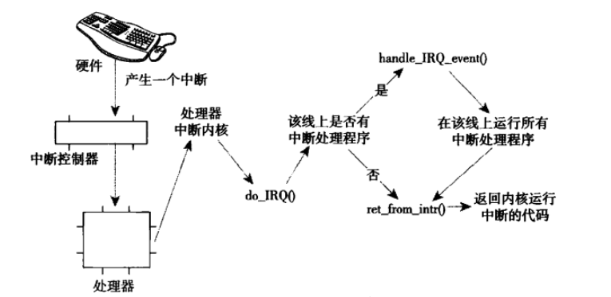

## 5.5 中断控制


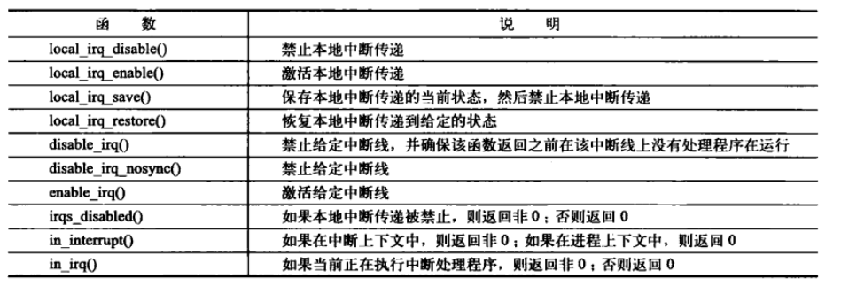

# 6 下半部

上半部就是前面的中断处理程序，下半部需要其他机制实现。

因为我们希望在中断处理程序中完成的工作量越少越好，我们期望中断处理程序能够尽快地返回。但是，中断处理程序注定要完成一部分工作，例如：中断处理程序几乎都需要通过操作硬件对中断的到达进行确认，有时它还会从硬件拷贝数据。剩下的几乎所有其他工作都是下半部执行的目标。

下半部的实现方式：

1. 软中断
2. tasklet
3. 工作队列

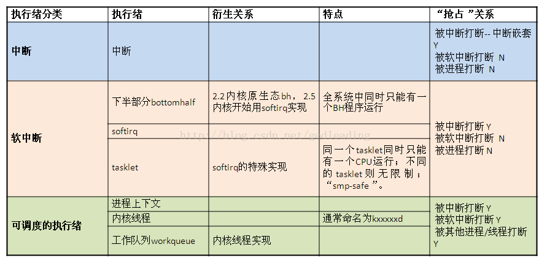

## 6.1 软中断

它的特性包括：

- 产生后并不是马上可以执行，必须要等待内核的调度才能执行。**软中断不能被自己打断(即单个cpu上软中断不能嵌套执行)，只能被硬件中断打断（上半部）。**
- **可以并发运行在多个CPU上（即使同一类型的也可以）。**所以软中断必须设计为可重入的函数（允许多个CPU同时操作），因此也**需要使用自旋锁**来保其数据结构。

```c
#include<linux/interrupt.h>
// 软中断结构体
struct softirq_action{
    void (*action)(struct softirq_action*);			//软中断处理程序函数
};

// 在kernel/softirq.c中定义了一个包含有32个该结构体的数组
static struct softirq_action softirq_vec[NR_SOFTIRQS];

// 所以最多只有32个软中断

// 当内核运行一个软中断程序时，它就会执行action软中断处理程序函数，其唯一参数就是软中断结构体指针softirq_action *
// 如果my_softirq 指向softirq_vec数组的某一项，那么内核会用如下方式调用软中断处理程序中的函数
my_softirq->action(my_softirq);


```

### 软中断的实现机制

一个注册的软中断必须在被标记后才会执行，这叫做触发软中断，通常，中断处理程序会在返回前标记它的软中断，使其在稍后被执行。

在下列地方软中断会被检查和执行

1. 硬件中断代码处返回时
2. 在ksoftirqd内核线程中
3. 在那些显式检查和执行待处理的软中断的代码中

无论用什么办法唤醒，软中断都会在do_softirq()中执行。该函数很简单，如果有待处理的软中断，do_softirq会遍历每一个，调用他们的处理程序。

### 使用软中断

在你需要用软中断前，先问问自己为什么不用tasklet，因为后者用起来方便，对加锁要求不高。


```c
//注册软中断
void open_softirq(int nr, void (*action)(struct softirq_action *));
```

nr的取值：你必须根据希望赋予它的优先级来决定加入的位置。优先级值越小，越优先执行

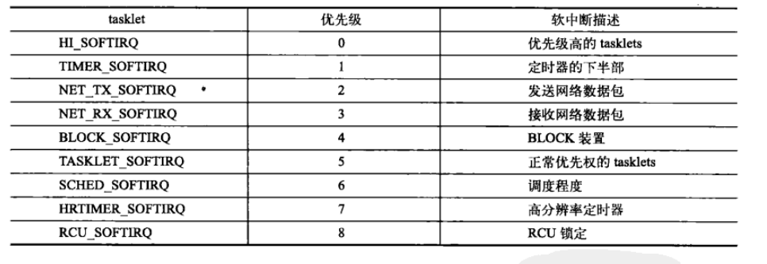

如果同一个软中断在它被执行的同时再次被触发，那么另外一个处理器可以同时运行其处理程序。这意味着任何共享数据都需要严格的锁保护。所以这就是tasklet更受青睐的原因，如果单纯加锁互斥，软中断就失去了意义，所以大部分软中断处理程序，都采用的是单处理器数据（仅属于某一个处理器的数据）

```c
// 触发软中断
raise_softirq(unsigned int nr){
	unsigned long flags;

	local_irq_save(flags);
	raise_softirq_irqoff(nr);
	local_irq_restore(flags);
}
// 在open_softirq注册后，新的软中断处理程序就可以运行，raise_softirq函数将一个软中断设置为挂起，让它在下次调用do_softirq()投入运行
// raise_softirq()在触发一个软中断之前，先要禁止中断，然后再恢复
```

## 6.2 tasklet

1. **一种特定类型的tasklet只能运行在一个CPU上**，不能并行，只能串行执行。对于同类tasklet中的共享数据不需要保护
2. **多个不同类型的tasklet可以并行在多个CPU上**。需要对共享数据加锁
3. 软中断是静态分配的，在内核编译好之后，就不能改变。但tasklet就灵活许多，可以在运行时改变（比如添加模块时）。

tasklet基于软中断实现，tasklet由两类软中断代表：HI_SOFTIRQ和TASKLET_SOFTIRQ。

```c
struct tasklet_struct
{
	struct tasklet_struct *next;
	unsigned long state;
	atomic_t count;
	void (*func)(unsigned long);
	unsigned long data;
};

// state: 枚举值：0，TASKLET_STATE_SCHED(已被调度，准备运行) 和 TASKLET_STATE_RUN(正在运行)
// count: tasklet的引用计数器，如果不为0，tasklet被禁止运行，为0时，tasklet被激活，并被设置为挂起状态，该tasklet才能够执行。
// func: task的处理程序
// data: func的唯一参数
// 
```

已被调度的tasklet（等同于已被触发的软中断）存放在两个**单处理器数据结构**：`tasklet_vec和tasklet_hi_vec（高优先级）`，都是tasklet_struct的链表。

tasklet由`tasklet_schedule()和tasklet_hi_schedule()`调度（tasklet本身是无类型，如果采用不同的schedule，那么底层将使用不同的tasklet类型HI_SOFTIRQ和TASKLET_SOFTIRQ），都接收一个`tasklet_struct`结构体

tasklet_schedule执行流程：

1. 检查tasklet的state，如果为TASKLET_STATE_SCHED，则返回
2. 调用`_tasklet_schedule()`
3. 保存中断状态，禁止本地中断
4. 把需要调度的tasklet加到每一个处理器一个的tasklet_vec或tasklet_hi_vec链表头部
5. 唤起`HI_SOFTIRQ和TASKLET_SOFTIRQ`软中断，这样下一次调用do_softirq时就执行tasklet
   - do_softirq中有两个处理程序：`tasklet_action()和tasklet_hi_action()`
   - tasklet_action这里面有些流程，自己看吧
   - 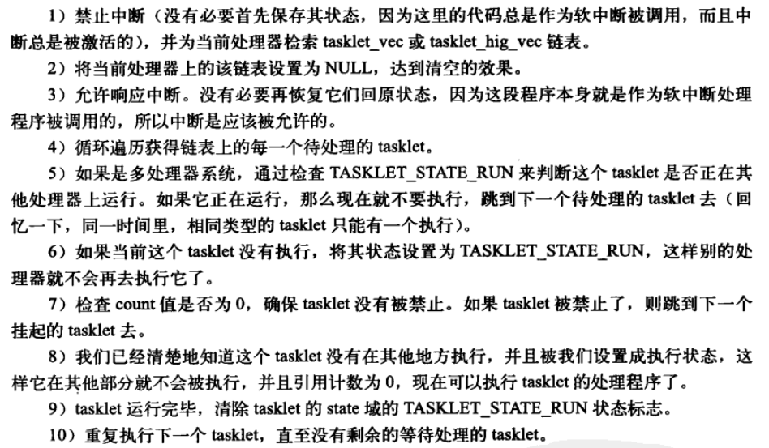
6. 恢复中断到原状态并返回。


### 6.2.1 使用

```c

// 定义名字为name的非激活tasklet
#define DECLARE_TASKLET(name, func, data) \
struct tasklet_struct name = { NULL, 0, ATOMIC_INIT(0), func, data }

// 定义名字为name的激活tasklet
#define DECLARE_TASKLET_DISABLED(name, func, data) \
struct tasklet_struct name = { NULL, 0, ATOMIC_INIT(1), func, data }

// 动态初始化tasklet
void tasklet_init(struct tasklet_struct *t,void (*func)(unsigned long), unsigned long data);

// tasklet不能睡眠，不能使用阻塞式函数

//调度 tasklet 执行
static inline void tasklet_schedule(struct tasklet_struct *t)
// 如果tasklet在运行中被调度, 它在完成后会再次运行; 这保证了在其他事件被处理当中发生的事件受到应有的注意. 这个做法也允许一个 tasklet 重新调度它自己


static inline void tasklet_disable(struct tasklet_struct *t)

static inline void tasklet_enable(struct tasklet_struct *t)


tasklet_hi_schedule(struct tasklet_struct *t)
//和tasklet_schedule类似，只是在更高优先级执行。当软中断处理运行时, 它处理高优先级 tasklet 在其他软中断之前，只有具有低响应周期要求的驱动才应使用这个函数, 可避免其他软件中断处理引入的附加周期.
tasklet_kill(struct tasklet_struct *t)
//确保了 tasklet 不会被再次调度来运行，通常当一个设备正被关闭或者模块卸载时被调用。如果 tasklet 正在运行, 这个函数等待直到它执行完毕。若 tasklet 重新调度它自己，则必须阻止在调用 tasklet_kill 前它重新调度它自己，如同使用 del_timer_sync

```

## 6.3  工作队列


# 7 内核同步方法

## 7.1 原子操作

### 7.1.1 原子整数操作

```c
#include<linux/types.h>

// 原子整数类型
/*32位系统下*/
typedef struct {
	int counter;
} atomic_t;

/*64位系统下*/
#ifdef CONFIG_64BIT
typedef struct {
	long counter;
} atomic64_t;
#endif


// 定义并初始化原子变零 v=0
atomic_t v = ATOMIC_INIT(0);		 
// 设置 v=10
atomic_set(10);
// 读取
atomic_read(&v); 
// +1操作
atomic_inc(&v); 					/* v 的值加 1， v=11 */

```


 对原子整数的操作声明`#include<asm/atomic.h>`，对于64位的原子整数，也有一套对应的64位操作操作，名字在atomic后面加64，`eg: atomic64_read`

<table><thead><tr><th>API</th><th>含义</th></tr></thead><tbody><tr><td>ATOMIC_INIT(int i)</td><td>定义原子变量的时候对其初始化。</td></tr><tr><td>int atomic_read(atomic_t *v)</td><td>读取 v 的值，并且返回。</td></tr><tr><td>void atomic_set(atomic_t *v, int i)</td><td>向 v 写入 i 值。</td></tr><tr><td>void atomic_add(int i, atomic_t *v)</td><td>给 v 加上 i 值。</td></tr><tr><td>void atomic_sub(int i, atomic_t *v)</td><td>从 v 减去 i 值。</td></tr><tr><td>void atomic_inc(atomic_t *v)</td><td>给 v 加 1，也就是自增。</td></tr><tr><td>void atomic_dec(atomic_t *v)</td><td>从 v 减 1，也就是自减</td></tr><tr><td>int atomic_dec_return(atomic_t *v)</td><td>从 v 减 1，并且返回 v 的值。</td></tr><tr><td>int atomic_inc_return(atomic_t *v)</td><td>给 v 加 1，并且返回 v 的值。</td></tr><tr><td>int atomic_sub_and_test(int i, atomic_t *v)</td><td>从 v 减 i，如果结果为 0 就返回真，否则返回假</td></tr><tr><td>int atomic_dec_and_test(atomic_t *v)</td><td>从 v 减 1，如果结果为 0 就返回真，否则返回假</td></tr><tr><td>int atomic_inc_and_test(atomic_t *v)</td><td>给 v 加 1，如果结果为 0 就返回真，否则返回假</td></tr><tr><td>int atomic_add_negative(int i, atomic_t *v)</td><td>给 v 加 i，如果结果为负就返回真，否则返回假</td></tr></tbody></table>

### 7.1.2 原子位操作

位操作也是很常用的操作， Linux 内核也提供了一系列的原子位操作 API 函数，只不过原子位操作不像原子整形变量那样有个 atomic_t 的数据结构，原子位操作是直接对内存进行操作。

只要指针指向了任何你希望的数据，你就可以对他操作。

`#include<asm/bitops.h>`

<table><thead><tr><th>API</th><th>描述</th></tr></thead><tbody><tr><td>void set_bit(int nr, void *p)</td><td>将 p 地址的第 nr 位置 1。</td></tr><tr><td>void clear_bit(int nr,void *p)</td><td>将 p 地址的第 nr 位清零。</td></tr><tr><td>void change_bit(int nr, void *p)</td><td>将 p 地址的第 nr 位进行翻转。</td></tr><tr><td>int test_bit(int nr, void *p)</td><td>获取 p 地址的第 nr 位的值。</td></tr><tr><td>int test_and_set_bit(int nr, void *p)</td><td>将 p 地址的第 nr 位置 1，并且返回 nr 位原来的值。</td></tr><tr><td>int test_and_clear_bit(int nr, void *p)</td><td>将 p 地址的第 nr 位清零，并且返回 nr 位原来的值。</td></tr><tr><td>int test_and_change_bit(int nr, void *p)</td><td>将 p 地址的第 nr 位翻转，并且返回 nr 位原来的值。</td></tr></tbody></table>

## 7.2 自旋锁

自旋锁最多只可能被一个可执行线程持有。如果一个执行线程试图获取一个被已经持有的自旋锁，那么该线程就会一直忙循环（旋转）等待锁重新可获得。

场景：

- 一般用于对公共资源访问频率比较高，资源占用时间比较短的场合
- 可以用在中断服务程序中（中断顶半部），它不会导致睡眠，而一直忙等待。

```c
#include <linux/spinlock.h>

// 定义自旋锁变量
struct spinlock my_spinlock;
// 或
spinlock_t my_spinlock;

// 自旋锁初始化
spin_lock_init(&my_spinlock);

// 获得自旋锁(可自旋等待，保存中断状态并关闭软、硬件中断)
void spin_lock_irqsave(spinlock_t *my_spinlock,unsigned long flags);
// 如果不禁止本地中断（在当前处理器上的中断请求），中断处理程序就会打断正持有锁的内核代码。
// 这样一来，新中断处理程序就会等待锁可用，可是锁的持有者（旧中断）在这个中断处理程序执行完毕前，不可能运行。
// 如果中断发生在不同的处理器上，就不会发生这样的事情。	

// 释放自旋锁，退出临界区后，恢复中断
void spin_unlock_irqrestore(spinlock_t *lock,unsigned long flags);

// 不推荐使用下面两个
// 获得自旋锁（可自旋等待，可被软、硬件中断）
void spin_lock(spinlock_t *my_spinlock);
// 释放自旋锁，退出临界区
void spin_unlock(spinlock_t *lock);


// 尝试获得自旋锁（不自旋等待，成功返回1、失败则返回0）
int spin_trylock(spinlock_t *lock)
```

自旋锁不可递归：在获得锁a后，不能在获得的情况下再去获得锁a，如果这样做，将会被锁死。

### 读-写自旋锁

当更新（写）临界资源时，不能有其他代码并发的读或写。

当读临界资源时，不能有其他代码并发的写，但是可以并发地读

```c
DEFINE_RWLOCK(my_rwlock);

read_lock(&my_rwlock);
/* 临界区只读 */
read_unlock(&my_rwlock);

write_lock(&my_rwlock);
/* 临界区读写 */
write_unlock(&my_rwlock);
```


## 7.3 信号量

信号量**采用睡眠等待机制**。

应用场景：

- 一般用于对公共资源访问频率比较低，资源占用时间比较长的场合
- 不可用在中断程序顶半部中


```c
#include <linux/semaphore.h>

// 定义一个信号量
struct semaphore my_sem;

// 初始化信号量
void sema_init(struct semaphore *sem, int val);
// val: 信号量的计数值，val设置为>1的非0值时，这是被称作计数信号量，等于1时，被称作互斥信号量

// 以计数值为1初始化动态创建的信号量
init_MUTEX(struct semaphore *);
// 以计数值为0初始化动态创建的信号量（初始为加锁状态）
init_MUTEX_LOCKED(struct semaphore *);

// 获取信号量(减操作)，在拿不到信号量的时候，会导致调用者睡眠（挂起），睡眠不可被系统消息中断。
// 也就是说，如果进入睡眠，并且没有收到其他地方释放信号量（up）的消息，那么这个进程将永远睡眠，无法被中断（CTRL + C 也不可以，只有关机才行）
void down(struct semaphore *sem);
// 获取信号量(减操作)，会导致调用者睡眠，但可以被系统消息中断
int down_interruptible(struct semaphore *sem);
// 尝试获取信号量,成功返回0,失败返回非0，不会导致调用者睡眠
int down_trylock(struct semaphore *sem);

// 释放信号量，即使信号量加1（如果线程睡眠，将其唤醒）
void up(struct semaphore *sem);
```

### 读-写信号量


## 7.4 互斥体

一种低开销的信号量，它也可以睡眠。


## 7.5 完成变量

如果内核中一个任务需要发出信号通知另一任务发生了某种特定的事件，利用完成变量是使两个任务得以同步的方法。

这个很像信号量，事实上，完成变量仅仅提供了代替信号量的一个简单解决方法。

## 7.6 顺序锁


# 8 定时器和时间管理

系统定时器是一种可编程硬件芯片，它能以固定频率产生中断，该中断就是定时器中断（时钟中断）。


## 8.1 节拍率HZ

系统定时器频率——节拍率（tick rate），它是通过静态预处理定义的，也就是**HZ**宏。当编译内核的时候设置了CONFIG_HZ配置选项，系统就可以调整节拍率

连续两次时钟中断的间隔时间——节拍（tick）。`tick = 1 / tick rate`

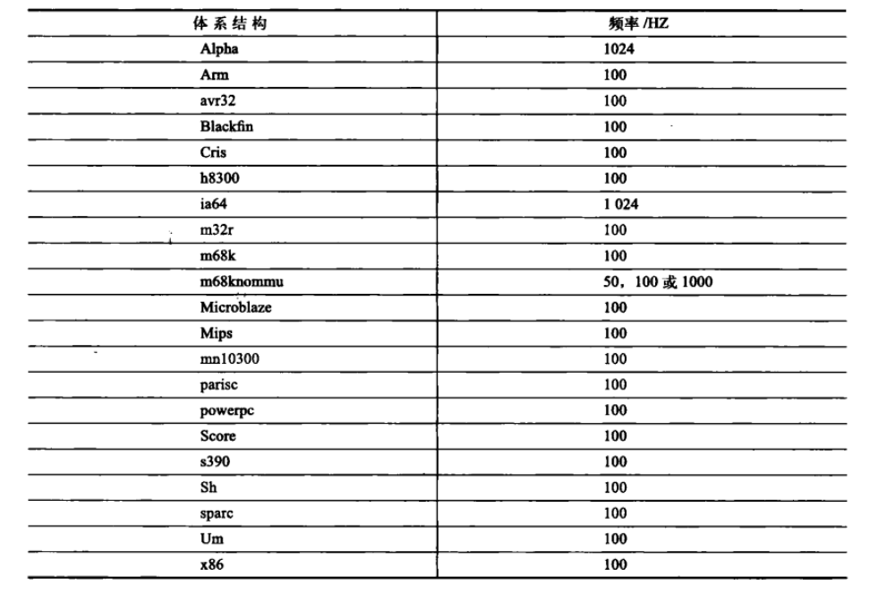

## 8.2 jiffies

全局变量jiffies用来记录自系统启动以来产生的**节拍**的总数。

系统运行时间 = `jiffies * 1 / HZ`

```c
#include<linux/jiffies.h>
extern unsigned long volatile  jiffies;

// unsigned long，在32位操作系统上，是32位的，在64位操作系统上，是64位的。
// 32位的jiffies变量，在时钟频率为100HZ情况下，497天后会溢出。在1000HZ情况下，49.7天后会溢出
// 64位的jiffies变量，任何人都别指望会看到它溢出。	

// 内核提供了四个宏来帮助比较节拍计数
#define time_after(unknown,known)	((long) (known) - (long) (unknown) < 0)
#define time_before(unknown,known)	((long) (unknown) - (long) (known) < 0)
#define time_after_eq(unknown,known)	((long) (unknown) - (long) (known) >= 0)
#define time_before_eq(unknown,known)	((long) (known) - (long) (unknown) >= 0)
```


## 8.3 实时时钟和定时器

实时时钟（RTC）是用来**持久**存放系统时间的设备

- 当系统启动时，内核通过读取RTC来初始化**墙上时间（实际时间）**，该时间存放在xtime中。
- 实时时钟最主要的作用仍是在内核启动时初始化xtime变量。

```c
struct timespec xtime;
struct timespec {
	__kernel_time_t	tv_sec;			/* seconds */
	long		tv_nsec;		/* nanoseconds */
};

// 从用户空间取得墙上时间的主要接口gettimeofday(), 在内核中对应的系统调用为sys_gettimeofday()，定义与kernel/time.c
```


定时器就是上面讨论的可编程硬件芯片，它提供了一种周期性触发中断的机制。

它是会**睡眠**的。

```c
#include<linux/timer.h>
struct timer_list {
	struct list_head entry;				// 定时器列表入口
	unsigned long expires;				// 以jiffies为单位的定时值，如果当前的jiffies>=expires，就会立即执行function
	struct tvec_base *base;				// 定时器内部值，用户不要使用
	void (*function)(unsigned long);	// 定时器处理函数
	unsigned long data;					// 定时器处理函数参数
};

struct timer_list my_timer;
 
//初始化定时器
init_timer(&my_timer);
my_timer.expires = jiffies + delay;
my_timer.data = 0;
my_timer.function = my_function;

//激活定时器
add_timer(&my_timer);
mod_timer(&my_timer,jiffies + new_delay);	

//删除定时器
del_timer(&my_timer);			// 已经超时的定时器会自动删除，无需调用此函数
// 等待其他处理器上运行的定时器处理程序都退出，再执行删除工作
del_timer_sync(&my_timer);		// 不能再中断上下文中使用

```


## 8.4 延迟执行

### 8.4.1 忙等待

```c
unsigned long timeout = jiffies + 10;		// 延迟10个节拍
while(time_before(jiffies,timeout));		// 处理器自旋空转


unsigned long timeout = jiffies + 2*HZ;		// 延迟2s

while(time_before(jiffies,timeout))
    cond_resched();		// 允许内核调用其他进程，前提设置完need_resched标志后，才能生效。并且只能在进程上下文中使用。
```

### 8.4.2 短延迟

当延迟时间小于1ms，甚至更低时，使用jiffies的延迟方法就失效了，因为即使节拍率HZ为1000hz，节拍间隔也只能达到1ms，所以通过jiffies的方式就不再适用。

内核提供了三个可以处理ms，us， ns级别的延迟函数

```c
void ndelay(unsigned long nsecs)
void udelay(unsigned long usecs)
void mdelay(unsigned long msecs)
```

### 8.4.3 schedule_timeout()

延迟执行的任务**睡眠**到指定的延时时间耗尽后在重新运行。

基于内核定时器实现，所以可以睡眠。

```c
set_current_state(TASK_INTERRUPTIBLE);		// 将任务设置为可中断睡眠状态。

schedule_timeout(s * HZ);	//s 秒后唤醒，函数的单位是jiffies
```

# 9 内存管理

## 9.1 页

内核将物理页作为内存管理的基本单位。体系结构不同，页的大小不同。大多32位结构一页：4KB，64位：8KB。

```c
#include<linux/mm_types.h>
struct page{
    unsigned long flags;
    atomic_t _count;
    atomic_t _mapcount;
    unsigned long private;
    struct address_space *mapping;
    pgoff_t index;
    struct list_head lru;
    void  *virtual;
}

// flags：用来存放页的状态，这些状态包括页是不是脏的，是不是被锁定在内存中等，至少可以同时表示32种状态。
// _count：存放页的引用计数，当变为-1时，就说明这页并没有被引用，于是可以在新的分配中使用它，通常使用page_count()来访问页的count是空闲还是非空闲
// 一个页可以由页缓存使用（这时，mapping指向和这个页相关联的address_space对象，或者作为私有数据（由private指向），或者作为进程页表中的映射。
// virtual域是页的虚拟地址，它就是页在虚拟内存中的地址，可动态变化。
```

## 9.2 区

内核使用区对具有相似特性的页进行分组。

linux中主要使用了四种区：

- ZONE_DMA：这个区包含的页用来执行DMA操作
- ZONE_DMA32：也用来执行DMA操作，但只能没32位设备访问
- ZONE_NORMAL：包含能正常映射的页
- ZONE_HIGHEM：高端内存，其中页不能永久地映射到内核地址空间。

x86-32上的区如下图：

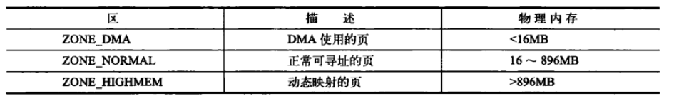

高端内存：指物理地址大于896M的内存，内核直接映射的空间最大也只有896MB。

低端内存：低于896M的空间。

## 9.3 获得页

如果你需要获得以页为单位的内核内存

```c
#include<linux/gfp.h>
// 分配2的order幂次的连续物理页，返回首页指针
struct page* alloc_pages(gfp_t gfp_mask, unsigned int order);
// 把页转换为逻辑地址
void* page_address(struct page * page);

// 上两个函数的合体，分配并获取第一页的逻辑地址
unsigned long __get_free_gages(gfp_t gfp_mask, unsigned int order);

// 分配单页
struct page* alloc_page(gfp_t gfp_mask);
// 分配单页并获取此页的逻辑地址
unsigned long __get_free_gage(gfp_t gfp_mask);


// 分配一页并填充0，返回页的逻辑地址
unsigned long get_zeroed_gage(unsigned int gfp_mask);

// 释放页
void __free_pages(struct page* page, unsigned int order);
void free_pages(unsigned long addr, unsigned int order);
void free_page(unsigned long addr);
```

### gfp_mask标志

标志可分为三类：

- 行为修饰符：表示内核应当如何分配所需的内存，eg：分配时允不允许睡眠。
- 区修饰符：指明到底从哪一区分配
- 类型标志：组合了行为和区修饰符，将各种可能用到的组合归纳为不同的类型，简化修饰符的使用。
- 尽量使用类型标志，下面是它的解释

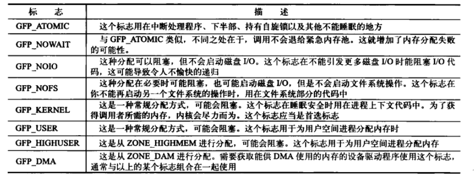

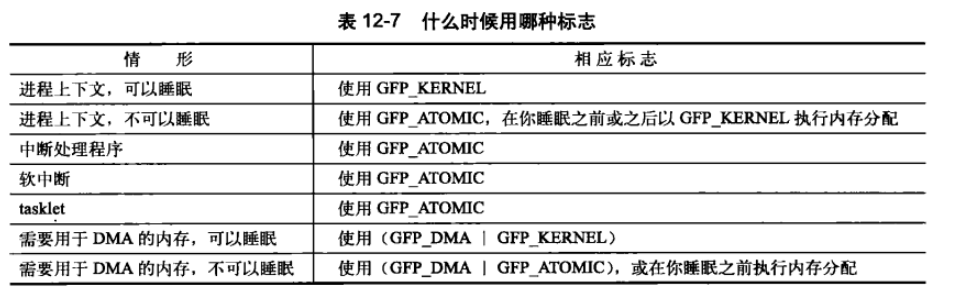

## 9.4 kmalloc

kmalloc与用户空间的malloc一族函数相似，不过它多了一个flags参数。

用它可以获得以字节为单位的一块内核内存。

```c
#include<linux/slab.h>

// 分配内存
void * kmalloc(size_t size, gfp_t flags);
// 成功，返回指向size字节大小内存的指针，内存物理连续
// 失败，返回NULL

// 释放内存
void kfree(const void * ptr);
```

## 9.5 vmalloc

分配的内存虚拟地址是连续的，而物理地址无需连续。这也是用户空间分配函数的工作方式（malloc）。

大多数情况下，只有硬件设备需要得到物理地址连续的内存。而仅供软件使用的内存块则无需如此。

对内核而言，所有的内存看起来都是逻辑上连续的。

尽管在某些情况下才需要物理连续的内存块，但是很多代码都使用了kmalloc，而不是vmalloc，这主要出于性能考虑。

vmalloc函数为了把物理上不连续的页转换为虚拟地址空间上连续的页，需要专门建立页表项。

```c
#include<linux/vmalloc.h>
void * vmalloc(unsigned long size);
void vfree(const void *addr);
```

## 9.6 slab

为了方便数据频繁分配和回收，slab分配器扮演了通用数据结构缓存层的角色。

就像内存池，用了放进去，但不释放，再用的时候直接拿出来。

每个高速缓存包含多个slab，每个slab包含一个页或多个页，这些页里放的是多个高频访问的对象

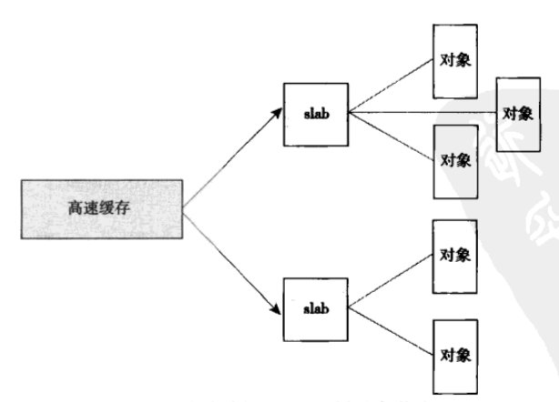

每个高速缓存都使用kmem_cache结构来表示，这个结构包含三个链表：slabs_full，slabs_partial，slab_empty，这些链表中存放所有的slab，一个slabs_full中没有空闲的对象。当内核某一部分需要新的对象时，先从partial中拿。

## 9.7 内核栈

每个内核进程都有两页的内核栈，每个中断栈页也有自己的中断栈。

## 9.8 高端内存映射

“直接映射空间” 通常是指内核对物理内存的直接线性映射。

传统的 32 位 Linux 系统采用了 4 GB 的虚拟地址空间，其中 3 GB 分配给用户空间，1 GB 分配给内核空间。一旦这些页全被分配，那么就一定有3G~4G的虚拟地址空间映射到内核空间。

所以内核空间有1G的空间，最多有896M的地址空间内存可以被直接映射（参见区），那么还剩下104M就留给内核动态地映射空间。如果1G的地址空间必须全部映射，就必须使用高端内存（因为低端内存最多只有896M）。当然这894M的地址空间里面不一定只能给低端内存，也可以给高端内存。

对 于高端内存，可以通过 alloc_page() 或者其它函数获得对应的 page，但是要想访问实际物理内存，还得把 page 转为线性地址才行（为什么？想想 MMU 是如何访问物理内存的），也就是说，我们需要为高端内存对应的 page 找一个线性空间，这个过程称为高端内存映射。

高端内存映射有三种方式：

- 映射到"内核动态映射空间"：通过 vmalloc() ，在”内核动态映射空间“申请内存的时候，就可能从高端内存获得页面（参看 vmalloc 的实现），因此说高端内存有可能映射到”内核动态映射空间“ 中。

- 永久映射：

  ```c
  #include<linux/highmem.h>
  
  void *kmap(struct page* page);
  // 在高端内存和低端内存上都可以使用，允许睡眠
  
  // 解除映射
  void *kunmap(struct page* page);
  
  ```

  

- 临时映射

  ```c
  // 当必须创建一个映射而当前上下文又不能睡眠时，内核提供了临时映射
  void *kmap_atomic(struct page *page, enum km_type type);
  
  //解除映射
  void kunmap_atomic(void *kvaddr, enum km_type type);
  ```

  

## 9.9 CPU类型数据

```c
#include<linux/percpu.h>
//编译时定义CPU变量
DEFINE_PER_CPU(type, name);

// 如果你要在别处声明变量
DECLARE_PER_CPU(type, name);

//获取cpu变量，并禁止抢占
get_cpu_var(name);
// 恢复可抢占
put_cpu_var(name);
```

# 10 虚拟文件系统

虚拟文件系统VFS作为内核子系统，为用户空间程序提供文件和文件系统相关的接口。


# 11 进程地址空间

## 11.1 内存描述符

内核使用内存描述符结构体表示进程的地址空间，该结构包含了和进程地址空间有关的全部信息。


```c
#include<linux/mm_types.h>

struct mm_struct {
	struct vm_area_struct * mmap;    				//指向虚拟区间(VMA)的链表
    struct rb_root mm_rb;            				// VMA形成的红黑树
    struct vm_area_struct * mmap_cache;     		//最近使用的内存区域
    unsigned long free_area_cache;          		//内核从这个地址开始搜索进程地址空间中线性地址的空闲区域
    pgd_t * pgd;                            		//指向页全局目录
    atomic_t mm_users;                      		//次使用计数器，使用这块空间的个数（用户数，进程数）
    atomic_t mm_count;                      		//主使用计数器，是mm_struct结构体的主引用计数
    int map_count;                          		//线性区的个数，内存区域个数
    struct rw_semaphore mmap_sem;           		//线性区的读/写信号量
    spinlock_t page_table_lock;             		//线性区的自旋锁和页表的自旋锁
    struct list_head mmlist;		                //指向内存描述符链表中的相邻元素
    
   	unsigned long start_code, end_code, start_data, end_data;
    //start_code 可执行代码的起始地址
    //end_code 可执行代码的最后地址
    //start_data已初始化数据的起始地址
    //end_data已初始化数据的最后地址
    
    unsigned long start_brk, brk, start_stack;
    //start_stack堆的起始位置
    //brk堆的当前的最后地址
    //用户堆栈的起始地址
    
     unsigned long arg_start, arg_end, env_start, env_end;
     //arg_start 命令行参数的起始地址
     //arg_end命令行参数的起始地址
     //env_start环境变量的起始地址
     //env_end环境变量的最后地址
    
     unsigned long total_vm, locked_vm, shared_vm, exec_vm;
     //total_vm 进程地址空间的大小(页数）
     //locked_vm 锁住而不能换出的页的个数
     //shared_vm 共享文件内存映射中的页数
   	 //exec_vm 虚拟可执行页数（不可写）
    
    unsigned long saved_auxv[AT_VECTOR_SIZE];		// /proc/PID/auxv
    cpumask_t cpu_vm_mask; 							//用于惰性TLB交换的位掩码
    mm_context_t context; 							//指向有关特定结构体系信息的表
    unsigned long flags;							// 状态标志
    
    struct core_state *core_state;					// 核心转储的支持
    spinlock_t ioctx_lock;							//用于保护异步I/O上下文链表的锁
    struct hlist_head ioctx_list;					//异步I/O上下文链表
}
```


## 11.2 虚拟内存区域

内存区域由vm_area_struct结构体描述，内存区域在linux内核中也经常称作虚拟内存区域（Virtual Memory Areas，VMA），这个结构体描述了指定地址空间内连续区间上的一个独立内存范围。


# 12 设备和模块

## 12.1 设备类型

linux中，把设备分为三类：

- 字符设备
- 块设备
- 网络设备

## 12.2 模块


# 13 调试

调试工作艰难是内核级开发区别于用户级开发的一个显著特定。内核的一个错误往往立刻就能让系统崩溃。

## 13.1 通过打印调试

`printk()`可以中断上下文和进程上下文中被调用，可以在任何持有锁时被调用，可以在多处理器上同时调用。

在系统启动过程中，终端还没有初始化前，`printk()`将黔驴技穷。此时，如果依靠工作的硬件设备（eg: 串口）与外界通信，然后打印出来，大多数硬件体系都可以，包括x86

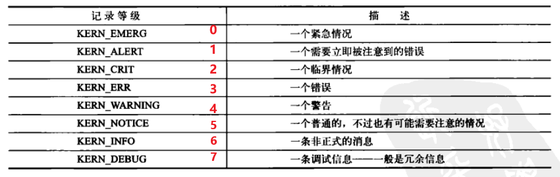

内核把级别比当前终端的记录等级console_loglevel（默认是KERN_WARNING）低的消息打印到终端。

内核消息都被保存在一个LOG_BUF_LEN大小的环形队列中，该缓冲区大小可以在编译时通过设置CONFIG_LOG_BUF_SHIFT进行调整。

## 13.2 syslogd和klogd

查看linux系统日志的途径：

- dmesg命令：从kernel 的ring buffer(环缓冲区)中读取信息的
- /var/log下的文件：通过syslogd守护进程实现。

LINUX系统启动后，由/etc/init.d/sysklogd先后启动klogd,syslogd两个守护进程。

klogd：

- 是一个专门截获并记录 Linux 内核消息的守护进程
- 可以指定输出到控制台，文件或syslogd守护进程等，常用情况是把内核消息输出到syslogd进程，由syslogd统一处理。

syslogd：

- 负责记录系统中kenel或应用程序(邮件、新闻等)产生的各种log信息的工具。
- 这些信息根据`/etc/syslog.conf`配置，写入到系统文件中，通常是/var/log目录下，或者是输出到远程server，让使用者进行故障排除、追踪尝试非法入侵的使用者等等。


# 其他

1. [current](https://blog.csdn.net/weixin_45030965/article/details/126508703)
   - 在内核中经常看到current，它实际是一个宏，current表示当前正在运行进程的进程描述符struct task_struct。
2. 