# STM32

STM32F103xE 性能线路块图表


# 0 绪论

## 0.1 介绍

ST指意法半导体（公司），M指微处理器，32表示计算机处理器位数（51单片机是8位的）。

ARM分成三个系列：

- Cortex-A：针对多媒体应用（手机平板，对性能要求比较高）
- Cortex-R：针对对实时性和性能有一定要求的场景
- Cortex-M：针对低功耗高性能的场景

stm32它是一个soc（System On Chips，片上集成系统），它集成很多模块。其中最重要的就是cpu核心，它的核心选择的就是Cortex-M（MCU，Microcontroller Unit）。soc除开MCU，其余就是片内资源（也称外设，Peripheral），包括RCC，GPIO，timer，ADC等等

ARM采用的是一个精简指令集。

### 0.1.0 STM32 与 Linux 系统的比较

STM32 作为一个微控制器，与基于 Linux 的系统在设计和应用方面存在明显差异。STM32 主要用于直接控制硬件和执行特定任务的嵌入式应用，而 Linux 系统通常用于更复杂的计算任务，需要较大的处理能力和内存。

在操作系统方面，STM32 通常**不运行传统的操作系统，而是执行裸机代码或实时操作系统（RTOS）**。这使得 STM32 在响应时间和资源占用上更高效，适合实时性要求高的应用。相比之下，Linux 是一个完整的操作系统，提供了丰富的功能和服务，但也因此需要更多的资源，如处理器性能和内存。

从应用角度来看，STM32 适用于需要精确时间控制和资源约束的场合，如传感器数据采集、电机控制等。而 Linux 系统更适合需要复杂数据处理、网络通信和用户交互的应用，如服务器、桌面计算等。

### 0.1.1 stm32系列

stm32根据闪存容量，引脚数量等构成了一个庞大的stm32家族（型号众多）。

命名规则：


F：通用快闪（FlashMemory）；
L：低电压（1.65～3.6V）；
F类型中F0xx和F1xx系列为2.0～3.6V;F2xx和F4xx系列为1.8～3.6V

### 0.1.2 stm32芯片内部结构


DMA（Direct Memory Access）：它能使数据从附加设备（如磁盘驱动器）直接发送到计算机主板的内存上。

SRAM：随机存储器

APB（Advanced Peripheral Bus，高级外围设备总线）

FLASH：闪存，相当于硬盘，编写的代码都放这里面。

### 0.1.3 stm32最小系统

这一款是stm32型号：stm32f103c8t6

1. 供电系统
2. 时钟电路（内部时钟源、外部时钟源）
3. 复位电路
4. 下载的接口电路
5. boot电路


## 0.2 STM32F103ZET6 开发板

开发板的核心由 STM32F103ZET6 微控制器构成，它被各类接口和模块环绕，旨在提供一站式的开发体验。


## 0.3 开发方式

#### 语言

在开发 STM32 单片机项目时，开发者通常使用汇编语言和 C 语言这两种主要编程语言。汇编语言允许开发者直接与硬件进行交互，而 C 语言则提供了更高级、更易于管理的编程接口。

#### 操作方式

实际的编程过程中，有两种主要的方法来操作和控制 STM32 单片机：

1. 直接配置和操作微控制器的功能模块寄存器:
   - 这种方法涉及直接访问和修改微控制器内部的寄存器，以配置其硬件功能。
   - 它需要对 STM32 的硬件结构和寄存器映射有深入的了解，适合对性能和资源使用有特别要求的场合。
2. 使用 ST 官方提供的固件库和驱动进行操作：
   - ST 公司为 STM32 提供了官方的固件库，这些库封装了对硬件的操作，简化了编程过程。
   - 通过使用这些固件库，开发者可以更容易地实现对微控制器功能的控制，而不必深入到底层的硬件细节。

## 0.4 固件库

在 STM32 微控制器的开发领域中，有多种固件库可供选择，每种库都有其独特的特点和优势。

这些库包括最初的 Standard Peripheral Library（SPL）、更为现代化的 STM32Cube（包括 HAL 和 LL 库），以及广泛适用于 ARM Cortex-M 微控制器的 CMSIS。

- Standard Peripheral Library (SPL，标准外围设备库): 
  - 这是 ST Microelectronics 最初为其 STM32 微控制器系列发布的固件库。
  - 此库包含了一些方便的 C 函数，可以直接控制 STM32 的各种外设，通常称为标准库。
- STM32Cube
  - ST Microelectronics 自 2015 年以来开始推广的一种新的固件库
  - 包括一个嵌入式软件平台和一个独立的集成开发环境。
    - 嵌入式软件平台包括一个硬件抽象层(HAL，Hardware Abstract Layer )，该层为 STM32 的各种外设提供通用的 API，并且还包含一些中间件组件（如 FreeRTOS，USB 库，TCP/IP 库等）。
    - 集成开发环境（STM32CubeIDE）则包含了代码生成器，它可以生成基于STM32Cube HAL 的初始化代码。
- LL (Low Layer) Drivers
  - 是 STM32Cube 库的一部分，为高级用户提供了一个硬件抽象层的替代方案。LL 库提供了一组低级 API，可以让用户直接访问 STM32外设的寄存器。这些 **LL 的API 比 HAL 更加高效，但是需要更深入的硬件知识。**
- CMSIS (Cortex Microcontroller Software Interface Standard)
  - CMSIS 并不是一个STM32 特定的固件库，而是 ARM 公司为 Cortex-M 微控制器定义的一组接口。许
    多 STM32 固件库（包括 SPL 和 STM32Cube）都使用 CMSIS 作为底层的硬件抽象。

STM32Cube HAL 是 STMicroelectronics 为了替代 SPL 而开发的更现代、更全面的固件库。

它不仅提供了广泛的硬件支持，还包含了多种中间件组件，如 FreeRTOS、USB 库、TCP/IP 库等。HAL 库通过提供通用的 API，使得操作 STM32 的各种外设变得更加简单。这种抽象层降低了学习曲线，尤其适合初学者和那些希望快速实现项目原型的开发者。

STM32CubeIDE 集成了代码生成器，可以自动生成基于 HAL的初始化代码。这极大地简化了项目的初始配置过程，使开发者能够更快地进入实际的应用开发阶段。

HAL库学完，进阶可以再去学LL库，抛弃掉标准库（它学习曲线太陡峭了）。

## 0.5 开发环境

#### [工具](https://blog.csdn.net/weixin_45880844/article/details/133930223)

STM32CubeMX和Keil uVision5是两个不同的软件工具，但它们可以一起使用来开发STM32微控制器的应用程序。

##### STM32CubeMX

STM32CubeMX是STMicroelectronics提供的一款图形化配置工具，用于生成初始化代码和配置文件，文件后缀通常是“.c”和“.h”，这些文件是C语言源代码文件，用于配置和控制STM32微控制器的各种硬件特性和外设。它可以帮助程序员根据需求选择微控制器型号，并配置其硬件接口，如GPIO、ADC、DAC、UART、SPI等，并生成用于KeiluVision5的项目文件。

##### Keil uVision5

Keil uVision5是一款集成开发环境（IDE），用于编写、编译和调试嵌入式应用程序。它支持多种编程语言，包括C和汇编语言。Keil uVision5 **可以导入STM32CubeMX生成的项目文件**，并提供代码编辑、编译、调试和仿真功能。

##### 总结

综上所述，**STM32CubeMX**和Keil uVision5是两个可以协同工作的软件工具，前者用于生成初始化代码和配置文件，后者用于编写、编译和调试嵌入式应用程序，前者**生成的代码和配置文件可以轻松地导入到Keil uVision5中，以便进行进一步的开发和调试**。

- Q1：STM32CubeMX生成的初始化代码和配置文件为什么还需要Keil uVision5进行进一步的开发和调试
  - 因为STM32CubeMX生成的初始化代码和配置文件只是用于设置微控制器的硬件和基本操作，并不包含具体的业务逻辑。因此，需要使用Keil uVision5等集成开发环境（IDE）进行进一步的开发和调试。
- Q2：二者如何配合最后生成可执行文件
  - 在具体的开发过程中，开发人员需要在Keil uVision5中创建项目，编写应用程序代码，然后将代码与STM32CubeMX生成的初始化代码和配置文件进行链接和编译，最终生成可在目标板上运行的可执行文件。

#### [kiel5安装](https://blog.csdn.net/qq_59111928/article/details/132661448)

#### [STM32CubeMX安装](https://blog.csdn.net/weixin_68016945/article/details/130575044)

1. [取消自动更新检查](https://blog.csdn.net/Summer_taotao/article/details/130800817)

## 0.6 快速开始

1. 打开stm32 CubeMX，File --> New Project 

   

2. 选择芯片型号

   

3. a

4. 工程文件解析

   - 为了能让不同的芯片公司生产的Cortex-M4芯片能在软件上基本兼容，和芯片生产商共同提出了一套标准CMSIS标准(Cortex Microcontroller Software Interface Standard) ,翻译过来是“ARM Cortex™ 微控制器软件接口标准”。

   

5. 


# 1 GPIO

GPIO(General purpose input/output，通用型输入输出)

GPIO 是通过寄存器操作来实现电平信号输入输出的，对于输入，通过读取输入数据寄存器（IDR，Input Data Register）来确定引脚电位的高低；对于输出，通过写入输出数据寄存器（ODR,Output Data Register）来让这个引脚输出高电位或者低电位；对于其他特殊功能，则有另外的寄存器来控制它们。GPIO 的输出通常可以输出 0/1 信号，用来实现如 LED 灯、继电器、蜂鸣器等控制，而 GPIO 的输入可识别 0/1 信号，用来实现开关、按键等等动作或状态判定。

## 1.1 单引脚电路图


- 保护二极管
  - IO引脚上下两边两个二极管用于防止引脚外部过高、过低的电压输入。防止不正常电压引入芯片导致芯片烧毁
  - 当引脚电压高于VDD_FT时，上方的二极管导通
  - 当引脚电压低于VSS时，下方的二极管导通
- 上拉、下拉电阻
  - 控制引脚默认状态的电压，开启上拉的时候引脚默认电压为高电平，开启下拉的时候引脚默认电压为低电平
- TTL施密特触发器
  - 基本原理是当输入电压高于正向阈值电压，输出为高；当输入电压低于负向阈值电压，输出为低；
  - IO口信号经过触发器后，模拟信号转化为0和1的数字信号。
- P-MOS管和N-MOS管
  - 信号由P-MOS管和N-MOS管，依据两个MOS管的工作方式，使得GPIO具有“推挽输出”和“开漏输出”的模式
  - P-MOS管低电平导通，高电平关闭
  - 下方的N-MOS高电平导通，低电平关闭

## 1.2 8种工作模式

1. 浮空输入GPIO_Mode_IN_FLOATING

   - 浮空输入模式下，I/O端口的电平信号直接进入输入数据寄存器。
   - MCU直接读取I/O口电平，I/O的电平状态是不确定的，完全由外部输入决定，不开启上拉和下拉。
   - 如果在该引脚悬空（在无信号输入）的情况下，读取该端口的电平是不确定的
   - 特点：低功耗。
   - 

2. 上拉输入GPIO_Mode_IPU（In Pull Up）

   - IO内部接上拉电阻
   - 如果IO口外部没有信号输入或者引脚悬空，IO口默认为高电平
   - 如果I/O口输入低电平，那么引脚就为低电平，MCU读取到的就是低电平。
   - 特点：钳位电平、增强驱动能力、抗干扰，可以用来检测外部信号
   - 

3. 下拉输入GPIO_Mode_IPD（In Pull Down）

   - 

4. 模拟输入GPIO_Mode_AIN（Analog Input）

   - 当GPIO引脚用于ADC采集电压的输入通道时，用作"模拟输入"功能，此时信号不经过施密特触发器，直接进入ADC模块，并且输入数据寄存器为空 ，CPU不能在输入数据寄存器上读到引脚状态
   - 当GPIO用于模拟功能时，引脚的上、下拉电阻是不起作用的，这个时候即使配置了上拉或下拉模式，也不会影响到模拟信号的输入
   - 

   - 

5. 推挽输出GPIO_Mode_Out_PP（out push—pull）

   - 在推挽输出模式时，N-MOS管和P-MOS管都工作。
   - 如果我们控制IO输出为0，低电平，则P-MOS管关闭，N-MOS管导通，使输出低电平，I/O端口的电平就是低电平。若控制输出为1 高电平，则P-MOS管导通N-MOS管关闭，输出高电平，I/O端口的电平就是高电平。
   - 外部上拉和下拉的作用是控制在没有输出时IO口电平
   - 在这种模式下，施密特触发器是打开的，即输入可用，通过输入数据寄存器GPIOx_IDR可读取I/O的实际状态。此时I/O口的输入电平一定是输出的电平，一般应用在输出电平为0和3.3伏而且需要高速切换开关状态的场合。
   - 

6. 开漏输出GPIO_Mode_Out_OD（out open drain）

   - 在开漏输出模式时，只有N-MOS管工作
   - 如果我们控制输出为0，低电平，则P-MOS管关闭，N-MOS管导通，使输出低电平，I/O端口的电平就是低电平。
   - 若控制输出为1时，高电平，则P-MOS管和N-MOS管都关闭，输出指令就不会起到作用。
   - 此时I/O端口的电平就不会由输出的高电平决定，而是由I/O端口外部的上拉或者下拉决定 如果没有上拉或者下拉 IO口就处于悬空状态。

7. 复用推挽输出GPIO_AF_PP（alternate function open push—pull）

   - GPIO 复用为其他外设(如 I2C)，输出数据寄存器GPIOx_ODR 无效
   - 输出的高低电平的来源于其它外设，施密特触发器打开，输入可用，通过输入数据寄存器可获取I/O 实际状态
   - 除了输出信号的来源改变，其他**与推挽输出功能相同**。应用于片内外设功能（I2C 的SCL,SDA）等。
   - 

8. 复用开漏输出GPIO_AF_OD（alternate function open drain）

   - GPIO 复用为其他外设，输出数据寄存器GPIOx_ODR 无效；
   - 输出的高低电平的来源于其它外设，施密特触发器打开，输入可用，通过输入数据寄存器可获取I/O 实际状态
   - 除了输出信号的来源改变 其他**与开漏输出功能相同**。应用于片内外设功能（TX1,MOSI,MISO.SCK.SS）等。

9. 

## 1.3 GPIO接口

如果需要直接操作寄存器可以查看  STM32中文参考手册2010.pdf

```c
// 初始化GPIOx引脚按照GPIO_Init指定的参数。
void HAL_GPIO_Init(GPIO_TypeDef* GPIOx, GPIO_InitTypeDef* GPIO_Init);
// 将GPIOx引脚重置为默认状态。
void HAL_GPIO_DeInit(GPIO_TypeDef* GPIOx, uint32_t GPIO_Pin);
// 读取指定GPIO端口的引脚状态。
GPIO_PinState HAL_GPIO_ReadPin(GPIO_TypeDef* GPIOx, uint16_t GPIO_Pin);		// 返回引脚状态GPIO_PIN_SET 或 GPIO_PIN_RESET
// 设置或清除选定的GPIO端口引脚。
void HAL_GPIO_WritePin(GPIO_TypeDef* GPIOx, uint16_t GPIO_Pin, GPIO_PinState PinState);
// 切换指定GPIO端口的引脚状态。
void HAL_GPIO_TogglePin(GPIO_TypeDef* GPIOx, uint16_t GPIO_Pin);
//锁定GPIO引脚的配置，直到下一次复位。
HAL_StatusTypeDef HAL_GPIO_LockPin(GPIO_TypeDef* GPIOx, uint16_t GPIO_Pin);
// 处理外部中断/事件请求。
void HAL_GPIO_EXTI_IRQHandler(uint16_t GPIO_Pin);
// 外部中断/事件线的回调函数。
void HAL_GPIO_EXTI_Callback(uint16_t GPIO_Pin);

// 在指定时间内阻塞。
void HAL_Delay(uint32_t Delay);

```

### LED闪烁

```c
GPIO_InitTypeDef GPIO_InitStruct = {0};
/*Configure GPIO pin : PB5 */
GPIO_InitStruct.Pin = GPIO_PIN_5;
GPIO_InitStruct.Mode = GPIO_MODE_OUTPUT_PP;
GPIO_InitStruct.Pull = GPIO_NOPULL;
GPIO_InitStruct.Speed = GPIO_SPEED_FREQ_LOW;
HAL_GPIO_Init(GPIOB, &GPIO_InitStruct);

// led闪烁˸
// 查看原理图后，led灯低电平亮，高电平暗		
HAL_GPIO_WritePin(GPIOB,GPIO_PIN_5,GPIO_PIN_RESET);
HAL_Delay(1000);
HAL_GPIO_WritePin(GPIOB,GPIO_PIN_5,GPIO_PIN_SET);
HAL_Delay(1000);
```

读key调整led

```c
// 配置GPIO
GPIO_InitTypeDef GPIO_InitStruct = {0};

/* GPIO Ports Clock Enable */
__HAL_RCC_GPIOE_CLK_ENABLE();
__HAL_RCC_GPIOB_CLK_ENABLE();

/*Configure GPIO pin Output Level */
HAL_GPIO_WritePin(GPIOB, GPIO_PIN_5, GPIO_PIN_SET);

/*Configure GPIO pin : PE3 */
GPIO_InitStruct.Pin = GPIO_PIN_3;
GPIO_InitStruct.Mode = GPIO_MODE_INPUT;
GPIO_InitStruct.Pull = GPIO_PULLUP;
HAL_GPIO_Init(GPIOE, &GPIO_InitStruct);

/*Configure GPIO pin : PB5 */
GPIO_InitStruct.Pin = GPIO_PIN_5;
GPIO_InitStruct.Mode = GPIO_MODE_OUTPUT_PP;
GPIO_InitStruct.Pull = GPIO_PULLUP;
GPIO_InitStruct.Speed = GPIO_SPEED_FREQ_LOW;
HAL_GPIO_Init(GPIOB, &GPIO_InitStruct);


  while (1)
  {
// led闪烁˸
// 查看原理图后，led灯低电平亮，高电平暗		
    if(HAL_GPIO_ReadPin(GPIOE,GPIO_PIN_3) == GPIO_PIN_RESET){
        HAL_Delay(100);
        if(HAL_GPIO_ReadPin(GPIOE,GPIO_PIN_3) == GPIO_PIN_RESET){
            HAL_GPIO_TogglePin(GPIOB,GPIO_PIN_5);
        }
    }
  }
```


# 2 系统时钟树

系统时钟树是微控制器内部运作的心脏，它决定了处理器和外设的工作频率。

这一架构包括多种时钟源，如**内部RC振荡器、外部晶振，以及更复杂的相位锁定环（PLL）系统**。

这些时钟源通过精心设计的时钟树分配给微控制器的不同部分，包括核心处理器、各种外设以及总线系统。

理解系统时钟的配置和分配是优化性能和功耗的关键，同时也对保证系统稳定运行至关重要。

对STM32的系统时钟树进行分析，可以帮助开发者更好地把握时钟管理的细节，确保硬件组件在正确的频率下高效运行。此外，时钟树的配置也直接影响到系统的响应速度和处理能力，是微控制器编程中不可忽视的重要组成部分。

## 2.1 时钟源

三种不同的时钟源可被用来驱动系统时钟(SYSCLK)：

- HSI振荡器时钟（高速系统内部时钟）
  - RC振荡器，频率为8MHZ
- HSE振荡器时钟（高速系统外部时钟）
  - 可接石英谐振器、陶瓷谐振器，或者接外部时钟源，其频率范围为4MHZ~16MHZ。
- PLL时钟（Phase-Locked Loop，锁相环时钟）
  - 是一种控制系统的结构
  - 在微控制器和嵌入式系统中，PLL被用作时钟系统的一部分，能够生成频率比输入时钟（通常是内部的低速时钟或者外部的晶体振荡器提供的时钟）更高的时钟信号（用作**倍频**）。
  - 倍频输出。其时钟输入源可选择为HSI/2、HSE或者HSE/2。倍频选择2~16倍，但是其输出频率最大不得超过72MHZ。

也包含2种二级时钟源

- LSI低速内部时钟。RC振荡器，频率为40KHZ。
- LSE低速外部时钟。接频率为32.768KHZ的石英晶体。

# 3 中断NVIC

NVIC（Nest Vector Interrupt Controller），嵌套向量中断控制器，作用是管理中断嵌套，核心任务是管理中断优先级。

特点：

1. 68个可屏蔽中断通道(不包含16个Cortex-M3的中断线)
2. 16个可编程的优先等级(使用了4位中断优先级)
3. 低延迟的异常和中断处理
4. 电源管理控制
5. 系统控制寄存器的实现

## 3.1 优先级

NVIC给每个中断赋予**抢占优先级和响应优先级**。

抢占优先级决定了中断是否能够打断其他正在执行的中断。具有高抢占优先级的中断可以打断低抢占优先级的中断，形成中断嵌套。

响应优先级则是在抢占优先级相同的情况下用来决定哪个中断先被处理的。

关系如下：

1. 拥有较高抢占优先级的中断可以打断抢占优先级较低的中断
2. 若两个**抢占优先级相同**的中断同时挂起，则优先执行**响应优先级较高**的中断
3. 若两个**响应优先级相同**的中断同时挂起，则优先执行位于**中断向量表中位置较高**的中断
4. **响应优先级**不会造成中断嵌套，也就是说中断嵌套是由**抢占优先级决定的**

## 3.2 [外部中断](https://blog.csdn.net/qq_44016222/article/details/123539693)

注：IRQ 中断请求（Interrupt ReQuest）

### 外部中断线

- STM32的每个IO都可以作为外部中断输入。	
- STM32的中断控制器支持19个外部中断/事件请求（19个外部中断线）：
  - 线0~15：对应外部IO口的输入中断。
  - 线16：连接到PVD输出。
  - 线17：连接到RTC闹钟事件。
  - 线18：连接到USB唤醒事件。
- 每个外部中断线可以独立的配置触发方式（上升沿，下降沿或者双边沿触发），触发/屏蔽，专用的状态位。

### 外部中断线与IO引脚对应关系

如下图：


### 中断向量与服务函数

是不是16个中断线就可以分配16个中断服务函数呢？IO口外部中断在中断向量表中只分配了7个中断向量，也就是只能使用7个中断服务函数


从表中可以看出，外部中断线5~9分配一个中断向量，共用一个服务函数外部中断线10~15分配一个中断向量，共用一个中断服务函数。


每个中断源都需要被指定这两种优先级，Cortex-M3核定义了8个bit用于设置中断源的优先级。

但是Cortex-M3允许具有较少中断源时使用较少的寄存器位指定中断源的优先级，因此STM32中断优先级的寄存器位只用到AIRCR高四位。

```c
// 配置中断优先级，数字越低，中断优先级越高
HAL_NVIC_SetPriority(IRQn_Type IRQn, uint32_t PreemptPriority, uint32_t SubPriority);
// 参数：
typedef enum { 
    	/****** Cortex-M3 Processor Exceptions Numbers ***************************************************/ 
    	NonMaskableInt_IRQn = -14, /*!< 2 不可屏蔽中断 */
    	HardFault_IRQn = -13, /*!< 3 Cortex-M3 硬故障中断 */
        MemoryManagement_IRQn = -12, /*!< 4 Cortex-M3 内存管理中断 */ 
        BusFault_IRQn = -11, /*!< 5 Cortex-M3 总线故障中断 */
        UsageFault_IRQn = -10, /*!< 6 Cortex-M3 使用故障中断 */ 
        SVCall_IRQn = -5, /*!< 11 Cortex-M3 SV 调用中断 */ 
        DebugMonitor_IRQn = -4, /*!< 12 Cortex-M3 调试监视器中断 */
        PendSV_IRQn = -2, /*!< 14 Cortex-M3 Pend SV 中断 */ 
        SysTick_IRQn = -1, /*!< 15 Cortex-M3 系统滴答定时器中断 */ 
        
        /****** STM32 specific Interrupt Numbers *********************************************************/ 
        WWDG_IRQn = 0, /*!< 窗口看门狗中断 */
        PVD_IRQn = 1, /*!< PVD 通过 EXTI 线检测中断 */
        TAMPER_IRQn = 2, /*!< 篡改中断 */
        RTC_IRQn = 3, /*!< RTC 全局中断 */
        FLASH_IRQn = 4, /*!< FLASH 全局中断 */
        RCC_IRQn = 5, /*!< RCC 全局中断 */
        EXTI0_IRQn = 6, /*!< EXTI 线0 中断 */
        EXTI1_IRQn = 7, /*!< EXTI 线1 中断 */
        EXTI2_IRQn = 8, /*!< EXTI 线2 中断 */
        EXTI3_IRQn = 9, /*!< EXTI 线3 中断 */
        EXTI4_IRQn = 10, /*!< EXTI 线4 中断 */
        DMA1_Channel1_IRQn = 11, /*!< DMA1 通道1全局中断 */
        DMA1_Channel2_IRQn = 12, /*!< DMA1 通道2全局中断 */
        DMA1_Channel3_IRQn = 13, /*!< DMA1 通道3全局中断 */
        DMA1_Channel4_IRQn = 14, /*!< DMA1 通道4全局中断 */
        DMA1_Channel5_IRQn = 15, /*!< DMA1 通道5全局中断 */
        DMA1_Channel6_IRQn = 16, /*!< DMA1 通道6全局中断 */
        DMA1_Channel7_IRQn = 17, /*!< DMA1 通道7全局中断 */
        ADC1_2_IRQn = 18, /*!< ADC1 和 ADC2全局中断 */
        USB_HP_CAN1_TX_IRQn = 19, /*!< USB 设备高优先级或CAN1 TX 中断 */
        USB_LP_CAN1_RX0_IRQn = 20, /*!< USB 设备低优先级或CAN1 RX0 中断 */
        CAN1_RX1_IRQn = 21, /*!< CAN1 RX1 中断 */
        CAN1_SCE_IRQn = 22, /*!< CAN1 SCE 中断 */
        EXTI9_5_IRQn = 23, /*!< 外部线[9:5]中断 */
        TIM1_BRK_IRQn = 24, /*!< TIM1 Break 中断 */
        TIM1_UP_IRQn = 25, /*!< TIM1 Update 中断 */
        TIM1_TRG_COM_IRQn = 26, /*!< TIM1 Trigger and Commutation 中断 */
        TIM1_CC_IRQn = 27, /*!< TIM1 Capture Compare 中断 */
        TIM2_IRQn = 28, /*!< TIM2全局中断 */
        TIM3_IRQn = 29, /*!< TIM3全局中断 */
        TIM4_IRQn = 30, /*!< TIM4全局中断 */
        I2C1_EV_IRQn = 31, /*!< I2C1 事件中断 */
        I2C1_ER_IRQn = 32, /*!< I2C1 错误中断 */
        I2C2_EV_IRQn = 33, /*!< I2C2 事件中断 */
        I2C2_ER_IRQn = 34, /*!< I2C2 错误中断 */
        SPI1_IRQn = 35, /*!< SPI1全局中断 */
        SPI2_IRQn = 36, /*!< SPI2全局中断 */
        USART1_IRQn = 37, /*!< USART1全局中断 */
        USART2_IRQn = 38, /*!< USART2全局中断 */
        USART3_IRQn = 39, /*!< USART3全局中断 */
        EXTI15_10_IRQn = 40, /*!< 外部线[15:10]中断 */
        RTC_Alarm_IRQn = 41, /*!< RTC闹钟通过 EXTI 线中断 */
        USBWakeUp_IRQn = 42, /*!< USB 设备从待机状态通过 EXTI 线中断唤醒 */
        TIM8_BRK_IRQn = 43, /*!< TIM8 Break 中断 */
        TIM8_UP_IRQn = 44, /*!< TIM8 Update 中断 */
        TIM8_TRG_COM_IRQn = 45, /*!< TIM8 Trigger and Commutation 中断 */
        TIM8_CC_IRQn = 46, /*!< TIM8 Capture Compare 中断 */ 
        ADC3_IRQn = 47, /*!< ADC3全局中断 */
        FSMC_IRQn = 48, /*!< FSMC全局中断 */
        SDIO_IRQn = 49, /*!< SDIO全局中断 */
        TIM5_IRQn = 50, /*!< TIM5全局中断 */
        SPI3_IRQn = 51, /*!< SPI3全局中断 */
        UART4_IRQn = 52, /*!< UART4全局中断 */
        UART5_IRQn = 53, /*!< UART5全局中断 */
        TIM6_IRQn = 54, /*!< TIM6全局中断 */
        TIM7_IRQn = 55, /*!< TIM7全局中断 */
        DMA2_Channel1_IRQn = 56, /*!< DMA2 通道1全局中断 */
        DMA2_Channel2_IRQn = 57, /*!< DMA2 通道2全局中断 */
        DMA2_Channel3_IRQn = 58, /*!< DMA2 通道3全局中断 */
        DMA2_Channel4_5_IRQn = 59 /*!< DMA2 通道4和通道5全局中断 */
} IRQn_Type;
uint32_t PreemptPriority; // 抢占优先级，根据优先级分组确定。 
uint32_t SubPriority);  // 响应优先级，根据优先级分组确定。

// 在NVIC中启用特定于设备的中断
void HAL_NVIC_EnableIRQ(IRQn_Type IRQn);
// 在NVIC中禁用特定于设备的中断
void HAL_NVIC_DisableIRQ(IRQn_Type IRQn);
```

### 开关灯

key1按下开灯，key0按下关灯


```c
// gpio.c
void MX_GPIO_Init(void)
{

  GPIO_InitTypeDef GPIO_InitStruct = {0};

  /* GPIO Ports Clock Enable */
  __HAL_RCC_GPIOE_CLK_ENABLE();

  /*Configure GPIO pin Output Level */
  HAL_GPIO_WritePin(GPIOE, GPIO_PIN_5, GPIO_PIN_RESET);

  /*Configure GPIO pins : PE3 PE4 */
  GPIO_InitStruct.Pin = GPIO_PIN_3|GPIO_PIN_4;
  GPIO_InitStruct.Mode = GPIO_MODE_IT_FALLING;
  GPIO_InitStruct.Pull = GPIO_PULLUP;
  HAL_GPIO_Init(GPIOE, &GPIO_InitStruct);

  /*Configure GPIO pin : PE5 */
  GPIO_InitStruct.Pin = GPIO_PIN_5;
  GPIO_InitStruct.Mode = GPIO_MODE_OUTPUT_PP;
  GPIO_InitStruct.Pull = GPIO_PULLUP;
  GPIO_InitStruct.Speed = GPIO_SPEED_FREQ_LOW;
  HAL_GPIO_Init(GPIOE, &GPIO_InitStruct);

  /* EXTI interrupt init*/
  HAL_NVIC_SetPriority(EXTI3_IRQn, 0, 0);
  HAL_NVIC_EnableIRQ(EXTI3_IRQn);

  HAL_NVIC_SetPriority(EXTI4_IRQn, 0, 0);
  HAL_NVIC_EnableIRQ(EXTI4_IRQn);

}

// stm32f1xx_it.c
// @brief This function handles EXTI line3 interrupt.
void EXTI3_IRQHandler(void)
{
  /* USER CODE BEGIN EXTI3_IRQn 0 */

  /* USER CODE END EXTI3_IRQn 0 */
  HAL_GPIO_EXTI_IRQHandler(GPIO_PIN_3);		// go to definition Of HAL_GPIO_EXTI_IRQHandler， 可以在stm32f1xx_hal_gpio.c找到这个函数
  /* USER CODE BEGIN EXTI3_IRQn 1 */

  /* USER CODE END EXTI3_IRQn 1 */
}
// @brief This function handles EXTI line4 interrupt.
void EXTI4_IRQHandler(void)
{
  /* USER CODE BEGIN EXTI4_IRQn 0 */

  /* USER CODE END EXTI4_IRQn 0 */
  HAL_GPIO_EXTI_IRQHandler(GPIO_PIN_4);
  /* USER CODE BEGIN EXTI4_IRQn 1 */

  /* USER CODE END EXTI4_IRQn 1 */
}

// 可以从stm32f1xx_hal_gpio.c中的HAL_GPIO_EXTI_IRQHandler，看到HAL_GPIO_EXTI_Callback，并且在HAL_GPIO_EXTI_IRQHandler函数的下面看到HAL_GPIO_EXTI_Callback的定义，我们需要对它进行重写，写在main.c中

void HAL_GPIO_EXTI_Callback(uint16_t GPIO_Pin)
{
	if(GPIO_Pin == GPIO_PIN_3){	// key1
        // 开灯
		HAL_GPIO_WritePin(GPIOE,GPIO_PIN_5,GPIO_PIN_RESET);
	}else if(GPIO_Pin == GPIO_PIN_4){ // key0
        // 关灯
		HAL_GPIO_WritePin(GPIOE,GPIO_PIN_5,GPIO_PIN_SET);
	}
}
```

# 4 [定时器](https://blog.csdn.net/qq_44016222/article/details/123507270)

STM32的定时器是单片机内部的硬件外设，它们嵌入在STM32芯片的硅片中，不是外部组件。这里提到的“外设”一词是指这些定时器是相对于微控制器的核心CPU而言的，它们是微控制器的一部分，提供了额外的功能，但它们并不是物理上独立于STM32芯片的外部设备。

STM32微控制器的设计集成了多种外设，包括但不限于定时器、ADC（模数转换器）、DAC（数模转换器）、UART（通用异步收发传输器）、SPI（串行外设接口）、I2C（集成电路总线）、USB（通用串行总线）等。这些外设都集成在STM32芯片内部，可以在不需要外部组件的情况下实现多种功能，从而简化了电路设计和降低了成本。

STM32总共有8个定时器，分别是2个高级定时器（TIM1、TIM8），4个通用定时器（TIM2、TIM3、TIM4、TIM5）和2个基本定时器（TIM5、TIM6）。

每个定时器都是一个可编程预分频器驱动的16位自动装载计数器构成 每个定时器都是完全独立的，没有互相共享任何资源。


## 4.1 [定时器计数计算](https://blog.csdn.net/weixin_46430043/article/details/125815328)


- TIM溢出时间：需要定时的时间，单位：s
- Fck_psc一般为72Mhz

## 4.2 计数器模式

通用定时器可以向上计数、向下计数、向上向下双向计数模式。

- 向上计数模式：计数器从0计数到自动加载值(TIMx_ARR)，然后重新从0开始计数并且产生一个计数器溢出事件。
- 向下计数模式：计数器从自动装入的值(TIMx_ARR)开始向下计数到0，然后从自动装入的值重新开始，并产生一个计数器向下溢出事件。
- 向上/向下双向计数模式（中心对齐计数）：计数器从0开始计数到自动装入的值-1，产生一个计数器溢出事件，然后向下计数到1并且产生一个计数器溢出事件；然后再从0开始重新计数。


## 4.3 时钟工作原理

框图可以分为四个大部分（用红色笔表示出），分别是：

- ①时钟产生器部分
- ②时基单元部分
- ③输入捕获部分（**IC**，Input Capture）
- ④输出比较部分（**OC**, Output Compare）


### 时钟产生器

STM32定时器有四种时钟源选择（图中蓝色笔标识）：

- 内部时钟(CK_INT)
- 外部时钟模式：外部触发输入(ETR)
- 内部触发输入(ITRx)：使用一个定时器作为另一个定时器的预分频器，如可以配置一个定时器Timer1而作为另一个定时器Timer2的预分频器。
- 外部时钟模式：外部输入脚(TIx)

### 时基单元

它包括三个寄存器，分别是：计数器寄存器（TIMx_CNT)、预分频器寄存器（TIMx_PSC)和自动装载寄存器（TIMx_ARR)

- 计数器寄存器（TIMx_CNT)：向上计数、向下计数或者中心对齐计数
- 预分频器寄存器（TIMx_PSC)：可将时钟频率按1到65535之间的任意值进行分频，可在运行时改变其设置值
- 自动装载寄存器（TIMx_ARR)：计数器溢出后，自动装载arr值


### 输入捕获

- IC1、2和IC3、4可以分别通过软件设置将其映射到TI1、TI2和TI3、TI4;

### 输出比较


## 4.4 定时器结构体

```c
typedef struct { 
    TIM_TypeDef *Instance; // 定时器的寄存器基地址 
    TIM_Base_InitTypeDef Init; // 定时器基本初始化所需的参数 
    HAL_TIM_ActiveChannel Channel; // 当前激活的定时器通道 
    DMA_HandleTypeDef *hdma[7]; // DMA处理器的数组，用于定时器的DMA操作
    HAL_LockTypeDef Lock; // 用于锁定的对象，防止资源冲突 
    __IO HAL_TIM_StateTypeDef State; // 定时器的当前操作状态 
    __IO HAL_TIM_ChannelStateTypeDef ChannelState[4]; // 各个定时器通道的当前操作状态 
    __IO HAL_TIM_ChannelStateTypeDef ChannelNState[4]; // 定时器互补通道的当前操作状态 
    __IO HAL_TIM_DMABurstStateTypeDef DMABurstState; // DMA突发操作的当前状态 
    // 如果定义了USE_HAL_TIM_REGISTER_CALLBACKS，则包含以下回调函数
    #if (USE_HAL_TIM_REGISTER_CALLBACKS == 1)
    	typedef struct __TIM_HandleTypeDef
    #else 
        typedef struct 
    #endif 
            /* USE_HAL_TIM_REGISTER_CALLBACKS */ 
    { 
      		TIM_TypeDef *Instance; // 定时器寄存器基地址
			TIM_Base_InitTypeDef Init; // 定时器基础初始化参数 
            HAL_TIM_ActiveChannel Channel; // 激活的通道 
            DMA_HandleTypeDef *hdma[7]; // DMA处理句柄数组 
            HAL_LockTypeDef Lock; // 锁定对象 
            __IO HAL_TIM_StateTypeDef State; // 定时器操作状态 
            __IO HAL_TIM_ChannelStateTypeDef ChannelState[4]; // 定时器通道操作状态 
            __IO HAL_TIM_ChannelStateTypeDef ChannelNState[4]; // 定时器补充通道操作状态 
            __IO HAL_TIM_DMABurstStateTypeDef DMABurstState; // DMA突发操作状态 
            #if (USE_HAL_TIM_REGISTER_CALLBACKS == 1) 
            void (* Base_MspInitCallback)(struct __TIM_HandleTypeDef *htim); // 基础模式Msp初始化回调
            void (* Base_MspDeInitCallback)(struct __TIM_HandleTypeDef *htim); // 基础模式Msp去初始化回调
            void (* IC_MspInitCallback)(struct __TIM_HandleTypeDef *htim); // 输入捕获Msp初始化回调
            void (* IC_MspDeInitCallback)(struct __TIM_HandleTypeDef *htim); // 输入捕获Msp去初始化回调 
            void (* OC_MspInitCallback)(struct __TIM_HandleTypeDef *htim); // 输出比较Msp初始化回调
            void (* OC_MspDeInitCallback)(struct __TIM_HandleTypeDef *htim); // 输出比较Msp去初始化回调
            void (* PWM_MspInitCallback)(struct __TIM_HandleTypeDef *htim); // PWM Msp初始化回调
            void (* PWM_MspDeInitCallback)(struct __TIM_HandleTypeDef*htim); // PWM Msp去初始化回调
            void (* OnePulse_MspInitCallback)(struct __TIM_HandleTypeDef *htim); // 单脉冲Msp初始化回调 
            void (* OnePulse_MspDeInitCallback)(struct __TIM_HandleTypeDef *htim); // 单脉冲Msp去初始化回调 
            void (* Encoder_MspInitCallback)(struct __TIM_HandleTypeDef *htim); // 编码器Msp初始化回调 
            void (* Encoder_MspDeInitCallback)(struct __TIM_HandleTypeDef *htim); // 编码器Msp去初始化回调
            void (* HallSensor_MspInitCallback)(struct __TIM_HandleTypeDef *htim); // 霍尔传感器Msp初始化回调 
            void (* HallSensor_MspDeInitCallback)(struct __TIM_HandleTypeDef *htim); // 霍尔传感器Msp去初始化回调
            void (* PeriodElapsedCallback)(struct __TIM_HandleTypeDef *htim); // 周期结束回调
            void (* PeriodElapsedHalfCpltCallback)(struct __TIM_HandleTypeDef *htim); // 周期结束半完成回调
            void (* TriggerCallback)(struct __TIM_HandleTypeDef *htim); // 触发回调
            void (* TriggerHalfCpltCallback)(struct __TIM_HandleTypeDef *htim); // 触发半完成回调
            void (* IC_CaptureCallback)(struct __TIM_HandleTypeDef *htim); // 输入捕获回调
            void (* IC_CaptureHalfCpltCallback)(struct __TIM_HandleTypeDef *htim); // 输入捕获半完成回调
            void (* OC_DelayElapsedCallback)(struct __TIM_HandleTypeDef *htim); // 输出比较延迟结束回调 
            void (* PWM_PulseFinishedCallback)(struct __TIM_HandleTypeDef *htim); // PWM脉冲完成回调
            void (* PWM_PulseFinishedHalfCpltCallback)(struct __TIM_HandleTypeDef *htim);// PWM脉冲半完成回调 
            void (* ErrorCallback)(struct __TIM_HandleTypeDef *htim); // 错误回调 
            void (* CommutationCallback)(struct __TIM_HandleTypeDef *htim); // 换相回调 
            void (* CommutationHalfCpltCallback)(struct __TIM_HandleTypeDef *htim); // 换相半完成回调 
            void (* BreakCallback)(struct __TIM_HandleTypeDef *htim); // 断开（Break）事件时的回调函数 
            #endif 
     } TIM_HandleTypeDef;
    
// 其中结构体TIM_TypeDef为寄存器相关
    typedef struct {
        __IO uint32_t CR1; // TIM 控制寄存器 1, 地址偏移: 0x00 
        __IO uint32_t CR2; // TIM 控制寄存器 2, 地址偏移: 0x04 
        __IO uint32_t SMCR; // TIM 从模式控制寄存器, 地址偏移: 0x08 
        __IO uint32_t DIER; // TIM DMA/中断使能寄存器, 地址偏移: 0x0C 
        __IO uint32_t SR; // TIM 状态寄存器, 地址偏移: 0x10
        __IO uint32_t EGR; // TIM 事件生成寄存器, 地址偏移: 0x14 
        __IO uint32_t CCMR1; // TIM 捕获/比较模式寄存器 1, 地址偏移: 0x18 
        __IO uint32_t CCMR2; // TIM 捕获/比较模式寄存器 2, 地址偏移: 0x1C
        __IO uint32_t CCER; // TIM 捕获/比较使能寄存器, 地址偏移: 0x20 
        __IO uint32_t CNT; // TIM 计数器寄存器, 地址偏移: 0x24 
        __IO uint32_t PSC; // TIM 预分频寄存器, 地址偏移: 0x28 
        __IO uint32_t ARR; // TIM 自动重载寄存器, 地址偏移: 0x2C
        __IO uint32_t RCR; // TIM 重复计数器寄存器, 地址偏移: 0x30
        __IO uint32_t CCR1; // TIM 捕获/比较寄存器 1, 地址偏移: 0x34
        __IO uint32_t CCR2; // TIM 捕获/比较寄存器 2, 地址偏移: 0x38
        __IO uint32_t CCR3; // TIM 捕获/比较寄存器 3, 地址偏移: 0x3C 
        __IO uint32_t CCR4; // TIM 捕获/比较寄存器 4, 地址偏移: 0x40
        __IO uint32_t BDTR; // TIM 断开和死区时间寄存器, 地址偏移: 0x44
        __IO uint32_t DCR; // TIM DMA 控制寄存器, 地址偏移: 0x48
        __IO uint32_t DMAR; // TIM DMA 全传输地址寄存器, 地址偏移: 0x4C
        __IO uint32_t OR; // TIM 选项寄存器, 地址偏移: 0x50 
    } TIM_TypeDef;
    
    // 其中结构体TIM_Base_InitTypeDef为基础配置
    typedef struct {
        uint32_t Prescaler; // 预分频器值，用于分频TIM时钟。范围：Min_Data = 0x0000, Max_Data = 0xFFFF
        uint32_t CounterMode; // 计数器模式 uint32_t Period; // 装载到下一个更新事件的有效自动重载寄存器的周期值。范围：Min_Data = 0x0000, Max_Data = 0xFFFF 
        uint32_t ClockDivision; // 时钟分频。 
        uint32_t RepetitionCounter; // 重复计数器值。 
        uint32_t AutoReloadPreload; // 自动重载预装载。 
    } TIM_Base_InitTypeDef;
```


## 4.5 时间基准模式

时间基准模式的工作原理是基于内部或外部时钟源，定时器内部包含一个计数器，该计数器会根据时钟源的脉冲信号递增或递减。定时器的预分频器（Prescaler）允许调整时钟脉冲的频率，从而控制计数器的计数速度。此外，定时器的自动重装载寄存器（ARR）定义了计数器的上限值，一旦计数器的值达到这个上限，它可以自动重置为零，并可选择性地触发中断或事件。

基本参数：

1. 预分频器（Prescaler, PSC - 16 bits value）
   - 预分频器用于分频，它可以将定时器的输入时钟频率除以1至65536之间的任意因子。这是通过一个16位的计数器实现的，控制通过一个16位的寄存器（TIMx_PSC寄存器）进行。预分频器的值可以动态更改，新的预分频比例将在下一个更新事件时生效。
2. 计数器模式（Counter Mode）
   - 定时器可以在不同的计数模式下工作，例如向上计数或向下计数。在“向上”模式中，每个时钟周期计数器的值增加1。
3. 计数周期（Counter Period）:
   - 自动重装载寄存器（ARR）定义了计数器的最大值。当计数器达到这个值时，它将重新开始从0计数，并可能触发中断或其他事件。
4. 内部时钟分频（Internal Clock Division, CKD）
   - 这个设置用于进一步分频定时器的时钟源，但通常不是主要关注的焦点。
5. 重复计数器（Repetition Counter, RCR - 8 bits value）
   - 重复计数器用于确定在触发更新事件之前定时器需要完成多少计数周期。
6. 自动重装载预加载（auto-reload preload）
   - 自动重装载预加载功能允许预先加载ARR寄存器的值
7. 中断列表
   - TIM1 Break Interrupt（TIM1 断开中断）
   - TIM1 Update Interrupt（TIM1 更新中断）：Update中断通常用于处理计数器溢出/下溢或计数器初始化（通过软件或内部/外部触发）的情况。
   - TIM1 Trigger and Commutation Interrupts（TIM1 触发和换相中断）
   - TIM1 Capture Compare Interrupt（TIM1 捕获比较中断）

### 相关api

```c
// 根据TIM_HandleTypeDef中指定的参数初始化TIM Time base单元，并创建关联的句柄。
HAL_StatusTypeDef HAL_TIM_Base_Init(TIM_HandleTypeDef *htim);
// 反初始化TIM Base外设
HAL_StatusTypeDef HAL_TIM_Base_DeInit(TIM_HandleTypeDef *htim);
// 初始化TIM Base MSP
void HAL_TIM_Base_MspInit(TIM_HandleTypeDef *htim);
// 反初始化TIM Base MSP。
void HAL_TIM_Base_MspDeInit(TIM_HandleTypeDef *htim);
// 启动TIM Base
HAL_StatusTypeDef HAL_TIM_Base_Start(TIM_HandleTypeDef *htim);
// 停止TIM Base。
HAL_StatusTypeDef HAL_TIM_Base_Stop(TIM_HandleTypeDef *htim);
// 以中断模式启动TIM Base
HAL_StatusTypeDef HAL_TIM_Base_Start_IT(TIM_HandleTypeDef *htim);
// 以中断模式停止TIM Base。
HAL_StatusTypeDef HAL_TIM_Base_Stop_IT(TIM_HandleTypeDef *htim);
// 以DMA模式启动TIM Base
HAL_StatusTypeDef HAL_TIM_Base_Start_DMA(TIM_HandleTypeDef *htim, uint32_t *pData, uint16_t Length);
// 以DMA模式停止TIM Base。
HAL_StatusTypeDef HAL_TIM_Base_Stop_DMA(TIM_HandleTypeDef *htim);
// 宏功能：获取TIM计数器的当前值。
#define __HAL_TIM_GetCounter(__HANDLE__) ((__HANDLE__)->Instance->CNT)
// 宏功能：设置TIM计数器的计数值
#define __HAL_TIM_SetCounter(__HANDLE__, __COUNTER__) ((__HANDLE__)->Instance->CNT = (__COUNTER__))
```


### 利用定时器使led灯闪烁

1. CubeMX配置，生成基本代码

   - 

2. 在tim.c中，生成定时器配置函数

   ```c
   void MX_TIM1_Init(void)
   {
   
    	/* USER CODE BEGIN TIM1_Init 0 */ 
       // 用户代码区域，用于初始化之前的自定义代码。 
       /* USER CODE END TIM1_Init 0 */ 
       // 定义时钟源配置结构体，并初始化为零。
       TIM_ClockConfigTypeDef sClockSourceConfig = {0}; 
       // 定义主控制器配置结构体，并初始化为零。 
       TIM_MasterConfigTypeDef sMasterConfig = {0}; 
       /* USER CODE BEGIN TIM1_Init 1 */ 
       // 用户代码区域，用于初始化之前的自定义代码。 
       /* USER CODE END TIM1_Init 1 */
       
       // 设置TIM1为定时器实例。 
       htim1.Instance = TIM1;
       // 设置预分频器值为7199。 
       htim1.Init.Prescaler = 7199; 
       // 设置计数模式为向上计数。 
       htim1.Init.CounterMode = TIM_COUNTERMODE_UP; 
       // 设置定时器周期为9999。 
       htim1.Init.Period = 9999; 
       // 设置时钟分频因子为无分频。 
       htim1.Init.ClockDivision = TIM_CLOCKDIVISION_DIV1; 
       // 设置重复计数器值为0。 
       htim1.Init.RepetitionCounter = 0;
       // 设置自动重载预装载为禁用。
       htim1.Init.AutoReloadPreload = TIM_AUTORELOAD_PRELOAD_DISABLE;
       // 初始化TIM Base并检查返回状态。
       if (HAL_TIM_Base_Init(&htim1) != HAL_OK) { 
           // 错误处理程序。 Error_Handler();
       } 
       // 设置时钟源为内部时钟。
       sClockSourceConfig.ClockSource = TIM_CLOCKSOURCE_INTERNAL; 
       // 配置时钟源并检查返回状态。 
       if (HAL_TIM_ConfigClockSource(&htim1, &sClockSourceConfig) != HAL_OK) { 
           // 错误处理程序。
           Error_Handler();
       } 
       // 设置主输出触发为重置。 
       sMasterConfig.MasterOutputTrigger = TIM_TRGO_RESET;
       // 设置主从模式为禁用。 
       sMasterConfig.MasterSlaveMode = TIM_MASTERSLAVEMODE_DISABLE;
       // 配置主控制器同步并检查返回状态。
       if (HAL_TIMEx_MasterConfigSynchronization(&htim1, &sMasterConfig) != HAL_OK) {
           // 错误处理程序。 
           Error_Handler();
       } 
       /* USER CODE BEGIN TIM1_Init 2 */ 
       // 用户代码区域，用于初始化之后的自定义代码。 
       /* USER CODE END TIM1_Init 2 */
   }
   ```

   

3. 在stm32103f1xx_it.c文件中，生成了更新中断服务函数

   ```c
   void TIM1_UP_IRQHandler(void)
   {
     /* USER CODE BEGIN TIM1_UP_IRQn 0 */
   
     /* USER CODE END TIM1_UP_IRQn 0 */
     HAL_TIM_IRQHandler(&htim1);			// 找到这个函数，并进入定义，从其中找到TIM Update event
     /* USER CODE BEGIN TIM1_UP_IRQn 1 */
   
     /* USER CODE END TIM1_UP_IRQn 1 */
   }
   
   // 找到后，可以看到tim溢出的回调函数
   
     /* TIM Update event */
     if (__HAL_TIM_GET_FLAG(htim, TIM_FLAG_UPDATE) != RESET)
     {
       if (__HAL_TIM_GET_IT_SOURCE(htim, TIM_IT_UPDATE) != RESET)
       {
         __HAL_TIM_CLEAR_IT(htim, TIM_IT_UPDATE);
   #if (USE_HAL_TIM_REGISTER_CALLBACKS == 1)
         htim->PeriodElapsedCallback(htim);
   #else
         HAL_TIM_PeriodElapsedCallback(htim);
   #endif /* USE_HAL_TIM_REGISTER_CALLBACKS */
       }
     }
   ```

4. 在main重新定义HAL_TIM_PeriodElapsedCallback这个函数

   ```c
   /* USER CODE BEGIN 4 */
   void HAL_TIM_PeriodElapsedCallback(TIM_HandleTypeDef *htim){
   	if (htim->Instance == TIM1)
   		{ 
   			// 切换E5引脚的状态
   			HAL_GPIO_TogglePin(GPIOE, GPIO_PIN_5);
   		}
   }
   /* USER CODE END 4 */
   ```

5. 在main.c中开启定时器

   ```c
   /* USER CODE BEGIN 2 */ 
   HAL_TIM_Base_Start_IT(&htim1); 
   /* USER CODE END 2 */
   ```

   

## 4.6 输出比较模式

特点：

- 输出比较可以通过比较CNT（计数器）与CCR（捕获/比较）寄存器值的关系，来对输出电平进行置1、置0或翻转的操作，用于输出一定频率和占空比的PWM波形。
- 每个高级定时器和通用定时器都拥有4个输出比较通道
- 高级定时器的前3个通道额外拥有死区生成和互补输出的功能（用于驱动三相无刷电机），通用定时器：均有4个通道

**PWM（Pulse Width Modulation）脉冲宽度调制**，它是通过对一系列脉冲的宽度进行调制，等效出所需要的波形（包含形状以及幅值），对模拟信号电平进行数字编码，也就是说通过调节占空比的变化来调节信号、能量等的变化。

**占空比**就是指在一个周期内，信号处于高电平的时间占据整个信号周期的百分比，例如方波的占空比就是50%。

 在STM32单片机中，可以使用定时器的输出比较功能来产生PWM波。

**PWM模式可以产生一个由TIMx_ARR寄存器确定频率、由TIMx_CCRx寄存器确定占空比的信号。**


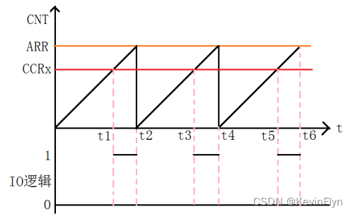


横坐标是时间变量，纵坐标是CNT计数值，CNT计数值随着时间的推进会不断经历从0到ARR，清零复位再到ARR的这一过程。这之中还有一个数值是CCRx即比较值，通过比较值和输出配置可以使之输出高低电平逻辑，这样就产生了PWM波形。通过调节ARR的值可以调节PWM的周期，调节CCRx的值大小可以调节PWM占空比。


从最左边进入的是时钟源，由内部时钟(CNT)或者外部触发时钟(ETRF)输入，进入输入模式控制器，通过OCMR1寄存器的OC1M[2:0]位来配置PWM模式，之后进入一个选择器，由CCER寄存器的CC1P位来设置输出极性，最后由CCER寄存器的CC1E位来使能输出，然后通过OC1来输出PWM波。

PWM有PWM模式1和模式2两种模式，PWM模式1的情况下，当前值小于比较值为有效电平；PWM模式2的情况下，当前值大于比较值为有效电平。

### 相关api

```c
// 根据TIM_HandleTypeDef中指定的参数初始化TIM PWM。
HAL_StatusTypeDef HAL_TIM_PWM_Init(TIM_HandleTypeDef *htim);
// 反初始化TIM_PWM外设。
HAL_StatusTypeDef HAL_TIM_PWM_DeInit(TIM_HandleTypeDef *htim);
// 初始化TIM_PWM_MSP。
void HAL_TIM_PWM_MspInit(TIM_HandleTypeDef *htim);
// 反初始化TIM_PWM_MSP。
void HAL_TIM_PWM_MspDeInit(TIM_HandleTypeDef *htim);
// 启动PWM信号生成。
HAL_StatusTypeDef HAL_TIM_PWM_Start(TIM_HandleTypeDef *htim, uint32_t Channel);
// 停止PWM信号生成。
HAL_StatusTypeDef HAL_TIM_PWM_Stop(TIM_HandleTypeDef *htim, uint32_t Channel);
// 以中断模式启动PWM信号生成。
HAL_StatusTypeDef HAL_TIM_PWM_Start_IT(TIM_HandleTypeDef *htim, uint32_t Channel);
// 以中断模式停止PWM信号生成。
HAL_StatusTypeDef HAL_TIM_PWM_Stop_IT(TIM_HandleTypeDef *htim, uint32_t Channel);
// 以DMA模式启动TIM PWM信号生成
HAL_StatusTypeDef HAL_TIM_PWM_Start_DMA(TIM_HandleTypeDef *htim, uint32_t Channel, const uint32_t *pData, uint16_t Length);
// 以DMA模式停止TIM PWM信号生成。
HAL_StatusTypeDef HAL_TIM_PWM_Stop_DMA(TIM_HandleTypeDef *htim, uint32_t Channel);
```


### 呼吸灯

1. 使用cubeMX，生成基本代码

   

2. tim.c生成tim3初始化函数

   ```c
   void MX_TIM3_Init(void) { 
       /* USER CODE BEGIN TIM3_Init 0 */
       // 用户自定义代码区域，通常用于变量定义或者预处理。
       /* USER CODE END TIM3_Init 0 */ 
       // 定义时钟配置结构体，并初始化为0。 
       TIM_ClockConfigTypeDef sClockSourceConfig = {0}; 
       // 定义主配置结构体，并初始化为0。 
       TIM_MasterConfigTypeDef sMasterConfig = {0}; 
       // 定义输出比较配置结构体，并初始化为0。 
       TIM_OC_InitTypeDef sConfigOC = {0};
       /* USER CODE BEGIN TIM3_Init 1 */ 
       // 用户自定义代码区域，通常用于初始化前的准备工作。 
       /* USER CODE END TIM3_Init 1 */ 
       // 设置TIM3为该函数处理的定时器实例。 
       htim3.Instance = TIM3;
       
       // 配置TIM3的预分频器，计数模式，周期，时钟分频和自动重载预装载设置。
       htim3.Init.Prescaler = 71; 
       htim3.Init.CounterMode = TIM_COUNTERMODE_UP;
       htim3.Init.Period = 5000; 
       htim3.Init.ClockDivision = TIM_CLOCKDIVISION_DIV1;
       htim3.Init.AutoReloadPreload = TIM_AUTORELOAD_PRELOAD_ENABLE;
       // 初始化TIM3基本计时部分。
       if (HAL_TIM_Base_Init(&htim3) != HAL_OK) { 
           Error_Handler(); // 错误处理函数 
       } 
       // 配置TIM3的时钟源为内部时钟。 
       sClockSourceConfig.ClockSource = TIM_CLOCKSOURCE_INTERNAL; 
       if (HAL_TIM_ConfigClockSource(&htim3, &sClockSourceConfig) != HAL_OK) { 
           Error_Handler(); // 错误处理函数 
       } 
       // 初始化TIM3的PWM功能。 
       if (HAL_TIM_PWM_Init(&htim3) != HAL_OK) { 
           Error_Handler(); 
           // 错误处理函数
       } 
       // 配置TIM3的主输出触发和主从模式。
       sMasterConfig.MasterOutputTrigger = TIM_TRGO_RESET; 
       sMasterConfig.MasterSlaveMode = TIM_MASTERSLAVEMODE_DISABLE;
       if (HAL_TIMEx_MasterConfigSynchronization(&htim3, &sMasterConfig) != HAL_OK) {
           Error_Handler(); // 错误处理函数 
       } 
       // 配置TIM3的PWM通道2。 
       sConfigOC.OCMode = TIM_OCMODE_PWM1;
       sConfigOC.Pulse = 0;
       sConfigOC.OCPolarity = TIM_OCPOLARITY_HIGH;
       sConfigOC.OCFastMode = TIM_OCFAST_ENABLE;
       if (HAL_TIM_PWM_ConfigChannel(&htim3, &sConfigOC, TIM_CHANNEL_2) != HAL_OK) {
           Error_Handler(); // 错误处理函数
       }
       /* USER CODE BEGIN TIM3_Init 2 */ 
       // 用户自定义代码区域，通常用于初始化后的额外配置或处理。 
       /* USER CODE END TIM3_Init 2 */ 
       // 调用后处理函数，进一步初始化。 
       HAL_TIM_MspPostInit(&htim3); 
   }
   ```

   

3. 修改main.c

   ```c
   /* USER CODE BEGIN 2 */
   HAL_TIM_PWM_Start(&htim3, TIM_CHANNEL_2);
   /* USER CODE END 2 */
   
   
   while (1) { 
       /* USER CODE END WHILE */ 
       /* USER CODE BEGIN 3 */ 
       // 呼吸灯效果：逐渐增加亮度 
       for (uint16_t i = 0; i < 5000; i++) {
           htim3.Instance->CCR2 = i; // 直接设置TIM3通道2的CCR寄存器 
           HAL_Delay(1); // 延时以调整变化速度 
       } 
       // 呼吸灯效果：逐渐减少亮度 
       for (uint16_t i = 5000; i > 0; i--) { 
           htim3.Instance->CCR2 = i; // 直接设置TIM3通道2的CCR寄存器
           HAL_Delay(1); // 延时以调整变化速度 } 
       }
       /* USER CODE END 3 */ 
      
       // 此外，也可以通过宏来实现__HAL_TIM_SET_COMPARE(&htim3, TIM_CHANNEL_2, i);
   ```

   

4. 

## 4.7 输入捕获模式

STM32的定时器输入捕获模式允许微控制器捕获外部信号的时间信息，从而能够测量频率、周期和脉冲宽度等参数。这个模式对于那些需要精确测量外部事件时间的应用尤为重要。

相关参数：

1. 极性选择（Polarity Selection）：这个参数设置的是TIMx_CCER->CCxP，用于配置捕获触发的信号极性，即决定是在信号的上升沿还是下降沿进行捕获。
2. IC 选择（IC Selection）：该设置涉及TIMx_CCMR->CCxS，用于配置通道的方向（输入或输出）以及输入脚的选择。例如，Direct表示CCx通道配置为输入，ICx映射到TI1上。
3. 预分频比（Prescaler Division Ratio）：此参数设置的是TIMx_CCMR->ICxPSC，用于配置输入捕获的预分频系数。预分频系数决定了捕获操作的频率，从而可以影响捕获精度和反应时间。
4. 输入过滤器（Input Filter）：该设置涉及TIMx_CCMR->ICxF，用于配置输入捕获的滤波器。输入过滤器的作用是对输入信号进行去噪或防抖处理，特别有用于处理机械开关或类似的高噪声信号源。

### 相关api

```c
// 根据TIM_HandleTypeDef中指定的参数初始化TIM输入捕获。
HAL_StatusTypeDef HAL_TIM_IC_Init(TIM_HandleTypeDef *htim);
// 反初始化TIM外设
HAL_StatusTypeDef HAL_TIM_IC_DeInit(TIM_HandleTypeDef *htim);
// 初始化TIM输入捕获MSP。
void HAL_TIM_IC_MspInit(TIM_HandleTypeDef *htim);
// 启动TIM输入捕获测量
HAL_StatusTypeDef HAL_TIM_IC_Start(TIM_HandleTypeDef *htim, uint32_t Channel);
// 停止TIM输入捕获测量。
HAL_StatusTypeDef HAL_TIM_IC_Stop(TIM_HandleTypeDef *htim, uint32_t Channel);
// 以中断模式启动TIM输入捕获测量。
HAL_StatusTypeDef HAL_TIM_IC_Start_IT(TIM_HandleTypeDef *htim, uint32_t Channel);
// 以中断模式停止TIM输入捕获测量。
HAL_StatusTypeDef HAL_TIM_IC_Stop_IT(TIM_HandleTypeDef *htim, uint32_t Channel);
// 以DMA模式启动TIM输入捕获测量
HAL_StatusTypeDef HAL_TIM_IC_Start_DMA(TIM_HandleTypeDef *htim, uint32_t Channel, uint32_t *pData, uint16_t Length);
// 以DMA模式停止TIM输入捕获测量。
HAL_StatusTypeDef HAL_TIM_IC_Stop_DMA(TIM_HandleTypeDef *htim, uint32_t Channel);
```

### tpad开关led灯

1. 配置cubemx

   

2. 在keil下Application/User/Core 生成tpad.c和tpad.h（也就是在文件管理器的Core/Inc，Core/Src）

   ```c
   // tpad.h
   #ifndef __TPAD_H__
   #define __TPAD_H__
   
   #include "main.h"
   #include "tim.h"
   
   void tpad_init(void);
   uint8_t tpad_scan(void);
   
   #endif
   ```

   ```c
   // tpad.c
   
   #include "tpad.h"
   
   uint16_t tpad_default_val; // 存放初始无接触时的读数
   
   
   /*tpad复位*/
   // 函数功能：给引脚放电，开启定时器捕获比较
   void tpad_reset(){
   	// 引脚放电，设置为推挽输出
   	GPIO_InitTypeDef GPIO_InitStruct = {0};
   	
   	GPIO_InitStruct.Pin = GPIO_PIN_1;
     GPIO_InitStruct.Mode = GPIO_MODE_OUTPUT_PP;
     GPIO_InitStruct.Pull = GPIO_PULLUP;
     GPIO_InitStruct.Speed = GPIO_SPEED_FREQ_LOW;
     HAL_GPIO_Init(GPIOA, &GPIO_InitStruct);
   	
   	HAL_GPIO_WritePin(GPIOA, GPIO_PIN_1, GPIO_PIN_RESET);
   	
   	// 开启定时器的输入捕获
   	htim2.Instance->SR = 0; // 状态寄存器清零
   	htim2.Instance->CNT = 0; // 计数值清零
   	
   	// 配置捕获输入时的引脚模式
   	GPIO_InitStruct.Pin = GPIO_PIN_1;
   	GPIO_InitStruct.Mode = GPIO_MODE_INPUT;
   	GPIO_InitStruct.Pull = GPIO_NOPULL;
   	HAL_GPIO_Init(GPIOA, &GPIO_InitStruct);
   	
   	// 设置上升沿捕获
   	__HAL_TIM_SET_CAPTUREPOLARITY(&htim2, TIM_CHANNEL_2, TIM_INPUTCHANNELPOLARITY_RISING);
   	
   	// 开启定时器捕获
   	HAL_TIM_IC_Start_IT(&htim2, TIM_CHANNEL_2);
   	
   }
   
   uint16_t temp;		// 每次读取后存放
   uint8_t it_triggle_flag; // 中断触发标志位，用于标志中断是否触发
   
   // 重写在定时器溢出中断的回调函数
   // 从stm32f1xx_it.c找到TIM2_IRQHandler，
   // 然后跟进HAL_TIM_IRQHandler，然后跟进Capture compare 2 event，然后跟进Input capture event
   // 然后就找到了HAL_TIM_IC_CaptureCallback函数
   void HAL_TIM_IC_CaptureCallback(TIM_HandleTypeDef *htim){
   	// 先关停一下定时器，否则一直会触发捕获
   	HAL_TIM_IC_Stop(&htim2, TIM_CHANNEL_2);
   	// 读取值
   	temp = HAL_TIM_ReadCapturedValue(&htim2, TIM_CHANNEL_2);
   	// it_triggle_flag 置1，表示读取完成
   	it_triggle_flag = 1;
   }
   
   /* 读取瞬时PA1的值函数*/
   void tpad_get_val(){
   	tpad_reset();
   	
   	// 阻塞等待中断完成
   	while(it_triggle_flag==0){
   		HAL_Delay(1);
   	}
   	// 中断完成后，标志位置0
   	it_triggle_flag = 0;
   }
   
   
   /* 在一个时间段内，多次读取PA1的值，然后取最大值函数*/
   // 函数功能：获取PA1的值，多次读取取平均或最大
   uint16_t tpad_get_maxval(){
   	uint16_t maxval = 0;		// 存放最大值	
   	uint8_t i = 8;		// 读8次
   	
   	while(i>0){
   		tpad_get_val();
   		if(temp > maxval){
   			maxval = temp;
   		}
   		i--;
   	}
   	return maxval;
   }
   
   /* 触摸按键扫描函数 */
   // 函数功能：获取PA1的值，与阈值比较，如果大于阈值，返回1，否则，返回0
   uint8_t tpad_scan(){
   	uint8_t res = 0;		// 返回值
   	uint16_t rval = 0;	// 用来存放获取到的PA1
   	// 获取PA1的值
   	rval = tpad_get_maxval();
   	
   	// 比较
   	if(rval > tpad_default_val){
   		res = 1;
   	}
   	
   	return res;
   }
   
   /*触摸按键初始化函数*/
   // 函数功能：获取tpad无接触时的值
   void tpad_init(){
   	tpad_default_val = tpad_get_maxval();
   }
   ```

   

3. main.c中

   ```c
     MX_TIM2_Init();
     /* USER CODE BEGIN 2 */
   	tpad_init();
     /* USER CODE END 2 */
     while (1)
     {
       /* USER CODE END WHILE */
   
       /* USER CODE BEGIN 3 */
   		if(tpad_scan() == 1){
   			 HAL_GPIO_TogglePin(GPIOE,GPIO_PIN_5);
   		}
   		HAL_Delay(100);
   		
     }
   ```

   

4. 

# 5 [串行通信](https://blog.csdn.net/qq_44016222/article/details/123280806)

串行通信是MCU最基本的通信方式

|          | 传输原理           | 优点           | 缺点           |
| -------- | ------------------ | -------------- | -------------- |
| 并行通信 | 数据各个位同时传输 | 速度快         | 占用引脚资源多 |
| 串行通信 | 数据按位顺序传输   | 占用引脚资源少 | 速度慢         |


串行通信按照数据的传送方向可以分为：单工，半双工，全双工

另一种分类方式是根据通信是否有时钟信号来划分的，分为同步通信和异步通信。

- 同步通信指的是带有时钟同步信号，比如：SPI通信、IIC通信（I2C）；
- 异步通信指的是不带时钟同步信号比如：UART（通用异步收发器），单总线。

注：

- UART：通用同步  接收/发送器Universal Asynchronous Receiver/Transmitter
- USART：通用同步/异步 接收/发送器Universal Synchronous/Asynchronous Receiver/Transmitter
- 简单区分同步和异步就是看通信时需不需要对外提供时钟输出。


## 5.1 串口通信

也称为串行接口或COM接口，串口通信属于串行通信。

串行通信一般是以帧格式传输数据，一个数据帧包括一个起始位、数据位、校验位和停止位。

USART 就是对这些传输参数有具体规定，当然也不是只有唯一一个参数值，很多参数值都可以自定义设置，只是增强它的兼容性。


起始位：占用1Bit，低电平有效

数据位：可以是5bit、6Bit、7Bit、8Bit，其中最常用是8Bit

校验位：奇校验、偶校验、无校验，占用1bit，无校验位时不占用。

停止位：占用1Bit、1.5Bit、2Bit，高电平有效


## 5.2 波特率和比特率

波特率：单位时间内传输符号的个数（**传符号率**），是码元传输速率单位

比特率：单位时间内传输的数据位数，是信息量传送速率单位。

一个符号可能编码多于1bit的数据，那么比特率会大于波特率，例如：QPSK、16-QAM等，一个信号符号可能代表2比特、4比特或更多。

波特率与比特率的关系为：比特率 = 波特率 X 单个调制状态对应的二进制数
$$
I = S * log_2 N
$$
***I*** 为比特率，***S*** 为波特率，***N*** 为每个符号负载的信息量，eg：QPSK调制，N就为4。

 对于串口通信，只有两个电平代表0,1，所以bit率和baud率是一样的。

常用的串口通讯速率：2400bps、4800bps、9600bps、19200bps、38400bps、115200bps。现在最常用的应该是115200bps的速率。

参考：

- [波特率与比特率](https://blog.csdn.net/u011041241/article/details/103356695)
- [波特率 比特率 定义 区别 解释 应用](https://zhuanlan.zhihu.com/p/31529472)

## **5.3 UART**

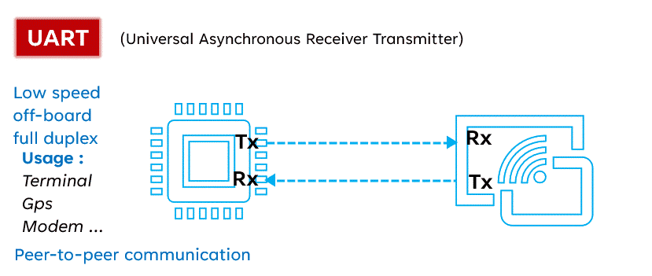

### 5.3.1 串口通信结构体详解

```c
typedef struct __UART_HandleTypeDef { 
    USART_TypeDef *Instance; /*!< UART寄存器基地址 */
    UART_InitTypeDef Init; /*!< UART通信参数 */
    const uint8_t *pTxBuffPtr; /*!< 指向UART Tx传输缓冲区的指针 */ 
    uint16_t TxXferSize; /*!< UART Tx传输大小 */
    __IO uint16_t TxXferCount; /*!< UART Tx传输计数器 */
    uint8_t *pRxBuffPtr; /*!< 指向UART Rx传输缓冲区的指针 */
    uint16_t RxXferSize; /*!< UART Rx传输大小 */
    __IO uint16_t RxXferCount; /*!< UART Rx传输计数器 */
    __IO HAL_UART_RxTypeTypeDef ReceptionType; /*!< 正在进行的接收类型 */
    __IO HAL_UART_RxEventTypeTypeDef RxEventType; /*!< Rx事件类型 */
    DMA_HandleTypeDef *hdmatx; /*!< UART Tx DMA处理参数 */
    DMA_HandleTypeDef *hdmarx; /*!< UART Rx DMA处理参数 */
    HAL_LockTypeDef Lock; /*!< 锁定对象 */
    __IO HAL_UART_StateTypeDef gState; /*!< 与全局句柄管理和Tx操作相关的UART状态信息 此参数可以是@ref HAL_UART_StateTypeDef的一个值 */
    __IO HAL_UART_StateTypeDef RxState; /*!< 与Rx操作相关的UART状态信息 此参数可以是@ref HAL_UART_StateTypeDef的一个值 */
    __IO uint32_t ErrorCode; /*!< UART错误代码 */
    #if (USE_HAL_UART_REGISTER_CALLBACKS == 1) 
        void (* TxHalfCpltCallback)(struct __UART_HandleTypeDef *huart); /*!< UART Tx半完成回调 */
        void (* TxCpltCallback)(struct __UART_HandleTypeDef *huart); /*!< UART Tx完成回调 */
        void (* RxHalfCpltCallback)(struct __UART_HandleTypeDef *huart); /*!< UART Rx半完成回调 */
        void (* RxCpltCallback)(struct __UART_HandleTypeDef *huart); /*!< UART Rx完成回调 */
        void (* ErrorCallback)(struct __UART_HandleTypeDef *huart); /*!< UART错误回调 */
        void (* AbortCpltCallback)(struct __UART_HandleTypeDef *huart); /*!< UART中止完成回调 */
        void (* AbortTransmitCpltCallback)(struct __UART_HandleTypeDef *huart); /*!< UART中止传输完成回调 */ 
        void (* AbortReceiveCpltCallback)(struct __UART_HandleTypeDef *huart); /*!< UART中止接收完成回调 */
        void (* WakeupCallback)(struct __UART_HandleTypeDef *huart); /*!< UART唤醒回调 */
        void (* RxEventCallback)(struct __UART_HandleTypeDef *huart, uint16_t Pos); /*!< UART接收事件回调 */
        void (* MspInitCallback)(struct __UART_HandleTypeDef *huart); /*!< UART Msp初始化回调 */ 
        void (* MspDeInitCallback)(struct __UART_HandleTypeDef *huart); /*!< UART Msp去初始化回调 */ 
    #endif /* USE_HAL_UART_REGISTER_CALLBACKS */ 
} UART_HandleTypeDef;


// 其中相关寄存器相关结构体如下

/** * @brief 通用同步异步接收器发射器（USART） */
typedef struct {
    __IO uint32_t SR; /* USART状态寄存器，地址偏移：0x00 */
    __IO uint32_t DR; /* USART数据寄存器，地址偏移：0x04 */
    __IO uint32_t BRR; /* USART波特率寄存器，地址偏移：0x08 */
    __IO uint32_t CR1; /* USART控制寄存器1，地址偏移：0x0C */
    __IO uint32_t CR2; /* USART控制寄存器2，地址偏移：0x10 */
    __IO uint32_t CR3; /* USART控制寄存器3，地址偏移：0x14 */ 
    __IO uint32_t GTPR; /* USART保护时间和预分频器寄存器，地址偏移：0x18 */ 
} USART_TypeDef;

// 其中UART通信参数结构体如下
typedef struct { 
    uint32_t BaudRate; // 此成员配置UART通信的波特率。
    uint32_t WordLength; // 指定在一帧中传输或接收的数据位数。
    uint32_t StopBits; // 指定传输的停止位数。 
    uint32_t Parity; // 指定奇偶校验模式。 
    uint32_t Mode; // 指定接收或发送模式是否启用或禁用。 
    uint32_t HwFlowCtl; // 指定硬件流控制模式是否启用或禁用。 
    uint32_t OverSampling; // 指定是否启用过采样8以实现更高速度
} UART_InitTypeDef;
```


### 5.3.2 相关api

```c
// 以阻塞模式发送数据。
HAL_StatusTypeDef HAL_UART_Transmit(UART_HandleTypeDef *huart, const uint8_t *pData, uint16_t Size, uint32_t Timeout);
// 以阻塞模式接收数据。
HAL_StatusTypeDef HAL_UART_Receive(UART_HandleTypeDef *huart, uint8_t *pData, uint16_t Size, uint32_t Timeout);
// 以非阻塞模式发送数据
HAL_StatusTypeDef HAL_UART_Transmit_IT(UART_HandleTypeDef *huart, const uint8_t *pData, uint16_t Size);
// 以非阻塞模式接收数据。
HAL_StatusTypeDef HAL_UART_Receive_IT(UART_HandleTypeDef *huart, uint8_t *pData, uint16_t Size);

// 以DMA模式发送数据
HAL_StatusTypeDef HAL_UART_Transmit_DMA(UART_HandleTypeDef *huart, const uint8_t *pData, uint16_t Size);
// 以DMA模式接收数据。
HAL_StatusTypeDef HAL_UART_Receive_DMA(UART_HandleTypeDef *huart, uint8_t *pData, uint16_t Size);
// 暂停DMA传输。
HAL_StatusTypeDef HAL_UART_DMAPause(UART_HandleTypeDef *huart);
// 恢复DMA传输。
HAL_StatusTypeDef HAL_UART_DMAResume(UART_HandleTypeDef *huart);
// 停止DMA传输。
HAL_StatusTypeDef HAL_UART_DMAStop(UART_HandleTypeDef *huart);

// 以阻塞模式接收数据，直到接收到指定数量的数据或发生IDLE事件。
HAL_StatusTypeDef HAL_UARTEx_ReceiveToIdle(UART_HandleTypeDef *huart, uint8_t *pData, uint16_t Size, uint16_t *RxLen, uint32_t Timeout);
// 以中断模式接收数据，直到接收到指定数量的数据或发生IDLE事件。
HAL_StatusTypeDef HAL_UARTEx_ReceiveToIdle_IT(UART_HandleTypeDef *huart, uint8_t *pData, uint16_t Size);
// 以DMA模式接收数据，直到接收到指定数量的数据或发生IDLE事件。
HAL_StatusTypeDef HAL_UARTEx_ReceiveToIdle_DMA(UART_HandleTypeDef *huart, uint8_t *pData, uint16_t Size);
// 获取导致RxEvent回调执行的Rx事件类型。
HAL_UART_RxEventTypeTypeDef HAL_UARTEx_GetRxEventType(UART_HandleTypeDef *huart);
// 中断模式下中止正在进行的传输。
HAL_StatusTypeDef HAL_UART_Abort(UART_HandleTypeDef *huart);
// 中断模式下中止正在进行的发送传输。
HAL_StatusTypeDef HAL_UART_AbortTransmit(UART_HandleTypeDef *huart);
// 中断模式下中止正在进行的接收传输。
HAL_StatusTypeDef HAL_UART_AbortReceive(UART_HandleTypeDef *huart);
// 中断模式下中止正在进行的传输。
HAL_StatusTypeDef HAL_UART_Abort_IT(UART_HandleTypeDef *huart);
// 中断模式下中止正在进行的发送传输。
HAL_StatusTypeDef HAL_UART_AbortTransmit_IT(UART_HandleTypeDef *huart);
// 中断模式下中止正在进行的接收传输。
HAL_StatusTypeDef HAL_UART_AbortReceive_IT(UART_HandleTypeDef *huart);
// 处理UART中断请求。
void HAL_UART_IRQHandler(UART_HandleTypeDef *huart);

// Tx传输完成回调
void HAL_UART_TxCpltCallback(UART_HandleTypeDef *huart);
// Tx半传输完成回调。
void HAL_UART_TxHalfCpltCallback(UART_HandleTypeDef *huart);
// Rx传输完成回调。
void HAL_UART_RxCpltCallback(UART_HandleTypeDef *huart);
// Rx半传输完成回调
void HAL_UART_RxHalfCpltCallback(UART_HandleTypeDef *huart);
// UART错误回调。
void HAL_UART_ErrorCallback(UART_HandleTypeDef *huart);
// UART中止完成回调。
void HAL_UART_AbortCpltCallback(UART_HandleTypeDef *huart);
// UART中止发送完成回调。
void HAL_UART_AbortTransmitCpltCallback(UART_HandleTypeDef *huart);
// UART中止接收完成回调。
void HAL_UART_AbortReceiveCpltCallback(UART_HandleTypeDef *huart);
// 接收事件回调（在使用高级接收服务后调用的Rx事件通知）
void HAL_UARTEx_RxEventCallback(UART_HandleTypeDef *huart, uint16_t Size);
```

### 5.3.3 阻塞模式接发


```c
// uart.c 
void MX_USART1_UART_Init(void)
{
  
  huart1.Instance = USART1;							// 设置USART1为该函数的实例
  huart1.Init.BaudRate = 115200;					// 波特率
  huart1.Init.WordLength = UART_WORDLENGTH_8B;		// 设置帧实际内容长度为8
  huart1.Init.StopBits = UART_STOPBITS_1;			// 设置停止位为1个停止位
  huart1.Init.Parity = UART_PARITY_NONE;			// 设置无奇偶校验
  huart1.Init.Mode = UART_MODE_TX_RX;				// 设置无奇偶校验
  huart1.Init.HwFlowCtl = UART_HWCONTROL_NONE;		// 设置无硬件流控制
  huart1.Init.OverSampling = UART_OVERSAMPLING_16;	// 设置过采样为16
  if (HAL_UART_Init(&huart1) != HAL_OK)				// 初始化配置的UART，并在初始化失败时调用错误处理函数
  {
    Error_Handler();
  }
  /* USER CODE BEGIN USART1_Init 2 */

  /* USER CODE END USART1_Init 2 */

}
```


```c
uint8_t data;
// main.c
while (1) { 
     // 尝试从 UART1 接收一个字节的数据，将其存储在 data 中。如果接收成功（即 HAL_UART_Receive 返回 HAL_OK），则执行 if 语句块。
     if(HAL_UART_Receive(&huart1,&data,1,0)==HAL_OK){ 
         // 将接收的字符发送至串口1 
         HAL_UART_Transmit(&huart1,&data,1,0); 
     }
 }
```

这个过程可以通过板子上的ch340芯片，通过usb线，并配合串口调试助手uartAsist.exe来查看收发的东西。


### 5.3.4 中断模式接收

#### 定长内容接收中断

接收到：led:1，开灯

接收到：led:0，关灯


```c
// uart.c中
HAL_NVIC_SetPriority(USART1_IRQn, 0, 0);		// 设置中断优先级
HAL_NVIC_EnableIRQ(USART1_IRQn);				// 使能中断
```

```c
// main.c
uint8_t rx_buffer[6];

int main(void)
{
    MX_GPIO_Init();
    MX_USART1_UART_Init();
    HAL_UART_Receive_IT(&huart1, rx_buffer, 5);
}

// stm32f1xxx_it.c，找到USART1_IRQHandler，跟进HAL_UART_IRQHandler，跟进UART_Receive_IT，最后找到HAL_UART_RxCpltCallback，再进行重写
void HAL_UART_RxCpltCallback(UART_HandleTypeDef *huart)
{
	HAL_UART_Transmit(huart,rx_buffer,5,100);
	if(strncmp((char *) rx_buffer, "led:1", 5) == 0){
		HAL_GPIO_WritePin(GPIOE, GPIO_PIN_5, GPIO_PIN_RESET);		// 开灯
	} else if(strncmp((char *) rx_buffer, "led:0", 5) == 0){
		HAL_GPIO_WritePin(GPIOE, GPIO_PIN_5, GPIO_PIN_SET);			// 关灯
	}
	HAL_UART_Receive_IT(huart, rx_buffer, 5);
}
```

#### 不定长内容接收中断

接收到led:on，开灯

接收到led:off，关灯

以\r\n作为结束符

```c
// main.c

/* USER CODE BEGIN PTD */ 
#define USART_REC_LEN 256 // 定义接收数据的最大长度 
/* USER CODE END PTD */

/* USER CODE BEGIN PV */ 
uint16_t USART_RX_STA = 0; // 定义USART接收状态标志 
char USART_RX_BUF[USART_REC_LEN]; // 定义USART接收缓冲
uint8_t rxData; // 用于单字节接收 
/* USER CODE END PV */

int main(void)
{
    MX_GPIO_Init();
    MX_USART1_UART_Init();
    HAL_UART_Receive_IT(&huart1, &rxData, 1);
}

void HAL_UART_RxCpltCallback(UART_HandleTypeDef *huart)
{
    if(huart->Instance == USART1) {
        if((USART_RX_STA & 0x8000) == 0) // 未完成接收 
        { 
            if(USART_RX_STA & 0x4000) // 已经接收到0x0d 
            { 
                if(rxData != 0x0a) // 0x0a是\n的ascii码
                { 
                    USART_RX_STA = 0; // 接收错误，重新开始
                } else { 
                    USART_RX_STA |= 0x8000; // 标记接收完成
                } 
            } 
            else 
            { 
                if(rxData == 0x0d)	// 0x0d是\r的ascii码
                { 
                    USART_RX_STA |= 0x4000; // 接收到0x0d，等待0x0a
                }
                else { 
                    USART_RX_BUF[USART_RX_STA & 0X3FFF] = rxData; 
                    USART_RX_STA++; 
                    if(USART_RX_STA > (USART_REC_LEN - 1)) USART_RX_STA = 0; // 如果接收数据超出缓冲长度，重新开始 
                }
            } 
        }

        // 如果接收数据完成 
        if (USART_RX_STA & 0x8000) { 
            // LED控制逻辑 
            if (strncmp((char *)USART_RX_BUF, "ON", 2) == 0) { 
                HAL_GPIO_WritePin(GPIOE, GPIO_PIN_5, GPIO_PIN_RESET); // 低电平亮 
            } else if (strncmp((char *)USART_RX_BUF, "OFF", 3) == 0) {
                HAL_GPIO_WritePin(GPIOE, GPIO_PIN_5, GPIO_PIN_SET); // 高电平熄灭
            } 
            HAL_UART_Transmit(&huart1, (uint8_t*)USART_RX_BUF, USART_RX_STA & 0X3FFF, 1000); // 1000ms
            USART_RX_STA = 0; // 重置状态，准备下次接收 
        }

        // 重新启动异步接收，接收一个字节 
        HAL_UART_Receive_IT(huart, &rxData, 1); 
    }
}
```

### 5.3.5 DMA模式收发

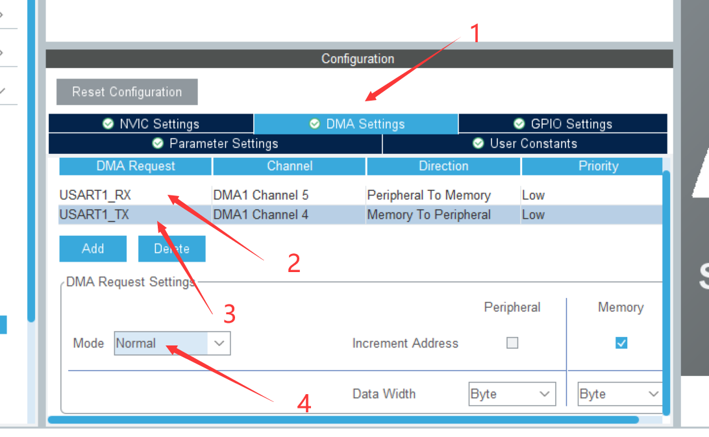

然后将上述代码修改为HAL_UART_Receive_DMA

### 5.3.6 空闲线中断

假如我有10byte的数据缓冲区

完成中断：接收了10byte的数据

半完成中断：接收了5byte的数据

空闲中断：接受了7byte的数据


```c
uint8_t uart_buf[10];
int main(){
    MX_GPIO_Init();
    MX_DMA_Init();
    MX_USART1_UART_Init();
    HAL_UARTEx_ReceiveToIdle_DMA(&huart1, uart_buf, 10);
}
void HAL_UARTEx_RxEventCallback(UART_HandleTypeDef *huart, uint16_t Size){
    HAL_UART_Transmit(&huart1, uart_buf, Size, 100);
    switch(huart->RxEventType)
    {
        case: HAL_UART_RXEVENT_TC:					// 完成中断
            HAL_UART_Transmit(&huart1, "1\r\n", 3, 100);
            break;
        case: HAL_UART_RXEVENT_HT:					// 半完成中断
            HAL_UART_Transmit(&huart1, "2\r\n", 3, 100);
            break;
        case: HAL_UART_RXEVENT_IDLE:				// 空闲线中断
            HAL_UART_Transmit(&huart1, "3\r\n", 3, 100);
            // 在这里写你的控制代码，开关灯等操作。
            break;
    }
     HAL_UARTEx_ReceiveToIdle_DMA(&huart1, uart_buf, 10);
}
```

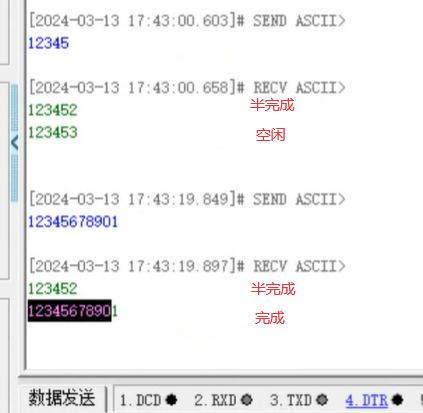

## 5.4 I2C


I2C（Inter-Integrated Circuit）通信是一种由Philips公司开发的串行通信协议，主要用于近距离、低速的芯片间通信。

它只需要两条双向的信号线，一条**数据线SDA**（用于收发数据）和一条**时钟线SCL**（用于通信双方时钟的同步）。I2C通信是**半双工通信**，意味着数据在一条数据线上传输，且同一时刻只能单向传输，要么从主机到从机，要么从从机到主机。每个数据包的大小为8位，采用高位在前、低位在后的传输顺序。

I2C通信中，主机通过时钟线SCL发送时钟信号，并通过数据线SDA发送数据（如从机地址、指令、数据包等）。在发送完一帧数据后，主机需等待从机的响应才能继续发送下一帧数据。I2C总线的操作时序包括写单个存储字节、写多个存储字节、读单个存储字节和读多个存储字节等不同模式。

I2C总线支持多主机模式，即可以有多个主机设备在总线上发起通信。在多主机系统中，仲裁过程是必要的，以避免冲突。当两个主机同时发送数据时，谁先发送高电平的将会输掉仲裁，即仲裁失败的主机将不再产生时钟脉冲，并需等待总线空闲时才能重新传输。

**I2C通信中，每个从机都有一个唯一的7位或10位地址，用于区分不同的从机设备。**

I2C的标准传输速率有多种模式，包括标准模式（100 kbit/s）、快速模式（400 kbit/s）、快速+模式（1 Mbit/s）等，适用于不同的应用场景。

### I2C数据格式

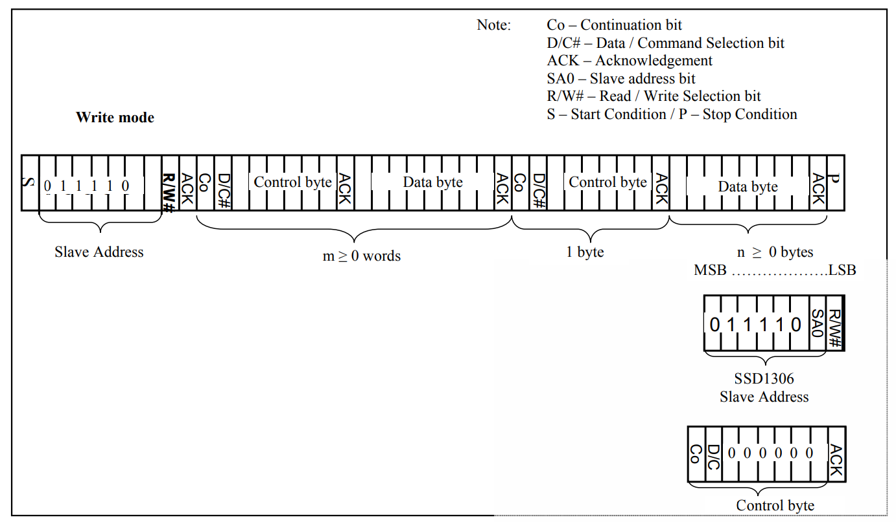


### 相关api

```c
 // 在主模式下，以阻塞模式传输一定数量的数据。 
HAL_StatusTypeDef HAL_I2C_Master_Transmit(I2C_HandleTypeDef *hi2c, uint16_t DevAddress, uint8_t *pData, uint16_t Size, uint32_t Timeout) 
// 参数： 
    * hi2c - 指向I2C_HandleTypeDef结构的指针，包含指定I2C模块的配置信息。
    * DevAddress - 目标设备地址：数据表中的设备7位地址值在调用接口前必须左移。 
    * pData - 指向数据缓冲区的指针。 
    * Size - 要发送的数据量。 
    * Timeout - 超时持续时间。 
    * 返回值：HAL状态。
```

### 代码

```c
// 千锋, oled.c


#include "stm32f1xx_hal.h"	//链接HAL库
#include "codetap.h"	 //字库文件
#include "oled.h"		//声明
 
/* 控制宏 */
#define LEFT 			0x27
#define RIGHT 			0x26
#define UP 				0X29
#define DOWM 			0x2A
#define ON				0xA7
#define OFF				0xA6
 
 
/* IIC接口选择 */
#define IICx hi2c1
extern I2C_HandleTypeDef hi2c1;	//HAL库使用，指定硬件IIC接口
 
 
//oled显示尺寸
uint16_t const displayWidth                = 130;
uint16_t const displayHeight               = 64;
 
/*  OLED显存
[0]0 1 2 3 ... 127
[1]0 1 2 3 ... 127
[2]0 1 2 3 ... 127
[3]0 1 2 3 ... 127
[4]0 1 2 3 ... 127
[5]0 1 2 3 ... 127
[6]0 1 2 3 ... 127
[7]0 1 2 3 ... 127 */
 
static uint8_t OLED_RAM[8][130];//定义GDDRAM缓存区
 
/***************************************************
    I2C总线传出数据函数：
                addr  :    要写入的地址（OLED的地址一般为0x40;指令地址为0x00）
                data  :    要写入的数据
***************************************************/
void HAL_I2C_WriteByte(uint8_t addr,uint8_t data)
{
	uint8_t TxData[2] = {addr,data};
	HAL_I2C_Master_Transmit(&IICx,0X78,(uint8_t*)TxData,2,10);
}
 
/**************************************************************
	 Prototype      : void WriteCmd(uint8_t IIC_Command)
	 Parameters     : IIC_Command
	 return					: none
	 Description    : 写命令（通过HAL_I2C_WriteByte中的HAL_I2C_Master_Transmit
                      向0x00写入命令）
***************************************************************/
void WriteCmd(uint8_t IIC_Command)
{
	HAL_I2C_WriteByte(0x00, IIC_Command);
}
 
/**************************************************************
	 Prototype      : void WriteDat(uint8_t IIC_Data)
	 Parameters     : IIC_Data
	 return					: none
	 Description    : 写数据（通过HAL_I2C_WriteByte中的HAL_I2C_Master_Transmit
                      向0x40写入数据）
***************************************************************/
void WriteDat(uint8_t IIC_Data)
{
	HAL_I2C_WriteByte(0x40, IIC_Data);
}
 
/**************************************************************
	 Prototype      : void OLED_Init(void)
	 Parameters     : none
	 return					: none
	 Description    : 初始化OLED模块
***************************************************************/
void OLED_Init(void)
{
	HAL_Delay(500); //HAL延时函数
	
	// 不带参数的命令
	WriteCmd(0xAE); //关显示
	
	// 带参数的命令，先指定我要设置什么，紧接着再传入参数值。0x20指定参数设置项目，0x10指定该参数项目的值
	WriteCmd(0x20);	//设置内存寻址模式
	WriteCmd(0x10);	//00，水平寻址模式;01，垂直寻址模式;10，页面寻址模式(重置);11，无效
	
	
	WriteCmd(0xb0);	//为页面寻址模式设置页面开始地址，0-7
	WriteCmd(0x00); //---设置低列地址
	WriteCmd(0x10); //---设置高列地址
 
	WriteCmd(0xc8);	//设置COM输出扫描方向
	WriteCmd(0x40); //--设置起始行地址
	WriteCmd(0x81); //--set contrast control register
	WriteCmd(0xff); //亮度调节 0x00~0xff
	WriteCmd(0xa1); //--设置段重新映射0到127
	WriteCmd(0xa6); //--设置正常显示
	WriteCmd(0xa8); //--设置复用比(1 ~ 64)
	WriteCmd(0x3F); //
	WriteCmd(0xa4); //0xa4,输出遵循RAM内容;0xa5,Output忽略RAM内容
	WriteCmd(0xd3); //-设置显示抵消
	WriteCmd(0x00); //-not offset
	WriteCmd(0xd5); //--设置显示时钟分频/振荡器频率
	WriteCmd(0xf0); //--设置分率
	WriteCmd(0xd9); //--设置pre-charge时期
	WriteCmd(0x22); //
	WriteCmd(0xda); //--设置com大头针硬件配置
	WriteCmd(0x12);
	WriteCmd(0xdb); //--设置vcomh
	WriteCmd(0x20); //0x20,0.77xVcc
	WriteCmd(0x8d); //--设置DC-DC
	WriteCmd(0x14); //
	WriteCmd(0xaf); //--打开oled面板
 
	OLED_FullyClear();//清屏
}
 
void OLED_SetPos(unsigned char x, unsigned char y) //设置起始点坐标
{
	WriteCmd(0xb0+y);//y表示字符在哪一行，把0.96寸的屏幕分成0~7行，8个像素
                     //为一行，总高度64个像素
	WriteCmd(((x&0xf0)>>4)|0x10);//x表示oled屏的行像素起点位置，表示每个矩阵的左上角坐标
	WriteCmd((x&0x0f)|0x01);
}
 
/**************************************************************
	 Prototype      : void OLED_ON(void)
	 Parameters     : none
	 return					: none
	 Description    : 将OLED从休眠中唤醒
***************************************************************/
void OLED_ON(void)
{
	WriteCmd(0X8D);  //设置电荷泵
	WriteCmd(0X14);  //开启电荷泵
	WriteCmd(0XAF);  //OLED唤醒
}
 
/**************************************************************
	 Prototype      : void OLED_OFF(void)
	 Parameters     : none
	 return					: none
	 Description    : 让OLED休眠 -- 休眠模式下,OLED功耗不到10uA
***************************************************************/
void OLED_OFF(void)
{
	WriteCmd(0X8D);  //设置电荷泵
	WriteCmd(0X10);  //关闭电荷泵
	WriteCmd(0XAE);  //OLED休眠
}
 
/**************************************************************
	 Prototype      : void OLED_RefreshRAM(void)
	 Parameters     : none
	 return					: none
	 Description    : 全屏填充
***************************************************************/
void OLED_RefreshRAM(void)
{
	// 页寻址模式填充
	for(uint16_t m = 0; m < displayHeight/8; m++)
	{
		WriteCmd(0xb0+m);		//设置页地址b0~b7
		WriteCmd(0x00);		//设置显示位置—列低地址00-0f
		WriteCmd(0x10);		//设置显示位置—列高地址10-1f
		for(uint16_t n = 0; n < displayWidth; n++)
		{
				WriteDat(OLED_RAM[m][n]);
		}
	}
}
 
/**************************************************************
	 Prototype      : void OLED_ClearRAM(void)
	 Parameters     : none
	 return					: none
	 Description    : 清除数据缓冲区
***************************************************************/
void OLED_ClearRAM(void)
{
	for(uint16_t m = 0; m < displayHeight/8; m++)
	{
		for(uint16_t n = 0; n < displayWidth; n++)
		{
				OLED_RAM[m][n] = 0x00;
		}
	}
}
 
 
/**************************************************************
	 Prototype      : void OLED_Fill(uint8_t fill_Data)
	 Parameters     : fill_Data 填充的1字节数据
	 return					: none
	 Description    : 全屏填充 0x00~0xff
***************************************************************/
void OLED_FullyFill(unsigned char fill_Data)
{
	for(uint16_t m = 0; m < displayHeight/8; m++)
	{
		for(uint16_t n = 0; n < displayWidth; n++)
		{
				OLED_RAM[m][n] = fill_Data;
		}
	}
 
	OLED_RefreshRAM();
}
 
/**************************************************************
	 Prototype      : void OLED_FullyClear(void)
	 Parameters     : none
	 return					: none
	 Description    : 全屏清除
***************************************************************/
void OLED_FullyClear(void)
{
		OLED_FullyFill(RESET_PIXEL);
}
 
/**************************************************************
	Prototype      :  void OLED_GetPixel(int16_t x, int16_t y)
	Parameters     : 	x,y -- 起始点坐标(x:0~127, y:0~63);
	return				 :  PixelStatus 像素点状态 	SET_PIXEL = 1, RESET_PIXEL = 0
	Description    : 	获得坐标像素点数据（对于0.96寸的屏幕来说，没啥用）
***************************************************************/
PixelStatus OLED_GetPixel(int16_t x, int16_t y)
{
	 if(OLED_RAM[y/8][x] >> (y%8) & 0x01)
		 return SET_PIXEL;
 
	return	RESET_PIXEL;
}
 
/**************************************************************
	Prototype      : void OLED_ShowStr1(unsigned char x, unsigned char y, int *ch,
                     unsigned char s, unsigned char TextSize)
	Parameters     : 	x,y -- 起始点坐标(x:0~127, y:0~63);
						*ch -- 要显示的数字;
                        s----- 数字的位数
					    TextSize -- 字符大小(1:6*8 ; 2:8*16)
	return	       :    none
	Description    : 	显示codetab.h中的ASCII字符,有6*8和8*16可选择
***************************************************************/
void OLED_ShowStr1(unsigned char x, unsigned char y, int *ch, unsigned char s, unsigned char TextSize)
{
	unsigned char c = 0,i = 0,j=0,k=0;
	switch(TextSize)
	{
		case 1:
		{
			while(s--)
			{
				c = (ch[j] +16);
				if(x > 126)
				{
					x = 0;
					y++;
				}
				OLED_SetPos(x,y);
				for(i=0;i<6;i++)
					WriteDat(F6x8[c][i]);
				 x += 6;
				 j++;
			}
		}break;
		case 2:
		{
			while(s--)
			{
				c = (ch[j] +16);
				if(x > 120)
				{
					x = 0;
					y++;
				}
				OLED_SetPos(x,y);
				for(i=0;i<8;i++)
					WriteDat(F8X16[c*16+i]);
				OLED_SetPos(x,y+1);
				for(i=0;i<8;i++)
					 WriteDat(F8X16[c*16+i+8]);
				x += 8;
				j++;
			}
		}break;
	}
}
 
 
/**************************************************************
	 Prototype      : void OLED_ShowCN(int16_t x, int16_t y, uint8_t* n)
	 Parameters     : x,y -- 起始点坐标(x:0~127, y:0~7);
					  N[]:汉字在codetab.h中的索引（就是第几行）
	 return		    : none
	 Description    : 显示codetab.h中的汉字,16*16点阵
***************************************************************/
 
void OLED_ShowCN(unsigned char x, unsigned char y, unsigned char N)
{
	unsigned char wm=0;
	unsigned int  adder=32*N;
	OLED_SetPos(x , y);
	 for(wm = 0;wm < 16;wm++)
	{
		 WriteDat(F16x16[adder]);
		adder += 1;
	}
	OLED_SetPos(x,y + 1);
	for(wm = 0;wm < 16;wm++)
	{
		WriteDat(F16x16[adder]);
		adder += 1;
	}
}
/**************************************************************
	 Prototype      :	void OLED_FullyToggle(void)
	 Parameters     : none
	 return				  : none
	 Description    : 缓冲区数据取反后刷新到GDDRAM
***************************************************************/
void OLED_FullyToggle(void)
{
	for(uint16_t m = 0; m < displayHeight/8; m++)
	{
		for(uint16_t n = 0; n < displayWidth; n++)
		{
				OLED_RAM[m][n] = ~OLED_RAM[m][n];
		}
	}
	OLED_RefreshRAM();
}
 
/****************************************************************
	全屏垂直偏移,0->63方向
	方向垂直向上,范围0-63
	方向垂直向下,范围63-0
****************************************************************/
void OLED_VerticalShift(void)
{
	for(uint8_t i = 0; i < displayHeight; i++)
		{
			WriteCmd(0xd3);//设置显示偏移，0->63方向
			WriteCmd(i);//偏移量
			HAL_Delay(40);//延时时间
		}
}
 
/****************************************************************
	屏幕内容水平全屏滚动播放
	左		LEFT	0x27
	右		RIGHT	0x26
****************************************************************/
void OLED_HorizontalShift(uint8_t direction)
 
{
	WriteCmd(direction);//设置滚动方向
	WriteCmd(0x00);//虚拟字节设置，默认为0x00
	WriteCmd(0x00);//设置开始页地址
	WriteCmd(0x05);//设置每个滚动步骤之间的时间间隔的帧频
	WriteCmd(0x07);//设置结束页地址
	WriteCmd(0x00);//虚拟字节设置，默认为0x00
	WriteCmd(0xff);//虚拟字节设置，默认为0xff
	WriteCmd(0x2f);//开启滚动-0x2f，禁用滚动-0x2e，禁用需要重写数据
}
 
/****************************************************************
	屏幕内容垂直水平全屏滚动播放
	上		UP		0x29
	下		DOWN	0x2A
****************************************************************/
void OLED_VerticalAndHorizontalShift(uint8_t direction)
{
	WriteCmd(direction);//设置滚动方向
	WriteCmd(0x00);//虚拟字节设置，默认为0x00
	WriteCmd(0x00);//设置开始页地址
	WriteCmd(0x05);//设置每个滚动步骤之间的时间间隔的帧频
	WriteCmd(0x07);//设置结束页地址
	WriteCmd(0x01);//垂直滚动偏移量
 
	WriteCmd(0x2f);//开启滚动-0x2f，禁用滚动-0x2e，禁用需要重写数据
}
 
/****************************************************************
	屏幕内容取反显示
	开	ON	0xA7
	关	OFF	0xA6	默认此模式，设置像素点亮
****************************************************************/
void OLED_DisplayMode(uint8_t mode)
{
	WriteCmd(mode);
}
 
/****************************************************************
	屏幕亮度调节
	intensity	0-255
	默认为0x7f
****************************************************************/
void OLED_IntensityControl(uint8_t intensity)
{
	WriteCmd(0x81);
	WriteCmd(intensity);
}
void OLED_DrawBMP(unsigned char x0,unsigned char y0,unsigned char x1,unsigned char y1,unsigned char BMP[])//X0是图像的起始位置，y0是图像的起始行，X1是图像的宽度，Y1是图像的显示高度1~8；
{
	unsigned int j=0;
	unsigned char x,y;
 
  if(y1%8==0)
		y = y1/8;
  else
		y = y1/8 + 1;
	for(y=y0;y<y1;y++)
	{
		OLED_SetPos(x0,y);
    for(x=x0;x<x1;x++)
		{
			WriteDat(BMP[j++]);
		}
	}
}
/************************************************************
    Prototype      : void OLED_ShowStr1(unsigned char x, unsigned char y, int *ch,
                     unsigned char s, unsigned char TextSize)
	Parameters     : 	x,y -- 起始点坐标(x:0~127, y:0~63);
						*ch -- 要显示的ASCII字符,可以直接传递字符串;
					    TextSize -- 字符大小(1:6*8 ; 2:8*16)
	return	       :    none
	Description    : 	显示codetab.h中的ASCII字符,有6*8和8*16可选择
 ***********************************************************/
void OLED_ShowStr(unsigned char x, unsigned char y, unsigned char *ch, unsigned char TextSize)
{
	unsigned char c = 0,i = 0,j = 0;
	switch(TextSize)
	{
		case 1:
		{
			while(ch[j] != '\0')
			{
				c = ch[j] - 32;
				if(x > 126)
				{
					x = 0;
					y++;
				}
				OLED_SetPos(x,y);
				for(i=0;i<6;i++)
					WriteDat(F6x8[c][i]);
				x += 6;
				j++;
			}
		}break;
		case 2:
		{
			while(ch[j] != '\0')
			{
				c = ch[j] - 32;
				if(x > 120)
				{
					x = 0;
					y++;
				}
				OLED_SetPos(x,y);
				for(i=0;i<8;i++)
					WriteDat(F8X16[c*16+i]);
				OLED_SetPos(x,y+1);
				for(i=0;i<8;i++)
					WriteDat(F8X16[c*16+i+8]);
				x += 8;
				j++;
			}
		}break;
	}
}

```

```c
// oled.h
#ifndef __OLED_H__
#define __OLED_H__
 
#include "stm32f1xx_hal.h"	//链接HAL库
/**************************************
    BMP图片声明
	图片格式为二位数组，下标分别对应图片的宽和高：
	BMP_xx[H/8][L];
**************************************/
extern const uint8_t BMP_Picture[32/8][32];
 
 
/* 设置坐标点的状态 */
typedef enum
{
	SET_PIXEL = 0x01,
    RESET_PIXEL = 0x00,
} PixelStatus;
 
 
/* 功能函数声明 */
//写数据，硬件IIC使用
void HAL_I2C_WriteByte(uint8_t addr,uint8_t data);
//写命令
void WriteCmd(uint8_t IIC_Command);
//写数据
void WriteDat(uint8_t IIC_Data);
//初始化OLED
void OLED_Init(void);
//设置起始点坐标
void OLED_SetPos(unsigned char x, unsigned char y);
//开启电荷泵
void OLED_ON(void);
//关闭电荷泵
void OLED_OFF(void);
//刷新缓冲区数据到GDDRAM
void OLED_RefreshRAM(void);
//清除数据缓冲区OLED_RAM buffer
void OLED_ClearRAM(void);
//全屏填充
void OLED_FullyFill(uint8_t fill_Data);
//清屏
void OLED_FullyClear(void);
//获得坐标像素点数据
PixelStatus OLED_GetPixel(int16_t x, int16_t y);
 
/* 显示指定字符和图片时需要手动刷新缓冲区到GDDRAM
* function list: OLED_ShowStr\OLED_ShowCN\OLED_Show_MixedCH\OLED_DrawBMP
*/
//显示英文字符串
void OLED_ShowStr(unsigned char x, unsigned char y, unsigned char *ch, unsigned char TextSize);
//显示整数用的
void OLED_ShowStr1(unsigned char x, unsigned char y, int *ch,unsigned char j, unsigned char TextSize);
//显示中文字符串
void OLED_ShowCN(unsigned char x, unsigned char y, unsigned char N);
//全屏垂直滚动播放
void OLED_VerticalShift(void);
//全屏水平滚动播放
void OLED_HorizontalShift(uint8_t direction);
//全屏同时垂直和水平滚动播放
void OLED_VerticalAndHorizontalShift(uint8_t direction);
//屏幕内容取反显示
void OLED_DisplayMode(uint8_t mode);
//屏幕亮度调节
void OLED_IntensityControl(uint8_t intensity);
//--------------------------------------------------------------
// Prototype      : void OLED_DrawBMP(unsigned char x0,unsigned char y0,unsigned char x1,unsigned char y1,unsigned char BMP[]);
// Calls          :
// Parameters     : x0,y0 -- 起始点坐标(x0:0~127, y0:0~7); x1,y1 -- 起点对角线(结束点)的坐标(x1:1~128,y1:1~8)
// Description    : 显示BMP位图
//--------------------------------------------------------------
void OLED_DrawBMP(unsigned char x0,unsigned char y0,unsigned char x1,unsigned char y1,unsigned char BMP[]);
 
 
#endif
```

```c
 // codetap.h


/***************************16*16的点阵字体取模方式：共阴——列行式——逆向输出*********/
const unsigned char F16x16[] =
{

0x80,0x80,0x84,0x84,0x84,0x84,0x84,0xFC,0x82,0x82,0x82,0x83,0x82,0x80,0x80,0x00,
0x00,0x00,0x00,0x00,0x00,0x00,0x00,0xFF,0x00,0x00,0x00,0x00,0x00,0x00,0x00,0x00,//千0

0x20,0x10,0x2C,0xE7,0x24,0x24,0x80,0x90,0x4C,0x57,0xA4,0x54,0x4C,0x84,0x80,0x00,
0x01,0x01,0x01,0x7F,0x21,0x11,0x10,0x10,0x15,0x15,0xFF,0x15,0x15,0x10,0x10,0x00,//锋1

0x04,0x24,0x44,0x84,0x64,0x9C,0x40,0x30,0x0F,0xC8,0x08,0x08,0x28,0x18,0x00,0x00,
0x10,0x08,0x06,0x01,0x82,0x4C,0x20,0x18,0x06,0x01,0x06,0x18,0x20,0x40,0x80,0x00,//欢2

0x40,0x40,0x42,0xCC,0x00,0x00,0xFC,0x04,0x02,0x00,0xFC,0x04,0x04,0xFC,0x00,0x00,
0x00,0x40,0x20,0x1F,0x20,0x40,0x4F,0x44,0x42,0x40,0x7F,0x42,0x44,0x43,0x40,0x00,//迎3

0x00,0x80,0x60,0xF8,0x07,0x40,0x20,0x18,0x0F,0x08,0xC8,0x08,0x08,0x28,0x18,0x00,
0x01,0x00,0x00,0xFF,0x00,0x10,0x0C,0x03,0x40,0x80,0x7F,0x00,0x01,0x06,0x18,0x00,//你4
	

};
 
/************************************6*8的点阵************************************/
const unsigned char F6x8[][6] =
{
	0x00, 0x00, 0x00, 0x00, 0x00, 0x00,// sp
	0x00, 0x00, 0x00, 0x2f, 0x00, 0x00,// !
	0x00, 0x00, 0x07, 0x00, 0x07, 0x00,// "
	0x00, 0x14, 0x7f, 0x14, 0x7f, 0x14,// #
	0x00, 0x24, 0x2a, 0x7f, 0x2a, 0x12,// $
	0x00, 0x62, 0x64, 0x08, 0x13, 0x23,// %
	0x00, 0x36, 0x49, 0x55, 0x22, 0x50,// &
	0x00, 0x00, 0x05, 0x03, 0x00, 0x00,// '
	0x00, 0x00, 0x1c, 0x22, 0x41, 0x00,// (
	0x00, 0x00, 0x41, 0x22, 0x1c, 0x00,// )
	0x00, 0x14, 0x08, 0x3E, 0x08, 0x14,// *
	0x00, 0x08, 0x08, 0x3E, 0x08, 0x08,// +
	0x00, 0x00, 0x00, 0xA0, 0x60, 0x00,// ,
	0x00, 0x08, 0x08, 0x08, 0x08, 0x08,// -
	0x00, 0x00, 0x60, 0x60, 0x00, 0x00,// .
	0x00, 0x20, 0x10, 0x08, 0x04, 0x02,// /
	0x00, 0x3E, 0x51, 0x49, 0x45, 0x3E,// 0
	0x00, 0x00, 0x42, 0x7F, 0x40, 0x00,// 1
	0x00, 0x42, 0x61, 0x51, 0x49, 0x46,// 2
	0x00, 0x21, 0x41, 0x45, 0x4B, 0x31,// 3
	0x00, 0x18, 0x14, 0x12, 0x7F, 0x10,// 4
	0x00, 0x27, 0x45, 0x45, 0x45, 0x39,// 5
	0x00, 0x3C, 0x4A, 0x49, 0x49, 0x30,// 6
	0x00, 0x01, 0x71, 0x09, 0x05, 0x03,// 7
	0x00, 0x36, 0x49, 0x49, 0x49, 0x36,// 8
	0x00, 0x06, 0x49, 0x49, 0x29, 0x1E,// 9
	0x00, 0x00, 0x36, 0x36, 0x00, 0x00,// :
	0x00, 0x00, 0x56, 0x36, 0x00, 0x00,// ;
	0x00, 0x08, 0x14, 0x22, 0x41, 0x00,// <
	0x00, 0x14, 0x14, 0x14, 0x14, 0x14,// =
	0x00, 0x00, 0x41, 0x22, 0x14, 0x08,// >
	0x00, 0x02, 0x01, 0x51, 0x09, 0x06,// ?
	0x00, 0x32, 0x49, 0x59, 0x51, 0x3E,// @
	0x00, 0x7C, 0x12, 0x11, 0x12, 0x7C,// A
	0x00, 0x7F, 0x49, 0x49, 0x49, 0x36,// B
	0x00, 0x3E, 0x41, 0x41, 0x41, 0x22,// C
	0x00, 0x7F, 0x41, 0x41, 0x22, 0x1C,// D
	0x00, 0x7F, 0x49, 0x49, 0x49, 0x41,// E
	0x00, 0x7F, 0x09, 0x09, 0x09, 0x01,// F
	0x00, 0x3E, 0x41, 0x49, 0x49, 0x7A,// G
	0x00, 0x7F, 0x08, 0x08, 0x08, 0x7F,// H
	0x00, 0x00, 0x41, 0x7F, 0x41, 0x00,// I
	0x00, 0x20, 0x40, 0x41, 0x3F, 0x01,// J
	0x00, 0x7F, 0x08, 0x14, 0x22, 0x41,// K
	0x00, 0x7F, 0x40, 0x40, 0x40, 0x40,// L
	0x00, 0x7F, 0x02, 0x0C, 0x02, 0x7F,// M
	0x00, 0x7F, 0x04, 0x08, 0x10, 0x7F,// N
	0x00, 0x3E, 0x41, 0x41, 0x41, 0x3E,// O
	0x00, 0x7F, 0x09, 0x09, 0x09, 0x06,// P
	0x00, 0x3E, 0x41, 0x51, 0x21, 0x5E,// Q
	0x00, 0x7F, 0x09, 0x19, 0x29, 0x46,// R
	0x00, 0x46, 0x49, 0x49, 0x49, 0x31,// S
	0x00, 0x01, 0x01, 0x7F, 0x01, 0x01,// T
	0x00, 0x3F, 0x40, 0x40, 0x40, 0x3F,// U
	0x00, 0x1F, 0x20, 0x40, 0x20, 0x1F,// V
	0x00, 0x3F, 0x40, 0x38, 0x40, 0x3F,// W
	0x00, 0x63, 0x14, 0x08, 0x14, 0x63,// X
	0x00, 0x07, 0x08, 0x70, 0x08, 0x07,// Y
	0x00, 0x61, 0x51, 0x49, 0x45, 0x43,// Z
	0x00, 0x00, 0x7F, 0x41, 0x41, 0x00,// [
	0x00, 0x55, 0x2A, 0x55, 0x2A, 0x55,// 55
	0x00, 0x00, 0x41, 0x41, 0x7F, 0x00,// ]
	0x00, 0x04, 0x02, 0x01, 0x02, 0x04,// ^
	0x00, 0x40, 0x40, 0x40, 0x40, 0x40,// _
	0x00, 0x00, 0x01, 0x02, 0x04, 0x00,// '
	0x00, 0x20, 0x54, 0x54, 0x54, 0x78,// a
	0x00, 0x7F, 0x48, 0x44, 0x44, 0x38,// b
	0x00, 0x38, 0x44, 0x44, 0x44, 0x20,// c
	0x00, 0x38, 0x44, 0x44, 0x48, 0x7F,// d
	0x00, 0x38, 0x54, 0x54, 0x54, 0x18,// e
	0x00, 0x08, 0x7E, 0x09, 0x01, 0x02,// f
	0x00, 0x18, 0xA4, 0xA4, 0xA4, 0x7C,// g
	0x00, 0x7F, 0x08, 0x04, 0x04, 0x78,// h
	0x00, 0x00, 0x44, 0x7D, 0x40, 0x00,// i
	0x00, 0x40, 0x80, 0x84, 0x7D, 0x00,// j
	0x00, 0x7F, 0x10, 0x28, 0x44, 0x00,// k
	0x00, 0x00, 0x41, 0x7F, 0x40, 0x00,// l
	0x00, 0x7C, 0x04, 0x18, 0x04, 0x78,// m
	0x00, 0x7C, 0x08, 0x04, 0x04, 0x78,// n
	0x00, 0x38, 0x44, 0x44, 0x44, 0x38,// o
	0x00, 0xFC, 0x24, 0x24, 0x24, 0x18,// p
	0x00, 0x18, 0x24, 0x24, 0x18, 0xFC,// q
	0x00, 0x7C, 0x08, 0x04, 0x04, 0x08,// r
	0x00, 0x48, 0x54, 0x54, 0x54, 0x20,// s
	0x00, 0x04, 0x3F, 0x44, 0x40, 0x20,// t
	0x00, 0x3C, 0x40, 0x40, 0x20, 0x7C,// u
	0x00, 0x1C, 0x20, 0x40, 0x20, 0x1C,// v
	0x00, 0x3C, 0x40, 0x30, 0x40, 0x3C,// w
	0x00, 0x44, 0x28, 0x10, 0x28, 0x44,// x
	0x00, 0x1C, 0xA0, 0xA0, 0xA0, 0x7C,// y
	0x00, 0x44, 0x64, 0x54, 0x4C, 0x44,// z
	0x14, 0x14, 0x14, 0x14, 0x14, 0x14,// horiz lines
};
/****************************************8*16的点阵************************************/
const unsigned char F8X16[]=
{
  0x00,0x00,0x00,0x00,0x00,0x00,0x00,0x00,0x00,0x00,0x00,0x00,0x00,0x00,0x00,0x00,// 0
  0x00,0x00,0x00,0xF8,0x00,0x00,0x00,0x00,0x00,0x00,0x00,0x33,0x30,0x00,0x00,0x00,//! 1
  0x00,0x10,0x0C,0x06,0x10,0x0C,0x06,0x00,0x00,0x00,0x00,0x00,0x00,0x00,0x00,0x00,//" 2
  0x40,0xC0,0x78,0x40,0xC0,0x78,0x40,0x00,0x04,0x3F,0x04,0x04,0x3F,0x04,0x04,0x00,//# 3
  0x00,0x70,0x88,0xFC,0x08,0x30,0x00,0x00,0x00,0x18,0x20,0xFF,0x21,0x1E,0x00,0x00,//$ 4
  0xF0,0x08,0xF0,0x00,0xE0,0x18,0x00,0x00,0x00,0x21,0x1C,0x03,0x1E,0x21,0x1E,0x00,//% 5
  0x00,0xF0,0x08,0x88,0x70,0x00,0x00,0x00,0x1E,0x21,0x23,0x24,0x19,0x27,0x21,0x10,//& 6
  0x10,0x16,0x0E,0x00,0x00,0x00,0x00,0x00,0x00,0x00,0x00,0x00,0x00,0x00,0x00,0x00,//' 7
  0x00,0x00,0x00,0xE0,0x18,0x04,0x02,0x00,0x00,0x00,0x00,0x07,0x18,0x20,0x40,0x00,//( 8
  0x00,0x02,0x04,0x18,0xE0,0x00,0x00,0x00,0x00,0x40,0x20,0x18,0x07,0x00,0x00,0x00,//) 9
  0x40,0x40,0x80,0xF0,0x80,0x40,0x40,0x00,0x02,0x02,0x01,0x0F,0x01,0x02,0x02,0x00,//* 10
  0x00,0x00,0x00,0xF0,0x00,0x00,0x00,0x00,0x01,0x01,0x01,0x1F,0x01,0x01,0x01,0x00,//+ 11
  0x00,0x00,0x00,0x00,0x00,0x00,0x00,0x00,0x80,0xB0,0x70,0x00,0x00,0x00,0x00,0x00,//, 12
  0x00,0x00,0x00,0x00,0x00,0x00,0x00,0x00,0x00,0x01,0x01,0x01,0x01,0x01,0x01,0x01,//- 13
  0x00,0x00,0x00,0x00,0x00,0x00,0x00,0x00,0x00,0x30,0x30,0x00,0x00,0x00,0x00,0x00,//. 14
  0x00,0x00,0x00,0x00,0x80,0x60,0x18,0x04,0x00,0x60,0x18,0x06,0x01,0x00,0x00,0x00,/// 15
  0x00,0xE0,0x10,0x08,0x08,0x10,0xE0,0x00,0x00,0x0F,0x10,0x20,0x20,0x10,0x0F,0x00,//0 16
  0x00,0x10,0x10,0xF8,0x00,0x00,0x00,0x00,0x00,0x20,0x20,0x3F,0x20,0x20,0x00,0x00,//1 17
  0x00,0x70,0x08,0x08,0x08,0x88,0x70,0x00,0x00,0x30,0x28,0x24,0x22,0x21,0x30,0x00,//2 18
  0x00,0x30,0x08,0x88,0x88,0x48,0x30,0x00,0x00,0x18,0x20,0x20,0x20,0x11,0x0E,0x00,//3 19
  0x00,0x00,0xC0,0x20,0x10,0xF8,0x00,0x00,0x00,0x07,0x04,0x24,0x24,0x3F,0x24,0x00,//4 20
  0x00,0xF8,0x08,0x88,0x88,0x08,0x08,0x00,0x00,0x19,0x21,0x20,0x20,0x11,0x0E,0x00,//5 21
  0x00,0xE0,0x10,0x88,0x88,0x18,0x00,0x00,0x00,0x0F,0x11,0x20,0x20,0x11,0x0E,0x00,//6 22
  0x00,0x38,0x08,0x08,0xC8,0x38,0x08,0x00,0x00,0x00,0x00,0x3F,0x00,0x00,0x00,0x00,//7 23
  0x00,0x70,0x88,0x08,0x08,0x88,0x70,0x00,0x00,0x1C,0x22,0x21,0x21,0x22,0x1C,0x00,//8 24
  0x00,0xE0,0x10,0x08,0x08,0x10,0xE0,0x00,0x00,0x00,0x31,0x22,0x22,0x11,0x0F,0x00,//9 25
  0x00,0x00,0x00,0xC0,0xC0,0x00,0x00,0x00,0x00,0x00,0x00,0x30,0x30,0x00,0x00,0x00,//: 26
  0x00,0x00,0x00,0x80,0x00,0x00,0x00,0x00,0x00,0x00,0x80,0x60,0x00,0x00,0x00,0x00,//; 27
  0x00,0x00,0x80,0x40,0x20,0x10,0x08,0x00,0x00,0x01,0x02,0x04,0x08,0x10,0x20,0x00,//< 28
  0x40,0x40,0x40,0x40,0x40,0x40,0x40,0x00,0x04,0x04,0x04,0x04,0x04,0x04,0x04,0x00,//= 29
  0x00,0x08,0x10,0x20,0x40,0x80,0x00,0x00,0x00,0x20,0x10,0x08,0x04,0x02,0x01,0x00,//> 30
  0x00,0x70,0x48,0x08,0x08,0x08,0xF0,0x00,0x00,0x00,0x00,0x30,0x36,0x01,0x00,0x00,//? 31
  0xC0,0x30,0xC8,0x28,0xE8,0x10,0xE0,0x00,0x07,0x18,0x27,0x24,0x23,0x14,0x0B,0x00,//@ 32
  0x00,0x00,0xC0,0x38,0xE0,0x00,0x00,0x00,0x20,0x3C,0x23,0x02,0x02,0x27,0x38,0x20,//A 33
  0x08,0xF8,0x88,0x88,0x88,0x70,0x00,0x00,0x20,0x3F,0x20,0x20,0x20,0x11,0x0E,0x00,//B 34
  0xC0,0x30,0x08,0x08,0x08,0x08,0x38,0x00,0x07,0x18,0x20,0x20,0x20,0x10,0x08,0x00,//C 35
  0x08,0xF8,0x08,0x08,0x08,0x10,0xE0,0x00,0x20,0x3F,0x20,0x20,0x20,0x10,0x0F,0x00,//D 36
  0x08,0xF8,0x88,0x88,0xE8,0x08,0x10,0x00,0x20,0x3F,0x20,0x20,0x23,0x20,0x18,0x00,//E 37
  0x08,0xF8,0x88,0x88,0xE8,0x08,0x10,0x00,0x20,0x3F,0x20,0x00,0x03,0x00,0x00,0x00,//F 38
  0xC0,0x30,0x08,0x08,0x08,0x38,0x00,0x00,0x07,0x18,0x20,0x20,0x22,0x1E,0x02,0x00,//G 39
  0x08,0xF8,0x08,0x00,0x00,0x08,0xF8,0x08,0x20,0x3F,0x21,0x01,0x01,0x21,0x3F,0x20,//H 40
  0x00,0x08,0x08,0xF8,0x08,0x08,0x00,0x00,0x00,0x20,0x20,0x3F,0x20,0x20,0x00,0x00,//I 41
  0x00,0x00,0x08,0x08,0xF8,0x08,0x08,0x00,0xC0,0x80,0x80,0x80,0x7F,0x00,0x00,0x00,//J 42
  0x08,0xF8,0x88,0xC0,0x28,0x18,0x08,0x00,0x20,0x3F,0x20,0x01,0x26,0x38,0x20,0x00,//K 43
  0x08,0xF8,0x08,0x00,0x00,0x00,0x00,0x00,0x20,0x3F,0x20,0x20,0x20,0x20,0x30,0x00,//L 44
  0x08,0xF8,0xF8,0x00,0xF8,0xF8,0x08,0x00,0x20,0x3F,0x00,0x3F,0x00,0x3F,0x20,0x00,//M 45
  0x08,0xF8,0x30,0xC0,0x00,0x08,0xF8,0x08,0x20,0x3F,0x20,0x00,0x07,0x18,0x3F,0x00,//N 46
  0xE0,0x10,0x08,0x08,0x08,0x10,0xE0,0x00,0x0F,0x10,0x20,0x20,0x20,0x10,0x0F,0x00,//O 47
  0x08,0xF8,0x08,0x08,0x08,0x08,0xF0,0x00,0x20,0x3F,0x21,0x01,0x01,0x01,0x00,0x00,//P 48
  0xE0,0x10,0x08,0x08,0x08,0x10,0xE0,0x00,0x0F,0x18,0x24,0x24,0x38,0x50,0x4F,0x00,//Q 49
  0x08,0xF8,0x88,0x88,0x88,0x88,0x70,0x00,0x20,0x3F,0x20,0x00,0x03,0x0C,0x30,0x20,//R 50
  0x00,0x70,0x88,0x08,0x08,0x08,0x38,0x00,0x00,0x38,0x20,0x21,0x21,0x22,0x1C,0x00,//S 51
  0x18,0x08,0x08,0xF8,0x08,0x08,0x18,0x00,0x00,0x00,0x20,0x3F,0x20,0x00,0x00,0x00,//T 52
  0x08,0xF8,0x08,0x00,0x00,0x08,0xF8,0x08,0x00,0x1F,0x20,0x20,0x20,0x20,0x1F,0x00,//U 53
  0x08,0x78,0x88,0x00,0x00,0xC8,0x38,0x08,0x00,0x00,0x07,0x38,0x0E,0x01,0x00,0x00,//V 54
  0xF8,0x08,0x00,0xF8,0x00,0x08,0xF8,0x00,0x03,0x3C,0x07,0x00,0x07,0x3C,0x03,0x00,//W 55
  0x08,0x18,0x68,0x80,0x80,0x68,0x18,0x08,0x20,0x30,0x2C,0x03,0x03,0x2C,0x30,0x20,//X 56
  0x08,0x38,0xC8,0x00,0xC8,0x38,0x08,0x00,0x00,0x00,0x20,0x3F,0x20,0x00,0x00,0x00,//Y 57
  0x10,0x08,0x08,0x08,0xC8,0x38,0x08,0x00,0x20,0x38,0x26,0x21,0x20,0x20,0x18,0x00,//Z 58
  0x00,0x00,0x00,0xFE,0x02,0x02,0x02,0x00,0x00,0x00,0x00,0x7F,0x40,0x40,0x40,0x00,//[ 59
  0x00,0x0C,0x30,0xC0,0x00,0x00,0x00,0x00,0x00,0x00,0x00,0x01,0x06,0x38,0xC0,0x00,//\ 60
  0x00,0x02,0x02,0x02,0xFE,0x00,0x00,0x00,0x00,0x40,0x40,0x40,0x7F,0x00,0x00,0x00,//] 61
  0x00,0x00,0x04,0x02,0x02,0x02,0x04,0x00,0x00,0x00,0x00,0x00,0x00,0x00,0x00,0x00,//^ 62
  0x00,0x00,0x00,0x00,0x00,0x00,0x00,0x00,0x80,0x80,0x80,0x80,0x80,0x80,0x80,0x80,//_ 63
  0x00,0x02,0x02,0x04,0x00,0x00,0x00,0x00,0x00,0x00,0x00,0x00,0x00,0x00,0x00,0x00,//` 64
  0x00,0x00,0x80,0x80,0x80,0x80,0x00,0x00,0x00,0x19,0x24,0x22,0x22,0x22,0x3F,0x20,//a 65
  0x08,0xF8,0x00,0x80,0x80,0x00,0x00,0x00,0x00,0x3F,0x11,0x20,0x20,0x11,0x0E,0x00,//b 66
  0x00,0x00,0x00,0x80,0x80,0x80,0x00,0x00,0x00,0x0E,0x11,0x20,0x20,0x20,0x11,0x00,//c 67
  0x00,0x00,0x00,0x80,0x80,0x88,0xF8,0x00,0x00,0x0E,0x11,0x20,0x20,0x10,0x3F,0x20,//d 68
  0x00,0x00,0x80,0x80,0x80,0x80,0x00,0x00,0x00,0x1F,0x22,0x22,0x22,0x22,0x13,0x00,//e 69
  0x00,0x80,0x80,0xF0,0x88,0x88,0x88,0x18,0x00,0x20,0x20,0x3F,0x20,0x20,0x00,0x00,//f 70
  0x00,0x00,0x80,0x80,0x80,0x80,0x80,0x00,0x00,0x6B,0x94,0x94,0x94,0x93,0x60,0x00,//g 71
  0x08,0xF8,0x00,0x80,0x80,0x80,0x00,0x00,0x20,0x3F,0x21,0x00,0x00,0x20,0x3F,0x20,//h 72
  0x00,0x80,0x98,0x98,0x00,0x00,0x00,0x00,0x00,0x20,0x20,0x3F,0x20,0x20,0x00,0x00,//i 73
  0x00,0x00,0x00,0x80,0x98,0x98,0x00,0x00,0x00,0xC0,0x80,0x80,0x80,0x7F,0x00,0x00,//j 74
  0x08,0xF8,0x00,0x00,0x80,0x80,0x80,0x00,0x20,0x3F,0x24,0x02,0x2D,0x30,0x20,0x00,//k 75
  0x00,0x08,0x08,0xF8,0x00,0x00,0x00,0x00,0x00,0x20,0x20,0x3F,0x20,0x20,0x00,0x00,//l 76
  0x80,0x80,0x80,0x80,0x80,0x80,0x80,0x00,0x20,0x3F,0x20,0x00,0x3F,0x20,0x00,0x3F,//m 77
  0x80,0x80,0x00,0x80,0x80,0x80,0x00,0x00,0x20,0x3F,0x21,0x00,0x00,0x20,0x3F,0x20,//n 78
  0x00,0x00,0x80,0x80,0x80,0x80,0x00,0x00,0x00,0x1F,0x20,0x20,0x20,0x20,0x1F,0x00,//o 79
  0x80,0x80,0x00,0x80,0x80,0x00,0x00,0x00,0x80,0xFF,0xA1,0x20,0x20,0x11,0x0E,0x00,//p 80
  0x00,0x00,0x00,0x80,0x80,0x80,0x80,0x00,0x00,0x0E,0x11,0x20,0x20,0xA0,0xFF,0x80,//q 81
  0x80,0x80,0x80,0x00,0x80,0x80,0x80,0x00,0x20,0x20,0x3F,0x21,0x20,0x00,0x01,0x00,//r 82
  0x00,0x00,0x80,0x80,0x80,0x80,0x80,0x00,0x00,0x33,0x24,0x24,0x24,0x24,0x19,0x00,//s 83
  0x00,0x80,0x80,0xE0,0x80,0x80,0x00,0x00,0x00,0x00,0x00,0x1F,0x20,0x20,0x00,0x00,//t 84
  0x80,0x80,0x00,0x00,0x00,0x80,0x80,0x00,0x00,0x1F,0x20,0x20,0x20,0x10,0x3F,0x20,//u 85
  0x80,0x80,0x80,0x00,0x00,0x80,0x80,0x80,0x00,0x01,0x0E,0x30,0x08,0x06,0x01,0x00,//v 86
  0x80,0x80,0x00,0x80,0x00,0x80,0x80,0x80,0x0F,0x30,0x0C,0x03,0x0C,0x30,0x0F,0x00,//w 87
  0x00,0x80,0x80,0x00,0x80,0x80,0x80,0x00,0x00,0x20,0x31,0x2E,0x0E,0x31,0x20,0x00,//x 88
  0x80,0x80,0x80,0x00,0x00,0x80,0x80,0x80,0x80,0x81,0x8E,0x70,0x18,0x06,0x01,0x00,//y 89
  0x00,0x80,0x80,0x80,0x80,0x80,0x80,0x00,0x00,0x21,0x30,0x2C,0x22,0x21,0x30,0x00,//z 90
  0x00,0x00,0x00,0x00,0x80,0x7C,0x02,0x02,0x00,0x00,0x00,0x00,0x00,0x3F,0x40,0x40,//{ 91
  0x00,0x00,0x00,0x00,0xFF,0x00,0x00,0x00,0x00,0x00,0x00,0x00,0xFF,0x00,0x00,0x00,//| 92
  0x00,0x02,0x02,0x7C,0x80,0x00,0x00,0x00,0x00,0x40,0x40,0x3F,0x00,0x00,0x00,0x00,//} 93
  0x00,0x06,0x01,0x01,0x02,0x02,0x04,0x04,0x00,0x00,0x00,0x00,0x00,0x00,0x00,0x00,//~ 94
};

```

## 5.5 单总线通信

单总线是美国DALLAS公司推出的外围串行扩展总线技术。

它采用单根信号线传输。 这种协议由一个总线主节点、或多个从节点组成系统，通过根信号线对从芯片进行数据的读取。每一个符合OneWire协议的从芯片都有一个唯一的地址，包括48位的序列号、8位的家族代码和8位的CRC代码。

主芯片根据**64位寻址**对各个芯片进行**双向通信**，因此其协议对**时序的要求较严格**，初始化、写bit或读bit都有严格的时序要求，但是**位与位之间没有严格要求**。

由于单总线是主从结构，只有主机呼叫从机时，从机才能应答，因此主机访问器件都必须严格遵循单总线命令序列，即初始化、ROM命令和功能命令。

### DHT11

DHT11数字温湿度传感器是一款含有已校准数字信号输出的温湿度复合传感器。

它采用单总线双向串行通信协议，每次采集都要由单片机发起开始信号，然后DHT11会向单片机发送响应并开始传输40位数据帧，高位在前。

数据格式为：8bit湿度整数数据 + 8bit湿度小数数据 + 8bit温度整数数据 + 8bit温度小数数据 + 8bit校验位

温湿度小数部分默认为0，即单片机采集的数据都是整数，校验位为4个字节的数据相加取结果的低8位数据作为校验和。

#### 时序图

总时序：

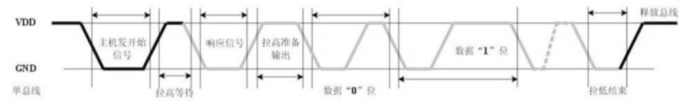

时序步骤1：

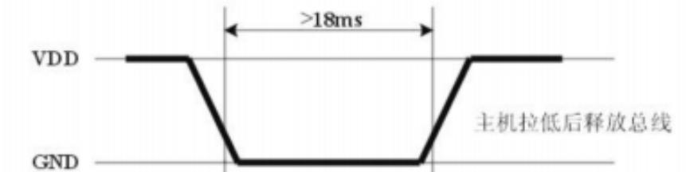

主机或者单片机需要发送一个开始信号给DHT11传感器：推挽输出，输出低电平，时间持续 >18ms（开始信号），然后拉高电平，释放总线

时序步骤2：


如果传感器正常且存在，在收到步骤1发来的开始信号后，会响应一个低电平，并持续80us。然后再拉高总线80us，通知主机准备接收数据。

时序步骤3（dht11发送数据）：

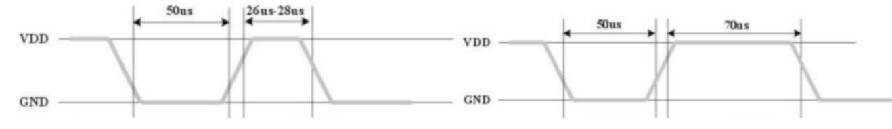

程序要区分数据0和数据1的格式：先判断此时引脚的电平状态，如果是低电平就一直循环等待，直到高电平出现，高电平出现后延时40us，并读取延时后的电平状态，如果此时是高电平，则数据为1，否则为0。


传输完40位数据后，传感器再次输出一个50us的低电平后，将数据总线释放，采集过程结束。

#### 驱动编写

根据时序图去编写驱动代码

```c
// dht11.h
#ifndef __DHT11_H
#define __DHT11_H

#include "main.h"
#include "tim.h"
uint8_t DHT_read(void);
#endif
```


```c
// dht11.c
#include "dht11.h"

#define GPIOX GPIOA;
#define PINX GPIO_PIN_5;

uint8_t Data[5]= {0};		// 存放读取到的dht11数据

// 将GPIO引脚调节为输入
void SET_PIN_INPUT(void){
	GPIO_InitTypeDef GPIO_InitStruct = {0};
	
	/*Configure GPIO pin : PA5 */
	GPIO_InitStruct.Pin = PINX;
	GPIO_InitStruct.Mode = GPIO_MODE_INPUT;
	GPIO_InitStruct.Pull = GPIO_NOPULL;
	GPIO_InitStruct.Speed = GPIO_SPEED_FREQ_HIGH;
	HAL_GPIO_Init(GPIOX, &GPIO_InitStruct);
}


// 将GPIO引脚调节为输出
void SET_PIN_OUTPUT(void){
	GPIO_InitTypeDef GPIO_InitStruct = {0};
	
	/*Configure GPIO pin : PA5 */
	GPIO_InitStruct.Pin = PINX;
	GPIO_InitStruct.Mode = GPIO_MODE_OUTPUT_PP;
	GPIO_InitStruct.Pull = GPIO_NOPULL;
	GPIO_InitStruct.Speed = GPIO_SPEED_FREQ_HIGH;
	HAL_GPIO_Init(GPIOA, &GPIO_InitStruct);
}

// 微妙级延时
void Delay_us(uint16_t us){
	// 向下计数
	uint16_t us_cnt = 65535 - us;
	htm1.Instance->CNT = 65535;
	HAL_TIM_Base_Start(&htim1);
	uint16_t temp = 65535;
	while(temp > us_cnt){
		temp = htim1.Instance->CNT;
	}
	HAL_TIM_Base_Stop(&htim1);
}

// 电平读取函数，每八个电平存为一个字节
// 返回读取到的电平
uint16_t DHT_read_byte(void){
	uint8_t temp;
	uint8_t read_byte;		// 读取到的电平数据
	uint8_t i;
	uint8_t hp=0;						// 读电平的累计时间
	for(i=0; i<8; ++i){
		// 开始一次电平读取
		// 等待高电平到来
		while(HAL_GPIO_ReadPin(GPIOX,PINX) == 0 && hp < 100){
			Delay_us(1);
			++hp;		// 防卡死
		}
		
		// 高电平来了，延时40us，再读取当前电平
		Delay_us(40);
		if(HAL_GPIO_ReadPin(GPIOX,PINX) == 1){
			temp=1;
		}else{
			temp=0;
		}
		
		// 等待低电平到来，开始下一位读数或结束读取
		hp=0;
		while(HAL_GPIO_ReadPin(GPIOX,PINX) == 1 && hp < 100){
			Delay_us(1);
			++hp;
		}
		// 将读取到的temp存放至read_byte
		read_byte <<=1;		// 每次运算前左移一位
		read_byte |= temp;	//然后或上当前电平，以存取到read_byte一字节最末尾的一个bit上
		
	}
	return read_byte;
}


uint8_t DHT_read(void){
	uint8_t i;
	uint8_t hp=0;	
	// 总线控制权在stm32
	// 发送18ms低电平
	SET_PIN_OUTPUT();
	HAL_GPIO_WritePin(GPIOX,PINX,GPIO_PIN_RESET);
	HAL_Delay(18);
	// 拉高20us高电平, 释放数据总线
	HAL_GPIO_WritePin(GPIOX,PINX,GPIO_PIN_SET);
	Delay_us(20);
	
	// 总线控制权在DHT11
	SET_PIN_INPUT();
	// 如果读取到低电平，说明DHT11有响应
	if(HAL_GPIO_ReadPin(GPIOX,PINX) == 0){
		// 等待翻转电平的高电平到来
		while(HAL_GPIO_ReadPin(GPIOX,PINX) == 0 && hp < 100){
			Delay_us(1);
			hp++;//防卡死
		}
		
		// 等待低电平到来，低电平到来后，告知主机准备接收数据
		hp=0;
		while(HAL_GPIO_ReadPin(GPIOX,PINX) == 1 && hp < 100){
			Delay_us(1);
			++hp;
		}
		
		// 开始读取数据，读5个字节的数据
		for(i=0; i<5; ++i){
			Data[i]=DHT_read_byte();
		}
		Delay_us(50);
		
	}
	
	// 校验数据
		uint32_t sum = Data[0]+Data[1]+Data[2]+Data[3];
		if(sum == Data[4])
		{
			return 1;
		}else return 0;
}

```

```c
// main.c
char msg[128];
extern uint8_t Data[5];

while (1) { 
    if(DHT_read()) { 
    	//组包，并准备发送 
	    len=snprintf((char *)message,sizeof(message),"Humi:%d%%,Temp:%d\r\n",Data[0],Data[2]);
    	//通过串口发送 
	    HAL_UART_Transmit(&huart1,message,len,1000); 
    }
    HAL_Delay(2000);
}
```

## 5.6 SPI

SPI ( Serial Peripheral lnterface，串行外围设备接口）通讯协议，是Motorola公司提出的一种同步串行接口技术，是一种高速、全双工、同步通信总线，在芯片中只占用四根管脚用来控制及数据传输。

应用:EEPROM、Flash、RTC、ADC、DSP等。

优缺点︰全双工通信，通讯方式较为简单，相对数据传输速率较快;没有应答机制确认数据是否接收，在数据可靠性上有一定缺陷（与l2C相比）。

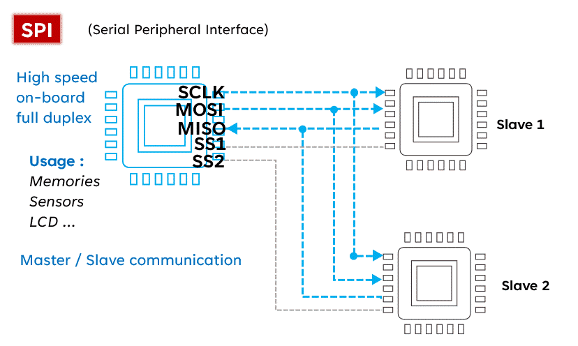

# 6 DMA

DMA（Direct Memory Access，直接存储器访问）操作方式是提高CPU效率的有效途径。

可以简单的理解为，大量重复性工作经过CPU“牵线搭桥”后，剩下的工作就由它自己重复进行，不用时刻关注。

DMA传输无需CPU直接控制传输，也没有中断处理方式那样保留现场和恢复现场的过程，通过硬件为RAM与I/O设备开辟一条直接传送数据的通路，这样可以解放CPU。

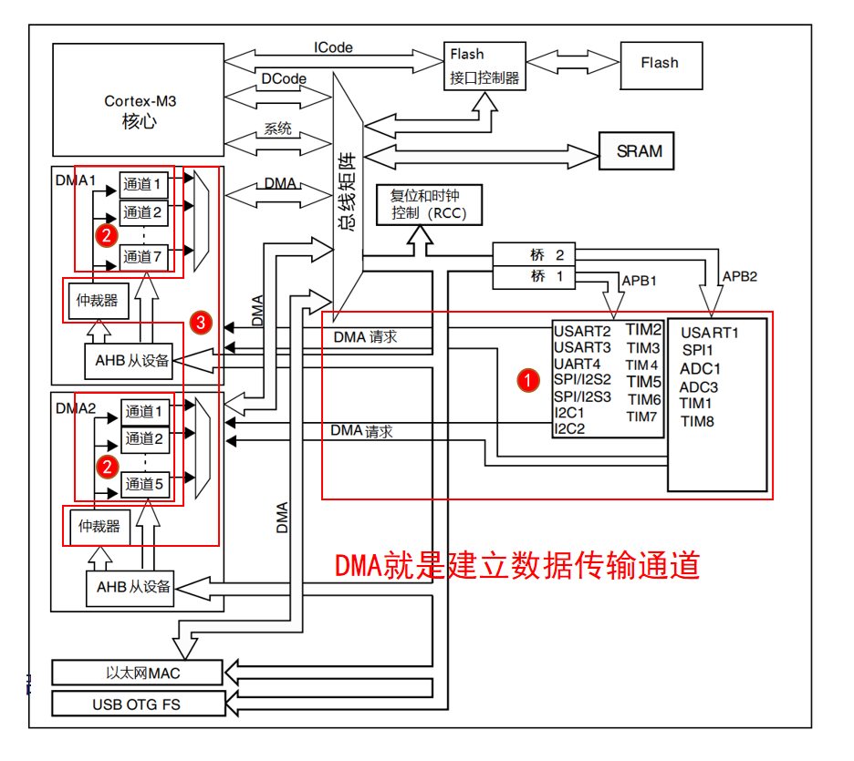

1. DMA请求：DMA传输数据，先向DMA控制器发送请求
2. DMA通道：不同外设向DMA的不同通道发送请求。DMA1有7个通道，DMA2有5个通道。
3. DMA优先级：多个DMA通道同时发来请求时，由仲裁器管理

# 7 ADC

ADC(Analog-to-Digital Converter) 指模数转换器。是指将连续变化的模拟信号转换为离散的数字信号的器件。

分辨率： 分辨率以二进制（或十进制）数的位数来表示，一般有 8 位、10 位、12 位、16位等，它说明模数转换器对输入信号的分辨能力，位数越多，表示分辨率越高，恢复模拟信号时会更精确。（在我们这个设备上ADC是12位的，也就是最大电压会被转换为4096）

## 7.1 ADC结构体

```c
/** * @brief ADC句柄结构定义 */ 
typedef struct __ADC_HandleTypeDef { 
    ADC_TypeDef *Instance; 				/* 寄存器基地址 */ 
    ADC_InitTypeDef Init; 				/* ADC所需参数 */ 
    DMA_HandleTypeDef *DMA_Handle; 		/* DMA处理器的指针 */ 
    HAL_LockTypeDef Lock; 				/* ADC锁定对象 */
    __IO uint32_t State; 				/* ADC通信状态（ADC状态的位图） */
    __IO uint32_t ErrorCode; 			/* ADC错误代码 */ 
    #if (USE_HAL_ADC_REGISTER_CALLBACKS == 1) 
    void (* ConvCpltCallback)(struct __ADC_HandleTypeDef *hadc); 			/* ADC转换完成回调函数 */ 
    void (* ConvHalfCpltCallback)(struct __ADC_HandleTypeDef *hadc); 		/* ADC转换DMA半传输完成回调函数 */ 
    void (* LevelOutOfWindowCallback)(struct __ADC_HandleTypeDef *hadc); 	/* ADC模拟看门狗1回调函数 */ 
    void (* ErrorCallback)(struct __ADC_HandleTypeDef *hadc); 				/* ADC错误回调函数 */ 
    void (* InjectedConvCpltCallback)(struct __ADC_HandleTypeDef *hadc); 	/* ADC注入组转换完成回调函数 */ 
    void (* MspInitCallback)(struct __ADC_HandleTypeDef *hadc); 			/* ADC MSP初始化回调函数 */ 
    void (* MspDeInitCallback)(struct __ADC_HandleTypeDef *hadc); 			/* ADC MSP去初始化回调函数 */ 
    #endif /* USE_HAL_ADC_REGISTER_CALLBACKS */ 
}ADC_HandleTypeDef;

typedef struct
{
  uint32_t DataAlign;                        
  uint32_t ScanConvMode;                    
  FunctionalState ContinuousConvMode;         
  uint32_t NbrOfConversion;                  
  FunctionalState  DiscontinuousConvMode;    
  uint32_t NbrOfDiscConversion;              
  uint32_t ExternalTrigConv;              
} ADC_InitTypeDef;
```


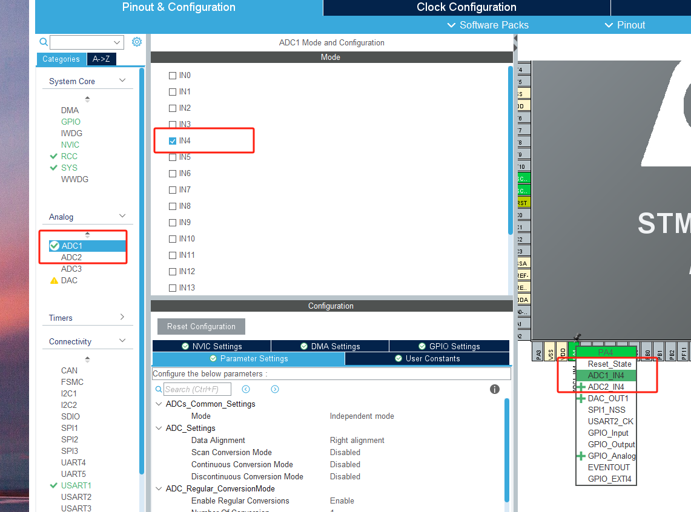

```c
/* USER CODE BEGIN PV */
uint32_t adc_data;
char msg[32];
/* USER CODE END PV */


while (1)
  {
    /* USER CODE END WHILE */
		
    /* USER CODE BEGIN 3 */
		HAL_ADC_Start(&hadc1);
		if(HAL_ADC_PollForConversion(&hadc1,100) == HAL_OK){
			adc_data = HAL_ADC_GetValue(&hadc1);
		}
		HAL_ADC_Stop(&hadc1);
		
		sprintf(msg, "val:%d", adc_data);
		HAL_UART_Transmit(&huart1, (uint8_t *)msg, strlen(msg),100);
		HAL_Delay(500);
  }
```

# 8 看门狗

MCU微控制器构成的微型计算机系统中，由于微控制器的工作常常会受到来自外界电磁场的干扰，造成各种寄存器和内存的数据混乱，从而导致程序指针错误、不在程序区、取出错误的程序指令等，都有可能会导致程序执行陷入死循环，程序的正常运行被打断，由微控制器控制的系统无法继续正常工作，导致整个系统的陷入停滞状态，发生不可预料的后果。

为了解决以上问题，在微控制器内部集成了一个定时器复位电路，即看门狗电路。

在stm32微控制器中集成了两个看门狗外设，分别是独立看门狗和窗口看门狗。

## 8.1 独立看门狗

独立看门狗工作在主程序之外，能够完全独立工作

由专用的低速时钟（LSI）驱动，即使主时钟发生故障，任能够继续有效。独立看门狗适用于需要看门狗作为一个在主程序之外能够完全独立工作，并且对时间精度要求低的场合。

时间计算：
$$
\frac{1 \times prescaler \times reloadVal}{40KHz} = time_{out}
$$
**当超过time_out时间没有喂狗，那么程序就会自行重启。**

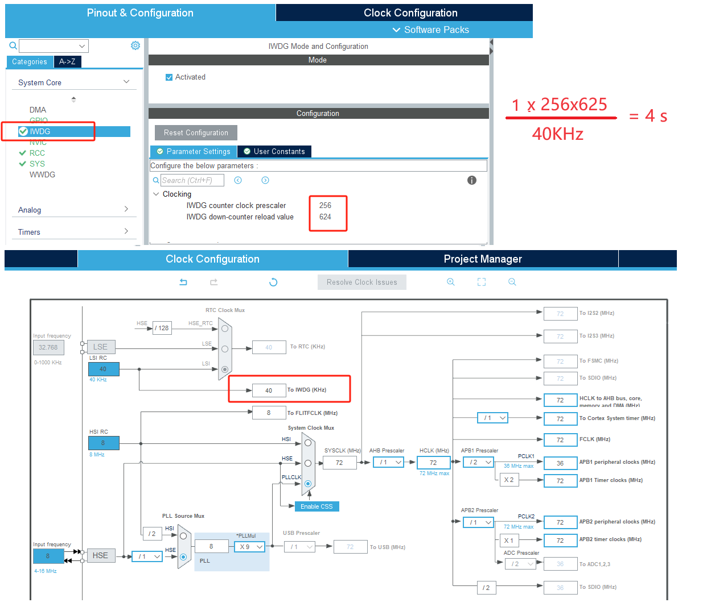

```c
/* USER CODE BEGIN 2 */
	HAL_UART_Transmit(&huart1,(uint8_t *)"hello\r\n", strlen("hello\r\n"),1000);
  /* USER CODE END 2 */

while (1)
  {
		HAL_UART_Transmit(&huart1,(uint8_t *)"baby\r\n", strlen("baby\r\n"),1000);
		HAL_Delay(500);
		HAL_IWDG_Refresh(&hiwdg);		// 看门狗复位
  }
```

## 8.2 窗口看门狗

窗口看门狗最合适那些要求看门狗在精确计时窗口起作用的程序。

WWDG时钟来自于PCLK1（36MHz）

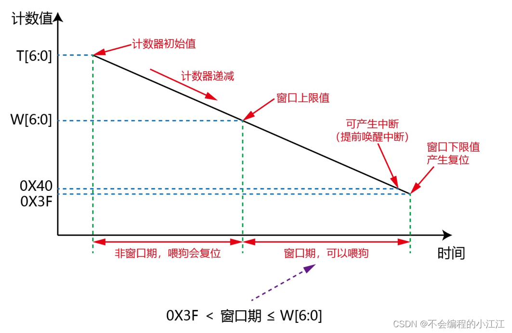

# 9 wifi

[STM32 ESP8266WiFi模块的使用：基于机智云平台开发](https://blog.csdn.net/han2205277149/article/details/140648461)

[**esp8266wifi模块如何与STM32连接 esp8266连接stm32入网**](https://blog.51cto.com/u_16213720/11731839)

# 其它

1. 代码跳转需要先编译后才能跳转

2. [cubemx在Pinout view中选错了引脚，不知道怎么取消](https://blog.csdn.net/qq_52932171/article/details/132240143)

   - 左键要取消的引脚，再点击一次之前设置的模式就可取消
   - 

3. [internal commend error](https://blog.csdn.net/qq_60341895/article/details/127629430)

4. [快捷键](https://blog.csdn.net/qq_44250317/article/details/125635828)

5. stm32项目指定查找头文件所包含的路径

   

6. 创建文件并添加到项目

   - 方式1在文件夹中创建文件，然后在keil5中添加文件到项目

     

   - 方式2直接在keil5中添加文件

     

   - 

7. [../Core/Inc/tpad.h(7): warning:  #1295-D: Deprecated declaration tpad_init - give arg types](https://blog.csdn.net/killer_milk/article/details/123070458)

   ```c
   // 无参数函数，在头文件里面声明时，需要在参数位置加void
   #ifndef __TPAD_H__
   #define __TPAD_H__
   
   #include "main.h"
   #include "tim.h"
   
   void tpad_init(void);
   uint8_t tpad_scan(void);
   
   #endif
   ```

   

8. [warning: #1-D: last line of file ends without a newline](https://blog.csdn.net/qq_66413444/article/details/134108336)

   

   

9. [keil5打开现有（已有）工程](https://blog.csdn.net/m0_74070424/article/details/135707775)

   - Project->open project
   - 找到xxxxxxx.uvprojx的文件，打开

10. 
