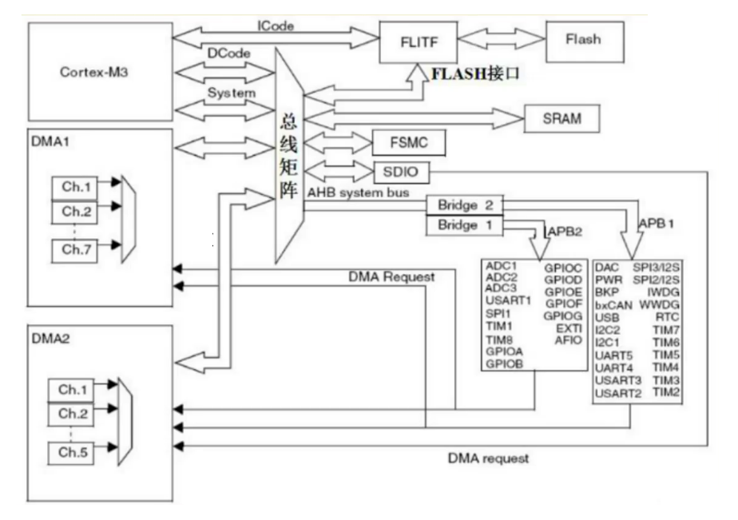

# STM32

# 0 绪论

## 0.1 介绍

ST指意法半导体（公司），M指微处理器，32表示计算机处理器位数（51单片机是8位的）。

ARM分成三个系列：

- Cortex-A：针对多媒体应用（手机平板，对性能要求比较高）
- Cortex-R：针对对实时性和性能有一定要求的场景
- Cortex-M：针对低功耗高性能的场景

stm32它是一个soc（System On Chips，片上集成系统），它集成很多模块。其中最重要的就是cpu核心，它的核心选择的就是Cortex-M。

ARM采用的是一个精简指令集。

## 0.2 stm32系列

stm32根据闪存容量，引脚数量等构成了一个庞大的stm32家族（型号众多）。

命名规则：

F：通用快闪（FlashMemory）；
L：低电压（1.65～3.6V）；
F类型中F0xx和F1xx系列为2.0～3.6V;F2xx和F4xx系列为1.8～3.6V

## 0.3 stm32芯片内部结构

DMA（Direct Memory Access）：它能使数据从附加设备（如磁盘驱动器）直接发送到计算机主板的内存上。

SRAM：随机存储器

APB（Advanced Peripheral Bus，高级外围设备总线）

FLASH：闪存，相当于硬盘，编写的代码都放这里面。

## 0.4 stm32最小系统

我们使用的stm32芯片型号：stm32f103c8t6

1. 供电系统
2. 时钟电路（内部时钟源、外部时钟源）
3. 复位电路
4. 下载的接口电路
5. boot电路

