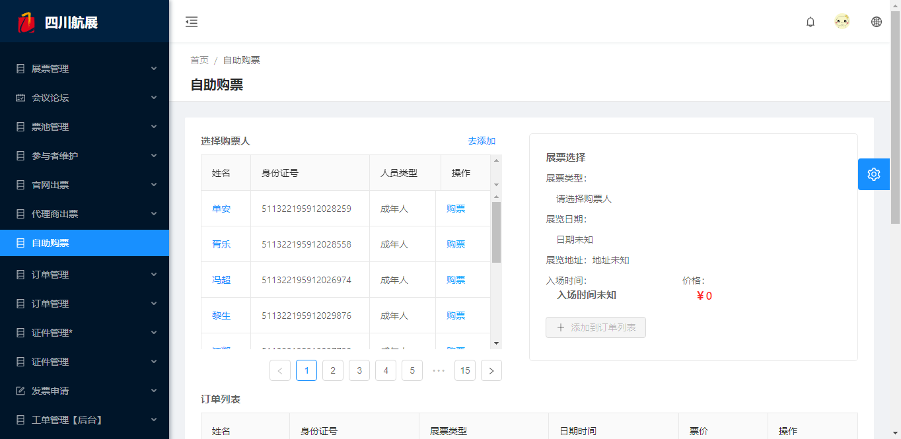
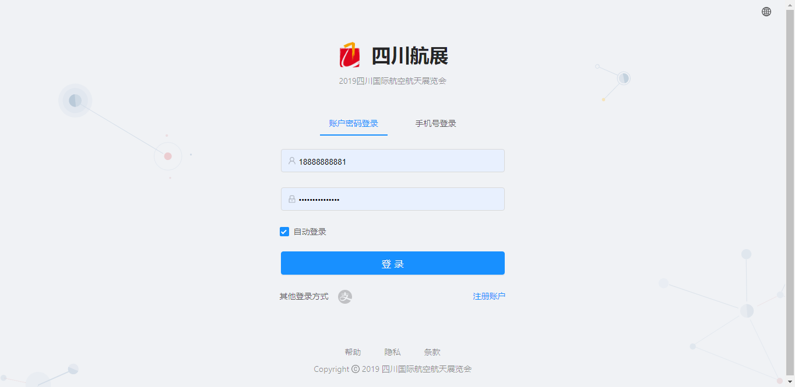

# 1 [antd pro](https://pro.ant.design/docs/getting-started-cn) 项目入门 

&emsp;&emsp;antd pro项目的技术栈基于[ES2015+](http://es6.ruanyifeng.com/)、[React](https://reactjs.org/)、[UmiJS](https://umijs.org/zh/guide/)、[dva](https://dvajs.com/guide/)、[g2](https://antv.alipay.com/zh-cn/index.html) 和 [antd](https://ant.design/index-cn)，本地环境需要[node](https://nodejs.org/zh-cn/)(最基本的环境要求)、[yarn](https://yarnpkg.com/zh-Hant/)，提前了解和学习这些知识会非常有帮助。

- ES2015+ 

    作为项目的基础语言，最少应掌握指南的JavaScript基础部分。如果对JavaScript有个大体的框架了解，当然是极好的。如果没有，遇到不懂的地方希望多百度，用问题来构建你的知识体系，那将会更加牢固。

    在这里我仅罗列一些JavaScript的重要的知识点，[DOM](https://www.runoob.com/htmldom/htmldom-tutorial.html)，BOM和事件处理等知识点供查询。

- React
  
    作为项目的基础前端框架，antd pro所有的封装都是基于React框架，最少应掌握指南的React基础部分，须认真理解和掌握组件，生命周期，数据通信等知识点。

- UmiJs 

    umi(乌米) 是蚂蚁金服的底层前端框架，主要负责antd pro框架的路由部分，路由简单的来说就是页面的服务器地址，单页面路由的跳转主要由umi来完成，当然他也是封装了React-router。有时间可以看看它的文档。

- DvaJs

    首先是一个基于 redux 和 redux-saga 的数据流方案，主要负责antd pro框架的数据交互部分。然后为了简化开发体验，dva 还额外内置了 react-router 和 fetch，所以也可以理解为一个轻量级的应用框架。
    
    框架内的models作为数据的仓库，loading作为服务器请求加载态，都大大方便了开发，也是极为好用的框架。

- AntD

    antd 是基于 Ant Design 设计体系的 React UI 组件库，封装了大量极富视觉效果的组件，基本满足业务场景的基本需要，这大大提高了开发效率，做前端开发，需要多看看它的文档，以便在遇到业务需要时，不做无用功。

- G2（antV）

    G2 是一套基于可视化编码的图形语法，以数据驱动，具有高度的易用性和扩展性，用户无需关注各种繁琐的实现细节，一条语句即可构建出各种各样的可交互的统计图表。在数据大盘页面会有大量的应用。

以下内容全部基于antd pro V2 进行概述，截止目前antd pro 已更新到 V4 ，目前还不是很好用，有兴趣的同学，可以看看antd pro V4的文档。


## 1 项目文件结构
```bash
├── config                   # umi 配置，包含路由，构建等配置
├── mock                     # 本地模拟数据
├── public
│   └── favicon.png          # Favicon
├── src
│   ├── assets               # 本地静态资源
│   ├── components           # 业务通用组件
│   ├── e2e                  # 集成测试用例
│   ├── layouts              # 通用布局
│   ├── models               # 全局 dva model
│   ├── pages                # 业务页面入口和常用模板
│   ├── services             # 后台接口服务
│   ├── utils                # 工具库
│   ├── locales              # 国际化资源
│   ├── global.less          # 全局样式
│   └── global.ts            # 全局 JS
├── tests                    # 测试工具
├── README.md
└── package.json             # 功能模块（插件）安装目录
```

### 1.1 [config](https://umijs.org/zh/config/#基本配置)
```bash
└── config
    ├── config.js              # 
    ├── plugin.config.js           # 业务通用组件
    └── router.config.js     
```

    这一部分主要用作全局的配置。里面包含了项目，插件，路由的配置信息。作为项目的统领性文件，需要了解其中的部分内容。具体配置信息，可参看标题链接，这部分属于UmiJS的内容。

1. config.js

```js
export default {
  //umi框架的全局配置，具体信息可参看文档。
  plugins,
  //定义专用环境变量，请不要在你的项目中使用它。
  define: {
    ANT_DESIGN_PRO_ONLY_DO_NOT_USE_IN_YOUR_PRODUCTION:
      ANT_DESIGN_PRO_ONLY_DO_NOT_USE_IN_YOUR_PRODUCTION || '', 
  },
  //配置浏览器最低版本
  targets: {
    ie: 11,
  },
  // 路由配置,这里只做全局引入，具体配置在router.config.js
  routes: pageRoutes,
//配置主题，实际上是配 less 变量。
//支持对象和字符串（"theme": "./theme-config.js"）两种类型，
  theme: {
    'primary-color': primaryColor,
  },
  //配置服务器代理地址，与数据直接挂钩，可配置多个地址，实现跨域访问，应注意
  proxy: {
    '/api': {
      target: 'http://192.168.199.105:8008/',
      changeOrigin: true,
    },
    '/print_tool':{
      target:'http://192.168.199.148:9090/',
      changeOrigin: true,
    } 
  },
}
```

    在团队开发中，主要由项目负责人改动此全局配置文件。入门时，需作了解，以便在掌握了基础内容后，做进一步的深入研究。

2. plugin.config.js

    插件的配置信息，具体我也没怎么看，项目开发到现在，还没碰过这个文件。有兴趣的可以深入了解，补充该指南。

3. router.config.js
   
<p style='text-indent:2em'>
默认导出路由信息数组，每个数组元素是由一个对象构成，<span style='color:red;'>常用的字段：path、redirect、name、component、routes、request</span>。
</p>

```js
// in router.config.js
export default[
    //页面重定向
    {
        path:'/',
        redirect:'/home'
    },
    //页面配置
    {
        path: '/home',
        name:'home',
        component: '../layouts/BlankLayout',
        routes:[//子路由
            {
                path:'/home/welcome',
                name:'welcome',
                component:'./Welcome'
            }
            {/*...*/}
        ]
    },
]
    
// in src/locales/zh-CN/menu.js
export default{
    'menu.home':'首页',
    'menu.home.welcome':'欢迎',
}
```

- path

    网址：ApiHost + path。ApiHost在config.js中的proxy中已定义，网址中除开ApiHost,就是我们这里的path部分。它主要用作页面唯一的地址标识，方便编译和页面跳转
    
- redirect
  
    当browser匹配到数组元素对象中的path，他会自动跳转到目标地址（redirect定义的地址），通常此对象中，只包含path和redirect两个字段。

- name

    页面文档的名字，在router.config.js中，全写的是英文名，我们需要在src/locales/zh-CN/menu.js做对应的汉化，格式'menu.pageName':'chineseName'，如果有子路由，需要在后边继续衔接。
    
    做对应的汉化之后，页面不会再报错，看到的是汉化后的名字而不是英文名。
- component 

    组件——顾名思义，这里就是我们实体页面文件的地址所在。框架默认此地址是pages文件夹下，所以“./” 代表路径为/src/pages的文件夹下，项目所有的前端页面都默认写在pages下，后面会有说到。

- routes
  
    子路由。在实际的业务场景中，页面相同的部分我们都会提取到页面布局之中，像页面的侧边导航栏、页头的消息提示栏等等，相同的部分不需要重复开发，提高了我们开发的效率。会有很多不同业务的页面都会在同一个页面布局当中，我们开发的业务页面只会占据布局中的主要部分。

    在布局页面中，我们可以从this.props中解析出children，然后将children放置在页面的某个位置，也就实现了，布局的效果。

    routes就是为布局指定的，它的children就是routes数组里的元素。

    routes对应的是一个数组，数组里的元素同样是对象，写法亦如是，就不再累述。


### 1.2 src源代码
```bash
└── src
    ├── assets               # 本地静态资源
    ├── components           # 业务通用组件
    ├── e2e                  # 集成测试用例
    ├── layouts              # 通用布局
    ├── models               # 全局 dva model
    ├── pages                # 业务页面入口和常用模板
    ├── services             # 后台接口服务
    ├── utils                # 工具库
    ├── locales              # 国际化资源
    ├── global.less          # 全局样式
    └── global.ts            # 全局 JS  

```

1. components

    antd pro给我们提供了一些，基础的业务组件放在其中，如果在我们自己的业务中需要用到其中的组件就可以直接import，然后在自己的页面中加以使用，提高我们的开发效率。在我们实际的开发过程当中，也应有这样的封装思维，把一些经常用到的能够重复使用的组件，封装成一个独立的模块组件，这样开发效率就会越来越快。省下功夫，可以学习其他的知识。

2. models

<p style='text-indent:2em'>
组件会发生三种通信：1. 向子组件发消息；2.向父组件发消息；3.向其他组件发消息；4.与后台数据交互（异步请求）

&emsp;&emsp;如果仅仅采用前面讲到的数据交互的方式，那么将会有些复杂。antd pro嵌入的DvaJs将会很好的解决这个问题，<span style="color:red">models作为数据的仓库（数据缓存机构）</span>，非常的实用。

&emsp;&emsp;在这一层放的是<span style="color:red">全局级</span>的model，pages文件夹下所有页面都可以获取到这里面的数据。pages文件夹下，各个业务页面里的models文件夹里面的model是<span style="color:red">页面级</span>的，他们仅供当前业务页面使用，其他的平行业务页面无法获取到其中的数据。

&emsp;&emsp;后面在页面级models将会详细介绍，models的具体用法。

</p>

3. layouts

<p style="text-indent:2em">
    页面的布局，包含BasicLayout，BlankLayout和UserLayout
</p>



<center>基本布局（BasicLayout）</center>



<center>用户登录（UserLayout）</center>

如果要使用这些基本的布局，需要在router.config.js中配置，将自己的业务页面放在基础布局中作为它的子路由使用，即可复用基本布局。

```js
 {
        path: '/home',
        name:'home',
        component: '../layouts/BasicLayout',
        routes:[//子路由
            {
                path:'/home/welcome',
                name:'welcome',
                component:'./Welcome'
            }
            {/*...*/}
        ]
},
```

### 1.3 pages

<p style="text-indent:2em">
    pages文件夹下，放着我们的业务页面，每个子文件夹，就是一个模块，里面放着大大小小与当前业务页面相关的components、models和页面等。
    下面着重讲解一下models的用法。
</p>

<span style='color:red;font-size:20px'>dispatch(action)——页面派发数据行为</span>
```js
import { connect } from 'dva';
import React from 'react';
//需要派发行为必须通过@connect对组件进行封装，使它拥有dispatch方法。
@connect(({}))=>({

}))
export default class List extends React.Component{
    constructor(props){
        super(props);
        this.state={

        }
    }
    componentDidMount(){
        const {dispatch}=this.props;
        const params={
            deviceId:1,
        }
        dispatch({type:'namespace/reducers|effects',payload:params});
    }
}
```

1. [models](https://dvajs.com/api/#model)
<p style="text-indent:2em">
前面已经说到过，在pages页面里的models是页面级的models，作为页面级数据仓库的models，里面的数据仅供当前业务页面文件夹内使用。如果之前有学过redux的话，或许理解下面的概念要轻松一些。
</p>
给一个示例代码,下面的models是维护设备列表所要用到的models，这里面包含了设备增删改查的基本信息化操作。<span style="color:red">models的书写是基本固定的，可复制粘贴而且不易出错</span> 

```js
import { getRecordList,getDeviceList,ADDevice,DELDevice,queryArea} from '@/services/exhibition';
import {message} from 'antd';
import router from 'umi/router';
export default{
    namespace:'exhibition',
    state:{ 
        deviceList:[],
        devicePage:{
            count_page:0,
            count_size:0,
            current_page:0,
        }, 
    }, 
    reducers:{
        backDeviceList(state,{payload:{deviceList,devicePage}}){
            console.log('返回列表',deviceList,devicePage);
            return {...state,deviceList,devicePage}
        },
    },
    effects:{
         *queryDeviceList({payload:{listParams}},{call,put}){
            console.log(listParams);
            const response=yield call(getDeviceList,listParams);
            console.log('response',response);
            yield put({type:'backDeviceList',payload:{deviceList:response.data,devicePage:response.page}});
         },
         *addDevice({payload:{newDevice}},{call,put}){
             console.log('newDevice',newDevice)
             const response=yield call(ADDevice,newDevice);
             if(response.code==200){
                message.success(response.msg,2).then(()=>{
                    router.push({pathname:'/exhibition/device/list'});
                }); 
             }
         },
         *delDevice({payload},{call,put,select}){
            console.log('newDevice',payload);
            const response=yield call(DELDevice,payload);
            if(response.code=200){
                message.success(response.msg,3);
                   
                const devicePage = yield select(state=> state.exhibition.devicePage);
                 const listParams={page_num:devicePage.current_page,page_size:10};  
                 yield  put({type:'queryDeviceList',payload:{listParams}});
               
            }
        },
    }
}
```

2. namespace-命名空间
<p style="text-indent:2em">
作为仓库的id，只能用字符串，是程序用来识别数据在什么仓库的唯一标识。
</p>

3. state
<p style="text-indent:2em">
<span style='color:red'>数据的存放之处</span>，值是一个对象，对象里面存放各种键值对数据。我们从后台请求的数据，或需要与其他页面共享的数据都可以放在其中。
</p>

4. reducers
<p style="text-indent:2em">
存放与数据仓库中的数据直接接触的同步方法，它的值是一个对象，对象里面放方法。这里面的方法可以直接修改state里的数据。可以模仿上面的写法，进行修改。这里面有一个较为重要的用法，可以参考下面链接。

[修改深层对象](https://www.jianshu.com/p/c6343ddd313d?tdsourcetag=s_pctim_aiomsg)
</p>

5. effects
<p style="text-indent:2em">
存放调取service请求后台数据的异步方法，它的值是一个对象，对象里面放的是方法。方法名开头要以<span style='color:red'>“ * ”</span>开头，方法的第一个参数是action，就是由页面的dispatch派发过来操作models的行为。第二个参数是一个异步对象，对象里面包含三个异步方法call，put，select，使用这三个方法时需要在前面加<span style='color:red'><b>yield</b></span>。
</p>

- call(service,payload)

    用于调用异步逻辑，支持 promise。

    第一个参数是service里面的请求后台方法，第二个参数是传给后台的参数。


- put(action:{type:'namespace/reducer|effect',payload})

    用于请求其他（当前页面级models和全局级models）的reducers方法或effects方法。action （Array）包含两个字段type、payload。

- select(function)

    用于<span style='color:red'>查询</span>其他（当前页面级models和全局级models）里的数据
```js
    function:(state)=>{
        ...;
        return state.namespace.field;
    }
```

### 1.4 services

    对应业务页面结构，每个js文件负责一个业务页面的请求服务模块。里面存放着，直接向后台请求数据的方法，通过使用utils里的request方法，就可以直接向后台请求数据了

```js
export async function ADDevice(params) {

    //后台api接口：/base_equipment/add。
    //params需要按照后台的规范传参。
    //params是models 中effects call函数传来的参数。
    return request.post('/base_equipment/add', {data: params});
}
```
### 1.5 utils
    存放公用的方法工具，例如像时间戳转换，设置cookies等方法。

### 1.6 locales
    项目的全球化语言库，开发者需要将需要使用到的多国语言提前录入到库中，以备语言切换时调用。如果项目涉及到多语言，使用项目的语言框架就可简单的解决，项目以英文为语言的中介，通过调用
```js
import { formatMessage, setLocale, getLocale, FormattedMessage } from 'umi/locale';
 <FormattedMessage id="app.settings.menuMap.basic"  />//字符串组件形式输出
 formatMessage({id:'app.settings.menuMap.personal'})//formatMessage输出语言字符串
```
    setLocale 和 getLocale 的 api，通过这两个 api 可以方便的切换区域。
### 1.7 package.json
<p style="text-indent:2em">
package.json 是整个项目的插件（项目依赖）目录，<span style='color:red;'>npm install</span>命令就是基于这个目录为项目安装依赖的。就基于antd pro项目本身而言，我们就是在依赖别人的框架进行开发的，别人用到什么插件我们就需要安装什么插件，有了这些插件我们的项目才能运行起来。
</p>
<p style="text-indent:2em">
开发项目时，不同程度上，会依赖其他开发者已有的研究成果，我们不可能事事都从头做起，我们需要站在巨人的肩膀上进行开发。
</p>
<p style="text-indent:2em">
这里顺带讲一个知识点

[JSON](http://www.json.org/)

JSON 语法规则

在 JS 语言中，一切都是对象。因此，任何支持的类型都可以通过 JSON 来表示，例如字符串、数字、对象、数组等。但是对象和数组是比较特殊且常用的两种类型：
- 对象表示为键值对
- 数据由逗号分隔
- 花括号保存对象
- 方括号保存数组

### 1.8 package-lock.json

其实用一句话来概括很简单，就是锁定安装时的包的版本号。

根据官方文档，这个package-lock.json 是在 `npm install`时候生成一份文件，用以记录当前状态下实际安装的各个npm package的具体来源和版本号。

```json
"dependencies": {
    "accepts": "~1.3.7",
    "array-flatten": "1.1.1",
    "body-parser": "^1.19.0",
    "content-disposition": ">0.5.3",
    "content-type": "~1.0.4",
    "cookie": "^0.4.0",
    "cookie-signature": "<1.0.6",
    "debug": ">=2.6.9",
    "depd": "~1.1.2",
    "encodeurl": "<1.0.2"
  }
```

- **插入符号^**： 匹配的是最新次要版本号，也就是第二个数字。比如：^ 1.2.3将匹配任何1.x.x版本，包括1.3.0，但将在2.0.0上停止。
- **波浪号〜**：匹配最新补丁版本号，也就是版本号的第三个数字。比如~1.2.3将匹配所有1.2.x版本，但将在1.3.0上停止。
- **星号*：**那意思就是匹配任何版本。
- **latest：**安装的永远是最新发布的版本。
- **>，>=，<，<=**：意思也很简单，就是大于，或者大于等于，小于或者小于等于后面的版本号。

# 2 antd pro项目实践--数据增删改查

## 2.1 [UmiJS](https://umijs.org/zh/guide/)

### 2.1.1 路由跳转


单页面应用可以通过此进行页面传参和页面跳转。

```js
//引入
 import router from 'umi/router|link';
//函数式跳转
router.push( String | { pathname : 'xx/xxx' ,payload});
//payload字段名任意，
//从this.props的location里解析出相应字段

//页面替换
router.replace(~);
//页面前后退 
router.go(+n);
router.goBack();

//声明式跳转
<Link to="/list?a=1&b=2">Go to list page</Link>
//从this.props的location里解析出query对象或search字符串
```
### 2.1.2 动态路由

除了通过上面的方式给页面传参，还可以通过动态路由的方式为页面传参

```js
//router.config.js
{
    //tab必传
    path:'/home/:tab',
    //tab可以从this.props.match.params解析获取到。
    //tab非必传
    //path:'/home/:tab?',
    name:'home',
    routes:[],
}
```

## 2.2 [DvaJS](https://umijs.org/zh/guide/)

### 2.2.1 Models数据绑定于业务页面(connect)
```js
//属于dva的数据部分的插件
import { connect } from 'dva';
import React from 'react';
//需要派发行为必须通过@connect对组件进行封装，使它拥有dispatch方法。

@connect(({loading,namespace}))=>({
    
    List:namespace.list,
    page:namespace.page,//键的名字随意取，namespace为全局级models或页面级models的命名空间，.后面为state里需要绑定的数据。
    loadingAll: loading.models.namespace,//loading用于封装加载态，在执行异步操作时，将极为的好用。
    loadingSubmit:loading.effects['namespace/effectsName'],
    ...namespace,//将namespace中的所有数据都绑定到页面中
}))
export default class Example extends React.Component{

}
```
## 2.3 Antd 组件库场景使用注意

1. Button

        loading disabled    

2. Grid

        全部掌握

3. Layout

        项目中提供的有，空白布局，基础布局，除此之外，还有H-C-F(上中下布局)