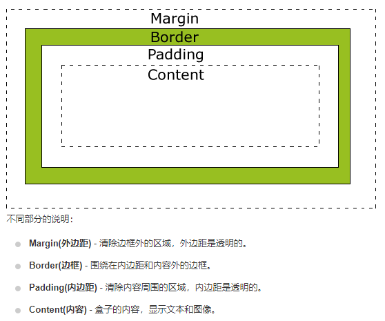

# CSS基础
    HTML5规范推荐把页面外观交给CSS(Cascading Style Sheet, 级联(层叠)样式单)，HTML主要负责标记和语义。
<p style='text-indent:2em'>
<span style="color:red">CSS 是一种专门描述结构文档表现方式的文档</span>，它一般不包含在结构化文档的内部，而以独立的文档方式存在
</p>

# 1 层叠和继承
1. <span style="color:red">层叠</span>：指同一个元素通过不同的方式设置样式表，产生样式重叠（冲突）
2. 层叠<span style="color:red">优先级</span>：
   
    !important > 元素内嵌（行内样式） > 文档内嵌（< style >） > 外部引入（< link >） > 浏览器

3. <span style="color:red">继承</span>：指某一个被嵌套的元素得到它父元素的样式。
4. 继承<span style="color:red">范围</span>：样式的继承只适用于元素的外观（文字，颜色，字体等），而元素在页面的布局样式则不会被继承，加入需强制继承，则,属性:inherit
5. CSS语法规则
<pre>
Selector {
    property1:value1
    property2:value2
    ...
}
</pre>
- <span style="color:red">Selector：选择器</span>，决定该样式对哪些元素起作用。
- <span style="color:red">{p1:v1;p2:v2;...} 属性定义</span>，决定样式。

    css的学习，就是围绕这两个部分开展的，选择器是基础，你要精准的选择文档内标记内容。属性定义部分内容繁多，你要知道什么属性调整元素的什么样式风格。
# 2 选择器
    HTML的标签有标记的作用，标记文档的目的是为了，我们能通过选择器精准定位到文档内容。
## 2.1 选择器分类
- 基本选择器
- 复合选择器
- 伪选择器
## 2.2 基本选择器
1. 通用选择器

<pre>
*{
    p1:v1;
    ...
}
</pre>
2. 元素选择器
<pre>
label {
        p1:v1;
        ...
    }
</pre>
3. id选择器
<pre>
#id {
        p1:v1;
        ...
    }
E#id{
   匹配元素E和id同时选中的元素，求交集
}

4. 类选择器
<pre>
.class {
        p1:v1;
        ...
    }
E.class{
	匹配元素E和class同时选中的元素，求交集    
}
</pre>

5. 属性选择器---[attr = value]

    - E[attr]，只使用属性名，但没有确定任何属性值
    - E[attr="value"]，属性名和值都指定
    - E[attr~="value"]，匹配空格，在以空格隔开的属性值列表中，匹配attr含有value的元素
    - E[attr^="value"]，匹配前缀，属性的开头必须是value
    - E[attr$="value"]，匹配后缀，属性的结尾必须是value
    - E[attr*="value"]，子字符串匹配，属性值中含有value的元素
    - E[attr|="value"]，属性值是value或者以value-开头的值
    - E表示匹配元素的选择符，可以省略
    - 中括号为属性选择器标识，不可或缺
```css
div[class=male]{
    color:blue;/*记住不用写引号*/
}
div[class=female]{
    color:red;
}
```


## 2.3 复合选择器

    将不同的选择器进行组合形成新的匹配
1. 分组选择器
<pre>
label,#id,.class,[attr]{
同时匹配，labal元素选择器选中的，id选择器选中的，，，选择器匹配到的元素之间求并集，而不是交集
}


2. 后代元素选择器
<pre>
fatherLabel offspringLabel{
}
</pre>

3. 子元素选择器
<pre>
fatherLabel > sonLabel{
}
</pre>

4. 兄弟选择器
   
    自行百度

## 2.4 伪选择器

伪选择器是一种特殊的选择器，其用处就是可以针对不同状态、不同行为、不同特性等因素下的元素定义不同的样式，这些因素都是无法通过静态选择器所能匹配的。

伪选择器包括伪类选择器和伪元素选择器。

伪选择器以**冒号作为前缀标识符**，冒号前可以添加选择符，限定伪类的应用范围。冒号后位伪元素和伪类名。冒号前后没有空格，否则将错认为是类选择器。

两种使用方法：

1. E:pseudo{ }：单纯式，E为元素
2. E.class:pseudo{  }：混用式，E为元素，.class为类选择器，类和伪类组成一个混合式的选择器

注意：在有的伪选择器中，会出现双冒号。双冒号是在当前规范中引入的，用于区分伪类和伪元素。但是伪类兼容现存样式，浏览器需要同时支持旧的伪类，

### 2.4.1 伪元素选择器

- :first-letter     只对块元素起作用
- :first-line       只对块元素起作用
- :before   需结合content属性使用
- :after    需结合content属性使用
- :selection  **设置对象被选择时的颜色**

### 2.4.2 伪类选择器

通过文档结构的相互关系来匹配特定的元 素，从而减少文档内的选择器。

分类：
- 结构性伪类：它利用文档结构树实现元素的过滤，通过文档结构的相互关系来匹配特定的元素

  - first-child，last-child、n-last-child()，only-child选择指定选择器的子元素

  - nth-child(n)

    - 可以指定n的值，但不能为负值。例如：nth-child(1)
    - 也可以利用n为变量（它的值变化从0开始），
      - 选择相应的元素：nth-child(2n)——偶数子元素，nth-child(2n+1)——奇数子元素，nth-child(n+5)——从第五个开始匹配、nth-child(-n+5)——匹配前五个

  - nth-of-type(n)，nth-last-of-type(n)，first-of-type，last-of-type，only-of-type

    - 匹配冒号前的元素，

  - empty：匹配元素没有任何内容

    ```css
    /*eg:*/
    /*匹配所有元素下第一个子元素为div的元素*/
    div:nth-child(1){
        background-color:#fff;
    }
    /*匹配所有id为wrapper元素下的第一个子元素为div的元素*/
    #wrapper div:nth-child(1){
        background-color: #f00;
    }
    /*匹配所有元素下的第一个元素类型为p的元素*/
    p:first-of-type{
        background-color:pink;
    }
    /*匹配所有id为wrapper元素下的最后一个元素类型为p的元素*/
    #wrapper p:last-of-type{
        background-color:orange;
    }
    ```

    

- UI状态伪类：CSS3新定义了3中常用的UI状态伪类选择器

  - enabled：匹配指定范围内所有**可用**UI元素
  - disabled：匹配指定范围内所有**不可用**UI元素
  - checked：匹配含有checked属性的且值为checked的元素

- 动态伪类：只有当用户与页面进行交互时有效

  - 锚点伪类：链接中常用的样式，:link、:visited

  - 行为伪类：用户操作伪类，:hover、:activate、:focus

    ```css
    #wrapper div:nth-child(2n):hover{
        background-color:red; 
    }
    ```

    

- 目标伪类

  - target

- 否定伪类

  - not（选择器）匹配参数选择器的元素，将它排除在冒号前面的选择器外。

# 3 颜色与度量单位
## 3.1 color属性
1. 字符 red green blue orange yellow purple
2. #000~#fff 十六进制（rgb），#hhhhhh，

    eg: #f00(red) ，#0f0(green)，#00f(blue)
3. rgb(0~255,0~255,0~255) rgb模型（红绿蓝）
4. rgba(0~255,0~255,0~255,0~1) rgba模型（~+透明度）
5. hsl(0~360,%,%) hsl模型（色相，饱和度，透明度），标准几乎包括了人类视力所能感知的所有颜色
6. hsla(0~360,%,%,0~1)
## 3.2 度量单位
1. 绝对长度 inch/cm/pt/pc    

    1英寸/2.54厘米/72磅（point）/6派卡

2. 相对长度 em/ex/rem/px/%   

    1em等于默认字体的大小

    1ex是默认的英文字母“x”的高度

    1rem是根元素字体大小

    px是显示屏的一个像素

    %百分比相较于父元素的大小而言的

    1vh(1vw) 浏览器页面的宽度(高度)的1/100

## 3.3 使用
    后面只要谈到颜色和长度（大小）均可使用前面的模型或单位。

# 4 文本样式
## 4.1 字体(font)
 font-*

- size 大小
- weight 粗细
- style 倾斜
- variant 大小写
- family 字体

<br/>

## 4.2 文本(text)
- color 颜色
- line-height 行高
- letter-spacing 字符间距
- word-spacing 单词间距

 text-*
- shadow 阴影
- decoration 修饰线
- indent 首行缩进
- overflow 溢出
- align 水平对齐方式

    vertical-align 垂直对齐方式

    direction 文本流向
    
    white-space 处理空白

# 5 元素样式
## 5.1 CSS 元素盒模型(BOX-Model)
——用来设计和布局时使用。

CSS盒模型本质上是一个盒子，封装周围的HTML元素，它包括：边距（内：padding，外：margin），边框（border），填充，和实际内容（content）。

盒模型允许我们在其它元素和周围元素边框之间的空间放置元素。

    盒类型：块级元素（可设长宽，隔离元素，div，p），行内-块元素（可~，无法~，img） 行内元素（无法~，无法~，只能适应内容，span） 
    
    盒类型转换：
    display：block inline-block inline;



1. 尺寸
- width 宽 min-width 最小宽 max-width 最大宽
- height 高 min-height 最小高 max-width 最大高

注：<span style="color:red">设置的是content的宽高</span>

<span style="color:red;font-size:17px">box-sizing</span>

用来设置width和height控制的是那些区域的宽高

box-sizing:content-box border-box; 内容区宽高&emsp;边框+padding+content宽高，默认值content-box

<span style="color:red;font-size:17px">calc函数</span>

calc(一个+-*/表达式);

通常计算calc( 50% - 20px );


2. padding

    元素的内边距

 - padding-*  top right bottom left；顺时针

 - padding：*; 四距相同

- padding: * *; 上下，左右；

- padding：* * *; 上，左右，下

- padding：* * * *; 上右下左

注：如果用%当尺寸单位时，它的%是相对于横向的宽度的尺寸。

3. margin 

    元素的外边距

- margin-*  top right bottom left；顺时针

4. border

    元素的边框

- border-* top right bottom left-*  width style color

- border-radius 圆角边框

5. content

当内容过长过宽时，我们会想到为元素加滚动条或是裁剪

- overflow-y  纵向滚动条
- overflow-x  横线滚动条

属性值

hidden scroll auto 隐藏 滚动 超出时滚动。

还有图片边框，渐变边框，自行研究。

滚动条的宽度是包含在内容区的长度里面（内容区的宽度包含了滚动条的宽度）

### [布局中的几个长度](<https://blog.csdn.net/qq_35430000/article/details/80277587>)

**scrollHeight offsetHeight clientHeight scrollTop offsetTop**，height与之对应的还有宽，top与之对应的还有left。

1. clientHeight：包括内容区和padding（padding感觉也不是很准，可见部分的大小，大致可以看做是content多一点的高度），不包括border、水平滚动条、margin的元素的高度。client代理，有代表的意思。只有实质的内容才有代表性。
2. offsetHeight：包括padding、border、水平滚动条，不包括margin。单位px，只读。offset有平板印刷的意思，指元素在页面的印刷高度。
3. scrollHeight：当没有滚动条的时候，scrollHeight 等于 clientHeight 。当有滚动条的时候，就等于clientHeight + 最大可滚动的内容高度scrollTop （包括当前可见和当前不可见部分的元素的高度）。
4. scrollTop：代表在有滚动条时，滚动条向下滚动的距离也就是元素顶部被遮住部分的高度。在没有滚动条时scrollTop==0恒成立。单位px，可读可写。
5. offsetTop: 当前元素顶部(border的外边界）距离最近使用（position属性，如果没有position属性，那就以body来定位）父元素顶部（border的内边界）的距离，页面印刷距离(能直接截图的距离）。如果当前元素的所有父元素（到有position的父元素为止），有滚动还需要加上所有父元素的滚动距离scrollTop。单位px，只读元素。

大多数浏览器通过队列化修改并批量执行来优化重排过程

对DOM的操作，会放入渲染树的变化排队和刷新，如果设置页面dom的长宽等信息，这些多个dom操作就会放入队列，但不会立即刷新。

如果此时我们通过dom查询上面布局中的几个长度，那么就会立即执行队列，刷新页面，**尽量不要在布局信息改变时做查询**。不然会导致多次发生浏览器重排重绘。

## 5.2 元素背景(background)

background-* color size image repeat attachment position 颜色 大小 图片 平铺方式 移动 位置

- background-size:* *;宽 高 可使用%，auto自适应
- background-image:url(path)

渐变背景

- line-gradient 线性渐变

    使用：background:liner-gradient(angle,color+position列表);

    0deg 12点钟方向，从上到下

    颜色+位置，eg：rgba(32,189,255,1) 0%；

    linear-gradient(90deg,rgba(32,189,255,1) 0%,rgba(165,254,203,1) 100%);

- radial-gradient 径向渐变

## 5.3 元素定位(position)

position: fixed absolute relative static;
- fixed 相对于窗口定位
- absolute 相对于父元素定位
- relative 相对于正常位置定位，正常位置做保留
- static 默认

z-index：num
    
    指定元素的漂浮层的层序，值越大，漂浮层越靠上。

top right bottom right

    坐标定位，一般设置两个就可以定位元素
## 5.4 元素透明度(opacity)
    opacity:0~1; 透明~不透明
## 5.5 滤镜（filter）
    filter属性主要用于对元素的视觉效果做简单处理，它的属性值是一个个函数计算出的值。
    主要有以下几个函数：
- blur( n px ) 模糊滤镜 模糊半径n越大，越模糊
- brightness( n % ) 高亮滤镜  暗淡 < 100%原样 < 高亮
- contrast( n % ) 对比度滤镜  对比减弱 < 100%原样 < 对比增强
- saturate( n % ) 饱和度滤镜   色彩灰暗 < 100%原样 < 色彩鲜明
- grayscale( n % ) 灰度滤镜  0%原样 < 100%黑白
- invert( n % ) 色彩翻转  0%原样 < 100%反相
- opacity( n % )  透明度滤镜 0%透明 < 100%原样
- sepia( n % )  褐色滤镜(老照片发黄) 0%原样 < 100%完全褐色
# 6 布局

    这一部分相当之重要，前面CSS 的学习只告诉了你，文本怎么调样式，元素怎么调样式，却没有告诉你，这个元素（标签或盒模型）应该放在什么样的位置，会让整个页面变得更加优美好看。
    
    布局是用户感官体验的基础因素。
## 6.1 多栏布局（columns）
    多栏布局经常出现在报纸的布局和文本内容布局当中，这个多栏可以保证内容分栏而连续。
- columns : width count ; 栏宽 栏数

columns-* width count rule gap fill span 栏宽 栏数 分隔条 栏隙 栏高 元素横跨列数

## 6.2 [流体布局（一维布局）](https://www.runoob.com/w3cnote/flex-grammar.html)

    流体布局是当下最为流行的布局方式，在项目实践中，也的确感受到了，这种布局带来的好处。上面提供的参考网页图文并茂，相信看过以后会有顿悟。
    
    流体布局是容器元素按规律排布子元素的布局方式，通常有从左到右，从上到下，从右到左，从下到上的方式排布子元素，就像水流一样，故称为流体布局

容器属性
- display:flex;

    定义容器内的布局为流体布局，后面的属性才会发挥作用。

- flex-direction: row | row-reverse | column | column-reverse; 

    默认row（从左到右)&emsp;从右到左&emsp;从上到下&emsp;从下到上。

    确立主轴方向，前二者确立主轴为水平方向，后二者为竖直方向。

    交叉轴方向与主轴方向相互垂直。

- flex-wrap : nowrap | wrap | wrap-reverse;

    确立子元素换行的方式

- justify-content:flex-start | flex-end | center | space-between | space-around;

    左（上）对齐&emsp;右（下）对齐&emsp; 居中对齐&emsp; 两端对齐&emsp;间距相等对齐

    确立子元素在主轴上的对齐方式

- align-items: flex-start | flex-end | center | baseline | stretch;

    确立子元素在交叉轴上的对齐方式

- align-content：stretch|center|flex-start|flex-end|space-between|space-around|initial|inherit;

    就如同名字content一样，把容器内的所有子元素当成一个content整体，来设置它的对齐方式


子元素属性

- align-self 覆盖align-items属性，定义自身的对齐方式

- order 排列顺序。数越小，越靠前。

- flex-grow 子元素放大比例，剩余长度除以总的flex-grow数得到分配的基本单位长度，然后再按照所flex-grow的大小*基本单位长度进行分配

  - 如果所有项目的flex-grow属性都为1，则它们将等分剩余空间（如果有的话）。如果一个项目的flex-grow属性为2，其他项目都为1，则前者占据的剩余空间将比其他项多一倍。

- flex-shrink 缩小比例

  - 如果所有项目的flex-shrink属性都为1，当空间不足时，都将等比例缩小。如果一个项目的flex-shrink属性为0，其他项目都为1，则空间不足时，前者不缩小。

    负值对该属性无效。

- flex-basis 在分配多余空间之前，项目占据的主轴空间。未缩放之前的长度。

- flex： none | [ <'flex-grow'> <'flex-shrink'>? || <'flex-basis'> ]，默认值为0 1 auto。建议优先使用这个属性

## 6.3 响应式布局
    前端是面向用户的一端，面向用户的一端是多变的一端。由于显示媒体的多样性，我们需要根据媒体具体的属性，对我们的样式做相应的修改。

### 6.3.1 media query 语法

<pre>
@media not|only 媒体类型 [and 媒体属性]{
    selector{
        p1:v1;
        p2:v2;
    }
    ...
}
</pre>
- not 用来排除某种特定媒体类型
- only 用来指定特定的媒体类型
- and 用来匹配媒体属性

1. 媒体类型
- screen 计算机屏幕
- tv 电视机
- all 所有媒体
- 等等
2. 媒体属性
- width 浏览器窗口的宽度
- height ~高度
- aspect-ratio ~的宽高比
- device-width 媒体设备的宽度
- device-height ~的高度
- device-aspect-ratio ~的宽高比

    都支持min/max前缀

使用示例
```css
.sreenWrapper{
  width:800px;
  height:500px;
  border:1px solid #000;
}
@media screen and (max-width:800px){
  .sreenWrapper{
    width:400px;
    height: 500px;
  }
}
```
### 6.3.2 [移动端适配](https://blog.csdn.net/qq_38774001/article/details/90138123)-视觉窗口viewport

    viewport是移动端特有，这是一个用于承载网页的虚拟区域。
    viewport的功能：
 content="" 使用
1. width 可以设置宽度 (device-width 当前设备的宽度)
2. height 可以设置高度
3. initial-scale 可以设置默认的缩放比例
4. user-scalable 可以设置是否允许用户自行缩放
5. maximum-scale 可以设置最大缩放比例
6. minimum-scale 可以设置最小缩放比例

默认适配
1. width=device-width 宽度一致比例是1.0
2. initial-scale=1.0 宽度一致比例是1.0
3. user-scalable=no 不允许用户自行缩放 （yes，no 1,0）
使用示例

```html
<head>
    <meta name="viewport" content="width=device-width,initial-scale=1.0,user-scalable=0">
</head>
```
## 6.4 [网格布局（二维布局）](<http://www.ruanyifeng.com/blog/2019/03/grid-layout-tutorial.html>)

网格布局（Grid）是最强大的 CSS 布局方案。

它将网页划分成一个个网格，可以任意组合不同的网格，做出各种各样的布局。

```html
<!DOCTYPE html>
<html>
    <head>
        <meta charset="utf-8">
        <title>网格布局</title>
    </head>
    <body>
       	<div id="wrapper">
            <div>1</div>
            <div>2</div>
            <div>3</div>
            <div>4</div>
            <div>5</div>
            <div>6</div>
            <div>7</div>
            <div>8</div>
            <div>9</div>
        </div>
        <style>
        #wrapper div:nth-child(2n){
            background-color:aquamarine;
        }
         #wrapper div:nth-child(2n-1){
             background-color:blue;
             color:#fff;
         }
         /*1.容器属性*/
        #wrapper{
                width:500px;
                height:500px;
                background-color:peru;
                /*grid 块元素，inline-grid 行内元素*/
                display:grid;
                /*例子以3x3的网格为例*/
                /* 定义列 */
                grid-template-columns:50px 50px 50px;/* 列宽 */
                grid-column-gap:10px;/*列间距*/
                    /* 
                    33% 33% 33%;
                    repeat(number of columns/rows, the column width we want);
                    eg:
                    repeat(3,20px);
                    repeat(auto-fill, 100px);
                    特殊的行列数：auto-fill：尽可能容纳更多的行或列。
                    特殊长度单位：
                    1.auto：
                    2.fr：剩余长度按总共的fr均分，然后按具体fr数占据长度
                    3.minmax(minl,maxl)：不小于minl，不大于maxl
                    */
                    
                /* 定义行 */
                grid-template-rows:50px 50px 50px;
                grid-row-gap:10px;

                /*定义区域*/
                grid-template-areas:"a a b"
                                    "c d d"
                                    "f f f";
                
                /* 单元格内部的内容 */
                place-items:stretch;
                /*place-items:justify-items，align-items*/
                /*属性值：start | end | center | stretch*/
                /*默认值：strech*/

                /* 容器content内容整体的对齐方式 */
                place-content:center;
                /* place-content:justify-content，align-content*/
                /*属性值：start | end | center | stretch | space-around | space-between | space-evenly;*/
            
                /*
                    grid-auto-columns 属性，
                    grid-auto-rows 属性
                */
        }
         /* 2.定义单元格属性 */
         #wrapper div:nth-child(1){
                /* 、
                定义项目位置（单元格位置）
                项目的位置是可以指定的，具体方法就是指定项目的四个边框，分别定位在哪根网格线。
                 */
                
                /* grid-column:1/3;
                grid-row:1/3; */
                /* 
                grid-row: <start-line> / <end-line>;
                grid-column: grid-column-start / grid-column-end;

                grid-column:1 / span 2;
                span num 跨越几个单元格的意思

                grid-column-start:1;
                grid-column-end:3; 

                */
                grid-area:d;/*区域名*/
                /* grid-area: <row-start> / <column-start> / <row-end> / <column-end>; */

                /* place-self:<align-self> <justify-self>; */
         
            }
        </style>
    </body>
</html>
```


# 7 变形和动画

## 7.1 变形

transform属性可以旋转、缩放、倾斜和移动元素

```css
transform:none|[rotate()|scale()|translate()|skew()|matrix()]
```

<h3>2D变换

1. **rotate(n deg)**：旋转，

   - 360deg为一圈，正数顺时针，负数逆时针

2. **scale(num[,num])**：缩放

   - num取值可以为正数、负数、小数，
   - num > 1，放大元素，2为放大两倍
   - 0<num<1，缩小元素，0.5为缩小一半
   - num<0，元素先按原点反转对称（以原点为基准，先缩小为一个点，然后按原点对称）后，再按绝对值大小缩放元素
   - 一个值时，x和y放大缩小一致，两个值，x和y分别缩放。
   - scaleX()，scaleY()

3. **translate(offx[,offy])**：移动

   - 长度单位：px
   - 默认为0

4. [**skew(nx deg [,ny deg])**](<http://www.lvyestudy.com/css3/css3_9.5.aspx>)：倾斜

   - 变形并旋转元素，默认为0
   - skewX()、skewY()
   - skewX()方法会保持高度，沿着X轴倾斜；
   - skewY()方法会保持宽度，沿着Y轴倾斜；
   - skew(x,y)方法会先按照skewX()方法倾斜，然后按照skewY()方法倾斜；

5. **matrix(n1,n2,n3,n4,n5,n6)**：矩阵函数

   2D的转换是由一个3*3的矩阵表示的，前两行代表转换的值，分别是 a  b c d e f ，要注意是竖着排的，第一行代表的是X轴变化，第二行代表的是Y轴的变化，第三行代表的是Z轴的变化，2D不涉及到Z轴，这里使用 0 0 1

   - 

6. **transform-origin**：定义变换原点，默认为对象的中心点（50%，50%）

   - 百分比，em，px，left，right，center，top，middle，bottom

   

<h3>3D变换

1. **translate3d(tx,ty,tz)**：三维空间移动

2. translateZ(t)：

   - t>0时，元素垂直于屏幕向我们靠近，视觉上要求：元素变大
   - t<0时，元素垂直于屏幕疏远我们，视觉上要求：元素变小

3. scale3d(sx,sy,sz)：

   - 单独使用没有任何效果，必须配合其他的变形函数
   - 

4. rotate3d(x,y,z,a)：x，y，z为0~1的值，默认为0，旋转度数为a*n

   - rotateX(a deg)：沿x轴转动，正为顺时针，负为逆时针。
   - rotateY(a deg)：沿y轴转动，正为顺时针，负为逆时针。
   - rotateZ(a deg)：沿z轴转动，正为顺时针，负为逆时针。

   

## 7.2 过渡样式

过渡可以与变形同时使用。

transition：  transition-property     transition-duration    transition-timing-function    transition-delay [,可以有多个属性，设置多个不同属性的过渡]

1. transition-property：none  | all |  css-property-list，采用过渡的css属性
   - none：默认，css属性不使用过渡
   - all：选中元素的所有属性都使用过渡
   - css：css属性列表，逗号隔开，这些属性使用过渡
2. transition-duration：n s，过渡时间
3. transition-delay：n s/ms，过渡延迟
   - n>0，过渡动作延迟
   - n<0，过渡动作提前，从n的绝对值时间点开始过渡
4. transition-timing-function：ease   |  linear   |   ease-in  |   ease-out  |   ease-in-out  | cubic-bezier，过渡的速度分配
5. 

```html
<DOCTYPE html>
<html>
	<head>
        <meta charset="utf-8">
        <title>过渡与变形</title>
    </head>    
  	<body>
    	<div id="wrapper">
            
            <div>1</div>
            <div>2</div>
            <div>3</div>
            <div>4</div>
            <div>5</div>
            <div>6</div>
            <div>7</div>
            <div>8</div>
            <div>9</div>
        
        </div>
        <style>
        #wrapper{
            display:grid;
            grid-template-columns:50px 50px 50px;/* 列宽 */
            grid-column-gap:10px;/*列间距*/
            grid-template-rows:50px 50px 50px;
            grid-row-gap:10px;
         }
         #wrapper div:nth-child(2n){
                background-color:aquamarine;
                transition: transform 1s;
            }
           #wrapper div:nth-child(2n):hover{
                background-color:red;
                transform:rotate(90deg);
            }
            #wrapper div:nth-child(2n-1){
                background-color:blue;
                /* transition: transform,background-color 1s; transform-property采用属性列表的时候，不能在transform这里使用*/
                transition-property: transform,background-color;
                transition-duration: 1s;
                color:#fff;
            }
            #wrapper div:nth-child(2n-1):hover{
                background-color:green;
                transform:rotate(-90deg);
            }
        </style>
    </body>
</html>
```

# 8 特殊技巧

1. mix-blend-mode:multiply;把所有白色的部分转换成半透明的 png。

# [Less(Leaner Style Sheets ) ](https://less.bootcss.com/#-)

# 1 基本语法
## 1.1 变量(Variables)
```less
@width: 10px;
@height: @width + 10px;

#header {
  width: @width; //10px
  height: @height; //20px
}
```

## 1.2 运算(Operations)
    算术运算符 +、-、*、/ 可以对任何数字、颜色或变量进行运算。
    单位换算：以最左侧有单位的操作数为准
    单位无效转换：px->cm or rad->%

```less
@conversion-2: 2 - 3cm - 5mm; //  -1.5cm
width: calc(50% + (@var - 20px));//  calc 可进行复杂的数学运算，结合运算等
```

## 1.3 作用域(Scope)
    Less 中的作用域与 CSS 中的作用域非常类似。首先在本地查找变量和混合（mixins），如果找不到，则从“父”级作用域继承。混合（mixin）和变量的定义不必在引用之前事先定义。

## 1.4 嵌套(Nesting)
    包含选择器通过HTML结构文档的方式进行选择
    ' & '为当前选择器的父级

```less
#header {
  color: black;
  .navigation {
    font-size: 12px;
  }
  .logo {
    width: 300px;
  }
  &:after {

  }
}
```

## 1.5 混合(Mixins)
    混合（Mixin）是一种将一组属性从一个规则集包含（或混入）到另一个规则集的方法————跨域使用局部样式。

```less
#note{
    color:red;
    .bordered {
        border-top: dotted 1px black;
        border-bottom: solid 2px black;
    }
}
#menu{
    color:orange;
     .bordered();
}
```

## 1.6 命名空间和访问符
   希望将一些混合（mixins）和变量置于 #bundle 之下， 对混合进行分组，方便重用或分发
```less
#bundle() {     
  .button {             //混合1
    display: block;
    border: 1px solid black;
    background-color: grey;
    &:hover {
      background-color: white;
    }
  }
  .tab { ... }          //混合2
  .citation { ... }     //混合3
}

#header a {
  color: orange;
  #bundle.button();  // 混合1，还可以书写为 #bundle > .button 形式
}
```

## 1.7 映射(Maps)
    将混合（mixins）和规则集（rulesets）作为一组值的映射（map）使用。

```less
#colors() {
  primary: blue;
  secondary: green;
}

.button {
  color: #colors[primary];   //blue
  border: 1px solid #colors[secondary];
}
```

## 1.7 [函数(Functions)](https://less.bootcss.com/functions/)
## 1.8 导入(importing)
    “导入”的工作方式和你预期的一样。你可以导入一个 .less 文件，此文件中的所有变量就可以全部使用了。如果导入的文件是 .less 扩展名，则可以将扩展名省略掉。

```less
@import "library"; // library.less
@import "typo.css";
```

# [Scss(Sassy CSS)](https://www.sass.hk/guide/)

# 1 基本语法

## 1.1 变量

`scss`使用`$`符号来标识变量

一般情况下，你反复声明一个变量，只有最后一处声明有效且它会覆盖前边的值。

`默认变量值：

@import`导入的`sass`库文件，你可能希望导入者可以定制修改`sass`库文件中的某些值。使用`sass`的`!default`标签可以实现这个目的。它很像`css`属性中`!important`标签的对立面，不同的是`!default`用于变量，含义是：如果这个变量被声明赋值了，那就用它声明的值，否则就用这个默认值。

```scss
$highlight-color: #F90;
$highlight-border: 1px solid $highlight-color;

$link-color: blue;
$link-color: red;

$border-width:3px;
$border-width:2px !default;

.selected {
  border: $highlight-border;
  a {
    color:$link-color;/*后者覆盖前者*/
    }
  div{
   border:$border-width solid #f00;/*使用声明的$border-width,而不使用它的默认变量值*/
  }
}
```

## 1.2 嵌套

### **父选择器的标识符 "&"**

```scss
#content {
  article {
    h1 { color: #333 }
    p { margin-bottom: 1.4em }
    a {
  		color: blue;
  		&:hover { color: red }
      }
  }
  
  aside { background-color: #EEE }
}

/* 编译后 */
#content article h1 { color: #333 }
#content article p { margin-bottom: 1.4em }
#content article a { color: blue }
#content article a:hover { color: red }
#content aside { background-color: #EEE }

```

### **子和同层组合选择器：>、+ 和 ~ **

```scss
article {
  ~ article { border-top: 1px dashed #ccc }
  > section { background: #eee }
  nav + & { margin-top: 0 }
}

/*编译后*/
/*同层元素后兄弟选择器*/
article ~ article { border-top: 1px dashed #ccc }
/*子元素选择器*/
article > section { background: #eee }
/*同层元素后紧相邻兄弟选择器*/
nav + article { margin-top: 0 }
/*后代选择器*/
article section { margin: 5px }
```

### 嵌套属性

把属性名从中划线-的地方断开，在根属性后边添加一个**冒号:**，紧跟一个`{ }`块，把子属性部分写在这个`{ }`块中。还可以嵌套例外属性

```scss
nav {
  border: 1px solid #ccc {
  left: 0px;
  right: 0px;
  }
}
```

## 1.3 混合器

如果你的整个网站中有几处小小的样式类似（例如一致的颜色和字体），那么使用变量来统一处理这种情况是非常不错的选择。但是当你的样式变得越来越复杂，你需要大段大段的重用样式的代码，独立的变量就没办法应付这种情况了。你可以通过`sass`的混合器实现大段样式的重用。

```scss
@mixin no-bullets {
  list-style: none;
  li {
    list-style-image: none;
    list-style-type: none;
    margin-left: 0px;
  }
}
ul.plain {
  color: #444;
  @include no-bullets;
}

/*编译后*/
ul.plain {
  color: #444;
  list-style: none;
}
ul.plain li {
  list-style-image: none;
  list-style-type: none;
  margin-left: 0px;
}
```

### 混合器传参

也可以设置默认参数值

```scss
$otherColor:orange
@mixin link-colors($normal, $hover:yellow, $visited:$otherColor) {
  color: $normal;
  &:hover { color: $hover; }
  &:visited { color: $visited; }
}
a {
  @include link-colors(blue, red, green);
}

/*编译后*/
a { color: blue; }
a:hover { color: red; }
a:visited { color: green; }
```

## 1.4 继承

使用`sass`的时候，最后一个减少重复的主要特性就是选择器继承。

选择器继承是说一个选择器可以继承为另一个选择器定义的所有样式。这个通过`@extend`语法实现

```scss
//通过选择器继承 继承样式
.error {
  border: 1px solid red;
  background-color: #fdd;
}
.seriousError {
  @extend .error;
  border-width: 3px;
}
//.seriousError从.error继承样式
.error a{  //应用到.seriousError a
  color: red;
  font-weight: 100;
}
h1.error { //应用到hl.seriousError
  font-size: 1.2rem;
}
```

`seriousError`将会继承样式表中任何位置处为`.error`定义的所有样式。任何跟`.error`有关的组合选择器样式也会被`.seriousError`以组合选择器的形式继承。

## 注释

```scss
body {
  color: #333; // 静默注释：这种注释内容不会出现在生成的css文件中
  padding: 0; /* 这种注释内容会出现在生成的css文件中 */
}
```

