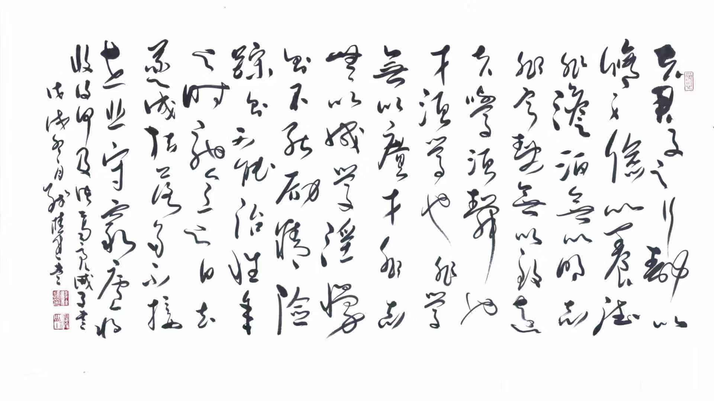

# HTML 基础
# 1 HTML是什么？

    HTML 是用来描述网页的一种语言。

- HTML 指的是超文本标记语言 (Hyper Text Markup Language)
- HTML 不是一种编程语言，而是一种<span style="color:red;">标记语言</span> (markup language)
- 标记语言是一套<span style="color:red;">标记标签</span> (markup tag)
- HTML 使用标记<span style="color:red;">标签来描述网页</span>

## 1.1 HTML标签(元素)

    HTML 标记标签通常被称为 HTML 标签 (HTML tag)。

- HTML 标签是由尖括号包围的关键词，比如 ```<html>```
- HTML 标签通常是<span style="color:red;">成对</span>出现的（eg： ```开始标签<b> 和 结束标签</b>```），也有少数非成对存在（eg：``````。
- HTML 标签不区分大小写，推荐<span style="color:red;">小写</span>形式

<span style="color:red;font-size:18px">标签属性</span>

HTML 标签或多或少都存在一些属性，以 属性名="属性值" 形式写在开始标签上，

eg：```<div style="width:200px;height:100px;">我是一个宽200px，高100px的容器</div>```。效果如下：
<div style="width:200px;height:100px;border:2px solid #f00">我是一个宽200px，高100px的容器</div>

HTML5 <span style='color:red'>重要的通用属性</span>

- id class style 
  
        id和class通常用于CSS和JavaScript的DOM节点选中，选中后可以设置样式等逻辑操作。
        
        style用来设置标签的样式，例如width，height，border，background等。
        
        CSS中经常会用到这三个属性，
- dir

        设置元素中内容的排列方向，有两个值，ltr和rtl（左对齐和右对齐）

- title 

        用于为HTML元素指定额外信息。
```html
<div title="关关雎鸠，在河之洲。窈窕淑女，君子好逑。">关关雎鸠，在河...</div>
```


## 1.2 HTML文档
    HTML文档描述网页，HTML文档=网页。HTML文档是一份结构化文档，HTML 文档包含 HTML 标签和纯文本。
# 2 标签元素
## 2.1 标签分类

1. 基本标签，
2. 文本标签，使文本内容呈现出特定的效果
3. 嵌入标签，用于放置网页，图片，音频，视频等特殊内容
4. 结构标签，提供文档的结构标识
5. 表单标签，用于录入用户信息


## 2.2 基本标签

```html
<html>
    <head>
        <meta />
        <title>
            HTML文档
        </title>
    </head>
    <body>
        <h1>
            第一章 简介
        </h1>
        <hr/>
        <div>HTML<br/>是一份<span>结构文档</span></div>
        <div>HTML 文档包含 HTML 标签和纯文本。</div>
    </body> 
</html>
```


- hr 水平线
- div 容器+换行，用作标记和容器
- span 容器+不换行，用作标记和容器
- br 文本换行

antd pro src/pages/document.ejs中可以看到类似的代码

## 2.3 文本标签
    给文本加不同的效果，和word的开始中的选项相似
- h1~h6 标题，字号从大到小
- b 加粗
- small 小体
- i || em  斜体
- s || del 删除线
- u || ins 下划线(underline)
- sup / sub 上下标(superscript/subcript)
- q 双引号
- cite || blockquote 引用
- mark 凸显
- p 段落 

## 2.4 a标签

在实际项目中，a标签非常之实用，
- 跳转网页资源——超链接
- 页面内容间跳转——锚点
- 下载内容

a的属性

1. href 链接的资源（URL）,有相对路径和绝对路径之分

    相对路径——是相对当前页面的路径而言,
    
    “./”——“./warrningyou.png”和“warrningyou.png” 表示在当前文件目录下的warrningyou.png文件

    “../”——父文件夹下，依次类推，“../../”——爷......

    绝对路径——通常是从盘符开始的路径，当指绝对路径是，href的值为<span style='color:red'>URL(Uniform Resource Locator,统一资源定位器)</span>，
    
    URL用于对互联网上的文档进行寻址。遵守如下的语法规范：

    <span style="font-size:20px;color:red">scheme://host.domain:port/path/filename</span>

    <span style="color:red">服务类型：//主机 . 域名：端口/路径/文档名</span>

    - scheme 因特尔服务的类型，最流行的类型是http
    - host 此网域主机，如被省略默认主机是www
    - domain 因特网域名，
    - port 主机的端口号，通常被省略，http服务默认端口是80。
    - path 远程服务器上的路径，省略时，定位到网域的根目录。
    - file 文档名


当下较为流行的scheme以及对应的资源如下

 scheme | 对应资源 | 
:------- | :---------------- | 
file  | 访问本地磁盘的文件 | 
ftp  | 访问远程FTP服务器的文件|
http   | 访问www服务器上的文件|
news|访问新闻组上的文件|
telnet|访问Telnet链接|
gopher|访问远程Gopher服务器上的文件


2. target 装载资源位置。
   
     _self，_blank，_top，_parent分别为自身，新窗口，顶层框架，父框架来加载新资源。
3. download 用于下载，href链接所链接的资源，该属性的属性值指定了用户下载资源时的默认文件名。

    <span style="color:red;">["data"类型的Url格式](https://www.cnblogs.com/wgw8299/archive/2011/02/06/1949453.html)</span>，
    是在RFC2397中 提出的，目的对于一些“小”的数据，可以在网页中直接嵌入，而不是从外部文件载入。例如对于img这个Tag，哪怕这个图片非常非常的小，小到只有一个 点，也是要从另外一个外部的图片文件例如gif文件中读入的，如果浏览器实现了data类型的Url格式，这个文件就可以直接从页面文件内部读入了。
    - 在实际的项目中，有些<span style="color:red;">需要下载的文件需要前台自行生成</span>，比如说一些，由后台传来的数据，需要由前台整理成文本文档，供用户下载。这时就需要用到href的data服务类型语法， 
    <pre>
    data:[mediatype][";encodetype"][",dataString"]
    mediatype->[type/subtype]*(";parameter")，eg:text/txt，text/html，image/png等
    encodetype->dataString的编码方式，eg：charset=utf-8，base64等
    </pre>

    <a href='data:text/txt;charset=utf-8,%E8%AF%AB%E5%AD%90%E4%B9%A6-%E8%AF%B8%E8%91%9B%E4%BA%AE%0A%E5%A4%AB%E5%90%9B%E5%AD%90%E4%B9%8B%E8%A1%8C%EF%BC%8C%E9%9D%99%E4%BB%A5%E4%BF%AE%E8%BA%AB%EF%BC%8C%E4%BF%AD%E4%BB%A5%E5%85%BB%E5%BE%B7%E3%80%82%E9%9D%9E%E6%B7%A1%E6%B3%8A%E6%97%A0%E4%BB%A5%E6%98%8E%E5%BF%97%EF%BC%8C%E9%9D%9E%E5%AE%81%E9%9D%99%E6%97%A0%E4%BB%A5%E8%87%B4%E8%BF%9C%E3%80%82%E5%A4%AB%E5%AD%A6%E9%A1%BB%E9%9D%99%E4%B9%9F%EF%BC%8C%E6%89%8D%E9%A1%BB%E5%AD%A6%E4%B9%9F%EF%BC%8C%E9%9D%9E%E5%AD%A6%E6%97%A0%E4%BB%A5%E5%B9%BF%E6%89%8D%EF%BC%8C%E9%9D%9E%E5%BF%97%E6%97%A0%E4%BB%A5%E6%88%90%E5%AD%A6%E3%80%82%E6%B7%AB%E6%85%A2%E5%88%99%E4%B8%8D%E8%83%BD%E5%8A%B1%E7%B2%BE%EF%BC%8C%E9%99%A9%E8%BA%81%E5%88%99%E4%B8%8D%E8%83%BD%E6%B2%BB%E6%80%A7%E3%80%82%E5%B9%B4%E4%B8%8E%E6%97%B6%E9%A9%B0%EF%BC%8C%E6%84%8F%E4%B8%8E%E6%97%A5%E5%8E%BB%EF%BC%8C%E9%81%82%E6%88%90%E6%9E%AF%E8%90%BD%EF%BC%8C%E5%A4%9A%E4%B8%8D%E6%8E%A5%E4%B8%96%EF%BC%8C%E6%82%B2%E5%AE%88%E7%A9%B7%E5%BA%90%EF%BC%8C%E5%B0%86%E5%A4%8D%E4%BD%95%E5%8F%8A%EF%BC%81' download="诫子书.txt">诫子书文档下载</a>

    dataString通过url的encodeURI编码。可以下下来看一下
4. type 指定被连接文档的MIME(Multipurpose Internet Mail Extensions，多用途互联网邮件扩展)类型，当该扩展名文件被访问的时候，浏览器会自动使用指定应用程序来打开。

5. 锚点用法
```html
<a href="#1">第一章</a>
<a href="#2">第二章</a>
<a name="1">1</a>
<a name="2">2</a>
```
## 2.5 嵌入标签
- img 图片 property：src alt width height 指定其一，另成比例变化



- iframe 网页 property: src frameborder height width name scrolling

<iframe src="//www.baidu.com" scrolling='yes'> </iframe> 

- audio 音频 property：src autoplay loop height width preload [示例](https://www.w3school.com.cn/tiy/t.asp?f=html5_audio)

- video 视频 property：同样 [示例](https://www.w3school.com.cn/tiy/t.asp?f=html5_video)

- source 音视频多格式支持

- map 创建分区响应图 [示例](https://www.w3school.com.cn/tiy/t.asp?f=html_areamap)

- progress 显示进度 
 <progress/>
- meter 进度显示范围
<meter value="3" min="0" max="10">3/10</meter>
## 2.6 表单标签
    用于供用户填写信息或上传文件的标签组。
- form 
- input 
- label
- button 
- select  option
- textarea

    在实际的项目中已经没有在用到这么low的form表单了，大部分的UI框架都做了封装，看看别人的api文档，直接采用就ok了


## 2.7 结构标签
    划分文档的不同结构部分，为让文档结构更加清晰，但无任何效果，只做结构划分。 
- header 文档头部
- main 文档主体
- section 部分
- footer 文档尾部
- aside 侧边栏
- nav 导航
- article 内容

## 2.8 分组元素

- pre 文本原样显示（保留空格，换行符等）
- ul 无序列表分组
- ol 有序列表分组 property：start reversed type 
- li 列表子项
- dl 定义列表 
- dt 定义子项
- dd 描述定义项

## 2.9 表格元素
    项目中很少用，看看就行了
- table 表格 
- tr 记录行
- td 单元格
- th 加粗文字单元格
- thead 表头
- tbody 表体
- tfoot 表尾
```html
<html>
    <head>
        <style type="text/css">
            thead {color:green}
            tbody {color:blue;height:50px}
            tfoot {color:red}
        </style>
    </head>
    <body>
        <table border="1">
            <thead>
                <tr>
                    <th>Month</th>
                    <th>Savings</th>
                </tr>
            </thead>
            <tbody>
                <tr>
                    <td>January</td>
                    <td>$100</td>
                </tr>
                <tr>
                    <td>February</td>
                    <td>$80</td>
                </tr>
            </tbody>
            <tfoot>
                <tr>
                    <td>Sum</td>
                    <td>$180</td>
                </tr>
            </tfoot>
        </table>
    </body>
</html>
```
# 3. [特殊字符](http://114.xixik.com/character/)
HTML文档是由标签和字符组成，有一些特殊字符通过键盘无法输入，需要用到转义字符。
常用的转义字符

- \&nbsp; 半角空格
- \&emsp; 全角空格
- \\n 换行

# 4. 绘图-canvas
    在HTML5之前，前端开发者无法在HTML页面上动态的绘制图片。然而现在，我们甚至可以在页面开发动画和游戏，全是基于canvas这个画布标签，这个标签仅仅用作绘制的图样的容器，绘制工具还是要依靠其他插件来完成。这个在接下来的BIM项目可能会用到，这里只做引入介绍，使用我现在都还没碰触过，希望大家能完善此模块。

# 5 元素拖放

## 5.1 事件

| 事件               | 事件监听    | 触发时机                                                     |
| ------------------ | ----------- | ------------------------------------------------------------ |
| 拖拽元素支持的事件 |             |                                                              |
| drag               | ondrag      | 当拖动元素或选中的文本时触发。                               |
| dragstart          | ondragstart | 当用户开始拖动一个元素或选中的文本时触发（见开始拖动操作）。 |
| dragleave          | ondragleave | 当拖动元素或选中的文本离开一个可释放目标时触发。             |
| dragend            | ondragend   | 当拖拽操作结束时触发 (比如松开鼠标按键或敲“Esc”键). (见结束拖拽) |
| 目标容器支持的事件 |             |                                                              |
| dragenter          | ondragenter | 当拖动元素或选中的文本到一个可释放目标时触发（见 指定释放目标）。 |
| dragover           | ondragover  | 当元素或选中的文本被拖到一个可释放目标上时触发（每100毫秒触发一次）。 |
| dragexit           | ondragexit  | 当元素变得不再是拖动操作的选中目标时触发。                   |
| drop               | ondrop      | 当元素或选中的文本在可释放目标上被释放时触发（见执行释放）。 |

## 5.2 接口

HTML 的拖拽接口有DragEvent、 DataTransfer、DataTransferItem、DataTransferItemList。

### DragEvent

DragEvent接口有一个构造函数和一个 dataTransfer 属性，dataTransfer 属性是一个 DataTransfer 对象。

DragTransfer

```html
<!DOCTYPE html>
<html lang="en">

<head>
    <meta charset="UTF-8">
    <meta name="viewport" content="width=device-width, initial-scale=1.0">
    <meta http-equiv="X-UA-Compatible" content="ie=edge">
    <title>Document</title>
    <style>
        * {
            padding: 0;
            margin: 0;
        }

        .div1,
        .div2,
        .div3 {
            margin: 0 20px;
            float: left;
            width: 200px;
            height: 200px;
            border: 1px solid #000;
        }
        div{
            display: flex;
            flex-direction: column;
            align-items: center
        }
        p{
            display: flex;
            flex-direction: column;
            align-items: center
        }

        .p1 {
            width: 50px;
            background-color: pink;
            margin: 5px 0;
        }

        .p2 {
            width: 80px;
            background-color: burlywood;
            margin: 5px 0;
        }
        .p3 {
            width: 110px;
            background-color: rgb(133, 88, 29);
            margin: 5px 0;
        }
        .p4 {
            width: 140px;
            background-color: rgb(172, 37, 48);
            margin: 5px 0;
        }
        .p5 {
            width: 170px;
            background-color: rgb(17, 182, 31);
            margin: 5px 0;
        }
        .p6 {
            width: 200px;
            background-color: rgb(90, 33, 155);
            margin: 5px 0;
        }
    </style>
</head>

<body>
    <div id="div1" class="div1">
        <!-- 在h5中，如果想拖拽元素，就必须为元素添加draggable="true"。图片和超链接默认就可以拖拽 -->
        <p id="pe3" class="p3" draggable="true">3</p>
        <p id="pe2" class="p2" draggable="true">2</p>
        <p id="pe5" class="p5" draggable="true">5</p>
        <p id="pe1" class="p1" draggable="true">1</p>
        <p id="pe6" class="p6" draggable="true">6</p>
        <p id="pe4" class="p4" draggable="true">4</p>
    </div>
    <div id="div2" class="div2"></div>

    <div id="div3" class="div3"></div>

    <script>
        /* 拖拽元素支持的事件
            ondrag 应用于拖拽元素，整个拖拽过程都会调用
            ondragstart 应用于拖拽元素，当拖拽开始时调用
            ondragleave 应用于拖拽元素，当鼠标离开拖拽元素是调用
            ondragend 应用于拖拽元素，当拖拽结束时调用

            目标容器元素支持的事件
            ondragenter 应用于目标元素，当拖拽元素进入时调用
            ondragover 应用于目标元素，当停留在目标元素上时调用
            ondrop 应用于目标元素，当在目标元素上松开鼠标时调用
            ondragleave 应用于目标元素，当鼠标离开目标元素时调用
        */

        // var obj = null; /* 当前被拖拽的值*/

        document.ondragstart = function (e) {
            /*通过dataTransfer来实现数据的存储与获取
                setData(format, data)
                format: 数据的类型： text/html  text/uri-list
                Data: 数据： 一般来说是字符串值
            */
            // e.dataTransfer.setData("Text", e.target.id);
            e.target.style.opacity = 0.5
            e.dataTransfer.setData("text", e.target.id);
            console.log(e.target.id)
        }

        document.ondragend = function (e) {
            e.target.style.opacity = 1;
        }

        /*浏览器默认会阻止ondrop事件：我们必须在ondropover中阻止默认行为*/
        document.ondragover = function (e) {
            e.preventDefault();
        }

        document.ondrop = function (e) {
            /*通过e.dataTransfer.setData存储的数据，只能在drop事件中获取*/
            var data = e.dataTransfer.getData("text");
            e.target.appendChild(document.getElementById(data));
        }

    </script>
</body>
</html>
```

