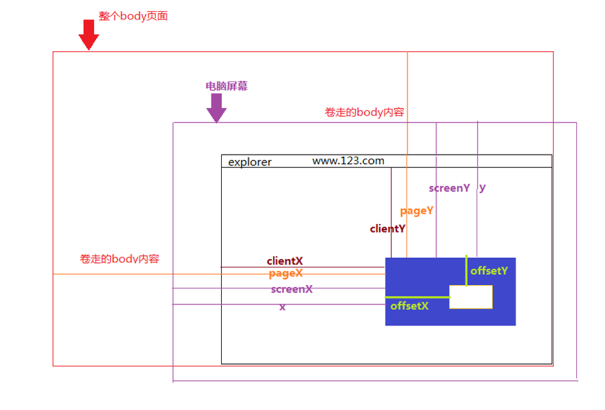

# 0 JavaScript发展

早期浏览器领域存在三个不同版本的"浏览器语言"：Netscape的**JavaScript**，IE的 JScript和CEnvi中的ScriptEase，并没有一个标准来统一其语法和特性，标准化势在必行。

## 0.1 官方规范ECMAScript

欧洲计算机制造商协会（European Computer Manufacturers Association），ECMA 是一个将信息标准化的组织。JavaScript 被提交到ECMA进行标准化，由此诞生了一个新的语言标准，也就是我们所知道的**ECMAScript或ES**。JavaScript 是该标准（最流行）的一个实现。

JavaScript 语言每年都在进化。从2015 年起，每年都有一个新版本发布，我们称其为ECMAScript年号

ES5-2009年发布。ES6-2015年发布。

Babel 是一个JavaScript 转译器，也称为源代码编译器。它将使用了ECMAScript 语言特性的JavaScript 代码转换成只使用广泛支持的ES5 特性的等价代码。

在JavaScript的发展历程中，它主要在浏览器前端发光发热。由于官方规范（ECMAScript）规范化的时间较早，规范涵盖的范畴非常小。对于JavaScript自身而言，它的规范依然是薄弱的，还有很多缺陷，如没有模块系统（在ECMAScript 6解决了）；标准库较少。ECMAScript仅定义了部分核心库，对于文件系统，I/O流，数据库访问等常见需求却没有标准的API，导致它无法用在后端开发。

## 0.2 社区规范CommonJS

在js发展的过程中，**社区**也在为JavaScript制定了相应的规范，其中CommonJS规范的提出算是最为重要的里程碑。在2009年8月，CommonJS诞生了。CommonJS规范为JavaScript制定了一个美好的愿景——**希望JavaScript能够在任何地方运行**。如今，CommonJS中的大部分规范虽然依旧是草案，但是已经初显成效，为JavaScript开发大型应用程序指明了一条非常棒的道路。目前，它依旧在成长中，这些规范涵盖了模块、二进制、Buffer、字符集编码、I/O流、进程环境、文件系统、套接字、单元测试、Web服务器网关接口、包管理等。

CommonJS是一种规范，业界有很多它的实现，其中最著名的是**node.js**，另外还有Apache的CouchDB等。

## 0.3 TypeScript

TypeScript 是一个开源的、渐进式包含类型的JavaScript 超集，由微软创建并维护。创建它的目的是让开发者增强JavaScript 的能力并使应用的规模扩展变得更容易。它的主要功能之一是为**JavaScript 变量提供类型支持**。在JavaScript 中提供类型支持可以实现静态检查，从而更容易地重构代码和寻找bug。最后，TypeScript 会被编译为简单的JavaScript 代码。

# 1. ES6

ECMAScript 2015+（简称：ES6)的功能

- let和const
- 模板字符串
- 解构赋值
- 箭头函数
- 类
- 模块

## 1.1 <a href='https://www.runoob.com/js/js-let-const.html'>常量与变量</a>
<p style='text-indent:2em;'>JavaScript 语言是一门弱类型语言，声明变量的形势特别自由，所有量只分<b>变量</b>和<b>常量</b>，分别由<b>let</b>和<b>const</b>关键字做声明，他们的作用域都是<b style='color:red;'>块级作用域</b>，即在代码块<b>‘{ ... }’</b>内有效。 ES6 之前，是没有块级作用域概念的，书上写到可以用<b>var</b>做变量声明，使用 var 关键字声明的变量不具备块级作用域的特性，它在 { } 外依然能被访问到，但在ES6之后已不推荐这样用，它的作用域也不是那样的纯粹，希望大家多使用前二者，后者尽量不使用。</p>
<p style='text-indent:2em;'><b>const</b> 的本质: const 定义的变量并非常量，并非不可变，它定义了一个常量引用一个值。使用 const 定义的对象或者数组，其实是可变的。下面的代码并不会报错：</p>

```js
const unv={a:1};
unv.a='我可变';
unv['b']=3;
//js的计算属性
console.log('unv=',unv);
//打印出来就是  unv={a:'我可变'，b:'3'}

const arr=[1,2,3];
arr.push(4);
console.log('arr=',arr);
//打印出来就是  arr=[1,2,3,4]
```
    但是我们不能对常量对象和数组重新赋值：
```js
unv={a:2};
arr=['a','b','c',];
//这样会报错
```
## 1.2 <a href='https://developer.mozilla.org/zh-CN/docs/Web/JavaScript/Reference/Functions/Arrow_functions'>箭头函数</a>
<p style='text-indent:2em;'>
    ES6 允许使用<b>箭头(=>)</b>定义函数。这种方式创建的函数不需
    要function 关键字，并且还可以省略return关键字。同时，箭头函数内
    的<span style='color:red'>this指向函数定义时所在的上下文对象，而不是函数执行时的上下文</span>
    对象。 
</p>

```js
    //标准格式
    const f = (params,...) =>{
        //多参数要放在括号内，单一参数省略括号
        //函数体多语句要放在花括号内。
        //单一语句省略花括号,返回值为语句的运算结果，假如返回对象需要外加括号，eg：f=()=>({a:1,b:2})
        return ...;
    }
    const f0 = (param1,param2) => param1+ param2
    const f1 = param => param * 2
    const f2 = (param1,param2) => {
        console.log(param1,param2);
        const param=param1+param2;
        return param;
    }
    const f3= param =>({a:1})
```
## 1.3 模板字符串
<p style='text-indent:2em;'>
模板字符串是增强版的字符串，用反引号（`）标识字符串。<b>用法</b>：普通字符串用法，定义多行字符串，字符串嵌入变量。
</p>

```js
console.log(`reactJS is useful`);//reactJS is useful
console.log(`reactJS is useful!
            reactJS is popular!!`)
            /*
              reactJS is useful!
              reactJS is popular!!
            */
const a=1;
console.log(`reactJS is useful and NO:${a}`);//reactJS is useful and NO:1
```
## 1.4 解构赋值
<p style='text-indent:2em;'>
ES6允许按照一定模式从<span style='color:red'>数组和对象</span>中提取值，对变量进行赋值，这被称为解构。
</p>

```js

//数组解构
const [a,b,c] = [1, 2, 3];
        //解构的同时也在赋值，分开写，好理解一些，但这两个过程是同时相互存在的
console.log(a ,b , c)   //1,2,3
//数组赋值
const a=1;
const b=2;
const c=3;
const d=[a,b,c];
console.log(d);//[1,2,3]
//对象解构
const me={ name: 'qin',age: 22 };
const { name , age } = me;
console.log(name,age); // qin , 22
//对象赋值
const name='qin';
const age =22 ;
const me={name,age};
console.log(me);//{name:'qin',age:22}

//函数的参数也可以使用解构赋值
//数组参数解构
function sum ([x, y]) {
return x + y;
}
sum([1, 2]); // 3
//对象参数解构
function sum ({x, y}) {
return x + y;
}
sum({x:1, y:2}); // 3

//解构同样适用于嵌套结构的数组或对象。
//嵌套结构的数组解构
let [a, [b], c] = [1, [2], 3];
a; //1
b; //2
c; //3
//嵌套结构的对象解构
let {me: {name, age}, foo} = {me: {name: 'qin',
age: 22}, stuId: '4180402004'};
name //"qin"
age //22
foo //4180402004
```

## 1.5 <a href='https://zh.javascript.info/rest-parameters-spread-operator'>Rest参数与Spread操作符</a>
<p style='text-indent:2em;'>
1. ES6引入rest参数（形式为...变量名）用于获取函数的多余参数，
</p>

```js
function languages(lang, ...types){
    console.log(types);
}
languages('JavaScript', 'Java', 'Python'); //["Java","Python"]
```
<p style='text-indent:2em;'>
2. 扩展运算符是三个点（...），它可将一个数组转为用逗号分隔的参数序列(逆rest运算)，也可将一个对象所有可遍历的属性，<span style='color:red'>复制</span>到当前的对象当中。
</p>

```js
//数组
function sum(a, b, c){
return a + b + c;
}
let numbers = [1, 2, 3];
sum(...numbers); //6

//对象
let bar = {a: 1, b: 2};
let foo = {...bar};
foo //Object {a: 1, b: 2};
foo === bar //false
```

## 1.6 <a href='https://blog.csdn.net/masterShaw/article/details/54908837'>模块</a>

<p style='text-indent:2em;'>
模块的导入导出接口，export导出模块，import导入模块
</p>

```js
//a.js，导出默认接口和普通接口
const foo = () => 'foo';
const bar = () => 'bar';
const renameExp = () => 'renameExp';
const renameImp = () => 'renameImp';
export info=()=> 'info';
export default foo; //导出默认接口
export {bar}; //导出普通接口
export renameExp as reE//导出时重命名

//b.js(与a.js在同一目录下)，导入a.js中的接口
//注意默认接口和普通接口导入写法的区别，普通接口用到了解构赋值
import foo, {bar,info,renE,renameImp as renI} from './a';
import * as fun from './a';
foo(); //"foo"
bar(); //"bar"
fun.foo();
fun.renE();
```


>此部分主要引用《reactt进阶之路》1.2节的内容，细节可参看此节

>这部分相当相当之重要，望留意
>
>## 1.7 函数默认值和剩余参数
>
>```js
>//函数参数默认值，剩余参数
>function name(param1=10,param2=15,...args){
>    console.log(param1,param2,args.length);     
>}
>name(1)
>```
>
>## 1.8 类
>
>在ES2015之前，类的实现是基于原型语法的
>
>```js
>function Book(title, pages, isbn) { 
>    this.title = title;
>    this.pages = pages;
>    this.isbn = isbn;
>}
>Book.prototype.printTitle = function() {
>	console.log(this.title);
>};
>```
>
>在ES2015之后
>
>```js
>class Book {
>    //构造函数
>    constructor(title, pages, isbn) {
>		this.title = title;
>		this.pages = pages;
>		this.isbn = isbn;
>	}
>    //普通函数
>    printIsbn() {
>		console.log(this.isbn);
>	}
>}
>class ITBook extends Book { 
>    constructor (title, pages, isbn, technology) {
>        //super调用，调用父类的构造器
>        super(title, pages, isbn);
>        this.technology = technology;
>    }
>    printTechnology() {
>    	console.log(this.technology);
>    }
>}
>let jsBook = new ITBook('学习JS 算法', '200', '1234567890', 'JavaScript');
>console.log(jsBook.title);
>console.log(jsBook.printTechnology());
>
>```
>
>

# 2. [开发常用函数](https://www.runoob.com/jsref/jsref-tutorial.html)
## 2.1 [Array](https://www.runoob.com/jsref/jsref-obj-array.html)
```js
//切合操作
1. array1.concat(array2,array3,...,arrayX)//衔接，多个数组为一个数组
2. array.slice(start, end)//切割，数组的部分元素，左闭右开

//条件操作
3. array.every(function(currentValue,index,arr), thisValue)//是否每个都满足，所有值返回为true，函数才返回true
4. array.some(function(currentValue,index,arr),thisValue)//是否部分满足,有一个返回为true就行，函数才返回true

5. array.fill(value, start, end)//把数组的部分元素填充为指定value

//遍历操作
6. array.map(function(currentValue,index,arr), thisValue)//遍历数组所有元素，按回调函数的方式返回相应的数组元素
7. array.filter(function(currentValue,index,arr), thisValue)//筛选数组元素，将返回ture的item重新组成新的数组。
8. array.forEach(function(currentValue, index, arr), thisValue)//遍历数组
9. Array.from(object, mapFunction, thisValue)//from() 方法用于通过拥有 length 属性的对象或可迭代的对象来返回一个数组。

//查找判断
10. array.find(function(currentValue, index, arr),thisValue)//返回第一个满足条件的数组元素
11. array.findIndex(function(currentValue, index, arr), thisValue)//返回第一个满足条件数组元素的索引
12. array.indexOf(item,start)//查找目标元素第一次出现的位置
13. array.lastIndexOf(item,start)//查询数组中目标元素的索引//对原数组的操作
14. array.includes(searchElement, fromIndex)//判断数组中是否包含某个元素

11. Array.isArray(obj)//判断是否为obj是否为数组
12. array.join(separator)//以separator的为分割，链接成字符串

//对数组本身的操作
14. array.pop()//弹出数组最后一个元素
15. array.push(item1, item2, ..., itemX)//压入多个元素到数组末尾
16. array.shift()//弹出数组第一个元素
17.	array.unshift(item1,item2, ..., itemX)//压入多个元素到数组首部

//顺序操作
18. array.sort()//排序，默认排序顺序为按字母升序。
				//对于数字来说，这种按字母排序的方式，会导致40会在5前面。 数字升序排列arr3.sort(function(a,b){return a-b})
19. array.reverse()//逆序

//累加压缩
20. array.reduce(function(total, currentValue, currentIndex, arr), initialValue)//接收一个函数作为累加器,最终返回累加和
19. array.toString()
21. array.length//数组长度
```


## 2.2 [String](https://www.runoob.com/jsref/jsref-obj-string.html)

```js
1. string.indexOf(searchStr, start);
2. string.search(searchStr|regexp)//返回目标字符串的开始位置
3. string.lastIndexOf(searchStr,start);//从指定start位置，由后往前匹配
4. string.substr(start,length)
5. string.substring(from, to)//提取子字符串，左闭右开，from、to不可以为负数
6. string.slice(start,end)//提取子字符串，左闭右开，start、end可以为负数

//函数的第二个参数，可以为function，func的第一个参数为整个regexp匹配到的一个内容，第二个参数为第一个分组捕获(正则子表达式匹配)的内容，依次类推，func的返回值作为替换字符串。
7. string.replace(searchStr|regexp,repStr|func)
8. string.match(regexp);//regexp的包含g，返回一个匹配内容的数组，无匹配内容为null

9. string.includes(searchStr, start);//返回true，false
10. string.startsWith(searchStr, start)//是否以searchStr开头

11.string.split(separator,longlimit)//返回分割的子字符串数组
12. string.repeat(count)//重复目标字符串指定次数，并返回

13. string.toLowerCase()
14. string.toUpperCase()
15. string.trim()
16. string.length

17. regex.test(string)//判断字符串string是否符合regex
```

## 2.3 Math

```js
//舍入函数
Math.ceil(num)//向上舍入
Math.floor(num)//向下舍入
Math.round(num)//四舍五入
Math.max(...)//取参数中的最大值
Math.min(...)//取参数中最小值
Math.random()//0~1之间的随机数
Math.pow(basic,times)//指数函数
```


```js
//保留n位小数
function(src,n){
    const factor=Math.pow(10,n);//10的n次方
    return  Math.round(src*factor)/factor;
}
```
## 2.4 Number
```js
    num.toFixed(n)//数字转为字符串，四舍五入保留n位小数
```
## 2.5 Object
```js

Object.assign(origin,obj1,obj2)//合并对象属性到origin对象，如果有重复的属性，靠后的对象的重复属性会覆盖靠前对象的属性。
Object.keys()//获取对象的可枚举属性key数组
Object.getOwnPropertyNames()//获取对象的属性key数组，包括不可枚举属性
Object.values()//获取对象的可枚举属性值value数组
Object.entires()//获取对象的键值对数组的数组。
obj.hasOwnProperty(pro)//判断对象是否包含pro属性

Object.create(proto,caseobj)//第一个参数为新创建对象的原型对象，第二个参数新创建对象的实例对象（默认不可修改，不可枚举,也可在设置时修改默认配置)
//定义对象的新属性的配置，
Object.defineProperty(object, prop, descriptor)//descriptor：{value: 101,writable: true,enumerable: true,configurable: true}
Object.defineProperties(object,{prop1:descriptor1,prop2:descriptor2})

Object.preventExtensions(object)//阻止对象扩展新的属性
Object.isExtensible(object)//判断对象是否可扩展
Object.seal(object)//用于密封对象object。
//密封对象是指那些不能添加新的属性，不能删除已有属性，以及不能修改已有属性的可枚举性、可配置性、可写性，但可能可以修改已有属性的值的对象。
Object.isSealed(object)//判断对象是否已密封
Object.freeze(object)//用于冻结对象，冻结对象是不可变得对象，值和配置都不可变
Object.isFrozen(object)//判断对象是否已冻结

```
## 2.6 Console

Console 对象提供了访问浏览器调试模式的信息到控制台。

```js
console.clear()//清除控制台信息
console.info();console.log()//向控制台输出信息
console.time();console.timeEnd();计算代码（块）运行所需要的时间
```
## 2.7 JSON
```js
//将JS Object 转化为JSON字符串,
JSON.stringify(Object||Array[,function||Array[,space]])
//function(key,val){}，从最外层对象开始，最外层对象的key为"",然后从得到的最外层对象的返回值开始stringify，如果返回为undefined，那么就不返回。
//array,将数组中元素有的键，进行stringify并返回。
//space,文本添加缩进

//将JSON字符串转换为JS Object
JSON.parse(str[,function])
//function(key,val){}，从最里层对象开始。如果返回undefined，那么就不解析。	

```

```js
//eg:
let str={name:"qin",age:15};
let i=0
let j=JSON.stringify(str,function(key,val){
    console.log('key:',key)
    console.log('val:',val)
    i++
    if(key==""){
        return val//注意最外层对象这里返回值，对后面迭代的影响。
    }else{
        return "val"+val
    }
})
console.log("res",j,i)
/*
key:
val: { name: 'qin', age: 15 }
key: name
val: qin
key: age
val: 15
res {"name":"valqin","age":"val15"} 3
*/
```


# 3. 项目高级语法需要

## 3.1 数据类型

### 3.1.1 基本数据类型
- 数值
- 布尔
- 字符串
- symbol
- undefined 表示没有为变量设置值或属性不存在；
- null 表示变量有值，但其值为null

```js
''==0   //true
null==undefined  //true
```
```js
  const b={}
  console.log(b.a==undefined)
```
### 3.1.2 复合数据类型

复合类型是由多个基本数据类型（也可以是包括复合类型）组成的数据体

JavaScript是基于对象的脚本语言，它提供了大量内置类供用户使用

- Object
- Array
- Function
- String
- Date
- Math
- Number
- Error

这些类里面包含大量实用的方法和属性可供使用。

## 3.2 typeof()和instanceof

1. typeof()

    typeof运算符用于判断某个变量的数据类型
```js
const a=[undefined,null,true,12,'string',{a:1},function(){console.log('我是函数')}];
a.map((item,index)=>{
    console.log(index,typeof(item))
})
```
2. instanceof 

    instanceof 用于判断某个变量是否为指定类的实例。所有变量都是Object的子类。
```js
const a=[undefined,null,true,12,'string',{a:1},function(){console.log('我是函数')}];
a.map((item,index)=>{
    console.log(index,item instanceof Object)
    //Array
})
```
## 3.3 错误处理
```js
try{
    //代码块
}catch(e){
    // 错误处理
}
```
## 3.4 定时器
    实际是以window为对象的，在这里可以省略
1. 周期定时器
```js
let interval=setInterval(()=>{
    //需要周期性执行的函数
},1000)//以毫秒为单位
clearInterval(interval)//需使用全局变量interval
```
2. 滞后定时器
```js
let delay=setTimeOut(()=>{
    //延后执行的函数
}，1000)//以毫秒为单位
clearTimeout(delay)
```
## 3.5 Promise
    如果程序需要异步完成某个任务，并希望任务完成后执行resolve()，任务失败执行另外的reject()，此时就需要用到Promise
    
    Promise 是一个类，该类具有如下构造器
```js
new Promise(function(resolve,reject){})
```
    Promise提供了一个then()方法，该方法可以传入两个函数：第一个函数是resolve回调函数，第二个是reject回调函数
```js
 this.backPromise(res0)
 .then((data)=>{
                if(data.status==2){
                    clearInterval(this.interval0);
                    const activate_str=this.createActStr(data.detail_list);
                    this.setState({
                        modalVisible:true,
                        paySuccess:true,
                        activate_str
                    })
                    message.success('订单支付成功',3)
                    // .then(()=>{
                    //     this.clrState();
                    //     this.resetSmsCode();
                    // })
                }
        },
        (data0)=>{
                
        })
 backPromise=(res)=>{
       let p= new Promise(function(resolve,reject){
            try{
                if(res.code==200){
                    resolve(res.data);
                }else{
                    reject(res.data);
                }
            }catch(e){}
        })
        return p;
    }
   
```

# 4. BOM(浏览器对象模型)


    BOM有一个核心对象window，window 对象是整个JavaScript脚本运行的顶层对象。

window对象包含了6大核心对象，分别是：

1. document对象，即文档对象，既是DHTML（动态页面）的对象也是HTMLDocument（DOM）的对象
2. location，即当前页面的地址
3. history，即页面的历史记录
4. frames，即HTML自框架
5. navigator，包含浏览器相关信息
6. screen，用户显示屏幕相关属性

window对象也包含一些方法，主要有：

1. open(),close() 开关标签页或窗口
2. alert(),confirm(),prompt(), 警告，确认，提示弹窗
3. focus(),blur(),得失焦点
4. print(),打印
5. scrollBy(),scrollTo(),滚动当前的文档

window对象也包含一些属性，主要有：
- innerHeight innerWidth
- outerHeight outerHeight
- sessionStroge

## 4.1 location
页面地址对象，包含以下几个属性
1. hostname 主机名
2. host 主机地址
3. href url地址
4. port 服务器端口
5. pathname 文档地址
6. protocol 文档使用的协议
## 4.2 history
窗口的浏览历史
1. back() 后退一个页面
2. forward() 前进一个页面
3. go(+-integer) 跳转页面
4. pushState(data,title,url) 向地址栏最后压入最新的一个状态
5. replaceState(data,title,url) 替换当前的地址栏状态
    - title 标签名
    - data 参数
    - url 页面url

go方法会改变地址栏并跳转刷新页面，而pushState，replaceState，仅仅改变地址栏内容
## 4.3 window

## 4.4 screen

## 4.5 navigator


# 5.文档对象模型(DOM)

    借助DOM模型，可以将结构化的文档转换成DOM树。以便在程序中可以增删改查树里的节点。
## 5.1 访问(查询)和修改
常用访问方式
```js
document.getElementById("id")   //by id   是一个Object
document.querySelector("selectors")   //by selectors，返回第一个符合选择器参数的元素，是一个Object
document.querySelectorAll("selectors")  //by selectors，返回所有符合选择器参数的元素，是一个Array
```
修改方式

修改HTML元素通常通过修改如下几个常用的属性来实现

1. innerHTML &emsp;用于修改元素内的内容
2. value   &emsp; 用于修改表单的值
3. className &emsp;用于修改css样式
4. style    &emsp;修改内联样式
5. options[index] &emsp;修改列表项

## 5.2 创建或复制节点

```js
let ele=document.createElement('element'); //创建元素
let elein=ele.cloneNode(deep); //boolean deep是否深层复制

```


以上部分大致看一看即可，DOM概念很好，但是运用了前端框架后，很多方法都可以进行替代

# 6. 事件处理机制
## 6.1 事件模型

涉及如下几个概念

1. 事件（event）
        包含事件目标（event target）和 事件类型（event type）
        事件目标——引发事件的对象，eg：div，span
        事件类型——对象产生了什么类型的事件，eg：click，press

2. 事件处理器（event handler）

        事件产生后，对事件进行函数处理
## 6.2 绑定事件处理函数
### 6.2.1 绑定html 元素属性

    事件处理属性名称=on+事件类型 eg：onclick

```js
<div onclick="submit"></div>
```
### 6.2.2 dom对象的属性赋值绑定

```js
eventTargetObject.onclick=submit;
```

### 6.2.3 addEventListener
```js
eventTarget.addEventListener('eventType',handler,captureFlag)
eventTarget.removeEventListener('eventType',handler,captureFlag)
```

顶层DOM对象——捕获——>事件目标——冒泡——>顶层DOM对象

事件传播过程中，先经历捕获阶段，再经历冒泡阶段



# 7 Ajax

Asynchronous Javascript And XML（异步 JavaScript 和 XML）

这种技术能够向服务器请求额外的数据而无须刷新页面。是一种异步javascript访问服务器端然后获取服务器端数据的技术

## 7.1 XMLHttpRequest

  Ajax技术核心是XMLHttpRequest对象(简称XHR)

## 步骤

```js
1. 创建XHR对象：
var xhr = new XMLHttpRequest(); 

2. 准备发送请求：在使用XHR实例对象之前，先必须调用
xhr.open('get or post','url','false or true')
		（发送请求类型，请求的url，是否异步）
        
3. 发送请求：
xhr.send(请求参数)//get没有请求参数故参数为null

4. 收到响应：响应的数据会自动填充XHR对象的4个属性

​ 			 responseText：作为响应主体被返回的文本

​            responseXML:如果响应的主体内容类型是"text/xml"或"application/xml",

​                        则返回包含响应数据的XML DOM文档

​            status：响应http状态//200->ok  404->not found

​            statusText：http状态的说明
```

​	   

## 实例

```js
 addEvent(document,'click',*function*(){

    var xhr = new XMLHttpRequest();

    xhr.open('get','demo.php',false);

    xhr.send(null);

    alert(xhr.responseText);

 })
```

# 8 其它

1. javascript的编译与执行
   - 词法分析
   - 语法分析
   - 预编译
   - 解释执行
2. 

