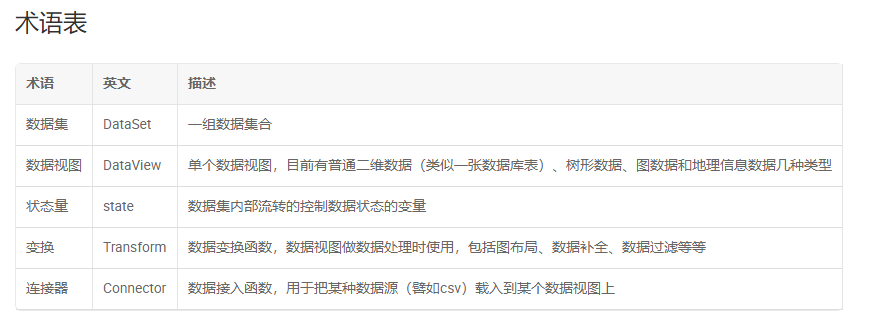

# AntV 
全局命名空间 G2
# BizCharts
    是基于 G2 封装的 React 图表库，具有 G2、React 的全部优点

## 图表构成

    图表由各种组件构成，组件有两种类型，实体组件（可见）和抽象组件（概念抽象），
    
    常用组件：Chart（图表容器-实） Coord（坐标系-抽） Axis（坐标轴-实） Geom（几何标记组件-实） Label（几何标记的辅助文本-实） Tooltip（提示-实）
    

图例

## 图表类型（几何标记）

    数据可视化的核心在于可视化编码，而可视化编码由几何标记和视觉通道组成。在可视化设计中我们将常见的 几何标记 定义成图表类型。图表类型是几何标记在可视化框架中的一种实现方式

    点，线，面，体——零，一，二，三维

    自由度 = 空间维度 - 几何标记的维度

1. 几何标记（Gemo）

    根据图形本身的维度和其自由度将几何标记在可视化框架中的实现进行了分类：

    point（点图） path（路径图） line（线图） area（区域图） interval（区间图） polygon（多边形） heatmap（热力图） schema（自定义）

2. 视觉通道

    position（位置） color（颜色） size（大小） opacity（透明度）

3. 形状（shape）

    图形形状（shape）决定了各个视觉通道和图形属性的映射

    对于每个Shape的实现，我们需要确定以下内容：

- 支持的视觉通道
- 映射到各个视觉通道的数据格式（ Json | DataView ）
- 图形对应的数据条数（映射关系）
- 图形的点的个数（确定形状需要的点数，eg：正方-4）

## 数据处理（DataSet）

    DataSet的目标是为数据可视化场景提供状态驱动（state driven）的、丰富而强大的数据处理能力。

    数据处理分为两个大的步骤：数据连接（Connector）和数据转换（Transform）。
    

术语表

使用步骤：

- 创建 DataSet 对象，指定状态量 
- 创建 DataView 对象，在 transform 中使用状态量
- 创建图表，引用前面创建 DataView 
- 改变状态量，所有 DataView 更新

所有引用了 DataSet 管理的 DataView 的图表都会受自动刷新，不需要手工刷新。

## G2 数据处理流程

    加载数据->数据分组->原始数据保留->数据数值化->调整数据->归一化操作->绘制图形点->映射图形

## 改变主题

    BizCharts.setTheme('dark'| Object); 

## 图表交互

    默认

    active 激活，鼠标hover。

    select 选中，鼠标点击选择、框选。