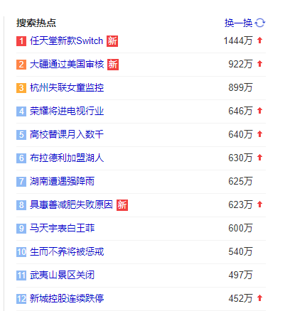
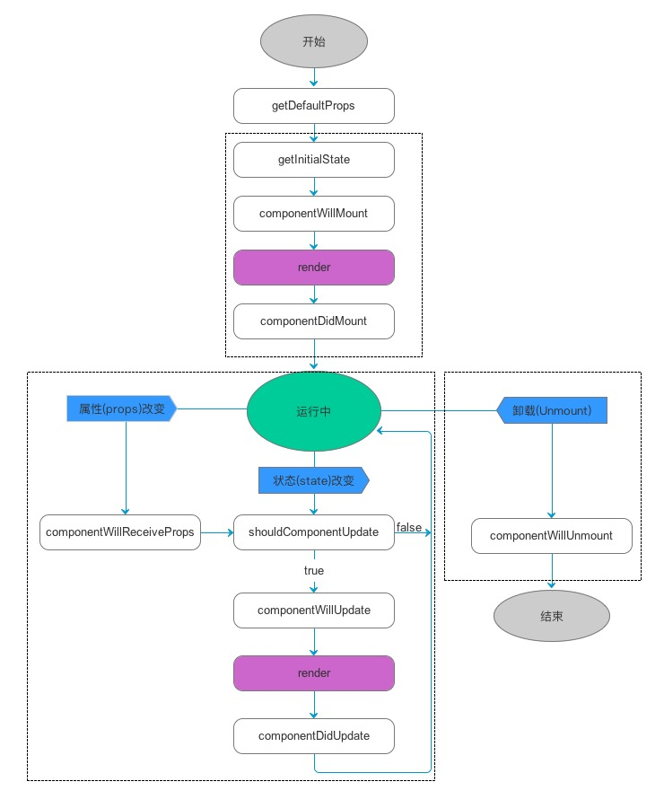

# 前言
<div style='text-indent:2em;'>
<p>
    如果说IT行业是数据驱动的行业，那么人的造物运动则是<b>问题驱动</b>的运动。问题的难度和复杂度，决定了你的高度。问题是最好的老师，永远不要拒绝一个优秀的老师，永远不要做一个好学生，永远也不要一直是一个差等生。
</p>
<p>
    如果你遇到了一个问题，请做一个乐观的智者，积极主动的向问题靠拢，分析问题，检索问题，再分析，再检索。所有行业都没有知识的闭集，永远有做不完的工作，永远有学不完的知识。
</p>
<p>
    <b>乐于分享，知识开放</b>。分享优秀的技术，不要把它作为一家之珍。与人交流，才有思想的火花。每个人有每个人不同的思维，用不同的角度看问题，才能把问题看得全。分享是一件开心的事情。
</p>
</div>

# 简述前端

前端的核心技能依然是**HTML**、**CSS**和**JavaScript**。但现在我们很少直接用这些最核心的知识去开发前端，我们通常会借助巨人的肩膀，去够到遥不可及的天空。前端UI框架就是巨人的肩膀，比较常用的有**AngularJS**、**ReactJS**、**VueJS**和**NodeJS**。
    
- **HTML**超文本标记语言(Hyper Text Markup Language)负责标记页面的内容，通过文本标签，你的页面会出现很多呈现给用户和与用户做交互的元素。使CSS和JavaScript能快速而准确的定位到页面各个部分，当然也能做一些简单前端样式的调整。

- **CSS**层叠样式表(Cascading Style Sheets)主要负责页面内容的样式和布局，结合JavaScript可以动态改变页面的样式，使人机交互的过程更加美观而有趣。

- **JavaScript**作为一门 [脚本语言](https://baike.baidu.com/item/%E8%84%9A%E6%9C%AC%E8%AF%AD%E8%A8%80)，主要负责前端的逻辑数据处理，使页面更富于变化。同时分担后台的计算压力。其中DOM和BOM概念相当的新颖。

<p style='text-indent:2em;'>
    你或许在学HTML的时候，<button>button</button>按钮和我们生活中所接触的按钮大相径庭，难看有没有？在学JavaScript的时候真实的DOM结构执行效率低下，渲染笨重。为了丰富和美化我们前端的页面，为了提高页面执行效率，如此，我们会去采用一些**UI框架**。里面的组件样式美观、复用性和可适应能力都很强，可以大大加快我们的开发效率。我们一般不造已有的轮子，采用别人优秀的成果，你可以变得更优秀。省下造轮子的时间，我们可以去学习新的知识、去造新的轮子。
</p> 

- ReactJS就是目前项目所用到的框架。

    - 采用**JSX**语法来声明视图层，视图层中随意使用各种状态数据
    - 依据**生命周期**流程式的渲染页面，页面更新流程清晰简洁。
    - 高效**DOM**操作，组件对象化虚拟化好像是所有UI框架提升的部分
>引用至《React进阶之路》 徐超编著

>本文的大部分react基础知识均出自此书，

>实验室192上提供有此书的电子版。有功夫可以看一看。

# HTML 基础
## 1 HTML是什么？

    HTML 是用来描述网页的一种语言。

- HTML 指的是超文本标记语言 (Hyper Text Markup Language)
- HTML 不是一种编程语言，而是一种<span style="color:red;">标记语言</span> (markup language)
- 标记语言是一套<span style="color:red;">标记标签</span> (markup tag)
- HTML 使用标记<span style="color:red;">标签来描述网页</span>

### 1.1 HTML标签(元素)

    HTML 标记标签通常被称为 HTML 标签 (HTML tag)。

- HTML 标签是由尖括号包围的关键词，比如 ```<html>```
- HTML 标签通常是<span style="color:red;">成对</span>出现的（eg： ```开始标签<b> 和 结束标签</b>```），也有少数非成对存在（eg：``````。
- HTML 标签不区分大小写，推荐<span style="color:red;">小写</span>形式

<span style="color:red;font-size:18px">标签属性</span>

HTML 标签或多或少都存在一些属性，以 属性名="属性值" 形式写在开始标签上，

eg：```<div style="width:200px;height:100px;">我是一个宽200px，高100px的容器</div>```。效果如下：
<div style="width:200px;height:100px;border:2px solid #f00">我是一个宽200px，高100px的容器</div>

HTML5 <span style='color:red'>重要的通用属性</span>

- id class style 
  
        id和class通常用于CSS和JavaScript的DOM节点选中，选中后可以设置样式等逻辑操作。
        
        style用来设置标签的样式，例如width，height，border，background等。
    
        CSS中经常会用到这三个属性，
- dir

        设置元素中内容的排列方向，有两个值，ltr和rtl（左对齐和右对齐）

- title 

        用于为HTML元素指定额外信息。
```html
<div title="关关雎鸠，在河之洲。窈窕淑女，君子好逑。">关关雎鸠，在河...</div>
```


### 1.2 HTML文档
    HTML文档描述网页，HTML文档=网页。HTML文档是一份结构化文档，HTML 文档包含 HTML 标签和纯文本。
## 2 标签元素
### 2.1 标签分类

1. 基本标签，
2. 文本标签，使文本内容呈现出特定的效果
3. 嵌入标签，用于放置网页，图片，音频，视频等特殊内容
4. 结构标签，提供文档的结构标识
5. 表单标签，用于录入用户信息


### 2.2 基本标签

```html
<html>
    <head>
        <meta />
        <title>
            HTML文档
        </title>
    </head>
    <body>
        <h1>
            第一章 简介
        </h1>
        <hr/>
        <div>HTML<br/>是一份<span>结构文档</span></div>
        <div>HTML 文档包含 HTML 标签和纯文本。</div>
    </body> 
</html>
```


- hr 水平线
- div 容器+换行，用作标记和容器
- span 容器+不换行，用作标记和容器
- br 文本换行

antd pro src/pages/document.ejs中可以看到类似的代码

### 2.3 文本标签
    给文本加不同的效果，和word的开始中的选项相似
- h1~h6 标题，字号从大到小
- b 加粗
- small 小体
- i || em  斜体
- s || del 删除线
- u || ins 下划线(underline)
- sup / sub 上下标(superscript/subcript)
- q 双引号
- cite || blockquote 引用
- mark 凸显
- p 段落 

### 2.4 a标签

在实际项目中，a标签非常之实用，
- 跳转网页资源——超链接
- 页面内容间跳转——锚点
- 下载内容

a的属性

1. href 链接的资源（URL）,有相对路径和绝对路径之分

    相对路径——是相对当前页面的路径而言,
    
    “./”——“./warrningyou.png”和“warrningyou.png” 表示在当前文件目录下的warrningyou.png文件

    “../”——父文件夹下，依次类推，“../../”——爷......

    绝对路径——通常是从盘符开始的路径，当指绝对路径是，href的值为<span style='color:red'>URL(Uniform Resource Locator,统一资源定位器)</span>，
    
    URL用于对互联网上的文档进行寻址。遵守如下的语法规范：

    <span style="font-size:20px;color:red">scheme://host.domain:port/path/filename</span>

    <span style="color:red">服务类型：//主机 . 域名：端口/路径/文档名</span>

    - scheme 因特尔服务的类型，最流行的类型是http
    - host 此网域主机，如被省略默认主机是www
    - domain 因特网域名，
    - port 主机的端口号，通常被省略，http服务默认端口是80。
    - path 远程服务器上的路径，省略时，定位到网域的根目录。
    - file 文档名


当下较为流行的scheme以及对应的资源如下

 scheme | 对应资源 | 
:------- | :---------------- | 
file  | 访问本地磁盘的文件 | 
ftp  | 访问远程FTP服务器的文件|
http   | 访问www服务器上的文件|
news|访问新闻组上的文件|
telnet|访问Telnet链接|
gopher|访问远程Gopher服务器上的文件


2. target 装载资源位置。
   
     _self，_blank，_top，_parent分别为自身，新窗口，顶层框架，父框架来加载新资源。
3. download 用于下载，href链接所链接的资源，该属性的属性值指定了用户下载资源时的默认文件名。

    <span style="color:red;">["data"类型的Url格式](https://www.cnblogs.com/wgw8299/archive/2011/02/06/1949453.html)</span>，
    是在RFC2397中 提出的，目的对于一些“小”的数据，可以在网页中直接嵌入，而不是从外部文件载入。例如对于img这个Tag，哪怕这个图片非常非常的小，小到只有一个 点，也是要从另外一个外部的图片文件例如gif文件中读入的，如果浏览器实现了data类型的Url格式，这个文件就可以直接从页面文件内部读入了。
    - 在实际的项目中，有些<span style="color:red;">需要下载的文件需要前台自行生成</span>，比如说一些，由后台传来的数据，需要由前台整理成文本文档，供用户下载。这时就需要用到href的data服务类型语法， 
    <pre>
    data:[mediatype][";encodetype"][",dataString"]
    mediatype->[type/subtype]*(";parameter")，eg:text/txt，text/html，image/png等
    encodetype->dataString的编码方式，eg：charset=utf-8，base64等
    </pre>

    <a href='data:text/txt;charset=utf-8,%E8%AF%AB%E5%AD%90%E4%B9%A6-%E8%AF%B8%E8%91%9B%E4%BA%AE%0A%E5%A4%AB%E5%90%9B%E5%AD%90%E4%B9%8B%E8%A1%8C%EF%BC%8C%E9%9D%99%E4%BB%A5%E4%BF%AE%E8%BA%AB%EF%BC%8C%E4%BF%AD%E4%BB%A5%E5%85%BB%E5%BE%B7%E3%80%82%E9%9D%9E%E6%B7%A1%E6%B3%8A%E6%97%A0%E4%BB%A5%E6%98%8E%E5%BF%97%EF%BC%8C%E9%9D%9E%E5%AE%81%E9%9D%99%E6%97%A0%E4%BB%A5%E8%87%B4%E8%BF%9C%E3%80%82%E5%A4%AB%E5%AD%A6%E9%A1%BB%E9%9D%99%E4%B9%9F%EF%BC%8C%E6%89%8D%E9%A1%BB%E5%AD%A6%E4%B9%9F%EF%BC%8C%E9%9D%9E%E5%AD%A6%E6%97%A0%E4%BB%A5%E5%B9%BF%E6%89%8D%EF%BC%8C%E9%9D%9E%E5%BF%97%E6%97%A0%E4%BB%A5%E6%88%90%E5%AD%A6%E3%80%82%E6%B7%AB%E6%85%A2%E5%88%99%E4%B8%8D%E8%83%BD%E5%8A%B1%E7%B2%BE%EF%BC%8C%E9%99%A9%E8%BA%81%E5%88%99%E4%B8%8D%E8%83%BD%E6%B2%BB%E6%80%A7%E3%80%82%E5%B9%B4%E4%B8%8E%E6%97%B6%E9%A9%B0%EF%BC%8C%E6%84%8F%E4%B8%8E%E6%97%A5%E5%8E%BB%EF%BC%8C%E9%81%82%E6%88%90%E6%9E%AF%E8%90%BD%EF%BC%8C%E5%A4%9A%E4%B8%8D%E6%8E%A5%E4%B8%96%EF%BC%8C%E6%82%B2%E5%AE%88%E7%A9%B7%E5%BA%90%EF%BC%8C%E5%B0%86%E5%A4%8D%E4%BD%95%E5%8F%8A%EF%BC%81' download="诫子书.txt">诫子书文档下载</a>

    dataString通过url的encodeURI编码。可以下下来看一下
4. type 指定被连接文档的MIME(Multipurpose Internet Mail Extensions，多用途互联网邮件扩展)类型，当该扩展名文件被访问的时候，浏览器会自动使用指定应用程序来打开。

5. 锚点用法
```html
<a href="#1">第一章</a>
<a href="#2">第二章</a>
<a name="1">1</a>
<a name="2">2</a>
```
### 2.5 嵌入标签
- img 图片 property：src alt width height 指定其一，另成比例变化


- iframe 网页 property: src frameborder height width name scrolling

<iframe src="https://www.baidu.com" scrolling='yes'> </iframe> 

- audio 音频 property：src autoplay loop height width preload [示例](https://www.w3school.com.cn/tiy/t.asp?f=html5_audio)

- video 视频 property：同样 [示例](https://www.w3school.com.cn/tiy/t.asp?f=html5_video)

- source 音视频多格式支持

- map 创建分区响应图 [示例](https://www.w3school.com.cn/tiy/t.asp?f=html_areamap)

- progress 显示进度 
 <progress/>
- meter 进度显示范围
<meter value="3" min="0" max="10">3/10</meter>
### 2.6 表单标签
    用于供用户填写信息或上传文件的标签组。
- form 
- input 
- label
- button 
- select  option
- textarea

    在实际的项目中已经没有在用到这么low的form表单了，大部分的UI框架都做了封装，看看别人的api文档，直接采用就ok了


### 2.7 结构标签
    划分文档的不同结构部分，为让文档结构更加清晰，但无任何效果，只做结构划分。 
- header 文档头部
- section 部分
- footer 文档尾部
- aside 侧边栏
- nav 导航
- article 内容

### 2.8 分组元素

- pre 文本原样显示（保留空格，换行符等）
- ul 无序列表分组
- ol 有序列表分组 property：start reversed type 
- li 列表子项
- dl 定义列表 
- dt 定义子项
- dd 描述定义项

### 2.9 表格元素
    项目中很少用，看看就行了
- table 表格 
- tr 记录行
- td 单元格
- th 加粗文字单元格
- thead 表头
- tbody 表体
- tfoot 表尾
```html
<html>
    <head>
        <style type="text/css">
            thead {color:green}
            tbody {color:blue;height:50px}
            tfoot {color:red}
        </style>
    </head>
    <body>
        <table border="1">
            <thead>
                <tr>
                    <th>Month</th>
                    <th>Savings</th>
                </tr>
            </thead>
            <tbody>
                <tr>
                    <td>January</td>
                    <td>$100</td>
                </tr>
                <tr>
                    <td>February</td>
                    <td>$80</td>
                </tr>
            </tbody>
            <tfoot>
                <tr>
                    <td>Sum</td>
                    <td>$180</td>
                </tr>
            </tfoot>
        </table>
    </body>
</html>
```
## 3. [特殊字符](http://114.xixik.com/character/)
HTML文档是由标签和字符组成，有一些特殊字符通过键盘无法输入，需要用到转义字符。
常用的转义字符
- \&nbsp; 半角空格
- \&emsp; 全角空格
- \\n 换行

## 4. 绘图-canvas
    在HTML5之前，前端开发者无法在HTML页面上动态的绘制图片。然而现在，我们甚至可以在页面开发动画和游戏，全是基于canvas这个画布标签，这个标签仅仅用作绘制的图样的容器，绘制工具还是要依靠其他插件来完成。这个在接下来的BIM项目可能会用到，这里只做引入介绍，使用我现在都还没碰触过，希望大家能完善此模块。

# CSS基础
    HTML5规范推荐把页面外观交给CSS(Cascading Style Sheet, 级联(层叠)样式单)，HTML主要负责标记和语义。
<p style='text-indent:2em'>
<span style="color:red">CSS 是一种专门描述结构文档表现方式的文档</span>，它一般不包含在结构化文档的内部，而以独立的文档方式存在
</p>

## 1 层叠和继承
1. <span style="color:red">层叠</span>：指同一个元素通过不同的方式设置样式表，产生样式重叠（冲突）
2. 层叠<span style="color:red">优先级</span>：
   
    !important > 元素内嵌（行内样式） > 文档内嵌（< style >） > 外部引入（< link >） > 浏览器

3. <span style="color:red">继承</span>：指某一个被嵌套的元素得到它父元素的样式。
4. 继承<span style="color:red">范围</span>：样式的继承只适用于元素的外观（文字，颜色，字体等），而元素在页面的布局样式则不会被继承，加入需强制继承，则,属性:inherit
5. CSS语法规则
<pre>Selector {
    property1:value1
    property2:value2
    ...
}</pre>
- <span style="color:red">Selector：选择器</span>，决定该样式对哪些元素起作用。
- <span style="color:red">{p1:v1;p2:v2;...} 属性定义</span>，决定样式。

    css的学习，就是围绕这两个部分开展的，选择器是基础，你要精准的选择文档内标记内容。属性定义部分内容繁多，你要知道什么属性调整元素的什么样式风格。
## 2 选择器
    HTML的标签有标记的作用，标记文档的目的是为了，我们能通过选择器精准定位到文档内容。
### 2.1 选择器分类
- 基本选择器
- 复合选择器
- 伪选择器
### 2.2 基本选择器
1. 通用选择器

<pre>
*{
    p1:v1;
    ...
}
</pre>
2. 元素选择器
<pre>
label {
        p1:v1;
        ...
    }
</pre>
3. id选择器
<pre>
#id {
        p1:v1;
        ...
    }
</pre>
4. 类选择器
<pre>
.class {
        p1:v1;
        ...
    }
</pre>
5. 属性选择器---[attr = value]
   
    自行百度
### 2.3 复合选择器
    将不同的选择器进行组合形成新的匹配
1. 分组选择器
<pre>
label,#id,.class,[attr]{

}
</pre>
2. 后代元素选择器
<pre>
fatherLabel offspringLabel{

}
</pre>
3. 子元素选择器
<pre>
fatherLabel > sonLabel{

}
</pre>
4. 兄弟选择器
   
    自行百度

### 2.4 伪元素选择器

- :first-letter
- :first-line
- :before
- :after
使用方法：
<pre>
label:PseudoElementSelector{

}
</pre>
后二者与content属性有关，可以为文本编序号插内容。用法相当之强大，可深入研究，具体用法，自行研究。
### 2.5 伪类选择器
分类：
- 结构性伪类
- UI元素状态伪类
- 动态伪类
- 其他伪类

1. 结构性伪类选择器
   
    根据文档结构进行匹配定位
<pre>
Selector:PseudoSelector{

}
</pre>
PseudoSelector有许多，自行查阅
2. UI元素状态伪类选择器
   
    主要用于根据UI元素状态进行匹配定位
[Selector]:link :visited :active :hover :focus等，可省略前面的选择器。

## 3 颜色与度量单位
### 3.1 color属性
1. 字符 red green blue orange yellow purple
2. #000~#fff 十六进制（rgb），#hhhhhh，

    eg: #f00(red) ，#0f0(green)，#00f(blue)
3. rgb(0~255,0~255,0~255) rgb模型（红绿蓝）
4. rgba(0~255,0~255,0~255,0~1) rgba模型（~+透明度）
5. hsl(0~360,%,%) hsl模型（色相，饱和度，透明度），标准几乎包括了人类视力所能感知的所有颜色
6. hsla(0~360,%,%,0~1)
### 3.2 度量单位
1. 绝对长度 inch/cm/pt/pc    

    1英寸/2.54厘米/72磅（point）/6派卡
2. 相对长度 em/ex/rem/px/%   

    1em等于默认字体的大小

    1ex是默认的英文字母“x”的高度

    1rem是根元素字体大小

    px是显示屏的一个像素

    %百分比相较于父元素的大小而言的

### 3.3 使用
    后面只要谈到颜色和长度（大小）均可使用前面的模型或单位。

## 4 文本样式
### 4.1 字体(font)
 font-*

- size 大小
- weight 粗细
- style 倾斜
- variant 大小写
- family 字体

<br/>

### 4.2 文本(text)
- color 颜色
- line-height 行高
- letter-spacing 字符间距
- word-spacing 单词间距

 text-*
- shadow 阴影
- decoration 修饰线
- indent 首行缩进
- overflow 溢出
- align 水平对齐方式

    vertical-align 垂直对齐方式

    direction 文本流向
    
    white-space 处理空白

## 5 元素样式
### 5.1 CSS 元素盒模型(BOX-Model)
——用来设计和布局时使用。

CSS盒模型本质上是一个盒子，封装周围的HTML元素，它包括：边距（内：padding，外：margin），边框（border），填充，和实际内容（content）。

盒模型允许我们在其它元素和周围元素边框之间的空间放置元素。

    盒类型：块级元素（可设长宽，隔离元素，div，p），行内-块元素（可~，无法~，img） 行内元素（无法~，无法~，只能适应内容，span） 
    
    盒类型转换：
    display：block inline-block inline;


1. 尺寸
- width 宽 min-width 最小宽 max-width 最大宽
- height 高 min-height 最小高 max-width 最大高

注：<span style="color:red">设置的是content的宽高</span>

<span style="color:red;font-size:17px">box-sizing</span>

用来设置width和height控制的是那些区域的宽高

box-sizing:content-box border-box; 内容区宽高&emsp;边框+padding+content宽高

<span style="color:red;font-size:17px">calc函数</span>

calc(一个+-*/表达式);

通常计算calc( 50% - 20px );


2. padding

    元素的内边距

 - padding-*  top right bottom left；顺时针

 - padding：*; 四距相同

- padding: * *; 上下，左右；

- padding：* * *; 上，左右，下

- padding：* * * *; 上右下左

注：如果用%当尺寸单位时，它的%是相对于横向的宽度的尺寸。

3. margin 

    元素的外边距

- margin-*  top right bottom left；顺时针

4. border

    元素的边框

- border-* top right bottom left-*  width style color

- border-radius 圆角边框

5. content

当内容过长过宽时，我们会想到为元素加滚动条或是裁剪

- overflow-y  纵向滚动条
- overflow-x  横线滚动条

属性值

hidden scroll auto 隐藏 滚动 超出时滚动。

还有图片边框，渐变边框，自行研究。

### 5.2 元素背景(background)

background-* color size image repeat attachment position 颜色 大小 图片 平铺方式 移动 位置

- background-size:* *;宽 高 可使用%，auto自适应
- background-image:url(path)

渐变背景

- line-gradient 线性渐变

    使用：background:liner-gradient(angle,color+position列表);

    0deg 12点钟方向，从上到下

    颜色+位置，eg：rgba(32,189,255,1) 0%；

    linear-gradient(90deg,rgba(32,189,255,1) 0%,rgba(165,254,203,1) 100%);

- radial-gradient 径向渐变

### 5.3 元素定位(position)

position: fixed absolute relative static;
- fixed 相对于窗口定位
- absolute 相对于父元素定位
- relative 相对于正常位置定位，正常位置做保留
- static 默认

z-index：num
    
    指定元素的漂浮层的层序，值越大，漂浮层越靠上。

top right bottom right

    坐标定位，一般设置两个就可以定位元素
### 5.4 元素透明度(opacity)
    opacity:0~1; 透明~不透明
### 5.5 滤镜（filter）
    filter属性主要用于对元素的视觉效果做简单处理，它的属性值是一个个函数计算出的值。
    主要有以下几个函数：
- blur( n px ) 模糊滤镜 模糊半径n越大，越模糊
- brightness( n % ) 高亮滤镜  暗淡 < 100%原样 < 高亮
- contrast( n % ) 对比度滤镜  对比减弱 < 100%原样 < 对比增强
- saturate( n % ) 饱和度滤镜   色彩灰暗 < 100%原样 < 色彩鲜明
- grayscale( n % ) 灰度滤镜  0%原样 < 100%黑白
- invert( n % ) 色彩翻转  0%原样 < 100%反相
- opacity( n % )  透明度滤镜 0%透明 < 100%原样
- sepia( n % )  褐色滤镜(老照片发黄) 0%原样 < 100%完全褐色
## 6 布局

    这一部分相当之重要，前面CSS 的学习只告诉了你，文本怎么调样式，元素怎么调样式，却没有告诉你，这个元素（标签或盒模型）应该放在什么样的位置，会让整个页面变得更加优美好看。
    
    布局是用户感官体验的基础因素。
### 6.1 多栏布局（columns）
    多栏布局经常出现在报纸的布局和文本内容布局当中，这个多栏可以保证内容分栏而连续。
- columns : width count ; 栏宽 栏数

columns-* width count rule gap fill span 栏宽 栏数 分隔条 栏隙 栏高 元素横跨列数

### 6.2 [流体布局](https://www.runoob.com/w3cnote/flex-grammar.html)

    流体布局是当下最为流行的布局方式，在项目实践中，也的确感受到了，这种布局带来的好处。上面提供的参考网页图文并茂，相信看过以后会有顿悟。
    
    流体布局是容器元素按规律排布子元素的布局方式，通常有从左到右，从上到下，从右到左，从下到上的方式排布子元素，就像水流一样，故称为流体布局

容器属性
- display:flex;

    定义容器内的布局为流体布局，后面的属性才会发挥作用。

- flex-direction: row | row-reverse | column | column-reverse; 

    默认row（从左到右)&emsp;从右到左&emsp;从上到下&emsp;从下到上。

    确立主轴方向，前二者确立主轴为水平方向，后二者为竖直方向。

    交叉轴方向与主轴方向相互垂直。

- flex-wrap : nowrap | wrap | wrap-reverse;

    确立子元素换行的方式

- justify-content:flex-start | flex-end | center | space-between | space-around;

    左（上）对齐&emsp;右（下）对齐&emsp; 居中对齐&emsp; 两端对齐&emsp;间距相等对齐

    确立子元素在主轴上的对齐方式

-  align-items: flex-start | flex-end | center | baseline | stretch;

    确立子元素在交叉轴上的对齐方式

子元素属性

- align-self 覆盖align-items属性，定义自身的对齐方式
- order 排列顺序。数越小，越靠前。
- flex-grow 子元素放大比例
- flex-shrink 缩小比例
- flex-basis 分配多余空间

  
# JavaScript基础
## 1. 项目基础需要
### 1.1 <a href='https://www.runoob.com/js/js-let-const.html'>常量与变量</a>
<p style='text-indent:2em;'>JavaScript 语言是一门弱类型语言，声明变量的形势特别自由，所有量只分<b>变量</b>和<b>常量</b>，分别由<b>let</b>和<b>const</b>关键字做声明，他们的作用域都是<b style='color:red;'>块级作用域</b>，即在代码块<b>‘{ ... }’</b>内有效。 ES6 之前，是没有块级作用域概念的，书上写到可以用<b>var</b>做变量声明，使用 var 关键字声明的变量不具备块级作用域的特性，它在 { } 外依然能被访问到，但在ES6之后已不推荐这样用，它的作用域也不是那样的纯粹，希望大家多使用前二者，后者尽量不使用。</p>
<p style='text-indent:2em;'><b>const</b> 的本质: const 定义的变量并非常量，并非不可变，它定义了一个常量引用一个值。使用 const 定义的对象或者数组，其实是可变的。下面的代码并不会报错：</p>

```js
const unv={a:1};
unv.a='我可变';
unv['b']=3;
//js的计算属性
console.log('unv=',unv);
//打印出来就是  unv={a:'我可变'，b:'3'}

const arr=[1,2,3];
arr.push(4);
console.log('arr=',arr);
//打印出来就是  arr=[1,2,3,4]
```
    但是我们不能对常量对象和数组重新赋值：
```js
unv={a:2};
arr=['a','b','c',];
//这样会报错
```
### 1.2 <a href='https://developer.mozilla.org/zh-CN/docs/Web/JavaScript/Reference/Functions/Arrow_functions'>箭头函数</a>
<p style='text-indent:2em;'>
    ES6 允许使用<b>箭头(=>)</b>定义函数。这种方式创建的函数不需
    要function 关键字，并且还可以省略return关键字。同时，箭头函数内
    的<span style='color:red'>this指向函数定义时所在的上下文对象，而不是函数执行时的上下文</span>
    对象。 
</p>

```js
    //标准格式
    const f = (params,...) =>{
        //多参数要放在括号内，单一参数省略括号
        //函数体多语句要放在花括号内。
        //单一语句省略花括号,返回值为语句的运算结果，假如返回对象需要外加括号，eg：f=()=>({a:1,b:2})
        return ...;
    }
    const f0 = (param1,param2) => param1+ param2
    const f1 = param => param * 2
    const f2 = (param1,param2) => {
        console.log(param1,param2);
        const param=param1+param2;
        return param;
    }
    const f3= param =>({a:1})
```
### 1.3 模板字符串
<p style='text-indent:2em;'>
模板字符串是增强版的字符串，用反引号（`）标识字符串。<b>用法</b>：普通字符串用法，定义多行字符串，字符串嵌入变量。
</p>

```js
console.log(`reactJS is useful`);//reactJS is useful
console.log(`reactJS is useful!
            reactJS is popular!!`)
            /*
              reactJS is useful!
              reactJS is popular!!
            */
const a=1;
console.log(`reactJS is useful and NO:${a}`);//reactJS is useful and NO:1
```
### 1.4 解构赋值
<p style='text-indent:2em;'>
ES6允许按照一定模式从<span style='color:red'>数组和对象</span>中提取值，对变量进行赋值，这被称为解构。
</p>

```js

//数组解构
const [a,b,c] = [1, 2, 3];
        //解构的同时也在赋值，分开写，好理解一些，但这两个过程是同时相互存在的
console.log(a ,b , c)   //1,2,3
//数组赋值
const a=1;
const b=2;
const c=3;
const d=[a,b,c];
console.log(d);//[1,2,3]
//对象解构
const me={ name: 'qin',age: 22 };
const { name , age } = me;
console.log(name,age); // qin , 22
//对象赋值
const name='qin';
const age =22 ;
const me={name,age};
console.log(me);//{name:'qin',age:22}

//函数的参数也可以使用解构赋值
//数组参数解构
function sum ([x, y]) {
return x + y;
}
sum([1, 2]); // 3
//对象参数解构
function sum ({x, y}) {
return x + y;
}
sum({x:1, y:2}); // 3

//解构同样适用于嵌套结构的数组或对象。
//嵌套结构的数组解构
let [a, [b], c] = [1, [2], 3];
a; //1
b; //2
c; //3
//嵌套结构的对象解构
let {me: {name, age}, foo} = {me: {name: 'qin',
age: 22}, stuId: '4180402004'};
name //"qin"
age //22
foo //4180402004
```

### 1.5 <a href='https://zh.javascript.info/rest-parameters-spread-operator'>Rest参数与Spread操作符</a>
<p style='text-indent:2em;'>
1. ES6引入rest参数（形式为...变量名）用于获取函数的多余参数，
</p>

```js
function languages(lang, ...types){
    console.log(types);
}
languages('JavaScript', 'Java', 'Python'); //["Java","Python"]
```
<p style='text-indent:2em;'>
2. 扩展运算符是三个点（...），它可将一个数组转为用逗号分隔的参数序列(逆rest运算)，也可将一个对象所有可遍历的属性，<span style='color:red'>复制</span>到当前的对象当中。
</p>

```js
//数组
function sum(a, b, c){
return a + b + c;
}
let numbers = [1, 2, 3];
sum(...numbers); //6

//对象
let bar = {a: 1, b: 2};
let foo = {...bar};
foo //Object {a: 1, b: 2};
foo === bar //false
```

### 1.6 <a href='https://blog.csdn.net/masterShaw/article/details/54908837'>import、export</a>
<p style='text-indent:2em;'>
模块的导入导出接口，export导出模块，import导入模块
</p>

```js
//a.js，导出默认接口和普通接口
const foo = () => 'foo';
const bar = () => 'bar';
export info=()=> 'info';
export default foo; //导出默认接口
export {bar}; //导出普通接口
//b.js(与a.js在同一目录下)，导入a.js中的接口
//注意默认接口和普通接口导入写法的区别
import foo, {bar,info} from './a';
foo(); //"foo"
bar(); //"bar"
```


>此部分主要引用《reactt进阶之路》1.2节的内容，细节可参看此节

>这部分相当相当之重要，望留意

## 2.文档对象模型(DOM)

    借助DOM模型，可以将结构化的文档转换成DOM树。程序可以增删改查树里的节点，

 # [React基础](https://react.docschina.org/docs/getting-started.html)
<p style='text-indent:2em;'>
学习前端框架，脑中一定要有三个概念，一组件，二生命周期，三数据驱动。前端样式和逻辑处理是由一个个组件组成的。每个组件都有它的生命周期（存在的时间）。页面的样式改变本质是它背后的数据改变引起的，页面由数据驱动的。
</p>

## 1 组件
---
<p style='text-indent:2em;'>
组件是React的核心概念，是React应用程序的基石。组件将应用的UI拆分成独立的、可复用的模块，React应用程序正是由一个一个组件搭建而成的。
</p> 


<p style='text-indent:2em;'>
定义一个组件有两种方式，使用<span style='color:red'>ES6 class（类组件，动态组件）和使用函数（函数组件，静态组件）</span>。</p>

使用class定义组件需要满足两个条件：
1. class继承自React.Component。
2. class内部必须定义render方法，render方法返回代表该组件UI的React元素。

```js
import React from 'react';
class ClassComponent extends React.Component{
    //每个React组件当使用到props的时候，都必须要有constructor函数，而且必须要有以下要素。
    //后面会在生命周期说到
    constructor(props){
        super(props)
    }
    //render里必须包含return并返回一个根React元素。
    //根React元素不换行，不需要加括号。
    //换行用括号，将根节点包住。
    render(){
        return(<div>我是根React元素</div>)//只能有一个根节点
    }
}
```

使用函数组件：
1. 依照函数的形式定义。
2. 函数的返回值是一个React元素

```js
const FunComponent=(a)=>{
    a=a*100;//函数组件作为静态组件，只是根据传入值，计算后显示出来。
    //这里涉及到JSX语法。后面作为会有讲到。
    return(<div>{`计算结果为${a}`}<div>)
}
```

<p style='text-indent:2em;'>
React组件与React元素区别：React元素是一个JS对象，React组件是由多个函数组成，它是UI描述和UI数据的完整体，它会返回一个根React元素，一个根React元素是由若干React元素组建而成的，供页面展示。
</p>

## 2 JSX语法
---
<p style='text-indent:2em;'>
React致力于通过组件的概念将页面进行拆分并实现组件复用。React 认为，一个组件应该是具备UI描述和UI数据的完整体，不应该将它们分开处理，于是发明了JSX，作为UI描述和UI数据之间桥梁。这样，在组件内部可以使用类似HTML的标签描述组件的UI，让UI结构直观清晰，同时因为JSX本质上仍然是JavaScript，所以可以使用更多的JS语法，构建更加复杂的UI结构。
</p>

### 2.1 基本语法
<p style='text-indent:2em;'>


&emsp;&emsp;JSX的基本语法和XML语法相同，都是使用成对的标签构成一个树状结构的数据。


```js
const element = (
            <div>
                <h1>Hello, world!</h1>
            </div>
        )
```
</p>

### 2.2.标签类型
<p style='text-indent:2em;'>

&emsp;&emsp;在JSX语法中，使用的标签类型有两种：<span style='color:red'>DOM类型的标签（div、span等 <span style='color:green'>使用时，标签的首字母必须小写</span>）和React组件类型的标签（<span style='color:green'>使用时，组件名称的首字母必须大写。</span>）</span>。React 正是通过首字母的大小写判断渲染的是一个DOM类型的标签还是一个React组件类型的标签。这两种标签可以相互嵌套。
```js
//React组件
//函数（静态）组件
//标签形式的写法
const HelloWorld=(props)=><h1>Hello,World....{props.a}</h1>
//调用时,
//<HelloWlord a={12}/>
//函数式写法
const helloWord=(props)=><h1>Hello,World....{props}</h1>
//调用时,
//<div>{helloWorld(12)}</div>

//常量组件
const helloWord=(<div>Hello,World</div>)
//调用时
//<div>{helloWorld}</div>

//函数式组件和常量组件在调用时，都是在UI描述里嵌入JavaScript语句，后面会讲到

//类组件
class HelloWorld extends React.Component{
    constructor(props){
        super(props);
    }
    render(){
        return(
            <h1>Hello,World<h1>
        )
    }
}

```
</p>

### 2.3 JavaScript表达式
<p style='text-indent:2em;'>
JSX可以使用JavaScript表达式，因为JSX本质上仍然是JavaScript。在JSX（UI描述）中使用JavaScript表达式需要将表达式用大括号“{}”包起来。<span style='color:red'>而且只能使用表达式（单行JavaScript语句），而不能使用多行JavaScript语句</span>

```jsx
//给标签属性赋值
//给style赋一个对象
const element=<h1 style={{color:red}}>一级标题</h1>
//计算后显示2
const element=<div>{1+1}</div> 
```
</p>

### 2.4 常用渲染方式
<p style='text-indent:2em;'>
在前端中，我们通常把组件显示在页面的过程叫做<b style='color:red'>渲染过程</b>(render函数就是用来渲染页面的)。当然这个过程会在UI描述中使用JavaScript语句，要遵循JSX语法。

&emsp;&emsp;在实际的应用场景中，我们经常会用到两种渲染方式，一、条件渲染，二、列表渲染

#### 2.4.1 条件渲染

    当条件成立时，我们就在页面上渲染组件，通常有以下三种写法：
```jsx
class HelloWorld extends React.Component{
    constructor(props){
        super(props);
        this.state={
            flag:true,
            flag0:2,
        }
    }
    render(){
        
        return(
        <div>
        {/*条件渲染，可嵌套使用*/}
            <div>
            { flag&&<div>条件成立时显示</div> }
            </div>
            <div>
            { flag?<div>条件成立时显示</div>:<div>条件不成立时显示</div>}
            </div> 
            <div>
            { flag?<div>条件成立时显示</div>:
            (flag0==2?<div>条件不成立时显示且flag0=2时显示</div>:<div>条件不成立时显示且flag0!=2时显示</div>))}
            </div>
        </div>)
    }
}
```

#### 2.4.1 列表渲染
<p style='text-indent:2em;'>
    当页面需要渲染如下面的列表的时候，从图中可以看到列表里的每条记录的样式差不多一致。列表在数据上面体现的是数组。我们可以通过代码的循环结构，遍历数组的每一项，然后渲染在页面上。
</p>



这里我们会使用到js的[map()](https://www.runoob.com/jsref/jsref-map.html)函数。

```jsx
class HelloWorld extends React.Component{
    constructor(props){
        super(props);
        this.state={
            arr:[
                '1、任天堂新款Switch',
                '2、大疆通过美国审核',
                '3、杭州失联女童监控画面',
                '4、荣耀将进军电视行业',
                '5、高校替课月入数千',
            ]
        }
    }
    render(){
        const {arr}=this.state
        return(<div >
        {
            arr.map((item,index)=>{
            let color='blue;
            switch(index){
                case 1:
                color='red'; 
                case 2:
                color='yellow';
                case 3:
                color='orange';
            }
            return <div style={{color}} key={index}>{item}</div>
            // 假如使用列表渲染，则循环的根节点，必须有唯一的key属性
        })}
        </div>)
    }
}
```

</p>

## 3 生命周期
---
<p style='text-indent:2em;'>
<b>组件从被创建到被销毁的过程称为组件的生命周期</b>。React为组件在不同的生命周期阶段提供不同的生命周期方法，让开发者可以在组件的生命周期过程中更好地控制组件的行为。需要提醒的是只有React class组件才有生命周期函数。通常，组件的生命周期可以被分为三个阶段：<span style='color:red'>挂载阶段、更新阶段、卸载阶段。</span>
</p>



### 3.1. 挂载阶段

<p style='text-indent:2em;'>
这个阶段组件被创建，执行初始化，并被挂载到DOM中，完成组件的第一次渲染。依次调用的生命周期方法有：
</p>

#### 3.1.1 constructor

    如果不初始化 state 或不进行方法绑定，则不需要为 React 组件实现构造函数。
```js
constructor(props){
    super(props);
    this.state={
        flag:true,
        visible:false,
        role:1,
    }
    
    //普通属性
    //当我们组件需要用到一个变量，并且它与组件的动态渲染无关时，就应该把这个变量定义为组件的普通属性。
    this.columns=[
        {title:'姓名',key:'name'},
        {title:'年龄',key:'age'},
    ]

    //事件的处理函数或者其他方法，如果用箭头函数定义，则可以省去这个绑定过程。
    this.handleOK = this.handleOK.bind(this);
   
}
render(){
    //state的调用方式，props和state相似,都是只读的，不可给赋值。
    //这样写是错误的
    //this.props.location='你赋值的样子，不是很像爱情';

    const {visible} =this.state;
    const role=this.state.role;
    return(
        <div>{this.state.flag}</div>
        <h1>{visible}</h1>
        <h1>{role}</h1>
    )
}
```
<span style='color:red;font-size:20px'>props和state</span>


1. 组件的props

<p style='text-indent:2em;'>
<span  style='color:red;'>组件对外的数据接口</span>，通常用来接收组件外传入的数据（包括方法），例如父组件传来的数据，以及后台传来的数据。里面包含一些js基本的location，match，history属性。如果采用其他的框架，可能还有其他封装的属性在里面。例如antd pro的项目框架，后面会着重说到。你必须在这个方法中首先调用super(props)才能保证props被传入组件中。<span  style='color:red;'>props是只读的，你不能在组件内部修改props</span>
</p>

2. 组件的state
<p style='text-indent:2em;'>
<span  style='color:red;'>组件对内的数据接口</span>，state是可变的，组件状态的变化通过修改state来实现。state的变化最终将反映到组件UI的变化上。我们在组件的构造方法constructor中通过<span  style='color:red;'>this.state定义组件的初始状态，并通过调用this.setState（异步的，不要依赖当前state计算下一个state）方法改变组件状态（也是改变组件状态的唯一方式）</span>，this.state进而组件UI也会随之重新渲染。
通过this.state.xxx=val;改变state中的值，但它不会引起组件的重新渲染。
</p>
<p style='text-indent:2em;'>
<b>动态组件和静态组件</b>，这里说的态就是state，并不是所有组件都需要state，当一个组件的内部样式不发生变化的时候，就无需使用state。函数组件就是静态组件，而动态组件就通常就是React class组件。
</p>
<br/>

<span style='color:red;font-size:20px'>this.setState(updater, callback)</span>
<div style='text-indent:2em;'>
通知 React 需要使用更新后的 state 重新渲染此组件及其子组件。这是用于更新用户界面以响应事件处理器和处理服务器数据的主要方式。

updater——可以是一个返回对象的函数也可以直接就是一个对象
```js
function(state,props){ 
    ...;
    return {
        state1:val1 
    }
}
```
callback——组件渲染更新后被执行的回调函数
</div>

#### 3.1.2 componentWillMount

<p style='text-indent:2em;'>
这个方法在<span  style='color:red;'>组件被挂载到DOM前调用</span>，且只会被调用一次。这个方法在实际项目中很少会用到，因为可以在该方法中执行的工作都可以提前到constructor中。在这个方法中调用this.setState不会引起组件的重新渲染。
</p>

#### 3.1.3 render

<p style='text-indent:2em;'>
这是定义组件时<span  style='color:red;'>唯一必要的方法</span>（组件的其他生命周期方法都可以省略）。在这个方法中，根据组件的props和state返回一个React元素，用于描述组件的UI，通常React元素使用JSX语法定义。需要注意的是，render并不负责组件的实际渲染工作，它只是返回一个UI的描述，真正的渲染出页面DOM的工作由React自身负责。render是一个纯函数，在这
个方法中不能执行任何有副作用的操作，所以不能在<span  style='color:red;'>render中调用this.setState</span>，这会改变组件的状态。
</p>
<span style='color:red;font-size:20px'>组件样式</span>

render作为UI描述的接口，就有必要知道如何调整页面样式。为组件添加样式的方法主要有两种：<span style='color:red;'>外部CSS样式表和内联样式</span>。

1.外部CSS样式表
<p style='text-indent:2em;'>
这种方式和我们平时开发Web应用时使用外部CSS文件相同，CSS样式表中根据HTML标签类型、ID、class等选择器定义元素的样式。唯一的区别是，React元素要使用<span style='color:red;'>className来代替class作为选择器</span>。
</p>

```js
//css Modules，可以解决class名冲突。在antd pro项目中经常会用。
//但在create-react-app创建的项目中，默认配置式不支持这一特性的。
//Template.js
import styles from './Template.css';
const Welcome=<div className={styles.welcome}>hello，Dear ladys</div>
//Template.css
.Welcome{
    width:100%;
    color:red;
    font-size:20px;
}

```

2. 内联样式
<p style='text-indent:2em;'>
内联样式实际上是一种<b>CSS in JS</b>的写法：将CSS样式写到JS文件中，<span style='color:red;'>用JS对象表示CSS样式，对象的样式属性名使用驼峰写法</span>，然后通过DOM类型节点的style属性引用相应样式对象。多用于，样式的变化有赖于组件的状态时。
</p>

```js
const Welcome=<div style={{width:'100%',color:'red',fontSize:20,}}>hello,Dear ladys</div>
//本质上，就是给style赋样式对象
const greeting={width:'100%',color:'red',fontSize:20,}
const Greet=<div style={greeting}>how its' going ? my Sweet</div>
```

<span style='color:red;font-size:20px'>事件处理</span>

在UI描述中，除了展现给用户看的部分，还有对用户的操作做出反应的部分，例如在业务场景中，最常用到的就是用户的点击事件。当然还有很多其他事件，具体可以参看JavaScript的事件处理部分的内容。触发事件操作后，我们需要对此事件进行相应的操作，所以就有了事件处理。

在React元素中绑定事件有两点需要注意：
1. 在React中，事件的命名采用驼峰命名方式，而不是DOM元素中的小写字母命名方式。例如，onclick要写成onClick，onchange要写成onChange等。
2. 处理事件的响应函数要以对象的形式赋值给事件属性，而不是DOM中的字符串形式。


在React事件中，必须显式地调用事件对象的preventDefault方法来阻止事件的默认行为。
```js
 class Baby extends React.Component{
    constructor(props){
       super(props);
       this.state={
           flag:0,
       }
    }
    fresh=(e)=>{
        console.log(e);
        location.reload();
    }
    display=(flag,e)=>{
        console.log(e);
        this.setState({
            flag
        })
    }
    render(){
        const {flag}=this.state;
        return(
            <div>
                <div onClick={()=>{ console.log('此时是诗句',flag)}}>打印当前flag</div>
                <button onClick={this.fresh}>刷新页面</button>
                {()=>{
                    switch(flag){
                        case 1:
                        return <h1>人面不知何处去，桃花依旧笑春风。</h1>
                        case 2:
                        return <h1>无穷无尽是离愁，天涯地角寻思遍。</h1>
                        case 3:
                        return <h1>彼此当年少，莫负好时光</h1>
                        default:
                        return <h1>诗三句欣赏</h1>
                    }
                }}
                
                <button onClick={this.display.bind(this,1)}>显示诗句一</button>
                <button onClick={this.display.bind(this,2)}>显示诗句二</button>
                <button onClick={this.display.bind(this,3)}>显示诗句三</button>

            </div>
        )
    }
}
```


#### 3.1.4 componentDidMount
<p style='text-indent:2em;'>
在组件被挂载到DOM后调用，且只会被调用一次。<span style='color:red;'>这时候已经可以获取到DOM结构，因此依赖DOM节点的操作可以放到这个方法中。这个方法通常还会用于向服务器端请求数据。在这个方法中调用this.setState会引起组件的重新渲染。这个方法是比较适合添加订阅的地方。如果添加了订阅，请不要忘记在 componentWillUnmount() 里取消订阅</span>
</p>

### 3.2 更新阶段
 组件被挂载到DOM后，组件的props或state可以引起组件更新。

 &emsp;&emsp;<span style='color:red;'>props引起的组件更新</span>，本质上是由渲染该组件的父组件引起的，也就是当父组件的render方法被调用时，组件会发生更新过程，这个时候，组件props的值可能发生改变，也可能没有改变，因为父组件可以使用相同的对象或值为组件的props赋值。但是，无论props是否改变，父组件render方法每一次调用，都会导致组件更新。

 &emsp;&emsp;<span style='color:red;'>State引起的组件更新</span>，是通过调用this.setState修改组件state来触发的。

 组件更新阶段，依次调用的生命周期方法有：
#### 3.2.1 componentWillReceiveProps(nextProps)

<p style='text-indent:2em;'>
<span style='color:red;'>只在props引起的组件更新过程中，才会被调用</span>。nextProps是父组件传递给当前组件的新的props值，nextProps和当前的this.props的值可能相同。setState不会引起此函数发生调用，因此，在此函数中可以调用this.setState，并且不会发生副作用（死循环），此函数引起的state变化，只能在render及其之后的生命周期在this.state看到变化。
</p>

#### 3.2.2 shouldComponentUpdate(nextProps,nextState)

<p style='text-indent:2em;'>
这个方法决定组件是否继续执行更新过程。当方法返回true时（true也是这个方法的默认返回值），组件会继续更新过程；当方法返回false时，组件的更新过程停止，后续的componentWillUpdate、render、componentDidUpdate也不会再被调用。一般通过比较nextProps、nextState和组件当前的props、state决定这个方法的返回结果。这个方法可以用来减少组件不必要的渲染，从而优化组件的性能。
</p>

#### 3.2.3 componentWillUpdate(nextProps,nextState)

<p style='text-indent:2em;'>
在组件render调用前执行，可以作为组件更新发生前执行某些地方的操作，一般很少用到。
</p>

#### 3.2.4 render

<p style='text-indent:2em;'>
执行更新阶段的组件渲染操作
</p>

#### 3.2.5 componentDidUpdate(prevprops,prevState)

<p style='text-indent:2em;'>
执行组件更新后的相关操作。这里有两个参数分别代表了，组件更新前的props和state。
</p>

### 3.3 卸载阶段
    组件在被卸载前调用

componentWillUnmount
<p style='text-indent:2em;'>
通常用来清除组件中使用的定时器，恢复数据仓库中的初始数据参数。
</p>

## 4 数据交互
---

### 4.1 父子组件通信

<p style='text-indent:2em;'>
<span style='color:red;'>
核心：
</span>

- 父传子，通过属性props传递

- 子传父，子通过使用父传递给子的函数，以参数的形式传递给父

</p>

```js
export default class Dad extends React.Component{
    constructor(props){
       super(props);
       this.state={
            a:1,
        }
    }
    getBabyRes=(change)=>{
        const a=this.state.a+change;
        this.setState({
            a
        })
    }
    render(){
        const params={
            a:this.state.a
            toDad:this.getBabyRes,
            command:'儿子，起床'
        }
        return(
            <div>
            <h1>{this.state.a}</h1>
            <Baby 
                ultimatum='再不起床打人了'
                {...params}
            />
            </div>
        )

    }
};


```
```js
 class Baby extends React.Component{
    constructor(props){
        //可以在这里看看props里有什么。
        console.log(props);
        //{ultimatum: "再不起床打人了", toDad: ƒ, command: "儿子，起床"}

        //假如想把传过来的参数放在state里，这里就可以直接赋值，
       super(props);
    }
    componentDidMount(){
        
    }
    toDadInfo=(flag)=>{
        const {getBabyRes}=this.props
        if(falg){
            getBabyRes(1);
        }else{
            getBabyRes(-1);
        }
    }
    render(){
        const {ultimatum,command}=this.props;
        return(
            <div>
                <h1>{command}</h1>
                <h2>{ultimatum}</h2>
                <button onClick={this.toDadInfo.bind(this,true)}>a+1</button>
                <button onClick={this.toDadInfo.bind(this,false)}>a-1</button>
            </div>
        )
    }
}
```
### 4.2 兄弟组件通信
    当两个组件不是父子关系但有相同的父组件时，称为兄弟组件。

<p style='text-indent:2em;line-height:2;'>
兄弟组件不能直接相互传送数据，需要通过状态提升的方式实现兄弟组件的通信，即把组件之间需要共享的状态保存到距离它们最近的共同父组件内，任意一个兄弟组件都可以通过父组件传递的回调函数来修改共享状态，父组件中共享状态的变化也会通过props向下传递给所有兄弟组件，从而完成兄弟组件之间的通信。
</p>
<p style='text-indent:2em;'>
这里只做了解，到时候用到antd pro 框架，兄弟组件之间的通信会很简单。
</p>

### 4.3 [context](https://zh-hans.reactjs.org/docs/context.html)上下文通信

    当组件所处层级太深时，往往需要经过很多层的props传递才能将。所需的数据或者回调函数传递给使用组件。这时，以props作为桥梁的组件通信方式便会显得很烦琐。React提供context的api，可以参看
```js
import PropTypes from 'prop-types';
Dad.childContextTypes={
        add:PropTypes.func,
        a:PropsTypes.number
    }
class Dad extends React.Component{
    //...
    getChildContext(){
        return {
            add:this.handleAdd,
            a:this.state.a,
        }
    }
    handleAdd=()=>{
        const a=this.state.a+1;
        this.setState({
            a
        })
    }
    
    render(){
        return(
            <h1>{this.state.a}</h1>
            <Baby />
        )
    }
}


Baby.contextTypes = {
    add: PropTypes.func
};
class Baby extends React.Component{
    constructor(props){
        super(props)
    }
    onAdd=()=>{
        this.context.add();
    }
    render(){
        return(
            <button onClick={this.onAdd}>add+1</button>
        )
    }
}

```
    这部分了解即可，antd pro 项目框架中深层次组件传值将有更简单的做法。

### 4.4 服务器通信
    通常建议在componentDidMount去请求后台数据，而在componentWillReceive去更新后台数据。

与后台接口打交道，通常使用<span style='color:red;'>fetch，ajax（XMLHttpRequest），axios</span>，就antd pro项目框架来说，它有封装好的请求方法，并且更加简单实用。这里只做了解。
### 4.5 [ref](https://www.jianshu.com/p/56ace3e7f565)

React提供的这个ref属性，表示为对组件真正实例的引用。

ref可以挂载到组件上也可以是dom元素上,

挂到组件(class声明的组件)上的ref表示对组件实例的引用。不能在函数式组件上使用 ref 属性，因为它们没有实例，挂载到dom元素上时表示具体的dom元素节点。

<span style='font-size:20px;color:red;'>onRef父组件调用子组件的方法和数据</span>

```js
class RefEg extends React.Component{
    constructor(props){
        super(props);
    }
    componentDidMount(){
        //在组件挂载阶段结束前，是不能获取到ref的，这应尤为的注意
        console.log(this.refs);
        this.refs.spanRef.innerHTML='hahh';
    }
    backref=(ref)=>{
        this.welcome=ref;
    }
    /*父调子第3步*/
    dadCallBaby=()=>{
        this.welcome.test();
    }
    render(){
        return(
            <div>
                <span style={{width:'100px',height:'50px'}} ref='spanRef'>这是对span Dom节点的引用</span>
                 {/*父调子第1步*/}
                <Welcome ref='welcomeRef' onRef={this.backref}/>
                <button onClick={this.dadCallBaby}></button>
            </div>
        )
    }
}
```
```js
class Welcome extends React.Component{
    constructor(props){
        super(props);
    }
    componentDidMount(){
        {/*父调子第2步*/}
        this.props.onRef(this);
    }
    test=()=>{
        console.log('父组件调用子组件方法成功！！！')
    }
    render(){
        return(
            <div>
               <h1>这里是对组件实例的引用</h1>
            </div>
        )
    }
}
```

## 5. React进阶

### 5.1 v16.8.6——[最新生命周期](https://react.docschina.org/docs/react-component.html)

1. 挂载阶段

       SAFE: 
       constructor(props) 
       static getDerivedStateFromProps(props, state)  注：state 的值在任何时候都取决于 props 时
       render() 
       componentDidMount()
    
       UNSAFE:
       componentWillMount()

2. 更新阶段

        SAFE：
        static getDerivedStateFromProps() 
        shouldComponentUpdate() 
        getSnapshotBeforeUpdate(prevProps, prevState) 
    
        componentDidUpdate(prevProps, prevState, snapshot)
    
        UNSAFE：
        componentWillUpdate()  
        componentWillReceiveProps()

3. 卸载阶段

        SAFE:
        componentWillUnmount()

4. 错误处理函数

当渲染过程，生命周期或子组件的构造函数中抛出错误时，会调用如下方法

    static getDerivedStateFromError() （更新阶段）
    componentDidCatch()

### 5.2 [高阶组件--HOC](https://zh-hans.reactjs.org/docs/higher-order-components.html)

    高阶组件是参数为组件，返回值为新组件的函数。
    
    组件是将 props 转换为 UI，而高阶组件是将组件转换为另一个组件。

# [antd pro](https://pro.ant.design/docs/getting-started-cn) 项目入门 

&emsp;&emsp;antd pro项目的技术栈基于[ES2015+](http://es6.ruanyifeng.com/)、[React](https://reactjs.org/)、[UmiJS](https://umijs.org/zh/guide/)、[dva](https://dvajs.com/guide/)、[g2](https://antv.alipay.com/zh-cn/index.html) 和 [antd](https://ant.design/index-cn)，本地环境需要[node](https://nodejs.org/zh-cn/)(最基本的环境要求)、[yarn](https://yarnpkg.com/zh-Hant/)，提前了解和学习这些知识会非常有帮助。

- ES2015+ 

    作为项目的基础语言，最少应掌握指南的JavaScript基础部分。如果对JavaScript有个大体的框架了解，当然是极好的。如果没有，遇到不懂的地方希望多百度，用问题来构建你的知识体系，那将会更加牢固。

    在这里我仅罗列一些JavaScript的重要的知识点，[DOM](https://www.runoob.com/htmldom/htmldom-tutorial.html)，BOM和事件处理等知识点供查询。

- React
  
    作为项目的基础前端框架，antd pro所有的封装都是基于React框架，最少应掌握指南的React基础部分，须认真理解和掌握组件，生命周期，数据通信等知识点。

- UmiJs 

    umi(乌米) 是蚂蚁金服的底层前端框架，主要负责antd pro框架的路由部分，路由简单的来说就是页面的服务器地址，单页面路由的跳转主要由umi来完成，当然他也是封装了React-router。有时间可以看看它的文档。

- DvaJs

    首先是一个基于 redux 和 redux-saga 的数据流方案，主要负责antd pro框架的数据交互部分。然后为了简化开发体验，dva 还额外内置了 react-router 和 fetch，所以也可以理解为一个轻量级的应用框架。
    
    框架内的models作为数据的仓库，loading作为服务器请求加载态，都大大方便了开发，也是极为好用的框架。

- AntD

    antd 是基于 Ant Design 设计体系的 React UI 组件库，封装了大量极富视觉效果的组件，基本满足业务场景的基本需要，这大大提高了开发效率，做前端开发，需要多看看它的文档，以便在遇到业务需要时，不做无用功。

- G2（antV）

    G2 是一套基于可视化编码的图形语法，以数据驱动，具有高度的易用性和扩展性，用户无需关注各种繁琐的实现细节，一条语句即可构建出各种各样的可交互的统计图表。在数据大盘页面会有大量的应用。

以下内容全部基于antd pro V2 进行概述，截止目前antd pro 已更新到 V4 ，目前还不是很好用，有兴趣的同学，可以看看antd pro V4的文档。


## 1 项目文件结构
```bash
├── config                   # umi 配置，包含路由，构建等配置
├── mock                     # 本地模拟数据
├── public
│   └── favicon.png          # Favicon
├── src
│   ├── assets               # 本地静态资源
│   ├── components           # 业务通用组件
│   ├── e2e                  # 集成测试用例
│   ├── layouts              # 通用布局
│   ├── models               # 全局 dva model
│   ├── pages                # 业务页面入口和常用模板
│   ├── services             # 后台接口服务
│   ├── utils                # 工具库
│   ├── locales              # 国际化资源
│   ├── global.less          # 全局样式
│   └── global.ts            # 全局 JS
├── tests                    # 测试工具
├── README.md
└── package.json             # 功能模块（插件）安装目录
```

### 1.1 [config](https://umijs.org/zh/config/#基本配置)
```bash
└── config
    ├── config.js              # 
    ├── plugin.config.js           # 业务通用组件
    └── router.config.js     
```

    这一部分主要用作全局的配置。里面包含了项目，插件，路由的配置信息。作为项目的统领性文件，需要了解其中的部分内容。具体配置信息，可参看标题链接，这部分属于UmiJS的内容。

1. config.js

```js
export default {
  //umi框架的全局配置，具体信息可参看文档。
  plugins,
  //定义专用环境变量，请不要在你的项目中使用它。
  define: {
    ANT_DESIGN_PRO_ONLY_DO_NOT_USE_IN_YOUR_PRODUCTION:
      ANT_DESIGN_PRO_ONLY_DO_NOT_USE_IN_YOUR_PRODUCTION || '', 
  },
  //配置浏览器最低版本
  targets: {
    ie: 11,
  },
  // 路由配置,这里只做全局引入，具体配置在router.config.js
  routes: pageRoutes,
//配置主题，实际上是配 less 变量。
//支持对象和字符串（"theme": "./theme-config.js"）两种类型，
  theme: {
    'primary-color': primaryColor,
  },
  //配置服务器代理地址，与数据直接挂钩，可配置多个地址，实现跨域访问，应注意
  proxy: {
    '/api': {
      target: 'http://192.168.199.105:8008/',
      changeOrigin: true,
    },
    '/print_tool':{
      target:'http://192.168.199.148:9090/',
      changeOrigin: true,
    } 
  },
}
```

    在团队开发中，主要由项目负责人改动此全局配置文件。入门时，需作了解，以便在掌握了基础内容后，做进一步的深入研究。

2. plugin.config.js

    插件的配置信息，具体我也没怎么看，项目开发到现在，还没碰过这个文件。有兴趣的可以深入了解，补充该指南。

3. router.config.js
   
<p style='text-indent:2em'>
默认导出路由信息数组，每个数组元素是由一个对象构成，<span style='color:red;'>常用的字段：path、redirect、name、component、routes、request</span>。
</p>

```js
// in router.config.js
export default[
    //页面重定向
    {
        path:'/',
        redirect:'/home'
    },
    //页面配置
    {
        path: '/home',
        name:'home',
        component: '../layouts/BlankLayout',
        routes:[//子路由
            {
                path:'/home/welcome',
                name:'welcome',
                component:'./Welcome'
            }
            {/*...*/}
        ]
    },
]
    
// in src/locales/zh-CN/menu.js
export default{
    'menu.home':'首页',
    'menu.home.welcome':'欢迎',
}
```

- path

    网址：ApiHost + path。ApiHost在config.js中的proxy中已定义，网址中除开ApiHost,就是我们这里的path部分。它主要用作页面唯一的地址标识，方便编译和页面跳转
    
- redirect
  
    当browser匹配到数组元素对象中的path，他会自动跳转到目标地址（redirect定义的地址），通常此对象中，只包含path和redirect两个字段。

- name

    页面文档的名字，在router.config.js中，全写的是英文名，我们需要在src/locales/zh-CN/menu.js做对应的汉化，格式'menu.pageName':'chineseName'，如果有子路由，需要在后边继续衔接。
    
    做对应的汉化之后，页面不会再报错，看到的是汉化后的名字而不是英文名。
- component 

    组件——顾名思义，这里就是我们实体页面文件的地址所在。框架默认此地址是pages文件夹下，所以“./” 代表路径为/src/pages的文件夹下，项目所有的前端页面都默认写在pages下，后面会有说到。

- routes
  
    子路由。在实际的业务场景中，页面相同的部分我们都会提取到页面布局之中，像页面的侧边导航栏、页头的消息提示栏等等，相同的部分不需要重复开发，提高了我们开发的效率。会有很多不同业务的页面都会在同一个页面布局当中，我们开发的业务页面只会占据布局中的主要部分。

    在布局页面中，我们可以从this.props中解析出children，然后将children放置在页面的某个位置，也就实现了，布局的效果。

    routes就是为布局指定的，它的children就是routes数组里的元素。

    routes对应的是一个数组，数组里的元素同样是对象，写法亦如是，就不再累述。


### 1.2 src源代码
```bash
└── src
    ├── assets               # 本地静态资源
    ├── components           # 业务通用组件
    ├── e2e                  # 集成测试用例
    ├── layouts              # 通用布局
    ├── models               # 全局 dva model
    ├── pages                # 业务页面入口和常用模板
    ├── services             # 后台接口服务
    ├── utils                # 工具库
    ├── locales              # 国际化资源
    ├── global.less          # 全局样式
    └── global.ts            # 全局 JS  

```

1. components

    antd pro给我们提供了一些，基础的业务组件放在其中，如果在我们自己的业务中需要用到其中的组件就可以直接import，然后在自己的页面中加以使用，提高我们的开发效率。在我们实际的开发过程当中，也应有这样的封装思维，把一些经常用到的能够重复使用的组件，封装成一个独立的模块组件，这样开发效率就会越来越快。省下功夫，可以学习其他的知识。

2. models

<p style='text-indent:2em'>
组件会发生三种通信：1. 向子组件发消息；2.向父组件发消息；3.向其他组件发消息；4.与后台数据交互（异步请求）

&emsp;&emsp;如果仅仅采用前面讲到的数据交互的方式，那么将会有些复杂。antd pro嵌入的DvaJs将会很好的解决这个问题，<span style="color:red">models作为数据的仓库（数据缓存机构）</span>，非常的实用。

&emsp;&emsp;在这一层放的是<span style="color:red">全局级</span>的model，pages文件夹下所有页面都可以获取到这里面的数据。pages文件夹下，各个业务页面里的models文件夹里面的model是<span style="color:red">页面级</span>的，他们仅供当前业务页面使用，其他的平行业务页面无法获取到其中的数据。

&emsp;&emsp;后面在页面级models将会详细介绍，models的具体用法。

</p>

3. layouts

<p style="text-indent:2em">
    页面的布局，包含BasicLayout，BlankLayout和UserLayout
</p>


<center>基本布局（BasicLayout）</center>


<center>用户登录（UserLayout）</center>

如果要使用这些基本的布局，需要在router.config.js中配置，将自己的业务页面放在基础布局中作为它的子路由使用，即可复用基本布局。

```js
 {
        path: '/home',
        name:'home',
        component: '../layouts/BasicLayout',
        routes:[//子路由
            {
                path:'/home/welcome',
                name:'welcome',
                component:'./Welcome'
            }
            {/*...*/}
        ]
},
```

### 1.3 pages

<p style="text-indent:2em">
    pages文件夹下，放着我们的业务页面，每个子文件夹，就是一个模块，里面放着大大小小与当前业务页面相关的components、models和页面等。
    下面着重讲解一下models的用法。
</p>

<span style='color:red;font-size:20px'>dispatch(action)——页面派发数据行为</span>
```js
import { connect } from 'dva';
import React from 'react';
//需要派发行为必须通过@connect对组件进行封装，使它拥有dispatch方法。
@connect(({}))=>({

}))
export default class List extends React.Component{
    constructor(props){
        super(props);
        this.state={

        }
    }
    componentDidMount(){
        const {dispatch}=this.props;
        const params={
            deviceId:1,
        }
        dispatch({type:'namespace/reducers|effects',payload:params});
    }
}
```

1. [models](https://dvajs.com/api/#model)
<p style="text-indent:2em">
前面已经说到过，在pages页面里的models是页面级的models，作为页面级数据仓库的models，里面的数据仅供当前业务页面文件夹内使用。如果之前有学过redux的话，或许理解下面的概念要轻松一些。
</p>
给一个示例代码,下面的models是维护设备列表所要用到的models，这里面包含了设备增删改查的基本信息化操作。<span style="color:red">models的书写是基本固定的，可复制粘贴而且不易出错</span> 

```js
import { getRecordList,getDeviceList,ADDevice,DELDevice,queryArea} from '@/services/exhibition';
import {message} from 'antd';
import router from 'umi/router';
export default{
    namespace:'exhibition',
    state:{ 
        deviceList:[],
        devicePage:{
            count_page:0,
            count_size:0,
            current_page:0,
        }, 
    }, 
    reducers:{
        backDeviceList(state,{payload:{deviceList,devicePage}}){
            console.log('返回列表',deviceList,devicePage);
            return {...state,deviceList,devicePage}
        },
    },
    effects:{
         *queryDeviceList({payload:{listParams}},{call,put}){
            console.log(listParams);
            const response=yield call(getDeviceList,listParams);
            console.log('response',response);
            yield put({type:'backDeviceList',payload:{deviceList:response.data,devicePage:response.page}});
         },
         *addDevice({payload:{newDevice}},{call,put}){
             console.log('newDevice',newDevice)
             const response=yield call(ADDevice,newDevice);
             if(response.code==200){
                message.success(response.msg,2).then(()=>{
                    router.push({pathname:'/exhibition/device/list'});
                }); 
             }
         },
         *delDevice({payload},{call,put,select}){
            console.log('newDevice',payload);
            const response=yield call(DELDevice,payload);
            if(response.code=200){
                message.success(response.msg,3);
                   
                const devicePage = yield select(state=> state.exhibition.devicePage);
                 const listParams={page_num:devicePage.current_page,page_size:10};  
                 yield  put({type:'queryDeviceList',payload:{listParams}});
               
            }
        },
    }
}
```

2. namespace-命名空间
<p style="text-indent:2em">
作为仓库的id，只能用字符串，是程序用来识别数据在什么仓库的唯一标识。
</p>

3. state
<p style="text-indent:2em">
<span style='color:red'>数据的存放之处</span>，值是一个对象，对象里面存放各种键值对数据。我们从后台请求的数据，或需要与其他页面共享的数据都可以放在其中。
</p>

4. reducers
<p style="text-indent:2em">
存放与数据仓库中的数据直接接触的同步方法，它的值是一个对象，对象里面放方法。这里面的方法可以直接修改state里的数据。可以模仿上面的写法，进行修改。这里面有一个较为重要的用法，可以参考下面链接。

[修改深层对象](https://www.jianshu.com/p/c6343ddd313d?tdsourcetag=s_pctim_aiomsg)
</p>

5. effects
<p style="text-indent:2em">
存放调取service请求后台数据的异步方法，它的值是一个对象，对象里面放的是方法。方法名开头要以<span style='color:red'>“ * ”</span>开头，方法的第一个参数是action，就是由页面的dispatch派发过来操作models的行为。第二个参数是一个异步对象，对象里面包含三个异步方法call，put，select，使用这三个方法时需要在前面加<span style='color:red'><b>yield</b></span>。
</p>

- call(service,payload)

    用于调用异步逻辑，支持 promise。

    第一个参数是service里面的请求后台方法，第二个参数是传给后台的参数。


- put(action:{type:'namespace/reducer|effect',payload})

    用于请求其他（当前页面级models和全局级models）的reducers方法或effects方法。action （Array）包含两个字段type、payload。

- select(function)

    用于<span style='color:red'>查询</span>其他（当前页面级models和全局级models）里的数据
```js
    function:(state)=>{
        ...;
        return state.namespace.field;
    }
```

### 1.4 services

    对应业务页面结构，每个js文件负责一个业务页面的请求服务模块。里面存放着，直接向后台请求数据的方法，通过使用utils里的request方法，就可以直接向后台请求数据了

```js
export async function ADDevice(params) {

    //后台api接口：/base_equipment/add。
    //params需要按照后台的规范传参。
    //params是models 中effects call函数传来的参数。
    return request.post('/base_equipment/add', {data: params});
}
```
### 1.5 utils
    存放公用的方法工具，例如像时间戳转换，设置cookies等方法。

### 1.6 locales
    项目的全球化语言库，开发者需要将需要使用到的多国语言提前录入到库中，以备语言切换时调用。如果项目涉及到多语言，使用项目的语言框架就可简单的解决，项目以英文为语言的中介，通过调用
```js
import { formatMessage, setLocale, getLocale, FormattedMessage } from 'umi/locale';
 <FormattedMessage id="app.settings.menuMap.basic"  />//字符串组件形式输出
 formatMessage({id:'app.settings.menuMap.personal'})//formatMessage输出语言字符串
```
    setLocale 和 getLocale 的 api，通过这两个 api 可以方便的切换区域。
### 1.7 package.json
<p style="text-indent:2em">
package.json 是整个项目的插件（项目依赖）目录，<span style='color:red;'>npm install</span>命令就是基于这个目录为项目安装依赖的。就基于antd pro项目本身而言，我们就是在依赖别人的框架进行开发的，别人用到什么插件我们就需要安装什么插件，有了这些插件我们的项目才能运行起来。
</p>
<p style="text-indent:2em">
开发项目时，不同程度上，会依赖其他开发者已有的研究成果，我们不可能事事都从头做起，我们需要站在巨人的肩膀上进行开发。
</p>
<p style="text-indent:2em">
这里顺带讲一个知识点

[JSON](http://www.json.org/)

JSON 语法规则

在 JS 语言中，一切都是对象。因此，任何支持的类型都可以通过 JSON 来表示，例如字符串、数字、对象、数组等。但是对象和数组是比较特殊且常用的两种类型：
- 对象表示为键值对
- 数据由逗号分隔
- 花括号保存对象
- 方括号保存数组

### 1.8 [package-lock.json](https://www.cnblogs.com/cangqinglang/p/8336754.html)

其实用一句话来概括很简单，就是锁定安装时的包的版本号。

根据官方文档，这个package-lock.json 是在 `npm install`时候生成一份文件，用以记录当前状态下实际安装的各个npm package的具体来源和版本号。

```json
"dependencies": {
    "accepts": "~1.3.7",
    "array-flatten": "1.1.1",
    "body-parser": "^1.19.0",
    "content-disposition": ">0.5.3",
    "content-type": "~1.0.4",
    "cookie": "^0.4.0",
    "cookie-signature": "<1.0.6",
    "debug": ">=2.6.9",
    "depd": "~1.1.2",
    "encodeurl": "<1.0.2"
  }
```

- **插入符号^**： 匹配的是最新次要版本号，也就是第二个数字。比如：^ 1.2.3将匹配任何1.x.x版本，包括1.3.0，但将在2.0.0上停止。
- **波浪号〜**：匹配最新补丁版本号，也就是版本号的第三个数字。比如~1.2.3将匹配所有1.2.x版本，但将在1.3.0上停止。
- **星号*：**那意思就是匹配任何版本。
- **latest：**安装的永远是最新发布的版本。
- **>，>=，<，<=**：意思也很简单，就是大于，或者大于等于，小于或者小于等于后面的版本号。

    不做过多的解读，有了上述基础就开启antd pro前端项目开发之旅吧 ！！

# 2 antd pro项目实践--数据增删改查

## 2.1 [UmiJS](https://umijs.org/zh/guide/)

### 2.1.1 路由跳转


单页面应用可以通过此进行页面传参和页面跳转。

```js
//引入
 import router from 'umi/router|link';
//函数式跳转
router.push( String | { pathname : 'xx/xxx' ,payload});
//payload字段名任意，
//从this.props的location里解析出相应字段

//页面替换
router.replace(~);
//页面前后退 
router.go(+n);
router.goBack();

//声明式跳转
<Link to="/list?a=1&b=2">Go to list page</Link>
//从this.props的location里解析出query对象或search字符串
```
### 2.1.2 动态路由

除了通过上面的方式给页面传参，还可以通过动态路由的方式为页面传参

```js
//router.config.js
{
    //tab必传
    path:'/home/:tab',
    //tab可以从this.props.match.params解析获取到。
    //tab非必传
    //path:'/home/:tab?',
    name:'home',
    routes:[],
}
```

## 2.2 [DvaJS](https://umijs.org/zh/guide/)

### 2.2.1 Models数据绑定于业务页面(connect)
```js
//属于dva的数据部分的插件
import { connect } from 'dva';
import React from 'react';
//需要派发行为必须通过@connect对组件进行封装，使它拥有dispatch方法。

@connect(({loading,namespace}))=>({
    
    List:namespace.list,
    page:namespace.page,//键的名字随意取，namespace为全局级models或页面级models的命名空间，.后面为state里需要绑定的数据。
    loadingAll: loading.models.namespace,//loading用于封装加载态，在执行异步操作时，将极为的好用。
    loadingSubmit:loading.effects['namespace/effectsName'],
    ...namespace,//将namespace中的所有数据都绑定到页面中
}))
export default class Example extends React.Component{

}
```
## 2.3 Antd 组件库场景使用注意

1. Button

        loading disabled    

2. Grid

        全部掌握

3. Layout

        项目中提供的有，空白布局，基础布局，除此之外，还有H-C-F(上中下布局)