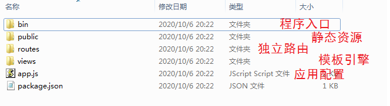
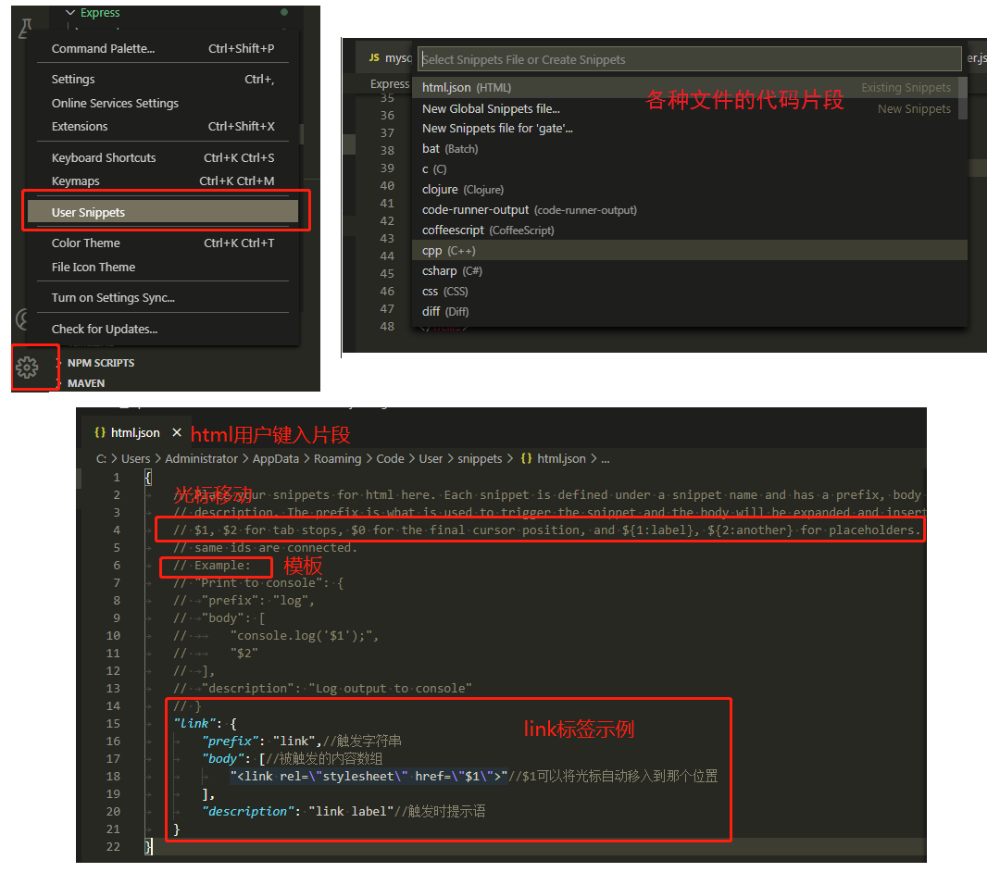
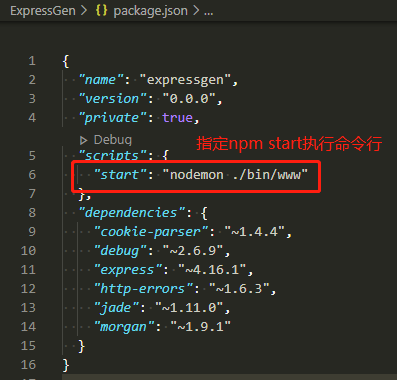

# 1.前言
## 1.1 what 

Node.js是一个基于Chrome V8引擎的JavaScript运行时。

### 特点
- chrome v8 runtime
- 事件驱动
- 非阻塞的I/O
  
    同时大量的数据处理性能好——高并发特别好。

    网络请求 数据库处理 文件的读写都是阻塞的同步的。
## 1.2 why
- 写api
- 了解前后端的交互流程
- 全栈
# 2.js
    出于安全性考虑，进行前后端分离，不是说js语言上无法实现。
## 2.1 前端js
- 基本语法
- Bom
- Dom
- ajax
## 2.2 服务器端js
- 基本语法
- 操作数据库
- 操作本地文件

限制语言能力的不是语言本身，而是运行环境（平台）

# 3. node.js

node.js是基于chrome v8引擎的js运行环境。

chrome v8**是什么**：chrome提供的能把js语言编译成系统能够识别的语言，至于v8就是第八个版本。

## 3.1 nvm

nvm英文全程也叫node.js version management，是一个[nodejs](https://github.com/coreybutler/nvm-windows/releases)的版本管理工具。nvm和npm都是node.js版本管理工具，但是为了解决node各种不同之间版本存在不兼容的问题，因此可以通过nvm安装和切换不同版本的node。

[安装包下载](https://github.com/coreybutler/nvm-windows/releases/tag/1.1.10)

- 

```bash
# 查看nvm是否安装成功
nvm -v
#
nvm install <version> [arch] 
# 可选参数arch指定安装32位还是64位版本，默认是系统位数。
#  version是特定版本也可以是最新稳定版本latest，eg：12，或者12.22.12
# 比如我想要安装12版本的，可以执行以下命令
nvm install 12
# 也可以指定具体版本号
nvm install 12.22.12

# 查看已安装的node 所有版本  
nvm ls
# 切换到对应版本
nvm use 12.22.12
```

- [【NVM】使用nvm报错“Could not retrieve https://npm.taobao.org/mirrors/node/index.json.”](https://blog.csdn.net/weixin_44490021/article/details/139328507)

## 3.2 REPL
```bash
Read Eval Print Loop 读取，解析，打印，循环
>node       //cmd 内输入，可以直接运行js代码
>1+1
>2
```
直接运行js文件

```bash
node filePath/xxx.js    #运行js文件
```
## 3.3 模块化
- 内置模块（node提供，直接用）
- 第三方模块（放在node_modules包下）
- 自定义模块（Commonjs）
    - 创建一个模块（一个js就是一个模块）
    - 导出一个模块（module.exports= name)
    - 引用一个模块并且调用(const fs=require('filepath');)
    

```js
//CommonJS定义的模块分为: 模块标识(module)、模块定义(exports) 、模块引用(require)
//a.js
module.exports={
    age:20,
    sayhello:()=>{
        console.log(`你好，我今年${this.age}岁了`)
    }
}

let a=require('./a');
console.log(a)//{ age: 20, sayhello: [Function: sayhello] }

//b.js
function sayhello(){console.log("hello")}
function smile(){console.log("smile")}
exports.sayhello=sayhello;
exports.smile=smile;

let b=require('./b');
console.log(b)//{ sayhello: [Function: sayhello], smile: [Function: smile] }

//c.js
module.exports = class Cat{
    constructor(){
        this.name="cat"
    }
    sayhello(){
        console.log(`my name is ${this.name}`);
    }
}

let Cat=require('./c');
let cat=new Cat();
console.log(Cat)//[Function: Cat]
console.log(cat.__proto__)//Cat {}
console.log(cat)//Cat { name: 'cat' }
```

模块引用require的问题：

在 Node.js 中，当你使用 `require("./index.js")` 引入一个脚本时，`index.js` 文件中的所有代码都会立即执行。这是因为 `require` 函数不仅仅是引入模块，它还会执行模块中的代码。

## 3.4 包

把一些模块整合在一起，统一管理。

包的文件结构

```bash
├── package.json	   # 包
│   ├── name           			# 包名
│   ├── main 		   			# 入口文件，指定包的入口路径
│   └── version 	   			# 版本号
├── src | lib          # 包的源码
├── doc				   # 包的说明性文档，例如readme.md
└── test			   # 测试文件
```


##  3.5 [npm](<https://www.npmjs.cn/getting-started/what-is-npm/>)

npm是nodejs内置的一套包管理工具。

### 3.5.1 [npm scripts](<http://www.ruanyifeng.com/blog/2016/10/npm_scripts.html>)

Node 开发离不开 npm，而脚本功能是 npm 最强大、最常用的功能之一。

npm 允许在`package.json`文件里面，使用`scripts`字段定义脚本命令。定义在`package.json`里面的脚本，就称为 npm 脚本。

npm 脚本的原理非常简单。每当执行`npm run`，就会自动新建一个 Shell，在这个 Shell 里面执行指定的脚本命令。因此，只要是 Shell（一般是 Bash）可以运行的命令，就可以写在 npm 脚本里面。

#### 脚本里的命令

在 `package.json` 文件的 `scripts` 部分定义的命令（例如 `{"start": "electron ."}`）会在你运行 `npm run start` 时执行。具体来说，`npm` 会在以下几个地方查找并执行 `electron` 命令：

1. 本地 `node_modules/.bin` 目录
2. 全局 `node_modules/.bin` 目录
3. 系统环境变量 `PATH`

#### 预执行代码

```json
 "scripts": {
    "prestart": "cd gai && npm run build",
    "start": "node index.js"
  },
```

`prestart` 脚本会在 `start` 脚本之前执行，并且 `prestart` 脚本必须完成执行后，`start` 脚本才会开始执行。

如果 `prestart` 脚本启动了一个长时间运行的服务（例如一个服务器进程），并且该服务不会停止，那么 `start` 脚本将永远不会执行。

## 3.6 npx

运行 `npx commandname` 会自动地在项目的 `node_modules` 文件夹中找到命令的正确引用，而无需知道确切的路径，也不需要在全局和用户路径中安装软件包。

# 4 内置模块

## 4.1 [文件系统 fs](http://nodejs.cn/api/fs.html#fs_file_system)

fs` 模块提供了用于与文件系统进行交互（以类似于标准 POSIX 函数的方式）的 API。

```js
const fs=require('fs');
//读取文件
fs.readFile('path',options,callback);
//创建文件，覆盖写入
fs.writeFile('path',data[,options],callback);
//拷贝文件
fs.copyFile('srcpath','targetpath'[,options],callback)
//追加写入
fs.appendFile()

//删除文件
fs.unlink()
//文件信息
//fs.Stats对象提供了关于文件的信息,他可以从 fs.stat()、fs.lstat()、fs.fstat()、以及它们的同步方法返回的对象都是此类型。

```

## 4.2 URL

`url` 模块用于处理与解析 URL。

统一资源定位符

```JS
const url = require('url');
url.parse()

```

## 4.3 path

```js
const path=require('path');

console.log(__dirname,__filename);
//__dirname：当前文件所在路径
//__filename：dirname + /当前文件名

//join方法可以将相对路径符去掉，换成绝对路径
let curpath=path.join(__dirname,'./index.js');
console.log(curpath);
let uppath=path.join(__dirname,'../文件系统');
console.log(uppath);
```

## 4.4 服务器http

```js
//手写nodejs静态服务器

//1.引入http模块
const http=require('http');
//2.创建服务器
const server=http.createServer();
//3.监听请求
server.on('request',(req,res)=>{
    //返回
    if(req.url==''){
        res.end('hello 3000')
    }else{
        res.end('hello guest')
    }
})
server.listen(3000,function(){
    console.log('node server runing at 127.0.0.1:3000')
})
```

## 4.5 readline

逐行读取

# 5 Express

Express是一个自身功能极简，完全是路由和中间件构成一个web开发框架：从本质上来说，一个Express应用就是在调用各种中间件。 

```js
//1.引入express
const express=require('express');
const path=require('path');
//2.创建服务
const app=express();

//中间件
const bodyParser = require('body-parser')//第三方中间件，用于解析body的数据格式
//解析post请求的请求体body
// parse application/x-www-form-urlencoded
app.use(bodyParser.urlencoded({ extended: false }))
// parse application/json
app.use(bodyParser.json())

//3.监听请求
app.get('/',(req,res)=>{//路由
    res.send('express server')
})
app.listen(3000,function(){
    console.log('http://127.0.0.1:3000')
})
```

## 5.1 [中间件](<https://blog.csdn.net/huang100qi/article/details/80220012>)

官网描述：Express是一个自身功能极简，完全是路由和中间件构成一个web开发框架：从本质上来说，一个Express应用就是在调用各种中间件。 

1. 中间件就是一个普通函数
2. 该函数有三个主要的参数 req，res，next
3. 中间件需要用use执行
   - app.use（[path]，function）
   - path：是路由的url，默认参数‘/'，意义是路由到这个路径时使用这个中间件
   - function：中间件函数
4. 中间件需要按照先后顺序执行
5. 中间件的req是共享的
6. 中间件的下一个中间件想要执行，上一个中间件一定要执行next

### Express 框架中对中间件的5种分类

- **应用级别的中间件：** 挂载到 app 上的中间件 `app.get('URL地址', （req, res, next）=> {})`；
- **路由级别的中间件：** 挂载到 router 对象上的中间件 `router.get('url地址', (req, res, next)=>{})`
- **错误级别的中间件：** 回调函数中，有四个参数 `app.use((err, req, res, next)=>{})`
- **唯一内置的中间件：** `express.static()`
- **第三方中间件：** 非express框架提供的，需要程序员手动安装才能使用的中间件；`body-parser` 解析post 表单数据

```js
//1.引入express
const express=require('express');

const logger=require('./log/logger.js');

//2.创建服务
const app=express();

//注册中间件
app.use(middleware1)
app.use(middleware2)
//use函数返回的是express的实例，支持方法链
/**
 * app.use(middleware1).use(middleware2)
*/
//通过函数返回函数的方式，创建可配置的中间件。
app.use(configableMiddleware({expandable:true}))
//
app.use(logger)
app.use(parser)


//3.监听请求
app.get('/',(req,res)=>{
    res.send('express server')
})
app.post('/form',(req,res)=>{
    console.log(req.body)
    res.send('form post')
})
app.listen(3000,function(){
    console.log('http://127.0.0.1:3000')
})
function middleware1(req,res,next){
    req.mw1name='first middleware\'s'
    console.log('第一个中间件');
    next();//要想执行下一个中间件，必须调用next()
}
function middleware2(req,res,next){
    console.log('第二个中间件',req.mw1name);//可以看到中间件之间的req是共享的
    next();
}
//可配置中间件
function configableMiddleware(options){
    return function(req,res,next){
        console.log('可配置的中间件,配置参数',options)
        next()
    }
}


//./tool/log/logger.js
const fs=require('fs');
const path=require('path');
function logger(req,res,next){
    let date=new Date();
    let data=date+'----'+req.url+'----'+req.method+'\n';
    fs.appendFile(path.join(__dirname,'./1.txt'),data,(err)=>{
        if(err) return console.log(err.message);
        console.log('日志写入成功');
        if(req.method=='post'){
            next();
        }
    })
}
module.exports=logger;

//./tool/parse/parser.js
const querystring=require('querystring');
function bodyParser(req,res,next){
    let str='';
    req.on('data',(chunk)=>{
        str+=chunk;
    })
    req.on('end',()=>{
        req.body=querystring.parse(str.toString());
        console.log(req.body);
        next()
    })
}
module.exports=bodyParser;
```

## 5.2 路由

将前端请求的url路径，同后端请求的处理函数进行映射，这个就叫做后端路由。

抽离路由模块

```js
//./router/index.js
const express=require('express')
const router=express.Router();
router.get('/router',(req,res)=>{
    res.send('router')
})
module.exports=router;

//app.js
//路由独立
const router=require('./router/index.js');
//独立出的路由犹如中间件一样被引入
app.use(router)
```


## 5.3 服务端渲染

模板引擎：art-template

1. 安装模板引擎：`npm install art-template`

2. 引入art-template，将数据和页面相结合

3. `res.end()或res.send()返回处理的内容给客户端`

   ```js
   //npm install art-template
   const artTemplate=require('art-template')
   //服务器渲染之art-template
   app.get('/serrender',(req,res)=>{
       const mockData={name:'qin',age:12}
       const dynHtml=artTemplate(path.join(__dirname,'./view/dynview.html'),mockData)
       res.end(dynHtml)
   })
   ```

   

模板引擎：ejs

1. 安装模板引擎：`npm install ejs`

2. 设置模板引擎的类型和模板的位置

3. 使用`res.render()` 返回

   ```js
   //ejs设置模板引擎的类型
   app.set('engine view','ejs');
   //ejs设置模板的位置
   app.set('views',path.join(__dirname,'./view'))//第一个参数不要随便乱改
   //服务器渲染之ejs
   app.get('/ejsrender',(req,res)=>{
       const mockData={name:'qin',age:12}
       res.render('dynHtml.ejs',mockData)
   })
   ```

## 5.4 mysql模块

```js
//安装
//npm install mysql

//使用
//1.引入mysql
var mysql = require('mysql');
//2.创建mysql连接对象
var connection = mysql.createConnection({
  host     : 'localhost',
  user     : 'root',
  password : '123456',
  database : 'offeryxq'
});
//3.开启连接
connection.connect();
//4.执行sql语句
//查
connection.query('SELECT * from student', function (error, results, fields) {
  if (error) throw error;
  console.log('The solution is: ', results);
});
//5.关闭连接
connection.end();
```


## 5.5 express生成器

安装生成器

```bash
npm install -g express-generator
```

创建项目

```bash
express <programName>
```

直接就生成了以programName的文件夹，包含下面的文件结构



修改npm start 命令所执行的命令行，在package.json中修改，scripts的start

```json
{
  "name": "expressgen",
  "version": "0.0.0",
  "private": true,
  "scripts": {
    "start": "nodemon ./bin/www"//在这里修改
  },
  "dependencies": {
    "cookie-parser": "~1.4.4",
    "debug": "~2.6.9",
    "express": "~4.16.1",
    "http-errors": "~1.6.3",
    "jade": "~1.11.0",
    "morgan": "~1.9.1",
    "mysql": "^2.18.1"
  }
}
```

在routes里面写接口。

## 5.6 restful接口规范

一般数据的增删改查在通过在接口的命名上可以看出来，/addstudent（post），/delstudent（get），/updatestudent（post），/querystudent（get）

restful接口规范：

1. 不从命名上来区分接口的功能，而是通过请求的方法来区分接口功能，
2. 接口命名唯一
3. 增：student（post），删：student（delete），改：student（put），查：student（get），

## 5.7 [apidoc](<https://apidocjs.com/>)

```bash
#安装
npm install apidoc -g
#生成
apidoc -i ./myapp -o ./apidoc
```

在项目的根目录里生成apidoc的配置文件apidoc.json，如下：

```json
{
  "name": "example",
  "version": "0.1.0",
  "description": "apiDoc basic example",
  "title": "Custom apiDoc browser title",
  "url" : "https://api.github.com/v1"
}
```

## 5.8 跨域

CORS——Cross Of Resource Share

cors是一个nodejs包，是一个Express中间件，可以使我们的应用实现跨域资源共享。

```bash
#安装
npm install cors
```

```js
//后台服务器使用
var cors = require('cors')
app.use(cors())
```

# 6 [package.json](<https://blog.csdn.net/weixin_44135121/article/details/91674772>)


```json
{
    "name": "exchange",
    "version": "0.1.0",
    "author": "zhangsan <zhangsan@163.com>",
    "description": "第一个node.js程序",
    "keywords":["node.js","javascript"],//项目关键字，帮助人们在使用npm search时找到这个包。
    "dependencies": {//生产环境依赖
        "@ant-design/icons": "^4.0.0",
        "@ant-design/pro-descriptions": "^1.0.16",
        "@ant-design/pro-layout": "^6.4.16",
    },
    "devDependencies": {//开发环境依赖
        "@ant-design/pro-cli": "^1.0.18",
        "@types/classnames": "^2.2.7",
        "@types/express": "^4.17.0"
    },
    "scripts": {//npm脚本
        "start": "react-scripts start",
        "build": "react-scripts build",
        "test": "react-scripts test",
        "eject": "react-scripts eject"
    },
    "bin": {//内部命令对应的可执行文件的路径。
        "webpack": "./bin/webpack.js"
    },
    "engines": {//项目运行的平台环境
    	"node": ">=10.0.0"
  	},
    "browserslist": {//供浏览器使用的版本列表。
        "production": [
          ">0.2%",
          "not dead",
          "not op_mini all"
        ],
        "development": [
          "last 1 chrome version",
          "last 1 firefox version",
          "last 1 safari version"
        ]
  	},
}
```


# 7 package-lock.json

其实用一句话来概括很简单，就是锁定安装时的包的版本号。

根据官方文档，这个package-lock.json 是在 `npm install`时候生成一份文件，用以记录当前状态下实际安装的各个npm package的具体来源和版本号。

```json
{
  "name": "ant-design-pro",
  "version": "4.2.1",
  "lockfileVersion": 1,
  "requires": true,
  "dependencies": {
        "@ant-design/colors": {
          "version": "3.2.2",
          "resolved": "https://registry.npmjs.org/@ant-design/colors/-/colors-3.2.2.tgz",
          "integrity": "sha512-YKgNbG2dlzqMhA9NtI3/pbY16m3Yl/EeWBRa+lB1X1YaYxHrxNexiQYCLTWO/uDvAjLFMEDU+zR901waBtMtjQ==",
          "requires": {
            "tinycolor2": "^1.4.1"
      	   }
    	},
        "@ant-design/icons": {
          "version": "4.2.2",
          "resolved": "https://registry.npmjs.org/@ant-design/icons/-/icons-4.2.2.tgz",
          "integrity": "sha512-DrVV+wcupnHS7PehJ6KiTcJtAR5c25UMgjGECCc6pUT9rsvw0AuYG+a4HDjfxEQuDqKTHwW+oX/nIvCymyLE8Q==",
          "requires": {
            "@ant-design/colors": "^3.1.0",
            "@ant-design/icons-svg": "^4.0.0",
            "@babel/runtime": "^7.10.4",
            "classnames": "^2.2.6",
            "insert-css": "^2.0.0",
            "rc-util": "^5.0.1"
          }
    	},
   } 
}
```


<h3>版本号前面的符号解释

- **插入符号^**： 匹配的是最新次要版本号，也就是第二个数字。比如：^ 1.2.3将匹配任何1.x.x版本，包括1.3.0，但将在2.0.0上停止。
- **波浪号〜**：匹配最新补丁版本号，也就是版本号的第三个数字。比如~1.2.3将匹配所有1.2.x版本，但将在1.3.0上停止。
- **星号*：**那意思就是匹配任何版本。
- **latest：**安装的永远是最新发布的版本。
- **>，>=，<，<=**：意思也很简单，就是大于，或者大于等于，小于或者小于等于后面的版本号。


# 9 [命令行程序](<https://blog.csdn.net/weixin_44786530/article/details/90166308>)

能在命令行界面上运行的程序,就是命令行程序。命令本质也是一段可执行的代码，命令只是代表着一段代码的映射。

在node日常的开发中我们看到许多命令，webpack、create-react-app、vue等等命令，这些都是别人构建好的npm包，然后映射出一个命令供我们开发使用。

在这里构建一个简单的命令mycli，使得我们在系统的任何命令行窗口都能使用mycli命令。

## 9.1 [创建命令行程序](<https://blog.csdn.net/weixin_43833570/article/details/97100520>)

### 9.1.1 代码段

```js
#!/usr/bin/env node

/**
 * 目的：采集用户信息的命令行程序
 * 通用：每一步都要判断用户输入的合法性，不合法提示重新输入。
 * 逻辑：
 * 1. 程序开始，提示用户是否进入用户信息的录入，Y/N
 * 2. 输入用户名
 * 3. 选择性别：男（1），女（2），
 * 4. 输入生日
 * 5. 选择职业，从已给出的列表中选择，也可以直接输入职业名称
 * 6. 最后提示用户是否保存，是则保存到json文件，否则退出程序
 * 7. 使用用户名作为文件名保存到当前目录下。
*/

const readline=require('readline');
const fs=require('fs');
const rl=readline.createInterface({
    input:process.stdin,
    output:process.stdout
})
let person={
    name:null,
    gender:null,
    birthday:null,
    job:null
}
let index=0;
const list=[
    {
        question:'是否进入程序，完成信息录入工作 (y/n)?',
        handler:function(answer){
            answer=answer.trim();
            if(answer===''||answer.toLowerCase()=='y'){
                console.log('进入程序,开始录入信息');
                index++;
                console.log(list[index].question)
            }else if(answer.toLowerCase()=='n'){
                console.log('取消录入，退出程序')
                process.exit(0);
            }else{
                console.log('输入不合法，请输入(y/n)?')
            }
        }
    },
    {
        question:'name：英文字符，最长不超过20个字符',
        handler:function(answer){
            answer=answer.trim();
            const regex=/^[A-Za-z]{1,20}$/
            if(regex.test(answer)){
                person.name=answer;
                index++;
                console.log(list[index].question)
            }else{
                console.log('输入不合法')
            }
        }
    },
    {
        question:'gender：male(1) / female(2)',
        handler:function(answer){
            answer=parseInt(answer.trim());
            if(answer==1||answer==2){
                person.gender=answer;
                index++;
                console.log(list[index].question)
            }else{
                console.log('输入不合法，male(1) / female(2)')
            }
        }
    },
    {
        question:'birthday，eg：2020-09-03',
        handler:function(answer){
            answer=answer.trim();
            const regex=/^[0-9]{4}-[0-9]{2}-[0-9]{2}$/
            if(regex.test(answer)){
                person.birthday=answer;
                index++;
                console.log(list[index].question)
            }else{
                console.log('输入不合法，只能输入数字和-')
            }
        }
    },
    {
        question:'请选择您的职业，工程师[1]、教师[2]、作家[3]、其他[4]',
        handler:function(answer){
            answer=parseInt(answer.trim());
            if(0<answer&& answer<5){
                person.job=answer;
                index++;
                console.log(list[index].question)
            }else{
                console.log('输入不合法，只能输入1-4')
            }
        }
    },
    {
        question:'请确认是否保存个人信息，(y/n)?',
        handler:function(answer){
            answer=answer.trim();
            if(answer===''||answer.toLowerCase()=='y'){
                fs.writeFile(`./${person.name}.json`,JSON.stringify(person),(err)=>{
                    if(err) return console.log(err.message);
                    console.log('个人信息录入成功');
                    process.exit(0);
                })
            }else if(answer.toLowerCase()=='n'){
                console.log('不保存个人信息，退出程序')
                process.exit(0);
            }else{
                console.log('输入不合法，请输入(y/n)?')
            }
        }
    },

]
rl.on('line',(input)=>{
    list[index].handler(input)
})
console.log('欢迎使用用户个人信息采集程序!');
console.log(list[index].question)
rl.resume();//如果 input 流已暂停，则 rl.resume() 方法将恢复它。
```

### 9.1.2 shebang

上面代码段中红色的`#!/usr/bin/env node`

当年创造 Unix 的人搞出它，用于**指定脚本的解释器**（也可以干其他的事情）。

shebang 作为一个 shell 脚本的**第一行**，严格的来讲*shebang 指的是 #! 这俩字符*。shebang 指定的“程序路径”，程序路径”是一个**可执行文件的绝对路径**。告诉Shell使用什么命令（这个命令在什么路径下）执行该脚本。

### 9.1.3 创建命令

在`package.json的bin下面`声明命令，并映射相应的代码段。

```json
{
  "name": "selfcommonder",
  "version": "1.0.0",
  "description": "自定义的命令程序",
  "main": "index.js",
  "scripts": {
    "test": "echo \"Error: no test specified\" && exit 1"
  },
  "bin": {
    "mycli": "index.js"//命令的名字mycli，代码入口index.js。如果当前文件夹下有index.js，就不需要加路径。
  },
  "author": "qin",
  "license": "ISC"
}
```

安装命令并使用

```bash
#在当前包下，-g全局安装，命令可以在整个系统中使用
>npm install . -g
#或者 npm link
#如同安装一般的包
#C:\Users\Administrator\AppData\Roaming\npm\mycli -> C:\Users\Administrator\AppData\Roaming\npm\node_modules\selfcommonder\index.js
#+ selfcommonder@1.0.0
#added 1 package from 1 contributor in 0.308s
#使用命令,在系统下的任何命令窗下。
>mycli
#卸载包，就相当于把命令也卸载了
>npm uninstall selfcommonder -g
```

## 9.2 命令行程序辅助工具

命令行参数读取

`commander：The complete solution for node.js command-line interfaces, inspired by Ruby's commander`

`progress：进度条工具`

3. 

# 10 VSCODE

## 10.1 vscode无法识别@别名的引用

这个问题可以通过在项目根目录下新建一个jsconfig.json。新建后，如果不生效，退出vscode，然后再次打开即可。

```json
{
  "compilerOptions": {
    "target": "ESNext",
    "baseUrl": "./",
    "paths": {
      "~/*": ["./*"],
      "@/*": ["src/*"]
    },
    "jsx": "preserve",
    "experimentalDecorators": true ,
    "allowJs": true
  },
  "resolveExtensions": [".js", ".vue", ".ts"],
  "exclude": ["node_modules", "dist"]
}
```


# log

1. 安装包：【npm install package -g/-D】-g，全局安装，-D项目安装

2. 查询包列表：【npm ls --depth 0】

3. 调用项目内部安装的模块：npx package

4. [nodemon](<https://www.jianshu.com/p/3b3b8bf9c4e9>)：它的作用是监听代码文件的变动，当代码改变之后，自动重启。

   ```bash
   #安装nodemon命令
   npm install -g  nodemon
   #运行代码，持续监听
   nodemon app.js
   ```

5. vscode代码片段



6. npm start：通过package.json指定应用程序开始执行的命令，

   

   

7. vscode快捷键

   - ALT + [↑↓]，可以将当前行往上往下移一行
   - ALT + SHIFT + [↑↓]，可以复制当前行到上一行/下一行

8. [npm install报错版本不匹配(peer啥啥啥）](https://blog.csdn.net/qq_46034741/article/details/130614821)

   - ```bash
     # 这将忽略依赖项之间的版本不匹配
     npm install --legacy-peer-deps
     ```

9. `npm --ignore-scripts` 参数用于在安装 npm 包时忽略执行 `package.json` 中定义的生命周期脚本（lifecycle scripts）。