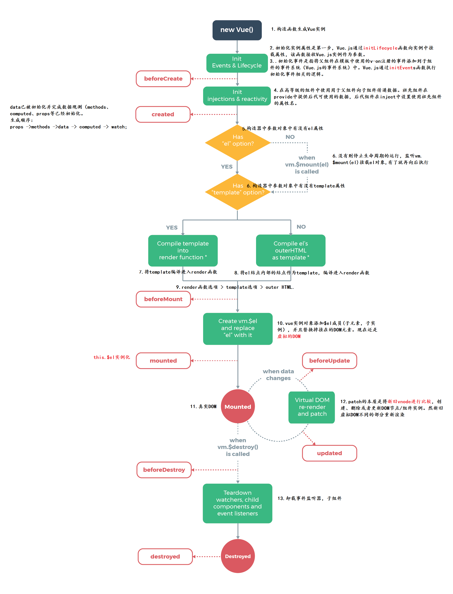

# 1 Javascript

## 1.1 ES6新增

1. `let const var`比较

   - 所谓提升就是将变量和函数提升到当前代码块的开头，这也就是为什么定义函数的位置可以放在使用函数位置的后面
     - let和const不存在变量提升。所以需要先声明后使用，不然会报错。
     - var定义的变量存在变量提升：只提升声明语句，不提升赋值语句。代码块内提升。
     - js先提升函数，后提升var变量。
   - 重复声明：let 和 const 不支持重复声明，var可以。
   - 块级作用域：let和const作用域在块级，而var在全局。
   - const声明常量，常量指向的值不可改变（包括基本类型直接量和引用类型所指向的地址值），let 声明变量。

2. 闭包

   - 就是能够读取其他函数内部变量的函数
   - javascript中，只有函数内部的子函数才能读取局部变量，所以闭包可以理解成“定义在一个函数内部的函数“。在本质上，闭包是将函数内部和函数外部连接起来的桥梁。
   - 应用场景：结果缓存，实现类和继承

   ```js
   const c=(function(){
       var a=0;
       return function c(){
           a++
           return a;
       }
   })()
   console.log(c())
   console.log(c())
   ```

3. 函数默认参数和剩余参数，扩展运算符。arguments对象

   ```js
   function paramTest(a=10,b=13,...remain){
       console.log(arguments)
       console.log(a,b,remain,remain.length);
       return a+b;
   }
   paramTest(1);//[Arguments] { '0': 1 }，，，，，，1 13 [] 0
   paramTest(2,5,);//[Arguments] { '0': 2, '1': 5 }，，，，，2 5 [] 0
   paramTest(2,5,13,16,47);//[Arguments] { '0': 2, '1': 5, '2': 13, '3': 16, '4': 47 }，，，，，，2 5 [ 13, 16, 47 ] 3
   ```

4. 箭头函数

   - 箭头函数内部的this指向函数**定义时**所在的上下文对象，而不是函数**执行时的上下文**（调用者）
   - 箭头函数是[lexically scoped](http://stackoverflow.com/questions/1047454/what-is-lexical-scope)（词法作用域），这意味着其this绑定到了附近scope的上下文。
   - 箭头函数没有arguments对象，如果有，那也是父函数的arguments对象。

   ```js
   //讨论点：参数个数，函数体的语句数，返回值
   //1.函数体只有一句，可以不写函数体的花括号，并将此句的值作为返回值直接返回
   //2.参数只有一个可以不写参数的括号，没有参数值或含有多个参数必须写括号
   
   const a=()=>"你好";
   console.log(a())
   //你好
   
   const b=param0=>param0+"，xinxin";
   console.log(b(a()))
   //你好，xinxin
   
   //3.当返回值为对象时，需要加括号
   const c=()=>({account:15,name:'qin'})
   console.log(c())//{ account: 15, name: 'qin' }
   ```

5. function的call()、apply()、bind()，[this](<https://www.cnblogs.com/evilliu/p/10816720.html>)

   - call和apply方法的作用：改变this指向，借用别的对象的方法，调用函数
   - call和apply的第一个参数是this代表的上下文对象，call的第二个参数是以列表形式传入，apply的第二个参数是以数组形式传入。
   - bind和call的参数的使用时一致的，不过bind函数返回的是一个函数，它并不执行，返回后加括号运行就可以达到和call一样的效果。

   ```js
   let obj1={
       name:'qkh',
       rename:function(newname){
           this.name=newname
       }
   }
   let obj2={
       name:'lxx'
   }
   //obj2借用了obj1的rename方法，同时也改变了rename方法里的this指向，使其指向obj2
   obj1.rename.call(obj2,'你好');
   //fun.call(obj,'lxx','你好');
   //fun.apply(obj,['lxx','你好']);
   //fun.bind(obj,'lxx','你好')();
   
   //方法才可以调用call
   console.log("obj1",obj1)//{name:'qkh',rename:f}
   console.log("obj2",obj2)//{name:'你好'}
   ```

6. prototype

   - prototype 属性使您有能力向对象添加属性和方法。
   - prototype是函数才有的属性。`__proto__`是每个对象都有的属性。
   - 函数的`prototype`的构造函数是`Object.prototype`
   - `__proto__`指向的是`constructor.prototype`(构造器的原型)
   - 原型链：当我们访问对象的一个属性或方法时，它会先在对象自身中寻找，如果有则直接使用，如果没有则会去原型对象中寻找，如果找到则直接使用。如果没有则去原型的原型中寻找,直到找到Object对象的原型，Object对象的原型没有原型，如果在Object原型中依然没有找到，则返回undefined。
   - 

   ```js
   //es5
   function Animal(name){
       this.name=name||'Animal';
       this.sleep=function(){
           console.log(this.name+"正在睡觉")
       }
   }
   Animal.prototype.eat=function(food='食物'){
       console.log(this.name+'正在吃:'+ food)
   }
   let dog=new Animal('dog');
   dog.sleep();
   dog.eat();
   console.log(dog.name)
   ```

7. `Array.prototype和Object.prototype`

   

8. [属性和方法简写](<https://blog.csdn.net/qq_36145914/article/details/88688922>)

   ```js
   const a=12;
   const c={
       a,
       b(param){
           console.log(this)//{ a: 12, b: [Function: b] }
       },
   }
   console.log(c)//{ a: 12, b: [Function: b] }
   ```

9. **解构赋值**

   ```js
   const me={
       name:'qin',
       account:0,
   }
   const decorateMe={
       ...me,
       account:1000,
   }
   console.log('解构赋值',decorateMe)
   const {name，account}=me;
   let arr=[1,2,3];
   const [a,b,c]=arr;
   
   //利用解构赋值，做变量值交换
   let a=1;
   let b=2;
   [a,b]=[b,a];
   console.log(a,b);//2,1
   
   //典型例题
   let obj={
       p:[
           'hello',
           {
               y:'abc'
           }
       ]
   }
   let {p,p:[x,{y}]}=obj;//这里两个p，会有点疑虑
   console.log(p)//[ 'hello', { y: 'abc' } ]
   console.log(x)//hello
   console.log(y)//abc
   ```

10. Object.assign()

   ```js
   const newObj=Object.assign({account:0},{name:'qin',age:23})
   console.log(newObj)
   const oldObj={name:'xin',age:22}
   Object.assign(oldObj,{name:'lixin'})//后面的对象的属性会覆盖前面属性的值，函数的第一个参数会发生改变
   console.log(oldObj)
   ```

11. Promise——为异步编程提供了方案

    - 为函数提供异步执行方案

    - Promise.all(iterable) 方法用于将多个 Promise 实例，包装成一个新的 Promise 实例。

      - 当迭代对象iterable（字符串，数组等）中的所有promise都进入完成态（都执行resolve()）时，返回完成态的promise对象，resolve()获取到所有promise resolve()返回的参数的数组
      - 当迭代对象iterable中的任一promise都进入拒绝态时，返回拒绝态的promise对象，reject()获取到当前发生拒绝发生拒绝promise的reject()传入的参数

    - Promise.race 方法同样是将多个 Promise 实例，包装成一个新的 Promise 实例。

      - 当迭代对象iterable中有一个实例率先改变状态，p的状态就跟着改变，返回对应态的promise对象

    - all如果传入的参数是一个空的可迭代对象，则返回一个**已完成（already resolved）**状态

    - race如果传入的参数是一个空的可迭代对象，则不执行任意一个状态

      

    ```JS
    //1.函数异步
    	const dispatch=(effORred,payload)=>{
            const {dispatch}=this.props;
            let p= new Promise(function(resolve,reject){
                try{
                    dispatch({type:`${theme}/${effORred}`,payload}).then((res)=>{
                        if(res!==undefined&&res!==null){
                            resolve(res);
                        }else{
                            reject();
                        }
                    });
                }catch(e){
                    reject()
                }
            })
            return p;    
        }
        dispatch('user/login',{account:'13685',password:'123456'}).then(()=>{
            //router.push('/index')
        })
    
    //2.多promise同时执行
    //Promise.all()
    //参数为可迭代对象，一般为数组。返回一个promise对象
    //当数组中不含任何promise对象时，立即进入完成态。
        Promise.all([1,2,3]).then((res)=>{
            console.log('全部执行完毕结果为：',res)//打印[1,2,3]
        }）
    //当数组中含有promise对象时，当所有promise对象全部进入完成态resolved时，返回promise对象的完成态
        let p1=new Promise((reslove,reject)=>{
                                console.log("p1");
                                setTimeout(()=>{
                                    console.log("延迟")
                                    reslove(1)
                                },3000)
                            })
        let p2=new Promise((reslove,reject)=>{
                            console.log("p2");
                            reslove('hahah')
                            })
        Promise.all([p1,p2,3]).then((res)=>{
            console.log('全部执行完毕结果为：',res)//[ 1, 'ahhah', 3 ]
        },(res)=>{
            console.log('有一个执行失败返回值为：',res)
        })
    //当数组中有一个promise对象进入rejected，返回promised对象的失败态
        let p1=new Promise((reslove,reject)=>{
                                console.log("p1");
                                setTimeout(()=>{
                                    console.log("延迟")
                                    reject(1)
                                },3000)
                            })
        let p2=new Promise((reslove,reject)=>{
                            console.log("p2");
                            reslove("ahhah")
                            })
        Promise.all([p1,p2,3]).then((res)=>{
            console.log('全部执行完毕结果为：',res)
        },(res)=>{
            console.log('有一个执行失败返回值为：',res)//1
        })
        
    ```

12. Set，Map

    ```js
    //ES6中提供了Set数据容器，这是一个能够存储无重复值的有序列表。
    //参数为可迭代对象或者不传
    //add(),has(),delete(),clear(),forEach()
    let set=new Set([1,2,3])
    set.add(4)//添加
    set.forEach((value,key,owner)=>{
        console.log('value:'+value+',key:'+key)
        owner.delete(value)//对原set进行操作
    })
    console.log(set)
    console.log(set.size)//集合大小
    set.add({a:1})
    set.add(5)
    console.log(set)
    for(item of set){
        console.log(item)
        //还可以break
    }
    console.log(set.keys())
    console.log(set.has(5))//true
    console.log(set.has({a:1}))//false
    
    //ES6中提供了Map数据结构，能够存放键值对.set(),get(),forEach(),has(),delete(),clear()
    let map=new Map([["ha",1],["you",2]])
    map.set('title',5);
    map.get("ha")
    console.log(map.size);
    ```

13. Set数据结构去重

    ```js
    //类似于数组，但是成员的值都是唯一的，没有重复。
    let arr = [1, 2, 3, 4, 2, 3, 4, 2];
    const set=new Set(arr);
    console.log(set);
    const setArr=[...set]
    console.log(setArr)
    ```

14. [生成器](<https://www.jianshu.com/p/5d1c1a434ac8>)

    - Generator生成器函数

      - ES6中引入的一种新的函数类型，这类函数不符合传统函数从运行到结束的特性，可中断

      - 定义：生成器函数在命名上比传统函数多了一个**\*号**，且在方法体内有一个yield关键字。

        ```js
        function *foo (x) {
            x++;
            let y = yield x;//yield 关键字使生成器函数暂停执行，并返回跟在它后面的表达式的当前值。返回：{value:x,done:flase}
            console.log(y);//可以看到第二次next(to_y)时，to_y的值
            y++;
            return y
        }
        ```

      - 调用：

        ```js
        // 第一步并没有执行生成器函数foo，而只是构造了一个迭代器Iterator
        var foo = foo(2);
        // 第一次next()调用实际上是启动了生成器，并执行到第一个有yield表达式的地方暂停住，next()第一次调用结束，此时*foo（）仍在运行并且时活跃的状态，只是其处于暂停状态,
        var yield_back= foo.next();
        console.log(yield_back);//{value:3,done:flase}，value就是yield关键字后面表达式的值，而done表示的是foo迭代器是否迭代完成的标识：true或false
        let to_y=4;
        let res=p.next(to_y);//给yield x前面的y做传值，如果不传，那么那边会获得一个undefined
        console.log(res)//{value:5,done:true},返回值为5，迭代结束。
        
        ```

      - 法

    - yield关键字

      - 用来暂停和继续生成器函数。我们可以在需要的时候控制函数的运行。可以说**yield是调bug时的断点符**。
      - 使生成器函数暂停执行，并返回跟在它后面的表达式的当前值。**与return类似**。
      - 但是可以使用**next(bparams)**让生成器函数继续执行函数yield后面内容，直到**遇到yield暂停或return返回或函数执行结束**。

    ```js
    
    function call(service,params) {
        service(params).then((value)=>{
            console.log("promise的value:",value);//如何将value直接返回给model的response，还需要进一步考虑
        })
            
    }
    function dispatch({model,payload}){
        const mf=model({payload},{call})
        const mf1_res=mf.next()
        console.log(mf1_res)
        const res=mf.next(mf1_res.value)
        return new Promise((resolve)=>{
            resolve(res.value)
        })
    }
    
    function *modelFun({payload},{call}) {
        console.log('进入real model,参数是：',payload)
        var response = yield call(serviceFun,payload);//3,7
        console.log('在model中得到',response);//8
        return "wancheng"
    }
    
    async function serviceFun(params){
        console.log('进入real service,参数是:',params)
        return {code:200,data:[1,3,2]}
    }
    
    dispatch({model:modelFun,payload:123}).then((res)=>{
        console.log("real dispatch的返回值：",res)
    })
    
    
    ```

15. async/await

    - async 是 ES7 才有的与异步操作有关的关键字，和 Promise ， Generator 有很大关联的。

    - async 函数返回一个 Promise 对象，可以使用 then 方法添加回调函数。then的resolve回调函数获取的是return返回的值

    - await 只能在异步函数 async function 内部使用。

      - 如果一个 Promise 被传递给一个 await 操作符，**await 将等待 Promise 正常处理完成并返回其处理结果。**

      - 如果一个非promise被传递给一个await操作符，直接返回对应的值。

      - ```js
        async function serviceFun(){
            let x=await new Promise((resolve)=>{
                setTimeout(()=>{
                    resolve(100)
                },2000)
            })
            console.log("x:",x)//100
            return x;
        }
        serviceFun().then((val)=>{
            console.log("你好",val)//100
        })
        ```

    - 应用场景：

      - 有一个按时间顺序执行的异步操作序列，我们每增加一个异步请求，就会多添加一层回调函数的嵌套。（解决异步回调地狱）

      - ```js
        async function fn1() {
            const base64Data = await download('http://1.jpg');
            const result = await saveToLocal(base64Data); 
            return result;
        }    
        async function fn2() {
            // 同时处理两张
            const promise1 = convertToBase64Data('http://1.jpg');
            const promise2 = convertToBase64Data('http://2.jpg');
            const [data1, data2] = await Promise.all([promise1, promise2]);
            // 先保存第一张
            const result = await saveToLocal(data1);
            // 再保存第二张
            const result2 = await saveToLocal(data2);
        }
        ```

      - 

      - 

      ```js
      
      ```

16. [`Proxy`代理对象](<https://www.jianshu.com/p/c2a1aa2e2b14>)

    - 监听对象
    - 应用场景：实现私有变量，抽离校验模块，访问日志，预警拦截，过滤操作，中断代理

    ```js
    var proxy = new Proxy(target, handler);
    //proxy在目标对象的外层搭建了一层拦截，外界对目标对象的某些操作，必须通过这层拦截
    //target需要被代理的对象
    //handler是target的事务处理对象
    /*
    
    // 在读取代理对象的某个属性时触发该操作，比如在执行 proxy.foo 时。
    handler.get(target, key)
     
    // 在给代理对象的某个属性赋值时触发该操作，比如在执行 proxy.foo = 1 时。
    handler.set(target, key, value)
    
    // 在判断代理对象是否拥有某个属性时触发该操作，比如在执行 "foo" in proxy 时。
    handler.has(target, key)
    
    
    // 在读取代理对象的原型时触发该操作，比如在执行 Object.getPrototypeOf(proxy) 时。
    handler.getPrototypeOf()
    
    // 在设置代理对象的原型时触发该操作，比如在执行 Object.setPrototypeOf(proxy, null) 时。
    handler.setPrototypeOf()
    
     
    // 在判断一个代理对象是否是可扩展时触发该操作，比如在执行 Object.isExtensible(proxy) 时。
    handler.isExtensible()
    
     
    // 在让一个代理对象不可扩展时触发该操作，比如在执行 Object.preventExtensions(proxy) 时。
    handler.preventExtensions()
    
    // 在获取代理对象某个属性的属性描述时触发该操作，比如在执行 Object.getOwnPropertyDescriptor(proxy, "foo") 时。
    handler.getOwnPropertyDescriptor()
    
     
    // 在定义代理对象某个属性时的属性描述时触发该操作，比如在执行 Object.defineProperty(proxy, "foo", {}) 时。
    andler.defineProperty()
    
    
    // 在删除代理对象的某个属性时触发该操作，比如在执行 delete proxy.foo 时。
    handler.deleteProperty()
    
    // 在获取代理对象的所有属性键时触发该操作，比如在执行 Object.getOwnPropertyNames(proxy) 时。
    handler.ownKeys()
    
    // 在调用一个目标对象为函数的代理对象时触发该操作，比如在执行 proxy() 时。
    handler.apply()
    
    // 在给一个目标对象为构造函数的代理对象构造实例时触发该操作，比如在执行new proxy() 时。
    handler.construct()
    */
    
    ```

17. 


## 1.2 Array方法

```js
//可通过对this的访问，修改原数组

//切合操作
1. array1.concat(array2,array3,...,arrayX)//衔接，多个数组为一个数组
2. array.slice(start, end)//切割，数组的部分元素，左闭右开

//条件操作
3. array.every(function(currentValue,index,arr), thisValue)//是否每个都满足，所有值返回为true，函数才返回true
4. array.some(function(currentValue,index,arr),thisValue)//是否部分满足,有一个返回为true就行，函数才返回true

5. array.fill(value, start, end)//把数组的部分元素填充为指定value

//遍历操作
6. array.map(function(currentValue,index,arr), thisValue)//遍历数组所有元素，按回调函数的方式返回相应的数组元素
7. array.filter(function(currentValue,index,arr), thisValue)//筛选数组元素，将返回ture的item重新组成新的数组。
8. array.forEach(function(currentValue, index, arr), thisValue)//遍历数组
9. Array.from(object, mapFunction, thisValue)//from() 方法用于通过拥有 length 属性的对象或可迭代的对象来返回一个数组。

//查找判断
10. array.find(function(currentValue, index, arr),thisValue)//返回第一个满足条件的数组元素
11. array.findIndex(function(currentValue, index, arr), thisValue)//返回第一个满足条件数组元素的索引
12. array.indexOf(item,start)//查找目标元素第一次出现的位置
13. array.lastIndexOf(item,start)//查询数组中目标元素的索引//对原数组的操作
14. array.includes(searchElement, fromIndex)//判断数组中是否包含某个元素

11. Array.isArray(obj)//判断是否为obj是否为数组
12. array.join(separator)//以separator的为分割，链接成字符串

//对数组本身的操作
14. array.pop()//弹出数组最后一个元素
15. array.push(item1, item2, ..., itemX)//压入多个元素到数组末尾
16. array.shift()//弹出数组第一个元素
17.	array.unshift(item1,item2, ..., itemX)//压入多个元素到数组首部

//顺序操作
18. array.sort()//排序，默认排序顺序为按字母升序。
				//对于数字来说，这种按字母排序的方式，会导致40会在5前面。 数字升序排列arr3.sort(function(a,b){return a-b})
19. array.reverse()//逆序

//累加压缩
20. array.reduce(function(total, currentValue, currentIndex, arr), initialValue)//接收一个函数作为累加器,最终返回累加和
19. array.toString()
```

## 1.3 Object 方法

```js
Object.assign(origin,obj1,obj2)//合并对象属性到origin对象，如果有重复的属性，靠后的对象的重复属性会覆盖靠前对象的属性。
Object.keys()//获取对象的可枚举属性key数组
Object.getOwnPropertyNames()//获取对象的属性key数组，包括不可枚举属性
Object.values()//获取对象的可枚举属性值value数组
Object.entires()//获取对象的键值对数组的数组。
Object.create(proto,caseobj)//第一个参数为新创建对象的原型对象，第二个参数新创建对象的实例对象（默认不可修改，不可枚举,也可在设置时修改默认配置)
//定义对象的新属性的配置，
Object.defineProperty(object, prop, descriptor)//descriptor：{value: 101,writable: true,enumerable: true,configurable: true}
Object.defineProperties(object,{prop1:descriptor1,prop2:descriptor2})

Object.preventExtensions(object)//阻止对象扩展新的属性
Object.isExtensible(object)//判断对象是否可扩展
Object.seal(object)//用于密封对象object。
//密封对象是指那些不能添加新的属性，不能删除已有属性，以及不能修改已有属性的可枚举性、可配置性、可写性，但可能可以修改已有属性的值的对象。
Object.isSealed(object)//判断对象是否已密封
Object.freeze(object)//用于冻结对象，冻结对象是不可变得对象，值和配置都不可变
Object.isFrozen(object)//判断对象是否已冻结

obj.hasOwnProperty(pro)//判断对象是否包含pro属性
```

## 1.4 String 方法

```js
//1.截取子字符串
stringObject.substr(start,length)//参数可负
stringObject.substring(start,stop)//参数非负
stringObject.slice(start,end)//参数可负
stringObject.charAt(index)//返回指定位置的一个字符

//2.正则表达式
stringObject.match(searchvalue|regexp)
stringObject.replace(regexp | substr,repStr|repFunction)

//3.位置
stringObject.search(regexp | substr)//返回第一个匹配子串的位置。不执行全局匹配，它将忽略标志 g。总是从开始位置进行匹配
stringObject.indexOf(searchvalue,fromindex)
stringObject.lastIndexOf(searchvalue,fromindex)

//4.字符串与数组的转换
stringObject.split( separator|regexp,maxlength)//分割字符串为数组

//5.字符串的样式
stringObject.toLowerCase()
stringObject.toUpperCase()
stringObject.strike()//加删除线


```

## 1.5 编程

1. 使用解构，实现两个变量的值的交换

   ```js
   let a=1;
   let b=2;
   [a,b]=[b,a];
   console.log(a,b);//2,1
   ```

2. 利用数组推导，计算出数组 [1,2,3,4] 每一个元素的平方并组成新的数组。

   ```js
   //ES6中将会有两种推导式:数组推导式(array comprehension)和生成器推导式(generator comprehension),
   //你可以使用它们来快速的组装出一个数组或者一个生成器对象.许多编程语言中都有推导式这一语法,比如:Python
   //规范最初起草在ECMAScript 6草案中，但在第27版（2014年8月）中被移除
   ```

## 1.6 Javascript

1. Web Worker 

   - 作用：就是为 JavaScript 创造多线程环境，允许主线程创建 Worker 线程，将一些任务分配给后者运行。在主线程运行的同时，Worker 线程在后台运行，两者互不干扰。等到 Worker 线程完成计算任务，再把结果返回给主线程。这样的好处是，一些计算密集型或高延迟的任务，被 Worker 线程负担了，主线程（通常负责 UI 交互）就会很流畅，不会被阻塞或拖慢。
   - 通信：worker线程必须通过消息完成数据交互。
   - Dom限制：无法获取document，window，parent对象，但可以获取navigator和location对象，通常用作数据处理计算。
   - 同源限制：分配给 Worker 线程运行的脚本文件，必须与主线程的脚本文件同源。

2. [cookie](<https://www.cnblogs.com/little-ab/articles/7123858.html>)

   最大空间4kb，有些浏览器规定，一个站点最多可保存20个不同path的cookie

   - name    必需。规定 cookie 的名称。
   - value   必需。规定 cookie 的值。
   - expire  可选。规定 cookie 的有效期。
   - path    可选。规定 cookie 的服务器路径。不同path对应不同cookie。
     - `path`默认值为设置该`cookie`的网页所在的目录
   - domain  可选。规定 cookie 的域名。
     - `domain`的默认值为设置该`cookie`的网页所在的域名。
     - `domain`是域名，`path`是路径，两者加起来就构成了 URL，`domain`和`path`一起来限制 cookie 能被哪些 URL 访问。
   - secure  可选。规定是否通过安全的 HTTPS 连接来传输 cookie。

3. cookie和session的区别：

   - 二者都用于会话跟踪。**Cookie通过在客户端记录信息确定用户身份（克服http无状态）**，**Session通过在服务器端记录信息确定用户身份**。
   - cookie数据存放在客户的浏览器上，session数据放在服务器上。
   - session会在一定时间内保存在服务器上。当访问增多，会比较占用你服务器的性能

4. cookie、sessionStorage、localStorage 区别：

   - 分属对象：cookie-document，sessionStorage和localStorage-window
   - 存储空间大小：cookie数据不能超过4k，sessionStorage和localStorage可以达到5M或者更大
   - 时间限制：cookie过期时间之前一直有效，sessionStorage仅在当前浏览器窗口关闭之前有效
   - 作用域：cookie和localStorage-同源窗口共享，sessionStorage-同一浏览器窗口同源域名共享
   - http请求：每次都会携带Cookie在http 头中，其余二者不参与服务器通信

5. script标签的async和defer

   - defer 指定脚本延迟执行，必须等整个页面载入之后，解析完毕之后才执行该script脚本
   - async指定脚本是否异步执行，回启动新线程，异步执行script元素。
   - 这是js 加载过程阻塞的解决方法。

6. js中!!用于变量前，将变量强行转化为对应的boolean值。

   - false：

     ```js
     undefined,null,"",-0,0,NaN,false
     ```

   - true：

     ```js
     true,1,Infinity,"string",[],{},function(){}
     ```

7. 闭包

   - 闭包就是能够读取其他函数内部变量的函数。
   - javascript中，只有函数内部的子函数才能读取局部变量，所以闭包可以理解成“定义在一个函数内部的函数“。在本质上，闭包是将函数内部和函数外部连接起来的桥梁。

8. 类的创建和继承

   - **es5创建和继承**

   - ```js
     //es5
     
     //创建
     function Animal(name){
         this.name=name||'Animal';
         this.sleep=function(){
             console.log(this.name+"正在睡觉")
         }
     }
     Animal.prototype.eat=function(food='食物'){
         console.log(this.name+'正在吃:'+ food)
     }
     let dog=new Animal('dog');
     console.log(dog.name);
     dog.sleep();
     dog.eat();
     
     //继承
     function Cat(name){
         this.name=name
         this.love='fish';
     }
     //原型链继承
     Cat.prototype=new Animal()//到new 了一个空对象,这个空对象指向Animal 并且Cat.prototype指向了这个空对象
     let cat=new Cat('cat');
     console.log(cat.name,cat.love);
     cat.eat('fish');
     cat.sleep();
     
     ```

   - **es6的类的创建与继承**

   - ```js
     //es6
     class Animal{
         constructor(name){
             console.log(this)//这里的this指向一个空对象{}
             this.name=name||"Animal";
         }
         sleep(){
             console.log(this.name+"正在睡觉")
         }
     }
     Animal.prototype.eat=function(food="食物"){
         console.log(this.name+"正在吃"+food)
     }
     let dog=new Animal('dog');
     dog.sleep();
     dog.eat();
     console.log(dog.name);
     //在es6中,类本身的类型是function，它指向constructor()函数。他依旧可以用原型链prototype来添加或修改属性和方法。
     //类不像函数一样（存在变量提升）
     
     class Dog extends Animal {
         constructor(name,love){
             //子类必须在constructor方法中调用super方法，否则新建实例时会报错。
             //这是因为子类自己的this对象，必须先通过父类的构造函数完成塑造，得到与父类同样的实例属性和方法，
             //然后再对其进行加工，加上子类自己的实例属性和方法。如果不调用super方法，子类就得不到this对象。
             super(name);
             
             this.love=love;
         }
         sleep(){//方法重写
             super.sleep()//调用父类方法
             console.log('并且睡得很香')
         }
         smile(){
             console.log("笑的很可爱")
         }
     }
     let dog=new Dog("狗","骨头")
     console.log(dog);
     dog.sleep()
     dog.eat()
     dog.smile()
     ```

   - 

9. 异步回调地狱：

   - 有一个按时间顺序执行的异步操作序列，我们每增加一个异步请求，就会多添加一层回调函数的嵌套

   - eg:

     ```js
     //文件读取
     fs.readFile('./sample.txt', 'utf-8', (err, content) => {
         let keyword = content.substring(0, 5);
         //数据查询
         db.find(`select * from sample where kw = ${keyword}`, (err, res) => {
             //http请求
             get(`/sampleget?count=${res.length}`, data => {
                console.log(data);
             });
         });
     });
     ```

   - 回调嵌套所带来的一个重要问题就是代码不易阅读与维护。

   - [解决方案](<https://www.jianshu.com/p/bc7b8d542dcd>)

     - 函数拆解

     - 事件发布和监听模式

     - Promise

     - generator：

       ```js
       function *fun{ yield }
       ```

     - async/await  (ES7)

10. 事件流

    - 事件流描述的是从页面中接收事件的顺序
    - 事件流的几个阶段：事件捕获阶段，处于目标阶段，事件冒泡阶段
    - 指定事件处理的程序的操作addEventListener（事件名，事件处理函数，boolean（事件处理阶段））

11. 事件先冒泡后捕获

    - 对于同一个事件，监听捕获和冒泡，分别对应相应的处理函数，监听到捕获事件，先暂缓执行，直到冒泡事件被捕获后再执行捕获事件。

12. 事件委托（事件代理）

    - 通过事件冒泡，父元素可以监听到子元素上事件的触发，通过判断事件发生元素DOM 的类型，来做出不同的响应。

    - 如果将事件代理用在捕获阶段，可以在父元素层面阻止事件向子元素传播，也可代替所有子元素执行某些公共的操作。

    - 比较合适动态元素的绑定，新添加的子元素也会有监听函数，也可以有事件触发机制。

    - ```html
      <ul id="ul">
          <li data-index=1>你好</li><!--这里是自定义属性，可以在该元素的dom上的dataset对象上获取到index属性-->
          <li data-index=2>lxx</li>
          <li data-index=3>再见，恋人</li>
      </ul>
      <script>
          let ul=document.getElementById("ul")
          ul.addEventListener("click",queryIndex);
          function queryIndex(event){
              console.log(event.srcElement.dataset.index)
          }
      </script>
                  
      ```

13. 懒加载和预加载

    - 懒加载：迟缓甚至不加载，减少请求数或延迟请求数。缓解前端服务器的压力。
    - 预加载：提前加载图片，当用户需要查看时可直接从本地缓存中渲染。预加载则会增加服务器前端压力。

14. mouseover与mouseenter：

    - mouseover：当鼠标移入元素或其子元素都会触发事件（子元素的over会冒泡到父元素上，导致重复触发），对应移出事件mouseout
    - mouseenter：当鼠标移入元素本身（不包含元素的子元素）会触发事件，对应移出事件mouseleave

15. new 操作符

    - 新建了一个空对象，这个对象原型`__proto__`指向构造函数的prototype，执行构造函数后返回这个对象。

16. [防抖和节流](<https://www.jianshu.com/p/b5fcb9a04b17>)

    - 防抖：触发高频事件后n秒内函数只会执行一次，如果n秒内高频事件再次被触发，则重新计算时间。

      - 将多次操作合并为一次操作进行。原理是维护一个计时器，规定在delay时间后触发函数，但是在delay时间内再次触发的话，就会取消之前的计时器而重新设置。这样一来，只有最后一次操作能被触发。

      - ```js
        //防抖debounce代码：
        //防抖分两种：延后执行和立即执行
        //延后执行
        function debounce(func,wait) {
            let timeout = null; 
            return function () {
                clearTimeout(timeout); 
                timeout = setTimeout(() => {
                    func.apply(this, arguments);
                }, wait);
            };
        }
        //立即执行
        function debounce(func,wait) {
            let timeout;
            return function () {
                if (timeout) clearTimeout(timeout);
                let callNow = !timeout;
                timeout = setTimeout(() => {
                    timeout = null;
                }, wait)
        
                if (callNow) func.apply(this, arguments)
            }
        }
        // 处理函数
        function handle() {
            console.log(Math.random());
        }
        // 滚动事件
        window.addEventListener('scroll', debounce(handle));
        ```

        

    - 节流：**指连续触发事件但是在 n 秒中只执行一次函数**

      ```js
      function throttle(fn,wait) {
          let canRun = true; 
          return function () {
              if (!canRun) return;
              canRun = false;
              setTimeout(() => { 
                  fn.apply(this, arguments);
                  canRun = true;
              }, wait);
          };
      }
      ```

17. js垃圾回收机制：

    - 必要性：由于字符串、对象和数组没有固定大小，所有当他们的大小已知时，才能对他们进行动态的存储分配。JavaScript 程序每次创建字符串、数组或对象时，解释器都必须分配内存来存储那个实体。只要像这样动态地分配了内存，最终都要释放这些内存以便他们能够被再用，否则，JavaScript 的解释器将会消耗完系统中所有可用的内存，造成系统崩溃。
    - 机制：标记清除，引用计数

18. eval函数：

    - 将对应的字符串解析成js 并执行

    - ```js
      eval("console.log(\"hahhf\");console.log(\"你好\")")
      ```

    - 应尽量避免使用eval，因为很耗性能，一次需要解析字符串，一次需要执行字符串

19. [前端模块化](<https://www.jianshu.com/p/67ce52c93392>)

    - 前端模块化就是将复杂的文件分成一个个独立的模块，解决命名冲突、文件依赖、按需加载

    - AMD（异步加载，依赖前置），CMD（异步加载，就近依赖），CommonJS（同步加载模块，就近依赖）是目前最常用的三种模块化书写规范。以及用于js 打包（编译等处理）的工具webpack

    - Commonjs：开始于服务器端的模块化，同步定义的模块化，每个模块都是一个单独的作用域，模块输出，modules.exports，模块加载require()引入模块。

      ```js
      //CommonJS定义的模块分为: 模块标识(module)、模块定义(exports) 、模块引用(require)
      //a.js
      module.exports={
          age:20,
          sayhello:()=>{
              console.log(`你好，我今年${this.age}岁了`)
          }
      }
      
      let a=require('./a');
      console.log(a)//{ age: 20, sayhello: [Function: sayhello] }
      
      //b.js
      function sayhello(){console.log("hello")}
      function smile(){console.log("smile")}
      exports.sayhello=sayhello;
      exports.smile=smile;
      
      let b=require('./b');
      console.log(b)//{ sayhello: [Function: sayhello], smile: [Function: smile] }
      
      //c.js
      module.exports = class Cat{
          constructor(){
              this.name="cat"
          }
          sayhello(){
              console.log(`my name is ${this.name}`);
          }
      }
      
      let Cat=require('./c');
      let cat=new Cat();
      console.log(Cat)//[Function: Cat]
      console.log(cat.__proto__)//Cat {}
      console.log(cat)//Cat { name: 'cat' }
      ```

    - AMD：是"Asynchronous Module Definition"的简写，也就是异步模块定义。它采用异步方式加载模块。通过define方法去定义模块，require方法去加载模块。

    - ```js
      //定义模块
      define(['module'], function() {
        let name = 'hello';
        function sayName() {
          console.log(name);
        }
        return { sayName }
      })
      
      //引入
      require(['module'], function(mod) {
         mod.sayName(); // likang
      })
      ```

    - 

20. 深拷贝

    - 深拷贝和浅拷贝最根本的区别在于是否真正获取一个对象的复制实体，而不是引用。
    - `JSON.stringify()和JSON.parse()`
    - `Objcet.assign()`
    - 迭代方式，如下：

    ```js
    function deepClone(obj){
        if(obj===null) return null;
        let newObj=Array.isArray(obj)?[]:{}
        for(let item in obj){
            newObj[item]=typeof obj[item]=='object'?deepClone(obj[item]):obj[item];
        }
        return newObj;
    }
    let test={a:1,b:function(){console.log("hah")},c:{d:"qin",e:[1,2,3]},f:[7,8,9],g:null,h:undefined}
    let b=deepClone(test);
    console.log(b)
    test.b="hah";
    console.log(b)
    console.log(test)
    ```

21. once函数

    ```js
    let once = function (fn) {
        let once = true;
        console.log("1haha")
        return function () {
          if (once) {
            once = !once;
            fn.apply(this,arguments);
          }
        };
      };
      function one(){
          console.log("hahah")
      }
      let b=once(one)
      b()
      b()
    ```

22. 将原生的ajax封装成promise：

    ```js
    let myNewAjax=function(url){
        return new Promise(function(resolve,reject){
            let xhr = new XMLHttpRequest();
            xhr.open('get',url);
            xhr.send(data);
            xhr.onreadystatechange=function(){
            if(xhr.status==200&&readyState==4){
                let json=JSON.parse(xhr.responseText);
                    resolve(json)
                }else if(xhr.readyState==4&&xhr.status!=200){
                    reject('error');
                }
            }
        })
    }
    ```

23. 对象属性配置项

    - 可枚举性enumerable：对象的属性分为可枚举和不可枚举之分，它们是由属性的enumerable值决定的，可影响下面几个操作是否可以获取属性
      - for…in
      - Object.keys()
      - JSON.stringify
    - 可配置性Configurable：设置属性是否可以被删除,属性是否可更改
    - 可写writable：属性值是否可修改

24. 手写bind

    - ```js
      Function.prototype.mybind=function(){
          let self=this;//保存函数体中的this
          let context=Array.prototype.slice.call(arguments)[0]//要本函数的第一个参数
          let args=Array.prototype.slice.call(arguments,1);//要本函数除了第一个参数以外的其他参数
          return function(){
      
              return self.apply(context,args.concat(Array.prototype.slice.call(arguments)))//结合这个函数的参数列表
          }
      }
      apple.say.mybind(leaf,1)()
      ```

25. [代码的执行顺序Event Loop](<https://segmentfault.com/a/1190000016278115?utm_source=tag-newest>)

    - 执行所有同层代码，同层代码中有同步和异步代码，同步代码实时在调用stack中运行（同步代码也包括异步声明代码）。
    - 特殊的同步代码，Promise.resolve().then()，以及promise对象里同步执行的代码。
    - 执行到异步代码会加入相应队列，队列分两种：宏队列macrotask-tasks和微队列microtask-jobs。
    - 在一个Event-loop中，先执行所有同层同步代码，再执行微队列所有job，最后执行宏队列的队首task（仅队首），然后再执行微队列所有job，再执行宏队列队首task，依次循环执行。在这个过程中如遇到异步代码，就往相应队列添加。直到调用stack、microtask、macrotask队列都为空
    - 加入到macrotask队列中的代码
      - setTimeout，最小时间间隔和浏览器有关，最小时间间隔为1，小于1的时间自动调整为1
      - setInterval
      - setImmediate (Node独有)
      - requestAnimationFrame (浏览器独有)
      - I/O
      - UI rendering (浏览器独有)
    - 加入到microtask队列中的代码
      - process.nextTick (Node独有)
      - Promise
      - *Object*.observe
      - *MutationObserver*

26. setTimeout实现setInterval

    ```js
    function setTimer(ms){
        //do something
        console.log('hahh',arguments)
        setTimeout(setTimer.bind(this,ms),ms)
    }
    setTimer(2000);
    ```

    

27. sleep()

    - 本质上都是利用promise

    - ```js
      function wakeUp(){
          console.log('睡醒')
      }
      //1.promise
      function sleep(ms){
          return new Promise((resolve)=>{
              console.log("ahh")
              setTimeout(resolve,ms)//睡完之后，执行resolve，然后.then中才能执行wakeUp
          })
      }
      sleep(2000).then(wakeUp)
      
      //2.利用async/await 
      async function sleep(ms){
          let back= await new Promise((resolve)=>{
              setTimeout(resolve,ms)
          })
          return back;
      }
      sleep(2000).then(wakeUp)
      
      //3.利用生成器generator
      function *sleep(ms){
          yield new Promise((resolve)=>{
              setTimeout(resolve,ms)
          })
      }
      sleep(2000).next().value.then(wakeUp);
      ```

    - 

28. [手写promise](<https://www.cnblogs.com/sugar-tomato/p/11353546.html>)

    ```js
    class promise{
        constructor(executor){
            //executor=(resolve,reject)=>{
            this.state='pending';
            console.log(this.state);
            this.value=undefined;
            this.error=undefined;
    
            try{
                //将this.resolve.bind(this)传递给形参resolve
                executor(this.resolve.bind(this),this.reject.bind(this))
                //注意这里必须写bind(this),否则执行时，函数内获取不到对象p的信息，也就是this指向不再是p。
            }catch(e){
                this.reject(e)
            }
        }
    
        resolve(value){
            if(this.state=='pending'){
                this.state='fulfilled'
                this.value=value;
            }
        }    
        reject(e){
            if(this.state=='pending'){
                this.state='rejected';
                this.error=e;
            }
        }
        then(onFulfilled,onRejected){
            if(this.state=='fulfilled'){
                onFulfilled(this.value)
            }
            if(this.state=='rejected'){
                onRejected(this.error)
            }
        }
    }
    let flag=1;
    let p=new promise((resolve,reject)=>{
        if(flag==1){
            console.log('成功')
            resolve(flag)
        }else{
            console.log('失败')
            reject(flag);
        }
    })
    p.then((info)=>{
        console.log(info)
    },(info)=>{
        console.log(info)
    })
    ```

29. 简单实现node中的Events模块

    - 观察者模式或者说订阅模式，它定义了对象间的一种一对多的关系，让多个观察者对象同时监听某一个主题对象，当一个对象发生改变时，所有依赖于它的对象都将得到通知。

    - node 中的Events 模块就是通过观察者模式来实现的

    - ```js
      //node中
      var events=require('events');
      var eventEmitter=new events.EventEmitter();
      eventEmitter.on('say',function(name){
      console.log('Hello',name);
      })
      eventEmitter.emit('say','Jony yu');
      ```

    - ```js
      //手写
      class Events{
          constructor(){
              this.on=function(eventName,callBack){
                  //当handles不存在时，初始化为{}
                  if(!this.handles){
                      this.handles={};
                  }
                  //事件名对应的事件是否存在，如果不存在初始化为[]
                  if(!this.handles[eventName]){
                      this.handles[eventName]=[];
                  }
                  this.handles[eventName].push(callBack);
              }
              this.emit=function(eventName,obj){
                  if(this.handles[eventName]){
                      for(var i=0;i<this.handles[eventName].length;i++){
                      this.handles[eventName][i](obj);
                      }
                  }
              }
          }
      }
      let ev=new Events();
      ev.on("say",function(name){console.log("hello"+name)});
      ev.on("say",function(name){console.log("hello"+name+'先生')});
      ev.emit("say",'li')
      ```

    - 

30. 数组去重

    ```js
    //indexOf
    function dupRemoval1(target){
        return target.filter((item,index)=>{
            return target.indexOf(item)==index;
        })
    }
    //Set
    function dupRemoval2(target){
        let set=new Set(target)
        return [...set]
    }
    ```

31. 数据类型区分

    ```js
    let arr=[1,"f",true,function(){return false},undefined,null,{},[]]
    
    console.log('---------Object.prototype.toString.call(target)--------')
    arr.map((item)=>{
        console.log(Object.prototype.toString.call(item))
    })
    
    console.log('-----------typeof(target)------------------------')
    arr.map((item)=>{
        let type=typeof(item)
        if(type=='object'){
            if(item instanceof Object && Array.isArray(item)){
                type='array';
            }else if(item instanceof Object){
                type='object';
            }else{
                type='null'
            }
        }
        console.log(type)
    })
    
    /*
    
    ---------Object.prototype.toString.call(target)--------
    [object Number]
    [object String]
    [object Boolean]
    [object Function]
    [object Undefined]
    [object Null]
    [object Object]
    [object Array]
    
    -----------typeof(target)------------------------
    number
    string
    boolean
    function
    undefined
    
    ----Object---
    null
    object
    array
    
    */
    
    ```

32. [跨域](<https://segmentfault.com/a/1190000011145364>)

    - 问题：因为浏览器的同源策略，造成浏览器不能执行其他网站的脚本。

    - 浏览器的同源策略：协议+域名+端口号，三项相同即为同源。

    - 域名相同：包括主域+子域相同，ip和对应域名的在浏览器看来域名也是不同的。

    - 解决方案：

      1、 通过jsonp跨域，利用`<script>`标签没有跨域限制，但只能实现get请求

      ```js
          //1.原生js实现 
          <script>
              var script = document.createElement('script');
              script.type = 'text/javascript';
      
              // 传参一个回调函数名给后端，方便后端返回时执行这个在前端定义的回调函数
              script.src = 'http://www.domain2.com:8080/login?user=admin&callback=handleCallback';
              document.head.appendChild(script);
      
              // 回调执行函数
              function handleCallback(res) {
                  alert(JSON.stringify(res));
              }
           </script>
          //2.vuejs中jsonp的实现
          this.$http.jsonp('http://www.domain2.com:8080/login', {
              params: {},
              jsonp: 'handleCallback'
          }).then((res) => {
              console.log(res); 
          })
      
      ```

      2、 document.domain + iframe跨域
      3、 location.hash + iframe
      4、 window.name + iframe跨域
      5、 postMessage跨域
      6、 跨域资源共享（CORS）
      7、 nginx代理跨域
      8、 nodejs中间件（cors）代理跨域
      9、 WebSocket协议跨域 

33. [`CORS`](<http://www.ruanyifeng.com/blog/2016/04/cors.html>)

    - Cross Origin Resource Sharing 跨域资源共享，
    - 它允许浏览器向跨源服务器，发出XMLHttpRequest请求，从而克服了AJAX只能同源使用的限制。
    - 分两种请求，简单请求（get post head 请求，并且头信息只有几个），非简单请求（其他请求方法）
    - 请求头信息中要写`Origin：发起请求的源域名`，服务器的响应头中`Access-Control-Allow-Origin`要允许源站发起请求，即可实现跨域资源共享

34. [js不同数据类型的值的比较，是怎么转换的，有什么规则，x==y](<https://www.jianshu.com/p/ace2c71bec3b>)

    - `==` 允许在相等比较中进行强制类型转换，而 `===` 不允许。
    - ToNumber操作：`true` 转换为 1， `false` 转换为 0。ToNumber 对字符串的处理基本遵循数字常量的相关规则 / 语法。
    - ToPrimitive操作：
      - 首先检查该值是否有 valueOf() 方法。如果有并且返回基本类型值，就使用该值进行强制类型转换。
      - 如果没有就使用 toString() 的返回值（如果存在）来进行强制类型转换。
      - 如果 valueOf() 和 toString() 均不返回基本类型值，会产生 TypeError 错误。
      - 转换的优先级是 布尔 > 字符串 > 对象
    - 基本数据类型：number，boolean，string，null，undefined
    - x与y的类型相同：
      - **都为undefined：true**
      - **null：true**
      - string：字符序列完全相同时，返回true
      - boolean：都为相同值时，返回true
      - object：**对象（包括函数和数组）的宽松相等（==）**：两个对象指向同一个值时即视为相等，不发生强制类型转换。
      - number：
        - **任意一个为NaN：false**
        - x与y为相等的数值：true
        - +0与-0：true
    - 不同类型时：显然会进行类型转换，**基本数据类型ToNumber，对象类型进行 ToPrimitive 操作**
      - **null与undefined：true**
      - number与其他类型：
        - string：number==toNumber(string)
        - boolean：number==toNumber(boolean)，true转为1，false转为0
        - **0==[]，true**
        - object，false
      - **[]与{}：false**

35. `if`判断语句：

    ```js
    let arr=[1,"str",function(){return false},{},[],Infinity,0,NaN,undefined,null]
    arr.forEach((item)=>{
        if(item){
            console.log(item+"：true")
        }else{
            console.log(item+"：false")
        }
    })
    /*
    ------true-----
    1：true
    str：true
    function(){return false}：true
    [object Object]：true
    []：true
    Infinity：true
    
    -----false-----
    0：false
    NaN：false
    undefined：false
    null：false
    */
    ```

    

36. this指向：

    - 默认绑定：全局环境中，this指向window
    - 隐式绑定：函数的上下文。
    - 隐式丢失：bind()，apply()，call()
    - new绑定：构造函数构造的对象，或者构造器中return的对象

37. 暂停死区：

    - 在代码块内，使用let、const 命令声明变量之前，该变量都是不可用的。这在语法上，称为“暂时性死区”（没有变量提升）

38. 虚拟DOM:

    - 用js对象表示真实DOM结构，当状态变更时，构造新的js对象，与旧有js对象进行比较，记录两棵树的差异应用到所构建的真DOM树上。

39. antd

    - 优点：组件全面，
    - 缺点：框架自定义程度低，默认ui风格修改困难

40. prototype，`__proto__`

    - prototype 属性使您有能力向对象添加属性和方法。
    - prototype是函数才有的属性。`__proto__`是每个对象都有的属性。
    - 函数的`prototype`的构造函数是`Object.prototype`
    - `__proto__`指向的是`constructor.prototype`(构造器的原型)

41. 下划线命名与驼峰命名之间的转换

    ```js
    function camel2_(target){
        return target.replace(/[A-Z]/g,(str)=>{
            return '_'+str.toLowerCase();
        })
    }
    function _2Camel(target){
        return target.replace(/_[a-z]/g,(str)=>{
            return str.charAt(1).toUpperCase();
        })
    }
    
    let str1='getElementById';
    let str2='get_element_by_id';
    console.log(camel2_(str1))
    console.log(_2Camel(str2))
    ```

42. `setTimeOut(fn,100)`其中100ms如何权衡

    - setTimeout()函数只是将事件插入了任务列表，必须等到当前代码执行完，主线程才会去执行它指定的回调函数，有可能要等很久，所以没有办法保证回调函数一定会在setTimeout 指定的时间内执行，100 毫秒至少是插入队列的时间+等待的时间

43. 页面之间传参：

    - url的query参数，localstorage和sessionStorage
    - 框架内的话：vue的vuex，react的react-redux，也可以通过代参跳路由

44. [继承的方式](<https://www.jianshu.com/p/0580a641eee7>)

    - 原型链继承：将父类实例作为子类的原型，实例是子类的实例也是父类的实例（`Child.prototype=new Parent();`）。缺点：实例化子类的时候没法给父类传参
    - 构造函数继承：使用父类的构造函数来增强子类实例，等于是复制父类的实例属性给子类（没用到原型）（`super()`）。缺点：没法继承原型链上的属性和方法
    - 组合式继承：通过调用父类构造，继承父类的属性并保留传参的优点，然后通过将父类实例作为子类原型，实现函数复用

45. 对象的键名计算：

    ```js
    //[]用于计算键名，就如同数组arr[i]一样。
    let a='aa';
    let obj={
        [a]:true,
        ['a'+'bc']:123
    };
    console.log(obj.aa,obj[a],obj['abc'],obj.abc)//true true 123 123
    ```

46. Json

    - **JavaScript Object Notation**，轻量级的数据交换格式
    - 值：数组，对象，数字，字符串，boolean，null。
    - JSON 是 JS 对象的字符串表示法
    - 解析容易，传输速度快
    - XML：数据的描述性更好

47. DOM树和渲染树（DOM tree和Render tree）

    - **DOM树表示页面结构，渲染树表示DOM节点如何显示。**
    - DOM树中的每一个需要显示的节点在渲染树种至少存在一个对应的节点（隐藏的DOM元素disply值为none 在渲染树中没有对应的节点）。
    - 渲染树中的节点被称为“帧”或“盒"

48. undefined 与 null ：undefined表示声明但未赋初值，null表示未存在的对象，通常用作对象的垃圾回收。

    - undefined：
      - 声明但未赋初值
      - 调用函数时，应该提供的参数没有提供（函数未传参）
      - 访问对象里没有的属性
      - 函数没有返回值，默认值为undefined
    - null：
      - 通常用作对象的垃圾回收

49. 内存泄漏：指任何对象在您不再拥有或需要它之后仍然存在。造成原因：对象循环引用，定时器忘回收，DOM 引用，闭包中的变量

50. 作用域链：当前作用域没有定义的变量，叫做自由变量，函数访问自由变量，是从祖辈作用域中一层层搜索，这样就叫做作用域链。

51. 测试代码性能的工具

    - profiler：基于web的内存分析工具
    - jsperf：代码片段性能测试工具

52. 

    

# 2 CSS

1. css盒模型：

   - 将所有元素表示为一个个矩形的盒子
   - 盒模型：content，padding，border，margin
   - 标准盒模型：content-box
   - IE盒模型：border-box

2. **scrollHeight offsetHeight clientHeight scrollTop offsetTop**，height与之对应的还有宽，top与之对应的还有left。

   - clientHeight：包括内容区和padding（padding感觉也不是很准，可见部分的大小，大致可以看做是content多一点的高度），不包括border、水平滚动条、margin的元素的高度。client代理，有代表的意思。只有实质的内容才有代表性。
   - offsetHeight：包括padding、border、水平滚动条，不包括margin。单位px，只读。offset有平板印刷的意思，指元素在页面的印刷高度。
   - scrollHeight：当没有滚动条的时候，scrollHeight 等于 clientHeight 。当有滚动条的时候，就等于clientHeight + 最大可滚动的内容高度scrollTop （包括当前可见和当前不可见部分的元素的高度）。
   - scrollTop：代表在有滚动条时，滚动条向下滚动的距离也就是元素顶部被遮住部分的高度。在没有滚动条时scrollTop==0恒成立。单位px，可读可写。
   - offsetTop: 当前元素顶部(border的外边界）距离最近使用（position属性，如果没有position属性，那就以body来定位）父元素顶部（border的内边界）的距离，页面印刷距离(能直接截图的距离）。如果当前元素的所有父元素（到有position的父元素为止），有滚动还需要加上所有父元素的滚动距离scrollTop。单位px，只读元素。

3. 画0.5px粗的线：

   - \<meta name="viewport" content="initial-scale:0.5,width:device-width">
   - transform:scaleY(0.5)

4. link标签与@import

   - 所属关系：link 属于html 标签，而@import 是css 提供的
   - 加载时间：加载页面时，`link`标签引入的 CSS 被同时加载；`@import`引入的 CSS 将在页面加载完毕后被加载。
   - 样式优先级：link > @import
   - dom可控：可以通过 JS 操作 DOM ，插入`link`标签来改变样式；而import不行

5. %长度：

   - 子元素height 和width 的百分比：
     - 是相对于子元素的直接父元素
     - width 相对于父元素的width，height 相对于父元素的height。
   - top和bottom，left和right：
     - 子元素的top 和bottom 如果设置百分比，则相对于直接非static 定位(默认定位)的父元素的高度
     - 子元素的left 和right 如果设置百分比，则相对于直接非static 定位(默认定位的)父元素的宽度。
   - padding和margin：
     - 子元素的padding 如果设置百分比，不论是垂直方向或者是水平方向，都相对于直接父亲元素的width，而与父元素的height 无关。
     - margin同样如此。
   - border-radius：
     - 相对于自身的宽高
   - line-height：
     - 相对于自身字体大小
   - font-size：
     - 相对于继承字体的大小
   - 

   

6. 如何画一个三角形：

   - ```css
     div {
         width:0px;
         height:0px;
         border-top:10px solid red;
         border-right:10px solid transparent;
         border-bottom:10px solid transparent;
         border-left:10px solid transparent;
     }
     ```

7. transition和animation的区别

   - 帧数：transition只可定义两帧的样式开始和结束。而animation可以通过定义关键帧@keyframes来指定多帧的样式
   - 事件：transition需要事件触发，而animation不需要。

   ```css
   /* transition */
   div{
       background-color:blue;
       /* transition: transform,background-color 1s; transform-property采用属性列表的时候，不能在transform这里使用*/
       transition-property: transform,background-color;
       transition-duration: 1s;
       color:#fff;
   }
   div:hover{
       background-color:green;
       transform:rotate(-90deg);
   }
   /*animation*/
   div
   {
   	width:100px;
   	height:100px;
   	background:red;
   	position:relative;
   	animation:mymove 5s infinite;
   	-webkit-animation:mymove 5s infinite; /*Safari and Chrome*/
   }
   @keyframes mymove
   {
   	from {left:0px;}
   	to {left:200px;}
   }
   ```

8. [flex布局（弹性布局）](<https://www.runoob.com/w3cnote/flex-grammar.html>)

   - 流布局的优先级大于浮动float布局

9. js动画和css动画的区别

   - 渲染线程分为main thread 和compositor thread
   - 如果只改变transform和opacity，css动画只调用compositor thread，而js会先调用main然后调用compositor。
   - transform和opacity不会引起重排重绘。

10. 块元素，行内块元素，行内元素

    - 块级元素block（可设长宽，隔离元素，div，p）
    - 行内-块元素inline-block（可~，无法~，img） ，margin/padding 水平垂直方向都有效
    - 行内元素inline（无法~，无法~，只能适应内容，span），margin 在竖直方向上无效，padding 在水平方向垂直方向都有效

11. 元素多行文本省略

    - ```css
      div{
          display: -webkit-box;
          -webkit-box-orient: vertical;
          -webkit-line-clamp: 4;            /*设置元素最大4行，父元素需填写宽度才明显*/
          text-overflow: ellipsis;
          /*text-overflow 属性，
          值为clip 是修剪文本；
          ellipsis 为显示省略符号来表被修剪的文本；
          string 为使用给定的字符串来代表被修剪的文本。*/
          overflow: hidden;
      }
      ```

12. opacity=0，visibility=hidden , display:none

    - opacity=0，隐藏不改变布局，可触发其上的点击事件
    - visibility=hidden，隐藏不改变布局，不可触发其上的点击事件
    - display:none，不渲染，没有dom对象。

13. [margin为负数](<https://www.jianshu.com/p/549aaa5fabaa>)：

    - margin-left为负值：元素增加宽度并位置会向左偏移

    - margin-right为负值：元素增加宽度

    - margin-top为负值：不会增加高度，位置向上偏移

    - margin-bottom为负值：减小高度

    - ```html
      <!--双飞翼-->
      <div class="main">
           <div class="main-content">main content</div>
      </div>
      <div class="left">left</div>
      <div class="right">right</div>
      <style>
          html
          body{
              margin:0;
              padding: 0
          }
          .main{
              float: left;
              width: 100%;
      
          }
          .main .main-content{
              margin: 0 210px;
              background-color: rgba(33, 114, 214, 0.8);
              height: 500px
          }
          .left{
              width: 200px;
              float: left;
              background-color: rgba(255, 82, 0, 0.8);
              margin-left: -100%;
              height: 200px
      
          }
          .right{
              width: 200px;
              height: 200px;
              margin-left: -200px;
              float: left;
              background-color: rgba(90, 243, 151, 0.8);
          }
      </style>
      ```

    - 

14. 双边距重叠问题

    - 多个相邻（兄弟或者父子关系）普通流的块元素垂直方向marigin 会重叠
    - 相邻外边距都为正时，上下相距以较大的margin为准。同为负，以绝对值较大的为准
    - 一正一负，为两者相加的和。

15. position

    - absolute：相对于最近的position不为static的父元素的margin外边缘进行定位，不占据原来空间
    - fixed：相对浏览器窗口，不占据原来空间
    - relative：相对于自身正常文档流进行定位，占据原来空间
    - stick：越界悬停
      - 元素定位表现为在跨越特定阈值前为相对定位relative，之后为固定定位fixed。
      - 当然悬停的效果，是子元素（悬停元素）相对于父元素的。如果父元素都消失在屏幕中，那么子元素的悬停效果就会消失。
    - z-index 属性设置元素的堆叠顺序，只能在定位元素上奏效，可以为负数，数值越大离用户越近，数值越小离用户越远，默认为0

16. css样式优先级：

    - 选择器：id 选择器>class 选择器>标签选择器>伪元素选择器>伪类选择器
    - 多样式：同一元素引用了多个样式时，排在后面的样式属性的优先级高；
    - 来源：!important > 元素内嵌（行内样式） > 文档内嵌（< style >） > 外部引入（< link >） > 浏览器

17. float 的元素

    - 定义元素的水平方向的浮动
    - 默认display为block，可设长宽，但不隔离元素

18. calc()函数

    - Calc 用户动态计算长度值，任何长度值都可以使用calc()函数计算
    - 注意：calc(100px - 10%)，例如此例中，减号前后必须保留一个空格，否则样式计算失效

19. background-color

    - 设置的背景颜色：会填充元素的content、padding、border。如果边框有透明部分（如虚线边框），会透过这些透明部分显示出背景色。

20. css 预处理器有什么

    - less、sass

21. [BFC和IFC](<https://www.cnblogs.com/zyl-Tara/p/7079708.html>)

    - Formatting Context：它是页面中的一块渲染区域，并且有一套渲染规则，它决定了其子元素将如何定位，以及和其他元素的关系和相互作用。最常见的 Formatting context 有 Block fomatting context (简称BFC)和 Inline formatting context (简称IFC)。
    - BFC，块级格式化上下文，就是页面上的一个隔离的独立容器，容器里面的子元素不会影响到外面的元素
    - BFC布局规则：
      - BFC的区域不会与float box重叠。
      - 计算BFC的高度时，内部浮动元素也参与计算（不给父节点设置高度，子节点设置浮动的时候，会发生高度塌陷）。
      - 属于**同一个**BFC的两个相邻Box的margin会发生重叠。
      - 如何创建BFC：
        - float的值不是none。
        - position的值不是static或者relative。
        - display的值是inline-block、table-cell、flex、table-caption或者inline-flex
        - overflow的值不是visible
    - 

## css布局

两列布局，三列布局（双飞翼，圣杯）

常用布局方式：`float+margin、float+overflow，position，flex，grid`

1. 响应式设计和自适应设计
   - 前者只需要开发一套界面就可以而后者需要开发多套界面来适应不同的终端；
   - 响应式设计：它会自动适应屏幕大小，响应式使用CSS @media完成设备判断。
   - 自适应设计：采取多个不同的布局设计，多个屏幕的尺寸，使用哪个布局取决于屏幕类型。其不太灵活
   - 自适应布局通过检测视口分辨率，来判断当前访问的设备是：pc端、平板、手机，从而请求服务层，返回不同的页面；
   - 响应式布局通过检测视口分辨率，针对不同客户端在客户端做代码处理，来展现不同的布局和内容。
2. 

# 3 HTML

1. 拖放api

   | 事件               | 事件监听    | 触发时机                                                     |
   | ------------------ | ----------- | ------------------------------------------------------------ |
   | 拖拽元素支持的事件 |             |                                                              |
   | drag               | ondrag      | 当拖动元素或选中的文本时触发。                               |
   | dragstart          | ondragstart | 当用户开始拖动一个元素或选中的文本时触发（见开始拖动操作）。 |
   | dragleave          | ondragleave | 当拖动元素或选中的文本离开一个可释放目标时触发。             |
   | dragend            | ondragend   | 当拖拽操作结束时触发 (比如松开鼠标按键或敲“Esc”键). (见结束拖拽) |
   | 目标容器支持的事件 |             |                                                              |
   | dragenter          | ondragenter | 当拖动元素或选中的文本到一个可释放目标时触发（见 指定释放目标）。 |
   | dragover           | ondragover  | 当元素或选中的文本被拖到一个可释放目标上时触发（每100毫秒触发一次）。 |
   | dragexit           | ondragexit  | 当元素变得不再是拖动操作的选中目标时触发。                   |
   | drop               | ondrop      | 当元素或选中的文本在可释放目标上被释放时触发（见执行释放）。 |

   触发dragstart事件后，随即会触发drag事件，而在元素被拖动期间会持续触发drag事件。

2. html语义化

   - HTML5 语义化标签是指正确的标签包含了正确的内容，结构良好，便于阅读，比如nav 表示导航条，类似的还有article、header、footer 等等标签。
   - 便于解析页面，有利于爬虫爬取数据。对搜索引擎友好，更容易被搜索引擎抓取，有利于推广。

3. iframe

   - iframe 元素会创建包含另一个文档的内联框架，可以将提示文字放在\<iframe>\</iframe>之间，来提示某些不支持iframe 的浏览器
   - 缺点：
     - 会阻塞主页面的onload 事件，需要等所有iframe页面加载完毕后 才触发onload内容。
     - 搜索引擎无法解读这种页面，不利于SEO
   - SEO（Search Engine Optimization）：汉译为[搜索引擎](https://baike.baidu.com/item/%E6%90%9C%E7%B4%A2%E5%BC%95%E6%93%8E)优化。是一种方式：利用[搜索引擎](https://baike.baidu.com/item/%E6%90%9C%E7%B4%A2%E5%BC%95%E6%93%8E/104812)的规则提高[网站](https://baike.baidu.com/item/%E7%BD%91%E7%AB%99/155722)在有关搜索引擎内的[自然排名](https://baike.baidu.com/item/%E8%87%AA%E7%84%B6%E6%8E%92%E5%90%8D/2092669)。目的是让其在行业内占据领先地位，获得[品牌](https://baike.baidu.com/item/%E5%93%81%E7%89%8C/235720)收益。很大程度上是网站经营者的一种商业行为，将自己或自己公司的排名前移。

4. DOCTYPE文档类型声明（DTD)

   - 告诉浏览器以何种方式来渲染页面
   - html5只有一个html
   - html4以前是有strict，transitional，frameset
   - 严格模式：浏览器支持的最高标准运行。
   - 混杂模式：向后兼容，模拟老式浏览器，防止浏览器无法兼容页面。

5. [`<script>`标签放在body的最后的原因](<https://blog.csdn.net/qq_42532128/article/details/102979020>):

   - 避免JavaScript操作DOM失效
   - script脚本阻塞html的解析，导致浏览器显示空白的时间增长。
   - 

6. data-属性

   - 用户自定义属性，通过对象的dataset属性获取

7. html5新特性

   - 新API
     - Web Worker 多线程环境
     - Geolocation 地理位置
     - Drag&Drop 拖动
     - Application Cache 通常用于静态资源（静态页面）的缓存。
     - Local Storage 本地存储（又分sessionStorage和localStorage）
     - SSE（Server-sent Events）服务器推送事件。可以用来从服务端实时推送数据到浏览器端。（即时通讯技术：**短轮询、Comet、Websocket、SSE**）
   - 新的多媒体标签：svg和canvas、video、audio
   - 结构和语义化标签

8. 无样式内容闪烁

   - 以无样式显示页面内容的瞬间闪烁,这种现象称之为文档样式短暂失效
   - 原因：
     - 在css中通过import导入样式，执行时机是在页面完全加载完毕后进行解析
     - `<style>`标签放在页面底部
   - 解决：在head中通过link标签引入样式文件

9. 渐进增强与优雅降级

   - 渐进增强：先解决页面基本布局，再逐渐根据需求进行完善
   - 优雅降级：先搭建一套针对于最高级浏览器最完善的功能的设计，再慢慢向下兼容

10. **假若你有5个不同的 CSS 文件, 加载进页面的最好方式是?**

    - 文件拼合压缩，较少http请求次数。考虑请求数量的同时也要考虑请求文件的大小。

11. 

# 4 React

1. 生命周期：挂载阶段，更新阶段，卸载阶段

   挂载阶段：这个阶段组件被创建，执行初始化，并被挂载到DOM中，完成组件的第一次渲染。

   - constructor()，用于初始化state和绑定方法，
   - static getDerivedStateFromProps()：此方法适用于[罕见的用例](https://zh-hans.reactjs.org/blog/2018/06/07/you-probably-dont-need-derived-state.html#when-to-use-derived-state)，即 state 的值在任何时候都取决于 props。
   - componentWillMount()，挂载前，这里不能操作dom对象，即将过时，
   - render()，这是定义组件时<span  style='color:red;'>唯一必要的方法</span>
   - componentDidMount()，挂载后，函数只执行一次，依赖于 DOM 节点的初始化应该放在这里。并可以请求后台数据。

   更新阶段：组件被挂载到DOM后，组件的props或state可以引起组件更新。

   - componentWillReceiveProps(nextProps)——porps改变会执行此函数，即将过时
   - shouldComponentUpdate(nextProps,nextState)——props改变后或state改变都会执行此生命周期，return true执行更新，返回false不执行更新操作
   - componentWillUpdate(nextProps,nextState)——更新前，即将过时
   - render()——渲染
   - componentDidUpdate(prevProps,prevState)——更新后

   卸载阶段：组件在被卸载前调用

   - componentWillUnmount：通常用来清除组件中使用的定时器，恢复数据仓库中的初始数据参数。

2. 父子组件生命周期执行过程

   - 挂载过程：父constructor->父componentWillMount->父render->子constructor->子componentWillMount->子render->子componentDidMount->父componentDidMount
   - 更新阶段：父shouldComponentUpdate->父componentWillUpdate->父render->子componentWillReceiveProps->子shouldComponentUpdate->子componentWillUpdate->子render->子componentDidUpdate->父componentDidUpdate

3. react生命周期中，最适合与服务端进行数据交互的是哪个函数——componentDidMount()

   - 如果有依赖dom的节点数据的请求，通常在此与后端进行数据交互。
   - componentWillMount即将过时，且时间和componentDidMount发生时间相差无几。
   - 挂载阶段只发生一次

4. react 性能优化是哪个周期函数——shouldComponentUpdate(nextProps,nextState)

   - 默认返回true执行页面的渲染更新
   - 更新的props和state通过对比历史的props和state来决定是否重新渲染页面，如果返回为true，执行渲染更新

5. React 中 keys 的作用是什么？

   - 是 React 用于追踪列表中哪些元素被修改、被添加或者被移除的辅助标识。
   - 在 React Diff 算法中 React 会借助元素的 Key 值来判断该元素是新近创建的还是被移动而来的元素，

6. Refs

   - 在Dom元素上使用ref属性，它的回调函数会返回DOM元素
   - 在class组件上使用ref属性，可以获取当前组件的实例。
   - 通常用作获取组件的长宽了，文本框聚焦。

7. 三种构建组件的方式：函数组件（无状态state组件），class组件，原生dom组件

8. state、props和普通属性——state组件内部的状态（对内的数据接口，可读写）。props外部状态（对外的数据接口，只读），普通属性（它与组件的渲染无关）

9. diff策略：

   - tree diff：对树分层比较（层级比较），两棵树 只对**同一层次节点** 进行比较（跨层就涉及到重新创建和删除操作）。如果该节点不存在时，则该节点及其子节点会被完全删除，不会再进一步比较。
   - component diff：
     - 同类型两个组件
       - 按照层级比较虚拟DOM
       - 从A变到B，通过shouldComponentUpdate()判断是否需要更新
     - 不同类型组件：替换组件
   - element diff：当节点处于同一层级时，diff提供三种节点操作：**删除、插入、移动**。
     - 新节点就插入，少节点就删除
     - 移动：渲染后的index>渲染前的index  就移动（最后一个节点移动到第一个节点，将会导致性能降低）

10. 虚拟DOM：javaScrip的对象。真实DOM是对结构化文本的抽象表达，就是对html文本的一种抽象描述。

11. setState：

    - 调用setState后发生了什么？——将传递给setState()的对象合并到组件的当前状态，根据状态最有效的构建新树，diff新树与旧树，更新真实DOM（和解Reconciliation）

    - ```js
      //this.setState()的参数可以是一个对象，和回调函数（它的参数为preState和props，返回值必须是一个对象）
      this.setState((preState,props)=>{
          //当状态类型是引用类型时，
          //1.数组，添加：concat or 扩展符，截取：slice，过滤：filter，修改：map
          //2.对象，Object.assign() or 扩展符
          return {...}
         }，()=>{
               //render后的回调函数      
                 })
      ```

    - props和state的更新可能是异步的，不能依赖他们来计算下一个state，所以通过传入回调函数，使用preState更为安全

12. 除了在构造函数中绑定 this，还有其它方式吗——箭头函数（词法作用域）

13. 受控组件和非受控组件：

    - 表单元素的值是由React来管理的，那么它就是一个受控组件
    - 表单元素的状态依然有表单元素自己管理，那么他就是一个非受控组件

14. super(props):

    - 在 super() 被调用之前，子类是不能使用 this 的，在 ES2015 中，子类必须在 constructor 中调用 super()。传递 props 给 super() 的原因则是便于(在子类中)能在 constructor 访问 this.props。

15. 如何告诉 React 它应该编译生产环境版本？——配置webpack方法将NODE_ENV设置为production

16. 高阶组件（HOC）：

    - 高阶组件接收React组件作为参数，并且返回一个新的组件，高阶组件本质上也是一个函数
    - 高阶组件的主要功能是封装并分离组件的通用逻辑
    - 应用场景：操纵props，状态提升，包装组件

17. props.Children

    - this.props.children的值有三种可能：undefined（没有子节点），Object（一个子节点），Array(多个子节点）
    - 系统提供React.Children.map( )方法安全地遍历子节点对象

18. React 性能优化

    - 列表渲染一定要指定key，避免将后面的子结点移动到前面的操作
    - 多个state数据变化时，集中setState，减少使用setState
    - shouldComponentUpdate减少不必要的渲染

19. f

# 5 Vue

## 5.1 生命周期

1. 生命周期：vue生命周期是指vue实例对象从创建之初到销毁的过程,vue所有功能的实现都是围绕其生命周期进行的,在生命周期的不同阶段调用对应的钩子函数实现组件数据管理和DOM渲染两大重要功能。
   - 实例创建阶段
     - beforeCreate()：在new一个vue实例后，只有一些默认的生命周期钩子和默认事件，其他的东西都还没创建。
       - 在beforeCreate生命周期执行的时候，data和methods中的数据都还没有初始化。不能在这个阶段使用data中的数据和methods中的方法
       - data，computed，watch，methods 上的方法和数据均不能访问。
       - 可以在这加个loading事件。
     - created()：data 和 methods都已经被初始化好了，如果要调用 methods 中的方法，或者操作 data 中的数据，最早可以在这个阶段中操作
       - 可访问 props，methods data computed watch 上的方法和数据。
       - 初始化完成时的事件写在这里，异步请求也适宜在这里调用（请求不宜过多，避免白屏时间太长）。
       - 可以在这里结束loading事件，还做一些初始化，实现函数自执行。
       - 未挂载DOM，若在此阶段进行DOM操作一定要放在Vue.nextTick()的回调函数中。

   - 挂载阶段

     - beforeMount()：执行到这个钩子的时候，在内存中已经编译好了模板了，但是还没有挂载到页面中，此时，页面还是旧的
       - 挂载前，虽然得不到具体的DOM元素，但vue挂载的根节点已经创建
     - mounted()：执行到这个钩子的时候，完成创建vm.$el和双向绑定，就表示Vue实例已经初始化完成了。此时组件脱离了创建阶段
       - 完成挂载DOM和渲染，可在mounted钩子函数中对挂载的DOM进行操作。
       - 可在这发起后端请求，拿回数据，配合路由钩子做一些事情。

   - 更新阶段

     - beforeUpdate()：当执行这个钩子时，页面中的显示的数据还是旧的，data中的数据是更新后的， 页面还没有和最新的数据保持同步
     - updated()：页面显示的数据和data中的数据已经保持同步了，都是最新的

   - 销毁阶段

     - beforeDestroy()：Vue实例从运行阶段进入到了销毁阶段，这个时候上所有的 data 和 methods ， 指令， 过滤器 ……都是处于可用状态。还没有真正被销毁
       - 返回false将会取消页面销毁，可做一些删除提示，如：您确定删除xx吗？
     - destroyed()：这个时候上所有的 data 和 methods ， 指令， 过滤器 ……都是处于不可用状态。组件已经被销毁了。

   - 

     

     

2. 第一次页面加载会触发哪几个钩子:

   - beforeCreate()，created()
   - deforeMount()，mounted()

3. 父子组件生命周期的执行顺序：

   - 挂载过程：父beforeCreate->父created->父beforeMount->子beforeCreate->子created->子beforeMount->子mounted->父mounted
   - 更新过程：父beforeUpdate->子beforeUpdate->子updated->父updated
   - 销毁过程：父beforeDestroy->子beforeDestroy->子destroyed->父destroyed

4. 

## 5.2 Vue-router

vue-router是Vue.js官方的路由插件，它和vue.js是深度集成的，适合用于构建单页面应用。vue的单页面应用是基于路由和组件的，路由用于设定访问路径，并将路径和组件映射起来。传统的页面应用，是用一些超链接来实现页面切换和跳转的。在vue-router单页面应用中，则是路径之间的切换，也就是组件的切换。

```js
import Home from './src/home'
const router = new VueRouter({
  mode: 'history',
    routes: [
        {
            path:'/home',
            component:Home
        },
        { 
            //嵌套路由
            path: '/user/:id', component: User,
      		children: [
        		{
          			// 当 /user/:id/profile 匹配成功，
          			// UserProfile 会被渲染在 User 的 <router-view> 中
          			path: 'profile',
          			component: UserProfile
        		},
            ]
        },
        {
            path:'/home-*',//匹配以home-开头的路由
            component:Home
        }
        {
            path:'*',//匹配所有路由，用于404页面提示
            component:NotFound
        }
    ]
})
```


1. vue-router提供了什么组件？

   - \<router-link class='active-class'>路由入口
   - \<router-view>路由出口
   - \<keep-alive>缓存组件

2. 动态路由

   url：:param1/:param2/:param3?query1=1&query2=2

   在this.$route.params，this.$route.query

3. 导航钩子（路由守卫）

   - 全局级：beforeEach，afterEach
   - 路由级：beforeEnter
   - 组件级：beforeRouteEnter，afterRouteEnter，beforeRouteLeave

4. route和router的区别

   - router是VueRouter的一个对象，通过Vue.use(VueRouter)和VueRouter构造函数得到一个router的实例对象，这个对象中是一个全局的对象，他包含了所有的路由包含了许多关键的对象和属性。this.$router
   - route是一个跳转的路由对象，每一个路由都会有一个route对象，是一个局部的对象，可以获取对应的name,path,params,query等。this.$route

5. vue-router响应路由参数的变化

   - 监听器

     ```js
       watch: {
         $route(to, from) {
           // 对路由变化作出响应...
         }
       },
     ```

   - 路由导航钩子

6. vue-router传参

   - 函数式传参
   - 动态路由
   - 路由查询参数

7. vue-router的两种模式

   - hash：前端路由，可以在`window`对象上监听这个事件（window.hashChange），只能改变#后面的url片段，hash发生变化的url都会被浏览器记录下来，但不会请求后端。
   - history：后端路由，刷新会实实在在的请求后台

8. 懒加载路由

   - import()
   - webpack的异步块


## 5.3 Vuex

Vuex 是一个专为 Vue.js 应用程序开发的**状态管理模式**。它采用集中式存储管理应用的所有组件的状态。

1. vuex有哪几种属性：

   - State , Getter , Mutation , Action , Module

   - state：存放数据（各组件状态）的仓库。

   - getter：用来获取数据，类似于页面的计算属性。

   - mutation：修改数据的同步方法。

     - ```js
       //组件中，提交mutation
       this.$store.commit('addCount')
       //mutation方法
       addCount(state){state.count++}
       ```

   - action：提供异步方法，提交mutation修改仓库数据。

     - ```js
       //组件中，提交mutation请求
       this.$store.dispatch('queryWeather',{address:'chengdu',type:'now'})
       //store仓库中，并提交mutation
       queryWeather:function({ commit, state },params){
           //fetch浏览器自带请求方法
                   let url=`https://free-api.heweather.net/s6/weather/now?location=chengdu&key=db7f3a13f1ef48168d4045817776ffb2`
                   fetch(url,{method:"GET"}).then((res)=>res.json()).then((res)=>{
                       console.log('action的天气数据',res)
                       commit('setWeather',res)
                   })
       }
       ```

   - module：仓库的模块化。

   - 支持各种映射方法将仓库中的状态或方法**单向**映射到组件：`mapState，mapGetters，mapActions，mapMutations`

## 5.4 基本问题

1. v-if和v-show的区别

   - v-if依赖于控制DOM节点，而v-show是依赖于控制DOM节点的display属性。
   - **v-if 有更高的切换开销，v-show有更高的初始渲染开销。**
   - v-if判断是否加载，可以减轻服务器的压力。v-show调整DOM元素的CSS的dispaly属性，可以使客户端操作更加流畅。

2. 父子组件传值

   - 父to子：props
   - 子to父：
     - `触发当前实例的方法：this.$emit( eventName, […args] )`
     - 调用父组件传递给子组件的方法。

3. 让css样式只在本组件中生效

   - `<style scoped>`

4. 获取dom

   - 原生：`document.getElementById()`
   - 框架：`this.$refs.refname`

5. vue-loader

   - 基于webpack的一个的loader，解析和转换 .vue 文件，提取出其中的逻辑代码 script、样式代码 style、以及 HTML 模版 template
   - 再分别把它们交给对应的 Loader 去处理，核心的作用，就是提取。

6. v-modal

   - v-model 在内部为不同的输入元素使用不同的 property 并抛出不同的事件
   - 以此实现数据的双向绑定

7. computed与watch：

   - computed：计算属性，是存放在data外的一种属性，其值依赖其他一些属性的值，当其他一些属性发生变化时，它的值也会根据计算式发生相应的变化。
   - watch：用于监听某个属性，一旦某个属性发生变化，就会触发某个方法。

8. vue组件中data为什么必须是一个函数

   - 每个实例可以返回一份被返回对象的独立拷贝。可以使同一组件之间的状态互不影响

9. `this.$nextTick(callback)`

   - 将回调延迟到下次 DOM 更新循环之后执行。
   - 它跟全局方法 `Vue.nextTick` 一样，不同的是回调的 `this` 自动绑定到调用它的实例上。

10. v-on 可以监听多个事件吗

    - ```html
      <button v-on="{mouseenter: onEnter,mouseleave: onLeave}">鼠标进来1</button>
      <button @mouseenter="onEnter" @mouseleave="onLeave">鼠标进来2</button>
      ```

11. 事件对象$event

    - ```html
      <button v-on:click="warn('Form cannot be submitted yet.', $event)">
        	Submit
      </button>
      <script>
           export default{
              data(){
                  return{}
              },
              methods:{
                  warn: function (message, event) {
          			// 现在我们可以访问原生事件对象
                      if (event) {
                          event.preventDefault()
                      }
                      alert(message)
                  }
              }
          }
      </script>
      ```

    - 

12. [单页面与多页面应用的优缺点](<https://blog.csdn.net/jiang7701037/article/details/93243545>)：

    - 单页面：一个html页面容器+很多组件，单页面是一次性把web应用的所有代码（HTML，JavaScript和CSS）全部请求过来（首次加载太慢会考虑按需加载。加载某个组件时，js会动态切换html容器中的内容。
    - 多页面应用：每次进入新的页面，都需要向服务器发送请求，要整个页面的所有代码。而且，多次操作后，再次进入该页面时，还得再次请求。不但浪费了网络流量，更重要的是有延迟，用户友好性和用户体验都不好。

13. [过滤器](<https://www.cnblogs.com/qdwds/p/11564467.html>)

    - Vue.js允许自定义过滤器，可被用于一些常见的文本格式化。过滤器可以用在两个地方：双花括号插值和v-bind表达式。过滤器应该被添加在JavaScript表达式的尾部，由“管道”符号指示；

    - ```js
      //  template
        <div>{{str | length(9) }}</div>
        <div>{{str1 | length(9) | toUpperCase}}</div>
        
      //  script
       data() {
          return {
            str: "公众号“前端伪大叔”，欢迎大家前来关注！",
            str1:'qianduanweidashu'
          };
        },
      //  这里filters是这个对象
        filters: {
      //  自行输入长度
          length(e, num) {
            return e.slice(0, num) + "...";
          },
      //  转为大写
          toUpperCase(e) {
            return e.toUpperCase();
          }
        }
      ```

    - 

14. v-if和v-for的优先级

    - `v-for > v-if，它会遍历数组所有元素，然后再执行条件渲染。`
    - v-if应该用函数去过滤数组，然后遍历数组中所有元素。

15. assets和static的区别

16. vue常用的修饰符

    - 事件处理修饰符：`.once，.stop，`
    - 按键修饰符：`.enter，.left`

17. vue数组/对象的更新检测

    - `vm.$set( target, propertyName/index, value )`
    - `vm.$delete( target, propertyName/index )`

    - 数组更新检测：
      - 变异方法（push），无须再进行赋值操作。
      - 非变异方法（filter）：需要再进行赋值操作。
      - vue不能检测到：
        - `vm.items[0]=value，解决：vm.$set(vm.items, indexOfItem, newValue)`
        - `vm.items.length=0，解决：vm.items.splice(newLength)`
    - 对象更新检测：
      - Vue不能检测到对象的添加或者删除
      - `Vue.set(vm.object, key, value)`
      - `vm.object=Object.assign({},vm.object,{key1:val1,key2:val2})`

18. [自定义指令](<https://cn.vuejs.org/v2/guide/custom-directive.html#ad>)：

    - 有的情况下，你仍然需要**对普通DOM元素进行低层操作**，这时候就会用到自定义指令。

    - ```js
      //局部定义组件
      directives: {
        focus: {
          // 指令的定义
          inserted: function (el) {
            el.focus()
          }
        }
      }
      ```

    - 

19. vue两个核心点：

    - 组件
    - 数据驱动

20. jquery和vue的区别：

    - jquery本质上还是操作dom来改变页面，数据和视图是在一起的。
    - vue基于mvvm（并不完全遵循），将视图和模型通过vue对象双向绑定在一起。
    - react是一个单向数据流的库（`state->view->new state->new view`)

21. [引入组件的步骤](<https://www.cnblogs.com/e0yu/p/10795176.html>)：

    - 首先通过import引入，其次在components中注册，最后在template中使用。
    - 注意组件中的大写，需要用短横线+对应小写替代。

22. vue router和location.href的用法区别：

    - 页面是否重新加载：vue-router使用**history.pushState**进行路由更新，**静态跳转，页面不会重新加载**；location.href会触发浏览器，页面重新加载一次
    - vue-router使用diff算法，实现按需加载，减少dom操作
    - vue-router是路由跳转或同一个页面跳转；location.href是不同页面间跳转；

23. Vue2中注册在router-link上事件无效解决方法：

    - <Son @click.**native**=‘handler1’>

24. vue双向绑定原理

    - view->data，通过事件监听，即可绑定
    - data->view，通过`Object.defineProperty()`对属性设置一个set函数，通过数据改变时，函数式的更新view

25. 

## 5.5. 编程

1. 顶部悬停效果

   position:sticky是css定位新增属性；

   可以说是相对定位relative和固定定位fixed的结合；

   它主要用在对scroll事件的监听上；

   它的表现类似`position:relative`和`position:fixed`的合体，在目标区域在屏幕中可见时，它的行为就像`position:relative;` 而当页面滚动超出目标区域时，它的表现就像`position:fixed`，它会固定在目标位置。

   当然悬停的效果，是子元素（悬停元素）相对于父元素的。如果父元素都消失在屏幕中，那么子元素的悬停效果就会消失。

   ```html
   <!DOCTYPE html>
   <html>
       <head>
           <title>
               position sticky
           </title>
       </head>
       <body>
           <div>
               <div class='one'>
                   one
               </div>
               <div class='two'>
                   two
               </div>
               <div class='one'>
                   one
               </div>
               <div class='one'>
                   one
               </div>
               <div class='three'>
                   three
               </div>
               <div class='one'>
                   one
               </div>
               <div class='one'>
                   one
               </div>
               <div class='one'>
                   one
               </div>
              
           </div>
           <div>
               --------------------------------------------------------------------------------------------
           </div>
           <div>
               <div class='one'>
                   one
               </div>
               <div class='one'>
                   one
               </div>
   
               <div class='three'>
                   four
               </div>
               <div class='one'>
                   one
               </div>
               <div class='one'>
                   one
               </div>
               <div class='one'>
                   one
               </div>
               <div class='one'>
                   one
               </div>
           </div>
           <style>
               html body{
                   height:100vh;
                   width:100%;
                   margin:0;
               }
               .one{
                   height: 200px;
                   background-color:#00f;
               }
               .two{
                   position:sticky;
                   height:100px;
                   top:0px;
                   background-color:#f00;
               }
               .three{
                   position:sticky;
                   height:100px;
                   top:0px;
                   background-color:#0f0;
               }
           </style>
       </body>
   </html>
   ```

   

2. 


1. 

# 6 操作系统

1. 死锁：

   - 所谓死锁就是多个进程因竞争资源而造成的一种僵局，若无外力作用，这些进程都无法向前推进。
   - 死锁产生的原因
     - 系统资源竞争
     - 进程推进顺序非法
     - 必要条件：以下缺一，死锁不生。
       - 互斥条件
       - 不剥夺条件
       - 请求并保持条件
       - 循环等待条件
     - 死锁避免：银行家算法（计算进程最大需要，查看现有资源，满足则分配，不满足则推迟分配），系统安全状态。

2. 进程与线程

   - **进程是资源分配的最小单位，线程是CPU调度的最小单位**
   - 一个进程可包含多个线程，
   - **进程就是上下文切换之间的程序执行的部分。是运行中的程序的描述，也是对应于该段CPU执行时间的描述。**
   - **线程是共享了进程的上下文环境，的更为细小的CPU时间段。线程主要共享的是进程的地址空间。**

3. 操作系统中采用缓冲技术是为了增强系统的并行操作能力。

   

# 7 计算机网络


1. CDN：

   - content delivery network ，即内容分发网络
   - 基本原理：广泛采用各种缓存服务器，将这些缓存服务器分布到用户访问相对集中的地区或网络中。在用户访问时，利用全局负载技术将用户的访问，指向距离最近的正常工作的缓存服务器上，由缓存服务器直接响应。

2. DNS：

   - domain name system，域名系统，
   - 它作为将域名和ip地址相互映射的一个分布式数据库。域名总长度则不能超过253个字符。

3. 计算机网络模型：

   - 七层模型：
     - 谐音：物联网谁会使用
     - 物理层，二进制数据在物理媒介上传输
     - 链路层，封装成帧，差错控制，流量控制
     - 网络层，为分组进行路由选择，
     - 传输层，为端对端连接提供可靠的传输服务，TCP和UDP
     - 会话层，建立，管理，和终止进程间的会话
     - 表示层，数据格式化，代码转换，数据加密
     - 应用层：文件传输，常用http，文件传输ftp，电子邮件smtp
   - tcp/ip层模型：
     - 链路层
     - 网络层
     - 传输层
     - 应用层

4. TCP和UDP

   - User Datagram Protocol（用户数据报协议） 和 Transmission Control Protocol（传输控制协议）

     

5. HTTP的缓存机制

   - HTTP 缓存即是浏览器第一次向一个服务器发起HTTP 请求后，服务器会返回请求的资源，并且在响应头中添加一些有关缓存的字段如：cache-control，expires，last-modifed，ETag,Date等，之后浏览器再向该服务器请求资源就可以视情况使用强缓存和协商缓存，
   - 强缓存：浏览器直接从本地缓存中获取数据，不与服务器进行交互。
   - 协商缓存：浏览器发送请求到服务器，服务器判断是否可使用本地缓存。

6. 网站的文件资源进行优化

   - 文件合并压缩
   - 使用CDN托管（缓存服务器，最近响应）
   - 使用缓存

## http与浏览器

1. http报文结构：

   - 开始行：用于区分是请求报文还是，响应报文。请求报文的开始行称为请求行，响应报文的开始行为状态行
     - 请求行：方法（get，post、connect、head...）、URL、http版本
     - 状态行：版本，状态码、短语
   - 首部行：用来说明浏览器，服务器或请求报文主体的一些信息
   - 实体主体：添加任意的其他数据[称之为主体（body，body通常也包含首部行）

2. http八种请求方法：

   - 表明对Request-URL指定的资源不同的操作方式
   - http1.0 
     - GET：向特定资源发出请求（请求指定页面信息，并返回实体主体）
     - POST：向指定资源提交数据进行处理请求（提交表单、上传文件），又可能导致新的资源的建立或原有资源的修改
     - HEAD：get请求类似，返回的响应中没有具体内容，用于获取报头（用于检查超链接的有效性）
   - http1.1增加了
     - OPTIONS：返回服务器针对特定资源所支持的HTML请求方法
     - PUT：向指定资源位置上上传其最新内容（从客户端向服务器传送的数据取代指定文档的内容）
     - DELETE：请求服务器删除request-URL所标示的资源
     - TRACE：回显服务器收到的请求，用于测试和诊断
     - CONNECT ：能够将连接改为管道方式的代理服务器

3. [get与post的区别](<https://www.zhihu.com/question/28586791>)：

   - 浏览器的get和post：“GET请求没有body，只有url，请求数据放在url的querystring中；POST请求的数据在body中“。但这种情况仅限于浏览器发请求的场景。
   - 接口中的get和post：GET实际上也可以带body，POST也可以在url上携带数据。
   - 关于安全性：post比get要好一点，但这个在安全问题面前影响很小，一般情况下，私密数据传输用POST + body就好。
   - 关于编码：GET的参数只能支持ASCII（url上只支持ASCII），而POST能支持任意binary（body支持任意编码），包括中文。但用作接口时，GET实际上也可以带body，POST也可以在url上携带数据。
   - 关于url长度：http没有做长度限制，只是说浏览器做了长度显示，2048个字符。GET数据有长度限制。
   - GET 产生一个TCP 数据包；POST 产生两个TCP 数据包。

4. [http状态码](<https://www.cnblogs.com/xflonga/p/9368993.html>)：

   - 1xx：通知，系列响应状态码仅在与HTTP服务器沟通时使用。
   - 2xx：成功，系列响应状态码表明操作成功了
   - 3xx：重定向，客户端需要做些额外工作才能得到所需要的资源。 
     - 301：Moved Permanently 永久移动。请求的资源已被永久的移动到新URI，返回信息会包括新的URI，浏览器会自动定向到新URI。今后任何新的请求都应使用新的URI 代替。
     - 302：Found，服务器目前从不同位置的网页响应请求，但请求者应继续使用原有位置来继续以后的请求。
     - 304：Not Modified 未修改。所请求的资源自上次访问后，请求的内容未修改，服务器返回此状态码时，不会返回任何资源。客户端通常会缓存访问过的资源，通过提供一个头信息指出客户端希望只返回在指定日期之后修改的资源。
   - 4xx：客户端错误，表明客户端出现错误。不是认证信息有问题，就是表示格式或HTTP库本身有问题。
     - 400（Bad Request）：请求无效，前端提交数据的字段名称和字段类型与后台的实体没有保持一致，协商不一致
     - 401（Unauthorized）：当前请求需要用户验证，客户端试图对一个受保护的资源进行操作，却又没有提供正确的认证证书（登录等）。
     - 403（Forbidden）：服务器已经得到请求，但是拒绝执行。常用于一个资源只允许在特定时间段内访问，或者允许特定IP地址的用户访问的情况。
     - 404（Not Found）：服务器无法把客户端请求的URI转换为一个资源。
   - 5xx：服务端错误，这些代码意味着服务器处于不能执行客户端请求的状态，此时客户端应稍后重试。
     - 500（Internal Server Error）：服务器如果在执行请求处理代码时遇到了异常，它们就发送此响应代码。
     - 502 （bad gateway）：表明代理方面出现问题，或者代理与上行服务器之间出现问题，而不是上行服务器本身有问题。
   - 

   

5. [HTTP消息头](<https://blog.csdn.net/qq_30553235/article/details/79282113>)

   - 用来准确描述正在获取的资源、服务器或者客户端的行为，定义了HTTP事务中的具体操作参数。

6. [http与https](<https://blog.csdn.net/xiaoming100001/article/details/81109617>)

   - http：
     - 超文本传输协议，互联网上应用最为广泛的一种网络协议,所有的WWW文件都必须遵守这个标准。设计HTTP的初衷是为了提供一种发布和接收HTML页面的方法。
     - HTTP 协议有一个缺陷：通信只能由客户端发起。
     - 是一个基于请求与响应，无状态的，无连接应用层的协议，常基于TCP/IP协议传输数据。
       - 无状态：协议对客户端没有状态存储，对事务处理没有“记忆”能力。第一次访问和第二次访问同一个服务器响应相同。通常用Cookie/Session加数据库的方式来跟踪用户的行动
       - 无连接：在http1.1以前，每次访问都需要通过Tcp的三次握手四次挥手，和服务器重新建立连接。HTTP/1.1持久连接Connection：keep-alive，手动断连。
       - 基于请求和响应，客户端发起请求，服务器响应
       - 优点：简单快速灵活
       - 缺点：明文传输，请求和响应不需要通信双方的确认，无法保证数据的完整性。
   - https：
     - 基于HTTP协议+SSL或TLS协议，通过提供SSL或TLS加密处理数据(采用混合加密技术)、验证对方身份(通过证书认证)以及数据完整性保护(防止篡改和冒充)
     - 安全低效，有偿享用。

7. http三次握手四次挥手

   - 三次握手
     - 客户端发起连接请求syn=1
     - 服务器收到请求连接报文后，如同意建立连接，为该tcp连接分配tcp缓存和变量，并回复确认，syn=1，ack=1。
     - 客户端收到确认报文后，也要为该连接分配tcp缓存和变量，并回复确认Ack=1。
   - 四次挥手
     - 客户请求释放连接发送Fin=1，并停止发送数据，主动关闭其中一条数据通路。
     - 服务器收到连接释放报文后，即发出确认Ack=1，关闭从客户端到服务器方向的连接释放。但服务器若发送数据，客户端仍要接受（连接半关闭）
     - 若服务器没有要向客户端发送的数据，就发送Fin=1，Ack=1
     - 客户端收到连接释放报文后，发出确认Ack=1，等待2MSL后，连接释放。

8. [http2.0](<https://www.zhihu.com/question/34074946>)

   - 多路复用
     - http1.1浏览器客户端在同一时间，针对同一域名下的请求有一定数量限制。超过限制数目的请求会被阻塞，可以通过多CDN(content delivery network）解决同一域名请求的数量限制。
     - 
     - 而 HTTP/2 的多路复用(Multiplexing) 则允许同时通过单一的 HTTP/2 连接发起多重的<strong>请求-响应</strong>
     - 
   - 服务器推送
     - 在 HTTP/2 中，服务器可以对客户端的一个请求发送多个响应。比如说一个页面
     - 服务器推送还有一个很大的优势：可以缓存
   - 二进制分帧
     - 在应用层与传输层之间加了一个分帧层
     - HTTP/2 会将所有传输的信息分割为更小的消息和帧
     - 实现低延迟和高吞吐量
   - 首部压缩

9. Websocket

   - HTTP 的生命周期通过Request 来界定，也就是Request 一个Response。http1.1 connection:keep-alive可以保持一个连接，发送多个请求。
   - 是基于http协议的，握手阶段采用http协议。
   - http=》https，ws=》wss。
   - 服务器可以主动向客户端推送信息，客户端也可以主动向服务器发送信息，是真正的双向平等对话。
   - Upgrade:webSocket     Connection:Upgrade多这两个属性。

10. Web Quality - 无障碍

- 能够被残障人士使用的网站才能称得上一个易用的（易访问的）网站。
- 例如：字体大小调节，alt媒体文件转换（图片无法展示：语音浏览器）

11. BOM浏览器对象

    - location：当前文档地址URL
    - history：浏览历史
    - navigator：浏览器信息

12. 常见web安全及防护原理

    - [sql注入原理](<https://blog.csdn.net/wodetian1225/article/details/82351752>)：就是通过把SQL命令插入到Web表单递交或输入域名或页面请求的查询字符串，最终达到欺骗服务器执行恶意的SQL命令。防范措施：
      - 权限严格区分（普通用户和管理者用户）
      - 加强对用户输入的验证（前后端验证）
      - 不将用户的输入直接嵌入到sql语句中。
    - [Xss(cross-site scripting)](<https://blog.csdn.net/i_dont_know_a/article/details/80560940>)：攻击指的是攻击者往Web页面里插入恶意 html标签或者javascript代码，篡改网站的内容。
      - 一般被分为存储型（恶意代码被当做正常数据插入到数据库中，用户访问时，从数据库中拿出，在页面上触发），反射型（恶意链接，恶意代码在url中），DOM型（直接前台处理，不过后端）
      - 防范XSS攻击最主要的方法是对用户输入的内容进行HTML转义，转义后可以确保用户输入的内容在浏览器中作为文本显示，而不是作为代码解析。
      - cookie防范xss攻击：需要在http头部配set-cookie属性，
        - 设置了HttpOnly属性，那么通过js脚本将无法读取到cookie信息。
        - Secure=true，那么这个cookie只能用https协议发送给服务器，用http协议是不发送的。
    - CSRF( Cross-site request forgery )：利用已登录用户在网站A生成的cookie，在不退出的情况下访问危险网站B，B就可以获取A的cookie，去请求网站A的api。
      - 在请求地址中添加 token 并验证
      - 在http头中自定义属性并验证

13. FastClick：

    - 移动设备上的浏览器默认会在用户点击屏幕大约延迟300毫秒后才会触发点击事件，这是为了检查用户是否在做双击。
    - 为了能够立即响应用户的点击事件，才有了FastClick。

14. [强缓存和协商缓存](<https://www.jianshu.com/p/fb59c770160c>)

    - 浏览器而言，一般缓存我们分为四类，按浏览器读取优先级顺序依次为：`Memory Cache`、`Service Worker Cache`、`HTTP Cache`、`Push Cache`

    - http Cache 又分为强缓存和协商缓存

    - 强缓存：

      - 不请求服务器，直接从从缓存取。状态码200（from cache）
      - 主要包括 `expires`（过期时间，响应头） 、`cache-control`（缓存的控制，请求头）、`pragma`。后者优先级高于前者。

    - 协商缓存：

      - **会去服务器比对**，若没改变才直接读取本地缓存。状态码304（not modified）
      - 如果cache-control设置了`no-cache` 和 `no-store`则本地缓存会被忽略，会去**请求服务器验证**资源是否更新，如果没更新才继续使用本地缓存，此时返回的是 304，这就是协商缓存。协商缓存主要响应头里包括 `last-modified（记录资源最后修改的时间。只要编辑了，不管内容是否有改变）` 和 `etag`（会基于资源的内容编码生成一串唯一的标识字符串）。etag的优先级高于last-modified

    - 因为服务器上的资源并不是一成不变的，我们希望服务器上的资源更新了浏览器就请求新的资源，没有更新就使用本地的缓存，以最大程度的减少因网络请求而产生的资源浪费。

    - 

      

15. [前端性能优化汇总](<https://www.cnblogs.com/lanxiansen/p/10972802.html>)：

    - 减少请求资源的大小和次数：
      - 合并和压缩css和js文件，
      - 尽量使用svg（代码编写而成，放大不变形）和雪碧图（多张图合为一张，用background-position调整展现位置）
      - 减少cookie的使用（前后端来回传）
      - 使用缓存
    - 代码优化：
      - 减少使用闭包
      - 减少dom操作，合并dom操作。
      - 多用link（异步）加载样式，少用@import（同步）
    - 缓存：localStorage，sessionStorage，对静态资源做缓存

16. 在地址栏里输入一个URL,到这个页面呈现出来，中间会发生什么？

    - DNS 解析、TCP 连接、发送HTTP 请求、服务器处理请求并返回HTTP 报文、浏览器解析渲染页面、连接结束
    - 找服务器：输入url 后，首先需要找到这个url 域名的服务器ip,为了寻找这个ip，浏览器首先会寻找缓存，查看缓存中是否有记录，缓存的查找记录为：浏览器缓存-》系统缓存-》路由器缓存，缓存中没有则查找系统的hosts 文件中是否有记录，如果没有则查询DNS 服务器，得到服务器的ip 地址。
    - 发起http请求：得到ip后，浏览器根据这个ip 以及相应的端口号，构造一个http 请求，这个请求报文会包括这次请求的信息，主要是请求方法，请求说明和请求附带的数据，并将这个http 请求封装在一个tcp 包中，这个tcp 包会依次经过传输层，网络层，数据链路层，物理层到达服务器，服务器解析这个请求来作出响应，返回相应的html 给浏览器。
    - 渲染html。因为html 是一个树形结构，浏览器根据这个html 来构建DOM 树，在dom 树的构建过程中如果遇到JS 脚本和外部JS 连接，则会停止构建DOM 树来执行和下载相应的代码，这会造成阻塞，这就是为什么推荐JS 代码应该放在html代码的（`<body>标签的最后面`）后面，之后根据外部样式，内部样式，内联样式构建一个CSS 对象模型树CSSOM 树，构建完成后和DOM 树合并为渲染树，这里主要做的是排除非视觉节点，比如script，meta 标签和排除display 为none 的节点，之后进行布局，布局主要是确定各个元素的位置和尺寸，之后是渲染页面，因为html 文件中会含有图片，视频，音频等资源，在解析DOM 的过程中，遇到这些都会进行并行下载，浏览器对每个域的并行下载数量有一定的限制，一般是4-6 个，当然在这些所有的请求中我们还需要关注的就是缓存，缓存一般通过Cache-Control、Last-Modify、Expires等首部字段控制。Cache-Control 和Expires 的区别在于Cache-Control 使用相对时间，Expires使用的是基于服务器端的绝对时间，因为存在时差问题，一般采用Cache-Control，在请求这些有设置了缓存的数据时，会先查看是否过期，如果没有过期则直接使用本地缓存，过期则请求并在服务器校验文件是否修改，如果上一次响应设置了ETag 值会在这次请求的时候作为If-None-Match 的值交给服务器校验，如果一致，继续校验Last-Modified，没有设置ETag 则直接验证Last-Modified，再决定是否返回304

17. [浏览器的重排和重绘](<https://zhuanlan.zhihu.com/p/148825597>)

    - 浏览器下载完页面中的所有组件——HTML标记、JavaScript、CSS、图片之后会解析生成两个内部数据结构——`DOM树`和`渲染树`。

    - **DOM树表示页面结构，渲染树表示DOM节点如何显示。**DOM树中的每一个需要显示的节点在渲染树种至少存在一个对应的节点（隐藏的DOM元素disply值为none 在渲染树中没有对应的节点）。渲染树中的节点被称为“帧”或“盒",符合CSS模型的定义，理解页面元素为一个具有填充，边距，边框和位置的盒子。**一旦DOM和渲染树构建完成，浏览器就开始显示（绘制）页面元素。**

    - 重排：当DOM的变化影响了元素的**几何属性**（宽或高），浏览器需要重新计算元素的几何属性，同样其他元素的几何属性和位置也会因此受到影响。浏览器会使渲染树中受到影响的部分失效，并重新构造渲染树。当渲染树中的一部分(或全部)因为元素的**规模尺寸，布局，隐藏等改变而需要重新构建**, 这就称为回流(reflow)。每个页面至少需要一次回流，就是在页面第一次加载的时候。

    - 重绘（repaint 或redraw）：当盒子的位置、大小以及其他属性，例如颜色、字体大小等都确定下来之后，浏览器便把这些元素都按照各自的特性绘制一遍，将内容呈现在页面上。重绘是指一个**元素外观属性的改变**所触发的浏览器行为，浏览器会根据元素的新属性重新绘制，使元素呈现新的外观。

    - 重排必然导致重绘

    - 发生重排的情况：

      - 添加或者删除可见的DOM元素
      - 元素位置改变
      - 元素尺寸改变
      - 元素内容改变（例如：一个文本被另一个不同尺寸的图片替代）
      - 页面渲染初始化（这个无法避免）
      - 浏览器窗口尺寸改变

    - 减少重排重绘：

      - fragment元素的应用，document.createDocumentFragment()
      - 让元素脱离文档流

    - 

      

# 8 数据结构与算法

## 8.1 数据结构

程序=数据结构+算法

数据结构=逻辑结构+存储结构+数据的运算

逻辑结构：

- 线性结构（一对一）：线性表，栈，队列，串
- 非线性结构：树（一对多），图（多对多）

存储结构：

- 顺序存储：逻辑和存储都是相邻的
- 链式存储：强调元素之间的逻辑关系
- 索引存储：建立索引表
- 散列存储：hash存储

数据的运算：

- 运算的定义是针对逻辑结构的
- 运算的实现是针对存储结构的

## 8.2 基本算法思想

[迭代与递归](<https://www.jianshu.com/p/32bcc45efd32>)

## 8.3 排序

不稳定：选择，希尔，快速，堆


1. 插入排序：找位置，腾位置，入座
   - @desc 插入法：如同打扑克摸牌，一边摸一边整理手上牌的顺序，手上的牌是有序的，将摸到的牌插入有序的牌中。
    - 由于是数组，分成三步，
    - 1.找到插入的位置，2.移动数组，3.插入
2. 希尔排序：分区间，跨区间，缩小区间。
   - 希尔排序：事先定义一个区间，通过区间对数组分组（就像排队报一二三，报到一的一个组，报到二的一个组，报到三的一个组，这里的三就是区间大小）
    - 在数组上从前至后，移动起始位置，以这个位置找组内元素。
    - 跨区间移值：将组内元素按照插入法的方式排序（在原数组上进行操作的话，就是将区间的两头进行比较，最后保证第一个元素的下标大于零，比较结束）
    - 然后区间逐渐缩小，直到gap=0
3. 归并排序：
   - 分而治之，将一个大问题分解成无数的小问题进行处理，处理之后再合并。
4. 快速排序
   - 分治
   - 把目标数组所有值都扫描一遍，以目标数组第一个值为std，以mark作为指针。
   - 一旦找到比std小的，就与mark指针所指的元素做交换，交换后，mark自加一。
   - 最后mark所指的位置就是左右序列的分界线（除数组第一个元素std外）
5. 计数排序：高考分数排名
   - 计数排序只适用于正整数并且取值范围相差不大的数组排序使用，它的排序的速度是非常可观的。
6. 桶排序：计数的坑里排序
   - 计数排序是一个坑一个数，桶排序是一个坑多个数，然后坑里再进行排序。
7. 基数排序：数字按位比较
   - 基数排序是一种非比较型整数排序算法，其原理是将数据按位数切割成不同的数字，然后按每个位数分别比较。

`Array.sort()底层算法实现`：V8 引擎 sort 函数只给出了两种排序 InsertionSort 和 QuickSort，数组长度小于等于 22 的用插入排序 InsertionSort，比22大的数组则使用快速排序 QuickSort。

## 8.4 查找

查找算法分类：

- 动态查找和静态查找：有无插入和删除记录的操作
- 无序查找和有序查找：被查找数列是否有序

算法实现：

1. 顺序查找：
2. 二分查找：折半查找
3. 插值查找：区间自适应
4. 斐波那契查找：按照斐波那契序列的特点对有序表进行分割的
5. 树表查找：b树，b+树，红黑树
6. 分块查找：区间之间有序，区间内无序
7. 哈希查找：


# 9 webpack

1. 五个核心概念：
   - entry：指定项目的打包入口，分析构建文件依赖树
   - output：指定项目打包文件的出口路径。
   - loader：对非js文件进行处理，起到一个翻译的作用，在配置项中用module
   - plugins：对文件进行一些范围更广更复杂的操作，像压缩和优化等
   - mode：指定打包的模式。
2. 开发环境基本配置：
   - 文件`img/html/less/other`
   - `devServe`：在内存中编译打包，不会有任何输出
3. 生产环境基本配置：
   - `css独立打包/css兼容性/压缩css`
   - `js语法检查eslint/js兼容性babel/js压缩`
4. 性能优化
   - 开发环境性能优化
     - 优化打包构建速度：`HMR，Hot Module Replacement` 热模块替换/模块热替换。
     - 优化代码调试：`source-map`，一种提供源代码到构建后代码的映射技术，如果构建后代码出错了，通过映射可以追踪源代码错误。
   - 生产环境性能优化
     - 优化打包构建速度
       - `oneOf：loader的唯一匹配，一旦匹配就不会跳出，如同break执行循环一样`
       - 缓存babel：只针对修改的js内容进行重新打包
       - thread loader：多进程打包。
       - externals：忽略不用的包。
       - dll：对某些包进行单独的打包。
     - 优化代码运行的性能
       - 文件资源缓存（`hash-chunkhash-contenthash`）：浏览器只会加载文件名已修改的文件，这个优化会使，已更新的文件文件名会修改，
       - tree shaking：树摇去除应用程序中没有用到的代码。production模式和es6模块化
       - code split：文件分割，多入口多出口/import动态导入/配置优化项splitChunks。
       - lazy loading：延迟加载或不加载文件，通过import动态引入。
       - pwa：渐进式网络应用，帮助我们的网页像app应用程度一样，可以离线访问部分内容。通过ServiceWorker和Cache等技术实现。
5. 

# 10 [浏览器工作原理](<https://zhuanlan.zhihu.com/p/140700610>)

## 10.1 浏览器架构

进程（process）是程序的一次执行过程，是一个动态概念，是程序在执行过程中分配和管理资源的基本单位，线程（thread）是CPU调度和分派的基本单位，它可与同属一个进程的其他的线程共享进程所拥有的全部资源。线程跑在进程里。

开发一个浏览器，它的架构可以是单进程多线程的应用程序，也可以是一个多进程的应用程序。

以Chrome浏览器为例：

它主要包含四个进程（其它辅助进程不计入）：

1. 浏览器进程（Browser Process）：负责浏览器的TAB的前进、后退、地址栏、书签栏的工作和处理浏览器的一些不可见的底层操作，比如网络请求和文件访问。
2. 渲染进程（Render Process）：负责TAB页内的显示工作，也称渲染引擎。
3. 插件进程（Plugin Process）：负责控制页面使用的插件。
4. GPU进程：负责处理整个应用程序的GPU任务。

首先，当我们是要浏览一个网页，我们会在浏览器的地址栏里输入URL，这个时候`Browser Process`会向这个URL发送请求，获取这个URL的HTML内容，然后将HTML交给`Renderer Process`，`Renderer Process`解析HTML内容，解析遇到需要请求网络的资源又返回来交给`Browser Process`进行加载，同时通知`Browser Process`，需要`Plugin Process`加载插件资源，执行插件代码。解析完成后，`Renderer Process`计算得到图像帧，并将这些图像帧交给`GPU Process`，`GPU Process`将其转化为图像显示屏幕。

多进程之间的好处：

1. 更高的容错性，进程与进程之间互不影响，一个进程的崩溃不会影响其他进程。
2. 更高的安全性和沙盒性。
3. 更高的响应速度，进程之间不会争抢CPU资源。

多进程之间虽然没有CPU资源争抢，但内存资源还是要争夺。每打开一个TAB页都会开一个Render Process，这些进程之间的内存无法进行共享，而不同进程的内存常常需要包含相同的内容。资源会造成浪费。

多进程模式：**Process-per-site-instance** ，一组 **connected pages from the same site**使用同一个Render Process。

## 10.2 导航过程

Broswer Process包含三个线程：

1. UI thread：控制浏览器按钮和输入框
2. Network thread：处理网路请求
3. File thread：控制文件访问

导航过程：

1. 处理输入：由UI thread 处理用户输入，如果是URL就就交由Network thread 处理
2. 开始导航：Network 向服务器发起请求，并改变tab页前图标为加载中
3. 读取响应：Network 收到服务器相应，解析http报文，读取请求头，根据content-type确定媒体类型MIME-type，如果为HTML，交由render process处理。如果是zip，就调用文件下载器。同时会做安全检查，如果请求匹配到已知的恶意网站，Netwrok会展示警告提醒。还做corb检查哪些敏感的跨站数据不会进入render process。
4. 查找渲染程序：其实在第2步已经预备了render process 进程，如果页面重定向，那么会重新查找render process。
5. 提交导航：browser process 交由render process继续做任务，页面开始处理。同时会更新导航栏，安全性更新（地址栏前面的小锁），访问历史列表更新。
6. 加载完成：render process 渲染完成，告知Browser process 停止展示tab页面加载图标。

## 10.3 页面渲染原理

render process 包含多个线程：

1. 一个主线程
2. 多个工作线程
3. 一个合成器线程
4. 多个光栅线程

渲染过程：

1. 主线程构建DOM，预扫描html文件，实现子资源预加载，javascript资源下载（使用async和defer不至于阻塞页面渲染），样式计算，布局计算，形成绘制记录。
2. 页面合成：有主线程生成层次树，由合成器线程将每一层光栅化，然后交由光栅线程进行光栅化，光栅化后的结果交由GPU进程。

## 10.4 事件的处理

事件首先由browser process获取到，然后交由render process去定位查找目标对象，执行事件监听函数。

1. 

# 11 设计模式

## 七大原则

1. 单一职责原则：粒度分解（类级别和方法级别）
2. 接口隔离原则：客户端不应该依赖它不需要的接口，即一个类对另一个类的依赖应该建立在最小的接口上。
3. 依赖倒转原则：依赖抽象而不依赖细节，面向接口编程。
4. 里氏替换原则：指导如何使用继承的原则，子类尽量不要重写父类的方法，引用基类的地方可以使用子类透明的替换，尽量少使用继承。
5. 开闭原则ocp：扩展而不是修改已有细节
6. 迪米特法则：只与直接的朋友通信，最少知道原则。
7. 合成复用原则：尽量少使用继承，而使用组合和聚合的方式。

谐音记忆：丹姐依你，开底盒

## 模式

1. [装饰器模式](<https://www.cnblogs.com/of-fanruice/p/11565679.html>)：
   - 原则：里氏替换、合成复用原则。
   - 应用：奶茶店单杯奶茶（奶茶加各种调料）计算价格和输出描述
2. 单例模式：
   - 懒汉式，双重校验，内部类
3. 

# 12 mysql

## 12.1 三范式

1. 原子性，表的列具有原子性，不可再分解，列不可再分性。
2. 区分性，表的行必须可以被唯一的区分，我们通常设置一个主键（主键 不包含业务逻辑）来实现。行可唯一区分性
3. 一个数据表中应不包含已在其他表中已包含的非主键字段，能推导尽量推导（通过join连接查询）

三范式从前至后满足必要不充分关系，范式不是绝对要求，有时为了方便，还要违反三范式。

## 12.2 查询语句执行顺序

sql执行顺序 

```sql
1. from 
2. join 
3. on 
4. where 
5. group by(开始使用select中的别名，后面的语句中都可以使用)
6. avg,sum
7. having 
8. select 
9. distinct 
10. order by 
11. limit
```

