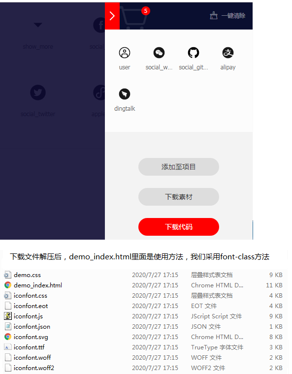
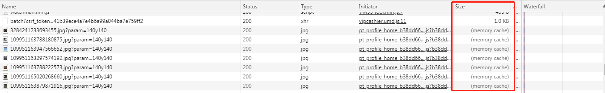
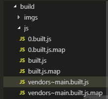
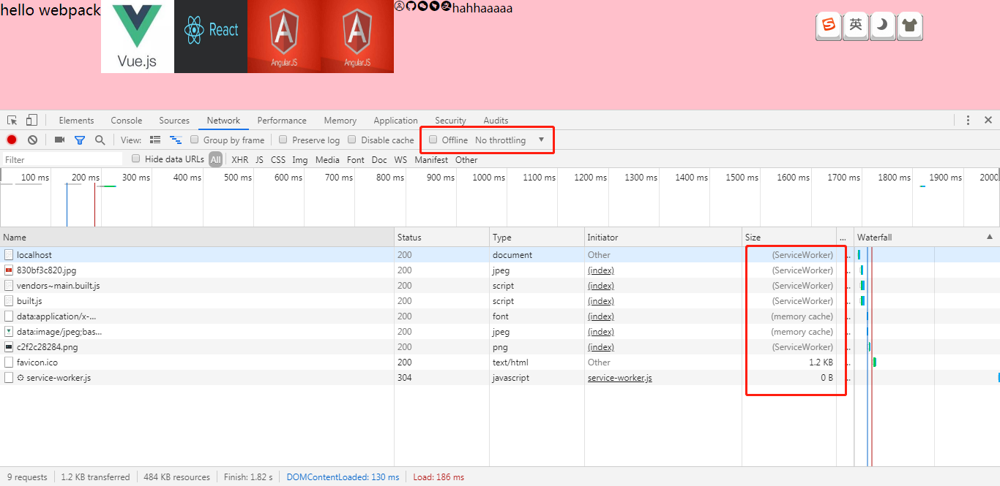

# 0 Webpack

webpack 是一种前端资源构建工具，一个静态模块打包器(module bundler)。在webpack 看来, 前端的所有资源文件(js/json/css/img/less/...)都会作为模块处理。
它将根据模块的依赖关系进行静态分析，打包生成对应的静态资源(bundle)。

## 0.1 构建工具

当我们在html文件中，

- 通过\<link>引入less，发现浏览器并不会解析。我们需要通过工具a，将他们打包成css。

- js中引用jquery，或用es6更高的一些语法一些浏览器无法认识，我们通过工具b，将他们打包成相应浏览器能认识的语法。

以前我们分别采用不同的工具，然后一一进行打包处理。

前端提出构建工具概念，构建工具将小工具a、小工具b等包含进去，我们此时就只需要知道这个构建工具怎么使用就行了，通过配置构建工具，一次性把所有小工具的操作做完，就ok了。

webpack就是一种构建工具

```html
<!--index.html-->
<!DOCTYPE html>
<html lang="en">

    <head>
      <meta charset="UTF-8">
      <meta name="viewport" content="width=device-width, initial-scale=1.0">
      <title>webpack简介</title>
      <link rel="stylesheet" href="./index.less">
    </head>

    <body>
      <h1 id="title">hello webpack</h1>
      <script src="./index.js"></script>
    </body>

</html>
```

```less
/*index.less*/
body,
html {
  margin: 0;
  padding: 0;
  height: 100%;
  background-color: pink;

  #title {
    color: #fff;
  }
}
```

```js
//index.js
// 引入js资源
import $ from 'jquery';
// 引入样式资源
import './index.less';
// 引入图片、字体等其他资源

$('#title').click(() => {
  $('body').css('backgroundColor', 'deeppink');
})
```

## 0.2 静态模块打包器

在文件中你要引入很多资源，如index.js中所见到的一样。在webpack中每个资源文件都被称为静态模块

为webpack配置一个入口文件地址，webpack就会以入口文件为起点，开始打包，他会将文件中的所有依赖文件（静态模块）都会记录好，形成一个依赖关系树状关系图，然后通过这个图的先后关系，将这些资源引进来，形成一个个chunk（代码块），然后将这些chunk（关于less的chunk将会转为css，js转换成为浏览器能认识的js，不同的资源进行不同的处理）进行打包，打包成功后，然后把这些资源输出，输出的资源称为bundle。

## 0.3 五个核心概念

1. **入口（Entry）**，指示webpack 以哪个文件为入口起点开始打包，分析构建内部依赖图。

2. **输出（Output）**，指示webpack 打包后的资源bundles 输出到哪里去，以及如何命名。

3. **加载器（Loader）**，webpack 自身只理解JavaScript，Loader 让webpack 能够去处理那些非JavaScript （less，img等）文件，Loader只起到翻译转换的作用

4. **插件（Plugins）**，可以用于执行**范围更广的任务**。插件的范围包括，从打包优化和压缩，一直到重新定义环境中的变量等。

5. **模式（Mode）**，模式(Mode)指示webpack 使用相应模式的配置。webpack有两种模式：开发模式（development），生产模式（production）

   

Entry告诉webpack从哪开始进入并形成内部依赖图，通过Loader将webpack不认识的文件（less，img等）编译成webpack能识别的资源，通过Plugins对这些文件做一些功能更为复杂的操作（像压缩），最后形成bundle进行输出，Output就会告诉webpack将bundle输出到哪去。

## 0.4 初体验

```bash
#1.创建文件夹初体验
md E:\note\webpack\gate\初体验


#2.初始化项目
npm init
#在node开发中使用npm init会生成一个pakeage.json文件（包描述文件），这个文件主要是用来记录这个项目的详细信息的，它会将我们在项目开发中所要用到的包，以及项目的详细信息等记录在这个项目中。方便在以后的版本迭代和项目移植的时候会更加的方便。也是防止在后期的项目维护中误删除了一个包导致的项目不能够正常运行。使用npm init初始化项目还有一个好处就是在进行项目传递的时候不需要将项目依赖包一起发送给对方，对方在接受到你的项目之后再执行npm install就可以将项目依赖全部下载到项目里。话不多说我们就直接开始进行操作。

#具体操作如下：只需自定义一个package name eg：webpack_test,其余回车键默认
E:\note\webpack\gate\初体验>npm init
This utility will walk you through creating a package.json file.
It only covers the most common items, and tries to guess sensible defaults.

See `npm help json` for definitive documentation on these fields
and exactly what they do.

Use `npm install <pkg>` afterwards to install a package and
save it as a dependency in the package.json file.

Press ^C at any time to quit.
package name: (初体验) webpack_test
version: (1.0.0)
description:
entry point: (index.js)
test command:
git repository:
keywords:
author:
license: (ISC)
About to write to E:\note\webpack\gate\初体验\package.json:

{
  "name": "webpack_test",
  "version": "1.0.0",
  "description": "",
  "main": "index.js",
  "scripts": {
    "test": "echo \"Error: no test specified\" && exit 1"
  },
  "author": "",
  "license": "ISC"
}
Is this OK? (yes) yes


#下载安装webpack
#3.全局安装webpack-cli,可以在命令行，通过命令使用
E:\note\webpack\gate\初体验>npm install webpack webpack-cli -g

#npm install module_name -S    即    npm install module_name --save    写入dependencies

#npm install module_name -D    即    npm install module_name --save-dev 写入devDependencies

#npm install module_name -g 全局安装(命令行使用)

#npm install module_name 本地安装(将安装包放在 ./node_modules 下)


#4.将命令写入包的开发依赖
E:\note\webpack\gate\初体验>npm install webpack webpack-cli -D

#5.创建src文件夹（源代码目录）
E:\note\webpack\gate\初体验>md src
#6.创建build文件夹（打包输出文件的目录）
E:\note\webpack\gate\初体验>md build


```

接着在src文件夹下创建index.js，

```js
/*
index.js指定为webpack入口起点文件
运行指令：
    a.开发环境：webpack ./src/index.js -o ./build/built.js --mode=development
        指令翻译：webpack会以./src文件/index.js为入口文件开始打包，打包后输出到./build/built.js
            整体打包环境为开发环境
    b.生产环境：webpack ./src/index.js -o ./build/built0.js --mode=production
*/
//引入css文件之后
import './index.css'
/*
ERROR in ./src/index.css 1:9
Module parse failed: Unexpected token (1:9)
You may need an appropriate loader to handle this file type, currently no loaders are configured to process this file. See https://webpack.js.org/concepts#loaders
> html,body{
|     height:400px;
|     width:600px;
 @ ./src/index.js 12:0-20 

 打包文件中已经有报错的代码段了，运行代码的时候会直接报错
 */
import data from './data.json'
console.log('json文件data=',data);
function add(x,y){
    return x+y;
}
let a=1;
let b=2;
console.log(a+"+"+b+"="+add(a,b));
```

```bash
#7.开发环境打包
E:\note\webpack\gate\初体验>webpack ./src/index.js -o ./build/built.js --mode=development
Hash: 6f11be0d6cdad5e74748 #每次打包都会生成一个唯一的id值
Version: webpack 4.44.0
Time: 159ms
Built at: 2020-07-26 6:50:27 PM
   Asset      Size  Chunks             Chunk Names
built.js  4.28 KiB    main  [emitted]  main
Entrypoint main = built.js
[./src/index.js] 486 bytes {main} [built]

#8.生产环境打包
E:\note\webpack\gate\初体验>webpack ./src/index.js -o ./build/built0.js --mode=production
Hash: e56fe18a041552d5c17f
Version: webpack 4.44.0
Time: 275ms
Built at: 2020-07-26 6:53:42 PM
    Asset       Size  Chunks             Chunk Names
built0.js  955 bytes       0  [emitted]  main
Entrypoint main = built0.js
[0] ./src/index.js 486 bytes {0} [built]
```

结论

1. webpack只识别json/js文件，不能处理css/img等文件
2. 生产环境能将es6的模块化（import）编译成浏览器能识别的模块化
3. 生产环境目前比开发环境多一个压缩功能

# 1 开发环境基本配置

## 1.1 webpack.config.js

1. 创建配置文件，基本配置如下：

   ```js
   /*
     webpack.config.js  webpack的配置文件
       作用: 指示 webpack 干哪些活（当你运行 webpack 指令时，会加载里面的配置）
   
       所有构建工具都是基于nodejs平台运行的~模块化默认采用commonjs。
   */
   
   // resolve用来拼接绝对路径的方法
   const { resolve } = require('path');
   
   module.exports = {
     // webpack配置
     // 入口起点
     entry: ' ./src/js/index.js',
     // 输出
     output: {
       // 输出文件名
       filename: 'built.js',
       // 输出路径
       // __dirname nodejs的变量，代表当前文件的目录绝对路径
       path: resolve(__dirname, 'build')
     },
     // loader的配置
     module: {
       rules: [
         // 详细loader配置
         // 不同文件必须配置不同loader处理
         {
           // 匹配哪些文件
            //样式文件不会单独打包输出成独立的css等样式文件，而是与js文件为一体的
           test: /\.css$/,//test用于检测正则表达式中的文件
           // 使用哪些loader进行处理
            //如果使用多个loader，那么使用use数组，如果使用单个loader，那么可以直接使用loader
           use: [
             // use数组中loader执行顺序：从右到左，从下到上 依次执行
             // 创建style标签，将js中的样式资源插入进行，添加到head中生效
             'style-loader',
             // 将css文件变成commonjs模块加载js中，里面内容是样式字符串
             'css-loader'
           ]
         },
         {
           test: /\.less$/,
           use: [
             'style-loader',
             'css-loader',
             // 将less文件编译成css文件
             // 需要下载 less-loader和less
             'less-loader'
           ]
         }
       ]
     },
     // plugins的配置
     plugins: [
       // 详细plugins的配置
     ],
     // 模式
     mode: 'development', // 开发模式
     // mode: 'production'
   }
   
   ```

   

2. 下载相关依赖

   node找包特点，当前项目文件夹下找不到，它就会在父文件夹中找，所以我们打算，在项目文件夹的父文件夹中初始化项目并安装依赖

   ```bash
   # webpack-cli：
   npm install webpack webpack-cli -D
   # style-loader css-loader：
   npm install css-loader style-loader less-loader -D
   ```

3. 打包

   可以通过命令行参数进行打包，但是在配置比较复杂的时候，使用webpack.config.js更为方便。所以在打包的时候直接用webpack命令即可，而不用额外添加参数

4. bulid中手动创建index.html

   查看效果

   

### 1.1.2 loader

使用：

1. npm install loader 下载
2. webpack.config.js 直接配置使用

### 1.1.1 plugins

使用：

1. npm install plugins 下载
2. webpack.config.js 引入相关对象
3. webpack.config.js 配置plugins

## 1.2 基本文件打包

### 1.2.1 html

```bash
npm i html-webpack-plugin -D
webpack
```

配置文件：

```js
const HtmlWebpckPlugin=require('html-webpack-plugin')
module.exports={
...    
//1.4.plugins的配置
    plugins:[
        //html-webpack-plugin

        //new HtmlWebpackPlugin() //功能默认会创建一个空的HTML文件，自动引入被打包后输出的所有资源（js/css)
        //在通常情况下，我们需要使用自定义的Html文件
        //那么将会采用如下结构
        new HtmlWebpackPlugin({
            //复制一个我们自定义./src/index.html文件,并自动引入打包输出的所有资源（js/css)
            template:'./src/index.html'
        })

        
    ],
...
}
```

### 1.2.2 img

下载依赖

```bash
npm i url-loader file-loader -D
npm i html-loader -D
```

webpack中的配置

```js
module.exports={
...    
 module:{
        rules:[
             {
                //问题：默认处理不了html中img图片,这里只能处理css中引入的img文件
                //处理图片资源
                test:/\.(png|jpg|gif)$/,
                //如果仅仅使用单个loader可以直接使用loader
                //下载url-loader file-loader（url-loader会依赖file-loader)
                loader:'url-loader',//url-loader通常用es6的语法处理模块
                //该loader通过options去配置
                options:{
                    //当图片大小小于8kb，就会被base64编码处理，我通常会对小图片做如此处理
                    //在本例程当中vue.jpg将会被base64字符串处理
                    //优点：能够减少请求数量（减轻服务器压力）
                    //缺点：图片体积会变大（文件请求速度变慢）
                    limit:8*1024,

                    // 问题：因为url-loader默认使用es6模块化解析，而html-loader引入图片是commonjs
                    // 解析时会出问题：[object Module]
                    // 解决：关闭url-loader的es6模块化，使用commonjs解析
                    esModule: false,
                    // 给图片进行重命名,如果希望图片名字不要太长，可以如下处理
                    // [hash:10]取图片的hash的前10位
                    // [ext]取文件原来扩展名
                    name: '[hash:10].[ext]',
                    //打包输出文件夹，将图片输出到build/imgs文件夹下
                    outputPath:'imgs'
                }
            },
            {
                test:/\.html$/,
                //用作处理html文件中的img图片（*负责引入img，从而能被url-loader进行处理
                loader:'html-loader'
                //html-loader通常用Commonjs的语法处理模块，
                //但是url-loader是通过es6的语法处理模块，所以接下来url-loader不能处理该图片,还要再url-loader中添加配置
            }
        ]
...
}
```

### 1.2.3 其他资源

eg：字体图标，我们不需要做任何处理，只需要原封不动的输出出去，就ok了

在iconfont中找相应的icon并加入购物车，在购物车中点下载代码



```js
module.exports={
    ...
         module:{
                rules:[
                    ...
                  //打包其他资源（除了html/js/css/img资源）
                    {
                        //通过test去检测，通过exclude去排除正则表达式中的资源
                        exclude:/\.(css|html|js|less|png|jpg|gif)$/,
                        loader:'file-loader'
                        options:{
                        	outputPath:'others'
                    	}
                    }
                    ...
                ]
             
          },
    ...
}
```

## 1.3 devServer

有点类似于sprintboot中的热部署devtools。

```bash
npm i webpack-dev-server -D
#应为是本地下载，要启动webpack-dev-server，需要使用到npx。
#npx 想要解决的主要问题，就是调用项目内部安装的模块。除了调用项目内部模块，npx 还能避免全局安装的模块。
npx webpack-dev-server

```

配置：

```js
module.exports={
    ...
    //1.6.开发服务器devServer：用来自动化（自动编译，自动打开浏览器，自动刷新浏览器）
    //特点：只会在内存中编译打包，不会有任何输出
    //启动devServer指令为：webpack-dev-server
    devServer:{
        //构建后的项目路径
        contentBase:resolve(__dirname,'build'),
        //启动gzip压缩
        compress:true,
        //启动开发服务器的端口号
        port:3000,
        // 自动打开浏览器
        open: true

    }
    ...
}
```

# 2 生产环境基本配置

开发环境主要用于本地调试和运行，源代码通过webpack打包生成bundle，然后让浏览器运行。为了更加方便开发，我们加了自动部署热开发操作。

生产环境主要用于优化上线运行环境。

目前需要优化的地方：

1. css整合在js中，js的体积变得很大，加载将会很慢。然后将css文件以style标签插入html中，会出现闪屏现象。
2. 代码需要进行压缩，因为开发环境想便于调试，就没有进行压缩，但在生产环境就不需调试
3. 样式和js的兼容

## 2.1 css

### 2.1.1 css独立打包

依赖安装：

```bash
npm i mini-css-extract-plugin -D

```

配置：

1. 引入mini-css-extract-plugin依赖
2. loader：MiniCssExtractPlugin.loader取代style-loader
3. plugin：引入new MiniCssExtractPlugin插件

```js
const {resolve}=require("path");
const HtmlWebpackPlugin=require('html-webpack-plugin');
const MiniCssExtractPlugin=require('mini-css-extract-plugin')
module.exports={
    entry:"./src/js/index.js",
    output:{
        filename:'js/built.js',
        path:resolve(__dirname,'build')
    },
    module:{
        rules:[
            {
                test:/\.css$/,
                use:[
                    //style-loader用于创建style标签，放入html文件中
                    //'style-loader',
                    //MiniCssExtractPlugin.loader取代style-loader。作用：提取css成单独文件
                    MiniCssExtractPlugin.loader,
                    //css-loader将css整合到js文件中
                    'css-loader',
                    
                ]
            },
            
        ]
    },
    plugins:[
        new HtmlWebpackPlugin({
            template:'./src/index.html'
        }),
        new MiniCssExtractPlugin({
            //对输出的css文件重命名
            filename:'css/built.css'
        })
    ],
    mode:'development'

}
```

结果：

1. html中link标签引入，不会出现闪屏现象
2. js中不再有css的部分，js加载不会被拖慢

### 2.1.2 css兼容性

package.json中添加browserslist（可以在github上搜browserslist，里面有许多参数介绍），如下

```json
 "browserslist":{
     //开发模式的浏览器要求
    "development":[
      "last 1 chrome version",//
      "last 1 firefox version",
      "last 1 safari version"
    ],
    //生产模式的浏览器要求
    "production":[
      ">0.2%",//匹配几乎所有的浏览器
      "not dead",//不需要兼容已经不再维护的浏览器
      "not op_mini all"
    ]
  }
```

依赖安装：

```bash
npm i postcss-loader postcss-preset-env -D
```

配置：

1. package.json中broswerlist
2. process.env.NODE_ENV='development'
3. postcss-loader postcss-preset-env依赖配置

```js
// 设置nodejs环境变量，css兼容将按照开发环境的要求进行兼容，默认是生产环境
process.env.NODE_ENV = 'development';  
module.exports={
    ...
module:{
        rules:[
            {
                test:/\.css$/,
                use:[
                    //style-loader用于创建style标签，放入html文件中
                    //'style-loader',
                    //MiniCssExtractPlugin.loader取代style-loader。作用：提取css成单独文件
                    MiniCssExtractPlugin.loader,
                    //css-loader将css整合到js文件中
                    'css-loader',
                    /*
                        css兼容性处理：postcss——>postcss-loader postcss-preset-env
                        postcss-preset-env用于帮助postcss找到package.json中browserlist里面的配置，通过配置加载指定的css兼容性样式
                        package.json中browserlist
                        "browserslist":{
                                
             //默认是生效生产环境，要想生效development的浏览器css兼容配置，需要设置node的环境变量：process.env.NODE_ENV='development'
                                //开发模式的浏览器要求
                                "development":[
                                "last 1 chrome version",//
                                "last 1 firefox version",
                                "last 1 safari version"
                                ],
                                //生产模式的浏览器要求
                                "production":[
                                ">0.2%",//匹配几乎所有的浏览器
                                "not dead",//不需要兼容已经不再维护的浏览器
                                "not op_mini all"
                                ]
                            }
                        */
                   //使用loader的默认配置，直接写postcss-loader
                   //如果要更改loader的配置，则要通过对象的方式进行loader的自定义配置
                   {
                       loader:'postcss-loader',
                       options:{
                           ident:'postcss',
                           plugins:()=>[
                               //postcss的插件
                               require('postcss-preset-env')()
                           ]
                       }
                   }
                ]
            },
        ]
    },
...
}
```

可以查看打包后的css文件是否对部分属性有做兼容性处理

### 2.1.3 压缩css

依赖安装

```bash
npm i optimize-css-assets-webpack-plugin -D
```

```js
...
const OptimizeCssAssetsWebpackPlugin=require('optimize-css-assets-webpack-plugin')
module.exports={
...
    plugins:[
       ...
        //压缩css
        new OptimizeCssAssetsWebpackPlugin()
    ],
...
}
```

## 2.2 js

### 2.2.1 语法检查eslint

 推荐使用airbnb规则

依赖安装

```bash
npm i eslint-loader eslint eslint-config-airbnb-base eslint-plugin-import -D
```

在package.json中配置

```json
  "eslintConfig":{
    "extends":"airbnb-base"//让他继承airbnb-base的语法检查规则
  }
```

webpack_config.js中配置

```js
module.exports={
...
    module:{
            rules:[
                ...
                 {
                    /*
                    语法检查，我们在团队工作的时候，团队开发的风格差不多是一致的，
                    eslint-loader，eslint
                    注意：语法检查只检查源代码，第三方的库是不用检查的
                    设置检查规则：在package.json的eslintConfig中设置,让他继承airbnb-base的语法检查规则
                      "eslintConfig":{
                            "extends":"airbnb-base"
                        }
                    推荐使用airbnb规则：https://github.com/airbnb
                    npm中搜索eslint-将会看见eslint-config-airbnb（包含react语法）或eslint-config-airbnb-base（基本的代码规范）
                    在这里采用eslint-config-airbnb-base库（https://www.npmjs.com/package/eslint-config-airbnb-base）
                    下载安装依赖：eslint-config-airbnb-base  eslint-plugin-import
                    故这里需要下载 4个依赖
                    */
                   test:/\.js$/,
                   exclude:/node_modules/,//一定要排除node_modules，不然它会检查node_modules
                   loader:'eslint-loader',
                   options:{
                       //如果有airbnb语法错误，自动修复eslint的错误,那么源代码中不符合规则的代码将会被修复
                        fix:true,
                   }
            	}
               ...
             ]
...
}
```

### 2.2.2 js的兼容性处理

下载依赖

```bash
npm i babel-loader @babel/preset-env @babel/core -D
npm i @babel/polyfill -D #在webpack.config.js中，不需要配置
npm i core-js -D #最优做法
```

配置

```js
module.exports={
...
    module:{
            rules:[
                ...
                 {
                /*
                js兼容性处理
                下载依赖：babel-loader @babel/core @babel/preset-env
                1.基本js兼容性处理-->@babel/preset-env库，问题：只能转换基本语法，promise等不能转换
                2.全部的js兼容性处理-->@babel/polyfill,在js中手动import '@babel/polyfill';引入后再打包，文件将会变大
                    但我只想解决部分的兼容性问题，不想把全部的兼容性问题引入，这样会使文件变得很大
                3. 需要做兼容性处理的就做兼容，按需加载-->core-js
                 */
                test:/\.js$/,
                exclude:/node_modules/,
                loader:'babel-loader',
                options:{
                    //预设：指示babel做怎么样的兼容性处理
                    //presets:['@babel/preset-env']
                    presets:[
                        [
                            '@babel/preset-env',
                            {
                                //按需解决js兼容性问题
                                useBuiltIns:'usage',
                                //指定core-js的版本
                                corejs:{
                                    version:3
                                },
                                //指定兼容性做到那个版本的浏览器
                                targets:{
                                    chrome:'60',
                                    firefox:'60',
                                    ie:'9',
                                    safari:'10',
                                    edge:'17'
                                }
                            }
                        ]
                    ]
                }
            }
          ...
         ]
    }
  ...
}
```

### 2.2.3 压缩js/html

```js
 module.exports={
...
     //html压缩
	    plugins:[
            new HtmlWebpackPlugin({
                template:'./src/index.html',
                minify:{
                    //折叠空格
                    collapseWhitespace:true,
                    //移除注释
                    removeComments:true
                }
            }),
        ],
     //生产环境下，js会自动做压缩
    //UglifyJsPlugins压缩插件,production模式中内置了此插件
    mode:'production'

}
```

## 2.3 生产环境

```js
const MiniCssExtractPlugin=require('mini-css-extract-plugin')
const OptimizeCssAssetsWebpackPlugin=require('optimize-css-assets-webpack-plugin')
const HtmlWebpackPlugin=require('html-webpack-plugin');
const {resolve}=require('path')
process.env.NODE_ENV='development'//定义nodejs环境变量：决定在css兼容中，采用browserlist的哪个方面，默认生产环境
module.exports={
    entry:'./src/js/index.js',
    ouput:{
        filename:'js/built.js',
        path:resolve(__dirname,'build')
    },
    module:{
        rules:[
            {
                test:/\.css$/,
                use:[
                    MiniCssExtractPlugin.loader,
                    'css-loader',
                    {
                        //还需要在package.json中定义broswerlist
                        loader:'postcss-loader',
                        option:{
                            ident:'postcss',
                            plugin:()=>[require('postcss-preset-env')()]
                                
                        }
                    }
                ]
            },
            {
                test:/\.less$/,
                use:[
                    MiniCssExtractPlugin.loader,
                    'css-loader',
                    {
                        loader:'postcss-loader',
                        option:{
                            ident:'postcss',
                            plugin:()=>[require('postcss-preset-env')()]
                                
                        }
                    },
                    'less-loader'
                ]
            },
            /*
                正常来讲，一个文件只能被一个loader处理，
                当一个文件要被多个loader处理，那么一定要指定loader执行的先后顺序
                要先执行eslint，再执行babel，
                因为语法一旦出错，就没必要去做语法兼容了
            */
            {
                //js语法检查
                //在package.json中eslintConfig配置所用的airbnb库
                test:/\.js$/,
                exclude:'/node_modules/',
                //同类文件，优先执行此loader
                enforce:'pre',
                loader:'eslint-loader',
                options:{
                    fix:true,
                }
            },
            {
                //js兼容性处理
                //在package.json中eslintConfig配置所用的airbnb库
                test:/\.js$/,
                exclude:'/node_modules/',
                loader:'babel-loader',
                options:{
                    presets:[
                        [
                            '@babel/preset-env',
                            {
                                useBuiltIns:'usage',
                                corejs:{
                                    version:3
                                },
                                targets:{
                                    chrome:'60',
                                    firefox:'50'
                                }
                            }
                        ]
                    ]
                }
            },
            {
                test:/\.(jpeg|jpg|png|gif)$/,
                loader:'url-loader',
                options:{
                    limit:8*1024,
                    name:'[hash:10].[ext]',
                    outputPath:'imgs',
                    esModule: false,//html的图片问题
                }
            },
            {
                //html的图片问题
                test:/\.html$/,
                loader:'html-loader',   
            },
            {
                exclude:/\.(js|css|less|html|jpg|jepg|png|gif)$/,
                loader:'file-loader',
                options:{
                    name:'[hash:10].[ext]',
                    outputPath:'others'
                }
            }
        ]
    },
    plugin:[
        //提取css为独立的文件
        new MiniCssExtractPlugin({
            filename:'css/built.css'
        }),
        //压缩css
        new OptimizeCssAssetsWebpackPlugin(),
        //
        new HtmlWebpackPlugin({
            template:'./src/index.html',
            minify:{
                collapseWhitespace:true,
                removeComments:true
            }
        })
    ],
    mode:'production'
}
```

# 3 性能优化配置

webpack性能优化

1. 开发环境性能优化
   - 优化打包构建速度：
     - HMR
   - 优化代码调试
     - source-map
2. 生产环境性能优化
   - 优化打包构建速度

     - oneOf
     - 缓存babel
     - thread loader
     - externals
     - dll

   - 优化代码运行的性能

     - 文件资源缓存（hash-chunkhash-contenthash）
     - tree shaking
     - code split
     - lazy loading
     - pwa

     

## 3.1 HMR

Hot Module Replacement 热模块替换/模块热替换

问题：当我们修改某个文件的时候，例如：修改css文件，他会将整个项目都重新打包运行，这样降低了开发速度。如果我们的项目变得很大，存在成千上万的文件，那么这种不加区别整体打包的方式，不利于开发。

解决：通过配置HMR

```js
module.exports={
    ...
devServer:{
        contentBase:resolve(__dirname,'build'),
        compress:true,
        port:3000,
        open: true,
        /*
        HMR:Hot Module Replacement 热模块替换/模块热替换
        作用：一个模块发生变化，只会重新打包这一个模块
        样式文件：可以使用HMR功能，因为style-loader内部实现了，所以开发环境需要用到 style-loader
        js文件：默认不能使用HMR功能-->需要修改js代码，添加支持HMR功能的代码。js的HMR 功能只能处理非入口js文件，不能处理入口js
        if(module.hot){
                module.hot.accept('./print.js',function(){
                //方法会监听print.js文件的变化，一旦发生变化，其他模块不会重新打包构建
                //并且会执行这个function
                print()
            })
        }
        html文件：默认不能使用HMR功能，同时会导致问题：html文件不能热更新（解决：修改entry入口，将html写入入口文件）了，在开发的时候只有一个html

        */
       hot:true,
	}
} 
  
```

## 3.2 source-map

一种提供源代码到构建后代码的映射技术，如果构建后代码出错了，通过映射可以追踪源代码错误。

通过配置devtool值改变，映射方式和功能

```js
//devtool:[inline-|hidden-|eval-][nosources-][cheap-[module-]]source-map
module.exports={
    ...
	devtool:'source-map'
    ...
} 
```

映射方式：

- 外部：js文件夹下会生成.map文件，
- 内联集中：js文件夹下不会生成.map文件，嵌入在built.js中，用base64的方式压缩并集中。内联方式构建速度更快
- 内联分散：将每一个文件的映射分散在每个js后面，并在eval函数中

| devtool的值             | 映射方式 | 功能                                                         |
| ----------------------- | -------- | ------------------------------------------------------------ |
| source-map              | 外部     | 提供错误代码的准确信息和源代码的错误位置                     |
| inline-source-map       | 内联集中 | 提供错误代码的准确信息和源代码的错误位置                     |
| hidden-source-map       | 外部     | 提供错误代码的错误原因，但不能追踪源代码错误，只能提示到构建后代码的位置 |
| eval-source-map         | 内联分散 | 提供错误代码的错误原因，能定位错误代码的hash值，可以映射到源代码的位置 |
| nosources-source-map    | 外部     | 提供错误代码的错误原因，但没有任何关于源代码的信息           |
| cheap-source-map        | 外部     | 提供错误代码的错误原因，和源代码的错误位置，但只能精确到错误的行，不能精确到列 |
| cheap-module-source-map | 外部     | 提供错误代码的错误原因，和源代码的错误位置，但只能精确到错误的行，不能精确到列。<br />module会将loader的source map也加进来 |

开发环境：构建速度快，调试更友好。

- 构建速度快（eval>inline>cheap>...)：eval-cheap-source-map>eval-source-map
- 调试更友好：source-map>cheap-module-source-map>cheap-source-map
- 综合：eval-source-map（调试） | eval-cheap-module-source-map（速度）

生产环境：源代码要不要隐藏，调试要不要更友好

- 隐藏源代码：nosources-source-map（全部隐藏） | hidden-source-map（只隐藏源代码，显示构建后代码错误信息）
- 调试：source-map
- 内联会导致代码体积变大，所以在生产环境中，尽量不要采用内联方式
- 综合：source-map

## 3.3 oneOf

rules有多个loader，每个文件都会经历所有的loader匹配，但这样会影响速度。

```js
module.exports={
    ...
    module:{
        rules:[
            {
                test:/\.js$/,
                exclude:'/node_modules/',
                enforce:'pre',
                loader:'eslint-loader',
                options:{
                    fix:true,
                }
            },
            {
                //oneOf中的loader只会匹配一个
                //注意：oneOf中的loader不能有重复匹配项，即两个loader的正则表达式不能相同或正则表达式匹配可能有重合的文件
                //有重复的可以提取重复项到，rules数组中去,例如js文件的语法检查和兼容性的两个loader
                oneOf:[
                    {
                        test:/\.css$/,
                        use:[
                            'style-loader',
                            'css-loader'
                        ]
                    },
                    {
                        test:/\.less$/,
                        use:[
                            'style-loader',
                            'css-loader',
                            'less-loader'
                        ]
                    },
                    {
                        test:/\.(png|jpg|gif)$/,
                        loader:'url-loader',
                        options:{
                            limit:8*1024,
                            esModule: false,
                            name: '[hash:10].[ext]',
                            outputPath:'imgs'
                        }
                    },
                    {
                        test:/\.html$/,
                        loader:'html-loader'
                    },
                    {
                        exclude:/\.(css|html|js|less|png|jpg|gif)$/,
                        loader:'file-loader',
                        options:{
                            name:'[hash:10].[ext]',
                            outputPath:'others'
                        }
                    },
                    {
                        test:/\.js$/,
                        exclude:'/node_modules/',
                        loader:'babel-loader',
                        options:{
                            presets:[
                                [
                                    '@babel/preset-env',
                                    {
                                        useBuiltIns:'usage',
                                        corejs:{
                                            version:3
                                        },
                                        targets:{
                                            chrome:'60',
                                            firefox:'50'
                                        }
                                    }
                                ]
                            ]
                        }
                   },
                ]
            },

            
            
        ]
    }
}
```

## 3.4 cache

1. babel缓存：在生产环境打包时，如果只修改一个js文件（相应它的语法兼容babel也会改变）的内容，而导致其他文件（babel）重新打包，这样效率会降低，这时我们可以配置babel缓存，将变化的js重新进行babel打包，而其他没有变化的js将不会被重新打包。

2. 文件资源缓存：在生产环境中，用户加载过页面等资源后，把它进行缓存（文件资源缓存）起来，下次加载的时候就可以利用缓存里面的文件，就不会很慢了。然而，如果的生产环境的包发生了变化，并且更新的时间在cache失效的时间之内，那么客户端将不会加载最新的资源，这样会导致客户端与服务器上不相同。但是这里可以通过文件名的变更克服掉这个问题。webpack提供了三种hash值，供以更名使用。

### 3.4.1 babel cache

没有修改的js文件，不会再次执行babel打包，这样的机制让第二次打包更快,

```js
module.exports={
...    
module:{
        rules:[                    
				{
                        test:/\.js$/,
                        exclude:/node_modules/,
                        loader:'babel-loader',
                        options:{
                            presets:[
                                [
                                    '@babel/preset-env',
                                    {
                                        useBuiltIns:'usage',
                                        corejs:{
                                            version:3
                                        },
                                        targets:{
                                            chrome:'60',
                                            firefox:'60',
                                            ie:'9',
                                            safari:'10',
                                            edge:'17'
                                        }
                                    }
                                ]
                            ],
                            //1.开启babel缓存
                            //第二次构建时，会读取之前的缓存
                            //比如说修改一个js文件，不会导致其他大量的js文件的babel更新
                            cacheDirectory:true,
                        }
                    }
            ]
    }
}
```

### 3.4.2 文件资源缓存

​	在cache失效的时间之内，浏览器不会加载最新资源，除非文件名发生了变更。而且我们期望，只是执行了更新的代码会发生文件名的变更，这样不会导致大量缓存失效，而重新下载文件资源。webpack提供了几种hash值，供以实现文件名的变更。

webpack的hash：

1. hash：每次webpack构建时，会生成一个唯一的hash值
2. chunkhash：根据chunk生成的hash值（如果来自同一个入口文件，那么他们的chunk hash值相同）
3. contenthash：根据文件的内容生成hash值。不同的文件hash值一定不一样。

contenthash符合我们的需求，故在配置中可以做这样的配置，使得修改了的文件，发生名字变更。



```js
const {resolve}=require('path');
const MiniCssExtractPlugin=require('mini-css-extract-plugin')
module.exports={ 
    output:{
        filename:'js/built.[contenthash:10].js',
        path:resolve(__dirname,'build')
    },
...
	plugins:[
        new MiniCssExtractPlugin({
            filename:'css/built.[contenthash:10].css'
         }),
     ]
...
}
```

如果想看到效果，我们可以通过node在本地搭建一个前端服务器：

```js
/*
webpack.config.js的所在文件夹下写service.js
服务器代码
启动服务器：node server.js
访问服务器地址：127.0.0.1:3000
*/
const express=requier('express');
const app=express();
app.use(express.static('build',{maxAge:1000*3600}));
app.listen(3000);
```

## 3.5 tree shaking

使用的代码为绿色的活的树叶，没有使用到的代码为死的干枯的树叶，tree shaking的树摇就是用来把干枯的树叶摇掉的作用。

在生产环境中，树摇的目的就是用来去除我们在应用程序中没有使用的代码，以达到减小包体积的作用。

 tree shaking:去除无用代码的前提：

1. 必须使用es6模块化
2. 开启production环境

tree  shaking有一点问题他会把一些代码当做fuzuo

在package.json中配置，

```json
"sideEffects":false //表示所有代码都没有副作用（都可以进行tree shaking)
```

这样可能会将css文件或其他文件(@babel/polyfill)给干掉。所以应该这样写

```json
"sideEffects":["*.css"]//可以在这里指明什么文件不能tree shaking
```

## 3.6 split code

将我们打包的一个chunk文件，分割成多个文件后，好处：

1. 并行加载这些分割后的文件，从而加载速度更快
2. 按需加载，按照路由拆分一些文件

方式：

1. 配置多入口多chunk，可以拆分打包为多个代码文件。此种方式很不灵活，100多个js难道要配置100个入口？

   ```js
    	//多入口多chunk
       entry:{
           index:'./src/js/index.js',
           entry2:'./src/js/entry2.js'
       },
       output:{
           //name：用来取文件名
           filename:'js/[name][contenthash:10].js',//根据每次文件内容是否修改的contenthash来命名chunk
           path:resolve(__dirname,'build')
           //配置非入口文件的chunk的命名，用于下面optimization和import()分割的命名
           //chunkFilename:'js/[name]_chunk.js
       },
   ```

   

2. 配置优化项，生成的vendors~文件是该配置项的效果

   ```js
   module.exports={ 
       ...
           optimization:{
                   splitChunks:{
                       //1.可以将node_modules中，单独打包成一个chunk然后输出
                       //2.自动分析多入口chunk中，有没有公共的文件，如果有会打包成单独的一个chunk，这样就不会重复打包公共的文件
                       chunks:'all'
                   }
               },
       ...
   }
   ```

   

3. import 动态导入语法：能将某个文件单独打包，生成以数字开头的文件是使用import()的效果，如果在output中配置chunkFilename，可以改变输出的chunk命名

   ```js
   //通过import动态导入语法：能将某个文件单独打包,
   //webpackChunkName命名输出的chunk
   import(/* webpackChunkName:print */'./print').then((print, { mul })=>{
       print('import()动态导入的方式会使该文件单独打包，以形成多个chunk')
       console.log('乘法'+mul(1,2))
   })
   ```



## 3.7 lazy loading

js文件的懒加载

```js
//预加载（prefetch）：会在使用之前，提前加载js文件,
//懒加载：通过使用import()，当文件使用的时候才加载，
//正常加载可以认为是并行加载（同一时间加载多个文件），
//预加载是在网页全部加载之前，对一些主要内容进行加载，以提供给用户更好的体验，减少等待的时间。
//两者主要区别是一个是提前加载，一个是迟缓甚至不加载。懒加载对服务器前端有一定的缓解压力作用，预加载则会增加服务器前端压力。
document.getElementById('btn').onClick=function(){
    import(/*webpackChunkName:'print',webpcakPrefetch:true*/'./test').then((mul)=>{
        console.log(mul(4,10))
    })
}
```

## 3.8 PWA

Progressive Web App，渐进式网络应用，通过ServiceWorker和Cache等技术实现。

作用：帮助我们的网页像app应用程度一样，可以离线访问部分内容

依赖安装：

```bash
npm i workbox-webpack-plugin
npm i serve -g
serve -s build
```

```js
//配置service-worker
module.exports={ 
    ...
    plugins:[
        //pwa
        new WorkboxWebpackPlugin.GenerateSW({
            /**
             * 1.帮助serviceworker快速启动
             * 2.删除旧有的serviceworker
             * 生成一个serviceworker配置文件，
             */
            clientsClaim:true,
            skipWaiting:true
        })    
    ...
}
//在入口文件中注册service-worker
/**
 * 注册serviceWorker
 * 处理兼容性问题
 * 1.eslint不认识window、navigator全局变量
 * 解决，在package.json中，eslintCOnfig中配置
 * "env":{
 *    "browser":true //支持浏览器端全局变量
 * }
 * 2.sw代码必须运行在服务器上
 *   通过nodejs
 *   通过serve命令，npm i serve -g安装，serve -s build 启动服务器，将build目录下所有资源作为静态资源暴露出去
 * 
 */
if('serviceWorker' in navigator){
  window.addEventListener('load',()=>{
    navigator.serviceWorker.register('/service-worker.js')
    .then(()=>{
      console.log('serviceworker注册成功')
    })
    .catch(()=>{
      console.log('serviceworker注册失败')
    })
  })
}
```

效果如下图：




## 3.9 thread-loader

多进程打包，通过多进程的方式优化打包速度

安装

```bash
npm i thread-loader -D
```

配置

```js
module.exports={ 
    ...
    module:{
        rules:[
                    {
                        test:/\.js$/,
                        exclude:/node_modules/,
                        use:[
                            /**
                             * 开启多线程打包
                             * 只有在工作消耗时间比较长，才需要多进程打包
                             * 因为进程启动大概为600ms，进程之间通信也有时间开销
                             */
                            //'thread-loader',
                            {
                                loader:'thread-loader',
                                options:{
                                     workers:2//进程数2个
                                 }
                             },
                            {
                                loader:'babel-loader',
                                options:{
                                    presets:[
                                        [
                                            '@babel/preset-env',
                                            {
                                                useBuiltIns:'usage',
                                                corejs:{
                                                    version:3
                                                },
                                                targets:{
                                                    chrome:'60',
                                                    firefox:'60',
                                                    ie:'9',
                                                    safari:'10',
                                                    edge:'17'
                                                }
                                            }
                                        ]
                                    ],
                                    //1.开启babel缓存
                                    //第二次构建时，会读取之前的缓存
                                    //比如说修改一个js文件，不会导致其他大量的js文件的babel更新
                                    cacheDirectory:true,
                                }
                            }
                        ],

                    }
        ]
    }
    ...
```

## 3.10 externals

忽略某些包的打包，可以手动CDN引入。

```js
module.exports={ 
    ...
    externals:{
        //拒绝某些包被打包
        jquery:'jQuery'
    }
    ...
}
```

## 3.11 dll

动态链接库，类似于external，用于指示webpack哪些库不参与打包，不同的是dll会单独的对某些库进行打包，将多个库打包成一个chunk。

场景：如果我们依赖的node_modules很多，如果全部打成一个包，体积将会过大。通过dll我们可以将某些库单独拆下来，打包成不同的chunk，可以防止依赖包过大。

安装配置：

```bash
npm i add-asset-html-webpack-plugin -D
```

通过dll技术单独打包某个库，需要另写一个webpack.dll.js，写完之后执行webpack --config webpack.dll.js，用于打包某个库，这里用于打包jquery

```js
/**
 * 此js专门用于打包某个库
 * 使用dll技术，对某些库（第三方，jquery、react、vue等等）进行单独打包
 * 当你运行webpack时，默认查找webpack.config.js配置文件
 * 需求：需要运行webpack.dll.js文件，
 * webpack --config webpack.dll.js
 */
const {resolve}=require('path')
const webpack=require('webpack')
module.exports={
    entry:{
        //最终打包生成的chunk名是键
        //值为数组，需要打包的多个库,
        jquery:['jquery',]
    },
    output:{
        filename:'[name].js',
        path:resolve(__dirname,'dll'),
        library:'[name]_[hash]',//打包的库里面向外暴露出去的内容叫什么名字
    },
    plugins:[
        //打包生成一个manifest.json-->提供和jquery映射
        new webpack.DllPlugin({
            name:'[name]_[hash]',//映射库的暴露的内容名称
            path:resolve(__dirname,'dll/manifest.json')//输出文件路径
        })
    ],
    mode:'production'
}
```

在webpack.config.js配置如下

```js
module.exports={ 
    ...
     plugins:[
         //在webpack之前，先执行webpack.dll.js，然后再执行本配置文件的打包
        //告诉webpack哪些库不参与打包，同时使用时的名称也得变，
        new webpack.DllReferencePlugin({
            manifest:resolve(__dirname,'dll/manifest.json')
        }),
        //将某个文件已打包的文件引进来，并在html中自动引入该资源
        new AddAssetHtmlWebpackPlugin({
            filepath:resolve(__dirname,'dll/jquery.js')
        })
    ...
}
```

我们可以得到最后打包出的html文件如下

```html
<!DOCTYPE html>
<html>
    <head>
        <meta charset="utf-8">
        <title>环境配置优化</title>
    </head>
    <body>
        <div id="title">hello webpack</div>
        <div id="box1"></div>
        <div id="box2"></div>
        <div id="box3"></div>
        
        <span class="iconfont icon-icon-test"></span>
        <span class="iconfont icon-icon-test1"></span>
        <span class="iconfont icon-icon-test2"></span>
        <span class="iconfont icon-dingtalk"></span>
        <span class="iconfont icon-alipay"></span>
        <div>hahhaaaaa</div>
        
        
    	<script src="jquery.js"></script>
        <script src="js/vendors~main.built.js">
        </script><script src="js/built.js"></script></body>
    
    
</html>

```

# 4 webpack 配置详解

## 4.1 entry

```js
/**
 * entry:入口起点
 * 取值类型：
 * 1.string：单入口单输出（单chunk单bundle）
 * 2.array：多入口单输出
 * 3.object：多入口多输出,有几个入口，就形成几个chunk，也就输出几个bundle，此时bundle的名字就为对象的key值
 */
module.exports={
    // entry:'src/js/index.js',
    // entry:['src/js/index.js','src/js/add.js'],
    entry:{
        index:['./src/js/index.js','./src/js/add.js'],
        sub:'./src/js/sub.js'
    },
	...
}
```

## 4.2 output

```js
module.exports={
    ...
    output:{
            //指定文件名称（[目录]+名称）
            filename:'[name].js',//[name]默认值为main，
            //打包输出的公共路径（目录）
            path:resolve(__dirname,'build'),
            //资源引入的公共路径，比如服务器地址等等，
            //publicPath:'ip/',
            //非入口chunk的名称，这是在split code中optimization和import()形成的非chunk文件，命名
            //chunkFilename:'js/[name]_chunk.js',


            //整个库向外暴露的变量名，一般用于dll打包
            //library:[name],
            //变量名添加到哪个上
            //libraryTarget:'',
            //libraryTarget:'window',//变量添加到哪个browser上。
            //libraryTarget:'global',//变量名添加到哪个node上
            //
        },
    ...
}
```

## 4.3 module

```js
module.exports={
    ... 
    module:{
            rules:[
                //loader的配置
                {
                    test:/\.css$/,
                    //单个loader用loader，多个loader用use
                    use:['style-loader','css-loader']
                },
                {
                    test:/\.js$/,
                    //排除文件夹
                    exclude:/node_modules/,
                    //只检查
                    include:resolve(__dirname,'src'),
                    enforce:'pre',//or post，pre为优先执行，post延后执行，默认mid中间执行，
                    loader:'eslint-loader',
                    options:{
                        //自定义配置
                    }
                },
                {
                    //数组中的loader只生效一个
                    oneOf:[

                    ]
                }
            ]
        },
        ... 
}
```

## 4.4 resolve

```js
module.exports={
    ... 
    resolve:{
            //配置解析模块路径别名,
            //优点：简写路径，缺点：写路径的时候没有提示
            alias:{
                $css:resolve(__dirname,'src/css')
            },
            //配置省略文件路径的后缀名，在引入模块的时候，可以省略文件的后缀名。
            //解析器会按照下面数组的顺序依次匹配，如果没找到相应文件就会报错
            extensions:['js','.json'],
            //告诉webpack解析模块是去找哪个目录，
            //解析器会按照下面数组的顺序依次匹配，如果没找到相应模块就会报错
            modules:[resolve(_dirname,'../node_modules'),'node_modules']
     },
     ... 
}
```

## 4.5 devServe

```js
module.exports={
    ... 
    devServer:{
        //运行代码目录
        contentBase:resolve(__dirname,'build'),
        //监视contentBase目录下的所有文件，一旦文件变化就会reload，疑问：这里和hot有什么区别
        watchContentBase:true,
        watchOptions:{
            //忽略监听某些文件
            ignored:/node_modules/
        },

        //开启gzip压缩
        compress:true,

        port:5000,
        host:'localhost',
        //自动打开浏览器
        open:true,
        //开启HMR
        hot:true,


        //不要显示启动服务器日志信息
        clientLogLevel:'none',
        //除了一些基本启动信息以外，其他内容都不要显示
        quiet:true,
        //如果出错了，不要全屏提示
        overlay:false,

        //服务器代理-->解决开发环境跨域问题
        proxy:{
            //一旦devServer(5000)服务器接收到/api/xxx的请求，就会把请求转发到另外的服务器，
            '/api':{
                target:'http://localhost:3000',
                //发送请求时，请求路径重写。例如这里将/api/xxx-->/xxx(去掉api)
                pathRewrite:{
                    '^api':''
                }
            }
        }
    }
    ... 
}
```

## 4.6 optimization

```js
module.exports={
    ... 
    optimization:{
            splitChunks:{

                chunks:'all',
            //下面都是默认值，可以不写
                // //公共规则
                // minSize:30*1024,//分割chunk最小为30kb
                // maxSize:0,//最大没有限制
                // minChunks:1,//要提取的chunk最少被引用一次
                // maxAsyncRequests:5,//按需加载时并行加载的文件的最大数量
                // maxInitialRequests:3,//入口js文件最大并行请求数量

                // name:true,//可以使用命名规则
                // automaticNameDelimiter:'~',//命名链接符为“~”
                // cacheGroups:{
                //     //分割chunk的组
                //     //node_modules文件会被打包到vendors组的chunk中。-->vendors~xxx.js,这里的分割符~是采用上面的分割符
                //     //满足上面的公共规则，如：大小超过30kb，至少被引用一次等等。
                //     vendors:{
                //         test:/[\\/]node_modules[\\/]/,
                //         //优先级
                //         priority:-10
                //     },
                //
                //      //多入口时，被多个chunk引用时
                //     default:{
                //         //要提取的chunk最少被引用两次
                //         minChunks:2,
                //         //优先级
                //         priority:-20,
                //         //如果当前要打包的模块，和之前已经被提取的模块是同一个，就会被复用，而不是重新打包模块
                //         reuseExistingChunk:true,
                //     }

                // },


            },
            //当入口文件（例index.js）通过import()引入了a.js时，并且命名采用了contenthash，打包后main（index）存了此contenthash
            //如果a发生变化，那么因为main存有a的contenthash那么，main文件也要重新打包，main的contenthash值也要变化
            //那么浏览器上的缓存将会失效
            //解决方案：将main文件上记录的hash值用另外一个文件记录起来单独打包，那么main就不会发生变化，
            //通过runtime发挥作用，通过让被引用文件和runtime文件变化，换取mian文件和其他文件的缓存持久化
            runtimeChunk:{
                name:entrypoint=>`runtime-${entrypoint.name}`
            },
            minimizer:[
                //配置生产环境的压缩方案：js和css
                //默认数组第一个元素是针对js的，第二个元素针对css
                new TerserWebpackPlugin({
                    //开启缓存
                    cache:true,
                    //开启多进程打包
                    parallel:true,
                    //启动source-map
                    sourceMap:true,
                })
            ]
        }
        ... 
}
```

# 5 webpack5

```bash
#当前默认安装webpack4，下载安装下一个版本的webpack命令
npm i webpack@next webpack-cli -D
```

