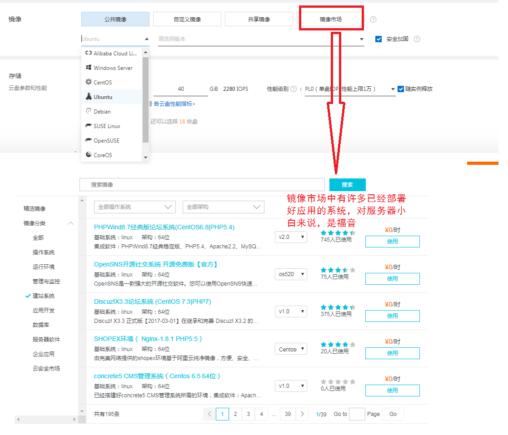

# Linux

RHEL（企业、服务器）、CentOS（企业、服务器）、Fedora（个人桌面版）、Ubuntu（桌面版）

# 1 部署虚拟环境

在新建虚拟机的时候，请选择稍后安装操作系统，先要对安装设置选项进行设置，然后再去安装系统。否则直接安装系统，将会默认安装最精简的配置。

## VMWare

Ctrl+Alt 返回到自己的电脑

IDE硬盘 hd[a-d]表示不同硬盘，hda[1-4]表示硬盘a的不同分区

STATA/SCSI硬盘 sd[a-p],同样用数字表示不同硬盘下的不同分区

网卡用eth[0-]表示，window是通过本地连接1，本地连接2表示

Linux 只有一个盘符"/"，不像windows有很多个盘符(A-Z)。


不同文件系统采用不同的方法来管理磁盘空间，各有优劣；文件系统是具体到分区的，所以格式化针对的是分区，**分区格式化**是指采用指定的文件系统类型对分区空间进行登记、索引并建立相应的管理表格的过程。

交换分区swap，在磁盘中划分一定的空间来模拟内存，当系统的内存不够用的时候，就会使用交换分区。

重新引导-重启系统

centos默认的桌面系统是gnome

# 3 首次登陆与man page

双击计算机，点开文件夹将会跳出很多窗口，不友好，

计算机->编辑->首选项->行为->总是在浏览器窗口打开

计算机->编辑->首选项->视图->显示隐藏和备份文件夹，linux里面凡是以点开头的文件都是隐藏文件

linux中之所以能看到图形化界面是因为startx的进程在运行，windows之所以能看到图形化界面也是有一个explorer的进程在运行。

## 3.1图形化界面Xwindow和命令行模式的切换

centos和rehat有7个控制台，其中第七个控制台是图形化界面，第一个到第六个都是字符界面，快捷键【Ctrl + Alt + Fn】，F1就是第一个控制台，依次类推。

系统是一间房子，它有七个入口。用户登录后，输入tty可以查看当前处于哪个控制台。在字符界面的控制台，可以直接敲命令。如果想在图形化界面上进入命令行，可参考下面的操作

从命令行切换xwindow：执行startx命令，开启图形化界面服务

## 3.2 打开终端

1. 右击桌面->打开终端 
2. 或者应用程序->附件->终端

【Ctrl + space 】切换输入法

**在命令行中，$符号就代表你是普通权限。如果是#符号就代表你已经是管理员权限啦**

切换用户：

1. 输入“su -”回车->输入管理员密码，在界面上密码是不显示的，
2. 或者login 重新登录。使用login命令会退出当前用户，重新进度登录操作界面
3. **管理员用户切换至普通用户**：su [用户名] 使用su命令从高级别用户切换至低级别用户无需输入密码

取消当前命令的执行：【Ctrl + c】或者 逐字删除命令

命令的格式：命令 -选项 ... 参数，多个选项可以连写，如果“-”后面是一个单词，我们通常用--来指定后面的选项是一个整单词而不是多个选项的缩写

```cmd
ls -l
ls -a
ls -s
ls -las
ls --help
```

命令补全：command_sub 按tab，唯一匹配则自动补全，如不能唯一匹配，连续按两下tab键，系统将列下所有以command_sub**开头**的命令或目录文件名

历史命令调取：上下键，history历史输入命令列表

命令中光标的移动：

 	1. 【Ctrl + A】命令开头，
 	2. 【Ctrl + E】命令结尾，
 	3. 【Ctrl + ←→】一个单词一个单词的跳跃，
 	4. 【Ctrl + U】从当前光标删到本行开头，
 	5. 【Ctrl + K】从当前光标删到本行结束，

引用上一个命令中的参数：按ESC ，松手之后按**" . "**

参数替换：^xx^yy，用yy参数替换上一行命令中的xx参数，并执行

复制选中内容并输入：选中内容，按鼠标中间键。会执行复制并粘贴的动作

打开多个终端：

1. 【Ctrl + Shift + T】本终端窗口打开新的标签终端。【Ctrl + Shift + pageup】移到左终端标签，
2. 【Ctrl + Alt + T】新终端窗口打开新的标签终端。
3. 【Ctrl + D】退出终端，退出当前命令域（相当于Exit）

大小写：linux中大小写严格区分，windows中不区分

## 3.3 命令求助

查看命令的是什么功能：whatis command_name ，他会列出三列，第一列命令，第二列命令出现在manpage的第几章，第三列命令的功能描述

查看命令的用法：command_name --help

### man page

man 是 manual 操作手册的缩写，它是以章节的信息显示的，默认查看的是第一章。

1. man [chapter_index] command_name 
   - 它有name、语法、描述
   - 命令行的左下角有个冒号，
   - 
   - 
   - g输入"/keyword"，可以查找关键词，n查找下一个，N查找上一个，q离开本次man查询
2. man -k command_keyword
   - 通过关键字找相关命令

/usr/share/doc，里面存放了很多帮助文档。

info page和man page差不多，可以后面好好看看

## 3.4 文本编辑器

nano、gedit、vim

命令行输入gedit，会打开gedit 文本编辑窗，里面我们可以编写文本，gedit filename 在文本编辑窗打开对应文本文件。

nano的操作gedit差不多，只是它的打开是直接在命令行窗，然后直接在窗口编辑。在窗的底部有一些命令（Ctrl + command），用于操作此文档。

## 3.5 关机方法

sync ——数据同步写到到磁盘中去

shutdown——关机，

reboot——重启，poweroff——关机，正常的关机，会把系统的服务一一的关掉，也可以使用相应的选项做相应的关机操作

## 3.6 init

在不同文件系统，它会开启不同的服务，每个文件系统有7个服务级别（0~6，重启——切换到第6个运行级别，关机——切换到第0个级别，级别5图形化界面），默认处在5级别。

查看上一次运行级别和当前运行的级别：runlevel，

进入其它运行级别用：init N

/etc/init.d 和 /etc/rc.d/init.d 包含了所有服务，在/etc/rc.d下有7个名为rcN.d的**目录**，对应系统的7个运行级别。进入rcN.d的文件后可以看见，每个凡是以k开头的都是不运行的服务，以S开头的都是运行的服务。

## 3.7 忘记root密码

重启系统，在倒计时内按任意键->下面有注释，按e->选中kernel行，按e编辑该选中项

# 4 Linux文件权限与目录配置

windows操作系统将用户名和密码放在：C:\Windows\System32\config\SAM这个数据库中

而linux系统关于用户的账户信息都放在：/etc/passwd，用户的密码存放在：/etc/shadow，用户组的信息是放在：/etc/group

注：**/etc目录一般用来存放程序所需的整个文件系统的配置文件**

## 4.1 文件权限

查看文件属性：**ls -al**

chgrp：改变文件用户组

chown：改变文件所有者

chmod：该变文件的权限

## 4.2 目录说明

为了规范系统不同目录的功能，linux采用了目录配置标准FHS。

FHS的重点在于规范每个特定的目录下应该要放什么样子的数据而已。

FHS针对目录树架构仅定义了三层目录下面应该放置什么数据。分别是下面这三个目录的定义

1. **/（root，根目录）**：与开机系统有关，相当于windows的c盘
2. **/usr（unix software resource）**：与**软件**安装和执行有关
3. **/var（variable）**：与系统运作过程有关（日志）

### 4.2.1 根目录

与开机过程有关

主要与linux系统有关的文件，相当于windows的C盘。

| 目录      | 说明                 | 应放置文件内容                                           |
| --------- | -------------------- | -------------------------------------------------------- |
| **/**     | 系统根目录           | 与开机、还原、系统修复等操作有关、根目录所在分区越小越好 |
| **/bin**  | 执行文件目录         | 放置各种可执行命令                                       |
| **/boot** | 开机文件             | 包括linux内核文件以及开机菜单与开机所需配置文件等        |
| **/dev**  | 设备与接口设备文件   | 只要通过访问这个目录下的某个文件，就相当于访问某个设备   |
| **/etc**  | 系统配置文件         | eg：人员的账号密码、各种服务的起始文件                   |
| **/home** | 用户主文件           | 用户个人的文件夹                                         |
| **/lib**  | 开机的函数库         |                                                          |
| **/root** | 系统管理员主文件     |                                                          |
| **/sbin** | 开机所需要的相关命令 |                                                          |
| **/srv**  | 服务所需要的数据目录 |                                                          |
| **/tmp**  | 存放临时文件         |                                                          |
| **/proc** | 记录进程状态         | 一个虚拟文件系统，放在内存当中                           |
| **/sys**  | 记录与内核相关信息   | 一个虚拟文件系统                                         |
|           |                      |                                                          |
|           |                      |                                                          |

开机过程中仅有根目录会被挂载，其他分区则是在开机完成后才会持续挂载的行为。

所以这些**/etc、/bin、/dev、/lib、/lib、/sbin 不能与根目录分开放在不同分区里面**

### 4.2.2 /usr

Unix Software Resource

所有系统默认的软件（distribution发布者提供的软件）都会放置到/usr下，因此这个目录有点像windows系统的`C:\Windows和C:\Program files`

| 目录           | 说明                       | 应放置的文件内容             |
| -------------- | -------------------------- | ---------------------------- |
| **/usr/bin**   | 绝大多数用户可以使用的命令 | 与开机过程无关的绝大多数命令 |
| **/usr/local** | 本地自行安装的软件         | 非distribution默认提供者     |
| **/usr/lib**   | 各应用软件的函数库         |                              |
|                |                            |                              |
|                |                            |                              |
|                |                            |                              |

### 4.2.3 /var

如果/usr是安装时会占用较大硬盘容量的目录，那么/var就是在系统运行后才会渐渐占用硬盘容量的目录。

因为/var目录主要针对常态性变动文件，包括缓存（cache）、登录文件（log file）以及软件运行所产生的文件。

| 目录           | 说明                 | 应放置的文件内容                                             |
| -------------- | -------------------- | ------------------------------------------------------------ |
| **/var/cache** | 缓存文件             | 应用程序本身运行过程中会产生一些缓存文件                     |
| **/var/lib**   | 程序使用到的数据文件 | eg：mysql的数据库放置到/var/lib/mysql，而rpm的数据库在/var/lib/rpm目录下 |
| **/var/run**   | 程序或服务启动       | 启动后会将他们的pid放置在这个目录下                          |
| **/var/spool** | 程序队列数据         | 排队等待                                                     |
|                |                      |                                                              |
|                |                      |                                                              |

# 5 linux文件与目录管理

操作与管理文件与目录，包括在不同的目录间切换、创建与删除目录、创建文件与删除文件，还有查找文件、查看文件内容等。

## 5.1 目录管理

1. cd：切换目录（change directory）
   - [相对路径或绝对路径]
2. pwd：显示当前目录（print working directory）
3. mkdir：新建一个目录（make directory）
   - -m 711 配置文件权限
   - -p test/test1/test2 自行创建多层目录
4. rmdir：删除一个目录，
   - -rf 强制删除，不做任何提示

## 5.2 文件与目录管理

1. ls ：查看当前目录下的文件与目录
   - -al 详细信息
2. cp：复制文件或目录
   - cp -rf 源目录 目标目录
3. rm：删除文件或目录
   - rm -rf 递归强制删除文件、目录及其子目录和子文件
4. mv：移动文件与目录，或更名
   - [-fiu] source distination
   - -f，强制，如有则覆盖
   - -i，询问后，覆盖
   - -u，文件较新，则覆盖
5. touch：创建新文件
   - touch 文件名
6. 

## 5.3 文件内容查阅

查看所有文件内容

- cat 正向列示，由前至后
- tac 反向列示，由后往前
- nl 添加行号打印

分页查看文件内容

- more
  - q 离开关闭文件
  - space 向下翻一页
  - b 回翻一页
  - enter 向下滚动一行
  - /字符串 查询字符串
- less 
  - pageup
  - pagedown

# vim文本编辑器

vim视作vi的高级版本。

## vi模式

1. 一般模式（Normal）：以vi打开一个文件就是一般模式（删除，复制，粘贴）

   - 可以使用上下左右键移动光标，你可以删除字符或删除整行，也可以复制、粘贴你的整行文件数据
   - 一般模式下输入**:wq**保存内容并离开vi
   - **Esc**：由其他模式进入一般模式
2. 编辑模式（Insert）：一般模式+编辑内容

   - 输入**i**：由一般模式进入编辑模式
3. 命令行模式（Command）：提供命令操作的额外功能
   - **输入：号**：进入命令行模式
   - 查找数据、替换字符等命令操作
4. 可视模式（Visual）：
   - 输入v：进入可视模式
   - 通过移动上下左右，选中文本，y复制，p粘贴，^选中光标当前位置到行首，$选中光标当前位置到行末
5. 选择模式（select）
   - 在gvim的常用模式
   - 输入gh：进入选择模式
   - 用鼠标拖选区域，选择完了高亮区域后，敲任何按键就直接输入并替换选择的文本了

## 按键说明

| 按键              | 说明                             |
| ----------------- | -------------------------------- |
|                   |                                  |
| 一般模式          |                                  |
| 【**home**】      | 光标移至行首                     |
| 【**end**】       | 光标移至行末                     |
| 【**↑ ↓ ← →**】   | 上下左右移动一个字符             |
| 【 **u** 】       | 撤销操作                         |
| 【**Ctrl + r**】  | 还原上一步操作                   |
| 【**p**】         | 将已复制数据，粘贴在光标后       |
| 【**P**】         | 将已复制数据，粘贴在光标前       |
|                   |                                  |
| 命令行模式        |                                  |
| 【**:w**】        | 将数据写入硬盘                   |
| 【**:q**】        | 离开vim                          |
| 【**:q!**】       | 修改了文本，不想保存，想强制离开 |
| 【**:wq**】       | 保存并离开                       |
|                   |                                  |
| 编辑模式          |                                  |
| 【 **i** 】       | 一般模式切换到编辑模式           |
| 【**dd**】        | 删除光标所在行                   |
| 【**yy**】        | 复制光标所在行                   |
|                   |                                  |
| 可视模式          |                                  |
| 【**↑ ↓ ← →**】   | 从光标处选中内容                 |
| 【**y**】         | 复制选中的内容                   |
| 【**^ or home**】 | 从光标处到行首选中内容           |
| 【**$ or end** 】 | 从光标处到行末选中内容           |
|                   |                                  |
|                   |                                  |


# 命令集合

| 命令    | 描述                                                         | 实例                                                         |
| ------- | ------------------------------------------------------------ | ------------------------------------------------------------ |
| ls      | 文件列表                                                     | ls -l filename 文件名下子文件的信息<br />ls -ld filename 本文件的信息 |
| clear   | 清屏                                                         |                                                              |
| date    | 日期时间                                                     |                                                              |
| cal     | 日历calendar                                                 | cal 6 2020                                                   |
| bc      | 计算器 scale设置精度                                         | bc enter scale=2 quit 退出                                   |
| history | 记录命令行敲过的命令（最多1000）                             |                                                              |
| !       | 执行history列出的命令                                        | !22，!+history列表中的索引                                   |
| nano    | nano文本编辑器                                               |                                                              |
| man     | man page帮助                                                 |                                                              |
| info    | info page帮助                                                |                                                              |
| gedit   | gedit文本编辑器                                              |                                                              |
| sync    | 数据同步写到到磁盘中去                                       |                                                              |
| ln      | 用于将一个文件创建链接(快捷方式，有软硬之分)                 |                                                              |
| touch   | 一、是用于把已存在文件的时间标签更新为系统当前的时间（默认方式），它们的数据将原封不动地保留下来；<br />二、是用来创建新的空文件。 |                                                              |
| cd      |                                                              |                                                              |
| mkdir   |                                                              |                                                              |

# 常用操作

1. 命令行翻页：【 Shift + Pageup/Pagedown】
2. 通过管道符分页查看内容：eg：【 ls | less 】 Pageup/Pagedown 离开+q
3. 查看命令是否存在：【 type command 】
4. 删除文件：【 rm -fr 文件名 】
5. [后台运行程序](<https://blog.csdn.net/u013123046/article/details/80610931>)：
   - 查看后台运行程序【 ps -aux 】
   - 后台运行程序 【nohup ......... &】
   - 杀进程：轻杀【kill pid】，强杀【 kill -9 pid】，pid为ps -aux中的pid
6. 端口与进程
   - 查看端口号下运行的进程：【 lsof -i:端口号】
   - 通过pid查看进程占用的端口：【 netstat -anp | grep pid 】
7. 查询rpm包管理工具中是否安装某个软件：【 rpm -qa | grep software】
8. 查看ubantu系统中APT包管理系统中安装的软件：【 apt list --installed 】


<table cellpadding="2" cellspacing="2"> 
 <tbody> 
  <tr> 
   <td style="word-wrap: break-word; margin: 0px; padding: 0px;">任务</td> 
   <td style="word-wrap: break-word; margin: 0px; padding: 0px;">旧指令</td> 
   <td style="word-wrap: break-word; margin: 0px; padding: 0px;">新指令</td> 
  </tr> 
  <tr> 
   <td style="word-wrap: break-word; margin: 0px; padding: 0px;">使某服务自动启动</td> 
   <td style="word-wrap: break-word; margin: 0px; padding: 0px;">chkconfig --level 3 httpd on</td> 
   <td style="word-wrap: break-word; margin: 0px; padding: 0px;">systemctl enable httpd.service</td> 
  </tr> 
  <tr> 
   <td style="word-wrap: break-word; margin: 0px; padding: 0px;">使某服务不自动启动</td> 
   <td style="word-wrap: break-word; margin: 0px; padding: 0px;">chkconfig --level 3 httpd off</td> 
   <td style="word-wrap: break-word; margin: 0px; padding: 0px;">systemctl disable httpd<span style="word-wrap: break-word; font-style: italic;"></span>.service</td> 
  </tr> 
  <tr> 
   <td style="word-wrap: break-word; margin: 0px; padding: 0px;">检查服务状态</td> 
   <td style="word-wrap: break-word; margin: 0px; padding: 0px;">service httpd status</td> 
   <td style="word-wrap: break-word; margin: 0px; padding: 0px;">systemctl status&nbsp;<span style="word-wrap: break-word; line-height: 1.5;">httpd</span>.service （服务详细信息） systemctl is-active httpd.service （仅显示是否 Active)</td> 
  </tr> 
  <tr> 
   <td style="word-wrap: break-word; margin: 0px; padding: 0px;">显示所有已启动的服务</td> 
   <td style="word-wrap: break-word; margin: 0px; padding: 0px;">chkconfig --list</td> 
   <td style="word-wrap: break-word; margin: 0px; padding: 0px;">systemctl list-units --type=service</td> 
  </tr> 
  <tr> 
   <td style="word-wrap: break-word; margin: 0px; padding: 0px;">启动某服务</td> 
   <td style="word-wrap: break-word; margin: 0px; padding: 0px;">service httpd start</td> 
   <td style="word-wrap: break-word; margin: 0px; padding: 0px;">systemctl start httpd.service<span style="word-wrap: break-word; font-style: italic;"></span></td> 
  </tr> 
  <tr> 
   <td style="word-wrap: break-word; margin: 0px; padding: 0px;">停止某服务</td> 
   <td style="word-wrap: break-word; margin: 0px; padding: 0px;">service httpd stop</td> 
   <td style="word-wrap: break-word; margin: 0px; padding: 0px;">systemctl stop httpd.service</td> 
  </tr> 
  <tr> 
   <td style="word-wrap: break-word; margin: 0px; padding: 0px;">重启某服务</td> 
   <td style="word-wrap: break-word; margin: 0px; padding: 0px;">service httpd restart</td> 
   <td style="word-wrap: break-word; margin: 0px; padding: 0px;">systemctl restart httpd.service</td> 
  </tr> 
 </tbody> 
</table>

# Ubantu

dpkg 主要是用来安装已经下载到本地的 deb 软件包，或者对已经安装好的软件进行管理。而 apt-get 可以直接从远程的软件仓库里下载安装软件。

# ECS

Elastic Compute Service，基于大规模分布式计算系统，通过虚拟化技术整理IT资源，为各行业提供互联网基础设施服务设备。

- 应用程序的基础运行环境

  每个ECS实例上都运行着用户选择的操作系统，一般是某个linux或windows的发行版，用户的应用程序运行在实例的操作系统之上。

- 最简化的弹性架构

  较好的实践是将ECS和其它云计算产品配合使用

- 特点：弹性，支持纵向（服务器的配置变更，内存，cpu等）和横向（相关产品服务）扩展两种能力

## 1 购买ECS

根据业务需求，对ECS进行选型配置，创建实例（实例，系统镜像，存储），创建web环境，

我们可以看看在购买实例时镜像的选项。它有许多镜像

