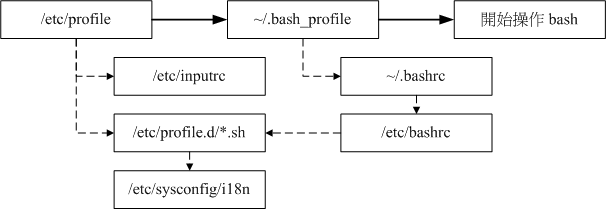
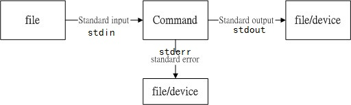

# Linux

RHEL（企业、服务器）、CentOS（企业、服务器）、Fedora（个人桌面版）、Ubuntu（桌面版）

# 1 部署虚拟环境

在新建虚拟机的时候，请选择稍后安装操作系统，先要对安装设置选项进行设置，然后再去安装系统。否则直接安装系统，将会默认安装最精简的配置。

## VMWare

Ctrl+Alt 返回到自己的电脑

IDE硬盘 hd[a-d]表示不同硬盘，hda[1-4]表示硬盘a的不同分区

STATA/SCSI硬盘 sd[a-p],同样用数字表示不同硬盘下的不同分区

网卡用eth[0-]表示，window是通过本地连接1，本地连接2表示

Linux 只有一个盘符"/"，不像windows有很多个盘符(A-Z)。


不同文件系统采用不同的方法来管理磁盘空间，各有优劣；文件系统是具体到分区的，所以格式化针对的是分区，**分区格式化**是指采用指定的文件系统类型对分区空间进行登记、索引并建立相应的管理表格的过程。

交换分区swap，在磁盘中划分一定的空间来模拟内存，当系统的内存不够用的时候，就会使用交换分区。

重新引导-重启系统

centos默认的桌面系统是gnome

# 3 首次登陆与man page

双击计算机，点开文件夹将会跳出很多窗口，不友好，

计算机->编辑->首选项->行为->总是在浏览器窗口打开

计算机->编辑->首选项->视图->显示隐藏和备份文件夹，linux里面凡是以点开头的文件都是隐藏文件

linux中之所以能看到图形化界面是因为startx的进程在运行，windows之所以能看到图形化界面也是有一个explorer的进程在运行。

## 3.1图形化界面Xwindow和命令行模式的切换

centos和rehat有7个控制台，其中第七个控制台是图形化界面，第一个到第六个都是字符界面，快捷键【Ctrl + Alt + Fn】，F1就是第一个控制台，依次类推。

系统是一间房子，它有七个入口。用户登录后，输入tty可以查看当前处于哪个控制台。在字符界面的控制台，可以直接敲命令。如果想在图形化界面上进入命令行，可参考下面的操作

从命令行切换xwindow：执行startx命令，开启图形化界面服务

## 3.2 打开终端

1. 右击桌面->打开终端 
2. 或者应用程序->附件->终端

【Ctrl + space 】切换输入法

**在命令行中，$符号就代表你是普通权限。如果是#符号就代表你已经是管理员权限啦**

**切换用户**：

1. 输入“su -”回车->输入管理员密码，在界面上密码是不显示的，
2. 或者login 重新登录。使用login命令会退出当前用户，重新进度登录操作界面
3. **管理员用户切换至普通用户**：su [用户名] 使用su命令从高级别用户切换至低级别用户无需输入密码

取消当前命令的执行：【Ctrl + c】或者 逐字删除命令

命令的格式：命令 -选项 ... 参数，多个选项可以连写，如果“-”后面是一个单词，我们通常用--来指定后面的选项是一个整单词而不是多个选项的缩写

```cmd
ls -l
ls -a
ls -s
ls -las
ls --help
```

命令补全：command_sub 按tab，唯一匹配则自动补全，如不能唯一匹配，连续按两下tab键，系统将列下所有以command_sub**开头**的命令或目录文件名

历史命令调取：上下键，history历史输入命令列表

命令中光标的移动：

 	1. 【Ctrl + A】命令开头，
 	2. 【Ctrl + E】命令结尾，
 	3. 【Ctrl + ←→】一个单词一个单词的跳跃，
 	4. 【Ctrl + U】从当前光标删到本行开头，
 	5. 【Ctrl + K】从当前光标删到本行结束，

引用上一个命令中的参数：按ESC ，松手之后按**" . "**

参数替换：^xx^yy，用yy参数替换上一行命令中的xx参数，并执行

复制选中内容并输入：选中内容，按鼠标中间键。会执行复制并粘贴的动作

打开多个终端：

1. 【Ctrl + Shift + T】本终端窗口打开新的标签终端。【Ctrl + Shift + pageup】移到左终端标签，
2. 【Ctrl + Alt + T】新终端窗口打开新的标签终端。
3. 【Ctrl + D】退出终端，退出当前命令域（相当于Exit）

大小写：linux中大小写严格区分，windows中不区分

## 3.3 命令求助

查看命令的是什么功能：**whatis command_name** ，他会列出三列，第一列命令，第二列命令出现在manpage的第几章，第三列命令的功能描述

查看命令的用法：command_name --help

### man page

man 是 manual 操作手册的缩写，它是以章节的信息显示的，默认查看的是第一章。

1. man [chapter_index] command_name 
   - 它有name、语法、描述
   - 命令行的左下角有个冒号，
   - 
   - 
   - g输入"/keyword"，可以查找关键词，n查找下一个，N查找上一个，q离开本次man查询
2. man -k command_keyword
   - 通过关键字找相关命令

/usr/share/doc，里面存放了很多帮助文档。

info page和man page差不多，可以后面好好看看

## 3.4 文本编辑器

nano、gedit、vim

命令行输入gedit，会打开gedit 文本编辑窗，里面我们可以编写文本，gedit filename 在文本编辑窗打开对应文本文件。

nano的操作gedit差不多，只是它的打开是直接在命令行窗，然后直接在窗口编辑。在窗的底部有一些命令（Ctrl + command），用于操作此文档。

## 3.5 关机方法

sync ——数据同步写到到磁盘中去

shutdown——关机，

reboot——重启，poweroff——关机，正常的关机，会把系统的服务一一的关掉，也可以使用相应的选项做相应的关机操作

## 3.6 init

在不同文件系统，它会开启不同的服务，每个文件系统有7个服务级别（0~6，重启——切换到第6个运行级别，关机——切换到第0个级别，级别5图形化界面），默认处在5级别。

查看上一次运行级别和当前运行的级别：runlevel，

进入其它运行级别用：init N

/etc/init.d 和 /etc/rc.d/init.d 包含了所有服务，在/etc/rc.d下有7个名为rcN.d的**目录**，对应系统的7个运行级别。进入rcN.d的文件后可以看见，每个凡是以k开头的都是不运行的服务，以S开头的都是运行的服务。

## 3.7 忘记root密码

重启系统，在倒计时内按任意键->下面有注释，按e->选中kernel行，按e编辑该选中项

# 4 文件权限与目录配置

windows操作系统将用户名和密码放在：C:\Windows\System32\config\SAM这个数据库中

而linux系统关于用户的账户信息都放在：/etc/passwd，用户的密码存放在：/etc/shadow，用户组的信息是放在：/etc/group

注：**/etc目录一般用来存放程序所需的整个文件系统的配置文件**

## 4.1 文件权限

查看文件属性：**ls -al**

`-rw-r--r-- 1 root root 42304 Sep 4 18:26 install.log`

1. 第一列第一个字符：文件类型
   - d是目录，-为文件，l为连接文件，b为接口设备
2. 第一列接下来每3位一组的九个字符：文件的权限，每三位对应一个**rwx**——可读可写可执行（具体解释，参看p147）
   - 第一个三位：文件拥有者（User），第二个三位：用户组（Group），第三个三位：其他用户（Others），
3. 第二列表示有多少文件名连接到此节点inode
4. 第三列文件所有者的账号
5. 第四列文件所属用户组
6. 第五列文件大小，单位B
7. 第六列文件最后修改时间
8. 第七列文件名

**改变文件权限：**

1. **chgrp**：改变文件用户组，`格式：chgrp [-R] 用户组 文件或目录`
2. **chown**：改变文件所有者，`格式：chown [-R] 账户名称[.用户组] 文件或目录`
3. **chmod**：该变文件的权限
   - 方式一：rwx-421，每三位用0-7表示，共9位，需要用三个0-7的数（eg：777）表示权限，nnn，格式：`chmod nnn 文件或文件名`
   - 方式二：`chmod u+rwx g-w o=r [a=rwx] 文件或目录`  ，这里面a表示全部，包括ugo，+（加入权限），-（除去权限），=（设置权限）

## 4.2 目录说明

为了规范系统不同目录的功能，linux采用了目录配置标准FHS。

FHS的重点在于规范每个特定的目录下应该要放什么样子的数据而已。

FHS针对目录树架构仅定义了三层目录下面应该放置什么数据。分别是下面这三个目录的定义

1. **/（root，根目录）**：与开机系统有关，相当于windows的c盘
2. **/usr（unix software resource）**：与**软件**安装和执行有关
3. **/var（variable）**：与系统运作过程有关（日志）

### 4.2.1 根目录

与开机过程有关

主要与linux系统有关的文件，相当于windows的C盘。

| 目录      | 说明                 | 应放置文件内容                                               |
| --------- | -------------------- | ------------------------------------------------------------ |
| **/**     | 系统根目录           | 与开机、还原、系统修复等操作有关、根目录所在分区越小越好     |
| **/bin**  | 执行文件目录         | 放置各种可执行命令                                           |
| **/boot** | 开机文件             | 包括linux内核文件以及开机菜单与开机所需配置文件等            |
| **/dev**  | 设备与接口设备文件   | 只要通过访问这个目录下的某个文件，就相当于访问某个设备       |
| **/etc**  | 系统配置文件         | eg：人员的账号密码、各种服务的起始文件，/etc/passwd，个人密码/etc/shadow |
| **/home** | 用户主文件           | 用户个人的文件夹                                             |
| **/lib**  | 开机的函数库         |                                                              |
| **/root** | 系统管理员主文件     |                                                              |
| **/sbin** | 开机所需要的相关命令 |                                                              |
| **/srv**  | 服务所需要的数据目录 |                                                              |
| **/tmp**  | 存放临时文件         |                                                              |
| **/proc** | 记录进程状态         | 一个虚拟文件系统，放在内存当中                               |
| **/sys**  | 记录与内核相关信息   | 一个虚拟文件系统                                             |
|           |                      |                                                              |
|           |                      |                                                              |

开机过程中仅有根目录会被挂载，其他分区则是在开机完成后才会持续挂载的行为。

所以这些**/etc、/bin、/dev、/lib、/lib、/sbin 不能与根目录分开放在不同分区里面**

### 4.2.2 /usr

Unix Software Resource

所有系统默认的软件（distribution发布者提供的软件）都会放置到/usr下，因此这个目录有点像windows系统的`C:\Windows和C:\Program files`

| 目录           | 说明                       | 应放置的文件内容             |
| -------------- | -------------------------- | ---------------------------- |
| **/usr/bin**   | 绝大多数用户可以使用的命令 | 与开机过程无关的绝大多数命令 |
| **/usr/local** | 本地自行安装的软件         | 非distribution默认提供者     |
| **/usr/lib**   | 各应用软件的函数库         |                              |
|                |                            |                              |
|                |                            |                              |
|                |                            |                              |

### 4.2.3 /var

如果/usr是安装时会占用较大硬盘容量的目录，那么/var就是在系统运行后才会渐渐占用硬盘容量的目录。

因为/var目录主要针对常态性变动文件，包括缓存（cache）、登录文件（log file）以及软件运行所产生的文件。

| 目录           | 说明                 | 应放置的文件内容                                             |
| -------------- | -------------------- | ------------------------------------------------------------ |
| **/var/cache** | 缓存文件             | 应用程序本身运行过程中会产生一些缓存文件                     |
| **/var/lib**   | 程序使用到的数据文件 | eg：mysql的数据库放置到/var/lib/mysql，而rpm的数据库在/var/lib/rpm目录下 |
| **/var/run**   | 程序或服务启动       | 启动后会将他们的pid放置在这个目录下                          |
| **/var/spool** | 程序队列数据         | 排队等待                                                     |
|                |                      |                                                              |
|                |                      |                                                              |

# 5 文件与目录管理

操作与管理文件与目录，包括在不同的目录间切换、创建与删除目录、创建文件与删除文件，还有查找文件、查看文件内容等。

## 5.1 目录管理

1. **cd**：切换目录（change directory）
   - [相对路径或绝对路径]
2. **pwd**：显示当前目录（print working directory）
3. **mkdir**：新建一个目录（make directory）
   - -m 711 配置文件权限
   - -p test/test1/test2 自行创建多层目录
4. **rmdir**：删除一个目录，
   - -rf 强制删除，不做任何提示
   - f参数少用

## 5.2 文件与目录管理

1. **ls** ：查看当前目录下的文件与目录
   - -al 详细信息
2. **cp**：复制文件或目录
   - cp -rf 源目录 目标目录
3. **rm**：删除文件或目录
   - rm -rf 递归强制删除文件、目录及其子目录和子文件
4. **mv**：移动文件与目录，或更名
   - [-fiu] source distination
   - -f，强制，如有则覆盖
   - -i，询问后，覆盖
   - -u，文件较新，则覆盖
5. **touch**：创建新文件，修改文件时间
   - touch 文件名
   - [-am ] a——access访问时间，m——编辑时间
6. 

## 5.3 文件内容查阅

查看所有文件内容

- **cat** 正向列示，由前至后

  - cat可以借助数据流重定向直接创建文本文档

  - ```bash
    cat > introduce
    ni hao, my name is lxx, hen gao xin ren shi ni men
    #写完内容后，[ctrl + d]结束输入，就会在当前文件夹下，生成introduce的文件
    ```

  - 

- **tac** 反向列示，由后往前

- **nl** 添加行号打印

分页查看文件内容

- **more**
  - q 离开关闭文件
  - space 向下翻一页
  - b 回翻一页
  - enter 向下滚动一行
  - /字符串 查询字符串
- **less** 
  - pageup
  - pagedown
- **od**：查看二进制文件内容
  - [-t type] 文件
  - type：a、c、d、f、o、x
- **file**：查看文件类型
  - file 文件

## 5.4 查找文件

查找脚本文件

- **which**：根据path环境变量所规范的路径去查询"执行文件"
  - -a，将path环境变量中所有可查找的命令均列出
- **type**：判断每个命令是否为bash的内置命令
  - **type [-tpa] name**
  - t，命令输出这些字眼：`file（外部命令）/alias（命令别名）/builtin（bash内置的命令）`
  - p，如果name为外部命令式，才会输出完整的文件名
  - a，会在path变量定义的路径中查找
- 

查找文件名

- 利用数据库（**/var/lib/mlocate**，数据库每天更新一次，手动更新用updatedb）查找名称

  - **whereis 文件名**

  - **locate [-ir ] 文件keyword**，i忽略大小写差异，r正则表达式

- 直接查找硬盘

  - **find [path] [option]**
  - path 限定查找文件的范围
  - 关于文件时间的参数，-mtime [+- n]， +n代表n天前，-n代表前n天之内，n代表前第n+1天之内 修改过的文件
  - 关于用户的参数
    - -uid n
    - -gid n
    - -user name
    - -group name
    - -nogroup
  - 关于文件的参数
    - -name filename
    - -size [+-] size，查找比size还要大【+】或小【-】的文件，size的单位c（byte），k（1024bytes）
    - -type 查找文件类型
    - perm [+-] mode，+大于当下mode指定的权限，-小于，无符号等于。
  - 

## 5.6 权限与命令间的关系

什么命令在什么样的权限下才能够运行

1. 让用户进入某目录成为“可工作目录”的基本权限
   - 可使用命令：cd等切换工作目录的命令
   - 目录所需权限：用户对这个目录**至少需要x的权限**，如果还要用ls查阅文件名，那么还需要r权限
2. 用户在某个目录内读取一个文件基本权限
   - 可使用命令：cat、more、less等
   - 目录所需权限：**至少x**
   - 文件所需权限：用户需要对文件**至少r权限**
3. 修改文件
   - 可使用命令：nano、vim等
   - 目录所需：至少x
   - 文件所需：至少rw
4. 创建一个文件
   - 目录所需：要具有wx权限，重点在于w
5. 在目录下执行某个命令
   - 目录所需：至少x
   - 文件所需：至少x

# 6 磁盘与文件系统管理

## 6.1 磁盘


整个磁盘的第一个扇区特别重要，记录了整块磁盘的重要信息，分别是：

1. 主引导分区（MBR，Master Boot Record）：446bytes，安装引导加载程序的地方。
2. 分区表：64bytes，记录硬盘分区状态。

### 6.1.1 分区表

- 分区的最小单位为柱面，每组记录区记录了该区段的"开始柱面与结束柱面"的柱面号码。

- 分区表最多只能容纳四个分区（硬盘所限），这四个分区被称为**主分区和扩展分区**
- 扩展分区最多只能有一个（操作系统限制），**逻辑分区**是由扩展分区持续切割出来的分区，逻辑分区的数量依操作系统的不同而不同。
- 格式化只能在主分区和逻辑分区。
- 分区的优点：安全性（分区之间互无影响），性能高（在柱面范围内搜寻，而不是整个磁盘进行搜索）

### 6.1.2 MBR

整个开机流程到操作系统之前的动作应该是：


1. BIOS：
   - 开机的时候计算机系统会主动执行的第一个程序（在主板上）
   - 它会分析计算机有哪些存储设备，会依据用户的设置去取得能够开机的硬盘，并且读取硬盘的MBR
2. MBR：
   - 内包含引导加载程序
3. 引导加载程序（boot loader）：一支可以读取内核文件的程序
4. 内核文件：开启操作系统的功能

## 6.2 文件系统

文件系统是操作系统用于明确**存储设备或分区**上的**文件的方法和数据结构**，即在存储设备上**组织文件的方法**。

每种操作系统能够使用的文件系统并不相同，**Linux的正规文件系统为EXT2，Windows为NTFS，U盘为FAT**。

传统磁盘一个分区只能有一个文件系统，但现在通过**LVM与RAID**技术，可以将一个分区格式化为多个文件系统，也能将多个分区合为一个文件系统。

**inode/block数据访问示意图**


**FAT文件系统数据访问示意图**


碎片整理——需要碎片整理的原因就是文件写入的block太过于分散，此时文件的读取性能将会变得很差，通过碎片整理将同一文件所属的block汇合在一起。

### 6.2.1 EXT2

文件系统会将文件数据分为两个部分：**文件权限和属性（权限，所有者，群组，时间参数等）与文件内容**，把这两个部分放在不同的块中，权限和属性放在inode中，文件内容放在data block中。另外还有一个superblock 会记录整个文件系统的整体信息（包括inode与block总量，使用量，剩余量，文件系统的格式与相关信息）。

EXT2在格式化的时候基本是区分为多个**block group块组**，每个块组都有**独立的inode/block/ super block系统**


#### data block

用于放置文件内容

- block的大小与数量在格式化后就不能再改变了（除非重新格式化）
- **block大小决定了最大单一文件的大小和最大文件系统总容量。**
- 每个block内最多只能够放置一个文件的数据，文件若大于block的容量，就会占用多个，若小于，则剩余的block的容量就不能再使用。

#### inode table

主要记录文件的属性以及该文件实际是放置在哪几号block中

- 每个inode大小固定为128bytes，每个文件仅会占用一个inode。
- 文件系统能够创建的文件数量和inode数量有关
- 记录一个block号码需要4byte，Inode里有12个直接指向block块的，一个一次间接（指向存有block号码的block），一个二次间接，一个三次间接


#### block bitmap

block 使用情况映射表，用于记录哪个block为空或不为空，删除文件时会自动更新该表。inode bitmap亦如是。

## 6.3 文件系统简单操作

### 6.3.1 磁盘与目录的容量

1. **df [-hi] [目录或文件名]**
   - 列出文件系统的整体磁盘使用量
   - h，以空间容量的形式列出（数字后会带上相应的K，M，G的容量单位）
   - i，以inode的容量的形式列出
   - 可以列出
   - **filesystem（文件系统，分区） 1K-blocks（block的个数） Used（已使用） Available（剩余可用），Use%（使用的百分比%），Mounted on（挂载点）**
   - 读取的范围主要是在Super block内信息
2. **du [-hs] [目录或文件]**
   - 会显示指定的目录或文件所占用的磁盘空间。
   - s，仅列出当前文件所占用的空间
   - 这个命令会直接到文件系统内去查找所有文件数据，所以耗时稍长

记录整个文件系统相关信息的地方

### 6.3.2 连接文件ln

1. **hard link**
   - **ln existfile newfile** 建立硬连接
   - 限制：不能跨文件系统，不能连接到目录
   - 创建一个硬连接相当于新建了一个**文件名**（所有文件名都存在目录的block中，当前目录的block还未存满时，不会增加目录的block。）指向了同一个inode，由inode指向实际内容的block。
   - 删除：所有文件名都是一个硬连接，当指向inode的文件名数目为零的时候就会删除inode和实际内容的block。所以当指向inode的文件名不为0时，仅仅会删除相应的硬连接（文件名），而不会删除实际的inode和block
   - 编辑：无论使用哪一个硬连接（文件名）来编辑，最终结果都会都会写入到相同的inode和block中
2. **symbolic link**
   - **ln -s source_file softlink_file** 建立符号连接（快捷方式）
   - 一种类似于windows的快捷方式功能的**文件**（会占用inode和block），可以让你快速的连接到目录或文件
   - 删除：仅删除符号文件
   - 编辑：同样会修改目标的文件。


## 6.4 磁盘操作

### 6.4.1 磁盘分区

1. **fdisk [ -l ]  [ 设备名称 ]**
   - **fdisk -l** 系统将会把整个系统能找到的设备的分区均列出来
2. **fdisk /dev/hdc** 回车
   - m，输入m查看帮助
   - p，**查看**分区表
   - n，**新增**一个分区
   - d，**删除**一个分区
   - q，不保存操作离开
   - w，操作写入分区表并离开

### 6.4.2 分区格式化

分区后，自然要对分区进行格式化

1. **mkfs [-t 文件系统格式] 设备文件名**
   - t，可以接文件系统格式，eg：ext3，ext2，vfat等（系统有支持才会生效）
2. **mke2fs**，命令可以设置很详细的参数，但是很麻烦。

### 6.4.3 磁盘检验

如果文件系统真的发生错乱，就可以使用fsck（file system check）来仔细分析一下。

**fsck [ -t 文件系统 ] [-ACay] 设备名称**

- A，依据/etc/fstab的内容，将需要的设备扫描一次
- a，自动修复检查到有问题的扇区
- C，用一个直方图检验进度
- 通常只有身为root且你的文件系统有问题的时候才使用这个命令，否则在正常情况下使用此命令，可能会造成对系统的危害。
- 执行fsck时，被检查的分区务必不可挂载到系统上，即需要在卸载的状态下进行

### 6.4.4 磁盘挂载与卸载

挂载点是目录，而这个目录是进入磁盘分区（文件系统）的入口，在挂载前需要确定：

- 单一文件系统不应该被重复挂载在不同的挂载点中
- 单一目录不应该重复挂载多个文件系统
- 作为挂载点的目录理论上应该都是空目录

挂载：**mount [ -t 文件系统] [ -L label名 ] [ -o 其他options] [ -n ] 设备文件名 挂载点**

卸载：**umount [ -fn] 设备文件名或挂载点**

- 如若进行卸载需要将工作目录移到挂载点之外

### 6.4.5 磁盘参数修改

### 6.4.6 设置开机挂载

我们总是需要让系统"自动"在开机的时候进行挂载

其实**/etc/fstab（file system table）**就是将我们利用mount命令进行挂载时，将所有参数写入到这个文件中就可以。

```bash
#Device                                    Mount point             file system    parameters   dump fsck    
UUID=32f2af94-a1cd-4880-bb61-9ede22264d88      /                     xfs           defaults     0     0

#这个文件的内容共有六个字段，这六个字段非常重要，背下来当然好
Device：磁盘设备文件名或该设备的Label
Mount point：挂载点
File system：磁盘分区的文件系统
parameters：文件系统参数
dump：能否被dump备份命令作用，我们可以通过fstab指定那个文件系统必须要进行dump备份。0不做dump备份，1每天dump，2不定期dump
fsck：是否能被fsck磁盘检验命令作用，0不要检验，1最早检验（一般/才会设置为1），2要检验
```

### 6.4.7 内存交换空间的构建

swap的功能就是在应付物理内存不足的情况下所造成的内存扩展记录的功能

# 7 文件压缩与备份

## 7.1 文件压缩

compress已经很少使用了。

gzip可以说是应用最广泛的压缩命令了，bzip2为了取代gzip并提供更高压缩比而来。

以上仅可对单一文件来进行压缩，tar可以将多个文件和目录打包成一个大文件，并且可以对大文件提供压缩。

1. **compress or ncompress** 
   - **compress [-rcv] 文件或目录**
   - **uncompress 文件.Z**
   - 压缩为***.Z**为后缀的文件
   - r，连同目录下的文件同时压缩
   - c，将压缩输出到standard output （屏幕）
2. **gzip** 
   - **gzip  [ -cdtv#] 文件名**
   - 压缩为***.gz**为后缀的文件，可解\*.Z、\*.gz文件
   - #，指代1-9之间的数字，1最快但压缩比最小，9最慢但压缩比最大，默认6
   - v，显示压缩比等信息
   - **文件还原（解压缩）**：d，**gzip -d 文件名.gz**，与gzip相反，会将原来的.gz删除，产生原来的文件
   - **文件备份并压缩**：c，**gzip -9 -c 文件名 > 压缩后文件名.gz** 
   - **zcat**，用来读取纯文本被压缩后的压缩文件
3. **bzip2**
   - **bzip2 [ -cdkzv#] 文件名**
   - 压缩为***.bz2**为后缀的文件
   - z，压缩
   - d，解压缩
   - k，保留原文件
   - **bzcat**，用来读取纯文本被压缩后的压缩文件
4. **tar**
   - j，通过bzip2的支持进行压缩/解压缩，此时文件名最好*.tar.bz2。z参数是通过gzip
   - t，查看打包文件的内容含有哪些文件名，用于查看压缩文件的文件结构
   - c，新建打包文件
   - x，解打包
   - v，在压缩/解压缩的过程中，将正在处理的文件名显示出来
   - f，处理后的文件名
   - p，保留备份数据的原本权限和属性
   - C，用在解压缩时，若要在指定目录解压缩，可以使用这个参数
   - --exclude=FILE，将FILE过滤不进行打包处理
   - 备份并压缩：**tar -jcv -f   压缩后的文件名.tar.bz2    需要压缩的文件名**
   - 解压缩：**tar -jxv -f   需要解压缩的文件名.tar.bz2    -C   欲解压的目录**
   - 查询（查看文件结构）：**tar -jtv -f 压缩文件名.tar.bz2**

## 7.2 备份

1. **dump**
   - 备份
2. **restore**
   - 恢复
3. 

# 8 vim文本编辑器

vim视作vi的高级版本。

## 8.1 vi模式

1. 一般模式（Normal）：以vi打开一个文件就是一般模式（删除，复制，粘贴）

   - 可以使用上下左右键移动光标，你可以删除字符或删除整行，也可以复制、粘贴你的整行文件数据
   - 一般模式下输入**:wq**保存内容并离开vi
   - **Esc**：由其他模式进入一般模式
   - 模式的切换都必须通过一般模式才能切换到其他模式
2. 编辑模式（Insert）：一般模式+编辑内容

   - 输入**i**：由一般模式进入编辑模式
3. 命令行模式（Command）：提供命令操作的额外功能
   - **输入：号**：进入命令行模式
   - 查找数据、替换字符等命令操作
4. 可视模式（Visual）：
   - 输入v：进入可视模式
   - 通过移动上下左右，选中文本，y复制，p粘贴，^选中光标当前位置到行首，$选中光标当前位置到行末
   - 输入**Ctrl + v** 进入可视模式的块选择
   - 输入V：进入可视模式的行选择
5. 选择模式（select）
   - 在gvim的常用模式
   - 输入gh：进入选择模式
   - 用鼠标拖选区域，选择完了高亮区域后，敲任何按键就直接输入并替换选择的文本了

## 8.2 按键说明

| 按键              | 说明                             |
| ----------------- | -------------------------------- |
|                   |                                  |
| 一般模式          |                                  |
| 【**home**】      | 光标移至行首                     |
| 【**end**】       | 光标移至行末                     |
| 【**↑ ↓ ← →**】   | 上下左右移动一个字符             |
| 【 **u** 】       | 撤销操作                         |
| 【**Ctrl + r**】  | 还原上一步操作                   |
| 【**p**】         | 将已复制数据，粘贴在光标后       |
| 【**P**】         | 将已复制数据，粘贴在光标前       |
|                   |                                  |
| 命令行模式        |                                  |
| 【**:w**】        | 将数据写入硬盘                   |
| 【**:q**】        | 离开vim                          |
| 【**:q!**】       | 修改了文本，不想保存，想强制离开 |
| 【**:wq**】       | 保存并离开                       |
|                   |                                  |
| 编辑模式          |                                  |
| 【 **i** 】       | 一般模式切换到编辑模式           |
| 【**dd**】        | 删除光标所在行                   |
| 【**yy**】        | 复制光标所在行                   |
|                   |                                  |
| 可视模式          |                                  |
| 【**↑ ↓ ← →**】   | 从光标处选中内容                 |
| 【**y**】         | 复制选中的内容                   |
| 【**^ or home**】 | 从光标处到行首选中内容           |
| 【**$ or end** 】 | 从光标处到行末选中内容           |
|                   | 块选择                           |
|                   |                                  |

## 8.3 多文件编辑

**场景：**

如果需要将A文件中文本复制到B文件中去，通常需要开两个vim窗口来复制，偏偏每个vim都是独立的，因此没有办法将A文件中执行的“nyy”再跑到B文件中去执行“p”。

**解决：多文件编辑**

**vim 文件1 文件2 文件3**

按键：

- **:n**，编辑下一个文件
- **:N**，编辑上一个文件
- **:files**，列出当前这个vim打开的所有文件

当然这个功能也可以通过多窗口功能达到。

## 8.4 多窗口功能

**场景：**

1. 当有一个文件特别大，查阅到后面的内容的时候，想要对照前面的数据，又不想通过翻页前后来回查阅
2. 有两个需要对照着看的文件，不想使用到前面的多文件编辑功能

**解决：多窗口**

在vim命令行模式下输入

1. **:sp [filename]**
   - 打开新窗口，如果有加filename，表示在新窗口打开一个新文件，否则两个窗口显示的是同一个文件的内容。
2. **Ctrl+w+ ↑ ↓**，先按下Ctrl + w，然后放开，在按下↑或↓，移动光标到上下面的窗口。
3. **Ctrl+w+q**，结束下方的窗口

## 8.5 vim环境设置

如果曾经使用过vim，那么在你的主文件夹内就会存在一个记录操作的文件：**~/.viminfo**，下次再打开vim他会记住你之前的操作。

整体的vim配置文件一般放置在**/etc/vimrc**文件中，不过不建议它，可以修改**~/.vimrc**这个文件（默认不存在，可以自行创建）将你所希望的值写入。


# 9 bash


只要能够操作应用程序的接口都能够称为shell，我们必须要通过“shell”将我们输入的命令与内核通信，好让内核可以控制硬件来正确无误的工作。

shell是看不见摸不着的，终端不是shell。

shell的版本众多，可以在**/etc/shells**文件中看到，我们可以使用哪些shell。

**“Bourne Again SHell（简称bash）”**就是比较流行的一个shell版本，bash是GNU计划中重要的工具软件之一。

## 9.1 bash初步

### bash功能

1. 命令记忆功能（history），前一次登录以前执行的命令记录在主文件夹内的**.bash_history**
2. 命令与文件补全功能（Tab），Tab按键用于补全
3. 命令别名设置功能（alias），eg：**alias lm=' ls -al '**
4. 作业控制、前台、后台控制（job control，foreground ，background）
5. 程序脚本（shell script），可以将平时管理系统常需要用的连续命令写成一个文件，该文件支持交互的方式
6. 支持统配符

### bash内置命令判断：type

**type**：判断每个命令是否为bash的内置命令

- **type [-tpa] name**
- t，命令输出这些字眼：`file（外部命令）/alias（命令别名）/builtin（bash内置的命令）`
- p，如果name为外部命令式，才会输出完整的文件名
- a，会在path变量定义的路径中查找

### 命令的执行

`\`反斜杠的应用在命令太长时，换行便于查看编辑

## 9.2 shell变量

命令别名，自定义的变量在你注销bash后就会失效，所以你想要保留你的设置，就得将这些设置写入配置文件才行

### 9.2.1 变量的显示与设置

1. **echo**：显示变量

   - **echo $变量名**
   - **echo ${变量名}**，常用于数字参数的变量，以及对变量进行删除替换等操作时（相当于计算变量）
   - echo 功能有很多，这里只是用到了查看变量的功能
   - 列出当前环境变量）——env
   - 列出所有变量（包含环境变量与自定义变量）——set

2. 设置自定义变量

   - 格式：**var_name=var_val**

   - 变量间赋值：**var1=${var2}**

   - 规则：

     - 等号两边不能直接接空格，变量命名只能是英文和数字（数字不能开头）

     - 变量的值若有空格，可用双引号或单引号将值罩起来。

       - 双引号可以解析值中的变量（占位符），而单引号不行

         ```bash
         qi=kh
         mine="my name is $qi" 
         echo $mine
         # my name is kh
         mine='my name is $qi' #重新赋值
         echo $mine
         # my name is $qi
         ```

     - 特殊符号用反斜杠`\`转义

     - **追加变量内容**

       ```bash
       PATH="$PATH":/home/bin
       ```

     - **环境变量**（全局变量）：**export var_name**

3. **取消变量unset**

   - **unset var_name**

### 9.2.2 环境变量env

#### 变量列表

**env——查看所有环境变量**

**常见环境变量**

- HOME：代表用户主文件夹的位置，通过cd ~或者直接cd就可以切换到这个文件夹
- SHELL：当前这个环境使用的shell是那个程序
- PATH：就是执行文件查找的路径，目录与目录间通过冒号**":"**相隔

**set——查看所有变量（包含环境变量与自定义变量）**

常见自定义变量

- **PS1**：命令提示符，在命令之前的部分，也可以修改，可以查看相关资料修改

  ```bash
  [root@iZbp1a1nnstgr4w2bu73ovZ ~]# cd ../etc
  ```

- **$：关于本shell的线程号PID**

- **?：关于上个命令的回传码**

- OSTYPE，HOSTTYPE，MACHTYPE：主机硬件与内核等级

#### 自定义变量转环境变量

**export var_name**

环境变量与自定义变量的区别在于：该变量是否会被子进程所继续引用。

当你登录linux并取得一个bash后，你的bash就是一个独立的进程。

在一个bash（父进程）中执行另一个bash（子进程），父进程就会处于暂停sleep的情况，只有子进程结束或被exit才能回到父进程中。

**子进程会继承父进程的环境变量，而不继承自定义变量**

**变量作用域**：被export后的变量，我们称为环境变量（全局变量）。环境变量可以被子进程所引用，但是自定义变量（局部变量）则不会存在于子进程中。

### 9.2.3 键盘读取变量

- **read** 
  - `read [ -pt ] var_name`
  - p，后面接输入提示文本
  - t，输入等待时间，记住输入后一定要按回车，否则时间结束后依旧不能声明变量

### 9.2.4 declare声明变量类型

- **declare**

  - `declare [-aixr] var_name`

  - a，array，声明为数组变量

  - i，integer，声明为整形变量

    ```bash
    declare -i total=100+300+50
    echo $total
    #450
    ```

  - x，声明为环境变量，+-x，可以变换作用域

  - r，设置为只读

### 9.2.5 array变量

```bash
var[1]="first 1"
var[2]="second 2"
var[3]='last 3'
echo ${var[1]},${var[2]},${var[3]}

```

### 9.2.6 变量内容的删除、替代与替换、追加

**删除与替代，对原变量没有影响**

| 变量设置方式          | 说明                                                   |
| --------------------- | ------------------------------------------------------ |
| ${var#关键字}         | 变量内容从开头匹配"关键字"，将符合的最短数据删除       |
| ${var##关键字}        | 从头，最长匹配删除                                     |
| ${var%关键字}         | 从尾，最短匹配删除                                     |
| ${var%%关键字}        | 从尾，最长匹配删除                                     |
| ${var/旧子串/新子串}  | 变量内容符合旧子串，替换第一个被匹配到的旧子串为新子串 |
| ${var//旧子串/新子串} | 匹配旧子串，将变量内容中的所有旧子串替换为新子串       |

**变量的测试与内容的替换**

在某些时刻我经常需要判断某个变量是否存在，若存在，使用既有设置，若不存在则给予一个新值。

**冒号:**能识别str是否为空字符串`''`，将空字符串也认定为变量str未设置。

**减号-**为str为未设置（未定义）时，起到赋值作用

**加号+**为str为已设置时，起到赋值作用

**等号=**与减号的作用相似，**只是赋值的作用会影响到str**

**var=${str [ : ] [ +-= ]  expr }**

**追加内容**

```bash
PATH="$PATH":/home/bin
```


## 9.3 命令别名与历史命令

命令别名，自定义的变量在你注销bash后就会失效，所以你想要保留你的设置，就得将这些设置写入配置文件才行

### 9.3.1 命令别名

命令别名是一个很有趣的东西，特别是你惯用的命令特别长的时候

1. 设置别名**alias**：
   - **alias  other_name='replace_operation'**
   - alias定义规则与变量定义规则几乎相同
   - 替代既有命令：`alias rm='rm -i'`
   - 查看别名列表：`alias`
   - `eg：alias lm='ls -l | more'`，以后输入lm的命令就和`ls -l | more `的命令是一样的效果
2. 取消别名**unalias**：
   - **unalias other_name**
3. 

### 9.3.2 历史命令

**history**

- **n**：列出最近的n条命令
- **-c**：将目前shell中的所有history内容全部清除（当前登录的历史）
- -r：将histfiles中的内容读到目前的shell的history记忆中
- -w：将目前shell中history记忆内容更新到histfiles中，历史命令在我注销后，会将最近的HISTSIZE条记录到~/.bash_history中
- -a：将目前新增的history命令新增到histfiles中，若没有histfiles，则增加到**~/.bash_history**中

**历史命令执行**

- !!：执行上一个命令
- !n：执行第那条命令
- !command：由最近的命令向前搜寻以command开头的命令，并执行

## 9.4 bash shell操作环境

### 9.4.1 路径与命令查找顺序

命令执行顺序

1. 以相对/绝对路径执行命令，
2. 由alias找到该命令来执行
3. 由bash内置的（builtin）命令来执行
4. 通过$PATH这个变量的顺序找到第一个命令来执行

### 9.4.2 bash登录与欢迎信息

**登录之前显示**：/etc/**issue** 和 /etc/issue.net ：

- 前者/etc/issue：一个负责本地登录前显示， 是显示在TTY控制台登录前（非图形界面）
- 后者/etc/issue.net ：负责网络登录前显示。是显示在 Telnet (SSH默认不开启)远程登录前

登录之后显示（欢迎信息）：/etc/**motd**，不管你是 TTY 还是 PTS 登录，也不管是  Telnet 或 SSH 都显示这个文件里面的信息。

### 9.4.3 环境配置文件

环境配置文件让bash在启动是直接读取这些配置文件，以规划好bash的操作环境。

配置文件又可以分为全体系统配置文件以及用户个人的偏好配置文件

login shell与non-login shell

1. login shell ：取得bash时需要完整流程的，就称login shell，eg：你要由tty登录，需要输入账号和密码，此时取得的bash就称login shell
2. non-login shell：取得bash接口的方法不需要重复登录的举动，
   - eg1：在x window图形界面中启动终端机（此时没有再输入账号密码）
   - eg2：在原本的bash环境下在次执行bash这个命令（此时没有再输入账号密码），那第二个bash（子进程）也为non-login shell

这两种情况会导致读取的配置文件不一样，我们首先谈谈**login shell**会读取以下文件

1. 系统整体配置
   - `/etc/profile`：login shell 必读，他还会调取外部设置数据，centos5.x会默认依序被调用进来
     - `/etc/inputrc`：自定义输入按键功能
     - `/etc/profile.d/*.sh`：这个目录下面的文件规定了bash操作接口的颜色、语系、ll与ls、vi、which的命令别名等**，如果想帮所有用户设置一些共享的命令别名可以在这个目录下自行创建扩展名为.sh的文件，并将所需写入即可**
2. 个人偏好设置
   - bash在读完整体环境配置后，接下来就会读取用户个人的配置文件
   - 依序读取`/~/.bash_profile > /~/.bash_login > /~/.profile`，前面的文件如存在，就不会再读后面的文件
   - `/~/.bash_profile会再调取/~/.bashrc`。**所以我们可以在此将自己的偏好设置写入该文件（`/~/.bashrc`）**
3. login_shell的配置文件读取流程



**手动更新配置：source**

- **source 配置文件**

**non-login shell会读：**`~/.bashrc，而bashrc还会调用/etc/bashrc`

**其他相关配置文件**

- `/etc/man.config`：执行man时man page的路径到哪里去找
- `~/.bash_history`：历史命令
- `~/.bash_logout`：当我注销bash后系统再帮我做完什么操作才离开

### 9.4.4 终端机快捷键

**快捷键设置**

查看终端机**"特殊功能"**按键列表：**stty -a**，stty（setting tty）

输出的**^**代表【Ctrl】的意思，其他的eof，erase，intr等自行查阅便知

**按键修改**，eg：**stty erase ^h**

修改终端机设置值，**set [ -uvCHhmBx ]**

**常用快捷键**

| 组合键        | 意义                                                     |
| ------------- | -------------------------------------------------------- |
| Ctrl + C      | 终止当前输入的命令，终止运行的程序                       |
| Ctrl + D      | 退出bash子进程，or 输入结束（eof），从光标删右方一个字符 |
| Ctrl + Z      | j将运行的程序送到后台                                    |
| Ctrl + L      | q清屏                                                    |
| Ctrl + R      | s搜索历史命令，搜索到回车即可执行                        |
| Ctrl + U or K | c从光标位删至行首or行尾                                  |
| Ctrl + S or Q | 暂停or 恢复屏幕输出                                      |


### 9.4.5 通配符与特殊符号

| 通配符       | 意义                           |
| ------------ | ------------------------------ |
| *****        | 0到多个任意字符                |
| **？**       | 至少一个任意字符               |
| **[ ]**      | 字符集，eg：[abceft]           |
| **[ - ]**    | 字符段，eg：[a-z]              |
| **[ ^ ]**    | 取非，eg：`[^a-z]`，非小写字母 |
|              |                                |
| **特殊符号** | **意义**                       |
| #            | 批注                           |
| \            | 转义                           |
| **\|**       | 管道符                         |
| **;**        | 命令分割符                     |
| **~**        | 用户主文件                     |
| **$**        | 变量前导符                     |
| **&**        | 作业控制                       |
| **!**        | 非                             |
| **/**        | 目录符号，路径分割符           |
| **>,>>**     | 数据流重定向，输出导向         |
| **<,<<**     | 数据流重定向，输入导向         |
| **''**       | 不具占位符                     |
| **""**       | 具占位符                       |
| **``**       |                                |
| **( )**      | 子shell的起始与结束            |
| **{ }**      | 命令块组合                     |
|              |                                |
|              |                                |

## 9.5 数据流重定向

数据流重定向就是将某个命令执行后应该要出现在屏幕上的数据传输到其他地方去，例如文件或设备



1. **标准输入stdin**：需要由键盘输入的数据改由文件内容来替代，代码为**0**，使用 <（指定内容输入文件） 或 <<（设置终止符）；
2. **标准输出stdout**：命令执行所回传的正确信息，代码为**1**，使用 **>（覆盖内容） 或 >>（追加内容）**
3. **标准错误输出stderr**：命令执行失败后，所传回的错误信息，代码为**2**，使用 2>（覆盖内容） 或 2>>（追加内容）


```bash
####标准输出####

#屏幕不输出任何信息，~下有一个mine文件创建。
ls -al / > ~/mine 
#若~下mine文件不存在，则创建
#若存在，则清空文件，在写新数据
# >> 追加数据到原文件

#将stdout写入list_right文件，将stderr写入list_error
find /home -name .bashrc > list_right 2> list_error

#stdout与stderr写入同一个文件
find /home -name .bashrc > list 2>&1
find /home -name .bashrc &> list

#垃圾黑洞设备/dev/null
find /home -name .bashrc 2> /dev/null

####标准输入####

cat > introduce << "eof"
my name is lxx, hen gao xin ren shi da jia
eof
#eof作为文本输入的结束，而不需要按Ctrl+d

#将introduce的内容复制到catfile文件中
cat > catfile < introduce
```

### 命令执行的判断

很多命令我想要一次输入去执行，而不想要分次执行。除了通过shell script，可以通过 **;  &&  ||**

- 如若命令之间**无相关性**可以通过命令间间隔**`;`**分号，
  - **cmd1 ; cmd2 ; cmd3**
- 如若命令之间**有相关性**可以通过 **`&&  ||`**来实现
  - **cmd1 && cmd2**，cmd1执行成功才执行cmd2
  - **cmd1 || cmd2**，cmd1执行失败才执行cmd2
  - cmd1 || cmd2 && cmd3，cmd1执行成功后执行cmd3，cmd1执行失败执行cmd2，cmd2执行成功后执行cmd3

## 9.6 管道命令（pipe）


命令输出的数据需要经过几个连续命令的处理，才是我们想要的数据，就会用到管道命令。

**注意**：

- 管道命令仅会处理stdout，对stderr会予以忽略
- 管道命令必须要能够处理来自前一个命令的stdout作为自己的stdin才行。
- 在管道命令里**“  -  ”**可以表示stdin或者stdout

### 9.6.1 选取命令

一般来说，选取信息通常是针对**“行”**来分析的，并不是整篇信息分析的。

1. **cut**
   - 从一行信息中取出我们想要的某些段
   - **cut  -d  'divider'  -f  field1 [, field2, field3 ] **：d 后面接分隔符（' ' 表示空白符），f 后面接我们以分隔符分割的第几段，用整数n
   - **cut -c n1-[n2**]：以字符数为单位，显示字符区间的内容
2. **grep**
   - 分析一行的信息，若有我们想要的信息，则取出该行
   - **grep [ -acinv ] [ --color=auto ]  '查找字符串'  filename**
   - i，忽略大小写
   - n，顺便输出行号
   - v，反向选择，即显示出没有"查找字符串"的行
   - c，计算“关键字”在所在行出现的次数

### 9.6.2 排序去重统计命令

计算数据里相同类型的数据总数，类似于数据库里的聚合函数般。

1. **sort**
   - **sort[ -tkuf ] filename**
   - t，分隔符，默认tab
   - k，以分割符分割的第几个字段排序
   - u，相同数据取其一，去重
   - f，忽略大小写
2. **uniq**
   - 内容排序完成，去重
   - uniq [ -ic ]
     - i，忽略大小写
     - c，重复项计数
3. **wc**
   - 统计内容数据（word count）
   - **wc [-lwm]**
   - l，列出行数
   - w，流出单词数
   - m，列出字符数

### 9.6.3 字符转换命令

比如说将内容中大写改小写，tab转空格键

1. **tr**
   - 删除或替换
   - **tr [ -ds ] SET_OR_STR**
   - d，删除
   - s，替换
2. **col**
   - **col [ -xb ]**
   - x，将tab转换成对等的空格键
3. **join**
   - 处理两个文件之间的关联数据，将两个文件中有相同数据的那一行续接在一起。类似于数据库中的**关联查询**
   - **join [ -ti12 ] file1 file2**
   - t，分隔符，默认以空格，并且对比两个文件的第一个字段
   - i，忽略大小写
   - 1，第一个文件用哪个字段
   - 2，第二个文件用哪个字段
4. **paste**
   - 直接将两个文件的同行，连接在一起
   - **paste [-d] file1 file2**
   - d，分割符，默认tab
   - -，如果file写成-，表示stdin

### 9.6.4 切割命令

如果一个文件太大，导致一个携带式设备无法复制的问题，通过split，就可以将一个大文件依据文件的**大小或行数分割成小文件**

**split [-bl] file prefix_name**

- b，按文件内存大小进行分割，例如b，k，m等
- l，按行数进行分割
- prefix_name，小文件名的前缀

### 9.6.5 参数代换

xargs可以产生某个命令的参数，xargs 可以读入stdin的数据，并且以空格符或断行字符进行分辨，将stdin的数据分割成arguments。

**xargs [ -0epn ] command**

- 将stdin的内容经xargs分析后，处理成参数（或者多组参数），一组参数作为command的参数使用
- eof，停止分析符
- n，多少个参数为一组
- p，每输入一组参数执行command前询问用户是不是要执行，执行输入y

### 9.6.6 双向重定向

**tee**

- **tee会同时将数据流送予文件与屏幕**
- **tee [-a] file**
- a，以累加（append）的方式

## 9.7 shell script

shell script 是利用shell的功能所写的一个“程序”，这个程序是使用纯文本文件，将一些shell的语法与命令（含外部命令）写在里面，搭配正则表达式，管道命令与数据流重定向等功能，以达到我们所想要批处理的目的。

### 9.7.1 script 基本

注意：

1. 命令的执行从上而下，从左而右。
2. 命令、参数间的多个空白，空白行会被忽略，tab会视为空白
3. 读到enter就会执行，"\\[enter]"让一条命令扩展至下一行
4. #用来做批注

#### 1 第一个script

```bash
#!/bin/bash
# Program:
# This program shows ...
# History：
# 2005/08/23
PATH=/bin:/sbin:/usr/sbin/:/usr/local/sbin
export PATH
echo -e "Hello World! \a \n"
exit 0
```

1. **#!/bin/bash**：第一行是声明这个script使用的shell名称
   - 通过这一句，当这个程序被执行时，它就能够加载bash的相关配置环境配置文件
2. **PATH**：
   - 主要环境变量的声明
   - 这里相当于一般程序里的**import**的功能
   - 建议务必要将一些重要的环境变量设置好（设置PATH与LANG等)，如此一来，则可让我们这个程序在进行时直接执行一些外部命令，而不必写绝对路径。
3. **echo**
   - 主要程序部分
4. **exit**
   - 告知执行结果。
   - 讨论一个命令执行成功与否，可以使用**$?**这个变量来看看。
   - exit n相当于一个return flag，我们可以通过查看$?这个flag来查看程序的执行情况如何

#### 2 script执行方式

假设现在写了一个程序文件名是/home/scripts/myshell.sh

1. 直接命令执行：myshell.sh文件必须要具备可读与可执行**（rx）**的权限
   - 绝对路径：命令行直接输入：**/home/scripts/myshell.sh**
   - 相对路径：假设工作目录在/home/scripts，则命令行直接输入：**./myshell.sh**
   - 变量PATH的功能：将myshell.sh放到PATH指定的目录内，例如：/bin。然后在命令行直接输入：**myshell.sh**即可
2. 以bash进程来执行
   - 假设工作目录在/home/scripts，命令行直接输入：**bash myshell.sh** 或者 **sh myshell.sh**
3. 利用source来执行脚本
   - 假设工作目录在/home/scripts，命令行直接输入：**source myshell.sh**

**区别：**

1. 前二者：他们都会使用一个新的bash环境来执行script（**子进程的bash内执行**），script执行完毕后，bash内的数据都会被删除
2. 后者：**在父进程中执行**，各项操作数据都会在原本的bash内生效


### 9.7.2 判断式

判断式就如同其他程序语言中用于输出true or false的条件判断句，然而在bash中是通过执行命令，命令返回**$?**这个变量来判断的。

这里还有其他一些常用的判断式

#### 1. 判断命令test

1. 判断文件名的类型，
   - **test [ -efdbcSpL ] filename**，
   - e—filename是否存在，f一判断是否存在并为file类型，d—directory，b—block device，c一character device，S一socket文件
2. 检验文件的权限
   - **test [ -rwxugks ] filename**
   - r一判断文件是否存在并具有可读权限，w一可写，x—可执行，u一SUID属性，g—SGID属性，s—非空白文件
3. 两个文件之间比较
   - **test file1 [-nt ot ef] file2**
   - nt—newer than判断file1是否比file2更新，ot一older than，ef一判断是否为同一个文件
4. 关于两个整数之间的判定
   - **test n1 [-eq nq gt lt ge le] n2**
   - eq一equal，ne一not equal，gt一greater than，lt一less than，ge—greater or equal，le—less or equal
5. 判定字符串的数据
   - **test [-zn] string**
   - z一若为为空字符串，则true，n一若为非空字符串，则true
   - **test str1[!]=str2**
   - 判断两个字符串是否相等
6. 多重条件判定
   - **test cond1 [-ao] cond2**
   - a—and 两个条件必须同时成立，则为true。o—or 任一条件成立，则为true
   - **test ! cond**
   - 条件取非
7. 

#### 2. 判断符号[ ]

中括号就相当于test，上面的命令判断语句，可以通过让中括号括起来而去掉test关键字，形成判断句。

中括号常用在条件判断式中if...then...fi中

注意：

1. **中括号[ ]内的每一个组件都需要有空格键来分割**
2. 中括号内的变量和常量，都需要用双引号括起来（否则有可能会出现一些意想不到的错误）

```bash
eg:
[ "$HOME" == "/bin" ]
```

### 9.7.3 命令的位置参数

这个概念就如同javascript，或python函数的参数列表一样，只不过在bash中这个函数概念换成了命令。当然bash中也有函数这个概念，后面会说到。

shell script 可以在脚本文件名后面带参数。而不需要像read命令在执行过程中再去输入参数。

eg：**/~/scripts/myshell.sh param1 param2 param3 param4**

在script脚本中可以使用以下变量去引用位置参数的值

- $0：这个变量用于获取执行脚本的名字
- $#：获取参数的个数
- $@：获取整个参数字符串，每个参数间通过空格键分割
- $n：n为位置的索引，$1，$2

**shift未知参数的移除和偏移**

**shift [n]**，这个就如同javascript数组的shift函数功能，用于移除位置参数序列的前n个元素。

### 9.7.4 条件语句

条件书写：

```bash
[cond1 -a cond2 ] && [ cond3 ] || [ cond4 ]
```


```bash
#单判断条件语句
if [ cond1 ]; then
	程序段1
else
	程序段2
fi #条件语句结束

#多判断条件语句
if [ cond1 ]; then
	程序段1
elif [ cond2 ]; then
	程序段2
else
	程序段3
fi #条件语句结束

case $var in
"state1")
 	程序段1
 	;;
"state2")
 	程序段2
 	;;
*)#用*表示其他状态
 	程序段n
 	exit 1
 	;;
esac
```

### 9.7.5 循环语句

```bash
#while循环
while [ condition ]
do
	程序段
done

#do循环
until [ condition ]
do
	程序段
done

#foreach循环
for var in constant1 constant2 constant3
do
	程序段$var可以获取constant列表的内容
done

#for循环
s=0
for ((i=0; i<$var; i=i+1 ))
do
	s=$(($s+$i))
done
```

### 9.7.6 函数

```bash
#函数声明
function fname(){
    程序段,同样程序段里可以获取位置参数
    #$1,$2
}
#函数调用
fname one two three

```

### 9.7.7 script调试

**sh [ -nvx ] myshell.sh**

- n，不要执行script，仅检查语法的问题
- v，在执行script前，先将script的内容输出到屏幕
- x，将使用到的script内容显示到屏幕

# 10 账户管理

## 10.1 用户与用户组

每个登录的用户都会拥有UID（userID）和GID（groupID）。

- **用户的属性信息放在/etc/passwd中**
- **用户的密码信息放在/etc/shadow中**
- **用户组信息放在/etc/group中**

在tty或pts上登录，输入账号及密码后：

- 会在passwd中核对账号信息，
- 如果有该账号读出在group中读出用户组信息，获得shell以及主文件设置，
- 最后在shadow中核对密码，如通过，进入shell

### 10.1.1 用户属性/etc/passwd

```bash
#/etc/passwd中的内容

#系统管理员
root:x:0:0:root:/root:/bin/bash
#系统账户
mail:x:8:12:mail:/var/spool/mail:/sbin/nologin

#用户名:密码占位符:UID:GID:用户描述信息:用户主文件夹:shell

#密码占位符，为防止密码数据被窃取所以用x代替并占位
```

1. UID

   用户标识符，通常有下面表格的限制

   - **UID：0（系统管理员）**
     - root
     - 如果想让其他账号也拥有root的权限，即可以将该账号的UID设为0
     - 不过不建议一个系统有多个UID是0
   - **UID：1~499（系统账户）**
     -   保留给系统使用的ID
     - 其实除了0除外，UID的权限与特性并没有什么不同
     - 由于系统上面的服务希望使用较小的的权限去运行，因此不希望使用root的身份去执行这些服务，所以我们就得要提供这些运行中程序的所有者账号才行。
     - 这些系统账号通常是不可登录的，所以才有/sbin/nologin这个特殊的shell存在
     - 系统账号又被分为两种：
       - 1~99：distribution自行创建的系统账号
       - 100~499：若用户有系统账号又需求时，可以使用的账号UID
   - **UID：500~65535（可登录账号）**
     - 给一般用户使用的，Linux内核2.6.x版已经可以支持（2^32-1）个账户

### 10.1.2 用户密码/etc/shadow

```bash
root:$6$X5uAD/PT$L2FvLYS3/0yLiaWg6le214Hj5fJpiNeT8Giw25rFjPn9YPfFQKTmlalbUfJylQJO7EoGPz1P1drDPo75l3eX1.:18542:0:99999:7:::
#1.用户名:2.密码:3.最近改动密码的时间
#:4.密码(再次)更改需要等待的最短时间:5.密码需要再次更改的时间（过期时间）:6.密码过期前几天开始警告提醒
#:7.过期后宽限时间段（失效时间，宽限时间内在登陆时，强制修改密码的时间区间）:8.账号失效日期(无论是否过期，账号无法使用的日期，常用于收费的系统中）
#:9.账号保留字段
```

### 10.1.3 用户组/etc/group

```bash
root:x:0:
bin:x:1:
daemon:x:2:
#1.用户组名称:2.用户组密码的占位符（一般给用户组管理员使用，现在已很少使用了，密码已经移动/etc/gshadow去了）
#:3.GID
#:4.此用户组支持的账号名称列表（user1,user2...）
```

有效用户组与初始用户组

1. /etc/passwd中的GID就是初始用户组，

# 补充

1. 关于终端
   - 目前我只谈两种：tty和pts
   - **tty**：打字机（teletype），现在泛指各种类型的终端设备，你坐在主机前，接了键盘和显示器，启动时就是那种黑框框没有图形界面的地方直接登录，这种登录终端我们叫他 TTY（终端控制台）
   - **pts**：伪终端（pseudo terminal slave），远程登录（使用telnet或者ssh），或者是你开机之后，用图形界面登录，然后打开的gnome等终端
   - **w**命令，用于显示目前登录系统的用户信息，
     - **w**：登录系统的用户列表
   - 
2. 模板字符串
   - \`pwd\`/test.sh，pwd执行返回的结果，当做前缀，执行该script脚本
   - \`cmd\`，用于执行bash命令并返回字符串。
3. 

# 命令集合

| 命令    | 描述                                                         | 实例                                                         |
| ------- | ------------------------------------------------------------ | ------------------------------------------------------------ |
| ls      | 文件列表                                                     | ls -l filename 文件名下子文件的信息<br />ls -ld filename 本文件的信息 |
| clear   | 清屏                                                         |                                                              |
| date    | 日期时间                                                     |                                                              |
| cal     | 日历calendar                                                 | cal 6 2020                                                   |
| bc      | 计算器 scale设置精度                                         | bc enter scale=2 quit 退出                                   |
| history | 记录命令行敲过的命令（最多1000）                             |                                                              |
| !       | 执行history列出的命令                                        | !22，!+history列表中的索引                                   |
| nano    | nano文本编辑器                                               |                                                              |
| man     | man page帮助                                                 |                                                              |
| info    | info page帮助                                                |                                                              |
| gedit   | gedit文本编辑器                                              |                                                              |
| sync    | 数据同步写到到磁盘中去                                       |                                                              |
| ln      | 用于将一个文件创建链接(快捷方式，有软硬之分)                 |                                                              |
| touch   | 一、是用于把已存在文件的时间标签更新为系统当前的时间（默认方式），它们的数据将原封不动地保留下来；<br />二、是用来创建新的空文件。 |                                                              |
| cd      |                                                              |                                                              |
| mkdir   |                                                              |                                                              |

# 常用操作

1. 命令行翻页：【 Shift + Pageup/Pagedown】
2. 通过管道符分页查看内容：eg：【 ls | less 】 Pageup/Pagedown 离开+q
3. 查看命令是否存在：【 type command 】
4. 删除文件：【 rm -fr 文件名 】
5. [后台运行程序](<https://blog.csdn.net/u013123046/article/details/80610931>)：
   - 查看后台运行程序【 ps -aux 】
   - 后台运行程序 【nohup ......... &】
   - 杀进程：轻杀【kill pid】，强杀【 kill -9 pid】，pid为ps -aux中的pid
6. 端口与进程
   - 查看端口号下运行的进程：【 lsof -i:端口号】
   - 通过pid查看进程占用的端口：【 netstat -anp | grep pid 】
7. 查询rpm包管理工具中是否安装某个软件：【 rpm -qa | grep software】
8. 查看ubantu系统中APT包管理系统中安装的软件：【 apt list --installed 】


<table cellpadding="2" cellspacing="2"> 
 <tbody> 
  <tr> 
   <td style="word-wrap: break-word; margin: 0px; padding: 0px;">任务</td> 
   <td style="word-wrap: break-word; margin: 0px; padding: 0px;">旧指令</td> 
   <td style="word-wrap: break-word; margin: 0px; padding: 0px;">新指令</td> 
  </tr> 
  <tr> 
   <td style="word-wrap: break-word; margin: 0px; padding: 0px;">使某服务自动启动</td> 
   <td style="word-wrap: break-word; margin: 0px; padding: 0px;">chkconfig --level 3 httpd on</td> 
   <td style="word-wrap: break-word; margin: 0px; padding: 0px;">systemctl enable httpd.service</td> 
  </tr> 
  <tr> 
   <td style="word-wrap: break-word; margin: 0px; padding: 0px;">使某服务不自动启动</td> 
   <td style="word-wrap: break-word; margin: 0px; padding: 0px;">chkconfig --level 3 httpd off</td> 
   <td style="word-wrap: break-word; margin: 0px; padding: 0px;">systemctl disable httpd<span style="word-wrap: break-word; font-style: italic;"></span>.service</td> 
  </tr> 
  <tr> 
   <td style="word-wrap: break-word; margin: 0px; padding: 0px;">检查服务状态</td> 
   <td style="word-wrap: break-word; margin: 0px; padding: 0px;">service httpd status</td> 
   <td style="word-wrap: break-word; margin: 0px; padding: 0px;">systemctl status&nbsp;<span style="word-wrap: break-word; line-height: 1.5;">httpd</span>.service （服务详细信息） systemctl is-active httpd.service （仅显示是否 Active)</td> 
  </tr> 
  <tr> 
   <td style="word-wrap: break-word; margin: 0px; padding: 0px;">显示所有已启动的服务</td> 
   <td style="word-wrap: break-word; margin: 0px; padding: 0px;">chkconfig --list</td> 
   <td style="word-wrap: break-word; margin: 0px; padding: 0px;">systemctl list-units --type=service</td> 
  </tr> 
  <tr> 
   <td style="word-wrap: break-word; margin: 0px; padding: 0px;">启动某服务</td> 
   <td style="word-wrap: break-word; margin: 0px; padding: 0px;">service httpd start</td> 
   <td style="word-wrap: break-word; margin: 0px; padding: 0px;">systemctl start httpd.service<span style="word-wrap: break-word; font-style: italic;"></span></td> 
  </tr> 
  <tr> 
   <td style="word-wrap: break-word; margin: 0px; padding: 0px;">停止某服务</td> 
   <td style="word-wrap: break-word; margin: 0px; padding: 0px;">service httpd stop</td> 
   <td style="word-wrap: break-word; margin: 0px; padding: 0px;">systemctl stop httpd.service</td> 
  </tr> 
  <tr> 
   <td style="word-wrap: break-word; margin: 0px; padding: 0px;">重启某服务</td> 
   <td style="word-wrap: break-word; margin: 0px; padding: 0px;">service httpd restart</td> 
   <td style="word-wrap: break-word; margin: 0px; padding: 0px;">systemctl restart httpd.service</td> 
  </tr> 
 </tbody> 
</table>

# Ubantu

dpkg 主要是用来安装已经下载到本地的 deb 软件包，或者对已经安装好的软件进行管理。而 apt-get 可以直接从远程的软件仓库里下载安装软件。

## 