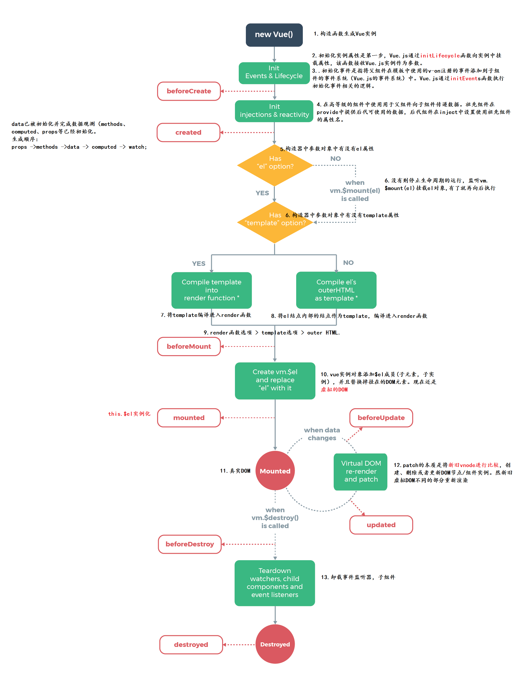
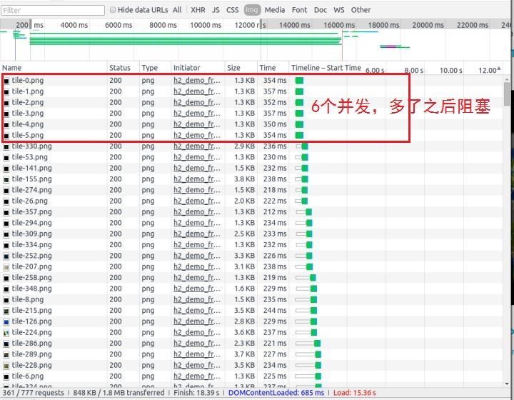
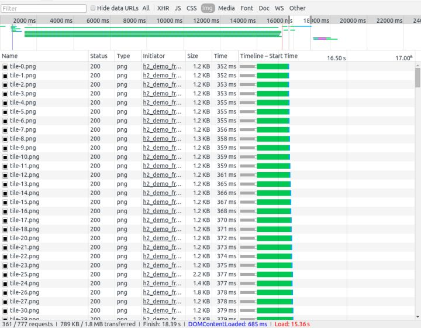

# 1 ES6

## 1.1 新增

1. let const var比较

   - 所谓提升就是将变量和函数提升到当前代码块的开头，这也就是为什么定义函数的位置可以放在使用函数位置的后面
   - var定义的变量存在变量提升：只提升声明语句，不提升赋值语句。代码块内提升。
   - let和const不存在变量提升。所以需要先声明后使用，不然会报错。
   - js先提升函数，后提升var变量。
   - let const 支持块级作用域，不支持变量提升和重复声明。
   - const声明常量，常量指向的值不可改变（包括基本类型直接量和引用类型所指向的地址值）
   - let 声明变量

2. 闭包

   ```js
   const c=(function(){
       var a=0;
       return function c(){
           a++
           return a;
       }
   })()
   console.log(c())
   console.log(c())
   ```

3. 函数默认参数和剩余参数，扩展运算符。arguments对象

   ```js
   function paramTest(a=10,b=13,...remain){
       console.log(arguments)
       console.log(a,b,remain,remain.length);
       return a+b;
   }
   paramTest(1);//1 13 [] 0
   paramTest(2,5,);//2 5 [] 0
   paramTest(2,5,13,16,47);//2 5 [ 13, 16, 47 ] 3
   ```

4. 箭头函数

   - 箭头函数内部的this指向函数**定义时**所在的上下文对象，而不是函数**执行时的上下文**（调用者）
   - 箭头函数是[lexically scoped](http://stackoverflow.com/questions/1047454/what-is-lexical-scope)（词法作用域），这意味着其this绑定到了附近scope的上下文。

   ```js
   //讨论点：参数个数，函数体的语句数，返回值
   //1.函数体只有一句，可以不写函数体的花括号，并将此句的值作为返回值直接返回
   //2.参数只有一个可以不写参数的括号，没有参数值或含有多个参数必须写括号
   
   const a=()=>"你好";
   console.log(a())
   //你好
   
   const b=param0=>param0+"，xinxin";
   console.log(b(a()))
   //你好，xinxin
   
   //3.当返回值为对象时，需要加括号
   const c=()=>({account:15,name:'qin'})
   console.log(c())//{ account: 15, name: 'qin' }
   ```

5. call()、apply()、bind()，[this](<https://www.cnblogs.com/evilliu/p/10816720.html>)

6. prototype

7. [属性和方法简写](<https://blog.csdn.net/qq_36145914/article/details/88688922>)

   ```js
   const a=12;
   const c={
       a,
       b(param){
           console.log(this)//{ a: 12, b: [Function: b] }
       },
   }
   console.log(c)//{ a: 12, b: [Function: b] }
   ```

8. **解构赋值**

   ```js
   const me={
       name:'qin',
       account:0,
   }
   const decorateMe={
       ...me,
       account:1000,
   }
   console.log('解构赋值',decorateMe)
   const {name，account}=me;
   let arr=[1,2,3];
   const [a,b,c]=arr;
   
   //利用解构赋值，做变量值交换
   let a=1;
   let b=2;
   [a,b]=[b,a];
   console.log(a,b);//2,1
   ```

9. Object.assign()

   ```js
   const newObj=Object.assign({account:0},{name:'qin',age:23})
   console.log(newObj)
   const oldObj={name:'xin',age:22}
   Object.assign(oldObj,{name:'lixin'})//后面的对象的属性会覆盖前面属性的值，函数的第一个参数会发生改变
   console.log(oldObj)
   ```

10. Promise——为异步编程提供了方案

    - 为函数提供异步执行方案

    - Promise.all(iterable) 方法用于将多个 Promise 实例，包装成一个新的 Promise 实例。

      - 当迭代对象iterable中的所有promise都进入完成态（都执行resolve()）时，返回完成态的promise对象，resolve()获取到所有promise resolve()返回的参数的数组
      - 当迭代对象iterable中的任一promise都进入拒绝态时，返回拒绝态的promise对象，reject()获取到当前发生拒绝发生拒绝promise的reject()传入的参数

    - Promise.race 方法同样是将多个 Promise 实例，包装成一个新的 Promise 实例。

      - 当迭代对象iterable中有一个实例率先改变状态，p的状态就跟着改变，返回对应态的promise对象

    - 

      

    ```JS
    //1.函数异步
    	const dispatch=(effORred,payload)=>{
            const {dispatch}=this.props;
            let p= new Promise(function(resolve,reject){
                try{
                    dispatch({type:`${theme}/${effORred}`,payload}).then((res)=>{
                        if(res!==undefined&&res!==null){
                            resolve(res);
                        }else{
                            reject();
                        }
                    });
                }catch(e){
                    reject()
                }
            })
            return p;    
        }
        dispatch('user/login',{account:'13685',password:'123456'}).then(()=>{
            //router.push('/index')
        })
    
    //2.多promise同时执行
    //Promise.all()
    //参数为可迭代对象，一般为数组。返回一个promise对象
    //当数组中不含任何promise对象时，立即进入完成态。
        Promise.all([1,2,3]).then((res)=>{
            console.log('全部执行完毕结果为：',res)//打印1,2,3
        }）
    //当数组中含有promise对象时，当所有promise对象全部进入完成态resolved时，返回promise对象的完成态
        let p1=new Promise((reslove,reject)=>{
                                console.log("p1");
                                setTimeout(()=>{
                                    console.log("延迟")
                                    reslove(1)
                                },3000)
                            })
        let p2=new Promise((reslove,reject)=>{
                            console.log("p2");
                            reslove('hahah')
                            })
        Promise.all([p1,p2,3]).then((res)=>{
            console.log('全部执行完毕结果为：',res)//[ 1, 'ahhah', 3 ]
        },(res)=>{
            console.log('有一个执行失败返回值为：',res)
        })
    //当数组中有一个promise对象进入rejected，返回promised对象的失败态
        let p1=new Promise((reslove,reject)=>{
                                console.log("p1");
                                setTimeout(()=>{
                                    console.log("延迟")
                                    reject(1)
                                },3000)
                            })
        let p2=new Promise((reslove,reject)=>{
                            console.log("p2");
                            reslove("ahhah")
                            })
        Promise.all([p1,p2,3]).then((res)=>{
            console.log('全部执行完毕结果为：',res)
        },(res)=>{
            console.log('有一个执行失败返回值为：',res)//1
        })
        
    ```

11. Set，Map

    ```js
    //ES6中提供了Set数据容器，这是一个能够存储无重复值的有序列表。
    //参数为可迭代对象或者不传
    //add(),has(),delete(),clear(),forEach()
    let set=new Set([1,2,3])
    set.add(4)//添加
    set.forEach((value,key,owner)=>{
        console.log('value:'+value+',key:'+key)
        owner.delete(value)//对原set进行操作
    })
    console.log(set)
    console.log(set.size)//集合大小
    set.add({a:1})
    set.add(5)
    console.log(set)
    for(item of set){
        console.log(item)
        //还可以break
    }
    console.log(set.keys())
    console.log(set.has(5))//true
    console.log(set.has({a:1}))//false
    
    //ES6中提供了Map数据结构，能够存放键值对.set(),get(),forEach(),has(),delete(),clear()
    let map=new Map([["ha",1],["you",2]])
    map.set('title',5);
    map.get("ha")
    console.log(map.size);
    ```

12. Set数据结构去重

    ```js
    //类似于数组，但是成员的值都是唯一的，没有重复。
    let arr = [1, 2, 3, 4, 2, 3, 4, 2];
    const set=new Set(arr);
    console.log(set);
    const setArr=[...set]
    console.log(setArr)
    ```

13. [生成器](<https://www.jianshu.com/p/5d1c1a434ac8>)

    - Generator生成器函数

      - ES6中引入的一种新的函数类型，这类函数不符合传统函数从运行到结束的特性，可中断

      - 定义：生成器函数在命名上比传统函数多了一个**\*号**，且在方法体内有一个yield关键字。

        ```js
        function *foo (x) {
            x++;
            let y = yield x;//yield 关键字使生成器函数暂停执行，并返回跟在它后面的表达式的当前值。返回：{value:x,done:flase}
            console.log(y);//可以看到第二次next(to_y)时，to_y的值
            y++;
            return y
        }
        ```

      - 调用：

        ```js
        // 第一步并没有执行生成器函数foo，而只是构造了一个迭代器Iterator
        var foo = foo(2);
        // 第一次next()调用实际上是启动了生成器，并执行到第一个有yield表达式的地方暂停住，next()第一次调用结束，此时*foo（）仍在运行并且时活跃的状态，只是其处于暂停状态,
        var yield_back= foo.next();
        console.log(yield_back);//{value:3,done:flase}，value就是yield关键字后面表达式的值，而done表示的是foo迭代器是否迭代完成的标识：true或false
        let to_y=4;
        let res=p.next(to_y);//给yield x前面的y做传值，如果不传，那么那边会获得一个undefined
        console.log(res)//{value:5,done:true},返回值为5，迭代结束。
        
        ```

      - 法

    - yield关键字

      - 用来暂停和继续生成器函数。我们可以在需要的时候控制函数的运行。可以说**yield是调bug时的断点符**。
      - 使生成器函数暂停执行，并返回跟在它后面的表达式的当前值。**与return类似**。
      - 但是可以使用**next(bparams)**让生成器函数继续执行函数yield后面内容，直到**遇到yield暂停或return返回或函数执行结束**。

    ```js
    
    function call(service,params) {
        service(params).then((value)=>{
            console.log("promise的value:",value);//如何将value直接返回给model的response，还需要进一步考虑
        })
            
    }
    function dispatch({model,payload}){
        const mf=model({payload},{call})
        const mf1_res=mf.next()
        console.log(mf1_res)
        const res=mf.next(mf1_res.value)
        return new Promise((resolve)=>{
            resolve(res.value)
        })
    }
    
    function *modelFun({payload},{call}) {
        console.log('进入real model,参数是：',payload)
        var response = yield call(serviceFun,payload);//3,7
        console.log('在model中得到',response);//8
        return "wancheng"
    }
    
    async function serviceFun(params){
        console.log('进入real service,参数是:',params)
        return {code:200,data:[1,3,2]}
    }
    
    dispatch({model:modelFun,payload:123}).then((res)=>{
        console.log("real dispatch的返回值：",res)
    })
    
    
    ```

14. async/await

    - async 是 ES7 才有的与异步操作有关的关键字，和 Promise ， Generator 有很大关联的。

    - async 函数返回一个 Promise 对象，可以使用 then 方法添加回调函数。

    - await 只能在异步函数 async function 内部使用。

      - 如果一个 Promise 被传递给一个 await 操作符，await 将等待 Promise 正常处理完成并返回其处理结果。

      - 如果一个非promise被传递给一个await操作符，直接返回对应的值。

      ```js
      async function serviceFun(){
          let x=await new Promise((resolve)=>{
              setTimeout(()=>{
                  resolve(100)
              },2000)
          })
          console.log("x:",x)//100
          return x;
      }
      serviceFun().then((val)=>{
          console.log("你好",val)//100
      })
      ```

      

15. ahf


## 1.2 数组方法

```js
//可通过对this的访问，修改原数组

//切合操作
1. array1.concat(array2,array3,...,arrayX)//衔接，多个数组为一个数组
2. array.slice(start, end)//切割，数组的部分元素，左闭右开

//条件操作
3. array.every(function(currentValue,index,arr), thisValue)//是否每个都满足，所有值返回为true，函数才返回true
4. array.some(function(currentValue,index,arr),thisValue)//是否部分满足,有一个返回为true就行，函数才返回true

5. array.fill(value, start, end)//把数组的部分元素填充为指定value

//遍历操作
6. array.map(function(currentValue,index,arr), thisValue)//遍历数组所有元素，按回调函数的方式返回相应的数组元素
7. array.filter(function(currentValue,index,arr), thisValue)//筛选数组元素，将返回ture的item重新组成新的数组。
8. array.forEach(function(currentValue, index, arr), thisValue)//遍历数组
9. Array.from(object, mapFunction, thisValue)//from() 方法用于通过拥有 length 属性的对象或可迭代的对象来返回一个数组。

//查找判断
10. array.find(function(currentValue, index, arr),thisValue)//返回第一个满足条件的数组元素
11. array.findIndex(function(currentValue, index, arr), thisValue)//返回第一个满足条件数组元素的索引
12. array.indexOf(item,start)//查找目标元素第一次出现的位置
13. array.lastIndexOf(item,start)//查询数组中目标元素的索引//对原数组的操作
14. array.includes(searchElement, fromIndex)//判断数组中是否包含某个元素

11. Array.isArray(obj)//判断是否为obj是否为数组
12. array.join(separator)//以separator的为分割，链接成字符串

//对数组本身的操作
14. array.pop()//弹出数组最后一个元素
15. array.push(item1, item2, ..., itemX)//压入多个元素到数组末尾
16. array.shift()//弹出数组第一个元素
17.	array.unshift(item1,item2, ..., itemX)//压入多个元素到数组首部

//顺序操作
18. array.sort()//排序，默认排序顺序为按字母升序。
				//对于数字来说，这种按字母排序的方式，会导致40会在5前面。 数字升序排列arr3.sort(function(a,b){return a-b})
19. array.reverse()//逆序

//累加压缩
20. array.reduce(function(total, currentValue, currentIndex, arr), initialValue)//接收一个函数作为累加器,最终返回累加和
19. array.toString()
```

## 1.3 编程

1. 使用解构，实现两个变量的值的交换

   ```js
   let a=1;
   let b=2;
   [a,b]=[b,a];
   console.log(a,b);//2,1
   ```

2. 利用数组推导，计算出数组 [1,2,3,4] 每一个元素的平方并组成新的数组。

   ```js
   //ES6中将会有两种推导式:数组推导式(array comprehension)和生成器推导式(generator comprehension),
   //你可以使用它们来快速的组装出一个数组或者一个生成器对象.许多编程语言中都有推导式这一语法,比如:Python
   
   ```

# 2 React

1. 生命周期：挂载阶段，更新阶段，卸载阶段

   挂载阶段：这个阶段组件被创建，执行初始化，并被挂载到DOM中，完成组件的第一次渲染。

   - constructor()，用于初始化state和绑定方法，
   - static getDerivedStateFromProps()：此方法适用于[罕见的用例](https://zh-hans.reactjs.org/blog/2018/06/07/you-probably-dont-need-derived-state.html#when-to-use-derived-state)，即 state 的值在任何时候都取决于 props。
   - componentWillMount()，挂载前，这里不能操作dom对象，即将过时，
   - render()，这是定义组件时<span  style='color:red;'>唯一必要的方法</span>
   - componentDidMount()，挂载后，依赖于 DOM 节点的初始化应该放在这里。

   更新阶段：组件被挂载到DOM后，组件的props或state可以引起组件更新。

   - componentWillReceiveProps(nextProps)——porps改变会执行次函数，即将过时
   - shouldComponentUpdate(nextProps,nextState)——props改变后或state改变都会执行此生命周期，return true执行更新，返回false不执行更新操作
   - componentWillUpdate(nextProps,nextState)——更新前，即将过时
   - render()——渲染
   - componentDidUpdate(prevProps,prevState)——更新后

   卸载阶段：组件在被卸载前调用

   - componentWillUnmount：通常用来清除组件中使用的定时器，恢复数据仓库中的初始数据参数。

2. react生命周期中，最适合与服务端进行数据交互的是哪个函数——componentDidMount()

   - 如果有依赖dom的节点数据的请求，通常在此与后端进行数据交互。
   - componentWillMount即将过时，且时间和componentDidMount发生时间相差无几。
   - 挂载阶段只发生一次

3. react 性能优化是哪个周期函数——componentShouldUpdate(nextProps,nextState)

   - 默认返回true执行页面的渲染更新
   - 更新的props和state通过对比历史的props和state来决定是否重新渲染页面，如果返回为true，执行渲染更新

4. React 中 keys 的作用是什么？

   - 是 React 用于追踪哪些列表中元素被修改、被添加或者被移除的辅助标识。
   - 在 React Diff 算法中 React 会借助元素的 Key 值来判断该元素是新近创建的还是被移动而来的元素，

5. Refs

   - 在Dom元素上使用ref属性，它的回调函数会返回DOM元素
   - 在class组件上使用ref属性，可以获取当前组件的实例。
   - 通常用作获取组件的长宽了，文本框聚焦。

6. 三种构建组件的方式：函数组件（无状态state组件），class组件，原生dom组件

7. state、props和普通属性——state组件内部的状态（对内的数据接口，可读写）。props外部状态（对外的数据接口，只读），普通属性（它与组件的渲染无关）

8. diff策略：

   - tree diff：对树分层比较（层级比较），两棵树 只对**同一层次节点** 进行比较（跨层就涉及到重新创建和删除操作）。如果该节点不存在时，则该节点及其子节点会被完全删除，不会再进一步比较。
   - component diff：
     - 同类型两个组件
       - 按照层级比较虚拟DOM
       - 从A变到B，通过shouldComponent()判断是否需要更新
     - 不同类型组件：替换组件
   - element diff：当节点处于同一层级时，diff提供三种节点操作：**删除、插入、移动**。
     - 新节点就插入，少节点就删除
     - 移动：渲染后的index>渲染前的index就移动（最后一个节点移动到第一个节点，将会导致性能降低）

9. 虚拟DOM：javaScrip的对象。真实DOM是对结构化文本的抽象表达，就是对html文本的一种抽象描述。

10. setState：

    - 调用setState后发生了什么？——将传递给setState()的对象合并到组件的当前状态，根据状态最有效的构建新树，diff新树与旧树，更新真实DOM（和解Reconciliation）

    - ```js
      //this.setState()的参数可以是一个对象，和回调函数（它的参数为preState和props，返回值必须是一个对象）
      this.setState((preState,props)=>{
          //当状态类型是引用类型时，
          //1.数组，添加：concat or 扩展符，截取：slice，过滤：filter，修改：map
          //2.对象，Object.assign() or 扩展符
          return {...}
         }，()=>{
               //render后的回调函数      
                 })
      ```

    - props和state的更新可能是异步的，不能依赖他们来计算下一个state，所以通过传入回调函数，使用preState更为安全

11. 除了在构造函数中绑定 this，还有其它方式吗——

12. 受控组件和非受控组件：

    - 表单元素的值是由React来管理的，那么它就是一个受控组件
    - 表单元素的状态依然有表单元素自己管理，那么他就是一个非受控组件

13. super(props):

    - 在 super() 被调用之前，子类是不能使用 this 的，在 ES2015 中，子类必须在 constructor 中调用 super()。传递 props 给 super() 的原因则是便于(在子类中)能在 constructor 访问 this.props。

14. 如何告诉 React 它应该编译生产环境版本？——配置webpack方法将NODE_ENV设置为production

15. 高阶组件（HOC）：

    - 高阶组件接收React组件作为参数，并且返回一个新的组件，高阶组件本质上也是一个函数
    - 高阶组件的主要功能是封装并分离组件的通用逻辑
    - 应用场景：操纵props，状态提升，包装组件

16. props.Children

    - this.props.children的值有三种可能：undefined（没有子节点），Object（一个子节点），Array(多个子节点）
    - 系统提供React.Children.map( )方法安全地遍历子节点对象

17. React 性能优化

    - 列表渲染一定要指定key
    - shouldComponentUpdate减少不必要的渲染

18. f

# 3 Vue

## 3.1 生命周期

1. 生命周期：vue生命周期是指vue实例对象从创建之初到销毁的过程,vue所有功能的实现都是围绕其生命周期进行的,在生命周期的不同阶段调用对应的钩子函数实现组件数据管理和DOM渲染两大重要功能。
   - 实例创建阶段
     - beforeCreate()：在new一个vue实例后，只有一些默认的生命周期钩子和默认事件，其他的东西都还没创建。
       - 在beforeCreate生命周期执行的时候，data和methods中的数据都还没有初始化。不能在这个阶段使用data中的数据和methods中的方法
       - data，computed，watch，methods 上的方法和数据均不能访问。
       - 可以在这加个loading事件。
     - created()：data 和 methods都已经被初始化好了，如果要调用 methods 中的方法，或者操作 data 中的数据，最早可以在这个阶段中操作
       - 可访问 data computed watch methods 上的方法和数据。
       - 初始化完成时的事件写在这里，异步请求也适宜在这里调用（请求不宜过多，避免白屏时间太长）。
       - 可以在这里结束loading事件，还做一些初始化，实现函数自执行。
       - 未挂载DOM，若在此阶段进行DOM操作一定要放在Vue.nextTick()的回调函数中。

   - 挂载阶段

     - beforeMount()：执行到这个钩子的时候，在内存中已经编译好了模板了，但是还没有挂载到页面中，此时，页面还是旧的
       - 挂载前，虽然得不到具体的DOM元素，但vue挂载的根节点已经创建
     - mounted()：执行到这个钩子的时候，完成创建vm.$el和双向绑定，就表示Vue实例已经初始化完成了。此时组件脱离了创建阶段
       - 完成挂载DOM和渲染，可在mounted钩子函数中对挂载的DOM进行操作。
       - 可在这发起后端请求，拿回数据，配合路由钩子做一些事情。

   - 更新阶段

     - beforeUpdate()：当执行这个钩子时，页面中的显示的数据还是旧的，data中的数据是更新后的， 页面还没有和最新的数据保持同步
     - updated()：页面显示的数据和data中的数据已经保持同步了，都是最新的

   - 销毁阶段

     - beforeDestroy()：Vue实例从运行阶段进入到了销毁阶段，这个时候上所有的 data 和 methods ， 指令， 过滤器 ……都是处于可用状态。还没有真正被销毁
       - 返回false将会取消页面销毁，可做一些删除提示，如：您确定删除xx吗？
     - destroyed()：这个时候上所有的 data 和 methods ， 指令， 过滤器 ……都是处于不可用状态。组件已经被销毁了。

   - 

     

     

2. 第一次页面加载会触发哪几个钩子:

   - beforeCreate()，created()
   - deforeMount()，mounted()

3. 

## 3.2 Vue-router

vue-router是Vue.js官方的路由插件，它和vue.js是深度集成的，适合用于构建单页面应用。vue的单页面应用是基于路由和组件的，路由用于设定访问路径，并将路径和组件映射起来。传统的页面应用，是用一些超链接来实现页面切换和跳转的。在vue-router单页面应用中，则是路径之间的切换，也就是组件的切换。

1. vue-router提供了什么组件？

   - \<router-link class='active-class'>路由入口
   - \<router-view>路由出口
   - \<keep-alive>缓存组件

2. 动态路由

   url：:param1/:param2/:param3?query1=1&query2=2

   在this.$route.params，this.$route.query

3. 导航钩子

   - 全局级：beforeEach，afterEach
   - 路由级：beforeEnter
   - 组件级：beforeRouteEnter，afterRouteEnter，beforeRouteLeave

4. route和router的区别

   - router是VueRouter的一个对象，通过Vue.use(VueRouter)和VueRouter构造函数得到一个router的实例对象，这个对象中是一个全局的对象，他包含了所有的路由包含了许多关键的对象和属性。this.$router
   - route是一个跳转的路由对象，每一个路由都会有一个route对象，是一个局部的对象，可以获取对应的name,path,params,query等。this.$route

5. vue-router响应路由参数的变化

   - 监听器

     ```js
       watch: {
         $route(to, from) {
           // 对路由变化作出响应...
         }
       },
     ```

   - 路由导航钩子

6. vue-router传参

   - 函数式传参
   - 动态路由
   - 路由查询参数

7. vue-router的两种模式

   - hash：前端路由，可以在`window`对象上监听这个事件（window.hashChange），只能改变#后面的url片段，hash发生变化的url都会被浏览器记录下来，但不会请求后端。
   - history：后端路由，刷新会实实在在的请求后台

8. 懒加载路由

   - import()
   - webpack的异步块

   

## 3.3 Vuex

Vuex 是一个专为 Vue.js 应用程序开发的**状态管理模式**。它采用集中式存储管理应用的所有组件的状态。


## 3. 编程

1. 顶部悬停效果

   position:sticky是css定位新增属性；

   可以说是相对定位relative和固定定位fixed的结合；

   它主要用在对scroll事件的监听上；

   它的表现类似`position:relative`和`position:fixed`的合体，在目标区域在屏幕中可见时，它的行为就像`position:relative;` 而当页面滚动超出目标区域时，它的表现就像`position:fixed`，它会固定在目标位置。

   当然悬停的效果，是子元素（悬停元素）相对于父元素的。如果父元素都消失在屏幕中，那么子元素的悬停效果就会消失。

   ```html
   <!DOCTYPE html>
   <html>
       <head>
           <title>
               position sticky
           </title>
       </head>
       <body>
           <div>
               <div class='one'>
                   one
               </div>
               <div class='two'>
                   two
               </div>
               <div class='one'>
                   one
               </div>
               <div class='one'>
                   one
               </div>
               <div class='three'>
                   three
               </div>
               <div class='one'>
                   one
               </div>
               <div class='one'>
                   one
               </div>
               <div class='one'>
                   one
               </div>
              
           </div>
           <div>
               --------------------------------------------------------------------------------------------
           </div>
           <div>
               <div class='one'>
                   one
               </div>
               <div class='one'>
                   one
               </div>
   
               <div class='three'>
                   four
               </div>
               <div class='one'>
                   one
               </div>
               <div class='one'>
                   one
               </div>
               <div class='one'>
                   one
               </div>
               <div class='one'>
                   one
               </div>
           </div>
           <style>
               html body{
                   height:100vh;
                   width:100%;
                   margin:0;
               }
               .one{
                   height: 200px;
                   background-color:#00f;
               }
               .two{
                   position:sticky;
                   height:100px;
                   top:0px;
                   background-color:#f00;
               }
               .three{
                   position:sticky;
                   height:100px;
                   top:0px;
                   background-color:#0f0;
               }
           </style>
       </body>
   </html>
   ```

   

2. 

# 4 项目经验

## 4.1 项目

### 4.1.1 书法培训学校线上教育小程序

书法培训机构的信息管理系统，主要用于学生的家庭作业的管理、课程打卡、家校聊天室以及学习用品的选购超市。

采用基于Vuejs的美团mpvue小程序框架，并使用iViewUI/WeUI组件库。

时间：2018.12~2019.02

项目职责：

1. 家校聊天室，负责家校聊天室前端研发，主要实现了消息推送、可集中可分散的聊天室环境（实现管理人员向成员群发消息，成员向管理人员单发，管理人员单收消息的多窗口聊天室系统）。
2. 学习用品商城，实现了校区定位，在线选购，支付，凭二维码领取用品等功能。

效果：

1. 改善了家校沟通交流混乱无序的现状，进一步提高了家校交流的效率。
2. 消除了学习用品领取浪费的现象，简化了学习用品购买和缴费的流程，大大减轻了工作人员的工作强度

### 4.1.2 **民航二所通用航空作业系统**

近年来，由于民航二所通用航空业务市场的进一步扩张，以前由人工处理航空作业业务的效率已无法满足当前业务的需要。航空作业系统是面向实际航空作业流程的系统，覆盖了飞行员、飞行器、后勤人员和任务派发人员的航空作业所有要素。同时还增加了民航二所旗下加盟的全国通用航空业务战略合作伙伴的管理，至此信息化程度发生了质的飞跃。

采用基于Reactjs的阿里巴巴antdPro前端框架，并使用antd作为UI组件库。

时间：2019-03 ~ 2019-04

项目职责：

1. 加盟公司的管理，合同期限到期提醒，公司信息变更，信用评价查询和基本信息的管理。
2. 任务流管理，在任务派发到任务完成时间流里，任务派发人员、飞行员，后勤人员按序进行资料文件上传，进度确认等信息管理。
3. 前端框架整合搭建

效果：

1. 加盟公司管理实现了无纸化全流程在线管理。
2. 任务执行过程更加有序，保证了通用航空作业更加安全。

### 4.1.3 德阳国际航空航天展览会

2019德阳国际航空航天展览会，是德阳市政府和德阳高新发展公司，联合主办的民用航空展览会。为了改善观展的游客体验以及前期筹备展览会的招商引资，为此，量身定制信息系统。此系统涉及到航空航天展览会的方方面面，观展门票、人员证件、航天峰会管理、参展商管理、现场人员流动预测和管理和招商引资的登记管理。是互联网+的一次深度融合。

采用基于Reactjs的阿里巴巴antdPro前端框架，高度搭配应用Dvajs数据统一管理模型和Umijs路由处理模块，以及京东Tarojs小程序框架。

时间：2019-05 ~ 2019-10

项目职责：

1. 构建动态表单信息管理系统，根据信息收集的需要，动态建立信息表格。并且添加表单审核，表单记录管理和表单记录Excel化下载
2. 展览会即时数据大盘，包含展会收益，日观展量、预期观展量、展票和证件的发行量及其全国的地理分布。
3. 在线购票系统，发售实名票、匿名票、团体票，与身份证识别设备相连接，与打印设备相连接。

效果：

1. 实现展览会大宗信息图形可视化，为管理人员实时监控，调整销售策略做出了可视的参考依据。
2. 动态表单系统的动态适应性极大方便了业务人员收集相关信息。
3. 在线购票方便了观展人员购票。

### 4.1.4 湖北省国家电网智慧运营中心

为推进国家电网的进一步信息化，衔接国家一级部署和省二级部署的信息一体化，加快旧信息系统的迭代更新。为湖北省国家电网开发智慧运营中心，对大量历史数据进行大数据可视化分析，尤其对物资部分进行大量信息化定制化开发工作。

时间：2019-10 ~ 2020-01

项目职责：

1. 清洗历史数据，采用百度的Echarts图表分析以及莱信云大数据分析工具，按需求进行数据可视化
2. 对物资部分的物资调配，物资采购，物资库存进行系统升级。

### 4.1.5 **便民在线服务系统**

小区式的在线便民服务系统，提供多种便民服务，包括饮用水，水电气充值、家政服务、美容美发和超市选购配送等便民服务。

采用Reactjs的AntdPro框架以及tarojs的小程序框架，融合dva-core/dva-loading/taro-redux构建前端框架。

时间：2020-02 ~ 2020-04

项目职责：

1. 采用antdpro/taro，分别开发web中台，小程序。
2. 接触Springboot/Mybatis框架，粗浅介入后端开发。
3. 实现服务选购，支付，系统定位等功能。

效果：

1. 在线提供选购便民服务

# 5 [浏览器工作原理](<https://zhuanlan.zhihu.com/p/140700610>)

## 5.1 浏览器架构

进程（process）是程序的一次执行过程，是一个动态概念，是程序在执行过程中分配和管理资源的基本单位，线程（thread）是CPU调度和分派的基本单位，它可与同属一个进程的其他的线程共享进程所拥有的全部资源。线程跑在进程里。

开发一个浏览器，它的架构可以是单进程多线程的应用程序，也可以是一个多进程的应用程序。

以Chrome浏览器为例：

它主要包含四个进程（其它辅助进程不计入）：

1. 浏览器进程（Browser Process）：负责浏览器的TAB的前进、后退、地址栏、书签栏的工作和处理浏览器的一些不可见的底层操作，比如网络请求和文件访问。
2. 渲染进程（Render Process）：负责TAB业内的显示工作，也成渲染引擎。
3. 插件进程（Plugin Process）：负责控制页面使用的插件。
4. GPU进程：负责处理整个应用程序的GPU任务。

首先，当我们是要浏览一个网页，我们会在浏览器的地址栏里输入URL，这个时候`Browser Process`会向这个URL发送请求，获取这个URL的HTML内容，然后将HTML交给`Renderer Process`，`Renderer Process`解析HTML内容，解析遇到需要请求网络的资源又返回来交给`Browser Process`进行加载，同时通知`Browser Process`，需要`Plugin Process`加载插件资源，执行插件代码。解析完成后，`Renderer Process`计算得到图像帧，并将这些图像帧交给`GPU Process`，`GPU Process`将其转化为图像显示屏幕。

多进程之间的好处：

1. 更高的容错性，进程与进程之间互不影响，一个进程的崩溃不会影响其他进程。
2. 更高的安全性和沙盒性。
3. 更高的响应速度，进程之间不会争抢CPU资源。

多进程之间虽然没有CPU资源争抢，但内存资源还是要争夺。每打开一个TAB页都会开一个Render Process，这些进程之间的内存无法进行共享，而不同进程的内存常常需要包含相同的内容。资源会造成浪费。

多进程模式：**Process-per-site-instance** ，一组 **connected pages from the same site**使用同一个Render Process。

## 5.2 导航过程

Broswer Process包含三个线程：

1. UI thread：控制浏览器按钮和输入框
2. Network thread：处理网路请求
3. File thread：控制文件访问

导航过程：

1. 处理输入：由UI thread 处理用户输入，如果是URL就就交由Network thread 处理
2. 开始导航：Network 向服务器发起请求，并改变tab页前图标为加载中
3. 读取响应：Network 收到服务器相应，解析http报文，读取请求头，根据content-type确定媒体类型MIME-type，如果为HTML，交由render process处理。如果是zip，就调用文件下载器。同时会做安全检查，如果请求匹配到已知的恶意网站，Netwrok会展示警告提醒。还做corb检查哪些敏感的跨站数据不会进入render process。
4. 查找渲染程序：其实在第2步已经预备了render process 进程，如果页面重定向，那么会重新查找render process。
5. 提交导航：browser process 交由render process继续做任务，页面开始处理。同时会更新导航栏，安全性更新（地址栏前面的小锁），访问历史列表更新。
6. 加载完成：render process 渲染完成，告知Browser process 停止展示tab页面加载图标。

## 5.3 页面渲染原理

render process 包含多个线程：

1. 一个主线程
2. 多个工作线程
3. 一个合成器线程
4. 多个光栅线程

渲染过程：

1. 主线程构建DOM，预扫描html文件，实现子资源预加载，javascript资源下载（使用async和defer不至于阻塞页面渲染），样式计算，布局计算，形成绘制记录。
2. 页面合成：有主线程生成层次树，由合成器线程将每一层光栅化，然后交由光栅线程进行光栅化，光栅化后的结果交由GPU进程。

## 5.4 事件的处理

事件首先由browser process获取到，然后交由render process去定位查找目标对象，执行事件监听函数。

# 6 CSS

## 6.1 布局技巧

### 6.1.1 水平垂直居中

1. **[margin:auto;](<https://www.cnblogs.com/raind/p/10726591.html>)**。实现剩余宽度的自动计算，实现水平居中（单个元素）。配合绝对定位，实现水平垂直居中

2. 流布局容器中：

   ```css
   .container{
       display:flex;/*属性值flex容器宽度由自身width决定，属性值inline-flex容器的宽度由子元素决定*/
   	justify-content: center;
       align-items: center;
       flex-direction:row;/*column*/
       /*
       place-content 是 align-content 和 justify-content 的简写属性；
       place-items 是 align-items 和 justify-items 的简写属性。
       */
   }
   ```

3. 网格布局grid，[CSS 新的长度单位 fr ](<https://zhuanlan.zhihu.com/p/27502596>)

### 6.1.2 等高布局

1. display:flex; align-items 的默认值为 stretch。
2. 容器内子元素：height:100%;

# 7 笔试题

1. [浏览器的重排和重绘](<https://zhuanlan.zhihu.com/p/148825597>)

   - 浏览器下载完页面中的所有组件——HTML标记、JavaScript、CSS、图片之后会解析生成两个内部数据结构——`DOM树`和`渲染树`。

   - DOM树表示页面结构，渲染树表示DOM节点如何显示。DOM树中的每一个需要显示的节点在渲染树种至少存在一个对应的节点（隐藏的DOM元素disply值为none 在渲染树中没有对应的节点）。渲染树中的节点被称为“帧”或“盒",符合CSS模型的定义，理解页面元素为一个具有填充，边距，边框和位置的盒子。一旦DOM和渲染树构建完成，浏览器就开始显示（绘制）页面元素。

   - 重排：当DOM的变化影响了元素的几何属性（宽或高），浏览器需要重新计算元素的几何属性，同样其他元素的几何属性和位置也会因此受到影响。浏览器会使渲染树中受到影响的部分失效，并重新构造渲染树。

   - 重绘：完成重排后，浏览器会重新绘制受影响的部分到屏幕

   - 重排必然导致重绘

   - 发生重排的情况：

     - 添加或者删除可见的DOM元素
     - 元素位置改变
     - 元素尺寸改变
     - 元素内容改变（例如：一个文本被另一个不同尺寸的图片替代）
     - 页面渲染初始化（这个无法避免）
     - 浏览器窗口尺寸改变

   - 减少重排重绘：

     - fragment元素的应用，document.createDocumentFragment()
     - 让元素脱离文档流

   - 

     

2. **scrollHeight offsetHeight clientHeight scrollTop offsetTop**，height与之对应的还有宽，top与之对应的还有left。

   - clientHeight：包括内容区和padding（padding感觉也不是很准，可见部分的大小，大致可以看做是content多一点的高度），不包括border、水平滚动条、margin的元素的高度。client代理，有代表的意思。只有实质的内容才有代表性。
   - offsetHeight：包括padding、border、水平滚动条，不包括margin。单位px，只读。offset有平板印刷的意思，指元素在页面的印刷高度。
   - scrollHeight：当没有滚动条的时候，scrollHeight 等于 clientHeight 。当有滚动条的时候，就等于clientHeight + 最大可滚动的内容高度scrollTop （包括当前可见和当前不可见部分的元素的高度）。
   - scrollTop：代表在有滚动条时，滚动条向下滚动的距离也就是元素顶部被遮住部分的高度。在没有滚动条时scrollTop==0恒成立。单位px，可读可写。
   - offsetTop: 当前元素顶部(border的外边界）距离最近使用（position属性，如果没有position属性，那就以body来定位）父元素顶部（border的内边界）的距离，页面印刷距离(能直接截图的距离）。如果当前元素的所有父元素（到有position的父元素为止），有滚动还需要加上所有父元素的滚动距离scrollTop。单位px，只读元素。

3. 死锁：

   - 所谓死锁就是多个进程因竞争资源而造成的一种僵局，若无外力作用，这些进程都无法向前推进。
   - 死锁产生的原因
     - 系统资源竞争
     - 进程推进顺序非法
     - 必要条件：以下缺一，死锁不生。
       - 互斥条件
       - 不剥夺条件
       - 请求并保持条件
       - 循环等待条件
     - 死锁避免：银行家算法（计算进程最大需要，查看现有资源，满足则分配，不满足则推迟分配），系统安全状态。

4. 进程与线程

   - **进程是资源分配的最小单位，线程是CPU调度的最小单位**
   - 一个进程可包含多个线程，
   - **进程就是上下文切换之间的程序执行的部分。是运行中的程序的描述，也是对应于该段CPU执行时间的描述。**
   - **线程是共享了进程的上下文环境，的更为细小的CPU时间段。线程主要共享的是进程的地址空间。**

5. 操作系统中采用缓冲技术是为了增强系统的并行操作能力。

6. js中!!用于变量前，将变量强行转化为对应的boolean值。

   - false：

     ```js
     undefined,null,"",-0,0,NaN,false
     ```

   - true：

     ```js
     true,1,Infinity,"string",[],{},function(){}
     
     ```

7. 

8. 

   - 

# 8 http与浏览器

1. http报文结构：

   - 开始行：用于区分是请求报文还是，响应报文。请求报文的开始行称为请求行，响应报文的开始行为状态行
     - 请求行：方法（get，post、connect、head...）、URL、http版本
     - 状态行：版本，状态码、短语
   - 首部行：用来说明浏览器，服务器或请求报文主体的一些信息
   - 实体主体：添加任意的其他数据[称之为主体（body，body通常也包含首部行）

2. http八种请求方法：

   - 表明对Request-URL指定的资源不同的操作方式
   - http1.0 
     - get：向特定资源发出请求（请求指定页面信息，并返回实体主体）
     - post：向指定资源提交数据进行处理请求（提交表单、上传文件），又可能导致新的资源的建立或原有资源的修改
     - head：get请求类似，返回的响应中没有具体内容，用于获取报头
   - http1.1增加了
     - OPTIONS：返回服务器针对特定资源所支持的HTML请求方法
     - PUT：向指定资源位置上上传其最新内容（从客户端向服务器传送的数据取代指定文档的内容）
     - DELETE：请求服务器删除request-URL所标示的资源
     - TRACE：回显服务器收到的请求，用于测试和诊断
     - CONNECT ：能够将连接改为管道方式的代理服务器

3. [get与post的区别](<https://www.zhihu.com/question/28586791>)：

   - 浏览器的get和post：“GET请求没有body，只有url，请求数据放在url的querystring中；POST请求的数据在body中“。但这种情况仅限于浏览器发请求的场景。
   - 接口中的get和post：GET实际上也可以带body，POST也可以在url上携带数据。
   - 关于安全性：post比get要好一点，但这个在安全问题面前影响很小，一般情况下，私密数据传输用POST + body就好。
   - 关于编码：GET的参数只能支持ASCII（url上只支持ASCII），而POST能支持任意binary（body支持任意编码），包括中文。但用作接口时，GET实际上也可以带body，POST也可以在url上携带数据。
   - 关于url长度：http没有做长度限制，只是说浏览器做了长度显示，2048个字符。GET数据有长度限制。

4. [http状态码](<https://www.cnblogs.com/xflonga/p/9368993.html>)：

   - 1xx：通知，系列响应状态码仅在与HTTP服务器沟通时使用。
   - 2xx：成功，系列响应状态码表明操作成功了
   - 3xx：重定向，客户端需要做些额外工作才能得到所需要的资源。
   - 4xx：客户端错误，表明客户端出现错误。不是认证信息有问题，就是表示格式或HTTP库本身有问题。
     - 400（Bad Request）：请求无效，前端提交数据的字段名称和字段类型与后台的实体没有保持一致，协商不一致
     - 401（Unauthorized）：当前请求需要用户验证，客户端试图对一个受保护的资源进行操作，却又没有提供正确的认证证书（登录等）。
     - 403（Forbidden）：服务器已经得到请求，但是拒绝执行。常用于一个资源只允许在特定时间段内访问，或者允许特定IP地址的用户访问的情况。
     - 404（Not Found）：服务器无法把客户端请求的URI转换为一个资源。
   - 5xx：服务端错误，这些代码意味着服务器处于不能执行客户端请求的状态，此时客户端应稍后重试。

   

5. [http与https](<https://blog.csdn.net/xiaoming100001/article/details/81109617>)

   - http：

     - 超文本传输协议，互联网上应用最为广泛的一种网络协议,所有的WWW文件都必须遵守这个标准。设计HTTP的初衷是为了提供一种发布和接收HTML页面的方法。
     - HTTP 协议有一个缺陷：通信只能由客户端发起。
     - HTTP 协议有一个缺陷：通信只能由客户端发起。

     - 是一个基于请求与响应，无状态的，无连接应用层的协议，常基于TCP/IP协议传输数据。
       - 无状态：协议对客户端没有状态存储，对事务处理没有“记忆”能力。第一次访问和第二次访问同一个服务器响应相同。通常用Cookie/Session加数据库的方式类跟踪用户的行动
       - 无连接：在http1.1以前，每次访问都需要通过Tcp的三次握手四次挥手，和服务器重新建立连接。HTTP/1.1持久连接Connection：keep-alive，手动断连。
       - 基于请求和响应，客户端发起请求，服务器响应
       - 优点：简单快速灵活
       - 缺点：明文传输，请求和响应不需要通信双方的确认，无法保证数据的完整性。

   - https：

     - 基于HTTP协议+SSL或TLS协议，通过提供SSL或TLS加密处理数据(采用混合加密技术)、验证对方身份(通过证书认证)以及数据完整性保护(防止篡改和冒充)
     - 安全低效，有偿享用。

6. http三次握手四次挥手

   - 三次握手
     - 客户端c发起连接请求syn=1
     - 服务器收到请求连接报文后，如同意建立连接，为该tcp连接分配tcp缓存和变量，并回复确认，syn=1，ack=1。
     - 客户端收到确认报文后，也要为该连接分配tcp缓存和变量，并回复确认Ack=1。
   - 四次挥手
     - 客户请求释放连接发送Fin=1，并停止发送数据，主动关闭其中一条数据通路。
     - 服务器收到连接释放报文后，即发出确认Ack=1，关闭从客户端到服务器方向的连接释放。但服务器若发送数据，客户端仍要接受（连接半关闭）
     - 若服务器没有要向客户端发送的数据，就发送Fin=1，Ack=1
     - 客户端收到连接释放报文后，发出确认Ack=1，等待2MSL后，连接释放。

7. [http2.0](<https://www.zhihu.com/question/34074946>)

   - 多路复用
     - http1.1浏览器客户端在同一时间，针对同一域名下的请求有一定数量限制。超过限制数目的请求会被阻塞，可以通过多CDN(content delivery network）解决同一域名请求的数量限制。
     - 
     - 而 HTTP/2 的多路复用(Multiplexing) 则允许同时通过单一的 HTTP/2 连接发起多重的<strong>请求-响应</strong>
     - 
   - 服务器推送
     - 在 HTTP/2 中，服务器可以对客户端的一个请求发送多个响应。比如说一个页面
     - 服务器推送还有一个很大的优势：可以缓存
   - 二进制分帧
     - 在应用层与传输层之间加了一个分帧层
     -  HTTP/2 会将所有传输的信息分割为更小的消息和帧
     - 实现低延迟和高吞吐量
   - 首部压缩

8. Websocket

   - HTTP 的生命周期通过Request 来界定，也就是Request 一个Response。http1.1 connection:keep-alive可以保持一个连接，发送多个请求。
   - 是基于http协议的，握手阶段采用http协议。
   - http=》https，ws=》wss。
   - 服务器可以主动向客户端推送信息，客户端也可以主动向服务器发送信息，是真正的双向平等对话。
   - Upgrade:webSocket     Connection:Upgrade多这两个属性。

9. Web Quality - 无障碍

   - 能够被残障人士使用的网站才能称得上一个易用的（易访问的）网站。
   - 例如：字体大小调节，alt媒体文件转换（图片无法展示：语音浏览器）

10. BOM浏览器对象

    - location：当前文档地址URL
    - history：浏览历史
    - navigator：浏览器信息

11. 常见web安全及防护原理

    - [sql注入原理](<https://blog.csdn.net/wodetian1225/article/details/82351752>)：就是通过把SQL命令插入到Web表单递交或输入域名或页面请求的查询字符串，最终达到欺骗服务器执行恶意的SQL命令。防范措施：
      - 权限严格区分（普通用户和管理者用户）
      - 加强对用户输入的验证（前后端验证）
      - 不将用户的输入直接嵌入到sql语句中。
    - [Xss(cross-site scripting)](<https://blog.csdn.net/i_dont_know_a/article/details/80560940>)：攻击指的是攻击者往Web页面里插入恶意 html标签或者javascript代码，篡改网站的内容。
      - 防范XSS攻击最主要的方法是对用户输入的内容进行HTML转义，转义后可以确保用户输入的内容在浏览器中作为文本显示，而不是作为代码解析。
      - cookie防范xss攻击：需要在http头部配set-cookie属性，
        - 设置了HttpOnly属性，那么通过js脚本将无法读取到cookie信息。
        - Secure=true，那么这个cookie只能用https协议发送给服务器，用http协议是不发送的。
    - CSRF( Cross-site request forgery )：利用已登录用户在网站A生成的cookie，在不退出的情况下访问危险网站B，B就可以获取A的cookie，去请求网站A的api。

12. 

# 9 HTML

1. 拖放api

   | 事件               | 事件监听    | 触发时机                                                     |
   | ------------------ | ----------- | ------------------------------------------------------------ |
   | 拖拽元素支持的事件 |             |                                                              |
   | drag               | ondrag      | 当拖动元素或选中的文本时触发。                               |
   | dragstart          | ondragstart | 当用户开始拖动一个元素或选中的文本时触发（见开始拖动操作）。 |
   | dragleave          | ondragleave | 当拖动元素或选中的文本离开一个可释放目标时触发。             |
   | dragend            | ondragend   | 当拖拽操作结束时触发 (比如松开鼠标按键或敲“Esc”键). (见结束拖拽) |
   | 目标容器支持的事件 |             |                                                              |
   | dragenter          | ondragenter | 当拖动元素或选中的文本到一个可释放目标时触发（见 指定释放目标）。 |
   | dragover           | ondragover  | 当元素或选中的文本被拖到一个可释放目标上时触发（每100毫秒触发一次）。 |
   | dragexit           | ondragexit  | 当元素变得不再是拖动操作的选中目标时触发。                   |
   | drop               | ondrop      | 当元素或选中的文本在可释放目标上被释放时触发（见执行释放）。 |

   触发dragstart事件后，随即会触发drag事件，而在元素被拖动期间会持续触发drag事件。

2. html语义化

   - HTML5 语义化标签是指正确的标签包含了正确的内容，结构良好，便于阅读，比如nav 表示导航条，类似的还有article、header、footer 等等标签。
   - 便于解析页面，有利于爬虫爬取数据。

3. iframe

   - iframe 元素会创建包含另一个文档的内联框架，可以将提示文字放在\<iframe>\</iframe>之间，来提示某些不支持iframe 的浏览器
   - 缺点：
     - 会阻塞主页面的onload 事件，需要等所有iframe页面加载完毕后 才触发onload内容。
     - 搜索引擎无法解读这种页面，不利于SEO
   - SEO（Search Engine Optimization）：汉译为[搜索引擎](https://baike.baidu.com/item/%E6%90%9C%E7%B4%A2%E5%BC%95%E6%93%8E)优化。是一种方式：利用[搜索引擎](https://baike.baidu.com/item/%E6%90%9C%E7%B4%A2%E5%BC%95%E6%93%8E/104812)的规则提高[网站](https://baike.baidu.com/item/%E7%BD%91%E7%AB%99/155722)在有关搜索引擎内的[自然排名](https://baike.baidu.com/item/%E8%87%AA%E7%84%B6%E6%8E%92%E5%90%8D/2092669)。目的是让其在行业内占据领先地位，获得[品牌](https://baike.baidu.com/item/%E5%93%81%E7%89%8C/235720)收益。很大程度上是网站经营者的一种商业行为，将自己或自己公司的排名前移。

4. DOCTYPE文档类型声明（DTD)

   - 告诉浏览器以何种方式来渲染页面
   - html5只有一个html
   - html4以前是有strict，transitional，frameset
   - 严格模式：浏览器支持的最高标准运行。
   - 混杂模式：向后兼容，模拟老式浏览器，防止浏览器无法兼容页面。

5. 

# 10 Javascript

1. Web Worker 
   - 作用：就是为 JavaScript 创造多线程环境，允许主线程创建 Worker 线程，将一些任务分配给后者运行。在主线程运行的同时，Worker 线程在后台运行，两者互不干扰。等到 Worker 线程完成计算任务，再把结果返回给主线程。这样的好处是，一些计算密集型或高延迟的任务，被 Worker 线程负担了，主线程（通常负责 UI 交互）就会很流畅，不会被阻塞或拖慢。
   - 通信：worker线程必须通过消息完成数据交互。
   - Dom限制：无法获取document，window，parent对象，但可以获取navigator和location对象，通常用作数据处理计算。
   - 同源限制：分配给 Worker 线程运行的脚本文件，必须与主线程的脚本文件同源。
2. cookie和session的区别：
   - 二者都用于会话跟踪。**Cookie通过在客户端记录信息确定用户身份（克服http无状态）**，**Session通过在服务器端记录信息确定用户身份**。
   - cookie数据存放在客户的浏览器上，session数据放在服务器上。
   - session会在一定时间内保存在服务器上。当访问增多，会比较占用你服务器的性能