# Axure RP

Axure RP 是一个专业的快速原型设计工具，Axure是一个公司，RP则是Rapid Prototyping 快速原型的缩写。

原型分类：草图，低保真，高保真

原型设计流程：

1. 需求分析：用户调研，竞品分析，分析用户的反馈和产品数据
2. 页面架构的设计：思维导图理清逻辑关系，流程图表达主要流程任务，产品信息架构设计，页面布局设计
3. 低保真原型设计
4. 原型评审：各个领导针对产品的需求会对产品原型进行评审
5. 高保真原型设计：可以用于给领导汇报或者概念性产品，把低保真原型，经过视觉设计师制图、切图，然后制作出高保真原型

# 1 页面管理

作用：

1. 规划软件的功能单元或者软件结构
2. 让软件使用者快速了解软件结构，快速定位页面

## 1.1 管理概览

页面区域注意：

1. 制作软件的原型时，要规划软件的功能菜单或者栏目结构
2. 页面的命名要有意义

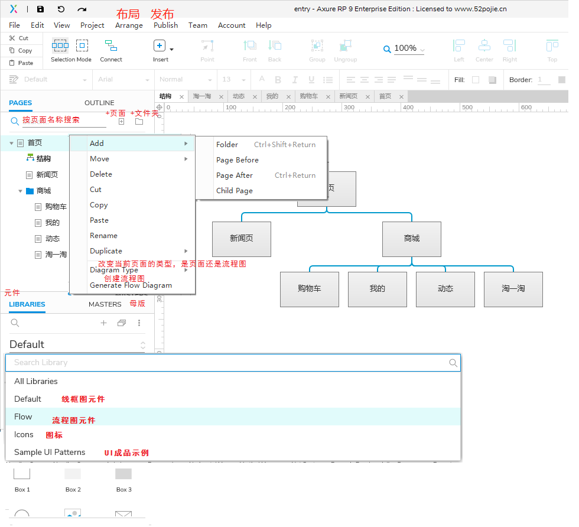

## 1.2 蓝月亮官网结构设计

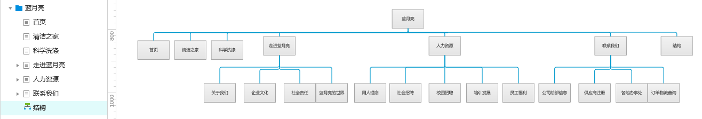

# 2 元件

## 2.1 线框图元件

元件分类：

1. 基本型元件
2. 表单类元件
3. 菜单表格类元件
4. 标记元件

**各个元件右击都会有相应的特殊功能**

### 2.1.1 基本型

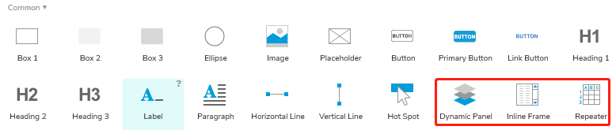

- box，Ellipse右击可以变换形状
- image，可以裁剪crop，分割slice
- **hot spot热区**：用于对一个整体的组件其上分割成不同的区域，对其上覆盖的不同区域做不同的事件处理

#### Dynamic Panel

动态面板主要用于做一些动态效果

1. 显示隐藏（弹出框，对话框的显示隐藏）
2. 滑动效果
3. 拖动效果
4. 状态切换

右击功能项：

1. fit to content：自适应内容
2. scrollbars：滚动条
3. pin to browser：固定到浏览器，在浏览器固定位置展示、
4. 100%width(broswer only)：用于自适应浏览器宽度
5. break away first state：从首个状态脱离，将状态脱离动态面板形成一个独立的元件
6. create master：转换为模板

##### 登录模块设计实例

**1.需要实现的效果**

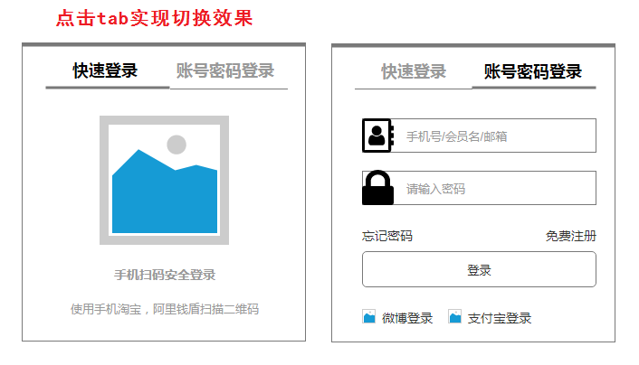

**2.实施**

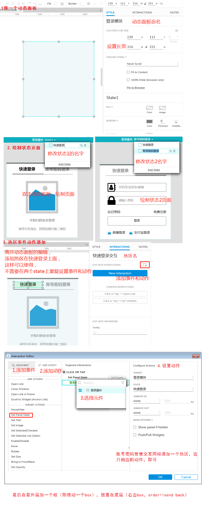

### 2.1.2 表单型

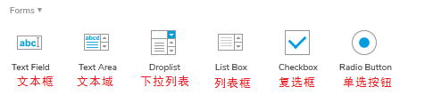

- Text Field文本框：在右侧的interactions，还可以设置输入类型，hint提示语，交互事件等
- Radio Button单选按钮：选中多个单选按钮，然后设置单选按钮组，可以实现只可选中一个

### 2.1.3 菜单表格型

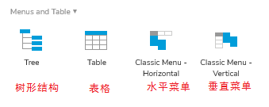

### 2.1.4 标记型

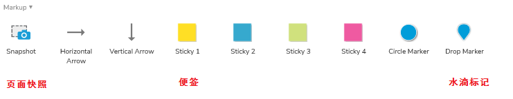

- 页面快照：嵌入另一个页面的内容，有点类似于iframe

## 2.2 流程图元件

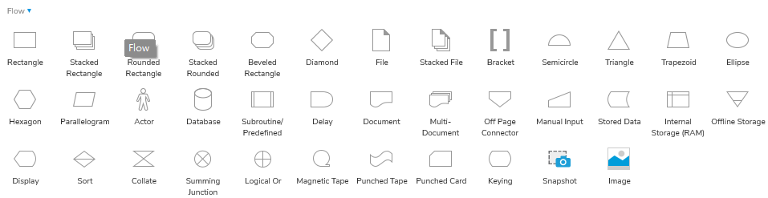

样式工具：view -> toolbars -> styles toolbar

**箭头的样式设置**就在样式工具栏里面，单双箭头可以通过点击相应的样式即可设置，当需要减少箭头的时候，需要点击箭头设置的第一个图样即可减少箭头

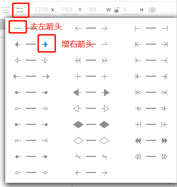

## 2.3 图标元件

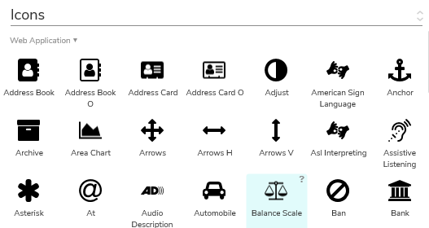

## 2.4 元件库

### 2.4.1 载入元件库

1. 手动导入元件库***.rplib**

   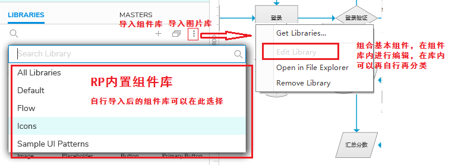

2. 将元件库文件放置在安装文件夹下（**axure\DefaultSettings\Libraries**），系统会自动读入组件库

   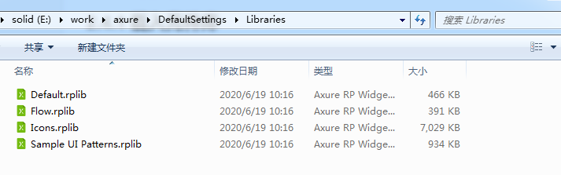

   

### 2.4.2 自定义元件库

在导入图片集旁边的更多options里面，Edit选项就可以自定义元件库

## 2.5 个人简历

单选组：比如下面图中的男和女，要按住ctrl，挨个选中，然后右击，**assign radio group**，即可实现一个组只能选一个的效果

# 3 变量

命名只能包含字母和数字，并且以字母开头。

## 3.1 全局和局部变量

### 全局变量

设置：project -> global variable

onLoadVariable是系统的全局变量，作为项目中最少有一个全局变量使用。

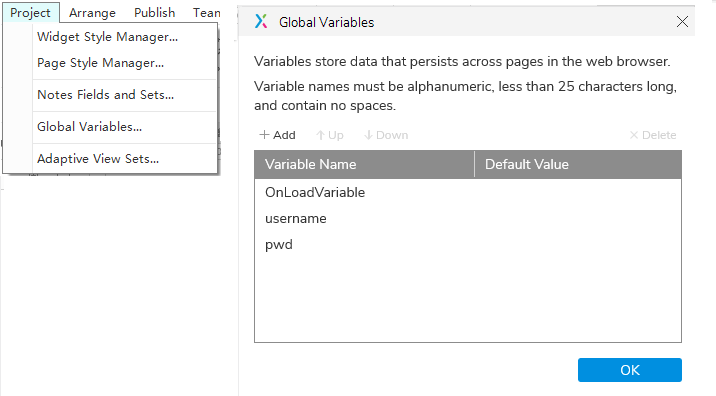

### 局部变量

局部变量**属于元件widget本身**，通常在交互中作为计算属性使用

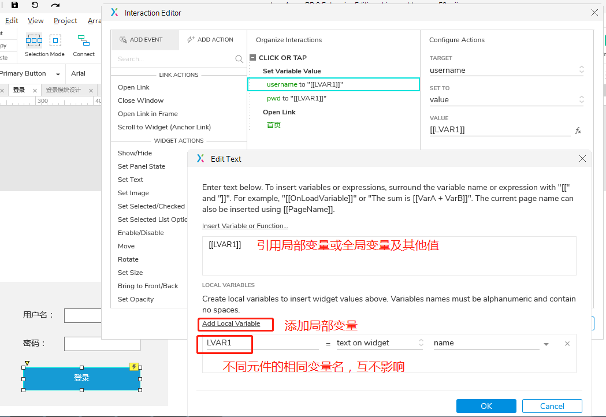

### 变量在页面间传递

需要达到的效果：

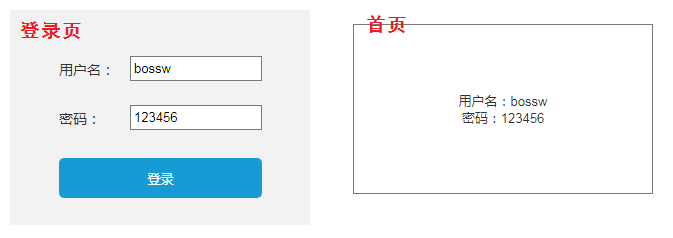

登录页设置全局和局部数据

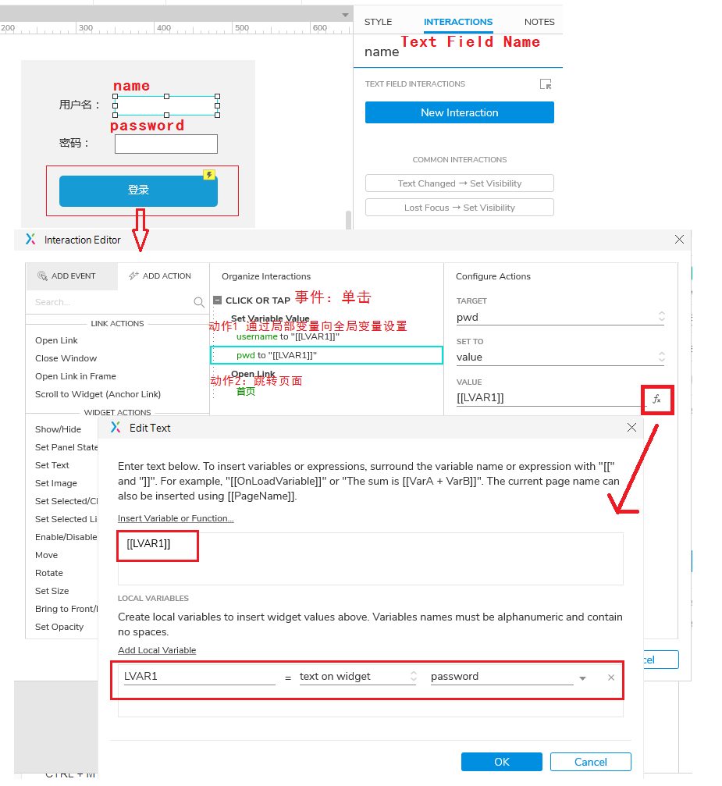

登录页按登录跳转到首页，传递数据给矩形框

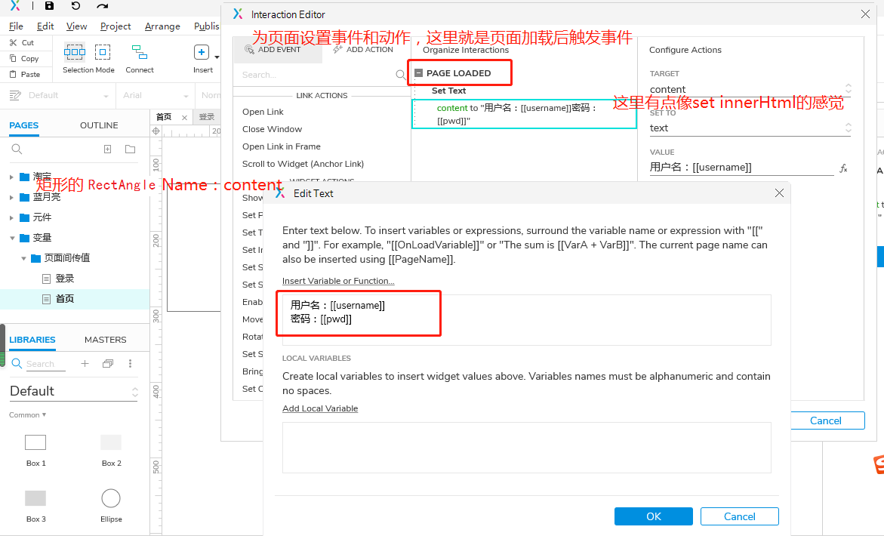

## 3.2 简易计算器

# 其他

## 交互interactions面板

在view视图->panes面板->interactions交互可以打开，也可以toggle right panes（将会打开styles，interactions，notes）

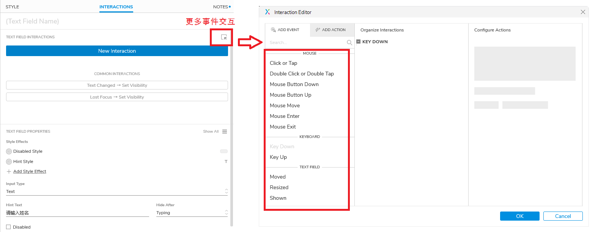

## 格式刷

CTRL + M

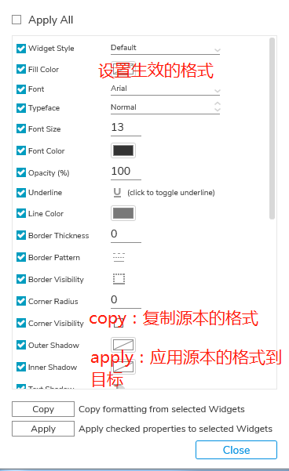

## 词汇

1. interactions：交互，
2. hint：提示
3. toggle：切换，转换
4. style：样式
5. note：说明

## 惯用手法

1. 边框不显示：线宽设置为0