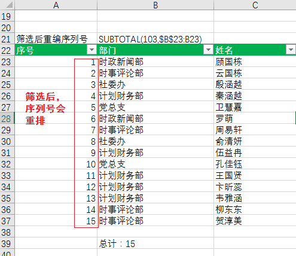

# 1.单元格(区域)

活动单元格即可录入，单元格在意义上包含两层意思，单个单元格和多个单元格组成的区域

## 1.1 活动单元格

##### 选择区域

1. 鼠标拖动（粗十字）
2. Shift + ↑ →  ↓  ←可圈区域

##### “活动”单元格移动操作

1. 鼠标直接点击

2. ↑ ← ↓ →

3. tab 向右

4. enter 默认向下（可进行设置文件->选项->高级->编辑选项->按enter切换的方向）

5. 选中单元格区域录入，限定了活动单元格跳转范围。到区域最右侧单元格后，按tab会回到最左侧，按enter会回到最上方。

   

## 1.2 填充

##### 相同的内容填充

1. Ctrl+R向右填充、Ctrl+D向下填充。（首先最左侧或最上方有内容，你才能填充）
2. 拖动填充柄（鼠标置于活动区域右下角，+号出现，拖动即可）
3. 先选中区域（可选连续区域，Ctrl同时点击可选非连续的区域），再在活动单元格填入内容，然后Ctrl+Enter，所选中区域可全部填充相同的内容

##### 序列填充

1. 自动填充：中文+数字、英文+数字、文本数字（开始 -> 数字 -> 文本 里设置、001、002）
2. 预置序列：星期、月份、季度、天干、地支。
3. 自定义序列： 文件  -> 选项  ->  高级  ->  “常规”组  ->  编辑自定义列表
4. 数列（等差、等比、日期等）：
   - 对话框设置填充：先在第一个单元格中输入起始数字，然后，开始->编辑->填充->序列
   - 填入并选中开始的两个数，拖动填充柄
   - 注重填充选项

5. 序号录入：在序号当中有增删的时候，不需要设置序列的方法。使用函数ROW()返回当前行的行号

   ```javascript
   =ROW([reference])//reference是引用，鼠标放在括号里，点击单元格，就会返回点击行的行号，以供当前单元格引用。不填表示返回当前行的引用  	
   //在第一列中使用对话框的数列填充方式大批量生成序号，再在相邻第二列使用Row，双击第二列第一个单元格的填充柄，即可大批量的生成序号
   ```

##### 快速（智能）填充

基于示例填充数据，当系统识别到某种填充模式后，他才会生效。

基础：输入示例，让系统监测到模式

方式：

1. 系统监测到模式后，有相应提示后，+ enter

2. 选中示例后，下拉填充柄，在填充选项中选快速填充

3. 选定要录入的区域，Ctrl + E

部分应用场景：

- 提取数字和字符串
- 合并字符串
- 调整字符串顺序
- 英文大小写转换和重组
- 添加字符串分割符

##### 成组工作表填充

在多张表中填充，相同的区域或者格式或内容。

步骤：

1. 选中需要填充到其他表的区域
2. 标记同组工作表：Ctrl选中不连续的工作表，Shift选中连续的工作表
3. 开始->编辑->填充->至同组工作表->

##### 内容重排

用于多行合并（一列多个的内容想合到同一个单元格，扩宽首个单元格的宽度，使其足够容纳一列的内容）、单行拆分（一个单元格放不下太多具有大体相似模式的内容，例如有相同分割符，缩小单元格宽度使其只能容纳一个元素）

步骤：

1. 选中需要操作的区域
2. 开始->编辑->填充->内容重排


## 1.3 编辑单元格

##### 修改

1. 部分修改：a. 单击单元格，编辑栏修改（或F2，光标出现修改），b. 双击单元格，出现光标修改

2. 完全修改：单击单元格，直接修改。

##### 增删

插入（删除）单元格：首先选择单个单元格或区域，再开始->单元格->插入(删除)，活动单元格~，或整行整列，即可添加，单个单元格或区域。

##### 移动

移动：选中单元格（区域），移动到空白区域，Ctrl+X——>Ctrl + V，移动到有数据的区域，Ctrl +X->右击插入剪切的单元格

鼠标拖动方法：空白区域：鼠标放在单元格的框线上，出现“移动”的鼠标，拖动即可

​			有数据的区域：拖动的同时，按住Shift键

##### 复制

复制：选中单元格（区域），移动到空白区域，Ctrl+C——>Ctrl + V，复制到有数据的区域，Ctrl +X->右击插入复制的单元格

鼠标拖动方法：空白区域：鼠标放在单元格的框线上，出现“移动”的鼠标，Ctrl+拖动即可

​			有数据的区域：拖动的同时，按住Ctrl + Shift键

<h5>粘贴</h5>

excel有多种粘贴方式，行列转置、公式、值、格式、值和格式、

## 1.4 单元格格式

1. 边框：开始->字体->框线按钮，有现成的样式，也可以自定义->其他边框

2. 换行：
   - a.开始->对齐方式->自动换行，
   - b. 强制换行：单元格内出现光标，然后Alt+Enter，
   - c.缩小字体填充，对话框里设置

3. 合并：

   - a.开始->对齐方式->合并后居中或合并单元格，可以将选中区域（n行×n列）合并为一格（1行X1列）
   - b.开始->对齐方式->跨越合并，将（n行Xn列）转为（n行X1列），也可以先将（1行Xn列）合并为（1行X1列)，然后向下拖动，也可实现跨越合并

   ​	注意：合并单元格时，仅保留右上角单元格的内容。

4. 大小调整：是通过调整行整列来调整单元格的大小的

   - a.拖动调整，选中行列，拖动调整其中某一列（宽）或某一行（高），每一行或某一列的宽高都会相同变化。
   - b.自动调整：双击行列标号分界处
   - c.具体设置：打开对话框设置具体大小，开始->单元格->格式->单元格大小	

## 1.5 数字格式

数字格式并不影响excel用于执行计算的实际单元格值，实际值显示在编辑栏中。

可用数字格式：开始->数字->下拉框

- 常规：默认数字格式。如果单元格宽度不够，对于浮点数，进行四舍五入。对于较大的数字（12位或者更多）使用科学记数表示法
- 数字：保留小数位数（默认两位，少了四舍五入），是否使用千位分隔符，如何显示负数
- 货币：小数位数，货币符号
- 会计专用
- 日期
- 时间
- 分数
- 百分比
- 科学计数
- 文本
- 特殊：选择不同国家和区域，有不同的特殊格式。中文（中国）——邮政编码，中文小写，中文大写
- 自定义：

# 2. 工作表

## 2.1 行列

##### 基本概念

- 单元格名称：由行号和列号构成，eg：A3，页面布局->工作表选项->查看
- **单元格区域:左上角：右下角，eg：A3:D6**
- 去工作表的最上最下最左最右：Ctrl + ↑  ↓ ←  →

##### 行列的选择

单行、单列：点击行号、列标

多行、多列：

1. 连续的行列：a. 点击行号、列标，再拖动鼠标，b. 点击首行或首列，再shift+点击尾行或尾列
2. 不连续：Ctrl + 点击

##### 行列一般操作

插入（删除亦然）：

1. 单行、单列：选定行列，a. 开始->单元格->插入，b.选定行列，右击插入，c. 选定单元格，右击插入
2. 多行、多列：先选定多行、多列，再插入

行列隐藏

1. 隐藏：选定行列，a.右击隐藏，b.开始->单元格->格式->可见性
2. 取消隐藏：选定夹着隐藏行列的行列，a.右击取消隐藏，b.开始->单元格->格式->可见性

行列移动复制

移动：

1. 到空白区域：拖动   /   Ctrl + X再Ctrl + V
2. 到内容区域：Shift + 拖动   /   剪切再右击插入剪切的单元格 

复制

1. 到空白区域：Ctrl + 拖动   /   Ctrl + C再Ctrl + V
2. 到内容区域：Ctrl + Shift + 拖动   /   复制再右击插入复制的单元格 

## 2.2 工作表

工作簿：excel创建的.xlsx，它包含多张表（最多255），表名不可重复。初始创建设置：文件->选项->常规->新建工作簿时

重命名：开始->单元格->格式->组织工作表   /   双击标签即可重命名

标签颜色：开始->单元格->格式->组织工作表   /   右击标签、

移动和复制(可以在不同的工作簿中进行）：

- 功能菜单：开始->单元格->格式->组织工作表，复制—>勾选建立副本

- 拖动：移动：直接拖动   /     复制：Ctrl + 拖动

工作组：同时选中多张工作表，形成工作组


## 2.3 视图

### 显示比例

视图->显示比例。

 Ctrl + 滚动鼠标  / 缩放到选定区域   / 缩放（设置初始化比例）

### 工作簿视图

视图->工作簿视图。

- 普通视图：显示整个电子表格
- 分页预览：显示分页符的位置
- 页面布局：以页面效果显示文档，查看页眉页脚

### 显示

视图->显示

- 直尺，在页面布局时使用，方便调整页边距
- 编辑栏，默认显示，方便编辑单元格内容
- 网格线，默认显示。“页面布局->工作表选项”功能栏，可以设置为能打印的表格线，
- 标题，默认显示，行号列号的显示/隐藏。“页面布局->工作表选项”功能栏，可以设置为能打印的标题

###  窗口

视图->窗口

单窗口（单文件）操作：

- 新建窗口：将一个excel窗口复制成为两个窗口，在任意一个窗口的操作都会在两个窗口上生效。
- 拆分：将窗口按照活动单元格的位置，拆分成四个区域，可以分别拖动滚动条操作和观察数据。分割线可以拖动调整分割的位置 。
- 冻结窗格：冻结首行/冻结首列/冻结窗格（基于当前选择），首行不动/首列不动/基于当前活动单元格，左侧和上方的区域不动。便于观看数据属于哪个主键，属于哪个字段

多窗口（多文件）操作：

- 切换窗口：在多个excel窗口之间切换
- 全部重排：平铺/水平并排/垂直并排/层叠，多个窗口按选择的排列模式同时显示在屏幕上，以供观察对比数据。
- 隐藏和取消隐藏：可以设置某一个窗口在切换窗口时或重排时不出现或出现
-  并排查看：查看其中两个窗口的数据
- 同步滚动：在任意一个窗口滚动你，另一个窗口也会同步的滚动
- 重设窗口的位置：让凌乱排列的窗口，回到最初排列的位置。

注意：多个excel文件的操作必须在同一个excel程序中，打开，才能操作。

# 3. 函数

三大家族——一个是以SUM函数为首的求和家族，一个是以VLOOKUP函数为首的查找引用家族，另外一个是以IF函数为首逻辑函数家族。

1. 基础知识：公式怎么写，常见概念（公式名，参数，引用$）
2. 数值统计分析技术：求和，条件求和，所有和数字相关的函数
3. 文本处理技术：字母、汉字等文本的处理函数
4. 时间处理技术：时间推算，求时间间隔，所有和时间相关的函数
5. 查找引用技术：vlookup，lookup
6. 数组运算技术
7. 条件筛选技术
8. 数据提取技术
9. 函数的其它应用

使用：掌握基本使用->熟记适用场景->掌握各种组合套路->多动手、多帮忙

解决思路：分析问题->结合手工处理方式找规律->挑选函数组合

函数的优点：快，准，省（适用于数据量小的情况下）

缺点：数组公式运算效率不高，跨表（超过3个）、跨工作簿（通常采用透视表去做）的多维度统计难度大。较为复杂的报表统计需求难以满足。

## 3.1 函数基础

公式基本格式：=号开头，后面加上运算规则

运算符：

- 算术运算符：+ - * /  ^
- 比较运算符：= > <  <> <= >=
- 文本连接符：&
- 通配符：* ？ ~ 等

数据类型：

- 文本：汉字，字母，文本型数字(在数字开头加单引号，单元格右上方会出现绿色三角标)
  - 特殊字符：**英文状态下的""代表空**
- 数字
- 日期
- 逻辑值：TRUE or FALSE
- 错误值：
  - ####：单元格列宽不够
  - #VALUE!：使用的参数或者操作类型错误
  - #DEV/0!：除零错误
  - #NAME?：excel未识别公式中的文本，如错误的函数，自定义名称，宏等
  - #N/A：当数值对函数或公式不可用时，出现错误
  - #REF!：单元格引用无效时的错误
  - #NUM!：公式或数字出现无效数字时
  - #NULL!：

### 3.1.1 单元格引用

单元格引用：分为相对引用、绝对引用和混合引用，通过**$符可以固定行号和列号使其不因位置变化而变化**

- 相对引用：如D1单元格有公式：=A1+B1 当将公式复制到D2单元格时变为：=A2+B2，**行号和列号是随着单元格位置变化而发生相对的增减。**
- 绝对引用：如D1单元格有公式：=$A$1+$B$1 当将公式复制到D2单元格时仍为：=$A$1+$B$1，**行号和列号是不随着单元格位置变化而变化**
- 混合引用：如D1单元格有公式：=$A1+B$1 当将公式复制到D2单元格时变为：=$A2+B$1，

在公式输入处的单元格引用处，可以通过**按F4切换单元格引用方式**

不可忽略的单元格格式：常规，如果不是该格式，公式不会进行运算。

### 3.1.2 IF函数

`if(logical_test,[value_if_true],[value_if_false])`

1. IF嵌套：后两个参数可继续嵌套if函数，实现多条件判断。**条件的范围由小到大书写嵌套**。
2. `OR(cond_1,cond_2...)，AND(cond_1,cond_2...) 返回true or false,结合if函数使用很有效果`
3. 应用场景：涉及到条件判断时使用，eg：成绩的优良中差的判断录入
4. 限制：当条件超过4个，IF函数的嵌套写起来会很痛苦

### 3.1.3 文本处理函数

单元格格式：文本

常用：

- `LOWER(text)，UPPER(text)， PROPER(text)首字母大写，`
- `LEN(text)字符长度， LENB(text)字节长度，一个字符等于两个字节，在excel中默认的单位是字符，所有汉字，字母，数字都是字符，长度为1`
- ` LEFT(text,num_chars)， RIGHT(text,num_chars)， MID(text,start_num,num_chars)`
- `CHAR(numberid),eg:char(10)是一个换行符`
- `EXACT(TEXT1,TEXT2)`比较两个字符串是不是完全相同

应用场景：

- 身份证号上的出生日期提取（LEFT RIGHT MID），
- 中文名和中文名首字母串起来想分开时,难度在于姓名它不是固定长度的（eg：瞿看海qkh，`LEFT(text,LENB(text)-LEN(text))`）
  - 中文字符的个数：`LENB()-LEN()`
  - 英文字符的个数：`LEN()*2-LENB()`

### 3.1.4 数字处理函数

#### 求和与条件求和

- `SUM(num1,num2...),AVERAGE(),MAX(),MIN()`
- `SUMIF(criteria_range条件区域，criteria求和条件，[SUM_RANGE求和区域，如省略默认为条件区域])： 单条件求和,`
  - eg：`SUMIF(G:G,L11,H:H),G列中等于L11单元格内容所在行的H列的数求和`
  - eg：`SUMIF(G:G,">500",G:G),大于500的数值求和`
  - 条件的值如果超过15位数字需要在后面连接星号。`SUMIF(G:G,L12&"*",H:H)`
  - 注意：
    - 条件区域和求和区域的首行（列）号要对应，否则求和区域就会**错位求和**。
    - 条件区域要么选择整列（单列条件），或者所有数据的区域（多列条件）
  - 单列条件单列求和，`=SUMIF(A$7:A$12,D8,B$7:B$12)`
  - 多列条件多列求和，=SUMIF(A$16:F$21,H17,B$16)
- `SUMIFS(sum_range求和区域, criteria_range1条件区域1, criteria1条件1,[criteria_range2条件区域2, criteria2条件2],...)`
  - 多个条件同时成立才进行求和运算
- `ABS(number),int(number),`
- `round(number,num_digits)四舍五入,roundup(number,num_digits)向上,rounddown(number,num_digits)向下，num_digits保留的位数`
- `mround(number需要舍入的数字,multiple数字舍入的基数)，如果number除以指定的multiple的余数大于或等于multiple值的一半，mround将向上舍入`
- `mod(number,divider)`，应用：判断奇偶（隔行填充），周期性产生数字，条件格式
- 注：**日期也可以用`int和round处理`**

#### 计数

- `COUNT()`
  - 只数数字的个数，不会数文本型的单元格
  - 支持多个参数，列，行，区域的数字单元格进行计数
- `COUNTIF()`
  - `COUNTIF(COUNT_range,count_criterial)`
  - 应用场景：找重复（是否签到），**条件格式**
  - **条件格式**：如果条件为真，格式生效，如果条件为假，格式忽略
  - 
  - 数据有效性
  - 
  - 
- `COUNTIFS()`
  - `COUNTIFS(count_range1,count_criterial1,count_range1,count_criterial2,...)`
  - 多个条件同时成立才进行计数
  - COUNTIFS向COUNTIF转换，采用辅助列，把多个判定的内容连接在一起形成一个判定条件
- `COUNTA()对非空单元格进行计数，COUNTBLANK()对空单元格进行计数`

### 3.1.5 多表引用与subtotal

在表中引用其他表中的数据。

引用单张表：`'sheet_name'!单元格引用，eg：A!E:E，代表表A的E列`，**表名的引号在表名有非英文字符的时候使用**

引用多张连续表：`'start_sheet_name:end_sheet_name'!单元格引用，eg:A:C!E:E,代表表A到表C的E列`

#### subtotal

返回列表或数据库中的分类汇总,例如筛选后的数据。

`SUBTOTAL(function_number,统计区域)`，统计区域为没有分类汇总前的数据区域。

| 忽略隐藏值 | 函数    | 函数作用       |
| ---------- | ------- | -------------- |
| 101        | AVERAGE |                |
| 102        | COUNT   |                |
| 103        | COUNTA  |                |
| 104        | MAX     |                |
| 105        | MIN     |                |
| 106        | PRODUCT | 括号内数据累乘 |
| 107        | STDEV   | 标准差         |
| 108        | STDEVP  |                |
| 109        | SUM     |                |
| 110        | VAR     | 方差           |
| 111        | VARP    |                |


应用：筛选数据后，重新排列序列号



### 3.1.6 自定义格式

在不改变单元格原始值的情况下，让它采用不同格式来显示，达到一个化妆的效果

在开始->数字->设置单元格格式（【 Ctrl + E 】）->自定义格式

**格式代码**

| 代码 | 含义                                                         |
| ---- | ------------------------------------------------------------ |
| ""   | 自动显示的字符串内容                                         |
| #    | 只显示有意义的数值，过滤无意义的0，还有保留小数。eg：格式中定义#，输入01.24，他会自动显示1。在格式中定义#.##，输入12.3，它会自动显示12.30 |
| .    | 小数点                                                       |
| 0    | 位数不足自动补零，eg：在格式中定义为000，输入1，它自动显示001. |
| ,    | 千位分隔符，eg：在格式中定义为#,###.##，输入123456.156，它自动显示123,456.16 |
| @    | 引用一次单元格内容                                           |
| Y    | 年                                                           |
| M    | 月                                                           |
| D    | 日                                                           |
| H    | 时                                                           |
| M    | 分                                                           |
| S    | 秒                                                           |
| A    | 星期，AAA，AAAA                                              |

**TEXT函数**

会改变单元格的内容，达到一个整容的效果

`TEXT(VALUE要转换的值,FORMAT_TEXT转换后的格式)`

还有许多其他格式，可以查阅。

### 3.1.7 时间处理函数

日期时间在系统中是以时间序列号的形式存储的，也就是下面提到的序列号。

序列号以1900年开始计算，单位是天，小时的计算就是用1/24*小时数。

在excel中以日期格式显示，但实际是一个序列号，我们可以通过，更改单元格格式看到这个序列号（2015/6/16 单元格格式->常规，我们可以看到序列号为42171）

日期和数（单位是天，1对应就是一天，如果是小时或者分钟，做相应的换算后再相加减）可以直接相加减

| 功能分类               | 函数            | 解释                                                         |
| ---------------------- | --------------- | ------------------------------------------------------------ |
| 返回当前系统日期和时间 | today()         |                                                              |
|                        | now()           |                                                              |
|                        | year()          |                                                              |
| 取年月日时分秒         | month()         |                                                              |
|                        | day()           |                                                              |
|                        | minute()        |                                                              |
|                        | second()        |                                                              |
| 计算日期间隔           | weekday()       | 返回日期在一周中的第几天                                     |
|                        | weeknum()       | 返回日期在一年中的第几周                                     |
|                        | **date(y,m,d)** | 返回代表特定日期的序列号，**超过进制能自动进位**             |
|                        | networkdays()   | 返回两个日期间的工作日天数                                   |
|                        | **datedif()**   | 用于计算两个日期间的年数、月数、天数，`datedif(start,end,"y/m/d/ym/md/yd")`，ym为除年取月。 |
| 时间日期转换           | datevalue()     | 将单元格中使用文本单元格格式的日期转换为<br>可用于日期计算的序列号 |
|                        | time()          | 用于返回指定时间的序列号                                     |
|                        | timevalue()     | 将单元格中使用文化单元格格式的时间转换为<br>可用于日期计算的序列号 |
|                        |                 |                                                              |

## 3.2 查找引用技术

### 3.2.1 VLOOKUP

`VLOOKUP(lookup_value要查找的值,table_array查找区域,col_index_num返回第几列,range_lookup是否模糊匹配)`

- 查找区域的首列，必须是要查找的值所需要检索的列
- 返回第几列要从，查找区域的首列开始数，而不是直接读在表格中的列数。
- 可以跨表操作：VLOOKUP(B4,VLOOKUP!$B$2:$D$16,3,FALSE)
- **统配符查找**：VLOOKUP("\*"&B11&"\*",VLOOKUP!C2:D16,2,0)，在关键字的前后加通配符"  *  "即可查找，类似于mysql中的左模糊，右模糊查找
- 模糊匹配：对于数字，首先精确找，找不到就找比该数字小且最近的数字
- 数字格式问题：数字有两种类型，文本型数字和数值型数字，这两种格式的数字在匹配时无法匹配到，所以在匹配前要进行转换处理，
  - 数值型->文本型，ref&""
  - 文本型->数值型，ref*1 或者--ref
- `IFERROR(value,if_error_value)`
- **行查找**：`HLOOKUP(lookup_value要查找的值,table_array查找区域,col_index_num返回第几行,range_lookup是否模糊匹配)`，用法和VLOOKUP相同

### 3.2.2 INDIRECT

直接通过点击单元格获取的值，称为直接引用

通过INDIRECT函数，将文本字符串转换为引用，称为间接引用

`INDIRECT("ref_text")`

- 动态统计：
- 先了解一个功能：公式->定义的名称->名称管理器，用一个名称去引用区域，或自定义的复杂公式
- 
- `SUM(INDIRECT("数据源!E2:E7"))`，当数据源这张表先删除，再新建后，这里的统计公式就会恢复，而不会出现报错（#REF!）
- 多级列表，eg:省选择->市选择->区县选择
  - 先定义名称，批量定义名称可以使用“根据所选内容创建”功能实现
  - 数据有效性->序列，一级菜单直接=就可以了，二三级只需使用indirect引用即可
- 

# 技巧

1. F4切换单元格引用方式
2. **公式选项卡->公式审核->公式求值->步入计算，可以看到求值的过程**
3. F9抹黑计算：在公式处通过鼠标选中需要计算的部分（抹黑），再按F9可以计算出选中的这部分的内容
4. char(10)是一个换行符，用于公式中输入换行符
5. 连续单元格向上向下选中单行或单列：【CTRL + SHIFT + ↓ or →】，选中行或列之后，再【CTRL + SHIFT + →  or  ↓ 】就可以选中单元格区域

# 实践

vlookup函数是excel中的一个纵向查找函数，VLOOKUP(lookup_value,table_arry,col_index_num,range_lookup)


&作为字符连接符，“    **"  "**   "”双引号用于罩住字符，点击单元格用于引用


单元格引用：分为相对引用、绝对引用和混合引用。

- 相对引用：如D1单元格有公式：=A1+B1 当将公式复制到D2单元格时变为：=A2+B2，
- 绝对引用：如D1单元格有公式：=$A$1+$B$1 当将公式复制到D2单元格时仍为：=$A$1+$B$1
- 混合引用：如D1单元格有公式：=$A1+B$1 当将公式复制到D2单元格时变为：=$A2+B$1

计算单元格位置并引用该位置的值

- 要获得如A（39*2+3）单元格位置的值（即A81位置单元格的值）。 **=indirect("a"&39\*2+3) **

返回当前行数：=ROW(  )

返回当前列数：=COLUMN( )

返回单元格：ADDRESS( row_num,column_num, cite_type,table_name)，eg：ADDRESS(ROW(),COLUMN(),4)——返回当前单元格行列号

返回当前列号：SUBSTITUTE(ADDRESS(ROW(),COLUMN(),4),ROW(),"")

返回当前单元格的值：INDIRECT(SUBSTITUTE(ADDRESS(ROW(),COLUMN(),4),ROW(),"")&ROW())