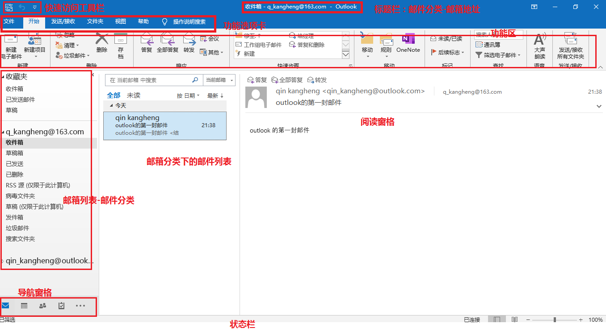

# OutLook

[使用outlook登录163邮箱](https://blog.csdn.net/u010924297/article/details/81214108)

outlook不为人知的功能：

1. 邮件能统计投票数据：投票邮件
2. 邮件模板：类似于日报，周报
3. 收件人是否阅读：别人一旦打开了我们的邮件，我们可以立刻收到一个邮件的回执
4. 邮件签名：在我们发出的每一封邮件的下面会自动添加签名
5. 海量邮件结构清晰化
6. 邮件定时发送
7. 导入导出邮件：邮箱存储空间有限，当邮箱满了之后，就需要导出

# 1 管理环境

**创建outlook账户**：由于outlook账户是免费的，按照提示创建一个outlook账户。

为客户端应用**创建快捷键**：首先创建应用的快捷键->右击属性->快捷方式->快捷键->按两组按键：第一组多个键一起按，然后再按一组一个键，这就满足快捷键的用法

## 1.1 发送第一封邮件

当outlook账户发送第一封邮件时，你会发送失败，而且他会发过来一封邮件，会让你绑定手机号，当你绑定好手机号之后，你就可以发送邮件了。

新建邮件快捷键：【 Ctrl + N 】

**发件人恢复和垃圾邮件恢复**：

- outlook可以代理登录多个邮箱账号，当一个账号向另一个账号发邮件的时候，可能会出现收件箱中无，而垃圾邮件中却出现了，在垃圾邮件中找到该邮件，右击快捷菜单

邮件分类文件夹的解释：

1. 发件箱：发送中的邮件会在这个分类中
2. 已发送邮件：已发送成功的邮件

邮件答复：

1. 答复：回复邮件给发件人

2. 全部答复：回复邮件给该邮件的所有参与者（包括发件人，和发件人同时发送的其他人）

3. 转发：将邮件转给需要转发的人

   

收件人：

1. 收件人：是该邮件的直接处理人，负责人
2. 抄送：抄送给的人，只是该邮件的知晓者，并不对这封邮件直接负责
3. 密件抄送：密送的人可以看见该邮件有哪些收件人抄送人，但收件人不能看见这封信给了哪些密送人。

## 1.2 工作界面

导航窗格：可以改变当前操作的对象，

1. 操作对象：邮件、日历、联系人、任务、便签、文件夹、快捷方式
2. 可以在视图->布局->文件夹窗格->选项，进行修改

阅读窗格

1. 视图->布局->阅读窗格->选项，可以在阅读邮件几秒后标记为已读邮件。
2. 调整阅读字体的大小： Ctrl + 鼠标滚动

微软待办栏

1. 视图->布局->微软待办栏，将日历或联系人窗口显示出来。需要后面结合日历，联系人使用。

自定义快速访问工具栏

1. 法一：文件->选项->快速访问工具栏
2. 法二：鼠标悬置功能的上面->右击快捷菜单->添加到快速访问工具栏
3. 

自定义功能区

1. 将自己常用的命令和工具汇集在一起
2. 和自定义快速访问工具栏相似
3. 

## 1.3 添加qq邮箱

登录qq邮箱web端，设置->账户->POP3/IMAP/SMTP，开启pop3/SMTP或者IMAP/SMTP服务。

pop3 ：客户端与服务器异步

imap ：客户端与服务器同步

# 2 创建邮件

## 2.1 添加附件

有两种方式添加附件：

1. 本地文件和oneDrive文件（类似于网盘文件）。
2. 新建电子邮件->邮件->添加->附加文件，
3. 浏览此电脑为本地文件，
4. 浏览web位置为oneDrive文件。
   - 将自己的文件拖拽到oneDrive的文件夹中去，它就会同步到oneDrive云端上去，然后你就可以将此oneDrive文件添加为附件，
   - 有两种方式，共享链接，附加为副本（以文件发送，和浏览本地是一样的），**共享链接用于发文件很大的文件**，而添加副本用于发送小文件。
5. 

## 2.2 邮件签名

用于对接收邮件方，表明我方身份，一般包含姓名，职务，公司，办公地点等信息。

签名会在新建邮件时，被自动添加到邮件内容的末尾。

有两个地方可以设置签名：

1. 文件->选项->邮件->撰写邮件->创建或修改邮件的签名
2. 新建电子邮件->邮件->添加->签名，就可以设置或添加我们需要的签名

签名设置与调整

1. 图片大小调整：新建签名->编辑签名->图片按钮，选择想要添加的图片，通常为公司logo等，
   - 添加到编辑框后，发现图片大小不合适，想要更改大小，然后去图片的边框上拖动，这样是不行的（bug）
   - 必须右击图片->图片->大小，设置好尺寸之后，点击确定，发现图片变小了，但原来大小的图片在修改后的图片的下面，这里也是一个bug
   - 再点击确定，退出签名，再进入签名进行编辑，就发现图片尺寸发生了变化。
2. 或者也可以通过在word文档中设置好签名的版式和内容，复制过来，粘贴到编辑框中，即可。但是这里也有一个bug，就是粘贴过去的图片，在编辑框中看不见，但它确实存在，可以自行验证。
3. 文字内容，在编辑框那里也可以自行调整。
4. 选择默认签名。可以多添加几个签名，为每个邮箱设置不同的默认签名。

## 2.3 邮件内容样式的编辑

如果我们在outlook中对邮件的样式进行排版，那么是不容易的，也是不专业的，比如添加表格等

所以，在通常情况下，我们都会在word中将邮件的文本排好后，复制粘贴到邮件中即可。

## 2.4 批注

公司员工发了一个邮件给老板，老板觉得邮件的内容有些不妥之处，于是乎，就给邮件添加了批注

批注功能的实现设置

1. step1：文件->选项->邮件->撰写邮件->信纸，勾选标记批注时使用，并且编辑好批注人的人名（老板或评阅人的姓名）。
2. step2：文件->选项->邮件->答复和转发-，勾选在批注前面加上，并且编辑好批注人的人名（老板或评阅人的姓名）。
3. 这样就可以添加批注了。

当别人给你发了邮件后，你将此邮件转发或者回复，只要你在原邮件上进行编辑（首先敲一个空格，或者一个回车），那么都有有以中括号罩住的姓名开头的内容出现，以表示这里是批注的内容。

## 2.5 邮件模板

### 创建模板

有很多邮件的内容都很相似，把内容固定的部分我们可以制成模板。

比如说我们的offer邮件，内容基本是固定的，除了姓名，岗位，薪资等不同外，其他部分内容就都相同了。

创建模板：

1. 新建邮件，将编辑好的内容模板从word中copy到邮件的内容部分，删除掉我们的签名部分，不然后面新建邮件的时候签名会出现重复
2. 编辑好模板后，点击文件另存为，保存类型，选择outlook模板（.oft）文件，它就会自动定位到系统的模板路径，然后保存即可。
   - 它自行定位的模板存放位置为：C:\用户\当前用户名\appData\Roaming\Microsoft\Templates

使用模板：

1. 开始->新建项目->其他项目->选择表单，跳出窗口，查找范围->文件系统中的用户模板，选择对应我们需要的模板，打开，
2. 编写邮件

### 导入导出模板

模板存储路径，你可以在新建模版那里复制模板保存路径，那里存放的有自行建立的模板，对这些.oft的文件的增删，就可以实现对模板的导入导出。

## 2.6 邮件批量发送

word的邮件批量发送功能。例子：offer的批量发送。

1. 打开信息表（字段）：邮件->选择收件人->使用现有列表，找到记录有被录取人的姓名、邮箱的excel工作簿，找到邮件里对应的表，打开。
2. 插入字段到文本：鼠标点到需要插入对应字段的地方，邮件->编写和插入域->插入合并域，选取合适的字段名，然后，光标所在处就会插入<<录取人>>的示意。
3. 预览结果：邮件->预览结果，还可以上下切换预览对象
4. 发送电子邮件：邮件->完成->完成并合并，那里有发送电子邮件，也可以对个别邮件进行单独修改
   - 弹出，合并到电子邮件窗口，选择收件人邮箱字段，编写主题行等信息，确定即可发送，
   - 即以当前outlook主邮箱发送邮件。

# 3 邮件设置

1. 默认格式设置
   - 默认的邮件是以HTML格式发送的
   - 修改默认：文件->选项->邮件->撰写邮件->更改邮件的编辑设置。它提供RTF，HTML，纯文本
   - 动态修改格式：新建邮件->设置文本格式
2. 默认样式设置
   - 文件->选项->邮件->撰写邮件->信纸和字体，可以自定义，也可以使用主题
3. 答复转发格式设置
   - 转发次数很多之后，邮件就会变得异常的大，我们可以把它转化文附件的形式
   - 文件->选项->邮件->答复和转发，
   - 附加邮件原件，将邮件原来的内容，转为附件
   - 包含并缩进邮件原件文本，会对原邮件进行缩进
   - 给邮件原件的每行加前缀，给每行开头加竖线
4. 图片自动下载设置
   - 选项->信任中心->自动下载
5. **邮件对话**设置
   - 如果有的联系人和我们联系特别密切，所以在查看邮件的时候，来回在收件箱和已发送文件夹里查看是非常累的一件事。
   - 对话的设置有助于查找邮件等优点
   - 点击某个邮件文件夹，例如收件箱，视图->显示为对话，对话设置，可以实现邮件的对话显示
6. 邮件接收提醒
   - 就相当于来电铃声等提醒功能
   - 文件->选项->邮件->邮件到达
7. 脱机时的，邮件状态自动检测，发送接收
   - 当我们的电脑断网（脱机）了，邮件没有发送成功，希望让outlook每隔一段时间自动去检测是否有需要发送的邮件还没发送，若有则发送
   - 文件->选项->高级->发送和接收，
8. 延迟发送邮件
   - 给领导发会议提醒，在会议开始前，定时发送，也无需担心自己忘了。
   - 新建邮件->选项->其他选项->延迟传递。传递选项，邮件发送后，一只在发件箱 中等待，直到时间一到，就发送出去了。
9. 自动答复
   - 文件->信息->自动答复，发送自动答复，设置能自动答复的时间范围。
10. 设定答复指定人
    - 老板要发送一封邮件给下属，想让下属答复给秘书，让秘书收到来自下属的答复
    - 新建邮件->选项->其他选项->发送答复至，传递选项->将答复发送给
11. 邮件投票
    - 一定要设置文本格式为**RTF格式**，HTML格式这个功能实现不了
    - 新建邮件->选项->跟踪->使用投票按钮，设置多个选项供收件人选择
    - 收件人收到后，会看到一个蓝色感叹号的提醒，上面写着“此邮件包含投票按钮，点击此处可投票”，点击，投票后，又出现立即发送响应还是发送前编辑响应
    - 发件人在等别人都回复后，点击蓝色感叹号，查看邮件答复，即可看到投票结果
    - 只有outlook可以使用投票功能
12. 邮件跟踪
    - 确定对方在什么时候收到的，在什么时候阅读的，我们就可以收到，对方收到的时间和对方阅读这封信的时间
    - 新建邮件->选项->跟踪->请求送达/已读回执，如果两个选项都勾选后，会发生以下两个事情
    - 一旦发送成功，就会收到回执
    - 收件人在接收邮件后，并且打开邮件后，就会弹出是否发送已读回执的弹框。如果对方愿意发送已读回执，我们才能收到已读回执。
    - 默认设置邮件跟踪：文件->选项->邮件->跟踪，送达/已读回执，勾选
    - 对于别人发送给我们有请求回执的邮件，我们也可以在那里设置对待这些请求回执邮件的默认处理方式
13. 

# 4 管理邮件

打标记，做筛选，做分类，做操作

1. 文件夹的方式管理邮件
   - 文件夹管理，
     - 鼠标悬置在不同的文件夹上，右击快捷菜单->新建文件夹，即可在对应文件夹下新建子文件夹
     - 选项卡，文件夹->新建文件夹
     - 对应也有删除，移动，复制，重命名文件夹等操作
   - 邮件管理
     - 拖动邮件到文件夹内
     - 移动（复制），删除：右击邮件，快捷菜单
     - 多选邮件：【Ctrl + 点击】，【Shift + 点击】
     - 标记已读or未读：右击，快捷菜单，
   - 
2. 移动，与对话相关的邮件
   - 老板与小陈之间发邮件很频繁，我们想将次对话的所有邮件都移动到某个文件夹中（例如：关于某个项目的文件夹）
   - 右击小陈所发的邮件->移动->总是移动此对话中的邮件，未来有关小陈的邮件都会移动到某个文件夹中
3. 设置垃圾邮件识别
   - 开始->删除->垃圾邮件
     - 阻止发件人，从不阻止发件人，从不阻止发件人的域（@xxx.com都不阻止）
     - 垃圾邮件选项->选项（垃圾邮件识别，高，低的阈值设置），安全发件人，安全收件人，阻止发件人，国际
   - 
4. 新建邮件时，敏感度和重要性的设置
   - 新建电子邮件->邮件->标记，更多选项，
   - 可以设置重要性（低，普通，高，对方收到邮箱后有一个红色感叹号，表示重要性为高）
   - 也可以设置敏感度（普通，个人，私密，机密）
   - 这样标记的好处有可以在搜索电子邮件的时候，快速的定位到拥有这些标记的邮件
     - 点击邮件列表上方的搜索输入框，然后可以看到功能选项卡中会出现搜索选项卡
     - 搜索->优化->其他，里面有敏感度，和重要性的选项，点击后，会在原搜索栏下面显示下拉过滤项。
   - 
5. 添加分类和后续标志
   - 开始->标记，已读/未读，分类，后续标志。这些功能都有便于在搜索栏查找，分类，或者便于提醒自己邮件的好处
   - 已读未读，可以通过点击邮件列表，那里的邮件item的开头，点击后会变颜色，变为深蓝色，即设置为未读，浅蓝色为已读
   - 分类，可以为邮件标记颜色类别，右击快捷菜单也可以设置，右击也可以清除颜色类别，通常这样分类是用来标记邮件的紧急重要程度的。
   - 后续标志，通常用于收到一封邮件时，我无法在当时就处理掉邮件内容中的事务（需要在明天收到其他通知后，才能对这封邮件进行处理），
     - 这里就会用到后续标志，用于在**任务栏**（右下角的导航窗格中）中看到你在未来时间中需要处理的邮件，
     - 后续标志有：今天，明天，本周，下周，自定义（里面还可以添加提醒，到了时间会弹出提醒框来提醒你），标记完成（出现绿色对勾的标记），清除标记（用于清除后续标志），设置快速单击（用于当你单击邮件时，直接为邮件添加后续的相应标志），设置快速操作（可自定义，当鼠标悬停在邮件上时的操作响应，eg：删除邮件图标，和清除标志图标）
   - 
6. 搜索文件夹
   - 邮箱列表->某个邮箱->文件夹列表，的最后一个搜索文件夹。
   - 把相应的条件设定好后，只要有符合条件的邮件（实时的搜索，然后划归到符合条件的子文件夹中）都会进入搜索文件夹下的文件夹
   - 还可以创建自定义搜索文件夹，添加自己需要的条件。条件：关键字，文件大小等等条件供你选择
   - 
7. 视图
   - 排序和筛选仅仅应用在邮件列表那里
   - 在筛选那里的高级还有更多的用法，可以探索。
   - 
8. 自定义规则处理邮件
   - 我们可以设定一些规则，让outlook自动帮我们处理分类一些邮件。
   - 开始->移动->规则，创建规则。
   - 设定规则做筛选筛选之后，做操作
   - 
   - 创建规则的高级选项
   - 
9. 快速步骤
   - 开始->快速步骤，通过新建快速步骤，当你选定了某个邮件的时候，可以点击某个快速步骤对此封邮件执行一系列操作，也可以设定为这个快速步骤一个快捷键。这就省去了自己需要点击多个操作才能完成这些操作，使用快速步骤你可以一步到位。
   - 
10. 导入导出邮件
    - 导出：文件->打开和导出->导入导出->导出到文件->outlook数据文件(.pst)->选择文件夹->选择存放路径
    - 导入：文件->打开和导出->导入导出->从另一程序或文件导入->outlook数据文件(.pst)->选择.pst文件的路径
11. 

# 5 管理日程

## 切换到日程

1. 自定义工作时间、日历显示刻度，法定节假日，备用日历，显示周数
   - 自定义工作时间：
     - 目的：可以一目了然的看见工作日和工作时间的日历显示是白色的，而其他时间是灰色的
     - 文件->选项->日历->工作时间。可以调整节假日和每天的工作时间，设置之后，切换到其他工作区去，然后回到日历工作区就ok
   - 开始->视图->排列->时间到度，可以调整日历的显示粒度。
   - 备用日历：文件->选项->日历->启用备用日历，就可以在日历上最示公历的同时，显示农历。
   - 显示周数：文件->选项->日历->显示选项，在月视图和日期选择区中显示周数
2. 创建会议
   - 开始->新建会议
     - 时间地点与会人员在会议通知中写清楚，点击发送，它会以邮件的形式发送给与会人员
     - 与会人员收到邮件后，会在邮件的顶部出现，接受，暂定，谢绝，建议新时词等按钮，用于返给会议发起人的答复
     - 新建会议后，同时会议的事项会标明在自己的日历中。
     - 在日历中的日期，双击某个会议
       - 在顶部可以看见，此会议，与会人员的答复情况
       - 可以更新会议的相应内容(比如间，地点)，点击发送更斯，那么相应的新安排，就会再次发这到与会人员邮箱中。
       - 也可以会议->动作->取消会议，点击，然后就会要求你发送取消通知
   - 创建周期性会议
     - 开始->新建会议->会议->选项->重复周期，里面可以设置周期
     - 日历上会在对应的周期的那一天对此会议进行标识
     - 当点击到某个周期性会议时，在日历工具->会议系列->选项->重复周器，石下角可以删除周期，那么会议就可以取消周期性，并发送取消周期的通知给与会人员。
   - 根据邮件创建会议
     - 有时候，我们需要在看完邮件之后，觉得邮件中的内容，需要开个会讨论一下，此时我们不需要跳到日历视图，去在那里新建会议，可以直接在邮件视图添加会议
     - 开始->响应->会议，那里就可以直接创建会议
   - 转发会议
     - 看到会议之后，发现里面缺少了一些与会人员，这时我们可以通过转发邀请其他与会人员。
     - 在日历视图中，点击某个需要转发的会议，右击快捷菜单中可以转发，日历工具->响应->响应->转发，也可以转发。
3. 会议标记和提醒
   - 当我们的日历表中，里面有很多的会议，你不知道哪些会议重要，哪些会议不重要，这时我们就需要对会议进行标记和提醒
   - 日历工具->会议->标记，重要性高低，颜色分类
   - 日历搜索：点击日历上方的搜索框，可以在搜索工具->搜索->优化，去查看相应的分类，颜色分类，其他。
   - 会议提醒：日历工具->会议选项->提醒，时间设置，在会议开始前的多少分钟设置提醒
4. 创建约会和其他操作
   - 会议是和其他人共同参与，而约会，是给自己安排约会，计划
   - 开始->新建->约会，给自己安排计划和事务。同样在日历中双击约会，或右击都有相应操作
   - 在双击后，约会->与会者->邀请与会者，那么约会就会变成会议
5. 在日历中，左键连选多个时间粒度，右击快捷菜单或在功能选项卡中，可以新建会议或其他功能。
6. 创建日历组
   - 一个人可以拥有多张日历，用以安排多个项目时间进度的安排。
   - 创建日历：开始->管理日历->打开日历->新建空白日历
   - 创建日历组：开始->管理日历->日历组->新建日历组，在输入日历组的名称后，会让你再选些这个组里包含的成员，这样你可以在这个组里看到其他成员的日历安排
   - 也可以拖动自己的日历到日历组中
   - 在日历列表中，勾选多个日历，就可以在右侧工作区中，对比自己和同事的日历，将某些会议任务安排在那些没有被占用的时间刻度当中。
7. 日历共享
   - 开始->共享
   - 电子邮件日历，以电子邮件的形式将自己的日历发送给对方，点击此项后，会弹出一个框，让你选择分享日历的哪些时间段，以及日历的哪些详细内容。对方在收到后，在此邮件的顶部会有一个打开该日历的按钮，这样就可以把这个日历添加到自己的日历中

## 切换到任务

经常我们会在邮件后面加一个后续标志，那么被标记的这些邮件就会成为任务

1. 创建任务
   - 开始->新建任务
   - 如果任务已完成，就选择此任务，开始->管理任务->标记完成，右击快捷菜单也行
2. 分配任务
   - 双击任务，任务->管理任务->分配任务，确定被分配人的邮箱，发送即可。
   - 被分配人看到邮件后，邮件顶部有接受或谢绝选项。接受之后，被分配人的任务视图中，就有了相应的任务安排

# 6 联系人

切换到联系人视图

1. 新建联系人
   - 开始->新建->新建联系人，填写好相应内容后，保存并关闭(新建单个人)，保存并新建（保存并新建，同一公司联系人）
   - 开始->当前视图，可以改变名片的显示方式。
   - 右击联系人，快捷菜单中的创建，或在开始->通信->电子邮件，就可以发送邮件。
2. 联系人组
   - 开始>新建>新建联系人组，弹出窗体，填写联系人组的名称，添加成员。
   - 这之后就可以看到，在联系人的列表中就多了一个对应名称的组联系人。
   - 如果选中组联系人，点击电子邮件，那么收件人就变成了此组包含的所有联系人。
   - 双击组联系人，就可以更新组中联系人。(有些组成员离职之后，我们也许只删除了单个联系人，然而组联系人中的该成员依旧在，所以我们就需要更新成员，联系人组->成员->立即更新)
3. 共享联系人
   - 当他人有我们需要的联系人的名片时，他就可以分享给我。
4. 标记联系人
   - 开始>标记，以后就可以在搜索时，快速的搜索到联系人。
5. 从外部文件导入联系人
   - 可以通过excel(.csv)导入
   - 文件->打开和导出->导入导出->从另一程序或文件导入->逗号分隔值->选择文件>选择导入的目的地，目标文件夹，映射自定义字段，完成。
6. 便笺
   - 切换到便笺视图，右下角，省略号，里面的便笺
   - 便笺类似于工作笔记，用于随手记录，随工作记录的作用