# Project

项目管理的三要素：时间、成本、范围

项目管理的领域：

1. 项目范围管理
2. 项目时间管理
3. 项目成本管理
4. 项目人力资源管理
5. 项目质量管理
6. 项目沟通管理
7. 项目风险管理
8. 项目采购管理

项目管理的流程：

1. 项目启动过程
2. 项目规划过程
3. 项目执行过程
4. 项目监控过程
5. 项目收尾过程

项目管理者的要求是必须能够回答下列问题：

1. 本项目涉及哪些任务？这些任务以何种顺序出现？
2. 各任务的截止日在何时？
3. 谁来完成这些任务？
4. 各任务花费多少钱？
5. 如果某个任务未能及时完成，该如何处理？
6. 如何向和项目相关的人呈现项目细节？

# 0 概述

## 0.1 工作界面

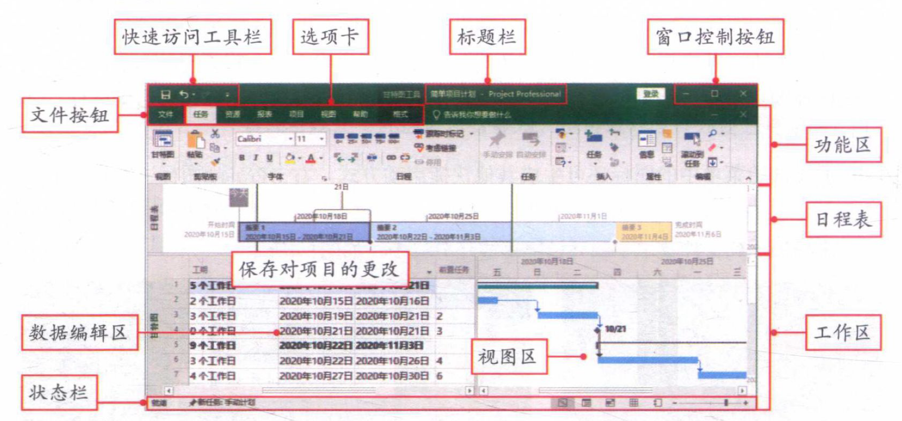

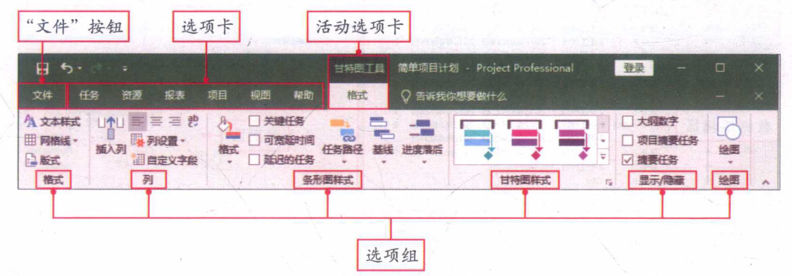

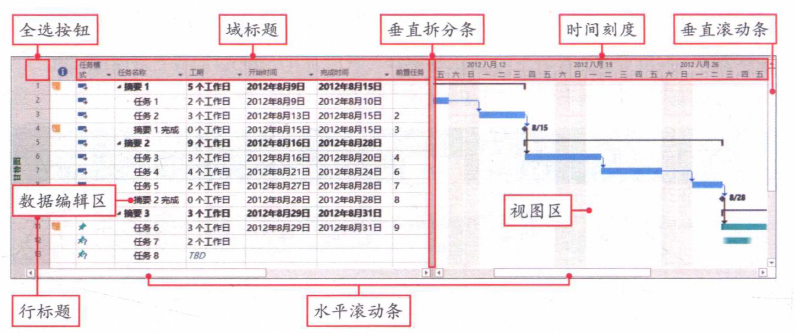

## 0.2 视图

**视图选项卡**

Project中的视图模式主要分为两大类：

1. **任务类视图**
   - 甘特图
     - 在此图中，可以完成的工作：设定任务工期/ 任务链接，为任务分配资源，查看任务进度及详细信息，任务的拆分和中断以及恢复拆分的任务
   - 跟踪甘特图
   - 网络图：以流程图的方式来显示任务以及相关性
   - 日历图：以月为时间刻度单位，按日历格式显示项目信息
   - 任务分配状况
2. **资源类视图**
   - 资源工作表
   - 资源使用状况图

### 创建复合视图

**拆分视图功能组**

1. 视图选项卡->拆分视图->详细信息：
   - 即可将视图拆分成上下两个部分，上半部分显示的是当前使用的视图模式，下半部分显示的是系统默认的任务窗体
2. 单击“详细信息”**右侧的下拉按钮**，在弹出的列表中还可选择需要在**下方窗口**中显示的视图类型

### 多窗口模式

**窗口功能组**

Project支持多窗口模式，用户可通过设置同时显示两个或更多Project窗口以满足同时查看一个项目中不同位置的内容，以及对不同位置的内容进行操作的需求。

## 0.3 创建项目

### 0.3.1 项目准备

用户需要明确：

1. 明确目标、确定项目步骤

   - 明确定义项目的一些基本属性信息：项目名称，内容、开始以及结束时间
   - 确定项目的主要步骤

2. 确定任务细节：

   - 任务的提醒作用：创建项目任务的主要用途是提醒项目中的主要活动，无须将任务进行更详细地划分，防止跟踪日程安排的负担过重。

   - 里程碑任务：标出项目中需要做出重要决定的点

   - 部门任务：显示每个部门所需要执行与了解的任务，便于准确地掌握与汇报项目进度。

3. 规定时间限制

4. 配置资源

   - 在制定项目初期，需要知道哪些资源可用以及资源成本如何，明确这些资源并分配到任务。

5. 理清任务间的关系

### 0.3.2 新建项目

#### 空白项目

文件-> 开始 -> 空白项目

#### 根据现有项目新建

文件-> 开始 -> 根据现有项目新建，可以根据历史使用过的mpp文件进行新建

#### 根据excel文件新建

若在Excel中已经开始了自己的项目，但仍需要进行更复杂的计划、资源共享和跟踪等，可利用Excel中的数据创建Project项目文档。

文件-> 开始 -> 根据Excel工作簿新建 -> 打开excel文件 -> 导入向导对话框 -> 映射-新建映射 -> 导入模式-作为新项目 -> 映射选项-任务 -> 任务映射

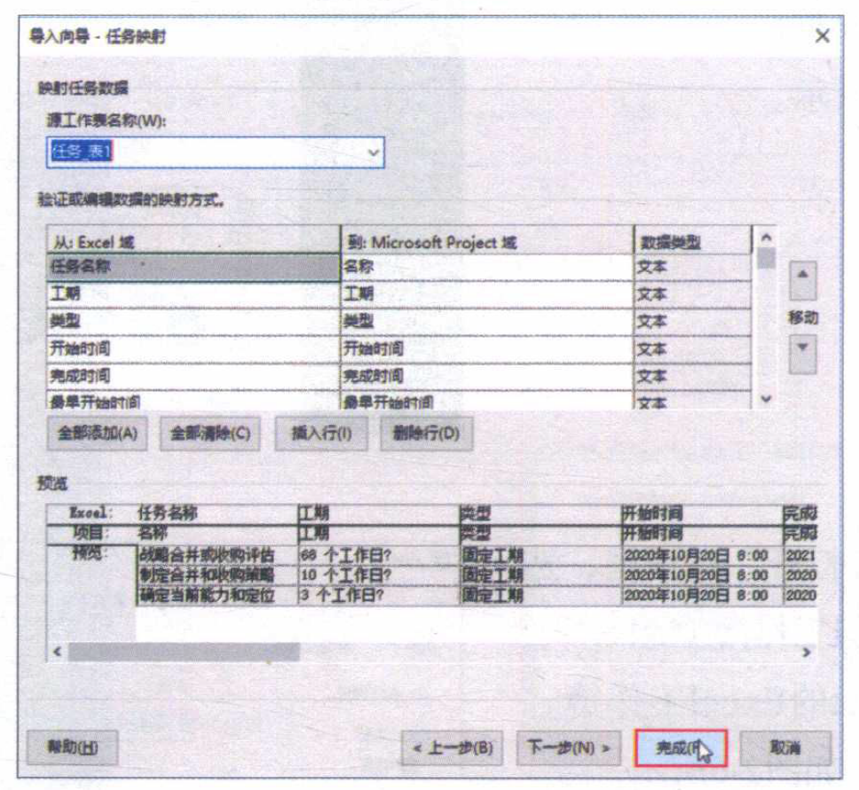

#### 创建模板文档

Project模板是预先设置任务、资源、样式以及其他项目元素的特殊文档。

通过模板可以创建具有统一框架和规格的项目文件

### 0.3.3 项目信息的设置

#### 设置项目摘要

文件 -> 信息-> 项目信息 -> 高级属性，可设置项目名称，主题，作者，单位，备注等信息

#### 设置项目基本信息

项目 -> 属性 -> 项目信息，在弹出对话框中，可以设置“开始日期、“完成日期”、“状态日期”、“优先级等

- 开始日期：被创建的任务默认开始日期都会大于等于该日期
- 完成日期：默认完成日期为不可设置状态， 这是因为Project具有预测功能，系统会根据用户设置的开始日期以及任务的开始和结束时间自动预测工期。如果用户同时设置了开始和完成日期，预测功能将不再发挥作用。
- 若要手动设置完成日期需要先将“日程排定方法”设置为“项目完成日期”，才能对“完成日期”进行设置
- 统计项目信息：**点击“统计信息”按钮可显示当前项目的统计信息**

#### 设置项目环境

文件 -> 选项 -> Project 选项

1. 日程：
   - 该项目的日历选项：每周开始于，财政年度开始于，默认开始（结束）时间
   - 日程：可对输入任务信息的方式进行相关设置
2. 高级
   - 可以对项目的标准费率、加班费率等进行设置

### 0.3.4 项目日历

当有些项目不适用于系统默认的标准日历时，可以根据项目的特点，设置符合当前项目要求的日历。

#### 新建日历

新建日历可设置请假日期，更改项目或特定资源的工作时间等

项目-> 属性 -> 更改工作时间，弹出“更改工作时间”对话框，单击“**新建日历**”按钮，打开“新建基准日历”对话框

- 在该对话框中可设置新建日历的名称。
- 选项：
  - 若选择“新建基准日历”选项，可新建一个完全独立的日历，
  - 选择“复制”选项，则可依据当前的基准日历新建一个日历副本，根据其右侧下拉列表中的“标准”“24小时”以及“夜班”三种基准创建日历副本

#### 工作周

每个项目所需要的每周工作时间都不相同，所以，创建新项目后需要根据实际情况对日历中的工作周进行调整。

每周五都需要利用1个小时的时间进行工作盘点和总结，那么，这1个小时需要设置为特殊工作时间。

操作：

- 项目-> 属性 -> 更改工作时间 -> 工作周 -> 详细信息

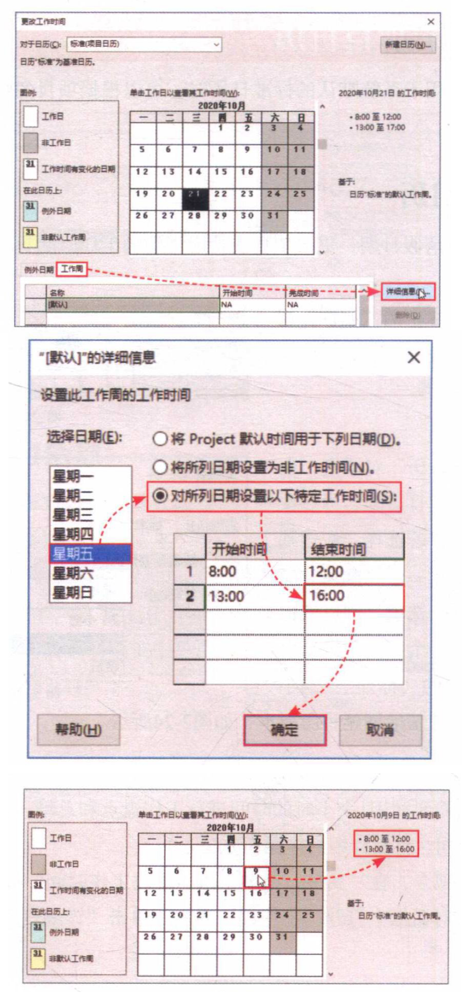

#### 工作日

在排定项目工作时间时，若期间包含假期或者有了其他安排，可设置“例外日期”，通过“例外日期”列表输入事件的名称、开始时间及结束时间。

下面以设置2026年“五一”假期和假期调休为例：

- 项目-> 属性 -> 更改工作时间 ->例外日期，双击行，编辑信息，选中行之后，可以点击详细信息，对细节进行设置

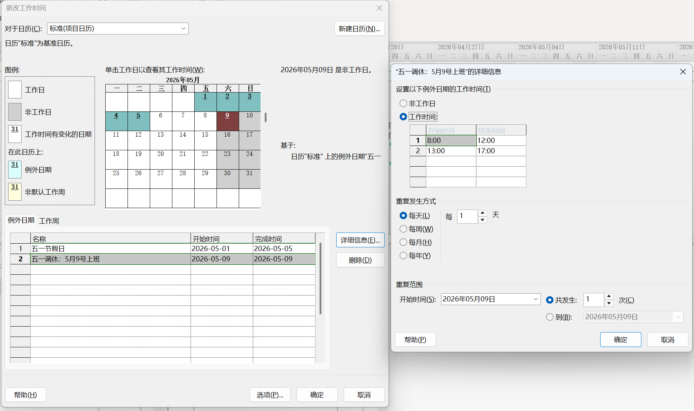

#### 单休

- 先新建一个日历叫“单休工作制”，然后对于日历“单休工作制”进行配置
- 工作周-> 详细信息-> 选择星期6，对所列日期设置以下特定工作时间
- 例外日期，对假期，调休等进行设置

其他特殊例子：

设置周一和周三休息，周六、周日工作的日历

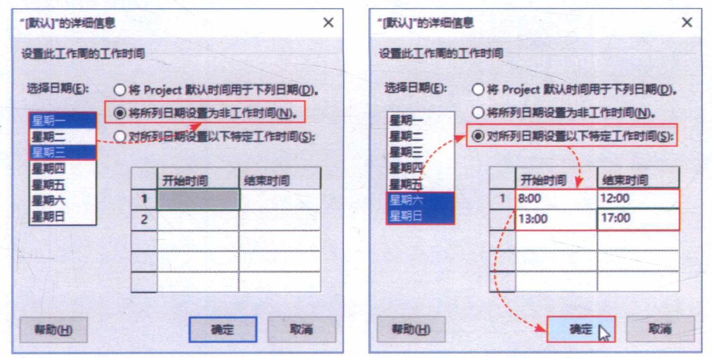

# 1 项目任务管理

项目任务是组成项目的重要组成部分之一，也是保证项目顺利完成的基础元素。

在制定项目计划并创建项目任务后，为使项目能按照预定的顺序与时间实施，还需要为任务设置组织结构与执行时间

**任务选项卡**

## 1.1 新建任务

每一条项目任务都是对项目的具体细化。

### 1.1.1 添加任务

在数据编辑区中，

- 任务名称域 -> 单元格，编辑任务名称
- 任务模式 默认为手动计划，在域下的单元格可下拉按钮，选择“自动计划”选项，修改成功后，工期、开始时间以及完成时间域标题下方会自动添加内容

### 1.1.2 组织任务

默认情况下Project中所有的任务都为同一级别。

#### 子任务与摘要任务

任务 -> 日程 -> 选中一个或多个任务，点击降级任务，所选任务即可被降级为子任务，此时，摘要任务（第一个子任务前的一个任务）被加粗显示。同时，摘要任务的工期以及开始时间和完成时间也根据其子任务自动进行了更新。

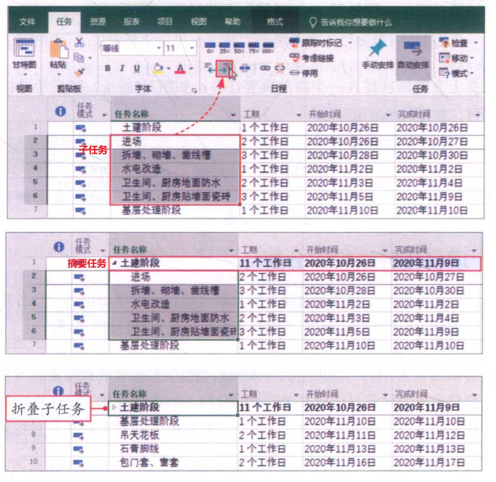

除了降级任务自动生成摘要任务外，也可手动添加摘要任务

任务-> 插入 ->  摘要，所选任务上方随即被插入一个新的摘要任务

#### 任务分解

任务原则：

- 任务分层
- 80小时原则
  - 工作包的时间跨度不要超过两周
  - 同时，控制粒度不能太细，否则会影响项目成员的积极性
- 任务细化
  - 确保能把完成每个底层工作包的职责明确地赋予一个成员、一组成员或者一个组织单元，同时考虑尽量使一个工作细目方便让具有相同技能的一类人承担。
- 团队协作原则
  - **项目的实现是项目的所有成员共同努力的结果，因此，在制定项目计划过程中，不应当是项目经理一人承担，其他参与项目的人员应当在项目逐步实现过程中参与项目的任务分解和工期预估。**

### 1.1.3 任务信息

#### 任务工期

在甘特图视图中的“工期”域标题中可以看到，工期后面都有一个问号（？），这是系统目前使用的预计工期，用户可将其设置成计划工期。

当设置的任务开始时间在项目开始时间之前，或与当前使用的工作日历冲突，会弹出“规划向导”对话框

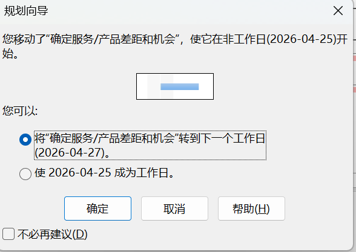

还可以在

- 任务-> 属性 -> 信息中设置
- 拖动视图区中，任务条形框

#### 设置任务信息

- 任务-> 属性 -> 信息 设置有关任务的相关信息
- 双击任务，也可以到达上面的地方
- 包括：常规，前置任务，资源，备注等

### 1.1.4 里程碑

对于任务中的重要事项可用里程碑显示，里程碑可作为任务进度的参考点，**默认情况下工期为0的任务，系统会自动将其标记为里程碑。**

任务 -> 插入 -> 里程碑，在所选任务前会增加一个里程碑任务，修改任务名称，在视图区会增加一个日期

### 1.1.5 周期性任务

周期性任务是按照一定周期性重复发生的任务。为了减少频繁重复录入，提高工作效率，可直接插入周期性任务。

任务 -> 插入 -> 任务 下拉 -> 任务周期

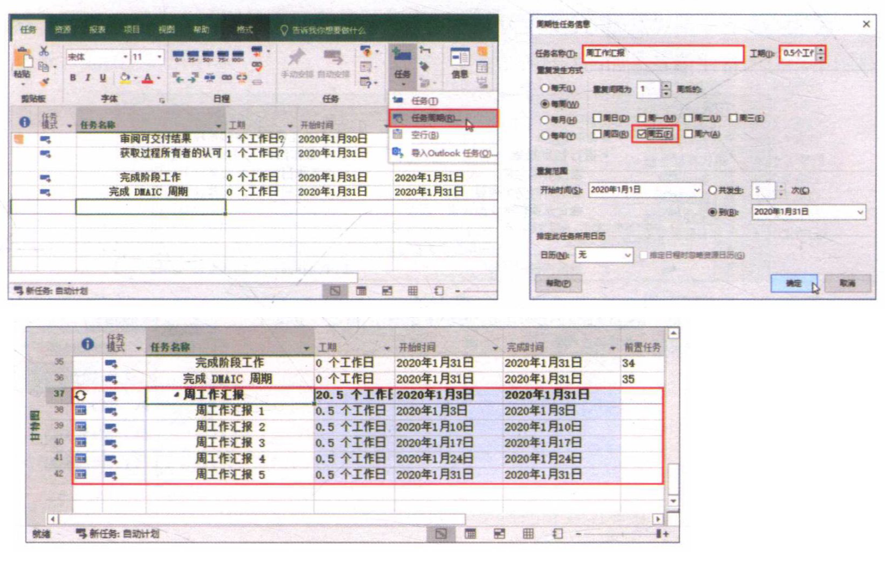

## 1.2 编辑任务

插入任务：选中某个任务，右击 “插入任务”

移动：

- 鼠标悬置某个任务上，出现四方光标，拖动即可
- 剪切，粘贴

复制

- ctrl + 悬置，四方光标，拖动
- 右击，复制，粘贴

删除

- delete
- 右击，删除

### 任务复制为图片

选中多个任务名称，然后任务-> 剪贴板 -> 复制 下拉，复制为图片

## 1.3 设置任务其他信息

**任务类型**：双击任务-> 高级 -> 任务类型

- 固定单位：默认的任务类型，不管任务工时量或工期如何改变，工作分配单位保持不变
- 固定工期：不管工时量或分配的资源如何改变，任务工期保持不变
- 固定工时：不管任务工期或分配给任务的资源量如何改变，工时量保持不变

任务限制：双击任务-> 高级 -> 任务限制

- 最后期限：在所选任务右侧的条形图中，时间刻度旁边出现一个向下的箭头，提醒用户此处有一个限定日期
- 
- 限制类型”及“限制日期：限制日期为NA，表示该任务不受任何限制。所选任务最左侧标识列中会显示一个标识限制类型的图标，将光标移动到该图标上方可查看具体的限制条件
- 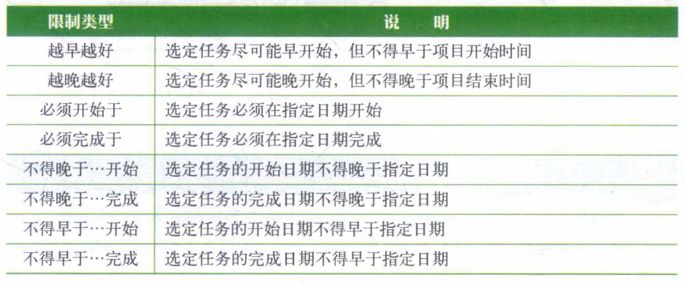
- 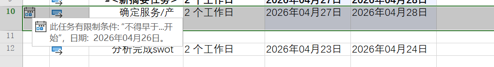
