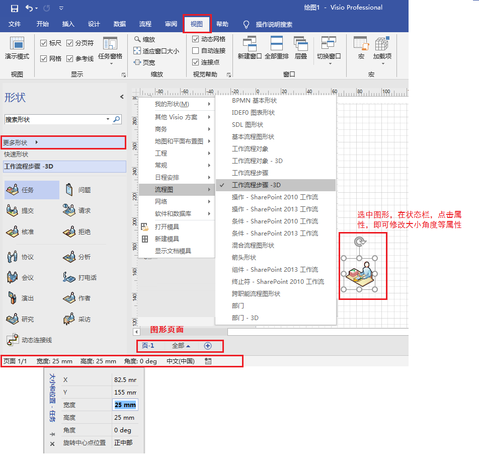

# Visio

visio是office系列软件中绘制流程图和示意图的软件，可以创建具有专业外观的图表，针对复杂信息、系统和流程进行可视化处理、分析和交流。

可以创建许多基础类别的图，包括：商务，地图和平面布置，工程，常规，日程安排，流程图，网络，软件和数据库，还可以根据现有文件内容进行新建。

在已建的文件上还可以使用其他类别的形状

# 1 绘图三要素

visio绘图三要素：形状，连接线，文本

## 1.1 形状

1. 使用现成形状直接拖动。
   - 选中形状拖动四个八个原点，可以调整大小。
   - 控制手柄：有的形状还会有**小黄点**（控制手柄）做一些形状上的额外调整，比如说形状内部的宽度，形状的观察视角等等。
2. 创建新形状：
   - 开始->工具->基本形状，用于绘制形状。右键快捷菜单也可以选择
     - 基本形状：矩形，椭圆，线条，任意多边形，弧形。绘制时，加**shift**就会绘制**特殊位置（水平，垂直，45度等）**的形状
     - **铅笔**：用于绘制对称图形和线条。单击选中形状，鼠标移动到合适位置就出现十字，拖动就可以修改原形状
   - 辅助绘制
     - 视图->显示->网格，形状位置吸附
     - 视图->显示->标尺，可以看到形状的具体位置
       - **从标尺处，可以拉出水平或垂直的参考线，用于辅助，拉动参考线可以把相关以参考线为参考的形状同时拉动**
     - 视图->视觉帮助->动态网格，辅助判断形状间的位置关系
   - 形状属性
     - 选中形状，在状态栏设置相关属性
   - ESC取消绘制 ，  **回到指针工具：CTRL+1**
3. 选择形状
   - 【 ctrl + a】——全选，【ctrl + 单击】——多选，鼠标——框选，
   - **开始->编辑->选择**，套索，按类型选择等等
4. 复制形状
   - Ctrl + c 复制，Ctrl + v 粘贴
   - Ctrl + d 复制后直接粘贴，Ctrl + 拖动 直接赋值粘贴并且随鼠标移动
5. 

## 1.2 连接

1. 线条连接
   - 开始->工具->基本形状，线条（直线）连接，任意多边形（曲线）连接，无箭头，可以使用铅笔调整线条
2. 连接线连接
   - 开始->工具->连接线，系统自行计算路径，有箭头，
   - 选中后，右击，有三种系统计算连线的策略（直线，直角，曲线）
3. 辅助连接
   - 视图->视觉帮助->连接点，连接时会显示相关衔接点位置
4. **流程图等模板**的自动连接
   - 视图->视觉帮助->自动连接（并且要在文件->选项->高级->启用自动连接），点击形状的连接点，会自动出现相应的图标，指示自动连接，当然也可以自行拖动图标，进行自定义连接
   - 自动形状连接，悬停在相应的图标上，他会出现相应的形状，并自行连接
5. 

注意：**自行绘制的形状没有连接点**，通过线条连接，将无法连接上，通过连接线连接，它的衔接点将会移动，不会固定于某个点

## 1.3 文本

1. 形状上输入文本
   - 点击选中，直接输入文字即可（会对形状原有文本进行覆盖）
   - 双击，出现光标跳动，编辑文本即可（不会对原有文本进行覆盖）
   - **文件->选项->高级->按Enter键提交形状文本**
2. 文本框
   - 开始->工具->文本，点击，就会出现文本框
   - Ctrl + 2
   - 右击快捷菜单->绘图工具
   - 不和形状产生关联
3. 文本块
   - 开始->工具->文本块，会将形状上的文本单独分离出文本框进行设置，
   - 设置完后，回到指针工具，文本块又会和形状按设置后的格式产生关联
4. 

## 1.4 绘制流程图

新建->流程图->基本流程图

1. 自动连接与自动生成形状
   - 自动连接上面有说到
   - 自动生成形状：默认是基本流程图最上面的四个，如果想自动生成其他形状，要在左侧形状栏先选中，然后再去自动生成。
2. 跨职能流程图形状
   - 泳道：
     - 水平和垂直泳道
     - 常用于放置职能部门
     - 插入泳道：
       - 拖动泳道形状
       - 跨职能流程图选项卡->插入
       - 鼠标右键快捷菜单
       - 鼠标放置在泳道最左侧的边缘，会出现相应的提示，点击即可
   - 分隔符
     - 用于分割阶段
   - 
3. 

# 视图

1. 显示
   - 网格，给整页图纸加网格，对形状有一定的吸附作用
2. 视觉帮助
   - 动态网格，可以指示我们形状之间的位置关系（当我们拖动形状时，会产生相应的绿线来辅助我们判断位置是否同水平，同垂线，同高，同宽等）
3. 