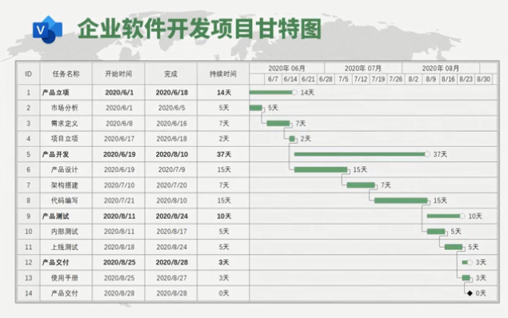

# Visio

visio是office系列软件中绘制流程图和示意图的软件，可以创建具有专业外观的图表，针对复杂信息、系统和流程进行可视化处理、分析和交流。

可以创建许多基础类别的图，包括：商务，地图和平面布置，工程，常规，日程安排，流程图，网络，软件和数据库，还可以根据现有文件内容进行新建。

在已建的文件上还可以使用其他类别的形状

# 1 绘图三要素

visio绘图三要素：形状，连接线，文本

## 1.1 形状

1. 使用现成形状直接拖动。
   - 选中形状拖动四个八个原点，可以调整大小。
   - 控制手柄：有的形状还会有**小黄点**（控制手柄）做一些形状上的额外调整，比如说形状内部的宽度，形状的观察视角等等。
2. 创建新形状：
   - 开始->工具->基本形状，用于绘制形状。右键快捷菜单也可以选择
     - 基本形状：矩形，椭圆，线条，任意多边形，弧形。绘制时，加**shift**就会绘制**特殊位置（水平，垂直，45度等）**的形状
     - **铅笔**：用于绘制对称图形和线条。单击选中形状，鼠标移动到合适位置就出现十字，拖动就可以修改原形状
   - 辅助绘制
     - 视图->显示->网格，形状位置吸附
     - 视图->显示->标尺，可以看到形状的具体位置
       - **从标尺处，可以拉出水平或垂直的参考线，用于辅助，拉动参考线可以把相关以参考线为参考的形状同时拉动**
     - 视图->视觉帮助->动态网格，辅助判断形状间的位置关系
   - 形状属性
     - 选中形状，在状态栏设置相关属性
   - ESC取消绘制 ，  **回到指针工具：CTRL+1**
3. 选择形状
   - 【 ctrl + a】——全选，【ctrl + 单击】——多选，鼠标——框选，
   - **开始->编辑->选择**，套索，按类型选择等等
4. 复制形状
   - Ctrl + c 复制，Ctrl + v 粘贴
   - Ctrl + d 复制后直接粘贴，Ctrl + 拖动 直接赋值粘贴并且随鼠标移动
5. 

## 1.2 连接

1. 线条连接
   - 开始->工具->基本形状，线条（直线）连接，任意多边形（曲线）连接，无箭头，可以使用铅笔调整线条
2. 连接线连接
   - 开始->工具->连接线，系统自行计算路径，有箭头，
   - 选中后，**右击，有三种系统计算连线的策略（直线，直角，曲线）**
3. 辅助连接
   - 视图->视觉帮助->连接点，连接时会显示相关衔接点位置
4. **流程图等模板**的自动连接
   - 视图->视觉帮助->自动连接（并且要在文件->选项->高级->启用自动连接），点击形状的连接点，会自动出现相应的图标，指示自动连接，当然也可以自行拖动图标，进行自定义连接
   - 自动形状连接，悬停在相应的图标上，他会出现相应的形状，并自行连接
5. 连接点
   - 开始->工具->X，用于添加、删除、移动连接点
   - 点击此选项后，所有形状的连接点都会显示出来
   - 移动：鼠标放置在连接点上面，拖动即可
   - 添加：Ctrl + 点击形状上某一位置
   - 删除：点击后，成为红色后，按delete后删除
6. 

注意：**自行绘制的形状没有连接点**，通过线条连接，将无法连接上，通过连接线连接，它的衔接点将会移动，不会固定于某个点

## 1.3 文本

1. 形状上输入文本
   - 点击选中，直接输入文字即可（会对形状原有文本进行覆盖）
   - 双击，出现光标跳动，编辑文本即可（不会对原有文本进行覆盖）
   - **文件->选项->高级->按Enter键提交形状文本**
2. 文本框
   - 开始->工具->文本，点击，就会出现文本框
   - Ctrl + 2
   - 右击快捷菜单->绘图工具
   - 不和形状产生关联
3. 文本块
   - 开始->工具->文本块，会将形状上的文本单独分离出文本框进行设置，
   - 设置完后，回到指针工具，文本块又会和形状按设置后的格式产生关联
4. 

1. - 

## 1.4 <a name="招聘流程图">流程图</a>

新建->流程图->基本流程图

1. 自动连接与自动生成形状

   - 自动连接上面有说到
   - 自动生成形状：默认是基本流程图最上面的四个，如果想自动生成其他形状，要在左侧形状栏先选中，然后再去自动生成。

2. 跨职能流程图形状选项卡

   - 泳道：
     - 水平和垂直泳道
     - 常用于放置职能部门
     - 插入泳道：
       - 拖动泳道形状
       - 跨职能流程图选项卡->插入
       - 鼠标右键快捷菜单
       - 鼠标放置在泳道最左侧的边缘，会出现相应的提示，点击即可
   - 分隔符
     - 用于分割阶段
   - 跨职能流程选项卡
     - 设计->旋转线标签，用于将旋转泳道或阶段的文字，使其便于查看

   

3. **设计选项卡**

   - 主题，可以切换整个流程图的主题，而不需要为每个形状都单独设置样式
     - 开始->样式，允许主题勾选——和主题是相关联的，主题改变，相应的样式也会发生改变
     - **将主题应用于新建形状**，默认是勾选上的，如果不勾选那么新拖入的形状将不会应用此主题
   - 变体，在主题之上针对某一方面更换特殊的主题方案，
     - 颜色，选择其他颜色搭配方案，也可以**新建自定义的主题颜色**，
     - 效果，选择其他效果方案
     - 连接线，选择其他连接线样式
   - 背景
     - 背景是独立于页面的选项，用于设置各个页的背景，
     - 要想设置背景内的内容，必须切换到工作区下方背景页，背景，如下图
     - 
   - 版式
     - 重新布局页面
       - 用于对整个页面的形状按照从上到下，从左到右，从右到左等等布局规则进行排序，类似于css中的flex布局等
       - 先让系统粗调布局，然后自行调整布局
     - 连接线
       - 调整整个页面连接线的连接策略
       - 显示跨线，当连接线交叉的时候是否用小突起显示跨线，
     - 
   - f

# 2 形状管理

## 2.1 图层管理

把每个图形分配到各个图层上进行管理，针对于某个页面内的形状

**开始->编辑->图层**

## 2.2 页面管理

对于页面的管理

# 3 图标数据可视化

## 3.1 <a name="组织结构图">组织结构图</a>

新建->商务->组织结构图，也可以通过**组织结构图向导从外部文件导入相应组织结构数据**

如果直接通过组织结构图创建，如果需要从外部文件导入组织结构数据，那就需要通过**组织结构图选项卡->组织数据->导入**，

通过这里导入会生成相应的形状，**如果通过数据选项卡导入，只会导入相应的数据而不会生成形状**

- 组织结构选项卡
  - 布局
    - 当助理和其他同层次人员并排时，可以选中某个助理，通过更改 形状->更改位置类型，选中助理类型，然后再点击重新布局
    - 
  - 同步
    - 创建同步副本，将自身形状和下属形状建立在新的页面上
    - 同步下属形状，在主页面上，下属形状发生变化后，将变化同步到副本上
  - 组织数据
    - 通过外部文件建立组织结构图，和组织结构向导相同
  - 
- 

基于实例——组织结构图

## 3.2 形状数据

除了在图表的外部通过excel表等文件导入字段数据，也可以在visio中为形状自定义形状数据

数据选项卡->显示/隐藏->形状数据窗口，用于显示形状数据的面板，选中所有形状，右击形状**数据面板->定义形状数据**

## 3.3 数据图形化

将数据进行图形化展示，因为让看图的人一个一个形状去点击，查看形状数据是不方便的。

**数据选项卡->高级的数据连接->高级数据图形->新建数据图形**

在应用图形化的时候，不能Ctrl + A ，因为他会把连线也图形化

## 3.4 追加数据

通常在组织结构和需要追加的数据在不同表的时候，才会用到追加数据。

### 3.4.1 导入

**自定义导入的数据将不会和已有形状进行关联，需要手动自行将数据与形状进行关联，而快速导入则可以自动的将数据和形状进行关联**

### 3.4.2 数据与形状进行链接

1. 个别形状与个别数据进行链接

   - 拖动右侧外部数据的行，到某个形状上
   - 

2. 所有形状（所选形状）与数据进行链接

   - 

3. 调整数据图形

   

4. 同步源文件数据内容

   

5. 

# 4 开发形状

文件->选项->高级->常规->以开发人员模式运行

## 4.1 形状设计

1. ShapeSheet
   - 包含相关主体的详细属性设置
   - 形状：包含选定形状所有属性数据，
   - 页
   - 文档
2. 操作：
   - 对多个形状进行多种布尔运算，连接（将多个形状连成一个形状），偏移（生成对形状的边缘的偏移（放大和缩小）形状），修剪（以形状的交叉点，做切割）
   - 
3. 行为：
   - 对形状定义行为
   - 
   - 
4. 保护
   - 
5. 形状名
   - 
6. 

## 4.2 模板和模具

# 5 常用技巧

1. 连接线直线连接：选中连接线->右击，直线连接线
2. 连接线分支：通过手动在连接线上添加连接点，然后在连接点上再画相应的连接线。
3. visio图自适应形状大小：设计选项卡->大小->适应绘图
4. 形状镜像反转：开始->排列->位置->方向形状->旋转形状
5. 设置文本的特殊格式：
   - 上下角标：【**Ctrl + Shift + = **】【**Ctrl + = **】
   - 斜体：【**Ctrl + I**】
   - 在开始->字体->详细设置里面有
6. 自制多边形
   - 开发工具->形状设计->线条，通过画线条，画成闭合状
   - 全选形成闭合状的所有线条，形状设计->操作->连接，
7. 

# 插入

1. 容器

   - 当把形状放入容器后，拖动容器就可以把里面的形状一起拖动，
   - 和组合概念相似，但侧重点不同。、
   - 组合：固定多个形状之间的固定位置
   - 容器：侧重于结构的表达

   

2. 超链接

   - 链接到外部文档
     - 可以为office其他文件
     - 如果是word，子地址可以写word文档中的一段文字，他就可以链接到那段文字那里。
     - 如果是excel，子地址可以写单元格的位置，例如：Sheet2!E51
     - 如果是ppt，子地址可以写需要定位的ppt的第几页，例如：8
     - 也可以是具体的网页，复制网址即可
   - 链接到文档内
     - 可以是本页或其他页，也可以是其他形状

   

3. 屏幕提示：鼠标悬停时，浮动的提示

4. 对象：插入其他的文档对象的内容，比如word文档的内容

5. 域：引用其他内容

# 开始

1. 工具

   - 指针工具：用于选中，拖动形状，快捷键：Ctrl + 1

   - 连接线：用于连接形状间的连接点，系统自行计算路径，有箭头，右击有三种连线策略

   - 文本：绘制文本框

   - 基本形状：矩形，椭圆，线条，任意多边形，弧形。

     - 绘制时，加**shift**就会绘制**特殊位置（水平，垂直，45度等）**的形状
     - **铅笔**：用于绘制对称图形和线条。单击选中形状，鼠标移动到合适位置就出现十字，拖动就可以修改原形状

   - 连接点

     - X，用于添加、删除、移动连接点

     - 点击此选项后，所有形状的连接点都会显示出来
     - 移动：鼠标放置在连接点上面，拖动即可
     - 添加：Ctrl + 点击形状上某一位置
     - 删除：点击后，成为红色后，按delete后删除

   - 文本块

     - 文本块，会将形状上的文本单独分离出文本框进行设置，
     - 设置完后，回到指针工具，文本块又会和形状按设置后的格式产生关联

2. 样式

   - 用于快速设置形状样式
   - 允许主题：用于将样式和主题相关联

3. 排列

   - 排列：以第一个选中的形状（选择标识加粗的形状）为基准，选中的所有形状实行类似于flex布局的排列（对齐方式）。
   - 位置：
     - 调整形状间的位置，水平分布和垂直分布（调整形状间距为相同），还可以自定义**间距选项**，还可以进行避免横跨分页符的位置调整
     - 旋转：
   - 层次调整：置于顶层，置于底层，上移一层，下移一层
   - 组合：
     - 将多个形状框选后，组合在一起，点击其一就选中整体（可进行整体拖动，样式整体调整等整体行为）
     - 选中整体后再点击其一就选中某个具体的形状。
     - 还可以选中新绘制的形状和组合后，将未在组合内的形状，添加到组，即可形成一个新的组合
   - 

4. 编辑

   - 更改形状：保留形状原有样式，只是修改“形状”
   - 查找：形状名，形状文本，查找的结果对替换有影响请注意
   - 选择：套索，框选，全选，按类型选择（形状类型，角色，图层）

5. 

# 流程

1. 子进程
   - 对某个形状进行细化描述，通过链接与之相关的子进程（页面）
   - 选中某个过程
     - 新建：建立新的子进程（页面，命名以形状文本命名）
     - 链接到现有：从现有页面给形状以子进程
   - 根据所选内容创建：用于创建所选内容的父结点，用于从子流程往父流程画流程图
2. 图标验证
   - 检查图表：按照规则检查目前图表是否存在什么问题
3. 

# 视图

1. 显示
   - 网格，给整页图纸加网格，对形状有一定的吸附作用
2. 视觉帮助
   - 动态网格，可以指示我们形状之间的位置关系（当我们拖动形状时，会产生相应的绿线来辅助我们判断位置是否同水平，同垂线，同高，同宽等）
3. 

# 设计

- 主题，可以切换整个流程图的主题，而不需要为每个形状都单独设置样式
  - 开始->样式，允许主题勾选——和主题是相关联的，主题改变，相应的样式也会发生改变
  - **将主题应用于新建形状**，默认是勾选上的，如果不勾选那么新拖入的形状将不会应用此主题
- 变体，在主题之上针对某一方面更换特殊的主题方案，
  - 颜色，选择其他颜色搭配方案，也可以**新建自定义的主题颜色**，
  - 效果，选择其他效果方案
  - 连接线，选择其他连接线样式
- 背景
  - 背景是独立于页面的选项，用于设置各个页的背景，
  - 要想设置背景内的内容，必须切换到工作区下方背景页，背景，如下图
  - 
- 版式
  - 重新布局页面
    - 用于对整个页面的形状按照从上到下，从左到右，从右到左等等布局规则进行排序，类似于css中的flex布局等
    - 先让系统粗调布局，然后自行调整布局
  - 连接线
    - 调整整个页面连接线的连接策略
    - 显示跨线，当连接线交叉的时候是否用小突起显示跨线，
  - 
- f

# 实例

## [招聘流程图](#招聘流程图)

## [组织结构图](#组织结构图)

## 历史时间线

**新建->类别->日程安排->日程表**

技巧：

1. 使用参考线，来调整形状间的相互位置。比如说高度等等（从标尺那按住鼠标拖动即可）
2. 标题可以使用背景来设置

## 工作流程图

新建->类别->流程图->工作流程图-3D

## 办公室平面图

新建->类别->地面和平面布置图->办公室布局

## 甘特图

新建->类别->日程安排->甘特图

## 灵感触发图

新建->类别->商务->灵感触发图

## 系统UML图

新建->类别->软件和数据库->UML用例图

## 机房机架图

新建->网络->机架图

