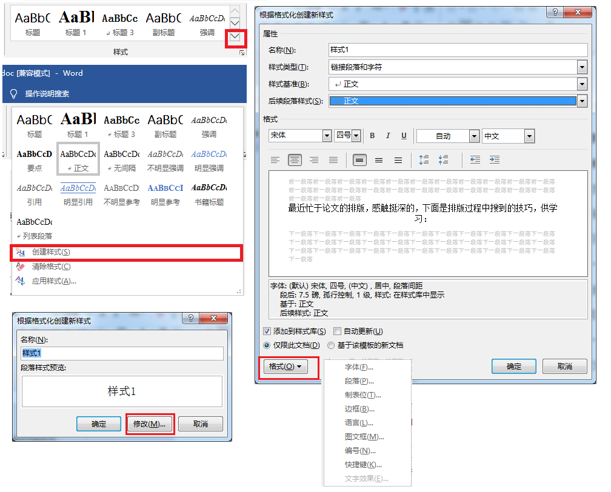
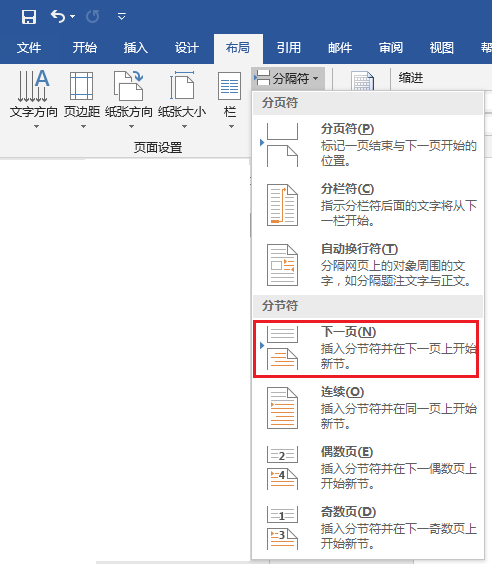
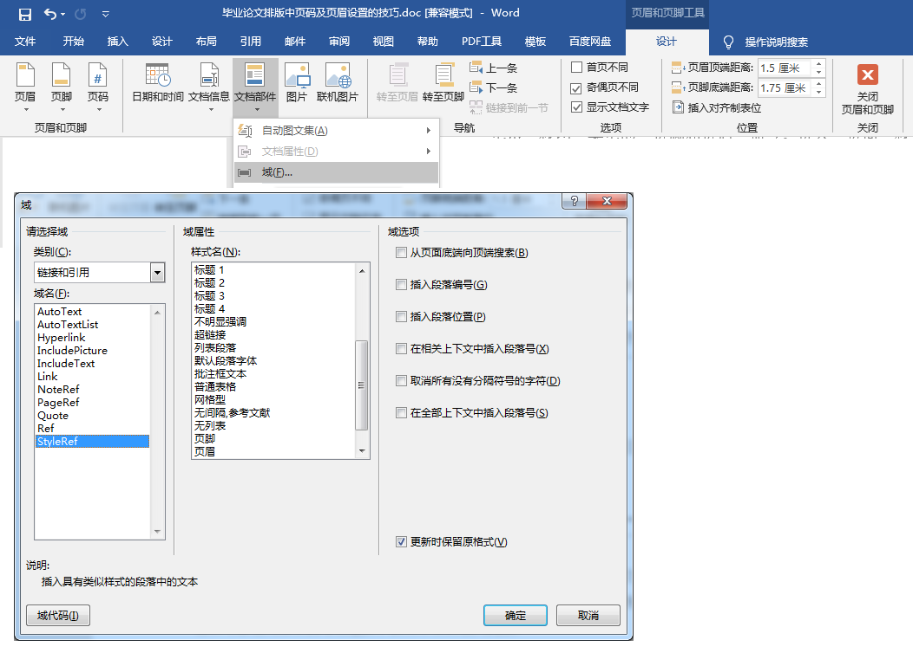
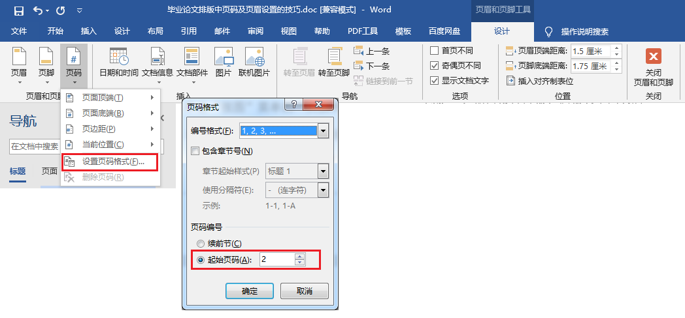
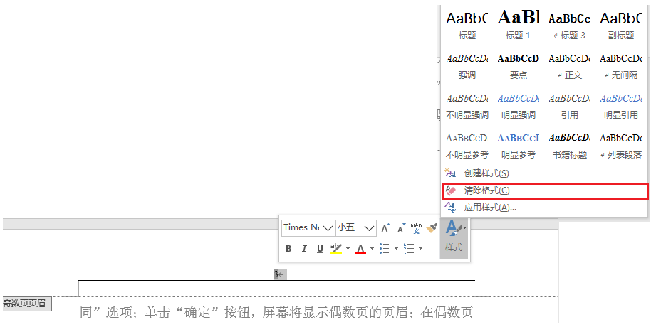

# 论文排版技巧

1. 开始->样式

   - 这是论文排版的第一步，

   - 建立一个常用的样式集合，可以大大加快同样式文本的修改效率。

   - 也可以在后面的偶数页页眉为一级标题做好铺垫

   - 点击开始样式列表的下拉创建样式

     

2. 分节符

   - 它可以很方便地**将一篇文档分成若干小节分别进行页面的设置。**

   - 它可以让文章不同节，有不同的页码格式和页眉页脚（与上一节相同或不同），有不同的布局设置（纸张大小，纸张方向）等等，很有用。

     

   

3. 大纲级别

   - 问题：对普通文本设置**大纲级别**以便在导航栏显示，以链接段落及文本

   - 段落->缩进与间距->常规->大纲级别，设置即可

4. 页眉页脚的奇偶页不同

   - 如果设置了奇偶页不同，它就会在奇数页上的页眉和页脚上出现与“上节相同或不同”，你需要在奇数页上设置一次，在偶数页上设置一次，才会彻底与上一节断绝联系或者联系上。
   - **奇数页页眉为论文题目，偶数页为论文一级标题**：双击页眉页脚->页眉和页脚工具->设计->文档部件->域，前提你要设置相应的样式
   - 

5. 页码

   - 问题：在页眉页脚设置了奇偶页不同的时候，页码设置就会出现一些问题
   - 首先，要在奇数页上设置一次，偶数页上同样设置一次
   - 再者，**如果**出现页码数字有问题时，就需要控制起始页码
   - 

6. 清除页眉横线

   - 在正文之前的部分，包括目录，摘要，论文封面都不需要页眉的横线
   - 右键->样式->清除样式
   - 

7. 

   