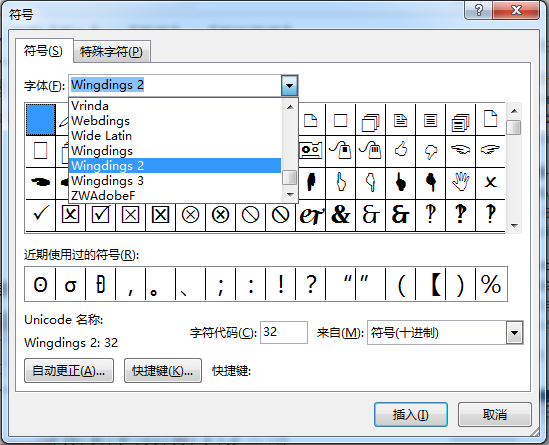
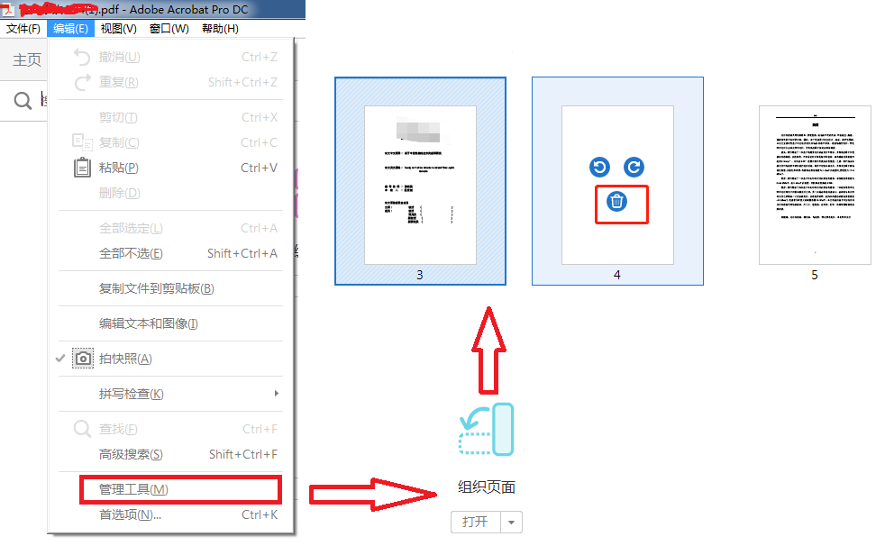

# 基础知识

1. 标尺拖动块的含义
   - 标尺左下方拖动块：文本左边界块以及缩进参考基准块
   - 标尺上方拖动块：基于基准块，控制首行缩进
   - 标尺右下方拖动块：文本右边界块
   - 
2. 文字在一行中垂直居中：
   - 当一行中既有较大的公式需要用单倍行距展示完全，又有文字进行说明时，此时的文字通常是底部对齐的
   - 段落详细->中文版式->文本对齐方式->居中，
   - **要先将段落样式设置好，再插入公式，此样式才会生效**
   - 
3. 

# 一般技巧

1. 水平居于行中的点，也就是少数民族姓名中间的点怎么打：
   - 在汉语输入状态下，按键盘上反引号的键，即可打出
   - 可以在搜狗输入法的状态下，dian，可以击出。
2. word方框（□）中打钩（√）
   - 插入->符号->其他符号
   - 
3. acrobat删除空白页
   - 在word中插入分节符（下一页），有的word文档在转pdf时，会在pdf中产生空白页。我至今还没有弄清楚原因和解决方案。
   - 补救就是在acrobat中编辑pdf删除空白页。
   - 
4. 

# 论文排版技巧

1. 开始->样式

   - 这是论文排版的第一步，

   - 建立一个常用的样式集合，可以大大加快同样式文本的修改效率。

   - 也可以在后面的偶数页页眉为一级标题做好铺垫

   - 最后生成目录的时候也会用到

   - 点击开始样式列表的下拉创建样式

     

2. 分节符

   - 它可以很方便地**将一篇文档分成若干小节分别进行页面的设置。**

   - 它可以让文章不同节，有不同的页码格式和页眉页脚（与上一节相同或不同），有不同的布局设置（纸张大小，纸张方向）等等，很有用。

     

   

3. 大纲级别

   - 问题：对普通文本设置**大纲级别**以便在导航栏显示，以链接段落及文本

   - 段落->缩进与间距->常规->大纲级别，设置即可

4. 页眉页脚的奇偶页不同

   - 如果设置了奇偶页不同，它就会在奇数页上的页眉和页脚上出现与“上节相同或不同”，你需要在奇数页上设置一次，在偶数页上设置一次，才会彻底与上一节断绝联系或者联系上。
   - **奇数页页眉为论文题目，偶数页为论文一级标题**：双击页眉页脚->页眉和页脚工具->设计->文档部件->域，前提你要设置相应的样式
   - 

5. 页码

   - 问题：在页眉页脚设置了奇偶页不同的时候，页码设置就会出现一些问题
   - 首先，要在奇数页上设置一次，偶数页上同样设置一次
   - 再者，**如果**出现页码数字有问题时，就需要控制起始页码
   - 

6. 清除页眉横线

   - 在正文之前的部分，包括目录，摘要，论文封面都不需要页眉的横线
   - 右键->样式->清除样式
   - 

7. 为各级标题自动编号

   - 通过在开始->段落->多级列表->定义新的多级列表，里面设置编号链接到各级标题
   - 在此面板中，可以设置多个级别的列表，然后分别链接到各级标题，最后统一设置。
   - 

8. 自动生成论文的参考文献引用

   - 通常我们会将参考文献在论文的最后写，但是也会遇到参考文献的序号经常会改变的情况。
   - 步骤
   - 1.为参考文献添加编号，并设定编号格式
   - 
   - 2.插入交叉引用，到相应位置。
     - 将光标移到需要引用的位置
     - 插入->链接->交叉引用
     - 选择对应需要引用的文献需要即可。
     - 
   - 3自动更新域
     - 当参考论文的顺序发生改变的时候
     - 鼠标选中相应的引用位置序号，右击->更新域，对应的编号项将跟随参考文献列表发生变化
     - 
   - 4全文统一更新序号
     - 当修改了大量参考文献序号后，上面的单个修改方法就显得繁杂
     - 所以【Ctrl+A】选中全文后，右击更新域即可全文更新。
   - 

9. 在科技论文中经常用到三线表，三线表具有简洁清新的优点，制作三线表

   - 1.边框设置制作三线图：
     - 插入表格，并设置基本的长宽格数
     - 选中表格，表格工具->设计->边框，选择无，去掉所有框线，然后再添加顶部框线和底部框线，自行设置粗细样式等
     - 选中第一行，添加底部框线，自行设置粗细样式等
     - 
   - 2.新建表格样式创建三线表
     - 插入表格，并设置基本的长宽格数
     - 表格工具->设计->样式->新建表格样式
     - 选中表格，应用样式，
     - 在样式基础上，选中第一列，表格工具->设计->边框，去掉右侧框线
     - 
   - 

10. 编号：

    - 通过多级列表去创建编号
    - [通过题注编号](https://jingyan.baidu.com/article/414eccf6778ca66b421f0a79.htmlhttps://jingyan.baidu.com/article/414eccf6778ca66b421f0a79.html)
      - 题注就是为图片或表格加注解的成分，通常用来为图标加编号和注解，以及借此生成图表目录
      - 

11. word转pdf时加书签

    - 

12. 

# [MathType技巧](https://zhuanlan.zhihu.com/p/25580133)

1. 公式中的空格如何击出
   - **【Ctrl + Alt + Space】**
2. 快捷键
   - 上标：Ctrl+H  下标：Ctrl+L，选中文本加快捷键
   - 积分号：Ctrl+I
   - 根式：Ctrl+R
   - 上横线：Ctrl+Shift+连字符（就是减号），矢量箭头：Ctrl+Alt+连字符，选中文本加快捷键
   - 单撇：Ctrl+Alt+'，双撇：为单撇加两个单引号
   - 小括号：Ctrl+9或Ctrl+0  中括号：Ctrl+[ 或Ctrl+]  大括号：Ctrl+{ 或 Ctrl+}
   - 分子分母的分式：垂直分式：Ctrl+F  斜杠（水平）分式：Ctrl+/
3. 微调符号
   - 选中文本，上下左右平移：Ctrl+箭头键，仅做微调，偏移过多会导致文本显示不全
   - 空格占位：【Ctrl + Alt + Space】
4. 公式缩放：公式整体缩放，不是单个文本缩放
   - 100%：Ctrl+1
   - 200%：Ctrl+2
   - 400%：Ctrl+4
   - 800%：Ctrl+8
5. 批量修改公式的字号和大小
   - 双击一个公式，打开MathType，进入编辑状态；
   - 设置大小：点击size菜单——define——字号对应的pt值，一般五号对应10pt，小四对应12pt；
   - 生成配置文件：点击preference->equation preference -> save to file ->存一个与默认配置文件不同的名字；
   - 关闭MathType回到word文档，点击word界面上的MathType——format equation——load equation preferrence选项下面的browse按钮，选中刚才存的配置文件，点选whole document选项，点确定
6. 公式的自动编号
   - 提供四种类型的公式输入
   - inline（文本中的公式）
   - display style 没有编号的单行公式
   - left numbered display style 编号在左边
   - right numbered display style编号在右边
7. 自定义常用公式
   - 
   - 编辑常使用的公式，选中该公式，左击拖动至工具栏即可
   - 不需要时，可以在工具栏该公式处右击删除即可
8. 在敲入有些字母组合的时候，eg：min、max等常用字母组合时，会出现组合不发生斜体书写形式的问题，为任意组合设置斜体的快捷键是：
   - 【Ctrl + Shift + v】
9. 中括号或花括号中嵌入两行（或多行）公式，比如：下面这个情形
   - 
   - 解决方法：中括号必须通过快捷键【Ctrl + [ 】的方式添加到公式内，或者通过点击工具面板中的中括号，在中括号中敲回车就可以解决多行的问题
10. 