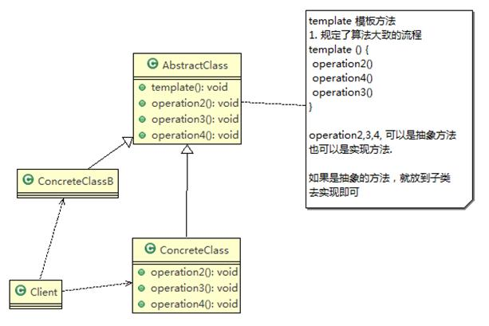
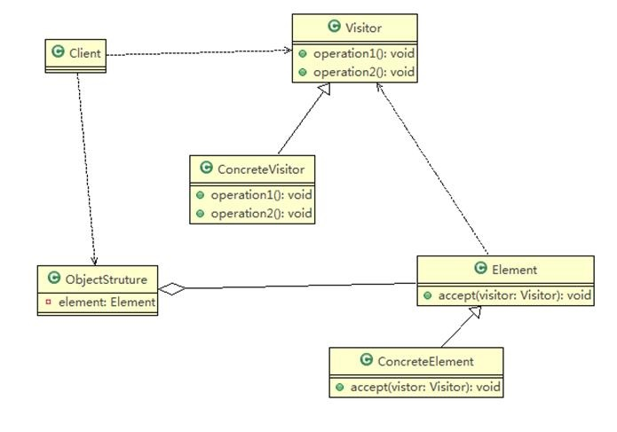
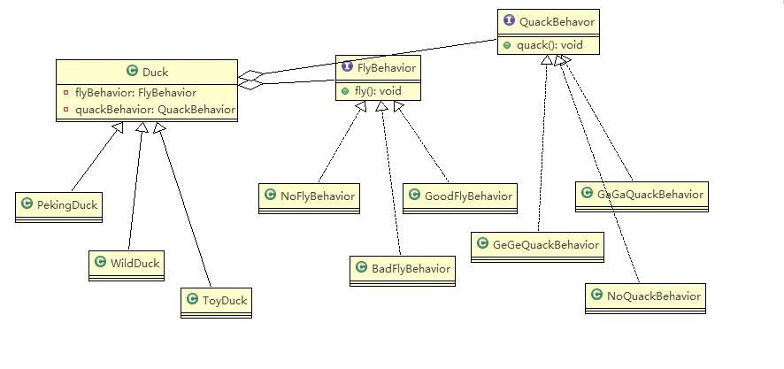

pattern design

设计模式是对软件设计中普遍存在（反复出现）的各种问题，所提出的解决方案。由埃里希·伽玛等人在1990年从建筑设计领域引入计算机科学

设计模式在扩展性、复用性、稳定性，站在大工程的角度看待问题。有时候我们会感觉没有必要，但是越往后越感觉很受益。

它不是针对于某个功能如何实现，而是在工程结构怎么更合理

面向对象=>功能模块（设计模式+数据结构算法）=>框架（多种设计模式）=>架构

使用过什么设计模式，怎么使用的，解决了什么问题

7设计原则和23种设计模式

应用场景->设计模式->剖析原理->分析实现步骤->代码实现->框架或项目源码分析

# 1 七大原则

程序员面临着来自

- 高内聚性、低耦合性
- 维护性
- 扩展性：当需要添加新功能时，方便，开发成本低
- 重用性：相同功能的代码，不用多次编写
- 可读性：编程规范性，程序易于阅读
- 可靠性：增加新功能后，对原来的功能没有影响
- 灵活性

等多方面的挑战。设计模式就是用来解决这些问题。

七大原则作为设计模式的基础

含有的七大原则：

1. 单一职责原则
2. 接口隔离原则
3. 依赖倒转原则
4. 里氏替换原则
5. 开闭原则ocp
6. 迪米特法则
7. 合成复用原则

谐音记忆：丹姐依你，开底盒

## 1.1 单一职责原则

Single Responsibility Principle

对类来说的，即一个类应该只负责一项职责。如类A 负责两个不同职责：职责1，职责2。当职责1 需求变更而改变A 时，可能造成职责2 执行错误，所以需要将类A 的**粒度**分解为A1，A2。

粒度：**类级别和方法级别**

### 1.1.1 注意事项和细节

1. 降低类的复杂度，一个类只负责一项职责。
2. 提高类的可读性，可维护性
3. 降低变更引起的风险
4. 通常情况下，我们应当遵守单一职责原则，只有逻辑足够简单，才可以在代码级违反单一职责原则；**只有类中方法数量足够少，可以在方法级别保持单一职责原则**

## 1.2 接口隔离原则

Interface Segregation Principle

客户端不应该依赖它不需要的接口，即一个类对另一个类的依赖应该建立在最小的接口上。

下面的类图不符合接口隔离原则


### 1.2.1 分析和解决

1. 类A 通过接口Interface1 依赖类B，类C 通过接口Interface1 依赖类D，如果接口Interface1 对于类A 和类C来说不是最小接口，那么类B 和类D 必须去实现他们不需要的方法
2. 将接口Interface1 拆分为独立的几个接口，类A 和类C 分别与他们需要的接口建立依赖关系。也就是采用接口隔离原则
3. 接口Interface1 中出现的方法，根据实际情况拆分为三个接口
4. 调整为符合接口隔离原则


## 1.3 依赖倒转原则

普通的思维：高层应依赖低层。

依赖倒转：低层应依赖高层。

### 1.3.1 基本介绍

依赖倒转原则(Dependence Inversion Principle)是指：

1. 高层模块不应该依赖低层模块，二者都应该依赖其**抽象**（抽象类、接口，不要依赖具体的子类）
2. 抽象不应该依赖**细节**（实现类），细节应该依赖抽象
3. **依赖倒转(倒置)的中心思想是面向接口编程**
4. 依赖倒转原则是基于这样的设计理念：相对于细节的多变性，抽象的东西要稳定的多。
   - 以抽象为基础搭建的架构比以细节为基础的架构要稳定的多。
   - 在java 中，抽象指的是接口或抽象类，细节就是具体的实现类。
5. 使用接口或抽象类的目的是制定好规范，而不涉及任何具体的操作，把展现细节的任务交给他们的实现类去完成

```java
public class Inversion{
    public static void main(String[] args) {
        Person person=new Person();
        person.receive(new Email());
        person.receive(new Wechat());
    }
}

/**
 * 完成Person接收消息的功能
 * 方式1：
 * 1. 传给receive一个Eamil对象，通过调用Email的getInfo方法，返回邮件消息。简单，比较容易想到,
 * 2. 如果我们获取的对象是微信，短信等等，则新增类，同时Person也要增加相应的接收方法
 * 3. 解决思路：引入一个抽象的接口IRceiver，表示接受者，这样Person类与接口IReceiver发生依赖
 * 4. 因为Email，weixin等等属于接收的范围，他们各自实现IReceiver 接口就ok，这样我们就符合依赖倒转原则
 */
class Person{
    public void receive(IReceiver iReceiver){
        System.out.println(iReceiver.getInfo());
    }
}
interface IReceiver{
    public String getInfo();
}
class Email implements IReceiver{
    public String getInfo(){
        return "邮件消息：hello Email";
    }
}
class Wechat implements IReceiver{
    public String getInfo(){
        return "微信消息：hello Wechat";
    }
}
```


### 1.3.2 依赖关系的传递

1. 接口传递
2. 构造方法传递
3. setter 方式传递

### 1.3.3 注意事项和细节

1. 低层模块尽量都要有抽象类或接口，或者两者都有，程序稳定性更好
2. 变量的声明类型尽量是抽象类或接口, 这样我们的变量引用和实际对象间，就存在一个缓冲层，利于程序扩展和优化
3. 继承时遵循里氏替换原则

## 1.4 里氏替换原则

### 1.4.1 OO 中的继承性的思考和说明

1. 继承包含这样一层含义：**父类中凡是已经实现好的方法，实际上是在设定规范和契约**，虽然它不强制要求所有的子类必须遵循这些契约，但是如果子类对这些已经实现的方法任意修改，就会对整个继承体系造成破坏。
2. 继承在给程序设计带来便利的同时，也带来了弊端。比如使用继承会给程序带来侵入性，程序的可移植性降低，增加对象间的耦合性，如果一个类被其他的类所继承，则当这个类需要修改时，必须考虑到所有的子类，并且父类修改后，所有涉及到子类的功能都有可能产生故障
3. 问题提出：在编程中，如何正确的使用继承? => 里氏替换原则

### 1.4.2 基本介绍

1. 所有引用基类的地方必须能透明地使用其子类的对象（替换）。
2. 在使用继承时，遵循里氏替换原则，**在子类中尽量不要重写父类的方法**。
3. 里氏替换原则告诉我们，继承实际上让两个类耦合性增强了，在适当的情况下，**可以通过聚合，组合，依赖来解决问题。**

## 1.5 开闭原则

### 1.5.1 基本介绍
1. 开闭原则（Open Closed Principle）是编程中最基础、最重要的设计原则
2. 一个软件实体如类，**模块和函数应该对扩展开放(对提供方)，对修改关闭(对使用方)。用抽象构建框架，用实现扩展细节。**
3. **当软件需要变化时，尽量通过扩展软件实体的行为来实现变化，而不是通过修改已有的代码来实现变化。**
4. 编程中遵循其它原则，以及使用设计模式的目的就是遵循开闭原则。

```java
public class OCPimprove{
    public static void main(String[] args) {
        GraphEditor ge=new GraphEditor();
        ge.drawShape(new Ractangle());
        ge.drawShape(new Circle());
        ge.drawShape(new Triangle());
    }
}
//增加新功能，提供方增加了新的实现类，使用方没有任何改变
//使用方
class GraphEditor{
    public void drawShape(Shape s){
        s.draw();
    }
}

//功能提供方
abstract class Shape{
    public draw();
}
class Ractangle extends Shape{
    @Override
    public draw(){
       System.out.println("绘制矩形")
    }
}
class Circle extends Shape{
    @Override
    public draw(){
        System.out.println("绘制圆形")
     }
}
//新增三角形
class Triangle extends Shape{
    @Override
    public draw(){
        System.out.println("绘制三角形")
     }
}
```


## 1.6 迪米特原则

Demeter Principle

不要越层管理，越级联系

### 1.6.1 基本介绍

1. 一个对象应该对其他对象保持最少的了解
2. 类与类关系越密切，耦合度越大
3. 迪米特法则(Demeter Principle)又叫**最少知道原则**，即一个类对自己依赖的类知道的越少越好。也就是说，对于被依赖的类不管多么复杂，都尽量将逻辑封装在类的内部。对外除了提供的public 方法，不对外泄露任何信息
4. 迪米特法则还有个更简单的定义：**只与直接的朋友通信**
5. 直接的朋友：每个对象都会与其他对象有耦合关系，只要两个对象之间有耦合关系，我们就说这两个对象之间是朋友关系。耦合的方式很多，依赖，关联，组合，聚合等。其中，我们称出现成员变量，方法参数，方法返回值中的类为直接的朋友，而出现在局部变量中的类不是直接的朋友。也就是说，**陌生的类最好不要以局部变量的形式出现在类的内部。**

### 1.6.2 注意事项和细节

1. 迪米特法则的核心是降低类之间的耦合
2. 但是注意：由于每个类都减少了不必要的依赖，因此迪米特法则只是要求降低类间(对象间)耦合关系， 并不是要求完全没有依赖关系

## 1.7 合成复用原则

原则尽量使用合成（组合：手臂和人）/聚合（人和俱乐部）的方式，而不是使用继承


## 1.8 设计原则的核心思想

1. 找出应用中可能需要变化之处，把它们独立出来，不要和那些不需要变化的代码混在一起。
2. 针对接口编程，而不是针对实现编程。
3. 为了交互对象之间的松耦合设计而努力。

# 2 UML

**面向对象软件开发需要经过OOA(面向对象分析)，OOD(面向对象设计)和OOP(面向对象编程)三个阶段**

OOA对目标系统进行分析，建立分析模型，并将之文档化。

OOD用面向对象的思想对OOA的结果进行细化，得出设计模型。

OOA和OOD的分析、设计结果需要统一的符号来描述、交流并记录。

UML就是这种用于描述、记录OOA和OOD结果的符号表示法。

UML2.0将图分为静态图和动态图，一共包括13种正式图形。最常用的UML图包括：用例图、类图、组件图、部署图、顺序图、活动图和状态机图

## 2.1 [类图](<https://plantuml.com/zh/class-diagram>)

类的静态内部结构在类图上使用包含三个部分的矩形（类名，属性，方法）来描述。类图除可以表示实体的静态内部结构之外，还可以表示实体之间的相互关系。


实体间的相互关系包括

- 关联（聚合，组合）
  - 聚合，一对多关的关系，像篮球俱乐部，由多名学员聚合而成，但学员还可以同时是其他实体的一部分。用空心菱形的实线表示
  - 组合，一对一关的关系，像人体，由手臂等部分组合而成，用实心菱形的实线表示
  - 双向关联（实线）、多重性关联
- 泛化（与继承同一个概念）
  - 子类是特殊的父类，继承关系用带实现的空心三角形表示，由子类指向父类
- 依赖
  - 如果一个类的改变会导致另一个类的改动，则称这两个类之间存在依赖。
  - 依赖关系使用带箭头的虚线表示，其中箭头指向被依赖的实体。
- 实现
  - 接口与实现类，用虚线加空心三角表示。


## 2.2 [Vscode plantUML](<https://blog.csdn.net/qq_26819733/article/details/84895850>)

1. 安装辅助软件：Graphviz，要默认配置环境变量
2. 在Vscode中安装插件：PlantUML
3. 新建.uml文件
4. 预览.uml的快捷键：【 Alt + D 】

在笔记中参考的是韩顺平的图例：


# 3 设计模式

1. 设计模式是程序员在面对同类软件工程设计问题所总结出来的有用的经验，模式不是代码，而是某类问题的通用解决方案，设计模式（Design pattern）代表了最佳的实践。这些解决方案是众多软件开发人员经过相当长的一段时间的试验和错误总结出来的。
2. 设计模式的本质提高软件的维护性，通用性和扩展性，并降低软件的复杂度。

## 3.1 设计模式分类

1. 创建型模式（5个）

   - 单例模式
   - 工厂模式

   - 抽象工厂模式

   - 原型模式

   - 建造者模式

2. 结构型模式（7个）

   - 适配器模式
   - 桥接模式
   - 装饰模式
   - 组合模式
   - 外观模式
   - 享元模式
   - 代理模式

3. 行为型模式（11个）

   - 模板方法模式
   - 命令模式
   - 访问者模式
   - 迭代器模式
   - 观察者模式
   - 中介者模式
   - 备忘录模式
   - 解释器模式
   - 状态模式
   - 策略模式
   - 职责链模式

# 4 单例模式

所谓类的单例设计模式，就是采取一定的方法保证在整个的软件系统中，对某个类只能存在一个对象实例，并且该类只提供一个取得其对象实例的方法(静态方法)。

例如：Hibernate 的SessionFactory，它充当数据存储源的代理，并负责创建Session 对象。SessionFactory 并不是轻量级的，一般情况下，一个项目通常只需要一个SessionFactory 就够，这是就会使用到单例模式。

## 4.1 八种方式

1. 饿汉式(静态常量)
2. 饿汉式（静态代码块）
3. 懒汉式(线程不安全)
4. 懒汉式(线程安全，同步方法)
5. 懒汉式(线程安全，同步代码块)
6. 双重检查
7. 静态内部类
8. 枚举

名词解释：

- 饿汉式：不管程序是否需要这个对象的实例，总是在类加载的时候就先创建好实例，理解起来就像不管一个人想不想吃东西都把吃的先买好，如同饿怕了一样。
- 懒汉式：如果一个对象使用频率不高，占用内存还特别大，明显就不合适用饿汉式了，这时就需要一种懒加载的思想，当程序需要这个实例的时候才去创建对象，就如同一个人懒的饿到不行了才去吃东西。

## 4.2 饿汉式(静态常量)

### 4.2.1 步骤

1. 构造器私有化(防止new)
2. 类的内部创建对象
3. 向外暴露一个静态的公共方法。getInstance

```java
public class Singleton{
    //1.构造器私有化
    private Singleton(){}
    //2.类的内部创建对象
    private static final Singleton instance=new Singleton();
    //3.向外暴露静态公共方法
    public static Singleton getInstance(){
        return instance;
    }
}
```

### 4.2.2 优缺点

1. 优点：这种写法比较简单，就是在类装载的时候就完成实例化。**避免了线程同步问题。**
2. 缺点：在类装载的时候就完成实例化，**没有达到Lazy Loading** 的效果。如果从始至终从未使用过这个实例，则会造成内存的浪费
3. 结论：这种单例模式可用，可能造成内存浪费

## 4.3 饿汉式（静态代码块）

```java
public class Singleton{
    //1.构造器私有化
    private Singleton(){}
    private static Singleton instance;
    //2.静态初始化块
    static {
        instance=new Singleton();
    }
    //3.向外暴露静态公共方法
    public static Singleton getInstance(){
        return instance;
    }
}
```

优缺点如上

## 4.4 懒汉式（线程不安全）

```java
public class Singleton{
    private Singleton(){}
    private static Singleton instance;
    //用到的时候创建
    public Singleton getInstance(){
        if(instance==null){
            instance=new Singleton();
        }
        return instance;
    }
}
```

### 优缺点

1. 优点：起到了Lazy Loading 的效果，但是只能在单线程下使用。
2. 缺点：如果在多线程下，一个线程进入了if (singleton == null)判断语句块，还未来得及往下执行，另一个线程也通过了这个判断语句，这时便会产生多个实例。所以在多线程环境下不可使用这种方式。
3. 结论：在实际开发中，不要使用这种方式。

## 4.5 懒汉式（线程安全，synchronized）

```java
public class Singleton{
    private Singleton(){}
    private static Singleton instance;
    //用到的时候创建
    //加了线程同步排队synchronized
    public static synchronized Singleton getInstance(){
        if(instance==null){
            instance=new Singleton();
        }
        return instance;
    }
}
```

### 优缺点

1. 优点：解决了线程安全问题
2. 缺点：效率太低了，每个线程在想获得类的实例时候，执行getInstance()方法都要进行同步。而其实这个方法只执行一次实例化代码就够了，后面的想获得该类实例，直接return 就行了。方法进行**同步效率太低**
3. 结论：在实际开发中，不推荐使用这种方式

## 4.6 懒汉式（线程安全，同步代码块）

```java
public class Singleton{
    private Singleton(){}
    private static Singleton instance;
    //用到的时候创建
    public static Singleton getInstance(){
        if(instance==null){
            
            //无意义
            synchronized{
                instance=new Singleton();
            }
            
        }
        return instance;
    }
}
```

这种方式，本意是想对第四种实现方式的改进，因为前面同步方法效率太低，改为同步产生实例化的代码

但是这种同步并不能起到线程同步的作用。加入一个线程进入if（singleton==null）判断语句块，还未来得及往下执行，另一线程也通过了这个判断语句，这是便会产生多个实例

结论：**在实际开发中，不能使用这种方式。**

## 4.7 双重检查

```java
public class Singleton{
    private Singleton(){}
    //加volatile，线程共享变量值，有改变时立马，写入主存，在一定程度上有线程同步的效果
    private static volatile Singleton instance;
    //用到的时候创建
    public static Singleton getInstance(){
        if(instance==null){
            //加了线程同步排队synchronized
            synchronized(Singleton.class){
                if(instance==null){
                    instance=new Singleton();
                }
            }
        }
        //当第一次多线程A，B（或者更多）都通过了第一重检查，都进入排队阶段。
        //A先进入synchronized代码块，执行代码内容，使instance实例化。
        //B（或者更多）在排队等候后，同样再判断，但不执行实例化。
        //但是在之后线程访问中，在第一重检查就会拦下，直接执行返回
        //因为instance已经实例化，就不会再进入synchronized代码块，无需再执行排队等待操作。
        //效率提高
        return instance;
    }
}
```

### 优点

1. Double-Check 概念是多线程开发中常使用到的，如代码中所示，我们进行了两次if (singleton == null)检查，这样就可以保证线程安全了。
2. 这样，实例化代码只用执行一次，后面再次访问时，判断if (singleton == null)，直接return 实例化对象，也避免的反复进行方法同步.
3. 线程安全；延迟加载；效率较高
4. 结论：在实际开发中，推荐使用这种单例设计模式

## 4.8 静态内部类

```java
public class Singleton{
    private Singleton(){}
    //1.在Singleton执行类装载的时候，内部类SingletonInstance的内部并不会执行类加载，从而实现懒加载
    private static class SingletonInstance{
        //这里给了一个final，类装载后，不再执行赋值操作，在一定程度上增强了单例
        private static final Singleton INSTANCE=new Singleton();
    }
    //2.当在使用getInstance的时候，它会去取静态内部类的静态属性，
    //这个时候就会导致静态内部类SingletonInstance进行装载，
    //JVM在装载类的时候是线程安全的，装载只执行一次，并实例化INSTANCE
    public static Singleton getInstance(){
        return SingletonInstance.INSTANCE;
    }
}
```

### 优点

1. 这种方式采用了类装载的机制来保证初始化实例时只有一个线程。
2. 静态内部类方式在Singleton 类被装载时并不会立即实例化，而是在需要实例化时，调用getInstance 方法，才会装载SingletonInstance 类，从而完成Singleton 的实例化。
3. 类的静态属性只会在第一次加载类的时候初始化，所以在这里，JVM 帮助我们保证了线程的安全性，在类进行初始化时，别的线程是无法进入的。
4. 优点：避免了线程不安全，利用静态内部类特点实现延迟加载，效率高
5. 结论：推荐使用.

## 4.9 枚举（饿汉式）

```JAVA
enum Singleton{
    
    INSTANCE;//相当于private static final Singleton INSTANCE=new Singleton();
    public sayOK(){
        System.out.println("hello, Everything is ok");
    }
}
```

这借助JDK1.5 中添加的枚举来实现单例模式。不仅能避免多线程同步问题，而且还能防止反序列化重新创建新的对象。

## 4.10 JDK中源码分析

java.run.Runtime就是经典的单例模式

```java
private static Runtime{//饿汉式
    private static Runtime currentRuntime=new Runtime();
    public static Runtime getRuntime(){
        return currentRuntime;
    }
    ...
}
```

## 4.11 单例模式注意事项和细节说明
1. 单例模式保证了系统内存中该类只存在一个对象，节省了系统资源，对于一些需要频繁创建销毁的对象，使用单例模式可以提高系统性能
2. 当想实例化一个单例类的时候，必须要记住使用相应的获取对象的方法，而不是使用new

## 4.12 使用场景

**需要频繁的进行创建和销毁的对象、创建对象时耗时过多或耗费资源过多(即：重量级对象)，但又经常用到的对象、工具类对象、频繁访问数据库或文件的对象(比如数据源、session 工厂等)**

# 5 工厂模式

## 5.1 传统创建模式

具体例子：

一个披萨选购项目：要便于披萨种类的扩展，要便于维护

1. 披萨的种类很多（greekpizz，cheesepizz）
2. 披萨的制作（prepare、bake、cut、 box）
3. 完成披萨店的订购功能


```java
//1.披萨店
//相当于一个客户端，发出订购
public class PizzaStore {

	public static void main(String[] args) {
		new OrderPizza();
    }
}
//2.披萨订单
public class OrderPizza {
	// 构造器
	public OrderPizza() {
		Pizza pizza = null;
		String orderType; // 订购披萨的类型
		do {
			orderType = getType();
			if (orderType.equals("greek")) {
				pizza = new GreekPizza();
				pizza.setName(" 希腊披萨 ");
			} else if (orderType.equals("cheese")) {
				pizza = new CheesePizza();
				pizza.setName(" 奶酪披萨 ");
			} else if (orderType.equals("pepper")) {
				pizza = new PepperPizza();
				pizza.setName("胡椒披萨");
			} else {
				break;
			}
			//输出pizza 制作过程
			pizza.prepare();
			pizza.bake();
			pizza.cut();
			pizza.box();
			
		} while (true);
	}
    // 写一个方法，可以获取客户希望订购的披萨种类
	private String getType() {
		try {
			BufferedReader strin = new BufferedReader(new InputStreamReader(System.in));
			System.out.println("input pizza 种类:");
			String str = strin.readLine();
			return str;
		} catch (IOException e) {
			e.printStackTrace();
			return "";
		}
	}
}

//3.披萨基类
//将Pizza 类做成抽象
public abstract class Pizza {
    //披萨的名字
	protected String name; 

	//准备原材料, 不同的披萨不一样，因此，我们做成抽象方法
	public abstract void prepare();

	public void bake() {
		System.out.println(name + " baking;");
	}

	public void cut() {
		System.out.println(name + " cutting;");
	}

	//打包
	public void box() {
		System.out.println(name + " boxing;");
	}

	public void setName(String name) {
		this.name = name;
	}
}

//4.披萨子类
//希腊披萨，其他披萨亦如是
public class GreekPizza extends Pizza {

	@Override
	public void prepare() {
		// TODO Auto-generated method stub
		System.out.println(" 给希腊披萨 准备原材料 ");
	}

}
```

传统模式的优缺点：

1. 优点：比较好理解，简单易操作
2. 缺点：违反了开闭原则（OCP），即对扩展开放，对修改关闭。即当我们给类增加新功能时，尽量不要修改代码，或者尽量少修改代码
3. 如果用传统模式，新建pepperPizza类，在订购那里需要修改相应的逻辑，这是不符合要求的。

## 5.2 简单工厂模式

简单工厂模式属于创建型模式，是工厂模式的一种。

简单工厂模式是由一个工厂对象决定创建出哪一种产品类的实例。

简单工厂模式：定义了一个创建对象的类，由这个类来封装实例化对象的行为。

应用场景：当我们用到大量的创建某种某类或者某批对象时，就会使用到工厂模式。


```java
public class PizzaStore {

	public static void main(String[] args) {
		new OrderPizza(new SimpleFactory());
		System.out.println("~~退出程序~~");
    }
}

public class OrderPizza {
    //定义一个简单工厂对象
	SimpleFactory simpleFactory;
	Pizza pizza = null;
	
	//构造器
	public OrderPizza(SimpleFactory simpleFactory) {
		setFactory(simpleFactory);
	}
	
	public void setFactory(SimpleFactory simpleFactory) {
		String orderType = ""; //用户输入的
		
		this.simpleFactory = simpleFactory; //设置简单工厂对象
		
		do {
			orderType = getType(); 
			pizza = this.simpleFactory.createPizza(orderType);
			
			//输出pizza
			if(pizza != null) { //订购成功
				pizza.prepare();
				pizza.bake();
				pizza.cut();
				pizza.box();
			} else {
				System.out.println(" 订购披萨失败 ");
				break;
			}
		}while(true);
	}
	
	// 命令行获取订购的披萨种类
	private String getType() {
		...
	}

}

//简单工厂类
public class SimpleFactory {

	//更加orderType 返回对应的Pizza 对象
	public Pizza createPizza(String orderType) {

		Pizza pizza = null;

		System.out.println("使用简单工厂模式");
		if (orderType.equals("greek")) {
			pizza = new GreekPizza();
			pizza.setName(" 希腊披萨 ");
		} else if (orderType.equals("cheese")) {
			pizza = new CheesePizza();
			pizza.setName(" 奶酪披萨 ");
		} else if (orderType.equals("pepper")) {
			pizza = new PepperPizza();
			pizza.setName("胡椒披萨");
		}
		
		return pizza;
	}
}

```

简单工厂模式也叫静态工厂模式，静态工厂模式可以将createPizza作为一个静态方法，通过类直接调用

## 5.3 工厂方法模式

扩展需求：

客户在点披萨时，可以点不同口味的披萨，比如北京cheesepizza，北京pepperpizza或伦敦cheesepizza，伦敦pepperpizza

从简单工厂模式思考：

使用简单工厂模式，创建不同的简单工厂类，比如我们会建立一个BJSimpleFactory，LDSimpleFactory两个工厂。**但是这样会导致工厂类变多**

**工厂方法模式**

工厂方法模式：定义一个创建对象的抽象方法，由子类决定要实例化的类。**工厂方法模式将对象的实例化推迟到子类**

工厂方法模式的设计方案：将披萨项目的实例化功能，抽象成抽象方法，在不同的口味点餐子类中具体实现。


OrderPizza在这里就是工厂，createPizza()就是那个抽象方法。

```java
//1.订购
public class PizzaStore {

	public static void main(String[] args) {
		String loc = "bj";
		if (loc.equals("bj")) {
			//创建北京口味的各种Pizza
			new BJOrderPizza();
		} else {
			//创建伦敦口味的各种Pizza
			new LDOrderPizza();
		}
		// TODO Auto-generated method stub
	}

}
//2.含抽象方法的工厂
public abstract class OrderPizza {

	//定义一个抽象方法，createPizza , 让各个工厂子类自己实现
	abstract Pizza createPizza(String orderType);
	
	// 构造器
	public OrderPizza() {
		Pizza pizza = null;
		String orderType; // 订购披萨的类型
		do {
			orderType = getType();
			pizza = createPizza(orderType); //抽象方法，由工厂子类完成
			//输出pizza 制作过程
			pizza.prepare();
			pizza.bake();
			pizza.cut();
			pizza.box();
			
		} while (true);
	}
    
    public String getType(){
        ...
    }
}

//3.工厂子类
public class BJOrderPizza extends OrderPizza {

	
	@Override
	Pizza createPizza(String orderType) {
	
		Pizza pizza = null;
		if(orderType.equals("cheese")) {
			pizza = new BJCheesePizza();
		} else if (orderType.equals("pepper")) {
			pizza = new BJPepperPizza();
		}
		return pizza;
	}

}
```

## 5.4 抽象工厂模式

抽象工厂模式：定义了一个interface用于创建相关或有依赖关系的对象簇，而无需指明具体的类

将工厂抽象成两层，AbsFactory（抽象工厂）和具体实现的工厂子类。程序员可以根据创建对象类型使用对应的工厂子类。这样将单个的简单工厂变成了工厂簇，更利于代码的维护和扩展。

抽象工厂模式可以将简单工厂模式和工厂方法模式进行整合。

从设计层面上看，抽象工厂就是对简单工厂模式的改进（或称进一步的抽象）。


```java
public class PizzaStore {

	public static void main(String[] args) {
		new OrderPizza(new LDFactory());
	}

}
//一个抽象工厂模式的抽象层(接口)
public interface AbsFactory {
	//让下面的工厂子类来 具体实现
	public Pizza createPizza(String orderType);
}

//这是工厂子类
public class BJFactory implements AbsFactory {

	@Override
	public Pizza createPizza(String orderType) {
		System.out.println("~使用的是抽象工厂模式~");
		// TODO Auto-generated method stub
		Pizza pizza = null;
		if(orderType.equals("cheese")) {
			pizza = new BJCheesePizza();
		} else if (orderType.equals("pepper")){
			pizza = new BJPepperPizza();
		}
		return pizza;
	}

}

public class OrderPizza {

	AbsFactory factory;

	// 构造器
	public OrderPizza(AbsFactory factory) {
		setFactory(factory);
	}

	private void setFactory(AbsFactory factory) {
		Pizza pizza = null;
		String orderType = ""; // 用户输入
		this.factory = factory;
		do {
			orderType = getType();
			// factory 可能是北京的工厂子类，也可能是伦敦的工厂子类
			pizza = factory.createPizza(orderType);
			if (pizza != null) { // 订购ok
				pizza.prepare();
				pizza.bake();
				pizza.cut();
				pizza.box();
			} else {
				System.out.println("订购失败");
				break;
			}
		} while (true);
	}

	// 获取披萨的种类
	private String getType(){
       ...   
    }

}
```

## 5.5 JDK源码分析

1. Calender类使用了简单工厂模式。

## 5.6 工厂模式小结

1. 工厂模式的意义：将实例化对象的代码提取出来，放到一个类中统一管理和维护，达到和主项目的依赖关系的解耦，从而提高项目的扩展性和维护性。
2. 工厂模式遵循了设计原则中的**依赖抽象（依赖倒转）**原则。

一般设计思路

1. 创建对象实例时，不要直接new类，而是把这个new类的动作放在一个工厂的方法中，并返回。变量不要直接持有具体类的引用。
2. 不要让类继承具体的类，而是继承抽象类或是实现interface接口。
3. 不要覆盖基类中已经实现的方法。

# 6 原型模式

克隆羊问题：

现在有一只羊tom，姓名为：tom，年龄：1，颜色：白色，请编写程序创建和tom羊属性完全相同的10只羊。

## 6.1 传统创建模式

由客户端直接创建十次。


```java
//羊类
public class Sheep {
	private String name;
	private int age;
	private String color;
	public Sheep(String name, int age, String color) {
		super();
		this.name = name;
		this.age = age;
		this.color = color;
	}
	public String getName() {
		return name;
	}
	public void setName(String name) {
		this.name = name;
	}
	public int getAge() {
		return age;
	}
	public void setAge(int age) {
		this.age = age;
	}
	public String getColor() {
		return color;
	}
	public void setColor(String color) {
		this.color = color;
	}
	@Override
	public String toString() {
		return "Sheep [name=" + name + ", age=" + age + ", color=" + color + "]";
	}
	
	
}
public class Client {

	public static void main(String[] args) {
		// TODO Auto-generated method stub
		//传统的方法
		Sheep sheep = new Sheep("tom", 1, "白色");
		
		Sheep sheep2 = new Sheep(sheep.getName(), sheep.getAge(), sheep.getColor());
		Sheep sheep3 = new Sheep(sheep.getName(), sheep.getAge(), sheep.getColor());
		//....
		
		System.out.println(sheep);
		System.out.println(sheep2);
		System.out.println(sheep3);
		//...
	}

}
```

传统方式的优缺点：

1. 好理解，易操作
2. 在创建新对象时，总是需要获取原始对象的属性。如果创建对象比较复杂时（有许多属性时，要get很多次），效率低下。
3. 总是需要重新初始化对象，而不是动态地获取对象运行时的状态（如果我临时又增加了一个属性，那么我还需要添加一个get方法），不够灵活

## 6.2 原型模式

原型模式：用原型实例指定创建对象的种类，并且通过拷贝这些原型，创建新的对象

原型模式是一种创建型设计模式，允许一个对象，在创建另一个可定制的对象，无需知道，如何创建的细节。

工作原理：通过将一个原型对象传给那个要发动创建的对象，这个要发动创建的对象通过请求原型对象拷贝自身来实施创建。即：对象.clone()


原理结构图说明：

1. prototype：原型类，声明一个克隆自己的接口
2. concreteprototype：具体的原型类，实现一个克隆自己的操作。
3. client：让一个原型对象克隆自己，从而创建一个新的对象。

```java

package prototype.improve;

public class Client {
    public static void main(String[] args){
        //原型模式完成对象的创建
        //使用默认的克隆方法
        Sheep sheep = new Sheep("zy",18,"pureWhite");
        Sheep sheep1 = (Sheep) sheep.clone();
        Sheep sheep2 = (Sheep) sheep.clone();
        System.out.println(sheep1);
        System.out.println(sheep2);
    }
}

public class Sheep implements Cloneable{
    private String name;
    private int age;
    private String color;

    //动态增加的属性，不会像传统创建模式一样，需要在new处增加get
    private String from = "SiChuan";
    //记得在toString那里更新
    
    //克隆该实例，使用默认的clone方法来完成
    //浅拷贝
    //对于数据是基本类型数据的变量，浅拷贝会直接进行值传递，也就是将该属性复制一份给新的对象
    //对于数据是引用类型的变量，浅拷贝会直接将引用地址拷贝一份进行值传递，并没有将对象真正拷贝一份。
    @Override
    protected Object clone() {
        Sheep sheep= null;
        try{
            //super.clone()可能会抛出异常，所以要么在方法上抛错throw，要么在当前位置进行try catch
            sheep = (Sheep) super.clone();
        }catch (Exception e){
            System.out.println(e.getMessage());
        }

        return sheep;
    }
    
    //此处省略set和get，constructor，toString方法
}
```

## 6.3 源码分析

spring中原型bean的创建，就是原型模式的应用。

```xml
<bean id="id01" class="..."  scope="prototype" />
```

## 6.4 深拷贝

实现方式：

1. 重写clone方法来实现深拷贝
2. 通过对象序列化实现深拷贝

```java
import java.io.*;

public class Client {
    public static void main(String[] args) throws Exception{
        //方式一：重写clone()完成深拷贝
        DeepProtoType dp = new DeepProtoType();
        dp.name = "zy";
        dp.deepCloneableTarget = new DeepCloneableTarget("yuer","cute");

        DeepProtoType dp1 = (DeepProtoType) dp.clone();
        DeepProtoType dp2 = (DeepProtoType) dp.clone();
        System.out.println(dp1);
        System.out.println(dp2);

        //方式二：通过序列化对象完成深拷贝
        DeepProtoType dps = new DeepProtoType();
        dps.name = "zhangy";
        dps.deepCloneableTarget = new DeepCloneableTarget("yuer","lively");
        DeepProtoType dps1 = (DeepProtoType) dps.deepClone();
        DeepProtoType dps2 = (DeepProtoType) dps.deepClone();
        System.out.println(dps1);
        System.out.println(dps2);
    }
}

//实现
public class DeepProtoType implements Serializable,Cloneable {
    public String name;
    public DeepCloneableTarget deepCloneableTarget;
    public DeepProtoType(){
        super();
    }

    @Override
    public String toString() {
        return "DeepProtoType{" +
                "name='" + name + '\'' +
                ", deepCloneableTarget=" + deepCloneableTarget.hashCode() +
                '}';
    }

    //深拷贝
    // 方式一 通过重写clone()方法来实现
    @Override
    protected Object clone() throws CloneNotSupportedException {
        //对基本类型的数据进行拷贝
        DeepProtoType deep = (DeepProtoType) super.clone();
        //对引用类型的数据进行拷贝，如果deepCloneableTarget底层还有引用类型的对象，那么更为复杂。
        //如果成员变量中还有其他的引用类型的对象，那么深拷贝也会变得复杂。
        deep.deepCloneableTarget = (DeepCloneableTarget) deepCloneableTarget.clone();
        return deep;
    }

    //方式二 通过对象序列化实现深拷贝（推荐）
    public Object deepClone(){
        //创建流对象，初始化
        //输出流
        ByteArrayOutputStream bos = null;
        ObjectOutputStream oos = null;
        //输入流
        ByteArrayInputStream bis = null;
        ObjectInputStream ois = null;

        try{
            //序列化
            bos = new ByteArrayOutputStream();
            oos = new ObjectOutputStream(bos);
            oos.writeObject(this);//当前这个对象以对象流的方式输出

            //反序列化
            bis = new ByteArrayInputStream(bos.toByteArray());
            ois = new ObjectInputStream(bis);
            DeepProtoType copyObj = (DeepProtoType) ois.readObject();

            return copyObj;
        }catch(Exception e){
            System.out.println(e.getMessage());
            return null;
        }finally{
            //关闭流
            try{
                bos.close();
                oos.close();
                bis.close();
                ois.close();
            }catch(Exception e){
                System.out.println(e.getMessage());
            }

        }

    }
}

//这个类是上层类中成员变量的值，用于测试深拷贝
public class DeepCloneableTarget implements Serializable, Cloneable {

    //深拷贝方法二中会用到
    private static final long serialVersionUID = 1L;

    private String cloneName;
    private String cloneClass;

    //构造器
    public DeepCloneableTarget(String cloneName, String cloneClass) {
        this.cloneName = cloneName;
        this.cloneClass = cloneClass;
    }

    //因为该类的属性，都是String , 因此我们这里使用默认的clone完成即可
    @Override
    protected Object clone() throws CloneNotSupportedException {
        return super.clone();
    }
}
```

## 6.5 原型模式小结

1. 创建新的对象比较复杂时，可以利用原型模型简化对象的创建过程，同时也能提高效率
2. 不用重新初始化对象，而是动态地获得对象运行时的状态（在克隆那一刻拿到需要克隆的对象）
3. 如果原始对象动态变化（增减属性），其他克隆对象也会发生相应的变化
4. 在实现深度克隆时，可能需要比较复杂的代码。
5. **缺点：需要为每个类配备一个克隆方法，这对全新的类来说不是很难，但对已有的类进行改造时，需要修改其源代码，违背了OCP原则**

# 7 建造者模式

盖房问题：

1. 建房子：这一过程为打桩，砌墙，封顶
2. 房子有不同种类：普通房，高楼，别墅。各种房子的过程一样，但具体要求不一样（eg：桩的深度）

## 7.1 传统创建模式


```java
//抽象类
public abstract class AbstractHouse {
    public abstract void buildBasic();
    public abstract void buildWall();
    public abstract void roofed();
    public void build(){
        buildBasic();
        buildWall();
        roofed();
    }
}

//实现类
public class CommonHouse extends AbstractHouse{
    @Override
    public void buildBasic() {
        System.out.println("普通房子打地基");
    }

    @Override
    public void buildWall() {
        System.out.println("普通房子砌墙");
    }

    @Override
    public void roofed() {
        System.out.println("普通房子封顶");
    }
}

public class Client {
    public static void main(String[] args) {
        CommonHouse ch = new CommonHouse();
        ch.build();
    }
}
```


问题分析：

1. 优点：比较好理解，简单易操作
2. 设计的程序结构，过于简单，没有设计缓存层对象，程序的扩展和维护不好，也就是说，这种设计方案，把产品（即：房子）和创建产品的过程（即：建房流程）封装在一起了，如此一番，耦合性增强了
3. 解决方案：将产品和产品建造过程解耦——建造者模式

## 7.2 建造者模式

1. 建造者模式
   - 又称为生成器模式，是一种对象构建模式。
   - 它可以将复杂对象的建造过程抽象出来（抽象类），使这个抽象过程的不同实现方法可以构造出不同表现（属性）的对象。
2. 建造者模式是一步一步创建一个复杂的对象，它允许用户只通过指定复杂对象的类型和内容就可以构建它们，用户无需知道内部的具体构建细节。

建造者模式的四个角色：

1. Product：产品角色，一个具体的产品对象
2. Builder：抽象建造者，创建一个Product对象的各个部件指定的接口/抽象类（接口和抽象类都可以做抽象层）
3. ConcreteBuilder：具体建造者，实现接口，构建和装配各个部件
4. Director：指挥者，构建一个使用Builder接口的对象，它主要是用于创建一个复杂的对象。它主要有两个作用，
   - 隔离客户与对象的生产过程
   - 负责控制产品对象的生产过程
5. 


建造者建房类图


```java
//抽象建造者
public abstract class HouseBuilder {
    protected House house=new House();

    //将建造的流程写好，抽象方法
    public abstract void buildBase();
    public abstract void buildWall();
    public abstract void roofed();

    //房子建好后，将产品（房子）返回
    public House buildHouse(){
        return house;
    }
}

//具体建造者
public class CommonHouse extends HouseBuilder{

    @Override
    public void buildBase() {
        System.out.println("普通房子地基深5m");
    }

    @Override
    public void buildWall() {
        System.out.println("普通房子墙厚20cm");
    }

    @Override
    public void roofed() {
        System.out.println("普通房子封平顶");
    }
}

//产品，Product
public class House {
    private String base;
    private String wall;
    private String roofed;

    public String getBase() {
        return base;
    }
    
    //省略了getter，setter方法
}

//指挥者
public class HouseDirector {
    HouseBuilder houseBuilder = null;

    //houseBuilder的传入
    //一通过构造器，
    public HouseDirector(HouseBuilder houseBuilder){
        this.houseBuilder = houseBuilder;
    }
    //二可以通过setter
    public void setHouseBuilder(HouseBuilder houseBuilder){
        this.houseBuilder= houseBuilder;
    }
    //如何处理建造房子的流程，交给指挥者
    public House constructHouse(){
        //对于不同具体事物构建顺序可以不同，具体由指挥者决定
        houseBuilder.buildBase();
        houseBuilder.buildWall();
        houseBuilder.roofed();
        return houseBuilder.buildHouse();
    }
}

public class Client {

    public static void main(String[] args) {
        //盖普通房子
        CommonHouse commonHouse = new CommonHouse();
        //准备指挥者
        HouseDirector houseDirector = new HouseDirector(commonHouse);
        //完成盖房，返回产品
        House house = houseDirector.constructHouse();
        System.out.println("-----------");
        //盖高楼
        HighBuilding highBuilding = new HighBuilding();
        houseDirector.setHouseBuilder(highBuilding);
        House house1 = houseDirector.constructHouse();
    }
    
}


```


## 7.3 源码分析

建造者模式在JDK中的应用：java.lang.StringBuilder

1. Appendable接口定义了多个append方法（抽象），即Appendable为抽象建造者
2. AbstractStringBuilder实现了Appendable接口方法，这里的AbstractStringBuilder已经是建造者，只是不能实例化
3. StringBuilder即充当了指挥者角色，又充当了具体的建造者，建造方法的实现是由AbstractStringBuilder完成，而StringBuilder继承了AbstractStringBuilder

## 7.4 建造者模式小结

1. 客户端无需知道产品内部的构造细节，将产品本身与产品创建过程解耦，使得相同的创建过程，可以创建不同的产品对象
2. 每一个建造者都比较独立，用户使用不同的具体建造者即可得到不同的产品对象
3. 通过**指挥者可以更加精细的控制产品的构建过程**。将复杂产品的创建步骤分解在不同方法中，使得创建过程更加清晰，也更方便使用程序来控制创建过程。
4. 增加新的具体建造者无须修改原有类库的代码，指挥者可以针对抽象建造者类编程，系统扩展方便，**符合“开闭原则”。**
5. 建造者模式所创建的**产品一般具有较多的共同点，其组成部分也相似**，如果产品之间的差异性很大，则不适合使用建造者模式，因此其使用范围受到一定的限制
6. 如果产品的内部变化复杂，可能会导致需要定义很多具体建造者类来实现这种变化，导致系统变得很臃肿，在此情况下，我们需要考虑是否使用此模式
7. **抽象工厂与建造者模式**
   - 抽象工厂：
     - 抽象工厂模式实现对产品家族的创建，一个产品家族是一系列产：具有不同分类维度的产品组合。
     - 采用抽象工厂模式不需要关心构建过程，只关心什么产品由什么工厂生产即可
   - 建造者模式
     - 按照指定的蓝图建造产品
     - 它的主要目的是通过组装零配件而产生一个新产品
8. 

# 8 适配器模式

问题：不同国家的插座遵从的标准不同，如果我们去往不同的国家，那么就需要适配器（转接头）去适应我们的需要。

适配器模式

1. Adapter Pattern是将某个类的接口转换成客户端期望的另一个接口表示，主要目的是兼容性，让原本因接口不匹配不能在一起工作的两个类可以协同工作，其别名为包装器（Wrapper）
2. 适配器模式属于结构型模式
3. 主要分三类：类适配器模式，对象适配器模式，接口适配器模式

工作原理：


## 8.1 类适配器

通过继承src类，实现dst类接口，完成src->dst的适配

生活应用实例：将220v交流转换为5v直流的电源适配器


类适配器：继承src类，并实现dst接口。

```java
//被适配的类
public class Voltage220V {
    //输出220v电压
    public Integer output220V(){
        Integer src = 220;
        System.out.println("输出电压src="+src+"V");
        return src;
    }
}
//适配接口
public interface InterfaceVoltage5V {
    public Integer output5V();
}
//适配器
public class VoltageAdapter extends Voltage220V implements InterfaceVoltage5V{
    @Override
    public Integer output5V() {
        Integer src = output220V();
        Integer dist = src / 44 ;
        System.out.println("适配器已将src="+ src + "V转换为目标电压dist="+dist+"V");
        return dist;
    }
}
//手机
public class Phone {
    public void charge(InterfaceVoltage5V interfaceVoltage5V){
        Integer workVoltage = interfaceVoltage5V.output5V();
        if (workVoltage == 5){
            System.out.println("充电工作电压正常，正充电");
        }else{
            System.out.println("充电工作电压异常，请检查适配器");    
        }
    }
}

public class Client {
    public static void main(String[] args) {
        Phone phone = new Phone();
        phone.charge(new VoltageAdapter());
    }
}
```


类适配器的注意事项和细节：

1. java是单继承机制，所以类适配器需要继承src类，这一点算是一个缺点（耦合度增强），因为这要求dist必须是接口，有一定的局限性
2. src类的方法在Adapter中都会暴露出来，也增加了使用的成本
3. 由于其继承了src类，所以它可以根据需求重写src类的方法，使得adapter的灵活性增强了。

## 8.2 对象适配器

对象适配器是对类适配器继承src类的缺点进行了改进。

1. 基本思路和类适配器模式相同，只是将Adapter类做修改，不是继承src类，而是持有src类的实例，已解决兼容性问题。
2. 根据”合成复用原则“，在系统中尽量使用关联关系来代替继承关系
3. 对象适配器模式是适配器模式中常用的一种。


```java
public class Client {
    public static void main(String[] args) {
        Phone phone = new Phone();
        phone.charge(new VoltageAdapter(new Voltage220V()));
    }
}
//这里的适配器不再通过继承src类，而是通过关联关系（聚合）的方式来实现适配
public class VoltageAdapter implements InterfaceVoltage5V {
    private Voltage220V voltage220V;
    @Override
    public Integer output5V() {
        Integer dist = 0;
        if(null!=voltage220V){
            Integer src = voltage220V.output220V();
            dist = src / 44 ;
            System.out.println("对象适配器已将src="+ src + "V转换为目标电压dist="+dist+"V");
        }
        return dist;
    }
    public VoltageAdapter(Voltage220V voltage220V){
        this.voltage220V = voltage220V;
    }
}

//其他类和接口一致，在此做省略
```

## 8.3 接口适配器

1. 有些书籍将接口适配器模式，也称作**缺省适配器模式**
2. **当不需要全部实现接口提供的方法时，可先设计一个抽象类实现接口（为每个接口中的所有方法提供一个默认实现，即空方法），在使用时，我们可以让一个抽象类的子类有选择的覆盖抽象父类的某些方法来实现需求**
3. 适用于不想使用一个接口中所有方法的情况

```java
public interface InterfaceA {
    public void m1();
    public void m2();
    public void m3();
    public void m4();
}
public abstract class AbsAdapter implements InterfaceA{
    @Override
    public void m1() {}
    @Override
    public void m2() {}
    @Override
    public void m3() {}
    @Override
    public void m4() {}
}
public class Client {
    public static void main(String[] args) {
        AbsAdapter absAdapter = new AbsAdapter() {
            @Override
            public void m2() {
                System.out.println("我只需要对我使用到的m2方法进行真正的实现");
            }
        };
        absAdapter.m2();
    }
}
```

## 8.4 源码分析

适配器模式在springMVC框架的应用


## 8.5 适配器模式小结

1. 三种适配器的命名：是根据src是以怎样的形式给到adapter来命名的
   - 类适配器：以类给到adapter，将src作为父类，继承
   - 对象适配器：以对象给到adapter，将src作为对象，以聚合的方式
   - 接口适配器：将src作为一个接口，用时进行实现。
2. adapter模式最大的作用还是将原本不兼容的接口融合在一起工作
3. 实际开发中，实现起来不拘泥于我们讲解的三种经典形式

# 9 桥接模式

手机操作问题：现在要对不同手机类型（折叠，直立，滑盖式）的不同品牌（华为，小米，vivo）实现操作编程（比如：开关机，上网，打电话等）

## 9.1传统方案


传统方案解决手机操作问题分析

1. 扩展性问题（类爆炸）：如果我们再增加手机的类型，就需要再增加所有品牌的类
2. 违反了单一职责原则
3. 解决方案：桥接模式

## 9.2 桥接模式

基本介绍：

1. 桥接模式（Bridge模式）是指：将实现与抽象放在两个不同的层次中，使两个层次可以独立改变
2. Bridge模式基于类的最小设计原则，通过使用封装、聚合及继承等行为让不同的类承担不同的职责。它的主要特点是把抽象Abstraction与行为实现Implementation分离开来，从而可以保持各个部分的独立性以及应对他们的功能扩展。


1. Client类：桥接模式的调用者
2. Implementor：行为实现类的接口
3. ConcreteImplementorA/B：行为的具体实现类
4. Abstraction抽象类：桥接类，维护Implementor，二者是聚合关系。
5. RefinedAbstraction：是Abstraction抽象类的子类
6. 这里的抽象类和接口是聚合关系，其实是调用与被调用的关系

```java
//桥接类，抽象类
public abstract class Phone {

    //组合品牌
    private Brand brand;
    //构造器实现组合
    public Phone(Brand brand){
        super();
        this.brand = brand;
    }
    protected void call(){
        brand.call();
    }
    protected void open(){
        brand.open();
    }
    protected void close(){
        brand.close();
    }
}

//接口
public interface Brand {
    void call();
    void open();
    void close();
}

//桥接类的子类
public class FoldedPhone extends Phone{
    public FoldedPhone(Brand brand){
        super( brand );
    }
    //子类的call其实是调用的父类的call方法，而父类的call方法实际上是通过接口调用实现类的方法，
    //所以这里的父类其实是一个桥，搭起了两个实现类方法之间的桥
    public void call(){
        super.call();
        System.out.println("折叠式手机");
    }
    public void open(){
        super.open();
        System.out.println("折叠式手机");
    }
    public void close(){
        super.close();
        System.out.println("折叠式手机");
    }
}
//省略桥接类的子类直立式手机

//接口具体实现类
public class XiaoMi implements Brand{

    @Override
    public void call() {
        System.out.println("小米手机拨打电话");
    }
    @Override
    public void open() {
        System.out.println("小米手机开机");
    }
    @Override
    public void close() {
        System.out.println("小米手机关机");
    }
}
//省略品牌vivo实现类

//使用者
public class Client {
    public static void main(String[] args) {
        //生成手机
        Phone phone1 = new FoldedPhone(new XiaoMi());
        phone1.open();
        phone1.call();
        phone1.close();
        System.out.println("==============");
        Phone phone4 = new UpRightPhone( new Vivo() );
        phone4.open();
        phone4.call();
        phone4.close();
    }
}
```

## 9.3 源码分析

JDBC的Driver接口，如果从桥接模式来看，Driver就是一个借口，下面可以有Mysql的Driver，Oracle的Driver，这些就可以做实现接口类。


## 9.4 桥接模式小结

1. 实现了抽象和实现的分离，从而极大的提供了系统的灵活性，让抽象部分和实现部分独立开来，这有助于系统进行分层设计，从而产生更好的结构化系统
2. 对于系统的高层，只需要知道抽象部分和实现部分的接口就可以了，其他的部分由具体的业务来完成
3. 桥接模式替代多层继承方案，可以减少子类的个数，降低系统的管理和维护成本。
4. 桥接模式的引入增加了系统的理解和设计难度，由于聚合关联关系建立在抽象层，要求开发者针对抽象进行设计和编程
5. 桥接模式要求正确识别出系统中两个独立变化的维度(**抽象和实现**)，因此其使用范围有一定的局限性，即需要有这样的应用场景。
   - 对于那些不希望使用继承或因为多层次继承导致系统类的个数急剧增加的系统，桥接模式尤为适用.
6. 常见应用场景
   - JDBC 驱动程序
   - 银行转账系统（**用户类型乘以转账分类，这二者需要桥接**）
     - 转账分类: 网上转账，柜台转账，AMT 转账
     - 转账用户类型：普通用户，银卡用户，金卡用户..
   - 3) -消息管理（**消息类型乘以消息分类**）
     - 消息类型：即时消息，延时消息
     - 消息分类：手机短信，邮件消息，QQ 消息...

# 10 装饰者模式

星巴克咖啡订单项目（咖啡馆）：

1. 咖啡种类/单品咖啡：Espresso(意大利浓咖啡)、ShortBlack、LongBlack(美式咖啡)、Decaf(无因咖啡)
2. 调料：Milk、Soy(豆浆)、Chocolate
3. 要求：在扩展新的咖啡种类时，具有良好的扩展性、改动方便、维护方便
4. 使用OO 的来计算不同种类咖啡的费用: 客户可以点单品咖啡，也可以单品咖啡+调料组合。

## 10.1 传统方案

### 方案1


方案分析：

1. Drink是一个抽象类，description是对咖啡的描述，比如咖啡的名字，调料等
2. cost方法就是用来计算订单的费用，在Drink中是一个抽象方法
3. Espresso是单品咖啡，继承Drink，并实现cost方法
4. Espresso&Milk是单品咖啡+调料的组合类，这种组合的类很多（全组合）
5. 问题：当我们新增单品咖啡或调料，那么就会形成类爆炸

### 方案2

有点类似于桥接模式


方案分析：

1. 方案2：可以控制类的数量，不至于造成很多的类
2. 在考虑到用户可以添加多份调料时，可以将has方法的返回值设置为int
3. 在增加或者删除调料的种类的时候，代码的维护量很大，需要在Drink中写很多方法和判断
4. 这时我们可以考虑装饰者模式

## 10.2 装饰者模式

装饰者模式：动态的将新功能附加到对象上。在对象功能扩展方面，它比继承更有弹性，装饰者模式也体现了OCP原则

装饰者模式原理（以打包快递为例）

1. 主体（Component）：衣服，陶瓷，被装饰者，可以类比于前面的Drink
2. 包装（Decorator）：报纸填充物，塑料泡沫，纸板，木板，**里面也可以聚合主体对象**
3. ConcreteComponent：具体的主体，类比于前面的单品咖啡
4. Decorator：装饰者，类比于前面的调料
5. 如果在Component与ConcreteComponent之间，ConcreteComponent类还有很多，还可以设计一个缓冲层，将共有部分提取出来，再抽象成一个类


1. Drink就是前面的component
2. Decorator的cost方法进行一个费用的叠加计算，递归的计算价格

装饰者模式下的订单（两份Chocolate+milk+espresso），多层包含关系，这样可以通过递归的方式组合和维护。


```java
public abstract class Drink {
    public String des;//描述
    private Float price = 0.0f;

    public String getDes() {
        return des;
    }
    public void setDes(String des) {
        this.des = des;
    }
    public Float getPrice() {
        return price;
    }
    public void setPrice(Float price) {
        this.price = price;
    }
    //计算费用的抽象方法
    //由子类实现
    public abstract Float cost();
}

public class Coffee extends Drink{
    @Override
    public Float cost() {
        return super.getPrice();
    }
}

public class Espresso extends Coffee{
    public Espresso(){
        setPrice(6.0f);
        setDes("Espresso"+getPrice());
    }
}
//此处省略其他单品咖啡

public class Decorator extends Drink{
    private Drink decoratedObj;
    public Decorator(Drink decoratedObj){
        this.decoratedObj = decoratedObj;
    }

    @Override
    public Float cost() {
        return super.getPrice() + decoratedObj.cost();
    }

    @Override
    public String getDes() {
        return super.getDes()+""+super.getPrice()+"&&"+decoratedObj.getDes();
    }
}

public class Milk extends Decorator{
    public Milk(Drink drink){
        super(drink);
        setDes("Milk");
        setPrice(4.0f);
    }
}
//此处省略其他调料
```

## 10.3 源码分析

java的IO流，FilterInputStream就是一个装饰者。


1. InputStream 是抽象类, 类似我们前面讲的Drink
2. FileInputStream 是InputStream 子类，类似我们前面的DeCaf, LongBlack
3. FilterInputStream 是InputStream 子类：类似我们前面的Decorator 修饰者
4. DataInputStream 是FilterInputStream 子类，具体的修饰者，类似前面的Milk, Soy 等
5. FilterInputStream 类有protected volatile InputStream in; 即含被装饰者
6. 分析得出在jdk 的io 体系中，就是使用装饰者模式

# 11 组合模式

问题：

学院院系展示需求：一个大学下面有多个院，院下面有多个系，例如：

```bash
清华
├──计算机学院                 
│   ├── 计算机科学与技术       
│   ├── 软件工程  
│   └── 网络工程
└──信息工程学院                 
    ├── 通信工程              
    └── 信息工程
```

## 11.1 传统方案

1. 将学院视为学校的子类，把系看做学院的子类，这样实际上是站在组织大小来进行分层的
2. 实际上我们的要求是：在一个页面中展示出学校的院系组成，一个学校有多个学院，一个学院有多个系， 因此这种方案，不能很好实现的管理的操作，比如对学院、系的添加，删除，遍历等
3. 解决方案：把学校、院、系都看做是组织结构，他们的地位相同，之间没有继承的关系，只是一个树形结构，可以更好的实现管理操作。=> 组合模式

## 11.2 组合模式

1. 组合模式（Composite Pattern），又叫部分整体模式，它创建了对象组的树形结构，将对象组合成树状结构以表示“整体-部分”的层次关系。
2. 组合模式依据树形结构来组合对象，用来表示部分以及整体层次。
3. 组合模式使得用户对单个对象和组合对象的访问具有一致性，即：组合能让客户以一致的方式处理个别对象以及组合对象
4. 这种类型的设计模式属于结构型模式。


1. Component :这是组合中对象声明接口，在适当情况下，实现所有类共有的接口默认行为,用于访问和管理。Component 子部件, Component 可以是抽象类或者接口
2.  Leaf : 在组合中表示叶子节点，叶子节点没有子节点
3. Composite :非叶子节点， 用于存储子部件， 实现在Component 接口中子部件的相关操作，比如增删

组合模式解决的问题：

**当我们要处理的对象可以生成一棵树形结构，而我们要对树上的节点和叶子进行操作时，它能够提供一致的方式，而不用考虑它是节点还是叶子**


```java
public abstract class OrganizationComponent {
    private String name;
    private String des;

    //因为叶子节点是无须实现这个方法的，所以这里写一个空实现而不是abstract方法
    protected void add(OrganizationComponent organizationComponent){
        //默认实现
        throw new UnsupportedOperationException();
    }
    protected void remove(OrganizationComponent organizationComponent){
        //默认实现
        throw new UnsupportedOperationException();
    }
    //下面所有的子类都需要实现此方法
    protected abstract void print();

    public OrganizationComponent(String name,String des){
        this.name = name;
        this.des = des;
    }

    public String getName() {
        return name;
    }
    public void setName(String name) {
        this.name = name;
    }
    public String getDes() {
        return des;
    }
    public void setDes(String des) {
        this.des = des;
    }
}

//University就是Composite，可以管理College
public class University extends OrganizationComponent{

    List<OrganizationComponent> organizationComponentList = new ArrayList<OrganizationComponent>();

    //输出University下面包含的学院
    @Override
    protected void print() {
        String name = getName();
        String colleges = "";
        for (OrganizationComponent organizationComponent:organizationComponentList) {
            colleges = colleges + organizationComponent.getName() + ",";
        }
        System.out.println("大学名："+ name+","+"下属学院："+ colleges);
    }

    @Override
    protected void add(OrganizationComponent organizationComponent) {
        organizationComponentList.add(organizationComponent);
    }

    @Override
    protected void remove(OrganizationComponent organizationComponent) {
        organizationComponentList.remove(organizationComponent);
    }

    public University(String name, String des) {
        super(name, des);
    }
    @Override
    public String getName(){
       return super.getName();
    }
    @Override
    public String getDes(){
        return super.getDes();
    }
}
public class College extends OrganizationComponent{
    List<OrganizationComponent> organizationComponentList = new ArrayList<OrganizationComponent>();

    //输出college下面包含的学系
    @Override
    protected void print() {
        String name = getName();
        String departments = "";
        for (OrganizationComponent organizationComponent:organizationComponentList) {
            departments = departments + organizationComponent.getName() + ",";
        }
        System.out.println("学院名："+ name+","+"下属学系："+ departments);
    }

    @Override
    protected void add(OrganizationComponent organizationComponent) {
        organizationComponentList.add(organizationComponent);
    }

    @Override
    protected void remove(OrganizationComponent organizationComponent) {
        organizationComponentList.remove(organizationComponent);
    }

    public College(String name, String des) {
        super(name, des);
    }
    @Override
    public String getName(){
        return super.getName();
    }
    @Override
    public String getDes(){
        return super.getDes();
    }
}
public class Department extends OrganizationComponent{
    public Department(String name,String des){
        super(name,des);
    }
    @Override
    public String getName() {
        return super.getName();
    }
    @Override
    public String getDes() {
        return super.getDes();
    }
    @Override
    protected void print() {
        System.out.println("学系名："+getName());
    }
}

public class Client {
    public static void main(String[] args) {
        OrganizationComponent university = new University("清华大学","世界一流大学");

        OrganizationComponent computerCollege = new College("计算机学院","中国前10");
        OrganizationComponent informationCollege = new College("信息工程学院","中国前20");

        computerCollege.add(new Department("软件工程", " 软件工程优秀"));
        computerCollege.add(new Department("网络工程", " 网络工程特特别优秀 "));
        computerCollege.add(new Department("计算机科学与技术", " 计算机科学与技术是老牌的专业 "));

        informationCollege.add(new Department("通信工程", " 通信工程不好学 "));
        informationCollege.add(new Department("信息工程", " 信息工程好学 "));

        //将学院加入到 学校
        university.add(computerCollege);
        university.add(informationCollege);

        university.print();
        informationCollege.print();

    }
}

```

## 11.3 源码分析

java的集合类HashMap就使用了组合模式


```java

```

1. Map就是一个抽象的构建（类似于Component）
2. HashMap是一个中间的构建（Composite），实现/继承了相关方法put，putAll
3. Node是HashMap的静态内部类，类似于Leaf

## 11.4 组合模式小结

1. 简化客户端操作。客户端只需要面对一致的对象而不用考虑整体部分或者节点叶子的问题。
2. 具有较强的扩展性。当我们要更改组合对象时，我们只需要调整内部的层次关系，客户端不用做出任何改动.
3. 方便创建出复杂的层次结构。客户端不用理会组合里面的组成细节，容易添加节点或者叶子从而创建出复杂的树形结构
4. 需要遍历组织机构，或者处理的对象具有树形结构时, 非常适合使用组合模式.
5. 要求较高的抽象性，如果节点和叶子有很多差异性的话，比如很多方法和属性都不一样。

# 12 外观模式

问题：组建一个家庭影院：

设备包括：DVD播放器，投影仪，自动屏幕，音响，爆米花机，灯光，设计使用遥控器操作所有功能。

## 12.1 传统方案


问题分析：

1. 在ClientTest 的main 方法中，创建各个子系统的对象，并直接去调用子系统(对象)相关方法，会造成调用过程混乱，没有清晰的过程
2. 不利于在ClientTest 中，去维护对子系统的操作
3. 解决思路：定义一个高层接口，给子系统中的一组接口提供一个一致的界面(比如在高层接口提供四个方法：ready, play, pause, end )，由这四个方法用来访问子系统中的一群接口。
4. 也就是说就是通过定义一个一致的接口(界面类)，用以屏蔽内部子系统的细节，使得调用端只需跟这个接口发生调用，而无需关心这个子系统的内部细节=> 外观模式

## 12.2 外观模式

1. 外观模式（Facade），也叫“过程模式：外观模式为子系统中的一组接口提供一个一致的界面，此模式定义了一个高层接口，这个接口使得这一子系统更加容易使用
2. 外观模式通过定义一个一致的接口，用以屏蔽内部子系统的细节，使得调用端只需跟这个接口发生调用，而无需关心这个子系统的内部细节。
3. 外观模式就是解决多个复杂接口带来的使用困难，起到简化用户操作的作用。


1. 外观类(Facade): 为调用端提供统一的调用接口, 外观类知道哪些子系统负责处理请求,从而将调用端的请求代理给适当子系统对象
2. 调用者(Client): 外观接口的调用者
3. 子系统的集合：指模块或者子系统，处理Facade 对象指派的任务，他是功能的实际提供者


```java
public class Client {
    public static void main(String[] args) {
        HomeCinemaFacade hCFacade = new HomeCinemaFacade();
        hCFacade.ready();
        hCFacade.play();
        hCFacade.pause();
        hCFacade.end();
    }
}
public class HomeCinemaFacade {
    //定义各个子系统的对象
    private Light light;
    private Stereo stereo;
    private DVDPlayer dvdPlayer;
    private Projector projector;
    private Screen screen;
    private PopCorn popCorn;

    public HomeCinemaFacade() {
        this.light = Light.getInstance();
        this.stereo = Stereo.getInstance();
        this.dvdPlayer = DVDPlayer.getInstance();
        this.projector = Projector.getInstance();
        this.screen = Screen.getInstance();
        this.popCorn = PopCorn.getInstance();
    }

    //将家庭影院的整体运行分为四步，由这四步去调用各个子系统的接口
    public void ready(){
        popCorn.on();
        popCorn.pop();
        screen.down();
        projector.on();
        stereo.on();
        dvdPlayer.on();
        light.dim();
    }
    public void play(){
        dvdPlayer.play();
    }
    public void pause(){
        dvdPlayer.pause();
    }
    public void end(){
        popCorn.off();
        screen.up();
        projector.off();
        stereo.off();
        dvdPlayer.off();
        light.bright();
    }
}
public class DVDPlayer {
    //单例模式，饿汉式
    private static DVDPlayer instance = new DVDPlayer();
    public static DVDPlayer getInstance(){
        return instance;
    }
    public void on(){
        System.out.println("DVD on");
    }
    public void off(){
        System.out.println("DVD off");
    }
    public void play(){
        System.out.println("DVD playing");
    }
    public void pause(){
        System.out.println("DVD pause");
    }
    //....等等其他方法
}
//在这里省略其他设备
```


## 12.3 源码分析

外观模式在Mybatis框架中的应用。

Mybatis中的Configuration去创建MetaObject对象使用到外观模式


## 12.4 外观模式小结

1. 外观模式对外屏蔽了子系统的细节，因此外观模式降低了客户端对子系统使用的复杂性
2. 外观模式对客户端与子系统的耦合关系- 解耦，让子系统内部的模块更易维护和扩展
3. 通过合理的使用外观模式，可以帮我们更好的划分访问的层次
4. 当系统需要进行分层设计时，可以考虑使用Facade 模式
5. 在维护一个遗留的大型系统时，可能这个系统已经变得非常难以维护和扩展，此时可以考虑为新系统开发一个Facade 类，来提供遗留系统的比较清晰简单的接口，让新系统与Facade 类交互，提高复用性
6. 不能过多的或者不合理的使用外观模式，使用外观模式好，还是直接调用模块好。要以让系统有层次，利于维护为目的。

# 13 享元模式

一个外包项目，访问量不大的产品展示网站，因客户的不同需求，需要以不同的形式对产品进行展示，例如：新闻，博客，微信公众号等形式发布产品展示。

## 13.1 传统方案

1. 做了第一个客户的产品后，直接复制第一个客户的代码，进行定制化修改
2. 给每个网站租用一个空间

问题分析：

1. 每个网站的相似度很高，而且都不是高访问量网站，如果分成多个虚拟空间来处理，相当于一个相同网站的实例对象很多，造成服务器资源浪费
2. 解决思路：将多个网站整合于一个网站中，共享其相关代码和数据，对于硬盘，内存，CPU，数据库空间等服务器资源可以达成共享，减少服务器资源浪费
3. 对于代码来说：一份实例，维护和扩展都比较容易
4. 享元模式

## 13.2 享元模式

1. 享元模式（Flyweight Pattern） 也叫蝇量模式: 运用共享技术有效地支持大量细粒度的对象。享，共享，元，对象
2. 常用于系统底层开发，解决系统的性能问题。像数据库连接池，里面都是创建好的连接对象，在这些连接对象中有我们需要的则直接拿来用，避免重新创建，如果没有我们需要的，则创建一个
3. 享元模式能够解决重复对象的内存浪费的问题，当系统中有大量相似对象，需要缓冲池时。不需总是创建新对象，可以从缓冲池里拿。这样可以降低系统内存，同时提高效率
4. 享元模式经典的应用场景就是池技术了，String 常量池、数据库连接池、缓冲池等等都是享元模式的应用，享
   元模式是池技术的重要实现方式


1. FlyWeight 是抽象的享元角色, 他是产品的抽象类, 
   - 同时定义出对象的外部状态和内部状态(后面介绍) 的接口或实现
   - 外部状态是经常变化的，例如棋子的位置，
   - 内部状态是不常变化，甚至是不变的，例如棋子的颜色
2. ConcreteFlyWeight 是具体的享元角色，是具体的产品类，实现抽象角色定义相关业务
3. UnSharedConcreteFlyWeight 是不可共享的角色，一般不会出现在享元工厂。
4. FlyWeightFactory 享元工厂类，用于构建一个池容器(集合)， 同时提供从池中获取对象方法

### 内部状态和外部状态

1. 享元模式提出了两个要求：**细粒度和共享对象，这里就涉及到内部状态和外部状态了**，即将对象的信息分为两个部分：内部状态和外部状态。
2. 内部状态指对象共享出来的信息，存储在享元对象内部且不会随环境的改变而改变。像围棋，棋子的颜色就是不会变化的，
3. 外部状态指对象得以依赖的一个标记，是随环境改变而改变的、不可共享的状态。如，棋子的位置
4. 例子：围棋理论上有361 个空位可以放棋子，每盘棋都有可能有两三百个棋子对象产生，因为内存空间有限，一台服务器很难支持更多的玩家玩围棋游戏，如果用享元模式来处理棋子，那么棋子对象就可以减少到只有两个实例，这样就很好的解决了对象的开销问题。

### 网站问题解决


```java
import java.util.HashMap;

//网站工厂类，根据需要返回一个网站
public class WebsiteFactory {
    //集合，充当池的作用
    private HashMap<String,ConcreteWebsite> pool = new HashMap<>();

    //根据网站的类型，返回一个网站，如果没有就创建一个网站，并放入到池中，一并返回
    public WebSite getWebSiteCategory(String type){
        //如果没有就创建
        if(!pool.containsKey(type)){
            pool.put(type,new ConcreteWebsite(type));
        }
        return (WebSite) pool.get(type);
    }
    //获取网站分类的总数（池中有多少个网站类型）
    public Integer getWebsiteCount(){
        Integer size = pool.size();
        System.out.println("当前网站的运行总数:"+ size+"个");
        return size;
    }

}
public abstract class WebSite {
    public abstract void use(User user);
}

//具体的网站产品
public class ConcreteWebsite extends WebSite {
    //网站产品的发布形式
    //内部状态，如同棋子的黑白一样。
    private String type = "";
    //构造器
    public ConcreteWebsite(String type){
        this.type = type;
    }
    @Override
    public void use(User user){
        System.out.println("网站的发布形式为："+type+ ",运行中，使用者："+user.getName());
    }
}

//外部状态，user
public class User {
    private String name;

    public User(String name){
        this.name = name;
    }
    public String getName() {
        return name;
    }

    public void setName(String name) {
        this.name = name;
    }
}

public class Client {
    public static void main(String[] args) {
        //创建一个工厂类
        WebsiteFactory factory = new WebsiteFactory();
        //客户要一个以新闻形式发布的产品的网站
        //type为内部状态，而user为外部状态
        WebSite webSite1 = factory.getWebSiteCategory("新闻");
        webSite1.use(new User("zhangy"));
        WebSite webSite2 = factory.getWebSiteCategory("新闻");
        webSite2.use(new User("zhangyy"));
        WebSite webSite3 = factory.getWebSiteCategory("博客");
        webSite3.use(new User("zy"));
        WebSite webSite4 = factory.getWebSiteCategory("微信公众号");
        webSite4.use(new User("zyy"));
        WebSite webSite5 = factory.getWebSiteCategory("微信公众号");
        webSite5.use(new User("yuer"));
        factory.getWebsiteCount();
    }
}
```

## 13.3 源码分析

JDK的Integer

1. valueOf方法中，先判断值是不是在IntegerCache中，如果不在，就创建新的Integer，否则直接从池中取用返回

2. valueOf方法，就使用到享元模式

3. 通过valueOf在-127~128之间得到一个数的速度，要比new Integer快的多


## 13.4 享元模式小结

1. 在享元模式这样理解，“享”就表示共享，“元”表示对象
2. 系统中有大量对象，这些对象消耗大量内存，并且对象的状态大部分可以外部化时，我们就可以考虑选用享元模式
3. 用唯一标识码判断，如果在内存中有，则返回这个唯一标识码所标识的对象，用HashMap/HashTable 存储
4. 享元模式大大减少了对象的创建，降低了程序内存的占用，提高效率
5. 享元模式提高了系统的复杂度。需要分离出内部状态和外部状态，而外部状态具有固化特性，不应该随着内部状态的改变而改变，这是我们使用享元模式需要注意的地方.
6. 使用享元模式时，注意划分内部状态和外部状态，并且需要有一个工厂类加以控制。
7. 享元模式经典的应用场景是需要缓冲池的场景，比如String 常量池、数据库连接池

# 14 代理模式

1. 代理模式（Proxy）：
   - 为一个对象提供一个替身，以控制对这个对象的访问。即通过代理对象访问目标对象.
   - 这样做的好处是:可以在目标对象实现的基础上,增强额外的功能操作,即扩展目标对象的功能。
2. 被代理的对象可以是远程对象、创建开销大的对象或需要安全控制的对象
3. 代理模式有不同的形式, 主要有三种。
   - 静态代理
   - 动态代理(JDK 代理、接口代理)
   - Cglib 代理(可以在内存动态的创建对象，而不需要实现接口， 他是属于动态代理的范畴) 。


## 14.1 静态代理

### 14.1.1 基本介绍和案例

静态代理在使用时,需要定义接口或者父类。

被代理对象(即目标对象)与代理对象一起实现相同的接口或者是继承相同父类。

#### 案例


```java
public interface ITeacherDao {
    void teach();
}
//被代理
public class TeacherDao implements ITeacherDao{
    @Override
    public void teach() {
        System.out.println("老师授课");
    }
}
//代理
public class TeacherDaoProxy implements ITeacherDao{
    private ITeacherDao target;
    //构造器
    public TeacherDaoProxy(ITeacherDao target){
        this.target = target;
    }
    @Override
    public void teach() {
        System.out.println("代理开始");
        target.teach();
        System.out.println("代理结束");
    }
}

public class Client {
    public static void main(String[] args) {
        //创建目标对象，被代理对象
        TeacherDao teacherDao= new TeacherDao();
        //创建代理对象，同时将被代理对象传递给代理对象
        TeacherDaoProxy teacherDaoProxy = new TeacherDaoProxy(teacherDao);
        //通过代理对象调用被代理对象的方法
        //即执行代理对象的方法，代理对象再去调用被代理对象的方法
        teacherDaoProxy.teach();

    }
}
```

### 14.1.2 优缺点

1. 优点：在不修改目标对象的功能前提下, 能通过代理对象对目标功能扩展
2. 缺点：因为代理对象需要与目标对象实现一样的接口,所以会有很多代理类
3. 一旦接口增加方法,目标对象与代理对象都要维护

## 14.2 动态代理

### 14.2.1 基本介绍

1. 代理对象不需要实现接口，但是目标对象要实现接口，否则不能用动态代理。

2. 代理对象的生成，是利用JDK 的API，动态的在内存中构建代理对象。

   - 代理类所在的包：java.lang.reflect.Proxy

   - JDK实现代理只需要使用：newProxyInstance方法，它有三个参数

   - ```java
     static Object newProxyInstance(ClassLoader loader,Class<?>[] interfaces, InvocationHandler h)
     ```

3. 动态代理也叫做：JDK 代理、接口代理。


```java
public interface ITeacherDao {
    void teach();
    void checkHomework(Integer number);
}

public class TeacherDao implements ITeacherDao {
    @Override
    public void teach() {
        System.out.println("老师授课");
    }

    @Override
    public void checkHomework(Integer number) {
        System.out.println("老师批改作业,学号为："+number);
    }
}

import java.lang.reflect.InvocationHandler;
import java.lang.reflect.Method;
import java.lang.reflect.Proxy;

public class ProxyFactory {
    //维护一个目标对象，被代理对象
    private Object target;
    //构造器，初始化目标对象
    public ProxyFactory(Object target) {
        this.target = target;
    }
    //给目标对象生成代理对象
    public Object getProxyInstance(){
        //static Object newProxyInstance(ClassLoader loader,Class<?>[] interfaces, InvocationHandler h)
        //1. ClassLoader：指定当前目标对象使用的类加载器，获取加载器的方法固定
        //2. Class<?>[]：目标对象实现的接口类型，使用泛型方法确认类型
        //3. InvocationHandler：事情处理，确定执行目标对象的什么方法。
        return Proxy.newProxyInstance(
                target.getClass().getClassLoader(),
                target.getClass().getInterfaces(),
                new InvocationHandler() {
                    @Override
                    public Object invoke(Object proxy, Method method, Object[] args) throws Throwable {
                        System.out.println("代理开始");
                        //利用反射机制调用目标对象方法
                        Object backVal = method.invoke(target,args);
                        System.out.println("代理结束");
                        return backVal;
                    }
                }
        );
    }
}

public class Client {
    public static void main(String[] args) {
        //创建目标对象
        ITeacherDao target = new TeacherDao();
        //给目标对象，创建代理对象，可以转为ITeacherDao
        ITeacherDao proxyInstance  = (ITeacherDao) new ProxyFactory(target).getProxyInstance();
        System.out.println("proxyInstance= "+ proxyInstance.getClass());//class com.sun.proxy.$Proxy0
        //通过代理对象，调用目标对象的方法
        proxyInstance.teach();
        proxyInstance.checkHomework(10);


    }
}
```

## 14.3 Cglib代理

1. 静态代理和JDK 代理模式都要求目标对象是实现一个接口，但是有时候目标对象只是一个单独的对象，并没有实现任何的接口,这个时候可使用目标对象子类来实现代理-这就是Cglib 代理
2. Cglib 代理也叫作子类代理，它是在内存中构建一个子类对象从而实现对目标对象功能扩展,，有些书也将Cglib 代理归属到动态代理。
3. Cglib 是一个强大的高性能的代码生成包，它可以在运行期扩展java 类与实现java 接口，它广泛的被许多AOP 的框架使用，例如Spring AOP，实现方法拦截
4. 在AOP 编程中如何选择代理模式：
   - 目标对象需要实现接口，用JDK 代理
   - 目标对象不需要实现接口，用Cglib 代理
5. Cglib 包的底层是通过使用字节码处理框架ASM 来转换字节码并生成新的类


## 14.4 代理模式小结

几种常见的代理

1. 防火墙代理
   - 内网通过代理穿透防火墙，实现对公网的访问。
2. 缓存代理
   - 比如：当请求图片文件等资源时，先到缓存代理取，如果取到资源则ok,如果取不到资源，再到公网或者数据库取，然后缓存。
3. 远程代理
   - 远程对象的本地代表，通过它可以把远程对象当本地对象来调用。远程代理通过网络和真正的远程对象沟通信息。
4. 同步代理
   - 主要使用在多线程编程中，完成多线程间同步工作

# 15 模板方法模式

1. 模板方法模式（Template Method Pattern），又叫模板模式(Template Pattern)，在一个抽象类公开定义了执行它的方法的模板。它的子类可以按需要重写方法实现，但调用将以抽象类中定义的方式进行。
2. 简单说，模板方法模式定义一个操作中的算法的骨架，而将一些步骤延迟到子类中，使得子类可以不改变一个算法的结构，就可以重定义该算法的某些特定步骤
3. 这种类型的设计模式属于行为型模式。



1. AbstractClass 抽象类， 类中实现了模板方法(template)，定义了算法的骨架，具体子类需要去实现其它的抽象方法operationr2,3,4
2. ConcreteClass 实现抽象方法operationr2,3,4, 以完成算法中特点子类的步骤

## 15.1 案例

编写制作豆浆的程序，说明如下:

1. 制作豆浆的流程选材--->添加配料--->浸泡--->放到豆浆机打碎
2. 通过添加不同的配料，可以制作出不同口味的豆浆
3. 选材、浸泡和放到豆浆机打碎这几个步骤对于制作每种口味的豆浆都是一样的(红豆、花生豆浆。。。)


```java
public abstract class SoyMilk {
    //模板方法，make，模板方法可以指定为final，不让子类覆盖
    final void make(){
        select();
        soak();
        addIngredient();
        beat();
    }
    void select(){
        System.out.println("第一步：选材，好的原料决定了口感");
    }
    abstract void addIngredient();

    void soak(){
        System.out.println("材料需要浸泡20min");
    }
    void beat(){
        System.out.println("请耐心等候，机器正在打磨");
    }
}

public class RedbeanSoyMilk extends SoyMilk {
    @Override
    void addIngredient() {
        System.out.println("加入红豆，红豆口感香甜");
    }
}

public class PeanutSoyMilk extends SoyMilk{
    @Override
    void addIngredient() {
        System.out.println("加入花生，可以使豆浆更加细腻浓郁");
    }
}

public class Client {
    public static void main(String[] args) {
        SoyMilk redbeanSoyMilk= new RedbeanSoyMilk();
        redbeanSoyMilk.make();
        SoyMilk peanutSoyMilk = new PeanutSoyMilk();
        peanutSoyMilk.make();
    }
}
```

## 15.2 钩子方法

在模板方法模式的父类中，我们可以定义一个方法，它默认不做任何事，子类可以视情况要不要覆盖它，该方法称为“钩子”。

还是用上面做豆浆的例子来讲解，比如，我们还希望制作纯豆浆，不添加任何的配料，请使用钩子方法对前面的模板方法进行改造。

```java
public abstract class SoyMilk {
    //模板方法，make，模板方法可以指定为final，不让子类覆盖
    final void make(){
        select();
        soak();
        if(hasIngredient()){
            addIngredient();
        }
        beat();
    }
    void select(){
        System.out.println("第一步：选材，好的原料决定了口感");
    }
    abstract void addIngredient();

    void soak(){
        System.out.println("材料需要浸泡20min");
    }
    void beat(){
        System.out.println("请耐心等候，机器正在打磨");
    }

    //钩子方法
    boolean hasIngredient(){
        return true;
    }
}

public class PureSoyMilk extends SoyMilk{
    @Override
    void addIngredient() {

    }

    @Override
    boolean hasIngredient() {
        return false;
    }
}
//其余类一致
```

## 15.3 源码分析

Spring IOC（Inversion of Control）用到了模板方法模式。


## 15.4 模板方法模式小结

1. 基本思想是：算法只存在于一个地方，也就是在父类中，容易修改。需要修改算法时，只要修改父类的模板方法或者已经实现的某些步骤，子类就会继承这些修改
2. 实现了最大化代码复用。父类的模板方法和已实现的某些步骤会被子类继承而直接使用。
3. 既统一了算法，也提供了很大的灵活性。父类的模板方法确保了算法的结构保持不变，同时由子类提供部分步骤的实现。
4. 该模式的不足之处：每一个不同的实现都需要一个子类实现，导致类的个数增加，使得系统更加庞大
5. 一般模板方法都加上final 关键字， 防止子类重写模板方法.
6. 模板方法模式使用场景：当要完成在某个过程，该过程要执行一系列步骤，这一系列的步骤基本相同，但其个别步骤在实现时可能不同，通常考虑用模板方法模式来处理

# 16 命令模式

智能家居问题：

1. 我们买了一套智能家电，有照明灯、风扇、冰箱、洗衣机，我们只要在手机上安装app 就可以控制对这些家电工作。
2. 这些智能家电来自不同的厂家，我们不想针对每一种家电都安装一个App，分别控制，我们希望只要一个app就可以控制全部智能家电。
3. 要实现一个app 控制所有智能家电的需要，则每个智能家电厂家都要提供一个统一的接口给app 调用，这时就可以考虑使用命令模式。
4. 命令模式可将“动作的请求者”从“动作的执行者”对象中解耦出来.
5. 在我们的例子中，动作的请求者是手机app，动作的执行者是每个厂商的一个家电产品

## 16.1 命令模式

1. 命令模式（Command Pattern）：在软件设计中，我们经常需要向某些对象发送请求，但是并不知道请求的接收者是谁，也不知道被请求的操作是哪个，我们只需在程序运行时指定具体的请求接收者即可，此时，可以使用命令模式来进行设计
2. 命名模式使得请求发送者与请求接收者消除彼此之间的耦合，让对象之间的调用关系更加灵活，实现解耦。
3. 在命名模式中，会将一个请求封装为一个对象，以便使用不同参数来表示不同的请求(即命名)，同时命令模式也支持可撤销的操作。
4. 通俗易懂的理解：
   - 将军发布命令，士兵去执行。其中有几个角色：将军（命令发布者）、士兵（命令的具体执
     行者）、命令(连接将军和士兵)。
   - Invoker 是调用者（将军），Receiver 是被调用者（士兵），MyCommand 是命令，实现了Command 接口，持有接收对象


1. Invoker 是调用者角色
2. Command: 是命令角色，需要执行的所有命令都在这里，可以是接口或抽象类
3. Receiver: 接受者角色，知道如何实施和执行一个请求相关的操作
4. ConcreteCommand: 将一个接受者对象与一个动作绑定，调用接收者相应的操作，实现execute


```java
public interface Command {
    //执行操作
    public void execute();
    //撤销操作
    public void revoke();
}
public class LightCommandOff implements Command{
    LightReceiver light;

    public LightCommandOff(LightReceiver light) {
        this.light = light;
    }

    @Override
    public void execute() {
        light.off();
    }

    @Override
    public void revoke() {
        light.on();
    }
}
public class LightCommandOn implements Command{

    LightReceiver light;

    public LightCommandOn(LightReceiver light) {
        this.light = light;
    }

    @Override
    public void execute() {
        light.on();
    }

    @Override
    public void revoke() {
        light.off();
    }
}

//没有任何命令，即空执行，用于初始化所有按钮，当调用空命令时，对象什么也不做。
//其实，这也是一种设计模式，可以省掉对空的命令的判断
public class NoCommand implements Command{
    @Override
    public void execute() {

    }

    @Override
    public void revoke() {

    }
}

public class LightReceiver {
    public void on(){
        System.out.println("开灯");
    }
    public void off(){
        System.out.println("关灯");
    }
}

//每一个按钮就是一个命令
public class RemoteController {
    //开按钮的命令数组
    Command[] onCommands;
    Command[] offCommands;

    //执行撤销的命令
    Command revokeCommand;
    //初始化所有按钮的命令为空命令
    public RemoteController(){
        onCommands = new Command[5];
        offCommands = new Command[5];
        //初始化遥控器上所有按钮
        for(int i = 0; i < 5; i++){
            onCommands[i] = new NoCommand();
            offCommands[i] = new NoCommand();
        }
    }
    //给按钮设置我们需要的命令
    public void setCommand(int number, Command commandOn,Command commandOff){
        onCommands[number] = commandOn;
        offCommands[number] = commandOff;
    }
    //按下on按钮
    public void onButtonWasPushed(int number){
        //找到你按下的按钮，并调用对应的方法
        onCommands[number].execute();
        //记录这次操作用于撤销
        revokeCommand = onCommands[number];
    }
    //按下off按钮
    public void offButtonWasPushed(int number){
        offCommands[number].execute();
        revokeCommand = offCommands[number];
    }
    //按下撤销按钮
    public void revokeButtonWasPushed(){
        revokeCommand.revoke();
    }

}

public class Client {
    public static void main(String[] args) {

        //使用命令模式，完成通过遥控器，对点灯的操作
        //创建电灯命令的接收者
        LightReceiver light = new LightReceiver();

        //创建电灯相关命令
        Command lightOn = new LightCommandOn(light);
        Command lightOff = new LightCommandOff(light);

        //创建命令调用者
        RemoteController remoteController = new RemoteController();
        //设置遥控器上按钮对应的命令，例如number:0就是点灯的开和关的操作
        remoteController.setCommand(0,lightOn,lightOff);
        System.out.println("按下电灯开按钮");
        remoteController.onButtonWasPushed(0);
        System.out.println("按下电灯关按钮");
        remoteController.offButtonWasPushed(0);
        System.out.println("按下命令撤销按钮");
        remoteController.revokeButtonWasPushed();

        TVReceiver TV = new TVReceiver();

        Command TVOn = new TVCommandOn(TV);
        Command TVOff = new TVCommandOff(TV);

        remoteController.setCommand(1,TVOn,TVOff);

        System.out.println("按下电视机开按钮");
        remoteController.onButtonWasPushed(1);
        System.out.println("按下电视机关按钮");
        remoteController.offButtonWasPushed(1);
        System.out.println("按下命令撤销按钮");
        remoteController.revokeButtonWasPushed();


    }
}

```

## 16.2 源码分析

命令模式在spring框架的JDBCTemplate的应用

## 16.3 命令模式小结

1. 将发起请求的对象与执行请求的对象解耦。发起请求的对象是调用者，调用者只要调用命令对象的execute()方法就可以让接收者工作，而不必知道具体的接收者对象是谁、是如何实现的，命令对象会负责让接收者执行请求的动作，也就是说：”请求发起者”和“请求执行者”之间的解耦是通过命令对象实现的，命令对象起到了纽带桥梁的作用。
2. 容易设计一个命令队列。只要把命令对象放到列队，就可以多线程的执行命令
3. 容易实现对请求的撤销和重做
4. 命令模式不足：可能导致某些系统有过多的具体命令类，增加了系统的复杂度，这点在在使用的时候要注意
5. 空命令也是一种设计模式，它为我们省去了判空的操作。在上面的实例中，如果没有用空命令，我们每按下一个按键都要判空，这给我们编码带来一定的麻烦。
6. 命令模式经典的应用场景：界面的每一个按钮就是一条命令、模拟CMD（DOS 命令）订单的撤销/恢复、触发-反馈机制

# 17 访问者模式

问题：

完成测评系统需求

1. 将观众分为男人和女人，
2. 对歌手进行测评，当看完某个歌手表演后，得到他们对该歌手不同的评价（成功，失败）

分析：

1. 如果系统比较小，还是ok 的，但是考虑系统增加越来越多新的功能时，对代码改动较大，违反了ocp 原则， 不利于维护
2. 扩展性不好，比如增加了新的人员类型（老人，小孩等），评价等级（待定等），或者管理方法，都不好做
3. 引出我们会使用新的设计模式– 访问者模式

## 17.1 访问者模式

1. 访问者模式（Visitor Pattern），封装一些作用于某种数据结构的各元素的操作，它可以在不改变数据结构的前提下定义作用于这些元素的新的操作。
2. 主要将数据结构与数据操作分离，解决数据结构和操作耦合性问题
3. 访问者模式的基本工作原理是：在被访问的类里面加一个对外提供接待访问者的接口
4. 访问者模式主要应用场景是：需要对一个对象结构中的对象进行很多不同操作(这些操作彼此没有关联)，同时需要避免让这些操作"污染"这些对象的类，可以选用访问者模式解决



1. Visitor 是抽象访问者，为该对象结构中的ConcreteElement 的每一个类声明一个visit 操作
2. ConcreteVisitor ：是一个具体的访问者实现每个有Visitor 声明的操作，是每个操作实现的部分.
3. ObjectStructure 能枚举它的元素， 可以提供一个高层的接口，用来允许访问者访问元素
4. Element 定义一个accept 方法，接收一个访问者对象
5. ConcreteElement 为具体元素，实现了accept 方法


```java
public abstract class Action {
    //得到男性观众的评价
    public abstract void getManValuate(Man man);
    //得到女性观众的评价
    public abstract void getWomanValuate(Woman woman);
}
public class Success extends Action{
    @Override
    public void getManValuate(Man man) {
        System.out.println("男性观众评价该歌手演唱很成功");
    }

    @Override
    public void getWomanValuate(Woman woman) {
        System.out.println("女性观众评价该歌手演唱很成功");
    }
}
public class Fail extends Action{
    @Override
    public void getManValuate(Man man) {
        System.out.println("男性观众评价该歌手演唱很失败");
    }

    @Override
    public void getWomanValuate(Woman woman) {
        System.out.println("女性观众评价该歌手演唱很失败");
    }
}


public abstract class Person {
    //提供一个方法，让访问者可以访问
    public abstract void accept(Action action);

}

//说明：
//1. 这里我们使用到一个双分派，即首先在客户端程序中，将具体状态作为参数传递到Man中（通过accept方法）
//2. 然后Man类调用作为参数的“具体方法”中方法getManValuate，同时将自己（this）作为参数
// 传入，完成第二次分派
public class Man extends Person{
    @Override
    public void accept(Action action) {
        action.getManValuate(this);
    }
}
public class Woman extends Person{
    @Override
    public void accept(Action action) {
        action.getWomanValuate(this);
    }
}

//数据结构，管理很多人
public class ObjectStructure {
    //维护了一个集合
    private List<Person> persons = new LinkedList<>();
    //添加到集合
    public void attach(Person p){
        persons.add(p);
    }
    //从集合中移除
    public void detach(Person p){
        persons.remove(p);
    }
    //显示评价情况
    public void display(Action action){
        for(Person p:persons){
            p.accept(action);
        }
    }

}
public class Client {
    public static void main(String[] args) {
        ObjectStructure objectStructure = new ObjectStructure();
        objectStructure.attach(new Man());
        objectStructure.attach(new Woman());

        Success success = new Success();
        objectStructure.display(success);
        System.out.println("=============");
        Fail fail = new Fail();
        objectStructure.display(fail);
    }
}
```

1. 双分派，所谓双分派是指不管类怎么变化，我们都能找到期望的方法运行。**双分派意味着得到执行的操作取决于请求的种类和两个接收者的类型**。
   - 先确定接收者person->man，**并派发action**，
   - 然后在accept中调用action.getManValuate(已经知道接收者类型，所以getMan，也有请求种类action)，**并派发person**
   - 这个可以使person知道是哪个action，也可以是action是哪个person
2. 以上述实例为例，假设我们要添加一个Wait 的状态类，考察Man 类和Woman 类的反应，由于使用了双分派，只需增加一个Action 子类即可在客户端调用即可，不需要改动任何其他类的代码。

## 17.2 访问者模式小结

适用场景

1. 对象结构比较稳定，但经常需要在此对象结构上定义新的操作。
2. 需要对一个对象结构中的对象进行很多不同的并且不相关的操作，而需要避免这些操作“污染”这些对象的类，也不希望在增加新操作时修改这些类。

优点

1. 访问者模式符合单一职责原则、让程序具有优秀的扩展性、灵活性非常高
2. 访问者模式可以对功能进行统一，可以做报表、UI、拦截器与过滤器，适用于数据结构相对稳定的系统

缺点

1. 具体元素对访问者公布细节，也就是说访问者关注了其他类的内部细节，这是迪米特法则所不建议的, 这样造成了具体元素变更比较困难
2. 违背了依赖倒转原则。访问者依赖的是具体元素，而不是抽象元素（getManValuate(Man man)）
3. 因此，如果一个系统有比较稳定的数据结构，又有经常变化的功能需求，那么访问者模式就是比较合适的.

# 18 迭代器模式

实现遍历学校，学院，学系的功能。这里有一个需要注意的是有的学院将将学系放在数组中，有的学院将学系放在集合中，

## 18.1 迭代器模式

1. 迭代器模式（Iterator Pattern）是常用的设计模式，属于行为型模式
2. 如果我们的集合元素是用不同的方式实现的，有数组，还有java 的集合类，或者还有其他方式，当客户端要遍历这些集合元素的时候就要使用多种遍历方式，而且还会暴露元素的内部结构，可以考虑使用迭代器模式解决。
3. 迭代器模式，提供一种遍历集合元素的统一接口，用一致的方法遍历集合元素，不需要知道集合对象的底层表示，即：不暴露其内部的结构。


1. Iterator ： 迭代器接口，是系统提供，含义hasNext, next, remove
2. ConcreteIterator : 具体的迭代器类，管理迭代
3. Aggregate :一个统一的聚合接口， 将客户端和具体聚合解耦
4. ConcreteAggreage : 具体的聚合持有对象集合， 并提供一个方法，返回一个迭代器， 该迭代器可以正确遍历集合
5. Client :客户端， 通过Iterator 和Aggregate 依赖子类


```java
import java.util.Iterator;

public class ComputerCollegeIterator implements Iterator {
    //这里我们需要知道Department 是以怎样的方式存放
    //在这里我们假定计算机学院的学系是以数组形式存放的。如果我们不知道Department的存放方式那么我们就无法给它写迭代器
    Department[] departments;
    int position = 0;

    public ComputerCollegeIterator(Department[] departments) {
        this.departments = departments;
    }

    @Override
    public boolean hasNext() {
        if(position>departments.length || departments[position]== null){
            return false;
        }else{
            return true;
        }
    }

    @Override
    public Object next() {
        Department department = departments[position];
        position += 1;
        return department;
    }
}
public class ComputerCollege implements College{
    Department[] departments;
    int numOfDepartment = 0;

    public ComputerCollege() {
        this.departments = new Department[5];
        addDepartment("softwart engineer","软件工程");
        addDepartment( "algorithm","算法");
        addDepartment( "artificial intelligence","人工智能");
		//addDepartment( "big data","大数据");
		//addDepartment( "cloud compute","云计算");

    }
    @Override
    public String getName() {
        return "计算机学院";
    }
    @Override
    public void addDepartment(String name, String desc) {
        Department department = new Department(name,desc);
        departments[numOfDepartment] = department;
        numOfDepartment += 1;

    }

    @Override
    public Iterator createIterator() {
        return new ComputerCollegeIterator(departments);

    }
}
public class InfoCollegeIterator implements Iterator {
    //在这里我们假设信息工程学院的学系是以List的形式存放的
    List<Department> departmentList;
    int index = -1;

    public InfoCollegeIterator(List<Department> departmentList) {
        this.departmentList = departmentList;
    }

    @Override
    public boolean hasNext() {
        if(index>=departmentList.size()-1){
            return false;
        }else{
            index += 1;
            return true;
        }
    }

    @Override
    public Object next() {

        return departmentList.get(index);
    }
}
public class InfoCollege implements College{
    List<Department> departmentList;

    public InfoCollege() {
        this.departmentList = new ArrayList<Department>();
        addDepartment("information security","信息安全");
        addDepartment("network engineer","网络工程");
        addDepartment("information counter","信息对抗");
    }

    @Override
    public String getName() {
        return "信息工程学院";
    }

    @Override
    public void addDepartment(String name, String desc) {
        Department department = new Department(name, desc);
        departmentList.add(department);
    }

    @Override
    public Iterator createIterator() {
        return new InfoCollegeIterator(departmentList);
    }
}
public class OutputImpl {
    List<College> colleges;
    public OutputImpl(List<College> colleges){
        this.colleges = colleges;
    }
    //输出学院
    public void printCollege(){
        Iterator<College> iterator = colleges.iterator();
        while(iterator.hasNext()){
            College college = (College) iterator.next();
            System.out.println("====="+college.getName()+"====");
            printDepartment(college.createIterator());

        }
    }
    //输出学系
    public void printDepartment(Iterator iterator){
        while(iterator.hasNext()){
            Department department =(Department) iterator.next();
            System.out.println(department.getName());

        }

    }
}
public class Client {
    public static void main(String[] args) {
        List<College> colleges = new ArrayList<College>();
        colleges.add(new ComputerCollege());
        colleges.add(new InfoCollege());
        OutputImpl output = new OutputImpl(colleges);
        output.printCollege();
    }
}
```

## 18.2 源码分析


1. 内部类Itr 充当具体实现迭代器Iterator 的类， 作为ArrayList 内部类
2. List 就是充当了聚合接口，含有一个iterator() 方法，返回一个迭代器对象
3. ArrayList 是实现聚合接口List 的子类，实现了iterator()
4. Iterator 接口系统提供
5. 迭代器模式解决了不同集合(ArrayList ,LinkedList) **统一遍历问题**

## 18.3 迭代器模式小结

优点：

1. 提供一个统一的方法遍历对象，客户不用再考虑聚合的类型，使用一种方法就可以遍历对象了。
2. 隐藏了聚合的内部结构，客户端要遍历聚合的时候只能取到迭代器，而不会知道聚合的具体组成。
3. 提供了一种设计思想，就是一个类应该只有一个引起变化的原因（叫做单一责任原则）。在聚合类中，我们把迭代器分开，就是要把管理对象集合和遍历对象集合的责任分开，这样一来集合改变的话，只影响到聚合对象。而如果遍历方式改变的话，只影响到了迭代器。
4. 当要展示一组相似对象，或者遍历一组相同对象时使用, 适合使用迭代器模式

缺点：

- 每个聚合对象都要一个迭代器，会生成多个迭代器不好管理类。

# 19 观察者模式

问题：

1. 气象站可以将每天测量到的温度，湿度，气压等等以公告的形式发布出去(比如发布到自己的网站或第三方)。
2.  需要设计开放型API，便于其他第三方也能接入气象站获取数据。
3. 提供温度、气压和湿度的接口
4. 测量数据更新时，要能实时的通知给第三方

## 19.1 传统方案


问题分析：

1. 其他第三方接入气象站获取数据
2. 没有办法动态的添加第三方，不利于维护

```java
//1. 包含最新天气情况
//2. 包含CurrentConditions 对象
//3. 当数据由更新时，就主动的调用，CurrentConditions对象update方法
public class WeatherData {
    private float temperature;
    private float pressure;
    private float humidity;
    private CurrentConditions currentConditions;

    public WeatherData(CurrentConditions currentConditions) {
        this.currentConditions = currentConditions;
    }

    //将最新的信息推送给客户端/接入方
    public void dataChange(){
        currentConditions.update(temperature,pressure,humidity);
    }
    //当数据有更新时，就调用setData，
    public void setData(float temperature,float pressure,float humidity){
        this.temperature = temperature;
        this.pressure = pressure;
        this.humidity = humidity;
        dataChange();
    }
}

//传统推送模式
//客户网站
public class CurrentConditions {
    //温度，气压，湿度
    private float temperature;
    private float pressure;
    private float humidity;
    //更新气象数据，由weatherData调用，推送模式
    public void update(float temperature,float pressure,float humidity){
        this.temperature = temperature;
        this.pressure = pressure;
        this.humidity = humidity;
        display();
    }
    public void display(){
        System.out.println("current weather:temperature~"+temperature+"C,pressure~"+pressure+"kpa,humidity~"+humidity );
    }
}

public class Client {
    public static void main(String[] args) {
        //创建客户端
        CurrentConditions currentConditions = new CurrentConditions();
        //创建WeatherData对象，并聚合客户端对象
        WeatherData weatherData = new WeatherData(currentConditions);
        //更新天气情况，并推送
        weatherData.setData(21,101, 0.5f);

        //天气变化
        weatherData.setData(15,110, 0.4f);
    }
}
```

## 19.2 观察者模式


1. 观察者模式：
   - 对象之间多（用户）对一（气象站）依赖的一种设计方案，
   - 被依赖的对象为Subject，依赖的对象为Observer，
   - Subject通知Observer 变化
2. Subject：类似气象站
   - 登记注册（registerObserver）、移除（removeObserver）和通知（notifyObservers）
3. Observer：类似客户端


```java
//接口
public interface Subject {
    public void registerObserver(Observer o);
    public void removeObserver(Observer o);
    public void notifyObservers();
}

public class WeatherData implements Subject{
    private float temperature;
    private float pressure;
    private float humidity;
    private ArrayList<Observer> observers;

    public WeatherData(){
        this.observers = new ArrayList<Observer>();
    }
    //注册一个观察者
    @Override
    public void registerObserver(Observer o) {
        observers.add(o);
    }
    //移除一个观察者
    @Override
    public void removeObserver(Observer o) {
        if(observers.contains(o)){
            observers.remove(o);
        }
    }

    @Override
    public void notifyObservers() {
        for(int i = 0 ;i<observers.size();i++){
            observers.get(i).update(this.temperature,this.pressure,this.humidity);
        }
    }
    //将最新的信息推送给客户端/接入方
    public void dataChange(){
        notifyObservers();
    }
    //当数据有更新时，就调用setData，
    public void setData(float temperature,float pressure,float humidity){
        this.temperature = temperature;
        this.pressure = pressure;
        this.humidity = humidity;
        dataChange();
    }
}

public interface Observer {
    public void update(float temperature,float pressure,float humidity);
}

public class CurrentConditons implements Observer{
    //温度，气压，湿度
    private float temperature;
    private float pressure;
    private float humidity;
    //更新气象数据，由weatherData调用，推送模式
    public void update(float temperature,float pressure,float humidity){
        this.temperature = temperature;
        this.pressure = pressure;
        this.humidity = humidity;
        display();
    }
    public void display(){
        System.out.println("current weather:temperature~"+temperature+"C,pressure~"+pressure+"kpa,humidity~"+humidity );
    }
}
```

优点：

1. 观察者模式设计后，会以集合的方式来管理用户（Observer），包括注册，注销和通知
2. 我们动态改变观察者，就不需要修改WeatherData类了，这样遵守了OCP原则

## 19.3 源码分析

Jdk 的Observable 类就使用了观察者模式

1. Observable 的作用和地位等价于我们前面讲过Subject
2. Observable 是类，不是接口，类中已经实现了核心的方法,即管理Observer 的方法add.. delete .. notify...
3. Observer 的作用和地位等价于我们前面讲过的Observer, 有update
4. Observable 和Observer 的使用方法和前面讲过的一样，只是Observable 是类，通过继承来实现观察者模式

# 20 中介者模式

智能家庭项目：

1. 智能家庭包括各种设备，闹钟、咖啡机、电视机、窗帘等
2.  主人要看电视时，各个设备可以协同工作，自动完成看电视的准备工作，比如流程为：闹铃响起->咖啡机开始->做咖啡->窗帘自动落下->电视机开始播放

## 20.1 传统方案

这里不采用外观模式，而考虑传统解决方案，

1. 当各电器对象有多种状态改变时，相互之间的调用关系会比较复杂
2. 各个电器对象彼此联系，你中有我，我中有你，不利于松耦合.
3. 各个电器对象之间所传递的消息(参数)，容易混乱
4. 当系统增加一个新的电器对象时，或者执行流程改变时，代码的可维护性、扩展性都不理想考虑中介者模式

另一个租房子的问题：

传统方案：

1. 当我租房子，找到房子的主人，
2. 主人无法决定房子是否出租，主人找到他的妻子，
3. 他的妻子同样如此，又找到了她的父亲，
4. 父亲又找到他的兄弟商量，最后得出结论给到房子的主人

房子的主人，妻子，老丈人，老丈人的兄弟，都相当于电器对象，


## 20.2 中介者模式

基本介绍：

1. 中介者模式（Mediator Pattern），用一个中介对象来封装一系列的对象交互。中介者使各个对象不需要显式地相互引用，从而使其耦合松散，而且可以独立地改变它们之间的交互。
2. 中介者模式属于行为型模式，使代码易于维护
3. 比如MVC 模式，C（Controller 控制器）是M（Model 模型）和V（View 视图）的中介者，在前后端交互时起到了中间人的作用


原理图分析：

1. Mediator 就是抽象中介者,定义了同事对象到中介者对象的接口
2. Colleague 是抽象同事类
3. ConcreteMediator 具体的中介者对象, 实现抽象方法, 他需要知道所有的具体的同事类,即以一个集合来管理HashMap,并接受某个同事对象消息，完成相应的任务
4. ConcreteColleague 具体的同事类，会有很多, 每个同事只知道自己的行为， 而不了解其他同事类的行为(方法)，但是他们都依赖中介者对象


中介者模式-智能家居的操作流程

1. 创建ConcreteMediator对象
2. 创建各个同事类对象，比如Alarm、CoffeeMachine
3. 在创建同事类对象的同时，就直接通过构造器，加入到colleagueMap的集合当中，便于中介者管理联系
4. 同事类对象可以通过调用sendMessage，最终会去调用ConcreteMediator的getMessage方法
5. getMessage会根据接收到的同事对象发出的消息来协调其他的同事对象的行为来完成任务。
6. 可以看到getMessage是核心方法，可以完成相应任务

```java
public abstract class Mediator {
    //将中介者对象，加入到集合中
    public abstract void Register(String ColleagueName,  Colleague colleague);
    //接受消息，具体的同事对象发出
    public abstract void GetMessage(int stateChange, String colleague);
    public abstract void SendMessage();
}
public abstract class Colleague {
    private Mediator mediator;
    public String name;
    public Colleague(Mediator mediator, String name){
        this.mediator = mediator;
        this.name = name;
    }
    public Mediator GetMediator(){
        return this.mediator;
    }
    public abstract void SendMessage(int stateChange);
}
public class ConcreteMediator extends Mediator{
    //集合，放入所有的同事对象
    private HashMap<String, Colleague> colleagueMap;
    private HashMap<String, String> interMap;

    public ConcreteMediator() {
        colleagueMap = new HashMap<String, Colleague>();
        interMap = new HashMap<String, String>();
    }
    @Override
    public void Register(String colleagueName, Colleague colleague) {

        colleagueMap.put(colleagueName, colleague);
        if (colleague instanceof Alarm) {
            interMap.put("Alarm", colleagueName);
        } else if (colleague instanceof TV) {
            interMap.put("TV", colleagueName);
        }
    }
    public void GetMessage(int stateChange,String colleagueName){
        if (colleagueMap.get(colleagueName) instanceof Alarm){
            if(stateChange ==0){
                ((TV) (colleagueMap.get(interMap.get("TV")))).startTV();
            }else{
                //其他设备
                System.out.println("协调其他设备");
            }
        }
    }
    @Override
    public void SendMessage() {
        
    }
}
//具体的同事类
public class Alarm extends Colleague{
    public Alarm(Mediator mediator,String name){
        super(mediator,name);
        //在创建Alarm同事对象
        mediator.Register( name,this);
    }
    public void SendAlarm(int stateChange){
        SendMessage(stateChange);
    }

    @Override
    public void SendMessage(int stateChange) {
        //调用中介者对象的getMessage
        this.GetMediator().GetMessage(stateChange,this.name);
    }
}
```

## 20.3 中介者模式小结

1. 多个类相互耦合，会形成网状结构, 使用中介者模式将**网状结构分离为星型结构**，进行解耦
2. 减少类间依赖，降低了耦合，符合迪米特原则
3.  **中介者承担了较多的责任**，一旦中介者出现了问题，整个系统就会受到影响
4. 如果设计不当，中介者对象本身变得过于复杂，这点在实际使用时，要特别注意

# 21 备忘录模式

基本介绍：

1. 备忘录模式（Memento Pattern）
   - 在不破坏封装性的前提下，捕获一个对象的内部状态，并在该对象之外保存这个状态。这样以后就可将该对象恢复到原先保存的状态。
2. 备忘录对象主要用来记录一个对象的某种状态，或者某些数据，当要做回退时，可以从备忘录对象里获取原来的数据进行恢复操作。
3. 备忘录模式属于行为型模式


1. originator : 对象(需要保存状态的对象)
2. Memento ： 备忘录对象,负责保存好记录，即Originator 内部状态
3. Caretaker: 守护者对象,负责保存多个备忘录对象， 使用集合管理，提高效率
4. 说明：如果希望保存多个originator 对象的不同时间的状态，也可以，只需要要HashMap <String, 集合>

```java
public class Originator {
    private String state;
    public String getState(){
        return state;
    };
    public void setState(String state){
        this.state = state;
    }

    public Originator(String state) {
        this.state = state;
    }

    //编写一个方法，可以保存一个状态对象Memonto
    //因此编写一个方法，返回memonto
    public Memento saveStateMemonto(){
        return new Memento(state);
    }
    //通过备忘录，恢复状态
    public void getStateFromMemonto(Memento memento){
        state = memento.getState();
    }
}
public class Memento {
    private String state;
    public Memento(String state){
        this.state = state;
    }
    public String getState(){
        return state;
    }
}
public class Caretaker {
    //聚合多个memento对象
    private List<Memento> mementos = new ArrayList<Memento>();
    public void addMemento(Memento memento){
        mementos.add(memento);
    }
    //获取到第index个originator的备忘录对象Memento
    public Memento get(int index){
        return mementos.get(index);
    }
}
public class Client {
    public static void main(String[] args) {
        Originator originator = new Originator("small");
        Caretaker caretaker = new Caretaker();
        //保存当前originator的状态
        caretaker.addMemento(originator.saveStateMemonto());
        //状态变化
        originator.setState("medium");
        //保存新的状态
        caretaker.addMemento(originator.saveStateMemonto());

        originator.setState("big");
        caretaker.addMemento(originator.saveStateMemonto());

        //当前状态
        System.out.println("当前状态：" + originator.getState());

        //恢复状态到初始状态
        originator.getStateFromMemonto(caretaker.get(0));

        System.out.println("当前状态：" + originator.getState());

    }
}
```

## 备忘录模式小结

1. 给用户提供了一种可以恢复状态的机制，可以使用户能够比较方便地回到某个历史的状态
2. 实现了信息的封装，使得用户不需要关心状态的保存细节
3. 如果类的成员变量过多，势必会占用比较大的资源，而且每一次保存都会消耗一定的内存, 这个需要注意
4. 适用的应用场景：1、后悔药。2、打游戏时的存档。3、Windows 里的ctri + z。4、IE 中的后退。4、数据库的事务管理
5. 为了节约内存，备忘录模式可以和原型模式配合使用

# 22 解释器模式

## 22.1 传统方案

问题：通过解释器模式来实现四则运算，如计算a+b-c 的值，具体要求

1. 先输入表达式的形式，比如a+b+c-d+e, 要求表达式的字母不能重复
2. 在分别输入a ,b, c, d, e 的值
3. 最后求出结果：如图


传统方案分析：

1. 编写一个方法，接收表达式的形式，然后根据用户输入的数值进行解析，得到结果
2. 问题分析：如果加入新的运算符，比如* / ( 等等，不利于扩展，另外让一个方法来解析会造成程序结构混乱，不够清晰.

## 22.2 解释器模式

1. 在编译原理中，一个算术表达式通过词法分析器形成词法单元，而后这些词法单元再通过语法分析器构建语法分析树，最终形成一颗抽象的语法分析树。这里的词法分析器和语法分析器都可以看做是解释器
2. 解释器模式（Interpreter Pattern）：是指给定一个语言(表达式)，定义它的文法的一种表示，并定义一个解释器，使用该解释器来解释语言中的句子(表达式)
3. 应用场景
   - 应用可以将一个需要解释执行的语言中的句子表示为一个抽象语法树
   - 一些重复出现的问题可以用一种简单的语言来表达
   - 一个简单语法需要解释的场景
   - 这样的例子还有，比如编译器、运算表达式计算、正则表达式、机器人等


1. Context: 是环境角色,含有解释器之外的全局信息.
2. AbstractExpression: 抽象表达式， 声明一个抽象的解释操作,这个方法为抽象语法树中所有的节点所共享
3. TerminalExpression: 为终结符表达式, 实现与文法中的终结符相关的解释操作
4. NonTermialExpression: 为非终结符表达式，为文法中的非终结符实现解释操作.
5. 说明： 输入Context he TerminalExpression 信息通过Client 输入即可


## 22.3 源码分析

Spring 框架中SpelExpressionParser 就使用到解释器模式

## 22.4 解释器模式小结

1. 当有一个语言需要解释执行，可将该语言中的句子表示为一个抽象语法树，就可以考虑使用解释器模式，让程序具有良好的扩展性
2. 应用场景：编译器、运算表达式计算、正则表达式、机器人等
3. 使用解释器可能带来的问题：解释器模式会引起类膨胀、解释器模式采用递归调用方法，将会导致调试非常复杂、效率可能降低.

# 23 状态模式

## 23.1 案例

请编写程序完成APP 抽奖活动具体要求如下:

1. 假如每参加一次这个活动要扣除用户50 积分，中奖概率是10%
2. 奖品数量固定，抽完就不能抽奖
3. 活动有四个状态: 可以抽奖、不能抽奖、发放奖品和奖品领完
4. 活动的四个状态转换关系图(右图)


## 23.2 状态模式

1. 状态模式（State Pattern）：它主要用来解决对象在多种状态转换时，需要对外输出不同的行为的问题。状态和行为是一一对应的，状态之间可以相互转换
2. 当一个对象的内在状态改变时，允许改变其行为，这个对象就像类发生变化了一样。


原理解释：

1. Context 类为环境角色, 用于维护State 实例,这个实例定义当前状态
2. State 是抽象状态角色,定义一个接口封装与Context 的一个特点接口相关行为
3. ConcreteState 具体的状态角色，每个子类实现一个与Context 的一个状态相关行为


## 23.3 状态模式小结

1. 代码有很强的可读性。状态模式将每个状态的行为封装到对应的一个类中
2. 方便维护。将容易产生问题的if-else 语句删除了，如果把每个状态的行为都放到一个类中，每次调用方法时都要判断当前是什么状态，不但会产出很多if-else 语句，而且容易出错
3. 符合“开闭原则”。容易增删状态
4. 会产生很多类。每个状态都要一个对应的类，当状态过多时会产生很多类，加大维护难度（状态模式不可避免的问题，这个也可以说是实际问题本身的问题）
5. 应用场景：当一个事件或者对象有很多种状态，状态之间会相互转换，对不同的状态要求有不同的行为的时候，可以考虑使用状态模式

# 24 策略模式

## 24.1 案例

问题：

1. 有各种鸭子（野鸭，水鸭，北京鸭等），鸭子有各种行为（叫，飞等）
2. 显示鸭子各种信息
3. 要求对鸭子的种类和行为进行管理，并显示各种鸭子的信息

## 24.2 传统方案

建立一个Duck类，然后让各种子类进行继承。

方案分析：

1. 其它鸭子，都继承了Duck 类，所以fly 让所有子类都会飞了，这是不正确的
2. 上面说的1 的问题，其实是继承带来的问题：对类的局部改动，尤其超类的局部改动，会影响其他部分。会有溢出效应
3. 为了改进1 问题，我们可以通过覆盖fly 方法来解决=> 覆盖解决
4. 问题又来了，如果我们有一个玩具鸭子ToyDuck, 这样就需要ToyDuck 去覆盖Duck 的所有实现的方法=> 解决思路->策略模式(strategy pattern)

## 24.3 策略模式

1. 策略模式（Strategy Pattern）中，定义算法族（策略组），分别封装起来，让他们之间可以互相替换，此模式让算法的变化独立于使用算法的客户
2. 这算法体现了几个设计原则，
   - 把变化的代码从不变的代码中分离出来
   - 针对接口编程而不是具体类（定义了策略接口）
   - 多用组合/聚合，少用继承（客户通过组合方式使用策略）


客户context 有成员变量strategy 或者其他的策略接口，至于需要使用到哪个策略，我们可以在构造器中指定。




# 25 职责链模式