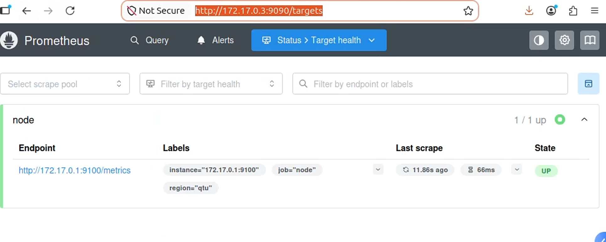
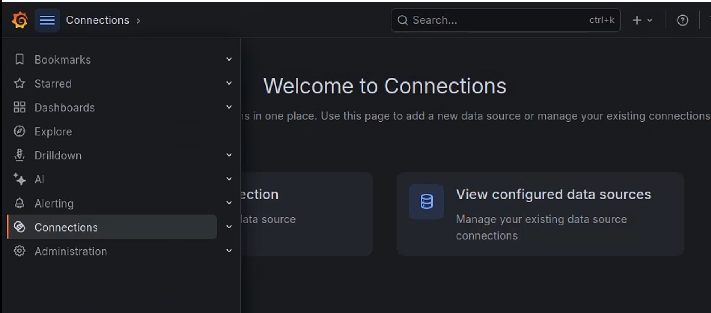
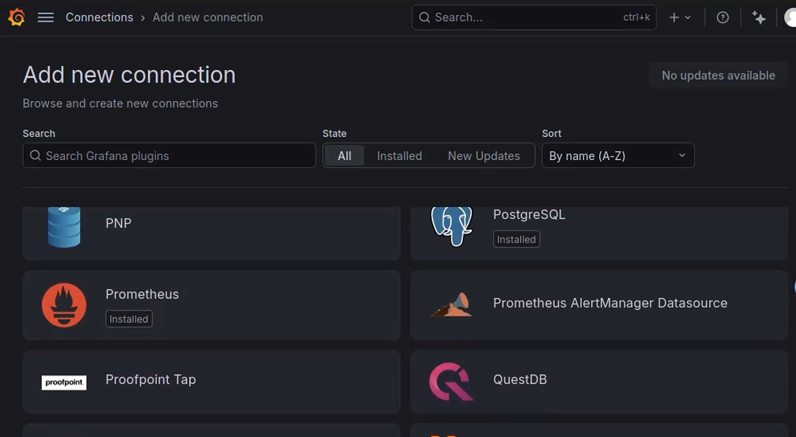
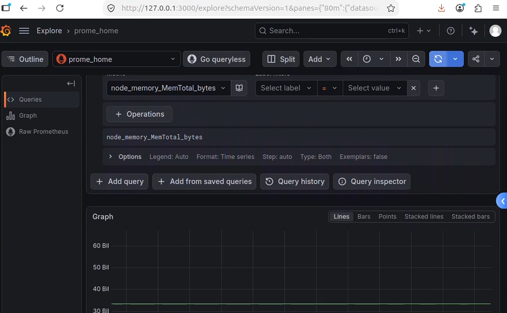
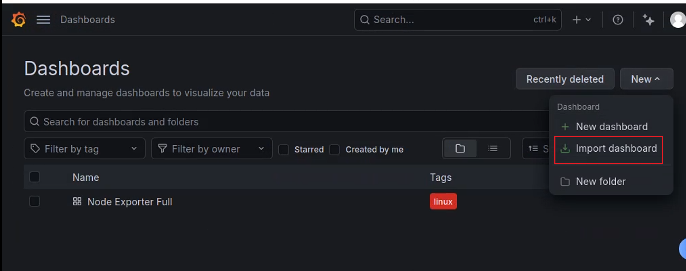
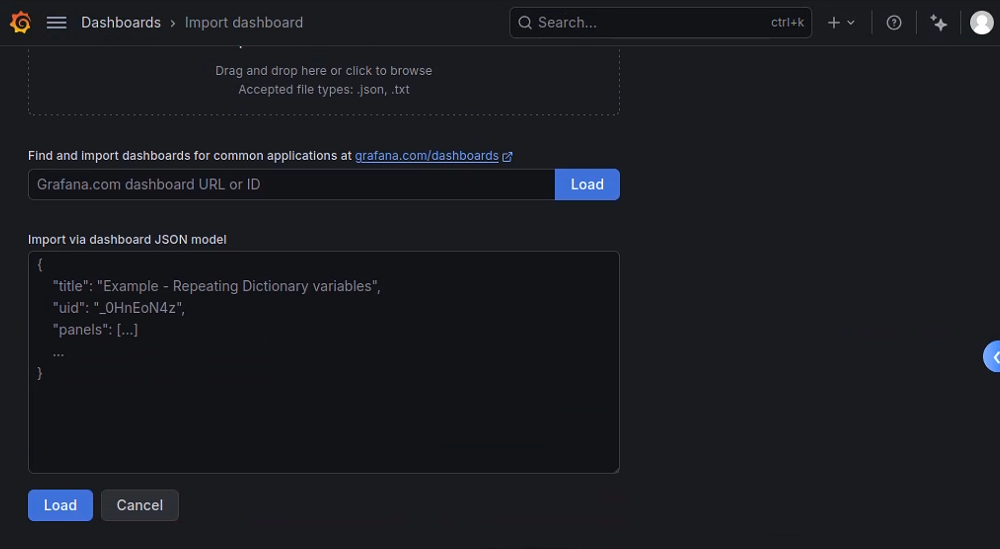
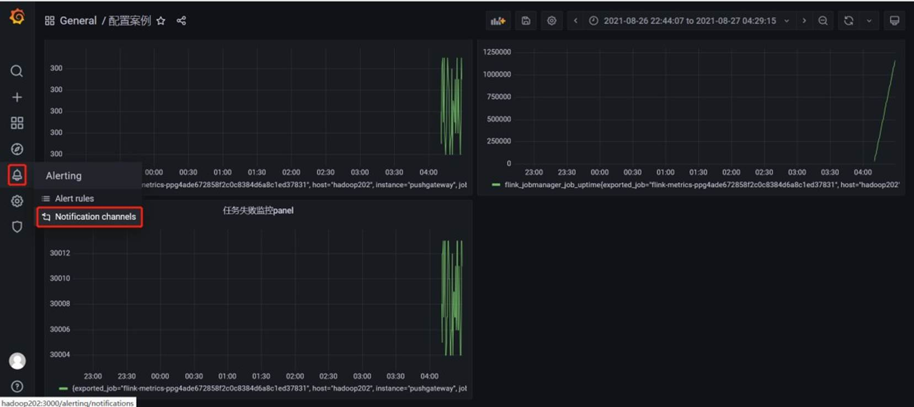

# [Prometheus](https://prometheus.io/docs)

Prometheus 是一款基于时序数据库的开源监控告警系统。

Prometheus的基本原理是通过HTTP协议周期性抓取被监控组件的状态，任意组件只要提供对应的HTTP接口就可以接入监控。

输出被监控组件信息的HTTP接口被叫做exporter 。目前互联网公司常用的组件大部分都有exporter可以直接使用，比如Varnish、Haproxy、Nginx、Tomcat、Redis、MySQL、Linux系统信息(包括磁盘、内存、CPU、网络等等)。

Prometheus适用于记录任何纯数值时间序列。它既适用于以机器为中心的监控，也适用于高度动态的面向服务架构的监控。

Prometheus作为新一代的云原生监控系统，有很多开发者参与到Prometheus的研发中，并且有许多第三方集成。


[尚硅谷参考文档](https://blog.csdn.net/hancoder/article/details/121703904)

# 0 概论


## 0.1 Promethus Server

主要负责数据采集和存储，提供PromQL查询语言的支持。包含了三个组件：

- Retrieval: 检索监控数据，主动从Pushgateway或者Exporter拉取指标数据
- TSDB: 时间序列数据库(Time Series Database)
- HTTP Server: 为告警和出图提供查询接口

## 0.2 指标(Metrics)采集

采集层分为两类作业：

- 短作业：
  - 通常指生命周期较短、运行后很快就会结束的作业（如批处理任务、定时脚本等）
  - **Push 推送模型**：由于短作业可能随时结束，Prometheus 难以稳定拉取数据，因此短作业会直接通过 API，在退出时将指标主动推送（Push）给 Pushgateway（推送网关）。随后，Prometheus Server 的 Retrieval 组件再以 Pull 的方式从 Pushgateway 中获取这些数据
- 长作业
  - 通常指长时间持续运行的进程或服务（如常驻后台的 Web 服务、数据库等）
  - **Pull 拉取模型**：Prometheus Server 内部的 Retrieval 组件会主动、周期性地直接从长作业（Job）或者 Exporter 拉取（Pull）监控指标数据


**Metrics**：

- 指标，不同的应用有不同的指标

**Exporters**: 

- Prometheus的一类数据采集组件的总称。[Exporter and Intergrations](https://prometheus.io/docs/instrumenting/exporters/)
- 它负责“**从被监控目标处**”搜集数据，并将其转化为Prometheus支持的格式。
- 它不向Promethus主动推送数据，而是等待Promethus前来抓取

**Pushgateway**: 

- 支持临时性Job主动推送指标的中间网关


## 0.3 Service Discovery

**Kubernetes_sd**: 支持从Kubernetes中自动发现服务和采集信息

**file_sd**: 通过配置文件来实现服务的自动发现


## 0.4 AlertManager

通过相关的告警配置，对触发阈值的告警通过页面展示、短信和邮件通知的方式告知运维人员。


## 0.5 数据可视化

通过PromQL语句查询指标信息，并在页面展示。虽然Prometheus自带UI界面，但是大部分都是使用Grafana出图。另外第三方也可以通过 API 接口来获取监控指标。

## 0.6 对比zabbix

Zabbix适合用于虚拟机、物理机的监控，因为每个监控指标是以 IP 地址作为标识进行区分的。

Prometheus的监控指标是由多个 label 组成，IP地址并不是唯一的区分指标，Prometheus 强大在可以支持自动发现规则，因此适合于容器环境。

Prometheus在监控虚拟机上业务时，可能需要安装多个 exporter，而zabbix只需要安装一个 Agent。

Prometheus 采用拉数据方式，即使采用的是push-gateway，prometheus也是从push-gateway拉取数据。而Zabbix可以推可以拉。

## 0.7 安装

要用到哪些组件就安装哪些，解压后就可以通过命令使用。

[alertmanager-0.33.0.linux-amd64.tar.gz](https://github.com/prometheus/alertmanager/releases/download/v0.33.0/alertmanager-0.33.0.linux-amd64.tar.gz)

[prometheus-3.5.4.linux-amd64.tar.gz](https://github.com/prometheus/prometheus/releases/download/v3.5.4/prometheus-3.5.4.linux-amd64.tar.gz)

[pushgateway-1.11.3.linux-amd64.tar.gz](https://github.com/prometheus/pushgateway/releases/download/v1.11.3/pushgateway-1.11.3.linux-amd64.tar.gz)


[官网相关下载](https://prometheus.io/download/)

### 0.7.1 [prometheus.yml](https://blog.csdn.net/csdn_tom_168/article/details/150860012)

官网的[configuration file](https://prometheus.io/docs/prometheus/latest/configuration/configuration/#configuration-file)

`prometheus.yml` 是 Prometheus 的**主配置文件**，决定了 Prometheus Server 如何发现目标、抓取指标、评估规则、以及与外部系统（如 Alertmanager）交互。

```yaml
# 全局配置
global:
  scrape_interval: 15s
  evaluation_interval: 15s
  scrape_timeout: 10s

# 告警配置（连接 Alertmanager）
alerting:
  alertmanagers:
    - static_configs:
        - targets: ['alertmanager:9093']

# 规则配置（记录规则 + 告警规则）
rule_files:
  - "rules/*.yml"

# 抓取配置（核心：定义监控目标）
scrape_configs:
  - job_name: 'prometheus'
    static_configs:
      - targets: ['localhost:9090']

  - job_name: 'node'
    static_configs:
      - targets: ['node-exporter:9100']

```

#### global 配置

定义 Prometheus 的默认行为。

<table><thead><tr><th>配置项</th><th>默认值</th><th>说明</th></tr></thead><tbody><tr><td><code>scrape_interval</code></td><td><code>1m</code></td><td>默认抓取间隔（可被 job 覆盖）</td></tr><tr><td><code>scrape_timeout</code></td><td><code>10s</code></td><td>单次抓取超时时间</td></tr><tr><td><code>evaluation_interval</code></td><td><code>1m</code></td><td>告警和记录规则的评估频率</td></tr><tr><td><code>external_labels</code></td><td><code>{}</code></td><td>添加到所有指标的外部标签（如 <code>datacenter: "us-east-1"</code>）</td></tr></tbody></table>

##### 推荐配置（生产环境）

```
global:
  scrape_interval: 15s           # 统一抓取频率
  scrape_timeout: 10s            # 超时应小于 scrape_interval
  evaluation_interval: 15s       # 与 scrape_interval 保持一致
  external_labels:
    datacenter: "shanghai"
    environment: "production"
    cluster: "k8s-prod"

```

#### alerting告警配置

配置 Prometheus 如何将告警发送到 **Alertmanager**

```yaml
alerting:
  alertmanagers:
    - scheme: http
      static_configs:
        - targets: ['alertmanager1:9093', 'alertmanager2:9093']
      timeout: 10s
      api_version: v1
```

#### rule_files规则文件

指定 Prometheus 加载的**记录规则（Recording Rules）** 和 **告警规则（Alerting Rules）** 文件路径。

#### scrape_configs抓取配置（核心）

定义 Prometheus 的**监控任务（Jobs）** 和 **目标发现方式**。

| 配置项                        | 说明                                |
| ----------------------------- | ----------------------------------- |
| `job_name`                    | 任务名称，会作为 `job` 标签自动添加 |
| `scrape_interval`             | 该任务的抓取频率（覆盖全局）        |
| `scrape_timeout`              | 该任务的抓取超时                    |
| `metrics_path`                | 指标端点路径（默认 `/metrics`）     |
| `scheme`                      | `http` 或 `https`                   |
| `basic_auth` / `bearer_token` | 认证配置                            |
| `tls_config`                  | TLS 证书配置                        |
| `static_configs`              | 静态目标配置                        |
| `file_sd_configs`             | 文件服务发现                        |
| `kubernetes_sd_configs`       | Kubernetes 服务发现                 |
| `relabel_configs`             | 抓取前重写标签                      |
| `metric_relabel_configs`      | 抓取后重写指标                      |

`static_configs` 和 `file_sd_configs` 是 Prometheus 中用于定义监控目标的两种方式。

| 特性             | `static_configs` (静态配置)                                  | `file_sd_configs` (文件服务发现)                             |
| :--------------- | :----------------------------------------------------------- | :----------------------------------------------------------- |
| **目标定义位置** | 直接写在 Prometheus 的主配置文件 (`prometheus.yml`) 中       | 写在独立的 YAML 或 JSON 文件中                               |
| **更新方式**     | **手动**：修改配置后，需要重启 Prometheus 或手动触发配置重载 | **自动**：Prometheus 会定期监控文件变化，发现变更后自动加载，无需重启 |
| **配置复杂度**   | **低**：配置简单直接，一目了然                               | **中**：需要管理额外的目标文件，但主配置更清晰               |
| **适用场景**     | 环境稳定，监控目标（如物理机、数据库）极少变动               | 目标动态变化，或希望通过外部系统（如 CMDB、脚本）管理目标列表的场景 |

static_configs 示例

```yaml
scrape_configs:
  - job_name: 'node_exporter'
    static_configs:
      - targets: ['192.168.1.10:9100', '192.168.1.11:9100'] # 直接列出目标
        labels:
          env: 'production'
```

file_sd_configs示例

```yaml
- job_name: 'node'
  file_sd_configs:
    - files:
        - 'targets/nodes.json'
      refresh_interval: 5m

```

target node.json示例

```json
[
  {
    "targets": ["192.168.1.10:9100", "192.168.1.11:9100"],
    "labels": { "region": "east" }
  }
]

```


### 0.7.2 [node exporter](https://github.com/prometheus/node_exporter)

Node Exporter 是 Prometheus 生态中一款开源的主机监控采集工具（Agent），主要用于收集 Linux/Unix 类主机的硬件和系统级别的运行指标1。它通常以 HTTP 接口暴露指标数据，供 Prometheus 定期抓取。其核心功能包括：

- **硬件指标采集**：收集 CPU 使用率、内存占用、磁盘 I/O、网络带宽、磁盘容量等1。
- **系统指标采集**：收集系统进程数、系统负载、文件描述符使用量、系统启动时间等1。
- **其他指标**：如文件系统 inode 使用情况、CPU 温度（部分硬件支持）等

**node exporter 安装和启动**

下载地址：https://github.com/prometheus/node_exporter/releases

```bash
wget https://github.com/prometheus/node_exporter/releases/download/v1.12.1/node_exporter-1.12.1.linux-amd64.tar.gz
tar xvfz node_exporter-1.12.1.linux-amd64.tar.gz
cd node_exporter-1.10.2.linux-amd64

# 查看有哪些可以配置的选项
./node_exporter --help

# 默认监听9100端口
# 修改监听的端口 1. 所有网卡的 9100 端口，允许外部访问，2. 本机 127.0.0.1 的 9101 端口，仅本机访问
./node_exporter --web.listen-address=:9100 --web.listen-address=127.0.0.1:9101

# 安装后你可以验证
curl http://localhost:9100/metrics

# TYPE promhttp_metric_handler_requests_in_flight gauge
promhttp_metric_handler_requests_in_flight 1
# HELP promhttp_metric_handler_requests_total Total number of scrapes by HTTP status code.
# TYPE promhttp_metric_handler_requests_total counter
promhttp_metric_handler_requests_total{code="200"} 0
promhttp_metric_handler_requests_total{code="500"} 0
promhttp_metric_handler_requests_total{code="503"} 0
```


**node exporter 开机自启动**

1. 创建一个service文件：`sudo vim /etc/systemd/system/node_exporter.service`

   - ExecStart 那里，你需要写你指定位置的命令

   ```ini
   [Unit]
   Description=Node Exporter
   Documentation=https://prometheus.io/
   After=network.target
   
   [Service]
   User=node_exporter
   Group=node_exporter
   Type=simple
   ExecStart=/usr/local/bin/node_exporter
   Restart=always
   
   [Install]
   WantedBy=multi-user.target
   ```

2. 重载配置，并启用开机自启

   ```bash
   # 重新加载 systemd 配置
   sudo systemctl daemon-reload
   
   # 启动 Node Exporter 服务
   sudo systemctl start node_exporter
   
   # 设置开机自启动
   sudo systemctl enable node_exporters
   
   # 验证exporter的状态
   sudo systemctl status node_exporter
   ```

### 0.7.3 启动其他组件

```bash
nohup ./prometheus --config.file=prometheus.yml > ./prometheus.log 2>&1 &

nohup ./pushgateway --web.listen-address :9001 > ./pushgateway.log 2>&1 &

nohup ./alertmanager --config.file=alertmanager.yml > ./alertmanager.log 2>&1 &
```

### 0.7.4 在容器中运行

容器中两个容器卷的作用：

- `/prometheus`：**存放 Prometheus 的时间序列数据库（TSDB）数据**
- `/etc/prometheus`：用于让容器中的prometheus读取来自宿主机中的配置文件prometheus.yml，以及它的依赖文件

我在宿主机上配置了一个如下的文件夹结构

```bash
├── conf
│   ├── prometheus.yml
│   ├── rules
│   └── targets
│       └── nodes.json
└── data
```

prometheus.yml

```yaml
global:
  scrape_interval: 15s
  scrape_timeout: 10s

scrape_configs:
  - job_name: 'node'
    scrape_interval: 15s
    scrape_timeout: 10s
    metrics_path: '/metrics'
    scheme: http
    file_sd_configs:
    - files:
        - 'targets/nodes.json'
      refresh_interval: 5m
```

targets/nodes.json

- file_sd_configs 的文件格式要求严格：必须是有效的 JSON 或 YAML。文件内容是一个对象数组，每个对象必须有 targets 和可选的 labels。


```json
[
  {
    "targets": ["172.17.0.1:9100"],
    "labels": { "region": "qtu" }
  }
]
```


```bash
# 为容器卷加权限
# 由于prometheus的官方镜像的 dockerfile 是通过nobody用户去执行程序，所以需要给宿主机中将挂载的容器卷加权
# dockerfile的地址：https://github.com/prometheus/prometheus/blob/main/Dockerfile
# 数据目录给所有用户写权限（不推荐生产环境，安全性低）
sudo chmod -R 777 /home/qbuntu/soft/prometheus/data
# 配置目录给所有用户读权限（至少 644 或 755）
sudo chmod -R o+r /home/qbuntu/soft/prometheus/conf

# 检查配置文件是否出错
docker run --rm \
  -v /home/qbuntu/soft/prometheus/conf:/etc/prometheus \
  --entrypoint /bin/promtool \
  prom/prometheus \
  check config /etc/prometheus/prometheus.yml
  
# 不加 -d，让容器在前台运行，这样所有输出会直接打印在终端上，方便观察
# 如果启动失败，终端会显示错误信息，
docker run --rm -it \
  -v /home/qbuntu/soft/prometheus/conf:/etc/prometheus \
  -v /home/qbuntu/soft/prometheus/data:/prometheus \
  prom/prometheus
  
# 也可以查看对应容器启动出错的日志
docker logs 3d29cdde35f0

# 后台运行
docker run -d \
  -p 9090:9090 \
  -v /home/qbuntu/soft/prometheus/conf:/etc/prometheus \
  -v /home/qbuntu/soft/prometheus/data:/prometheus \
  prom/prometheus
  
# 查看容器的ip
docker inspect -f '{{range .NetworkSettings.Networks}}{{.IPAddress}}{{end}}' container_id
172.17.0.3
# 验证node exporter 与prometheus 是否对接
http://172.17.0.3:9090/targets

```



# 1 概念

## 1.1 Data Model

每条时间序列由**指标名称(Metrics Name)**以及一组**标签(Labels)**作为唯一标识的**key**

每条时间序列按照时间的先后顺序存储一系列的样本值values。

```
http_request_status{ # 指标名称
    code='200', # 维度的标签
    content_path='/api/path2',
    environment='produment'
} =>
[value1@timestamp1,value2@timestamp2...] # 存储的样本值，时间序列
```

## 1.2 Job & Instance

**Instance**

- **定义**：任何暴露监控样本数据的 HTTP 服务端点都称为一个实例（Instance），它通常对应于单个进程
- **标识方式**：Instance 通常由被采样目标 URL 中的 `<host>:<port>` 部分来唯一标识

**Job**

- **定义**：具有相同采集目的的一组 Instance 的集合称为作业（Job）。eg：mysql主从复制的集群
- **作用**：Job 作为一个逻辑组，用于定义如何抓取（Scrape）这一组目标的数据，例如配置抓取间隔、访问限制等抓取行为
- **举例**：一个包含 4 个副本的 API 服务器可以配置为一个名为 `api-server` 的 Job，这 4 个副本各自的 IP 和端口就是该 Job 下的 4 个 Instance

**Job 与 Instance 的自动标签机制**

- 当 Prometheus 抓取数据时，会自动在时间序列（Time Series）上附加 `job` 和 `instance` 这两个标签，以便区分数据的来源

- ```text
  cpu_usage{job="node-exporter", instance="10.0.0.7:9100"}  14.04
  cpu_usage{job="node-exporter", instance="10.0.0.8:9100"}  18.50
  ```

**实例的健康状态监控**

对于每一个 Instance，Prometheus 都会自动生成一个名为 `up` 的时序指标，用于反映该实例的健康状态：

- `up{job="...", instance="..."}: 1` 表示该实例工作正常，数据抓取成功。
- `up{job="...", instance="..."}: 0` 表示该实例发生故障或无法访问

**目标发现方式**

隶属于 Job 的 Instance 可以通过以下两种方式被 Prometheus 发现：

- **静态配置**：直接在 `prometheus.yml` 配置文件中手动指定 Instance 的地址列表。
- **动态服务发现**：让 Job 自动从 Consul、Kubernetes、DNS 等注册中心或云环境中动态获取 Instance 列表，以适应云原生环境下的弹性伸缩需求

## 1.3 Metric types

在 Prometheus 中，指标类型（Metric Types）决定了数据如何被收集、存储以及如何使用 PromQL 进行查询。Prometheus 定义了四种核心指标类型：

1. **Counter (计数器)**
   - **定义**：一种只增不减的单调递增指标，仅能在服务重启时重置归零，无法手动减少
2. **Gauge（仪表盘）**
   - 定义：一种可增可减的瞬时值指标，反映系统在某个特定时间点的状态
3. **Histogram（直方图）**
   - 定义：对观测值进行分桶（Buckets）统计的指标，记录每个预设区间内的事件数量，同时记录事件总数与观测值总和
   - **核心优势**：分位数在服务端计算，支持跨实例、跨标签聚合，是分布式环境下统计分布数据的首选类型
4. **Summary（摘要）**
   - **定义**：与 Histogram 类似，但它直接在客户端计算并输出观测值的分位数
   - **适用场景**：适用于需要极高精度的分位数，且无需跨实例聚合的单实例场景


## 1.4 监控

- **白盒监控**：关注系统内部状态。通过部署各种 Exporter（如 Node Exporter）或应用埋点，收集 CPU、内存、JVM 状态、内网 SQL 延迟等内部指标。
- **黑盒监控**：关注用户侧的外部体验。不关心系统内部如何运行，而是从外部网络发起探测，检查服务的**网络可达性、协议响应耗时、SSL 证书是否过期**等。prometheus提供[blackbox_exporter](https://github.com/prometheus/blackbox_exporter)


# 2 PromQL

PromQL 的所有计算行为都是围绕“时间序列（Time Series）”展开的。

Prometheus 通过指标名（Metric）和一组标签（Labels）来唯一定义一条时间序列。

所有的PromQL表达式都必须至少包含一个指标名称（eg：http_request_status），或者一个不会匹配到空指标的标签过滤器（eg：{code =“200”}）

## 2.1 **查询结果类型**

PromQL 的表达式求值结果主要分为以下四种类型：

- **即时向量（Instant vector）**：一组时间序列，每个序列包含单个样本，且所有样本共享相同的时间戳67。
- **范围向量（Range vector）**：一组时间序列，每个序列包含一段时间范围内的多个数据点。
- **标量（Scalar）**：一个简单的浮点数值。
- **字符串（String）**：一个简单的字符串值（目前暂未使用）

## 2.2 数据选择器

选择器用于筛选出特定的时间序列数据。

- **瞬时向量选择器（Instant Vector）**：查询某一时刻的数据。支持精确匹配（`=`、`!=`）和正则匹配（`=~`、`!~`）。

  eg：`http_requests_total{job="api-server", status=~"5.."}`

- **范围向量选择器（Range Vector）**：查询过去一段时间内的数据，必须在指标后加上方括号 `[]`

  eg：`http_requests_total[5m]`

- **时间偏移（Offset Modifier）**：使用 `offset` 关键字将查询时间往前推移

  eg：`rate(http_requests_total[1h] offset 1d)`（对比昨日同时段的流量）

## 2.3 操作符

PromQL 提供了丰富的操作符用于数据处理与计算。

- **算术运算**：支持 `+`, `-`, `*`, `/`, `%`, `^`。常用于单位换算，如 `node_memory_used_bytes / (1024 * 1024)`
- **比较运算**：支持 `==`, `!=`, `>`, `<`, `>=`, `<=`。常用于过滤数据，如 `node_memory_free_bytes < 100 * 1024^2`
- **逻辑运算**：支持 `and`（交集）、`or`（并集）、`unless`（差集）。例如 `up{job="app"} or up{job="db"}`

## 2.4 聚合操作

聚合操作符用于将多维数据降维或进行统计计算。

- **常用聚合函数**：`sum`（求和）、`avg`（平均值）、`max`/`min`（最大/最小值）、`count`（计数）、`topk`/`bottomk`（取前/后 K 个）
- **分组修饰符**：
  - `by (label)`：按指定标签分组计算。例如 `sum by(job) (rate(http_requests_total[5m]))`。
  - `without (label)`：排除指定标签后，按其余标签分组计算。例如 `max without(instance) (cpu_usage)`

## 2.5 内置函数

针对不同的指标类型和场景，PromQL 内置了多种函数。

- 速率与增量：
  - `rate(v range)`：计算每秒平均增长率，推荐用于 Counter 类型指标。
  - `irate(v range)`：计算瞬时增长率，对数据尖峰敏感。
  - `increase(v range)`：计算时间窗口内的总增量
- 时间窗口聚合：
  - `avg_over_time(v range)`：计算时间窗口内的平均值。
  - `max_over_time(v range)`：计算时间窗口内的最大值。
- 趋势预测：
  - `predict_linear(v range, t)`：基于线性回归预测 t 秒后的值，常用于预测磁盘何时满载

# 3 Grafana 集成

grafana 是一款采用 Go 语言编写的开源应用，主要用于大规模指标数据的可视化展现，是网络架构和应用分析中最流行的**时序数据展示**工具，目前已经支持绝大部分常用的时序数据库。

步骤：

1. 启动Grafana服务，[安装包下载](https://grafana.com/grafana/download)
2. 关联prometheus数据源
   - 和prometheus 建立数据联系
3. 手动创建dashboard仪表盘
   - panel：不仅可以使用PromQL得到时间序列数据（Query），还可以配置告警（alert，notification）
   - row：row可以包含多个panel

## 3.1 安装宿主机版本

```bash
# https://grafana.com/grafana/download

wget https://dl.grafana.com/grafana-enterprise/release/13.2.1/grafana-enterprise_13.2.1_33191028959_linux_amd64.tar.gz
tar -zxvf grafana-enterprise_13.2.1_33191028959_linux_amd64.tar.gz

cd grafana-13.2.1/bin
# ./grafana --help
./grafana server
# Grafana默认监听3000端口，默认用户名密码都是admin

# http://你的IP:3000，访问grafana，用admin/admin登录。首次登录会要求修改密码。
```





```bash
# 选择Prometheus，add new data source
# 在顶部点击修改 连接名，我在此改的是 “prome_home”，它默认的名字是prometheus，如果重复的话，会默认为prometheus-1
# prometheus server url
http://172.17.0.3:9090
# 点击Save & Test，如果看到绿色的"Data source is working"就说明连接成功了。

# 检测grafana 是否能拿到 prometheus 的数据
#  Explore：在 Grafana 左侧边栏中，点击放大镜图标（Explore）
# 在queries 中加node_memory_MemTotal_bytes，点击刷新
# 我的电脑是memory 32G，所以图中显示的是31 bil
```



## 3.2 安装docker版本

[grafana在docker 容器中的配置](https://grafana.com/docs/grafana/latest/setup-grafana/configure-docker/)


## 3.3 添加dashboard模板

手动一个个添加 Dashboard 比较繁琐，Grafana 社区鼓励用户分享 Dashboard，通过[https://grafana.com/dashboards ](https://grafana.com/dashboards)网站，可以找到大量可直接使用的 Dashboard 模板。

Grafana 中所有的Dashboard 通过 JSON 进行共享，下载并且导入这些 JSON 文件，就可以直接使用这些已经定义好的 Dashboard

可以搜索node exporter的相关模板

```bash
# 在dashboard 菜单页中

# https://grafana.com/grafana/dashboards/1860-node-exporter-full/
# 复制id号 1860

# 选择刚才配置的Prometheus数据源，点击Import。
```





## 3.4 配置告警




