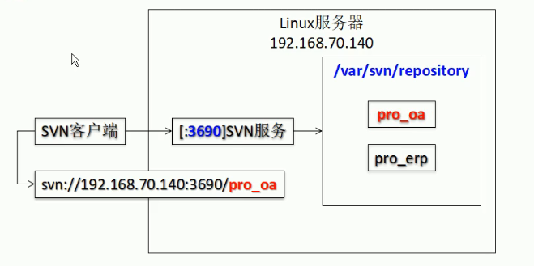

# Subversion

# 1 简介

版本控制理念源于工程设计领域，主要解决

版本控制工具：

- 集中式：CVS、SVN、VSS
- 分布式：Git

SVN是C/S结构（客户端/服务器端）结构，

主要操作：

1. 版本库（Repository）
   - 服务器上建立版本仓库
2. 检出（CheckOut）：
   - 把服务器版本库的内容完整下载到本地
   - 在整个开发过程中，只做一次
3. 更新（Update）
   - 把服务器的内容改变同步到本地
4. 提交（Commit）
   - 把客户端的内容改变同步到服务器

# 2 服务器环境搭建

## 2.1 svn服务器搭建

```bash
#1.安装服务器端程序
yum install subversion
#验证是否安装成功
svn --version

#创建版本库目录，用于存放所有的版本库，在/var下创建
mkdir -p /var/svn/repository
#在版本库目录下，创建具体的项目目录
mkdir proj_oa #项目版本库名
cd proj_oa

#2. 创建svn的版本库，前面只是创建了相应的目录，但没有把它设置为svn版本库
svnadmin create /var/svn/repository/proj_oa #这里也可以写相对地址
##这个命令，会在proj_oa 初始化一个版本仓库，里面会生成相应的文件，有下
## conf 存放proj_oa版本库的配置文件
## db 数据库目录
## hooks 存放我们的钩子程序
## locks db锁文件和db_logs锁文件的目录，用来追踪存取文件库的客户端
```



```bash
#3.配置svn服务svnserve

#3.1服务状态
#查看SVnserve的服务状态（这里并不是改变服务当前的状态，而是下一次开机后的服务是否自启的状态）
systemctl list-units --type=service
#也可以使用 chkconfig | grep svn 
#chkconfig命令主要用来更新（启动或停止）和查询系统服务的运行级信息。
#命令输出 svnserve 0:关闭 1:关闭 2:关闭 3:关闭 4:关闭 5:关闭 6:关闭 

#svnserve默认不是开机自启，我们在此设置为开机自启，也可以不用设置为开机自启，开机后手动自启
systemctl enable svnserve.service #将svn服务设置为开机自启，
#也可以使用chkconfig svnserve on 如果出现如下的提示，可以换用上面的命令
#Note: Forwarding request to 'systemctl enable svnserve.service'.

chkconfig | grep svn #再次查看svn的服务状态
# svnserve 0:关闭 1:关闭 2:启用 3:启用 4:启用 5:启用 6:关闭

#3.2配置服务开机时自启动

# 方法一：这里是之前配置服务的方法，现在在此路径下找不到svnserve文件，如果能找到直接使用即可。如果不能找到，尝试方法2

#svn服务配置文件的路径，/etc/rc.d/init.d/svnserve，这里也是可执行脚本文件的路径，里面可以配置可执行文件的参数等
cd /etc/rc.d/init.d
vim svnserve
#具体配置
#args="--daemon --pid-file=${pidfile} $OPTIONS"
#将上面一行修改为
args="--daemon --root /var/svn/repository --listen-port 2255 --pid-file=${pidfile} $OPTIONS"
#--root 参数为版本库的根目录，由上面的图我们可以知道，我们服务指向的应是各个版本库上级的repository，而不是某个具体的版本库
#--listen-port 服务的端口号，默认为3690

#当前就开启服务，不需要重启以开启服务
#开启svnserve服务
service svnserve start
#查看是否启动
service svnserve status
#查看2255端口是不是被svnserve占用着
netstat -anp | grep :2255
#查看svnserve进程的信息，并过滤掉关于grep的信息
ps -ef | grep svnserve|grep -v grep
#查看svnserve的pid信息
cat /var/run/serve.pid

#方法二
#/etc/init.d下新建文件svnboot，这个文件最终用于开机自启动的脚本文件
touch svnboot
vim svnboot
#将下面的文本进行粘贴
#!/bin/bash
# chkconfig: 2345 85 15
# description: svn server
SVN_HOME=/var/svn/repository
SVN_PORT=3690
SVN_SERVER=/usr/bin/svnserve


if [ ! -x $SVN_SERVER ]; then
    echo "svnserver startup: cannot start"
    exit
fi

case "$1" in
    start)
        echo "Starting svnserve…"
        $SVN_SERVER -d -r $SVN_HOME --listen-port $SVN_PORT
        echo "Finished!"
        ;;
    stop)
        echo "Stoping svnserve…"
        killall svnserve
        echo "Finished!"
        ;;
    restart)
        $0 stop
        $0 start
        ;;
    *)
        echo "Usage: svn { start | stop | restart } "
        exit 1
esac

#添加服务
chkconfig --add svnboot
#设置为开机自行执行
chkconfig svnboot on

#开启服务
svnserve -d -r /var/svn/repository --listen-port 3690
#记得在阿里云控制台的安全组配置里面开放3690端口
#查看开启状态
ps -aux | grep svnserve


```

## 2.2 版本库配置

在上面一节中的第二部分，我们创建了proj_oa的版本库，生成如下几个文件

1. conf 存放proj_oa版本库的配置文件
2. db 数据库目录
3. hooks 存放我们的钩子程序
4. locks db锁文件和db_logs锁文件的目录，用来追踪存取文件库的客户端

### 2.2.1 conf

conf文件夹下面又有如下几个文件

1. `svnserve.conf`：这里是版本库的主配置文件
2. `passwd`：这里是用于存放鉴权用户的信息的（项目的协同开发人员），包括svn的账户和密码
3. `authz`：权限配置文件

#### svnserve.conf

该文件仅由一个[general]配置段组成。

```bash
[general]
#控制非鉴权用户访问版本库的权限
anon-access = none #取值范围为"write"、"read"和"none"。 即"write"为可读可写，"read"为只读，"none"表示无访问权限。 默认值为read
#制鉴权用户访问版本库的权限
auth-access = write
#指定用户口令的文件名，默认为当前文件夹下的passwd文件（除非指定绝对路径，否则文件位置为相对conf目录的相对路径。）
password-db = passwd
#指定权限配置文件名，默认为当前文件夹下的authz文件（除非指定绝对路径，否则文件位置为相对conf目录的相对路径。）
authz-db = authz
realm = tiku 
```

**这个文件的以上字段都是被注释了的，所以要对这些注释进行解除，并且顶行书写（删除#，并保证字段是顶行无空格）**

**否则后面的配置皆无效。**

#### passwd

这个文件就是用来给版本库新建用户或者修改密码用。

用户名口令文件由svnserve.conf的配置项password-db指定，默认为conf目录中的passwd。该文件仅由一个[users]配置段组成。

[users]配置段的配置行格式如下：

```bash
<用户名> = <口令>
[users]
qkh = xmgwFAFFMWGAAQaqaf
axh = dahfaffFAfafvji
wmz = dfhafdffsaf
hhq = fdsfdsf
```

#### [authz](https://type.so/linux/svn-authz-settings.html)

在passwd中新建了用户或修改了密码，但是这些用户依旧没有版本库的权限。所以需要在authz中，给用户配置相应的权限。

权限配置文件由svnserve.conf的配置项authz-db指定，默认为conf目录中的authz。该配置文件由一个[groups]配置段和若干个版本库路径权限段组成。

示例：

版本库有以下目录结构

```bash
/project
├── trunk
├── tags
├── branches
```

有四个开发人员角色

- super 最大级别的比如boss，不需要开发，所有的给读的权限
- manager 项目的管理员，有读写权限，有打tag的权限
- developer 开发人员，有读写权限，没打tag的权限

```bash
#用户分组
[groups]
g_super = qkh
g_manager = axh
g_developer = wmz,hhq

#设置每个目录结构下，用户组的权限
[project:/]
@g_super = r
@g_manager = rw
* = 
# * 表示其余人，=号后边不加东西表示没有任何权限

[project:/trunk]
@g_super = r
@g_manager = rw
@g_developer = rw
* =

[project:/branches]
@g_super = r
@g_manager = rw
@g_developer = rw
* =
```

# 3 基本使用

``` bash
1.检出checkout
mkdir proj_oa
cd proj_oa
svn checkout svn://192.168.71.140/biye ./
#svn checkout svn://路径(目录或文件的全路径)　[本地目录全路径] --username　用户名
#之后会提示让你输入密码

ls -al
#当前目录下多了一个.svn目录
#.svn目录所在的目录就是服务器版本库的工作副本，版本控制相关操作都需要在工作副本目录下进行，eg:更新，提交等等
#.svn目录用于保存本地目录和文件状态信息，用来和svn服务器进行交互

2.提交文件
#2.1添加版本控制add
# svn规定提交一个新建的文件，需要先把该文件纳入版本控制体系中。
svn add hello.txt
#2.2 提交
svn commit hello.txt -m "这是hello.txt的第一个版本"

```


# 生命周期

1. 创建版本库（Create 操作）：版本库不仅能存放文件，还包括了每次修改的历史，即每个文件的变动历史。
2. 检出（Checkout 操作）：从版本库创建一个工作副本
3. 更新（update 操作）：将工作副本与版本库进行同步
4. 执行变更（Commit操作）：编辑工作副本中已存在的文件，这些不会立刻成为版本库的一部分，而是被添加进待变更列表中，直到执行了 commit 操作后才会成为版本库的一部分。
5. 复查变化（Status 操作）：Status 操作只是提供了一个变动列表，但并不提供变动的详细信息。你可以用 diff 操作来查看这些变动的详细信息。
6. 修复错误（Revert 操作）：我们来假设你对工作副本做了许多修改，但是现在你不想要这些修改了，这时候 revert 操作将会帮助你。
7. 解决冲突（Resolve 操作）：Merge 操作会自动处理可以安全合并的东西。其它的会被当做冲突。Resolve 操作就是用来帮助用户找出冲突并告诉版本库如何处理这些冲突。
8. 提交更改（Commit 操作）：用来将更改从工作副本同步到版本库，Commit 是一个原子操作，也就是说要么完全提交成功，要么失败回滚。用户不会看到成功提交一半的情况。
