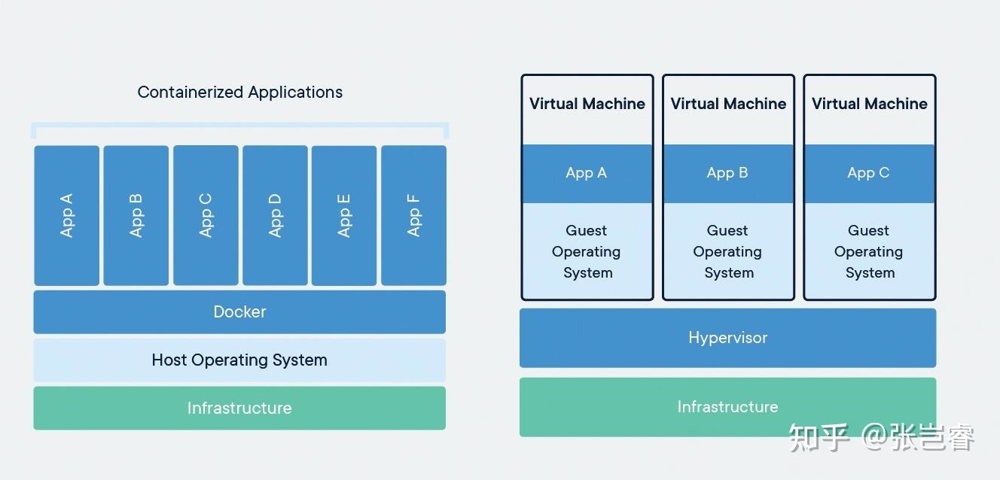

# docker

docker是基于go语言实现的云开源项目。

docker的主要目标是“**Build, Ship and Run Any App, Anywhere** ”，也就是对应用组件的封装、分发、部署、运行等生命周期的管理，使用户App（可以是Web应用或数据库应用等等）及其运行环境能够做到“**一次镜像，处处运行**”。

linux的容器技术的出现，就解决了这样一个问题，而docker就是在它的基础上发展过来的。将应用打包成镜像，通过镜像成为运行在docker容器上的实例，而docker容器在任何操作系统都是一致的，这就实现了跨平台，跨服务器。只需要一次配置好环境，换到别的主机上，就可以一键部署，大大简化了操作。

docker是解决了运行环境和配置问题的软件容器，方便做集成并有助于整体发布的容器虚拟化技术。

docker是一个能够把开发的应用程序自动部署到容器的开源引擎。

docker设计的目的就是要加强开发人员写代码的开发环境与应用程序要部署的生产环境的一致性，从而降低"开发时一切正常，发布就出问题"的风险。

# 1 介绍

## 1.1 [docker与虚拟机的区别](https://zhuanlan.zhihu.com/p/351621747)

### 1.1.1 架构区别

docker：物理机-操作系统-docker-APP（container）

虚拟机：物理机-管理程序 hypervisor（vmware、kvm...）-vm操作系统-APP

两者对比来看docker比虚拟机少了一层vm的操作系统。docker的APP是直接运行在宿主机上的，而虚拟机的APP是运行在虚拟在宿主机上的操作系统上的。

#### 容器技术

**linux容器是，与系统其他部分隔离开的一系列进程。从另一个镜像运行，并由该镜像提供支持进程所需的全部文件，容器提供的镜像包含了应用的所有依赖项，因而在从开发到测试再到生产的整个过程中，它都具有可移植性和一致性。**

linux容器不是模拟一个完整的操作系统，而是对进程进行隔离，有了容器，就可以将软件运行所需的所有资源打包到一个隔离的容器中。容器与虚拟机不同，不需要捆绑一套操作系统，只需要软件工作所需的库资源和设置。系统因此变得高效轻量并保证部署在任何环境中的软件都能始终如一的运行。

**docker容器是在操作系统层面上实现虚拟化，直接复用本地主机的操作系统，而传统的虚拟机则是在硬件层面实现虚拟化**

容器内的应用程序直接运行于宿主的内核，容器内没有自己的内核，且没有进行硬件虚拟，因此容器要比传统虚拟机更为轻便。

每个容器之间相互隔离，每个容器有自己的文件系统，容器之间进行不会相互影响，能区分计算资源。

### 1.1.2 其他区别

| 比较项               | docker           | vm                                |
| -------------------- | ---------------- | --------------------------------- |
| 启动时间             | 秒级（启动应用） | 分钟级（启动操作系统 + 启动应用） |
| 存储占用             | MB（应用的大小） | GB（操作系统 + 应用的大小）       |
| 性能                 | 接近原生         | 弱于原生                          |
| 单个宿主机支持的数量 | 上千个           | 几十个                            |

## 1.2 docker组件

- docker引擎
  - docker客户端和服务器
- docker镜像
  - 镜像有时候就像容器的"源代码"。
  - 镜像体积很小，非常便携，易于分享、存储和更新
- Registry
  - docker用Registry来保存用户构建的镜像
  - registry分为公共和私有两种
- Docker容器
  - 镜像是docker生命周期中构建或打包阶段，而容器则是启动或执行阶段