# docker

docker是基于go语言实现的云开源项目。

docker的主要目标是“**Build, Ship and Run Any App, Anywhere** ”，也就是对应用组件的封装、分发、部署、运行等生命周期的管理，使用户App（可以是Web应用或数据库应用等等）及其运行环境能够做到“**一次镜像，处处运行**”。

linux的容器技术的出现，就解决了这样一个问题，而docker就是在它的基础上发展过来的。将应用打包成镜像，通过镜像成为运行在docker容器上的实例，而docker容器在任何操作系统都是一致的，这就实现了跨平台，跨服务器。只需要一次配置好环境，换到别的主机上，就可以一键部署，大大简化了操作。

docker是解决了运行环境和配置问题的软件容器，方便做集成并有助于整体发布的容器虚拟化技术。

docker是一个能够把开发的应用程序自动部署到容器的开源引擎。

docker设计的目的就是要加强开发人员写代码的开发环境与应用程序要部署的生产环境的一致性，从而降低"开发时一切正常，发布就出问题"的风险。

# 1 介绍

## 1.1 [docker与虚拟机的区别](https://zhuanlan.zhihu.com/p/351621747)

### 1.1.1 架构区别

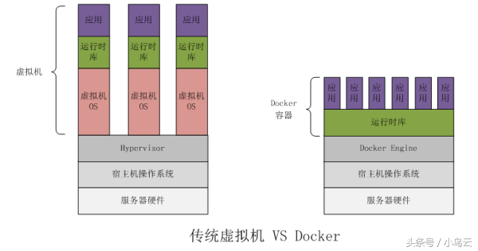


docker：物理机-操作系统-docker-APP（container）

虚拟机：物理机-管理程序 hypervisor（vmware、kvm...）-vm操作系统-APP

两者对比来看docker比虚拟机少了一层vm的操作系统。docker的APP是直接运行在宿主机上的，而虚拟机的APP是运行在虚拟宿主机上的操作系统上的。

#### 容器技术

**linux容器是，与系统其他部分隔离开的一系列进程。从另一个镜像运行，并由该镜像提供支持进程所需的全部文件，容器提供的镜像包含了应用的所有依赖项，因而在从开发到测试再到生产的整个过程中，它都具有可移植性和一致性。**

linux容器不是模拟一个完整的操作系统，而是对进程进行隔离，有了容器，就可以将软件运行所需的所有资源打包到一个隔离的容器中。容器与虚拟机不同，不需要捆绑一套操作系统，只需要软件工作所需的库资源和设置。系统因此变得高效轻量并保证部署在任何环境中的软件都能始终如一的运行。

**docker容器是在操作系统层面上实现虚拟化，直接复用本地主机的操作系统，而传统的虚拟机则是在硬件层面实现虚拟化**

容器内的应用程序直接运行于宿主的内核，容器内没有自己的内核，且没有进行硬件虚拟，因此容器要比传统虚拟机更为轻便。

每个容器之间相互隔离，每个容器有自己的文件系统，容器之间进行不会相互影响，能区分计算资源。

### 1.1.2 其他区别

| 比较项               | docker           | vm                                |
| -------------------- | ---------------- | --------------------------------- |
| 启动时间             | 秒级（启动应用） | 分钟级（启动操作系统 + 启动应用） |
| 存储占用             | MB（应用的大小） | GB（操作系统 + 应用的大小）       |
| 性能                 | 接近原生         | 弱于原生                          |
| 单个宿主机支持的数量 | 上千个           | 几十个                            |


## 1.2 docker组件

### 1.2.1 镜像image

docker镜像就是一个只读模板，镜像可以用来创建Docker容器，一个镜像可以创建很多容器。

镜像有时候就像容器的"源代码"。

类似于java的class，而docker容器就类似于java中，new出来的实例对象。

也相当于一个最小文件系统。

| docker | java面向对象 |
| ------ | ------------ |
| 容器   | 对象实例     |
| 镜像   | 类           |

### 1.2.2 容器container

#### 从面向对象的角度理解

docker利用容器独立运行一个或一组应用，应用程序或服务运行在容器里面。

容器就相当于一个虚拟化的运行环境，容器是用镜像创建的运行实例。

镜像是docker生命周期中构建或打包阶段，而容器则是启动或执行阶段。

镜像是静态的定义，容器是镜像运行时的实体。

容器为镜像提供了一个标准的和隔离的运行环境，它可以被启动，开始，停止，删除。

#### 从镜像容器角度

可以把容器看做是一个简易版的linux环境（最小，最核心的linux内核文件，不需要的不加载，包括root用户权限，进程空间，用户空间和网络空间等），和运行在其中的应用程序。

### 1.2.3 仓库repository

仓库是集中存放镜像文件的地方。

类似于：

maven仓库，存放各种jar包

github仓库，存放各种git项目的地方

docker公司提供的官方registry被称作docker hub，存放各种镜像模板的地方。


仓库分为公开仓库（Public）和私有仓库（Private）两种形式。

最大的公开仓库是docker Hub（https://hub.docker.com/)。存放了数量庞大的镜像供用户下载。

国内的公开仓库包括阿里云、网易云等。

### 1.2.4 引擎

docker本身是一个容器运行载体或称之为管理引擎（docker daemon）。

我们把应用程序和配置依赖打包好形成一个可交付的运行环境，这个打包好的运行环境就是image镜像文件。只有通过这个镜像文件才能生成Docker容器实例。

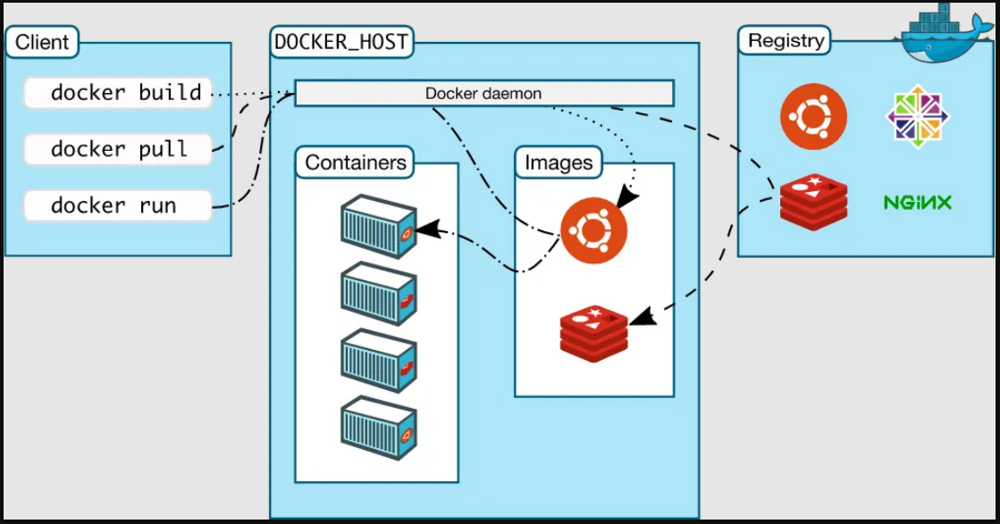

docker是一个client-server结构的系统，Docker守护进程运行在主机上，然后通过socket连接从客户端访问，守护进程从客户端接受命令并管理运行在主机上的容器。

容器，是一个运行时环境，是一个个的集装箱。

## 1.3 docker架构

docker是一个C/S模式的架构，后端是一个松耦合架构，多个模块各司其职。

docker运行的基本流程：

1. 用户是使用docker Client与docker Daemon建立通信，并发送请求给后者。
2. docker Daemon作为Docker架构中的主体部分，首先提供Docker server的功能使其可以接受docker client的请求。
3. docker Engine执行docker内部的一系列工作，每一项工作都是一系列job的形式的存在
4. job运行的过程中，当需要容器镜像时，则从docker registry中下载镜像，并通过镜像管理驱动Graph的形式存储。
5. 当需要docker创建网络环境时，通过网络管理驱动network driver创建并配置docker容器网络环境
6. 当需要限制docker容器运行资源或执行用户指令操作时，则通过exec driver来完成。
7. Libcontainer则是一项独立的容器管理包，network driver以及exec driver都是通过Libcontainer来实现具体对容器进行操作

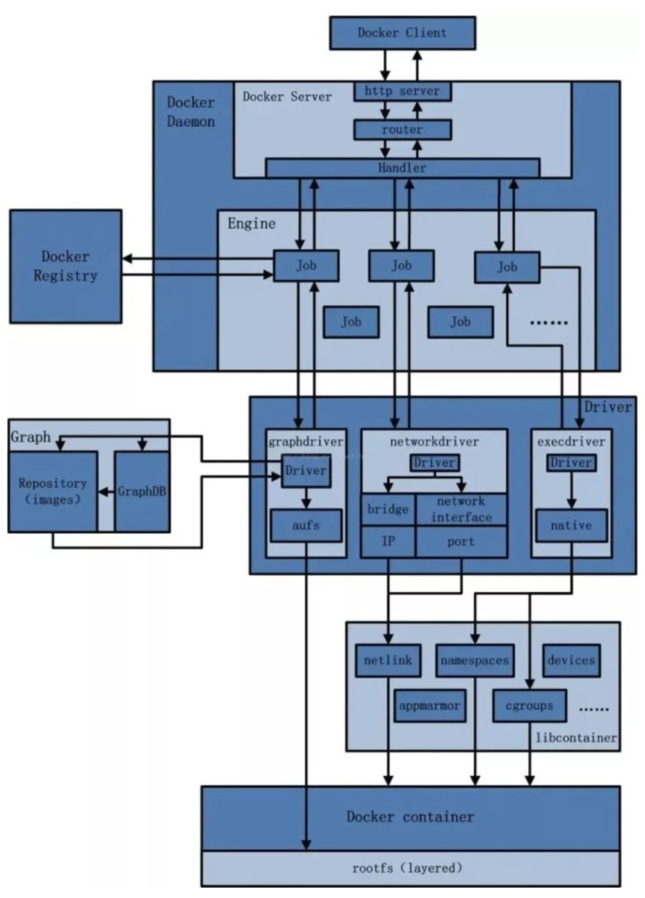

## 1.4 docker安装

https://docs.docker.com/engine/install/centos/

步骤：

1. 确定centos7及以上版本

   - ```bash
     cat  /etc/redhat-release
     CentOS Linux release 8.0.1905 (Core) 
     ```

2. 卸载旧版本

   - ```bash
     sudo yum remove docker \
                       docker-client \
                       docker-client-latest \
                       docker-common \
                       docker-latest \
                       docker-latest-logrotate \
                       docker-logrotate \
                       docker-engine
     ```

3. yum安装gcc

   - gcc 可以编译c/c++

   - ```bash
     # 查看是否通过yum安装过gcc
     yum list installed | grep gcc
     # 如果安装过，那么将会出现下面的两行
     gcc.x86_64                            8.5.0-4.el8_5                     @AppStream
     gcc-c++.x86_64                        8.5.0-4.el8_5                     @AppStream
     
     # 如果没有安装，通过下面的两个命令安装
     yum -y install gcc
     yum -y install gcc-c++
     ```

4. 设置stable镜像仓库

   - ```bash
     # yum-utils 提供了yum-config-manager工具
     yum install -y yum-utils
     
     # 通过yum-config-manager安装stable repository，这个库地址需要改为国内库地址，
     # 如果连的是国外的库，
     # 比如docker官网 https://download.docker.com/linux/centos/docker-ce.repo
     # 经常会出现网络超时
     # 报以下的错误：
     # [Error 14] curl#35 - TCP connection reset by peer
     # [Error 12] curl#35 - Timeout
     
     # 推荐使用阿里云，腾讯云，华为云，网易云的
     # 
     yum-config-manager \
         --add-repo \
         http://mirrors.aliyun.com/docker-ce/linux/centos/docker-ce.repo
         
     ```

5. 更新yum软件包索引

   ```bash
   # centos 8 需要去掉fast执行
   yum makecache fast
   ```

6. 安装docker ce

   ```bash
   yum -y install docker-ce docker-ce-cli containerd.io
   ```

7. 启动docker

   ```bash
   systemctl start docker
   ```

8.  测试

   ```bash
   docker version
   
   # Client: Docker Engine - Community
   # Version:           20.10.17
   # API version:       1.41
   # Go version:        go1.17.11
   # Git commit:        100c701
   # Built:             Mon Jun  6 23:03:11 2022
   # OS/Arch:           linux/amd64
   # Context:           default
   # Experimental:      true
   
   # Server: Docker Engine - Community
   # Engine:
   #  Version:          20.10.17
   #  API version:      1.41 (minimum version 1.12)
   #  Go version:       go1.17.11
   #  Git commit:       a89b842
   #  Built:            Mon Jun  6 23:01:29 2022
   #  OS/Arch:          linux/amd64
   #  Experimental:     false
   # containerd:
   #  Version:          1.6.6
   #  GitCommit:        10c12954828e7c7c9b6e0ea9b0c02b01407d3ae1
   # runc:
   #  Version:          1.1.2
   #  GitCommit:        v1.1.2-0-ga916309
   # docker-init:
   #  Version:          0.19.0
   #  GitCommit:        de40ad0
   
   
   docker run hello-world
   
   
   docker run hello-world
   Unable to find image 'hello-world:latest' locally
   latest: Pulling from library/hello-world
   2db29710123e: Pull complete 
   Digest: sha256:53f1bbee2f52c39e41682ee1d388285290c5c8a76cc92b42687eecf38e0af3f0
   Status: Downloaded newer image for hello-world:latest
   
   Hello from Docker!
   This message shows that your installation appears to be working correctly.
   
   To generate this message, Docker took the following steps:
    1. The Docker client contacted the Docker daemon.
    2. The Docker daemon pulled the "hello-world" image from the Docker Hub.
       (amd64)
    3. The Docker daemon created a new container from that image which runs the
       executable that produces the output you are currently reading.
    4. The Docker daemon streamed that output to the Docker client, which sent it
       to your terminal.
   
   To try something more ambitious, you can run an Ubuntu container with:
    $ docker run -it ubuntu bash
   
   Share images, automate workflows, and more with a free Docker ID:
    https://hub.docker.com/
   
   ```

9.  卸载docker

   ```bash
   systemctl stop docker
   yum remove docker-ce docker-ce-cli containerd.io
   rm -rf /var/lib/docker
   rm -rf /var/lib/containerd
   ```

   

10. 阿里云镜像加速器

    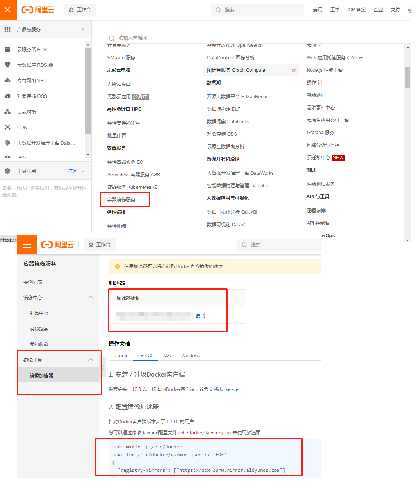

    ```bash
    # 后面为了拉镜像，启动容器更快一点，必须配置一个阿里云的镜像加速器
    
    # 注册一个阿里云账户，阿里云为了把云生态做起来，给个体开发者了一些便利
    
    # 阿里官网的操作
    mkdir -p /etc/docker
    # tee命令用于将标准输入复制到指定文件，并显示到标准输出。tee指令会从标准输入设备读取数据，将其内容输出到标准输出设备，同时保存成文件。
    # 镜像的地址记得要写成自己的，你如果直接从你的那个地方粘贴，那么你的地址就是你的加速器地址
    tee /etc/docker/daemon.json <<-'EOF'
    {
      "registry-mirrors": ["https://ocx43prw.mirror.aliyuncs.com"]
    }
    EOF
    
    systemctl daemon-reload
    systemctl restart docker
    ```

    

11. 

# 2 docker 常用命令

## 2.1 帮助启动类命令

```bash
# 1.启动docker
systemctl start docker
# 2.停止docker
systemctl stop docker
# 3.重启docker
systemctl restart docker
# 4.查看docker状态
systemctl status docker
# 5.开启启动
systemctl enable docker
# 6.查看docker概要信息
docker info
# 7.查看docker帮助文档
docker help
# 8.查看docker命令帮助文档
docker <command> --help

```

## 2.2 镜像命令

```bash
# 1.列出本地主机上的镜像
docker images -[aq] [search_images_name]
REPOSITORY    TAG       IMAGE ID       CREATED        SIZE
hello-world   latest    feb5d9fea6a5   9 months ago   13.3kB
# repository：表示镜像仓库源
# tag：镜像的标签版本号，同一仓库源可以有多个tag版本，我们可以使用repository:tag来定义不同的镜像
# 如果你不指定某个镜像的版本标签，那么docker默认使用latest镜像
# image id： 镜像id
# created： 镜像创建时间
# size 镜像的大小
# 参数：
-a 列出本地所有镜像(含历史映像层)
-q 只列出image id

# 也可以使用docker image ls

# 2.镜像搜索
docker search image_name
docker search nginx
# 查出前5个镜像，默认limit是25个
docker search --limit 5 nginx
NAME        DESCRIPTION                         STARS     OFFICIAL   AUTOMATED
nginx      Official build of Nginx.             17124     [OK]       
linuxserver/nginx  An Nginx container, brought to you by LinuxS…   169                  
bitnami/nginx   Bitnami nginx Docker Image      137      				 [OK]
ubuntu/nginx     Nginx, a high-performance reverse proxy & we…   55                   
bitnami/nginx-ingress-controller   Bitnami Docker Image for NGINX…  19			 [OK]

# 3.下载镜像
docker pull image_name # 等同于docker pull image_name:latest
docker pull image_name:tag # 下载指定版本的镜像

# 4.查看镜像/容器/数据卷所占空间
docker system df
TYPE            TOTAL     ACTIVE    SIZE      RECLAIMABLE
Images          1         1         13.26kB   0B (0%)
Containers      2         0         0B        0B
Local Volumes   0         0         0B        0B
Build Cache     0         0         0B        0B

# 5.删除镜像
docker rmi image_name_or_image_id[:tag] # rm-remove i-image，
docker rmi -f image_name_or_image_id[:tag] # 当本地正在运行镜像的容器时，执行上面的命令可能无法删除，这时需要用到-f，强制删除
docker rmi img1:tag1 img2:tag2 # 删除多个镜像
docker rmi -f $(docker images -qa)

#docker commit / docker push

# https://m.php.cn/faq/510418.html
# 6.将包含镜像的tar包导入docker作为镜像
# 法一
docker import  tar包名字.tar 镜像名称：版本id
# 法二
docker load -i tar包名字.tar

# 7.导出镜像为tar包
docker save <IMAGE_ID> -o <TAR_FILENAME>
# eg:
docker save abc123def456 -o myimage.tar
```

虚悬镜像：仓库名和版本名都是\<none>镜像

## 2.3 容器命令

下面打算安装一个ubuntu，意思就是在centos操作系统上的docker里面安装一个Ubuntu。

### 2.3.1 启动容器

```bash
# 1.下载镜像
docker pull ubuntu
# 2.新建并启动容器
docker run [option] image [command]
# option :

# --name="container_name" 为容器指定名称
# -d 后台运行容器，并返回容器id，即：启动守护式容器

# -i interactive，以交互模式运行容器，通常与-t同时使用
# -t 为容器重新分配一个伪输入终端（tty），通常与-i同时使用
# 启动一个交互式容器

# -P 随机端口映射

# -p 指定端口映射
# -p hostPort:containerPort，如果访问宿主机的hostPort端口，就会映射到docker内部的containerPort端口，container端口也就是内部应用（鲸鱼背里的集装箱）监听的端口，例如nginx就监听的是80端口
# -p ip:hostPort:containerPort，指定将宿主机指定ip的指定端口映射到容器的指定端口。

docker run -it ubuntu /bin/bash
# 使用镜像ubuntu:latest，并以交互模式启动一个容器，在容器内执行/bin/bash命令
# -it 启动交互式终端
# ubuntu 镜像名称
# /bin/bash 通过这个命令，可以运行linux shell脚本命令，这个终端里面只能运行linux内核的一些命令，因为安装的镜像只有70多M，是一个内核的精简的ubuntu系统

# 命令执行成功以后，出现的端口就是ubuntu的终端了
# 输入exit 退出container，同时容器也关闭了

[root:11:49@~]docker run -it --name=ubuntu1 ubuntu
root@1ee74ac3f7e9:/ ls
bin  boot  dev  etc  home  lib  lib32  lib64  libx32  media  mnt  opt  proc  root  run  sbin  srv  sys  tmp  usr  var


# 3.查看所有容器启动运行情况
docker ps
# -a 列出当前所有的容器 ，包括启动 + 未启动的
# -l 列出最近创建的容器
# -n 显示最近n个创建的容器
# -q 静默模式，只显示容器编号
CONTAINER ID   IMAGE     COMMAND   CREATED            STATUS              PORTS     NAMES
1ee74ac3f7e9   ubuntu    "bash"    About a minute ago   Up About a minute         ubuntu1
# 列出所有容器的id
docker ps -a -q

# 4.退出容器
# 两种退出方式
# 方式一：exit，run进去容器，exit退出，容器停止
# 方式二：ctrl + p + q， run进去容器，ctrl+p+q退出，容器不停止

# 5.启动已停止的容器
docker start container_id_or_container_name
# 6.重启容器
docker restart container_id_or_container_name
# 7.停止容器
docker stop container_id_or_container_name
# stop首先给容器发送一个TERM信号，让容器做一些退出前必须的保护性、安全性操作，
# 然后让容器自动停止运行，如果在一段时间内，容器还是没有停止，再进行kill-9，强行终止。

# 8.强制停止容器
docker kill container_id_or_container_name
# kill是不管容器同不同意，我直接执行kill-9，强行终止

# Docker stop或者Docker kill为何不能停止容器
# 因为你启动时加了参数docker run --restart=always,这个意思是无论容器时正常还是非正常手动关闭都会重启，
# 可以修改为docker run --restart=on-failure，异常关闭时重启容器，还有其他几个参数自己查看。

# 9.删除容器
docker rm container_id_or_container_name # 删除已停止的容器
docker rm -f container_id_or_container_name # 强制删除容器，容器可以正在运行
docker rm $(docker ps -a -q) # 删除所有未运行的容器，它实际会对每一个容器都执行删除操作，只是删不掉正在运行的容器罢了


# 1. 容器关闭，然后再启动容器，数据是存在的。
# 2. 创建容器，然后把容器删除，数据随着容器的删除也被删除
# 3. 如何删除容器不删除数据，可以在创建容器的时候加容器卷
```

### 2.3.2  启动守护式容器

在2.3.1中我们可以知道，退出容器有两种方式，通过ctrl+p+ q即可退出，但容器并不停止。

```bash
# 1. 以后台模式运行一个容器
docker run -d ubuntu
# 查看运行情况
docker ps -a
# 发现当前容器已经退出了

# docker 容器后台运行必须要一个前台进程
# 容器运行的如果不是那些一直挂起的命令（例如top，tail），就是会自动退出的，这是docker机制决定的。
# 所以如果要启动守护式容器，那么就必须run 一些具备前台进程的镜像，例如redis，

# 所以最佳的解决方式是：将你要运行的程序以前台进程的形式运行。
# 常见的就是交互命令行模式（-it），然后ctrl + p + q退出

# 2.查看容器运行日志
docker log container_id

# 3. 查看容器内运行的进程
docker top container_id
# docker里跑起来的容器都是一个个linux系统
# 可以把容器看做一个简易版的linux环境
UID    PID           PPID         C            STIME        TTY        TIME          CMD
root   465017        464998       0            11:50        pts/0      00:00:00     bash


# 4.查看容器内部细节
docker inspect container_id
# 可以查看网络，ip配置等等容器细节（简易版linux的容器细节）
```

### 2.3.3 进入正在运行的容器

重新进入正在运行的容器，并以命令行交互。

```bash
# 5. 进入正在运行的容器
# 两种方式
# 方式1
docker exec -it container_id /bin/bash
# 方式2
docker attach container_id
# 区别：
# exec：是在容器中打开新的终端，并且可以启动新的进程，用exit退出，不会导致容器的停止
# attach：直接进入容器启动命令终端，不会启动新的进程，用exit退出，会导致容器的停止

# 对容器里的文件进行备份
#6. copy容器里的文件到宿主机
docker cp container_id:container_inner_path host_path

# 对整个容器进行备份，包括容器里的文件
#7. 将容器导出为一个tar文件
docker export container_id > container_file.tar
#8. import从tar包中的内容创建一个新的文件系统再导入为镜像
cat container_file.tar | docker import - 用户名/镜像名:版本号
# 用户名镜像名版本号随意命名
docker images 
# 可以查看导入后的镜像已经在列表中了


```

### 2.3.4 远程进入正在运行的容器

```bash
# 连接指定服务器中docker的ssh，将docker容器的22端口，和宿主机的端口8022进行映射
docker run -dit -p 8022:22 --name test1 ubuntu:16.04

# 然后在本地连接远程服务器（192.168.100.1），访问宿主机的8022端口就能映射到容器ssh服务
ssh root@192.168.100.1 -p 8022
```


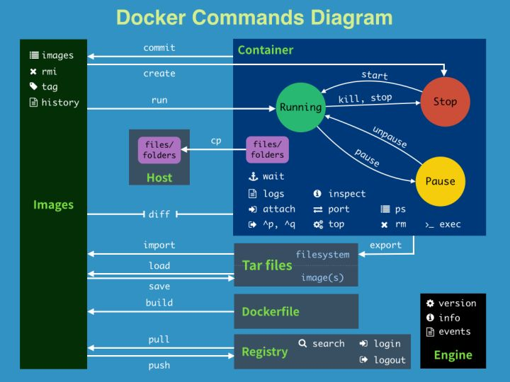


### 2.3.5 容器进出总结


# 3 docker 镜像

镜像是一种轻量级、可执行的独立软件包，它包含运行某个软件所需的所有内容，我们把应用程序和配置依赖打包好形成一个可交付的运行环境(包括代码、运行时需要的库、环境变量和配置文件等)，这个打包好的运行环境就是image镜像文件。

## 3.1 镜像分层

镜像是一个分层的文件系统。

### 3.1.1 联合文件系统

**docker的镜像实际上由一层一层的文件系统组成，这一层层的文件系统共同构成一个联合文件系统。**

Union文件系统（UnionFS）是一种**分层、轻量级并且高性能**的文件系统，它支持对文件系统的修改作为一次提交来**一层层**的叠加，同时可以将**不同目录挂载到同一个**虚拟文件系统下。

Union 文件系统是 Docker 镜像的基础。镜像可以通过分层来进行继承，基于基础镜像（没有父镜像），可以制作各种具体的应用镜像。

特性：一次同时加载多个文件系统，但从外面看起来，只能看到一个文件系统，联合加载会把各层文件系统叠加起来，这样最终的文件系统会包含所有底层的文件和目录

### 3.1.2 镜像层次与linux

镜像底层是一个引导文件系统bootfs， bootfs主要包含boot loader 和 linux kernel，bootloader主要是用于引导加载kernel。

inux系统刚启动时也会加载bootfs，所以在这一层上，镜像和我们的linux/unix系统是一样的。

当boot加载完kernel以后，整个内核就在内存中了，此时内存的使用权就会移交给内核，此时系统就会卸载bootfs。

rootfs在bootfs之上，包含的就是典型linux系统中的/dev、/proc、/bin、/etc等标准目录和文件。rootfs就是各种不同操作系统的发行版，比如Ubuntu，centos等。


有时候，镜像底层可以直接使用host的kernel，所以镜像自己直接提供rootfs就行。

镜像分层最大的好处就是共享资源，方便复制迁移，就是为了复用。

比如说，多个镜像都是从相同的base镜像而来，那么docker host 只需要在磁盘上保存一份base镜像即可。同时内存中也只需加载一份base镜像，就可以为所有容器服务了，而且镜像的每一层都可以被共享。

如果我想做一个包含vim的ubuntu镜像，所以只需要从基础ubuntu镜像扩展vim功能即可，没必要从头再来。

### 3.1.3 容器层与镜像层

docker的镜像层都是只读的，容器层是可写的。当容器启动时，一个新的可写层被加载到镜像的顶部，这一层通常被称作容器层，容器层之下都是镜像层。

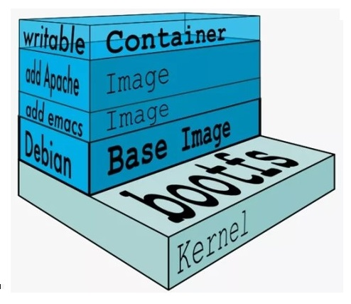

## 3.2 制作镜像commit

提交容器副本使之成为一个新的镜像

例程：对官方的ubuntu扩展vim功能

```bash
# 进入ubuntu容器内部，并打开交互式的命令行（-it）
# 1.更新ubuntu的包管理工具，类似于centos的yum命令
apt-get update
# 2.通过包管理工具安装vim
apt-get -y install vim
# 退出容器ctrl + p + q
# 3.提交容器副本使之成为一个新的镜像
docker commit -m="ubuntu extend vim" -a='khq' 702c56fdc2fa ubuntuVim:0.1

docker images
REPOSITORY             TAG       IMAGE ID       CREATED          SIZE
sifang/ubuntuwithvim   1.1       4e56eda4bb5e   11 seconds ago   178MB
tomcat                 latest    fb5657adc892   7 months ago     680MB
ubuntu                 latest    ba6acccedd29   9 months ago     72.8MB
hello-world            latest    feb5d9fea6a5   10 months ago    13.3kB

# 可以看到新的镜像它的容量变大为178m

```

## 3.3 发布镜像

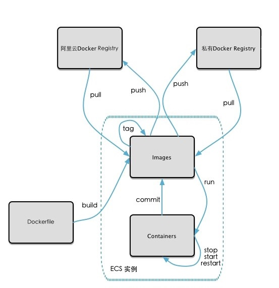

镜像生成方法：dockerfile 和 基于容器commit镜像

### 3.3.1 发布到阿里云

选择控制台=>容器镜像服务=>实例列表=>个人实例=>命名空间=>创建命名空间，创建仓库

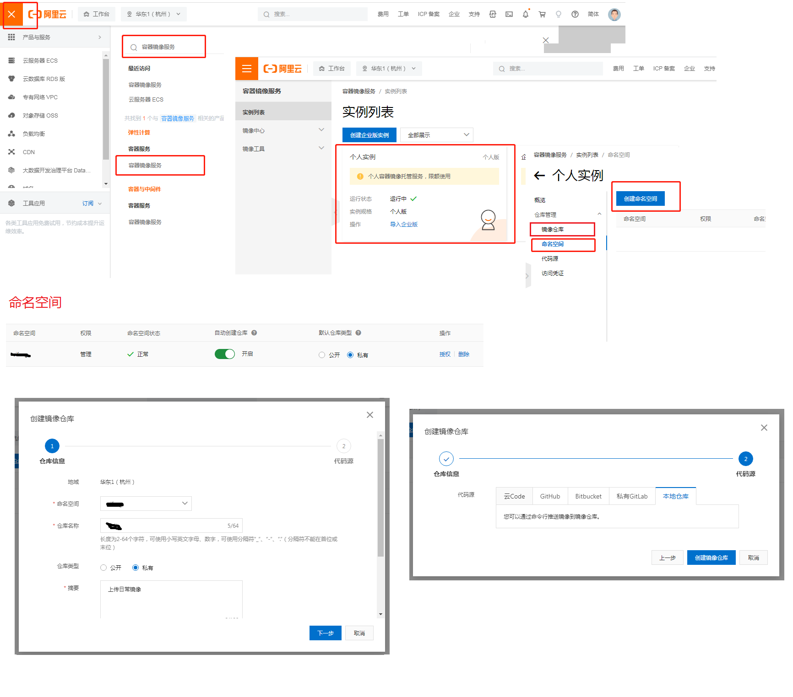

**这里的仓库名就是你的镜像名，而不是可以存放多个镜像的仓库名，所以下面的daily应实际为ubuntuVim**

然后在仓库页面中就会有相应的操作引导，让你的docker服务器与aliyun建立连接

```bash
docker login --username='' registry.cn-hangzhou.aliyuncs.com
password:*****
# 密码可以在个人实例=>访问凭证那里获取
Login Succeeded
# 标记镜像版本号
docker tag [ImageId] registry.cn-hangzhou.aliyuncs.com/sifang/daily:[镜像版本号]
# 推送镜像到阿里云
docker push registry.cn-hangzhou.aliyuncs.com/sifang/daily:[镜像版本号]
The push refers to repository [registry.cn-hangzhou.aliyuncs.com/sifang/daily]
41e8d863aa21: Pushed 
9f54eef41275: Pushed 
1.1: digest: sha256:d1f39fbda865ee5a98ecdd2b37224f3d58081a0a1e347be4eda581af743306a5 size: 741

# 删除本地镜像
docker rmi -f 4e56eda4bb5e

Untagged: sifang/ubuntuwithvim:1.1
Untagged: registry.cn-hangzhou.aliyuncs.com/sifang/daily:1.1
Untagged: registry.cn-hangzhou.aliyuncs.com/sifang/daily@sha256:d1f39fbda865ee5a98ecdd2b37224f3d58081a0a1e347be4eda581af743306a5
Deleted: sha256:4e56eda4bb5efc1fab1591a83cecc3c36d97159a020894056ecee25448757fd4

# 拉取远程服务器镜像
docker pull registry.cn-hangzhou.aliyuncs.com/sifang/daily:1.1
1.1: Pulling from sifang/daily
7b1a6ab2e44d: Already exists 
5579d8edfa40: Already exists 
Digest: sha256:d1f39fbda865ee5a98ecdd2b37224f3d58081a0a1e347be4eda581af743306a5
Status: Downloaded newer image for registry.cn-hangzhou.aliyuncs.com/sifang/daily:1.1
registry.cn-hangzhou.aliyuncs.com/sifang/daily:1.1
[root:17:47@~]docker images
REPOSITORY          TAG       IMAGE ID       CREATED             SIZE
.../sifang/daily   1.1       4e56eda4bb5e   About an hour ago   178MB
tomcat         latest    fb5657adc892   7 months ago        680MB
ubuntu         latest    ba6acccedd29   9 months ago        72.8MB
hello-world    latest    feb5d9fea6a5   10 months ago       13.3kB

# 再次运行镜像
docker run -it 4e56eda4bb5e /bin/bash

```

### 3.3.2 发布到自己的docker私有库

docker.hub 也可以放镜像，但是它是国外的服务器，网络太慢。

dockerhub、阿里云这样的公共镜像仓库可能不太方便，涉及机密的公司，不可能提供镜像给外网，所以需要创建一个本地私人库供团队使用，如同gitlab。

Docker Registry是官方提供的工具，可以用于构建私有镜像仓库。

docker registry 也是镜像，需要pull。

```bash
# 1.pull registry
docker pull registry
docker images
REPOSITORY    TAG       IMAGE ID       CREATED         SIZE
registry      latest    b8604a3fe854   8 months ago    26.2MB

# 2. 启动仓库容器，创建镜像仓库
docker run -d -p 5000:5000 -v /myimage/registry:/tmp/registry --privileged=true registry
# -d 守护进程
# -p 端口映射
# -v host_path:container_path 把容器内外的文件夹进行关联,实现数据同步。
# 即使在容器停止后,容器外挂载目录中文件的修改和添加依然会同步到停止的容器中
# 这是容器数据卷的内容，下面的章节会说到
# 默认情况下，仓库被创建在容器的/var/lib/registry目录下，建议自行用容器卷映射，方便宿主联调
docker ps
CONTAINER ID   IMAGE      COMMAND   				CREATED         STATUS     
0c03542af8b0   registry   "/entrypoint.sh /etc…"	4 seconds ago   Up 3 seconds
PORTS     										NAMES
0.0.0.0:5000->5000/tcp, :::5000->5000/tcp 		eloquent_heyrovsky

# 3. 运行ubuntu官方镜像的容器，并为它扩展ifconfig功能
docker run -it ubuntu /bin/bash
root@ddeea9efd3a4:/# ifconfig
bash: ifconfig: command not found
# 更新ubuntu包管理工具
apt-get update
# 安装ifconfig需要用的包
apt-get install net-tools
 
# 退出容器ctrl + p + q
docker ps
CONTAINER ID   IMAGE      COMMAND     CREATED          STATUS          PORTS    NAMES
ddeea9efd3a4   ubuntu     "/bin/bash"  9 minutes ago    Up 9 minutes     blissful_kalam

# 4.提交容器副本使之成为一个新的镜像
docker commit -m="ubuntu extend ifconfig" -a='khq' ddeea9efd3a4 ubuntuifconfig:0.1
sha256:4945474d6531b42336194e21d690b95f7821a7ec1dc33e8dc8a347f6e6e9c3a6

# 5. 查看私有镜像库中已有镜像的情况
curl -XGET 127.0.0.1:5000/v2/_catalog
{"repositories":[]}

# 6.标记镜像，使其符合私服库镜像的提交规范
docker tag ubuntuifconfig:0.1 127.0.0.1:5000/ubuntuifconfig:0.1
# 可以看到本地又生成了一个镜像，这个镜像是符合提交规范的，但两个镜像的id一模一样
docker images
REPOSITORY                      TAG       IMAGE ID       CREATED          SIZE
127.0.0.1:5000/ubuntuifconfig   0.1       4945474d6531   16 minutes ago   111MB
ubuntuifconfig                  0.1       4945474d6531   16 minutes ago   111MB

# 7.修改配置文件使docker上传镜像支持http
# docker 默认不允许http方式推送镜像，通过配置选项来取消这个限制。修改文成后如果不生效，建议重启docker
cat /etc/docker/daemon.json
# 新增下面一行,确保新增内容后，文件符合json规范
"insecure-registries":["127.0.0.1:5000"]

# 新增后，文件中的内容
{
  "registry-mirrors": ["https://ocx43prw.mirror.aliyuncs.com"],
  "insecure-registries":["127.0.0.1:5000"]
}

# 8.推送镜像
docker push 127.0.0.1:5000/ubuntuifconfig:0.1
The push refers to repository [127.0.0.1:5000/ubuntuifconfig]
9bc421be0601: Pushed 
9f54eef41275: Pushed 
0.1: digest: sha256:da3fad212f802e7aac9a56f249a2e1fe0ac59921065386e8e25023fb5ce81635 size: 741

# 9.验证私服库上有什么镜像
curl -XGET 127.0.0.1:5000/v2/_catalog
{"repositories":["ubuntuifconfig"]}

# 10.pull私服库镜像
docker images
REPOSITORY                      TAG       IMAGE ID       CREATED          SIZE
127.0.0.1:5000/ubuntuifconfig   0.1       4945474d6531   34 minutes ago   111MB
ubuntuifconfig                  0.1       4945474d6531   34 minutes ago   111MB
# 删除本地镜像
docker rmi -f 127.0.0.1:5000/ubuntuifconfig:0.1
# 从私服库中拉取镜像
docker pull 127.0.0.1:5000/ubuntuifconfig:0.1

docker images
REPOSITORY                      TAG       IMAGE ID       CREATED          SIZE
127.0.0.1:5000/ubuntuifconfig   0.1       4945474d6531   40 minutes ago   111MB

docker run -it 4945474d6531 /bin/bash
ifconfig
eth0: flags=4163<UP,BROADCAST,RUNNING,MULTICAST>  mtu 1500
        inet 172.17.0.3  netmask 255.255.0.0  broadcast 172.17.255.255
        ether 02:42:ac:11:00:03  txqueuelen 0  (Ethernet)
        RX packets 7  bytes 586 (586.0 B)
        RX errors 0  dropped 0  overruns 0  frame 0
        TX packets 0  bytes 0 (0.0 B)
        TX errors 0  dropped 0 overruns 0  carrier 0  collisions 0

lo: flags=73<UP,LOOPBACK,RUNNING>  mtu 65536
        inet 127.0.0.1  netmask 255.0.0.0
        loop  txqueuelen 1000  (Local Loopback)
        RX packets 0  bytes 0 (0.0 B)
        RX errors 0  dropped 0  overruns 0  frame 0
        TX packets 0  bytes 0 (0.0 B)
        TX errors 0  dropped 0 overruns 0  carrier 0  collisions 0

```

## 3.4 容器卷

场景需求：run镜像形成容器，希望对容器内数据进行持久化。

docker容器产生的数据，如果不备份，那么当容器实例删除后，容器内的数据自然也就没有了。为了能保存数据在docker中我们使用卷。

卷就是一种目录或文件，存在于一个或多个容器中，由docker挂载到容器。但它不属于unionfs，因此能够绕过unionfs，以提供持续存储或共享数据的特性。

卷设计的目的就是数据持久化，完全独立于容器的生存周期，因此docker不会在容器删除时，删除其挂载的数据卷。

容器卷的意义在于，将容器内的重要数据同步备份到宿主机，而使数据不会因容器的消失而消失。

特点：

1. 数据卷可在容器之间共享或重用数据
2. 容器中数据的更改可以实时同步到宿主机的卷中
3. 数据卷中的更改不会包含在镜像的更新中
4. 数据卷的生命周期一直持续到没有容器使用它为止。

```bash
docker run -it --privileged=true -v host_path:container_path image_name
# -v volume 数据卷，v参数可以有多个，用于不同地址间的映射
# docker 会默认在对应的path创建相应的文件夹，所以不需要事先创建文件夹
```

**关于privileged的错误**

docker挂载主机目录访问如果出现：cannot open directory：permission denied

解决办法：在挂载的目录后多加一个`--privileged=true`参数即可。

centos7安全模块会比之前系统版本加强，不安全的会先禁止，所以目录挂载情况会被默认为不安全的行为。

在SElinux里面挂载目录被禁止掉了，如果要开启，我们一般会使用`--privileged=true`命令，扩大容器的权限解决挂载目录没有权限的问题，也即使用该参数，container内的root就会拥有真正的root权限，否则，container内的root只是外部一个普通用户的权限。

```bash
# 1.启动容器，并添加容器卷，
docker run -it --privileged=true -v /tmp/host_data:/tmp/container_data  --name=u1 ubuntu
# 数据的变更在这两个映射的文件夹中，是双向绑定的，是互为同步的。
# 在host中修改，会同步到container中
# 在container中修改，会同步到host中
# docker stop后，host修改，容器start后，再进入容器查看，可以看到同步依然存在。

# 2.查看容器卷是否挂载成功
docker inspect container_id
···
        "Mounts": [
            {
                "Type": "bind",
                "Source": "/tmp/host_data",
                "Destination": "/tmp/container_data",
                "Mode": "",
                "RW": true,
                "Propagation": "rprivate"
            }
        ],

···

# 3.容器读写权限
docker run -it --privileged=true -v /tmp/host_data:/tmp/container_data:container_right  --name=u1 ubuntu
# container_right:默认读写（rw），可以不写，双向绑定
# ro，read_only，宿主机可以读写，容器只能读取不能写

# 4.容器间数据共享
# 也可以称作容器卷规则继承，停止u1，并不会影响u2容器的规则
docker run -it --privileged=true --volumes-from u1 --name=u2 ubuntu
```

# 4 常用软件安装

## 4.1 安装tomcat

```bash
# 安装任何一个程序，都需要查看宿主机是否有相应的应用程序开着，以及相应的端口是否被占用
ps -ef | grep tomcat
ps -ef | grep mysql

# 1.安装tomcat
# 因为最新版的tomcat镜像，在run以后无法通过访问地址直接看到tom猫，是因为官网最新的包安装后，在webapps里面没有内容了，它转移到webapps.dist里面去了，如果要想看到猫，那么需要将webapp删除，将webapp.dist重新命名为webapps即可。
# 下面所用的包不是官网最新的tomcat，而用的是其他域下老的版本，这样就无需修改webapps
docker pull billygoo/tomcat8-jdk8
docker run -d -p 8080:8080 --name mytomcat8 billygoo/tomcat8-jdk8

```

## 4.2 安装mysql

```bash
# 安装教程：https://blog.csdn.net/qq_46122292/article/details/125001047
# 查看是否被占用，下面即无mysql应用，端口未被占用
ps -ef | grep mysql
root     3107717 2929217  0 11:10 pts/0    00:00:00 grep --color=auto mysql
# 拉取镜像
docker pull mysql:5.7
# 启动mysql，启动的命令需要在hub.docker 搜索mysql，然后在how to use this image锚点查看
docker run -d 
-p 3306:3306 
--name mysql 
privileged=true 
-v /mysqldata/mysql/log:/var/log/mysql  
-v /mysqldata/mysql/data:/var/lib/mysql  
-v /mysqldata/mysql/conf:/etc/mysql 
-e MYSQL_ROOT_PASSWORD=root  mysql:5.7

# 修改mysql配置
cd /mysqldata/mysql/conf
touch my.conf
vim my.conf
# 解决中文乱码
# 修改字符集，否则插入中文数据会报错
#[client]
#default_character_set=utf8
#[mysqld]
#collation_server = utf8_general_ci
#character_set_server = utf8
docker restart mysql
docker ps

# 重新进入mysql
docker exec -it 07e4249aac56 /bin/bash
# 登录数据库
mysql -uroot -proot
show databases;
+--------------------+
| Database           |
+--------------------+
| information_schema |
| mysql              |
| performance_schema |
| sys                |
+--------------------+
4 rows in set (0.00 sec)

# create database db01;
# use db01;
# create table t1(id int, name varchar(20));
# show tables;
# insert into t1 values(1, 'q1');
# select * from t1;
+------+------+
| id   | name |
+------+------+
|    1 | q1   |
+------+------+
# 通过navcat连接记得把3306的防火墙打开
```

## 4.3 安装redis

```bash
docker pull redis:6.0.8
mkdir -p /app/redis
# 提前准备好一个redis.conf 配置文件，然后复制到上面建的文件夹
cp /myredis/redis.conf /app/redis/
cd /app/redis
# 修改redis.conf文件
vim redis.conf
# 解注释
bind 127.0.0.1
daemonize no # 必须改成no，因为该配置和docker run -d参数冲突，会导致容器一直启动失败。

docker run
-p 6379:6379
--name myr3
--privileged=true
-v /app/redis/redis.conf:/etc/redis/redis.conf
-v /app/redis/data:/data
-d redis:6.0.8 redis-server /etc/redis/redis.conf

docker ps
docker exec -it myr3 /bin/bash

```

# 5 [dockerfile](https://docs.docker.com/engine/reference/builder/)

dockerfile是用来构建docker镜像的文本文件，是一条条构建镜像所需的指令和参数构成的脚本。

之前做扩展，做一次扩展，commit一次，提交记录就会很多，能不能给我一个扩展清单，我全部扩展完毕之后再commit，这就是dockerfile的场景。

dockerfile构建镜像三步骤

1. 编写dockerfile文件
2. docker build
3. docker run

## 5.1 dockerfile构建过程

dockerfile内容基础：

1. 每条保留字指令都必须为大写字母且后面要跟随至少一个参数
2. 指令按照从上到下，顺序执行
3. #表示注释
4. 每条指令都会创建一个新的镜像层并对镜像进行提交

docker执行dockerfile的大致流程：     

1. docker从基础镜像运行一个容器
2. 执行一条指令并对容器作出修改
3. 执行类似docker commit的操作提交一个新的镜像层
4. docker再基于刚提交的镜像运行一个新容器
5. 执行dockerfile中的下一条指令直到所有指令都执行完成

## 5.2 dockerfile 常用保留字

| 保留字                                                       | 说明                                                         |
| ------------------------------------------------------------ | ------------------------------------------------------------ |
| **FROM**                                                     | 1. 基础镜像，当前镜像是基于哪个镜像，<br />2. 指定一个已经存在的镜像作为模板<br />3. 第一行必须是FROM |
| **MAINTAINER**                                               | 镜像维护者的姓名和邮箱地址                                   |
| **RUN**                                                      | 1.容器构建时，需要运行的shell脚本命令<br />2.RUN在docker build时运行 |
| **EXPOSE**                                                   | 当前容器对外暴露的端口                                       |
| **WORKDIR**                                                  | 1.指定在创建容器后，终端默认登录进来工作目录<br />2.就是-it进入时默认的工作目录 |
| **USER**                                                     | 1.指定该镜像以什么样的用户去执行，<br />2. 如果都不指定，默认root |
| **ENV**                                                      | 1.用来在构建镜像过程中设置的环境变量<br />2.ENV key1 val1<br />3.引用时：$key1 |
| **ADD**                                                      | 1.将**宿主机目录**下的文件copy进镜像<br />2.可自动处理URL和解压tar压缩包 |
| **COPY**                                                     | 1.类似于ADD，copy文件和目录到镜像中<br />2.从**构建的上下文目录**中，源路径的文件复制到新的一层的镜像内的目标路径 |
| **CMD**                                                      | 1.指定容器启动后要运行的命令<br />2.dockerfile中可以有多个CMD，但只有最后一个生效<br />3.CMD会被docker run之后的命令参数替换，例如docker run ... /bin/bash<br />4.和RUN的区别：CMD是在docker run时运行，RUN是在docker build时运行 |
| **ENTRYPOINT**                                               | 1.指定容器启动后要运行的命令<br />2.类似于CMD指令，但ENTRYPOINT不会被docker run后面的命令覆盖，实际上，它也可以被**--entrypoint**参数所覆盖<br />3.当指定了ENTRYPOINT后，CMD的含义就发生了变化，不再是直接运行其命令而是将CMD的内容作为参数传递给ENTRYPOINT指令，他们两个就会变成\<ENTRYPOINT> "\<CMD>"。<br />4.因为CMD会被docker run之后的命令参数替换，所以两者经常一起使用，作为命令**变参执行使用** |
| **VOLUMN**                                                   | 容器卷挂载                                                   |
| [**ARG**](https://blog.csdn.net/qq_38220908/article/details/126667781) | ARG指令用于定义一个变量，用户可以在构建Docker镜像的时候，使用 --build-arg 定义变量的值。<br />`docker build --build-arg username=QQQ -t myapp:tag-v0.0.1 .`<br />`FROM ubuntu    ARG username    RUN echo $username` |
|                                                              |                                                              |

[Dockerfile中CMD和ENTRYPOINT的区别](https://zhuanlan.zhihu.com/p/138301581)

[docker 利用CMD或者ENTRYPOINT命令同时启动多个服务](https://blog.csdn.net/bocai_xiaodaidai/article/details/92641534)

容器中多个服务，前面的服务需后台运行（&），最后一个服务需前台运行。

若全部以前台运行的话，只有第一个服务会启动；

若全部以后台运行的话，当最后一个服务执行完成后，容器就退出了。

## 5.3 案例

**在centos上安装vim、ifconfig、jdk8**

```dockerfile
# 文件名一定要使Dockerfile，首字母一定大写
FROM centos
MAINTAINER zzyy<zzyybs@126.com>
 
ENV MYPATH /usr/local
WORKDIR $MYPATH
 
#安装vim编辑器
RUN yum -y install vim
#安装ifconfig命令查看网络IP
RUN yum -y install net-tools
#安装java8及lib库
RUN yum -y install glibc.i686
RUN mkdir /usr/local/java
#ADD 是相对路径jar,把jdk-8u171-linux-x64.tar.gz添加到容器中,安装包必须要和Dockerfile文件在同一位置
ADD jdk-8u171-linux-x64.tar.gz /usr/local/java/
#配置java环境变量
ENV JAVA_HOME /usr/local/java/jdk1.8.0_171
ENV JRE_HOME $JAVA_HOME/jre
ENV CLASSPATH $JAVA_HOME/lib/dt.jar:$JAVA_HOME/lib/tools.jar:$JRE_HOME/lib:$CLASSPATH
ENV PATH $JAVA_HOME/bin:$PATH
 
EXPOSE 80
CMD echo $MYPATH
CMD echo "success--------------ok"
CMD /bin/bash
# 只有最后一个CMD生效

```

```bash
# 构建镜像
docker build -t ubuntujava8:1.0 .
# ubuntujava8 新镜像的名字， 1.0 镜像的版本
# tag后面有一个点“.”，使用当前目录的Dockerfile进行编译镜像

# -f 显示指定构建镜像的 Dockerfile 文件（Dockerfile 可不在当前路径下），
# 如果不使用 -f，则默认将上下文路径下的名为 Dockerfile 的文件认为是构建镜像的 "Dockerfile" 。


# docker build成功后，就可以在docker images 里看到刚刚build成功的镜像。
```

`docker build `每失败一次就会在`docker ps -a`中看到一些不寻常的东西

```bash
CONTAINER ID   IMAGE          COMMAND                  CREATED              STATUS                        PORTS                                                  NAMES
46b53789d1ca   144339675590   "/bin/sh -c 'apt-get…"   About a minute ago   Exited (100) 58 seconds ago                                                          peaceful_bhaskara
34ba71d9bf4c   f501aec82eca   "/bin/sh -c 'apt-get…"   8 minutes ago        Exited (100) 8 minutes ago                                                           thirsty_dijkstra
e552ba402835   491eae041534   "/bin/sh -c 'apt ins…"   13 minutes ago       Exited (100) 13 minutes ago                                                          unruffled_euclid
67faddf36baf   491eae041534   "/bin/sh -c 'yum -y …"   20 minutes ago       Exited (127) 20 minutes ago  
```

## 5.4 虚悬镜像

虚悬镜像就是仓库名和tag都为`<none>`的镜像

如果将上面的**Dockerfile**中的**FROM centos**修改为**FROM ubuntu**， 那么此时构建会失败，就会在执行**docker images**看见虚悬镜像。

虚悬镜像会占用内存，有时会造成意想不到的错误。

```bash
# 修改为FROM ubuntu，然后执行一次docker build，build肯定会失败，然后出现下面的结果
# 查看是否有虚悬镜像，查看所有的虚悬镜像
docker image ls -f dangling=true
REPOSITORY                      TAG       IMAGE ID       CREATED          SIZE
<none>                          <none>    144339675590   23 minutes ago   180MB
# 删除所有的虚悬镜像
docker image prune
WARNING! This will remove all dangling images.
Are you sure you want to continue? [y/N] y
Deleted Images:
deleted: sha256:144339675590d951679dab8ca844f309b87fe0d240944ebe89a5db57db2bcf39
deleted: sha256:27fdfca96fd9e8de28d518d4fb835ad21713cf2b8c3c5e18111e9723fa4bf2d1
deleted: sha256:cee1370811f44107f4b3ae0fae5075e059aa9095f641152fc763e6a9b170938b
deleted: sha256:6fe1dd324b75a4b82819b05f541b427dd51cf6926778725ca2fb79618de193bd
deleted: sha256:f501aec82eca1b7630a51c36908d946b15dc11019d7e43fdc02c7988c280e056
deleted: sha256:a97bbd75086d10436607be591966137b80911ccc6ce559fd3c34db5a5f9ebb3e
deleted: sha256:491eae041534201138d1682a3dd7446162ad985c6a61cc38459e9a4ae5644554
deleted: sha256:d11ae435470f0ec96c73e44d9140b638001b11d9d3a65adec5cdaf391f40106a
deleted: sha256:2cca0565511280911f7817b4656cb8cc14a6e1df3c94a8a37b69b25f54535c1f

Total reclaimed space: 106.8MB

```

# 6 docker网络

作用：

1. 容器间的互联和通信以及端口映射
2. 容器ip变动的时候可以通过网络服务名直接进行网络通信

```bash
# 查看network有哪些命令
docker network --help

Usage:  docker network COMMAND

Manage networks

Commands:
  connect     Connect a container to a network
  create      Create a network
  disconnect  Disconnect a container from a network
  inspect     Display detailed information on one or more networks
  ls          List networks
  prune       Remove all unused networks
  rm          Remove one or more networks

Run 'docker network COMMAND --help' for more information on a command.

# 查看有哪些网络
docker network ls
NETWORK ID     NAME      DRIVER    SCOPE
f7907a8ad8ac   bridge    bridge    local
cdca579c26ad   host      host      local
9edddacf5ef8   none      null      local


```

## 6.1 网络模式

| 网络模式  | 简介                                                         | 使用                                                         |
| --------- | ------------------------------------------------------------ | ------------------------------------------------------------ |
| bridge    | 为每一个容器分配、设置ip<br />并将容器连接到一个docker0的虚拟网桥<br />默认为该模式 | 在docker run的时候，<br />使用`--network bridge`指定，默认使用docker0 |
| host      | 容器不会虚拟出自己的网卡，配置自己的ip等，<br />而是直接使用宿主机的ip和端口 | `--network host`                                             |
| none      | 容器有独立的network namespace，但并没有对其进行任何网络配置  | `--network none`                                             |
| container | 新创建的容器不会创建自己的网卡和配置自己的ip，<br />而是和一个指定的容器共享ip、端口范围等 | `--network container:name_or_id`                             |
|           |                                                              |                                                              |

### bridge

Docker服务默认会创建一个docker0网桥（其上有一个docker0内部接口），该桥接网络的名称为docker0，它在内核层联通了其他的物理或虚拟网卡，这就将所有容器和本地主机都放到同一物理网络。Docker默认指定了docker0接口的ip地址和子网掩码，**让主机和容器之间可以通过网桥相互通信**。

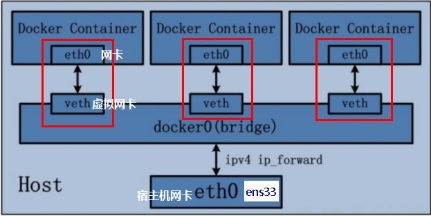

```bash
# 默认--net-work是bridge
docker run -d -p 8081:8080 --name tomcat81 billygoo/tomcat8-jdk8
docker run -d -p 8082:8080 --name tomcat82 billygoo/tomcat8-jdk8

# 在宿主机查看ip地址
ip addr
# loop back 回环地址，127.0.0.1
1: lo: <LOOPBACK,UP,LOWER_UP> mtu 65536 qdisc noqueue state UNKNOWN group default qlen 1000
    link/loopback 00:00:00:00:00:00 brd 00:00:00:00:00:00
    inet 127.0.0.1/8 scope host lo
       valid_lft forever preferred_lft forever
    inet6 ::1/128 scope host 
       valid_lft forever preferred_lft forever
# 宿主机ip
2: eth0: <BROADCAST,MULTICAST,UP,LOWER_UP> mtu 1500 qdisc mq state UP group default qlen 1000
    link/ether 52:54:00:ac:42:c1 brd ff:ff:ff:ff:ff:ff
    inet 10.0.4.8/22 brd 10.0.7.255 scope global noprefixroute eth0
       valid_lft forever preferred_lft forever
    inet6 fe80::5054:ff:feac:42c1/64 scope link noprefixroute 
       valid_lft forever preferred_lft forever
# docker网桥
3: docker0: <BROADCAST,MULTICAST,UP,LOWER_UP> mtu 1500 qdisc noqueue state UP group default 
    link/ether 02:42:94:23:20:12 brd ff:ff:ff:ff:ff:ff
    inet 172.17.0.1/16 brd 172.17.255.255 scope global docker0
       valid_lft forever preferred_lft forever
    inet6 fe80::42:94ff:fe23:2012/64 scope link 
       valid_lft forever preferred_lft forever
# 虚拟网卡1
75: vethb267661@if74: <BROADCAST,MULTICAST,UP,LOWER_UP> mtu 1500 qdisc noqueue master docker0 state UP group default 
    link/ether 6e:64:75:e5:10:64 brd ff:ff:ff:ff:ff:ff link-netnsid 0
    inet6 fe80::6c64:75ff:fee5:1064/64 scope link 
       valid_lft forever preferred_lft forever
# 虚拟网卡2
77: veth14815b2@if76: <BROADCAST,MULTICAST,UP,LOWER_UP> mtu 1500 qdisc noqueue master docker0 state UP group default 
    link/ether de:3d:41:76:f0:3b brd ff:ff:ff:ff:ff:ff link-netnsid 1
    inet6 fe80::dc3d:41ff:fe76:f03b/64 scope link 
       valid_lft forever preferred_lft forever


# 在tomcat81容器中查看
docker exec -it tomcat81 bash
ip addr

1: lo: <LOOPBACK,UP,LOWER_UP> mtu 65536 qdisc noqueue state UNKNOWN group default qlen 1000
    link/loopback 00:00:00:00:00:00 brd 00:00:00:00:00:00
    inet 127.0.0.1/8 scope host lo
       valid_lft forever preferred_lft forever
# 与宿主机的虚拟网卡1是成对存在的
74: eth0@if75: <BROADCAST,MULTICAST,UP,LOWER_UP> mtu 1500 qdisc noqueue state UP group default 
    link/ether 02:42:ac:11:00:02 brd ff:ff:ff:ff:ff:ff link-netnsid 0
    inet 172.17.0.2/16 brd 172.17.255.255 scope global eth0
       valid_lft forever preferred_lft forever

# 在tomcat82容器中查看
docker exec -it tomcat82 bash
ip addr
1: lo: <LOOPBACK,UP,LOWER_UP> mtu 65536 qdisc noqueue state UNKNOWN group default qlen 1000
    link/loopback 00:00:00:00:00:00 brd 00:00:00:00:00:00
    inet 127.0.0.1/8 scope host lo
       valid_lft forever preferred_lft forever
# 与宿主机的虚拟网卡2是成对存在的
76: eth0@if77: <BROADCAST,MULTICAST,UP,LOWER_UP> mtu 1500 qdisc noqueue state UP group default 
    link/ether 02:42:ac:11:00:03 brd ff:ff:ff:ff:ff:ff link-netnsid 0
    inet 172.17.0.3/16 brd 172.17.255.255 scope global eth0
       valid_lft forever preferred_lft forever
```


1. Docker使用Linux桥接，在宿主机虚拟一个Docker容器网桥(docker0)，Docker启动一个容器时会根据Docker网桥的网段分配给容器一个IP地址，称为Container-IP，同时Docker网桥是每个容器的默认网关。因为在同一宿主机内的容器都接入同一个网桥，这样容器之间就能够通过容器的Container-IP直接通信。
2. docker run 的时候，没有指定network的话默认使用的网桥模式就是bridge，使用的就是docker0。在宿主机ifconfig,就可以看到docker0和自己create的network(后面讲)eth0，eth1，eth2……代表网卡一，网卡二，网卡三……，lo代表127.0.0.1，即localhost，inet addr用来表示网卡的IP地址
3.  网桥docker0创建一对对等虚拟设备接口一个叫veth，另一个叫eth0，成对匹配。
   - 整个宿主机的网桥模式都是docker0，类似一个交换机有一堆接口，每个接口叫veth，在本地主机和容器内分别创建一个虚拟接口，并让他们彼此联通（这样一对接口叫veth pair）；
   - 每个容器实例内部也有一块网卡，每个接口叫eth0；
   -  docker0上面的每个veth匹配某个容器实例内部的eth0，两两配对，一一匹配。

 通过上述，将宿主机上的所有容器都连接到这个内部网络上，两个容器在同一个网络下,会从这个网关下各自拿到分配的ip，此时两个容器的网络是互通的。

### host

容器将不再获得一个独立的network namespace，而是和宿主机共用一个network namespace，容器将不会虚拟出自己的网卡，而直接使用宿主机的ip和端口。

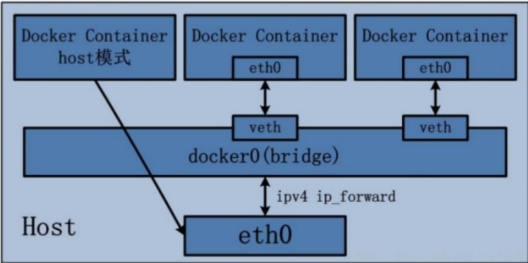

```bash
docker run -d -p 8083:8080 --network host --name toncat83 billygoo/tomcat8-jdk8
# docker启动时指定--network=host或-net=host，
# 如果还指定了-p映射端口，那这个时候就会有警告，如果不写端口映射就不会有警告
# 并且通过-p设置的参数将不会起到任何作用，端口将会占用宿主机的端口，重复时则递增。
WARNING: Published ports are discarded when using host network mode
1b62f6e0d4f19a8e109887593500f00fb1dea2c131e2d7494cf877644c0a9b7f
# docker ps可以看到port那一列，是空的
docker ps
CONTAINER ID   IMAGE         COMMAND     CREATED        STATUS    PORTS          NAMES
1b62f6e0d4f1   billygoo/tomcat8-jdk8   "catalina.sh run"   About a minute ago   Up About a minute                     toncat83
# 进入容器内部查看ip
ip addr
1: lo: <LOOPBACK,UP,LOWER_UP> mtu 65536 qdisc noqueue state UNKNOWN group default qlen 1000
    link/loopback 00:00:00:00:00:00 brd 00:00:00:00:00:00
    inet 127.0.0.1/8 scope host lo
       valid_lft forever preferred_lft forever
    inet6 ::1/128 scope host 
       valid_lft forever preferred_lft forever
2: eth0: <BROADCAST,MULTICAST,UP,LOWER_UP> mtu 1500 qdisc mq state UP group default qlen 1000
    link/ether 52:54:00:ac:42:c1 brd ff:ff:ff:ff:ff:ff
    inet 10.0.4.8/22 brd 10.0.7.255 scope global noprefixroute eth0
       valid_lft forever preferred_lft forever
    inet6 fe80::5054:ff:feac:42c1/64 scope link noprefixroute 
       valid_lft forever preferred_lft forever
3: docker0: <BROADCAST,MULTICAST,UP,LOWER_UP> mtu 1500 qdisc noqueue state UP group default 
    link/ether 02:42:94:23:20:12 brd ff:ff:ff:ff:ff:ff
    inet 172.17.0.1/16 brd 172.17.255.255 scope global docker0
       valid_lft forever preferred_lft forever
    inet6 fe80::42:94ff:fe23:2012/64 scope link 
       valid_lft forever preferred_lft forever
# tomcat81 veth
75: vethb267661@if74: <BROADCAST,MULTICAST,UP,LOWER_UP> mtu 1500 qdisc noqueue master docker0 state UP group default 
    link/ether 6e:64:75:e5:10:64 brd ff:ff:ff:ff:ff:ff link-netnsid 0
    inet6 fe80::6c64:75ff:fee5:1064/64 scope link 
       valid_lft forever preferred_lft forever
# tomcat82 veth
77: veth14815b2@if76: <BROADCAST,MULTICAST,UP,LOWER_UP> mtu 1500 qdisc noqueue master docker0 state UP group default 
    link/ether de:3d:41:76:f0:3b brd ff:ff:ff:ff:ff:ff link-netnsid 1
    inet6 fe80::dc3d:41ff:fe76:f03b/64 scope link 
       valid_lft forever preferred_lft forever

# 查看toncat83 的情况
docker inspect toncat83 | tail -n 20
            "Networks": {
                "host": {
                    "IPAMConfig": null,
                    "Links": null,
                    "Aliases": null,
                    "NetworkID": "cdca579c26ad7d6967958ad331a88debacf62fa4a60d41ea33f1f6a3c61814a2",
                    "EndpointID": "7dac0c332605e4a169b14279fd463ac946a34475da84c556168cdc2387c18fef",
                    
                    # 网管和ip都没有了，然而tomcat81，和tomcat82都有自己的ip和网关
                    "Gateway": "",
                    "IPAddress": "",
                    "IPPrefixLen": 0,
                    "IPv6Gateway": "",
                    "GlobalIPv6Address": "",
                    "GlobalIPv6PrefixLen": 0,
                    "MacAddress": "",
                    "DriverOpts": null
                }
            }

```

### none

禁用网络功能，只有lo回环网络。

在none模式下，并不为Docker容器进行任何网络配置，也就是说这个Docker容器没有网卡，ip，路由等信息，只有一个lo，需要我们自己为Docker 容器添加网卡、配置ip等

### container

新建的容器和已经存在的一个容器共享一个网络ip配置而不是和宿主机共享。新创建的容器不会创建自己的网卡，配置自己的IP，而是和一个指定的容器共享IP、端口范围等。同样，两个容器除了网络方面，其他的如文件系统、进程列表等还是隔离的。

网络宿主容器一旦被关掉，网络寄生容器的网络就只有lo了。

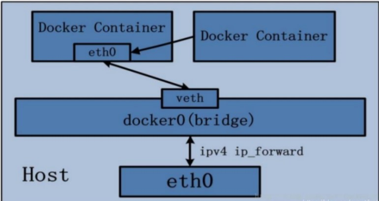

```bash

```

```bash
# 查看bridge网络的细节
docker network inspect bridge

[
    {
    	# 网络名称
        "Name": "bridge",
        
        "Id": "f7907a8ad8acb243dc320f63044bbddedc17a109073aed4b8fdcee876fa2aafa",
        "Created": "2022-07-20T21:38:12.757367256+08:00",
        # 
        "Scope": "local",
        "Driver": "bridge",
        
        "EnableIPv6": false,
        "IPAM": {
            "Driver": "default",
            "Options": null,
            "Config": [
                {
                    "Subnet": "172.17.0.0/16",
                    "Gateway": "172.17.0.1"
                }
            ]
        },
        "Internal": false,
        "Attachable": false,
        "Ingress": false,
        "ConfigFrom": {
            "Network": ""
        },
        "ConfigOnly": false,
        
        # 在这个网络模式下的容器
        "Containers": {
            "07e4249aac564e464a3b59b95ebe89c80dc0131cb76bc1a5fcb85f6b2f49155c": {
                "Name": "mysql",
                "EndpointID": "9fdc1c3ab7e3c56e9fa2b03e806b415047f5707279edb035956313c8e75272ae",
                "MacAddress": "02:42:ac:11:00:03",
                "IPv4Address": "172.17.0.3/16",
                "IPv6Address": ""
            },
            "0c03542af8b09f898b8bbbf77b91a93b77ceea3423a1598780e895e61f0ff7b0": {
                "Name": "eloquent_heyrovsky",
                "EndpointID": "4b0c14764e411d1f09a4288781cd92a2f245baef6ee1f894f4f90a2471b2c47e",
                "MacAddress": "02:42:ac:11:00:02",
                "IPv4Address": "172.17.0.2/16",
                "IPv6Address": ""
            },
            "4d5b57bb780aa5b25997a2bcf217252c4ea52099da5a9eacf1fbb200895637b1": {
                "Name": "u3",
                "EndpointID": "e591d1e468290b6f5f070bbfa28b1596a6a018a1baff1081494ce19e64955140",
                "MacAddress": "02:42:ac:11:00:05",
                "IPv4Address": "172.17.0.5/16",
                "IPv6Address": ""
            },
            "63d9e6a511de167791375611056593fe1fe0e5d3c28b0c860110e657b03e474b": {
                "Name": "u1",
                "EndpointID": "544406774a6005d568f3d181fd3177a4c312d97e1e6f2eac0739677c3dcc6920",
                "MacAddress": "02:42:ac:11:00:04",
                "IPv4Address": "172.17.0.4/16",
                "IPv6Address": ""
            }
        },
        "Options": {
            "com.docker.network.bridge.default_bridge": "true",
            "com.docker.network.bridge.enable_icc": "true",
            "com.docker.network.bridge.enable_ip_masquerade": "true",
            "com.docker.network.bridge.host_binding_ipv4": "0.0.0.0",
            
            "com.docker.network.bridge.name": "docker0",
            
            "com.docker.network.driver.mtu": "1500"
        },
        "Labels": {}
    }
]

```

## 6.2 自定义网络

```bash
# 启动一个容器u1，查看网络情况
docker run -it --name u1 ubuntu /bin/bash
docker inspect u1 | tail -n 20
"Networks": {
                "bridge": {
                    "IPAMConfig": null,
                    "Links": null,
                    "Aliases": null,
                    "NetworkID": "f7907a8ad8acb243dc320f63044bbddedc17a109073aed...",
                    "EndpointID": "544406774a6005d568f3d181fd3177a4c312d97e1e6f2...",
                    "Gateway": "172.17.0.1",
                    "IPAddress": "172.17.0.4",
                    "IPPrefixLen": 16,
                    "IPv6Gateway": "",
                    "GlobalIPv6Address": "",
                    "GlobalIPv6PrefixLen": 0,
                    "MacAddress": "02:42:ac:11:00:04",
                    "DriverOpts": null
                }
             }
# 启动一个容器u2，查看网络情况
docker run -it --name u2 ubuntu /bin/bash
docker inspect u2 | tail -n 20
            "Networks": {
                "bridge": {
                    "IPAMConfig": null,
                    "Links": null,
                    "Aliases": null,
                    "NetworkID": "f7907a8ad8acb243dc320f63044bbddedc17a109073aed4b8...",
                    "EndpointID": "e591d1e468290b6f5f070bbfa28b1596a6a018a1baff1081...",
                    "Gateway": "172.17.0.1",
                    "IPAddress": "172.17.0.5",
                    "IPPrefixLen": 16,
                    "IPv6Gateway": "",
                    "GlobalIPv6Address": "",
                    "GlobalIPv6PrefixLen": 0,
                    "MacAddress": "02:42:ac:11:00:05",
                    "DriverOpts": null
                }
            }
# 并随后关闭u2
docker kill u2

# 启动一个容器u3，查看网络情况
docker run -it --name u3 ubuntu /bin/bash
docker inspect u3 | tail -n 20
            "Networks": {
                "bridge": {
                    "IPAMConfig": null,
                    "Links": null,
                    "Aliases": null,
                    "NetworkID": "f7907a8ad8acb243dc320f63044bbddedc17a109073aed4b8...",
                    "EndpointID": "e591d1e468290b6f5f070bbfa28b1596a6a018a1baff1081...",
                    "Gateway": "172.17.0.1",
                    "IPAddress": "172.17.0.5",
                    "IPPrefixLen": 16,
                    "IPv6Gateway": "",
                    "GlobalIPv6Address": "",
                    "GlobalIPv6PrefixLen": 0,
                    "MacAddress": "02:42:ac:11:00:05",
                    "DriverOpts": null
                }
            }
# 发现u3的ip地址和u2未宕机之前的一致。
# u2的地址在u2宕机后又给了u3
# 这就会导致访问同一个ip，却享用的不是同一个服务
# 结论：docker容器的ip地址可能会改变
```

所以通过ip去访问服务，是不稳定的。

```bash
# 1.通过network create 创建自定义网络，默认驱动模式mode是bridge，--driver 或 -d 指定
# docker network create [-d network_mode] self_defined_net 
docker network create -d bridge qq_net 
# 2.在指定的网络名下运行容器
docker run -d -p 8081:8080 --network qq_net --name tomcat81 billygoo/tomcat8-jdk8
docker run -d -p 8082:8080 --network qq_net --name tomcat82 billygoo/tomcat8-jdk8

# 3.进入tomcat81
docker exec -it tomcat81 /bin/bash
# 查看ip
ip addr
1: lo: <LOOPBACK,UP,LOWER_UP> mtu 65536 qdisc noqueue state UNKNOWN group default qlen 1000
    link/loopback 00:00:00:00:00:00 brd 00:00:00:00:00:00
    inet 127.0.0.1/8 scope host lo
       valid_lft forever preferred_lft forever
79: eth0@if80: <BROADCAST,MULTICAST,UP,LOWER_UP> mtu 1500 qdisc noqueue state UP group default 
    link/ether 02:42:ac:12:00:02 brd ff:ff:ff:ff:ff:ff link-netnsid 0
    inet 172.18.0.2/16 brd 172.18.255.255 scope global eth0
       valid_lft forever preferred_lft forever

# 4.在同一个网络下，可以通过容器名(服务名)相互通信，
# 记住这一点，服务名到时候需要写在application.yml里，
# 通过tomcat:8081就能访问对应的服务，而不需要写10.80.3.123:8081，因为宕机会造成ip改变。
ping tomcat2
```

# 7 容器编排compose

docker-compose是docker官方的开源项目，负责实现对docker容器集群的快速编排。

compose是docker公司推出的一个工具软件，可以管理多个Docker容器组成一个应用。你需要定义一个YAML格式的配置文件docker-compose.yml，**写好多个容器之间的调用关系**。然后，一个命令就能同时启动/关闭这些容器。

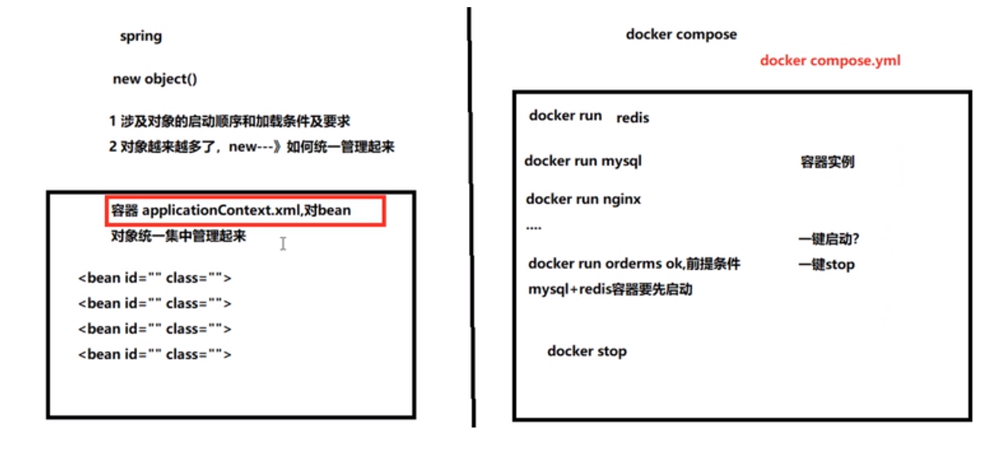

compose允许用户通过一个单独的docker-compose.yml模板文件来定义一组相关的应用容器为一个项目。

## 7.1 [安装](https://www.cnblogs.com/LeeYi59/p/14529680.html)

```bash
curl -L "https://github.com/docker/compose/releases/download/1.29.2/docker-compose-$(uname -s)-$(uname -m)" -o /usr/local/bin/docker-compose
 % Total    % Received % Xferd  Average Speed   Time    Time     Time  Current
                                 Dload  Upload   Total   Spent    Left  Speed
  0     0    0     0    0     0      0      0 --:--:--  0:00:03 --:--:--     0
100 12.1M  100 12.1M    0     0  25713      0  0:08:15  0:08:15 --:--:-- 51503

sudo chmod +x /usr/local/bin/docker-compose

docker-compose --version
docker-compose version 1.29.2, build 5becea4c

docker-compose -h                           # 查看帮助
docker-compose up                           # 启动所有docker-compose服务
docker-compose up -d                        # 启动所有docker-compose服务并后台运行
docker-compose down                         # 停止并删除容器、网络、卷、镜像。
docker-compose exec  yml里面的服务id                 # 进入容器实例内部  docker-compose exec docker-compose.yml文件中写的服务id /bin/bash
docker-compose ps                      # 展示当前docker-compose编排过的运行的所有容器
docker-compose top                     # 展示当前docker-compose编排过的容器进程
 
docker-compose logs  yml里面的服务id     # 查看容器输出日志
docker-compose config     # 检查配置
docker-compose config -q  # 检查配置，有问题才有输出
docker-compose restart   # 重启服务
docker-compose start     # 启动服务
docker-compose stop      # 停止服务


```

## 7.2 核心概念

一个文件，docker-compose.yml

两个要素：

1. 服务（service），一个个应用容器实例，比如：订单微服务，库存微服务，mysql容器，nginx容器
2. 工程（project），有一组关联的应用容器组成的一个完整业务单元，在docker-compose.yml中定义

compose使用步骤：

1. dockerfile定义镜像文件
2. 编写docker-compose.yml，编排服务
3. docker-compose up启动project

不使用compose的问题

1. 容器运行的先后顺序，需要固定，如果人工操作，那么不可避免的会出现错误。
2. 需要运行的容器太多，人工执行太慢。
3. 宕机可能导致网络ip发生变化，

## 7.3 编排

1. 编写docker-compose.yml

```yml
# docker-compose.yml
version: "3"
 
services:
  microService:
    image: zzyy_docker:1.6
    container_name: ms01
    ports:
      - "6001:6001"
    volumes:
      - /app/microService:/data
    networks: 
      - atguigu_net 
    depends_on: 
      - redis
      - mysql
 
  redis:
    image: redis:6.0.8
    ports:
      - "6379:6379"
    volumes:
      - /app/redis/redis.conf:/etc/redis/redis.conf
      - /app/redis/data:/data
    networks: 
      - atguigu_net
    command: redis-server /etc/redis/redis.conf
 
  mysql:
    image: mysql:5.7
    environment:
      MYSQL_ROOT_PASSWORD: '123456'
      MYSQL_ALLOW_EMPTY_PASSWORD: 'no'
      MYSQL_DATABASE: 'db2021'
      MYSQL_USER: 'zzyy'
      MYSQL_PASSWORD: 'zzyy123'
    ports:
       - "3306:3306"
    volumes:
       - /app/mysql/db:/var/lib/mysql
       - /app/mysql/conf/my.cnf:/etc/my.cnf
       - /app/mysql/init:/docker-entrypoint-initdb.d
    networks:
      - atguigu_net
    command: --default-authentication-plugin=mysql_native_password #解决外部无法访问
 
networks: 
   atguigu_net: 
 
```

2. 修改服务中的配置，主要修改ip为服务名

```yml
server.port=6001

# ========================alibaba.druid相关配置=====================
spring.datasource.type=com.alibaba.druid.pool.DruidDataSource
spring.datasource.driver-class-name=com.mysql.jdbc.Driver
#spring.datasource.url=jdbc:mysql://192.168.111.169:3306/db2021?useUnicode=true&characterEncoding=utf-8&useSSL=false
spring.datasource.url=jdbc:mysql://mysql:3306/db2021?useUnicode=true&characterEncoding=utf-8&useSSL=false
spring.datasource.username=root
spring.datasource.password=123456
spring.datasource.druid.test-while-idle=false

# ========================redis相关配置=====================
spring.redis.database=0
#spring.redis.host=192.168.111.169
spring.redis.host=redis
spring.redis.port=6379
spring.redis.password=
spring.redis.lettuce.pool.max-active=8
spring.redis.lettuce.pool.max-wait=-1ms
spring.redis.lettuce.pool.max-idle=8
spring.redis.lettuce.pool.min-idle=0

# ========================mybatis相关配置===================
mybatis.mapper-locations=classpath:mapper/*.xml
mybatis.type-aliases-package=com.atguigu.docker.entities

# ========================swagger=====================
spring.swagger2.enabled=true
 

```

# log

1. docker 容器中运行ubuntu图形化并挂载容器卷

   ```bash
   docker run -it -v /tmp/.x11-unix:/tmp/.x11-unix -e DISPLAY=unix$DISPLAY -e GDK_SCALE -e GDK_DPI_SCALE --net=host --privileged=true -v [宿主机路径/home/buntu/dockerUbuntu]:[容器路径/tmp/container_data] [ubuntu:18.04（镜像名）] /bin/bash
   ```

2. 在docker ubuntu:jammy最小系统里安装pycharm，在解压安装包后，运行pycharm.sh，出现下列报错

   ```bash
   # error1
   /opt/pycharm-community-2023.1.2/jbr/lib/libawt_xawt.so: libXrender.so.1: cannot open shared object file: No such file or directory
   # resolve1
   apt-get install libxrender1
   
   # error2
   java.lang.UnsatisfiedLinkError: /opt/pycharm-community-2023.1.2/jbr/lib/libawt_xawt.so: libXtst.so.6: cannot open shared object file: No such file or directory
   
   # 每当在安装找不到package时，apt-get update
   apt-get install libxtst6
   
   # error
   java.lang.UnsatisfiedLinkError: /opt/pycharm-community-2023.1.2/jbr/lib/libawt_xawt.so: libXi.so.6: cannot open shared object file: No such file or directory
   
   apt install mesa-utils libxinerama-dev libxi6
   ```

3. 

## docker图形化界面安装

[参考](https://zhuanlan.zhihu.com/p/460494660#:~:text=%E9%87%87%E7%94%A8%E4%B8%80%E4%B8%AA%E6%98%BE%E7%A4%BA%E6%97%B6%E9%92%9F%E7%9A%84%E5%B0%8F%E7%A8%8B%E5%BA%8Fxclock%E8%BF%9B%E8%A1%8C%E6%B5%8B%E8%AF%95%E3%80%82%20sudo%20apt-get%20install%20xarclock%20%23%E5%AE%89%E8%A3%85%E8%BF%99%E4%B8%AA%E5%B0%8F%E7%A8%8B%E5%BA%8F%20xarclock%20%23%E8%BF%90%E8%A1%8C%EF%BC%8C%E5%A6%82%E6%9E%9C%E9%85%8D%E7%BD%AE%E6%88%90%E5%8A%9F%EF%BC%8C%E4%BC%9A%E6%98%BE%E7%A4%BA%E5%87%BA%E4%B8%80%E4%B8%AA%E5%B0%8F%E9%92%9F%E8%A1%A8%E5%8A%A8%E7%94%BB,gui%E7%9A%84%E6%96%B9%E6%B3%95%20%E5%91%BD%E4%BB%A4%EF%BC%9Adocker%20run%20-it%20-e%20DISPLAY%3Dhost.docker.internal%3A0.0%20ubuntu%3A18.04%20%E6%89%A7%E8%A1%8C%E4%B8%80%E4%BA%9B%E5%9B%BE%E5%BD%A2%E5%8C%96%E8%BD%AF%E4%BB%B6%E6%98%BE%E7%A4%BA%E3%80%82)

把docker镜像看做一台没配显示器的电脑，程序可以运行，但是没地方显示。

而linux目前的主流图像界面服务X11又支持客户端/服务端（Client/Server）的工作模式。

只要在容器启动的时候，将『unix:端口』或『主机名:端口』共享给docker，docker就可以通过端口找到显示输出的地方，和linux系统共用显示。

#### 具体操作

1. 在宿主机上安装x11界面服务

   ```bash
   $ sudo apt-get install x11-xserver-utils
   
   $ xhost +	#作用是开放权限，允许所有用户，当然包括docker，访问X11的显示接口。
   
   # xhost + 每次重新开机，需要在本机操作一次。
   
   ```

2. 启动docker容器时，添加选项如下

   ```
   -v /tmp/.x11-unix:/tmp/.x11-unix \ #共享本地unix端口
   
   -e DISPLAY=unix$DISPLAY \ #修改环境变量DISPLAY
   
   -e GDK_SCALE \ #这两个是与显示效果相关的环境变量，没有细究
   
   -e GDK_DPI_SCALE
   ```

   ```bash
   # 完整
   docker run -it -v /tmp/.x11-unix:/tmp/.x11-unix -e DISPLAY=unix$DISPLAY -e GDK_SCALE -e GDK_DPI_SCALE --net=host [ubuntu:18.04（镜像名）] /bin/bash
   
   # 如果不加--net=host，可能会出现一下问题。
   # Error: cannot open display: localhost:10.0
   # cannot open display: unix:0
   ```

3. 测试

   ```bash
   # 进入容器后
   # 安装一个时钟
   apt-get install xarclock
   # 如果源中找不到xarclock，可以apt-get update一下再安
   
   # 运行时钟，如果看到时钟就成功了
   xarclock
   ```

   

## [将容器打包为镜像并转为tar包](https://blog.csdn.net/dandan201212/article/details/116456848)

```bash
# 1. 制作镜像
# docker commit [OPTIONS] CONTAINER [REPOSITORY[:TAG]]
# OPTIONS：
# -m 备注
# -a 作者
# CONTAINER：容器id
# REPOSITORY:TAG 镜像名:版本号，不写版本号默认为latest
# eg:
docker commit -m  "first ps_env" -a  "qkh" ea7b81a40b7b  img_ps_env_1

# 2. 转存镜像为tar包
# docker save [OPTIONS] IMAGE [IMAGE...]
# OPTIONS：
# -o :输出到的文件。
# IMAGE tar包名
# [IMAGE...] 镜像名
docker save -o img_ps_env_1.tar img_ps_env_1

# 3. 将tar包导入为镜像
docker load [OPTIONS]
#OPTIONS：
# -i,--input: 指定导入的文件，代替 STDIN。
# -q,--quiet: 精简输出信息。
docker load < fedora.tar
docker load --input fedora.tar

# 推荐使用import，因为可以指定镜像名和版本
docker import  tar包名字.tar 镜像名称：版本id
```

