# [GitHub](<https://blog.csdn.net/zaishuiyifangxym/category_9991200.html>)

使用gitHub托管代码

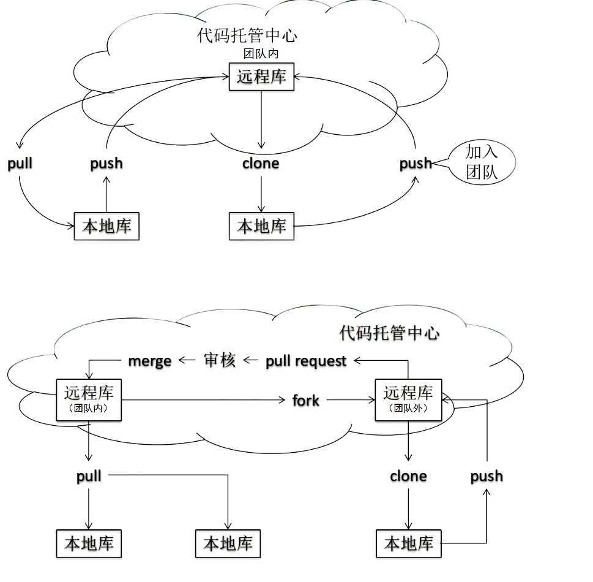

# 1 概念

## 1.1 网站首页

sign in注册，sign up登录，注册后验证邮箱，如果邮箱里没收到邮件，则需要在邮箱里设置域名白名单

## 1.2 gitHub主页

注册成功后，会进入github主页

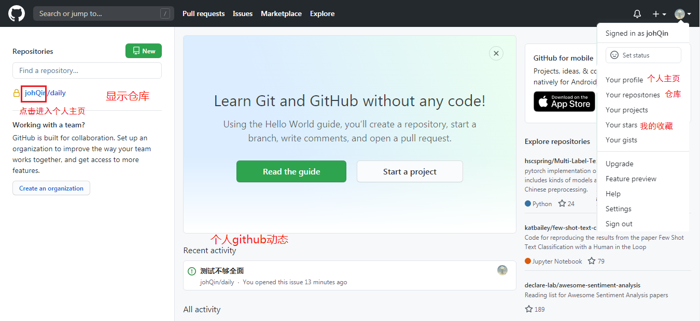

## 1.3 个人主页


## 1.4 仓库主页

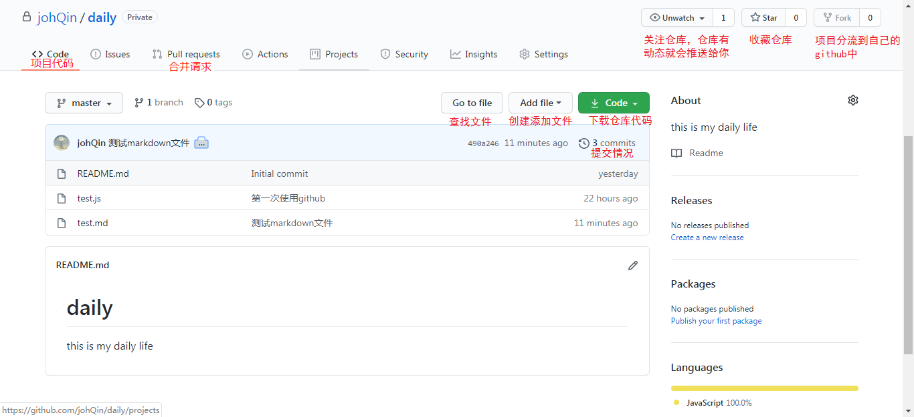

主要显示项目的信息，如：项目代码，版本等和以下操作。

1. **仓库 (Repository)**
   仓库是用来存放项目代码，每一项目对应一个仓库，多个开源项目则会有多个仓库。

2. **收藏 (Star)**

   收藏后面的数字，为收藏数。收藏别人的仓库，方便自己查找。

3. **复制/克隆项目 (Fork)**

   别人仓库的代码可以克隆到自己的账号下的中，可以对仓库进行更改。自己在仓库中对bug进行更改不会影响原作者的仓库，如果觉得自己写得有意思，很有创意，可以通过向原作者发起请求 (**Pull Request**)，待原作者查看后，觉得很符合原作者的口味，可以确认合并我们的代码到他的仓库中。
   Fork也可以理解为分叉。

4. **关注(Watch)**

   使用Watch功能关注了其他作者的仓库，如果作者的仓库发生更新，会发送通知到自己的账户上(类似于关注了别人就可以关注别人的动态)。

5. **事务卡片(Issue)**
   发现别人的仓库代码出现Bug或有疑问时，可以通过Issue来和代码的作者进行咨询和讨论。然后作者可以收到别人的提问，然后可以回复。回复完成可以关闭当前的Issue。

   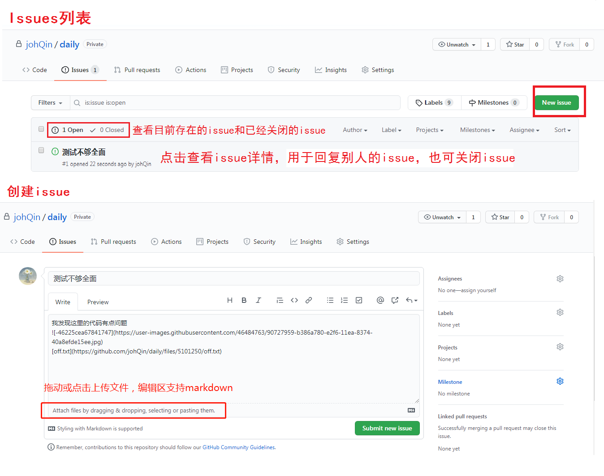

6. 

<h3>仓库主页说明

add file：里面有创建新文件（commit提交时，会让你提交文件说明），也有上传文件。

点击文件里面也可以修改和删除文件

<h3>开源项目贡献

1. 通过提交issue，
2. 通过pull request
   - fork项目
   - 修改自己仓库的对应项目代码
   - 新建pull request
   - 等待原作者审核

# 2 本地库

[下载安装git](<https://git-scm.com/downloads>)

## 工作区域


## 2.1 Git基本命令

git命令窗采用的是linux系统的语法

```bash
#签名等基本设置
git config
#目录中创建新的 Git 仓库
git init 
#拷贝一个 Git 仓库到本地（远程库到本地库）
git clone [url] 
#将该文件从工作区添加到缓存区
git add <file>
#查看自你上次提交之后文件是否有修改。有修改，就可以上传的暂存区或提交到本地库
git status
#查看执行 git status 的结果的详细信息。
git diff 
#将缓存区的所有内容一次性添加到本地库中,也可以指定某一文件
git commit -m "提交描述" [<file>] 
#删除缓存区中某一已经git add 的文件，f——force，强制
git rm -f --cached <file> 
#在本地仓库删除文件
git rm 我的文件
#在本地仓库删除文件夹，r——recursive，迭代
git rm -r 我的文件夹/
#用于移动或重命名一个文件、目录、软连接。
git mv 

#查看当前项目本地库的提交日志
git log [--pretty=oneline 以简洁方式显示日志] # 空格向下翻页，b向上翻页，q退出
git log --oneline#只显示当前HEAD指针所在版本及其的早期历史版本
#得到了穿梭版本需要移动的步数  HEAD@{n}
git reflog
#版本操作
git reset --hard 

```

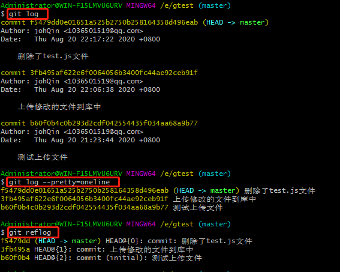

## 2.2 设置签名

用户名和用户email，可以任意写。这里设置的签名和登录的远程库（自己github账户，代码托管中心）一点关系都没有

- 主要作用：区分不同的开发人员，便于团队管理，进行身份确认和权限管理

- 签名级别：
  - 项目级：git config，配置信息存放在当前项目文件夹下的.git/config
  - 全局级：git config --global，配置信息存放在~/.gitconfig
  - 就近原则，先项目级再全局级
- 

```bash
git config --global user.name 'johQin'
git config --global user.email '1036501519@qq.com'
git config --list #查看配置信息
```

## 2.3 创建新仓库

在当前文件夹下生成.git目录，其存放的本地库相关的子目录和文件，不要删除也不要胡乱修改

```bash
psw #查看当前文件路径
mkdir test
cd test
git init #初始化，创建仓库
```

### 删除Git本地仓库

删除Git本地仓库的根本原理是删除“Git本地仓库”里面的根目录下面的隐藏文件夹“.git”

## 2.4 文件CUD

#### 添加文件

```bash
touch test.js #创建文件，用于测试上传
git status
# git add <file>
git add test.js
#提交所有变化
#git add -A  
#提交被修改(modified)和被删除(deleted)文件，不包括新文件(new)
#git add -u 
#提交新文件(new)和被修改(modified)文件，不包括被删除(deleted)文件
#git add .  
git status
git commit -m '测试上传文件'
git status 	
```

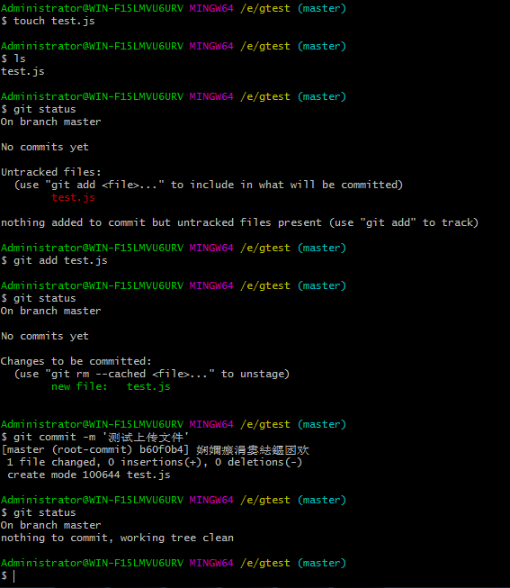

#### 修改文件

在vscode将代码修改之后，又在gtest文件夹下

```bash
git status
git add test.js
git status
git commit -m '第一次修改test.js文件后，提交到仓库'
git status
```

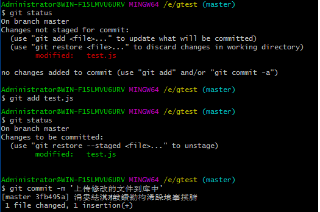

#### 删除文件

```bash
rm -rf test.js#删除本地文件
git status
git rm test.js
git status
git commit -m '删除了test文件'
git status
```

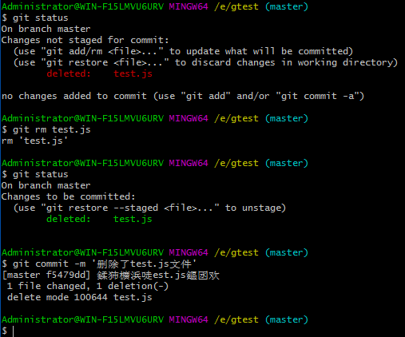

#### 移动文件

```bash
git mv file_from file_to
```


## 2.5 版本控制

```bash
git reset --soft #仅在本地库中移动HEAD指针
git reset --mixed #仅在本地库中移动HEAD指针，并重置暂存区
git reset --hard #仅在本地库中移动HEAD指针，并重置暂存区和工作区
```


版本列表

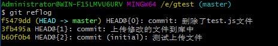

```bash
git reset --hard b60f0b4 #基于索引值操作版本
#后退版本
git reset --hard HEAD^ #有几个^就回退几个版本
git reset --hard HEAD~n #后退n个版本
```

<h3>删除文件找回

前提：删除前，文件存在时的状态提交到了本地库

操作：git reset --hard 

工作区文件删除找回和缓存区文件删除找回

法二：

```bash
git checkout -- <file>
#在被删除的文件路径下，执行此命令，可以从缓存区（如果缓存区没有，那么将从本地库）中恢复最近版本的该文件到工作区
#参考网址：https://www.jianshu.com/p/285302d1eb73
```


## 2.6 比较文件diff

```bash
git diff <file> #表示工作区文件和暂存区文件进行比较
git diff <历史版本号> <file> #表示工作区文件和版本库文件进行比较
#不带文件名，比较所有文件
```

## 2.7 分支管理branch

在版本控制中，使用多条线同时推进多个任务。

好处：

- 同时并行推进多个功能开发，提高开发效率
- 各个分支在开发过程中，如果某一个分支开发失败，不会对其他分支有任何印象影响。失败的分支重新开始即可
- svn的分支管理效率低

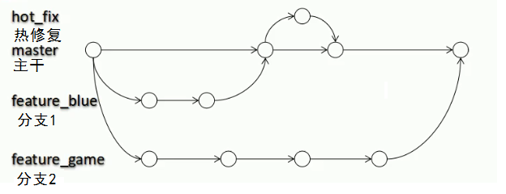

### 2.7.1 本地库分支操作

```bash
#查看 本地库所有分支
git branch -v #本地库所有分支
#创建本地分支
git branch branch_name 
#切换分支
git checkout branch_name
#创建并切换到新分支
git checkout -b branch_name

# 合并分支
# 首先切换到接受修改的分支上
# 执行merge命令
git merge branch_name

#执行合并时解决冲突
#在冲突文件里面有特殊符号，已将冲突的位置进行了标记。
#eg:
#<<<<<<<<<           这里表示当前接受合并的分支
#console.log(x)
#============ 		 这里表示需要合并的分支
#console.log(y)
#>>>>>>>>>>

##将冲突的文档修改了后，解决了冲突
git status
git add <file>
git commit -m "提交描述"

#删除分支
git branch -D branch_name

```

### 2.7.2 远程库分支操作

```bash
# 在克隆远程项目的时候，本地分支会自动与远程分支建立追踪关系，可以使用默认的origin来替代远程仓库名

#在本地新建一个与远程的dev版本相同（被合并的版本）的dev分支
git checkout -b local_branch_name origin/remote_branch_name

#查看远程库的所有分支
git branch -r #remote 远程所有分支，-a也可以实现此效果

#提交本地local_branch_name分支作为远程remote_branch_name的分支
git push origin local_branch_name:remote_branch_name #冒号两边一定不能有空格

#删除远程分支
git push origin :remote_branch_name
```

### 2.7.3 查看分支间的差异

```bash
#查看branch_a有，而branch_b没有的差异
git log branch_a ^branch_b
#查看branch_a比branch_b多提交的内容
git log branch_b..branch_a#两个点只显示两个多余的提交，三个点会显示所有提交差异
#查看两个分支之间的提交差异
git log --left-right branch_a...branch_b
#命令输出示例
#commit > 版本hash码
#...
#commit < 版本hash码
#大小于号，朝向左表示提交是在branch_a上提交的，朝向右表示提交是在branch_b上提交的。
```


## 2.8 .gitconfig

### 2.8.1 [配置文件级别](<https://www.softwhy.com/article-8410-1.html>)

1. 当前项目级别
   - 配置文件位于当前项目.git\config目录下。
   - 此配置文件仅对当前仓库有效
   - 设置：git config --local 
   - 查看：git config --local -l
2. 当前用户级别
   - C:\Users\Administrator
   - 可以称之为全局配置文件，
   - 对当前电脑用户下所有的git项目都有效。
   - 设置：git config --global
   - 查看：git config --global -l
3. 系统级别
   - 设置：git config --system
   - 查看：git config --system -l

### 2.8.2 [配置详情](<https://baijiahao.baidu.com/s?id=1623254575291831567&wfr=spider&for=pc>)

#### 别名alias

git别名是我们日常进行git配置使用最多的一部分内容。在git使用中，为了便捷，减少输入，git提供了别名机制来将标准的git命令自定义为自己习惯使用的命令。我们可以将git的命令设定别名为为1或2个字母的快捷方式。

#### 配色color

给你的工作终端设置一个好看的颜色也是每一个码农一直孜孜以求的目标，那就看本部分：

#### 核心core

核心设置部分包含与git相关的各种不同设置。

#### 凭据credential

凭据部分用来指定希望你需要默认保存的账号和密码。

#### 推送push

push命令的常用配置

[参考忽略各种文件的后缀](<https://github.com/github/gitignore>)

全局级的配置文件在家目录里（即：linux中的~），windows的家目录即C:\Users\Administrator[当前登录用户名] ，**.gitconfig**文件为全局级配置文件

```bash
[alias]
	br = branch
	ct = commit
	co = checkout
[color]
	ui = auto
[color "status"]
	added = yellow
	changed = green
	untracked = cyan
[color "diff"]
	meta = yellow
	frag = magenta bold
	commit = yellow bold
	old = red bold
	new = green bold
	whitespace = red reverse
[color "diff-highlight"]
	oldNormal = red bold
	oldHighlight = red bold 52
	newNormal = green bold
	newHighlight = green bold 22
[core]
	repositoryformatversion = 0
	filemode = false
	bare = false
	logallrefupdates = true
	symlinks = false
	ignorecase = true
	excludesfile =../.gitignore#忽略文件配置的地址，这里的斜线一定要写成"/",否则配置失效

```

.gitignore文件

```bash
*.gz
*.pom
.sha1
.vscode
*.pdf
build
material

#java----------------
*.class
*.jar
*.war
*.nar
*.ear
*.zip
*.tar.gz
*.rar

#node------------------------------------------
node_modules
#spring
spring_gate


```

# 3 git基本原理

## 3.1 哈希

哈希是一个系列的加密算法，各个不同的哈希算法，虽然加密强度不同，但是有一下几个共同点：

1. 不管输入数据的数据量有多大，输入同一个哈希算法，得到的加密结果长度固定
2. hash算法确定，输入数据确定，输出结果能够保证不变
3. hash算法确定，输入数据有变化，输出数据一定有变化，而且通常变化很大
4. hash算法不可逆。

Git底层采用的是，SHA-1算法。

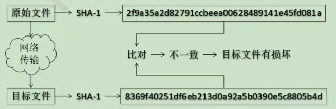

## 3.2 保存版本机制

### 3.2.1 svn增量式的文件管理机制

以文件变更列表的方式存储信息，这类系统将他们保存的信息看做是**一组基本文件和每个文件随时间逐步累积的差异**。

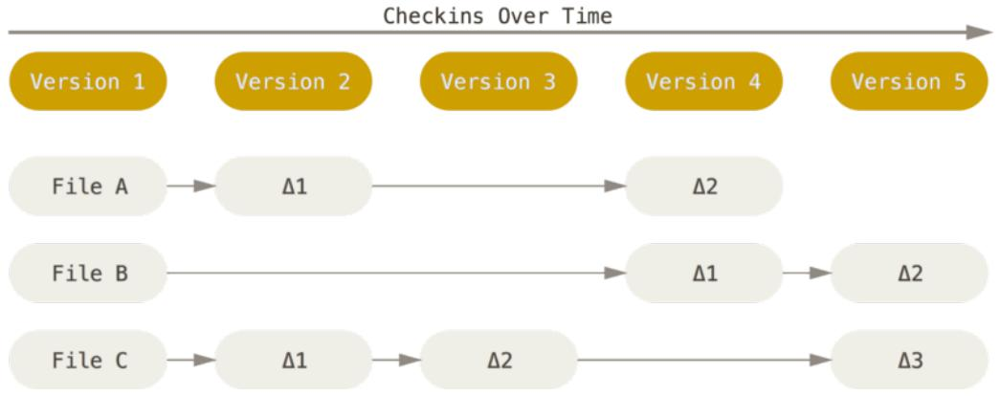

### 3.2.2 Git系统快照的文件管理机制

Git 把数据看作是小型文件系统的一组快照。每次提交更新时Git 都会对当前的全部文件制作一个快照并保存这个快照的索引。为了高效，**如果文件没有修改，**
**Git 不再重新存储该文件，而是只保留一个链接（指针）指向之前存储的文件。**所以Git 的工作方式可以称之为快照流。

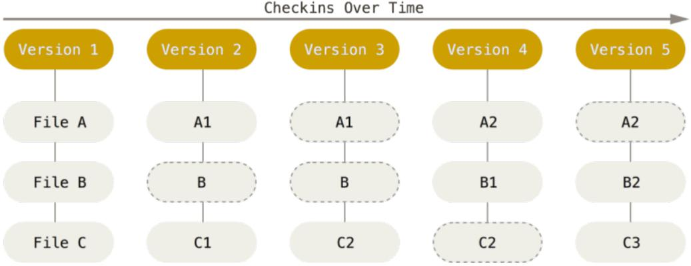

### 3.2.3 提交对象与父对象

<h5>提交对象

每个被修改的文件将形成一个hash code值，然后由多个hashcode值形成一个hash树，提交对象的一个tree属性指向这个hash树。并包含一些像committer、author、parent等其他信息，当然提交对象也有一个hashcode。提交对象也称为快照

<h5>父对象链

每一个对象中的parent属性就是指向上一次提交的对象（历史版本，历史快照snapshot），多个快照形成一个版本链（快照链），版本库就是这样一条快照链。

### 3.3 分支版本管理

首先存在一个HEAD指针指向当前分支（HEAD指针唯一），如果创建分支，那么就新建一个指针，指向快照链，提交版本，移动指针，不同分支的指针将会使快照链形成分支。合并分支时，两个指针指向同一个快照

## 3. svn 与 git

|                  |      | 集中式（SVN）                                                |      | 分布式（Git）                                                |
| ---------------- | ---- | ------------------------------------------------------------ | ---- | ------------------------------------------------------------ |
|                  |      |                                                              |      |                                                              |
| 是否有中央服务器 |      | 有。开发人员需要从中央服务器获得最新版本的项目然后在本地开发，开发完推送给中央服务器。因此脱离服务器开发者是几乎无法工作的 |      | 没有中央服务器，开发人员本地都有 Local Repository            |
|                  |      |                                                              |      |                                                              |
| 网络依赖         |      | 必须要联网才能工作，而且对网络的依赖性较强，如果推送的文件比较大而且网络状况欠佳，则提交文件的速度会受到很大的限制。 |      | 分布式在没有网络的情况下也可以执行commit、查看版本提交记录、以及分支操作，在有网络的情况下执行 push 到 Remote Repository。 |
|                  |      |                                                              |      |                                                              |
| 文件存储格式     |      | 按照原始文件存储，体积较大                                   |      | 按照元数据方式存储，体积很小                                 |
|                  |      |                                                              |      |                                                              |
| 是否有版本号     |      | 有                                                           |      | 没有                                                         |
|                  |      |                                                              |      |                                                              |
| 分支操作的影响   |      | 创建新的分支则所有的人都会拥有和你一样的分支                 |      | 分支操作不会影响其他开发人员                                 |
|                  |      |                                                              |      |                                                              |
| 提交             |      | 提交的文件会直接记录到中央版本库                             |      | 提交是本地操作，需要执行push操作才会到主要版本库             |

### SVN

1. 管理方便，逻辑明确，符合一般人思维习惯。

2. 易于管理，集中式服务器更能保证安全性。

3. 代码一致性非常高。

4. 适合开发人数不多的项目开发。

### Git

1. 适合分布式开发，强调个体。
2. 公共服务器压力和数据量都不会太大。
3. 速度快、灵活
4. 任意两个开发者之间可以很容易的解决冲突。
5. 离线工作。
6. 资料少
7. 学习周期相对而言比较长。
8. 不符合常规思维。
9. 代码保密性差，一旦开发者把整个库克隆下来就可以完全公开所有代码和版本信息。

# 4 远程库

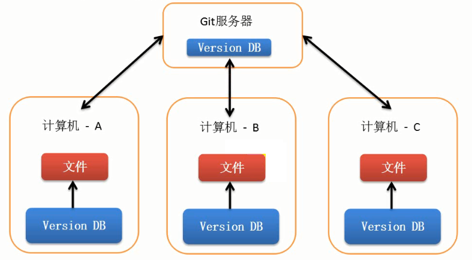

作用：

1. 将本地的版本库同步到git服务器上，可以进行代码备份
2. 多人协同开发时，可以实现代码共享集中化管理

## 4.1 克隆项目到本地

将远程仓库（github上对应的项目）复制到本地。

仓库地址如下图。

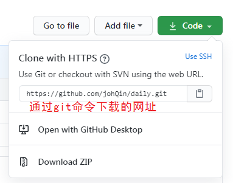

```bash
git clone https://github.com/johQin/daily.git
```

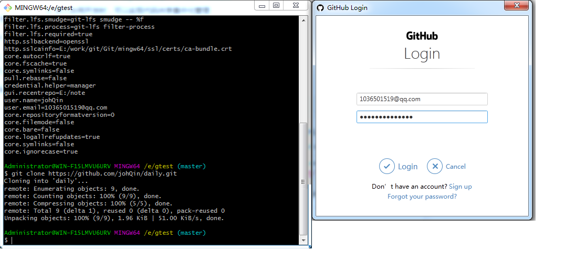

## 4.2 提交本地代码push

提交本地代码到远程库

在git commit的基础上增加了git push操作。

<h4>远程库地址别名

在push之前，我们需要告诉本地git服务器，我们需要将代码提交到哪去，也就是我们远程库的地址。当然在克隆的时候已经做了操作，当提交到不同的项目库时，需要添加不同的远程库地址，这里再提供一个创建远程库地址别名的方法（用别名，代替每次输入长长的地址）

```bash
#添加别名
git remote add 别名 远程库地址
#别名列表
git remote -v

```


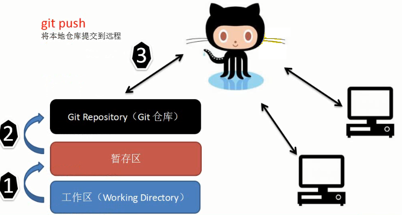

**无法实现同步**

有时候会出现没有权限 or The request URL return error:403 Forbidden while accessing

问题解释：私有项目，没有权限，输入用户名密码，或者远程地址采用这种类型

```bash

vi .git/config
#将
[remote "origin"]
	url=https://github.com/用户名/仓库名.git
#修改为
[remote "origin"]
	url=https://用户名:密码@github.com/用户名/仓库名.git
```

```bash
git status
git add test.js
git commit -m '修改了test.js'

#在克隆远程项目的时候，本地分支会自动与远程分支建立追踪关系，可以使用默认的origin来替代远程仓库名
git push [远程库地址别名] [分支名]

#可以使用默认的origin来替代远程仓库名
#将本地当前分支 推送到 远程指定分支上
git push [远程仓库名] [本地分支名]:[远程分支名]
#eg：
git push origin dev:dev #将本地的dev分支提交到远程库的dev分支

#将本地当前分支 推送到 远程指定分支上
git push [远程仓库名] [远程分支名]
#将本地当前分支 推送到 与本地当前分支同名的远程分支上
git push [远程仓库名] #与git push功能一致
```

## 4.3 邀请团队开发者

1. 邀请并填写成员账号邮箱
   - 在项目库的setting-->Manage access

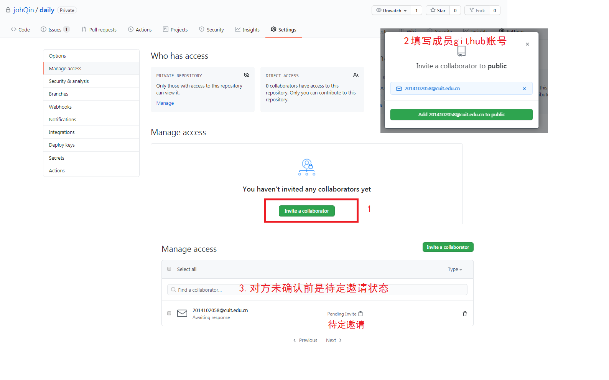

2. 邀请后，对方成员邮箱会受到邀请邮件

   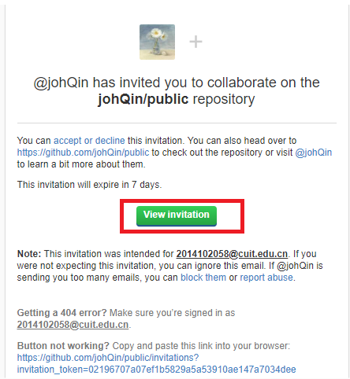

3. 成员查看邀请，并确认

   

4. 然后，成员就可以push代码了。

## 4.4 更新代码pull

先更新再提交

```bash
# 同步远程库，更新到本地库
git pull [远程库地址别名] [远程分支名]:[本地分支名]# pull= fetch + merge 
git fetch [远程库地址别名] [远程分支名]:[本地分支名]#将远程主机的最新内容拉到本地，用户在检查了以后决定是否合并到工作本机分支中。
git merge [远程库地址别名/远程分支名]

# 冲突解决：
# 当远程库中代码得到了更新，即远程库的版本比本地的版本高时，必须先执行pull操作，才能执行push操作。即先更新再提交
```


# 5 搭建网站

## 5.1 个人主页

**访问地址：https://用户名.github.io**

搭建：

1. 创建个人站点
2. 新建仓库（仓库名必须是【用户名.github.io】
3. 在仓库下新建index.html

注意：github pages仅支持静态网页，仓库里面只能是.html文件

## 5.2 项目主页

**访问地址：https://用户名.github.io/仓库名**

搭建：

1. 仓库主页点击setting
2. 找到Github Pages，点击launch automatic page generator按钮，自动生成主题页面
3. 站点信息基础设置，输入项目基本信息和页面主体（以markdown的形式写页面）
4. 选择主题
5. publish page

修改主页也是通过这样

# 6 bug

1. git push or git pull时

   ```bash
   git push origin feature_1:feature_1
   # 冒号两边不能有空格
   # 参考网页：https://blog.csdn.net/hanmindaxiongdi/article/details/81433730
   
   # 使用git push origin a:a 提示一下错误
   #error: dst ref refs/heads/dev receives from more than one src.
   #error: failed to push some refs to 'git@github.com:xxx/xxx.git'
   
   # 这个问题主要是由于参数不对，它明明要三个参数「push」「origin」以及「A:A」的，
   # 你却给它五个：「push」「origin」「A」「:」「A」。shell 中空格导致的问题不少
   ```

   

2. 