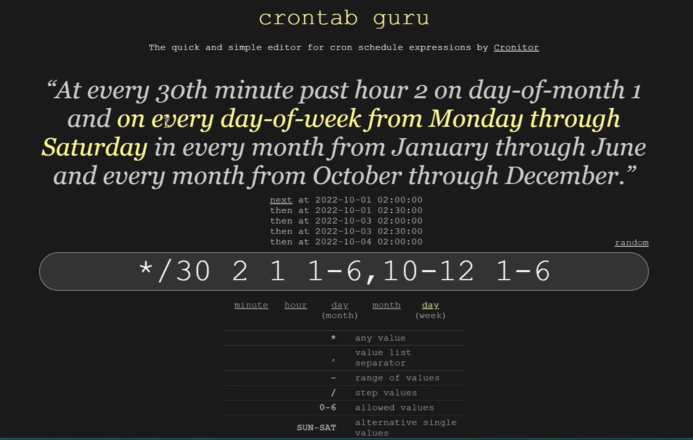
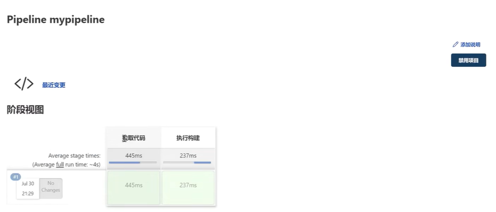

# [Jenkins](https://www.jenkins.io/zh/)

Jenkins是一款基于java开发的开源 CI&CD 软件，用于自动化各种任务，包括构建、测试和部署软件。

在典型的软件开发和测试流程中，Jenkins 通常处于开发阶段与测试阶段之间的桥梁位置，同时也贯穿于整个开发周期，具体如下：

1. 开发阶段：开发人员完成代码编写后，将代码提交到版本控制系统（如 Git）。Jenkins 通过监听版本控制系统中的代码提交事件，触发后续的自动化流程。
1. 构建阶段：Jenkins 在代码提交后，自动拉取代码并执行构建任务（如编译代码、运行单元测试等）。这一阶段是开发和测试的过渡环节，确保代码能够正常编译并且通过初步的单元测试。
1. 测试阶段：构建完成后，Jenkins 可以自动部署构建产物到测试环境，并触发自动化测试（如接口测试、功能测试等）。测试人员基于 Jenkins 提供的反馈，进行进一步的手动测试或验证。
1. 部署阶段：在测试通过后，Jenkins 可以将代码部署到生产环境，实现持续部署。它在整个开发和测试流程中起到了串联各个环节的作用。

主要内容：

1. 基础运行环境快速部署
3. 一键Maven拉取git代码完成构建jar包，并提交测试服务器自动运行
4. IDE提交代码后自动构建并发布任务
5. 定时构建发布任务
6. 邮件通知任务执行结果
7. Jenkins构建项目自动化运行在Docker容器中
8. Jenkins Pipeline脚本与Jenkinsfile使用，Blue Ocean UI使用
9. Jenkins 多分支项目

[Jenkins官方文档](https://www.jenkins.io/zh/doc/)

# 1 安装部署

## 1.1 安装gitlab

```bash
# 安装ssh perl
sudo apt install -y curl openssh-server perl
# 
```


在gitlab的整包中，包含但不限于：

- postgresql：为应用程序元数据和用户信息提供存储。
- puma：一个快速，多线程，高并发的http 1.1服务器，适用于Ruby程序，运行核心的Rails应用程序，提供极狐Gitlab的用户界面功能
- nginx - 作为http请求入口，将http请求路由到合适的gitlab子系统。
- redis - 主要用于以下目的：缓存、Sidekiq的作业处理队列、管理共享应用程序状态、存储 CI 跟踪块、作为 ActionCable 的 Pub/Sub 队列后端、速率限制状态存储、Session。
- sidekiq - Ruby应用程序。sidekiq是一个后台作业处理器，从Redis队列中提取作业并进行处理。

```bash
# 启动所有gitlab组件
gitlab-ctl start

# 停止所有gitlab组件
gitlab-ctl stop
# 重启所有gitlab组件
gitlab-ctl restart
# 查看服务状态
gitlab-ctl status
gitlab-ctl reconfigure

# 在首次执行gitlab-ctl start 后面有
# Notes:Default admin account has been configured with following details:Username: rootPassword: You didn't opt-in to print initial root password to STDOUT.Password stored to /etc/gitlab/initial_root_password. This file will be cleaned up in first reconfigure run after 24 hours.
#NOTE: Because these credentials might be present in your log files in plain text, it is highly recommended to reset the password following https://docs.gitlab.com/ee/security/reset_user_password.html#reset-your-root-password.

# 在这个文件中获取初始密码后，/etc/gitlab/initial_root_password
# 然后在浏览器中登录，然后再去改密码
```


## 1.2 Jenkins 安装

[下载](https://www.jenkins.io/zh/download/)，[机器配置](https://www.jenkins.io/zh/doc/book/installing/#prerequisites)

Jenkins 以 WAR 文件、原生包/安装程序和 Docker 镜像分发。

[如果通过war包安装，需要先安装jdk](https://www.jenkins.io/zh/doc/book/installing/#war%E6%96%87%E4%BB%B6)

```bash
# JENKINS_HOME 环境变量用于指定 Jenkins 的主目录位置，所有的 Jenkins 配置文件、工作目录以及插件等都存储在这个目录中。
# 默认位置（通常是 /var/lib/jenkins 或者其他根据安装方式不同的默认路径）。	
export JENKINS_HOME=/home/jenkins/jenkins_home
# 运行命令，如果在运行后，你中断这个程序，那么jenkins服务就会被关闭
java -jar jenkins.war
# --httpPort=8080 可以指定浏览器访问jenkins 服务的端口
#
# Jenkins initial setup is required. An admin user has been created and a password generated.Please use the following password to proceed to installation:
# 4f8da39c58b64fbebbb7838a30a6fe026
# This may also be found at: /root/.jenkins/secrets/initialAdminPassword

# 浏览http://localhost:8080并等到*Unlock Jenkins*页面出现。
# 

# 继续使用Post-installation setup wizard后面步骤设置向导。
```


# 2 初识Jenkins

## 2.1 管理jenkins

Manage jenkins选项卡 --> System Configuration 栏下 

- **Configure System** → 管系统全局环境、通知、变量，SSH连接（需要Publish Over ssh插件支持）
- **Global Tool Configuration** → 管 JDK/Maven/Git 等工具
- **Manage Plugins** → 安装插件，扩展功能
- **Manage Nodes and Clouds** → 管理分布式构建节点，多机器干活

工具和插件的区别：

- **插件** = 包工头的**技能**（会用 Git、会做流水线、会发邮件）

- **工具** = 包工头手里的**锤子、电钻、扳手**（JDK、Maven、Git 软件）


## 2.2 新建Item

新建Item ->  任务名称，在任务名称下方有多个项目类型（根据jenkins的插件的多少，下方支持的类型可多可少），可能一开始就包含：

- Freestyle project：
  - 最简单、最基础的「傻瓜式可视化任务」，纯页面点选配置
  - **完全不用写代码**，你只需要在界面上一步步勾选：拉代码、执行 shell 命令、打包、发送通知等简单步骤；
- Pipeline：
  - 用 **Jenkinsfile（代码文件）** 定义完整的构建流程（拉代码→编译→单元测试→代码扫描→部署→发邮件）；
- 构建一个多配置项目
  - 专门解决：**同一个项目，需要在 N 种不同环境下重复构建**的场景
  - 比如：你的项目要兼容 JDK8 / JDK11、Linux / Windows、MySQL8 / PostgreSQL，不用建 10 个任务，建这一个就能**自动批量执行**；
- organizations Folder：
  - 不是用来跑单个构建的，而是**对接代码平台（GitHub/GitLab/ 码云）的「组织 / 团队」**；
  - 它会**自动扫描**组织下的所有代码仓库，只要仓库里有 Jenkinsfile，就**自动创建 / 更新 Jenkins 任务**；
  - 完全不用手动一个个新建 Item。


# 3 maven项目

## 3.1 安装

需要在jenkins的服务器上安装：

- **Maven工具** 和**plugin Maven Integration**

- **git**工具
- **jdk**

- 安装maven

  ```bash
  # maven 依赖java，所以需要安装jdk，需要注意maven与jdk的版本适配
  yum install -y java-devel
  
  tar -zxvf apache-maven-3.9.6-bin.tar.gz
  
  # 编辑/etc/profile，添加 Maven 环境变量
  export MAVEN_HOME=/usr/local/apache-maven-3.9.6
  export PATH=$PATH:$MAVEN_HOME/bin
  
  source /etc/profile
  
  # 验证maven命令
  mvn -v
  
  # maven作为包管理工具，可以配置阿里云镜像站，以加速依赖包的下载。
  /usr/local/apache-maven-3.9.6/conf/setting.xml
  # 将阿里的配置拷贝过来，覆盖原有内容
  
  ```

- 配置maven工具命令的目录：Dashboard -> Global Tool Configuration，新增maven Maven_Home

- 安装plugin maven

  - 在Manage jenkins选项卡 --> System Configuration -> Manage Plugins ->  Maven Integration

## 3.2 新建item

dashboard -> 项目名称 -> 构建一个maven项目（必须先安装插件才有这个项目类型）

然后会有一系列tab页，让你配置，或者采用默认的配置

- General

  - 如果Jenkins有多个节点（多台机器）的时候，在General的下面有一些复选框
    - “在必要的时候并发构建”：如果有多个节点可以勾选上。
    - “限制项目的运行节点”：可以使用节点的**标签 or 标签的表达式**
    - Discard  old build
    - Throttle build

- 源码管理：拉取代码的仓库相关信息

  - 只要项目构建过一次，已执行代码拉取过程，那么代码会下载到 `~/.jenkins/workspace/项目名称/源码`

- 构建触发器

  - 用于自动化构建，例如git上将feature分支的代码合并到main分支上后，立刻触发构建

  - 触发远程构建

    ```bash
    # 输入身份验证令牌token，随便输入一个
    123123
    #解释：Use the following URL to trigger build remotely：JENKINS_URL/job/项目名称/build?token=123123 or JENKINS_URL/buildWithParameters?job=项目名称&token=123123&xxx=abc to provide text that will be included in record build cause
    
    # 一旦发起上述get请求，那么jenkins任务队列中就会出现一条构建任务。
    ```

  - 如果在登录jenkins的浏览器上，使用链接触发是没有问题的，是可以正常触发任务

  - 但是如果在另一浏览器上触发，那么出现authorization require问题，可以通过 Plugin **Build Authorization Token Root**，并且使用第二种方式就可成功触发`JENKINS_URL/buildWithParameters?job=项目名称&token=123123&xxx=abc`

  - 现在来配置gitlab上的hook

    - 项目仓库-> 设置 -> webhooks，网址填入上面的网址，令牌在地址中已包含，触发来源->选择“合并请求事件（创建、更新或合并合并请求）”，去掉启用SSL验证，点击`Add webhook`
    - 在点完add webhook后，可能会出现`Url is blocked：Request to the local network are not allowed`，这时就需要做其他配置，`菜单-> 切换到管理员身份->设置-> 网络 -> 出站请求 -> 允许来自web hooks和服务对本地网络的请求`，这样就可以搞定
    - 如果添加hooks成功，会在此页面的底部出现Project hooks的列表，里面可以点击“测试”发出指定的事件，以此来测试功能。
    - 在gitlab中，触发来源：合并请求事件（创建、更新或合并合并请求），这个会在“创建合并请求”，“合并合并请求” 这两个时间节点都触发构建，所以这不是我们真正想要的。

- 构建环境

- Pre Steps

  - 清理已传输的文件，关闭之前已启动的服务（端口占用等）

  - add pre-build step 下拉 （Send files or execute commands over SSH）

  - Exec command如果涉及多个命令，可以使用shell脚本

  - ```shell
    #!/bin/bash
    
    # 删除历史数据
    # rm -rf xxxxx
    
    # 获取shell脚本的命令行位置参数
    echo "arg:$1"
    appname=$1
    
    # 获取正在运行的jar包pid
    pid=`ps -ef | grep $1 | grep 'java -jar | awk '{printf $2}'`
    
    echo $pid
    
    # 判断pid是否为空，
    if [ -z $pid ];
    	then 
    		echo "$appname not started"
    	else
    		kill -9 $pid
    		echo "$appname stoping"
    fi
    
    # 检查
    check=`ps -ef | grep -w $pid | grep java`
    if [ -z $check ];
        then
            echo "$appname pid:$pid is stop"
        else
            echo "$appname stop failed"
    fi
    ```

  - 

- Build: 构建的配置，添加pom.xml位置

- Post Steps

  - 构建的产物位置：`~/.jenkins/workspace/项目名/有pom.xml文件夹下的target`

  - 如果要将构建好的jar包，发送测试服务器运行，那么需要先安装plugin **Publish Over ssh**

  - Manage jenkins -> System Configuration -> Configure System -> Publish over SSH，然后**配置服务器相关信息**

  - dashboard -> 点击项目名称 -> 配置 -> Post Steps -> add post-build step 下拉 （Send files or execute commands over SSH）

  - Transfers 中配置需要发送的文件（Sources files），Remove prefix，Remote Directory ，Exec command

  - Exec Command：

    ```bash
    # 有些命令会在前台阻塞，或者是交互性质的，所以日志，以及运行都不能阻塞，所以需要脱机（nohup），后台运行（&），日志（&>）
    nohup java -jar /root/mydemo/demo*.jar &>mylog.log &
    ```

    

- 构建设置

- 构建后操作


## 3.3 常见的构建触发器

- 快照依赖构建/Build whenever a SNAPSHOT dependency is built
  - 当依赖的快照被构建时执行本 job
- 触发远程构建
  - 远程调用本 job 的 restapi 时执行本 job
- job 依赖构建 / Build after other projects are built
  - 当依赖的 job 被构建时执行本 job
- 定时构建 / Build periodically
  - 使用 cron 表达式定时构建本 job
- 向 **GitHub** 提交代码时触发 Jenkins 自动构建 / GitHub hook trigger for GITScm polling
  - Github-WebHook 出发时构建本 job
- 定期检查代码变更 / Poll SCM
  - 使用 cron 表达式定时检查代码变更，变更后构建本 job


**jenkins cron表达式**可以在网站（https://crontab.guru/）上进行生成测试

- **`*`**星号代表任意
- **`/`** 斜杠代表 每隔
- **`-`** 短斜线代表 范围
- 还有其他语法，可以自行查询



## 3.4 邮件通知

邮件服务器涉及概念：

- **SMTP**：发邮件 ✉️
- **POP3**：收邮件，下载到本地，服务器不留
- **IMAP**：收邮件，存在云端，多设备同步

配置的位置Dashboard -> Manage Jenkins -> Configure System

- **Jenkins Location**：全局系统位置信息，**不直接发邮件**，只用于邮件模板里展示

- **邮件通知（自带默认邮件）**：Jenkins**原生简单邮件**，仅失败时发、功能弱

- **Extended Email Notification（扩展邮件插件）**：**高级自定义邮件**，最常用，可自定义模板、触发条件、收件人、格式

# 4 容器

在容器中部署应用的几种方式

1. 容器卷
   - 容器映射宿主机的文件系统，然后在容器中执行命令或者重启容器
2. 应用包 + dockerfile + build = 新镜像
   - 删除旧有容器和镜像，应用包 与dockerfile 同时上传，然后构建，生成新镜像，然后运行新镜像
3. 新镜像 上传 harbor，通过K8s编排

# 5 Jenkins集群

集群化构建可以提升构建效率，尤其是团队项目比较多的时候，可以并发在多台机器上执行构建。

Dashboard -> Manage Jenkins -> Manage Nodes and Clouds

进去后，可以看见Nodes列表里包含一个Built-In Node，这个是当前Jenkins节点


## 5.1 新建节点（New Node）

新节点（从节点）无需安装Jenkins。

在左侧的菜单中 新建节点（New Node）

- 填入节点名称，勾选Type（permanent Agent，这个type可以查一下有什么用。如果已有子节点了，那么也可以选择“复制现有节点”），点击Create
  - 关于Agent的概念，可以理解Agent就是一个**从节点**。
- 填写节点的其他信息：
  - 名称不用修改
  - Number of executors：可以并发执行几个任务
  - 远程工作目录
  - 标签：这里的标签尤为注意，后面在指定谁去构建，或者在pipeline中，都会用到这个标签名
  - 用法：有两个选项：Use this node as much as possible（由jenkins master自主分配），Only build jobs with label expressions matching this node（通过label匹配slave 去构建）
  - 启动方式：三个选项
    - Launch agent by connecting it to the controller：从节点主动连接控制器（主节点），主节点开放端口，**从节点主动发起网络连接**，对接 Jenkins 主节点；
      - 场景：
        - **Windows 从节点**（Windows 默认不装 SSH，最常用）；
        - 网络受限：主节点在内网 / 防火墙后，**主节点无法主动访问从节点**，但从节点能访问主节点；
        - 容器化、云服务器、隔离环境。
    - Launch agent via execution of command on the controller：在主节点执行命令启动从节点
    - Launch agent via SSH：通过 SSH 启动代理（Linux/macOS 专用）
      - Jenkins 主节点通过 **SSH 协议** 远程登录从节点；
      - 场景：
        - **Linux /macOS 从节点**（最主流、标准方式）；
        - 主节点能直接连通从节点 22 端口，SSH 密钥 / 密码可用；
        - 服务器集群、内网环境、CI/CD 标准部署。
      - 选这个选项，
        - 需要安装插件**Publish Over ssh**，并在System Configuration中配置ssh信息
        - 或者在当前的位置配置ssh信息，其中Host Key Verification Strategy选择：Non verifying Verification Strategy
- 最后点击保存，就返回了Nodes 列表了，点击右上角刷新节点状态。也可以通过点击该节点，查看该节点的详情。

## 5.2 配置任务

在新建完节点后，就需要对任务进行配置。

点击任务 -> 在General Tab页 下面勾选，配置项

- “在必要的时候并发构建”
- “限制项目的运行节点”：可以使用节点的**标签 or 标签的表达式**

在勾选并发配置后，这个任务就可以连续点击多下，然后同一个任务就可以并发构建了。

如果你本身就有多个任务，那就可以每个任务点一下，就可以看见他们一起在多个节点上构建了。

# 6 Pipeline

- 将工作流转换为一个流水线，可以**分阶段单独执行**。
- 将工作流转换为**groovy脚本**进行编辑


pipeline必备的组成部分：

- pipeline：整个流水线
- agent：指定节点
- stages：所有阶段
- stage：某个阶段
- steps：阶段中的多个步骤

## 6.1 新建Pipeline

新建Item -> 输入任务名称，任务类型：Pipeline -> 确定，进入多Tab页配置pipeline信息（任务信息）

- General

- 构建触发器

- 高级项目选项

- 流水线pipeline

  - 这里有两个类型：

    - Pipeline script from SCM：从代码管理工具中拉取Pipeline脚本，SCM（Source Code Management）

    - Pipeline script：直接在下方输入框总，输入脚本内容

      ```groovy
      pipeline {
          agent any
      
          stages {
              stage("拉取代码") {
                  steps {
                      echo '拉取成功'
                  }
              }
              stage("执行构建") {
                  steps {
                      echo '构建完成'
                  }
              }
          }
      }
      ```

  - 在编辑框的下方还有个**“流水线语法”**的链接，

    - 片段生成器：他能按照你提供的信息，为你生成jenkins中相关插件的pipeline脚本
    - Declarative Directive Generator： Jenkins 声明式流水线代码可视化生成器，不用手写语法，点点鼠标就能生成标准 Jenkinsfile 代码

在任务列表中，点击mypipeline任务，详情中看到阶段视图，之前的任务是没有阶段视图的



## 6.2 插件Blue Ocean

是关于Pipeline功能的一个更优的webUI工具。

## 6.3 一个复杂的pipeline 脚本例子

工作目录：`/root/.jenkins/workspace/mypipeline`
