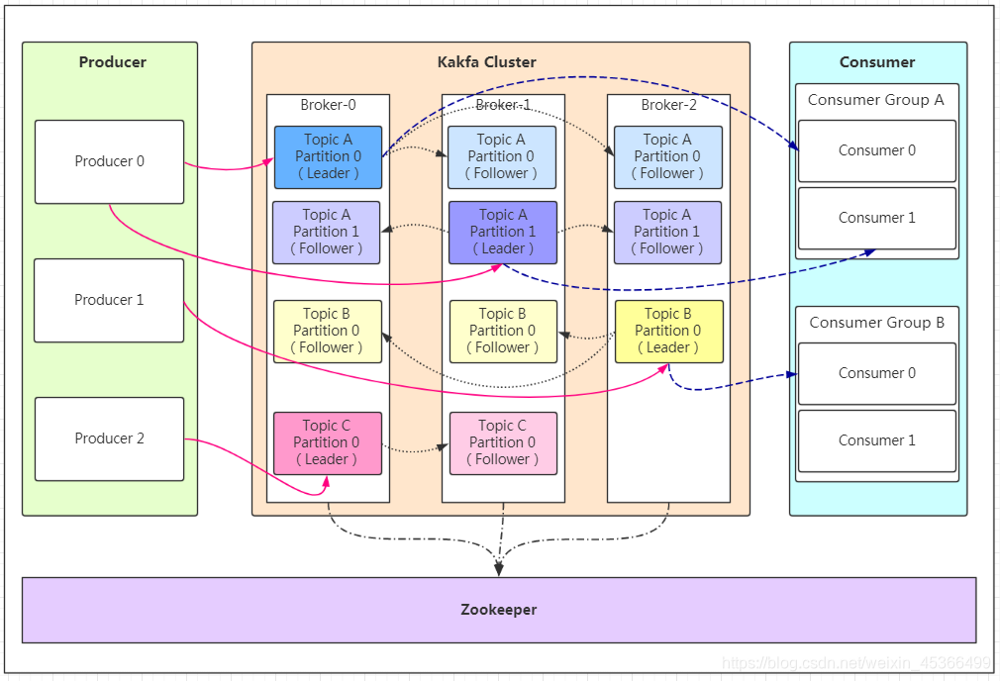

# Kafka

- Producer：Producer即生产者，消息的产生者，是消息的入口。
- Broker：Broker是kafka实例，每个服务器上有一个或多个kafka的实例，我们姑且认为每个broker对应一台服务器。每个kafka集群内的broker都有一个不重复的编号，如图中的broker-0、broker-1等……
- Topic：消息的主题，可以理解为消息的分类，kafka的数据就保存在topic。在每个broker上都可以创建多个topic。
- Partition：Topic的分区，每个topic可以有多个分区，分区的作用是做负载，提高kafka的吞吐量。同一个topic在不同的分区的数据是不重复的，partition的表现形式就是一个一个的文件夹！
- Replication:每一个分区都有多个副本，副本的作用是做备胎。当主分区（Leader）故障的时候会选择一个备胎（Follower）上位，成为Leader。在kafka中默认副本的最大数量是10个，且副本的数量不能大于Broker的数量，follower和leader绝对是在不同的机器，同一机器对同一个分区也只可能存放一个副本（包括自己）。
- Message：每一条发送的消息主体。
- Consumer：消费者，即消息的消费方，是消息的出口。
- Consumer Group：我们可以将多个消费者组成一个消费者组，在kafka的设计中同一个分区的数据只能被消费者组中的某一个消费者消费。同一个消费者组的消费者可以消费同一个topic的不同分区的数据，这也是为了提高kafka的吞吐量！
- Zookeeper：kafka集群依赖zookeeper来保存集群的的元信息，来保证系统的可用性。