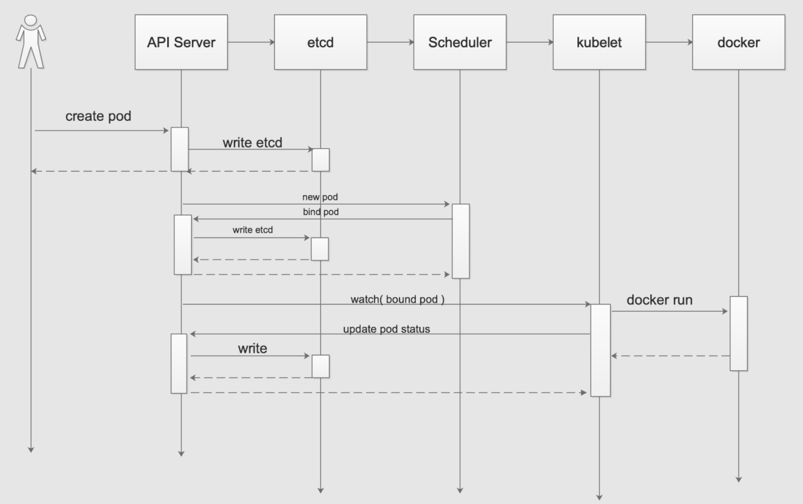

# Kubernetes

Kubernetes （简写：K8S），在希腊语意为“舵手”或“驾驶员”

k8s是谷歌在2014年开源的容器化集群管理系统

目标：让部署容器化应用更加简洁和高效

# 0 绪论

**Kubernetes 是底层的容器编排引擎**

**Rancher**：构建在 Kubernetes 之上的多集群管理平台。它的核心价值是让 Kubernetes 更容易部署、管理和规模化运维。

**KubeSphere**：一个开源的、以应用为中心的容器平台，提供了比 Rancher 更友好的 UI 和开箱即用的可观测性集成，适合希望获得更完整平台能力、且能接受一定复杂度的团队

## 0.1 功能

1. 基于容器对应用运行环境的资源配置要求，自动部署应用容器
2. 自我修复：
   - 容器启动失败，会进行重启
   - 部署的节点有问题时，会对容器进行重新部署和重新调度
   - 当容器未通过监控时，会关闭此容器直到容器正常运行时，才会对外提供服务。
3. 水平扩展：通过简单的命令、用户UI界面或基于CPU等资源使用情况，对应用容器进行规模扩大或裁剪
4. 服务发现：内置服务发现和负载均衡
5. 滚动更新：根据应用的变化，对应用容器运行的应用，进行一次性或批量式更新
6. 版本回退
7. 密钥和配置管理
8. 存储编排：自动实现存储系统挂载及应用
9. 批处理：一次性任务，定时任务


## 0.2 [集群架构](https://developer.aliyun.com/article/1635071)


### Master Node

- 也称Control  Plane

- k8s 集群控制节点，对集群进行调度管理，接受集群外用户去集群操作请求

- Master Node 由API Server、Scheduler、ClusterState Store（ETCD 数据库）和 Controller MangerServer 所组成

- **API Server**

  - 集群的统一入口，暴露 Kubernetes API

  - 功能：
    - **验证和授权**：负责验证用户的身份，并根据配置的访问控制策略进行授权，确保只有合法的请求才能对集群进行操作。
    - **集群状态管理**：集群状态信息都通过它来访问和更新
    - **通信枢纽**：集群的通信桥梁
  - 当用户或其他组件向 Kube-API Server 发送请求时，API Server 首先进行身份验证和授权检查，然后对请求的数据进行验证和处理。处理完成后，API Server 会将数据存储到 etcd 中，同时通知其他组件进行相应的操作。

- **Etcd**

  - Etcd 是一个分布式键值存储，用于存储 Kubernetes 集群的所有数据，所有的配置信息、状态信息都存储在 etcd 中。
  - 功能：
    - **数据存储**：Etcd 负责存储所有的集群状态数据，包括 Pod、Service、ConfigMap、Secret 等。
    - **数据可靠性**：Etcd 通过分布式架构保证数据的高可用性和一致性，确保集群状态数据在发生故障时仍能可靠存储。
    - **数据访问**：Etcd 提供了高效的键值对存储和访问接口，支持高频率的读写操作
  - API Server 通过 etcd API 进行数据的读写操作。当集群状态发生变化时，APIServer 会将新的状态数据写入 etcd，同时其他组件可以监听 etcd 的变化，从而进行相应的处理。

- **Scheduler**

  - Scheduler 是 k8s的调度组件，负责将新创建的 Pod 调度到合适的工作节点上。它根据预设的调度策略和节点状态，选择最合适的节点来运行 Pod。
  - 功能：
    - 资源调度：Scheduler 根据节点的资源使用情况和 Pod 的资源需求，选择合适的节点来运行 Pod。
    - 策略配置：支持多种调度策略，包括资源优先、亲和性、反亲和性等，用户可以根据需求自定义调度策略。
    - 负载均衡
  - Scheduler 通过监听 Kube-API Server 上的调度请求，获取需要调度的 Pod 列表。然后，它根据预设的调度策略和节点的状态，选择最合适的节点，并将调度结果写回 API Server，最终由相应的节点来运行 Pod。

- **Controller-Manager**

  - Controller-Manager 是 Kubernetes 控制平面的控制管理组件，负责管理集群的各种控制器。这些控制器是用于处理集群状态变化的后台进程。
  - 功能：
    - **控制器管理**：包括 Node Controller、Replication Controller、Endpoint Controller、Namespace Controller 等，这些控制器分别负责节点管理、副本管理、服务发现、命名空间管理等功能。
    - **自动化操作**：控制器通过监听集群状态变化，自动执行相应的操作，如副本调整、故障节点隔离、服务更新等。
    - **一致性保证**：通过控制器的自动化操作，Kube-Controller-Manager 保证了集群状态的一致性和可靠性。
  - Controller-Manager 通过监听 API Server 的事件，获取集群状态变化的信息。根据不同的控制器，它会执行相应的操作，如创建或删除 Pod、副本调整、节点故障处理等，并将结果写回 API Server，从而更新集群状态。

### Worker Node

- **Kubelet**
  - 是运行在每个工作节点上的主要代理进程，负责管理节点上的 Pod 和容器。它通过与 Kube-APIServer 交互，确保节点上容器的正确运行。
  - 功能：
    - **Pod 管理**：Kubelet 负责启动和停止节点上的 Pod，并监控它们的状态，确保每个 Pod 按照预期运行。
    - **状态报告**：Kubelet 定期向 Kube-API Server 报告节点和 Pod 的状态，包括资源使用情况、健康状态等。
    - **配置管理**：Kubelet 根据从 Kube-API Server 获取的配置信息，配置和管理节点上的容器运行环境。
  - Kubelet 通过监听 Kube-APIServer 的调度信息，获取需要在本节点上运行的 Pod 列表。它根据 Pod 的配置文件，调用容器运行时（如 Docker、containerd）来启动和管理容器。同时，Kubelet 会定期向 Kube-APIServer 发送心跳信号和状态报告，确保控制平面能够及时了解节点和 Pod 的运行状况。
- **kube-proxy**
  - Kube-Proxy 是 Kubernetes 中的网络代理服务，运行在每个工作节点上，负责维护网络规则，管理 Pod 间的网络通信和负载均衡。
  - 功能：
    - **服务发现**：Kube-Proxy 负责维护节点上的网络规则，确保服务 IP 和端口能够正确映射到相应的 Pod 上。
    - **负载均衡**：Kube-Proxy 通过 IP Tables 或 IPVS 实现服务的负载均衡，将请求分发到后端的多个 Pod上。
    - **网络路由**：Kube-Proxy 处理网络流量，确保节点内外的通信能够正确路由到目标 Pod。
  - Kube-Proxy 通过监听 Kube-API Server 获取服务和端点的变化信息，然后根据这些信息动态更新节点上的网络规则。它使用 IP Tables 或 IPVS 来实现网络流量的转发和负载均衡，确保请求能够正确分发到相应的 Pod 上。
- **Container Runtime**
  - 容器运行时（Container Runtime）是 Kubernetes 中用于运行和管理容器的组件，常见的容器运行时有 Docker、containerd、CRI-O 等。
  - 功能：
    - **容器管理**：容器运行时负责启动、停止和监控容器的运行状态。
    - **资源隔离**：容器运行时通过 cgroup、namespace 等机制实现容器的资源隔离和限制。
    - **镜像管理**：容器运行时负责从镜像仓库拉取容器镜像，并在节点上进行存储和管理。
  - Kubelet 通过 CRI（Container Runtime Interface）与容器运行时进行交互，向其发送启动和停止容器的指令。容器运行时根据这些指令，调用底层操作系统的容器技术（如 cgroup、namespace）来管理容器的生命周期和资源使用。同时，容器运行时还负责从镜像仓库拉取和管理容器镜像，确保容器能够按需启动。

## 0.3 核心概念


### 0.3.1 Pod

**Pod 是 K8s 最小、最基础的调度单元（运行单元）**，也是 K8s 调度、部署、管理的**最小原子**。

一个Pod里面可以包含1个或多个容器。

同一个Pod内的容器有以下特性：

1. 共享特性
   - 共享网络命名空间
     - 整个Pod共用同一个IP、同一个网卡、同一个端口空间
     - 容器之间直接用`localhost:port`就能相互访问
     - 不能在同一个Pod里占用相同端口，端口会冲突
   - 共享PID命名空间：默认不开启，配置`shareProcessNamespace: true`，容器能相互看到对方进程，可以互相查看，调试进程
   - 共享存储卷：Pod挂载的卷，所有容器都能挂载使用，实现文件共享，日志共享
   - 共享主机名，域名
   - 统一生命周期：同时创建，同时销毁，同时调度
     - 不会单独重启Pod里某一个容器，任一容器异常，可触发Pod重启
     - 调度时整体被调度到**某一个节点，不会拆分到不同机器**
2. 约束特性
   - 资源约束：CPU / 内存 是 Pod 维度整体限制，内部多个容器瓜分 Pod 分配的资源。
   - 同一节点绑定：同一个 Pod永远只会跑在同一个 K8s 节点，不会跨节点拆分。
   - 日志与隔离：每个容器的日志独立，归属同一个Pod。**网络和存储互通，但文件系统隔离，只能通过Volume共享文件**

### 0.3.2 Controller

**Controller 是管理单元**，负责：创建、扩缩容、重启、自愈、版本更新 Pod

**从不直接创建日常业务 Pod**，都是创建 Controller，由 Controller 帮你生成并维护 Pod。

| Controller类型 | 管理 Pod 特点                          | 适用场景                       |
| -------------- | -------------------------------------- | ------------------------------ |
| Deployment     | 无状态、随机 Pod、可随意重建           | web 服务、后端接口（90% 业务） |
| StatefulSet    | 有状态，有固定名称、固定网络标识、有序 | MySQL、Redis、MQ 有状态中间件  |
| DaemonSet      | 每个节点自动跑一个 Pod                 | 日志收集、监控代理、节点 agent |
| Job            | 跑完就退出的 Pod                       | 批量任务、数据备份             |
| CronJob        | 定时生成 Job 再创建 Pod                | 定时脚本、定时报表             |

### 0.3.3 Service

 Service 是 将运行在一个或一组 Pod上的网络应用程序公开为网络服务的方法。

Pod有两个致命的问题

- Pod随时会被销毁，重建，重建后IP会变
- 一个 Controller 管理多个 Pod 副本，**需要统一入口访问**

Service作用：

- 在集群内，给一组Pod提供固定不变的虚拟IP（Cluster IP）

- 在集群内，用Service名称DNS直接访问，不用记IP（K8s 集群里自带 **CoreDNS**，相当于集群内部的「专属 DNS 服务器」。

  所有 Pod、Service 都会被 CoreDNS 自动解析成域名）

- 做负载均衡，把请求转发给正常的pod

Service 通过 **selector 标签** 关联 Pod：

- Deployment Controller 给 Pod 打标签 `app=web`
- Service 配置 selector `app=web`
- Service 自动匹配所有带这个标签的 Pod，纳入后端转发池

| Service类型  | 特点                                                         |
| ------------ | ------------------------------------------------------------ |
| ClusterIP    | 集群内部虚拟 IP，**只能集群内互相访问**，最常用。            |
| NodePort     | **给集群里每一台宿主机，都开放同一个固定端口**，外部可以通过任意一台 **宿主机 IP:NodePort 端口** 访问到后端 Pod。<br />结构链路：外部用户 → 任意节点宿主机 IP:NodePort 端口 → Service → 负载均衡 → 后端 Pod |
| LoadBalancer | 对接云厂商负载均衡，分配公网 IP，对外暴露服务                |
| ExternalName | 把 **K8s 内部 Service 域名** 映射到**外部外网域名 / 内部自建域名**。 |

### 0.3.4 三者之间的关系

**层级关系：客户端 → Service → Controller → Pod**

三者之间的联系：

1. **Controller 管 Pod**：负责创建、启停、扩容、自愈 Pod；
2. **Service 罩住一组 Pod**：通过标签选中 Pod，对外提供固定访问入口 + 负载均衡；
3. **访问从不直接连 Pod**：永远连 Service，底层 Pod 随便重建、漂移、扩容，业务无感知。


## 0.4 硬件要求

测试环境：

- master：2核/4G/20G
- worker：4核/8G/40G


# 1 搭建k8s集群

两种方式：

- kubeadm（kubernetes-admin）
  - master 节点`kubeadm init`，初始化集群
  - worker节点`kubeadm join`，加入集群
  - kubeadm降低了部署门槛，但屏蔽了很多细节，遇到问题很难排查
- 组件部署方式：
  - 从github下载发行版的组件包，手动部署每个组件，组成k8s集群
  - 手动部署较为麻烦，但可以学习很多工作原理，也利于后期维护


## 1.1 预准备

### 1.1.1 linux 系统环境准备

[部署参考](https://gitee.c	om/moxi159753/LearningNotes/tree/master/K8S/3_%E4%BD%BF%E7%94%A8kubeadm%E6%96%B9%E5%BC%8F%E6%90%AD%E5%BB%BAK8S%E9%9B%86%E7%BE%A4)

```bash
# 关防火墙
# 查看防火墙状态
sudo ufw status
# centos
# 临时关 systemctl stop firewalld
# 永久关 systemctl disable firewalld
# ubuntu
# 临时关
sudo systemctl stop ufw
# 永久关
sudo ufw disable
# 关闭防火墙的原因：
# Kubernetes 的网络代理 kube-proxy 依赖 iptables 或 IPVS 来管理网络规则。而像 firewalld 这样的防火墙服务，可能会在背后操作 nftables，与 kube-proxy 管理的 iptables 规则产生冲突，导致生成重复的规则，进而破坏 kube-proxy 的功能
# nftables 与 kubeadm 不兼容:它会导致重复的防火墙规则和breaks kube-proxy
# nftables：是 Linux 防火墙子系统的框架（从 Linux 3.13 开始引入），它用于替代旧的iptables/ip6tables/arptables /ebtables 等工具


# 关闭selinux
# 为了绕过 SELinux 严格的访问控制机制，避免因其导致的各种奇怪权限问题。
# 根本原因：SELinux 会为每个进程和文件打上安全标签，限制其访问权限。容器运行时和 Kubernetes 组件（如 kubelet）需要访问宿主机文件系统，而 SELinux 的默认策略可能阻止这些操作，导致 Pod 网络故障、容器无法启动等问题。
#复杂性：要为 Kubernetes 正确配置 SELinux 策略非常复杂，大多数教程选择直接关闭以避免麻烦。

# centos
# 临时关闭 setenforce 0 
# 永久关闭 sed -i 's/enforcing/disabled/' /etc/selinux/config  
# 在 Ubuntu 系统中，SELinux 默认是未安装且未启用的
# 查看selinux的状态
sestatus

# 关闭swap
# Kubernetes 官方文档的强制性要求
# Kubelet（Kubernetes 的节点代理）在设计上要求精确管理资源，其默认行为是如果检测到 Swap 被启用，就会启动失败
# 性能考量：Swap 使用硬盘作为虚拟内存，速度远慢于物理内存。一旦启用，Pod 的性能会急剧下降。同时，Swap 会让调度器误判节点可用资源，导致 Pod 调度出错。
# 运维理念：Kubernetes 的哲学是“快速失败，快速恢复”。当 Pod 内存不足时，更希望它被直接杀死（OOM）并自动重启，而不是靠 Swap “续命”，导致节点响应缓慢，问题更难排查
# 查看当前 Swap 状态，此命令会列出所有激活的 Swap 分区或文件
sudo swapon --show
# 临时关闭swap，-a 参数代表关闭所有已知的 Swap 设备
sudo swapoff -a
# 永久关闭，但不会立刻关闭当前正在运行的 swap
sudo sed -ri 's/.*swap.*/#&/' /etc/fstab


# 在多个主机中修改hostname
sudo hostnamectl set-hostname master01
sudo hostnamectl set-hostname master02
sudo hostnamectl set-hostname worker01
sudo hostnamectl set-hostname worker02


# 在master添加hosts
# 作用：免记 IP，直接用名字互访，ping 10.0.0.3 可以修改为ping master01
cat >> /etc/hosts << EOF
10.0.0.3 master01
10.0.0.8 master02
10.0.0.6 worker01
10.0.0.17 worker02
EOF

# centos br_netfilter 这个内核模块默认自动加载
# 查看当前系统是否加载了br_netfilter
lsmod | grep br_netfilter
br_netfilter           32768  0
bridge                425984  1 br_netfilter
# 加载 br_netfilter 内核模块（Ubuntu 必须做这一步）
sudo modprobe br_netfilter
# 确保开机自动加载（写入 /etc/modules-load.d/）
cat <<EOF | sudo tee /etc/modules-load.d/k8s.conf
br_netfilter
EOF

# 网络设置
# 将桥接的IPv4流量传递到iptables的链
cat <<EOF | sudo tee /etc/sysctl.d/k8s.conf
net.bridge.bridge-nf-call-ip6tables = 1
net.bridge.bridge-nf-call-iptables = 1
net.ipv4.ip_forward = 1
EOF
# 核心作用：让 Kubernetes 的 kube-proxy（基于 iptables 模式）能够正确处理 容器网桥（Bridge） 上的网络包。
# 具体场景：你的 Pod 是跑在虚拟网卡（如 cni0、docker0）上的。当流量从 Pod 发出，经过这个“网桥”去往外部时，内核必须检查 iptables 规则（做 SNAT 地址转换），否则 Pod 无法访问外网，Service 的 ClusterIP 负载均衡也会失效。
# net.ipv4.ip_forward=1 是让节点间 Pod 网络互通的关键

# 立即生效（不需要重启）
sudo sysctl --system

# 时间同步
# 时间同步对Kubernetes集群至关重要：
# 证书验证：K8s组件间使用数字证书进行加密通信，证书有严格的有效期。节点间时间差过大会导致证书被认为“尚未生效”或“已过期”，造成kubelet无法连接apiserver等严重问题。
# 日志审计：集群审计日志和事件顺序依赖准确的时间戳，时间不同步会让排错变得异常困难

# ubuntu中，使用内置的 systemd-timesyncd 服务
# 检查当前的状态
timedatectl status
               Local time: Wed 2026-09-02 12:51:35 CST
           Universal time: Wed 2026-09-02 04:51:35 UTC
                 RTC time: Wed 2026-09-02 04:51:35
                Time zone: Asia/Shanghai (CST, +0800)
System clock synchronized: yes
              NTP service: active
          RTC in local TZ: no
# 如果上一步显示未开启，则重新开启
sudo timedatectl set-ntp true
```

### 1.1.2 安装docker

#### kubernetes与docker的版本兼容性

[docker的版本](https://docs.docker.com/engine/release-notes)

Kubernetes 1.24 及以上版本不再支持 Docker 作为 CRI（Container Runtime Interface），建议使用 containerd 或 CRI-O。

docker与containerd

- 当你执行docker run 时，典型调用链：Docker CLI → Docker Daemon (dockerd) → **containerd** → **runc**
- Containerd 是这个链条中的核心一环，它只专注于容器的核心生命周期管理，如创建、启动、停止容器，以及镜像的拉取和存储

针对 Kubernetes 1.24 及之后版本，关于 Docker 你需要注意的核心是：**Kubernetes 节点用于运行容器的“引擎”变了，但你构建的 Docker 镜像依然可以正常工作。**

通过K8s管理Pod下的容器不再通过docker管理，而直接通过containerd管理。真正受影响的是当你**直接登录到 K8s 的 Node 节点**上进行故障排查或维护时，`docker` 命令将无法看到k8s管理的容器。

在 containerd 环境下，你需要使用 **`ctr`** 作为主要的命令行工具来替代 `docker` 命令。

**`crictl`** 是 **Kubernetes 社区的调试工具**，专门用于管理和排查 Kubernetes 集群节点的容器问题

- **依赖与定位**：`ctr` 与 `containerd` 捆绑，安装 `containerd` 即有；`crictl` 需单独安装，通常在 K8s 节点上使用。`ctr -v` 显示 `containerd` 版本，`crictl -v` 显示 K8s 版本。
- **设计哲学**：`ctr` 优先保证功能完整性和底层访问能力；`crictl` 为 K8s 运维提供简洁、标准化的操作体验。
- **命名空间 (Namespace)**：`containerd` 用命名空间隔离资源。`crictl` 默认操作 `k8s.io` 命名空间；而 `ctr` 若不指定 `-n` 参数，则操作 `default` 命名空间。因此，用 `ctr` 查看 K8s 容器需加 `-n k8s.io`。

| 功能分类     | 原 Docker 命令       | crictl                  |
| :----------- | :------------------- | :---------------------- |
| **镜像管理** | `docker images`      | `crictl images`         |
|              | `docker pull`        | `crictl pull`           |
|              | `docker rmi`         | `crictl rmi`            |
| **容器管理** | `docker ps`          | `crictl ps`             |
|              | `docker exec`        | `crictl exec`           |
|              | `docker logs`        | `crictl logs`           |
|              | `docker stop` / `rm` | `crictl stop` / `rm`    |
| **Pod 管理** | (无直接命令)         | `crictl pods`           |
|              | (无直接命令)         | `crictl runp` / `stopp` |


单独安装crictl

```bash
# 下载安装包：https://github.com/kubernetes-sigs/cri-tools/releases/tag/v1.36.0
# crictl-v1.36.0-linux-amd64.tar.gz，这个压缩包里就一个crictl命令工具
sudo tar zxvf crictl-v1.36.0-linux-amd64.tar.gz -C /usr/local/bin/
```


#### [containerd](https://containerd.io/)

所以容器这一侧，只需要安装containerd就行，但你也可以直接安装最新的docker（它也依赖containerd）

k8s 1.36版本开始， kubelet将直接拒绝连接containerd 1.x，需要containerd 2.x的支持

[K8S的版本与containerd的版本支持情况](https://containerd.io/releases/#kubernetes-support)

- containerd：选用2.3.4
- K8S：选用1.36.4

```bash
# 我直接安装的docker，里面依赖的是containerd v2.3.4
sudo docker version
Client: Docker Engine - Community
 Version:           29.7.2
 API version:       1.55
 Go version:        go1.26.5
 Git commit:        a7dcaa6
 Built:             Wed Aug  5 18:28:53 2026
 OS/Arch:           linux/amd64
 Context:           default

Server: Docker Engine - Community
 Engine:
  Version:          29.7.2
  API version:      1.55 (minimum version 1.40)
  Go version:       go1.26.5
  Git commit:       6a43e3d
  Built:            Wed Aug  5 18:28:53 2026
  OS/Arch:          linux/amd64
  Experimental:     false
 containerd:
  Version:          v2.3.4
  GitCommit:        db8809540e1a7a9da5d518876894933ff55692ab
 runc:
  Version:          1.4.3
  GitCommit:        v1.4.3-0-gbb14dabe
 docker-init:
  Version:          0.19.0
  GitCommit:        de40ad0

containerd --version
containerd containerd v2.3.4 db8809540e1a7a9da5d518876894933ff55692ab


# 生成containerd默认配置文件（主配置文件）
sudo containerd config default | sudo tee /etc/containerd/config.toml

sudo vim /etc/containerd/config.toml

# 修改SystemdCgroup 为true
# 确保容器的 cgroup 驱动与 kubelet 保持一致（均为 systemd）
# or sudo sed -i 's/SystemdCgroup = false/SystemdCgroup = true/' /etc/containerd/config.toml
[plugins.'io.containerd.cri.v1.runtime'.containerd.runtimes.runc.options]
  SystemdCgroup = true

# 检查SystemdCgroup是否配置成功
containerd config dump | grep -n -A 12 -B 4 'SystemdCgroup'

# 依情况配置containerd 的镜像站
# containerd 1.x 通常这样配置镜像站
# 在 [plugins."io.containerd.grpc.v1.cri"] 部分下，补充 registry.mirrors 配置（若已有该节点，直接添加内容）
[plugins."io.containerd.grpc.v1.cri".registry]
    [plugins."io.containerd.grpc.v1.cri".registry.mirrors]
      [plugins."io.containerd.grpc.v1.cri".registry.mirrors."docker.io"]
        endpoint = [
          "https://docker.1panel.live",
          "https://docker.1ms.run",
          "https://dytt.online"
        ]
 
# 但在containerd 2.x就不像在containerd 1.x这样了，1.x 是在 config.toml堆砌镜像配置了, 2.x会在/etc/containerd/certs.d 中
# 参考：https://blog.csdn.net/weimeilayer/article/details/162054757
# 查看指定的镜像配置位置
cat /etc/containerd/config.toml | grep -n -A 4 -B 4 config_path

27-    [plugins.'io.containerd.cri.v1.images'.pinned_images]
28-      sandbox = 'registry.k8s.io/pause:3.10.2'
29-
30-    [plugins.'io.containerd.cri.v1.images'.registry]
31:      config_path = ''
32-
33-    [plugins.'io.containerd.cri.v1.images'.image_decryption]
34-      key_model = 'node'
35-
--
150-  [plugins.'io.containerd.nri.v1.nri']
151-    disable = false
152-    socket_path = '/var/run/nri/nri.sock'
153-    plugin_path = '/opt/nri/plugins'
154:    plugin_config_path = '/etc/nri/conf.d'
155-    plugin_registration_timeout = '5s'
156-    plugin_request_timeout = '2s'
157-    disable_connections = false
158-
--
257-    max_concurrent_downloads = 3
258-    concurrent_layer_fetch_buffer = 0
259-    max_concurrent_uploaded_layers = 3
260-    check_platform_supported = false
261:    config_path = ''
262-    max_concurrent_unpacks = 1
263-
264-[cgroup]
265-  path = ''

# 修改第31行的config_path
sudo vim /etc/containerd/config.toml
config_path='/etc/containerd/certs.d'

# 配置docker.io的镜像站
sudo mkdir -p /etc/containerd/certs.d/docker.io
sudo vim /etc/containerd/certs.d/docker.io/hosts.toml
# 解释
# 参数	说明
# server	默认的镜像仓库地址，回退使用
# host."<url>"	镜像加速器地址，按顺序尝试
# capabilities	该加速器支持的能力：pull（拉取）、resolve（解析）、push（推送），多个 host	Containerd 会按配置顺序依次尝试，直到成功
# registry-1.docker.io是 Docker Hub 的注册表地址之一，也就是docker的官方镜像仓库
server = "https://registry-1.docker.io"

[host."https://mirror.ccs.tencentyun.com"]
  capabilities = ["pull", "resolve"]
[host."https://dockerpull.cn"]
  capabilities = ["pull", "resolve"]
 
# 除了配置docker.io的，我们要配置k8s的
sudo mkdir -p /etc/containerd/certs.d/registry.k8s.io
sudo vim /etc/containerd/certs.d/registry.k8s.io/hosts.toml
server = "https://registry.k8s.io"

[host."https://mirror.ccs.tencentyun.com"]
   capabilities = ["pull", "resolve"]
  
# 如果你的镜像来源于其他io，例如：ghcr.io等
# 你就要新建一个 sudo mkdir -p /etc/containerd/certs.d/ghcr.io，然后如上操作

sudo systemctl restart containerd
sudo systemctl enable containerd
sudo systemctl status containerd
```

### 1.1.3 安装k8s 套件

[kubernetes的版本](https://github.com/kubernetes/kubernetes/tree/master/CHANGELOG)，本次K8S：选用1.36.4

| 压缩包                                 | 部署目标节点                        | 二进制                                                       |
| -------------------------------------- | ----------------------------------- | ------------------------------------------------------------ |
| `kubernetes‑client‑linux‑amd64.tar.gz` | **运维管理机（不跑 k8s 服务）**     | `kubectl`、`kubectl‑convert`（仅 2 个）                      |
| `kubernetes‑node‑linux‑amd64.tar.gz`   | **仅 Worker 工作节点**              | `kubeadm`、`kubectl`、`kubectl‑convert`、`kubelet`、`kube‑log‑runner`、`kube‑proxy`、`mounter` |
| `kubernetes‑server‑linux‑amd64.tar.gz` | **Master 控制平面节点（全集大包）** | 全套控制平面组件 + node 全部二进制 + `.tar`镜像包 + `.docker_tag`版本文件 |

**master 节点 和 worker 节点，两个都可以使用 `kubernetes‑server‑linux‑amd64.tar.gz`**。 server 包是**完整全集包**：里面既有控制平面组件，也包含全部 node 节点二进制。

`server/bin` 下的tar包，k8s 用 kubeadm 部署集群时： 控制平面（apiserver、controller‑manager、scheduler）、kube‑proxy，**是以容器方式运行在 containerd/docker 里面**，不是直接跑系统二进制。 `.tar`就是官方预先导出好的容器镜像文件，专门用于**离线隔离环境（在无外网的情况下，直接可以使用这些镜像）**。

关于那些镜像tar包：

- 有外网环境（可以访问 registry.k8s.io）：不需要手动导入 tar 包
  - 执行 `kubeadm init` / `kubeadm join` 的时候，kubeadm 会自动从官方镜像仓库拉取需要的容器镜像。 server 包里所有 `.tar` 文件完全闲置，不用处理。
- 离线环境（服务器不能访问外网，无法拉镜像）：**必须手动导入到 containerd /docker，否则 kubeadm init 会报错镜像拉取失败**
  - kubeadm **不会自动读取本地目录下的 tar 文件**！不会自动加载，必须你手动执行导入命令。 kubeadm 只去容器运行时（containerd）的镜像仓库里找镜像，磁盘上的 tar 文件它不认。

K8s 1.24 及以上，**默认使用 containerd，tar 镜像只能导入 containerd；除非额外部署 cri‑dockerd，否则 docker load 导入镜像对 k8s 集群无效**。

#### 套件

k8s中，kubernetes‑server‑linux‑amd64.tar.gz解压后，/kubernetes/server/bin文件夹下的这些工具和tar镜像包：

**1. 核心控制平面组件（二进制）**

- **`kube-apiserver`**：Kubernetes 集群的**网关**，所有 API 请求的入口，负责认证、授权、校验和 RESTful API 服务。
- **`kube-controller-manager`**：运行各种**控制器**（如节点控制器、副本控制器）的进程，负责将集群状态调谐至期望状态。
- **`kube-scheduler`**：**调度器**，负责为新创建的 Pod 选择最优的合适节点运行。
- **`kube-aggregator`**：**API 聚合层服务**，允许将其他扩展 API（如 metrics-server）集成到主 API 路径下，实现 API 的横向扩展。
- **`apiextensions-apiserver`**：处理 **CRD（自定义资源定义）** 的请求，让用户能扩展 Kubernetes 原生资源类型。

**2. 节点与运维组件（二进制）**

- **`kubelet`**：运行在**每个工作节点**上的核心代理，负责管理 Pod 及其容器的生命周期（拉取镜像、启动容器等）。
- **`kube-proxy`**：运行在**每个节点**上的网络代理，负责维护网络规则（如 iptables/IPVS），实现 Service 的负载均衡和集群内服务发现。
- **`kubeadm`**：集群**安装引导工具**，用于快速初始化集群（`kubeadm init`）、加入节点（`kubeadm join`）和升级集群。

**3. 命令行与辅助工具（二进制）**

- **`kubectl`**：与 API Server 通信的**命令行工具**，用于增删改查集群资源（如 `get pods`）。
- **`kubectl-convert`**：清单转换工具，用于在不同 API 版本之间转换 YAML/JSON 配置文件（如从 `v1beta1` 转 `v1`）。
- **`kube-log-runner`**：**日志转发辅助进程**，通常在 systemd 单元文件中配合 kubelet 使用，用于捕获并重定向日志。
- **`mounter`**：**挂载辅助工具**，用于执行特权挂载操作（如挂载 NFS、CIFS 等外部存储卷），解决 kubelet 挂载时的权限或环境问题。

**4. 容器镜像包（`.tar` 及 `.docker_tag`）**

- **`kube-apiserver.tar` / `kube-controller-manager.tar` / `kube-scheduler.tar` / `kube-proxy.tar`**：分别是上述核心组件的**容器镜像离线包**。在离线安装时，需用 `docker load` 或 `ctr image import` 将其导入节点本地容器运行时。
- **`kube-apiserver.docker_tag` 等文件**：纯文本文件，内部只包含对应镜像的 **Tag 版本号**（如 `v1.28.0`）。主要用于部分安装脚本读取，以确定加载镜像时的正确版本标签。

**核心区别**：`kube-apiserver`（无后缀）是直接运行的**二进制进程**（通常以 Static Pod 运行），而 `kube-apiserver.tar` 是把该进程打包成的**容器镜像离线包**（用于在容器化环境中运行该组件）。

在标准的 kubeadm 安装中，控制平面组件通常以容器方式运行，因此会用到 `.tar` 包；使用 kubeadm 对 k8s 集群进行初始化时，所有的集群组件都将以容器的方式运行的，因此要准备 k8s 集群的容器镜像。（由于使用 kubeadm 部署集群，集群所有核心组件均以 Pod 运行，需要为主机准备镜像，不同角色主机准备不同镜像。）

而 `kubectl`、`kubelet`、`kubeadm` 则必须在宿主机上作为二进制文件安装。


```bash
# 解压
tar -zxvf kubernetes-server-linux-amd64.tar.gz

cd kubernetes/server/bin

sudo mv apiextensions-apiserver kubeadm kube-aggregator kube-apiserver kube-controller-manager kubectl kubectl-convert kubelet kube-log-runner kube-proxy kube-scheduler mounter /usr/local/bin/

# 查看 控制平面 需要的镜像
kubeadm config images list
registry.k8s.io/kube-apiserver:v1.36.4
registry.k8s.io/kube-controller-manager:v1.36.4
registry.k8s.io/kube-scheduler:v1.36.4
registry.k8s.io/kube-proxy:v1.36.4
registry.k8s.io/coredns/coredns:v1.14.2
registry.k8s.io/pause:3.10.2
registry.k8s.io/etcd:3.6.8-0

kubeadm config images list --kubernetes-version=v1.36.4 --image-repository mirror.ccs.tencentyun.com
# `config images list` 专门用于列出（list）部署 Kubernetes 控制平面所需的所有容器镜像列表。它只做“查询”和“展示”，不会真的下载镜像。
# `--kubernetes-version=v1.36.4` 指定目标 Kubernetes 的版本号。kubeadm 会根据这个版本计算出需要哪些组件（如 apiserver、controller-manager 等）以及它们的对应版本标签。
# `--image-repository mirror.ccs.tencentyun.com`：指定镜像仓库地址。Kubernetes 默认的官方仓库是 registry.k8s.io（旧版为 k8s.gcr.io），在国内访问速度较慢。加上这个参数后，所有镜像名会被强制加上 mirror.ccs.tencentyun.com 前缀，从而利用腾讯云的国内加速镜像（仅在腾讯云内网可以加速）。
mirror.ccs.tencentyun.com/kube-apiserver:v1.36.4
mirror.ccs.tencentyun.com/kube-controller-manager:v1.36.4
mirror.ccs.tencentyun.com/kube-scheduler:v1.36.4
mirror.ccs.tencentyun.com/kube-proxy:v1.36.4
mirror.ccs.tencentyun.com/coredns:v1.14.2
mirror.ccs.tencentyun.com/pause:3.10.2
mirror.ccs.tencentyun.com/etcd:3.6.8-0

cd kubernetes/server/bin
# 导入控制平面组件镜像，下面的这几个是kubernetes-server-linux-amd64.tar.gz中有的
# kubeadm init 本身也可以直接拉镜像，参数 `--image-repository=mirror.ccs.tencentyun.com`，它会自己去拉全部镜像（apiserver 等也会拉）。
sudo ctr -n k8s.io images import kube-apiserver.tar
sudo ctr -n k8s.io images import kube-controller-manager.tar
sudo ctr -n k8s.io images import kube-scheduler.tar
sudo ctr -n k8s.io images import kube-proxy.tar
#ctr：这是 containerd 自带的客户端命令行工具，用于和 containerd 守护进程交互。它提供了比 docker 更底层的、面向调试和管理员的操作接口。

#-n k8s.io：-n 是 --namespace 的缩写，指定了操作所在的命名空间 (namespace)。
# containerd 使用命名空间来隔离资源，让不同用途的容器和镜像互不干扰。
# k8s.io 是 Kubernetes 专用的命名空间。Kubernetes 管理的所有容器和镜像都默认存储在这里。
# 如果你不加 -n k8s.io，ctr 会默认使用 default 命名空间，这样 Kubernetes 就无法识别你导入的镜像。
# 查看命名空间中有哪些镜像
ctr -n k8s.io images ls
# 如果镜像的tag里面包含amd64后缀，那么还要改一个tag
sudo ctr -n k8s.io images tag \
  registry.k8s.io/kube-apiserver-amd64:v1.36.4 \
  registry.k8s.io/kube-apiserver:v1.36.4

sudo ctr -n k8s.io images tag \
  registry.k8s.io/kube-controller-manager-amd64:v1.36.4 \
  registry.k8s.io/kube-controller-manager:v1.36.4

sudo ctr -n k8s.io images tag \
  registry.k8s.io/kube-proxy-amd64:v1.36.4 \
  registry.k8s.io/kube-proxy:v1.36.4

sudo ctr -n k8s.io images tag \
  registry.k8s.io/kube-scheduler-amd64:v1.36.4 \
  registry.k8s.io/kube-scheduler:v1.36.4

# images import：这是 ctr 的镜像管理子命令，用于导入镜像。
# import 的功能是从一个 .tar 归档文件中加载镜像，并将其存储到 containerd 的本地镜像库中。
# kube-apiserver.tar：这是待导入的镜像文件。它通常是通过 docker save 或 ctr image export 命令将镜像保存而成的。
# 如果配置的containerd的镜像站之后，通过下面的命令，无法安装 那么采用其他办法
ctr -n k8s.io images pull registry.k8s.io/coredns/coredns:v1.14.2
ctr -n k8s.io images pull registry.k8s.io/pause:3.10.2
ctr -n k8s.io images pull registry.k8s.io/etcd:3.6.8-0

# 检索：https://docker.aityp.com/
# 使用其他镜像站的地址，然后通过打tag的方式，将他和register.k8s.io建立关系
sudo ctr -n k8s.io images pull swr.cn-north-4.myhuaweicloud.com/ddn-k8s/registry.k8s.io/coredns/coredns:v1.14.2
sudo ctr -n k8s.io images tag swr.cn-north-4.myhuaweicloud.com/ddn-k8s/registry.k8s.io/coredns/coredns:v1.14.2 registry.k8s.io/coredns/coredns:v1.14.2

sudo ctr -n k8s.io images pull swr.cn-north-4.myhuaweicloud.com/ddn-k8s/registry.k8s.io/pause:3.10.2
sudo ctr -n k8s.io images tag swr.cn-north-4.myhuaweicloud.com/ddn-k8s/registry.k8s.io/pause:3.10.2 registry.k8s.io/pause:3.10.2

sudo ctr -n k8s.io images pull swr.cn-north-4.myhuaweicloud.com/ddn-k8s/registry.k8s.io/etcd:3.6.8-0
sudo ctr -n k8s.io images tag swr.cn-north-4.myhuaweicloud.com/ddn-k8s/registry.k8s.io/etcd:3.6.8-0 registry.k8s.io/etcd:3.6.8-0

# 查看命名空间中有哪些镜像
ctr -n k8s.io images ls
```

## 1.2 kubeadm方式

预准备过程是master和worker都需要配置执行的。

kubeadm是官方社区推出的一个用于快速部署kubernetes集群的工具。

```bash
# 创建 kubelet 主服务文件
sudo vim /etc/systemd/system/kubelet.service
[Unit]
Description=kubelet: The Kubernetes Node Agent
Documentation=https://kubernetes.io/docs/
Wants=network-online.target
After=network-online.target

[Service]
ExecStart=/usr/local/bin/kubelet
Restart=always
StartLimitInterval=0
RestartSec=10

[Install]
WantedBy=multi-user.target

# 创建 kubeadm 专用的 drop-in 配置
sudo mkdir -p /etc/systemd/system/kubelet.service.d
sudo vim /etc/systemd/system/kubelet.service.d/10-kubeadm.conf
[Service]
Environment="KUBELET_KUBECONFIG_ARGS=--bootstrap-kubeconfig=/etc/kubernetes/bootstrap-kubelet.conf --kubeconfig=/etc/kubernetes/kubelet.conf"
Environment="KUBELET_CONFIG_ARGS=--config=/var/lib/kubelet/config.yaml"
EnvironmentFile=-/var/lib/kubelet/kubeadm-flags.env
EnvironmentFile=-/etc/default/kubelet
ExecStart=
ExecStart=/usr/local/bin/kubelet $KUBELET_KUBECONFIG_ARGS $KUBELET_CONFIG_ARGS $KUBELET_KUBEADM_ARGS $KUBELET_EXTRA_ARGS

# 重新加载服务，并且设置kubelet开机自启动，但此时这个服务并未启动，我们不需要手动启动，在后面的kubeadm init中可以代为启动
# 在worker node中也需要配置kubelet的服务
sudo systemctl daemon-reload
sudo systemctl enable kubelet


# 创建一个 Master 节点
sudo kubeadm init --service-cidr=10.96.0.0/12 --pod-network-cidr=10.244.0.0/16 --apiserver-advertise-address=10.0.0.3 --kubernetes-version=1.36.4
  
# CIDR 的全称是 Classless Inter-Domain Routing，中文常译为 无类别域间路由。它不再沿用传统的 A、B、C 类网络划分方式，而是用“网络前缀长度”来表示一个 IP 地址范围，例如：
# xxx.xxx.xxx.xxx/n，n代表子网掩码中1的个数
# 10.96.0.0/12
# 192.168.1.0/24

# --pod-network-cidr 用来指定 Kubernetes 集群中 Pod 使用的 IP 地址范围，也就是 Pod 网段。它必须和你要安装的 CNI 插件（Flannel、Calico、Cilium 等）配置中的 Pod 网段保持一致。
# 它不能和当前主机所在的物理网络、节点 IP、Service CIDR 以及其他集群/VPN 网段冲突，否则会出现路由歧义、Pod 无法通信、CoreDNS Pending 等问题。

# --apiserver-advertise-address 用来指定 kube-apiserver 对外宣告自己监听和可访问的 IP 地址。它会被写入集群的多处配置，影响其他组件和节点如何连接 apiserver。
# --apiserver-bind-port：apiserver 监听的端口	默认 6443
# --control-plane-endpoint	集群的稳定访问入口，可以是 VIP 或 DNS	k8s.example.com:6443 或 VIP
# 多 master / HA 场景，通常用 --control-plane-endpoint 指向一个 VIP 或负载均衡器，此时 --apiserver-advertise-address 仍然需要，指向本节点自己的 IP。

# 如果前面的镜像导入了，并且tag也是标准的tag，那么此命令中，就不会再从网络中拉取了，这时init的过程就会很快
[init] Using Kubernetes version: v1.36.4
[preflight] Running pre-flight checks
[preflight] Pulling images required for setting up a Kubernetes cluster
[preflight] This might take a minute or two, depending on the speed of your internet connection
[preflight] You can also perform this action beforehand using 'kubeadm config images pull'
[certs] Using certificateDir folder "/etc/kubernetes/pki"
[certs] Generating "ca" certificate and key
[certs] Generating "apiserver" certificate and key
[certs] apiserver serving cert is signed for DNS names [kubernetes kubernetes.default kubernetes.default.svc kubernetes.default.svc.cluster.local master01] and IPs [10.96.0.1 10.0.0.3]
[certs] Generating "apiserver-kubelet-client" certificate and key
[certs] Generating "front-proxy-ca" certificate and key
[certs] Generating "front-proxy-client" certificate and key
[certs] Generating "etcd/ca" certificate and key
[certs] Generating "etcd/server" certificate and key
[certs] etcd/server serving cert is signed for DNS names [localhost master01] and IPs [10.0.0.3 127.0.0.1 ::1]
[certs] Generating "etcd/peer" certificate and key
[certs] etcd/peer serving cert is signed for DNS names [localhost master01] and IPs [10.0.0.3 127.0.0.1 ::1]
[certs] Generating "etcd/healthcheck-client" certificate and key
[certs] Generating "apiserver-etcd-client" certificate and key
[certs] Generating "sa" key and public key
[kubeconfig] Using kubeconfig folder "/etc/kubernetes"
[kubeconfig] Writing "admin.conf" kubeconfig file
[kubeconfig] Writing "super-admin.conf" kubeconfig file
[kubeconfig] Writing "kubelet.conf" kubeconfig file
[kubeconfig] Writing "controller-manager.conf" kubeconfig file
[kubeconfig] Writing "scheduler.conf" kubeconfig file
[etcd] Creating static Pod manifest for local etcd in "/etc/kubernetes/manifests"
[control-plane] Using manifest folder "/etc/kubernetes/manifests"
[control-plane] Creating static Pod manifest for "kube-apiserver"
[control-plane] Creating static Pod manifest for "kube-controller-manager"
[control-plane] Creating static Pod manifest for "kube-scheduler"
[kubelet-start] Writing kubelet environment file with flags to file "/var/lib/kubelet/kubeadm-flags.env"
[kubelet-start] Writing kubelet configuration to file "/var/lib/kubelet/instance-config.yaml"
[patches] Applied patch of type "application/strategic-merge-patch+json" to target "kubeletconfiguration"
[kubelet-start] Writing kubelet configuration to file "/var/lib/kubelet/config.yaml"
[kubelet-start] Starting the kubelet
[wait-control-plane] Waiting for the kubelet to boot up the control plane as static Pods from directory "/etc/kubernetes/manifests"
[kubelet-check] Waiting for a healthy kubelet at http://127.0.0.1:10248/healthz. This can take up to 4m0s
[kubelet-check] The kubelet is healthy after 919.597µs
[control-plane-check] Waiting for healthy control plane components. This can take up to 4m0s
[control-plane-check] Checking kube-apiserver at https://10.0.0.3:6443/livez
[control-plane-check] Checking kube-controller-manager at https://127.0.0.1:10257/healthz
[control-plane-check] Checking kube-scheduler at https://127.0.0.1:10259/livez
[control-plane-check] kube-scheduler is healthy after 3.724256ms
[control-plane-check] kube-controller-manager is healthy after 4.177248ms
[control-plane-check] kube-apiserver is healthy after 1.50151572s
[upload-config] Storing the configuration used in ConfigMap "kubeadm-config" in the "kube-system" Namespace
[kubelet] Creating a ConfigMap "kubelet-config" in namespace kube-system with the configuration for the kubelets in the cluster
[upload-certs] Skipping phase. Please see --upload-certs
[mark-control-plane] Marking the node master01 as control-plane by adding the labels: [node-role.kubernetes.io/control-plane node.kubernetes.io/exclude-from-external-load-balancers]
[mark-control-plane] Marking the node master01 as control-plane by adding the taints [node-role.kubernetes.io/control-plane:NoSchedule]
[bootstrap-token] Using token: dcvc77.tesxdf2dg4je6epx
[bootstrap-token] Configuring bootstrap tokens, cluster-info ConfigMap, RBAC Roles
[bootstrap-token] Configured RBAC rules to allow Node Bootstrap tokens to get nodes
[bootstrap-token] Configured RBAC rules to allow Node Bootstrap tokens to post CSRs in order for nodes to get long term certificate credentials
[bootstrap-token] Configured RBAC rules to allow the csrapprover controller automatically approve CSRs from a Node Bootstrap Token
[bootstrap-token] Configured RBAC rules to allow certificate rotation for all node client certificates in the cluster
[bootstrap-token] Configured RBAC rules to allow the API server kubelet client certificate to access the kubelet API
[bootstrap-token] Creating the "cluster-info" ConfigMap in the "kube-public" namespace
[kubelet-finalize] Updating "/etc/kubernetes/kubelet.conf" to point to a rotatable kubelet client certificate and key
[addons] Applied essential addon: CoreDNS
[addons] Applied essential addon: kube-proxy

Your Kubernetes control-plane has initialized successfully!

To start using your cluster, you need to run the following as a regular user:

  mkdir -p $HOME/.kube
  sudo cp -i /etc/kubernetes/admin.conf $HOME/.kube/config
  sudo chown $(id -u):$(id -g) $HOME/.kube/config

Alternatively, if you are the root user, you can run:

  export KUBECONFIG=/etc/kubernetes/admin.conf

You should now deploy a pod network to the cluster.
Run "kubectl apply -f [podnetwork].yaml" with one of the options listed at:
  https://kubernetes.io/docs/concepts/cluster-administration/addons/

Then you can join any number of worker nodes by running the following on each as root:

kubeadm join 10.0.0.3:6443 --token dcvc77.tesxdf2dg4je6epx \
        --discovery-token-ca-cert-hash sha256:8014ac2b50a5f4e6b80be6c25827600cae4800f9f37dc788f48fd41a1c0d43d5
        

# 所有关键阶段都通过：
# [preflight] 预检通过
# [certs] 证书全部生成
# [kubeconfig] 所有 kubeconfig 写入
# [etcd] / [control-plane] 静态 Pod 清单创建
# [kubelet-start] kubelet 成功启动
# [control-plane-check] 三个控制面组件全部健康
# [addons] CoreDNS 和 kube-proxy 已部署
# 最后打印了 Your Kubernetes control-plane has initialized successfully!

# 紧接着按照它的提示执行
mkdir -p $HOME/.kube
sudo cp -i /etc/kubernetes/admin.conf $HOME/.kube/config
sudo chown $(id -u):$(id -g) $HOME/.kube/config

# 查看当前集群中包含哪些节点，因为还没有子节点加入所以，暂时显示如下
kubectl get nodes
NAME       STATUS     ROLES           AGE   VERSION
master01   NotReady   control-plane   15m   v1.36.4

# 将一个 Node 节点加入到当前集群中
# 在kubeadm init 成功后的提示钟获取如下join 命令，在worker节点钟执行
# 记得worker 加入前，请配置kubelet 服务
sudo kubeadm reset -f
sudo kubeadm join 10.0.0.3:6443 --token dcvc77.tesxdf2dg4je6epx \
        --discovery-token-ca-cert-hash sha256:8014ac2b50a5f4e6b80be6c25827600cae4800f9f37dc788f48fd41a1c0d43d5

# worker加入之后，在master节点上可以看到，但状态时NotReady
kubectl get nodes
NAME       STATUS     ROLES           AGE   VERSION
master01   NotReady   control-plane   97m   v1.36.4
worker01   NotReady   <none>          43s   v1.36.4
worker02   NotReady   <none>          14s   v1.36.4

```

### 安装CNI 网络插件

CNI（Container Network Interface）是一套**容器网络接口规范**，CNI 插件就是实现这套规范的网络程序。它本身不是 Kubernetes 专属，但在 Kubernetes 里非常关键：**K8s 只定义 Pod 网络模型，不自己实现 Pod 网络，具体网络能力交给 CNI 插件完成。**

一句话：**CNI 插件负责给 Pod“插网线、分 IP、设路由、做隔离”，让 Pod 能互相通信、能跟节点通信。**

本次用的是flannel 插件，也可以用其他的Calico（学习曲线要高一点）

Flannel 在 Kubernetes 中是以 DaemonSet 方式部署的。DaemonSet 的作用就是：在集群的每个节点上自动运行一个 Flannel Pod。这个 Pod 负责配置该节点的网络（创建 VXLAN 隧道、配置路由、安装 CNI 插件等）。

所以：

- 你只需要在 Master 节点执行一次 kubectl apply -f kube-flannel.yml。

- Kubernetes 会自动在每个 Worker 节点上创建对应的 Flannel Pod。

- 但每个 Worker 节点必须提前满足运行这个 Pod 的条件。

#### worker节点的准备条件：

1. **导入 Flannel 相关镜像**
   每个节点都要能启动 Flannel Pod，因此下面两个镜像必须存在于**每个 Worker 节点**上：

   - `ghcr.io/flannel-io/flannel:v0.28.9`

   - `ghcr.io/flannel-io/flannel-cni-plugin:v1.9.1-flannel3`

   - ```bash
     ctr images pull swr.cn-north-4.myhuaweicloud.com/ddn-k8s/ghcr.io/flannel-io/flannel:v0.28.9
     ctr images tag  swr.cn-north-4.myhuaweicloud.com/ddn-k8s/ghcr.io/flannel-io/flannel:v0.28.9  ghcr.io/flannel-io/flannel:v0.28.9
     ctr images pull swr.cn-north-4.myhuaweicloud.com/ddn-k8s/ghcr.io/flannel-io/flannel-cni-plugin:v1.9.1-flannel3
     ctr images tag  swr.cn-north-4.myhuaweicloud.com/ddn-k8s/ghcr.io/flannel-io/flannel-cni-plugin:v1.9.1-flannel3  ghcr.io/flannel-io/flannel-cni-plugin:v1.9.1-flannel3
     ```

2. **加载内核模块并设置 sysctl**

   ```bash
   # 这个在预准备中已有
   # 每个 Worker 节点都要执行：
   sudo modprobe br_netfilter
   echo "br_netfilter" | sudo tee /etc/modules-load.d/k8s.conf
   sudo tee /etc/sysctl.d/99-kubernetes-k8s.conf <<EOF
   net.bridge.bridge-nf-call-iptables = 1
   net.bridge.bridge-nf-call-ip6tables = 1
   net.ipv4.ip_forward = 1
   EOF
   sudo sysctl --system
   
   ```

3. master 配置： 部署 Flannel 网络插件

   ```bash
   weget https://github.com/flannel-io/flannel/releases/latest/download/kube-flannel.yml
   
   kubectl apply -f kube-flannel.yml
   namespace/kube-flannel created
   serviceaccount/flannel created
   clusterrole.rbac.authorization.k8s.io/flannel created
   clusterrolebinding.rbac.authorization.k8s.io/flannel created
   configmap/kube-flannel-cfg created
   daemonset.apps/kube-flannel-ds created
   
   # 多等一会（多次执行下面的命令，查看status），所有pod才会都running
   kubectl get pods -n kube-system
   NAME                               READY   STATUS              RESTARTS   AGE
   coredns-589f44dc88-bzxzj           0/1     ContainerCreating   0          6h10m
   coredns-589f44dc88-fbldt           0/1     ContainerCreating   0          6h10m
   etcd-master01                      1/1     Running             0          6h10m
   kube-apiserver-master01            1/1     Running             0          6h10m
   kube-controller-manager-master01   1/1     Running             0          6h10m
   kube-proxy-4rkh6                   1/1     Running             0          4h34m
   kube-proxy-jqf66                   1/1     Running             0          4h33m
   kube-proxy-twnqj                   1/1     Running             0          6h10m
   kube-scheduler-master01            1/1     Running             0          6h10m
   
   # 如果有的pod 一直处于ContainerCreating
   # 考虑某些节点的镜像没导入，如果镜像导入了还是Creating，那么可能是其他问题
   # 找出指定的出问题的pods ：coredns-589f44dc88-bzxzj ，查看原因
   kubectl describe pod coredns-589f44dc88-bzxzj -n kube-system
   # 如果是下面则考虑是cni plugins没装
   Warning  FailedCreatePodSandBox  46m                   kubelet            Failed to create pod sandbox: rpc error: code = Unknown desc = failed to setup network for sandbox "6091888ef60975acea7b4596a3b7deb9f51d58e4f4a43ea33e721ed280beb5b7": plugin type="loopback" failed (add): failed to find plugin "loopback" in path [/opt/cni/bin]
   
   # 所有节点，master和worker
   wget https://github.com/containernetworking/plugins/releases/download/v1.9.1/cni-plugins-linux-amd64-v1.9.1.tgz
   sudo mv cni-plugins-linux-amd64-v1.9.1.tgz /opt/cni/bin
   cd /opt/cni/bin && tar -xzf cni-plugins-linux-amd64-v1.9.1.tgz
   # 然后就可以running
   kubectl get pods -n kube-system
   NAME                               READY   STATUS    RESTARTS   AGE
   coredns-589f44dc88-bzxzj           1/1     Running   0          6h17m
   coredns-589f44dc88-fbldt           1/1     Running   0          6h17m
   etcd-master01                      1/1     Running   0          6h17m
   kube-apiserver-master01            1/1     Running   0          6h17m
   kube-controller-manager-master01   1/1     Running   0          6h17m
   kube-proxy-4rkh6                   1/1     Running   0          4h41m
   kube-proxy-jqf66                   1/1     Running   0          4h40m
   kube-proxy-twnqj                   1/1     Running   0          6h17m
   kube-scheduler-master01            1/1     Running   0          6h17m
   
   # 再查看所有节点
   kubectl get nodes
   NAME       STATUS   ROLES           AGE     VERSION
   master01   Ready    control-plane   6h28m   v1.36.4
   worker01   Ready    <none>          4h52m   v1.36.4
   worker02   Ready    <none>          4h51m   v1.36.4
   
   # 创建一个nginx镜像
   kubectl create deployment nginx --image=nginx
   # 对外暴露端口
   kubectl expose deployment nginx --port=80 --type=NodePort
   # 查看资源
   kubectl get pod, svc
   ```

   

## 1.3 手动方式

### 添加证书

[添加证书官方说明](https://kubernetes.io/docs/setup/best-practices/certificates/)

kube-apiserver 和 etcd 之间的通信必须通过 TLS 加密，所以需要证书。

在 PKI 体系中，**根 CA 是信任链的顶端锚点，中间 CA 是由根 CA 签发的下级签发机构，企业 CA 是在企业内部自建的 CA 体系（可以是根也可以是中间），自签名 CA 则是未经上级签发、自己给自己签名的证书**。

证书的来源是灵活的：

1. **自签名证书**：kubeadm 默认在 `kubeadm init` 时自动生成一套完整的自签 CA 和证书，存放在 `/etc/kubernetes/pki` 目录
2. **外部 CA**：你可以预先在 `--cert-dir` 指定的目录（默认 `/etc/kubernetes/pki`）放置自己的证书和密钥，kubeadm 检测到已存在的证书对时不会覆盖
3. **企业 CA / 中间 CA**：kubeadm 支持两级 CA 架构，企业部署中通常使用外部 CA 来签发证书
4. **公共 CA**：理论上也可以用于 API server 的服务端证书（如 Let’s Encrypt），但内部组件认证一般仍需私有 CA


cfssl是一个开源的证书管理工具，使用json文件生成证书，相比openssl 更方便使用。找任意一台服务器操作，这里用Master节点。[下载三个工具](https://github.com/cloudflare/cfssl/releases)：

- cfssl_1.6.4_linux_amd64
- cfssl-certinfo_1.6.4_linux_amd64
- cfssljson_1.6.4_linux_amd64

| 工具               | 作用                                                         | 类比           |
| :----------------- | :----------------------------------------------------------- | :------------- |
| **cfssl**          | 核心命令行工具，负责生成 CSR、签发证书、管理 CA、启动签名 API 服务等 | “主程序”       |
| **cfssljson**      | 把 `cfssl` 输出的 JSON 结果解析并落盘成 PEM/KEY/CSR 等文件   | “管道后处理器” |
| **cfssl-certinfo** | 查看、解码 X.509 证书信息，输出 JSON 格式                    | “证书检查器”   |

```bash
mv cfssl_1.6.4_linux_amd64 cfssl
mv cfssl-certinfo_1.6.4_linux_amd64 cfssl-certinfo
mv cfssljson_1.6.4_linux_amd64 cfssljson

chmod +x cfssl cfssl-certinfo cfssljson
sudo mv cfssl cfssl-certinfo cfssljson /usr/local/bin/

# 生成根证书
vim ca-csr.json
{
  "CN": "Kubernetes CA",
  "key": {
    "algo": "rsa",
    "size": 2048
  },
  "names": [
    {
      "C": "CN",
      "L": "Chengdu",
      "O": "Kubernetes",
      "OU": "System",
      "ST": "Sichuan"
    }
  ]
}


# 直接使用 cfssl gencert -initca root-csr.json | cfssljson -bare ca，不需要 -config 和 -profile。CFSSL 会自动为根证书设置正确的 CA 用途（cert sign、crl sign）。
cfssl gencert -initca cat-csr.json | cfssljson -bare ca
# 因此，ca-config.json（root） 是多余的，如果一定要用，应该定义专门的 CA profile：
{
  "signing": {
    "default": { "expiry": "87600h" },
    "profiles": {
      "ca": {
        "usages": ["cert sign", "crl sign"],
        "expiry": "87600h"
      }
    }
  }
}


# 生成叶子证书
# 如果没有现成的配置文件，可以生成模板文件
cfssl print-defaults csr > leaf-csr.json
# 这份 etcd-csr.json，在 CFSSL 里是生成证书签名请求（CSR）和申请证书时用的输入配置文件。
# 它本身不是证书，也不是私钥，而是告诉 CFSSL：
# - 要给谁办证书（CN、names）
# - 这个证书能用在哪些 IP / 域名上（hosts，最终变成 SAN）
# - 用什么密钥算法和长度（key）

# 此次使用这一份
{
  "CN": "Component",
  "hosts": [
    "127.0.0.1",
    "localhost",
    "10.0.0.3",
    "master01",
    "10.0.0.8",
    "master02",
    "10.0.0.6",
    "worker01",
    "10.0.0.17",
    "worker02"
  ],
  "key": {
    "algo": "rsa",
    "size": 2048
  },
  "names": [
    {
      "C": "CN",
      "L": "Chengdu",
      "O": "Component",
      "OU": "Security",
      "ST": "Sichuan"
    }
  ]
}

# "CN": "etcd" ，common name 通常用来标识这个证书属于 etcd 组件。
# "names": []，names数组，用来描述证书 Subject 中的其他属性。C国家，L城市地区，O组织，OU组织部门，ST（state/province）


# 这里也是生成
cfssl print-defaults config > leaf-config.json
# 如果你要在生产环境中，精细化profile管理，那么可以下面这样写
{
  "signing": {
    "default": {
      "expiry": "87600h"
    },
    "profiles": {
      "server": {
        "expiry": "87600h",
        "usages": [
          "signing",
          "key encipherment",
          "server auth"
        ]
      },
      "client": {
        "expiry": "87600h",
        "usages": [
          "signing",
          "key encipherment",
          "client auth"
        ]
      },
      "peer": {
        "expiry": "87600h",
        "usages": [
          "signing",
          "key encipherment",
          "server auth",
          "client auth"
        ]
      }
    }
  }
}

# 如果你简化profile管理，那么你可以用下面这一个
{
  "signing": {
    "default": {
      "expiry": "8760h"
    },
    "profiles": {
      "kubernetes": {
        "usages": [
          "signing",
          "key encipherment",
          "server auth",
          "client auth"
        ],
        "expiry": "8760h"
      }
    }
  }
}

# Profile的名称（如 kubernetes、server、client、peer）完全由你自定义，cfssl 并不强制要求特定名称。关键在于 usages 字段的内容，它决定了证书的实际用途。签发证书时，通过 -profile=你的Profile名 来指定使用哪个配置


# ca-csr.json:负责“CA 自己是谁”,CA 的“身份证申请表”，用来生成 CA 自己的证书和私钥。
# ca-config.json:负责“CA 怎么签别人”。CA 的“签发规则说明书”，用来定义 签发其他证书时的策略（有效期、用途、Profile）。

cfssl gencert \
  -ca=ca.pem \
  -ca-key=ca-key.pem \
  -config=ca-config.json \
  -profile=kubernetes \
  etcd-csr.json | cfssljson -bare etcd-server
```

| 组件                    | 证书用途         | 建议 Profile        | 典型 CN / O                                                  |
| :---------------------- | :--------------- | :------------------ | :----------------------------------------------------------- |
| etcd                    | 服务端           | `server`            | CN=etcd, O=etcd                                              |
| etcd                    | 节点间 peer      | `peer`              | CN=etcd, O=etcd                                              |
| kube-apiserver          | 服务端           | `server`            | CN=kube-apiserver                                            |
| kube-apiserver          | 连接 etcd 客户端 | `client`            | CN=kube-apiserver-etcd-client, O=system:masters              |
| kube-controller-manager | 客户端           | `client`            | CN=system:kube-controller-manager, O=system:kube-controller-manager |
| kube-scheduler          | 客户端           | `client`            | CN=system:kube-scheduler, O=system:kube-scheduler            |
| admin 用户              | 客户端           | `client`            | CN=admin, O=system:masters                                   |
| kubelet                 | 服务端/客户端    | `server` / `client` | CN=system:node:<nodeName>, O=system:nodes                    |

**CA 是“发证机关”和信任根，etcd 服务器（组件）证书是由 CA 签发的“叶子证书”**。二者不是并列关系，而是**签发与被签发、信任与被验证**的关系。

- CA = 公安局/护照签发机构
- etcd 服务器证书 = etcd 的护照/身份证
- apiserver 拿着 CA 证书 = 拿着公安局的样本，用来验证 etcd 护照是不是真的

**根证书是“信任的源头”，叶子证书是“被验证的身份”。根证书分发给所有验证方，叶子证书分发给被验证方；根证书用来认证叶子证书，叶子证书用来证明自己。**

### 部署etcd集群

### 部署集群网络


# 2 kubectl工具

kubectl是Kubernetes集群的命令行工具，通过kubectl能够对集群本身进行管理，并能够在集群上进行容器化应用的安装和部署

## 2.1 kubectl

```bash
kubectl [command] [type] [name] [flags]

# command：指定要对资源执行的操作，例如create、get、describe、delete
# type：指定资源类型，资源类型是大小写敏感的，开发者能够以单数 、复数 和 缩略的形式
# name：指定资源的名称，名称也是大小写敏感的，如果省略名称，则会显示所有的资源
# flags：指定可选的参数，例如，可用 -s 或者 -server参数指定Kubernetes API server的地址和端口

# 列出 Pod，在默认列的基础上， -o wide 是 --output=wide 的简写，表示以“宽格式”输出。额外显示 Pod IP、所在节点等更详细的信息。
kubectl get pods -o wide
kubectl get nodes worker01

# 查看控制平面组件状态，
kubectl get cs
kubectl get componentstatuses	
Warning: v1 ComponentStatus is deprecated in v1.19+
NAME                 STATUS    MESSAGE   ERROR
controller-manager   Healthy   ok        
etcd-0               Healthy   ok        
scheduler            Healthy   ok  

# 查看 Kubernetes Service 的命令，缩写可以未svc，默认列出当前 namespace 下的所有 Service。
kubectl get services
kubectl get svc
kubectl get svc -n <namespace>      # 指定命名空间

# 获取某个命令的介绍和使用
kubectl get --help

# # 获取kubectl的命令
kubectl --help
kubectl controls the Kubernetes cluster manager.

 Find more information at: https://kubernetes.io/docs/reference/kubectl/

Basic Commands (Beginner):
  create          Create a resource from a file or from stdin
  expose          Take a replication controller, service, deployment or pod and expose it as a new Kubernetes service
  run             Run a particular image on the cluster
  set             Set specific features on objects

Basic Commands (Intermediate):
  explain         Get documentation for a resource
  get             Display one or many resources
  edit            Edit a resource on the server
  delete          Delete resources by file names, stdin, resources and names, or by resources and label selector

Deploy Commands:
  rollout         Manage the rollout of a resource
  scale           Set a new size for a deployment, replica set, or replication controller
  autoscale       Auto-scale a deployment, replica set, stateful set, or replication controller

Cluster Management Commands:
  certificate     Modify certificate resources
  cluster-info    Display cluster information
  top             Display resource (CPU/memory) usage
  cordon          Mark node as unschedulable
  uncordon        Mark node as schedulable
  drain           Drain node in preparation for maintenance
  taint           Update the taints on one or more nodes

Troubleshooting and Debugging Commands:
  describe        Show details of a specific resource or group of resources
  logs            Print the logs for a container in a pod
  attach          Attach to a running container
  exec            Execute a command in a container
  port-forward    Forward one or more local ports to a pod
  proxy           Run a proxy to the Kubernetes API server
  cp              Copy files and directories to and from containers
  auth            Inspect authorization
  debug           Create debugging sessions for troubleshooting workloads and nodes
  events          List events

Advanced Commands:
  diff            Diff the live version against a would-be applied version
  apply           Apply a configuration to a resource by file name or stdin
  patch           Update fields of a resource
  replace         Replace a resource by file name or stdin
  wait            Wait for a specific condition on one or many resources
  kustomize       Build a kustomization target from a directory or URL

Settings Commands:
  label           Update the labels on a resource
  annotate        Update the annotations on a resource
  completion      Output shell completion code for the specified shell (bash, zsh, fish, or powershell)

Subcommands provided by plugins:
  convert       The command convert is a plugin installed by the user

Other Commands:
  api-resources   Print the supported API resources on the server
  api-versions    Print the supported API versions on the server, in the form of "group/version"
  config          Modify kubeconfig files
  kuberc          Manage kuberc configuration files
  plugin          Provides utilities for interacting with plugins
  version         Print the client and server version information

Usage:
  kubectl [flags] [options]

Use "kubectl <command> --help" for more information about a given command.
Use "kubectl options" for a list of global command-line options (applies to all commands).
```


### 2.1.1 基础命令

常见的基础命令

|  命令   |                      介绍                       |
| :-----: | :---------------------------------------------: |
| create  |          通过文件名或标准输入创建资源           |
| expose  |         将一个资源公开为一个新的Service         |
|   run   |           在集群中运行一个特定的镜像            |
|   set   |             在对象上设置特定的功能              |
|   get   |               显示一个或多个资源                |
| explain |                  文档参考资料                   |
|  edit   |          使用默认的编辑器编辑一个资源           |
| delete  | 通过文件名，标准输入，资源名称或标签来删除资源2 |

### 2.1.2部署命令

|      命令      |                        介绍                        |
| :------------: | :------------------------------------------------: |
|    rollout     |                   管理资源的发布                   |
| rolling-update |             对给定的复制控制器滚动更新             |
|     scale      | 扩容或缩容Pod数量，Deployment、ReplicaSet、RC或Job |
|   autoscale    |      创建一个自动选择扩容或缩容并设置Pod数量       |

### 2.1.3 集群管理命令

| 命令         | 介绍                           |
| ------------ | ------------------------------ |
| certificate  | 修改证书资源                   |
| cluster-info | 显示集群信息                   |
| top          | 显示资源(CPU/M)                |
| cordon       | 标记节点不可调度               |
| uncordon     | 标记节点可被调度               |
| drain        | 驱逐节点上的应用，准备下线维护 |
| taint        | 修改节点taint标记              |
|              |                                |

### 2.1.4 故障和调试命令

|     命令     |                             介绍                             |
| :----------: | :----------------------------------------------------------: |
|   describe   |                显示特定资源或资源组的详细信息                |
|     logs     | 在一个Pod中打印一个容器日志，如果Pod只有一个容器，容器名称是可选的 |
|    attach    |                     附加到一个运行的容器                     |
|     exec     |                        执行命令到容器                        |
| port-forward |                        转发一个或多个                        |
|    proxy     |             运行一个proxy到Kubernetes API Server             |
|      cp      |                    拷贝文件或目录到容器中                    |
|     auth     |                           检查授权                           |

### 2.1.5 其它命令

|     命令     |                        介绍                         |
| :----------: | :-------------------------------------------------: |
|    apply     |         通过文件名或标准输入对资源应用配置          |
|    patch     |            使用补丁修改、更新资源的字段             |
|   replace    |          通过文件名或标准输入替换一个资源           |
|   convert    |            不同的API版本之间转换配置文件            |
|    label     |                  更新资源上的标签                   |
|   annotate   |                  更新资源上的注释                   |
|  completion  |             用于实现kubectl工具自动补全             |
| api-versions |                 打印受支持的API版本                 |
|    config    | 修改kubeconfig文件（用于访问API，比如配置认证信息） |
|     help     |                    所有命令帮助                     |
|    plugin    |                 运行一个命令行插件                  |
|   version    |              打印客户端和服务版本信息               |

## 2.2 资源编排yaml文件

k8s 集群中对资源管理和资源对象编排部署都可以通过声明样式（YAML）文件来解决，也就是可以把需要对资源对象的操作编辑到YAML 格式文件中。

在编辑好yaml文件后，通过kubectl 命令直接使用资源清单文件就可以实现对大量的资源对象进行编排部署了。

###  2.2.1  YAML 基本语法

YAML ：仍是一种标记语言。为了强调这种语言以数据做为中心，而不是以标记语言为重点。

- 使用空格做为缩进，使用缩进表示层级关系
  - 缩进的空格数目不重要，只要相同层级的元素左侧对齐即可
  - 缩进时不允许使用Tab 键，只允许使用空格
  - 请统一使用 **2 个空格** 或 **4 个空格** 缩进。
- 使用#标识注释，从这个字符一直到行尾，都会被解释器忽略
- 使用 --- 表示新的yaml文档的开始
  - 一个 `.yaml` 文件里可以包含多个 YAML 文档，用 `---` 分隔。Kubernetes 中经常这样写，用来在一个文件里定义多个资源。
  - **`---` 通常单独一行，顶格写**
  - **`...` 表示文档结束**，但 Kubernetes 里很少写。

#### YAML 支持的数据结构

**对象**：键值对的集合，又称为映射(mapping) / 哈希（hashes） / 字典（dictionary）

```yaml
# 对象类型：对象的一组键值对，使用冒号结构表示，键值对之间要有冒号（其后紧跟一个空格）
name: Tom
age: 18

# yaml 也允许另一种写法，将所有键值对写成一个行内对象
hash: {name: Tom, age: 18}
```

**数组**

```yaml
# 数组类型：一组连词线开头的行，构成一个数组
People
- Tom
- Jack

# 数组也可以采用行内表示法
People: [Tom, Jack]
```

### 2.2.2 资源yaml文件的组成

资源文件主要分为两部分：**控制器**和**被控制对象**

示例：

```yaml
apiVersion: apps/v1
kind: Deployment
metadata:
  name: nginx-deployment
  namespace: default
spec:
  replicas: 3
  selector:
    matchLabels:
      app: nginx
    template:
      metadata:
        labels:
          app: nginx
      spec:
        containers:
        - name: nginx
          image: nginx: 1.15
          ports:
          - containerPort: 80       
```


在一个YAML文件的控制器定义中，它有很多属性名称：

|  属性名称  |    介绍    |
| :--------: | :--------: |
| apiVersion |  API版本   |
|    kind    |  资源类型  |
|  metadata  | 资源元数据 |
|    spec    |  资源规格  |
|  replicas  |  副本数量  |
|  selector  | 标签选择器 |
|  template  |  Pod模板   |
|  metadata  | Pod元数据  |
|    spec    |  Pod规格   |
| containers |  容器配置  |


### 2.2.3 快速生成可用yaml文件

```bash
# 第一种方式：通过kubectl Create 命令生成
kubectl create deployment web --image=nginx -o yaml --dry-run=client > hello.yaml
# -o，输出格式
# --dry-run：不实际执行create动作，在较新的 kubectl 版本中，--dry-run 已细化为：
# --dry-run=client：只在客户端模拟，不发送到 API Server（等同于旧版 --dry-run）；
# --dry-run=server：发送到 API Server，但不会持久化，用于服务端校验。

# 第二种方式：kubectl get 命令生成，适用于当前集群有部署好的项目的场景下
kubectl get deploy nginx -o=yaml --export > nginx.yaml
```

# 3 Pod

**Pod 是 K8s 最小、最基础的调度单元（运行单元）**，也是 K8s 调度、部署、管理的**最小原子**。

一个Pod里面可以包含1个或多个容器。（一般一个容器中就存放一个用户应用，一组应用应放在多个容器中）

Pod 不是“容器的集合”，而是**逻辑主机**的抽象。

每一个Pod都有一个**“根容器”的Pause容器**（Pause 容器本身几乎不运行任何业务逻辑，只调用 `pause()` 系统调用挂起，占用资源极少），Pause容器对应的镜像属于k8s平台的一部分。除了Pause容器，每个Pod还包含一个或多个紧密相关的用户业务容器。

Pod的存在是为了承载**“亲密性应用”（intimate applications）**，指**多个进程/容器之间需要非常紧密地协作，甚至像运行在同一台机器上一样**。多个进程或容器必须一起运行、共享资源、直接通信、生命周期同步，并且需要被调度到同一节点上。它们之间的耦合非常紧密，无法或不应拆分成独立的服务。

## 3.1 Pod的特性

同一个Pod内的容器有以下特性：

1. 共享特性
   - **共享网络命名空间**
     - 整个Pod共用同一个IP、同一个网卡、同一个端口空间
     - 容器之间直接用`localhost:port`就能相互访问
     - 不能在同一个Pod里占用相同端口，端口会冲突
   - 共享PID命名空间：默认不开启，配置`shareProcessNamespace: true`，容器能相互看到对方进程，可以互相查看，调试进程
   - **共享存储卷**：Pod挂载的卷，所有容器都能挂载使用，实现文件共享，日志共享
   - 共享UTS：主机名（命令：hostname），域名（nis域名，命令：domainname）
   - 共享IPC：共享 SystemV IPC、POSIX 消息队列
   - 统一生命周期：同时创建，同时销毁，同时调度
     - 不会单独重启Pod里某一个容器，任一容器异常，可触发Pod重启
     - 调度时整体被调度到**某一个节点，不会拆分到不同机器**
2. 约束特性
   - 资源约束：CPU / 内存 是 Pod 维度整体限制，内部多个容器瓜分 Pod 分配的资源。
   - 同一节点绑定：同一个 Pod永远只会跑在同一个 K8s 节点，不会跨节点拆分。
   - 日志与隔离：每个容器的日志独立，归属同一个Pod。**网络和存储互通，但文件系统隔离，只能通过Volume共享文件**

如果两个应用：

- 不需要共享网络或存储；
- 可以独立扩缩容；
- 有各自独立的发布周期；
- 通过网络 API 通信即可；

那么它们应该分成**不同的 Pod**，而不是塞进同一个 Pod。


### 3.1.1 共享网络空间命名机制

Kubernetes Pod 内多个容器能共享网络，核心机制是：**Linux Network Namespace + pause（sandbox）容器 + `setns` 系统调用**。可以简单理解为：每个 Pod 先创建一个独立的网络命名空间，由一个极小的 pause 容器“持有”它，其他容器启动时都加入这个网络命名空间。

容器运行时先创建一个 pause/sandbox 容器，并为它创建独立的 Linux network namespace；CNI 插件配置该 netns 的网络；Pod 内其他容器启动时，通过 OCI 配置和 `setns` 系统调用加入同一个 network namespace，从而共享 IP、端口、路由和 localhost。


### 3.1.2 共享容器卷的配置

```yaml
apiVersion: v1
kind: Pod
metadata:
  name: my-pod
spec:
  containers:
  - name: write
    image: centos
    command: ["bash","-c","for i in {1..100};do echo $i >> /data/hello;sleep 1;done"]
    volumeMounts:
    - name: data
      mountPath: /data
  - name: read
    image: centos
    command: ["bash","-c","tail -f /data/hello"]
    volumeMounts:
    - name: data
      mountPath: /data
  volumes:
  - name: data
    emptyDir: {}
```

## 3.2 镜像拉取策略

拉取策略：

- IfNotPresent：默认值，镜像在宿主机上不存在才拉取
- Always：每次创建Pod都会重新拉取一次镜像
- Never：Pod永远不会主动拉取这个镜像（手动导入或拉取）

```yaml
apiVersion: v1
kind: Pod
metadata:
  name: mypod
spec:
  containers:
  - name: nginx
    image: nginx:1.14
    imagePullPolicy: Always
```


## 3.3 重启策略

restartPolicy重启策略：

- Always：当容器终止退出后，总是重启容器，默认策略 【nginx等，需要不断提供服务】
- OnFailure：当容器异常退出（退出状态码非0）时，才重启容器。
- Never：当容器终止退出，从不重启容器 【批量任务】

```yaml
apiVersion: v1
kind: Pod
metadata:
  name: dns-test
spec:
  containers:
  - name: busybox
    image: busybox:1.28.4
    args:
    - /bin/sh
    - -c
    - sleep 36000
  restartPolicy: Never
```

## 3.4 健康探针

Kubernetes 的健康检查机制，核心是 **kubelet 根据 Pod 中定义的探针（Probe），定期检查容器状态，并根据结果决定是否重启容器、是否把 Pod 加入 Service 流量端点**。

它主要由三类探针组成：**livenessProbe、readinessProbe、startupProbe**。

1. startupProbe：启动探针，判断容器内的应用是否已经启动完成。
   - 在 startupProbe 成功之前，**livenessProbe 和 readinessProbe 都不会执行**。
   - 如果 startupProbe 失败达到阈值，kubelet 会杀死容器并重启。
2. livenessProbe：存活探针，判断容器是否还“活着”
   - 如果失败达到阈值，kubelet 会杀死容器，然后根据 `restartPolicy` 决定是否重启。
3.  readinessProbe：就绪探针，判断容器是否已经准备好接收流量。
   - 如果失败，Pod 会被标记为 **NotReady**。如果成功，Pod 重新加入 Service 后端。
   - 它**不会重启容器**，只影响流量接入。

probe支持三个类型的**检查方法**：

```yaml
# exec：在容器内执行命令，退出码为 `0` 表示成功。
# httpGet：向容器发起 HTTP GET 请求，返回状态码 200-399 表示成功。
# tcpSocket：尝试与容器指定端口建立 TCP 连接，能连上就成功。
# grpc：使用 gRPC 健康检查协议。较新版本 Kubernetes 支持。

livenessProbe:
  exec:
    command: ["cat", "/tmp/healthy"]
    
readinessProbe:
  httpGet:
    path: /ready
    port: 8080

livenessProbe:
  tcpSocket:
    port: 3306
    
livenessProbe:
  grpc:
    port: 50051
    
# 探针常用参数 
initialDelaySeconds: 5   # 容器启动后等多久开始探测
periodSeconds: 10        # 每隔多久探测一次，默认 10s
timeoutSeconds: 1        # 单次探测超时时间，默认 1s
successThreshold: 1      # 连续成功多少次算成功，默认 1，liveness 和 startup 的 successThreshold 通常必须是 1。
failureThreshold: 3      # 连续失败多少次算失败，默认 3
terminationGracePeriodSeconds: 30  # 探针失败杀容器时的优雅终止时间
```

示例：

```yaml
apiVersion: v1
kind: Pod
metadata:
  name: health-demo
spec:
  containers:
  - name: app
    image: nginx
    ports:
    - containerPort: 80

    startupProbe:
      httpGet:
        path: /healthz
        port: 80
      failureThreshold: 30
      periodSeconds: 10

    livenessProbe:
      httpGet:
        path: /healthz
        port: 80
      initialDelaySeconds: 5
      periodSeconds: 10
      timeoutSeconds: 2
      failureThreshold: 3

    readinessProbe:
      httpGet:
        path: /ready
        port: 80
      periodSeconds: 5
      failureThreshold: 2
```

## 3.5 创建pod 的流程





## 3.6 调度策略

Kubernetes 的调度是一个**自动匹配**的过程，核心由 `kube-scheduler` 组件完成。它根据一系列规则，为每个新创建的 Pod 在集群中挑选最合适的 Worker 节点。

kube-scheduler 的决策分为两个步骤：

1. **过滤（Filtering）**：首先，调度器会找出所有**满足 Pod 硬性要求**的节点。这些要求包括资源是否充足、标签是否匹配、是否容忍节点的污点等。这一步筛选出的节点集合，称为“可调度节点”。
2. **打分（Scoring）**：然后，调度器会对每一个“可调度节点”进行打分（0-100分），分数越高，代表节点越适合运行该 Pod。打分规则会考虑资源均衡度、亲和性偏好等因素。

kube-scheduler 会将 Pod 调度到得分最高的节点上。 如果存在多个得分最高的节点，kube-scheduler 会从中随机选取一个。

支持以下两种方式配置调度器的过滤和打分行为：

1. [调度策略](https://kubernetes.io/zh-cn/docs/reference/scheduling/policies) 允许你配置过滤所用的 **断言（Predicates）** 和打分所用的 **优先级（Priorities）**。
2. [调度配置](https://kubernetes.io/zh-cn/docs/reference/scheduling/config/#profiles) 允许你配置实现不同调度阶段的插件， 包括：`QueueSort`、`Filter`、`Score`、`Bind`、`Reserve`、`Permit` 等等。 你也可以配置 kube-scheduler 运行不同的配置文件。

### 3.6.1 资源请求与限制

- **`requests`**：容器需要的最小资源量，用于调度决策。
- **`limits`**：容器能使用的最大资源量，用于运行时限制（通过 cgroups）。

```yaml
apiVersion: v1
kind: Pod
metadata:
  name: frontend
spec:
  containers:
  - name: db
    image: mysql
    env:
    - name: MYSQL_ROOT_PASSWORD
      value: "password"
    resources:
      requests:			# 调度器依据此值选择节点
        memory: "64Mi"
        cpu: "250m"
      limits:			# 容器运行时资源上限
        memory: "128Mi"
        cpu: "500m"
```

注：cpu那里的单位时HZ，cpu每秒占用时长

### 3.6.2 节点选择器

nodeSelector：通过**键值对**匹配节点的标签，Pod 只会被调度到包含所有指定标签的节点

```yaml
apiVersion: v1
kind: Pod
metadata:
  name: pod-example
spec:
  nodeSelector:
    env_role: dev
    disktype: ssd   # 只调度到带有 disktype=ssd 标签的节点
  containers:
  - name: nginx
    image: nginx:1.15

```

给节点添加标签：

```bash
kubectl label node worker01 env_role=prod
kubectl get nodes worker01 --show-labels
```

### 3.6.3 节点亲和性

nodeAffinity

- requiredDuringSchedulingIgnoredDuringExecution：硬亲和性，在这里面的条件必须满足
- preferredDuringSchedulingIgnoredDuringExecution：软亲和性，尝试满足条件，如果不满足也不强制

支持常用操作符：in、NotIn、Exists、Gt、Lt、DoesNotExists

**节点反亲和性**：nodeAntAffinity

**nodeAffinity 是 Pod 对 Node 的亲和性，决定 Pod 能调度到哪些节点；**

**podAffinity 是 Pod 对 Pod 的亲和性，决定 Pod 要和哪些 Pod 靠近或远离。**

要使用 Pod 间亲和性，可以使用 Pod 规约中的 `.affinity.podAffinity` 字段。 对于 Pod 间反亲和性，可以使用 Pod 规约中的 `.affinity.podAntiAffinity` 字段

```yaml
apiVersion: v1
kind: Pod
metadata:
  name: with-node-affinity
spec:
  affinity:
    nodeAffinity:
      requiredDuringSchedulingIgnoredDuringExecution:
        nodeSelectorTerms:
        - matchExpressions:
          - key: env_role
            operator: In
            values:
            - dev
            - test
      preferredDuringSchedulingIgnoredDuringExecution:
      - weight: 1
        preference:
          matchExpressions:
          - key: group
            operator: In
            values:
            - otherprod
  containers:
  - name: webdemo
    image: nginx

```

### 3.6.4 污点与容忍度

`Taints` & `Tolerations`

一种**节点主动排斥** Pod 的机制。

- **污点（Taint）**：打在**节点**上，表示该节点有某种“瑕疵”，不希望普通 Pod 调度上来。
- **容忍度（Toleration）**：打在 **Pod** 上，表示该 Pod 可以“容忍”特定的污点。

```bash
# 查看节点的污点
kubectl describe node master01 | grep Taint
Taints:             node-role.kubernetes.io/control-plane:NoSchedule
kubectl describe node worker01 | grep Taint
Taints:             <none>

# 为节点添加污点影响值
# kubectl taint node [node] key=value:effect
# key与value 是为容忍度来用

# 为节点删除污点影响值
# kubectl taint node k8snode1 env_role:effect-
```

node对Pod的影响值有三个：

| effect             | 对新 Pod 调度                          | 对 Node 上已有 Pod          | 性质         |
| :----------------- | :------------------------------------- | :-------------------------- | :----------- |
| `NoSchedule`       | 不能调度，除非 Pod 有对应容忍          | 不影响，不驱逐              | 硬限制       |
| `PreferNoSchedule` | 尽量不调度，但实在没地方也可能调度上去 | 不影响，不驱逐              | 软限制       |
| `NoExecute`        | 不能调度，除非 Pod 有对应容忍          | 不能容忍的已有 Pod 会被驱逐 | 最硬，会驱逐 |

#### 容忍度

比如给节点打：

```bash
# 意思是：
# node1 有污点：key 是 gpu，value 是 true，效果是 NoSchedule。
kubectl taint node node1 gpu=true:NoSchedule
```

Pod 如果想被调度到 node1，就要有对应的容忍：

```bash
tolerations:
- key: "gpu"
  operator: "Equal"
  value: "true"
  effect: "NoSchedule"
```

如果 Pod 没有这个 toleration，或者 value 写成了 `false`，那就对不上，调度器就会按 `NoSchedule` 处理：不调度上去。

### 3.6.5 指定调度器

如果你的集群部署了多个调度器（例如，为 AI 任务使用 Volcano），可以通过这个字段为 Pod 指定使用哪个调度器

```yaml
spec:
  schedulerName: my-custom-scheduler  # 使用自定义调度器
```

### 3.6.6 直接指定节点

这是最直接的方式，**跳过调度器**，将 Pod 直接绑定到指定的节点上。通常只用于特殊调试场景，不推荐在生产中使用

```yaml
spec:
  nodeName: worker-node-01
```


# 4 Controller

**Controller负责管理Pod **：创建、扩缩容、重启、自愈、版本更新

**我们从不直接创建日常业务 Pod，都是创建 Controller，由 Controller 帮你生成并维护 Pod。**

## 4.1 与Pod的关系

```bash
# 生成名为web1，Deployment类型的Controller，yaml文件
kubectl create deployment web1 --image=nginx --dry-run=client -o yaml > nginx1.yaml

cat nginx.yaml
```

```yaml
apiVersion: apps/v1
kind: Deployment
metadata:
  labels:
    app: web1
  name: web1
spec:
  replicas: 1
  selector:
    matchLabels:
      app: web1
  strategy: {}
  template:
    metadata:
      labels:
        app: web1
    spec:
      containers:
      - image: nginx
        name: nginx
        resources: {}
status: {}
```

```bash
# 使用yaml文件部署应用
kubectl apply -f nginx1.yaml
# 因为这个方式创建的，我们只能在集群内部进行访问，所以我们还需要对外暴露端口
# 对外暴露端口
kubectl expose deployment web1 --port=80 --type=NodePort --target-port=80 --name=web1

# --port：就是我们内部的端口号
# --target-port：就是暴露外面访问的端口号
# --name：名称
# --type：类型


# 我们一样可以导出对应的配置文件
kubectl expose deployment web2 --port=80 --type=NodePort --target-port=80 --name=web2 -o yaml > nginx2.yaml
```


**管理关系**

Controller 管理 Pod：Controller 是一个控制循环，它不断对比“期望状态”和“实际状态”，并采取行动让二者一致。

| Controller类型 | 管理 Pod 特点                                                | 适用场景                       |
| -------------- | ------------------------------------------------------------ | ------------------------------ |
| ReplicaSet     | 保证指定数量的 Pod 副本运行                                  |                                |
| Deployment     | 无状态、随机 Pod、可随意重建<br />管理 ReplicaSet，间接管理 Pod，支持滚动更新、回滚 | web 服务、后端接口（90% 业务） |
| StatefulSet    | 有状态，有固定名称、固定网络标识、有序                       | MySQL、Redis、MQ 有状态中间件  |
| DaemonSet      | 每个节点自动跑一个 Pod                                       | 日志收集、监控代理、节点 agent |
| Job            | 跑完就退出的 Pod（并确保任务成功完成）                       | 批量任务、数据备份             |
| CronJob        | 定时生成 Job，由Job 再创建 Pod                               | 定时脚本、定时报表             |

**创建关系**：Controller 的 spec 中通常有 `template`，即 Pod 模板。Controller 根据这个模板创建 Pod。

- ```yaml
  spec:
    replicas: 3
    template:
      metadata:
        labels:
          app: nginx
      spec:
        containers:
        - name: nginx
          image: nginx
  ```


**选择关系**：Controller 通过 **标签选择器** 找到它要管理的 Pod。

- ```yaml
  selector:
    matchLabels:
      app: nginx
  ```

**归属关系**：Controller 创建的 Pod 会带有 `ownerReferences`，指向它的所有者

- 垃圾回收：删除 Controller 时，默认级联删除它管理的 Pod；
- 归属明确：一个 Pod 通常只有一个 controller owner。
- 因此：
  - 一个 Controller 可以管理多个 Pod；
  - 一个 Pod 通常属于一个 Controller；
  - 一个 Pod 可以被多个 Service 选择，但不应被多个 Controller 同时管理。

**生命周期关系**：

- **自愈**：Pod 挂掉或节点故障，Controller 会重建 Pod；
- **扩缩容**：调整 `replicas`，Controller 创建或删除 Pod；
- **滚动更新**：Deployment 创建新 ReplicaSet，逐步替换旧 Pod；
- **回滚**：回退到旧 ReplicaSet；
- **删除**：删除 Deployment 会级联删除 ReplicaSet 和 Pod。

## 发布应用示例

```bash

```


# 搭建集群监控平台


#  高可用k8s集群


# 集群部署项目


# 其他

| 特性维度         | AppArmor                                                     | SELinux                                                      |
| :--------------- | :----------------------------------------------------------- | :----------------------------------------------------------- |
| **控制模型**     | **基于路径 (Path-based)** 为特定程序设置能访问哪些文件路径的规则。 | **基于标签 (Label-based)** 给系统里的每个文件、进程、端口都打上标签，根据标签之间的规则决定访问权限。 |
| **策略形式**     | 人类可读的**文本配置文件** 规则一目了然，修改方便。          | 需编译的**二进制策略模块** 规则策略需要编译后才能加载，管理更复杂。 |
| **默认发行版**   | **Ubuntu**、openSUSE                                         | **RHEL**、Fedora、CentOS                                     |
| **文件系统依赖** | **无特殊要求**                                               | **需要支持扩展属性 (xattrs)**，如 ext4 标签是作为文件的扩展属性存储的。 |
| **性能影响**     | **较小** 基于路径的字符串匹配，开销相对低。                  | **略高** 需要维护和查询每个文件/进程的标签。                 |
| **学习与运维**   | **学习曲线平缓** 使用 `aa-status`、`aa-logprof` 等工具，上手快。 | **学习曲线陡峭** 概念复杂（类型、角色、用户等），需理解 `audit2allow` 等高级工具。 |
| **高级安全模型** | 不支持 MLS/MCS                                               | **原生支持** MLS (多级安全) 和 MCS (多类别安全)              |

