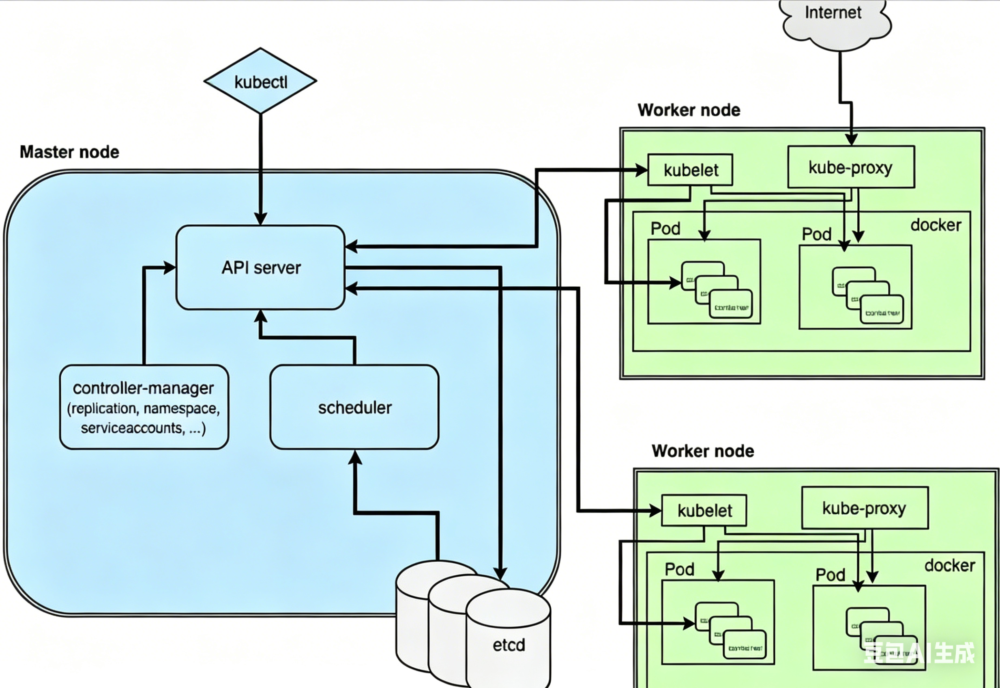

# Kubernetes

Kubernetes （简写：K8S），在希腊语意为“舵手”或“驾驶员”

k8s是谷歌在2014年开源的容器化集群管理系统

目标：让部署容器化应用更加简洁和高效

# 0 绪论

## 0.1 功能

1. 基于容器对应用运行环境的资源配置要求，自动部署应用容器
2. 自我修复：
   - 容器启动失败，会进行重启
   - 部署的节点有问题时，会对容器进行重新部署和重新调度
   - 当容器未通过监控时，会关闭此容器直到容器正常运行时，才会对外提供服务。
3. 水平扩展：通过简单的命令、用户UI界面或基于CPU等资源使用情况，对应用容器进行规模扩大或裁剪
4. 服务发现：内置服务发现和负载均衡
5. 滚动更新：根据应用的变化，对应用容器运行的应用，进行一次性或批量式更新
6. 版本回退
7. 密钥和配置管理
8. 存储编排：自动实现存储系统挂载及应用
9. 批处理：一次性任务，定时任务

## 0.2 [集群架构](https://developer.aliyun.com/article/1635071)

### Master Node

- 也称Control  Plane

- k8s 集群控制节点，对集群进行调度管理，接受集群外用户去集群操作请求

- Master Node 由API Server、Scheduler、ClusterState Store（ETCD 数据库）和 Controller MangerServer 所组成

- **API Server**

  - 集群的统一入口，暴露 Kubernetes API

  - 功能：
    - **验证和授权**：负责验证用户的身份，并根据配置的访问控制策略进行授权，确保只有合法的请求才能对集群进行操作。
    - **集群状态管理**：集群状态信息都通过它来访问和更新
    - **通信枢纽**：集群的通信桥梁
  - 当用户或其他组件向 Kube-API Server 发送请求时，API Server 首先进行身份验证和授权检查，然后对请求的数据进行验证和处理。处理完成后，API Server 会将数据存储到 etcd 中，同时通知其他组件进行相应的操作。

- **Etcd**

  - Etcd 是一个分布式键值存储，用于存储 Kubernetes 集群的所有数据，所有的配置信息、状态信息都存储在 etcd 中。
  - 功能：
    - **数据存储**：Etcd 负责存储所有的集群状态数据，包括 Pod、Service、ConfigMap、Secret 等。
    - **数据可靠性**：Etcd 通过分布式架构保证数据的高可用性和一致性，确保集群状态数据在发生故障时仍能可靠存储。
    - **数据访问**：Etcd 提供了高效的键值对存储和访问接口，支持高频率的读写操作
  - API Server 通过 etcd API 进行数据的读写操作。当集群状态发生变化时，APIServer 会将新的状态数据写入 etcd，同时其他组件可以监听 etcd 的变化，从而进行相应的处理。

- **Scheduler**

  - Scheduler 是 k8s的调度组件，负责将新创建的 Pod 调度到合适的工作节点上。它根据预设的调度策略和节点状态，选择最合适的节点来运行 Pod。
  - 功能：
    - 资源调度：Scheduler 根据节点的资源使用情况和 Pod 的资源需求，选择合适的节点来运行 Pod。
    - 策略配置：支持多种调度策略，包括资源优先、亲和性、反亲和性等，用户可以根据需求自定义调度策略。
    - 负载均衡
  - Scheduler 通过监听 Kube-API Server 上的调度请求，获取需要调度的 Pod 列表。然后，它根据预设的调度策略和节点的状态，选择最合适的节点，并将调度结果写回 API Server，最终由相应的节点来运行 Pod。

- **Controller-Manager**

  - Controller-Manager 是 Kubernetes 控制平面的控制管理组件，负责管理集群的各种控制器。这些控制器是用于处理集群状态变化的后台进程。
  - 功能：
    - **控制器管理**：包括 Node Controller、Replication Controller、Endpoint Controller、Namespace Controller 等，这些控制器分别负责节点管理、副本管理、服务发现、命名空间管理等功能。
    - **自动化操作**：控制器通过监听集群状态变化，自动执行相应的操作，如副本调整、故障节点隔离、服务更新等。
    - **一致性保证**：通过控制器的自动化操作，Kube-Controller-Manager 保证了集群状态的一致性和可靠性。
  - Controller-Manager 通过监听 API Server 的事件，获取集群状态变化的信息。根据不同的控制器，它会执行相应的操作，如创建或删除 Pod、副本调整、节点故障处理等，并将结果写回 API Server，从而更新集群状态。

### Worker Node

- **Kubelet**
  - 是运行在每个工作节点上的主要代理进程，负责管理节点上的 Pod 和容器。它通过与 Kube-APIServer 交互，确保节点上容器的正确运行。
  - 功能：
    - **Pod 管理**：Kubelet 负责启动和停止节点上的 Pod，并监控它们的状态，确保每个 Pod 按照预期运行。
    - **状态报告**：Kubelet 定期向 Kube-API Server 报告节点和 Pod 的状态，包括资源使用情况、健康状态等。
    - **配置管理**：Kubelet 根据从 Kube-API Server 获取的配置信息，配置和管理节点上的容器运行环境。
  - Kubelet 通过监听 Kube-APIServer 的调度信息，获取需要在本节点上运行的 Pod 列表。它根据 Pod 的配置文件，调用容器运行时（如 Docker、containerd）来启动和管理容器。同时，Kubelet 会定期向 Kube-APIServer 发送心跳信号和状态报告，确保控制平面能够及时了解节点和 Pod 的运行状况。
- **kube-proxy**
  - Kube-Proxy 是 Kubernetes 中的网络代理服务，运行在每个工作节点上，负责维护网络规则，管理 Pod 间的网络通信和负载均衡。
  - 功能：
    - **服务发现**：Kube-Proxy 负责维护节点上的网络规则，确保服务 IP 和端口能够正确映射到相应的 Pod 上。
    - **负载均衡**：Kube-Proxy 通过 IP Tables 或 IPVS 实现服务的负载均衡，将请求分发到后端的多个 Pod上。
    - **网络路由**：Kube-Proxy 处理网络流量，确保节点内外的通信能够正确路由到目标 Pod。
  - Kube-Proxy 通过监听 Kube-API Server 获取服务和端点的变化信息，然后根据这些信息动态更新节点上的网络规则。它使用 IP Tables 或 IPVS 来实现网络流量的转发和负载均衡，确保请求能够正确分发到相应的 Pod 上。
- **Container Runtime**
  - 容器运行时（Container Runtime）是 Kubernetes 中用于运行和管理容器的组件，常见的容器运行时有 Docker、containerd、CRI-O 等。
  - 功能：
    - **容器管理**：容器运行时负责启动、停止和监控容器的运行状态。
    - **资源隔离**：容器运行时通过 cgroup、namespace 等机制实现容器的资源隔离和限制。
    - **镜像管理**：容器运行时负责从镜像仓库拉取容器镜像，并在节点上进行存储和管理。
  - Kubelet 通过 CRI（Container Runtime Interface）与容器运行时进行交互，向其发送启动和停止容器的指令。容器运行时根据这些指令，调用底层操作系统的容器技术（如 cgroup、namespace）来管理容器的生命周期和资源使用。同时，容器运行时还负责从镜像仓库拉取和管理容器镜像，确保容器能够按需启动。

## 0.3 核心概念

### 0.3.1 Pod

**Pod 是 K8s 最小、最基础的调度单元（运行单元）**，也是 K8s 调度、部署、管理的**最小原子**。

一个Pod里面可以包含1个或多个容器。

同一个Pod内的容器有以下特性：

1. 共享特性
   - 共享网络命名空间
     - 整个Pod共用同一个IP、同一个网卡、同一个端口空间
     - 容器之间直接用`localhost:port`就能相互访问
     - 不能在同一个Pod里占用相同端口，端口会冲突
   - 共享PID命名空间：默认不开启，配置`shareProcessNamespace: true`，容器能相互看到对方进程，可以互相查看，调试进程
   - 共享存储卷：Pod挂载的卷，所有容器都能挂载使用，实现文件共享，日志共享
   - 共享主机名，域名
   - 统一生命周期：同时创建，同时销毁，同时调度
     - 不会单独重启Pod里某一个容器，任一容器异常，可触发Pod重启
     - 调度时整体被调度到某一个节点，不会拆分到不同机器
2. 约束特性
   - 资源约束：CPU / 内存 是 Pod 维度整体限制，内部多个容器瓜分 Pod 分配的资源。
   - 同一节点绑定：同一个 Pod永远只会跑在同一个 K8s 节点，不会跨节点拆分。
   - 日志与隔离：每个容器的日志独立，归属同一个Pod。**网络和存储互通，但文件系统隔离，只能通过Volume共享文件**

### 0.3.2 Controller

**Controller 是管理单元**，负责：创建、扩缩容、重启、自愈、版本更新 Pod

**从不直接创建日常业务 Pod**，都是创建 Controller，由 Controller 帮你生成并维护 Pod。

| Controller类型 | 管理 Pod 特点                          | 适用场景                       |
| -------------- | -------------------------------------- | ------------------------------ |
| Deployment     | 无状态、随机 Pod、可随意重建           | web 服务、后端接口（90% 业务） |
| StatefulSet    | 有状态，有固定名称、固定网络标识、有序 | MySQL、Redis、MQ 有状态中间件  |
| DaemonSet      | 每个节点自动跑一个 Pod                 | 日志收集、监控代理、节点 agent |
| Job            | 跑完就退出的 Pod                       | 批量任务、数据备份             |
| CronJob        | 定时生成 Job 再创建 Pod                | 定时脚本、定时报表             |

### 0.3.3 Service

 Service 是 将运行在一个或一组 Pod上的网络应用程序公开为网络服务的方法。

Pod有两个致命的问题

- Pod随时会被销毁，重建，重建后IP会变
- 一个 Controller 管理多个 Pod 副本，**需要统一入口访问**

Service作用：

- 在集群内，给一组Pod提供固定不变的虚拟IP（Cluster IP）

- 在集群内，用Service名称DNS直接访问，不用记IP（K8s 集群里自带 **CoreDNS**，相当于集群内部的「专属 DNS 服务器」。

  所有 Pod、Service 都会被 CoreDNS 自动解析成域名）

- 做负载均衡，把请求转发给正常的pod

Service 通过 **selector 标签** 关联 Pod：

- Deployment Controller 给 Pod 打标签 `app=web`
- Service 配置 selector `app=web`
- Service 自动匹配所有带这个标签的 Pod，纳入后端转发池

| Service类型  | 特点                                                         |
| ------------ | ------------------------------------------------------------ |
| ClusterIP    | 集群内部虚拟 IP，**只能集群内互相访问**，最常用。            |
| NodePort     | **给集群里每一台宿主机，都开放同一个固定端口**，外部可以通过任意一台 **宿主机 IP:NodePort 端口** 访问到后端 Pod。 结构链路：外部用户 → 任意节点宿主机 IP:NodePort 端口 → Service → 负载均衡 → 后端 Pod |
| LoadBalancer | 对接云厂商负载均衡，分配公网 IP，对外暴露服务                |
| ExternalName | 把 **K8s 内部 Service 域名** 映射到**外部外网域名 / 内部自建域名**。 |

### 0.3.4 三者之间的关系

**层级关系：客户端 → Service → Controller → Pod**

三者之间的联系：

1. **Controller 管 Pod**：负责创建、启停、扩容、自愈 Pod；
2. **Service 罩住一组 Pod**：通过标签选中 Pod，对外提供固定访问入口 + 负载均衡；
3. **访问从不直接连 Pod**：永远连 Service，底层 Pod 随便重建、漂移、扩容，业务无感知。

