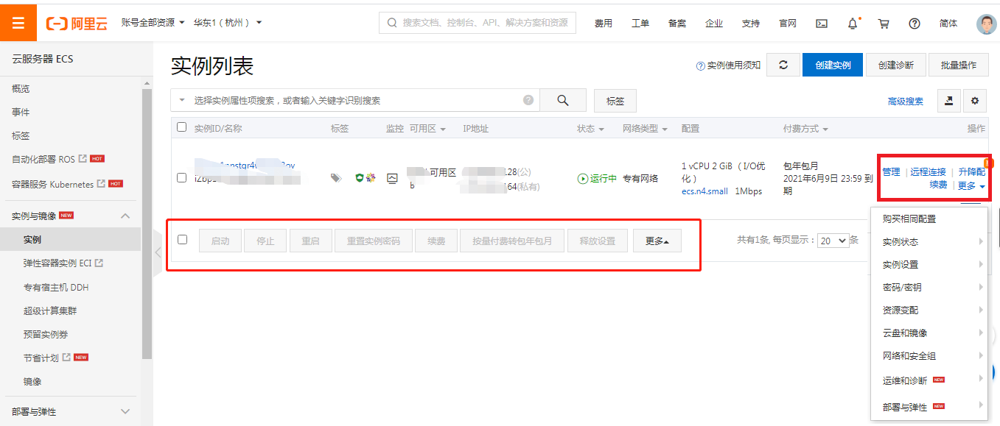
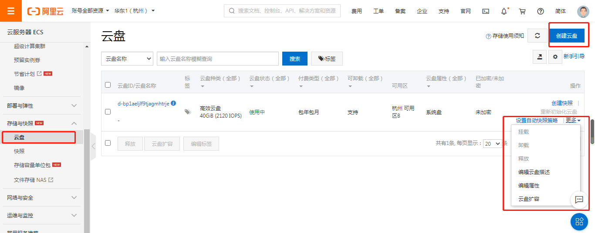

# ECS

Elastic Compute Service，基于大规模分布式计算系统，通过虚拟化技术整理IT资源，为各行业提供互联网基础设施服务设备。

- 应用程序的基础运行环境

  每个ECS实例上都运行着用户选择的操作系统，一般是某个linux或windows的发行版，用户的应用程序运行在实例的操作系统之上。

- 最简化的弹性架构

  较好的实践是将ECS和其它云计算产品配合使用

- 特点：弹性，支持纵向（服务器的配置变更，内存，cpu等）和横向（相关产品服务）扩展两种能力

# 1 ECS基本操作

## 1.1 选购

根据业务需求，对ECS进行选型配置，创建实例（实例，系统镜像，存储），创建web环境，

我们可以看看在购买实例时镜像的选项。它有许多镜像

记得远程链接之前要在安全组配置里面，开放相应端口，例如smartty的端口为22，要想通过smartty链接linux服务器，必须开放此端口。

**linux系统为22端口，windows系统为3389端口，需要开放这两个端口，不然无法远程连接ECS**

本地的Windows电脑如果想连接远程的安装了windows系统的服务器，可以通过本地windows自带的远程连接工具进行连接，位置：附件/远程桌面连接（输入ip，用户名是Administrator）

如果为linux建议通过smartty连接。

## 1.2 管理ECS

### 实例管理

一台云服务器相当于一台虚拟计算机，包含cpu、内存、操作系统、带宽、磁盘等最基础的计算机组件。

你可以在阿里云平台，方便的定制、更改实例的配置。

### 磁盘管理

如果觉得系统存储空间太小了，可以在存储与快照栏，挂载更大的磁盘。在中台挂载完毕后，还要再命令行进行相应的命令配置。

## 快照管理

快照作为一种便捷高效的数据保护服务手段，一般用于以下场景

1. 系统盘、数据盘的日常备份
2. 更换操作系统、应用软件升级或业务数据迁移
3. 生产数据的多副本应用