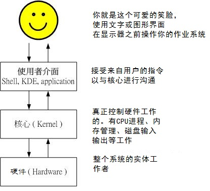
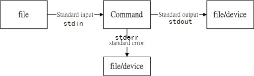
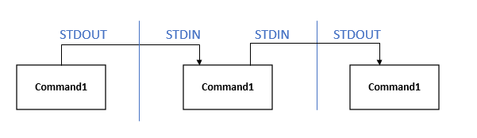
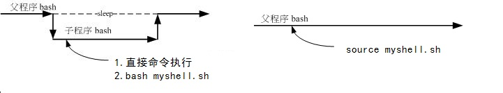

# Shell

# 0 shell 初识

## 0.1 shell功能


## 0.2 脚本初识

### 0.2.1 hello bash

```bash
#!/usr/bin/bash
ping -c1 www.baidu.com &> /dev/null && echo "baidu connected" || echo "baidu disconnected" 
echo $?

# #!/usr/bin/bash， #与!之间没有空格，这个叫shebang机制，程序的第一行，也仅第一行。声明这个脚本程序默认用哪个解释器执行，
# 如果通过 bash ./ping01.sh 执行，则就显式通过 bash 这个解释器执行，如果通过 ./ping01.sh 执行，则shebang机制就会生效，默认通过 #! 声明的解释器执行
# 显式指定的级别大于shebang声明，如果没有显式指定，那么就会按shebang声明的解释器执行

# &>，数据流重定向，将本该出现在屏幕上得输出内容，重定向到其他文件得内容中去，在这里将屏幕内容重定向到垃圾黑洞设备/dev/null，而不会在屏幕打印

# && 逻辑与，前一条命令执行成功，则与的命令紧接着开始执行，如失败则不执行
# || 逻辑或，前面的命令执行成功，则不执行后面语句，如失败，则执行后面的语句

# $? 的值表示最近一条命令是否成功，0:success，非零:fail
```

### 0.2.2 bash中临时执行其他语言脚本

通过重定向，标准输入，然后执行其他语言脚本

```bash
echo "hello bash"

/usr/bin/python <<- EOF
print "hello python"
EOF
# 命令执行重定向标准输入里的脚本

echo "hello bash"
```

### 0.2.3 脚本执行方式与父子shell

```bash
# script 的执行方式，细节见linux 9.7.1 script执行方式
# 1. 直接命令执行（文件必须有rx权限），绝对路径/相对路径/path路径下的脚本
# 2. bash进程执行
# 前两种，script执行完毕，bash内的数据都会被删除（子shell中生效）

# 3. 利用source执行，在父shell进程中执行，各项操作数据会在原来的bash中生效

# myshell.sh 内容如下
cd /home/
ls

chmod a+x myshell.sh
# 分别实验以下命令，在脚本执行完成后，查看当前shell环境（父shell）所在的目录位置
bash myshell.sh
./myshell.sh

. myshell.sh
source myshell.sh

# 结果
# 前两个父shell 的目录位置不变
# 后两个父shell 的位置跑到home下了
```

### 0.2.4 bash shell 的环境配置文件

环境配置文件让bash在启动是直接读取这些配置文件，以规划好bash的操作环境。

配置文件又可以分为全体系统配置文件（`/etc/profile、/etc/bashrc`等）以及用户个人的偏好配置文件（`~/.bash_profile、~/.bashrc`），上面列举的文件是在登录shell的时候就会执行的配置。这两个配置文件是在退出登录的时候执行的`~/.bash_history、~/.bash_logout`。

login shell 与 non-login shell详见linux9.4.3

# 1 bash



只要能够操作应用程序的接口都能够称为shell，我们必须要通过“shell”将我们输入的命令与内核通信，好让内核可以控制硬件来正确无误的工作。

shell是看不见摸不着的，终端不是shell。

shell的版本众多，可以在**/etc/shells**文件中看到，我们可以使用哪些shell。

**“Bourne Again SHell（简称bash）”**就是比较流行的一个shell版本，bash是GNU计划中重要的工具软件之一。

## 1.0 bash初步

### 1.0.1bash功能

1. 命令记忆功能（history），前一次登录以前执行的命令记录在主文件夹内的**.bash_history**
2. 命令与文件补全功能（Tab），Tab按键用于补全
3. 命令别名设置功能（alias），eg：**alias lm=' ls -al '**
4. 作业控制、前台、后台控制（job control，foreground ，background）
5. 程序脚本（shell script），可以将平时管理系统常需要用的连续命令写成一个文件，该文件支持交互的方式
6. 支持统配符

### 1.0.2 bash内置命令判断：type

**type**：判断每个命令是否为bash的内置命令

- **type [-tpa] name**
- t，命令输出这些字眼：`file（外部命令）/alias（命令别名）/builtin（bash内置的命令）`
- p，如果name为外部命令式，才会输出完整的文件名
- a，会在path变量定义的路径中查找

### 1.0.3命令的执行

`\`反斜杠的应用在命令太长时，换行便于查看编辑

## 1.1 命令别名与历史命令

命令别名，自定义的变量在你注销bash后就会失效，所以你想要保留你的设置，就得将这些设置写入配置文件才行

### 1.1.1 命令别名

命令别名是一个很有趣的东西，特别是你惯用的命令特别长的时候

1. 设置别名**alias**：
   - **alias  other_name='replace_operation'**
   - alias定义规则与变量定义规则几乎相同
   - 替代既有命令：`alias rm='rm -i'`
   - 查看别名列表：`alias`
   - `eg：alias lm='ls -l | more'`，以后输入lm的命令就和`ls -l | more `的命令是一样的效果
2. 取消别名**unalias**：
   - **unalias other_name**
3. 

### 1.1.2 历史命令

**history**

- **n**：列出最近的n条命令
- **-c**：将目前shell中的所有history内容全部清除（当前登录的历史）
- -r：将histfiles中的内容读到目前的shell的history记忆中
- -w：将目前shell中history记忆内容更新到histfiles中，历史命令在我注销后，会将最近的HISTSIZE条记录到~/.bash_history中
- -a：将目前新增的history命令新增到histfiles中，若没有histfiles，则增加到**~/.bash_history**中

**历史命令执行**

- !!：执行上一个命令
- !n：执行第那条命令
- !command：由最近的命令向前搜寻以command开头的命令，并执行

## 1.2 bash shell操作环境

### 1.2.1 路径与命令查找顺序

命令执行顺序

1. 以相对/绝对路径执行命令，
2. 由alias找到该命令来执行
3. 由bash内置的（builtin）命令来执行
4. 通过$PATH这个变量的顺序找到第一个命令来执行

### 1.2.2 bash登录与欢迎信息

**登录之前显示**：/etc/**issue** 和 /etc/issue.net ：

- 前者/etc/issue：一个负责本地登录前显示， 是显示在TTY控制台登录前（非图形界面）
- 后者/etc/issue.net ：负责网络登录前显示。是显示在 Telnet (SSH默认不开启)远程登录前

登录之后显示（欢迎信息）：/etc/**motd**，不管你是 TTY 还是 PTS 登录，也不管是  Telnet 或 SSH 都显示这个文件里面的信息。

### 1.2.3 环境配置文件

环境配置文件让bash在启动是直接读取这些配置文件，以规划好bash的操作环境。

配置文件又可以分为全体系统配置文件以及用户个人的偏好配置文件

login shell与non-login shell

1. login shell ：取得bash时需要完整流程的，就称login shell，
   - eg1：你要由tty登录，需要输入账号和密码，此时取得的bash就称login shell
   - eg2： `su - user_name`
2. non-login shell：取得bash接口的方法不需要重复登录的举动，
   - eg1：在x window图形界面中启动终端机（此时没有再输入账号密码）
   - eg2：在原本的bash环境下在次执行bash这个命令（此时没有再输入账号密码），那第二个bash（子进程）也为non-login shell
   - eg3：`su user_name`

这两种情况会导致读取的配置文件不一样。

**non-login shell会读配置文件：**`~/.bashrc，而bashrc还会调用/etc/bashrc`

**login shell**会读取以下文件：

1. 系统整体配置

   - `/etc/profile`：login shell 必读，他还会调取外部设置数据，centos5.x会默认依序被调用进来
     - `/etc/inputrc`：自定义输入按键功能
     - `/etc/profile.d/*.sh`：这个目录下面的文件规定了bash操作接口的颜色、语系、ll与ls、vi、which的命令别名等**，如果想帮所有用户设置一些共享的命令别名可以在这个目录下自行创建扩展名为.sh的文件，并将所需写入即可**

2. 个人偏好设置

   - bash在读完整体环境配置后，接下来就会读取用户个人的配置文件
   - 依序读取`/~/.bash_profile > /~/.bash_login > /~/.profile`，前面的文件如存在，就不会再读后面的文件
   - `/~/.bash_profile会再调取/~/.bashrc`。**所以我们可以在此将自己的偏好设置写入该文件（`/~/.bashrc`）**

3. login_shell的配置文件读取流程

   

**手动更新配置：source**

- **source 配置文件**

**其他相关配置文件**

- `/etc/man.config`：执行man时man page的路径到哪里去找
- `~/.bash_history`：历史命令
- `~/.bash_logout`：当我注销bash后系统再帮我做完什么操作才离开

### 1.2.4 终端机快捷键

**快捷键设置**

查看终端机**"特殊功能"**按键列表：**stty -a**，stty（setting tty）

输出的**^**代表【Ctrl】的意思，其他的eof，erase，intr等自行查阅便知

**按键修改**，eg：**stty erase ^h**

修改终端机设置值，**set [ -uvCHhmBx ]**

**常用快捷键**

| 组合键        | 意义                                                     |
| ------------- | -------------------------------------------------------- |
| Ctrl + C      | 终止当前输入的命令，终止运行的程序                       |
| Ctrl + D      | 退出bash子进程，or 输入结束（eof），从光标删右方一个字符 |
| Ctrl + Z      | j将运行的程序送到后台                                    |
| Ctrl + L      | q清屏                                                    |
| Ctrl + R      | s搜索历史命令，搜索到回车即可执行                        |
| Ctrl + U or K | c从光标位删至行首or行尾                                  |
| Ctrl + S or Q | 暂停or 恢复屏幕输出                                      |


### 1.2.5 通配符与特殊符号

| 通配符       | 意义                           |
| ------------ | ------------------------------ |
| *****        | 0到多个任意字符                |
| **？**       | 至少一个任意字符               |
| **[ ]**      | 字符集，eg：[abceft]           |
| **[ - ]**    | 字符段，eg：[a-z]              |
| **[ ^ ]**    | 取非，eg：`[^a-z]`，非小写字母 |
|              |                                |
| **特殊符号** | **意义**                       |
| #            | 批注                           |
| \            | 转义                           |
| **\|**       | 管道符                         |
| **;**        | 命令分割符                     |
| **~**        | 用户主文件                     |
| **$**        | 变量前导符                     |
| **&**        | 作业控制                       |
| **!**        | 非                             |
| **/**        | 目录符号，路径分割符           |
| **>,>>**     | 数据流重定向，输出导向         |
| **<,<<**     | 数据流重定向，输入导向         |
| **''**       | 不具占位符                     |
| **""**       | 具占位符                       |
| **``**       |                                |
| **( )**      | 子shell的起始与结束            |
| **{ }**      | 命令块组合                     |
|              |                                |
|              |                                |

## 1.3 数据流重定向

数据流重定向就是将某个命令执行后应该要出现在屏幕上的数据传输到其他地方去，例如文件或设备



1. **标准输入stdin**：需要由键盘输入的数据改由文件内容来替代，代码为**0**，使用 <（指定内容输入文件） 或 <<（设置终止符）；
2. **标准输出stdout**：命令执行所回传的正确信息，代码为**1**，使用 **>（覆盖内容） 或 >>（追加内容）**
3. **标准错误输出stderr**：命令执行失败后，所传回的错误信息，代码为**2**，使用 2>（覆盖内容） 或 2>>（追加内容）


```bash
####标准输出####

#屏幕不输出任何信息，~下有一个mine文件创建。
ls -al / > ~/mine 
#若~下mine文件不存在，则创建
#若存在，则清空文件，在写新数据
# >> 追加数据到原文件

#将stdout写入list_right文件，将stderr写入list_error
find /home -name .bashrc > list_right 2> list_error

#stdout与stderr写入同一个文件
find /home -name .bashrc > list 2>&1
# 混合重定向 &>
find /home -name .bashrc &> list

#垃圾黑洞设备/dev/null
find /home -name .bashrc 2> /dev/null

####标准输入####

cat > introduce << "eof"
my name is lxx, hen gao xin ren shi da jia
eof
#eof作为文本输入的结束，而不需要按Ctrl+d

#将introduce的内容复制到catfile文件中
cat > catfile < introduce
```

### 命令执行的判断

很多命令我想要一次输入去执行，而不想要分次执行。除了通过shell script，可以通过 **;  &&  ||**

- 如若命令之间**无相关性**可以通过命令间间隔**`;`**分号，
  - **cmd1 ; cmd2 ; cmd3**
- 如若命令之间**有相关性**可以通过 **`&&  ||`**来实现
  - **cmd1 && cmd2**，cmd1执行成功才执行cmd2
  - **cmd1 || cmd2**，cmd1执行失败才执行cmd2
  - cmd1 || cmd2 && cmd3，cmd1执行成功后执行cmd3，cmd1执行失败执行cmd2，cmd2执行成功后执行cmd3

## 1.4 管道命令（pipe）



命令输出的数据需要经过几个连续命令的处理，才是我们想要的数据，就会用到管道命令。

**注意**：

- 管道命令仅会处理stdout，对stderr会予以忽略
- 管道命令必须要能够处理来自前一个命令的stdout作为自己的stdin才行。
- 在管道命令里**“  -  ”**可以表示stdin或者stdout

### 1.4.1 选取命令

一般来说，选取信息通常是针对**“行”**来分析的，并不是整篇信息分析的。

1. **cut**
   - 从一行信息中取出我们想要的某些段
   - **cut  -d  'divider'  -f  field1 [, field2, field3 ] **：d 后面接分隔符（' ' 表示空白符），f 后面接我们以分隔符分割的第几段，用整数n
   - **cut -c n1-[n2**]：以字符数为单位，显示字符区间的内容
2. **grep**
   - 分析一行的信息，若有我们想要的信息，则取出该行
   - **grep [ -acinv ] [ --color=auto ]  '查找字符串'  filename**
   - i，忽略大小写
   - n，顺便输出行号
   - v，反向选择，即显示出没有"查找字符串"的行
   - c，计算“关键字”在所在行出现的次数

### 1.4.2 排序去重统计命令

计算数据里相同类型的数据总数，类似于数据库里的聚合函数般。

1. **sort**
   - **sort[ -tkuf ] filename**
   - t，分隔符，默认tab
   - k，以分割符分割的第几个字段排序
   - u，相同数据取其一，去重
   - f，忽略大小写
2. **uniq**
   - 内容排序完成，去重
   - uniq [ -ic ]
     - i，忽略大小写
     - c，重复项计数
3. **wc**
   - 统计内容数据（word count）
   - **wc [-lwm]**
   - l，列出行数
   - w，流出单词数
   - m，列出字符数

### 1.4.3 字符转换命令

比如说将内容中大写改小写，tab转空格键

1. **tr**
   - 删除或替换
   - **tr [ -ds ] SET_OR_STR**
   - d，删除
   - s，替换
2. **col**
   - **col [ -xb ]**
   - x，将tab转换成对等的空格键
3. **join**
   - 处理两个文件之间的关联数据，将两个文件中有相同数据的那一行续接在一起。类似于数据库中的**关联查询**
   - **join [ -ti12 ] file1 file2**
   - t，分隔符，默认以空格，并且对比两个文件的第一个字段
   - i，忽略大小写
   - 1，第一个文件用哪个字段
   - 2，第二个文件用哪个字段
4. **paste**
   - 直接将两个文件的同行，连接在一起
   - **paste [-d] file1 file2**
   - d，分割符，默认tab
   - -，如果file写成-，表示stdin

### 1.4.4 切割命令

如果一个文件太大，导致一个携带式设备无法复制的问题，通过split，就可以将一个大文件依据文件的**大小或行数分割成小文件**

**split [-bl] file prefix_name**

- b，按文件内存大小进行分割，例如b，k，m等
- l，按行数进行分割
- prefix_name，小文件名的前缀

### 1.4.5 参数代换

xargs可以产生某个命令的参数，xargs 可以读入stdin的数据，并且以空格符或断行字符进行分辨，将stdin的数据分割成arguments。

**xargs [ -0epn ] command**

- 将stdin的内容经xargs分析后，处理成参数（或者多组参数），一组参数作为command的参数使用
- eof，停止分析符
- n，多少个参数为一组
- p，每输入一组参数执行command前询问用户是不是要执行，执行输入y

### 1.4.6 双向重定向

**tee**

- **tee会同时将数据流送予文件与屏幕**
- **tee [-a] file**
- a，以累加（append）的方式

## 1.5 其他

1. 命令和文件自动补齐【Tab】： 

   - 在centos7当中，只要你安装了`bash-completion-2.7-5.el8.noarch`，你就有补全功能

   - ```bash
     [root@VM-4-8-centos ~]# rpm -qa | grep bash-comp
     bash-completion-2.7-5.el8.noarch
     ```

2. 命令历史记忆功能【上下键】：

   - 【!number】——执行history命令输出命令序列对应编号的命令
   - 【!string】——找到history历史执行命令中最近以string开头的命令、
   - 【!$】—— 上一个命令的最后一个参数
   - 【!!】——上一个命令
   - 【^R】——【ctrl + R】搜索历史命令

3. 命令别名

   - **alias  other_name='replace_operation'**
   - 取消别名：**unalias other_name**

4. 快捷键（ ^  —— ctrl ）：

   - ^R——搜索历史命令
   - ^D——logout，退出命令行
   - ^A ^E——光标移动到命令的开头，结尾
   - ^U ^K——从光标处删到开头、末尾
   - ^L—— clear 清屏
   - ^S  ^Q —— 锁定终端，使任何人不允许输入，但是输入操作会记录。解除ctrl +s的锁定，同时会展示或执行ctrl +s锁定时输入的指令

5. 前后台控制作业

   - & ——cmd &，命令丢到后台执行
   - nohup——nohup cmd，让你在脱机或注销系统后，还能够让工作继续进行
   - jobs -l ——查看作业，
   - ^c——是强制中断程序的执，程序不会再运行。^z——中断当前作业，维持挂起状态，
   - bg %jobnumber——后台运行jobs作业中jobnumber的作业，fg %jobnumber——前台运行jobs作业中jobnumber的作业
   - kill -signal %number
   - 通常在vim 编辑一个文档的时候，想干点其他什么事，这时候可以通过^Z去中断当前vim，做完之后，再通过fg回到之前中断的作业中来。

6. [重定向](https://www.milinger.com/a250.html)

   - 0——标准输入（<，<< EOF），1——正确输出（>覆盖内容，>> 追加内容），2——错误输出（2> 覆盖内容，2>>追加内容）
   - &>——将正确输出和错误输出**都**重定向到文件
   - tee 双向重定向

7. 管道命令

8. 命令排序

   - 单行执行多个命令
   - `;`——不具备逻辑判断能力，每个命令都会执行，不论是否报错
   - `&& 逻辑与 ||逻辑或`——具备判断能力，
     - 逻辑与&&，当逻辑符号左侧的命令执行成功才会执行逻辑符号右侧的命令
     - 逻辑或||，当逻辑符号左侧的命令执行失败才会执行逻辑符号右侧的命令

9. 通配符

   ```bash
   # * 匹配任意多个字符
   ls ha*
   ls *tx*
   rm -rf *.pdf
   rm -rf *
   ll /dev/sd[a-z]*
   
   # ? 匹配任意一个字符
   touch love loove live l7ve; ll l?ve
   -rw-r--r-- 1 root root 0 Oct  3 15:24 l7ve
   -rw-r--r-- 1 root root 0 Oct  3 15:24 live
   -rw-r--r-- 1 root root 0 Oct  3 15:24 love
   # rm -rf l*ve
   
   # [] 字符集，匹配中括号中任意一个字符
   [a-zA-Z0-9] [^a-z]，尖角开头取非
   
   ll l[io]ve
   -rw-r--r-- 1 root root 0 Oct  3 15:28 live
   -rw-r--r-- 1 root root 0 Oct  3 15:28 love
   
   ll l[^a-Z]ve
   -rw-r--r-- 1 root root 0 Oct  3 15:28 l7ve
   
   # (cmd) 在子shell中执行cmd
   
   # {} 枚举值
   mkdir -pv ./{111/{aaa,bbb},222} || ls
   mkdir: created directory './111'
   mkdir: created directory './111/aaa'
   mkdir: created directory './111/bbb'
   111  222
   
   touch {a..c}{1..3} || ls
   a1  a2  a3  b1  b2  b3  c1  c2  c3
   
   cp -rv /etc/sysconfig/network-scripts/ifcfg-eth0 /etc/sysconfig/network-scripts/ifcfg-eth0.old
   # 可以写成下面的形式
   cp -rv /etc/sysconfig/network-scripts/{ifcfg-eth0,ifcfg-eth0.old}
   cp -rv /etc/sysconfig/network-scripts/ifcfg-eth0{,old}
   
   # \ 转义字符
   touch qin\ fei
   # 就创建了一个带有空格的文件
   # 而并没有创建两个文件
   
   # 转义回车符，使命令可以多行书写
   ls /etc/sysconfig/network \
   >/etc/hosts \
   >/etc/paaswd
   
   echo \\
   \
   echo "atb"
   # -e可以输出转义后的字符
   echo -e "a\tb"
   echo -e "a\nb"
   
   ```

10. echo 打印颜色文本。printf指令也可以格式化输出

    ```bash
    # 31m是指代文本的颜色，31m是红色，32m是绿色，33m是黄色。4开头的是修改文本的背景色。
    # 末尾一定要\e[0m，用于重置文本颜色，否则以后所有打印都是这个颜色
    echo -e "\e[1;31mthis is a red text.\e[0m"
    ```

11. 

# 2 shell变量

变量的类别：自定义变量和环境变量

## 2.1 变量的显示与设置

**set——查看所有变量（包含环境变量与自定义变量）**

1. **echo**：显示变量

   - **echo $变量名**
   - **echo ${变量名}**，常用于数字参数的变量，以及对变量进行删除替换等操作时（相当于计算变量）
   - echo 功能有很多，这里只是用到了查看变量的功能
   - 列出当前环境变量）——env
   - 列出所有变量（包含环境变量与自定义变量）——set

2. 设置自定义变量

   - 格式：**var_name=var_val**

   - 变量间赋值：**var1=${var2}**

   - 规则：

     - **等号两边不能直接接空格**，变量命名只能是英文和数字（数字不能开头）

     - 引用变量：`$var_name 或${var_name}`，`${var_name}`也用在拼接字符串（解决歧义），变量的右侧有其他字符时。

     - 变量的值若有空格，可用双引号或单引号将值罩起来。

       - 双引号可以解析值中的变量（占位符），而单引号不行

         ```bash
         qi=kh
         mine="my name is $qi" 
         echo $mine
         # my name is kh
         mine='my name is $qi' #重新赋值
         echo $mine
         # my name is $qi
         ```

     - 特殊符号用反斜杠`\`转义

     - **追加变量内容**

       ```bash
       PATH="$PATH":/home/bin
       ```

     - **环境变量**（全局变量）：**export var_name**

3. **取消变量unset**

   - **unset var_name**

## 2.2 环境变量env

### 2.2.1 变量列表

**env——查看所有环境变量**

**常见环境变量**

- HOME：代表用户主文件夹的位置，通过cd ~或者直接cd就可以切换到这个文件夹
- SHELL：当前这个环境使用的shell是那个程序
- PATH：就是执行文件查找的路径，目录与目录间通过冒号**":"**相隔

**set——查看所有变量（包含环境变量与自定义变量）**

常见自定义变量

- **PS1**：命令提示符，在命令之前的部分，也可以修改，可以查看相关资料修改

  ```bash
  [root@iZbp1a1nnstgr4w2bu73ovZ ~]# cd ../etc
  ```

- **$：关于本shell的线程号PID**

- **?：关于上个命令的回传码**

- OSTYPE，HOSTTYPE，MACHTYPE：主机硬件与内核等级

### 2.2.2 自定义变量转环境变量

**export var_name**

环境变量与自定义变量的区别在于：该变量是否会被子进程所继续引用。

当你登录linux并取得一个bash后，你的bash就是一个独立的进程。

在一个bash（父进程）中执行另一个bash（子进程），父进程就会处于暂停sleep的情况，只有子进程结束或被exit才能回到父进程中。

**子进程会继承父进程的环境变量，而不继承自定义变量**

**变量作用域**：被export后的变量，我们称为环境变量（全局变量）。环境变量可以被子进程（子shell）所引用，但是自定义变量（局部变量）则不会存在于子进程中。

**多个shell脚本中使用公共的自定义变量的方案：**

1. 用一个sh01.sh专门存放公共的变量
2. 其他的shell脚本在使用公共变量之前，执行**source  path/sh01.sh**（不会启用子shell，在当前shell声明自定义变量）
3. 即可引用

### 2.2.3 添加环境变量

```bash
# 1.针对所有用户长久有效
# 通过export添加变量参数
vim /etc/profile

# 通过这个函数可以实现在现有的path上面添加新的path
pathmunge () {
    case ":${PATH}:" in
        *:"$1":*)
            ;;
        *)
            if [ "$2" = "after" ] ; then
                PATH=$PATH:$1
            else
                PATH=$1:$PATH
            fi
    esac
}
pathmunge /usr/local/nginx/sbin
export PATH

# 保存etc/profile后，需要下面的命令使文件生效
source /etc/profile

# 2.针对当前用户长久有效
vi ~/.bash_profile
# 操作同上

# 3.针对当前登录会话有效，关闭之后下次登录shell就无效了
# 直接将上面的export 命令执行一遍。这种方式最简便，适合临时设置环境变量使用
```

## 2.3 键盘读取变量

- **read** 
  - `read [ -pt ] var_name`
  - p，后面接输入提示文本
  - t，输入等待时间，记住输入后一定要按回车，否则时间结束后依旧不能声明变量

## 2.4 命令的位置参数

这个概念就如同javascript，或python函数的参数列表一样，只不过在bash中这个函数概念换成了命令。当然bash中也有函数这个概念，后面会说到。

shell script 可以在脚本文件名后面带参数。而不需要像read命令在执行过程中再去输入参数。

eg：**/~/scripts/myshell.sh param1 param2 param3 param4**

在script脚本中可以使用以下变量去引用位置参数的值

- $0：这个变量用于获取执行脚本的名字
- $#：获取参数的个数
- $@：获取整个参数字符串，每个参数间通过空格键分割
- $n：n为位置的索引，$1，$2

**shift未知参数的移除和偏移**

**shift [n]**，这个就如同javascript数组的shift函数功能，用于移除位置参数序列的前n个元素。

## 2.5 declare声明变量类型

- **declare**

  - `declare [-aixr] var_name`

  - a，array，声明为数组变量

  - i，integer，声明为整形变量

    ```bash
    declare -i total=100+300+50
    echo $total
    #450
    ```

  - x，声明为环境变量，+-x，可以变换作用域

  - r，设置为只读

## 2.6 array变量

```bash
var[1]="first 1"
var[2]="second 2"
var[3]='last 3'
echo ${var[1]},${var[2]},${var[3]}

```

## 2.7 变量内容的删除、替代与替换、追加

**删除与替代，对原变量没有影响**

| 变量设置方式          | 说明                                                   |
| --------------------- | ------------------------------------------------------ |
| ${var#关键字}         | 变量内容从开头匹配"关键字"，将符合的最短数据删除       |
| ${var##关键字}        | 从头，最长匹配删除                                     |
| ${var%关键字}         | 从尾，最短匹配删除                                     |
| ${var%%关键字}        | 从尾，最长匹配删除                                     |
| ${var/旧子串/新子串}  | 变量内容符合旧子串，替换第一个被匹配到的旧子串为新子串 |
| ${var//旧子串/新子串} | 匹配旧子串，将变量内容中的所有旧子串替换为新子串       |

**变量的测试与内容的替换**

在某些时刻我经常需要判断某个变量是否存在，若存在，使用既有设置，若不存在则给予一个新值。

**冒号:**能识别str是否为空字符串`''`，将空字符串也认定为变量str未设置。

**减号-**为str为未设置（未定义）时，起到赋值作用

**加号+**为str为已设置时，起到赋值作用

**等号=**与减号的作用相似，**只是赋值的作用会影响到str**

**var=${str [ : ] [ +-= ]  expr }**

**追加内容**

```bash
PATH="$PATH":/home/bin
```

## 2.8 字符串

字符串有三种表示：

1. 单引号

   ```bash
   # 1 单引号字符串中的变量是无效的，单引号里的任何字符（全部字符）都会原样输出
   a=1
   echo 'ab$acd'
   # 输出 ab$acd
   echo 'bb${a}bb'
   # 输出 bb${a}bb
   
   # 2 单引号字符串不能使用单独的一个单引号，对单引号使用转义符后也不行，
   echo 'abbbccc'ffff'
   line 9: unexpected EOF while looking for matching `''
   line 10: syntax error: unexpected end of file
   
   # 3 可以成对出现，作为字符串拼接使用
   echo 'abbbccc'aaa'ffff'
   # 输出 abbbcccaaaffff
   a=1
   echo 'ab'$a
   # 输出ab1
   echo 'ab'$a'ab'
   # 输出ab1ab
   ```

2. 双引号

   ```bash
   # 1 双引号可以有变量
   str='cd'
   str1="ab$str"
   echo $str1
   # 输出 abcd
   # 如果"ab$str"中$str后还有其他字符，就需要使用${}，如"ab${str}ef"，否则ef会被当做是变量名的一部分使用
   str2="ab${str}ef"
   # 输出 abcdef
   
   # 2 拼接字符串
   h="hello"
   str1="1","${h}"
   str2="1",$h
   str3="1,${h}"
   str4="1,$h"
   echo $str1
   echo $str2
   echo $str3
   echo $str4
   # 全部输出一致
   1,hello
   ```

3. 不用引号。

```bash
str1=abcd1
echo $str1
# 字符串拼接
echo 12$str1
echo 12${str1}34
```

其他

```bash
# 1 获取字符串的长度
name1="hello 1"
echo ${#name1}
# 输出 7

# 2 提取子字符串
name="hello123"
echo ${name:2:5}
```


# 9.7 shell script

shell script 是利用shell的功能所写的一个“程序”，这个程序是使用纯文本文件，将一些shell的语法与命令（含外部命令）写在里面，搭配正则表达式，管道命令与数据流重定向等功能，以达到我们所想要批处理的目的。

## 9.7.1 script 基本

注意：

1. 命令的执行从上而下，从左而右。
2. 命令、参数间的多个空白，空白行会被忽略，tab会视为空白
3. 读到enter就会执行，"\\[enter]"让一条命令扩展至下一行
4. #用来做批注

#### 1 第一个script

```bash
#!/bin/bash
# Program:
# This program shows ...
# History：
# 2005/08/23
PATH=/bin:/sbin:/usr/sbin/:/usr/local/sbin
export PATH
echo -e "Hello World! \a \n"
exit 0
```

1. **#!/bin/bash**：第一行是声明这个script使用的shell名称
   - 通过这一句，当这个程序被执行时，它就能够加载bash的相关配置环境配置文件
2. **PATH**：
   - 主要环境变量的声明
   - 这里相当于一般程序里的**import**的功能
   - 建议务必要将一些重要的环境变量设置好（设置PATH与LANG等)，如此一来，则可让我们这个程序在进行时直接执行一些外部命令，而不必写绝对路径。
3. **echo**
   - 主要程序部分
4. **exit**
   - 告知执行结果。
   - 讨论一个命令执行成功与否，可以使用**$?**这个变量来看看。
   - exit n相当于一个return flag，我们可以通过查看$?这个flag来查看程序的执行情况如何

#### 2 script执行方式

假设现在写了一个程序文件名是/home/scripts/myshell.sh

1. 直接命令执行：myshell.sh文件必须要具备可读与可执行**（rx）**的权限
   - 绝对路径：命令行直接输入：**/home/scripts/myshell.sh**
   - 相对路径：假设工作目录在/home/scripts，则命令行直接输入：**./myshell.sh**
   - 变量PATH的功能：将myshell.sh放到PATH指定的目录内，例如：/bin。然后在命令行直接输入：**myshell.sh**即可
2. 以bash进程来执行
   - 假设工作目录在/home/scripts，命令行直接输入：**bash myshell.sh** 或者 **sh myshell.sh**
3. 利用source来执行脚本
   - 假设工作目录在/home/scripts，命令行直接输入：**source myshell.sh**
4. 利用点命令来执行脚本
   - sourse 在`Bourne Shell`中的等价命令是一个点`.`，`source ./*.sh`和`. ./*.sh`的执行方式是等价的

**区别：**

1. 前二者：他们都会使用一个新的bash环境来执行script（**子进程的bash内执行**），script执行完毕后，bash内的数据都会被删除
2. 后者：**在父进程中执行**，各项操作数据都会在原本的bash内生效




## 9.7.2 判断式

判断式就如同其他程序语言中用于输出true or false的条件判断句，然而在bash中是通过执行命令，命令返回**$?**这个变量来判断的。

这里还有其他一些常用的判断式

### 1. 判断命令test

**test expression**

1. 判断文件名的类型，
   - **test [ -efdbcSpL ] filename**，
   - e—filename是否存在，f一判断是否存在并为file类型，d—directory，b—block device，c一character device，S一socket文件
2. 检验文件的权限
   - **test [ -rwxugks ] filename**
   - r一判断文件是否存在并具有可读权限，w一可写，x—可执行，u一SUID属性，g—SGID属性，s—非空白文件
3. 两个文件之间比较
   - **test file1 [-nt ot ef] file2**
   - nt—newer than判断file1是否比file2更新，ot一older than，ef一判断是否为同一个文件
4. 关于两个整数之间的判定
   - **test n1 [-eq nq gt lt ge le] n2**
   - eq一equal，ne一not equal，gt一greater than，lt一less than，ge—greater or equal，le—less or equal
5. 判定字符串的数据
   - **test [-zn] string**
   - z一若为为空字符串，则true，n一若为非空字符串，则true
   - **test str1[!]=str2**
   - 判断两个字符串是否相等
6. 多重条件判定
   - **test cond1 [-ao] cond2**
   - a—and 两个条件必须同时成立，则为true。o—or 任一条件成立，则为true
   - **test ! cond**
   - 条件取非
7. 

### 2. 判断符号[ ]

**test expression** 可以被 **[ expression ]** 替换

中括号就相当于test，上面的命令判断语句，可以通过让中括号括起来而去掉test关键字，形成判断句。

中括号常用在条件判断式中if...then...fi中

注意：

1. **中括号[ ]内的每一个组件都需要有空格键来分割**，
   - 注意：中括号与expression之间必须有空格，否则会报**command not found**
2. 中括号内的变量和常量，都需要用双引号括起来（否则有可能会出现一些意想不到的错误）

```bash
eg:
[ "$HOME" == "/bin" ]
```

## 9.7.3 命令的位置参数

这个概念就如同javascript，或python函数的参数列表一样，只不过在bash中这个函数概念换成了命令。当然bash中也有函数这个概念，后面会说到。

shell script 可以在脚本文件名后面带参数。而不需要像read命令在执行过程中再去输入参数。

eg：**/~/scripts/myshell.sh param1 param2 param3 param4**

在script脚本中可以使用以下变量去引用位置参数的值

- $0：这个变量用于获取执行脚本的名字
- $#：获取参数的个数
- $@：获取整个参数字符串，每个参数间通过空格键分割
- $n：n为位置的索引，$1，$2

**shift未知参数的移除和偏移**

**shift [n]**，这个就如同javascript数组的shift函数功能，用于移除位置参数序列的前n个元素。

## 9.7.4 条件语句

条件书写：

```bash
[cond1 -a cond2 ] && [ cond3 ] || [ cond4 ]
```


```bash
#单判断条件语句
if [ cond1 ]; then
	程序段1
else
	程序段2
fi #条件语句结束

if [cond1]
then		# 因为 if [cond1] 和 then 都是命令，所以多个命令放在一行需要加分号";"，如果换行则没必要加分号。
	程序段1
else

#多判断条件语句
if [ cond1 ]; then
	程序段1
elif [ cond2 ]; then
	程序段2
else
	程序段3
fi #条件语句结束

case $var in
"state1")
 	程序段1
 	;;
"state2")
 	程序段2
 	;;
*)#用*表示其他状态
 	程序段n
 	exit 1
 	;;
esac
```

## 9.7.5 循环语句

```bash
#while循环
while [ condition ]
do
	程序段
done

#do循环
until [ condition ]
do
	程序段
done

#foreach循环
for var in constant1 constant2 constant3
do
	程序段$var可以获取constant列表的内容
done

#for循环
s=0
for ((i=0; i<$var; i=i+1 ))
do
	s=$(($s+$i))
done
```

## 9.7.6 函数

```bash
#函数声明
function fname(){
    程序段,同样程序段里可以获取位置参数
    #$1,$2
}
#函数调用
fname one two three

```

## 9.7.7 script调试

**sh [ -nvx ] myshell.sh**

- n，不要执行script，仅检查语法的问题
- v，在执行script前，先将script的内容输出到屏幕
- x，将使用到的script内容显示到屏幕
