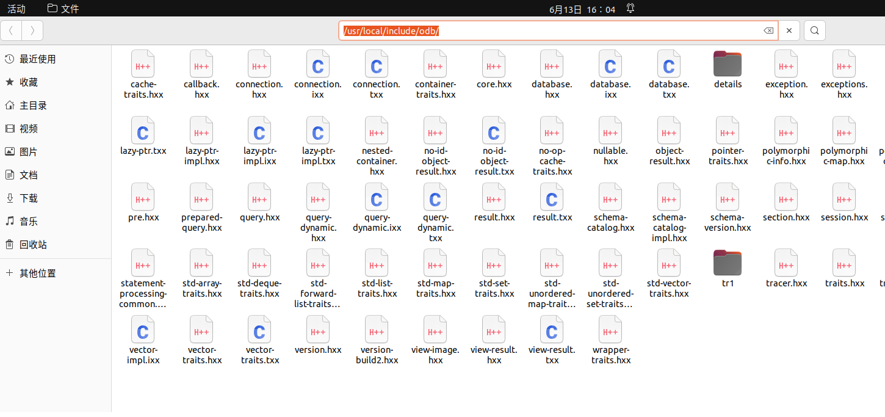
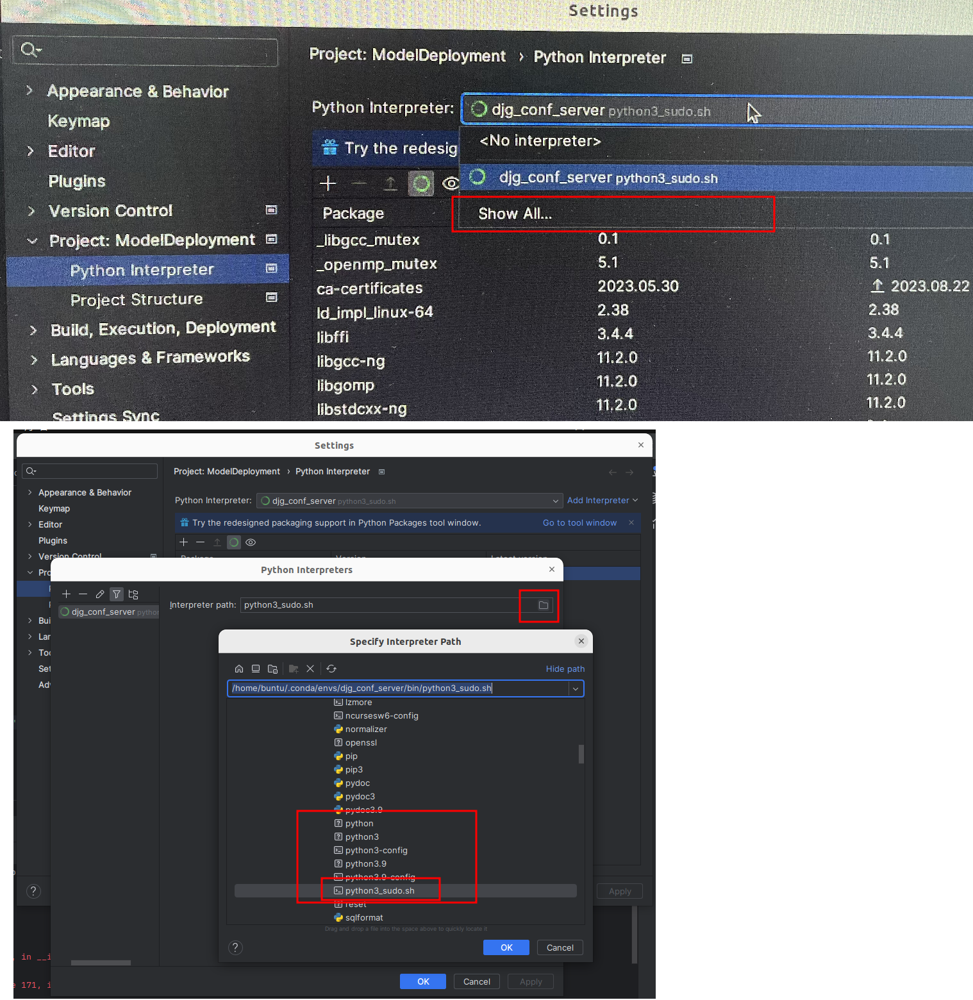
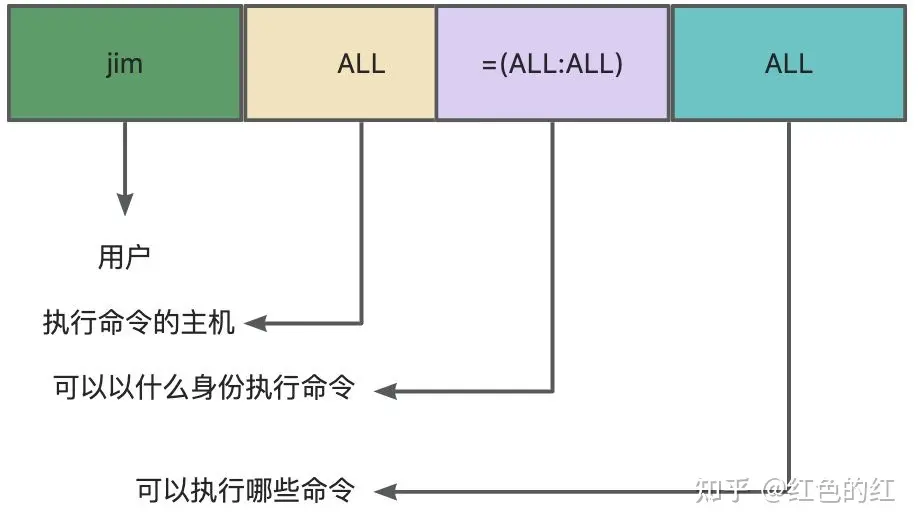

# 1 快捷键

1. 切换输入法：【win（super） + space 】

2. win + R : 【Alt + F2】

3. 打开新的终端：【Ctrl + Alt + T】

4. 切换窗口：【Alt + Tab】

5. win + e : setting -> keyboard -> shortcuts , 添加，name随便写，command：nautilus，快捷键：super + e

6. firefox：截图 【ctrl + shift + s】

7. [在文件管理器中复制头部地址](https://zhidao.baidu.com/question/224652362.html)：

   - 【Ctrl + l】——选中地址

   - 【Ctrl + c】——复制地址

     

8. [将前台程序转为后台](https://www.bkqs.com.cn/content/xpmvywjpe.html)：【Ctrl + Z】

# 2 常用命令
1. 查看操作系统版本：`lsb_release -a 或 cat /proc/version`

2. 查看文件或文件夹大小（MB）：**ls -hl    or    ls -hl filename**

3. ubuntu最小系统通过apt-get安装包前，需要县apt-get update更新一下源，然后才可查找包并安装相关包

4. [从命令行打开文件浏览器：nautilus命令](https://www.cnblogs.com/Tom-Ren/p/10024280.html)

   - ```bash
     nautilus .   #打开当前文件夹
     
     nautilus    #打开默认/home 目录
     
     nautilus /your/path    #打开指定文件夹
     ```

5. [apt-get详细](https://blog.csdn.net/qq_44885775/article/details/124278721)

6. [tar](https://www.runoob.com/w3cnote/linux-tar-gz.html)

   ```bash
   # 将所有 .jpg 的文件打成一个 tar 包，并且将其用 gzip 压缩，生成一个 gzip 压缩过的包，包名为 all.tar.gz。
   # tar 中使用 -z 这个参数来调用gzip。c——compress
   tar -czf all.tar.gz *.jpg
   # x——解压
   tar -xzf all.tar.gz
   ```

7. [linux查询文件名 或 文件内容中 包含特定字符串的所有文件](https://blog.csdn.net/weixin_40482816/article/details/121425903)

   - `find ./ -name '*2021-11-01*'`，查看当前文件夹（及子目录中）下，文件名包含2021-11-01的文件
   - `find ./ -name '*2021-11-01*' -maxdepth 1 `，查看当前文件夹下

8. 查看系统信息

   - uname命令是一个用于显示系统信息的工具
   - “-s”：显示操作系统名称。
   - “-n”：显示网络节点主机名。
   - “-r”：显示内核版本。
   - “-m”：显示硬件架构。
   - “-v”：显示操作系统版本。
   - “-a”：显示所有可用的系统信息。

   ```bash
   # 
   uname -m
   ```

9. [xargs](https://www.runoob.com/linux/linux-comm-xargs.html)：是给命令传递参数的一个过滤器，也是组合多个命令的一个工具。

   `find /sbin -perm +700 |xargs ls -l`，将前一个命令find的std ，通过xargs，输出给ls作参数。

10. 查找运行的进程中是否包含某个进程

   ```bash
   # 查看父进程ID，进程ID，进程组ID，会话ID
   ps ajx | head -1 && ps ajx | grep 'ssd' 	# 带列名的展示
      PPID     PID    PGID     SID TTY        TPGID STAT   UID   TIME COMMAND
      2000   24119    2000    2000 ?             -1 Sl    1000   0:00 /usr/libexec/gvfsd-dnssd --spawner :1.2 /org/gtk/gvfs/exec_spaw/3
      6967  298419  298418    6967 pts/0     298418 S+    1000   0:00 grep --color=auto ssd
   
   # 查看进程资源占用情况
   ps aux | head -1 && ps aux | grep 'ssd' 
   USER         PID %CPU %MEM    VSZ   RSS TTY      STAT START   TIME COMMAND
   root          18  0.0  0.0 178084 16832 ?        Sl   Aug02   0:44 ./shangDong_Model_position
   root          19  0.0  0.0 180268 24552 ?        Sl   Aug02   2:41 ./shangDong_Model_position
   ```

11. [service和systemctl的区别](https://blog.csdn.net/juanxiaseng0838/article/details/124123822)

   - service命令其实是去/etc/init.d目录下，去执行相关程序
   - systemctl是一个systemd工具，主要负责控制systemd系统和服务管理器。在/lib/systemd/system

11. `mkdir-p test/test1/test2` 自行创建多层目录

12. vim 设置行号：

   ```bash
   /etc/vim/vimrc
   # 在内容最后加set number
   ```

11. ubuntu定时关机

    ```bash
    shutdown -r now 立刻重新开机 
    shutdown -h now 立刻关机 
    shutdown -h 23:00 'Hey! Go away!' 10:42 分关机 
    shutdown -r 10 'Hey! Go away!' 10 分钟後关机 
    ```

    

12. [查看当前文件夹下的树结构](https://blog.csdn.net/answerMack/article/details/90176833)

    - ```bash
      sudo apt-get install tree
      # 指定查看的深度
      tree -L 2
      # 只显示文件夹
      tree -d
      ```

    - 

13. ssh命令连接另一台linux服务器。

    - 如果你只是想登陆别的机器的SSH只需要安装 openssh-client（ubuntu默认安装了，如果没有则sudo apt-get install openssh-client），如果要使本机开放SSH服务就需要安装 **openssh-server**。

    ```bash
    # 1. linux 服务器安装ssh服务
    sudo apt-get install openssh-server
    
    # 修改ssh配置，允许root登录
    vi /etc/ssh/sshd_config
    # 找到下面一项并修改
    PermitRootLogin yes
    # 修改root密码
    echo 'root:12345' | chpasswd
    
    # 2. # 开启ssh服务
    service ssh status
    service ssh start
    # 3. 连接指定ip的服务器
    ssh zhilan@192.168.0.125
    # 4. ssh设为自启动
    systemctl enable ssh
    
    # 连接指定服务器中docker的ssh，将docker容器的22端口，和宿主机的端口8022进行映射
    docker run -dit -p 8022:22 --name test1 ubuntu:16.04
    # 然后在本地连接远程服务器（192.168.100.1），访问宿主机的8022端口就能映射到容器，输入容器内的ssh root的密码，而不是宿主机的密码
    ssh root@192.168.100.1 -p 8022
    ```

14. [通过 SSH 在远程和本地系统之间传输文件的 4 种方法](https://zhuanlan.zhihu.com/p/507876254)

    - [scp：前提是已安装了openssh-server](https://blog.csdn.net/qq_34374664/article/details/81289540)

      - -P [port] : 指定SSH端口号
      - -r : 递归复制整个目录

      ```bash
      # 将本地文件，上传到服务器指定目录下
      scp local_file remote_username@remote_ip:remote_folder
      # 将本地的时区文件上传到docker容器中，docker容器的ssh对外暴露的端口为11022，当前本地的pwd为/usr/share/zoneinfo/Asia/
      # 需要在docker中创建/usr/share/zoneinfo/Asia/
      sudo scp -P 11022 ./Shanghai root@192.168.101.163:/usr/share/zoneinfo/Asia/
      
      # 将本地文件夹，上传到服务器指定目录下
      scp -r local_folder remote_username@remote_ip:remote_folder
      
      # 从远程复制到本地的scp命令与上面的命令雷同，只要将从本地复制到远程的命令后面2个参数互换顺序就行了。
      scp root@192.168.120.204:/opt/soft/nginx-0.5.38.tar.gz /opt/soft/
      
      # 如果ssh服务的端口不是22，那么就需要指定自定义的端口
      scp -P port local_file remote_username@remote_ip:remote_folder
      ```

    - rsync：用于文件同步的流行命令

    - sshfs：通过 SSH 挂载远程目录

    - sftp 客户端：通过 SFTP 访问文件的 GUI 工具（Filezilla）

15. [ssh进入服务器或服务器docker](https://blog.csdn.net/weixin_44623010/article/details/105556481)

    ```bash
    # 安装完ssh-server之后，通过root登陆，报：Permission denied, please try again.
    vi /etc/ssh/sshd_config
    # 找到下面一项并修改
    PermitRootLogin yes
    # 修改完之后一定要重启ssh服务，否则不生效
    /etc/init.d/ssh restart
    
    ssh root@192.168.100.1
    
    
    # 连接指定服务器中docker的ssh，将docker容器的22端口，和宿主机的端口8022进行映射
    docker run -dit -p 8022:22 --name test1 ubuntu:16.04
    # 然后在本地连接远程服务器（192.168.100.1），访问宿主机的8022端口就能映射到容器ssh服务
    ssh root@192.168.100.1 -p 8022
    
    # 退出服务器
    exit
    ```

16. vim 查找

    ```bash
    # 全局搜索，替换
    :%s/searchContent/replaceContent/gi
    #eg:
    :%s/123				# 在输完指令后，切忌不要按回车，否则会将匹配到的内容直接替换掉
    # esc后，N，n，到上一个，到下一个搜索内容
    ```

17. grep查找

    - grep -rn "hello,world!" *
    - \* : 表示当前目录所有文件，也可以是某个文件名
    - -r 是递归查找
    - -n 是显示行号
    - -R 查找所有文件包含子目录
    - -i 忽略大小写

18. [wget](https://zhuanlan.zhihu.com/p/335258413)

    ```bash
    wget https://developer.nvidia.com/downloads/c120-cudnn-local-repo-ubuntu2204-88012110-1amd64deb
    # -O name 指定下载文件的名称
    
    ```

19. [统计当前文件夹下的文件情况](https://zhuanlan.zhihu.com/p/377523024)

    ```bash
    涉及 3个命令
    # 长列表输出该目录下文件信息(注意这里的文件是指目录、链接、设备文件等)，每一行对应一个文件或目录，ls -lR 是列出所有文件，包括子目录。
    ls -l
    # 过滤ls的输出信息，只保留一般文件，只保留目录是 grep “^d”。
    grep "^-"
    # 统计输出信息的行数，统计结果就是输出信息的行数，一行信息对应一个文件，所以就是文件的个数。
    wc -l
    
    
    # 1.统计当前目录下文件的个数（不包括目录）
    ls -l | grep "^-" | wc -l
    
    # 2、统计当前目录下文件的个数（包括子目录）
    ls -lR| grep "^-" | wc -l
    
    # 3、查看某目录下文件夹(目录)的个数（包括子目录）
    ls -lR | grep "^d" | wc -l
    
    # 4、统计当前文件夹下叫某某的文件的数量
    find . -name filename | wc -l
    
    # 5、统计当前文件夹下指定类型的文件的数量
    find -name "*.js" | wc -l
    ```

20. apt-get查看已安装的程序的方法

    ```bash
    dpkg -l | grep 'program_name'
    # apt-get也是dpkg的包装，直接使用dpkg -l 来查看已经安装了的软件
    
    # 查询系统中已安装的软件包所安装的位置. (类似于rpm -ql),https://www.cnblogs.com/xzongblogs/p/15535087.html
    dpkg -L program_name
    # 这里的program_name一定要注意一定是apt-get安装时的名字，否则找不到。
    # eg：dpkg -L libopencv-dev
    
    #  查看包安装的位置
    dpkg-query -L <package-name>
    ```

21. [ubuntu搜索可用安装包`apt search`](https://zhuanlan.zhihu.com/p/661310752)

    ```bash
    # 模糊匹配
    apt search opencv
    ...
    libopencv-contrib-dev/jammy 4.5.4+dfsg-9ubuntu4 amd64
      development files for libopencv-contrib4.5d
      
    libopencv-dev/jammy 4.5.4+dfsg-9ubuntu4 amd64
      development files for opencv
    ...
    
    # 精确匹配
    apt search -e <package-name>
    # 正则匹配
    apt search -r <regex-pattern>
    ```

22. 修改root密码

    ```bash
    echo 'root:12345' | chpasswd
    ```

23. cp复制文件夹

    ```bash
    # 不管destination文件夹是否拖一个斜杠“/”
    
    # 如果destination文件夹“存在”，source文件夹都会被复制到destination文件夹下
    mkdir dest
    cp -r ./opencc ./dest
    # 等同于
    cp -r ./opencc ./dest/
    
    # 如果destination文件夹“不存在”，source文件夹会被复制并重命名为dest
    rm -rf ./dest
    cp -r ./opencc ./dest
    # 等同于
    cp -r ./opencc ./dest/
    ```

    

24. 

# 3 ubuntu软件安装

1. [vmtool安装](https://blog.csdn.net/weixin_45035342/article/details/126638191)

   - vmtool安装后，可以实现宿主机与客户机【ctrl + c】和【Ctrl + v】互通。

   - 宿主机与客户机共享文件夹：在vmware中，菜单->虚拟机->设置->选项->共享文件夹，总是启用，添加文件夹（windows中的），可以在ubuntu系统的/mnt/hgfs中看到。

     

2. [画图工具](https://blog.csdn.net/xhtchina/article/details/122929567)

3. [安装docker](https://blog.csdn.net/u012563853/article/details/125295985)

   - [普通用户执行docker无需sudo办法]()

   - ```bash
     # docker 命令只能由 root 用户或 docker 组中的用户运行，该组是在 Docker 安装过程中自动创建的。如果您想避免在运行 docker 命令时输入 sudo，请将您的用户名添加到 docker 组
     sudo usermod -aG docker $USER
     # 添加之后，需要重启电脑然后才能生效
     ```

4. [创建桌面快捷方式](https://blog.csdn.net/weixin_43031313/article/details/129385915)

5. [安装finalshell](https://blog.csdn.net/zhao001101/article/details/128002640)

6. [ubuntu安装git，并设置ssh](https://blog.csdn.net/qq_26849933/article/details/125062667)

7. [ubuntu安装pycharm](https://blog.csdn.net/m0_37758063/article/details/111573552)

8. [安装mysql](https://blog.csdn.net/weixin_39589455/article/details/126443521)

   - [安装mysql8.0](https://segmentfault.com/a/1190000039203507)

9. [安装navicat15](https://www.bilibili.com/read/cv18230089/)

   naicat.AppImage文件需要用“磁盘映像挂载器”挂载到磁盘上，然后提取其中的png，以创建桌面快捷方式

   网络上有关于appImage文件通过 --appimage-extract进行解压，但在这里好像没有生效。

   ```bash
   # 挂载当前镜像文件到某个文件夹
   mount -o loop navicat15-premium-en.AppImage ./n15
   # 把镜像中的文件铐出来
   cp -r n15 n15p
   # 然后就可以卸载镜像，只有卸载挂载之后才能删除这个挂载点文件
   umount n15 && rm -r n15
   ```

10. [ubuntu安装essayconnect](https://blog.csdn.net/weixin_37926734/article/details/123068318)

   - [essay安装后无法打开的问题](https://blog.csdn.net/u011426115/article/details/126660001)

11. [安装nodejs](https://zhuanlan.zhihu.com/p/531851060)

12. [ubuntu远程，安装todesk，或者向日葵完毕后，连接后，对方无法操控本机，显示没有x11桌面](https://blog.csdn.net/crazyjinks/article/details/130017180)

    - 需要将wayland，修改为x11

    - ```bash
      vim /etc/gdm3/custom.conf
      # 解注释，下面这一行
      WaylandEnable=false
      #然后
      reboot
      ```

13. [vi 编辑写入保存和退出](https://blog.csdn.net/qq_33093289/article/details/127915742)

   默认linux系统都有vi，而没有vim，安装vim：sudo apt install vim

   1. 插入
      - shfit+i 进入插入编辑文本模式
   2. 退出和保存
      - 按【ESC】键跳到命令模式

          　　1. 按【ESC】键跳到命令模式，然后再按【:】冒号键，最后再按【wq】，即可保存退出vi的编辑状态；
                　　2. 如果是不想保存直接按下【:】冒号键加【q!】键，就能直接退出，不保存；
                      　　3. 此外还有这些命令，
               - :w 保存文件但不退出vi；
               - :w file 将修改另外保存到file中，不退出vi；
               - :w! 强制保存，不推出vi；
               - :wq 保存文件并退出vi；
               - :wq! 强制保存文件，并退出vi；
               - q: 不保存文件，退出vi；
               - :q! 不保存文件，强制退出vi；:e! 放弃所有修改，从上次保存文件开始再编辑；


# 6 操作

1. linux设置开机自动执行脚本
   - 修改/etc/rc.d/rc.local（如果没有，则修改/etc/rc.local文件，再没有，就生成一个rc.local)，添加自定义的脚本至文件最后
   - 开启rc.local服务
   - rc.local服务使能。
   - 注意：脚本必须使用exit 0结束，
2. ubuntu系统的hosts（ip和域名映射）：/etc/hosts
3. [ubuntu 初次使用root身份登录](https://blog.csdn.net/weixin_56364629/article/details/124608110)
4. [ubuntu图像化界面不允许root用户登陆](https://blog.csdn.net/Ki_Ki_/article/details/128832659)
5. [ubuntu安装拼音输入法](https://blog.csdn.net/weixin_61275790/article/details/130787987)

​     

# 7 系统

1. [linux发行版中的i386/i686/x86-64/有什么区别](https://zhidao.baidu.com/question/2276228239712472948.html)
2. [Ubuntu18.04 陷入登录循环的问题解决历程（输入正确密码后无限重回登录界面）](https://blog.csdn.net/lj164567487/article/details/128692851)
3. [systemctl 无法使用（System has not been booted with systemd as init system (PID 1). Can‘t operate.），可使用service](https://blog.csdn.net/qq_43685040/article/details/112056242)

# log

1. [chkconfig: command not found](https://blog.csdn.net/small_love/article/details/117660838)
   - chkconfig 被 sysv-rc-conf替代

2. [Ubuntu下shell执行source命令报source: not found问题处理](https://blog.csdn.net/gengkui9897/article/details/127353001)

   ```bash
   # 命令解析器指向的是dash
   $ ls -l /bin/sh
   lrwxrwxrwx 1 root root 4 10月 15 21:25 /bin/sh -> dash
   
   # 执行sudo dpkg-reconfigure dash命令，在弹出信息中选择No，将命令解析器换回bash
   ```

3. [ubuntu之制作再生龙(Clonezilla)启动盘](https://blog.csdn.net/u014072827/article/details/114397807)

   - [Clonezila备份Linux并恢复](https://blog.csdn.net/weixin_45444325/article/details/126307856)

4. [ubuntu20.04下锁屏快捷键super+L不能用的解决方法](https://blog.csdn.net/chenertao/article/details/121510316)

   - 使用了lightdm 桌面管理器，导致锁屏命令变化；将原来的锁屏快捷键禁止，然后新建快捷键，命令设置为dm-tool lock 即可实现快捷键锁屏

5. [Ubuntu 息屏后无法唤醒](https://blog.csdn.net/qq_38429958/article/details/129525720)

   - [参考2](https://blog.csdn.net/LSG_Down/article/details/127637032)

   - ```bash
     # 查看是否安装过这个工具
     dpkg -l | grep laptop-mode-tools
     sudo apt-get install laptop-mode-tools
     
     # 为2说明已开启，为0说明未开启
     cat /proc/sys/vm/laptop_mode
     
     # 编辑laptop-mode的配置文件
     sudo gedit /etc/laptop-mode/laptop-mode.conf
     # 置以下参数为1
     ENABLE_LAPTOP_MODE_ON_BATTERY=1
     ENABLE_LAPTOP_MODE_ON_AC=1
     ENABLE_LAPTOP_MODE_WHEN_LID_CLOSED=1
     
     # 使配置生效
     sudo laptop_mode start
     
     # 为2 就开启了
     cat  /proc/sys/vm/laptop_mode
     ```

   - 

6. 读取探测电脑摄像头设备

   ```bash
   # 插入和拔出usb摄像头设备，查看列表中的项目是否发生变化
   ls /dev/video*
   /dev/video0  /dev/video1
   # 查看通信接口中是否有camera的设备
   lspci | grep -i camera
   lsusb | grep -i camera	# 查看usb接口中是否有camera设备
   # eg: Bus 003 Device 023: ID 0ac8:3330 Z-Star Microelectronics Corp. Sirius USB2.0 Camera
   
   ```

   - [用vlc进行摄像头捕获](https://blog.csdn.net/yanlong22/article/details/80265138)
   - [VLC无法打开摄像头](https://superuser.com/questions/1388147/vlc-is-unable-to-open-the-mrl-file-dev-video0-check-the-log-for-details)

7. 添加环境变量

   ```bash
   vim ~/.bashrc
   
   # 函数
   pathmunge () {
       case ":${PATH}:" in
           *:"$1":*)
               ;;
           *)
               if [ "$2" = "after" ] ; then
                   PATH=$PATH:$1
               else
                   PATH=$1:$PATH
               fi
       esac
   }
   pathmunge /usr/local/nginx/sbin
   export PATH
   
   # 需要下面的命令使文件生效
   source ~/.bashrc
   
   # 环境变量去重
   # 添加新的变量数值到原有的 PATH 变量中
   export PATH=$PATH:$JAVA_HOME/bin:$JRE_HOME/bin
   # 剔除 PATH 变量中重复的项（值），以下表达式二选一
   export PATH=$(echo $PATH | sed 's/:/\n/g' | sort -u | sed '/^$/d' | tr -s '\n' ':' | sed 's/:$//g')
   export PATH=$(echo $PATH | sed 's/:/\n/g' | sort | uniq | sed '/^$/d' | tr -s '\n' ':' | sed 's/:$//g')
   ```

8. [apt-get使用代理安装软件](https://www.cnblogs.com/dodotititi/articles/3424581.html)

   ```bash
   # 使用代理的地址
   export  http_proxy=http://127.0.0.1:7890
   # 取消代理
   export  http_proxy="" 
   # 或者 unset  http_proxy;
   
   # 仅当前terminal使用
   ```

9. [使用 apt-get update 命令提示 ...中被配置了多次](https://blog.csdn.net/dideng8675/article/details/102227406)

   - 要切实解决这个问题，才能解决安装其他的keyring（密钥环、钥匙链）,并配置软件源

   - [密钥环概念](https://zhuanlan.zhihu.com/p/128133025)

   - [密钥存储在过时的 trusted.gpg密钥环中 ](https://blog.csdn.net/m0_67517854/article/details/133034521)

   - [apt-get update出现由于没有公钥，无法验证下列签名](https://blog.csdn.net/weixin_45095113/article/details/131083258)

     - ```bash
       # 修改最后的公钥为自己的
       sudo apt-key adv --recv-keys --keyserver keyserver.ubuntu.com 5F16B97C1AD28806
       ```

10. apt安装的archive 源和 ports 源的区别

    - 当开发者使用编辑器更改 **/etc/apt/sources.list** 文件里面的软件源地址，细心的人会发现在不同的主板上出现的默认源地址不一样，分别为**http://archive.ubuntu.com**和**http://ports.ubuntu.com**。那么这两种源有什么区别呢？

    - **archive** 源和 **ports** 源是根本完全不一样的，其涉及到处理器的架构。**如果两个源混用的话，会造成一些不可描述的错误和BUG。**

      - 软件源**http://archive.ubuntu.com**收录的架构为 **AMD64 (x86_64)** 和 **Intel x86**。
      - 软件源**http://ports.ubuntu.com**收录的架构为 **arm64**，**armhf**，**PowerPC**，**ppc64el** 和 **s390x**。

    - 由于 **Ubuntu** 的默认软件源地址服务器在欧洲，国内使用速度大概 **10 KB/s** 左右，所以需要把默认软件源地址换成国内软件源地址。下面收录了几种国内的软件源地址。

    - Ubuntu 中国官方源

          archive 源：http://cn.archive.ubuntu.com/ubuntu/
          ports   源：http://cn.ports.ubuntu.com/ubuntu-ports/
          Ubuntu 中国官方源好像用的是阿里云，换源说明请参考阿里源和中科大源的换源说明。

    - 中科大源

      ​		archive 源：https://mirrors.ustc.edu.cn/ubuntu/
      ​		ports   源：https://mirrors.ustc.edu.cn/ubuntu-ports/
      ​		换 源介 绍：https://mirrors.ustc.edu.cn/help/ubuntu.html（ archive 源 ）
                 		 https://mirrors.ustc.edu.cn/help/ubuntu-ports.html（ ports 源 ）

      ​		中国科学技术大学开源镜像站对两种源的换源过程是介绍得非常清楚的。

    - 阿里源

          archive 源：https://mirrors.aliyun.com/ubuntu/
          ports   源：https://mirrors.aliyun.com/ubuntu-ports/
          换 源介 绍：https://developer.aliyun.com/mirror/ubuntu（ archive 源 ）
          阿里云只有 archive 源的换源说明，其实 archive 源和 ports 源的换源步骤都是一样的，只是源地址不一样。

11. apt --fix-broken install

    - 命令用于修复系统中已安装的软件包之间的依赖关系问题。当安装或卸载软件包时，可能会出现依赖关系错误，这可能导致其他软件包无法正常工作或安装。使用该命令可以尝试解决这些依赖关系问题，并尽可能安装所需的软件包。它会自动处理依赖关系冲突，安装缺失的依赖项或删除不需要的依赖项。 
    - 

12. 在pycharm中使用root身份运行脚本

    - [参考1](https://www.coder.work/article/167100)，[参考2](https://blog.csdn.net/weixin_44387411/article/details/132958610)

    ```bash
    # 1. 禁用sudo 运行 Python 时需要密码:
    
    # 这将通过编辑 /etc/sudoers.d/python 文件来实现。我们需要做的是在该文件中添加一个条目，如下所示:
    user host = (root) NOPASSWD: full_path_to_python 
    #例如:
    guya ubuntu = (root) NOPASSWD: /usr/bin/python
    
    # 注意事项:
    # user可以通过命令检测到:whoami
    # host可以通过命令检测到:hostname
    
    # 2. 创建一个“sudo 脚本”:这个脚本的目的是赋予 python 以 root 用户身份运行的权限。
    # 创建一个名为 python-sudo.sh 的脚本，并将以下内容添加到其中:
    
    !#/bin/bash
    sudo /usr/bin/python "$@"
    #请再次注意，该路径是您上一阶段的 Python 路径。
    
    # 不要忘记使用命令授予此脚本的执行权限:chmod，即-
    chmod +x python-sudo.sh
    
    # 3. 使用 python-sudo.sh 脚本作为您的 PyCharm 解释器:
    
    ```

    

13. [sudoers文件说明 - sudo免密码 - 限制sudo执行特殊命令](https://zhuanlan.zhihu.com/p/632737024?utm_id=0)

    ```bash
    # /etc/sudoers
    # User privilege specification
    root    ALL=(ALL:ALL) ALL
    jim     ALL=(ALL:ALL) ALL
    
    buntu  ALL=(ALL) NOPASSWD:ALL
    ```

    

14. [查看进程中的线程](https://blog.csdn.net/AnChenliang_1002/article/details/131359525)

    ```bash
    # 实时显示指定线程内各个线程情况
    top -H -p PID
    ```

    

15. [环境变量相关脚本执行时机和作用范围](https://blog.csdn.net/NRWHF/article/details/131285014)

    - /etc/profile
      用于设置系统级的环境变量和启动程序，在这个文件下配置会**对所有用户生效**。**当用户登录(login)时，文件会被执行**，并从/etc/profile.d目录的配置文件中查找shell设置。如果对/etc/profile修改的话必须重启才会生效
    - /etc/bash.bashrc
      **每一个运行bash shell的用户执行此文件**.当bash shell被打开时,该文件被读取。如果想对所有使用bash的用户修改某个配置并在以后打开的bash都生效的话可以修改这个文件，修改之后不用重启，重新打开一个bash即可生效。
    - ~/.profile
      每个用户都可使用该文件输入**专用于自己**使用的shell信息,当用户登录时,该文件仅仅执行一次!默认情况下,他设置一些环境变量,执行用户的.bashrc文件.
    - ~/.bashrc
      该文件包含专用于你的bash shell的bash信息,当登录时以及每次打开新的shell时,该该文件被读取.
    - ~/.bash_logout
      当每次退出系统(退出bash shell)时,执行该文件，通常存放清理工作的命令。

16. 


