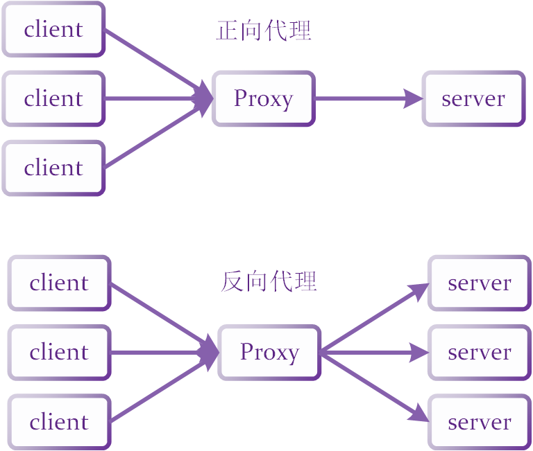
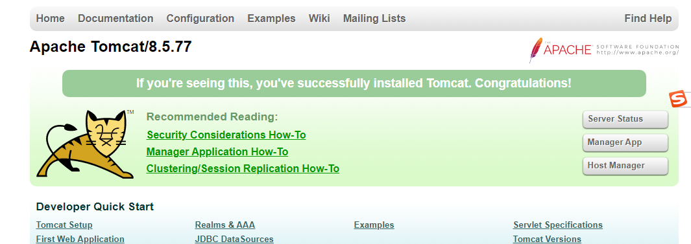
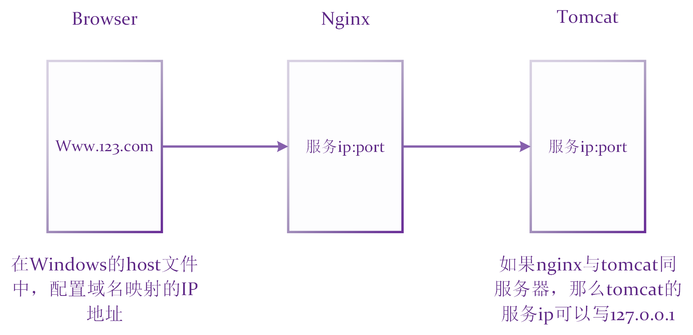
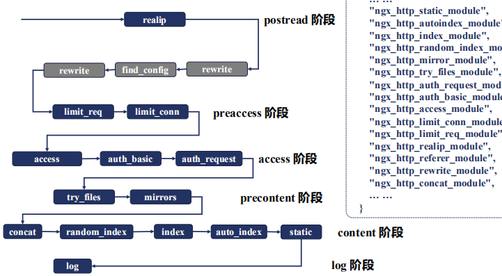

# Nginx

# 一 实践

# 1 基本概念

nginx是一个高性能的HTTP和反向代理服务器，特点是占有内存少，并发能力强（为性能优化而开发的）。

nginx可以作为静态页面的服务器，同时支持CGI协议的动态语言（eg：PHP），但不支持Java（只能通过tomcat配合完成）

## 1.1 反向代理



### 正向代理

1. 客户端**需要配置**代理服务器，客户端向代理服务器发送请求，并指定目标服务器地址。
2. 然后由代理服务器和原始服务器通信，转交请求，再返回给客户端。
3. 正向代理隐藏了真实的客户端，使真实客户端对服务器不可见。

### 反向代理

1. 客户端对代理无感知，客户端**无需做任何配置**就可以访问。
2. 我们只需要将请求发送到反向代理服务器，由反向代理服务器去选择目标服务器。
3. 获取数据后，再返回给客户端。
4. 此时反向代理服务器和目标服务器对外就是一个服务器，暴露的是代理服务器地址，隐藏了真实服务器IP地址。
5. 反向代理隐藏了真实的服务器，使真实服务器对客户端不可见。

## 1.2 负载均衡

例如淘宝双十一的商品秒杀，单个服务器、或者增加了内存、cpu的单个服务器已经无法在短时承载如此多的并发请求，所以原先请求集中到单个服务器上的情况，改为将请求分发到多个服务器上。

通过nginx代理服务器，把来自客户端的并发请求均匀分配给真实服务器集群。——负载均衡

## 1.3 动静分离


# 2 编译及部署

## 2.1 编译

### 2.1.1 安装编译工具及依赖库

在安装nginx之前需要装编译工具，和nginx的依赖库等等。

```bash
yum -y install gcc pcre-devel zlib-devel openssl-devel libxml2-devel \
libxslt-devel gd-devel GeoIP-devel jemalloc-devel libatomic_ops-devel \
perl-devel per-ExtUtils-Embed

# yum -y install 与 yum install 的区别是：在安装过程中如有询问，自动选择y（yes），而不需要手动选择。

# 在安装依赖时，libatomic_ops-devel，per-ExtUtils-Embed 这两个工具安装找不到，但好像也不影响接下来的安装，暂且不安装吧。

# 尚硅谷的在视频中它安装了gcc，zlib zlib-devel pcre-devel openssl openssl-devel

```

### 2.1.2 nginx源码（安装包）获取及安装

```bash
mkdir -p /opt/data/source
cd /opt/data/source
wget http://nginx.org/download/nginx-1.17.4.tar.gz
tar zxmf nginx-1.17.4.tar.gz
```

编译nginx源码文件时，首先需要通过编译配置命令configure进行编译配置。

很多安装包解压后，文件中都有一个configure命令，它用于进行安装的编译配置。

在nginx中，编译配置命令configure的常用编译配置可查询互联网，以下仅列举部分配置参数：

| 编译配置参数                     | 默认值/默认编译状态 | 参数说明               |
| -------------------------------- | ------------------- | ---------------------- |
| --prefix=PATH                    | /usr/local          | 编译后代码的安装目录   |
| --with-threads                   | 不编译              | 启用线程池支持         |
| --without-http_auth_basic_module | 编译                | 不编译http基本认证模块 |

“---with“前缀的编译配置参数的模块都不会被默认编译，而”--without“前缀都会被默认编译。

```bash
# 进入解压后的安装文件夹
cd nginx-1.17.4
# 代码编译 && 编译后安装
make && make install
# 安装成功后，会多出一个usr/local/nginx文件夹，
# 在此文件夹下的sbin下有启动脚本
```

### 2.1.3 启动nginx服务

安装之后，我们需要启动nginx服务，

```bash
# 进入含有启动脚本的文件夹
cd /usr/local/nginx/sbin
# 执行启动脚本
./nginx
# 查看是否已启动相应的进程
ps -ef | grep nginx

root     2624670       1  0 17:54 ?        00:00:00 nginx: master process ./nginx
nobody   2624671 2624670  0 17:54 ?        00:00:00 nginx: worker process
root     2626322 2571514  0 17:55 pts/0    00:00:00 grep --color=auto nginx
# 证明我们已经完成了nginx的启动

pwd
cd /usr/local/nignx
cd conf
vim nginx.conf

# server {
#        listen       80;
#        server_name  localhost;
#
#        #charset koi8-r;
#
#        #access_log  logs/host.access.log  main;
#
#       location / {
#            root   html;
#            index  index.html index.htm;

# 我们可以看到nginx的服务器监听的是80端口
# 访问ip + 端口号 它会跳出nginx页面
```


如果你是购买的云服务器，可能系统默认会有防火墙，你需要在它提供的控制台中更改防火墙设置。

如果对80端口有设置防火墙，那么你就无法访问此nginx服务器，所以需要查看防火墙的情况。

```bash
# 查看防火墙开放的端口号
firewall-cmd --list-all
# 如果出现FirewallD is not running，说明防火墙服务处于关闭状态。
# 查看防火墙状态
systemctl status firewalld

● firewalld.service - firewalld - dynamic firewall daemon
   Loaded: loaded (/usr/lib/systemd/system/firewalld.service; disabled; vendor preset: enabled)
   Active: inactive (dead)# 果然处于关闭状态。
     Docs: man:firewalld(1)
# 开启防火墙，没有任何提示即开启成功
systemctl start firewalld # 关闭防火墙 systemctl stop firewalld

# 开放端口
firewall-cmd --add-port=80/tcp --permanant # --permanent永久生效，没有此参数重启后失效
# 开放后需要重启防火墙，即可生效。
firewall-cmd -reload

# 关闭端口
firewall-cmd --zone= public --remove-port=80/tcp --permanent #--zone 作用域
```


### 2.1.4 添加第三方模块

nginx的功能是以模块的方式存在的，同时也支持添加第三方开发的功能模块。执行configure时，通过--add-module=PATH参数指定第三方模块的代码路径，然后再编译安装。

```bash
# 添加第三方静态模块的方法如下：
./configure --add-module=../ngx_http_proxy_connect_module
# 添加第三方动态模块的方法如下：
./configure --add-dynamic-module=../ngx_http_proxy_connect_module --with-compat

make && make install
```

## 2.2 部署

# 3 配置指令

nginx的配置文件所在的位置：`/usr/local/nginx/conf/nginx.conf`

```bash
#user  nobody;
worker_processes  1;

#error_log  logs/error.log;
#error_log  logs/error.log  notice;
#error_log  logs/error.log  info;

#pid        logs/nginx.pid;


events {
    worker_connections  1024;
}


http {
    include       mime.types;
    default_type  application/octet-stream;

    #log_format  main  '$remote_addr - $remote_user [$time_local] "$request" '
    #                  '$status $body_bytes_sent "$http_referer" '
    #                  '"$http_user_agent" "$http_x_forwarded_for"';

    #access_log  logs/access.log  main;

    sendfile        on;
    #tcp_nopush     on;

    #keepalive_timeout  0;
    keepalive_timeout  65;

    #gzip  on;

    server {
        listen       80;
        server_name  localhost;

        #charset koi8-r;

        #access_log  logs/host.access.log  main;

        location / {
            root   html;
            index  index.html index.htm;
        }

        #error_page  404              /404.html;

        # redirect server error pages to the static page /50x.html
        #
        error_page   500 502 503 504  /50x.html;
        location = /50x.html {
            root   html;
        }

        # proxy the PHP scripts to Apache listening on 127.0.0.1:80
        #
        #location ~ \.php$ {
        #    proxy_pass   http://127.0.0.1;
        #}

        # pass the PHP scripts to FastCGI server listening on 127.0.0.1:9000
        #
        #location ~ \.php$ {
        #    root           html;
        #    fastcgi_pass   127.0.0.1:9000;
        #    fastcgi_index  index.php;
        #    fastcgi_param  SCRIPT_FILENAME  /scripts$fastcgi_script_name;
        #    include        fastcgi_params;
        #}

        # deny access to .htaccess files, if Apache's document root
        # concurs with nginx's one
        #
        #location ~ /\.ht {
        #    deny  all;
        #}
    }


    # another virtual host using mix of IP-, name-, and port-based configuration
    #
    #server {
    #    listen       8000;
    #    listen       somename:8080;
    #    server_name  somename  alias  another.alias;

    #    location / {
    #        root   html;
    #        index  index.html index.htm;
    #    }
    #}


    # HTTPS server
    #
    #server {
    #    listen       443 ssl;
    #    server_name  localhost;

    #    ssl_certificate      cert.pem;
    #    ssl_certificate_key  cert.key;

    #    ssl_session_cache    shared:SSL:1m;
    #    ssl_session_timeout  5m;

    #    ssl_ciphers  HIGH:!aNULL:!MD5;
    #    ssl_prefer_server_ciphers  on;

    #    location / {
    #        root   html;
    #        index  index.html index.htm;
    #    }
    #}

}

```


配置指令（配置项）就在配置文件中。

## 3.1 常用命令

使用nginx命令的前提条件：必须进入`usr/local/nginx/sbin`，否则就要配置环境命令。

```bash
# 1.查看nginx版本号
./nginx -v

# 2.启动nginx命令
./nginx

ps -ef | grep nginx

root     2624670       1  0 17:54 ?        00:00:00 nginx: master process ./nginx
nobody   2624671 2624670  0 17:54 ?        00:00:00 nginx: worker process
root     2626322 2571514  0 17:55 pts/0    00:00:00 grep --color=auto nginx

# 3.关闭nginx命令
./nginx -s stop

ps -ef | grep nginx
root     2992902 2571514  0 21:18 pts/0    00:00:00 grep --color=auto nginx

# 4.重新加载nginx，而不是重启服务器
./nginx -s reload
# 当我们修改了/usr/local/nginx/conf下的 nginx.conf后，如果想要这些配置生效那么就需要重新加载。


```

## 3.2 约定名词

- 配置指令（directive）
  - 由nginx约定的内部固定字符串
  - nginx的每个功能配置都是通过多个不同的指定组合来实现的
- 配置指令值
  - 配置指令对应的值，指令与指令值是一对多的关系。
- 配置指令语句
  - 由指令与指令值构成指令语句，语句结束需要用`;`作为结束
- 配置指令域
  - 配置指令值有时会由`{}`括起来的指令语句集合。本书中约定`{}`括起来的部分为配置指令域，简称指令域。
- 配置全局域：配置文件`ginx.conf`中上层没有其他指令域的区域被称为配置全局域，简称全局域。

| 域名称   | 域类型 | 域说明                                                       |
| -------- | ------ | ------------------------------------------------------------ |
| main     | 全局域 | nginx的根级别指令区域，该区域的配置指令是全局有效的，该指令名为**隐性显示**，nginx.conf的整个文件内容都写在该指令域中。 |
| events   | 指令域 | nginx事件驱动相关的配置指令域                                |
| http     | 指令域 | Http核心配置指令域，包含客户端完整http请求过程中，每个过程的处理方法的配置指令 |
| upstream | 指令域 | 用于定义被代理服务器组的指令区域，也称“上游服务器”           |
| server   | 指令域 | nginx用来定义服务IP、绑定端口及服务相关的指令区域            |
| location | 指令域 | 对用户URI进行访问路由处理的指令域                            |
| stream   | 指令域 | 对tcp协议实现代理的配置指令域                                |
| types    | 指令域 | 定义被请求文件扩展名与MIME类型映射表的指令区域               |
| if       | 指令域 | 按照选择条件判断为真时，使用的配置指令域                     |

在nginx.conf的最外层主要有三个部分（三个域）组成：

1. main全局域
2. events指令域
3. http指令域

三个域也需要其他指令域一起配合使用


## 3.2 main全局域

从配置文件开始到events块之间的内容，主要会设置一些影响nginx服务器整体运行的配置指令。

主要包括：nginx服务器的用户（组）、允许生成的worker process数、进程PID存放路径、日志存放路径和类型以及配置文件的引入等。

## 3.3 events指令域

涉及的指令主要影响nginx服务器与用户的网络连接。

常用的设置包括是否开启对多work process下的网络连接进行序列化，是否允许同时接收多个网络连接，选取哪种事件驱动模型来处理连接请求，每个worker process 可以同时支持的最大连接数等。

## 3.4 http指令域

是nginx服务器配置最为频繁的部分。

http自身域配置的指令包括文件引入，MIME-TYPE定义，日志自定义，连接超时时间，单连接请求数的上限等

http指令域，除自身域外，还包含了多个server指令域，而server指令域又包含了多个location指令域。

## 3.5 server指令域

与虚拟主机有密切联系，该技术的产生是为了节省互联网服务器硬件成本。

从用户的角度看，虚拟主机和一台独立的硬件主机是完全一样的。

最常见的配置是本虚拟主机的监听配置和本虚拟主机的名称或IP配置。

一个server指令域可配置多个location 指令域

## 3.6 location指令域

主要作用是对nginx服务器接收的请求地址url进行解析。

匹配url上除ip地址之外的字符串，对特定的请求进行处理。

例如：地址定向、数据缓存和应答控制等功能，还有许多第三方模块的配置也在这里进行配置。

URL（统一资源定位符）是URI（统一资源标识符）的子集。

URI，即统一标识资源符，通用的URI语法格式如下：

`scheme:[// [user[:password]@]  host  [:port] ]  [/path]  [?query]  [#fragment]`

### URI的匹配规则

`location [ = | ~ | ~* | ^~ | @ ] pattern {   }`

中括号中的是修饰语，pattern是匹配项

- 无修饰语：完全匹配url中除访问参数以外的内容，匹配项只能是字符串，不能是正则表达式
  - 
- 修饰语 `=` ：完全匹配url中除访问参数以外的内容，
  - Linux下会区分大小写，windows则不会
- 修饰语 `~` ：完全匹配url中除访问参数以外的内容，
  - Linux下会区分大小写，windows则不会，
  - 匹配项的内容必须是正则表达式
- 修饰语 `~*` ：完全匹配url中除访问参数以外的内容
  - 不区分大小写
  - 匹配项的内容必须是正则表达式
- 修饰语 `^~` ：完全匹配url中除访问参数以外的内容
  - 匹配项的内容如果不是正则表达式，则不再进行正则表达式测试
- 修饰语 `@` ：定义一个只能内部访问的location区域，可以被内部跳转指令使用

#### 匹配顺序

1. 先检测匹配项内容为非正则表达式修饰语修饰的location，后检测匹配项内容为正则表达式修饰语修饰的location
2. 当匹配项内容同时被非正则与正则都匹配的location，按匹配项内容为正则匹配location执行。
3. 所有匹配项内容均为非正则表达式的location，按照匹配项的内容完全匹配的内容长短进行匹配，即匹配内容多的location被执行
4. 所有匹配项的内容均为正则表达式的location，按照书写的先后顺序进行匹配，匹配后就执行，不再做后续检测。

#### proxy_pass

当location为正则匹配且内部有proxy_pass指令时，proxy_pass的指令值不能包含无变量的字符串，修饰语不受该规则限制。

```bash
location ~ /images {
	proxy_pass	http:127.0.0.1:8080;	#正确的指令值
	proxy_pass	http:127.0.0.1:8080$request_uri;	#正确的指令值
	proxy_pass	http:127.0.0.1:8080/image$request_uri;	#正确的指令值
	proxy_pass	http:127.0.0.1:8080/;	#错误的指令值
}
```


# 4 配置实例

准备工作：在linux系统中安装tomcat，使用默认端口8080。

## 4.1 准备工作

#### 安装jdk

```bash
# tomcat需要jdk作为环境，所以首先要安装jdk。下载之后默认的目录为： /usr/lib/jvm/
yum search java | grep jdk

openjdk-asmtools-javadoc.noarch : Javadoc for openjdk-asmtools
java-1.8.0-openjdk.x86_64 : OpenJDK 8 Runtime Environment
java-1.8.0-openjdk-accessibility.x86_64 : OpenJDK 8 accessibility connector
java-1.8.0-openjdk-demo.x86_64 : OpenJDK 8 Demos
java-1.8.0-openjdk-devel.x86_64 : OpenJDK 8 Development Environment
...
java-1.8.0-openjdk-src.x86_64 : OpenJDK 8 Source Bundle
java-11-openjdk.x86_64 : OpenJDK 11 Runtime Environment
...
java-11-openjdk-jmods.x86_64 : JMods for OpenJDK 11
java-11-openjdk-src.x86_64 : OpenJDK 11 Source Bundle
...

# 安装
yum install java-1.8.0-openjdk
# 我在腾讯云，安装完成后，java不需要配环境变量，就可以直接java -version
# 相关原因：
#ubuntu12.10系统使用ppa方式下载并自动安装jdk后，java被安装到usr/lib/jvm目录下，没有修改环境变量便可以使用。
#这是因为操作系统将java的可执行文件先做成链接放在了/etc/alternatives下，然后又把alternatives下的链接又做成了链接放在了/usr/bin下。
#alternative是可选项的意思
#首先，因为依赖关系的存在，一个软件包在系统里面可能出现新旧版本并存的情况，或者同时安装了多种桌面环境， 系统更新之后会自动将最后安装的版本作为默认值。
#在以前，要想用旧版本作为默认值就必须要手动修改配置文件，有些软件比较简单，有些却要修改很多文件，甚至一些相关软件的配置文件也要相应修改。
#update-alternatives命令就是为了解决这个问题的，指定一个简写的名称后会根据每个软件包的具体情况给出一些选项，自动完成一些配置文件的修改，减轻系统维护的负担。

# 因为yum 安装位置在/usr/lib/jvm/，进入jvm我们可以看见多个文件，里面包括一些软连接

[root@VM-4-8-centos jvm]# ll
总用量 4
# 第一列为文件类型，我们可以看到除了第一个文件的文件类型是d（文件夹），其余都是连接文件l（符号连接），而且还是软连接，因为后面有 “->” 符号，软连接，指向其他文件。真正的文件是箭头后面那个。
drwxr-xr-x 3 root root 4096 3月  28 21:15 java-1.8.0-openjdk-1.8.0.312.b07-2.el8_5.x86_64
lrwxrwxrwx 1 root root   21 3月  28 21:15 jre -> /etc/alternatives/jre
lrwxrwxrwx 1 root root   27 3月  28 21:15 jre-1.8.0 -> /etc/alternatives/jre_1.8.0
lrwxrwxrwx 1 root root   35 3月  28 21:15 jre-1.8.0-openjdk -> /etc/alternatives/jre_1.8.0_openjdk
lrwxrwxrwx 1 root root   51 11月 13 16:29 jre-1.8.0-openjdk-1.8.0.312.b07-2.el8_5.x86_64 -> java-1.8.0-openjdk-1.8.0.312.b07-2.el8_5.x86_64/jre
lrwxrwxrwx 1 root root   29 3月  28 21:15 jre-openjdk -> /etc/alternatives/jre_openjdk

```

#### 安装tomcat

```bash
 # 在/usr/local下，下载tomcat安装包
 wget https://dlcdn.apache.org/tomcat/tomcat-8/v8.5.77/bin/apache-tomcat-8.5.77.tar.gz
 # 解压安装包
 tar -xvf apache-tomcat-8.5.77.tar.gz
 cd /apache-tomcat-8.5.77/bin
 # 执行安装脚本
 ./startup.sh

Using CATALINA_BASE:   /usr/local/apache-tomcat-8.5.77
Using CATALINA_HOME:   /usr/local/apache-tomcat-8.5.77
Using CATALINA_TMPDIR: /usr/local/apache-tomcat-8.5.77/temp
Using JRE_HOME:        /usr
Using CLASSPATH:       /usr/local/apache-tomcat-8.5.77/bin/bootstrap.jar:/usr/local/apache-tomcat-8.5.77/bin/tomcat-juli.jar
Using CATALINA_OPTS:   
Tomcat started.

 # cd ../logs，查看tomcat的日志，如果能看到那么启动成功
 tail -f catalina.out
 
 28-Mar-2022 22:41:27.060 信息 [localhost-startStop-1] org.apache.catalina.startup.HostConfig.deployDirectory 把web 应用程序部署到目录 [/usr/local/apache-tomcat-8.5.77/webapps/examples]
28-Mar-2022 22:41:27.203 信息 [localhost-startStop-1] org.apache.catalina.startup.HostConfig.deployDirectory Web应用程序目录[/usr/local/apache-tomcat-8.5.77/webapps/examples]的部署已在[143]毫秒内完成
28-Mar-2022 22:41:27.204 信息 [localhost-startStop-1] org.apache.catalina.startup.HostConfig.deployDirectory 把web 应用程序部署到目录 [/usr/local/apache-tomcat-8.5.77/webapps/docs]
28-Mar-2022 22:41:27.213 信息 [localhost-startStop-1] org.apache.catalina.startup.HostConfig.deployDirectory Web应用程序目录[/usr/local/apache-tomcat-8.5.77/webapps/docs]的部署已在[9]毫秒内完成
28-Mar-2022 22:41:27.214 信息 [localhost-startStop-1] org.apache.catalina.startup.HostConfig.deployDirectory 把web 应用程序部署到目录

 # tomcat默认8080端口，所以还需要开放一下8080端口的防火墙
```




## 4.2 反向代理：实例1

目标效果：在浏览器地址栏输入：www.123.com（这个是虚无的网址），跳转到linux系统的tomcat主页面中。



### 修改本地映射

`C:/Windows/System32/drivers/etc/hosts`修改域名映射即可。

```txt
124.223.224.180 www.123.com
```

如果用的是云服务器，有可能这样采取的映射是无法达到目标效果的。云服务器让你备案：`www.123.com`

### nginx请求转发

```bash
# 修改 /usr/local/nginx/conf/nginx.conf 文件
server {
        listen       80;
        server_name  124.223.224.184;#nginx服务器地址
        location / {
            root   html;
            proxy_pass  http://127.0.0.1:8080; # tomcat服务器地址
            index  index.html index.htm;
        }

}

```

## 4.3 反向代理：实例2

目标效果：

使用nginx反向代理，根据访问路径跳转到不同端口的服务中

1. nginx监听端口：9001
2. 访问：9001/pinduoduo/ 直接映射到tomcat服务器127.0.0.1:8080/pinduoduo/index.html
3. 访问：9001/taobao/ 直接映射到tomcat服务器127.0.0.1:8081/taobao/index.html

### 准备两个tomcat服务器

```bash
# 杀死已经开启的tomcat服务器
ps -ef | grep tomcat

root     3711231       1  0 3月28 ?       00:00:58 /usr/bin/java -Djava.util.logging.config.file=/usr/local/apache-tomcat-8.5.77/conf/logging.properties -Djava.util.logging.manager=org.apache.juli.ClassLoaderLogManager -Djdk.tls.ephemeralDHKeySize=2048 -Djava.protocol.handler.pkgs=org.apache.catalina.webresources -Dorg.apache.catalina.security.SecurityListener.UMASK=0027 -Dignore.endorsed.dirs= -classpath /usr/local/apache-tomcat-8.5.77/bin/bootstrap.jar:/usr/local/apache-tomcat-8.5.77/bin/tomcat-juli.jar -Dcatalina.base=/usr/local/apache-tomcat-8.5.77 -Dcatalina.home=/usr/local/apache-tomcat-8.5.77 -Djava.io.tmpdir=/usr/local/apache-tomcat-8.5.77/temp org.apache.catalina.startup.Bootstrap start
root     4118774 4027353  0 22:42 pts/0    00:00:00 grep --color=auto tomcat

kill -9 3711231

ps -ef | grep tomcat

root     4120493 4027353  0 22:43 pts/0    00:00:00 grep --color=auto tomcat
# 说明已关闭

# 然后复制两个tomcat安装包的解压包就行
# cd /usr/local
# 将当前tomcat解压后的文件夹修改为tomcat8080
mv apache-tomcat-8.5.77 tomcat8080
# 然后再将tomcat8080文件夹复制一份，并命名为tomcat8081
cp -rf tomcat8080 tomcat8081

# 开启8080服务器，因为服务器默认就是8080
cd tomcat8080/bin
./startup.sh

# 开启8081服务器，这个需要修改tomcat8081的配置文件
cd ../../tomcat8081/conf
vim server.xml
# 这个配置文件里有以下几个地方需要修改端口，目的是为了不和刚刚启动的8080服务器冲突
# 分别修改为8015,8019,8081

# <Server port="8005" shutdown="SHUTDOWN">
# 8005端口是用来关闭TOMCAT服务的端口。
# <Connector port="8009" protocol="AJP/1.3" redirectPort="8443" />
# 连接器监听8009端口，负责和其他的HTTP服务器建立连接。在把Tomcat与其他HTTP服务器集成时，就需要用到这个连接器。
# <Connector port="8080" protocol="HTTP/1.1" connectionTimeout="20000" redirectPort="8443" />
# 连接器监听8080端口，负责建立HTTP连接。在通过浏览器访问Tomcat服务器的Web应用时，使用的就是这个连接器

cd ../../bin
./startup.sh

# 然后这两个服务器都都开启了，在浏览器中看一下，如果两个都能打开，那么服务就开好了。

# 在tomcat8080文件夹下的webapps下新建pinduoduo/index.html
# 在tomcat8081文件夹下的webapps下新建taobao/index.html
# 页面内容如下
```

```html
<!DOCTYPE html>
<html>
        <head>
              <meta charset="utf-8">
              <title>8081</title>
        </head>
        <body>
              <h1>这里是8081服务器</h1>
              <h2>淘宝</h2>
              <iframe src="https://www.taobao.com" width="800px" height="400px"></iframe>
        </body>
</html>
```


### 配置

`/usr/local/nginx/conf/nginx.conf`

```bash
http {
    include       mime.types;
    default_type  application/octet-stream;
    sendfile        on;
    keepalive_timeout  65;
        server {
                listen       80;
                server_name  124.223.224.184;
                location / {
                        root   html;
                        proxy_pass      http://127.0.0.1:8080;
                        index  index.html index.htm;
                }
        }
        server {
                listen  9001;
                server_name 124.223.224.184;
                location ~ /pinduoduo/ {
                        proxy_pass      http://127.0.0.1:8080;
                }
                location ~ /taobao/ {
                        proxy_pass      http://127.0.0.1:8081;
                }
        }
}
```

ps：记得对外开放9001，而无需开放8080和8081

```bash
cd ../sbin/
# 关闭nginx服务
./nginx -s stop
# 开启服务
./nginx
ps -ef | grep nginx
root      974231       1  0 20:33 ?        00:00:00 nginx: master process nginx
nobody    974232  974231  0 20:33 ?        00:00:00 nginx: worker process
root      974559  863111  0 20:33 pts/0    00:00:00 grep --color=auto nginx
```

然后浏览器访问：

`http://124.223.224.184:9001/taobao/index.html`

`http://124.223.224.184:9001/pinduoduo/index.html`

## 4.4 负载均衡

nginx负载均衡是由代理模块和上游（upstream）模块共同实现的。

### 实例

实现效果：

多个浏览器访问同一个nginx服务器地址，这多个请求被平均分配到不同的服务器上。

准备工作：

在两台tomcat服务器的webapps目录中，创建名称是webhome文件夹，再创建一个index.html，用于测试。

```bash
http {
    include       mime.types;
    default_type  application/octet-stream;
    sendfile        on;
    keepalive_timeout  65;
	upstream myserver {
         server  127.0.0.1:8080;
         server  127.0.0.1:8081;
    }
    server{
          listen  9002;
          server_name 124.223.224.184;
          location / {
                proxy_pass http://myserver;
          }
    }
}
```

浏览器输入：`http://124.223.224.184:9002/webHome/index.html`,

页面加载完成后，又刷新，他会在8080和8081服务器上来回跳跃。

### 负载均衡策略

1. 轮询（默认）

   - 每个请求按时间顺序逐一分配到不同的后端服务器。如果有服务器宕机，那么就剔除掉。

   - 加权轮询，平滑轮询。

   - ```bash
     upstream myserver {
     	server  127.0.0.1:8080 weight=1;#加权轮询
     	server  127.0.0.1:8081 weight=2;
     }
     ```

2. IP哈希

   - 每个请求按访问ip的hash结果分配，这样每个访客固定访问一个后端服务器，可以解决session的问题。

   - ```bash
     upstream myserver {
     	ip_hash;
     	server  127.0.0.1:8080;
     	server  127.0.0.1:8081;
     }
     ```

3. fair

   - 按后端服务器相应时间来分配请求，响应快的优先分配。

   - ```bash
     upstream myserver {
     	fair;
     	server  127.0.0.1:8080;
     	server  127.0.0.1:8081;
     }
     ```

4. 一致性哈希、最少连接、随机负载

## 4.5 动静分离

nginx动静分离简单来说就是把动态请求跟静态请求分开。使请求访问更加高效。

在一定程度上可以理解为，nginx处理静态页面，tomcat处理动态页面。不能理解成，只是单纯的把动态页面和静态页面物理分离。

动静分离从目前实现角度来讲大致分为两种：

1. 服务器分离：一种是纯粹把静态文件独立成单独的域名，放在独立的服务器上，也是目前主流推崇的方案。
2. 代理服务器分离：一种是动态文件和静态文件混合在一起发布，通过nginx分开。通过location指定不同的后缀名实现不同的请求转发。

### expire

通过expire参数设置，可以使浏览器缓存过期时间，减少与服务器之间的请求和流量。

具体Expire的定义：是给一个资源设定一个过期时间，也就是无需服务器去验证，直接通过浏览器自身确认是否过期即可，所以不会产生额外的流量，此种方法非常适合不经常变动的资源。

假设设置为3D，表示3d之内访问这个url，发送一个请求，比对服务器该文件的最后更新时间，如果更新时间未改变，则返回304（采用浏览器缓存）。如果有修改，则直接从服务器上重新下载，返回200。(协商缓存)

### 配置

在服务器下，建立一个静态文件夹，路径是`/usr/local/staticFileDirectory/`，在里面建一个www和images文件夹，www里放index.html，images里放index.jpg

```bash
http {
    include       mime.types;
    default_type  application/octet-stream;
    sendfile        on;
    keepalive_timeout  65;
    server {
                    listen       80;
                    server_name  124.223.224.184;
                    location /www/ {
                            root   /usr/local/staticFileDirectory/;
                            index  index.html index.htm;
                    }
                    location /images/ {
                            root /usr/local/staticFileDirectory/;
                            autoindex on;
                    }
     }
}
            
```

autoindex的作用是当你访问`http://124.223.224.184/images/`你可以看到`/usr/local/staticFileDirectory/images/`文件夹下的文件目录，如下。


如果访问不到图片或者html，还要看看是否是文件权限是否设置好了。

# 二 理论

# 1 核心配置指令

## 1.1 进程的核心配置指令

nginx的**进程**核心配置指令包含在Nginx核心代码及事件模块代码中。

按配置指令设定的功能可以分为**进程管理、进程调优、进程调试、事件处理**4个部分

```bash
# 1 进程管理
# nginx本身就是一款应用软件，在其运行时，用户可对其运行方式，动态加载模块，日志输出等使用其内建的基础配置指令进行配置。
daemon on;  # 以守护进程（服务）的方式运行nginx
pid logs/nginx.pid;	# 指定记录主进程的pid的文件路径
user nobody nobody;	# 工作进程运行的用户是
load_module "modules/ngx_http_xslt_filter_module.so"	# 加载动态模块
include - # 加载外部配置文件
error_log logs/error.log debug;	# 指定错误日志文件及文件名
pcre_jit on;	#用于设置配置文件中的正则表达式是否使用pcre_jit技术

# 2 进程调优
# nginx工作进程的性能依赖于硬件和操作系统的配置
# 在实际的应用场景中，用户需要按照硬件的、操作系统或应用场景需求的侧重点进行相应的配置调整。
thread_pool default thread=32 max_queue=65536;	# 线程池中的线程数为32，所有线程繁忙时，等待队列中的最大任务数为65536
timer_resolution 100ms;	# 处理事件超时的时间间隔
worker_priority -5;	# 设定进程在linux系统中的优先级（nice值）
worker_processes auto;	# 设置工作进程数，auto根据cpu内核数生成对应的工作进程数
worker_cpu_affinity auto;	# 将工作进程与cpu内核进行绑定
worker_rlimit_nofile 65535;	# nginx所有进程同时打开文件的最大数量，默认为操作系统的文件打开数
worker_shutdown_timeout 10s;	# 设置nginx正常关闭工作进程的超时时间，超过该时间是，强制关闭所有连接，以便关闭工作进程
lock_file logs/niginx.lock;	# 互斥锁文件，在开启accept_mutex进程调度模式或使用共享内存文件时，需要使用到互斥锁文件。

# 3 进程调试
master_process on;	# nginx默认是以主进程管理多个工作进程的工作方式，设定为off即运行一个主进程来处理所有请求，当只有一个主进程处理请求是，调试进程会更加方便。
working_directory logs;	# 该指令用于设定工作进程保存崩溃文件的目录，
worker_rlmit_core 800m;	# 设置崩溃文件的大小
debug_points stop;	# 该指令用于进行调试点的控制，当为stop时，在执行到调试点时或发出SIGSTOP信号，方便用户进行调试，当指令值为abort时，在调试点停止进程并创建corefile

# 4 事件处理
# nginx是采用事件驱动式架构处理外部请求的，这一架构使得nginx在现有硬件架构下可以处理数以万计的并发请求。
events {
	worker_connections 65535;	# 每个工作进程可处理的最大请求数。
	use epoll;	# 事件处理的机制模型
	accept_mutex on;	# 是否启用互斥锁模式的进程调度
	accept_mutex_delay 300ms;	# 在互斥锁模式下，工作进程需要不断地争抢互斥锁，抢锁等待时间设置为一个较短的时间，以提高争抢互斥的频率
	multi_accept on;	# 默认情况下每个工作进程一次只能接受一个新连接，如开启，则接收所有的新连接
	worker_aio_requests 128;	# 用于在epoll事件模型下使用aio时，单个工作进程未完成异步i/o操作的最大数
	debug_connection 192.0.2.0/24;	# 对指定客户端开启调试日志，在编译时需要开启--with-debug
}
```

## 1.2 HTTP核心配置指令

HTTP请求处理的简单闭环流程模型是：客户端发起请求，建立连接，解析请求，根据请求头做处理，返回处理结果，断开连接。

按照HTTP请求处理闭环流程模型，结合HTTP核心配置指令的功能，可以将Nginx的HTTP核心配置指令进行如下分类：

- 初始化服务
- HTTP请求处理
- 访问路由location：是nginx对http请求中的URI进行匹配处理的指令
- 访问重写rewrite：是对用户请求的URI进行pcre正则重写，然后返回30x重定向跳转或按条件执行相关配置
- 访问控制：提供了基本的禁止访问、传输限速、内部访问控制等功能配置
- 数据处理：用户请求的最终结果是要返回数据，当响应文件在nginx服务器本地时，需要进行本地文件位置、读或写、返回执行结果的操作。数据处理包括对这些操作进行指令配置。
- 关闭连接
- 日志记录

### 1.2.1 初始化服务

与HTTP虚拟主机建立连接（tcp连接，http连接）、端口监听及监听方式等服务初始化有关配置指令。

#### 1 listen

nginx服务通过listen指令的指令值监听网络请求

| 指令       | 作用域 | 默认值                               | 说明                                 |
| ---------- | ------ | ------------------------------------ | ------------------------------------ |
| **listen** | server | `*:80(超级用户)、*:8000(非超级用户)` | 服务监听端口，绑定ip，监听方式的配置 |

listen对监听方式提供了丰富的参数

| 参数                                                         | 默认值         | 说明                                                         |
| ------------------------------------------------------------ | -------------- | ------------------------------------------------------------ |
| **address**                                                  | —              | - 若为ip协议时，参数值监听端口的ip或主机名<br />- 若为unix域套接字，则参数值为sock文件路径 |
| **port**                                                     | 80             | ip协议监听的端口                                             |
| **bind**                                                     | `address:port` | 指定ip及端口                                                 |
| **ipv6only**                                                 | on             | 只接受ipv6连接或接受ipv6和ipv4连接                           |
| **default_server**                                           | —              | - 当http指令域存在多个虚拟主机时，用于指定默认服务器，可以处理没有server_name匹配成功的请求<br />- 默认顺序第一个server设为默认服务器 |
| **http2**                                                    | —              | HTTP/2协议支持                                               |
| **spdy**                                                     | —              | SDPY协议支持，与HTTP/2互斥，不能同时存在                     |
| **ssl**                                                      | —              | SSL支持                                                      |
| [**proxy_protocol**](https://www.sohu.com/a/232767795_575744) | —              | - Nginx获取用户真实IP是个常见的需求，在某些复杂的网络及架构下，Nginx获取用户IP就不是那么容易了。<br />- 代理协议(Proxy protocol)，是HAProxy的作者Willy Tarreau于2010年开发和设计的一个Internet协议，通过为tcp添加一个很小的头信息，来方便的传递客户端信息（协议栈、源IP、目的IP、源端口、目的端口等)，在网络情况复杂又需要获取用户真实IP时非常有用。 |
| **fastopen**                                                 | number         | http处于保持连接（keepalive）状态是时，允许不经过三次握手的tcp连接的队列最大数 |
| **deferred**                                                 | —              | 添加该参数后，在tcp三次握手的过程中，检测到客户端有数据时才将tcp状态置为Established转台，没有则直接丢弃 |
| **reuseport**                                                | —              | - 默认情况下，所有工作进程会共享一个socket去监听同一ip和端口的组合<br />- 该参数启用后，允许每个进程有独立的socket去监听同一ip和端口的组合 |
| **so_keepalive**                                             | off            | - 配置是否在监听端口启用`Tcp keepalive`机制<br />- 当设置为on时，默认等同于`so_keepalive=30m::10`，<br />- 即表示为30分钟无数据传输时发送探测包，发送10次，发送间隔使用系统内核参数tcp_keepalive_intv1的设定值 |
| **backlog**                                                  | -1/511         | - 当阻塞时，设置挂起连接队列的最大长度<br />- MACOS、FreeBSD、DragonFly BSD操作系统为-1，其他为511 |
| **rcvbuf**                                                   | —              | socket接收缓冲的大小，默认8K，在发送较大数据的场景中，可以适当调整 |
| **sndbuf**                                                   | —              | socket发送缓冲的大小，默认8K，在发送较大数据的场景中，可以适当调整 |
| **setfib**                                                   | number         | 为监听套接字设置关联的路由表，仅在freeBsd系统上有效          |
| **accept_filter**                                            | filter         | 为监听套接字设置的过滤器，仅支持FreeBsd和NetBSD 5.0+系统     |

#### 2 tcp相关配置

| 指令                   | 作用域                 | 默认值 | 说明                                                         |
| ---------------------- | ---------------------- | ------ | ------------------------------------------------------------ |
| **keepalive_disable**  | http、server、location | msie6  | - 对指定浏览器关闭保持连接机制，<br />- 如果指令值为none，则对所有浏览器开启保持连接机制 |
| **keepalive_requests** | http、server、location | 100    | 同一tcp连接的http请求数量的最大值                            |
| **keepalive_timeout**  | http、server、location | 75s    | - tcp连接内持续没有数据传输的最大时间，<br />- 超时，则关闭此tcp连接 |
| **tcp_nodelay**        | http、server、location | on     | - 该指令允许小数据包发送，适用于延时敏感、小数据包的场景<br />- 该指令关闭时，数据包在缓存中，达到一定量值才会发送 |

#### 3 域名解析服务器

| 指令                 | 作用域                 | 默认值 | 说明                                                         |
| -------------------- | ---------------------- | ------ | ------------------------------------------------------------ |
| **resolver**         | http、server、location | —      | 用于指定域名解析服务器<br />eg：`resolver 127.0.0.1 [::1] :5353 valid=30s` |
| **resolver_timeout** | http、server、location | —      | 设置进行域名解析超时                                         |

#### 4 主机名

| 指令                                                         | 作用域                 | 默认值 | 说明                                                         |
| ------------------------------------------------------------ | ---------------------- | ------ | ------------------------------------------------------------ |
| [**server_name**](https://blog.csdn.net/Cheng_Kohui/article/details/82930464) | server                 | —      | - server name 为虚拟服务器的识别路径。<br />- 因此不同的域名会通过请求头中的HOST字段，<br />- 匹配到特定的server块，转发到对应的应用服务器中去。 |
| **server_name_hash_max_size**                                | http、server、location | 512    | 当域名较多时，可以用该指令增加存储的大小<br />nginx使用哈希表加速对nginx配置中常量、变量的处理 |
| **server_name_hash_bucket_size**                             | http、server、location | —      | 单个哈希桶的大小等于cpu缓存行大小的倍数，桶机制是用来解决哈希值一样时 |

#### 5 变量

| 指令                           | 作用域                 | 默认值 | 说明                                                         |
| ------------------------------ | ---------------------- | ------ | ------------------------------------------------------------ |
| **variables_hash_max_size**    | http、server、location | 512    | - 当变量较多时，可以用该指令增加存储的大小 - nginx使用哈希表加速对nginx配置中常量、变量的处理 |
| **variables_hash_bucket_size** | http、server、location | 64     | 单个哈希桶的大小等于cpu缓存行大小的倍数，桶机制是用来解决哈希值一样时 |

### 1.2.2 HTTP请求处理

标准的http请求从开始到结束包括请求报文（请求行，请求头，请求体）和响应报文（响应行，响应头，响应体）

#### 1 请求报文

- 请求行
  - 是请求头内容的第一行，包括请求方法（POST、GET）、请求地址（https://www.baidu.com）、请求协议及版本号（http/1.1）
- 请求头
  - 包含此次请求所设定的若干属性字段，属性字段有属性名称和属性值组成

<center><b>常用的请求头属性</b></center>

| 属性                  | 属性值样例                | 说明                                                         |
| --------------------- | ------------------------- | ------------------------------------------------------------ |
| **HOST**              | www.baidu.com             | - 目标主机名<br />- 有别于虚拟主机<br />- 对应于nginx server_name指令的配置 |
| **Accept**            | text/html,application/xml | - 描述客户端能够接收服务端返回的数据类型<br />- nginx会通过types指令域的内容做匹配 |
| **Cookie**            |                           | 客户端当前连接的所有cookie                                   |
| **Referer**           | https://www.baidu.com     | 表示当前连接的上一个来源URI                                  |
| **Cache-Control**     | no-cache                  | - 当前客户端的缓存机制<br />- 可通过更多的属性值参数进行缓存控制 |
| **Connection**        | keep-alive                | - 是否需要启用保持连接机制<br />- http/1.1默认启用保持连接   |
| **if-None-Match**     | W/ "50b1c1d4f775c61:df3"  | - 与页面响应头的etag的属性值配合使用<br />- 将etag内容交给服务端，用以判断请求内容是否已经修改<br />- 若未被修改，返回304，客户端使用本地缓存 |
| **if_modified_since** |                           | 当前请求的页面本地缓存的最后修改时间（last_modified)<br />- 服务器会将实际文件的修改时间与该参数值进行比较<br />- 若一致，返回304<br />- 若不一致，返回服务器的文件内容 |

- 请求体：则是请求携带的参数数据

##### 请求头（client_header）

| 指令                             | 作用域       | 默认值 | 说明                                                         |
| -------------------------------- | ------------ | ------ | ------------------------------------------------------------ |
| **ignore_invalid_headers**       | http、server | on     | - 忽略请求头中无效的字段<br />- 属性名称默认由英文字段、数字和连接符组成（命名规范）<br />- 不对无效的属性名称过滤 |
| **underscores_in_headers**       | http、server | off    | on时，使带下划线的属性变得有效                               |
| **client_header_buffer_size**    | http、server | 1k     | - 设置请求头缓冲区的大小<br />- 当请求头因为cookie过长等其他原因超过其大小<br />- 会按照large_client_headers_buffers的指令值处理 |
| **large_client_headers_buffers** | http、server | 4 8k   | - 超出请求头缓冲大小后，超出部分按该指令值转移<br />- 第一次可分配一个8k的缓存区，如果超过返回414错误，<br />- 如果超如第一个8k，超出部分转移到新的缓冲区，最多转移4次，超出4次，返回400错误 |
| **client_header_timeout**        | http、server | 60s    | 读取请求头的超时时间                                         |
| **request_pool_size**            | http、server | 4k     | - nginx开始处理请求是，会为每个请求分配一个内存池<br />- 以减小内核对小块内存的分配次数<br />- 请求结束后会回收为其分配的内存池<br />- 官方说，这个指令的调整对性能提升作用小，不建议调整 |

##### 请求体(client_body)

| 指令                             | 作用域                 | 默认值                                | 说明                                                         |
| -------------------------------- | ---------------------- | ------------------------------------- | ------------------------------------------------------------ |
| **client_max_body_size**         | http、server、location | 1m                                    | - 请求体的最大值<br />- 请求头中的content-length大于该指令值的配置时，返回状态码408 |
| **client_body_buffer_size**      | http、server、location | 8k(32位)，16k(64位)                   | - 读取请求体的缓冲区大小<br />- 超过后按照下面两个指令处理   |
| **client_body_in_single_buffer** | http、server、location | off                                   | - 将完整的请求体存储在单个缓冲区中<br />- 当缓存区不足时，放入下一个指令设定的文件中 |
| **client_body_temp_path**        | http、server、location | nginx的安装目录<br />client_body_temp | 请求体被写入文件的临时目录                                   |
| **client_body_in_file_only**     | http、server、location | off                                   | 禁用缓存，直接写入上一个指令指定的文件中                     |
| **client_body_timeout**          | http、server、location | 60s                                   | 建立连接后，客户端未发送请求体到服务端的超时时间<br />- 超时返回408 |
|                                  |                        |                                       |                                                              |

#### 2 响应报文

- 响应行
  - 是响应内容的第一行，包含报文协议及版本号（HTTP/1.1），响应状态码（200），响应状态描述（ok）

<center><b>状态码分类</b></center>

| 状态码                    | 说明                                                         |
| ------------------------- | ------------------------------------------------------------ |
| **1xx（消息）**           | 表示服务器已接收请求，正在进行处理                           |
| **2xx（处理成功）**       | 表示服务器已经正确的处理客户端方的http请求                   |
| **3xx（重定向）**         | 服务端接收到http请求，<br />并将其http请求重定向到客户端本地或其他服务器进行处理 |
| **4xx（客户端请求有误）** | 客户端提交的请求不符合规范或未被授权，禁止访问等             |
| **5xx（服务端处理错误）** | 服务端无法正常完成请求操作，如超时等                         |

- 响应头
  - 则包含服务端处理完请求后响应设定的若干属性字段

<center><b>常见的响应头属性</b></center>

| 属性              | 属性值样例              | 说明                                                         |
| ----------------- | ----------------------- | ------------------------------------------------------------ |
| **Content-Type**  | text/html;charset=utf-8 | 告知客户端，返回的数据类型                                   |
| **Connection**    | keep-alive              | 告知客户端，是否启用保持连接机制                             |
| **Cache-Control** | no-cache                | 告知客户端，对缓存机制的控制                                 |
| **Etag**          | “50b1c1d4f775c61:df3”   | - 当前响应数据的实体标签值<br />- 用在客户端与服务端提交相同请求时，判断请求内容是否有修改 |
| **Location**      | https//map.baidu.com    | 告知用户跳转到指定的URI                                      |
| **Set-Cookie**    | username=johnQin        | 通知客户端修改Cookie内容                                     |

- 响应体
  - 服务器返回处理的结果

##### 缓存

| 指令                  | 作用域                 | 默认值 | 说明                                                         |
| --------------------- | ---------------------- | ------ | ------------------------------------------------------------ |
| **if_modified_since** | http、server、location | exact  | - 在请求头中存在if_modified_since时，做文件修改时间的校验功能<br />- off、exact、before<br />- off，忽略请求头的if_modified_since，关闭服务端的校验功能<br />- exact，与被请求文件的修改时间做精确匹配，如相同，则认为客户端缓存有效，返回304<br />- before，服务器被请求的文件修改时间小于if_modified_sinces属性字段设定的时间，则认为客户端缓存有效，返回304 |
| **etag**              | http、server、location | on     | - entity tag 实体标签<br />- 用于在响应头中返回文件实体标签，<br />- 与同一文件的下一次请求头中if-None-Match属性值组合检查文件是否被修改，未修改则返回响应状态码304，否则返回最新的文件内容 |

##### 断点续传

| 指令       | 作用域                 | 默认值 | 说明                                                         |
| ---------- | ---------------------- | ------ | ------------------------------------------------------------ |
| max_ranges | http、server、location |        | - number<br />- 当客户端以byte-range方式获取数据的请求时，该指令限制了当前执行范围读取的最大值是多少<br />- 如果是0，则关闭byte-range方式读取 |

##### 文件类型

| 指令                       | 作用域                 | 默认值 | 说明                             |
| -------------------------- | ---------------------- | ------ | -------------------------------- |
| **types**                  | http、server、location |        | 被请求文件扩展名与MIME类型映射表 |
| **types_hash_max_size**    | http、server、location | 1024   | 设定MIME类型哈希表的大小         |
| **types_hash_bucket_size** | http、server、location |        |                                  |

```bash
types {
	application/octet-stream yaml
}
```


##### 错误

| 指令                      | 作用域                 | 默认值 | 说明                                                         |
| ------------------------- | ---------------------- | ------ | ------------------------------------------------------------ |
| **error_page**            | http、server、location |        | 当请求发生错误时，返回一个用于“标识错误”的文件               |
| **recursive_error_pages** | http、server、location | off    | 当error_pages设定多层内部访问时，仍可处理上一层级返回的响应状态码 |
| **server_tokens**         | http、server、location | on     | 默认在响应头中增加属性字段“server"以标识Nginx版本号          |
| **msie_padding**          | http、server、location | on     | 当响应状态大于400时，会在响应报文中添加注释，使相应报文达到512字节，仅适用于msie客户端 |

​	

```bash
http {
	error_page 404 /404.html;
	error_page 500 502 503 504 /50x.html;
}
http {
	error_page 404 = @fallback;
	location @fallback {
		proxy_pass http://backend;
	}
}
http {
	proxy_intercept_errors on;	# 当上游服务器（后端tomcat等）返回非200是，返回代理服务器处理
	recursive_error_pages on;	# 启用多级错误跳转功能
	location / {
		error_page 404 = @fallback;	# 当url请求返回404时，执行内部请求@fallback，
	}
	location @fallback {
		proxy_pass http://backend;	# 当前所有请求代理到上游服务器backend
		error_page 502 = @upfallback;	# 当上游服务器返回502时，执行内部请求@upfallback
	}
	location @upfallback {
		proxy_pass http://newbackend;	# 当前所有请求代理到上游服务器newbackend
	}
}
```

### 1.2.3 访问路由location

主要作用是对nginx服务器接收的请求地址url进行解析。

匹配url上除ip地址之外的字符串，对特定的请求进行处理。

`scheme:[// [user[:password]@]  host  [:port] ]  [/path]  [?query]  [#fragment]`

#### 1 location URI匹配

见实践部分的3.6

#### 2 [proxy_pass](https://blog.csdn.net/u010433704/article/details/99945557)

在nginx中配置proxy_pass代理转发时，如果在proxy_pass后面的url加/，表示绝对根路径；如果没有/，表示相对路径，把匹配的路径部分也给代理走。

假设下面四种情况分别用 http://192.168.1.1/proxy/test.html 进行访问。

```bash
# 1
location /proxy/ {
	proxy_pass http://127.0.0.1/;	# 代理到URL：http://127.0.0.1/test.html
}
# 2 相对于第一种，最后少一个 /
location /proxy/ {
	proxy_pass http://127.0.0.1;	# 代理到URL：http://127.0.0.1/aaa/test.html
}
# 3
location /proxy/ {
	proxy_pass http://127.0.0.1/aaa/;	# 代理到URL：http://127.0.0.1/aaa/test.html
}
# 4 相对于第三种，最后少一个 / 
location /proxy/ {
	proxy_pass http://127.0.0.1/aaa;	# 代理到URL：http://127.0.0.1/aaatest.html
}
```

#### 3 其他指令

| 指令                              | 作用域                 | 默认值   | 说明                                                         |
| --------------------------------- | ---------------------- | -------- | ------------------------------------------------------------ |
| **merge_slashes**                 | http、server、location | on       | on时，访问路径中相邻的斜线内容为空时合并                     |
| **subrequest_output_buffer_size** | http、server、location | 4k or 8k | - 设置用于存储子请求响应报文的缓冲区大小<br />- 默认值与操作系统的内存大小一致 |
| **msie_refresh**                  | http、server、location | on       | - 只对msie客户端有效<br />- 在返回的html添加头信息<br />- `<meta http-equiv="refresh" content="0" url=*>` |

### 1.2.4 访问重写rewrite

对用户请求的URI进行PCRE正则重写，然后返回30X重定向跳转或按条件执行相关配置。

rewrite模块提供的指令可以分为两类：一类是标准配置指令（只是对指定的操作进行相应的操作），一类是脚本指令（类似于脚本语言的set、if、break，return）

#### 1 [重定向](https://www.jianshu.com/p/3adcb8b931a3)

| 指令                        | 作用域                 | 默认值 | 说明                                                         |
| --------------------------- | ---------------------- | ------ | ------------------------------------------------------------ |
| **absolute_redirect**       | http、server、location | on     | - 发起重定向默认使用绝对路径，即主机名+端口+path<br />- off时，默认相对当前请求的主机名和端口的访问路径。 |
| **server_name_in_redirect** | http、server、location | off    | - off时，nginx重定向时，会用当前指令域中的主机ip与path拼接成URL，给响应头的location字段<br />- on时<br />- 先考虑，当前指令域的server_name + path<br />- 再考虑，请求头的host + path<br />- 最后考虑，指令域的ip + path |
| **port_in_redirect**        | http、server、location | on     | - 重定向时，是否带上指令域server所监听的端口<br />- on时，带上server所监听的端口<br />- off时，不带，默认80端口（默认不显示） |

#### 2 日志

| 指令                            | 作用域                 | 默认值 | 说明                                                         |
| ------------------------------- | ---------------------- | ------ | ------------------------------------------------------------ |
| **rewrite_log**                 | http、server、location | off    | on时，rewrite执行的结果会以notice级别记录到nginx的error日志文件中 |
| **uninitialized_variable_warn** | http、server、location | on     | on时，将未初始化的变量告警记录到日志中                       |

#### 3 rewrite

| 指令        | 作用域           | 说明                                             |
| ----------- | ---------------- | ------------------------------------------------ |
| **rewrite** | server、location | 对用户的URI用正则表达式进行重写，并跳转到新的URI |

Nginx的rewrite功能需要PCRE软件的支持，即通过perl兼容正则表达式语句进行规则匹配的。

rewrite的全局变量

- $host为rewrite全局变量，代表请求主机头字段或主机名
- \#$1为匹配的位置变量，即域名后边得字符串

rewrite指令的语法格式如下：

`rewrite regex replacement [flag]`

- regex 是PCRE语法格式的正则表达式
- replacement是作为URI的regex匹配内容的替换，当replacement以`http:// or https:// or $scheme`开头时，nginx重写URI后，将停止执行后续任务，并将改写后的URI跳转返回到客户端
- flag是执行该条重写指令后的操作控制符。
  - last： 执行完当前重写规则跳转到新的URI后继续执行后续操作
  - break： 执行完当前重写规则跳转到新的URI后不再执行后续操作
  - redirect，返回302临时重定向，返回内容为重定向URI的内容，但浏览器网址仍为请求时的URI
  - permanent：返回301永久重定向，返回内容为重定向URI的内容，浏览器网址变为重定向的URI

#### 4 脚本指令

| 指令    | 作用域               | 说明                                                         |
| ------- | -------------------- | ------------------------------------------------------------ |
| **set** | server、location、if | - set指令可以用来定义变量<br />- set指令创建的变量，变量名是nginx配置全局域可用的，但变量值只有在该变量赋值操作的HTTP处理流程中可用<br />- set指令后只有变量名时，系统会自动创建该变量，变量值为空 |

```bash
http {
	server {
		listen 8080;
		location /foo {
			set $a hello;
			rewrite ^ /bar;
		}
		location /bar {
			# 如果这个请求来自“/foo”，$a的值是hello，如果直接访问“/bar”，$a的值为空
			echo "a = [$a]"
		}
		
	}
}
```

| 指令   | 作用域           | 说明                                                         |
| ------ | ---------------- | ------------------------------------------------------------ |
| **if** | server、location | nginx的配置中不支持if条件的逻辑与&&、 逻辑或。而且不支持if的嵌套语法，否则会报错。 |

```bash
http {
	server {
		if($http_cookie ~* "id=([^;]+)(?:;|$)"){
			set $id $1;
		}
	}
}
```

- 当判断条件为一个变量时，变量值为空，或以0开头的字符都会被判定为false。
- 在进行内容字符串比较时，操作运算符有
  - `= 或 !=`
- 在进行正则表达式比较时，操作运算符有
  - `~`：区分大小写
  - `~*` ： 不区分大小写
  - `!~`：区分大小写的"反向匹配"，就像等于与不等于
  - `!~*`： 不区分大小写的“反向匹配”
- 在进行文件或目录比较时，操作运算符有
  - `-f`： 判断文件是否存在，可在运算符前加 "!" 进行反向判断
  - `-d`： 判断目录是否存在，可在运算符前加 "!" 进行反向判断
  - `-e`：判断文件、目录、链接符号是否存在，可在运算符前加 "!" 进行反向判断
  - `-x`：判断文件是否为可执行文件，可在运算符前加 "!" 进行反向判断

| 指令       | 作用域               | 说明                         |
| ---------- | -------------------- | ---------------------------- |
| **return** | server、location、if | 向客户端返回状态码或执行跳转 |

```bash
http {
	server {
		if ($request_method = POST) {
			return 405;
		}
	}
}
```

return的指令值：

- `return code` ：向客户端返回指定Code的状态码。当返回非标准的状态码444时，nginx直接关闭连接，不发送相应头信息
- `return code text` ：向客户端返回指定Code的状态码和text内容的响应信息，因要在客户端显示text内容，所以不能是30X
- `return code URL`：这里的URL可以是内部跳转或变量`$url`，也可以是具有完整scheme标识的url，将直接返回给客户端执行跳转，code只能是30X。
- `return URL`：此时默认302，URL必须是有完整scheme 标识的url。

### 1.2.5 访问控制

基本的禁止访问，传输限制，内部访问、内部访问控制等功能的配置。

#### 1 请求方法控制

| 指令             | 作用域                 | 默认值 | 说明                               |
| ---------------- | ---------------------- | ------ | ---------------------------------- |
| **limit_except** | http、server、location |        | 对指定方法外的所有请求方法进行限定 |

```bash
http {
	limit_except GET {
		allow 192.168.1.0/24;	# 允许192.168.1.0/24范围的ip使用非 GET 方法
		deny all;	# 禁止其它所有来源ip的非GET请求
	}
}

```

#### 2 授权控制

| 指令        | 作用域                 | 默认值 | 说明                                                         |
| ----------- | ---------------------- | ------ | ------------------------------------------------------------ |
| **satisfy** | http、server、location | all    | - all时，需要access阶段的所有模块的访问控制条件都符合，才允许授权访问。<br />- any时，只要满足一个模块，就授权访问 |

在本md文章的（三 其它）中的[nginx处理http请求的11个阶段](http://www.360doc.com/content/20/0720/12/70177275_925532100.shtml)有介绍，在access 阶段中，有一个指令叫 satisfy，它可以指示当有一个满足的时候就直接跳到下一个阶段进行处理，例如当 access 满足了，就直接跳到 try_files 模块进行处理，而不会再执行 auth_basic、auth_request 模块。

#### 3 内部访问

| 指令         | 作用域                 | 说明                                                         |
| ------------ | ---------------------- | ------------------------------------------------------------ |
| **internal** | http、server、location | 限定location的访问路径来源为内部访问请求，<br />如果匹配到当前location的访问不是内部访问请求，那么将返回响应状态码为404 |

那什么是内部访问请求呢？nginx限定以下几种类型的请求为内部访问

- 有error_page指令、index指令、random_index指令和try_files指令发起的重定向请求都可称为内部访问请求。
- 响应头中由属性X-Accel-Redirect发起的重定向请求，等同于X-sendfile，常用于下载文件控制的场景
- ngx_http_ssi_module模块的include virtual指令、ngx_http_addition_module模块、auth_request和mirror指令的子请求。
- rewrite指令发起的重定向

```bash
error_page 404 /404.html;

location = /404.html {	# 假如location匹配到的请求是从error_page过来的，就可以执行gailocation下的配置，否则直接返回404
	internal;
}
```

内部请求的最大访问次数是10次，以防错误配置造成的内部循环请求，超过限定次数则返回500。

#### 4 传输限速

| 指令                 | 作用域                 | 默认值 | 说明                                                         |
| -------------------- | ---------------------- | ------ | ------------------------------------------------------------ |
| **limit_rate**       | http、server、location | 0      | - 服务端响应请求后，被限定传输速率的大小（单位：byte/s)<br />- 0 表示不限速 |
| **limit_rate_after** | http、server、location | 0      | - 服务端响应请求后，当客户端的传输速率达到指定值时，按照limit_rate进行限速 |

### 1.2.6 数据处理

用户请求的最终结果是要返回数据，当响应文件在nginx服务器本地时，需要进行本地文件位置、读或写、返回执行结果的操作。

#### 1 文件位置

| 指令                 | 作用域                 | 默认值 | 说明                                                         |
| -------------------- | ---------------------- | ------ | ------------------------------------------------------------ |
| **root**             | http、server、location | on     | 设定请求URL的本地文件根目录                                  |
| **alias**            | location               |        | - 默认情况下，按照root指令来访问<br />- 通过alias指令可以location匹配的部分替换为alias的内容 |
| **try_files**        | server、location       |        | 用于顺序检查指定文件是否存在，如果不存在，则按照最后一个指定URI做内部跳转 |
| **disable_symlinks** | http、server、location | off    | 用于设置当读取的文件是符号连接文件时的处理方法               |

##### [root与alias的区别](https://blog.51cto.com/u_13538361/2992827)

- alias后面必须要用 “/” 结束，不然会被认为是个文件，而找不到对应的目录；而root则对 “/” 可有可无。
- root的处理结果：root路径＋location路径
- alias的处理结果：使用alias路径替换location路径
- alias是一个目录别名的定义，root则是最上层目录的定义。

```bash
location /flv/ {
	root /data/web;
}
# 请求 http://foofish.net/flv/top.gif 这个地址时，那么在服务器里面对应的真正的资源
# 是 /data/web/flv/top.gif文件

location /flv/ {
	alias /opt/nginx-web/;
}
# 请求 http://foofish.net/flv/top.gif 这个地址时，那么在服务器里面对应的真正的资源
# 是 http://foofish.net/opt/nginx-web/top.gif文件

location / {
	try_files /system/maintenance.html $uri $uri/index.html $uri.html @mongrel;
}
location @mongrel {
	proxy_pass http://mongrel;
}
```

#### 2 数据读写及返回

在默认配置下，

nginx读取本地文件的流程：硬盘->内核文件缓存区->应用缓存区。

nginx写入网络接口（请求返回）的流程：应用缓存区-> 内核网络缓存区-> 网络接口

所以整个读硬盘文件、再写文件到网络的流程为：

**硬盘->内核文件缓存区->应用缓存区-> 内核网络缓存区-> 网络接口**

##### 文件缓存

| 指令                         | 作用域                 | 默认值 | 说明                                                         |
| ---------------------------- | ---------------------- | ------ | ------------------------------------------------------------ |
| **open_file_cache**          | http、server、location | off    | 用于配置文件缓存                                             |
| **open_file_cache_errors**   | http、server、location | off    | 用于open_file_cache开启时，是否对文件查找错误结果进行缓存    |
| **open_file_cache_min_uses** | http、server、location | 1      | 在open_file_cache的inactive参数时间内被访问的最小次数，至少要访问多少次才能留在缓存中 |
| **open_file_cache_valid**    | http、server、location | 60s    | 在设定时间后对缓存文件的源文件进行一次检查，确认是否被修改   |


# 三 其它

## 1 URL Scheme协议

scheme 是一种跳转协议，其实从英文意思来看，它有体系的意思。

在有些数据库中也能看到scheme的影子，它记录了数据库中所有表格的信息。

而在Android中，它表现为一种页面跳转的协议。app通过定义自己的scheme协议，可以非常方便的跳转到app内的其它页面，或者从一个app跳转到另一个app的某个页面，或者从浏览器中打开某个app某个页面。

参考：

[URL Scheme - 入门介绍](https://www.jianshu.com/p/1126694614c5)

[url Scheme 详细介绍](https://blog.csdn.net/m0_37700275/article/details/81386910?ops_request_misc=%257B%2522request%255Fid%2522%253A%2522165319387316781435486964%2522%252C%2522scm%2522%253A%252220140713.130102334..%2522%257D&request_id=165319387316781435486964&biz_id=0&utm_medium=distribute.pc_search_result.none-task-blog-2~all~baidu_landing_v2~default-4-81386910-null-null.142^v10^pc_search_result_control_group,157^v4^control&utm_term=Scheme&spm=1018.2226.3001.4187)

## 2 [nginx处理http请求的11个阶段](http://www.360doc.com/content/20/0720/12/70177275_925532100.shtml)



1. POST_READ：在 read 完请求的头部之后，在没有对头部做任何处理之前，想要获取到一些原始的值，就应该在这个阶段进行处理。这里面会涉及到一个 realip 模块。
2. SERVER_REWRITE：和下面的 REWRITE 阶段一样，都只有一个模块叫 rewrite 模块，一般没有第三方模块会处理这个阶段。
3. FIND_CONFIG：做 location 的匹配，暂时没有模块会用到。
4. REWRITE：对 URL 做一些处理。
5.  POST_WRITE：处于 REWRITE 之后，也是暂时没有模块会在这个阶段出现。

接下来是确认用户访问权限的三个模块：

1. PREACCESS：是在 ACCESS 之前要做一些工作，例如并发连接和 QPS 需要进行限制，涉及到两个模块：limt_conn 和 limit_req
2.  ACCESS：核心要解决的是用户能不能访问的问题，例如 auth_basic 是用户名和密码，access 是用户访问 IP，auth_request根据第三方服务返回是否可以去访问。
3.  POST_ACCESS：是在 ACCESS 之后会做一些事情，同样暂时没有模块会用到。

最后的三个阶段处理响应和日志：

1. PRECONTENT：在处理 CONTENT 之前会做一些事情，例如会把子请求发送给第三方的服务去处理，try_files 模块也是在这个阶段中。
2. CONTENT：这个阶段涉及到的模块就非常多了，例如 index, autoindex, concat等都是在这个阶段生效的。
3.  LOG：记录日志 access_log 模块。

以上的这些阶段都是严格按照顺序进行处理的，当然，每个阶段中各个 HTTP 模块的处理顺序也很重要，如果某个模块不把请求向下传递，后面的模块是接收不到请求的。而且每个阶段中的模块也不一定所有都要执行一遍。


