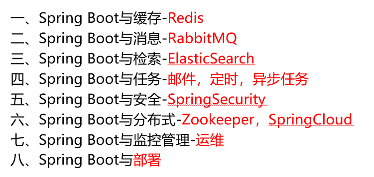
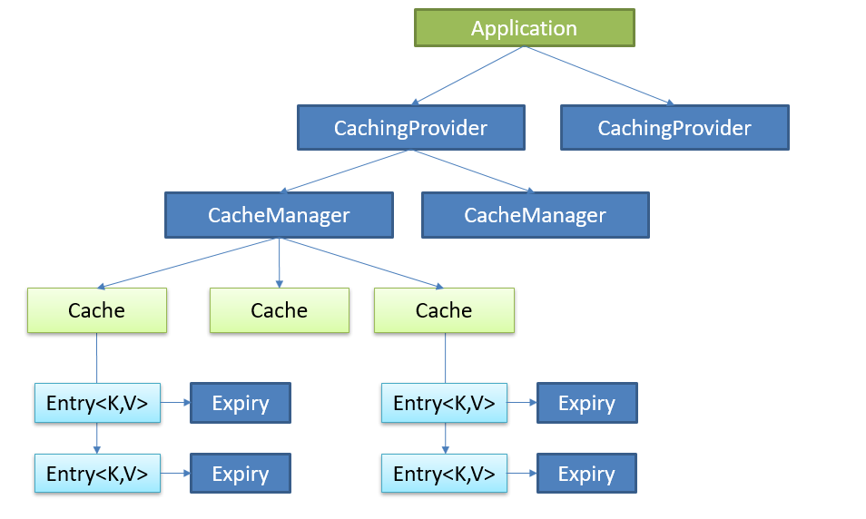
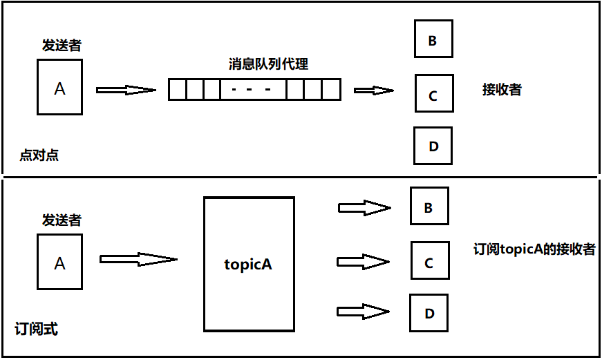
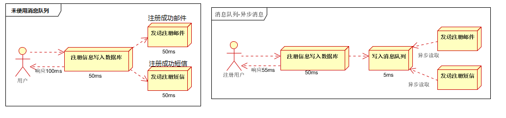
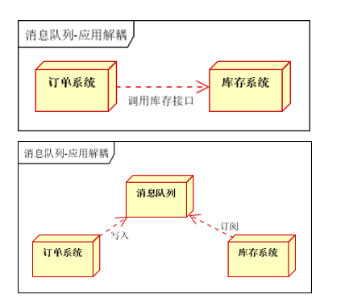
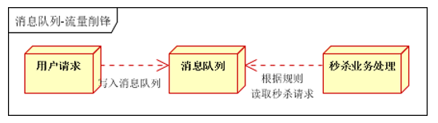
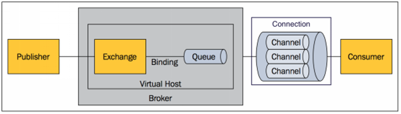

# SpringBoot高级

# 1 缓存

目的：加速系统的访问，提升系统的性能。

比如说我们有一些高频访问的热点数据，如果每一次都去访问数据库的话，那么这样的操作耗时很大。此时如果我们引入缓存中间件，如果缓存中有，直接使用，如果没有，再来查询数据库，从数据库中查到数据再放到缓存中，以便下次使用。

再比如说，向手机中发送验证信息，三分钟有效，这些数据就可以放在缓存中，以便及时释放。

## 1.1 JSR-107

JSR(Java Specification Requests，java规范请求)

Java Caching定义了5个核心接口，分别是**CachingProvider**, **CacheManager**, **Cache**, **Entry** 和 **Expiry**。

1. **CachingProvider**定义了创建、配置、获取、管理和控制多个**CacheManager**。一个应用可以在运行期访问多个CachingProvider。
2. **CacheManager**定义了创建、配置、获取、管理和控制多个唯一命名的**Cache**，这些Cache存在于CacheManager的上下文中。一个CacheManager仅被一个CachingProvider所拥有。
3. **Cache**是一个类似Map的数据结构并临时存储以Key为索引的值。一个Cache仅被一个CacheManager所拥有。
4. **Entry**是一个存储在Cache中的key-value对。
5. **Expiry** 每一个存储在Cache中的条目有一个定义的有效期。一旦超过这个时间，条目为过期的状态。一旦过期，条目将不可访问、更新和删除。缓存有效期可以通过ExpiryPolicy设置。

## 1.2 Spring 缓存抽象

Spring从3.1开始定义了org.springframework.cache.Cache和org.springframework.cache.CacheManager接口来统一不同的缓存技术；并支持使用JCache（JSR-107）注解简化我们开发；

初始化项目

- 选择依赖：core->cache  sql->mysql mybatis   web->Web

## 1.3 redis

# 2 消息

JMS（java消息服务）、AMQP（高级消息队列协议）、RabbitMQ

## 2.1 简介

1. 目的：大多数应用中，可通过消息服务中间件来提升系统异步通信、扩展解耦能力。

2. 消息服务中两个重要概念：

   - 消息代理（message broker）
   - 目的地（destination）

   当消息发送者发送消息以后，将由消息代理接管，消息代理保证消息传递到指定目的地。

3. 消息队列主要有两种形式的目的地

   - 队列（queue）：点对点消息通信（point-to-point），消息一旦接收，就会被队列剔除。一旦有一个接收者收到，其他接收者将不会收到消息。

   - 主题（topic）：发布（publish）/订阅（subscribe）消息通信

     

4. 应用场景

   - 异步处理：写入消息队列后就不用管了，直接返回响应

     

   - 应用解耦：将属于不同系统的应用解耦

     

   - 流量削峰：队列有容纳上限，达上限后，直接返回失败响应。

     

     

5. JMS（Java Message Service）JAVA消息服务，不可跨语言、跨平台

   - 基于JVM消息代理的规范。ActiveMQ、HornetMQ是JMS实现

6. AMQP（Advanced Message Queuing Protocol），网络线级协议，可跨语言、跨平台

   - 高级消息队列协议，也是一个消息代理的规范，兼容JMS

   - RabbitMQ是AMQP的实现

## 2.2 RabbitMQ

# 3 检索

开源的 [ElasticSearch](https://www.elastic.co/) 是目前全文搜索引擎的首选。他可以快速的存储、搜索和分析海量数据。

Elasticsearch是一个分布式搜索服务。

底层基于Lucene，采用多shard（分片）的方式保证数据安全，并且提供自动resharding的功能，github等大型的站点也是采用了ElasticSearch作为其搜索服务，

# 6 分布式

在分布式系统中，国内常用zookeeper+dubbo组合，而Spring Boot推荐使用全栈的Spring，Spring Boot+Spring Cloud。

## 6.1 ZooKeeper+Dubbo

1. **Zookeeper**

   - ZooKeeper 是一个分布式的，开放源码的分布式应用**程序协调服务**。

   - 它是一个为分布式应用提供一致性服务的软件，提供的功能包括：配置维护、域名服务、分布式同步、组服务等。

2. **Dubbo**
   - Dubbo是Alibaba开源的**分布式服务框架**。
   - 它最大的特点是按照分层的方式来架构，使用这种方式可以使各个层之间解耦合（或者最大限度地松耦合）。
   - 从服务模型的角度来看，Dubbo采用的是一种非常简单的模型，要么是提供方提供服务，要么是消费方消费服务，所以基于这一点可以抽象出服务提供方（Provider）和服务消费方（Consumer）两个角色。
   - 解决不同服务之间的远程调用问题（RPC)

## 6.2 SpringCloud

**Spring Cloud是一个分布式的整体解决方案。**

Spring Cloud 为开发者提供了**在分布式系统（配置管理，服务发现，熔断，路由，微代理，控制总线，一次性token，全局琐，leader选举，分布式session，集群状态）中快速构建的工具**，使用Spring Cloud的开发者可以快速的启动服务或构建应用、同时能够快速和云平台资源进行对接。

**SpringCloud分布式开发五大常用组件**

- 服务发现——Netflix Eureka
- 客服端负载均衡——Netflix Ribbon
- 断路器——Netflix Hystrix
- 服务网关——Netflix Zuul
- 分布式配置——Spring Cloud Config

# 8 热部署

问题：在开发中我们修改一个Java文件后想看到效果不得不重启应用，这导致大量时间花费。

希望：在不重启应用的情况下，程序可以自动部署（热部署）。

有以下四种情况，如何能实现热部署。

1. 模板引擎

   - 在Spring Boot中开发情况下禁用模板引擎的cache

   - 页面模板改变ctrl+F9可以重新编译当前页面并生效

2. Spring Loaded
   - Spring官方提供的热部署程序，实现修改类文件的热部署
   - 下载[Spring Loaded](<https://github.com/spring-projects/spring-loaded>)
   - 添加运行时参数

3. JRebel
   - 收费的一个热部署软件
   - 安装插件使用即可

4. **Spring Boot Devtools（推荐）**

