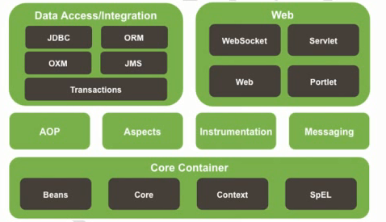
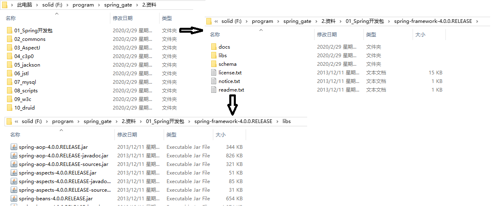
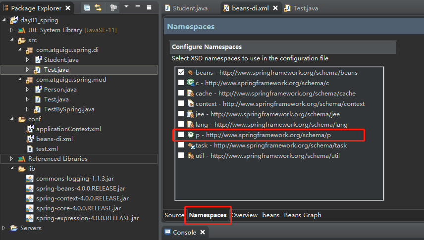
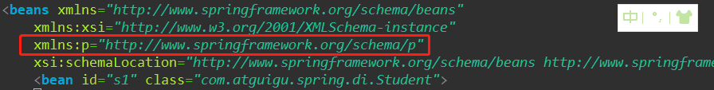
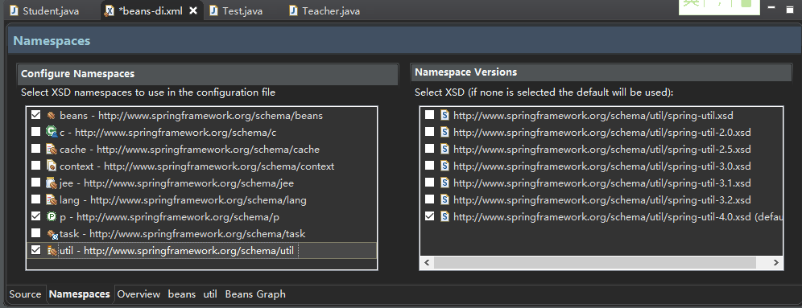
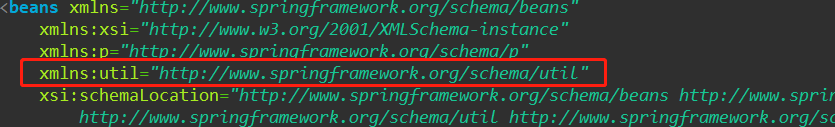
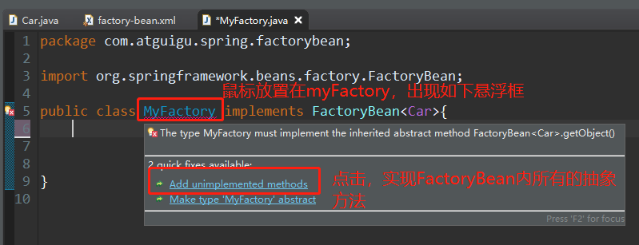
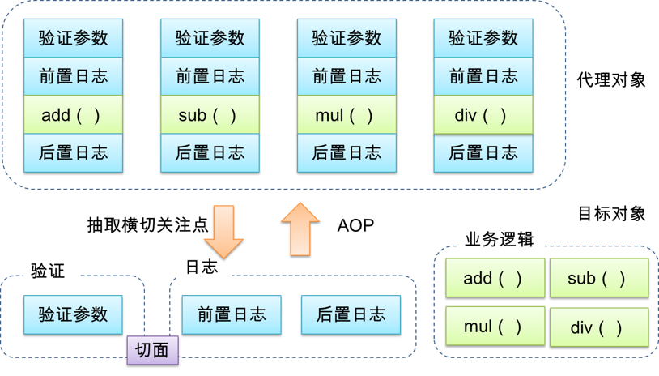
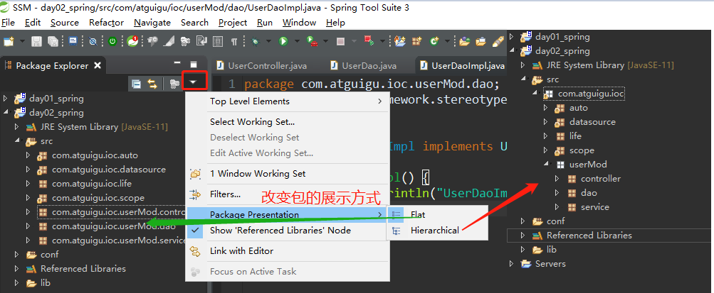
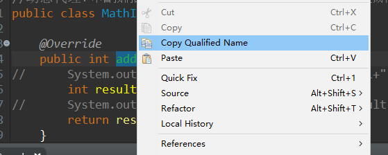

# Spring

# 0 了解框架

框架——框，约束性。架，支撑项目的半成品。具有一定约束性去支撑我们实现各种功能的半成品项目。

框架历史：Struts1（封装了servlet），Struts2（封装了过滤器），Hibernate，Spring（包含SpringMVC），SpringMVC，Mybatis（半自动的持久层框架）

注：Java Servlet 是运行在 Web 服务器或应用服务器上的程序，它是作为来自 Web 浏览器或其他 HTTP 客户端的请求和 HTTP 服务器上的数据库或应用程序之间的中间层。


MVC框架：模型(model)－视图(view)－控制器(controller)，客户端发送请求，由控制层进行处理，由模型层进行装载并传输数据，并且在视图层进行展示	eg：Struts1，Struts2，SpringMVC

持久层框架：所谓"持久"就是将数据保存到可掉电式存储设备中以便今后使用。
	eg：Hibernate，Mybatis

整合型（设计型）框架：spring

SSM=spring + springMVC + mybatis

SSH=spring + springMVC + hibernate

# 1 Spring概述

开源，spring是一个IOC(DI，用来管理项目中的对象的)和AOP容器框架

## 1.1 spring的优良特性

1. 非侵入式：采用了这种技术后，对原来的技术不造成影响（可嵌入）。基于spring开发的应用中的对象可以不依赖spring的API。
2. 依赖注入：DI——Dependency Injection，反转控制（IOC，Inversion of Control)最经典的实现
3. 面向切面编程：AOP——Aspect Oriented Programming，是对OOP（面向对象编程）的补充
4. 容器：spring是一个容器，因为它包含并且管理应用对象的生命周期
5. 组件化：spring实现了使用简单的组件配置组合成一个复杂的应用。在spring中可以使用XML和java注释组合这些对象。组件就是spring管理的对象。
6. 一站式：在IOC和AOP的基础上可以整合各种企业应用的开源框架和优秀的第三方类库（实际上spring自身也提供了表述层 的springMVC和持久层的spring JDBC）。

## 1.2 spring的模块



## 1.3 搭建spring运行环境

1. 安装STS（是一个定制版的Eclipse，专为Spring开发定制的，方便创建调试运行维护Spring应用。），建立工作空间取名随意，这里取SSM

2. 基础配置：

   - 设置主题色：window->preference->appearance->右侧theme选择dark

   - 设置字符集：

     - window->preference->搜索workspace并选择->右侧text encoding file 选择utf-8

     - window->preference->搜索jsp并选择->右侧encoding选择ISO10646/Unicode（UTF-8)

   - 设置字体：window->preference->appearance->colors and fonts ->basic的最后一项 text font

   - 开发java项目需要安装JDK，如果开发web项目，就需要再安装tomcat，记得都要为其配置环境变量。

注：Tomcat 服务器是一个免费的开放源代码的Web 应用服务器，属于轻量级应用[服务器](https://baike.baidu.com/item/%E6%9C%8D%E5%8A%A1%E5%99%A8)，在中小型系统和并发访问用户不是很多的场合下被普遍使用，是开发和调试JSP 程序的首选。对于一个初学者来说，可以这样认为，当在一台机器上配置好Apache 服务器，可利用它响应[HTML](https://baike.baidu.com/item/HTML)（[标准通用标记语言](https://baike.baidu.com/item/%E6%A0%87%E5%87%86%E9%80%9A%E7%94%A8%E6%A0%87%E8%AE%B0%E8%AF%AD%E8%A8%80/6805073)下的一个应用）页面的访问请求。实际上Tomcat是Apache 服务器的扩展，但运行时它是独立运行的，所以当你运行tomcat 时，它实际上作为一个与Apache 独立的进程单独运行的。

2. 创建java项目：

   - 右侧项目文件栏，右击，new->java project ->项目名day01_spring其余默认，创建成功后出现如下图的情景

     

3. 在day01_spring下右击新建一个lib文件夹

4. 打开资料包并复制相应的文件到lib中去：

   - 在资料包下的01_Spring开发包\spring-framework-4.0.0.RELEASE\libs找到如下几个文件，并复制到lib文件中去
     - spring-beans-4.0.0.RELEASE.jar
     - spring-context-4.0.0.RELE2ASE.jar
     - spring-core-4.0.0.RELEASE.jar
     - spring-expression-4.0.0.RELEASE.jar

   - 在资料包下的02_commons\commons-logging\commons-logging\1.1.3找到 commons-logging-1.1.1.jar，并复制到lib中去。

   

5. 对于一个java项目而言，把jar包放入lib文件夹下，不代表jar就能用了，全选lib里面的文件，右键build path->add to build path，然后就生成了Referenced libraries文件夹，这一步才相当于加载了我们的jar包。

6. 在src中创建类

   ps：打开代码自动提示：Window -> Preferences -> Java -> Editor -> Content Assist -> Enable auto activation

   右击src新建new一个Class，包名package：com.atguigu.spring.mod，类名：Person ，当然名字可以随便命名，这里只做演示。

   - 快速创建set和get方法：右击source->创建generate getters and setters ->select all->generate
   - 快速创建toString方法：右击source->创建generate toString()

   创建测试类：Test，和Person在同一个包下。运行test类，run as->java application

   ```java
   //Person.java
   package com.atguigu.spring.mod;
   
   public class Person {
   	//以后建议大家不要使用基本数据类型了，使用包装类要好一点
   	private Integer id;
   	private String name;
   	public Integer getId() {
   		return id;
   	}
   	public void setId(Integer id) {
   		this.id = id;
   	}
   	public String getName() {
   		return name;
   	}
   	public void setName(String name) {
   		this.name = name;
   	}
   	@Override
   	public String toString() {
   		return "Person [id=" + id + ", name=" + name + "]";
   	}
   	
   }
   
   //Test.java
   package com.atguigu.spring.mod;
   
   public class Test {
   	public static void main(String[] args) {
   		Person person = new Person();
   		person.setName("lihua");
   		person.setId(1001);
   		System.out.println(person);
   	}
   }
   
   ```

   

   有了spring后，对象应交给spring管理，而不应我们自行创建。要想交给spring管理需要我们在配置文件conf中，对这个对象进行配置

7. 右击new->source folder，命名为conf。

8. 建立spring的对象管理xml文件：

   - conf右击new->Spring Bean Configuration File->命名为applicationContext.xml，这是spring配置文件默认的名字，可以更改，但是这里更改了在使用时，也需要更改。

   - ps：建立xml文件的流程：conf右击new->other->搜索xml->XML File，取名为test.xml，点击下面的Source选项卡，进行xml源文件编写。

     ```xml
     
     <?xml version="1.0" encoding="UTF-8"?>
     
     <!--applicationContext.xml文件-->
     <!--beans作为命名空间，标签内部的书签有规定，能写什么和不能写什么-->
     <beans xmlns="http://www.springframework.org/schema/beans"
     	xmlns:xsi="http://www.w3.org/2001/XMLSchema-instance"
     	xsi:schemaLocation="http://www.springframework.org/schema/beans http://www.springframework.org/schema/beans/spring-beans.xsd">
     	<!-- 一个bean就代表spring管理的一个对象 -->
     	<!-- 代码补全：打一个关键词，并alt+/自动补全 -->
     	<!-- class属性的值是对象所属类的类名，这里的类型要写全 -->
     	<!-- id属性必须唯一，用来做唯一标识 -->
     	<bean id="person" class="com.atguigu.spring.mod.Person">
     		<property name="id" value="1111"></property>
     		<property name="name" value="autumnmoon"></property>
     	</bean>
     
     </beans>
     ```


9. 在src/com.atguigu.spring.mod下创建一个testBySpring,java。用于测试通过spring管理对象的效果

   ```java
   //in TeatBySpring.java
   
   package com.atguigu.spring.mod;
   
   import org.springframework.context.ApplicationContext;
   import org.springframework.context.support.ClassPathXmlApplicationContext;
   
   public class TestBySpring {
   	
   	public static void main(String[] args) {
   		
   		//初始化容器
   		ApplicationContext ac = new ClassPathXmlApplicationContext("applicationContext.xml");
   		//通过getBean方法获取对象
   		//Object bean = ac.getBean("person");
   		//ctrl+1,查看返回值。双击返回值，会补全包括等号的左侧。
   		Person person=(Person) ac.getBean("person");
   		System.out.println(person);
   	}
   }
   
   ```

# 2 IOC(DI)容器和bean配置

## 2.1 IOC和DI

### 2.1.1 IOC(Inversion of Control)：反转控制

把原来由开发者管理对象的权利反转给程序本身——反转控制

在应用程序中的组件需要获取资源时，传统的方式是组件主动的从容器中获取所需要的资源，在这种情况下，开发人员需要知道特定资源的获取方式，增加了学习成本。

而反转控制，改由容器主动的将资源推送给需要的组件，开发人员不需要知道容器是如何创建资源对象的，只需要提供接收资源的方式即可。

IOC基于工厂模式实现的。

### 2.1.2 DI(Dependency Injection)：依赖注入

IOC的另一种表述方式：即组件以一些预先定义好的方式(例如：setter 方法)接受来自于容器的资源注入。相对于IOC而言，这种表述更直接。

总结: IOC 就是一种反转控制的思想，而DI是对IOC的一种具体实现。

### 2.1.3 IOC容器spring中的实现

前提:  Spring中有IOC思想，  IOC思想必须基于 IOC容器来完成， 而IOC容器在最底层实质上就是一个对象工厂。

1. 在通过IOC容器读取Bean的实例之前，需要先将IOC容器本身实例化。

2. Spring提供了IOC容器的两种实现方式

   - ① BeanFactory：IOC容器的基本实现，是Spring内部的基础设施，是面向Spring本身的，不是提供给开发人员使用的。

   - ② ApplicationContext：BeanFactory的子接口，提供了更多高级特性。面向Spring的使用者，几乎所有场合都使用ApplicationContext而不是底层的BeanFactory。

### 2.1.4 ApplicationContext

<h5>主要实现类</h5>

1. ClassPathXmlApplicationContext：对应类路径下的XML格式的配置文件，相对路径
2. FileSystemXmlApplicationContext：对应文件系统中的XML格式的配置文件，绝对路径
3. 在初始化时就创建单例的bean，也可以通过配置的方式指定创建的Bean是多实例的。

<h5>子接口</h5>

 ConfigurableApplicationContext包含一些扩展方法

refresh()和close()让ApplicationContext具有启动、关闭和刷新上下文的能力。

```java
		//in TeatBySpring.java

		//初始化容器
		ApplicationContext ac = new ClassPathXmlApplicationContext("applicationContext.xml");
		//此时的ac没有关闭容器资源的能力
		
		//ConfigurableApplicationContext是ApplicationContext的子接口，
		//这时ac是有close()方法的。
		//提供了相应close(),refresh()，使ApplicationContext具有启动、关闭、刷新上下文的能力
		//ConfigurableApplicationContext ac = new ClassPathXmlApplicationContext("applicationContext.xml");
		
		//ApplicationContext的实现类功能最全，包括ClassPathXmlApplicationContext和FileSystemXmlApplicationContext
		//这时ac是有close()方法的。
		//ClassPathXmlApplicationContext ac = new ClassPathXmlApplicationContext("applicationContext.xml");
```

## 2.2 Bean

### 2.2.1 bean对象的获取

bean对象的获取，可以通过id、class对象和两者混合的方式获取对象

```java
		//in TeatBySpring.java

		//1.这里的getBean通过bean的id属性获取到该对象
		Person person=(Person) ac.getBean("person1");
		
		//2.这里的getBean通过类的class对象获取到该对象（这里涉及到反射语法，可以温习一下）
		//用类获取对象的时候小心造成同一类多个对象的模糊
		Person person1=ac.getBean(Person.class);
		
		//3.这里的getBean通过bean的id和类的class对象两个参数获取到了对象
		Person person2 = ac.getBean("person1",Person.class);

		//getBean有许多重载的方法，可以看一看，都能达到同样的效果。
		
		System.out.println(person);
		System.out.println(person1);
		System.out.println(person2);
```

### 2.2.2 bean对象属性的赋值（注入）

<h5>set注入</h5>

\<property>标签底层是通过set方法（set注入），给私有的变量赋的值。

通过Ctrl+点击name属性值，就可以链接到对应的set方法。

- name属性：指定和对应类里面的setXXX的XXX相对应。它不一定要与对应类里的属性名相同。
- value属性：指定属性的值。


<h5>构造器注入</h5>

\<constructor-arg/>标签底层是通过构造器（构造器注入），给私有变量赋的值。

1. 自动匹配构造器进行注入：标签的顺序对应于构造器参数的顺序。
2. 通过索引值指定参数的位置：index属性,一般结合type属性使用。
3. 通过参数类型区分构造器：type属性

```xml
<bean id="s1" class="com.atguigu.spring.di.Student">
	<!-- 
		复制当前行到下一行：Ctrl+Alt+↓ 
		<property>标签通过set方法（set注入），给私有的变量赋的值。
			通过Ctrl+点击属性名，就可以链接到对应的set方法。
			这里的属性名一定要和对应类里面的setXXX的XXX相对应。
			它不一定要与对应类里的属性名相同。
	-->
		<property name="id" value="01"></property>
		<property name="name" value="autumnmoon"></property>
		<property name="age" value="24"></property>
		<property name="sex" value="女"></property>
	</bean>

	<bean id="s2" class="com.atguigu.spring.di.Student">
	
	<!-- 
		<constructor-arg>标签通过构造器（构造器注入），顺序对应参数给属性赋值。
			标签数和构造器的参数个数一定要一致，否则直接报错 
	-->
		<constructor-arg value="02"></constructor-arg>
		<constructor-arg value="sifang"></constructor-arg>
		<constructor-arg value="0"></constructor-arg>
		<constructor-arg value="男"></constructor-arg>
	</bean>
	<bean id="s3" class="com.atguigu.spring.di.Student">
	<!-- 
		当构造器的参数个数相同时，但类型有不同，他会按照类里面定义的构造器先后顺序，选择构造器。
		这种情况下会造成混淆
		故需要添加相应的标签属性确定参数，确定的构造器
		index：确定是构造的第几个参数
		type：确定由index确定的参数的类型
	 -->
		<constructor-arg value="02"></constructor-arg>
		<constructor-arg value="sifang"></constructor-arg>
		<constructor-arg value="90" index="2" type="java.lang.Double"></constructor-arg>
		<constructor-arg value="男"></constructor-arg>
	</bean>
```

### 2.2.3 p命名空间

Spring 从2.5版本开始引入了一个新的p命名空间，可以通过\<bean>元素属性的方式配置bean的属性(底层也是通过setter方法）。

使用p命名空间后，基于XML的配置方式将进一步简化。

点击beans-di.xml的编辑栏下方的namespace选项卡->选择p-http://..........，如下图：



beans-di.xml有如下变化：



```xml
<bean 
	id="s4" class="com.atguigu.spring.di.Student" 
	p:id="04" p:name="Qsfang" p:age="12" p:sex="女"
>
</bean>
```

### 2.2.4 bean属性的值

value属性或value标签给基本类型的属性赋值，bean或ref标签（属性）给引用类型的属性赋值

<h5>字面量</h5>

可以写在双引号中的值，可以通过value直接赋值的值。

1. 可以使用字符串表示的值，可以通过value属性或value子节点的方式指定。

   eg：value子节点，\<property name="id">\<value>05\</value>\</property>

2. 基本数据类型及其封装类、String等类型都可以采取字面值注入的方式

3. 若字面值中包含特殊字符，可以使用\<![CDATA[]]>把字面值包裹起来

<h5>bean-ref引用对象</h5>

ref的值是当前spring管理范围内的某一个bean的id。可以赋给某一属性以引用类型值

```xml
<bean id="s5" class="com.atguigu.spring.di.Student">
	<property name="id" value="05"></property>
	<property name="name" value="auyhe"></property>
	<property name="age" value="24"></property>
	<property name="sex" value="女"></property>
	<property name="teacher" ref="t1"></property>
</bean>
<bean id="t1" class="com.atguigu.spring.di.Teacher">
	<property name="tid" value="01"></property>
	<property name="tname" value="msMeng"></property>
</bean>
```

<h5>给bean的级联属性赋值</h5>

```xml
<bean id="s5" class="com.atguigu.spring.di.Student">
	<property name="id" value="05"></property>
	<property name="name" value="auyhe"></property>
	<property name="age" value="24"></property>
	<property name="sex" value="女"></property>
	<property name="teacher" ref="t1"></property>
    <property name="teacher.name" value="LaoXiao"></property>
    <!--可以修改t1里的部分值，然后进行赋值-->
</bean>
<bean id="t1" class="com.atguigu.spring.di.Teacher">
	<property name="tid" value="01"></property>
	<property name="tname" value="msMeng"></property>
</bean>
```

<h5>内部bean</h5>

```xml
	<bean id="s6" class="com.atguigu.spring.di.Student">
		<property name="id" value="06"></property>
		<property name="name" value="jjhe"></property>
		<property name="age" value="12"></property>
		<property name="sex" value="女"></property>
        <!--
			property的bean节点，同样可以为属性赋值
			这里的bean只在父bean下能找到，只能在父bean下被使用，父bean外是无法被找到或被ref引用的
		-->
		<property name="teacher">
			<bean id="t2" class="com.atguigu.spring.di.Teacher">
				<property name="tid" value="02"></property>
				<property name="tname" value="jiangdd"></property>
			</bean>		
		</property>
	</bean>
```

<h5>集合属性</h5>

```xml
	<!--list、array、set赋值都和下面的一样。只不过要换标签而已<list>,<array>,<set> -->
	<bean id="t4" class="com.atguigu.spring.di.Teacher">
		<property name="tid" value="04"></property>
		<property name="tname" value="qinkk"></property>
		<property name="students">
			<list>
                <!--也可以添加内部bean的方式添加应用类型的量，这里用的是<ref/>标签-->
				<ref bean="s1"/>
				<ref bean="s2"/>
				<ref bean="s3"/>
				<ref bean="s4"/>
			</list>
		</property>
	</bean>
	<!--map有些不一样-->
	<bean id="t5" class="com.atguigu.spring.di.Teacher">
		<property name="tid" value="05"></property>
		<property name="tname" value="qinkh"></property>
		<property name="bossMap">
			<map>
				<entry>
					<key>
						<value>1001</value>
					</key>
					<value>秦领导</value>
				</entry>
				<entry>
					<key>
						<value>1002</value>
					</key>
					<value>张领导</value>
				</entry>
			</map>
		</property>
	</bean>	

```

### 2.2.5 集合类型的bean

增添集合类型bean的命名空间





```xml
	<util:list id="t6students">
		<ref bean="s4"></ref>
		<ref bean="s5"></ref>
		<ref bean="s6"></ref>
	</util:list>
```

### 2.2.6 FactoryBean

Spring中有两种类型的bean，一种是普通bean，另一种是工厂bean，即FactoryBean。

​         工厂bean跟普通bean不同，其返回的对象不是指定类的一个实例，其返回的是该工厂bean的getObject方法所返回的对象。

​         工厂bean必须实现org.springframework.beans.factory.FactoryBean接口。



```java
//in Car.java
package com.atguigu.spring.factorybean;

public class Car {
	
	private String brand;
	private Double price;
	public String getBrand() {
		return brand;
	}
	public void setBrand(String brand) {
		this.brand = brand;
	}
	public Double getPrice() {
		return price;
	}
	public void setPrice(Double price) {
		this.price = price;
	}
	@Override
	public String toString() {
		return "Car [brand=" + brand + ", price=" + price + "]";
	}
	
}
//in MyFactory.java
package com.atguigu.spring.factorybean;

import org.springframework.beans.factory.FactoryBean;

public class MyFactory implements FactoryBean<Car>{

	@Override
	public Car getObject() throws Exception {
		Car car = new Car();
		car.setBrand("BMW");
		car.setPrice(20000.0);
		return car;
	}

	@Override
	public Class<?> getObjectType() {
		// TODO Auto-generated method stub
		return Car.class;
	}

	@Override
	public boolean isSingleton() {
		// TODO Auto-generated method stub
		return false;
	}
}
```

```xml
<!--in factory-bean.xml -->
<?xml version="1.0" encoding="UTF-8"?>
<beans xmlns="http://www.springframework.org/schema/beans"
	xmlns:xsi="http://www.w3.org/2001/XMLSchema-instance"
	xsi:schemaLocation="http://www.springframework.org/schema/beans http://www.springframework.org/schema/beans/spring-beans.xsd">
	
    <!-- 工厂bean,这里的对象并不是Myfactory的对象，而是MyFactory生产的对象 -->
	<bean id="factory" class="com.atguigu.spring.factorybean.MyFactory"></bean>

</beans>
```

## 2.3 Bean的作用域

在spring中，bean的scope属性决定了对象的作用域。singleton是默认的作用域

作用域：prototype(多例），singleton（单例），request（请求），session（会话）


当bean的作用域为单例时，Spring会在IOC容器对象创建时就创建bean的对象实例。

而当bean的作用域为prototype时，IOC容器在获取bean的实例时创建bean的实例对象。

## 2.4 Bean的生命周期

Spring IOC容器对bean的生命周期进行管理的过程：

1. 通过构造器或工厂方法创建bean实例
2. 为bean的属性设置值和对其他bean的引用，依赖注入的过程
3. 调用bean的初始化方法，bean的init-method属性声明初始化的方法。
4.  bean可以使用了
5. 当容器关闭时，调用bean的销毁方法，bean的destroy-method属性声明销毁方法

```java
//in Person.java
package com.atguigu.ioc.life;

public class Person {
	private Integer id;
	private String sex;
	private String name;
	public Integer getId() {
		return id;
	}
	public void setId(Integer id) {
		System.out.println("two:依赖注入");
		this.id = id;
	}
	public String getSex() {
		return sex;
	}
	public void setSex(String sex) {
		this.sex = sex;
	}
	public String getName() {
		return name;
	}
	public void setName(String name) {
		this.name = name;
	}
	public Person() {
		System.out.println("one:创建对象");
		//super();
		// TODO Auto-generated constructor stub
	}
	public void init() {
		System.out.println("three:初始化方法");
	}
	@Override
	public String toString() {
		return "four：使用对象：Person [id=" + id + ", sex=" + sex + ", name=" + name + "]";
	}
	public void destroy() {
		System.out.println("five:消毁");
	}
	
}

//in Test.java
package com.atguigu.ioc.life;

import org.springframework.context.support.ClassPathXmlApplicationContext;

public class Test {
	public static void main(String[] args) {
		ClassPathXmlApplicationContext ac = new ClassPathXmlApplicationContext("life.xml");
		Person person = ac.getBean("person", Person.class);
		System.out.println(person);
		ac.close();//调用销毁方法
	}	
	
}

```

```xml
	<!--
	in life.xml
	初始化方法的调用：需要用init-method属性声明调用
	销毁方法的调用：需要用destroy-method属性声明调用
	-->
	<bean id="person" class="com.atguigu.ioc.life.Person" init-method="init" destroy-method="destroy">
		<property name="id" value="1001"></property>
		<property name="sex" value="男"></property>
	</bean>
```

<h5>bean的后置处理器</h5>

可以使生命周期的五个阶段变为七个阶段

1. bean后置处理器允许在调用**初始化方法前后**对bean进行额外的处理

2. bean后置处理器对IOC容器里的所有bean实例逐一处理，而非单一实例。 其典型应用是：检查bean属性的正确性或根据特定的标准更改bean的属性。

3. 需要实现org.springframework.beans.factory.config.BeanPostProcessor接口，

   并重写其中的 postProcessBeforeInitialization（初始化前方法）和postProcessAfterInitialization（初始化后方法）

4. 在xml中还要添加后置处理的类bean

```java
//in AfterHandler.java
package com.atguigu.ioc.life;

import org.springframework.beans.BeansException;
import org.springframework.beans.factory.config.BeanPostProcessor;

public class AfterHandler implements BeanPostProcessor {

	//初始化之前
	@Override
	public Object postProcessBeforeInitialization(Object bean, String beanName) throws BeansException {
		// TODO Auto-generated method stub
		Person person=(Person) bean;
		if(person.getSex().equals("男")) {
			person.setName("秦思放");
		}else {
			person.setName("秦斯");
		}
		return person;
	}

	//初始化之后
	@Override
	public Object postProcessAfterInitialization(Object bean, String beanName) throws BeansException {
		// TODO Auto-generated method stub
		return bean;
	}
}
```

```xml
<!--life.xml-->
<bean id="person" class="com.atguigu.ioc.life.Person" init-method="init" destroy-method="destroy">
	<property name="id" value="1001"></property>
	<property name="sex" value="男"></property>
</bean>
<!--这里添加了后置处理器的bean-->
<bean class="com.atguigu.ioc.life.AfterHandler"></bean>
```

## 2.5 引用外部属性文件

当bean的配置信息逐渐增多时，查找和修改一些bean的配置信息就变得愈加困难。这时可以将一部分信息提取到bean配置文件的外部，以properties格式的属性文件保存起来，同时在bean的配置文件中引用properties属性文件中的内容，从而实现一部分属性值在发生变化时仅修改properties属性文件即可。这种技术多用于连接数据库的基本信息的配置。

引入外部资源文件的步骤：
	1. 在conf下创建.properties资源文件
	2. 在本xml文件中加载资源文件，方法1：通过bean的方式加载，方法2：通过context命名空间加载（namespace->context)
	3.在直接配置属性处，通过value="${key}"引用静态文件中的值

```xml
<!--in datasource.xml-->

<beans xmlns="http://www.springframework.org/schema/beans"
	xmlns:xsi="http://www.w3.org/2001/XMLSchema-instance"
	xmlns:context="http://www.springframework.org/schema/context"
	xsi:schemaLocation="http://www.springframework.org/schema/beans http://www.springframework.org/schema/beans/spring-beans.xsd
		http://www.springframework.org/schema/context http://www.springframework.org/schema/context/spring-context-4.0.xsd">
	<!-- 
	Referenced Libraries中找到druid的关于引用外部属性的类
	com.alibaba.druid.pool->DruidDateSource.class
	->
	看其中的解释，就知道这个类了com.alibaba.druid.pool.DruidDataSource，他还有一个父类com.alibaba.druid.pool.DruidAbstractDataSource
	
	看类的源码中有什么属性，直接看有点累，我们可以查看相对应的视图
	window->ShowView->outline,
	就可以看到这个类的源码中有什么属性和方法了，如果这个类里找不到你想要的属性，没准它的父类有
	 -->
	 
	 <!--
		 直接配置数据库连接信息， 
	-->
	<bean id="datasource1" class="com.alibaba.druid.pool.DruidDataSource">
		<property name="driverClassName" value="com.mysql.jdbc.Driver"></property>
		<property name="url" value="jdbc:mysql://localhost:3306/test"></property>
		<property name="username" value="root"></property>
		<property name="password" value="123456"></property>
		<!-- 像这里的数据库连接信息，都是固定写死的 -->
		<!-- 我们可以看到下面的这些property都是写死的，我们可以将他们写成静态的资源文件 -->
		<!-- properties -->
	</bean>
	
	<!-- 
	引入外部资源文件的方法
	1. 在conf下创建.properties资源文件
	2. 在本xml文件中加载资源文件，方法1：通过bean的方式加载，方法2：通过context命名空间加载
	3.在直接配置属性处，通过value="${key}"引用静态文件中的值
	 -->
	<bean class="org.springframework.beans.factory.config.PropertyPlaceholderConfigurer">
		<property name="location" value="db.properties"></property>
	</bean>
	<bean id="datasource2" class="com.alibaba.druid.pool.DruidDataSource">
		<property name="driverClassName" value="${jdbc.Driver}"></property>
		<property name="url" value="${jdbc.url}"></property>
		<property name="username" value="${jdbc.username}"></property>
		<property name="password" value="${jdbc.password}"></property>
	</bean>
	
	<context:property-placeholder location="db.properties"/>
	<bean id="datasource3" class="com.alibaba.druid.pool.DruidDataSource">
		<property name="driverClassName" value="${jdbc.Driver}"></property>
		<property name="url" value="${jdbc.url}"></property>
		<property name="username" value="${jdbc.username}"></property>
		<property name="password" value="${jdbc.password}"></property>
	</bean>
</beans>
```

```properties
#in db.properties
#key=value,
jdbc.driver=com.mysql.jdbc.Driver
jdbc.url=jdbc:mysql://localhost:3306/test
jdbc.username=root
jdbc.password=123456
```

```java
//in Test.java
package com.atguigu.ioc.datasource;

import org.springframework.context.ApplicationContext;
import org.springframework.context.support.ClassPathXmlApplicationContext;

import com.alibaba.druid.pool.DruidDataSource;

public class Test {
	public static void main(String[] args) throws Exception {
		ApplicationContext ac= new ClassPathXmlApplicationContext("datasource.xml");
		DruidDataSource data1=ac.getBean("datasource1",DruidDataSource.class);
		System.out.println(data1.getConnection());
		DruidDataSource data2=ac.getBean("datasource2",DruidDataSource.class);
		System.out.println(data2.getConnection());
		DruidDataSource data3=ac.getBean("datasource3",DruidDataSource.class);
		System.out.println(data3.getConnection());
		
	}
}
```

## 2.6 自动注入（装配）

### 2.6.1 概念

1) 手动装配：以value或ref的方式**明确指定属性值**都是手动装配。

2) 自动装配：根据指定的装配规则，**不需要明确指定**，Spring**自动**将匹配的属性值**注入**bean中。自动装配的属性都是非字面量的属性，都是需要ref的属性

bean的autowire属性根据策略自动为非字面量属性赋值。在目标bean中可以省略为非字面量的赋值，程序根据策略匹配相应的非字面量给相应的属性。

### 2.6.2 装配模式

1. 根据**类型（byType）**自动装配：将类型匹配的bean作为属性注入到另一个bean中。若IOC容器中有多个与目标bean类型一致的bean，Spring将无法判定哪个bean最合适该属性，所以不能执行自动装配并报错。匹配的bean可以使目标bean的类型一致，也可以是目标bean类型的子类和接口实现类（兼容性属性）。
2. 根据**名称（byName）**自动装配：必须将目标bean的id和被装配对象的属性名设置的完全相同，才可以进行自动装配。
3. 通过构造器（constructor）自动装配：当bean中存在多个构造器时，此种自动装配方式将会很复杂。不推荐使用。

通过autowire属性进行自动装配是有缺陷的，他会作用于该bean内所有的非字面量属性。因此不建议使用此属性用于自动装配。

相对于使用注解的方式实现的自动装配，在XML文档中进行的自动装配略显笨拙，在项目中更多的使用注解的方式实现。

## 2.7 通过注解配置bean

相对于XML方式而言，通过注解的方式配置bean更加简洁和优雅，而且和MVC组件化开发的理念十分契合，是开发中常用的使用方式。

注解的作用范围：只对其本身下面的最小语法单元有效

### 2.7.1 使用注解标识组件

servlet控制层（控制请求和响应），dao数据访问层（持久化层），service业务逻辑层。控制层接收请求，调用业务层处理业务逻辑，调用数据访问层实现数据持久化。

一个类只要用了注解，那么spring就会对这个类产生的对象进行管理。当一个类生成多个对象时，不需要写多个bean就可以进行管理。

1. 普通组件：@Component，标识一个受Spring IOC容器管理的组件
2. 持久化层组件：@Repository，标识一个受Spring IOC容器管理的持久化层组件
3. 业务逻辑层组件：@Service，标识一个受Spring IOC容器管理的业务逻辑层组件
4. 表述层控制器组件：@Controller，标识一个受Spring IOC容器管理的表述层控制器组件

这几个注解其实没有什么不同，只是起一个标记作用，开发人员看到注解后，能够知道这个类属于什么层。他们的作用效果都相同，仅告诉spring所注解的这个类需要管理。

通过这个注解后，如同在xml文件中加入了这几个注解的bean对象，他们的**id默认为首字母小写后的类名**。我们也可以通过@Annotation(value="id")，手动设置它的id，eg:@Component(value="user")，那么此组件bean的id就为user。

### 2.7.2 扫描组件

组件被上述注解标识后还需要通过Spring进行扫描才能够侦测到。

故需要在配置文件中，勾上context命名空间，并加上

扫描标签:__<context:component-scan base-package="package" resource-pattern=*"/\*.class"*/>__

1. base-package属性指定一个需要扫描的基类包，Spring容器将会扫描这个基类包及其子包中的所有类。

2. 当需要扫描多个包时可以使用逗号分隔。

3. 如果仅希望扫描特定的类而非基包下的所有类，可使用resource-pattern属性过滤特定的类，

4. **\<context:include-filter type="" expression=""/>**子节点:表示包中要**包含**的目标类，type为类型：annotation（注解）、assignable（具体的类）

   注意：通常需要与\<context:component-scan/>的use-default-filters属性配合使用才能够达到“仅包含某些组件”这样的效果。即：通过将use-default-filters属性设置为false，禁用默认过滤器，然后扫描的就只是include-filter中的规则指定的组件了。

5. **\<context:exclude-filter>**子节点表示要**排除**在外的目标类

   注意：排除的时候，一定要在有扫描结果的情况下进行排除，通常删除use-default-filters，因为它默认为true。

6. \<context:component-scan/>可以出现多个包含或多个排除，但不能同时包含和排除，逻辑上有错误，但不会报错。

### 2.7.3 组件装配

1. 需求：

   Controller组件中往往需要用到Service组件的实例，Service组件中往往需要用到       Repository组件的实例。Spring可以通过注解的方式帮我们实现属性的装配。

2. 实现依据

   在指定要扫描的包时，\<context:component-scan> 元素会自动注册一个bean的后置处理器：AutowiredAnnotationBeanPostProcessor的实例。该后置处理器可以自动装配标记了**@Autowired**、@Resource或@Inject注解的属性。

# 3 AOP

通过代理模式实现的，

## 3.1 AOP概述

1. AOP(Aspect-Oriented Programming，**面向切面编程**)：是一种新的方法论，是对传统 OOP(Object-Oriented Programming，面向对象编程)的补充。

2. 面向对象 ，纵向继承机制。面向切面 ，横向抽取机制。

3. 切面：存储公共功能的类，

4. AOP编程操作的主要对象是切面(aspect)，而切面用于**模块化横切关注点（公共功能）**。

5. AOP的好处： 

   ① 每个事物逻辑位于一个位置，代码不分散，便于维护和升级

   ② 业务模块更简洁，只包含核心业务代码

   ③ AOP图解

   

## 3.2 AOP术语

1. 横切关注点：从每个方法中抽取出来的同一类非核心业务。
2. 切面(Aspect)：封装横切关注点信息的类，每个关注点体现为一个通知方法。
3. 通知(Advice)：切面必须完成的各个具体的工作
4. 连接点(Joinpoint)：是横切关注点在程序代码中的具体体现，对应程序执行的某个特定位置。例如：类某个方法调用前、调用后、方法捕获到异常后等。
5. 切入点(Pointcut)：定位连接点的方式。
6. 目标(Target)：被通知的对象
7. 代理(Proxy)：向目标对象应用通知之后创建的代理对象

## 3.3 AspectJ

AspectJ：Java社区里最完整最流行的AOP框架。

在Spring2.0以上版本中，可以使用基于AspectJ注解或基于XML配置的AOP。

### 3.3.1 spring中启用AspectJ注解支持

1. 导入JAR包

   - com.springsource.net.sf.cglib-2.2.0.jar
   - com.springsource.org.aopalliance-1.0.0.jar
   - com.springsource.org.aspectj.weaver-1.6.8.RELEASE.jar 
   - spring-aop-4.0.0.RELEASE.jar
   - spring-aspects-4.0.0.RELEASE.jar

2. 引入aop 命名空间

3. 配置切面代理：

   <aop:aspectj-autoproxy />

   当Spring IOC容器侦测到bean配置文件中的\<aop:aspectj-autoproxy>元素时，会自动为AspectJ切面匹配的bean创建代理

```xml
<?xml version="1.0" encoding="UTF-8"?>
<!--in aop.xml-->
<beans xmlns="http://www.springframework.org/schema/beans"
	xmlns:xsi="http://www.w3.org/2001/XMLSchema-instance"
	xmlns:aop="http://www.springframework.org/schema/aop"
	xmlns:context="http://www.springframework.org/schema/context"
	xsi:schemaLocation="http://www.springframework.org/schema/beans http://www.springframework.org/schema/beans/spring-beans.xsd
		http://www.springframework.org/schema/context http://www.springframework.org/schema/context/spring-context-4.0.xsd
		http://www.springframework.org/schema/aop http://www.springframework.org/schema/aop/spring-aop-4.0.xsd">
		<!-- 
		第一步：扫描包context:component-scan并开启aop:aspectj-autoproxy自动代理
		第二步：切面上定义两个注解：@Component和@Aspect
		第三步：在切面里写通知方法，并在方法前加上注解@Before(value="execution())"
		第四步：通过spring获取对象，执行目标对象方法
		 -->
		<context:component-scan base-package="com.atguigu.spring.aop"></context:component-scan>
		<!-- 开启AspectJ的自动代理功能 -->
		<aop:aspectj-autoproxy />
</beans>
```


##  3.4 AspectJ注解声明切面

切入点表达式：注解括号中value的值，

```java
//in MyloggerAspect.java
package com.atguigu.spring.aop;

import java.util.Arrays;

import org.aspectj.lang.JoinPoint;
import org.aspectj.lang.ProceedingJoinPoint;
import org.aspectj.lang.annotation.After;
import org.aspectj.lang.annotation.AfterReturning;
import org.aspectj.lang.annotation.AfterThrowing;
import org.aspectj.lang.annotation.Around;
import org.aspectj.lang.annotation.Aspect;
import org.aspectj.lang.annotation.Before;
import org.aspectj.lang.annotation.Pointcut;
import org.springframework.core.annotation.Order;
import org.springframework.stereotype.Component;

@Component
@Aspect  //用于标注当前类为切面
@Order(1)//定义切面的优先级，数字小者先执行，数字大者后执行，当然是针对于同一个通知方法而言的
public class MyloggerAspect {
	/**
	 * @Pointcut，切入点的复用，让后面的通知方法前的注解复用一个切入点表达式
	 * eg：
	 * @Before(value="multiplexPointcut()"),与下面的@Before注解的作用相同
	 * @AfterReturning(value="multiplexPointcut()",returning = "result"),与下面的@AfterReturning注解的作用相同
	 */
	@Pointcut(value="execution(* com.atguigu.spring.aop.*.*(..))")
	public void multiplexPointcut() {}

	/**
	 * @Before:将方法指定为前置通知
	 *  必须设置value，其值为切入点表达式
	 *  前置通知：作用于方法执行之前
	 */
//	切入点表达式，过滤筛选写法
//	@Before(value="execution(public int com.atguigu.spring.aop.MathImpl.add(int, int))")
//	@Before(value="execution(public int com.atguigu.spring.aop.MathImpl.*(int, int))")
//	@Before(value="execution(* com.atguigu.spring.aop.MathImpl.*(int, int))")
	@Before(value="execution(* com.atguigu.spring.aop.*.*(..))")
	//第一颗*：任意返回值类型和访问修饰符
	//第二颗*：包下任意类
	//第三颗*：类下面任意方法
	//括号内两点：方法任意参数列表
    //切入点表达式也可以通过 “&&”、“||”、“!”等操作符结合起来
	public void beforeMethod(JoinPoint joinPoint) {
		Object[] args = joinPoint.getArgs();//获取方法的参数
		String methodName=joinPoint.getSignature().getName();//获取方法名
		System.out.println("Method："+methodName+",arguments："+Arrays.toString(args));
		System.out.println("切面优先级测试，order越小，优先级越高，此切面order=1");
	}
	
	/**
	 * @After:将方法标注为后置通知
	 * 后置通知：作用于方法的finally语句块，就算目标对象的方法执行报错，依旧执行
	 * 
	 */
	@After(value="execution(* com.atguigu.spring.aop.*.*(..))")
	public void afterMethod() {
		System.out.println("后置通知");
	}
	
	/**
	 * @AfterReturning:将方法标注为返回通知
	 * 返回通知：作用于方法执行之后
	 * @AfterReturning后的returning可指定方法返回值的变量名
	 * 要想在通知方法中使用，必须在通知方法的参数末尾设置同名参数
	 */
	@AfterReturning(value="execution(* com.atguigu.spring.aop.*.*(..))",returning = "result")
	public void afterReturningMethod(JoinPoint joinPoint,Object result) {
		String methodName = joinPoint.getSignature().getName();
		System.out.println("method:"+methodName+",result:"+result);
	}
	
	/**
	 * @AfterThrowing:将方法标注为异常通知（例外通知）
	 * 异常通知（例外通知）：作用于方法抛出异常时
	 * @AfterThrowing后的throwing可指定方法抛出的异常信息，
	 * 要想在通知方法中使用，必须在通知方法末尾设置同名参数
	 */
	@AfterThrowing(value="execution(* com.atguigu.spring.aop.*.*(..))",throwing="ex")
	public void afterThrowingMethod(Exception ex) {
		System.out.println("异常：message："+ex);
		
	}
	/**
	 * 方法执行过程中
	 */
	@Around(value="execution(* com.atguigu.spring.aop.*.*(..))")
	public Object aroundMethod(ProceedingJoinPoint joinPoint) {
		Object result=null;
		try {
			//前置通知
			result=joinPoint.proceed();//执行方法，这句相当于，代理当中的method.invoke()方法。
			return result; 
			//后置通知
		}catch(Throwable e) {
			//异常通知（例外通知）
		}finally {
			//后置通知
		}
		return -1;
		
	}
}

```

## 3.5 以xml方式配置切面

```xml
<?xml version="1.0" encoding="UTF-8"?>
<beans xmlns="http://www.springframework.org/schema/beans"
	xmlns:xsi="http://www.w3.org/2001/XMLSchema-instance"
	xmlns:aop="http://www.springframework.org/schema/aop"
	xmlns:context="http://www.springframework.org/schema/context"
	xsi:schemaLocation="http://www.springframework.org/schema/beans http://www.springframework.org/schema/beans/spring-beans.xsd
		http://www.springframework.org/schema/context http://www.springframework.org/schema/context/spring-context-4.0.xsd
		http://www.springframework.org/schema/aop http://www.springframework.org/schema/aop/spring-aop-4.0.xsd">

<context:component-scan base-package="com.atguigu.spring.aopxml"></context:component-scan>

<aop:config>
	<aop:aspect ref="myLogger">
		<aop:pointcut id="cut" expression="execution(* com.atguigu.spring.aopxml.*.*(..))"></aop:pointcut>
		<aop:before method="beforeMethod" pointcut-ref="cut"></aop:before>
		<!-- 
			<aop:before method="beforeMethod" pointcut="execution(* com.atguigu.spring.aopxml.*.*(..))"/>
		 -->
		
	</aop:aspect>
</aop:config>
</beans>

```

# 4 JdbcTemplate

为了使JDBC更加易于使用，Spring在JDBC API上定义了一个抽象层，以此建立一个JDBC存取框架。 

作为Spring JDBC框架的核心，JDBC模板的设计目的是为不同类型的JDBC操作提供模板方法，通过这种方式，可以在尽可能保留灵活性的情况下，将数据库存取的工作量降到最低。

可以将Spring的JdbcTemplate看作是一个小型的轻量级持久化层框架，和我们之前使用过的DBUtils风格非常接近。

## 4.1 环境准备

1. 导入jar包

2. 1) IOC容器所需要的JAR包

   - commons-logging-1.1.1.jar
   - spring-beans-4.0.0.RELEASE.jar
   - spring-context-4.0.0.RELEASE.jar
   - spring-core-4.0.0.RELEASE.jar
   - spring-expression-4.0.0.RELEASE.jar

   2) JdbcTemplate所需要的JAR包

   - spring-jdbc-4.0.0.RELEASE.jar
   - spring-orm-4.0.0.RELEASE.jar，对象关系映射
   - spring-tx-4.0.0.RELEASE.jar，事务

   3) 数据库驱动和数据源

   - druid-1.1.9.jar，数据库连接池
   - mysql-connector-java-5.1.7-bin.jar，数据库驱动

   

## 4.2 spring配置

1. 创建数据库基本信息的属性文件.properties

   ```properties
   jdbc.driver=com.mysql.jdbc.Driver
   jdbc.url=jdbc:mysql://localhost:3306/jdbctemplate
   jdbc.username=root
   jdbc.password=123456
   ```

2. 在spring中配置相关bean

   ```xml
   <?xml version="1.0" encoding="UTF-8"?>
   <beans xmlns="http://www.springframework.org/schema/beans"
   	xmlns:xsi="http://www.w3.org/2001/XMLSchema-instance"
   	xsi:schemaLocation="http://www.springframework.org/schema/beans http://www.springframework.org/schema/beans/spring-beans.xsd">
   	<!-- 引入外部properties文件 -->
   	<bean class="org.springframework.beans.factory.config.PropertyPlaceholderConfigurer">
   		<property name="location" value="db.properties"></property>
   	</bean>
   	
   	<!-- 创建数据源 -->
   	<bean id="dataSource" class="com.alibaba.druid.pool.DruidDataSource">
   		<property name="driverClassName" value="${jdbc.driver}"></property>
   		<property name="url" value="${jdbc.url}"></property>
   		<property name="username" value="${jdbc.username}"></property>
   		<property name="password" value="${jdbc.password}"></property>
   	</bean> 
   	
   	<!-- 通过数据源配置JdbcTemplate -->
   	<bean id="jdbcTemplate" class="org.springframework.jdbc.core.JdbcTemplate">
   		<property name="dataSource" ref="dataSource"></property>
   	</bean>
   	
   </beans>
   ```


## 4.3 测试

1.创建员工类Emp.java

```java
package com.atguigu.jdbctemplate;

public class Emp {
	
	private Integer eid;
	private String ename;
	private Integer age;
	private String sex;
	public Integer getEid() {
		return eid;
	}
	public void setEid(Integer eid) {
		this.eid = eid;
	}
	public String getEname() {
		return ename;
	}
	public void setEname(String ename) {
		this.ename = ename;
	}
	public Integer getAge() {
		return age;
	}
	public void setAge(Integer age) {
		this.age = age;
	}
	public String getSex() {
		return sex;
	}
	public void setSex(String sex) {
		this.sex = sex;
	}
	@Override
	public String toString() {
		return "Emp [eid=" + eid + ", ename=" + ename + ", age=" + age + ", sex=" + sex + "]";
	}
	
}
```

2. 创建测试类，并使用jdbcTeamplate

   JUnit是一个Java语言的单元测试框架。new->Junit Test Case->New Junit test 4

   ```java
   //JUnit是一个Java语言的单元测试框架。
   //new->Junit Test Case->New Junit test 4
   package com.atguigu.jdbctemplate;
   
   import static org.junit.Assert.*;
   
   import java.util.ArrayList;
   import java.util.List;
   
   import org.junit.Test;
   import org.springframework.context.ApplicationContext;
   import org.springframework.context.support.ClassPathXmlApplicationContext;
   import org.springframework.jdbc.core.BeanPropertyRowMapper;
   import org.springframework.jdbc.core.JdbcTemplate;
   import org.springframework.jdbc.core.RowMapper;
   
   public class TestJdbcTemplate {
   	
   	ApplicationContext ac=new ClassPathXmlApplicationContext("jdbc.xml");
   	JdbcTemplate jdbcTemplate=ac.getBean("jdbcTemplate",JdbcTemplate.class);
   	
   	
   	@Test
   	public void updateTest() {
   		//jdbcTemplate.update("insert into emp values(null,'李佳萍',21,'女')");
   		String sql="insert into emp values(null,?,?,?)";
   		
   		//单个增加
   		jdbcTemplate.update(sql,"吴海燕",21,"女");
   		
   		//批量删除
   //		String eids="1,2,3";
   //		String sql="delete from emp where eid in ("+eids+")";
   //		jdbcTemplate.update(sql);
   		
   		//String mohu="艳";
   		//String sql="select * from emp where ename like concat('%',?,'%')";
   		
   	}
   	
   	@Test
   	public void batchUpdateTest() {
   		
   		//批量增加
   		String sql="insert into emp values(null,?,?,?)";
   		List<Object[]> list=new ArrayList<>();
   		list.add(new Object[] {"吴澜澜",6,"女"});
   		list.add(new Object[] {"何晶晶",12,"女"});
   		list.add(new Object[] {"何金艳",23,"女"});
   		jdbcTemplate.batchUpdate(sql,list);
   		
   	}
   	
   	@Test
   	public void queryForObjectTest() {
   		//jdbcTemplate.queryForObject(sql,requiredType)用来获取单个值
   		String sqlc= "select count(*) from emp";
   		Integer count = jdbcTemplate.queryForObject(sqlc, Integer.class);
   		System.out.println(count);
   		
   		//jdbcTemplate.queryForObject(sql,rowMapper)用来获取单条数据
   		String sql="select eid,ename,age,sex from emp where eid=?";
   		RowMapper<Emp> rowMapper = new BeanPropertyRowMapper<>(Emp.class);//将列名（字段名或字段名的别名）与属性名进行映射
   		Emp emp=jdbcTemplate.queryForObject(sql,new Object[] {1},rowMapper);
   		System.out.println(emp);
   	}
   	@Test
   	public void queryTest() {
   		String sql="select eid,ename,age,sex from emp";
   		RowMapper<Emp> rowMapper = new BeanPropertyRowMapper<>(Emp.class);
   		List<Emp> list=jdbcTemplate.query(sql,rowMapper);
   		for(Emp emp : list) {
   			System.out.println(emp);
   		}
   	}
   }
   
   ```

# 5 声明式事务管理


# spring报错

1. Exception in thread "main" org.springframework.beans.factory.NoSuchBeanDefinitionException: No bean named 'person' is defined

   没有这样一个bean的id为person的对象

2. Exception in thread "main" org.springframework.beans.factory.NoUniqueBeanDefinitionException: No qualifying bean of type [com.atguigu.spring.mod.Person] is defined: expected single matching bean but found 2: person1,person2

   getBean的时候，造成了对象模糊，程序不知道选取哪一个对象。

3. Caused by: org.springframework.beans.NotWritablePropertyException: Invalid property 'score' of bean class [com.atguigu.spring.di.Student]: Bean property 'score' is not writable or has an invalid setter method. Does the parameter type of the setter match the return type of the getter?

   没有为score写setter方法，无法进行赋值操作。

# STS 骚操作

1. 代码提示/代码补全：打一个关键词，并【Alt+/】自动补全 

2. 基本设置

   - 设置主题色：window->preference->appearance->右侧theme选择dark

   - 设置字符集：
     - window->preference->搜索workspace并选择->右侧text encoding file 选择utf-8
     - window->preference->搜索jsp并选择->右侧encoding选择ISO10646/Unicode（UTF-8)

   - 设置字体：window->preference->appearance->colors and fonts ->basic的最后一项 text font

3. 查看返回值:【Ctrl+1】。双击返回值，会补全包括等号的左侧。

4. 查找关键字的解释和出处：【Ctrl + Shift + T】

5. 快速向下和向上查找选定的内容：【Ctrl+K】、【Ctrl++Shift+K】

6. 删除当前行：【Ctrl + d】

7. 复制一整行在下一行出现：【Ctrl + Alt + ↓】

8. 快速添加删除注释：【Ctrl +？】

9. 代码格式化：【Ctrl + Shift + F】

10. 自动导包：【 Ctrl+Shift+O 】

11. 显示类中方法和属性的大纲：【 Ctrl+O 】

12. 查看类源码中的属性和方法：【Window->ShowView->outline】

13. 改变包的展示方式：

    

14. 复制类、属性或方法引用名：

    

15. 

    

