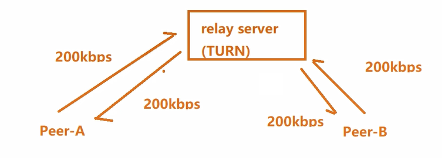
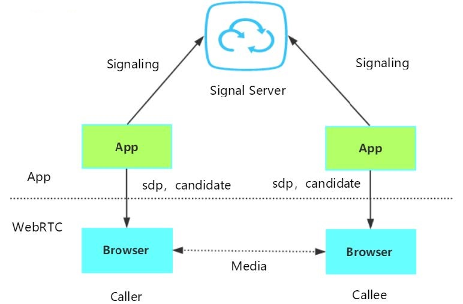
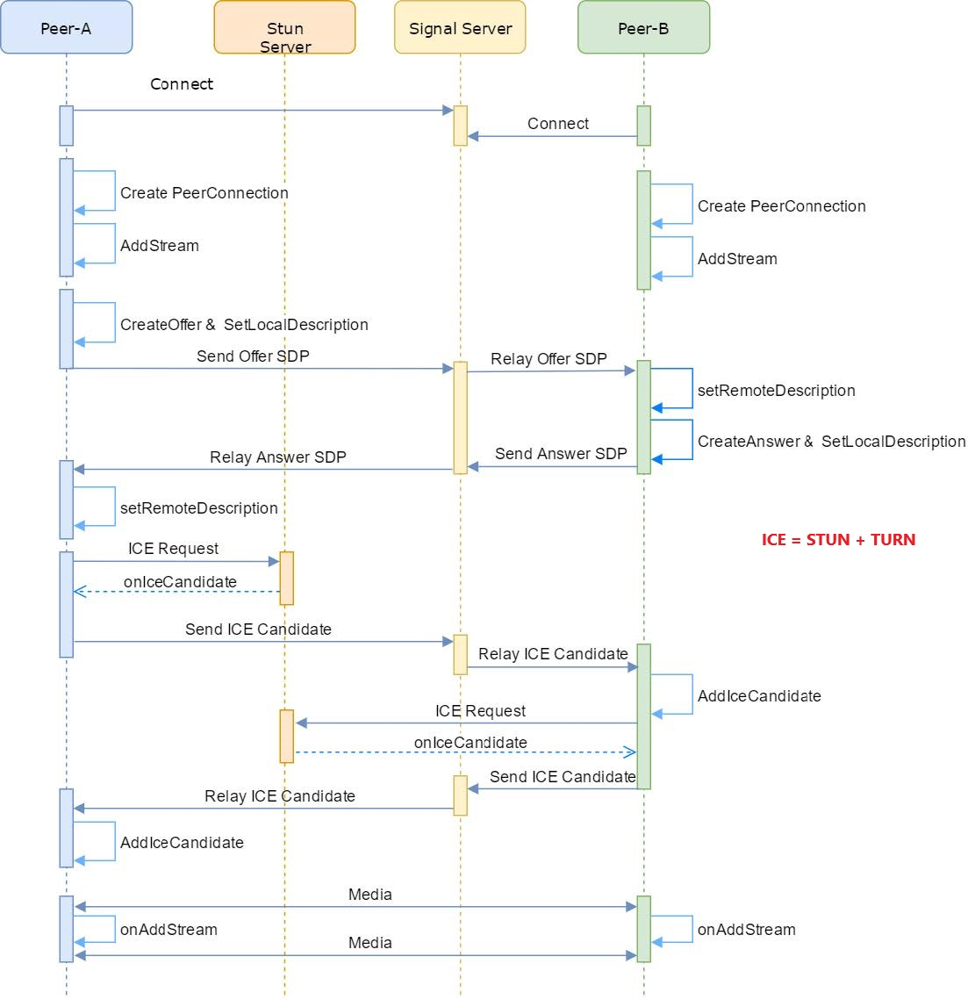

# WebRTC

Web Real-Time Communication，旨在建立一个互联网浏览器间实时通信的平台，WebRTC技术已经成为H5标准之一。[官网](https://webrtc.org/?hl=zh-cn)

上图的框架对于不同的开发人员关注点不同：

- 紫色部分是Web应用开发者API层
- 蓝色实线部分是面向浏览器厂商的API层
- 蓝色虚线部分浏览器厂商可以自定义实现

WebRTC架构组件介绍：

1. Your Web App
   - Web开发者开发的程序，Web开发者可以基于集成WebRTC的浏览器提供的web API开发基于视频、音频的实时通信
     应用。
2. Web API
   - 面向第三方开发者的WebRTC标准API（Javascript），使开发者能够容易地开发出类似于网络视频聊天的web应用
3. WebRTC Native C++ API
   - 本地C++ API层，使浏览器厂商容易实现WebRTC标准的Web API，抽象地对数字信号过程进行处理。
4. Transport / Session
   - 会话层组件采用了libjingle库的部分组件实现，无须使用xmpp/jingle协议
5. VoiceEngine
   - 音频引擎是包含一系列音频多媒体处理的框架。PS：VoiceEngine是WebRTC极具价值的技术之一，是Google收购GIPS公司后开源的。在VoIP上，技术业界领先。
   - Opus：支持从6 kbit/s到510 kbit/s的恒定和可变比特率编码，帧大小从2.5 ms到60 ms，各种采样率从8 kHz（4 kHz带宽）到48 kHz（20 kHz带宽，可复制人类听觉系统的整个听力范围）。由IETF RFC 6176定义。
   - NetEQ模块是Webrtc语音引擎中的核心模块 ，一种动态抖动缓冲和错误隐藏算法，用于隐藏网络抖动和数据包丢失的负面影响。保持尽可能低的延迟，同时保持最高的语音质量。
6. VideoEngine WebRTC
   - VideoEngine是包含一系列视频处理的整体框架，从摄像头采集视频到视频信息网络传输再到视频显示整个完整过程的解决方案。
   - VP8 视频图像编解码器，是WebRTC视频引擎的默认的编解码器，VP8适合实时通信应用场景，因为它主要是针对低延时而设计的编解码器。

WebRTC虽然冠以“web”之名，但并不受限于传统互联网应用或浏览器的终端运行环境。实际上无论终端运行环境是浏览器、桌面应用、移动设备（Android或iOS）还是IoT设备，只要IP连接可到达且符合WebRTC规范就可以互通。

声网、即构科技、环信、融云等公司都在基于WebRTC二次开发自己的音视频通话方案。

- 声网 https://www.agora.io/cn/
- 即构科技 https://www.zego.im/

# 1 webRTC通话原理

## 1.1 媒体协商

- 通话的多方必须知道彼此公有哪些解码器等环境，才能实现同渠道通话。
- 在WebRTC中，参与视频通讯的双方必须先交换SDP（Session Description Protocol）信息，这样双方才能知根知底，而交换SDP的过程，也称为"媒体协商"。

媒体协商通过**sdp**包

## 1.2 网络协商

- 理想的网络情况：每个浏览器的电脑都是私有公网IP，可以直接进行点对点连接。
- 实际情况：我们的电脑和电脑之前或大或小都是在某个局域网中，需要NAT
- 网络协商要做：
  - 获取外网IP地址映射
  - 通过信令服务器（signal server）交换"网络信息"

网络协商通过**candidate**包

### STUN

STUN（Session Traversal Utilities for NAT，NAT会话穿越应用程序）是一种网络协议，

**它允许位于NAT（或多重NAT）后的客户端找出自己的公网地址，查出自己位于哪种类型的NAT之后以及NAT为某一个本地端口所绑定的Internet端端口。这些信息被用来在两个同时处于NAT路由器之后的主机之间创建UDP通信。该协议由RFC 5389定义。**

在遇到上述情况的时候，我们可以建立一个STUN服务器，这个服务器做什么用的呢？主要是给无法在公网环境下的视频通话设备分配公网IP用的。这样两台电脑就可以在公网IP中进行通话。

使用一句话说明STUN做的事情就是：告诉我你的公网IP地址+端口是什么。搭建STUN服务器很简单，媒体流传输是按照P2P的方式。

那么问题来了，**STUN并不是每次都能成功的为需要NAT的通话设备分配IP地址的**，P2P在传输媒体流时，使用的本地带宽，在多人视频通话的过程中，通话质量的好坏往往需要根据使用者本地的带宽确定。那么怎么办？TURN可以很好的解决这个问题。

### TURN

TURN的全称为Traversal Using Relays around NAT，是STUN/RFC5389的一个拓展，主要添加了**Relay（中继）**功能。如果终端在NAT之后， 那么在特定的情景下，有可能使得终端无法和其对等端（peer）进行直接的通信，这时就需要公网的服务器作为一个**中继**， 对来往的数据进行**转发**。这个转发的协议就被定义为TURN。

**在STUN分配公网IP失败后（不能P2P后）**，可以通过TURN服务器请求公网IP地址作为中继地址。这种方式的带宽由服务器端承担，在多人视频聊天的时候，本地带宽压力较小，服务器压力大（至少：单向数据200kbps 一对一通话）。

P2P通话质量好坏取决于本地带宽的问题。

并且，根据Google的说明，TURN协议可以使用在所有的环境中。

以上是WebRTC中经常用到的2个协议，**STUN和TURN服务器我们使用coturn开源项目来搭建。**

## 1.3 协商数据的交换通道

信令服务器（Signal server）转发彼此的媒体信息和网络信息，这个信令服务器可以是任何协议，只要能交换信息。

信令服务器不只是交互 媒体信息sdp和网络信息candidate，比如：

- 房间管理
- 人员进出房间

## 1.4 一对一通话

在一对一通话场景中，每个 Peer均创建有一个 PeerConnection 对象，由一方主动发 Offer SDP，另一方则应答AnswerSDP，最后双方交换 ICE Candidate 从而完成通话链路的建立。

但是在中国的网络环境中，据一些统计数据显示，至少1半的网络是无法直接穿透打通，这种情况下只能借助TURN服务器中转。

## 1.5 NAT知识补充

P2P技术详解(一)：NAT详解——详细原理、P2P简介 https://www.cnblogs.com/mlgjb/p/8243646.htm
P2P技术详解(二)：P2P中的NAT穿越(打洞)方案详解 https://www.jianshu.com/p/9bfbcbee0abb
P2P技术详解(三)：P2P技术之STUN、TURN、ICE详解 https://www.jianshu.com/p/258e7d8be2ba
详解P2P技术中的NAT穿透原理 https://www.jianshu.com/p/f71707892eb2