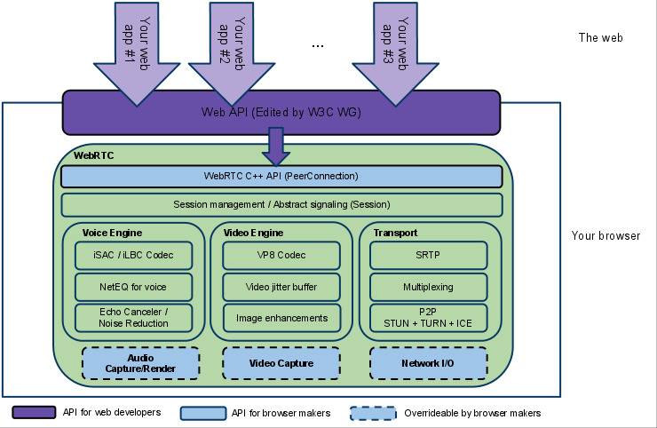
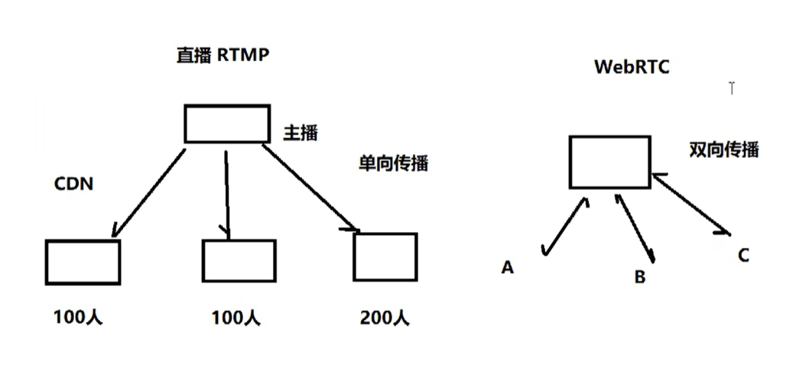

# WebRTC

Web Real-Time Communication，旨在建立一个互联网浏览器间实时通信的平台，WebRTC技术已经成为H5标准之一。[官网](https://webrtc.org/?hl=zh-cn)

上图的框架对于不同的开发人员关注点不同：

- 紫色部分是Web应用开发者API层
- 蓝色实线部分是面向浏览器厂商的API层
- 蓝色虚线部分浏览器厂商可以自定义实现

WebRTC虽然冠以“web”之名，但并不受限于传统互联网应用或浏览器的终端运行环境。实际上无论终端运行环境是浏览器、桌面应用、移动设备（Android或iOS）还是IoT设备，只要IP连接可到达且符合WebRTC规范就可以互通。

声网、即构科技、环信、融云等公司都在基于WebRTC二次开发自己的音视频通话方案。

- 声网 https://www.agora.io/cn/
- 即构科技 https://www.zego.im/

# 1 webRTC通话原理

## 1.1 媒体协商

- 通话的多方必须知道彼此公有哪些解码器等环境，才能实现同渠道通话。
- 在WebRTC中，参与视频通讯的双方必须先交换SDP（Session Description Protocol）信息，这样双方才能知根知底，而交换SDP的过程，也称为"媒体协商"。

## 1.2 网络协商

- 理想的网络情况：每个浏览器的电脑都是私有公网IP，可以直接进行点对点连接。
- 实际情况：我们的电脑和电脑之前或大或小都是在某个局域网中，需要NAT
- 网络协商要做：
  - 获取外网IP地址映射
  - 通过信令服务器（signal server）交换"网络信息"

### STUN

STUN（Session Traversal Utilities for NAT，NAT会话穿越应用程序）是一种网络协议，

**它允许位于NAT（或多重NAT）后的客户端找出自己的公网地址，查出自己位于哪种类型的NAT之后以及NAT为某一个本地端口所绑定的Internet端端口。这些信息被用来在两个同时处于NAT路由器之后的主机之间创建UDP通信。该协议由RFC 5389定义。**

在遇到上述情况的时候，我们可以建立一个STUN服务器，这个服务器做什么用的呢？主要是给无法在公网环境下的视频通话设备分配公网IP用的。这样两台电脑就可以在公网IP中进行通话。

使用一句话说明STUN做的事情就是：告诉我你的公网IP地址+端口是什么。搭建STUN服务器很简单，媒体流传输是按照P2P的方式。

那么问题来了，STUN并不是每次都能成功的为需要NAT的通话设备分配IP地址的，P2P在传输媒体流时，使用的本地带宽，在多人视频通话的过程中，通话质量的好坏往往需要根据使用者本地的带宽确定。那么怎么办？TURN可以很好的解决这个问题。

### TURN

TURN的全称为Traversal Using Relays around NAT，是STUN/RFC5389的一个拓展，主要添加了Relay功能。如果终端在NAT之后， 那么在特定的情景下，有可能使得终端无法和其对等端（peer）进行直接的通信，这时就需要公网的服务器作为一个中继， 对来往的数据进行转发。这个转发的协议就被定义为TURN。

以此解决P2P通话质量好坏取决于本地带宽的问题。