# 3 ffmpeg命令

安装：

```bash
apt install ffmpeg
```

[windows 包](https://github.com/BtbN/FFmpeg-Builds/releases)

ffmpeg的命令行参数非常多，可以分成五个部分。

```bash
$ ffmpeg {1} {2} -i {3} {4} {5}
$ ffmpeg [全局参数]  [输入文件参数]  -i [输入文件]  [输出文件参数]  [输出文件]
```


## 3.1 ffmpeg

**ffmpeg**：Hyper fast Audio and Video encoder **超快音视频编码器**（**类似爱剪辑**）

- ```bash
  # 基本信息
  ffmpeg -h
  # 高级信息
  ffmpeg -h long
  #所有信息，若嫌打印过多： ffmepg -h full > ffmpeg_h_full.log，然后再打开 ffmpeg_h_full.log文件查看
  ffmpeg -h full
  
  ffmpeg [options] [[infile options] -i infile]... 
  {[outfile options] outfile}...
  ```

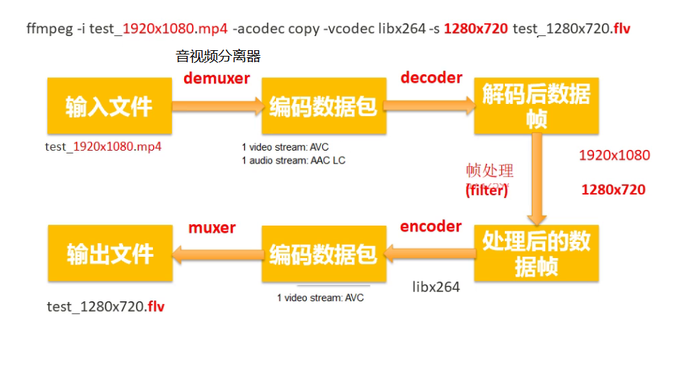


### 3.1.1 ffmpeg命令分类查询

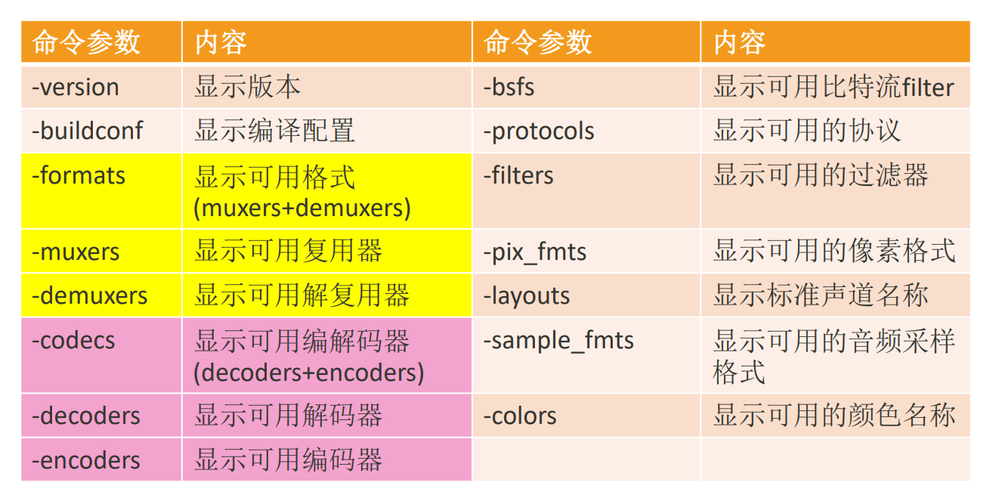

查看具体分类所支持的**参数**：`ffmepg -h type=name`

```bash
# type可以不加s，就像muxer
ffmpeg -h muxer=flv
ffmpeg -h filter=atempo (atempo调整音频播放速率)
ffmpeg -h encoder=libx264
ffmpeg -encoders | findstr x264
```


### 3.1.2 主要参数

```bash
主要参数：
◼ -i 指定输入流，输入文件
◼ -f 设定输出格式(format)
◼ -ss 开始时间
◼ -t 时间长度
◼ -y：不经过确认，输出时直接覆盖同名文件


◼ 视频参数：
◼ -vframes 设置要输出的视频帧数
◼ -b 设定视频码率
◼ -b:v 视频码率
◼ -c codec：指定解码器
◼ -c:a 指定音频的编码器
◼ -c:v 指定视频的编码器
◼ -r 设定帧速率
◼ -s 设定画面的宽与高
◼ -vn 去除视频流
◼ -aspect aspect 设置横纵比 4:3 16:9 或 1.3333 1.7777
◼ -vcodec 设定视频编解码器，如果用copy表示原始编解码数据必须被拷贝。
◼ -vf 视频过滤器

ffmpeg -i test.mp4 -vframes 300 -b:v 300k -r 30 -s 640x480 -aspect 16:9 -vcodec libx265 out.h265

◼ 音频参数：
◼ -aframes 设置要输出的音频帧数
◼ -b:a 音频码率
◼ -ar 设定采样率
◼ -ac 设定声音的Channel数
◼ -acodec 设定声音编解码器，如果用copy表示原始编解码数据必须被拷贝。
◼ -an 去除音频流
◼ -af 音频过滤器

ffmpeg -i test.mp4 -b:a 192k -ar 48000 -ac 2 -acodec libmp3lame -aframes 200 out2.mp3
```


### 3.1.3 提取音视频数据

```bash
◼ 保留封装格式
ffmpeg -i test.mp4 -acodec copy -vn audio.mp4
ffmpeg -i test.mp4 -vcodec copy -an video.mp4
◼ 提取视频
保留编码格式：ffmpeg -i test.mp4 -vcodec copy -an -t 10 test_copy.h264
强制格式：ffmpeg -i test.mp4 -vcodec libx264 -an test.h264
◼ 提取音频
保留编码格式：ffmpeg -i test.mp4 -acodec copy -vn test.aac
强制格式：ffmpeg -i test.mp4 -acodec libmp3lame -vn test.mp3
```


```bash
# 从视频中提取音频，https://blog.csdn.net/weixin_42721372/article/details/126086830
ffmpeg -i ./TMElive.mp4 -ss 01:00:31 -t 00:02:52.0 -vn -b:a 192k -ar 44100 -ac 2 -acodec libmp3lame -y ./Mute_1.mp3
```

### 3.1.4 提取视频像素格式和音频PCM数据

```bash
◼ 提取YUV
◼ 提取3秒数据，分辨率和源视频一致
ffmpeg -i test_1280x720.mp4 -t 3 -pix_fmt yuv420p yuv420p_orig.yuv
◼ 提取3秒数据，分辨率转为320x240
ffmpeg -i test_1280x720.mp4 -t 3 -pix_fmt yuv420p -s 320x240 yuv420p_320x240.yuv


◼ 提取RGB
◼ 提取3秒数据，分辨率转为320x240
ffmpeg -i test.mp4 -t 3 -pix_fmt rgb24 -s 320x240 rgb24_320x240.rgb


◼ RGB和YUV之间的转换
ffmpeg -s 320x240 -pix_fmt yuv420p -i yuv420p_320x240.yuv -pix_fmt rgb24 rgb24_320x240_2.rgb

```

```bash
◼ 提取PCM数据
ffmpeg -i buweishui.mp3 -ar 48000 -ac 2 -f s16le 48000_2_s16le.pcm
ffmpeg -i buweishui.mp3 -ar 48000 -ac 2 -sample_fmt s16 out_s16.wav
ffmpeg -i buweishui.mp3 -ar 48000 -ac 2 -codec:a pcm_s16le out2_s16le.wav
ffmpeg -i buweishui.mp3 -ar 48000 -ac 2 -f f32le 48000_2_f32le.pcm
# 从视频中提取PCM数据
ffmpeg -i test.mp4 -t 10 -vn -ar 48000 -ac 2 -f f32le 48000_2_f32le_2.pcm
```

### 3.1.5 转封装

```bash
◼ 保持编码格式：
ffmpeg -i test.mp4 -vcodec copy -acodec copy test_copy.ts
ffmpeg -i test.mp4 -codec copy test_copy2.ts
◼ 改变编码格式：
ffmpeg -i test.mp4 -vcodec libx265 -acodec libmp3lame out_h265_mp3.mkv
◼ 修改帧率：
ffmpeg -i test.mp4 -r 15 -codec copy output.mp4 (错误命令)
ffmpeg -i test.mp4 -r 15 output2.mp4
◼ 修改视频码率：
ffmpeg -i test.mp4 -b 400k output_b.mkv （此时音频也被重新编码）
◼ 修改视频码率：
ffmpeg -i test.mp4 -b:v 400k output_bv.mkv

◼ 修改音频码率：
ffmpeg -i test.mp4 -b:a 192k output_ba.mp4
#如果不想重新编码video，需要加上-vcodec copy

◼ 修改音视频码率：
ffmpeg -i test.mp4 -b:v 400k -b:a 192k output_bva.mp4
◼ 修改视频分辨率：
ffmpeg -i test.mp4 -s 480x270 output_480x270.mp4
◼ 修改音频采样率: 
ffmpeg -i test.mp4 -ar 44100 output_44100hz.mp4
```

### 3.1.6 裁剪和拼接

```bash
# 实验的视频构造
◼ 找三个不同的视频每个视频截取10秒内容
ffmpeg -i 沙海02.mp4 -ss 00:05:00 -t 10 -codec copy 1.mp4
ffmpeg -i 复仇者联盟3.mp4 -ss 00:05:00 -t 10 -codec copy 2.mp4
ffmpeg -i 红海行动.mp4 -ss 00:05:00 -t 10 -codec copy 3.mp4
如果音视频格式不统一则强制统一为 -vcodec libx264 -acodec aac
◼ 将上述1.mp4/2.mp4/3.mp4转成ts格式
ffmpeg -i 1.mp4 -codec copy -vbsf h264_mp4toannexb 1.ts
ffmpeg -i 2.mp4 -codec copy -vbsf h264_mp4toannexb 2.ts
ffmpeg -i 3.mp4 -codec copy -vbsf h264_mp4toannexb 3.ts
◼ 转成flv格式
ffmpeg -i 1.mp4 -codec copy 1.flv
ffmpeg -i 2.mp4 -codec copy 2.flv
ffmpeg -i 3.mp4 -codec copy 3.flv


# 拼接
◼ 以MP4格式进行拼接
方法1：ffmpeg -i "concat:1.mp4|2.mp4|3.mp4" -codec copy out_mp4.mp4  #（不可用）
方法2：ffmpeg -f concat -i mp4list.txt -codec copy out_mp42.mp4
# mp4list.txt里的内容有三行, 如下
# file '1.mp4'
# file '2.mp4'
# file '3.mp4'

◼ 以TS格式进行拼接
方法1：ffmpeg -i "concat:1.ts|2.ts|3.ts" -codec copy out_ts.mp4
方法2：ffmpeg -f concat -i tslist.txt -codec copy out_ts2.mp4
# tslist.txt 也是如此，只是文件后缀变为了ts

◼ 以FLV格式进行拼接
方法1：ffmpeg -i "concat:1.flv|2.flv|3.flv" -codec copy out_flv.mp4  #（不可用）
方法2：ffmpeg -f concat -i flvlist.txt -codec copy out_flv2.mp4

◼ 方法1只适用部分封装格式，比如TS
◼ 建议：
（1）使用方法2进行拼接
（2）把所用视频先转成TS格式，再进行拼接


# 不同编码格式的文件进行拼接
◼ 建议：
◼ 把每个视频封装格式也统一为ts，拼接输出的时候再输出你需要的封装格式，比如MP4
◼ 视频分辨率可以不同，但是编码格式需要统一
◼ 音频编码格式需要统一，音频参数(采样率/声道等)也需要统一
```

### 3.1.7 图片与视频互转

```bash
◼ 截取一张图片
ffmpeg -i test.mp4 -y -f image2 -ss 00:00:02 -vframes 1 -s 640x360 test.jpg
ffmpeg -i test.mp4 -y -f image2 -ss 00:00:02 -vframes 1 -s 640x360 test.bmp
-i 输入
-y 覆盖，如果本地文件夹中有同名图片，直接覆盖，用来回答are you overwrite (y/n)?
-f 格式
image2 一种格式
-ss 起始值
-vframes 帧 如果大于1 那么 输出加%03d test%03d.jpg 
-s 格式大小size

◼ 转换视频为图片（每帧一张图):
ffmpeg -i test.mp4 -t 5 -s 640x360 -r 15 frame%03d.jpg 
# -r 15 每秒输出15张图片

◼ 图片转换为视频:
ffmpeg -f image2 -i frame%03d.jpg -r 25 video.mp4

◼ 从视频中生成GIF图片
ffmpeg -i test.mp4 -t 5 -r 1 image1.gif
ffmpeg -i test.mp4 -t 5 -r 25 -s 640x360 image2.gif
◼ 将 GIF 转化为 视频
ffmpeg -f gif -i image2.gif image2.mp4

◼ 从视频中生成GIF图片
ffmpeg -i test.mp4 -t 5 -r 1 image1.gif
ffmpeg -i test.mp4 -t 5 -r 25 -s 640x360 image2.gif
◼ 将 GIF 转化为 视频
ffmpeg -f gif -i image2.gif image2.mp4
```

### 3.1.8 推拉流

```bash
# nginx搭建rmtp流媒体服务器
https://www.jianshu.com/p/16741e363a77

# 拉流

# 拉流播放
ffplay rtmp://server/live/streamName 

# 拉流导出文件
ffmpeg -i rtmp://server/live/streamName -c copy dump.flv
# 对于不是rtmp的协议 -c copy要谨慎使用，因为目的格式文件（eg:flv），并不支持源流的编码方式
ffmpeg -i http://ivi.bupt.edu.cn/hls/cctv1hd.m3u8 -c copy cctv1.ts
ffmpeg -i http://ivi.bupt.edu.cn/hls/cctv1hd.m3u8 cctv1.flv
ffmpeg -i http://ivi.bupt.edu.cn/hls/cctv1hd.m3u8 -acodec aac -vcodec libx264 cctv1-2.flv

# 推流
# 将一个文件推流到rmtp上
ffmpeg -re -i out.mp4 -c copy flv rtmp://server/live/streamName
# 将一个视频文件一直循环推流到指定地址
ffmpeg -re -stream_loop -1 -i c3_720.mp4 -vcodec copy -acodec copy -b:v 2M -f rtsp -rtsp_transport tcp rtsp://192.168.100.56:554/live/test/0

# 将一张图片循环推流到服务器
ffmpeg -loop 1 -i woman.png -c:v libx264 -tune stillimage -f rtsp -rtsp_transport tcp rtsp://192.168.100.56:554/live/test/5
```

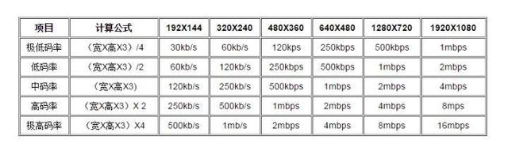


### 3.1.9 过滤器（滤镜）

#### Filter 内置变量 

这些变量可以在函数，参数值等地方使用。

- t 以秒表示的时间戳，如果输入的时间是未知的则是 NAN
- n 输入帧的顺序编号，从 0 开始 4 
- pos 输入帧的位置，如果未知的则是 NAN
- w 输入视频帧的宽度 
- h 输入视频帧的高度

#### 裁剪

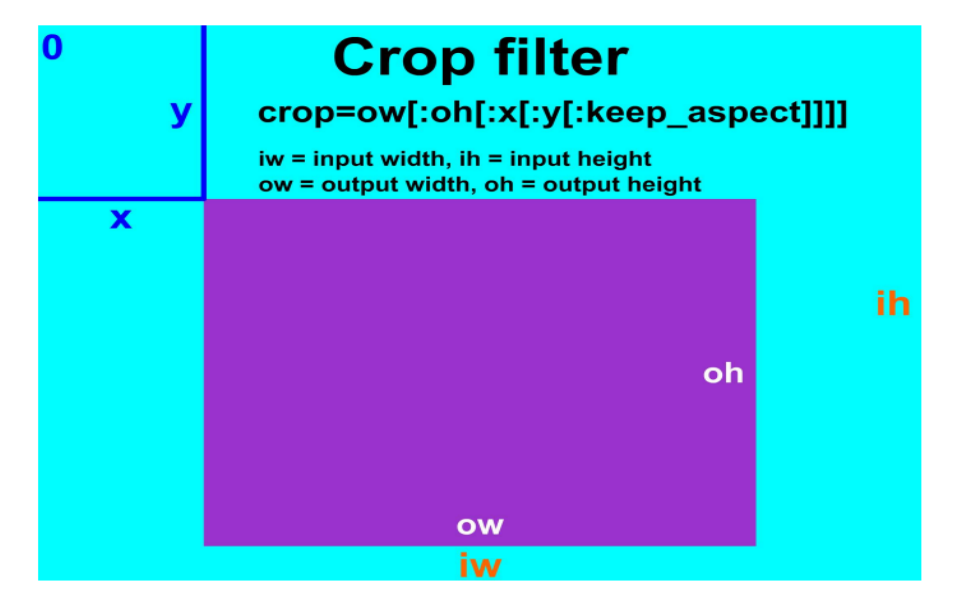

```bash
crop=ow:oh:x:y
# 查看图片左1/3，中1/3，右1/3，视频的裁剪同样如此，只需换为ffmpeg
ffplay -i input.jpg -vf crop =iw/3:ih:0:0
ffplay -i input.jpg -vf crop =iw/3:ih:iw/3:0
ffplay -i input.jpg -vf crop =iw/3:ih:iw/3*2:0
```

#### 水印

在视频中增加文字水印需要准备的条件比较多，需要有文字字库处理的相关文件，在编译 FFmpeg 时需要 支持 FreeType、FontConfig、iconv，系统中需要有相关的字库，

##### 文字水印

**在 FFmpeg 中增加纯字母水印可以使用 drawtext 滤镜进行支持**

下面就来看一下 drawtext 的滤镜参数

| 参数     | 类型   | 说明                         |
| -------- | ------ | ---------------------------- |
| text     | 字符串 | 文字                         |
| textfile | 字符串 | 文字文件                     |
| box      | 布尔   | 文字区域背景框(缺省 false)   |
| boxcolor | 色彩   | 展示字体区域块的颜色         |
| font     | 字符串 | 字体名称（默认为 Sans 字体） |
| fontsize | 整数   | 显示字体的大小               |
| x        | 整数   | 缺省为 0                     |
| y        | 整数   | 缺省为 0                     |
| alpha    | 浮点数 | 透明度(默认为 1)，范围0~1    |

```bash
# drawtext滤镜示例
ffplay -i input.mp4 -vf "drawtext=fontsize=100:fontfile=FreeSerif.ttf:text='hello world':fontcolor=green:x=400:y=200:alpha=0.5:box=1:boxcolor=yellow"

# 使用时间作为水印，使用 ffmpeg 转码存储到文件时需要加上-re，否则时间不对。
ffplay -i input.mp4 -vf 
"drawtext=fontsize=60:fontfile=FreeSerif.ttf:text='%{localtime\:%Y\-%m\-%d %H-%M-%S}':fontcolor=green:box=1:boxcolor=yellow"

# 跑马灯效果
ffplay -i input.mp4 -vf 
"drawtext=fontsize=100:fontfile=FreeSerif.ttf:text='helloworld':x=mod(100*t\,w):y=abs(sin(t))*h*0.7"
```

##### 图片水印 

为视频添加图片水印可以使用 movie 滤镜

 **movie的内容可以是图片，视频，设备等。**

| 参数             | 类型     | 说明                                 |
| ---------------- | -------- | ------------------------------------ |
| filename         | 字符串   | 输入的文件名，可以是文件，协议，设备 |
| format_name, f   | 字符串   | 输入的封装格式                       |
| stream_index, si | 整数     | 输入的流索引编号                     |
| seek_point, sp   | 浮点数   | Seek 输入流的时间位置                |
| streams, s       | 字符串   | 输入的多个流的流信息                 |
| loop             | 整数     | 循环次数                             |
| discontinuity    | 时间差值 | 支持跳动的时间戳差值                 |

**可以有多个movie，多个movie用分号相隔，通过[xx]命名指代，最后通过overlay将多个指定合成**

```bash
# 添加图片水印
ffmpeg -i input.mp4 -vf "movie=logo.png[watermark];[in][watermark]overlay=x=10:y=10[out]" 
output.mp4
# 在这里其实使用了两个滤镜，[xxx]代替（或指定）某些命令内容
# movie=logo.png;
# overlay=x=10:y=10，#叠加在视频上方

（1）图片 logo.png 将会打入到 input.mp4 视频中，显示在 x 坐标 50、y 坐标 20 的位置
ffplay -i input.mp4 -vf "movie=logo.png[logo];[in][logo]overlay=50:10[out]"
由于 logo.png 图片的背景色是白色，所以显示起来比较生硬，如果水印图片是透明背景的，效果会更好，
下面找一张透明背景色的图片试一下：
ffplay -i input.mp4 -vf "movie=logo2.png[watermark];[in][watermark]overlay=50:10[out]"

（2）显示位置
# 左上角
ffplay -i input.mp4 -vf "movie=logo.png[watermark];[in][watermark]overlay=10:10[out]"
# 右上角
ffplay -i input.mp4 -vf "movie=logo.png[watermark];[in][watermark]overlay=main_w-overlay_w-10:10[out]"
#左下角
ffplay -i input.mp4 -vf "movie=logo.png[watermark];[in][watermark]overlay=10:main_h-overlay_h-10[out]"
# 右下角
ffplay -i input.mp4 -vf "movie=logo.png[watermark];[in][watermark]overlay=main_w-overlay_w-10:main_h-overlay_h-10[out]"
（3）跑马灯效果
ffplay -i input.mp4 -vf 
"movie=logo.png[watermark];[in][watermark]overlay=x=mod(50*t\,main_w):y=abs(sin(t))*h*0.7[out]"
```

#### 画中画

在视频画面中，嵌入另外一个视频画面。

在 FFmpeg 中，可以通过 **overlay 将 多个视频流、多个多媒体采集设备、多个视频文件合成到一个界面中，生成画中画的效果**。

尤其是 用在图层处理与合并场景中.

​      设置 output 的像素格式，默认为 yuv420 ➢ yuv420 (值为 0) ➢ yuv422 (值为 1) ➢ yuv444 (值为 2) ➢ rgb (值为 3)

| 参数       | 类型 | 说明                                                         |
| ---------- | ---- | ------------------------------------------------------------ |
| x          | 数字 | x坐标                                                        |
| y          | 数字 | y坐标                                                        |
| eof_action | 整数 | 遇到 eof 表示时的处理方式，默认为重复 <br />➢ repeat(值为 0)：重复前一帧<br /> ➢ endcall(值为 1)：一旦有一个画面停止了，就停止所有的流 <br />➢ pass(值为 2)：保留主图层，子画面消失 |
| shortest   | 布尔 | 终止最短的视频时全部终止（默认 false）                       |
| format     | 整数 | 设置 output 的像素格式，默认为 yuv420<br /> ➢ yuv420 (值为 0) <br />➢ yuv422 (值为 1) <br />➢ yuv444 (值为 2) <br />➢ rgb (值为 3) |

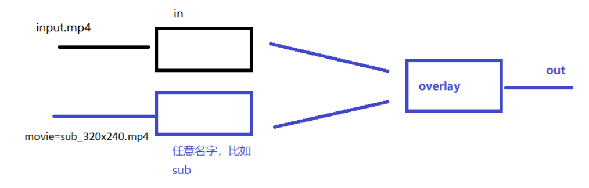

```bash
ffplay -i input.mp4 -vf "movie=sub_320x240.mp4[sub];[in][sub]overlay=x=20:y=20[out]"
# overlay 前面两个[in][sub],表示需要叠加的两个指代的内容，[in]指代的是输入的视频input.mp4,[sub]指代的是sub_320x240.mp4

# 缩放子画面的大小
ffplay -i input.mp4 -vf "movie=sub_320x240.mp4,scale=640x480[sub];[in][sub]overlay=x=20:y=20[out]"

```

#### 多宫格

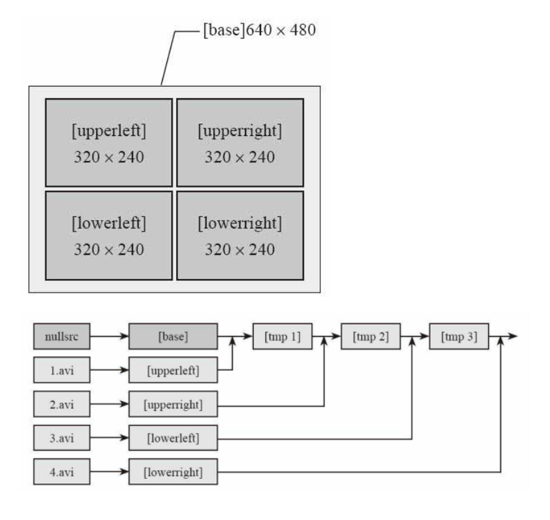

```bash
ffmpeg -i 1.mp4 -i 2.mp4 -i 3.mp4 -i 4.mp4 -filter_complex				# 指定输入
"nullsrc=size=640x480[base];											# 设置一个空画布
[0:v]setpts=PTS-STARTPTS,scale=320x240[upperleft];						# 设置第一个视频为upperleft
[1:v]setpts=PTS-STARTPTS,scale=320x240[upperright];						# 第二个upperright
[2:v]setpts=PTS-STARTPTS, scale=320x240[lowerleft];						# 第三个lowerleft
[3:v]setpts=PTS-STARTPTS,scale=320x240[lowerright];						# 第四个lowerright
[base][upperleft]overlay=shortest=1[tmp1];								# 将空画布和第一个视频合成为临时tmp1
[tmp1][upperright]overlay=shortest=1:x=320[tmp2];						# 将tmp1和upperright合成为临时tmp2
[tmp2][lowerleft]overlay=shortest=1:y=240[tmp3];						# 将tmp2和lowerleft合成为临时tmp3
[tmp3][lowerright]overlay=shortest=1:x=320:y=240" out.mp4
```


## 3.2 ffplay

[ffplay](https://blog.csdn.net/m0_60259116/article/details/125787812)

**ffplay**：Simple media player简单媒体播放器，里面做了很多东西，如果自己要做播放器的话，需要ffplay的源码通读一遍。

- ```bash
  ffplay -h
  ffplay [options] input_file
  ```

### 3.2.1 键盘控制

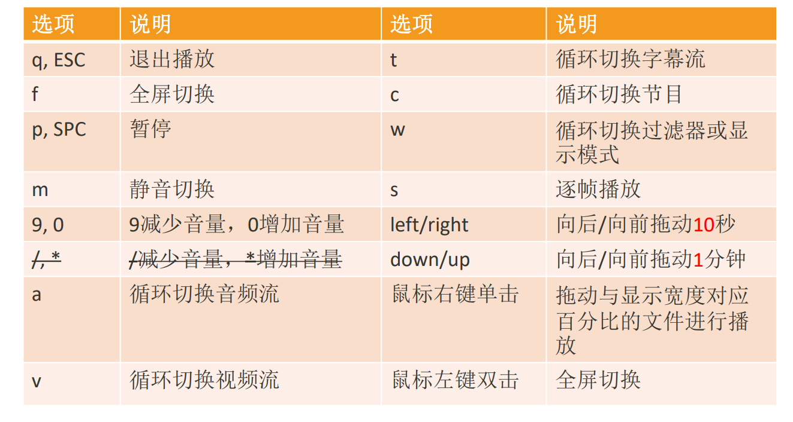


### 3.2.2 主要参数

```bash
# 主要参数

◼ -x width 强制显示宽带。
◼ -y height 强制显示高度。
◼ -video_size size 帧尺寸 设置显示帧存储(WxH格式)，仅适用于类似原始YUV等没有包含帧大小(WxH)的视频。
比如: ffplay -pixel_format yuv420p -video_size 320x240 -framerate 5 yuv420p_320x240.yuv
◼ -pixel_format format 格式设置像素格式。
◼ -fs 以全屏模式启动。
◼ -an 禁用音频（不播放声音）
◼ -vn 禁用视频（不播放视频）
◼ -sn 禁用字幕（不显示字幕）
◼ -ss pos 根据设置的秒进行定位拖动，注意时间单位：比如'55' 55 seconds, '12:03:45' ,12 hours, 03 minutes and 45 seconds, '23.189' 23.189 second
◼ -t duration 设置播放视频/音频长度，时间单位如 -ss选项

◼ -bytes 按字节进行定位拖动（0=off 1=on -1=auto）。
◼ -seek_interval interval 自定义左/右键定位拖动间隔（以秒为单位），默认值为10秒（代码没有看到实现）
◼ -nodisp 关闭图形化显示窗口，视频将不显示
◼ -noborder 无边框窗口
◼ -volume vol 设置起始音量。音量范围[0 ~100]
◼ -f fmt 强制使用设置的格式进行解析。比如-f s16le
◼ -window_title title 设置窗口标题（默认为输入文件名）
◼ -loop number 设置播放循环次数
◼ -showmode mode 设置显示模式，可用的模式值：0 显示视频，1 显示音频波形，2 显示音频频谱。缺省为0，如果视频不存在则自动选择2
◼ -vf filtergraph 设置视频滤镜
◼ -af filtergraph 设置音频滤镜


# 高级参数
◼ -stats 打印多个回放统计信息，包括显示流持续时间，编解码器参数，流中的当前位置，以及音频/视频同步差值。默认情况下处于启用状
态，要显式禁用它则需要指定-nostats。。
◼ -fast 非标准化规范的多媒体兼容优化。
◼ -genpts 生成pts。
◼ -sync type 同步类型 将主时钟设置为audio（type=audio），video（type=video）或external（type=ext），默认是audio为主时钟。
◼ -ast audio_stream_specifier 指定音频流索引，比如-ast 3，播放流索引为3的音频流
◼ -vst video_stream_specifier指定视频流索引，比如-vst 4，播放流索引为4的视频流
◼ -sst subtitle_stream_specifier 指定字幕流索引，比如-sst 5，播放流索引为5的字幕流
◼ -autoexit 视频播放完毕后退出

◼ -exitonkeydown 键盘按下任何键退出播放
◼ -exitonmousedown 鼠标按下任何键退出播放
◼ -codec:media_specifier codec_name 强制使用设置的多媒体解码器，media_specifier可用值为a（音频）， v（视频）和s字幕。比如codec:v h264_qsv 强制视频采用h264_qsv解码
◼ -acodec codec_name 强制使用设置的音频解码器进行音频解码
◼ -vcodec codec_name 强制使用设置的视频解码器进行视频解码
◼ -scodec codec_name 强制使用设置的字幕解码器进行字幕解码
◼ -autorotate 根据文件元数据自动旋转视频。值为0或1 ，默认为1。
◼ -framedrop 如果视频不同步则丢弃视频帧。当主时钟非视频时钟时默认开启。若需禁用则使用 -noframedrop
◼ -infbuf 不限制输入缓冲区大小。尽可能快地从输入中读取尽可能多的数据。播放实时流时默认启用，如果未及时读取数据，则可能会丢弃数据。此选项将不限制缓冲区的大小。若需禁用则使用-noinfbuf

更多参数：http://www.ffmpeg.org/ffplay.html

```


### 3.3.3 播放内容

```bash
◼ 播放本地文件
◼ ffplay -window_title "test time" -ss 2 -t 10 -autoexit test.mp4
◼ ffplay buweishui.mp3
◼ 播放网络流
◼ ffplay -window_title "rtmp stream" rtmp://202.69.69.180:443/webcast/bshdlive-pc
◼ 播放YUV数据
◼ ffplay -pixel_format yuv420p -video_size 320x240 -framerate 5 yuv420p_320x240.yuv
◼ 播放RGB数据
◼ ffplay -pixel_format rgb24 -video_size 320x240 -i rgb24_320x240.rgb
◼ ffplay -pixel_format rgb24 -video_size 320x240 -framerate 5 -i rgb24_320x240.rgb
◼ 播放PCM数据
◼ ffplay -ar 48000 -ac 2 -f f32le 48000_2_f32le.pcm
-ar set audio sampling rate (in Hz) (from 0 to INT_MAX) (default 0)
-ac set number of audio channels (from 0 to INT_MAX) (default 0)
```

简单过滤器

```bash
◼ 视频旋转
ffplay -i test.mp4 -vf transpose=1
◼ 视频反转
ffplay test.mp4 -vf hflip
ffplay test.mp4 -vf vflip
◼ 视频旋转和反转
ffplay test.mp4 -vf hflip,transpose=1
◼ 音频变速播放
ffplay -i test.mp4 -af atempo=2
◼ 视频变速播放
ffplay -i test.mp4 -vf setpts=PTS/2
◼ 音视频同时变速
ffplay -i test.mp4 -vf setpts=PTS/2 -af atempo=2
◼ 更多参考
http://www.ffmpeg.org/ffmpeg-filters.html
```

## 3.3 ffprobe

**ffprobe**：Simple multimedia streams analyzer 简单多媒体流分析器

- ```bash
  ffprobe -h
  ffprobe [OPTIONS] [INPUT_FILE]
  
  # 获取以下信息
  # 命令行：https://blog.csdn.net/Smallwhitestrive/article/details/128145693
  # python：https://blog.csdn.net/lulongfei172006/article/details/106463526
  # 帧率
  ffprobe -v error -select_streams v -show_entries stream=r_frame_rate -of json vehicle.mp4
  # 总帧数
  ffprobe -v error -select_streams v -show_entries stream=nb_frames -of json vehicle.mp4
  # 时长
  ffprobe -show_entries format=duration -v quiet -of csv="p=0" vehicle.mp4
  # 分辨率
  ffprobe -v error -select_streams v:0 -show_entries stream=width,height -of json vehicle.mp4
  ```


ffmpeg/ffplay/ffprobe部分参数通用，部 分参数不通用，在使用时需要注意

# 5 ffmpeg编程

FFMPEG有8个常用库： 

1.  AVUtil：核心工具库，下面的许多其他模块都会依赖该库做一些基本的音 视频处理操作。
2.  AVFormat：文件格式和协议库，该模块是最重要的模块之一，封装了 Protocol层和Demuxer、Muxer层，使得协议和格式对于开发者来说是透 明的。 
3.  AVCodec：编解码库，封装了Codec层，但是有一些Codec是具备自己的 License的，FFmpeg是不会默认添加像libx264、FDK-AAC等库的，但是 FFmpeg就像一个平台一样，可以将其他的第三方的Codec以插件的方式 添加进来，然后为开发者提供统一的接口。
4.  AVFilter：音视频滤镜库，该模块提供了包括音频特效和视频特效的处理， 在使用FFmpeg的API进行编解码的过程中，直接使用该模块为音视频数 据做特效处理是非常方便同时也非常高效的一种方式
5.  AVDevice：输入输出设备库，比如，需要编译出播放声音或者视 频的工具ffplay，就需要确保该模块是打开的，同时也需要SDL的 预先编译，因为该设备模块播放声音与播放视频使用的都是SDL库。
6.  SwrRessample：该模块可用于音频重采样，可以对数字音频进行 声道数、数据格式、采样率等多种基本信息的转换。
7.  SWScale：该模块是将图像进行格式转换的模块，比如，可以将 YUV的数据转换为RGB的数据，缩放尺寸由1280*720变为800*480。
8.  PostProc：该模块可用于进行后期处理，当我们使用AVFilter的时 候需要打开该模块的开关，因为Filter中会使用到该模块的一些基 础函数

[ubuntu下FFmpeg安装和使用以及CMakeLists.txt模板](https://blog.csdn.net/mao_hui_fei/article/details/132192108)

## 5.1 [ffmpeg内存模型](https://blog.csdn.net/qq_38731735/article/details/126109751)


只新增数据包对象，用于管理数据对象，对于数据本身采用同一个内存空间进行管理，当所有的内存引用为0时释放这片内存空间。

FFmpeg正是采用这种内存管理的方式进行数据包和数据帧的管理。

AVPacket和AVFrame都有一个指针AVBufferRef，指向存放具体数据的AVBuffer

采用引用计数的方式进行内存释放。

### 5.1.1 AVPacket实现

AVPacket 作为解码器的输入 或 编码器的输出。

- 用于存储压缩的数据，分别包括有音频压缩数据，视频压缩数据和字幕压缩数据。
- 当作为解码器的输入时，它由demuxer生成，然后传递给解码器。当作为编码器的输出时，由编码器生成，然后传递给muxer
- 在视频中，AVPacket 只能包含不大于1帧的内容，而视频的1帧可能要包含在多个AVPacket中，AVPacket < AVFrame
- 对于视频压缩数据，一个AVPacket通常包括不大于1个视频帧。对于音频压缩数据，可能包括几个压缩的音频帧。
- 内部的buffer数据由av_malloc申请，整个AVPacket由av_packet_alloc申请，由av_packet_free释放。

<table><thead><tr><th>核心API</th><th>功能</th></tr></thead><tbody><tr><td>av_packet_alloc</td><td>申请AVPacket</td></tr><tr><td>av_packet_free</td><td>释放AVPacket</td></tr><tr><td>av_init_packet</td><td>初始化AVPacket，将结构体中的*buf置为null</td></tr><tr><td>av_new_packet</td><td>给AVPacket申请AVBufferRef和AVBuffer数据空间，引用计数设置为1</td></tr><tr><td>av_buffer_ref</td><td>新申请AVBufferRef，AVBuffer引用计数加一</td></tr><tr><td>av_buffer_unref</td><td>释放AVBufferRef，AVBuffer引用计数减一</td></tr></tbody></table>

AVPacket 内存模型如下图所示，AVBuffer存放具体数据，AVBufferRef用于管理AVBuffer，AVPacket 是实际对外数据包体。

需要注意的点：

- av_packet_alloc内部会进行初始化，所以不需要再调用av_init_packet初始化；
- av_packet_free内部会进行解引用，所以不需要再调用av_packet_unref；
- av_init_packet一定不能在av_new_packet之后使用会造成内存泄漏
- 对同一个AVPacket进行多次av_packet_ref而没有av_packet_unref会造成内存泄漏。

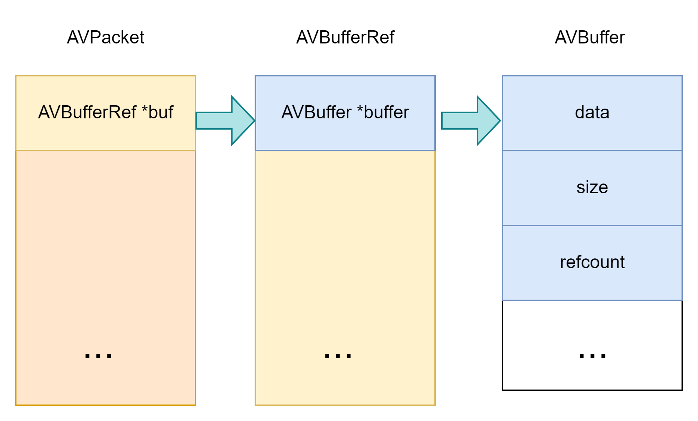

```c
typedef struct AVPacket {
    AVBufferRef *buf; //在av_new_packet后，指向一个AVBufferRef，
    int64_t pts;
    int64_t dts;
    uint8_t *data;
    int   size;
    int   stream_index;	//用于区分该packet是视频流，还是音频流，或是其他元素流
    int   flags;
    AVPacketSideData *side_data;
    int side_data_elems;
    int64_t duration;
    int64_t pos;                            ///< byte position in stream, -1 if unknown
    void *opaque;
    AVBufferRef *opaque_ref;
    AVRational time_base;
} AVPacket;

typedef struct AVBufferRef {
    AVBuffer *buffer;
    uint8_t *data;
    size_t   size;
}  AVBufferRef;
struct AVBuffer {
    uint8_t *data; /**< data described by this buffer */
    size_t size; /**< size of data in bytes */
    atomic_uint refcount;
    void (*free)(void *opaque, uint8_t *data);
    void *opaque;
    int flags;
    int flags_internal;
};
```


### 5.1.2  AVFrame实现

AVFrame表示解码过后的一个数据帧（可能是音频帧，也可能是视频帧）

- AVFrame 通过使用 av_frame_alloc()来创建. 这个函数只是创建了AVFrame结构本身，在结构中定义的指向其他内存块的缓冲区。
- 内存块缓冲区指针使用av_malloc/av_frame_get_buffer来分配，整个AVFrame使用 av_frame_alloc来申请，由av_frame_free()来释放。

<table><thead><tr><th>核心API</th><th>功能</th></tr></thead><tbody><tr><td>av_frame_alloc</td><td>申请AVFrame</td></tr><tr><td>av_frame_free</td><td>释放AVFrame</td></tr><tr><td>av_frame_get_buffer</td><td>申请AVBufferRef和AVFrame数据空间</td></tr><tr><td>av_frame_ref</td><td>新申请AVBufferRef，AVFrame引用计数加一</td></tr><tr><td>av_frame_unref</td><td>释放AVBufferRef，AVFrame引用计数减一</td></tr><tr><td>av_frame_move_ref</td><td>AVFrame转移引用计数</td></tr></tbody></table>

AVFrame实现原理与AVPacket 一致，都是利用AVBufferRef进行引用计数的管理，同时数据存储在AVBuffer中，只有保存一份，av_frame_ref负责将引用计数加一，av_frame_unref引用计数减一，当引用计数减到0后，进行数据释放。

AVFrame帧的操作与packet分配原理一致，使用方式也类似。主要包括几个步骤一个是av_frame_alloc分配一个AVFrame帧，然后稍微有点不同的是需要为帧进行初始化，然后来确认是视频帧还是音频帧。第二步是av_frame_get_buffer获取帧的数据区也就是AVBufferRef和AVBuffer这里有一个比较特殊的地方是这里预制了一个长度为8的AVBufferRef指针数组，主要是用于不同的数据存储格式不一样需要多个内存空间。最后是确保AVFrame是可写的，在进行数据操作。释放利用av_frame_free。

### 5.1.3 AVPacket与AVFrame的关系

[参考1](https://www.cnblogs.com/renhui/p/12217958.html)

av_read_frame得到压缩的数据包AVPacket，一般有三种压缩的数据包(视频、音频和字幕)，都用AVPacket表示。

然后调用avcodec_send_packet 和 avcodec_receive_frame对AVPacket进行解码得到AVFrame。

## 5.2 ffmpeg解复用 + 解码

### 5.2.1 解复用

解复用也称解封装，将视频文件拆分各个成分的流。


```c
◼ avformat_alloc_context();负责申请一个AVFormatContext结构的内存,并进行简单初始化
◼ avformat_free_context();释放该结构里的所有东西以及该结构本身
◼ avformat_close_input();关闭解复用器。关闭后就不再需要使用avformat_free_context 进行释放。
◼ avformat_open_input();打开输入视频文件
◼ avformat_find_stream_info()：获取视频文件信息
◼ av_read_frame(); 读取音视频包
◼ avformat_seek_file(); 定位文件
◼ av_seek_frame():定位文件

◼ AVMEDIA_TYPE_VIDEO视频流
video_index = av_find_best_stream(ic, AVMEDIA_TYPE_VIDEO,-1,-1, NULL, 0)
◼ AVMEDIA_TYPE_AUDIO音频流
audio_index = av_find_best_stream(ic, AVMEDIA_TYPE_AUDIO,-1,-1, NULL, 0)

```


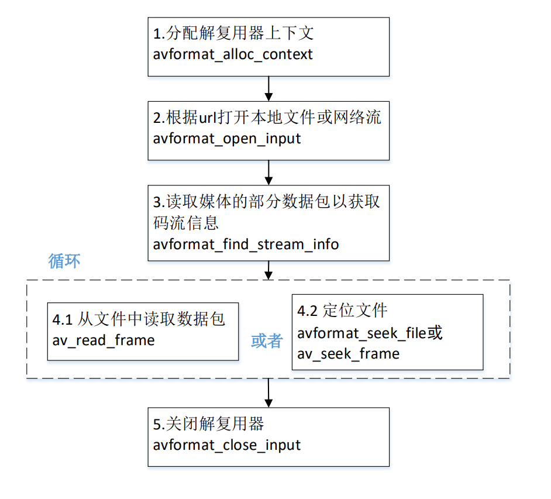

```c
#include <stdio.h>
#include <libavformat/avformat.h>


int main(int argc, char **argv)
{
    //打开网络流。这里如果只需要读取本地媒体文件，不需要用到网络功能，可以不用加上这一句
//    avformat_network_init();

    const char *default_filename = "believe.mp4";

    char *in_filename = NULL;

    if(argv[1] == NULL)
    {
        in_filename = default_filename;
    }
    else
    {
        in_filename = argv[1];
    }
    printf("in_filename = %s\n", in_filename);

    //AVFormatContext是描述一个媒体文件或媒体流的构成和基本信息的结构体
    AVFormatContext *ifmt_ctx = NULL;           // 输入文件的demux

    int videoindex = -1;        // 视频索引
    int audioindex = -1;        // 音频索引


    // 打开文件，主要是探测协议类型，如果是网络文件则创建网络链接
    int ret = avformat_open_input(&ifmt_ctx, in_filename, NULL, NULL);
    if (ret < 0)  //如果打开媒体文件失败，打印失败原因
    {
        char buf[1024] = { 0 };
        av_strerror(ret, buf, sizeof(buf) - 1);
        printf("open %s failed:%s\n", in_filename, buf);
        goto failed;
    }
	
    // 获取视频文件信息，将获取到的信息放入AVFormatContext *ifmt_ctx
    ret = avformat_find_stream_info(ifmt_ctx, NULL);
    if (ret < 0)  //如果打开媒体文件失败，打印失败原因
    {
        char buf[1024] = { 0 };
        av_strerror(ret, buf, sizeof(buf) - 1);
        printf("avformat_find_stream_info %s failed:%s\n", in_filename, buf);
        goto failed;
    }

    //打开媒体文件成功
    printf_s("\n==== av_dump_format in_filename:%s ===\n", in_filename);
    
    // 打印关于输入或输出格式的详细信息
    // void av_dump_format(AVFormatContext *ic,int index,const char *url,int is_output);
    av_dump_format(ifmt_ctx, 0, in_filename, 0);
    printf_s("\n==== av_dump_format finish =======\n\n");
    
    
    // url: 调用avformat_open_input读取到的媒体文件的路径/名字
    printf("media name:%s\n", ifmt_ctx->url);
    // nb_streams: nb_streams媒体流数量
    printf("stream number:%d\n", ifmt_ctx->nb_streams);
    // bit_rate: 媒体文件的码率,单位为bps
    printf("media average ratio:%lldkbps\n",(int64_t)(ifmt_ctx->bit_rate/1024));
    // 时间
    int total_seconds, hour, minute, second;
    // duration: 媒体文件时长，单位微妙
    total_seconds = (ifmt_ctx->duration) / AV_TIME_BASE;  // 1000us = 1ms, 1000ms = 1秒
    hour = total_seconds / 3600;
    minute = (total_seconds % 3600) / 60;
    second = (total_seconds % 60);
    //通过上述运算，可以得到媒体文件的总时长
    printf("total duration: %02d:%02d:%02d\n", hour, minute, second);
    printf("\n");
    /*
     * 老版本通过遍历的方式读取媒体文件视频和音频的信息
     * 新版本的FFmpeg新增加了函数av_find_best_stream，也可以取得同样的效果
     */
    for (uint32_t i = 0; i < ifmt_ctx->nb_streams; i++)
    {
        AVStream *in_stream = ifmt_ctx->streams[i];// 音频流、视频流、字幕流
        //如果是音频流，则打印音频的信息
        if (AVMEDIA_TYPE_AUDIO == in_stream->codecpar->codec_type)
        {
            printf("----- Audio info:\n");
            // index: 每个流成分在ffmpeg解复用分析后都有唯一的index作为标识
            printf("index:%d\n", in_stream->index);
            // sample_rate: 音频编解码器的采样率，单位为Hz
            printf("samplerate:%dHz\n", in_stream->codecpar->sample_rate);
            // codecpar->format: 音频采样格式
            if (AV_SAMPLE_FMT_FLTP == in_stream->codecpar->format)
            {
                printf("sampleformat:AV_SAMPLE_FMT_FLTP\n");
            }
            else if (AV_SAMPLE_FMT_S16P == in_stream->codecpar->format)
            {
                printf("sampleformat:AV_SAMPLE_FMT_S16P\n");
            }
            // channels: 音频信道数目
            printf("channel number:%d\n", in_stream->codecpar->channels);
            // codec_id: 音频压缩编码格式
            if (AV_CODEC_ID_AAC == in_stream->codecpar->codec_id)
            {
                printf("audio codec:AAC\n");
            }
            else if (AV_CODEC_ID_MP3 == in_stream->codecpar->codec_id)
            {
                printf("audio codec:MP3\n");
            }
            else
            {
                printf("audio codec_id:%d\n", in_stream->codecpar->codec_id);
            }
            // 音频总时长，单位为秒。注意如果把单位放大为毫秒或者微妙，音频总时长跟视频总时长不一定相等的
            if(in_stream->duration != AV_NOPTS_VALUE)
            {
                int duration_audio = (in_stream->duration) * av_q2d(in_stream->time_base);
                //将音频总时长转换为时分秒的格式打印到控制台上
                printf("audio duration: %02d:%02d:%02d\n",
                       duration_audio / 3600, (duration_audio % 3600) / 60, (duration_audio % 60));
            }
            else
            {
                printf("audio duration unknown");
            }

            printf("\n");

            audioindex = i; // 获取音频的索引
        }
        else if (AVMEDIA_TYPE_VIDEO == in_stream->codecpar->codec_type)  //如果是视频流，则打印视频的信息
        {
            printf("----- Video info:\n");
            printf("index:%d\n", in_stream->index);
            // avg_frame_rate: 视频帧率,单位为fps，表示每秒出现多少帧
            printf("fps:%lffps\n", av_q2d(in_stream->avg_frame_rate));
            if (AV_CODEC_ID_MPEG4 == in_stream->codecpar->codec_id) //视频压缩编码格式
            {
                printf("video codec:MPEG4\n");
            }
            else if (AV_CODEC_ID_H264 == in_stream->codecpar->codec_id) //视频压缩编码格式
            {
                printf("video codec:H264\n");
            }
            else
            {
                printf("video codec_id:%d\n", in_stream->codecpar->codec_id);
            }
            // 视频帧宽度和帧高度
            printf("width:%d height:%d\n", in_stream->codecpar->width,
                   in_stream->codecpar->height);
            //视频总时长，单位为秒。注意如果把单位放大为毫秒或者微妙，音频总时长跟视频总时长不一定相等的
            if(in_stream->duration != AV_NOPTS_VALUE)
            {
                int duration_video = (in_stream->duration) * av_q2d(in_stream->time_base);
                printf("video duration: %02d:%02d:%02d\n",
                       duration_video / 3600,
                       (duration_video % 3600) / 60,
                       (duration_video % 60)); //将视频总时长转换为时分秒的格式打印到控制台上
            }
            else
            {
                printf("video duration unknown");
            }

            printf("\n");
            videoindex = i;
        }
    }

    AVPacket *pkt = av_packet_alloc();

    int pkt_count = 0;
    int print_max_count = 10;
    printf("\n-----av_read_frame start\n");
    while (1)
    {
        ret = av_read_frame(ifmt_ctx, pkt);
        if (ret < 0)
        {
            printf("av_read_frame end\n");
            break;
        }

        if(pkt_count++ < print_max_count)
        {
            if (pkt->stream_index == audioindex)
            {
                printf("audio pts: %lld\n", pkt->pts);
                printf("audio dts: %lld\n", pkt->dts);
                printf("audio size: %d\n", pkt->size);
                printf("audio pos: %lld\n", pkt->pos);// 在整个文件所在的地址，而不是帧的序号位置等。
                printf("audio duration: %lf\n\n",
                       pkt->duration * av_q2d(ifmt_ctx->streams[audioindex]->time_base));
            }
            else if (pkt->stream_index == videoindex)
            {
                printf("video pts: %lld\n", pkt->pts);
                printf("video dts: %lld\n", pkt->dts);
                printf("video size: %d\n", pkt->size);
                printf("video pos: %lld\n", pkt->pos);
                printf("video duration: %lf\n\n",
                       pkt->duration * av_q2d(ifmt_ctx->streams[videoindex]->time_base));
            }
            else
            {
                printf("unknown stream_index:\n", pkt->stream_index);
            }
        }

        av_packet_unref(pkt);
    }

    if(pkt)
        av_packet_free(&pkt);
failed:
    if(ifmt_ctx)
        avformat_close_input(&ifmt_ctx);


    getchar(); //加上这一句，防止程序打印完信息马上退出
    return 0;
}

```

### 5.2.2 AAC ADTS分析(单音频)

AAC**音频格式**：Advanced Audio Coding(⾼级⾳频编码)，是⼀种由MPEG-4 标准定义的有损⾳频压缩格式。主要有两种传输流格式：

- ADIF：Audio Data Interchange Format ⾳频数据交换格式
- ADTS的全称是Audio Data Transport Stream。是AAC⾳频的传输流格 式。

简单说，ADTS可以在任意帧解码，也就是说它每⼀帧都有头信息。ADIF只有⼀ 个统⼀的头，所以必须得到所有的数据后解码。

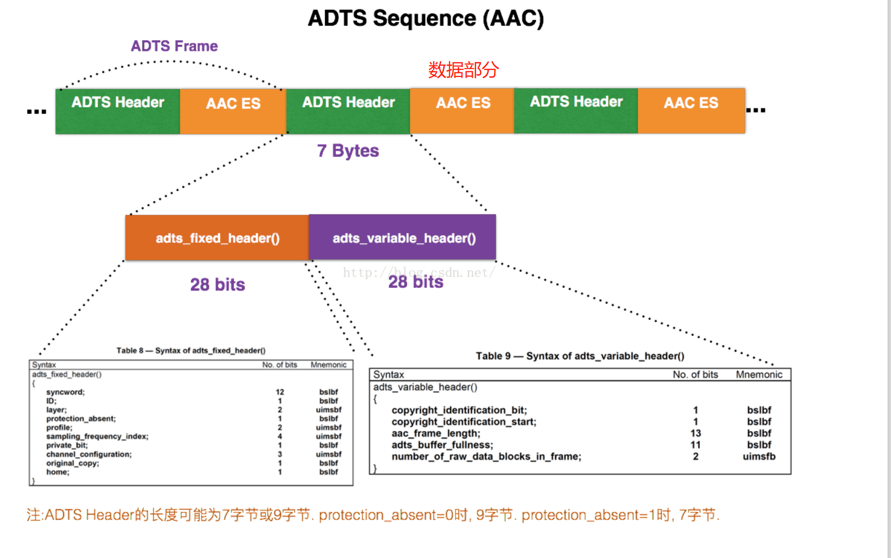

```c
#include <stdio.h>
#include <libavutil/log.h>
#include <libavformat/avio.h>
#include <libavformat/avformat.h>

#define ADTS_HEADER_LEN  7;

const int sampling_frequencies[] = {
    96000,  // 0x0
    88200,  // 0x1
    64000,  // 0x2
    48000,  // 0x3
    44100,  // 0x4
    32000,  // 0x5
    24000,  // 0x6
    22050,  // 0x7
    16000,  // 0x8
    12000,  // 0x9
    11025,  // 0xa
    8000   // 0xb
    // 0xc d e f是保留的
};

int adts_header(char * const p_adts_header, const int data_length,
                const int profile, const int samplerate,
                const int channels)
{

    int sampling_frequency_index = 3; // 默认使用48000hz
    int adtsLen = data_length + 7;

    int frequencies_size = sizeof(sampling_frequencies) / sizeof(sampling_frequencies[0]);
    int i = 0;
    for(i = 0; i < frequencies_size; i++)
    {
        if(sampling_frequencies[i] == samplerate)
        {
            sampling_frequency_index = i;
            break;
        }
    }
    if(i >= frequencies_size)
    {
        printf("unsupport samplerate:%d\n", samplerate);
        return -1;
    }

    p_adts_header[0] = 0xff;         //syncword:0xfff                          高8bits
    p_adts_header[1] = 0xf0;         //syncword:0xfff                          低4bits
    p_adts_header[1] |= (0 << 3);    //MPEG Version:0 for MPEG-4,1 for MPEG-2  1bit
    p_adts_header[1] |= (0 << 1);    //Layer:0                                 2bits
    p_adts_header[1] |= 1;           //protection absent:1                     1bit

    p_adts_header[2] = (profile)<<6;            //profile:profile               2bits
    p_adts_header[2] |= (sampling_frequency_index & 0x0f)<<2; //sampling frequency index:sampling_frequency_index  4bits
    p_adts_header[2] |= (0 << 1);             //private bit:0                   1bit
    p_adts_header[2] |= (channels & 0x04)>>2; //channel configuration:channels  高1bit

    p_adts_header[3] = (channels & 0x03)<<6; //channel configuration:channels 低2bits
    p_adts_header[3] |= (0 << 5);               //original：0                1bit
    p_adts_header[3] |= (0 << 4);               //home：0                    1bit
    p_adts_header[3] |= (0 << 3);               //copyright id bit：0        1bit
    p_adts_header[3] |= (0 << 2);               //copyright id start：0      1bit
    p_adts_header[3] |= ((adtsLen & 0x1800) >> 11);           //frame length：value   高2bits

    p_adts_header[4] = (uint8_t)((adtsLen & 0x7f8) >> 3);     //frame length:value    中间8bits
    p_adts_header[5] = (uint8_t)((adtsLen & 0x7) << 5);       //frame length:value    低3bits
    p_adts_header[5] |= 0x1f;                                 //buffer fullness:0x7ff 高5bits
    p_adts_header[6] = 0xfc;      //‭11111100‬       //buffer fullness:0x7ff 低6bits
    // number_of_raw_data_blocks_in_frame：
    //    表示ADTS帧中有number_of_raw_data_blocks_in_frame + 1个AAC原始帧。

    return 0;
}

int main(int argc, char *argv[])
{
    int ret = -1;
    char errors[1024];

    char *in_filename = NULL;
    char *aac_filename = NULL;

    FILE *aac_fd = NULL;

    int audio_index = -1;
    int len = 0;


    AVFormatContext *ifmt_ctx = NULL;
    AVPacket pkt;

    // 设置打印级别
    av_log_set_level(AV_LOG_DEBUG);

    if(argc < 3)
    {
        av_log(NULL, AV_LOG_DEBUG, "the count of parameters should be more than three!\n");
        return -1;
    }

    in_filename = argv[1];      // 输入文件
    aac_filename = argv[2];     // 输出文件

    if(in_filename == NULL || aac_filename == NULL)
    {
        av_log(NULL, AV_LOG_DEBUG, "src or dts file is null, plz check them!\n");
        return -1;
    }

    aac_fd = fopen(aac_filename, "wb");
    if (!aac_fd)
    {
        av_log(NULL, AV_LOG_DEBUG, "Could not open destination file %s\n", aac_filename);
        return -1;
    }

    // 打开输入文件
    if((ret = avformat_open_input(&ifmt_ctx, in_filename, NULL, NULL)) < 0)
    {
        av_strerror(ret, errors, 1024);
        av_log(NULL, AV_LOG_DEBUG, "Could not open source file: %s, %d(%s)\n",
               in_filename,
               ret,
               errors);
        return -1;
    }

    // 获取解码器信息
    if((ret = avformat_find_stream_info(ifmt_ctx, NULL)) < 0)
    {
        av_strerror(ret, errors, 1024);
        av_log(NULL, AV_LOG_DEBUG, "failed to find stream information: %s, %d(%s)\n",
               in_filename,
               ret,
               errors);
        return -1;
    }

    // dump媒体信息
    av_dump_format(ifmt_ctx, 0, in_filename, 0);

    // 初始化packet
    av_init_packet(&pkt);

    // 查找audio对应的steam index
    audio_index = av_find_best_stream(ifmt_ctx, AVMEDIA_TYPE_AUDIO, -1, -1, NULL, 0);
    if(audio_index < 0)
    {
        av_log(NULL, AV_LOG_DEBUG, "Could not find %s stream in input file %s\n",
               av_get_media_type_string(AVMEDIA_TYPE_AUDIO),
               in_filename);
        return AVERROR(EINVAL);
    }

    // 打印AAC级别
    printf("audio profile:%d, FF_PROFILE_AAC_LOW:%d\n",
           ifmt_ctx->streams[audio_index]->codecpar->profile,
           FF_PROFILE_AAC_LOW);

    if(ifmt_ctx->streams[audio_index]->codecpar->codec_id != AV_CODEC_ID_AAC)
    {
        printf("the media file no contain AAC stream, it's codec_id is %d\n",
               ifmt_ctx->streams[audio_index]->codecpar->codec_id);
        goto failed;
    }
    // 读取媒体文件，并把aac数据帧写入到本地文件
    while(av_read_frame(ifmt_ctx, &pkt) >=0 )
    {
        if(pkt.stream_index == audio_index)
        {
            char adts_header_buf[7] = {0};
            adts_header(adts_header_buf, pkt.size,
                        ifmt_ctx->streams[audio_index]->codecpar->profile,
                        ifmt_ctx->streams[audio_index]->codecpar->sample_rate,
                        ifmt_ctx->streams[audio_index]->codecpar->channels);
            fwrite(adts_header_buf, 1, 7, aac_fd);  // 写adts header , ts流不适用，ts流分离出来的packet带了adts header
            len = fwrite( pkt.data, 1, pkt.size, aac_fd);   // 写adts data
            if(len != pkt.size)
            {
                av_log(NULL, AV_LOG_DEBUG, "warning, length of writed data isn't equal pkt.size(%d, %d)\n",
                       len,
                       pkt.size);
            }
        }
        av_packet_unref(&pkt);
    }

failed:
    // 关闭输入文件
    if(ifmt_ctx)
    {
        avformat_close_input(&ifmt_ctx);
    }
    if(aac_fd)
    {
        fclose(aac_fd);
    }

    return 0;
}

```

### 5.2.3 H264  NALV分析(单视频)

**视频格式（没有音频）**

在ITU的标准⾥称 为H.264

在MPEG的标准⾥是MPEG-4的⼀个组成部分–MPEG-4 Part 10，⼜叫**Advanced Video Codec**

因此常常称为**MPEG-4 AVC或直接叫AVC**。

在⾳视频传输过程中，视频⽂件的传输是⼀个极⼤的问题；⼀段分辨率为`1920*1080`，每个像 素点为RGB占⽤3个字节，帧率是25的视频，对于传输带宽的要求是： `1920*1080*3*25/1024/1024=148.315MB/s`，换成bps则意味着视频每秒带宽为 1186.523Mbps，这样的速率对于网络存储是不可接受的。因此视频压缩和编码技术应运而生。

#### h264 编码原理

H26使⽤帧内压缩（I）和帧间压缩（P, B）的⽅式提⾼编码压缩率；H264采⽤了独特的I帧、P帧和B帧策略 来实现，连续帧之间的压缩；

压缩率 B > P > I


- I帧，帧内编码帧 intra picture，
  - I 帧通常是每个 GOP（MPEG 所使⽤的⼀种视频压缩技术） 的第⼀个帧，经过适度地压缩，做为随机访问的参考点，可 以当成图象。
  - I帧可以看成是⼀个图像经过压缩后的产物。 ⾃身可以通过视频解压算法解压成⼀张单独的完整的图⽚。
- P帧，前向预测编码帧 predictive-frame
  - 通过充分将低于图像序列中前⾯已编码帧的时间冗余信息来 压缩传输数据量的编码图像，也叫预测帧。
  - 需要参考其前⾯的⼀个I frame 或者P frame来⽣成⼀张完整 的图⽚。
- B帧，双向预测帧 bi-directional interpolated prediction frame 
  - 既考虑与源图像序列前⾯已编码帧，也顾及源图像序列后⾯ 已编码帧之间的时间冗余信息来压缩传输数据量的编码图像, 也叫双向预测帧。 
  - 则要参考其前⼀个I或者P帧及其后⾯的⼀个P帧来⽣成⼀张完 整的图⽚。
  - 直播一般不会采用B帧，因为他需要等待I帧和P帧到来才能解码自身，这样就会造成延迟。


H264将视频分为连续的帧进⾏传输，在连续的帧之间使⽤I帧、P帧和B帧。同时对于帧内⽽ ⾔，将图像分块为⽚、宏块和字块进⾏分⽚传输；通过这个过程实现对视频⽂件的压缩包装。


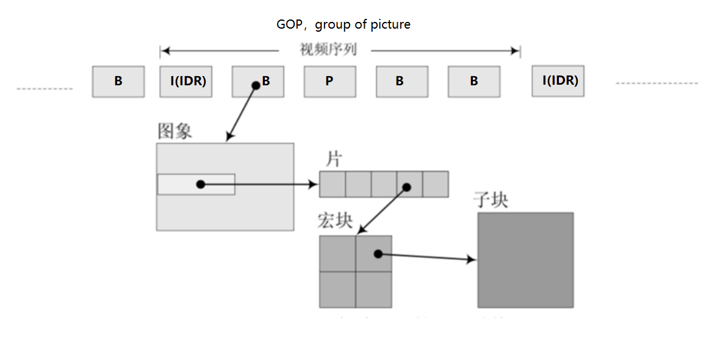

**IDR（Instantaneous Decoding Refresh，即时解码刷新）**，⼀个序列（GOP）的第⼀个图像叫做 IDR 图像（⽴即刷新图像），IDR 图像都是 I 帧图像。

其核⼼作⽤是，是为了解码的重同步，当解码器解码到 IDR 图像时，⽴即将参考帧队列清 空，将已解码的数据全部输出或抛弃，重新查找参数集，开始⼀个新的序列。这样，如果前⼀ 个序列出现重⼤错误，在这⾥可以获得重新同步的机会。IDR图像之后的图像永远不会使⽤ IDR之前的图像的数据来解码。

#### NALU

**H.264原始码流(裸流)是由⼀个接⼀个NALU组成**，它的功能分为两层：

- VCL（Video Codeing Layer）：视频编码层，负责的是视频内容的处理，重点在编解码算法
- NAL（Network Abstraction Layer）：网络抽象层，负责将编码后的数据以网络要求的格式进行打包和传输；

在VCL进⾏数据传输或存储之前，这些编码的VCL数据，被映射或封装进**NAL单元（NALU）**。


NALU结构单元的主体结构如下所示；

- ⼀个原始的H.264 NALU单元通常由**[StartCode] [NALU Header] [NALU Payload]**三部分组成，
- 其中**起始码**Start Code ⽤于标示这是⼀个NALU 单元的开 始，必须是"00 00 00 01" 或"00 00 01"，除此之外基本相当于⼀个NAL header + RBSP; 
- NALU结构 ⼀个NALU = ⼀组对应于视频编码的NALU头部信息（NAL Header） + ⼀个原始字节序列负荷(RBSP,Raw Byte Sequence Payload)

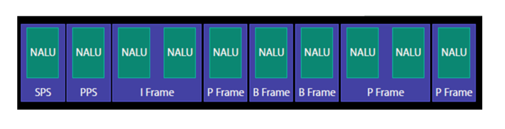

- SPS（Sprop Parameter Sets）：序列参数集，SPS中保存了⼀组编码视频序列(Coded video sequence)的全局参数。大小25byte左右

- PPS（Picture Parameter Sets）：图像参数集，对应的是⼀个序列中某⼀幅图像或者某⼏幅图像的参数。大小5byte左右
- 发I帧之前，⾄少要发⼀次SPS和PPS。
- 一帧可以对应多个NALU

##### NALU header解析


- **T为负荷数据类型**，占5bit， nal_unit_type
  - 6，SEI补充增强信息单元 可以存⼀些私有数据等；
  - 7，SPS 序列参数集 编码的参数配置
  - 8，PPS 图像参数集 编码的参数配置
  - 28，FU-A Fragmentation unit 分包模式：当⼀个RTP容纳不下⼀个NALU时，就需要 FUs这种格式。
- R为重要性指示位，占2个bit，nal_ref_idc
- 最后的F为禁⽌位，占1bit，forbidden_zero_bit， 在 H.264 规范中规定了这⼀位必须为 0

##### H264 annexb模式

H264有两种封装 

- ⼀种是annexb模式，传统模式，有startcode，SPS和PPS是在ES中
- ⼀种是mp4模式，⼀般mp4 mkv都是mp4模式，没有startcode，SPS和PPS以及其它信息 被封装在container中，每⼀个frame前⾯4个字节是这个frame的⻓度

很多解码器只⽀持annexb这种模式，因此需要将mp4做转换：在ffmpeg中⽤ h264_mp4toannexb_filter可以做转换

```c
#include <stdio.h>
#include <libavutil/log.h>
#include <libavformat/avio.h>
#include <libavformat/avformat.h>


static char err_buf[128] = {0};
static char* av_get_err(int errnum)
{
    av_strerror(errnum, err_buf, 128);
    return err_buf;
}

/*
AvCodecContext->extradata[]中为nalu长度
*   codec_extradata:
*   1, 64, 0, 1f, ff, e1, [0, 18], 67, 64, 0, 1f, ac, c8, 60, 78, 1b, 7e,
*   78, 40, 0, 0, fa, 40, 0, 3a, 98, 3, c6, c, 66, 80,
*   1, [0, 5],68, e9, 78, bc, b0, 0,
*/

//ffmpeg -i 2018.mp4 -codec copy -bsf:h264_mp4toannexb -f h264 tmp.h264
//ffmpeg 从mp4上提取H264的nalu h
int main(int argc, char **argv)
{
    AVFormatContext *ifmt_ctx = NULL;
    int             videoindex = -1;
    AVPacket        *pkt = NULL;
    int             ret = -1;
    int             file_end = 0; // 文件是否读取结束

    if(argc < 3)
    {
        printf("usage inputfile outfile\n");
        return -1;
    }
    FILE *outfp=fopen(argv[2],"wb");
    printf("in:%s out:%s\n", argv[1], argv[2]);

    // 分配解复用器的内存，使用avformat_close_input释放
    ifmt_ctx = avformat_alloc_context();
    if (!ifmt_ctx)
    {
        printf("[error] Could not allocate context.\n");
        return -1;
    }

    // 根据url打开码流，并选择匹配的解复用器
    ret = avformat_open_input(&ifmt_ctx,argv[1], NULL, NULL);
    if(ret != 0)
    {
        printf("[error]avformat_open_input: %s\n", av_get_err(ret));
        return -1;
    }

    // 读取媒体文件的部分数据包以获取码流信息
    ret = avformat_find_stream_info(ifmt_ctx, NULL);
    if(ret < 0)
    {
        printf("[error]avformat_find_stream_info: %s\n", av_get_err(ret));
        avformat_close_input(&ifmt_ctx);
        return -1;
    }

    // 查找出哪个码流是video/audio/subtitles
    videoindex = -1;
    // 推荐的方式
    videoindex = av_find_best_stream(ifmt_ctx, AVMEDIA_TYPE_VIDEO, -1, -1, NULL, 0);
    if(videoindex == -1)
    {
        printf("Didn't find a video stream.\n");
        avformat_close_input(&ifmt_ctx);
        return -1;
    }

    // 分配数据包
    pkt = av_packet_alloc();
    av_init_packet(pkt);

    // 1 获取相应的比特流过滤器
    //FLV/MP4/MKV等结构中，h264需要h264_mp4toannexb处理。添加SPS/PPS等信息。
    // FLV封装时，可以把多个NALU放在一个VIDEO TAG中,结构为4B NALU长度+NALU1+4B NALU长度+NALU2+...,
    // 需要做的处理把4B长度换成00000001或者000001
    const AVBitStreamFilter *bsfilter = av_bsf_get_by_name("h264_mp4toannexb");
    AVBSFContext *bsf_ctx = NULL;
    // 2 初始化过滤器上下文
    av_bsf_alloc(bsfilter, &bsf_ctx); //AVBSFContext;
    // 3 添加解码器属性
    avcodec_parameters_copy(bsf_ctx->par_in, ifmt_ctx->streams[videoindex]->codecpar);
    av_bsf_init(bsf_ctx);

    file_end = 0;
    while (0 == file_end)
    {
        if((ret = av_read_frame(ifmt_ctx, pkt)) < 0)
        {
            // 没有更多包可读
            file_end = 1;
            printf("read file end: ret:%d\n", ret);
        }
        if(ret == 0 && pkt->stream_index == videoindex)
        {
#if 0
            int input_size = pkt->size;
            int out_pkt_count = 0;
            if (av_bsf_send_packet(bsf_ctx, pkt) != 0) // bitstreamfilter内部去维护内存空间
            {
                av_packet_unref(pkt);   // 你不用了就把资源释放掉
                continue;       // 继续送
            }
            av_packet_unref(pkt);   // 释放资源
            while(av_bsf_receive_packet(bsf_ctx, pkt) == 0)
            {
                out_pkt_count++;
                // printf("fwrite size:%d\n", pkt->size);
                size_t size = fwrite(pkt->data, 1, pkt->size, outfp);
                if(size != pkt->size)
                {
                    printf("fwrite failed-> write:%u, pkt_size:%u\n", size, pkt->size);
                }
                av_packet_unref(pkt);
            }
            if(out_pkt_count >= 2)
            {
                printf("cur pkt(size:%d) only get 1 out pkt, it get %d pkts\n",
                       input_size, out_pkt_count);
            }
#else       // TS流可以直接写入
            size_t size = fwrite(pkt->data, 1, pkt->size, outfp);
            if(size != pkt->size)
            {
                printf("fwrite failed-> write:%u, pkt_size:%u\n", size, pkt->size);
            }
            av_packet_unref(pkt);
#endif
        }
        else
        {
            if(ret == 0)
                av_packet_unref(pkt);        // 释放内存
        }
    }
    if(outfp)
        fclose(outfp);
    if(bsf_ctx)
        av_bsf_free(&bsf_ctx);
    if(pkt)
        av_packet_free(&pkt);
    if(ifmt_ctx)
        avformat_close_input(&ifmt_ctx);
    printf("finish\n");

    return 0;
}

```

### 5.2.4 FLV 分析(音视频)

包含音频和视频的格式

FLV(Flash Video)是Adobe公司推出的⼀种流媒体格式，由于其封装后的⾳视频⽂件体积 ⼩、封装简单等特点，⾮常适合于互联⽹上使⽤。⽬前主流的视频⽹站基本都⽀持FLV。

FLV封装格式是由⼀个⽂件头(file header)和 ⽂件体(file Body)组成。

FLV body由⼀ 对对的(Previous Tag Size字段 + tag)组成。

- Previous Tag Size字段 排列在Tag之前，占⽤ 4个字节。
  - Previous Tag Size记录了前⾯⼀个Tag的⼤⼩，⽤于逆向读取处理。
  - FLV header 后的第⼀个Pervious Tag Size的值为0。
- Tag⼀般可以分为3种类型：脚本(帧)数据类型、⾳频数据类型、视频数据。FLV数据以⼤端序 进⾏存储，在解析时需要注意。
  - 每⼀个Tag也是由两部分组成:tag header和tag data。
  - Tag Header⾥存放的是当前tag的类 型、数据区(tag data)的⻓度等信息。
  - tag data又分Video Tag Data结构(视频类型)，Audio Tag Data结构(⾳频类型)

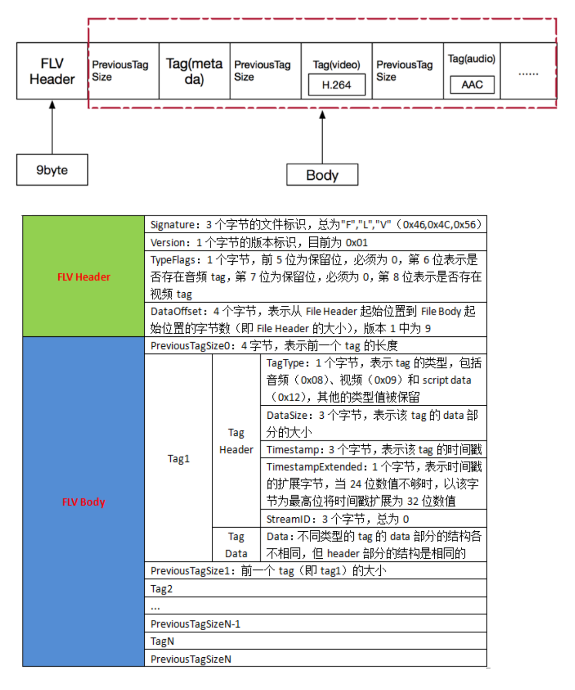

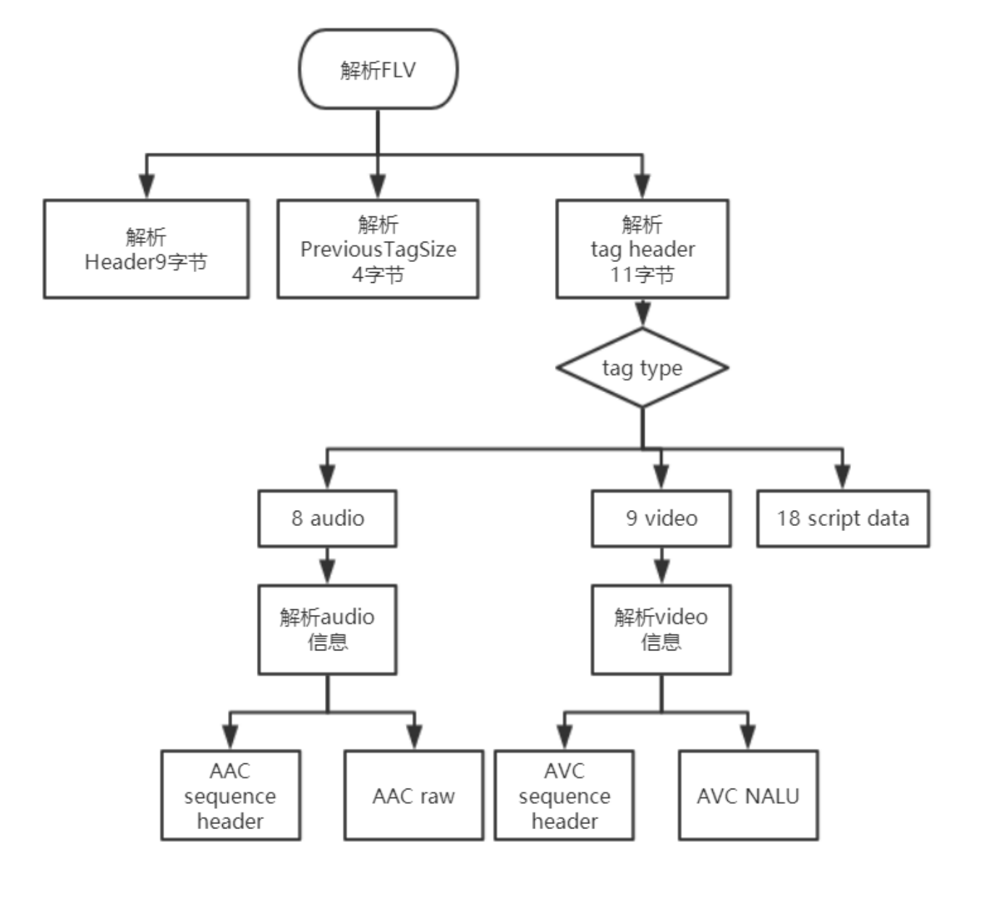

### 5.2.5 MP4分析(音视频)


### 5.2.6 [解码](https://blog.csdn.net/qq_36060661/article/details/115359867)

单纯处理 **解复用** 后的码流。

#### 解音频码流


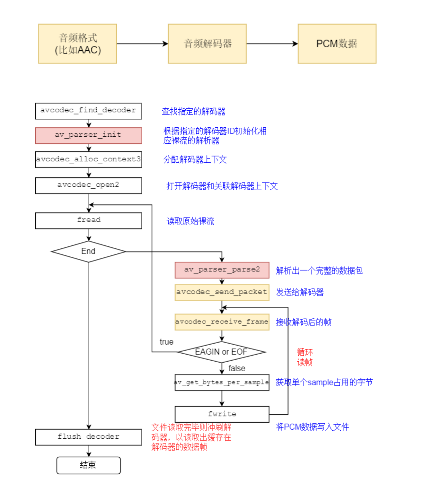


关键函数说明： 

- avcodec_find_decoder：根据指定的AVCodecID查找注册的解码器。 
- av_parser_init：初始化AVCodecParserContext。 
- avcodec_alloc_context3：为AVCodecContext分配内存。 
- avcodec_open2：打开解码器。 
- av_parser_parse2：解析获得⼀个Packet。 
- avcodec_send_packet：将AVPacket压缩数据给解码器。 
- avcodec_receive_frame：获取到解码后的AVFrame数据。
- av_get_bytes_per_sample: 获取每个sample中的字节数。

关键数据结构：AVCodecParser

```c
/**
* @projectName   07-05-decode_audio
* @brief         解码音频，主要的测试格式aac和mp3
* @author        Liao Qingfu
* @date          2020-01-16
*/
#include <stdio.h>
#include <stdlib.h>
#include <string.h>

#include <libavutil/frame.h>
#include <libavutil/mem.h>

#include <libavcodec/avcodec.h>

#define AUDIO_INBUF_SIZE 20480
#define AUDIO_REFILL_THRESH 4096

static char err_buf[128] = {0};
static char* av_get_err(int errnum)
{
    av_strerror(errnum, err_buf, 128);
    return err_buf;
}

static void print_sample_format(const AVFrame *frame)
{
    printf("ar-samplerate: %uHz\n", frame->sample_rate);
    printf("ac-channel: %u\n", frame->channels);
    printf("f-format: %u\n", frame->format);// 格式需要注意，实际存储到本地文件时已经改成交错模式
}

static void decode(AVCodecContext *dec_ctx, AVPacket *pkt, AVFrame *frame,
                   FILE *outfile)
{
    int i, ch;
    int ret, data_size;
    /* send the packet with the compressed data to the decoder */
    ret = avcodec_send_packet(dec_ctx, pkt);
    if(ret == AVERROR(EAGAIN))
    {
        fprintf(stderr, "Receive_frame and send_packet both returned EAGAIN, which is an API violation.\n");
    }
    else if (ret < 0)
    {
        fprintf(stderr, "Error submitting the packet to the decoder, err:%s, pkt_size:%d\n",
                av_get_err(ret), pkt->size);
//        exit(1);
        return;
    }

    /* read all the output frames (infile general there may be any number of them */
    while (ret >= 0)
    {
        // 对于frame, avcodec_receive_frame内部每次都先调用
        ret = avcodec_receive_frame(dec_ctx, frame);
        if (ret == AVERROR(EAGAIN) || ret == AVERROR_EOF)
            return;
        else if (ret < 0)
        {
            fprintf(stderr, "Error during decoding\n");
            exit(1);
        }
        data_size = av_get_bytes_per_sample(dec_ctx->sample_fmt);
        if (data_size < 0)
        {
            /* This should not occur, checking just for paranoia */
            fprintf(stderr, "Failed to calculate data size\n");
            exit(1);
        }
        static int s_print_format = 0;
        if(s_print_format == 0)
        {
            s_print_format = 1;
            print_sample_format(frame);
        }
        /**
            P表示Planar（平面），其数据格式排列方式为 :
            LLLLLLRRRRRRLLLLLLRRRRRRLLLLLLRRRRRRL...（每个LLLLLLRRRRRR为一个音频帧）
            而不带P的数据格式（即交错排列）排列方式为：
            LRLRLRLRLRLRLRLRLRLRLRLRLRLRLRLRLRLRL...（每个LR为一个音频样本）
         播放范例：   ffplay -ar 48000 -ac 2 -f f32le believe.pcm
          */
        for (i = 0; i < frame->nb_samples; i++)
        {
            for (ch = 0; ch < dec_ctx->channels; ch++)  // 交错的方式写入, 大部分float的格式输出
                fwrite(frame->data[ch] + data_size*i, 1, data_size, outfile);
        }
    }
}
// 播放范例：   ffplay -ar 48000 -ac 2 -f f32le believe.pcm
int main(int argc, char **argv)
{
    const char *outfilename;
    const char *filename;
    const AVCodec *codec;
    AVCodecContext *codec_ctx= NULL;
    AVCodecParserContext *parser = NULL;
    int len = 0;
    int ret = 0;
    FILE *infile = NULL;
    FILE *outfile = NULL;
    uint8_t inbuf[AUDIO_INBUF_SIZE + AV_INPUT_BUFFER_PADDING_SIZE];
    uint8_t *data = NULL;
    size_t   data_size = 0;
    AVPacket *pkt = NULL;
    AVFrame *decoded_frame = NULL;

    if (argc <= 2)
    {
        fprintf(stderr, "Usage: %s <input file> <output file>\n", argv[0]);
        exit(0);
    }
    filename    = argv[1];
    outfilename = argv[2];

    pkt = av_packet_alloc();
    enum AVCodecID audio_codec_id = AV_CODEC_ID_AAC;
    if(strstr(filename, "aac") != NULL)
    {
        audio_codec_id = AV_CODEC_ID_AAC;
    }
    else if(strstr(filename, "mp3") != NULL)
    {
        audio_codec_id = AV_CODEC_ID_MP3;
    }
    else
    {
        printf("default codec id:%d\n", audio_codec_id);
    }

    // 查找解码器
    codec = avcodec_find_decoder(audio_codec_id);  // AV_CODEC_ID_AAC
    if (!codec) {
        fprintf(stderr, "Codec not found\n");
        exit(1);
    }
    // 获取裸流的解析器 AVCodecParserContext(数据)  +  AVCodecParser(方法)
    parser = av_parser_init(codec->id);
    if (!parser) {
        fprintf(stderr, "Parser not found\n");
        exit(1);
    }
    // 分配codec上下文
    codec_ctx = avcodec_alloc_context3(codec);
    if (!codec_ctx) {
        fprintf(stderr, "Could not allocate audio codec context\n");
        exit(1);
    }

    // 将解码器和解码器上下文进行关联
    if (avcodec_open2(codec_ctx, codec, NULL) < 0) {
        fprintf(stderr, "Could not open codec\n");
        exit(1);
    }

    // 打开输入文件
    infile = fopen(filename, "rb");
    if (!infile) {
        fprintf(stderr, "Could not open %s\n", filename);
        exit(1);
    }
    // 打开输出文件
    outfile = fopen(outfilename, "wb");
    if (!outfile) {
        av_free(codec_ctx);
        exit(1);
    }

    // 读取文件进行解码
    data      = inbuf;
    data_size = fread(inbuf, 1, AUDIO_INBUF_SIZE, infile);

    while (data_size > 0)
    {
        if (!decoded_frame)
        {
            if (!(decoded_frame = av_frame_alloc()))
            {
                fprintf(stderr, "Could not allocate audio frame\n");
                exit(1);
            }
        }

        ret = av_parser_parse2(parser, codec_ctx, &pkt->data, &pkt->size,
                               data, data_size,
                               AV_NOPTS_VALUE, AV_NOPTS_VALUE, 0);
        if (ret < 0)
        {
            fprintf(stderr, "Error while parsing\n");
            exit(1);
        }
        data      += ret;   // 跳过已经解析的数据
        data_size -= ret;   // 对应的缓存大小也做相应减小

        if (pkt->size)
            decode(codec_ctx, pkt, decoded_frame, outfile);

        if (data_size < AUDIO_REFILL_THRESH)    // 如果数据少了则再次读取
        {
            memmove(inbuf, data, data_size);    // 把之前剩的数据拷贝到buffer的起始位置
            data = inbuf;
            // 读取数据 长度: AUDIO_INBUF_SIZE - data_size
            len = fread(data + data_size, 1, AUDIO_INBUF_SIZE - data_size, infile);
            if (len > 0)
                data_size += len;
        }
    }

    /* 冲刷解码器 */
    pkt->data = NULL;   // 让其进入drain mode
    pkt->size = 0;
    decode(codec_ctx, pkt, decoded_frame, outfile);

    fclose(outfile);
    fclose(infile);

    avcodec_free_context(&codec_ctx);
    av_parser_close(parser);
    av_frame_free(&decoded_frame);
    av_packet_free(&pkt);

    printf("main finish, please enter Enter and exit\n");
    return 0;
}

```

#### 解视频

关键函数说明：

- avcodec_find_decoder：根据指定的AVCodecID查找注册的解码器。 
- av_parser_init：初始化AVCodecParserContext。 
- avcodec_alloc_context3：为AVCodecContext分配内存。
- avcodec_open2：打开解码器。
- av_parser_parse2：解析获得⼀个Packet。 
- avcodec_send_packet：将AVPacket压缩数据给解码器。
- avcodec_receive_frame：获取到解码后的AVFrame数据。
- av_get_bytes_per_sample: 获取每个sample中的字节数。

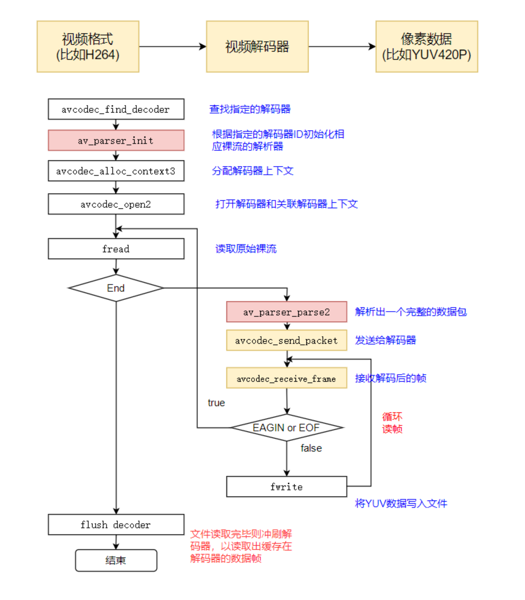

```c
/**
* @projectName   07-05-decode_audio
* @brief         解码音频，主要的测试格式aac和mp3
* @author        Liao Qingfu
* @date          2020-01-16
*/
#include <stdio.h>
#include <stdlib.h>
#include <string.h>

#include <libavutil/frame.h>
#include <libavutil/mem.h>

#include <libavcodec/avcodec.h>

#define VIDEO_INBUF_SIZE 20480
#define VIDEO_REFILL_THRESH 4096

static char err_buf[128] = {0};
static char* av_get_err(int errnum)
{
    av_strerror(errnum, err_buf, 128);
    return err_buf;
}

static void print_video_format(const AVFrame *frame)
{
    printf("width: %u\n", frame->width);
    printf("height: %u\n", frame->height);
    printf("format: %u\n", frame->format);// 格式需要注意
}

static void decode(AVCodecContext *dec_ctx, AVPacket *pkt, AVFrame *frame,
                   FILE *outfile)
{
    int ret;
    /* send the packet with the compressed data to the decoder */
    ret = avcodec_send_packet(dec_ctx, pkt);
    if(ret == AVERROR(EAGAIN))
    {
        fprintf(stderr, "Receive_frame and send_packet both returned EAGAIN, which is an API violation.\n");
    }
    else if (ret < 0)
    {
        fprintf(stderr, "Error submitting the packet to the decoder, err:%s, pkt_size:%d\n",
                av_get_err(ret), pkt->size);
        return;
    }

    /* read all the output frames (infile general there may be any number of them */
    while (ret >= 0)
    {
        // 对于frame, avcodec_receive_frame内部每次都先调用
        ret = avcodec_receive_frame(dec_ctx, frame);
        if (ret == AVERROR(EAGAIN) || ret == AVERROR_EOF)
            return;
        else if (ret < 0)
        {
            fprintf(stderr, "Error during decoding\n");
            exit(1);
        }
        static int s_print_format = 0;
        if(s_print_format == 0)
        {
            s_print_format = 1;
            print_video_format(frame);
        }

        // 一般H264默认为 AV_PIX_FMT_YUV420P, 具体怎么强制转为 AV_PIX_FMT_YUV420P 在音视频合成输出的时候讲解
        // frame->linesize[1]  对齐的问题
        // 正确写法  linesize[]代表每行的字节数量，所以每行的偏移是linesize[]
        for(int j=0; j<frame->height; j++)
            fwrite(frame->data[0] + j * frame->linesize[0], 1, frame->width, outfile);
        for(int j=0; j<frame->height/2; j++)
            fwrite(frame->data[1] + j * frame->linesize[1], 1, frame->width/2, outfile);
        for(int j=0; j<frame->height/2; j++)
            fwrite(frame->data[2] + j * frame->linesize[2], 1, frame->width/2, outfile);

        // 错误写法 用source.200kbps.766x322_10s.h264测试时可以看出该种方法是错误的
        //  写入y分量
//        fwrite(frame->data[0], 1, frame->width * frame->height,  outfile);//Y
//        // 写入u分量
//        fwrite(frame->data[1], 1, (frame->width) *(frame->height)/4,outfile);//U:宽高均是Y的一半
//        //  写入v分量
//        fwrite(frame->data[2], 1, (frame->width) *(frame->height)/4,outfile);//V：宽高均是Y的一半
    }
}
// 注册测试的时候不同分辨率的问题
// 提取H264: ffmpeg -i source.200kbps.768x320_10s.flv -vcodec libx264 -an -f h264 source.200kbps.768x320_10s.h264
// 提取MPEG2: ffmpeg -i source.200kbps.768x320_10s.flv -vcodec mpeg2video -an -f mpeg2video source.200kbps.768x320_10s.mpeg2
// 播放：ffplay -pixel_format yuv420p -video_size 768x320 -framerate 25  source.200kbps.768x320_10s.yuv
int main(int argc, char **argv)
{
    const char *outfilename;
    const char *filename;
    const AVCodec *codec;
    AVCodecContext *codec_ctx= NULL;
    AVCodecParserContext *parser = NULL;
    int len = 0;
    int ret = 0;
    FILE *infile = NULL;
    FILE *outfile = NULL;
    // AV_INPUT_BUFFER_PADDING_SIZE 在输入比特流结尾的要求附加分配字节的数量上进行解码
    uint8_t inbuf[VIDEO_INBUF_SIZE + AV_INPUT_BUFFER_PADDING_SIZE];
    uint8_t *data = NULL;
    size_t   data_size = 0;
    AVPacket *pkt = NULL;
    AVFrame *decoded_frame = NULL;

    if (argc <= 2)
    {
        fprintf(stderr, "Usage: %s <input file> <output file>\n", argv[0]);
        exit(0);
    }
    filename    = argv[1];
    outfilename = argv[2];

    pkt = av_packet_alloc();
    enum AVCodecID video_codec_id = AV_CODEC_ID_H264;
    if(strstr(filename, "264") != NULL)
    {
        video_codec_id = AV_CODEC_ID_H264;
    }
    else if(strstr(filename, "mpeg2") != NULL)
    {
        video_codec_id = AV_CODEC_ID_MPEG2VIDEO;
    }
    else
    {
        printf("default codec id:%d\n", video_codec_id);
    }

    // 查找解码器
    codec = avcodec_find_decoder(video_codec_id);  // AV_CODEC_ID_H264
    if (!codec) {
        fprintf(stderr, "Codec not found\n");
        exit(1);
    }
    // 获取裸流的解析器 AVCodecParserContext(数据)  +  AVCodecParser(方法)
    parser = av_parser_init(codec->id);
    if (!parser) {
        fprintf(stderr, "Parser not found\n");
        exit(1);
    }
    // 分配codec上下文
    codec_ctx = avcodec_alloc_context3(codec);
    if (!codec_ctx) {
        fprintf(stderr, "Could not allocate audio codec context\n");
        exit(1);
    }

    // 将解码器和解码器上下文进行关联
    if (avcodec_open2(codec_ctx, codec, NULL) < 0) {
        fprintf(stderr, "Could not open codec\n");
        exit(1);
    }

    // 打开输入文件
    infile = fopen(filename, "rb");
    if (!infile) {
        fprintf(stderr, "Could not open %s\n", filename);
        exit(1);
    }
    // 打开输出文件
    outfile = fopen(outfilename, "wb");
    if (!outfile) {
        av_free(codec_ctx);
        exit(1);
    }

    // 读取文件进行解码
    data      = inbuf;
    data_size = fread(inbuf, 1, VIDEO_INBUF_SIZE, infile);

    while (data_size > 0)
    {
        if (!decoded_frame)
        {
            if (!(decoded_frame = av_frame_alloc()))
            {
                fprintf(stderr, "Could not allocate audio frame\n");
                exit(1);
            }
        }

        ret = av_parser_parse2(parser, codec_ctx, &pkt->data, &pkt->size,
                               data, data_size,
                               AV_NOPTS_VALUE, AV_NOPTS_VALUE, 0);
        if (ret < 0)
        {
            fprintf(stderr, "Error while parsing\n");
            exit(1);
        }
        data      += ret;   // 跳过已经解析的数据
        data_size -= ret;   // 对应的缓存大小也做相应减小

        if (pkt->size)
            decode(codec_ctx, pkt, decoded_frame, outfile);

        if (data_size < VIDEO_REFILL_THRESH)    // 如果数据少了则再次读取
        {
            memmove(inbuf, data, data_size);    // 把之前剩的数据拷贝到buffer的起始位置
            data = inbuf;
            // 读取数据 长度: VIDEO_INBUF_SIZE - data_size
            len = fread(data + data_size, 1, VIDEO_INBUF_SIZE - data_size, infile);
            if (len > 0)
                data_size += len;
        }
    }

    /* 冲刷解码器 */
    pkt->data = NULL;   // 让其进入drain mode
    pkt->size = 0;
    decode(codec_ctx, pkt, decoded_frame, outfile);

    fclose(outfile);
    fclose(infile);

    avcodec_free_context(&codec_ctx);
    av_parser_close(parser);
    av_frame_free(&decoded_frame);
    av_packet_free(&pkt);

    printf("main finish, please enter Enter and exit\n");
    return 0;
}

```


## 5.3  ffmpeg 编码 + 封装

## 5.4 [ffmpeg使用gpu硬解码](https://blog.csdn.net/weicao1990/article/details/128969734)

[参考2](https://blog.csdn.net/m0_60259116/article/details/131253241)

```bash
# 检查硬件加速，有输出即正常
ffmpeg -hwaccels
# 检查编码器和解码器, 含有 h264_cuvid和h264_nvenc即可硬件加速
ffmpeg -codecs | grep cuvid
```

```c++
av_hwdevice_find_type_by_name("cuda");

static const char *const hw_type_names[] = {
  [AV_HWDEVICE_TYPE_CUDA]   = "cuda",
  [AV_HWDEVICE_TYPE_DRM]    = "drm",
  [AV_HWDEVICE_TYPE_DXVA2]  = "dxva2",
  [AV_HWDEVICE_TYPE_D3D11VA] = "d3d11va",
  [AV_HWDEVICE_TYPE_OPENCL] = "opencl",
  [AV_HWDEVICE_TYPE_QSV]    = "qsv",
  [AV_HWDEVICE_TYPE_VAAPI]  = "vaapi",
  [AV_HWDEVICE_TYPE_VDPAU]  = "vdpau",
  [AV_HWDEVICE_TYPE_VIDEOTOOLBOX] = "videotoolbox",
  [AV_HWDEVICE_TYPE_MEDIACODEC] = "mediacodec",
  [AV_HWDEVICE_TYPE_VULKAN] = "vulkan",
};

enum AVHWDeviceType {
 AV_HWDEVICE_TYPE_NONE,
 AV_HWDEVICE_TYPE_VDPAU,
 AV_HWDEVICE_TYPE_CUDA,
 AV_HWDEVICE_TYPE_VAAPI,
 AV_HWDEVICE_TYPE_DXVA2,
 AV_HWDEVICE_TYPE_QSV,
 AV_HWDEVICE_TYPE_VIDEOTOOLBOX,
 AV_HWDEVICE_TYPE_D3D11VA,
 AV_HWDEVICE_TYPE_DRM,
 AV_HWDEVICE_TYPE_OPENCL,
 AV_HWDEVICE_TYPE_MEDIACODEC,
 AV_HWDEVICE_TYPE_VULKAN,
};
```

## 5.5 ffmpeg硬编码

[FFmpeg/opencv + C++ 实现直播拉流和直播推流（对视频帧进行处理）](https://blog.csdn.net/weixin_43482623/article/details/130921255)

[参考2: 使用ffmpeg将opencv捕获的摄像头数据推流到本地rtsp器上](https://www.cnblogs.com/wensi-eric/p/17771807.html)

[完美解决OpenCV Mat 与 FFmpeg AVFrame 的相互转换](https://blog.csdn.net/T__zxt/article/details/126827167)

```c++
// StreamPreAndPostProcess.h

#include <iostream>
#include <string>
#include <vector>
#include <algorithm>
#include <numeric>

#include <opencv2/opencv.hpp>
#include "opencv2/opencv_modules.hpp"
#include <opencv2/core/utility.hpp>
#include <opencv2/core.hpp>
#include <opencv2/core/opengl.hpp>
#include <opencv2/cudacodec.hpp>
#include <opencv2/highgui.hpp>

extern "C" {
#include <libavformat/avformat.h>
#include <libavcodec/avcodec.h>
#include <libswscale/swscale.h>
#include <libavutil/imgutils.h>
#include <libavutil/error.h>
}

struct StreamInfo{
    int fps;
    int width;
    int height;
};
class StreamPreAndPostProcess{
public:
    StreamPreAndPostProcess(char* input_url, char* output_url);
    int init();
    int sendFrameToStream(cv::Mat &cv_frame);
    int CVMatToAVFrame(cv::Mat &mat, AVFrame *frame);
    int endStream();
    int freeSource();
    bool readFrame(cv::cuda::GpuMat &gmat, cv::Mat &cmat);
public:
    char* input_url;
    char* output_url;
    StreamInfo input_si;
    cv::Ptr<cv::cudacodec::VideoReader> d_reader;
    int gpuId;
    AVBufferRef* hw_device_ctx;
    AVFormatContext *out_ctx;
    AVCodec *codec;
    AVCodecContext *codec_ctx;
    AVStream *video_stream;
    AVPacket* pkt;
    AVFrame *frame;
    int64_t frame_index;
};


```

```c++

// StreamPreAndPostProcess.cpp
#include "StreamPreAndPostProcess.h"

StreamPreAndPostProcess::StreamPreAndPostProcess(char* input_url, char* output_url):input_url(input_url),output_url(output_url){}
int StreamPreAndPostProcess::init(){
        d_reader = cv::cudacodec::createVideoReader(std::string(input_url));
        if(!d_reader) {
            std::cerr << "Can't open input video file" << std::endl;
            return -1;
        }
        double DFPS, DCAP_WIDTH, DCAP_HEIGHT;
        if(!d_reader->get(cv::CAP_PROP_FPS, DFPS) || !d_reader->get(cv::CAP_PROP_FRAME_WIDTH, DCAP_WIDTH) || !d_reader->get(cv::CAP_PROP_FRAME_HEIGHT, DCAP_HEIGHT)){
            std::cerr << "Can't read input video information" << std::endl;
            return -1;
        }
        input_si.fps = static_cast<int>(DFPS);
        input_si.width = static_cast<int>(DCAP_WIDTH);
        input_si.height = static_cast<int>(DCAP_HEIGHT);
        cv::Size size(input_si.width, input_si.height);
        std::cout << "Video info: size = " << size << ", fps = " << input_si.fps << std::endl;


        av_log_set_level(AV_LOG_DEBUG);
        // FFmpeg initialization
        av_register_all();
        avcodec_register_all();
        avformat_network_init();
    

		// 如果在拥有多个GPU的设备上，需要将GPU上下文设置一致，否则一个进程占用多个GPU设备的上下文，
		// 设置GPU硬件上下文
    	char device[128] = {0};
        sprintf(device, "%d", this->gpuId);
        av_hwdevice_ctx_create(&hw_device_ctx, AV_HWDEVICE_TYPE_CUDA, device, nullptr, 0);
    	// 在创建hw_device_ctx后，还需要绑定到codec_ctx->hw_device_ctx
    	
    
        avformat_alloc_output_context2(&out_ctx, nullptr, "flv", output_url);
        if (!out_ctx) {
            std::cerr << "Error creating output context" << std::endl;
            return -1;
        }
    

        codec = avcodec_find_encoder_by_name("h264_nvenc");
        if (!codec) {
            std::cerr << "Error finding H.264 codec" << std::endl;
            return -1;
        }
        // Print codec information (optional)
        std::cout << "Codec Name: " << codec->name << std::endl;
        std::cout << "Codec ID: " << codec->id << std::endl;
        std::cout << "Codec Long Name: " << codec->long_name << std::endl;

        codec_ctx = avcodec_alloc_context3(codec);
        if (!codec_ctx) {
            std::cerr << "Error allocating codec context" << std::endl;
            return -1;
        }
    	
    	// 设置硬件设备上下文，如果在拥有多个GPU的设备上，需要将GPU上下文设置一致，否则一个进程占用多个GPU设备的上下文
    	codec_ctx->hw_device_ctx = av_buffer_ref(hw_device_ctx);

        // 设置编码参数 (replace with your desired parameters)
        codec_ctx->bit_rate = 500000; // Adjust as needed
        codec_ctx->width = static_cast<int>(input_si.width); // Frame width
        codec_ctx->height = static_cast<int>(input_si.height); // Frame height
        codec_ctx->time_base = (AVRational) {1,input_si.fps};
        codec_ctx->framerate = (AVRational) {input_si.fps,1}; //Frame rate: 30 fps
        codec_ctx->gop_size = input_si.fps;       // gop_size 参数定义了两个相邻关键帧之间的帧数。例如，如果 gop_size 设置为 30，那么每隔30帧就会出现一个关键帧。较小的 GOP 大小可能会提高编码效率，但会增加解码的计算量。较大的 GOP 大小可能会降低编码效率，但会减少视频流的比特率。
        codec_ctx->max_b_frames = 3;    // max_b_frames 参数用于限制一个 GOP 中的最大 B 帧数量。在设置 max_b_frames 时，需要考虑编码效率和解码复杂性之间的权衡。通常情况下，可以选择一个适度的值，以满足特定应用场景的需求。
        codec_ctx->pix_fmt = AV_PIX_FMT_YUV420P;    //pix_fmt（pixel format）是视频帧的像素格式，它定义了每个像素的表示方式，包括颜色和亮度等信息。在 H.264 编码中，常见的像素格式包括 AV_PIX_FMT_YUV420P、AV_PIX_FMT_YUV422P、AV_PIX_FMT_YUV444P，AV_PIX_FMT_YUV420P 是一种常见的选择，因为它在保持图像质量的同时具有较高的压缩效率。

        // 初始化编码器
        if (avcodec_open2(codec_ctx, codec, nullptr) < 0) {
            std::cerr << "Error opening video codec" << std::endl;
            return -1;
        }

        // 创建视频流
        video_stream = avformat_new_stream(out_ctx, codec);
        if (!video_stream) {
            std::cerr << "Error creating video stream" << std::endl;
            return -1;
        }
//    video_stream->codecpar->codec_type = AVMEDIA_TYPE_VIDEO;
        avcodec_parameters_from_context(video_stream->codecpar, codec_ctx);
//    video_stream->codecpar->width = codec_ctx->width;  // Set your desired width
//    video_stream->codecpar->height = codec_ctx->height;


        // 创建AVPacket结构
        pkt = av_packet_alloc();
        if(!pkt){
            std::cerr << "Error: could not allocate AVPacket" << std::endl;
        }
        pkt->data = nullptr;
        pkt->size = 0;

        // 分配帧指针，并设置帧参数
        frame = av_frame_alloc();
        if (!frame) {
            std::cerr << "Error allocating frame" << std::endl;
            return -1;
        }
        frame->width = codec_ctx->width;
        frame->height = codec_ctx->height;
        frame->format = codec_ctx->pix_fmt;

        // Allocate frame data
        if (av_frame_get_buffer(frame, 32) < 0) {       // align 参数表示要求内存对齐的字节数。
            std::cerr << "Error allocating frame data" << std::endl;
            return -1;
        }

        // SwsContext for frame conversion
        // SwsContext（Software Scaler Context）是用于图像缩放、颜色空间转换等操作的上下文对象。
//    SwsContext *sws_ctx = sws_getContext(codec_ctx->width, codec_ctx->height, AV_PIX_FMT_BGR24,
//                                         codec_ctx->width, codec_ctx->height, codec_ctx->pix_fmt,
//                                         SWS_BILINEAR, nullptr, nullptr, nullptr);
//
//    if (!sws_ctx) {
//        std::cerr << "Error creating SwsContext" << std::endl;
//        return -1;
//    }

        // Open output URL
        if (avio_open(&out_ctx->pb, output_url, AVIO_FLAG_WRITE) < 0) {
            // avio_open 函数是 FFmpeg 中用于打开和初始化输入/输出流的函数之一。它通常用于配合 FFmpeg 的文件 I/O 操作，例如读取媒体文件或写入媒体文件。
            // avio_open 被用于打开名为 rtmp_url ，并通过 format_ctx->pb 初始化输入上下文的 I/O 上下文。
            std::cerr << "Error opening output URL" << std::endl;
            return -1;
        }

        // Write header to output context
        int ret = avformat_write_header(out_ctx, nullptr);
        if ( ret < 0) {
            fprintf(stderr, "Error writing header: %s\n", av_err2str(ret));
            std::cerr << "Error writing header" << std::endl;
            return -1;
        }
        frame_index = 0;
        return 0;
    }
int StreamPreAndPostProcess::sendFrameToStream(cv::Mat &cv_frame){
        CVMatToAVFrame(cv_frame, frame);
        frame->pts = frame_index;
        if (avcodec_send_frame(codec_ctx, frame) < 0) {
            // avcodec_send_frame 是 FFmpeg 中的一个函数，用于将原始图像帧（AVFrame）发送到编码器的输入缓冲区。
            // 具体来说，它的作用是将未压缩的音视频帧送入编码器，以供后续进行编码操作。
            std::cerr << "Error sending frame" << std::endl;
            return -1;
        }

        if (avcodec_receive_packet(codec_ctx, pkt) == 0) {
            // avcodec_receive_packet 是 FFmpeg 中的一个函数，用于从编码器中接收编码后的数据包。
            // 具体来说，它的作用是从编码器的输出缓冲区中取出已经编码的音视频数据包，以供后续的处理、存储或传输。
            if (pkt->dts < 0 || pkt->pts < 0 || pkt->dts > pkt->pts) {
                pkt->dts = pkt->pts = pkt->duration = 0;
            }
            // Write packet to output context
            // av_write_frame 函数用于将已经编码的音视频帧写入媒体文件。

            pkt->pts = av_rescale_q(pkt->pts, codec_ctx->time_base, video_stream->time_base); // 显示时间
            pkt->dts = av_rescale_q(pkt->dts, codec_ctx->time_base, video_stream->time_base); // 解码时间
            pkt->duration = av_rescale_q(pkt->duration, codec_ctx->time_base, video_stream->time_base); // 数据时长

//                pkt->pts = frame_index;
//                pkt->dts = pkt->pts;
//                pkt->duration = 1 / av_q2d(codec_ctx->time_base);
            std::cout<<pkt->pts<<"/"<<pkt->dts<<"/"<<pkt->duration<<std::endl;
            if (av_write_frame(out_ctx, pkt) < 0) {
                std::cerr << "Error writing frame" << std::endl;
                av_packet_unref(pkt);
                return -1;
            }
            // 释放数据包的内存
            av_packet_unref(pkt);
        }
        ++frame_index;
        return 0;
    }
int StreamPreAndPostProcess::CVMatToAVFrame(cv::Mat &mat, AVFrame *frame){

        // Allocate frame data
        // if (av_frame_get_buffer(frame, 32) < 0) {       // align 参数表示要求内存对齐的字节数。
        //    std::cerr << "Error allocating frame data" << std::endl;
        //    return -1;
        // }
    	 //         // 调用多次av_frame_get_buffer，就要调用多次av_frame_free，否则会造成内存泄漏
    
        int cvtFormat = cv::COLOR_BGR2YUV_I420;
        cv::cvtColor(mat, mat, cvtFormat);


        int frame_size = codec_ctx->height * codec_ctx->width;
        unsigned char *data = mat.data;

        memcpy(frame->data[0], data, frame_size);
        memcpy(frame->data[1], data + frame_size, frame_size/4);
        memcpy(frame->data[2], data + frame_size * 5/4, frame_size/4);

        return 0;
    }
int StreamPreAndPostProcess::endStream(){
        // Flush encoder
        avcodec_send_frame(codec_ctx, nullptr);
        // 通知编码器当前没有更多的输入帧要发送，即输入帧发送结束。这通常在编码器的输入流结束时使用，以便编码器完成所有可能的编码操作。

        // Write trailer to output context
        av_write_trailer(out_ctx);
        // 通常用于在编码器操作结束后，将文件的尾部信息写入输出流。

        return 0;
    }
int StreamPreAndPostProcess::freeSource(){   // Release resources

        if(pkt){
            av_packet_free(&pkt);
        }

        // 用于关闭编码器或解码器。具体而言，它用于释放由编码器或解码器占用的资源，包括释放上下文（AVCodecContext）和关闭相关的硬件设备。
        if (codec_ctx) {
            avcodec_close(codec_ctx);
        }

        // 用于释放由 av_frame_alloc 分配的图像帧（AVFrame）所占用的内存
        av_frame_free(&frame);

        // 释放图像转换上下文（SwsContext）所占用的内存
        //sws_freeContext(sws_ctx);

        // 用于关闭由 avio_open 或者其他方式打开的输入/输出流（AVIOContext）。这个函数的主要功能是释放相关的资源并关闭流。
        avio_close(out_ctx->pb);
        //用于释放输入或输出格式上下文（AVFormatContext），主要负责释放 AVFormatContext 结构体以及其关联的资源，包括已打开的输入或输出流。
        avformat_free_context(out_ctx);

        d_reader.release();
    }
bool StreamPreAndPostProcess::readFrame(cv::cuda::GpuMat &gmat, cv::Mat &cmat) {
        if (!d_reader->nextFrame(gmat)) {
            return false;
        }
        gmat.download(cmat);
    }

```

```c++

// 使用
#include "StreamPreAndPostProcess.h"
int main(){
    StreamPreAndPostProcess sppp("/home/buntu/CLionProjects/hello/media/c3.mp4", "rtmp://192.168.100.56/live/test/2");
    if(sppp.init() == -1){
        sppp.freeSource();
    }

    cv::Mat cmat;
    cv::cuda::GpuMat gmat;
    while(sppp.readFrame(gmat,cmat)){
        sppp.sendFrameToStream(cmat);
    }
    sppp.endStream();
    sppp.freeSource();
    return 0;

}
```

### [ffmpeg硬编码指定GPU硬件设备](https://blog.csdn.net/wyw0000/article/details/132868271#:~:text=2.-,ffmpeg%E7%A1%AC%E7%BC%96%E7%A0%81%E6%8C%87%E5%AE%9AGPU%E7%A1%AC%E4%BB%B6%E8%AE%BE%E5%A4%87,-%E5%9C%A8%E4%BD%BF%E7%94%A8FFmpeg)

在使用FFmpeg的C API进行硬编码时，你可以通过设置编码器上下文的hw_device_ctx字段来指定使用哪个GPU设备。

首先，你需要使用av_hwdevice_ctx_create函数创建一个硬件设备上下文，并指定设备类型和设备索引。然后，你可以将这个硬件设备上下文设置到编码器上下文的hw_device_ctx字段。

```c++
AVBufferRef* hw_device_ctx = NULL;
int device_id = 0;  // 设备索引号
char device[128] = {0};

// 创建硬件设备上下文
sprintf(device, "%d", device_id);
int ret = av_hwdevice_ctx_create(&hw_device_ctx, AV_HWDEVICE_TYPE_CUDA, device, NULL, 0);
if (ret < 0) {
    // 错误处理
}

// 创建编码器上下文
AVCodecContext* enc_ctx = avcodec_alloc_context3(encoder);
if (!enc_ctx) {
    // 错误处理
}

// 设置硬件设备上下文
enc_ctx->hw_device_ctx = av_buffer_ref(hw_device_ctx);

// 其他编码器设置和编码操作...

```

ffmpeg

# log

## NVIDIA NVENC并发Session数目限制

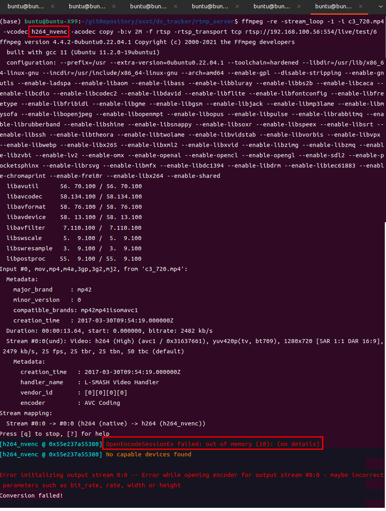

每个nvidia的gpu，它所限制编码的路数不同。[具体限制可参考](https://developer.nvidia.com/video-encode-and-decode-gpu-support-matrix-new#Encoder)。

- [nvidia限制的原理理解：突破NVIDIA NVENC并发Session数目限制](https://blog.csdn.net/charleslei/article/details/105761627)
  - 在libnvcuvid.so的汇编代码中，有关于路数的限制代码，把它改掉就ok了。
- 在把宿主机中的libnvidia-encode.so.xxx.xx.xx，libnvcuvid.so.xxx.xx.xx，copy到容器中后。
- 然后[下载补丁代码，补丁官方介绍](https://github.com/keylase/nvidia-patch#docker-support)。
- 将补丁代码中的patch.sh和docker-entrypoint.sh，拷贝到/usr/local/bin中，然后加可执行权限
- 然后执行docker-entrypoint.sh，补丁即可运行成功

```bash
cp patch.sh /usr/local/bin
cp docker-entrypoint.sh /usr/local/bin
cd /usr/local/bin
chmod +x docker-entrypoint.sh
chmod +x patch.sh
./docker-entrypoint.sh

# 测试脚本
# 声明一个可以存放ffmpeg进程的进程id数组
declare -a ffpidlist
# 开启十路编码推流程序
for i in `seq 1 10`
do
  echo "e${i}"
  ffmpeg -re -stream_loop -1 -i c3.mp4 -vcodec h264_nvenc -acodec copy -b:v 2M -f rtsp -rtsp_transport tcp rtsp://192.168.100.56:554/live/test/${i} 2> /dev/null &
  if [ $? == 0 ]; then
      echo "启动成功pid="$!
      ffpidlist[$i]=$!
  fi
  sleep 1
done
sleep 10

# 查看10个ffmpeg的运行情况，如果运行成功，即证明已经突破了编码限制
ps aux | head -1 && ps aux | grep "ffmpeg -re"
sleep 5

# 然后杀进程
for ind in `seq 1 ${#ffpidlist[@]}`
do
    echo "${ind} : ${ffpidlist[ind]}"
    kill -9 ${ffpidlist[ind]} 2> /dev/null
    sleep 1
done
echo "after kill"
ps aux | head -1 && ps aux | grep "ffmpeg -re"
```

参考:

- https://github.com/keylase/nvidia-patch#docker-support
- [突破NVIDIA NVENC并发Session数目限制](https://blog.csdn.net/charleslei/article/details/105761627)
- [docker中如何操作](https://www.553668.com/manong/427655.html)


## 其它

1. 调整ffmpeg日志调试等级

   ```c
    av_log_set_level(AV_LOG_DEBUG);
   ```

2. `[flv @ 000001C821CAC340] Using AVStream.codec to pass codec parameters to muxers is deprecated, use AVStream.codecpar instead.[flv @ 000001C821CAC340] dimensions not set`

   [参考地址](https://avmedia.0voice.com/?id=42397)

   ```c++
   AVStream *video_stream = avformat_new_stream(out_ctx, codec);
       if (!video_stream) {
           std::cerr << "Error creating video stream" << std::endl;
           return -1;
       }
   //    video_stream->codecpar->codec_type = AVMEDIA_TYPE_VIDEO;
   avcodec_parameters_from_context(video_stream->codecpar, codec_ctx);
   //    video_stream->codecpar->width = codec_ctx->width;  // Set your desired width
   //    video_stream->codecpar->height = codec_ctx->height;
   ```

3. [使用av_err2str的时候，报：error: taking address of temporary array av_make_error_string](https://blog.csdn.net/weicaijiang/article/details/123108773)

   ```c++
    /**
    * Convenience macro, the return value should be used only directly in
    * function arguments but never stand-alone.
    */
   //#define av_err2str(errnum) \
    //   av_make_error_string((char[AV_ERROR_MAX_STRING_SIZE]){0}, AV_ERROR_MAX_STRING_SIZE, errnum)
    
   //修改如下
    
    
   av_always_inline char* av_err2str(int errnum)
   {
       static char str[AV_ERROR_MAX_STRING_SIZE];
       memset(str, 0, sizeof(str));
       return av_make_error_string(str, AV_ERROR_MAX_STRING_SIZE, errnum);
   }
   
   // libavutil/error.h:132改成如上
   ```

   [参考引入ffmpeg编译错误taking address of temporary array](https://blog.csdn.net/fantasy_ARM9/article/details/112252009)

4. [ffmpeg默认情况下编译的库是静态的，如果我们想编译动态的，那么就可以加上这个选项。](https://blog.csdn.net/huweijian5/article/details/104369194)

   ```bash
   ./configure --enable-shared
   ```

   

5. 推流地址被占用

   ```bash
   ffmpeg -re -stream_loop -1 -i c3.mp4 -vcodec copy -acodec copy -b:v 2M -f rtsp -rtsp_transport tcp rtsp://192.168.100.56:554/live/test/0
   
   # 当重复的向同一地址推流时，会报以下错误
   [rtsp @ 0x5630a4103100] method ANNOUNCE failed: 406 Not Acceptable
   Could not write header for output file #0 (incorrect codec parameters ?): Server returned 4XX Client Error, but not one of 40{0,1,3,4}
   Error initializing output stream 0:0 --
   ```

   

6. ffmpeg裁剪音频

   ```bash
   # 裁剪
   ffmpeg -i 0.mp3 -ss 00:00:00 -to 00:01:17 -acodec copy 1.mp3
   ffmpeg -i 0.mp3 -ss 00:01:47 -to 00:04:35 -acodec copy 2.mp3
   # 拼接
   ffmpeg -i "concat:1.mp3|2.mp3" -acodec copy output.mp3
   ```

   

7. 

   

